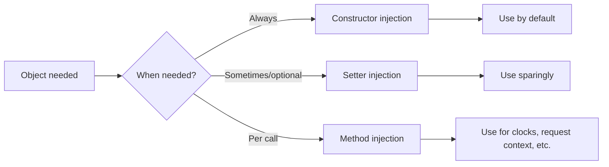
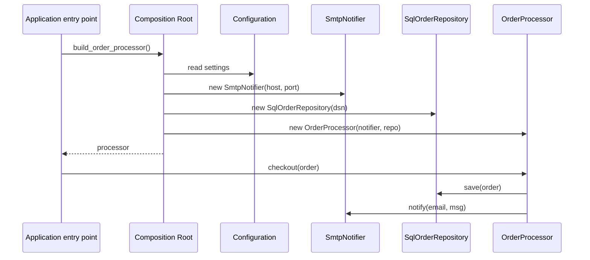
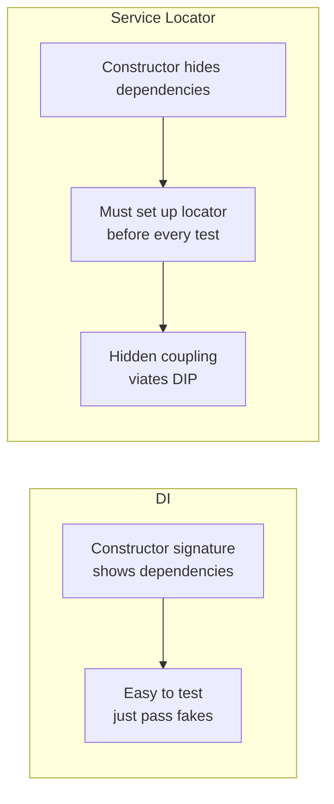

# Dependency Injection

> [!tip] The technique that makes [[solid-principles#D — Dependency Inversion Principle (DIP)|DIP]] real
> Dependency Injection (DI) is the *mechanism*. The **Dependency Inversion Principle** is the *principle*. Without DI, DIP is just a wish.

Related: [[solid-principles]] (DIP especially), [[composition-over-inheritance]], [[grasp-and-extra-principles]] (Composition Root), [[design-patterns-creational]] (Singleton's nemesis).

---

## What Is Dependency Injection?

**Dependency Injection** is a technique where an object receives its **dependencies** from the **outside**, instead of creating them itself.

> [!example] Real-world analogy
> A chef doesn't grow their own vegetables, raise their own chickens, or pump their own water. Those ingredients **arrive at the kitchen** via suppliers. The chef depends on *ingredients*, but not on any particular *farm*. Swap suppliers, and the kitchen keeps working.

In code:

```python
# Without DI — the class creates its own dependency
class OrderProcessor:
    def __init__(self):
        self._notifier = SmtpNotifier("localhost")   # tight coupling, hidden

# With DI — the dependency is given
class OrderProcessor:
    def __init__(self, notifier: Notifier):          # depends on abstraction
        self._notifier = notifier
```

The second version is **testable** (inject a fake `Notifier`), **flexible** (inject an `SmsNotifier` instead), and **honest** (the dependency is visible in the signature, not buried in the constructor).

---

## Why DI?

| Without DI                                  | With DI                                            |
| ------------------------------------------- | -------------------------------------------------- |
| Hard to test (real SMTP server needed)      | Trivial to test (inject a mock)                    |
| Coupled to concrete classes                 | Coupled to abstractions ([[solid-principles#D — Dependency Inversion Principle (DIP)|DIP]]) |
| Configuration hardcoded inside business logic | Configuration lives in one place (composition root) |
| Side effects hidden in constructors         | Side effects visible at construction time          |
| Reuse is awkward (can't swap parts)         | Reuse is composition — combine freely              |

> [!note] Inversion of Control (IoC)
> DI is one form of **IoC** — the framework/container calls *your* code, rather than your code calling the framework. With DI, you don't say "give me a `Notifier`"; you declare "I need a `Notifier`" and the **container** wires it up. Hollywood Principle: *Don't call us, we'll call you.*

---

## Three Forms of Injection

### 1. Constructor Injection (preferred)

The dependency is passed to `__init__`. The object is **inconsistent** without it — you can't construct it at all.

```python
class OrderProcessor:
    def __init__(self, notifier: Notifier, repo: OrderRepository):
        self._notifier = notifier
        self._repo = repo

    def checkout(self, order: Order) -> None:
        self._repo.save(order)
        self._notifier.notify(order.email, "thanks")
```

**Pros:** dependencies are visible, immutable, and required — no half-constructed objects.
**Cons:** constructor signatures grow with responsibilities (a smell that you may be violating [[solid-principles#S — Single Responsibility Principle (SRP)|SRP]]).

### 2. Setter Injection

The dependency is set after construction via a property or method.

```python
class OrderProcessor:
    def __init__(self) -> None:
        self._notifier: Notifier | None = None

    def set_notifier(self, notifier: Notifier) -> None:
        self._notifier = notifier

    def checkout(self, order: Order) -> None:
        assert self._notifier is not None, "notifier must be set before checkout"
        ...
```

**Pros:** useful for **optional** dependencies or when you'd otherwise have circular wiring.
**Cons:** the object can be in an **inconsistent** state until the setter is called. Requires defensive checks. Avoid by default.

### 3. Method Injection

The dependency is passed to the specific method that needs it — useful when it varies per call or is short-lived.

```python
class OrderProcessor:
    def checkout(self, order: Order, notifier: Notifier) -> None:
        ...

# Caller
processor.checkout(order, email_notifier)
processor.checkout(other_order, sms_notifier)
```

**Pros:** no shared state, perfect for **per-call** dependencies (clocks, request contexts, audit user IDs).
**Cons:** clutters the method signature; only use when the dependency really *is* per-call.

### Comparison



---

## A Simple Manual DI Example

Start with the abstraction the high-level domain needs (see [[solid-principles#D — Dependency Inversion Principle (DIP)|DIP]]):

```python
# manual_di.py
from __future__ import annotations
from abc import ABC, abstractmethod
from dataclasses import dataclass


# ---- Domain (high-level) ----
@dataclass
class Order:
    email: str
    total: float


class Notifier(ABC):
    @abstractmethod
    def notify(self, to: str, message: str) -> None: ...


class OrderRepository(ABC):
    @abstractmethod
    def save(self, order: Order) -> None: ...


class OrderProcessor:
    def __init__(self, notifier: Notifier, repo: OrderRepository):
        self._notifier = notifier
        self._repo = repo

    def checkout(self, order: Order) -> None:
        self._repo.save(order)
        self._notifier.notify(order.email, f"Your order for ${order.total:.2f} is confirmed")


# ---- Infrastructure (low-level) ----
class SmtpNotifier(Notifier):
    def __init__(self, host: str, port: int):
        self._host, self._port = host, port

    def notify(self, to: str, message: str) -> None:
        print(f"[SMTP {self._host}:{self._port}] → {to}: {message}")


class SqlOrderRepository(OrderRepository):
    def __init__(self, dsn: str):
        self._dsn = dsn

    def save(self, order: Order) -> None:
        print(f"[SQL {self._dsn}] saved order for {order.email}")


# ---- Composition root: the ONLY place that knows concrete classes ----
def build_order_processor() -> OrderProcessor:
    notifier = SmtpNotifier("smtp.example.com", 587)
    repo = SqlOrderRepository("postgresql://localhost/shop")
    return OrderProcessor(notifier, repo)


# ---- Application entry point ----
if __name__ == "__main__":
    processor = build_order_processor()
    processor.checkout(Order("alice@example.com", 99.95))
```

Output:
```
[SQL postgresql://localhost/shop] saved order for alice@example.com
[SMTP smtp.example.com:587] → alice@example.com: Your order for $99.95 is confirmed
```

> [!note] The Composition Root
> The `build_order_processor()` function is the **composition root**: the *one* place in the application that knows about concrete classes and wires them together. Everything *above* (business logic) and *below* (infrastructure) is abstract. See [[grasp-and-extra-principles]].

### Testing is now trivial

```python
class FakeNotifier(Notifier):
    def __init__(self) -> None:
        self.calls: list[tuple[str, str]] = []

    def notify(self, to: str, message: str) -> None:
        self.calls.append((to, message))


class FakeRepo(OrderRepository):
    def __init__(self) -> None:
        self.saved: list[Order] = []

    def save(self, order: Order) -> None:
        self.saved.append(order)


def test_checkout_notifies_and_persists():
    notifier = FakeNotifier()
    repo = FakeRepo()
    processor = OrderProcessor(notifier, repo)

    processor.checkout(Order("bob@example.com", 10.0))

    assert len(repo.saved) == 1
    assert notifier.calls == [("bob@example.com", "Your order for $10.00 is confirmed")]
```

No real database, no real SMTP server, no monkey-patching. The test runs in microseconds.

---

## DI Sequence Diagram



Notice: the **domain** (`OrderProcessor`) never knows about SMTP, SQL, or settings. It just *uses* abstractions handed to it.

---

## A Tiny Custom DI Container

A **container** (or DI framework) automates wiring. You declare *what* each abstraction maps to, and the container figures out the construction graph.

```python
# tiny_container.py
from __future__ import annotations
import inspect
from typing import Any, Callable, Type, TypeVar

T = TypeVar("T")


class Container:
    """A 50-line DI container with constructor injection by type hint."""

    def __init__(self) -> None:
        self._factories: dict[type, Callable[[], Any]] = {}
        self._singletons: dict[type, Any] = {}
        self._singleton_flags: set[type] = set()

    # Bind an abstraction to a concrete class (or factory).
    def bind(self, abstraction: type[T], factory: Callable[[], T], *, singleton: bool = True) -> None:
        self._factories[abstraction] = factory
        if singleton:
            self._singleton_flags.add(abstraction)

    # Resolve an abstraction, recursing into constructor dependencies.
    def resolve(self, abstraction: type[T]) -> T:
        if abstraction in self._singleton_flags and abstraction in self._singletons:
            return self._singletons[abstraction]

        factory = self._factories.get(abstraction)
        if factory is None:
            # No binding — try to instantiate directly using type hints
            instance = self._instantiate(abstraction)
        elif isinstance(factory, type):
            # factory is a concrete class — recurse to build its deps
            instance = self._instantiate(factory)
        else:
            # factory is a callable (e.g. a lambda) — just call it
            instance = factory()

        if abstraction in self._singleton_flags:
            self._singletons[abstraction] = instance
        return instance

    def _instantiate(self, cls: type[T]) -> T:
        sig = inspect.signature(cls.__init__)
        kwargs = {}
        for name, param in sig.parameters.items():
            if name == "self":
                continue
            annotation = param.annotation
            if annotation is inspect.Parameter.empty:
                if param.default is inspect.Parameter.empty:
                    raise ValueError(f"Cannot resolve {cls}.{name}: no annotation, no default")
                continue
            kwargs[name] = self.resolve(annotation)
        return cls(**kwargs)


# ---- Wiring ----
container = Container()
container.bind(Notifier, SmtpNotifier, singleton=True)        # but SmtpNotifier needs host/port!
# So use a factory lambda for things needing primitives:
container.bind(Notifier, lambda: SmtpNotifier("smtp.example.com", 587), singleton=True)
container.bind(OrderRepository, lambda: SqlOrderRepository("postgresql://localhost/shop"), singleton=True)

processor = container.resolve(OrderProcessor)
processor.checkout(Order("carol@example.com", 42.0))
```

> [!warning] This is teaching code
> The container above is intentionally minimal — no scopes, no async, no named bindings, no lifecycle hooks. For real Python projects, use a mature library (below).

---

## Using `dependency-injector` (brief)

[`dependency-injector`](https://python-dependency-injector.ets-labs.org/) is a popular, mature DI library for Python. Its core abstractions are **providers** and **containers**.

```python
# dependency_injector_example.py
from dependency_injector import containers, providers
from manual_di import OrderProcessor, SmtpNotifier, SqlOrderRepository


class Container(containers.DeclarativeContainer):
    config = providers.Configuration()

    notifier = providers.Singleton(
        SmtpNotifier,
        host=config.smtp.host,
        port=config.smtp.port,
    )
    repository = providers.Singleton(
        SqlOrderRepository,
        dsn=config.db.dsn,
    )
    order_processor = providers.Factory(
        OrderProcessor,
        notifier=notifier,
        repo=repository,
    )


# Wiring
container = Container()
container.config.from_dict({
    "smtp": {"host": "smtp.example.com", "port": 587},
    "db":   {"dsn": "postgresql://localhost/shop"},
})

processor = container.order_processor()
processor.checkout(Order("dave@example.com", 12.5))
```

### Other libraries worth knowing

| Library                | Style                                   |
| ---------------------- | --------------------------------------- |
| `dependency-injector`  | Declarative containers, providers, configs |
| `punq`                 | Lightweight, type-hint-driven           |
| `injector`             | Inspired by Google Guice                |
| `lagom`                | Function-style, partial application     |
| FastAPI's `Depends`    | Method injection per request, built-in  |

> [!tip] For most Python projects
> You don't *need* a framework. **Manual DI at the composition root is often enough** for small/medium apps. Reach for a framework when wiring gets repetitive or you need lifetimes/scopes (request-scoped, session-scoped).

---

## DI vs Service Locator

A **Service Locator** is the *anti-pattern* sibling of DI. Instead of receiving dependencies, the class **asks a global registry** for them.

```python
# service_locator.py — anti-pattern
class ServiceLocator:
    _services: dict[type, object] = {}

    @classmethod
    def register(cls, abstraction, impl): cls._services[abstraction] = impl
    @classmethod
    def get(cls, abstraction): return cls._services[abstraction]


class OrderProcessor:
    def checkout(self, order: Order) -> None:
        notifier = ServiceLocator.get(Notifier)        # 👎 hidden dependency
        notifier.notify(order.email, "...")
```

### Why Service Locator is worse than DI



| Trait                          | DI                                  | Service Locator                  |
| ------------------------------ | ----------------------------------- | -------------------------------- |
| Dependencies visible           | ✅ In `__init__` signature          | ❌ Hidden inside method bodies   |
| Testability                    | Easy — pass fakes                   | Must configure locator first     |
| Coupling to container          | None (object is plain)              | Coupled to `ServiceLocator`      |
| Fail-fast                      | At construction time                | At first method call (often runtime) |
| Encourages [[solid-principles#D — Dependency Inversion Principle (DIP)|DIP]] | ✅ Yes | ❌ No |

> [!danger] The Service Locator trap
> A Service Locator is **a Singleton dressed up as DI**. It is sometimes a useful *interim* step (e.g. during a migration), but it carries the same hidden-global-state problems. Use it sparingly, and migrate away.

---

## DI in the Wild: FastAPI's `Depends`

FastAPI makes method-level DI ergonomic:

```python
# fastapi_di.py
from fastapi import Depends, FastAPI

app = FastAPI()


class UserRepository:
    def find(self, user_id: int) -> dict:
        return {"id": user_id, "name": "Alice"}


def get_user_repository() -> UserRepository:
    return UserRepository()


@app.get("/users/{user_id}")
def read_user(user_id: int, repo: UserRepository = Depends(get_user_repository)):
    return repo.find(user_id)
```

The handler's dependency is **declared** via `Depends`, resolved per request, and can be overridden in tests with a fake. This is **method injection** with a tiny container built into the framework.

---

## Common Pitfalls

> [!danger] Pitfalls to avoid

1. **Constructor doing real work.** If `__init__` opens connections, reads files, or makes network calls, you've coupled construction to side effects. Construct objects *pure*; connect later via a `start()` method.
2. **Injecting concretes.** If you inject `SmtpNotifier` directly into `OrderProcessor`, you've only done half the job. Inject `Notifier` (the abstraction).
3. **DI framework everywhere.** Don't wire up a container for a 200-line script. Manual DI at the composition root is fine.
4. **Service Locator disguised as DI.** If your constructor takes a `Container` and pulls things out, that's a Service Locator.
5. **God constructor.** A class that takes 8 dependencies is violating [[solid-principles#S — Single Responsibility Principle (SRP)|SRP]]. Split the class.
6. **Circular dependencies.** If A needs B and B needs A, your design has a smell. Extract a third collaborator C that both depend on, or rethink boundaries.
7. **Forgetting the composition root.** If concrete-class `new`s are scattered through your code, you don't actually have DI — you have a wish.

---

## Key Takeaways

1. **DI = give an object its dependencies** rather than letting it fetch them.
2. **Constructor injection is the default**; setter and method injection have narrow niches.
3. **The composition root** is the *only* place that should know about concrete classes. See [[grasp-and-extra-principles]].
4. **DI makes testing trivial** — no monkey-patching, no real network, just pass a fake.
5. **DI makes DIP real**: high-level modules depend on abstractions they own, low-level modules implement them.
6. **Manual DI** is often enough for small/medium apps; reach for a framework when wiring becomes repetitive or you need scopes.
7. **Avoid Service Locator** — it's DI's evil twin, with all the same hidden-global-state problems as Singleton.
8. **DI + [[composition-over-inheritance]] + [[solid-principles]]** is the trifecta of maintainable OO design.

---

## Practice Exercises

> [!exercise] 1. Spot the smell
> ```python
> class UserService:
>     def __init__(self):
>         self._db = psycopg2.connect(...)
>         self._logger = logging.getLogger("app")
>         self._cache = redis.Redis(...)
> ```
> List the problems. Refactor to constructor injection with abstractions.

> [!exercise] 2. Composition root
> Take a small script you've written that imports concrete classes inside functions. Move all `new`s to a single `build_app()` function at the entry point. What becomes easier to test?

> [!exercise] 3. Three forms
> Implement a `Clock` dependency for an `AuditLogger`. Show (a) constructor injection, (b) setter injection, (c) method injection. When would each be appropriate?

> [!exercise] 4. Tiny container
> Extend the tiny custom container above with: (a) named bindings (`bind(Notifier, "email", ...)`, `bind(Notifier, "sms", ...)`), (b) transient (non-singleton) lifetime, (c) a `resolve_all(Notifier)` that returns every binding.

> [!exercise] 5. DI vs Service Locator
> Write a `PasswordResetService` using a Service Locator, then refactor it to constructor injection. Write the unit test for each version. Which is cleaner?

> [!exercise] 6. FastAPI Depends
> Build a FastAPI app where the `UserRepository` is resolved via `Depends`. Then write a test using `app.dependency_overrides` to swap it for a fake.

> [!exercise] 7. Circular dependency
> Design `OrderService` and `InventoryService` that need to call each other. Refactor to break the cycle (hint: extract an event or a domain service).

> [!exercise] 8. Lifecycle
> Some dependencies are **singletons** (one per process); others are **request-scoped** (one per HTTP request); others are **transient** (new every time). Give a real example of each and explain where you'd configure them.

> [!exercise] 9. Diagram
> Draw a Mermaid sequence diagram of your own app's bootstrap: from `main()` through the composition root to the first business call. Mark every arrow that crosses an abstraction boundary.

> [!exercise] 10. Reflection
> In your own words: why is "passing the dependency in" better than "looking the dependency up", even though they look like the same amount of code?

---

Next: [[grasp-and-extra-principles]] | [[solid-principles]] | [[composition-over-inheritance]] | [[design-patterns-creational]]
