# Design Patterns — Behavioral

> [!note] What you'll learn
> Behavioral patterns are about **communication between objects** — *who* talks to *whom*, *when*, and *how*. They assign responsibility and define protocols for collaboration.

Related: [[solid-principles]], [[composition-over-inheritance]], [[design-patterns-creational]], [[design-patterns-structural]], [[grasp-and-extra-principles]].

---

## Quick Map

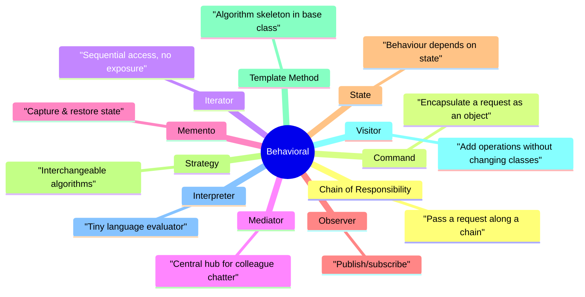

---

## 1. Chain of Responsibility

**Intent:** Pass a request along a chain of handlers. Each handler decides either to **handle** the request or **pass it on**.

### Structure

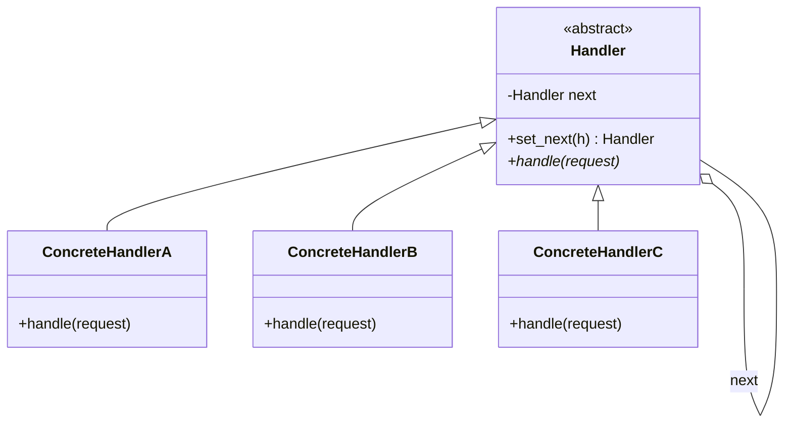

### Python Implementation

```python
# chain_of_responsibility.py
from __future__ import annotations
from abc import ABC, abstractmethod


class Handler(ABC):
    def __init__(self) -> None:
        self._next: Handler | None = None

    def set_next(self, handler: "Handler") -> "Handler":
        self._next = handler
        return handler                  # enable chaining: a.set_next(b).set_next(c)

    def handle(self, request: str) -> str | None:
        if self._next:
            return self._next.handle(request)
        return None                     # end of chain

    @abstractmethod
    def _process(self, request: str) -> str | None: ...


class Tier1Support(Handler):
    def _process(self, request: str) -> str | None:
        if "password" in request:
            return f"Tier1: reset password for '{request}'"
        return None

    def handle(self, request: str) -> str | None:
        result = self._process(request)
        return result if result is not None else super().handle(request)


class Tier2Support(Handler):
    def _process(self, request: str) -> str | None:
        if "billing" in request:
            return f"Tier2: billing issue for '{request}'"
        return None

    def handle(self, request: str) -> str | None:
        result = self._process(request)
        return result if result is not None else super().handle(request)


class Tier3Support(Handler):
    def _process(self, request: str) -> str | None:
        return f"Tier3: escalated '{request}' to engineering"

    def handle(self, request: str) -> str | None:
        return self._process(request)        # always handles


# Build chain
t1, t2, t3 = Tier1Support(), Tier2Support(), Tier3Support()
t1.set_next(t2).set_next(t3)

print(t1.handle("reset my password please"))  # Tier1: ...
print(t1.handle("billing charge looks wrong")) # Tier2: ...
print(t1.handle("server is on fire"))          # Tier3: ...
```

### Pythonic variant — function chain

```python
from collections.abc import Callable

def chain(*handlers: Callable[[str], str | None]) -> Callable[[str], str | None]:
    def runner(request: str) -> str | None:
        for h in handlers:
            result = h(request)
            if result is not None:
                return result
        return None
    return runner
```

### When to use

- More than one object may handle a request, **decided at runtime**.
- You want to **decouple** sender from receiver.
- The set of handlers should be **reconfigurable**.

### Pitfalls

- A request can **fall off the end** silently. Always have a terminal handler.
- Long chains are hard to debug. Log "passing through X" at each step.

---

## 2. Command

**Intent:** Encapsulate a request as an object, thereby letting you **parameterise** clients with different requests, **queue** or **log** requests, and support **undoable** operations.

### Structure

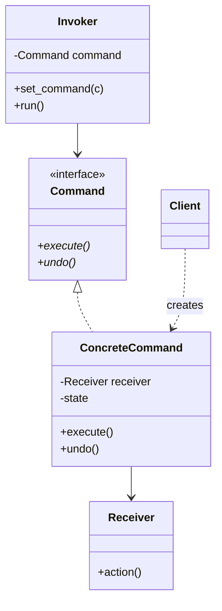

### Python Implementation — with undo

```python
# command.py
from __future__ import annotations
from abc import ABC, abstractmethod


class Light:                                  # Receiver
    def turn_on(self) -> str:  return "Light on"
    def turn_off(self) -> str: return "Light off"


class Command(ABC):                          # Command interface
    @abstractmethod
    def execute(self) -> str: ...
    @abstractmethod
    def undo(self) -> str: ...


class TurnOnCommand(Command):
    def __init__(self, light: Light):
        self._light = light

    def execute(self) -> str: return self._light.turn_on()
    def undo(self) -> str:    return self._light.turn_off()


class TurnOffCommand(Command):
    def __init__(self, light: Light):
        self._light = light

    def execute(self) -> str: return self._light.turn_off()
    def undo(self) -> str:    return self._light.turn_on()


class RemoteControl:                         # Invoker
    def __init__(self) -> None:
        self._history: list[Command] = []

    def execute(self, cmd: Command) -> str:
        result = cmd.execute()
        self._history.append(cmd)
        return result

    def undo_last(self) -> str:
        if not self._history:
            return "Nothing to undo"
        return self._history.pop().undo()


# Client
light = Light()
remote = RemoteControl()
print(remote.execute(TurnOnCommand(light)))   # Light on
print(remote.execute(TurnOffCommand(light)))  # Light off
print(remote.undo_last())                     # Light on
print(remote.undo_last())                     # Light off
```

### Pythonic shortcut — lambdas / callables

When you don't need undo, a `Callable` is a command:

```python
from collections.abc import Callable
Command = Callable[[], str]

remote: list[Command] = []
remote.append(lambda: light.turn_on())
remote.append(lambda: light.turn_off())
print([c() for c in remote])
```

### When to use

- **Undo/redo** systems.
- **Queued** or **scheduled** operations (job queues, macros).
- **Macro recording** (sequence of commands stored as a script).

### Pitfalls

- Command classes proliferate fast. Use callables where undo isn't needed.
- Undo can be hard: think about whether each command can truly be reversed (e.g. send-email → cannot unsend).

---

## 3. Iterator

**Intent:** Provide a way to **access the elements of an aggregate object sequentially** without exposing its underlying representation.

### Python's deep integration

Python builds the Iterator pattern into the language: `for x in obj` calls `iter(obj)` which calls `obj.__iter__()`, returning an iterator; the loop then calls `__next__()` until `StopIteration`.

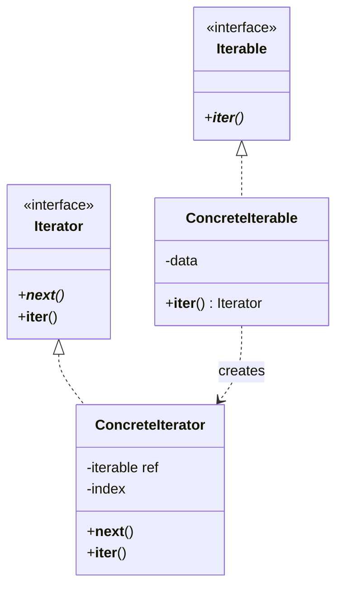

### Python Implementation — `__iter__` / `__next__`

```python
# iterator.py
from collections.abc import Iterator


class BinaryTree:
    def __init__(self, value, left=None, right=None):
        self.value = value
        self.left = left
        self.right = right


class InOrderIterator(Iterator):
    """In-order DFS: left → node → right."""
    def __init__(self, root: BinaryTree | None):
        self._stack: list[BinaryTree] = []
        self._push_left(root)

    def _push_left(self, node: BinaryTree | None) -> None:
        while node is not None:
            self._stack.append(node)
            node = node.left

    def __iter__(self) -> "InOrderIterator":
        return self

    def __next__(self) -> int:
        if not self._stack:
            raise StopIteration
        node = self._stack.pop()
        self._push_left(node.right)
        return node.value


class TreeIterable:
    """Adapter giving a BinaryTree an __iter__ method."""
    def __init__(self, root: BinaryTree):
        self._root = root

    def __iter__(self) -> InOrderIterator:
        return InOrderIterator(self._root)


#        4
#       / \
#      2   6
#     / \ / \
#    1  3 5  7
tree = BinaryTree(4,
    BinaryTree(2, BinaryTree(1), BinaryTree(3)),
    BinaryTree(6, BinaryTree(5), BinaryTree(7)))

print(list(TreeIterable(tree)))   # [1, 2, 3, 4, 5, 6, 7]
```

### Generators — iterators for free

Most of the time, **use a generator**:

```python
def in_order(node: BinaryTree | None):
    if node is None:
        return
    yield from in_order(node.left)
    yield node.value
    yield from in_order(node.right)

print(list(in_order(tree)))       # [1, 2, 3, 4, 5, 6, 7]
```

> [!tip] Prefer generators
> A `yield` function *is* an iterator factory — Python builds the `__iter__`/`__next__`/`StopIteration` machinery for you. Reach for the explicit class form only when you need stateful control (e.g. resumable cursors, parallel iteration).

### When to use

- You want **multiple traversal strategies** (in-order, pre-order, BFS) without bloating the aggregate.
- You want **lazy** access (read a 100 GB file line by line).

### Pitfalls

- Iterators are **single-use** — calling `next(it)` again after exhaustion just keeps raising `StopIteration`. Re-iterate by calling `iter()` again.
- Mixing generators and explicit return values: `return value` inside a generator becomes `raise StopIteration(value)` — confusing.

---

## 4. Mediator

**Intent:** Define an object that **encapsulates how a set of objects interact**. Mediator promotes loose coupling by keeping objects from referring to each other explicitly.

> [!example] Real-world analogy
> An **air traffic control tower**. Planes don't talk to each other ("Hey, are you landing on runway 27?"); they talk to the tower, which coordinates. N planes ↔ 1 tower instead of N² plane-to-plane channels.

### Structure

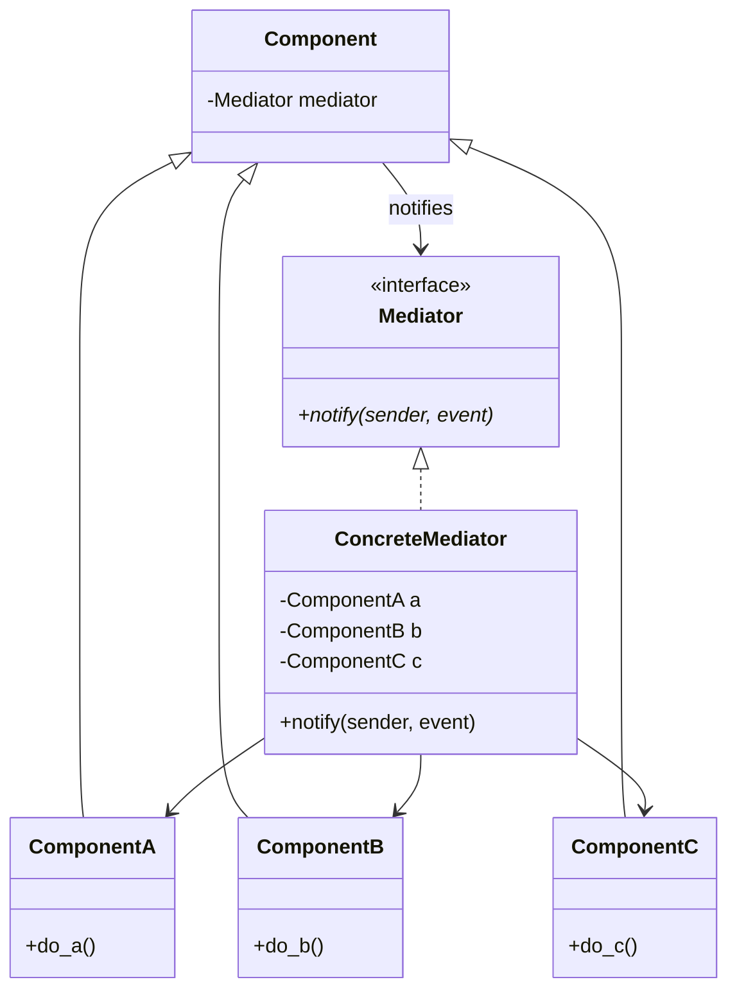

### Python Implementation

```python
# mediator.py
from __future__ import annotations
from typing import TYPE_CHECKING

if TYPE_CHECKING:
    from collections.abc import Callable


class Mediator:
    """Base class with a tiny event bus."""
    def __init__(self) -> None:
        self._handlers: dict[str, list["Callable"]] = {}

    def subscribe(self, event: str, handler: "Callable") -> None:
        self._handlers.setdefault(event, []).append(handler)

    def publish(self, event: str, *args, **kwargs) -> None:
        for h in self._handlers.get(event, []):
            h(*args, **kwargs)


class Button:
    def __init__(self, label: str, mediator: Mediator) -> None:
        self.label = label
        self._mediator = mediator

    def click(self) -> None:
        print(f"[{self.label}] clicked")
        self._mediator.publish("click", self.label)


class TextBox:
    def __init__(self, mediator: Mediator) -> None:
        self._mediator = mediator
        self._text = ""

    def set_text(self, text: str) -> None:
        self._text = text
        print(f"[TextBox] text='{self._text}'")
        self._mediator.publish("text_changed", self._text)


class Dialog:
    """Concrete mediator: wires components and encodes the rules."""
    def __init__(self) -> None:
        self.mediator = Mediator()
        self.button = Button("Submit", self.mediator)
        self.box = TextBox(self.mediator)
        self._wire()

    def _wire(self) -> None:
        self.mediator.subscribe("text_changed", self._on_text_changed)
        self.mediator.subscribe("click", self._on_click)

    def _on_text_changed(self, text: str) -> None:
        # Rule: button is "active" only if textbox has content
        state = "enabled" if text else "disabled"
        print(f"[Dialog] button {state}")

    def _on_click(self, label: str) -> None:
        print(f"[Dialog] handling click on '{label}'")


# Client
dialog = Dialog()
dialog.box.set_text("hello")     # button enabled
dialog.button.click()
dialog.box.set_text("")          # button disabled
```

### When to use

- Many components communicate in complex ways (GUIs, chat rooms, event-driven systems).
- You want to **reuse components** in different contexts without rewiring.

### Pitfalls

- The Mediator can become a **god object**. Split mediators by bounded context.
- Observer and Mediator look similar — Observer is *broadcast*, Mediator is *coordination with rules*.

---

## 5. Memento

**Intent:** Capture and externalise an object's **internal state** so the object can be restored to that state later, **without violating encapsulation**.

### Structure

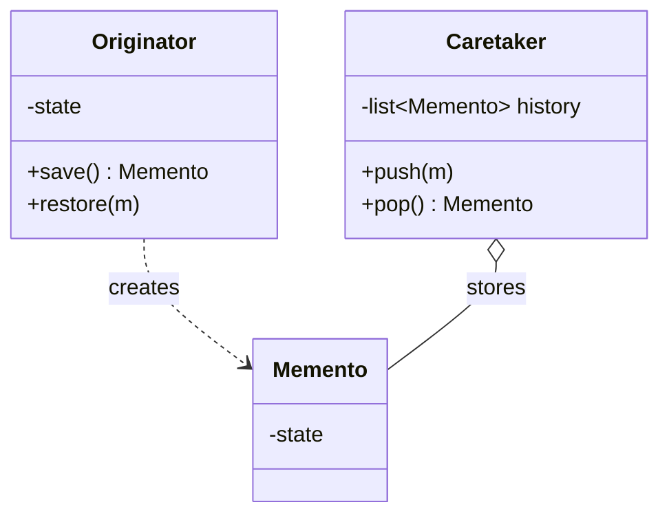

### Python Implementation

```python
# memento.py
from __future__ import annotations
from dataclasses import dataclass, asdict
import copy


@dataclass(frozen=True)
class EditorMemento:                     # Immutable snapshot
    text: str
    cursor: int


class TextEditor:                       # Originator
    def __init__(self) -> None:
        self._text: str = ""
        self._cursor: int = 0

    @property
    def text(self) -> str: return self._text

    def type(self, s: str) -> None:
        self._text = self._text[:self._cursor] + s + self._text[self._cursor:]
        self._cursor += len(s)

    def move_cursor(self, pos: int) -> None:
        self._cursor = max(0, min(pos, len(self._text)))

    def backspace(self) -> None:
        if self._cursor == 0:
            return
        self._text = self._text[:self._cursor - 1] + self._text[self._cursor:]
        self._cursor -= 1

    def save(self) -> EditorMemento:
        return EditorMemento(self._text, self._cursor)

    def restore(self, m: EditorMemento) -> None:
        self._text = m.text
        self._cursor = m.cursor


class History:                          # Caretaker
    def __init__(self) -> None:
        self._stack: list[EditorMemento] = []

    def push(self, m: EditorMemento) -> None:
        self._stack.append(m)

    def pop(self) -> EditorMemento | None:
        return self._stack.pop() if self._stack else None


# Client
editor = TextEditor()
history = History()

history.push(editor.save())
editor.type("Hello ")
history.push(editor.save())
editor.type("World")
editor.backspace()
print(editor.text)              # "Hello Wor"

editor.restore(history.pop())   # back to "Hello "
print(editor.text)              # "Hello "
```

### When to use

- **Undo/redo**, **snapshots**, **transactional** changes (database migrations).
- You must **persist** state for restore but the fields are private.

### Pitfalls

- Mementos can be **large** (deep snapshots). Consider delta-based or structural sharing.
- Don't expose mutable state via the memento — make it frozen.

---

## 6. Observer (Publish/Subscribe)

**Intent:** Define a **one-to-many** dependency so that when one object changes state, all its dependents are notified automatically.

### Structure

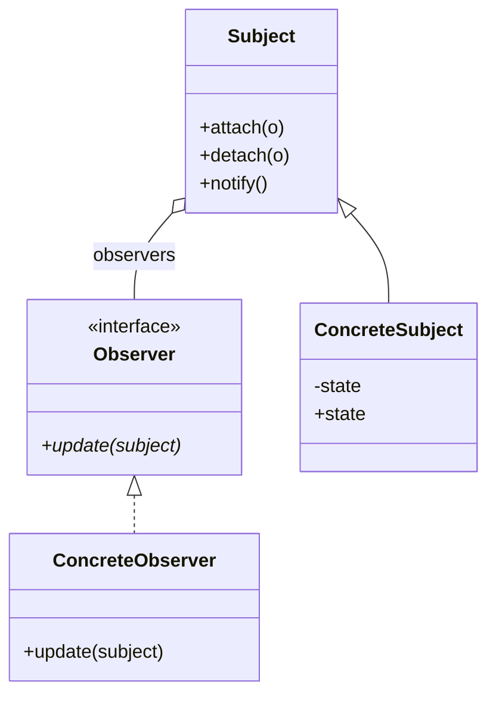

### Python Implementation — with `__iadd__` sugar

```python
# observer.py
from __future__ import annotations
from collections.abc import Callable
from dataclasses import dataclass, field


@dataclass
class Signal:
    """A tiny pub/sub: observers are callables."""
    _subscribers: list[Callable[..., None]] = field(default_factory=list)

    def subscribe(self, fn: Callable[..., None]) -> Callable[..., None]:
        self._subscribers.append(fn)
        return fn                              # so it works as a decorator

    def __iadd__(self, fn: Callable[..., None]) -> "Signal":   # signal += fn
        self._subscribers.append(fn)
        return self

    def __isub__(self, fn: Callable[..., None]) -> "Signal":   # signal -= fn
        self._subscribers.remove(fn)
        return self

    def emit(self, *args, **kwargs) -> None:
        for fn in list(self._subscribers):    # copy: subscribers may unsubscribe
            fn(*args, **kwargs)


@dataclass
class Thermometer:
    temperature: float = 0.0
    changed: Signal = field(default_factory=Signal)

    @property
    def temperature(self) -> float: return self._temperature
    @temperature.setter
    def temperature(self, value: float) -> None:
        self._temperature = value
        self.changed.emit(value)


# Observers
def display(value: float) -> None:
    print(f"[Display] temperature = {value}°C")

def alarm(value: float) -> None:
    if value > 100:
        print(f"[ALARM] too hot: {value}°C!")


therm = Thermometer()
therm.changed += display
therm.changed += alarm

therm.temperature = 25      # [Display] temperature = 25°C
therm.temperature = 105     # [Display] ... + [ALARM] too hot: 105°C!
```

### Variants

- **Push model** — the subject passes data to `update(data)`. (Above.)
- **Pull model** — the subject calls `update(self)` and observers query the subject. Better when observers need different data.

> [!tip] Use existing libraries
> In production, reach for `pydispatcher`, `blinker`, or just `asyncio` for async pub/sub. Don't roll your own if you need thread-safety, weak references, or queued delivery.

### When to use

- **Event-driven** systems (GUIs, IoT, message buses).
- Loose coupling between a **data source** and many **consumers**.
- MVC architectures: the model is the subject, views are observers.

### Pitfalls

- **Memory leaks** — observers keep subjects alive. Use weak references or explicit unsubscribe.
- **Order of notification** is not guaranteed; don't rely on it.
- **Cascading updates** — observer A's update triggers a state change in B, which notifies A again → infinite loop. Break the cycle with a "currently notifying" guard.

---

## 7. State

**Intent:** Allow an object to **alter its behaviour when its internal state changes** — the object will appear to *change its class*.

> [!example] Real-world analogy
> A vending machine. Insert a coin in the *idle* state → transitions to *has-coin* state. In *has-coin*, pushing a button dispenses and returns to *idle*. The same button does different things in different states.

### Structure

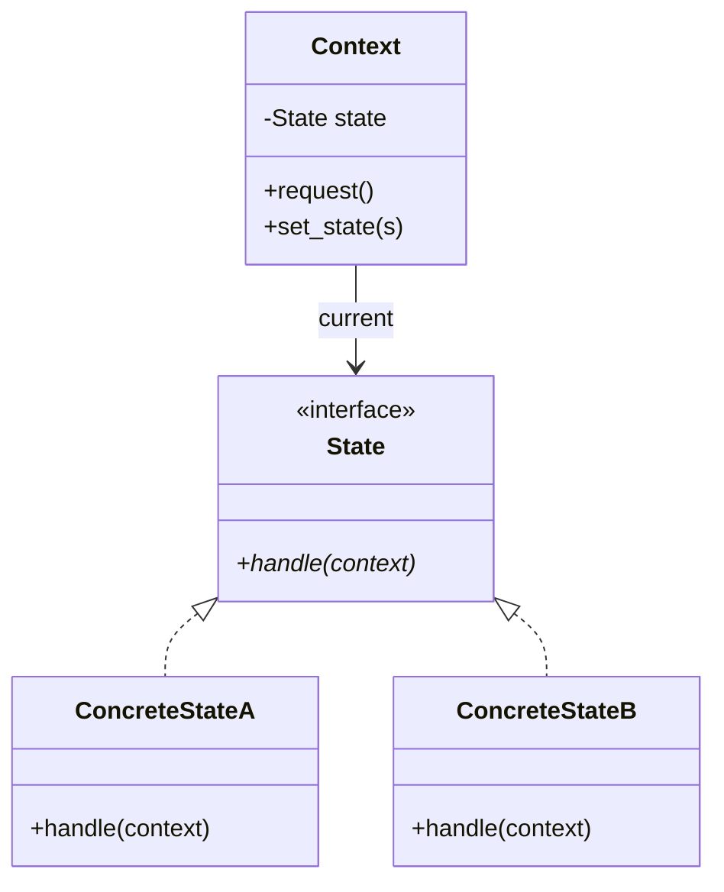

### Python Implementation

```python
# state.py
from __future__ import annotations
from abc import ABC, abstractmethod


class VendingMachine:                  # Context
    def __init__(self):
        self._stock = 3
        self._state: State = IdleState()

    @property
    def stock(self) -> int: return self._stock

    @stock.setter
    def stock(self, value: int) -> None: self._stock = value

    def set_state(self, state: "State") -> None:
        self._state = state

    def insert_coin(self) -> None: self._state.insert_coin(self)
    def press_button(self) -> None: self._state.press_button(self)


class State(ABC):
    @abstractmethod
    def insert_coin(self, machine: VendingMachine) -> None: ...
    @abstractmethod
    def press_button(self, machine: VendingMachine) -> None: ...


class IdleState(State):
    def insert_coin(self, m: VendingMachine) -> None:
        print("Coin inserted.")
        m.set_state(HasCoinState())

    def press_button(self, m: VendingMachine) -> None:
        print("Insert a coin first.")


class HasCoinState(State):
    def insert_coin(self, m: VendingMachine) -> None:
        print("Coin already inserted; returning extra coin.")

    def press_button(self, m: VendingMachine) -> None:
        if m.stock == 0:
            print("Out of stock; returning coin.")
            m.set_state(IdleState())
            return
        m.stock -= 1
        print(f"Dispensed! Stock left: {m.stock}")
        m.set_state(IdleState())


# Client
vm = VendingMachine()
vm.insert_coin()       # Coin inserted.
vm.press_button()      # Dispensed! Stock left: 2
vm.press_button()      # Insert a coin first.
```

> [!tip] State vs Strategy
> They look identical in UML. The difference is *intent*:
> - **Strategy**: the *client* chooses the algorithm; objects are usually stateless.
> - **State**: the *object itself* transitions between states; state objects may be stateful or share context.

### Pythonic variant — methods as state

For tiny FSMs, use functions or enums:

```python
from enum import Enum, auto

class S(Enum):
    IDLE = auto(); HAS_COIN = auto()

class Vending:
    def __init__(self): self.state = S.IDLE; self.stock = 3
    def insert_coin(self):
        if self.state is S.IDLE: self.state = S.HAS_COIN; print("coin in")
        else: print("already has coin")
    def press_button(self):
        if self.state is S.HAS_COIN and self.stock > 0:
            self.stock -= 1; self.state = S.IDLE; print("dispensed")
        else: print("nothing happens")
```

### When to use

- An object's behaviour depends on its state, and there are **many state-specific actions**.
- State transitions are non-trivial and you want them **explicit and testable**.

### Pitfalls

- State proliferation — keep states focused. Split into sub-FSMs if needed.
- Each state class needs to know which state to transition to → some coupling. A transition table is the alternative.

---

## 8. Strategy

**Intent:** Define a family of algorithms, encapsulate each one, and make them **interchangeable**. Strategy lets the algorithm vary independently from clients that use it.

### Structure

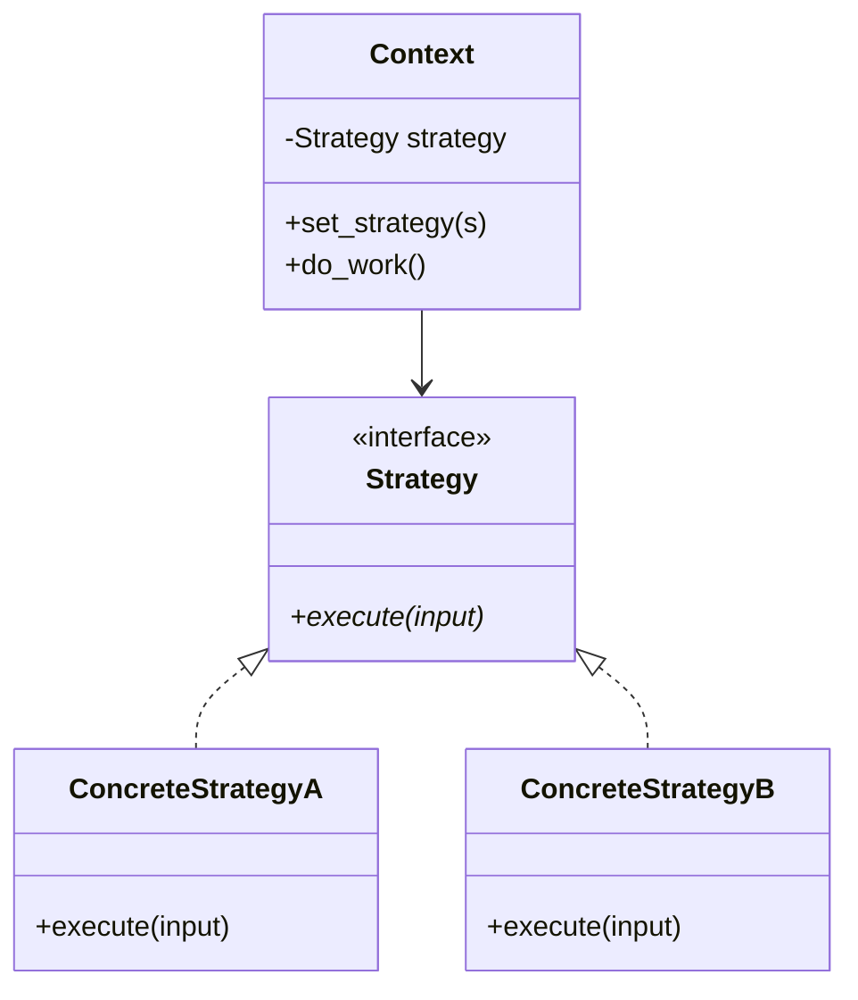

### Python Implementation — classic

```python
# strategy.py
from __future__ import annotations
from abc import ABC, abstractmethod


class PricingStrategy(ABC):
    @abstractmethod
    def price(self, base: float) -> float: ...


class FullPrice(PricingStrategy):
    def price(self, base: float) -> float: return base


class StudentDiscount(PricingStrategy):
    def price(self, base: float) -> float: return base * 0.8


class SeniorDiscount(PricingStrategy):
    def price(self, base: float) -> float: return base * 0.7


class BlackFriday(PricingStrategy):
    def price(self, base: float) -> float: return base * 0.5


class CashRegister:
    def __init__(self, strategy: PricingStrategy):
        self._strategy = strategy

    def set_strategy(self, strategy: PricingStrategy) -> None:
        self._strategy = strategy

    def checkout(self, base: float) -> float:
        return self._strategy.price(base)


register = CashRegister(FullPrice())
print(register.checkout(100))    # 100
register.set_strategy(StudentDiscount())
print(register.checkout(100))    # 80.0
register.set_strategy(BlackFriday())
print(register.checkout(100))    # 50.0
```

### Pythonic shortcut — first-class functions

When the strategy has no state and one method, **a function is the strategy**:

```python
# strategy_functions.py
from collections.abc import Callable

def full_price(base: float) -> float: return base
def student(base: float) -> float:   return base * 0.8
def senior(base: float) -> float:    return base * 0.7
def black_friday(base: float) -> float: return base * 0.5

class CashRegister:
    def __init__(self, strategy: Callable[[float], float] = full_price):
        self._strategy = strategy
    def set_strategy(self, s: Callable[[float], float]) -> None:
        self._strategy = s
    def checkout(self, base: float) -> float:
        return self._strategy(base)

reg = CashRegister(student)
print(reg.checkout(100))   # 80.0
```

### With `functools` — partial application as strategy

```python
import functools

def discount(factor: float, base: float) -> float:
    return base * factor

black_friday = functools.partial(discount, 0.5)
senior       = functools.partial(discount, 0.7)

reg.set_strategy(black_friday)
print(reg.checkout(100))   # 50.0
```

> [!note] Strategy in the stdlib
> `sorted(iterable, key=...)` is Strategy: `key` is the algorithm. `list.sort(key=str.lower)` swaps strategy without subclassing `list`.

### When to use

- You have **multiple variants** of an algorithm and want to swap them at runtime.
- You want to avoid `if/elif` chains over "mode".
- You want to isolate algorithm-specific data behind a clean interface.

### Pitfalls

- The client usually has to **know which strategy to pick** — that decision logic can leak.
- A `Strategy` with *one method and no state* is just a function — don't over-OOP it.

---

## 9. Template Method

**Intent:** Define the **skeleton** of an algorithm in a base class, deferring some steps to subclasses. Template Method lets subclasses **redefine** certain steps **without changing** the algorithm's structure.

> [!warning] Template Method relies on inheritance — use it judiciously
> It's the canonical example of "inheritance for behaviour reuse". It often violates [[solid-principles#L — Liskov Substitution Principle (LSP)|LSP]] when subclasses override steps in incompatible ways. Consider [[composition-over-inheritance]] (Strategy) when in doubt.

### Structure

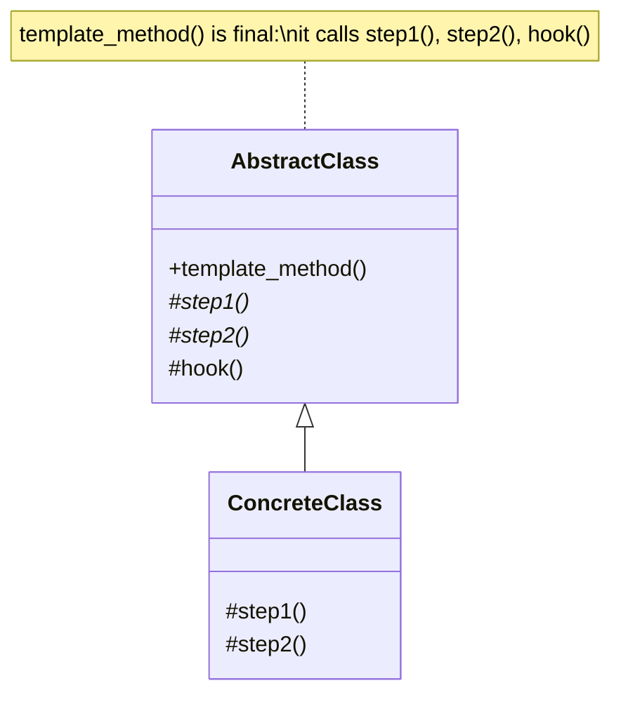

### Python Implementation

```python
# template_method.py
from __future__ import annotations
from abc import ABC, abstractmethod


class DataMiner(ABC):
    """Skeleton: open → extract → parse → analyse → report."""
    def mine(self, path: str) -> str:                  # template method
        raw = self.open(path)
        data = self.extract(raw)
        parsed = self.parse(data)
        analysis = self.analyse(parsed)
        return self.report(analysis)

    @abstractmethod
    def open(self, path: str) -> bytes: ...
    @abstractmethod
    def extract(self, raw: bytes) -> str: ...
    @abstractmethod
    def parse(self, data: str) -> dict: ...

    def analyse(self, parsed: dict) -> str:            # shared step
        return f"analysed {len(parsed)} entries"

    def report(self, analysis: str) -> str:            # hook, overridable
        return f"REPORT: {analysis}"


class PdfMiner(DataMiner):
    def open(self, p: str) -> bytes:  return b"%PDF-1.4 ..."
    def extract(self, raw: bytes) -> str: return raw.decode("latin-1", "ignore")
    def parse(self, data: str) -> dict: return {"page_count": data.count("PDF")}


class CsvMiner(DataMiner):
    def open(self, p: str) -> bytes:  return b"a,b,c\n1,2,3\n4,5,6"
    def extract(self, raw: bytes) -> str: return raw.decode()
    def parse(self, data: str) -> dict:
        rows = [r.split(",") for r in data.strip().splitlines()]
        return {"rows": rows}

    def report(self, analysis: str) -> str:            # override hook
        return f"CSV REPORT — {analysis}"


# Client
print(PdfMiner().mine("doc.pdf"))   # REPORT: analysed 1 entries
print(CsvMiner().mine("data.csv"))  # CSV REPORT — analysed 1 entries
```

### When to use

- Algorithms with a **fixed skeleton** but **variable steps**.
- You want to **enforce** ordering once and let subclasses fill in pieces.
- Cross-cutting hooks ("before"/"after") that subclasses may override.

### Pitfalls

- Subclasses can override anything not marked final (Python doesn't enforce this — convention: `_` prefix or `Final`).
- Inverted control can confuse new readers: "who calls whom?"
- Composition alternative (Strategy) often ages better. See [[composition-over-inheritance]] for the trade-off.

---

## 10. Visitor

**Intent:** Represent an operation to be performed on the elements of an object structure. Visitor lets you **add new operations** without changing the classes of the elements.

### The "double dispatch" idea

Python is single-dispatch (method chosen by the receiver's class). Visitor **simulates double dispatch**: the operation chosen depends on *both* the element type *and* the visitor type.

### Structure

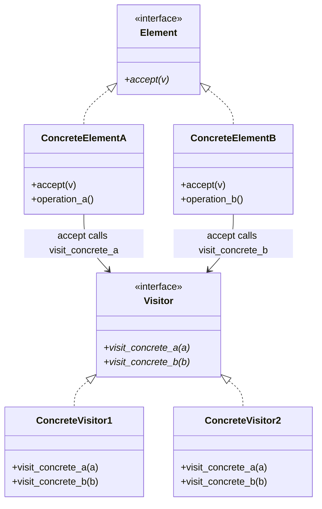

### Python Implementation

```python
# visitor.py
from __future__ import annotations
from abc import ABC, abstractmethod
from dataclasses import dataclass


class ShapeVisitor(ABC):
    @abstractmethod
    def visit_circle(self, c: "Circle") -> str: ...
    @abstractmethod
    def visit_rectangle(self, r: "Rectangle") -> str: ...
    @abstractmethod
    def visit_triangle(self, t: "Triangle") -> str: ...


class Shape(ABC):
    @abstractmethod
    def accept(self, v: ShapeVisitor) -> str: ...     # double dispatch


@dataclass
class Circle(Shape):
    radius: float
    def accept(self, v: ShapeVisitor) -> str:
        return v.visit_circle(self)                   # 1st dispatch → 2nd


@dataclass
class Rectangle(Shape):
    width: float
    height: float
    def accept(self, v: ShapeVisitor) -> str:
        return v.visit_rectangle(self)


@dataclass
class Triangle(Shape):
    base: float
    height: float
    def accept(self, v: ShapeVisitor) -> str:
        return v.visit_triangle(self)


# --- Concrete visitors: new operations don't touch Shape classes ---

class AreaCalculator(ShapeVisitor):
    def visit_circle(self, c: Circle) -> str:
        import math
        return f"Circle area = {math.pi * c.radius ** 2:.2f}"
    def visit_rectangle(self, r: Rectangle) -> str:
        return f"Rectangle area = {r.width * r.height:.2f}"
    def visit_triangle(self, t: Triangle) -> str:
        return f"Triangle area = {0.5 * t.base * t.height:.2f}"


class XmlExporter(ShapeVisitor):
    def visit_circle(self, c: Circle) -> str:
        return f"<circle radius='{c.radius}'/>"
    def visit_rectangle(self, r: Rectangle) -> str:
        return f"<rect w='{r.width}' h='{r.height}'/>"
    def visit_triangle(self, t: Triangle) -> str:
        return f"<tri base='{t.base}' h='{t.height}'/>"


# Client
shapes: list[Shape] = [Circle(2), Rectangle(3, 4), Triangle(6, 2)]
for s in shapes:
    print(s.accept(AreaCalculator()))
# Circle area = 12.57
# Rectangle area = 12.00
# Triangle area = 6.00

for s in shapes:
    print(s.accept(XmlExporter()))
# <circle radius='2.0'/>
# <rect w='3.0' h='4.0'/>
# <tri base='6.0' h='2.0'/>
```

> [!tip] Pythonic alternative — `singledispatch`
> `functools.singledispatch` lets you add functions per-type without a Visitor class. For *single* dispatch it's cleaner; for *true double dispatch* (operation depends on two types), Visitor still wins.

### When to use

- You want to **add operations** to a stable class hierarchy without modifying it ([[solid-principles#O — Open/Closed Principle (OCP)|OCP]]).
- The class hierarchy is **closed** (new element types are rare) but operations are added often.
- Compilers, ASTs, document object models.

### Pitfalls

- Adding a **new element type** requires editing *every* visitor — opposite of OCP. Use Visitor when *operations* vary more than *types*.
- Visitors break [[solid-principles#L — Liskov Substitution Principle (LSP)|encapsulation]] — they reach into element internals.

---

## 11. Interpreter (briefly)

**Intent:** Given a language, define a representation for its grammar along with an **interpreter** that uses the representation to interpret sentences in the language.

> [!note] Modern take
> The GoF Interpreter is rarely implemented directly today. Compilers use parser generators (e.g. `lark`, `parsimonious`) and AST walkers (often with Visitor). But **regular expressions**, **SQL query planners**, **rule engines**, and **expression evaluators** are all descendants of this pattern.

### Python Implementation — tiny arithmetic

```python
# interpreter.py
from __future__ import annotations
from abc import ABC, abstractmethod


class Expression(ABC):
    @abstractmethod
    def interpret(self, ctx: dict[str, float]) -> float: ...


class Number(Expression):
    def __init__(self, value: float): self._value = value
    def interpret(self, ctx) -> float: return self._value


class Variable(Expression):
    def __init__(self, name: str): self._name = name
    def interpret(self, ctx) -> float: return ctx[self._name]


class Add(Expression):
    def __init__(self, left: Expression, right: Expression):
        self._left, self._right = left, right
    def interpret(self, ctx) -> float:
        return self._left.interpret(ctx) + self._right.interpret(ctx)


class Multiply(Expression):
    def __init__(self, left: Expression, right: Expression):
        self._left, self._right = left, right
    def interpret(self, ctx) -> float:
        return self._left.interpret(ctx) * self._right.interpret(ctx)


# (x + 3) * y
expr = Multiply(Add(Variable("x"), Number(3)), Variable("y"))
print(expr.interpret({"x": 2, "y": 4}))   # 20
```

### When to use

- You have a small **domain language** to evaluate (rules, expressions, queries).
- The grammar is simple enough that hand-rolling beats a parser generator.

### Pitfalls

- Doesn't scale: complex grammars explode into a class per rule.
- Modern alternatives: parser generators, `eval()` (with sandboxing concerns), `ast.literal_eval`, or domain-specific libraries.

---

## Comparison Cheat-Sheet

| Pattern          | Encapsulates…          | Python shortcut                          |
| ---------------- | ---------------------- | ---------------------------------------- |
| Chain of Resp.   | Receiver selection     | List of callables                        |
| Command          | A request              | `Callable` (no undo)                     |
| Iterator         | Traversal              | Generator functions                      |
| Mediator         | Inter-object chatter   | Event-bus dict                           |
| Memento          | State snapshot         | `dataclass(frozen=True)` + history list  |
| Observer         | 1→N notifications      | `Signal` class or `blinker`              |
| State            | State-dependent behaviour | Enum FSM for tiny cases               |
| Strategy         | Algorithm variants     | First-class functions                    |
| Template Method  | Algorithm skeleton     | Higher-order functions / decorators      |
| Visitor          | Operations on a tree   | `functools.singledispatch` (single only) |
| Interpreter      | A small language       | `lark` / parser generators               |

---

## Key Takeaways

1. **Behavioural patterns are about *who knows what*.** They reduce coupling by assigning responsibility cleanly.
2. **Iterator is built into Python** — prefer generators; only roll your own `__iter__`/`__next__` class when you need stateful control.
3. **Strategy is the most useful pattern in Python** — and the cheapest: a function is a strategy.
4. **Observer + Mediator together** form the backbone of every event-driven GUI/game.
5. **Command** shines when you need **undo**, **queuing**, or **macros**; otherwise a callable is enough.
6. **State and Strategy look identical**; the difference is whether the *object* drives transitions (State) or the *client* swaps algorithms (Strategy).
7. **Visitor is double dispatch** — use it when operations vary more than element types.
8. Every behavioural pattern here is a vehicle for [[solid-principles]] — especially OCP (Strategy, Visitor) and DIP (Observer, Mediator).

---

## Practice Exercises

> [!exercise] 1. Chain — HTTP middleware
> Build an `HttpHandler` chain: `AuthHandler → RateLimitHandler → LogHandler → AppHandler`. Each may short-circuit with a 401/429.

> [!exercise] 2. Command — text editor
> Implement a `TextEditor` with `InsertCommand` and `DeleteCommand` supporting undo. Build a macro that records 5 commands and replays them.

> [!exercise] 3. Iterator — BFS
> Implement a `BFSIterator` for a binary tree using `__iter__`/`__next__`. Then rewrite as a generator. Compare readability.

> [!exercise] 4. Mediator — chat room
> A `ChatRoom` mediates between `User` objects. Users send messages by room name; the room routes to all users in that room.

> [!exercise] 5. Memento — game save
> A `Player` has hp, inventory (list), position (x, y). Save snapshots. Demonstrate restoring after "death".

> [!exercise] 6. Observer — stock ticker
> A `Stock` has a price. Multiple observers: `ConsoleDisplay`, `EmailAlert` (fires when price moves > 5%), `Logger`. Implement with both a custom `Signal` and `blinker`.

> [!exercise] 7. State — turnstile
> A subway turnstile has states `Locked`, `Unlocked`. Coin → unlock. Push → if unlocked, open and lock again. Implement with both class-based State and an `Enum`-based FSM.

> [!exercise] 8. Strategy — sorting
> Write a `Sorter` that takes a `key` strategy. Compare with Python's built-in `sorted(key=...)`. Where does the pattern still add value?

> [!exercise] 9. Template Method — beverage recipe
> `Beverage.prepare()` boils water, brews, pours in cup, adds condiments. `Tea` and `Coffee` override brew and condiments. Then refactor the same example using **Strategy + composition**. Which do you prefer and why?

> [!exercise] 10. Visitor — file system
> Use Visitor on the [[design-patterns-structural#3. Composite|Composite]] file system from the structural patterns note. Add `SizeVisitor`, `HtmlTreeVisitor`, `SearchVisitor(pattern)`.

> [!exercise] 11. Interpreter — boolean query
> Mini language: `("and" "python" ("or" "rust" "go"))`. Implement an Interpreter that returns True/False for a given text. Then write the same with `lark` and compare.

> [!exercise] 12. Cross-pattern
> Build a UI button (`Command` + `Observer`): clicking the button fires a `Signal`, observers log and execute the command, which supports `undo`. Add a `Mediator` that enables/disables the button based on a `TextBox`'s content. Draw the Mermaid diagram.

---

Next: [[composition-over-inheritance]] | [[dependency-injection]] | [[grasp-and-extra-principles]] | [[solid-principles]]
