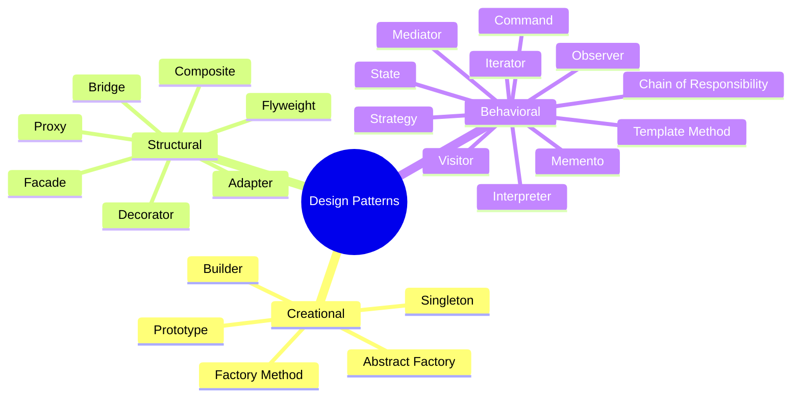
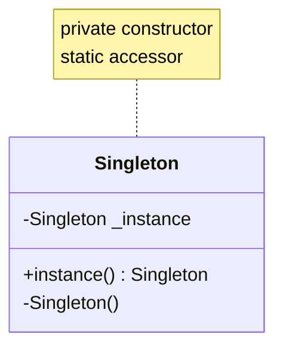
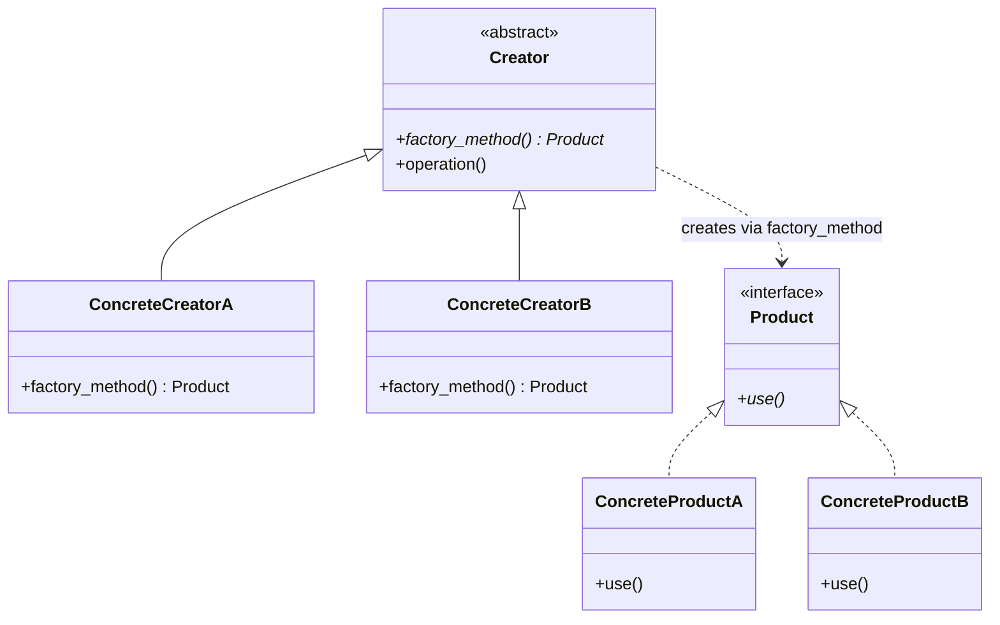
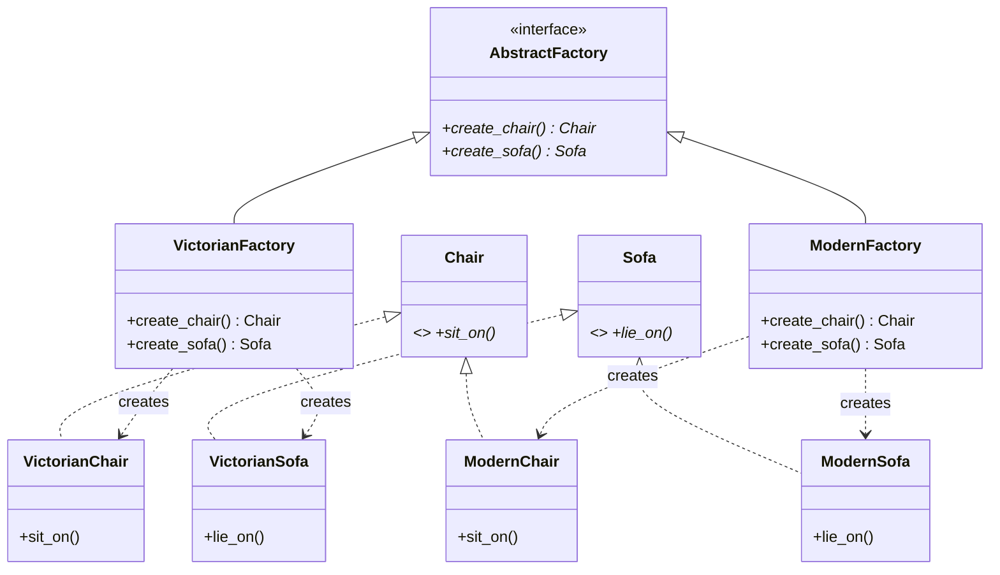
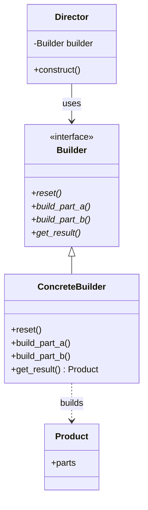
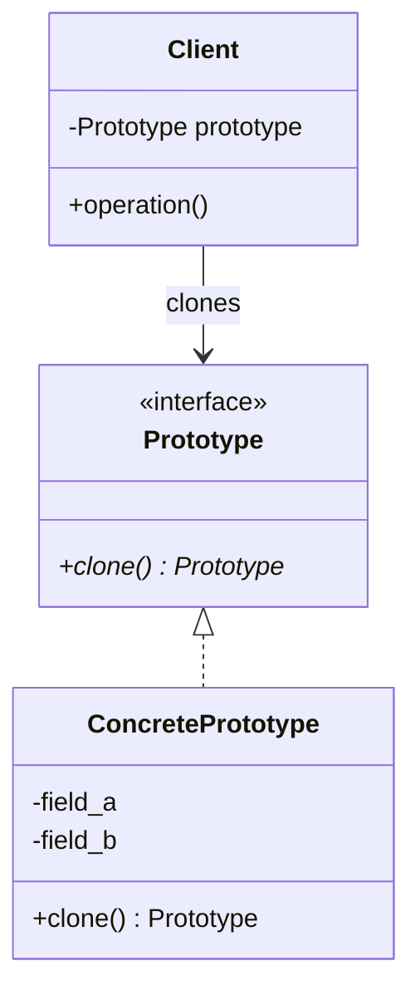

# Design Patterns — Creational

> [!note] What you'll learn
> Creational patterns **abstract the instantiation process**. They help you create objects without exposing the construction details to the client, so your code is decoupled from *how* objects are made — only *that* they are made.

Related: [[solid-principles]] (esp. DIP, OCP), [[abstraction]], [[composition-over-inheritance]], [[dependency-injection]], [[design-patterns-structural]], [[design-patterns-behavioral]].

---

## What Are Design Patterns?

A **design pattern** is a named, reusable solution to a recurring design problem. The phrase was popularised by the **"Gang of Four" (GoF)** book — *Design Patterns: Elements of Reusable Object-Oriented Software* (Gamma, Helm, Johnson, Vlissides, 1994) — which catalogued 23 patterns in three families:



| Family          | Concerns                                   |
| --------------- | ------------------------------------------ |
| **Creational**  | *Constructing* objects — this file.        |
| **Structural**  | *Composing* objects into larger structures — see [[design-patterns-structural]]. |
| **Behavioral**  | *Communicating* between objects — see [[design-patterns-behavioral]]. |

> [!warning] Patterns are not a silver bullet
> Each pattern is a *tool with a cost*. A pattern that's not solving a real problem is just complexity. Start with the simplest thing, reach for a pattern when you feel the *specific* pain it addresses.

---

## 1. Singleton

**Intent:** Ensure a class has **only one instance** and provide a **global point of access** to it.

### Structure



### Python Implementations

#### (a) Module-level singleton — the Pythonic default

In Python, **a module is a singleton already**: it's loaded once and shared. This is the most idiomatic Singleton.

```python
# config.py — module-level singleton
class _Config:
    def __init__(self):
        self.settings = {"debug": False}

    def get(self, key):
        return self.settings.get(key)


config = _Config()           # the singleton
```

```python
from config import config     # every importer gets the same object
config.settings["debug"] = True
```

#### (b) `__new__`-based class singleton

```python
# cls_singleton.py
class Singleton:
    _instance: "Singleton | None" = None

    def __new__(cls, *args, **kwargs):
        if cls._instance is None:
            cls._instance = super().__new__(cls)
        return cls._instance

    def __init__(self, value=None):
        # ⚠️ __init__ runs on *every* call — guard against re-init
        if not hasattr(self, "_initialized"):
            self.value = value
            self._initialized = True


a = Singleton("first")
b = Singleton("second")
print(a is b)         # True
print(a.value)        # "first" (second call's value was ignored)
```

#### (c) Thread-safe singleton with a lock

```python
# threadsafe_singleton.py
import threading


class ThreadSafeSingleton:
    _instance: "ThreadSafeSingleton | None" = None
    _lock = threading.Lock()

    def __new__(cls, *args, **kwargs):
        if cls._instance is None:                    # fast path: no lock needed
            with cls._lock:                          # double-checked locking
                if cls._instance is None:
                    cls._instance = super().__new__(cls)
        return cls._instance
```

> [!tip] Python's GIL doesn't save you
> CPython's GIL makes individual bytecode ops atomic, but `if x is None: x = Foo()` is *several* ops — two threads can both see `None` and both create an instance. Always use a lock if multiple threads may instantiate.

### When to use

- **Configuration objects** that should be loaded once.
- **Hardware access wrappers** (one printer spooler, one serial port).
- **Logging** in tiny scripts (in real apps, prefer dependency-injected loggers).

### Pitfalls — why Singleton is often an anti-pattern

> [!danger] Singleton is the most over-used and most criticised pattern
> - **Hidden global state** → tight coupling everywhere it's imported.
> - **Hard to test** → you can't easily swap it for a fake; tests interfere with each other through shared mutable state.
> - **Violates SRP** → it manages *its own lifecycle* **and** its business responsibility.
> - **Lifecycle rigidity** → "one instance per process" is rarely what you actually want; usually you want "one instance per request" or "one per user session".
> - **Subclassing is awkward** — the `_instance` attribute is class-scoped, so subclasses get a different singleton only if you reset it.

**Modern alternative:** use **dependency injection** ([[dependency-injection]]) — a container holds a single instance and injects it where needed. Single instance, but no global variable.

---

## 2. Factory Method

**Intent:** Define an interface for creating an object, but let subclasses (or callables) decide **which class to instantiate**. The factory method lets a class defer instantiation to subclasses.

### Structure



### Python Implementation

Python's first-class functions make this trivial — but the OO form is still worth knowing.

```python
# factory_method.py
from __future__ import annotations
from abc import ABC, abstractmethod


class Transport(ABC):
    @abstractmethod
    def deliver(self, package: str) -> str: ...


class Truck(Transport):
    def deliver(self, package: str) -> str:
        return f"🚚 Truck delivers {package} by road"


class Ship(Transport):
    def deliver(self, package: str) -> str:
        return f"🚢 Ship delivers {package} by sea"


class Logistics(ABC):                                  # Creator
    @abstractmethod
    def factory_method(self) -> Transport: ...         # factory method

    def plan_delivery(self, package: str) -> str:      # uses the product
        transport = self.factory_method()
        return transport.deliver(package)


class RoadLogistics(Logistics):
    def factory_method(self) -> Transport:
        return Truck()


class SeaLogistics(Logistics):
    def factory_method(self) -> Transport:
        return Ship()


# Client
logistics: Logistics = SeaLogistics()
print(logistics.plan_delivery("1000 cans of beans"))
# 🚢 Ship delivers 1000 cans of beans by sea
```

### Pythonic variant — use a callable / registry

```python
# factory_registry.py
from typing import Callable

TRANSPORTS: dict[str, Callable[[], Transport]] = {
    "truck": Truck,
    "ship":  Ship,
}

def make_transport(kind: str) -> Transport:
    if kind not in TRANSPORTS:
        raise ValueError(f"Unknown transport: {kind}")
    return TRANSPORTS[kind]()
```

### When to use

- A class **can't anticipate** the class of objects it must create.
- You want to **decouple** client code from concrete classes.
- You want a **centralised** place to enforce construction rules (validation, defaults).

### Pitfalls

- Easy to over-engineer: if you only ever have one product type, a plain `Foo()` is fine.
- "Every class deserves a factory" is a code smell — see [[grasp-and-extra-principles]] (Creator pattern).

---

## 3. Abstract Factory

**Intent:** Provide an interface for creating **families of related or dependent objects** without specifying their concrete classes.

> [!tip] Factory Method vs Abstract Factory
> - **Factory Method** creates *one* product; the choice is a single dimension.
> - **Abstract Factory** creates a *family* of products that must be consistent (e.g. all "Victorian" or all "Modern"); the choice is multi-dimensional.

### Structure



### Python Implementation

```python
# abstract_factory.py
from __future__ import annotations
from abc import ABC, abstractmethod


# ---- Product interfaces ----
class Chair(ABC):
    @abstractmethod
    def sit_on(self) -> str: ...

class Sofa(ABC):
    @abstractmethod
    def lie_on(self) -> str: ...


# ---- Victorian family ----
class VictorianChair(Chair):
    def sit_on(self) -> str: return "Sitting on an ornate Victorian chair"

class VictorianSofa(Sofa):
    def lie_on(self) -> str: return "Lying on a velvet Victorian sofa"


# ---- Modern family ----
class ModernChair(Chair):
    def sit_on(self) -> str: return "Sitting on a minimalist modern chair"

class ModernSofa(Sofa):
    def lie_on(self) -> str: return "Lying on a sleek modern sofa"


# ---- Abstract factory ----
class FurnitureFactory(ABC):
    @abstractmethod
    def create_chair(self) -> Chair: ...
    @abstractmethod
    def create_sofa(self) -> Sofa: ...


class VictorianFactory(FurnitureFactory):
    def create_chair(self) -> Chair: return VictorianChair()
    def create_sofa(self)  -> Sofa:  return VictorianSofa()

class ModernFactory(FurnitureFactory):
    def create_chair(self) -> Chair: return ModernChair()
    def create_sofa(self)  -> Sofa:  return ModernSofa()


# ---- Client: depends only on the abstraction ----
class Catalog:
    def __init__(self, factory: FurnitureFactory):
        self._factory = factory

    def describe(self) -> str:
        return f"{self._factory.create_chair().sit_on()}; {self._factory.create_sofa().lie_on()}"


catalog = Catalog(ModernFactory())
print(catalog.describe())
# Sitting on a minimalist modern chair; Lying on a sleek modern sofa
```

### When to use

- A system must be **independent of how its products are created, composed, and represented**.
- A system should be configured with **one of multiple families** of products.
- You must enforce that **products from different families are never mixed** (type system does it for you).

### Pitfalls

- Adding a *new product kind* (e.g. `CoffeeTable`) forces changes in *every* factory — that's a violation of [[solid-principles#O — Open/Closed Principle (OCP)|OCP]]. If your axes of change are "add product" rather than "add family", prefer Factory Method + Builder.

---

## 4. Builder

**Intent:** Separate the construction of a complex object from its representation, so the same construction process can create different representations.

### Why?

A constructor with 12 parameters is unreadable and error-prone:

```python
# bad — what is "True, False, True"?
pizza = Pizza("thin", "tomato", "mozzarella", True, False, True, False, True, False, True, False, True)
```

Builder solves this with **fluent, named steps**.

### Structure



### Python Implementation — fluent builder

```python
# builder.py
from __future__ import annotations


class Pizza:
    def __init__(self):
        self.size: str | None = None
        self.crust: str | None = None
        self.sauce: str | None = None
        self.cheese: str | None = None
        self.toppings: list[str] = []

    def __repr__(self) -> str:
        return (f"Pizza(size={self.size}, crust={self.crust}, sauce={self.sauce}, "
                f"cheese={self.cheese}, toppings={self.toppings})")


class PizzaBuilder:
    def __init__(self) -> None:
        self._pizza = Pizza()

    def size(self, s: str) -> "PizzaBuilder":
        self._pizza.size = s
        return self

    def crust(self, c: str) -> "PizzaBuilder":
        self._pizza.crust = c
        return self

    def sauce(self, s: str) -> "PizzaBuilder":
        self._pizza.sauce = s
        return self

    def cheese(self, c: str) -> "PizzaBuilder":
        self._pizza.cheese = c
        return self

    def add_topping(self, t: str) -> "PizzaBuilder":
        self._pizza.toppings.append(t)
        return self

    def build(self) -> Pizza:
        if not self._pizza.size:
            raise ValueError("Pizza must have a size")
        result, self._pizza = self._pizza, Pizza()   # reset for next build
        return result


# Client
margherita = (
    PizzaBuilder()
    .size("12in")
    .crust("thin")
    .sauce("tomato")
    .cheese("mozzarella")
    .add_topping("basil")
    .build()
)
print(margherita)
# Pizza(size=12in, crust=thin, sauce=tomato, cheese=mozzarella, toppings=['basil'])
```

### With a Director (optional)

A *Director* encodes a known recipe:

```python
class Pizzeria:
    def __init__(self, builder: PizzaBuilder):
        self._builder = builder

    def make_margherita(self) -> Pizza:
        return (self._builder
                .size("12in").crust("thin").sauce("tomato")
                .cheese("mozzarella").add_topping("basil")
                .build())

    def make_meat_lovers(self) -> Pizza:
        return (self._builder
                .size("16in").crust("stuffed").sauce("bbq")
                .cheese("cheddar")
                .add_topping("pepperoni").add_topping("sausage").add_topping("bacon")
                .build())
```

### Pythonic alternative — keyword-only arguments + dataclasses

Often, the simplest builder is just **keyword-only args** + defaults:

```python
from dataclasses import dataclass, field

@dataclass
class Pizza:
    size: str
    crust: str = "thin"
    sauce: str = "tomato"
    cheese: str = "mozzarella"
    toppings: list[str] = field(default_factory=list)

# Reached for when you actually need validation or step-by-step construction
```

> [!tip] Use a real Builder when
> - Construction is **multi-step** (parsing, validation, defaults derived from other fields).
> - You want **immutable** final objects and many configuration combinations.
> - You produce **different representations** from the same steps (e.g. HTML vs JSON report).

### Pitfalls

- Builder returning `self` enables fluent chaining, but forgetting to call `.build()` returns the builder, not the product.
- Mutable default arguments are a classic Python trap — use `field(default_factory=list)`.
- Don't write a Builder for objects with 2 fields; that's ceremony, not value.

---

## 5. Prototype

**Intent:** Specify the kinds of objects to create using a **prototypical instance**, and create new objects by **copying** this prototype.

### Why?

- When construction is **expensive** (parsing, network, heavy computation) but copying is cheap.
- When you want to **avoid subclassing** for "another one like this, but slightly different".

### Structure



### Python Implementation — `copy.copy` and `copy.deepcopy`

Python exposes the mechanism directly:

```python
# prototype.py
import copy


class Position:
    def __init__(self, x: int, y: int):
        self.x, self.y = x, y

    def __repr__(self) -> str:
        return f"Position({self.x}, {self.y})"


class Enemy:
    def __init__(self, name: str, hp: int, pos: Position, tags: list[str]):
        self.name = name
        self.hp = hp
        self.pos = pos
        self.tags = tags

    def __repr__(self) -> str:
        return f"Enemy({self.name}, hp={self.hp}, pos={self.pos}, tags={self.tags})"


# A "template" enemy loaded from a config file
template = Enemy("Goblin", 50, Position(0, 0), ["green", "small"])

# Shallow copy: nested objects (Position, list) are shared
shallow = copy.copy(template)
shallow.pos.x = 99           # ⚠️ mutates the template's Position too!
print(template.pos)          # Position(99, 0)  — oops

# Deep copy: every nested object is recursively copied
fresh = copy.deepcopy(template)
fresh.pos.x = 7
fresh.tags.append("elite")
print(template.pos)          # Position(99, 0)  — untouched
print(template.tags)         # ['green', 'small'] — untouched
print(fresh.pos)             # Position(7, 0)
print(fresh.tags)            # ['green', 'small', 'elite']
```

### Customising `__copy__` and `__deepcopy__`

```python
class Enemy:
    # ... as above ...

    def __copy__(self) -> "Enemy":
        # Shallow: new Enemy, but shared Position and tags list
        return Enemy(self.name, self.hp, self.pos, self.tags)

    def __deepcopy__(self, memo: dict) -> "Enemy":
        # Deep: recursively copy Position and tags
        return Enemy(
            self.name,
            self.hp,
            copy.deepcopy(self.pos, memo),
            copy.deepcopy(self.tags, memo),
        )
```

`memo` is a dict that tracks already-copied objects to handle cycles and shared references correctly.

### When to use

- You need to **clone complex objects** without re-running expensive construction.
- You want a **registry of templates** (e.g. enemy archetypes, document templates).
- Reducing subclass proliferation: configure one prototype, clone-and-tweak instead of subclassing.

### Pitfalls

- **Shallow vs deep** — the classic footgun. Decide deliberately which you want.
- **Sharing is viral**: if `Enemy` holds a list, shallow copy shares it; if you mutate via `shallow.tags.append(...)`, you've corrupted the template.
- Cycles in object graphs break naive `deepcopy` (Python handles cycles via `memo`; your custom `__deepcopy__` must too).
- Don't reach for Prototype just to avoid `__init__` — that's a smell.

---

## Comparison Table

| Pattern           | One-liner                                              | Pythonic shortcut                            |
| ----------------- | ------------------------------------------------------ | -------------------------------------------- |
| Singleton         | One instance, global access                            | A module. Or DI container with one instance. |
| Factory Method    | Defer creation to subclasses / callables               | A registry dict of callables                |
| Abstract Factory  | Family of related products                             | Function returning a dataclass of factories |
| Builder           | Step-by-step construction of complex objects           | Keyword-only args + dataclasses, or fluent  |
| Prototype         | Clone a prototypical instance                          | `copy.copy` / `copy.deepcopy`               |

---

## Key Takeaways

1. **Creational patterns abstract `__init__`** so client code doesn't depend on concrete classes.
2. **Singleton is usually an anti-pattern in Python** — use a module or DI; reserve `__new__`-Singleton for rare cases and **always** make it thread-safe.
3. **Factory Method** shines when the *type* of object is decided at runtime; in Python a `dict[str, Callable]` is often enough.
4. **Abstract Factory** is for *families* of related products — make sure your axis of change is "add family", not "add product".
5. **Builder** is the cure for telescoping constructors; reach for it when construction is multi-step or produces immutable objects.
6. **Prototype** is `copy.deepcopy` plus optional `__copy__` / `__deepcopy__` overrides — be deliberate about shallow vs deep.
7. Each pattern is a tool to satisfy [[solid-principles]] — Factory & Abstract Factory enable OCP, Builder aids SRP, Prototype enables OCP.

---

## Practice Exercises

> [!exercise] 1. Singleton — find the bug
> Explain why this thread-safe singleton is *still* broken in one scenario:
> ```python
> class S:
>     _instance = None
>     _lock = threading.Lock()
>     def __new__(cls):
>         if cls._instance is None:
>             with cls._lock:
>                 if cls._instance is None:
>                     cls._instance = super().__new__(cls)
>         return cls._instance
> ```
> (Hint: subclassing.)

> [!exercise] 2. Factory Method — logistics
> Add an `AirLogistics` creator and a `Plane` product to the example without modifying existing classes. Then explain which SOLID principle this satisfies.

> [!exercise] 3. Abstract Factory — UI themes
> Design an `UIThemeFactory` with `create_button()`, `create_textbox()`. Provide `LightThemeFactory` and `DarkThemeFactory`. Show how a `Window` class uses any factory without caring about the theme.

> [!exercise] 4. Builder — SQL query
> Write a `QueryBuilder` fluent API:
> ```python
> q = (QueryBuilder("users")
>      .select("id", "name", "email")
>      .where("age > 18")
>      .order_by("name")
>      .limit(10)
>      .build())
> # SELECT id, name, email FROM users WHERE age > 18 ORDER BY name LIMIT 10
> ```

> [!exercise] 5. Prototype — document templates
> Design a `Document` class with title, body (list of paragraphs), and metadata dict. Provide templates ("Invoice", "Letter") and clone-and-customise them. Demonstrate the difference between shallow and deep copy when you mutate metadata.

> [!exercise] 6. Refactor
> Take a class whose `__init__` takes 8 positional arguments and refactor it with a Builder. Compare readability before/after.

> [!exercise] 7. Cross-pattern
> Build a small game where: enemies are created by an **Abstract Factory** (per level theme), each enemy type uses the **Prototype** pattern (clone templates), and the player's inventory uses a **Builder** to craft items. Draw the Mermaid class diagram.

> [!exercise] 8. Anti-Singleton
> Find a `Singleton` in a codebase you know. Replace it with a dependency-injected singleton-in-scope. What got easier to test? What got harder?

---

Next: [[design-patterns-structural]] | [[design-patterns-behavioral]] | [[solid-principles]] | [[dependency-injection]]
