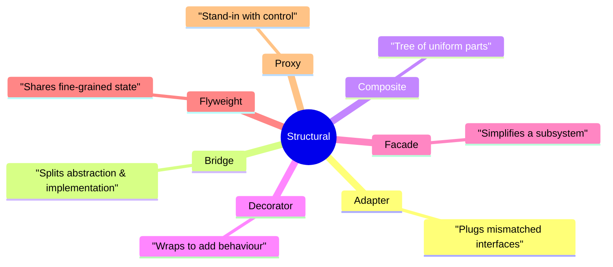
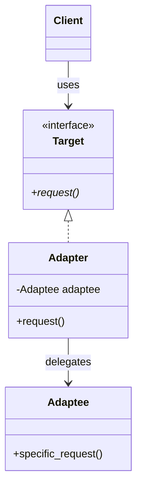
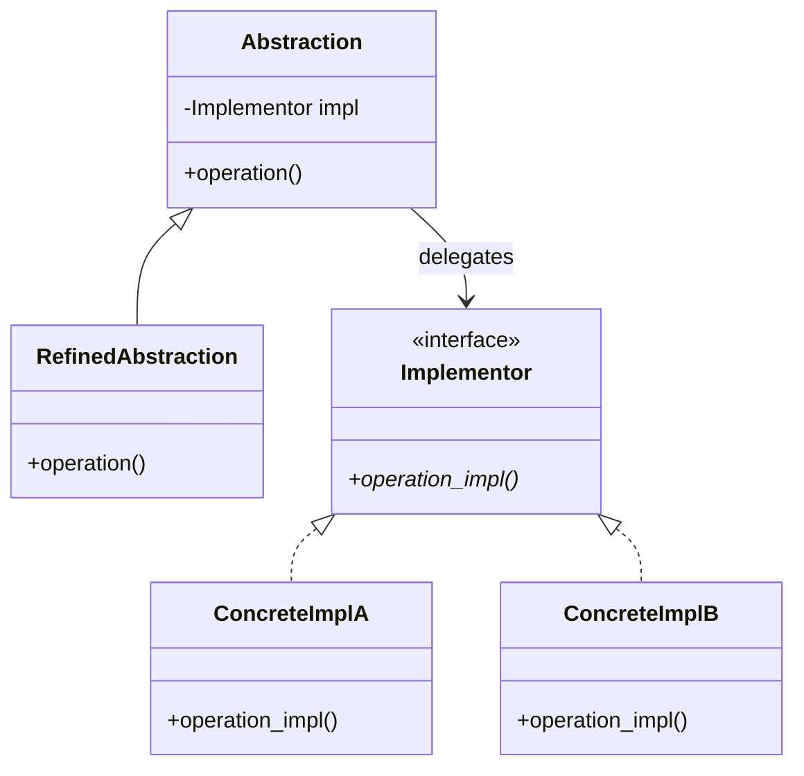
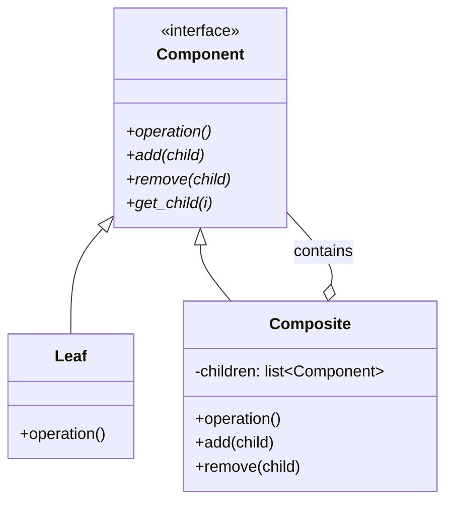
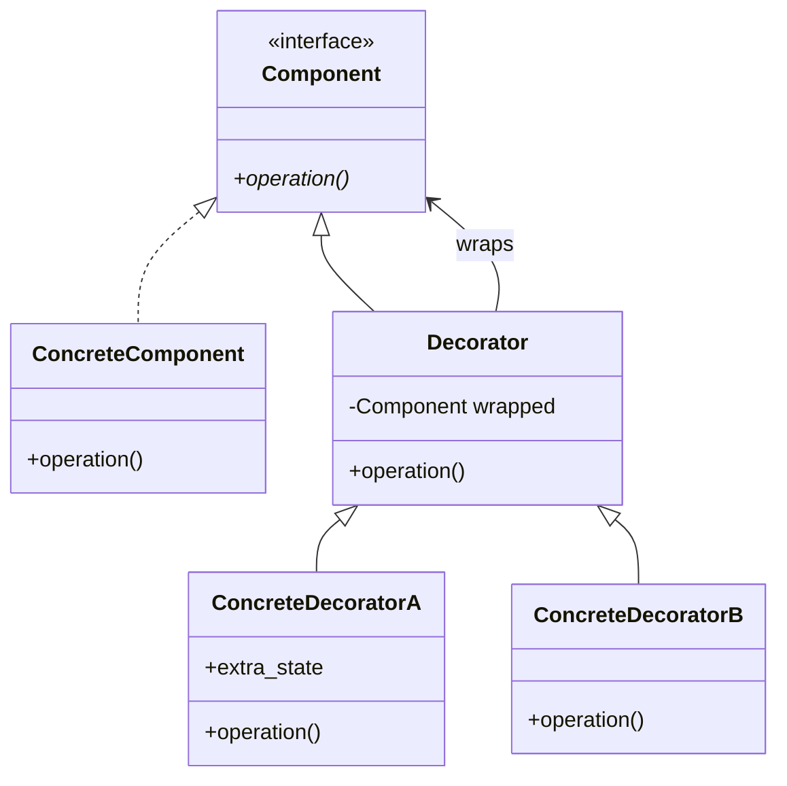
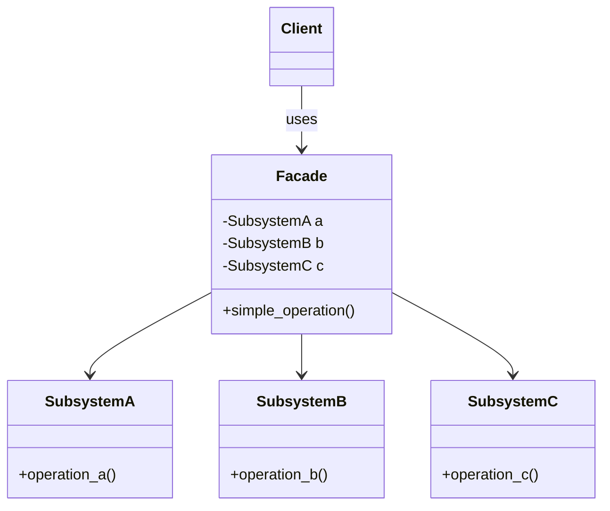
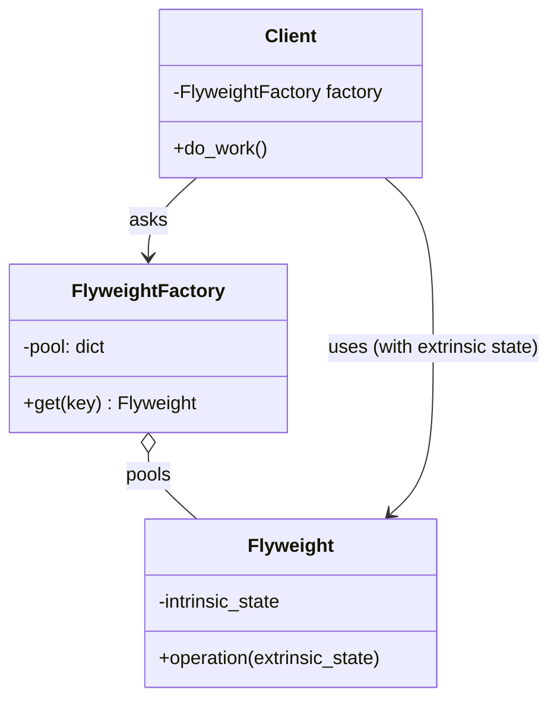
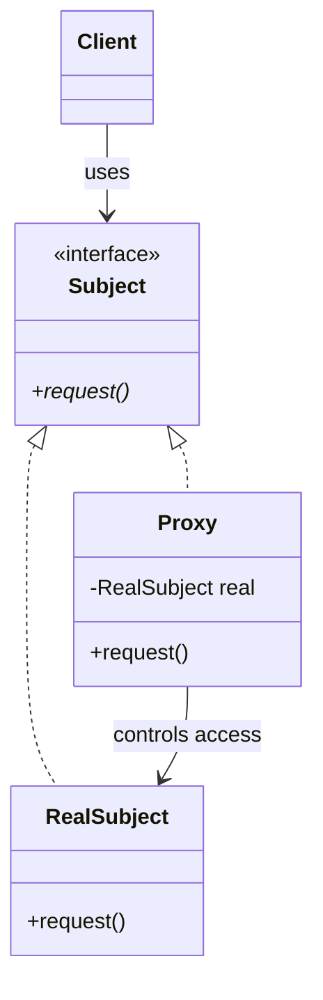

# Design Patterns — Structural

> [!note] What you'll learn
> Structural patterns deal with **how classes and objects are composed** to form larger structures. They show you how to wire things together so that the *composition* is more flexible than inheritance alone.

Related: [[solid-principles]] (OCP, LSP, DIP), [[composition-over-inheritance]], [[abstraction]], [[design-patterns-creational]], [[design-patterns-behavioral]].

---

## Quick Map



| Pattern     | One-liner                                                       |
| ----------- | --------------------------------------------------------------- |
| Adapter     | Make an existing class match an interface it wasn't designed for. |
| Bridge      | Decouple an abstraction from its implementation so they vary independently. |
| Composite   | Treat individual objects and compositions uniformly.            |
| Decorator   | Attach additional behaviour to objects dynamically.             |
| Facade      | Provide a simplified interface to a complex subsystem.          |
| Flyweight   | Share fine-grained objects to support many cheaply.             |
| Proxy       | Provide a surrogate that controls access to another object.     |

---

## 1. Adapter

**Intent:** Convert the interface of a class into another interface clients expect. Adapter lets classes work together that otherwise couldn't because of incompatible interfaces.

> [!example] Real-world analogy
> A travel **power adapter** — your US plug fits into a European socket via a small piece of plastic that translates one shape into another. The adapter doesn't *change* the socket or the plug; it sits between them.

### Structure



### Python Implementation — object adapter

```python
# adapter.py
from __future__ import annotations
from abc import ABC, abstractmethod


# ---- Target interface the client expects ----
class LogTarget(ABC):
    @abstractmethod
    def write(self, message: str) -> None: ...


# ---- Adaptee: an existing third-party class we can't change ----
class LegacyLogger:
    """From an old library; uses a totally different API."""
    def log_message(self, severity: int, text: str) -> None:
        print(f"[{severity}] {text}")


# ---- Adapter ----
class LegacyLoggerAdapter(LogTarget):
    def __init__(self, legacy: LegacyLogger, severity: int = 1):
        self._legacy = legacy
        self._severity = severity

    def write(self, message: str) -> None:
        self._legacy.log_message(self._severity, message)


# Client: depends only on LogTarget
def use(logger: LogTarget) -> None:
    logger.write("Application started")


use(LegacyLoggerAdapter(LegacyLogger(), severity=2))
# [2] Application started
```

### Class Adapter (using multiple inheritance)

In Python you *can* adapt by subclassing both interfaces — useful when you want to override a few methods of the adaptee:

```python
class ClassAdapter(LegacyLogger, LogTarget):
    def write(self, message: str) -> None:
        self.log_message(1, message)
```

> [!warning] Prefer object adapters
> Class adapters couple you to a *specific* `Adaptee` subclass. Object adapters work with any `Adaptee` instance (including mocks for tests) — usually the better trade-off.

### When to use

- Wrapping **third-party** libraries behind your own interface (so you can swap them later).
- **Reusing** an existing class whose interface doesn't match what you need.
- **Migrating** from an old API to a new one gradually.

### Pitfalls

- Adapters can stack up ("adapter-for-an-adapter-for-an-adapter") — that's a smell that you should refactor the abstractions.
- Don't add new *behaviour* in an adapter — that's a Decorator.

---

## 2. Bridge

**Intent:** Decouple an abstraction from its implementation so that the two can vary independently.

> [!tip] Bridge vs Strategy
> They look identical in code (abstraction holds a reference to an implementor). The difference is **intent**:
> - **Strategy** is *behavioral*: you swap algorithms at runtime for a single object.
> - **Bridge** is *structural*: you split a class hierarchy along two orthogonal dimensions up front, so neither side needs to know about the other's subclasses.

### Structure



### Python Implementation

Two dimensions: **Shape** (Circle, Square) × **Renderer** (Raster, Vector). Without Bridge you'd need `RasterCircle`, `VectorCircle`, `RasterSquare`, `VectorSquare` — 4 classes, growing as `N × M`.

```python
# bridge.py
from __future__ import annotations
from abc import ABC, abstractmethod


class Renderer(ABC):
    @abstractmethod
    def render_circle(self, radius: float) -> str: ...
    @abstractmethod
    def render_square(self, side: float) -> str: ...


class VectorRenderer(Renderer):
    def render_circle(self, r: float) -> str:
        return f"Drawing a vector circle of radius {r}"
    def render_square(self, s: float) -> str:
        return f"Drawing a vector square of side {s}"


class RasterRenderer(Renderer):
    def render_circle(self, r: float) -> str:
        return f"Drawing pixels for a circle of radius {r}"
    def render_square(self, s: float) -> str:
        return f"Drawing pixels for a square of side {s}"


class Shape(ABC):
    def __init__(self, renderer: Renderer):
        self._renderer = renderer

    @abstractmethod
    def draw(self) -> str: ...

    @abstractmethod
    def resize(self, factor: float) -> None: ...


class Circle(Shape):
    def __init__(self, renderer: Renderer, radius: float):
        super().__init__(renderer)
        self._radius = radius

    def draw(self) -> str:
        return self._renderer.render_circle(self._radius)

    def resize(self, factor: float) -> None:
        self._radius *= factor


class Square(Shape):
    def __init__(self, renderer: Renderer, side: float):
        super().__init__(renderer)
        self._side = side

    def draw(self) -> str:
        return self._renderer.render_square(self._side)

    def resize(self, factor: float) -> None:
        self._side *= factor


# Client picks a Shape + Renderer; they vary independently
raster = RasterRenderer()
c = Circle(raster, 5)
print(c.draw())        # Drawing pixels for a circle of radius 5
c.resize(2)
print(c.draw())        # Drawing pixels for a circle of radius 10.0
```

### When to use

- You have **two orthogonal dimensions** of variation (shapes × renderers, messages × transports, widgets × platforms).
- You want to **avoid a permanent `N × M` class explosion**.
- The implementation must be **swappable at runtime**.

### Pitfalls

- Over-engineering if you only have one dimension of variation.
- Indirection adds a layer — make sure the abstraction is stable.

---

## 3. Composite

**Intent:** Compose objects into tree structures to represent **part-whole hierarchies**. Composite lets clients treat **individual objects and compositions of objects** uniformly.

### Structure



### Python Implementation

```python
# composite.py
from __future__ import annotations
from abc import ABC, abstractmethod


class FileSystemNode(ABC):
    @abstractmethod
    def size(self) -> int: ...
    @abstractmethod
    def display(self, indent: int = 0) -> str: ...


class File(FileSystemNode):
    def __init__(self, name: str, size: int):
        self._name = name
        self._size = size

    def size(self) -> int:
        return self._size

    def display(self, indent: int = 0) -> str:
        return f"{'  ' * indent}📄 {self._name} ({self._size} bytes)"


class Folder(FileSystemNode):
    def __init__(self, name: str):
        self._name = name
        self._children: list[FileSystemNode] = []

    def add(self, node: FileSystemNode) -> "Folder":
        self._children.append(node)
        return self

    def remove(self, node: FileSystemNode) -> None:
        self._children.remove(node)

    def size(self) -> int:
        return sum(c.size() for c in self._children)

    def display(self, indent: int = 0) -> str:
        lines = [f"{'  ' * indent}📁 {self._name}/"]
        for c in self._children:
            lines.append(c.display(indent + 1))
        return "\n".join(lines)


# Client treats File and Folder uniformly
root = Folder("root")
root.add(File("README.md", 1024))
src = Folder("src").add(File("main.py", 2048)).add(File("utils.py", 512))
root.add(src)

print(root.display())
print(f"Total: {root.size()} bytes")
```

Output:
```
📁 root/
  📄 README.md (1024 bytes)
  📄 src/
    📄 main.py (2048 bytes)
    📄 utils.py (512 bytes)
Total: 3584 bytes
```

> [!tip] Default vs strict `add`/`remove` on `Component`
> Putting `add`/`remove` on the base `Component` lets clients treat everything uniformly, but a `Leaf.add()` must raise. The alternative — defining `add`/`remove` only on `Composite` — is safer but forces `isinstance` checks. Pick your poison.

### When to use

- Hierarchical, tree-like data (filesystems, UIs, org charts, ASTs).
- You want **uniform** handling of leaves and containers.

### Pitfalls

- Leaves raising `NotImplementedError` for `add`/`remove` violates [[solid-principles#L — Liskov Substitution Principle (LSP)|LSP]].
- Easy to over-apply: not every list-of-things needs the Composite pattern.

---

## 4. Decorator

**Intent:** Attach additional responsibilities to an object **dynamically**, without altering its class. Decorators provide a flexible alternative to subclassing for extending functionality.

> [!danger] Two meanings of "decorator" in Python!
> 1. **GoF Decorator (structural pattern)** — wrap an object with another object implementing the same interface, to add behaviour.
> 2. **Python `@decorator` syntax** — a callable that transforms a function or class. This is a **language feature**, *not* the GoF pattern. They share a name because the syntax was inspired by the pattern, but they are different things.
>
> A Python `@decorator` is *syntactic sugar* for `func = decorator(func)`. It often implements the GoF pattern (e.g. `@functools.lru_cache` adds caching to a callable), but `@dataclass` is a class transformer that has nothing to do with the GoF pattern.

### Structure (GoF Decorator)



### Python Implementation — GoF Decorator

```python
# decorator_gof.py
from __future__ import annotations
from abc import ABC, abstractmethod


class Coffee(ABC):
    @abstractmethod
    def cost(self) -> float: ...
    @abstractmethod
    def description(self) -> str: ...


class SimpleCoffee(Coffee):
    def cost(self) -> float: return 2.0
    def description(self) -> str: return "Coffee"


class CoffeeDecorator(Coffee):
    def __init__(self, inner: Coffee):
        self._inner = inner

    def cost(self) -> float: return self._inner.cost()
    def description(self) -> str: return self._inner.description()


class Milk(CoffeeDecorator):
    def cost(self) -> float: return self._inner.cost() + 0.5
    def description(self) -> str: return f"{self._inner.description()} + milk"


class Sugar(CoffeeDecorator):
    def cost(self) -> float: return self._inner.cost() + 0.2
    def description(self) -> str: return f"{self._inner.description()} + sugar"


class Whip(CoffeeDecorator):
    def cost(self) -> float: return self._inner.cost() + 0.7
    def description(self) -> str: return f"{self._inner.description()} + whip"


# Client: stack decorators
drink = Whip(Sugar(Milk(SimpleCoffee())))
print(drink.description())  # Coffee + milk + sugar + whip
print(drink.cost())         # 3.4
```

### Python `@decorator` syntax (the language feature)

```python
# decorator_syntax.py
import functools
import time
from typing import Callable, TypeVar

T = TypeVar("T")


def timing(fn: Callable[..., T]) -> Callable[..., T]:
    """A Python decorator: wraps a function and adds timing."""
    @functools.wraps(fn)
    def wrapper(*args, **kwargs) -> T:
        start = time.perf_counter()
        result = fn(*args, **kwargs)
        elapsed = time.perf_counter() - start
        print(f"{fn.__name__} took {elapsed:.4f}s")
        return result
    return wrapper


def memoize(fn: Callable[..., T]) -> Callable[..., T]:
    cache: dict[tuple, T] = {}
    @functools.wraps(fn)
    def wrapper(*args):
        if args not in cache:
            cache[args] = fn(*args)
        return cache[args]
    return wrapper


@timing
@memoize
def fib(n: int) -> int:
    return n if n < 2 else fib(n - 1) + fib(n - 2)


print(fib(30))
# fib took 0.0001s
# 832040
```

> [!note] How `@decorator` relates to the GoF pattern
> `@timing` *is* a GoF Decorator: it wraps `fib` with another callable of the same interface (a callable returning `int`) and adds behaviour. The Python `@` syntax is just sugar for `fib = timing(fib)`. So Python decorators are usually instances of the GoF pattern — but **not always** (`@dataclass` mutates the class in place and returns the same class — it's a transformer, not a wrapper).

### When to use (GoF)

- You want to add behaviour to **specific instances** without affecting others of the same class.
- You want to **stack** behaviours (e.g. milk + sugar + whip).
- Subclassing would create a class explosion (`MilkCoffee`, `SugarCoffee`, `MilkSugarCoffee`, ...).

### When to use `@decorator`

- Cross-cutting concerns on functions/methods: logging, caching, retries, auth, timing.
- Class transformation: `@dataclass`, `@attrs.define`, `@property`.

### Pitfalls

- GoF decorators can pile up — `a(b(c(d(x))))` is hard to debug.
- Removing a specific decorator from a stack is awkward (you usually rebuild the chain).
- Python `@decorator` forgetting `@functools.wraps` loses the original function's metadata.

---

## 5. Facade

**Intent:** Provide a **unified interface** to a set of interfaces in a subsystem. Facade defines a higher-level interface that makes the subsystem easier to use.

### Structure



### Python Implementation

```python
# facade.py
class CPU:
    def freeze(self) -> str:        return "CPU frozen"
    def jump(self, addr: int) -> str: return f"CPU jump to {addr}"
    def execute(self) -> str:       return "CPU executing"


class Memory:
    def load(self, addr: int, data: bytes) -> str:
        return f"Memory loaded {data!r} at {addr}"


class HardDrive:
    def read(self, sector: int, size: int) -> bytes:
        return b"\x00" * size


class ComputerFacade:
    """Hides the messy subsystem behind a single `start()` call."""
    def __init__(self) -> None:
        self._cpu = CPU()
        self._memory = Memory()
        self._hd = HardDrive()

    def start(self) -> list[str]:
        BOOT_SECTOR, BOOT_SECTOR_SIZE, BOOT_ADDR = 0, 1024, 0x1000
        steps = [
            self._cpu.freeze(),
            self._memory.load(BOOT_ADDR, self._hd.read(BOOT_SECTOR, BOOT_SECTOR_SIZE)),
            self._cpu.jump(BOOT_ADDR),
            self._cpu.execute(),
        ]
        return steps


# Client gets a one-liner
computer = ComputerFacade()
print(computer.start())
# ['CPU frozen', "Memory loaded b'\\x00...' at 4096", 'CPU jump to 4096', 'CPU executing']
```

### When to use

- You want to **shield** clients from a complex subsystem.
- You want to **layer** your system: each layer has a facade.
- You're integrating with a third-party library that exposes too much.

### Pitfalls

- A facade that **grows forever** becomes a god object (see [[solid-principles#S — Single Responsibility Principle (SRP)|SRP]] violation).
- A facade that **hides** the subsystem *completely* removes power users' escape hatches. Always allow direct access too.

---

## 6. Flyweight

**Intent:** Use **sharing** to support large numbers of fine-grained objects efficiently.

> [!example] Real-world analogy
> A chess game has 32 pieces but millions of possible board states. The *piece type* (king, queen, ...) is shared (intrinsic state); the *position* on the board is per-instance (extrinsic state).

### Structure



### Python Implementation

```python
# flyweight.py
from __future__ import annotations
from dataclasses import dataclass


@dataclass(frozen=True)
class TreeType:                       # intrinsic, shared state
    name: str
    color: str
    mesh: str                         # big asset, expensive to load


class TreeTypeFactory:
    def __init__(self) -> None:
        self._pool: dict[str, TreeType] = {}

    def get(self, name: str, color: str, mesh: str) -> TreeType:
        key = f"{name}|{color}|{mesh}"
        if key not in self._pool:
            print(f"(Loading expensive mesh for {name})")
            self._pool[key] = TreeType(name, color, mesh)
        return self._pool[key]

    def count(self) -> int:
        return len(self._pool)


@dataclass
class Tree:                           # extrinsic, per-instance state
    type: TreeType
    x: float
    y: float


class Forest:
    def __init__(self) -> None:
        self._trees: list[Tree] = []
        self._factory = TreeTypeFactory()

    def plant(self, name: str, color: str, mesh: str, x: float, y: float) -> None:
        tree_type = self._factory.get(name, color, mesh)
        self._trees.append(Tree(tree_type, x, y))

    def count_trees(self) -> int:
        return len(self._trees)


forest = Forest()
for i in range(1_000):
    forest.plant("Oak", "green", "oak_mesh.obj", x=float(i), y=0.0)
for i in range(1_000):
    forest.plant("Pine", "dark_green", "pine_mesh.obj", x=float(i), y=10.0)

print(f"Trees: {forest.count_trees()}, unique types: {forest._factory.count()}")
# Trees: 2000, unique types: 2  → only 2 mesh loads
```

### When to use

- A **huge number** of similar objects (game particles, characters, document characters in a text editor).
- Most state can be **factored out** as intrinsic (shared) and the rest is extrinsic (passed in).

### Pitfalls

- Adds complexity and lookup overhead. Only worth it when you genuinely have *many* objects.
- Threading: a shared flyweight must be immutable (or thread-safe).
- Python's `intern()` for short strings and `tuple` caching are built-in flyweights.

---

## 7. Proxy

**Intent:** Provide a **surrogate** or placeholder for another object to control access to it.

### Variants

- **Virtual proxy** — lazy creation of an expensive object.
- **Protection proxy** — access control.
- **Remote proxy** — local representative for a remote object (RPC stubs).
- **Smart proxy** — adds housekeeping (reference counting, caching, logging).

### Structure



### Python Implementation — virtual + smart proxy

```python
# proxy.py
from __future__ import annotations
from abc import ABC, abstractmethod
import time


class Image(ABC):
    @abstractmethod
    def display(self) -> str: ...


class RealImage(Image):
    """Expensive: loads image from disk on construction."""
    def __init__(self, filename: str):
        self._filename = filename
        self._load_from_disk()

    def _load_from_disk(self) -> None:
        print(f"(Loading {self._filename} from disk...)")
        time.sleep(0.1)        # simulate I/O

    def display(self) -> str:
        return f"Displaying {self._filename}"


class ImageProxy(Image):
    """Lazy + caching + access control."""
    def __init__(self, filename: str, *, allowed: bool = True):
        self._filename = filename
        self._allowed = allowed
        self._real: RealImage | None = None

    def display(self) -> str:
        if not self._allowed:
            return f"⛔ Access denied to {self._filename}"
        if self._real is None:                  # lazy creation
            self._real = RealImage(self._filename)
        return self._real.display()


# Client
img1 = ImageProxy("photo1.jpg")
img2 = ImageProxy("secret.jpg", allowed=False)

print("Proxies created — no disk access yet.")
print(img1.display())   # loads on first call
print(img1.display())   # reuses cached RealImage
print(img2.display())   # access denied — never loads
```

### Pythonic shortcut — `__getattr__` proxy

When you want to wrap *everything*:

```python
class LoggingProxy:
    def __init__(self, obj):
        object.__setattr__(self, "_obj", obj)

    def __getattr__(self, name):
        attr = getattr(self._obj, name)
        if callable(attr):
            def wrapper(*args, **kwargs):
                print(f"calling {name}({args}, {kwargs})")
                return attr(*args, **kwargs)
            return wrapper
        return attr
```

### When to use

- **Lazy initialisation** of heavy resources.
- **Access control** (permissions, rate limiting).
- **Caching** results of expensive calls.
- **Logging/metrics** without modifying the real subject (also satisfies [[solid-principles#O — Open/Closed Principle (OCP)|OCP]]).

### Pitfalls

- Proxies add indirection — performance and debugging overhead.
- Confusing Decorator vs Proxy: Decorator *adds* behaviour, Proxy *controls* access. The line is blurry; the *intent* distinguishes them.

---

## Comparison Cheat-Sheet

| Pattern    | Adds behaviour? | Adds structure? | Wraps…                 | Key idea                              |
| ---------- | --------------- | --------------- | ---------------------- | ------------------------------------- |
| Adapter    | No              | Yes             | Mismatched interface   | Translate                             |
| Bridge     | No              | Yes             | Abstraction ↔ impl     | Decouple two axes                     |
| Composite  | No              | Yes             | Tree                   | Uniform part/whole                    |
| Decorator  | Yes             | Yes             | Same interface         | Stack responsibilities                |
| Facade     | No              | Yes             | A subsystem            | Simplify                              |
| Flyweight  | No              | Yes             | (shared) intrinsic     | Share to scale                        |
| Proxy      | (Smart) yes     | Yes             | Same interface         | Control access                        |

---

## Key Takeaways

1. **Structural patterns compose objects** to gain flexibility inheritance can't give.
2. **Adapter** = translate an interface you can't change.
3. **Bridge** = split a hierarchy along two axes (avoid `N × M` explosion).
4. **Composite** = treat leaves and containers the same way (uniform recursion).
5. **Decorator (GoF)** = wrap-and-add-behaviour; **Python `@decorator`** = a language feature, often *used to implement* the GoF pattern but not always.
6. **Facade** = hide complexity behind one friendly interface — but keep the escape hatch.
7. **Flyweight** = share the immutable part to support *many* objects cheaply.
8. **Proxy** = a stand-in that controls access — lazy, protect, cache, log.
9. Decorator and Proxy look identical in code; **intent** distinguishes them.

---

## Practice Exercises

> [!exercise] 1. Adapter — payment gateways
> You have a `PaymentProcessor` interface (`pay(amount, currency)`) and two legacy SDKs (`StripeSDK.charge(cents)` and `PayPalSDK.transact(amount, currency_code)`). Write adapters.

> [!exercise] 2. Bridge — notifications
> Bridge `Notification` (Email, SMS, Push) against `Transport` (SMTP, Twilio, APNs). Show how you can send an Email via SMTP or via a mock test transport without subclassing every combination.

> [!exercise] 3. Composite — arithmetic expressions
> Build an expression tree: `Number` (leaf) and `Add`/`Multiply` (composites). Implement `eval()` that works uniformly. Render the tree with Mermaid.

> [!exercise] 4. Decorator (GoF) — text formatting
> Wrap a `TextComponent` with `Bold`, `Italic`, `Underline` decorators producing HTML: `<u><i><b>hi</b></i></u>`.

> [!exercise] 5. Python `@decorator`
> Write a `@retry(max_attempts=3, delay=0.1)` decorator that retries on `ConnectionError`. Then explain how it implements the GoF Decorator pattern (and how `@dataclass` does *not*).

> [!exercise] 6. Facade — home cinema
> Build a `HomeCinemaFacade` with `watch_movie(title)` and `end_movie()` that coordinates `Projector`, `SoundSystem`, `StreamingService`, `Lights`. Show the before/after from the client's perspective.

> [!exercise] 7. Flyweight — text editor
> A document holds 100k characters. Each character has font, size, color, and position. Use Flyweight to share the (font, size, color) tuple across characters and only store position per character. Measure memory savings.

> [!exercise] 8. Proxy — file system
> Implement a `FileProxy` that lazily opens a file on first `read()`, caches its content, and refuses to read more than 1 MB per call (rate limit). Write tests showing the lazy behavior.

> [!exercise] 9. Cross-pattern
> A caching HTTP client: a `HttpClient` interface, a `RealHttpClient`, a `CachingProxy` (Proxy pattern), a `LoggingDecorator` (Decorator pattern), and a `HttpClientFacade` exposing a single `get_json(url)` method. Compose them. Draw the Mermaid diagram.

---

Next: [[design-patterns-behavioral]] | [[design-patterns-creational]] | [[solid-principles]] | [[composition-over-inheritance]]
