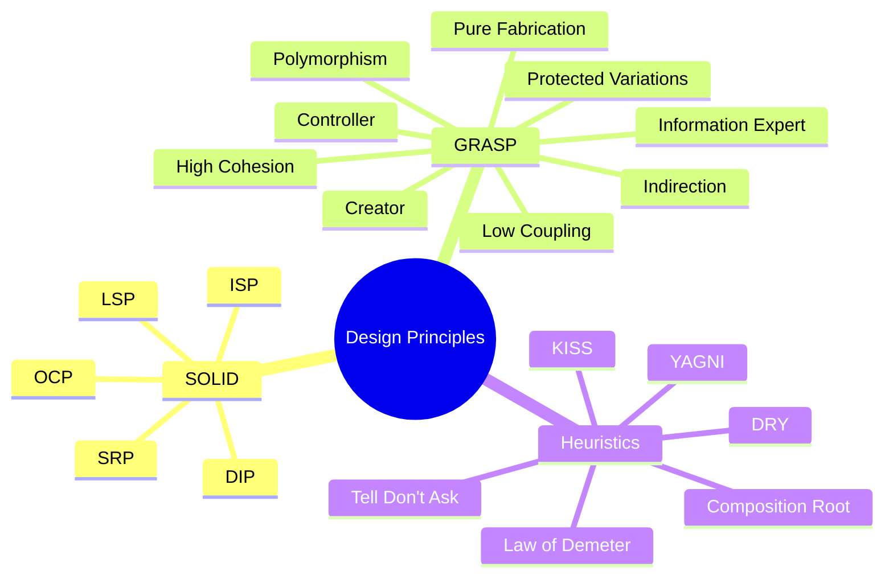
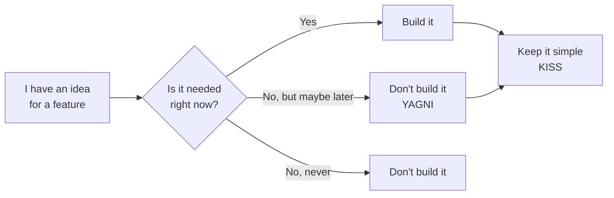
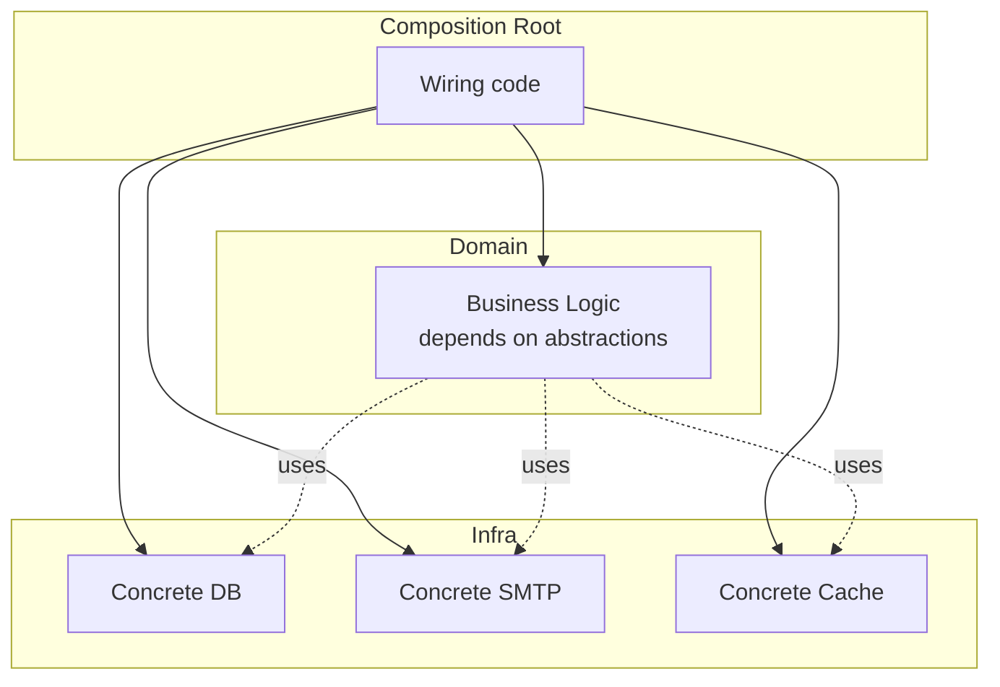
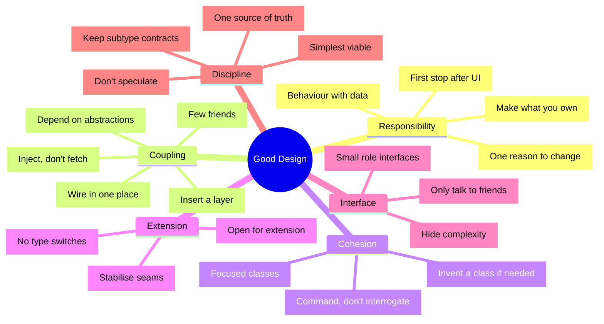

# GRASP & Extra Design Principles

> [!note] What you'll learn
> SOLID (see [[solid-principles]]) is the headline act, but it's far from the whole show. **GRASP** (General Responsibility Assignment Software Patterns) is the broader catalogue Craig Larman published in *Applying UML and Patterns* (1997). Around it orbit a handful of heuristics — **Law of Demeter**, **DRY/KISS/YAGNI**, **Tell, Don't Ask**, **Composition Root** — that together with SOLID form a working designer's mental toolkit.

Related: [[solid-principles]], [[composition-over-inheritance]], [[dependency-injection]], [[abstraction]], [[design-patterns-creational]], [[design-patterns-structural]], [[design-patterns-behavioral]].

---

## The Big Picture



---

## GRASP Patterns

GRASP isn't a set of *patterns* in the GoF sense — it's a set of **principles for assigning responsibility**. Each one answers the question *"which class should do X?"*

### 1. Information Expert

> **Assign a responsibility to the class that has the information needed to fulfil it.**

If a class already holds the data a responsibility needs, that class is the natural home for the behaviour. This is the OOP version of "co-locate data with the functions that operate on it".

#### Example

```python
# good — Sale has the line items, so Sale computes the total
@dataclass
class LineItem:
    product: str
    quantity: int
    price: float

    def subtotal(self) -> float:
        return self.quantity * self.price


@dataclass
class Sale:
    items: list[LineItem]

    def total(self) -> float:                # Sale is the Information Expert
        return sum(i.subtotal() for i in self.items)


# bad — putting total() on a separate Calculator that must be passed the items
class SaleCalculator:
    def total(self, items: list[LineItem]) -> float:
        return sum(i.subtotal() for i in items)
```

> [!warning] Information Expert vs Anaemic Domain Model
> "Information Expert" pushes behaviour *towards* the data. The opposite pattern — DTOs + services that operate on them — is the **Anaemic Domain Model**, an anti-pattern where objects are just data bags and all logic lives in `*Service` classes. Sometimes anaemic is right (CRUD apps); often it's a missed opportunity.

### 2. Creator

> **Assign class B the responsibility of creating instances of class A if one of these is true:**
> - B *contains* or *aggregates* A.
> - B *records* A.
> - B *closely uses* A.
> - B has the *initialising data* for A.

#### Example

```python
@dataclass
class Order:
    items: list[LineItem] = field(default_factory=list)

    def add_item(self, product: str, quantity: int, price: float) -> LineItem:
        # Order creates LineItem — it has the data, it aggregates the result
        item = LineItem(product, quantity, price)
        self.items.append(item)
        return item
```

Don't spread `LineItem(...)` construction all over the codebase. The class that *owns* line items is also the natural *factory* for them.

> [!note] Creator vs Factory pattern
> When creation becomes complex (validation, lookup, polymorphic choice), Creator gives way to the [[design-patterns-creational#2. Factory Method|Factory Method]] or [[design-patterns-creational#3. Abstract Factory|Abstract Factory]]. Creator is the *default*; Factory is the *escape hatch*.

### 3. Controller

> **Assign the responsibility of receiving or handling a system event to a class representing one of:**
> - The whole system (`SystemFacade`)
> - A specific use-case scenario ("session", "request handler")

Controllers are the *first object* after the UI. They coordinate, they don't *do* the work.

```python
class CheckoutController:                    # use-case controller
    def __init__(self, sale_service: SaleService):
        self._sale_service = sale_service

    def handle(self, request: dict) -> dict:
        # Translate input → domain call → translate result back out
        order = self._sale_service.checkout(request["items"], request["user"])
        return {"order_id": order.id, "total": order.total()}
```

> [!danger] Fat controllers are a smell
> A controller that contains business logic violates [[solid-principles#S — Single Responsibility Principle (SRP)|SRP]] and Information Expert. Keep controllers thin: parse input → call domain → render output.

### 4. Low Coupling

> **Assign responsibilities so that coupling between classes remains low.**

Coupling = how much one class *knows about* another. Low coupling means a change in A is unlikely to break B. Mechanisms:
- Depend on **abstractions**, not concretes ([[solid-principles#D — Dependency Inversion Principle (DIP)|DIP]]).
- Use **mediators** for many-to-many chatter ([[design-patterns-behavioral#4. Mediator|Mediator]]).
- Prefer **composition** with swappable parts ([[composition-over-inheritance]]).
- Hide internals behind **facades** ([[design-patterns-structural#5. Facade|Facade]]).

### 5. High Cohesion

> **Assign responsibilities so that cohesion remains high.**

Cohesion = how *focused* a class's responsibilities are. A class with high cohesion does one thing well; a class with low cohesion is a "junk drawer". Low cohesion almost always means low clarity, low testability, and high bug rate.

> [!tip] Coupling and cohesion are *opposites in practice*
> High cohesion tends to *reduce* coupling — focused classes have fewer reasons to reach out. Low coupling tends to *enable* high cohesion — small focused classes can be composed freely. They're the yin and yang of modular design.

### 6. Polymorphism

> **When behaviour varies by type, assign responsibilities using polymorphic operations — not `if/elif` on type.**

```python
# bad — type switch
def area(shape):
    if isinstance(shape, Circle): return math.pi * shape.r ** 2
    elif isinstance(shape, Square): return shape.s ** 2
    raise TypeError

# good — polymorphism
class Shape(ABC):
    @abstractmethod
    def area(self) -> float: ...
```

This is just [[solid-principles#O — Open/Closed Principle (OCP)|OCP]] from another angle. Polymorphism is the *mechanism* that makes OCP work.

### 7. Pure Fabrication

> **Assign a responsibility to a class that doesn't represent a domain concept, purely to achieve high cohesion / low coupling.**

Sometimes there is no "natural" domain object to give a responsibility to. Inventing one — a "fabrication" — is fine.

Examples: `TaxCalculator`, `EmailSender`, `TransactionManager`, `Serializer`. These don't model nouns in the domain; they exist to keep cohesion high and coupling low.

> [!warning] Pure Fabrication is a license, not a mandate
> It's tempting to fabricate a `*Manager` for everything and end up with an anaemic domain model. Reach for Pure Fabrication when *no* Information Expert is suitable — not as a habit.

### 8. Indirection

> **Assign a responsibility to an intermediate object to decouple two components.**

Indirection is the pattern behind [[design-patterns-structural#7. Proxy|Proxy]], [[design-patterns-behavioral#4. Mediator|Mediator]], [[design-patterns-structural#5. Facade|Facade]], adapters, and DI containers. The cost is one extra hop; the benefit is decoupling.

```python
# Without indirection
class A:
    def do(self): B().work()        # A knows about concrete B

# With indirection
class A:
    def __init__(self, b: B):       # A knows about abstraction B
        self._b = b
    def do(self): self._b.work()
```

> [!note] "All problems in computer science can be solved by another level of indirection — except for the problem of too many layers of indirection." — David Wheeler

### 9. Protected Variations

> **Identify points of predicted variation and assign responsibilities so that those variations don't break the rest of the system.**

PV is the *meta-pattern*: it's the goal that OCP, polymorphism, indirection, and DI all serve. When you expect something to vary (config, transport, payment method, storage), introduce an **abstraction** and let variations implement it.

PV is essentially [[solid-principles#O — Open/Closed Principle (OCP)|OCP]] — Larman's framing predates Martin's acronym. They are two ways of saying the same thing.

---

## Law of Demeter (Principle of Least Knowledge)

> **An object should only talk to its immediate friends, not to friends of friends.**

Formally, a method `m` of object `O` may only invoke methods of:
- `O` itself
- `m`'s parameters
- any objects `m` creates
- `O`'s direct components

#### ❌ Violation ("train wreck")

```python
customer.wallet.balance              # 👎 reaching through 3 objects
order.customer.address.zip_code      # 👎 same smell
car.engine.spark_plug.gap            # 👎 you know too much
```

#### ✅ Fixed

```python
customer.get_balance()               # ask, don't dig
order.ship_to_address()              # delegate
car.tune_up()                        # car knows how to tune itself
```

### Tell, Don't Ask

The Law of Demeter's slogan form: **tell objects what to do, don't ask them for their data and then decide for them**.

#### ❌ Ask

```python
def apply_discount(order):
    if order.customer.is_vip and order.total > 100:
        order.set_total(order.total * 0.9)
```

We pull state *out* of `order`, decide, then push state *back in*. The Order isn't really an object — it's a struct.

#### ✅ Tell

```python
def apply_discount(order):
    order.apply_vip_discount()       # order decides based on its own state
```

Now `Order` is an Information Expert with high cohesion and we can change discount rules in one place.

> [!danger] Demeter is not absolute
> DTOs, dataclasses, value objects, and query results are *intended* to be accessed via attributes. Don't bend your code inside out trying to apply Demeter to a `Point.x` / `Point.y`. Demeter is about *service* objects, not data structures. (See Martin Fowler's "Demeter is a fragment, not a full law".)

---

## DRY, KISS, YAGNI

### DRY — Don't Repeat Yourself

> "Every piece of knowledge must have a single, unambiguous, authoritative representation within a system." — Hunt & Thomas, *The Pragmatic Programmer*.

DRY isn't just about code duplication — it's about **knowledge duplication**. If the tax rate is hardcoded in three places, change is a bug waiting to happen.

```python
# bad — implicit duplication of the "tax rate = 0.21" fact
price_a = base_a * 1.21
price_b = base_b * 1.21
price_c = base_c * 1.21

# good — one source of truth
TAX_RATE = 0.21
def with_tax(base: float) -> float:
    return base * (1 + TAX_RATE)
```

> [!warning] "DRY" misread as "never write the same line twice"
> Forcing unrelated look-alike code to share an abstraction creates coupling. Two pieces of code that *look* the same but change for different reasons are *not* a DRY violation. The unit of DRY is *knowledge*, not *characters*.

### KISS — Keep It Simple, Stupid

> Simplicity is a feature. The simplest design that solves the problem is the best design.

If you're reaching for a pattern, ask: *could a function do this? Could a dataclass? Could a dict?* Patterns are tools; the simplest tool wins.

### YAGNI — You Aren't Gonna Need It

> Don't build for speculative future requirements. Build for *today's* requirements in a way that *can* evolve.

The cousin of [[solid-principles#O — Open/Closed Principle (OCP)|OCP]] — but with a brake: don't pre-extend. If you're adding an abstraction "in case we need to swap implementations later" but you only have one implementation, you're violating YAGNI. Wait for the second implementation; abstract at that point. (See also: "Rule of Three" — refactor on the third duplication, not the first.)



---

## Composition Root

> The **composition root** is the *single* place in an application where:
> - Concrete classes are instantiated
> - Dependencies are wired together
> - The object graph is built

Everything *above* the root (business logic) and *below* it (infrastructure) is abstract. The root is the only place that "knows everything".



This is the operational form of [[dependency-injection]]. Without a composition root, your `new`s are scattered, your tests are hellish, and you've effectively got a Service Locator smeared across the codebase.

### Where does the composition root live?

- In a CLI app: `main()`.
- In a web app: the framework's bootstrap (FastAPI `Depends`, Django `AppConfig.ready`, Flask `create_app()`).
- In a library: it doesn't — libraries don't have a composition root. They expose **abstractions** and let the *application* wire them.

> [!danger] Libraries should not have composition roots
> A library that calls `SmtpNotifier()` internally is forcing every consumer to use SMTP. A library exposes `Notifier` and lets the caller inject.

---

## Master Mind-Map: SOLID × GRASP × Heuristics



---

## How They Reinforce Each Other

| Principle                  | Reinforces                                                    |
| -------------------------- | ------------------------------------------------------------- |
| SRP                        | High Cohesion, Information Expert                             |
| OCP                        | Protected Variations, Polymorphism                            |
| LSP                        | Polymorphism, Information Expert (subtypes honour contracts)  |
| ISP                        | Low Coupling (don't force unused deps), Interface Segregation |
| DIP                        | Indirection, Composition Root, Low Coupling                   |
| Information Expert         | SRP, Tell Don't Ask                                           |
| Creator                    | Information Expert (creator often has the data)               |
| Low Coupling               | DIP, Indirection, Law of Demeter                              |
| High Cohesion              | SRP                                                           |
| Polymorphism               | OCP, Protected Variations                                     |
| Pure Fabrication           | Low Coupling (keeps domain clean), Indirection                |
| Indirection                | DIP, Low Coupling, Protected Variations                       |
| Protected Variations       | OCP, DIP                                                      |
| Law of Demeter             | Low Coupling, Tell Don't Ask                                  |
| DRY                        | Single Responsibility (for knowledge)                         |
| KISS                       | All of them — brakes on over-abstraction                      |
| YAGNI                      | OCP's brake — don't pre-extend                                |
| Tell Don't Ask             | Information Expert, Law of Demeter                            |
| Composition Root           | DIP, Low Coupling, DI                                         |

---

## Anti-Catalogue: Smells That Signal a Violation

| Smell                                          | Likely violated                                       |
| ---------------------------------------------- | ----------------------------------------------------- |
| Class with 20+ methods                          | SRP, High Cohesion                                    |
| `isinstance` checks in business code            | Polymorphism, OCP, LSP                                |
| God object everyone imports                     | Low Coupling, SRP                                     |
| Anaemic models + 100-line service methods       | Information Expert, Tell Don't Ask                    |
| Train wrecks: `a.b.c.d()`                        | Law of Demeter                                        |
| Comments like `# HACK: don't touch this`         | Protected Variations, OCP                             |
| Same constant in 5 files                        | DRY                                                   |
| `if kind == "X": ... elif kind == "Y": ...`     | Polymorphism, OCP                                     |
| `new` calls inside business logic               | DIP, Composition Root, Low Coupling                   |
| Constructor opens a socket                       | Composition Root, SRP                                 |
| Subclass that throws `NotImplementedError`      | LSP                                                   |
| Abstract base class with one implementation "for the future" | YAGNI                                       |

---

## Key Takeaways

1. **GRASP gives names to the questions** that come *before* SOLID: *who* should do *what*?
2. **Information Expert** + **High Cohesion** are the everyday workhorses — most "good" code follows them by instinct.
3. **Low Coupling** + **Indirection** + **Composition Root** + **DI** are different faces of the same idea: *don't reach across boundaries*.
4. **Polymorphism** + **Protected Variations** + **OCP** are the same idea wearing different hats: *seal the seams against variation*.
5. **Law of Demeter** + **Tell, Don't Ask** protect your objects from being treated as structs.
6. **DRY** is about *knowledge*, not code lines. **KISS** is a brake. **YAGNI** is an even harder brake.
7. **Composition Root** is where the abstract worlds of domain and infrastructure finally meet — in *one* file.
8. None of these are *rules* — they are *forces*. Good design balances them. The mark of a senior designer is knowing *which* to yield to when they conflict.

---

## Practice Exercises

> [!exercise] 1. Information Expert audit
> Take an anaemic model in a project you know (a `User` dataclass plus a `UserService`). List three responsibilities currently in `UserService` that should live on `User`. Move them. Compare the tests before/after.

> [!exercise] 2. Creator
> Find a class that creates another class but isn't its natural owner. Refactor so the owner is the creator.

> [!exercise] 3. Controller thinness
> Pick a fat controller. List every responsibility. Move business rules to a use-case class; leave input parsing and response formatting in the controller.

> [!exercise] 4. Coupling map
> Draw a Mermaid diagram of dependencies in one module of your code. Highlight the three worst coupling arrows and propose one indirection that would soften each.

> [!exercise] 5. Law of Demeter
> Find a "train wreck" in your codebase (`a.b.c().d()`). Refactor using Tell, Don't Ask.

> [!exercise] 6. DRY knowledge
> Find a piece of duplicated *knowledge* (a constant, a default value, a business rule) in your codebase. Consolidate. *Then* find duplicated code that *isn't* duplicated knowledge and explain why you wouldn't merge it.

> [!exercise] 7. YAGNI
> Find a class or abstraction in your codebase that has only one implementation. Speculate on whether it's needed. If you can delete it without losing anything, do so.

> [!exercise] 8. Composition root
> If your codebase has no composition root, write one. Move all `new`s to it. Identify one class that becomes trivially testable as a result.

> [!exercise] 9. Smell hunt
> Use the anti-catalogue table to do a 30-minute review of a codebase. Log every smell and which principle it violates. Pick three to fix.

> [!exercise] 10. Conflict
> Describe a situation where **YAGNI** conflicts with **OCP** (e.g. "should I add the abstraction now or wait for the second implementation?"). Write down the rule *you* would use to decide.

> [!exercise] 11. Pure Fabrication
> Pick a responsibility that doesn't naturally belong to any domain object. Fabricate a class for it. Justify why it's a Pure Fabrication and not Information Expert in disguise.

> [!exercise] 12. Reflection
> Write a one-paragraph "design philosophy" for yourself, in your own words, that places SOLID, GRASP, and the heuristics into priority order for *your* kind of project.

---

Next: [[solid-principles]] | [[composition-over-inheritance]] | [[dependency-injection]] | [[design-patterns-creational]]
