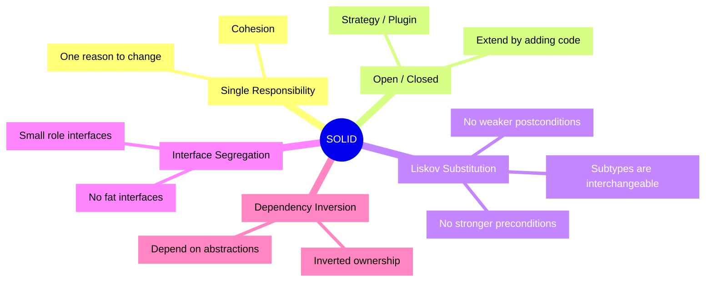
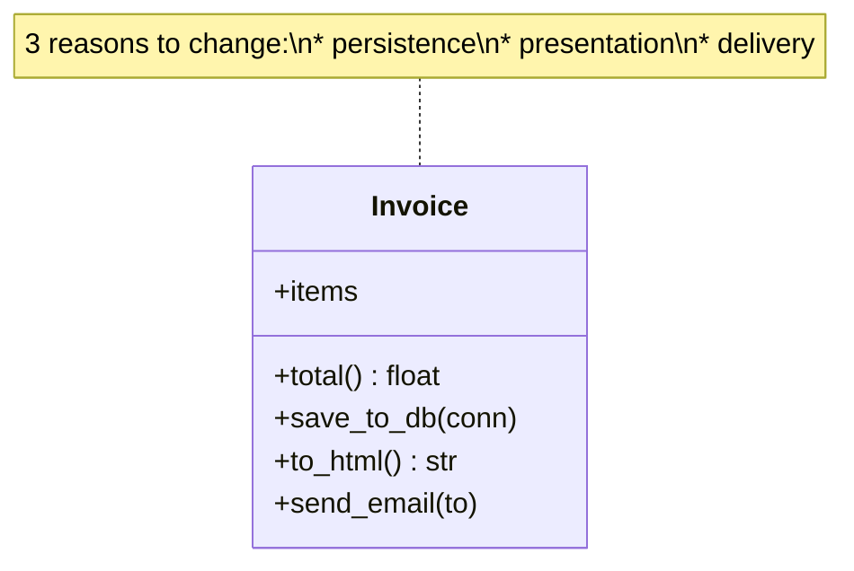
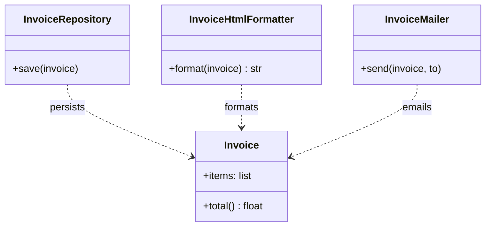
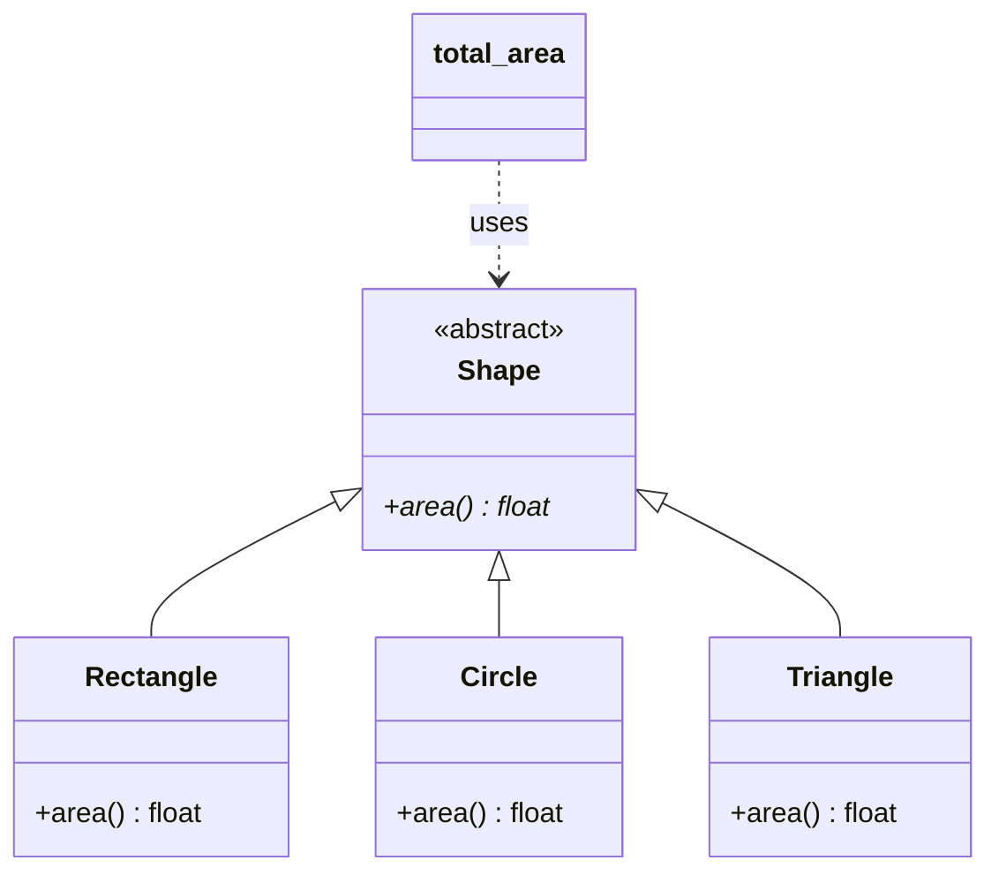
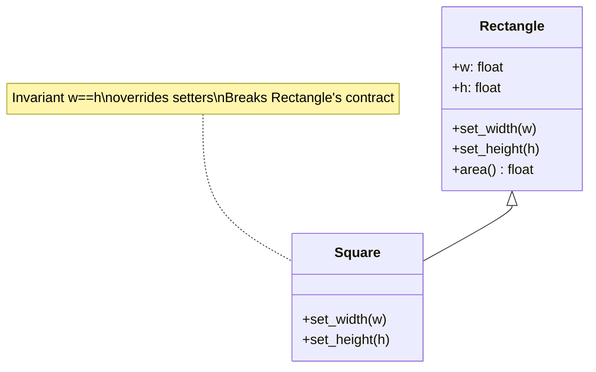
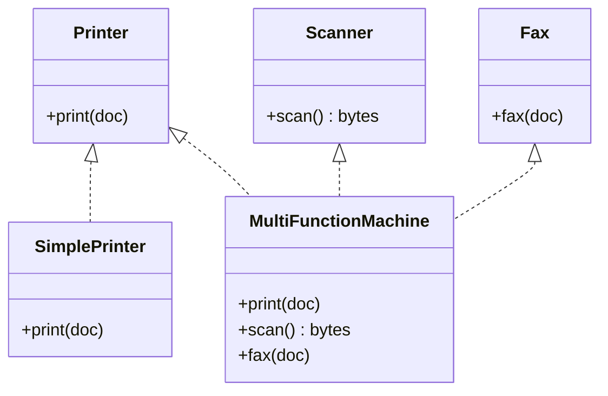
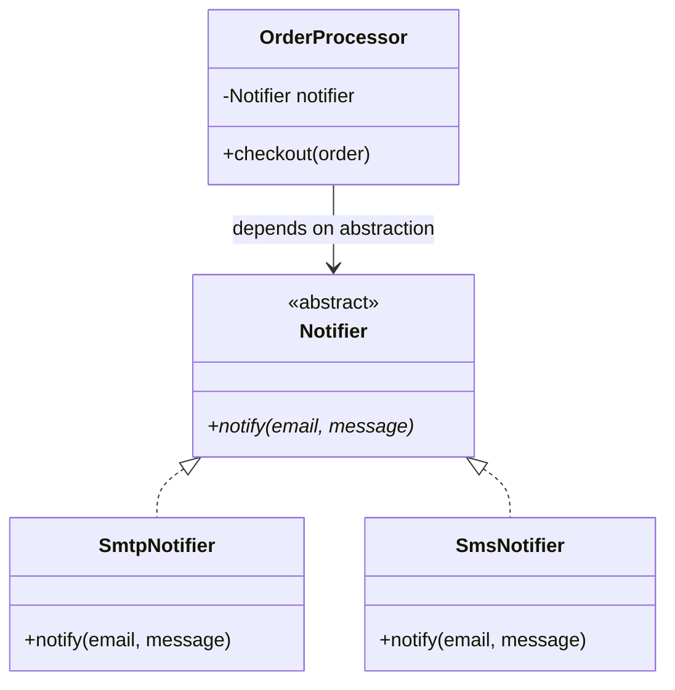
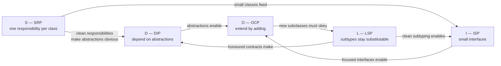
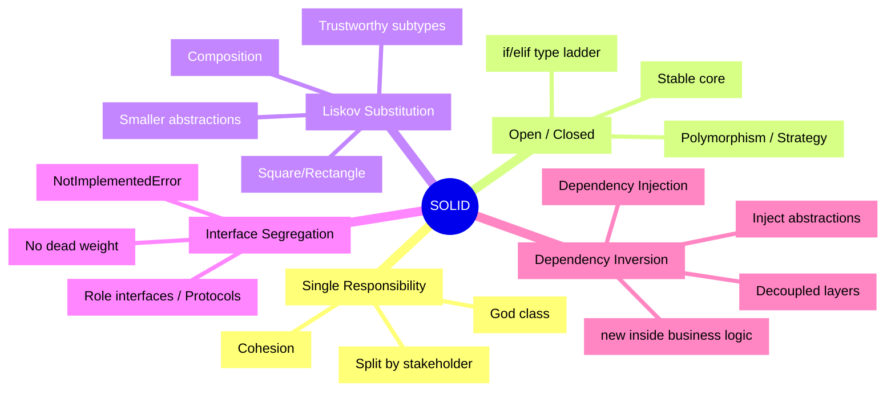

# SOLID Principles

> [!tip] The mnemonic that saved a million codebases
> **SOLID** is an acronym coined by **Robert C. Martin ("Uncle Bob")** in the early 2000s, gathering five principles of *object-oriented design* that — when followed — produce code that is **easy to maintain, extend, and test**. Each principle targets a specific *smell* that tends to rot code over time.

Related notes: [[abstraction]], [[inheritance]], [[composition-over-inheritance]], [[dependency-injection]], [[grasp-and-extra-principles]], [[design-patterns-creational]].

---

## At a Glance

| Letter | Principle                        | One-liner                                                                                            |
| ------ | -------------------------------- | ---------------------------------------------------------------------------------------------------- |
| **S**  | Single Responsibility Principle  | A class should have **one reason to change**.                                                        |
| **O**  | Open/Closed Principle            | Software entities should be **open for extension, closed for modification**.                         |
| **L**  | Liskov Substitution Principle    | Subtypes must be **substitutable** for their base types without breaking the program.                |
| **I**  | Interface Segregation Principle  | Clients shouldn't be **forced to depend on interfaces they don't use**.                              |
| **D**  | Dependency Inversion Principle   | Depend on **abstractions**, not concretions. High-level modules shouldn't depend on low-level ones.  |



---

## S — Single Responsibility Principle (SRP)

> **One-line definition:** A class should have **one, and only one, reason to change**.

### Deeper Explanation

"Reason to change" really means "reason to change *because of some stakeholder or group*". If a class handles persistence, business rules, and email formatting, three different teams can independently demand a change — that's three reasons to change, three axes of instability.

SRP is fundamentally about **cohesion**: gather together things that change for the same reason, separate things that change for different reasons. See also [[grasp-and-extra-principles]] → *High Cohesion*.

> [!warning] Misconception
> SRP is **not** "a class should do one thing" (that's too vague). It is "a class should have one *stakeholder* it serves". A `Invoice` class may legitimately compute totals, validate, and format — if all that responsibility belongs to the *accounting* team. The "stakeholder" view (Uncle Bob's later refinement) is the rigorous one.

### ❌ Violation

```python
# bad_srp.py — God class doing too much
class Invoice:
    def __init__(self, items: list[tuple[str, float]]):
        self.items = items

    def total(self) -> float:
        return sum(q * p for _, p in self.items)  # acts as `quantity * price` (toy demo)

    def save_to_db(self, conn) -> None:
        conn.execute("INSERT INTO invoices ...", ...)  # persistence concern

    def to_html(self) -> str:                          # presentation concern
        rows = "".join(f"<li>{n}: {p}</li>" for n, p in self.items)
        return f"<ul>{rows}</ul>"

    def send_email(self, to: str) -> None:             # delivery concern
        print(f"Sending invoice to {to}")
```

Three reasons to change: schema migration, redesign of the HTML, change in SMTP server. Touch any of them and you risk breaking the others.



### ✅ Fix

Split into focused collaborators. The `Invoice` becomes a *data + business rule* class. Persistence, presentation, and delivery move into their own classes.

```python
# good_srp.py
from dataclasses import dataclass

@dataclass
class Invoice:
    items: list[tuple[str, float]]

    def total(self) -> float:
        return sum(q * p for _, p in self.items)


class InvoiceRepository:
    def __init__(self, conn):
        self._conn = conn

    def save(self, invoice: Invoice) -> None:
        self._conn.execute("INSERT INTO invoices ...", ...)


class InvoiceHtmlFormatter:
    def format(self, invoice: Invoice) -> str:
        rows = "".join(f"<li>{n}: {p}</li>" for n, p in invoice.items)
        return f"<ul>{rows}</ul>"


class InvoiceMailer:
    def __init__(self, smtp_client):
        self._smtp = smtp_client

    def send(self, invoice: Invoice, to: str) -> None:
        body = InvoiceHtmlFormatter().format(invoice)
        self._smtp.send(to, body)
```



> [!example] Real-world analogy
> A restaurant's chef doesn't wash the dishes, take orders at the register, *and* cook. Each role is its own job — that's how the restaurant survives the dinner rush without breaking down.

---

## O — Open/Closed Principle (OCP)

> **One-line definition:** Software entities should be **open for extension, but closed for modification**.

### Deeper Explanation

You should be able to *add* new behaviour without *editing* existing, tested code. The classic mechanism is **polymorphism**: clients depend on an abstraction, and you introduce new subclasses/strategies instead of patching the existing ones with `if/elif` ladders.

> [!note] Bertrand Meyer (1988)
> The OCP was originally formulated for *inheritance*; today we usually implement it via **composition + strategy objects** because inheritance-based extension tends to violate LSP. See [[composition-over-inheritance]].

### ❌ Violation

```python
# bad_ocp.py — every new shape requires editing the area calculator
import math

class Rectangle:
    def __init__(self, w: float, h: float):
        self.w, self.h = w, h

class Circle:
    def __init__(self, r: float):
        self.r = r


def total_area(shapes: list) -> float:
    total = 0.0
    for s in shapes:
        if isinstance(s, Rectangle):
            total += s.w * s.h
        elif isinstance(s, Circle):
            total += math.pi * s.r ** 2
        # 👈 each new shape = edit this function
    return total
```

### ✅ Fix

Introduce a common abstraction. New shapes plug in without touching the calculator.

```python
# good_ocp.py
from __future__ import annotations
from abc import ABC, abstractmethod
import math


class Shape(ABC):
    @abstractmethod
    def area(self) -> float: ...


class Rectangle(Shape):
    def __init__(self, w: float, h: float):
        self.w, self.h = w, h

    def area(self) -> float:
        return self.w * self.h


class Circle(Shape):
    def __init__(self, r: float):
        self.r = r

    def area(self) -> float:
        return math.pi * self.r ** 2


class Triangle(Shape):                     # 👈 new shape, no edits elsewhere
    def __init__(self, base: float, height: float):
        self.base, self.height = base, height

    def area(self) -> float:
        return 0.5 * self.base * self.height


def total_area(shapes: list[Shape]) -> float:
    return sum(s.area() for s in shapes)
```



> [!tip] OCP in the wild
> The Python plugin ecosystem (entry points, `pluggy`, `click` commands) is OCP at scale: the framework code never edits itself — *plugins* extend it.

---

## L — Liskov Substitution Principle (LSP)

> **One-line definition:** Objects of a subtype should be **substitutable** for objects of the supertype without altering the correctness of the program.

### Deeper Explanation

Barbara Liskov's 1987 formulation: *if `S` is a subtype of `T`, then objects of type `T` may be replaced with objects of type `S` without breaking the desired properties of the program.*

Rigorous contracts:
- **Preconditions** cannot be **strengthened** in a subtype.
- **Postconditions** cannot be **weakened** in a subtype.
- **Invariants** of the supertype must be **preserved**.
- **History constraint**: don't introduce mutator state the parent disallowed (e.g. immutable parent + mutable child = LSP violation).

### The classic Square/Rectangle problem

A `Square` *is-a* `Rectangle` mathematically, but as a *mutable* subtype it breaks invariants.

#### ❌ Violation

```python
# bad_lsp.py
class Rectangle:
    def __init__(self, w: float, h: float):
        self.w = w
        self.h = h

    def set_width(self, w: float) -> None:
        self.w = w

    def set_height(self, h: float) -> None:
        self.h = h

    def area(self) -> float:
        return self.w * self.h


class Square(Rectangle):
    def set_width(self, w: float) -> None:
        self.w = w
        self.h = w                       # keep invariant: w == h

    def set_height(self, h: float) -> None:
        self.w = h
        self.h = h


def use(rect: Rectangle) -> None:
    rect.set_width(5)
    rect.set_height(4)
    assert rect.area() == 20, f"Expected 20, got {rect.area()}"


use(Rectangle(2, 2))   # ✅ passes
use(Square(2, 2))      # ❌ AssertionError: Expected 20, got 16
```

`Square` cannot be substituted for `Rectangle` — the contract "after `set_width(5); set_height(4)` the area is `20`" is broken.



#### ✅ Fix

Don't pretend a `Square` *is-a* mutable `Rectangle`. Either:

**Option A — favour composition / immutable values.**

```python
# good_lsp_a.py — immutable shapes via dataclasses
from dataclasses import dataclass

@dataclass(frozen=True)
class Rectangle:
    width: float
    height: float

    def area(self) -> float:
        return self.width * self.height


@dataclass(frozen=True)
class Square:
    side: float

    def area(self) -> float:
        return self.side ** 2
```

**Option B — share a common, behaviour-light abstraction.**

```python
# good_lsp_b.py
from abc import ABC, abstractmethod

class Shape(ABC):
    @abstractmethod
    def area(self) -> float: ...

class Rectangle(Shape):
    def __init__(self, w: float, h: float):
        self._w, self._h = w, h
    def area(self) -> float:
        return self._w * self._h

class Square(Shape):
    def __init__(self, side: float):
        self._side = side
    def area(self) -> float:
        return self._side ** 2
```

> [!danger] LSP is the most violated SOLID principle
> Most inheritance hierarchies in the wild contain at least one quiet LSP violation. Symptoms: `isinstance` checks downstream, "subtypes" that throw `NotImplementedError`, overridden methods that ignore arguments, "illegal" states a parent claims are valid.

### Other LSP smells

| Smell                                          | Why it's bad                                          |
| ---------------------------------------------- | ----------------------------------------------------- |
| Subclass throws `NotImplementedError` for an inherited method | Removes a capability the parent promised          |
| Subclass accepts **fewer** inputs              | Strengthened precondition                            |
| Subclass returns values **outside** parent's range | Weakened postcondition                            |
| Subclass changes a documented side-effect      | Violates history/invariant contract                  |

---

## I — Interface Segregation Principle (ISP)

> **One-line definition:** Clients should not be forced to depend on interfaces they do not use.

### Deeper Explanation

"Fat" interfaces force every implementer to provide methods it can't meaningfully support. ISP says: **split fat interfaces into smaller, role-specific ones**. In Python (which has no explicit `interface` keyword), we use `abc.ABC` or **Protocols** (`typing.Protocol`) to express role interfaces.

> [!note] Python's duck typing softens ISP
> Because Python doesn't require explicit interface declarations, fat interfaces hurt less than in Java/C#. But the principle still applies: if you *do* use `ABC` or `Protocol`, keep them small.

### ❌ Violation

```python
# bad_isp.py — fat interface
from abc import ABC, abstractmethod

class MultiFunctionDevice(ABC):
    @abstractmethod
    def print(self, doc: bytes) -> None: ...
    @abstractmethod
    def scan(self) -> bytes: ...
    @abstractmethod
    def fax(self, doc: bytes) -> None: ...

class SimplePrinter(MultiFunctionDevice):
    def print(self, doc: bytes) -> None:
        print("printing")

    def scan(self) -> bytes:
        raise NotImplementedError   # 👈 forced to implement something irrelevant

    def fax(self, doc: bytes) -> None:
        raise NotImplementedError
```

### ✅ Fix

Split into role interfaces and let each class implement only what it can do.

```python
# good_isp.py
from abc import ABC, abstractmethod


class Printer(ABC):
    @abstractmethod
    def print(self, doc: bytes) -> None: ...


class Scanner(ABC):
    @abstractmethod
    def scan(self) -> bytes: ...


class Fax(ABC):
    @abstractmethod
    def fax(self, doc: bytes) -> None: ...


class SimplePrinter(Printer):
    def print(self, doc: bytes) -> None:
        print("printing")


class MultiFunctionMachine(Printer, Scanner, Fax):
    def print(self, doc: bytes) -> None: ...
    def scan(self) -> bytes: ...
    def fax(self, doc: bytes) -> None: ...
```



> [!tip] Python Protocol for zero-coupling ISP
> Use `typing.Protocol` so implementers don't even have to inherit — pure structural typing.

```python
from typing import Protocol

class Printable(Protocol):
    def print(self, doc: bytes) -> None: ...
```

---

## D — Dependency Inversion Principle (DIP)

> **One-line definition:**
> 1. High-level modules should not depend on low-level modules. **Both should depend on abstractions.**
> 2. Abstractions should not depend on details. **Details should depend on abstractions.**

### Deeper Explanation

The "inversion" is *who owns the abstraction*. In traditional layered code, the high-level module *uses* the low-level module, so the abstraction typically lives in the low-level module. DIP says: invert ownership — the high-level module owns the abstraction (interface), and the low-level module *implements* it. This decouples the high level from the low level entirely.

The mechanism that makes this practical is **dependency injection** — see [[dependency-injection]].

### ❌ Violation

```python
# bad_dip.py
import smtplib

class OrderProcessor:
    def __init__(self):
        self._smtp = smtplib.SMTP("localhost")     # concrete dependency, hidden

    def checkout(self, order) -> None:
        # business logic ...
        self._smtp.sendmail("shop@example.com", order.email, b"thanks")
```

`OrderProcessor` (high-level) directly depends on `smtplib.SMTP` (low-level). Tests need an SMTP server; you can't swap to an SMS notifier without editing this class.

### ✅ Fix

Define the abstraction *in the high-level domain* and inject an implementation.

```python
# good_dip.py
from abc import ABC, abstractmethod


class Notifier(ABC):                              # abstraction owned by high-level domain
    @abstractmethod
    def notify(self, email: str, message: str) -> None: ...


class SmtpNotifier(Notifier):                     # low-level detail conforms to abstraction
    def __init__(self, host: str):
        import smtplib
        self._smtp = smtplib.SMTP(host)

    def notify(self, email: str, message: str) -> None:
        self._smtp.sendmail("shop@example.com", email, message.encode())


class OrderProcessor:
    def __init__(self, notifier: Notifier):       # depend on abstraction, injected
        self._notifier = notifier

    def checkout(self, order) -> None:
        # ... business logic ...
        self._notifier.notify(order.email, "thanks")


# Wiring (composition root, see [[grasp-and-extra-principles]])
processor = OrderProcessor(SmtpNotifier("localhost"))
```



> [!example] Real-world analogy
> A restaurant chef calls `OrderTicket.place()` — they don't care whether the ticket is printed on paper, displayed on a screen, or shouted. The "kitchen" depends on the *abstraction* of "an order ticket", and the *details* (printer/screen/shouter) implement it.

---

## How the Five Reinforce Each Other



- **SRP** makes the *seams* (extension points) visible — you can't invert a dependency you can't see.
- **ISP** produces small interfaces; small interfaces are easy to implement, which makes **OCP** extension cheap.
- **OCP** demands extension by new subtypes; **LSP** guarantees those subtypes don't break callers.
- **DIP** ties it together: every "extension point" is just *another implementer of an abstraction*.

When you violate one, you usually violate another soon after. Violating SRP tends to also violate OCP (you keep editing the god class). Violating LSP forces `isinstance` checks, which violates OCP. Violating ISP creates fat interfaces, which makes DIP's "abstractions" leaky.

---

## Master Mind-Map



---

## Key Takeaways

1. **SOLID is about *change*.** Each principle answers "what rots, and how do I keep it from rotting?"
2. **SRP** is about *cohesion* — one stakeholder per class.
3. **OCP** is about *extension safety* — add features by adding code, not editing it.
4. **LSP** is about *contract honesty* — subtypes keep their parents' promises.
5. **ISP** is about *interface size* — small role interfaces beat fat ones.
6. **DIP** is about *direction of dependency* — both layers bow to an abstraction the high level owns.
7. **Don't over-apply.** A 50-line script doesn't need five layers of abstractions. SOLID pays off when **change** and **testing** start to hurt.
8. **SOLID + composition + DI** are the trifecta. See [[composition-over-inheritance]] and [[dependency-injection]].

---

## Practice Exercises

> [!exercise] 1. Spot the SRP violation
> Refactor this class so each reason-to-change lives in its own class:
> ```python
> class UserAccount:
>     def register(self, email, password): ...
>     def hash_password(self, p): ...
>     def send_welcome_email(self, email): ...
>     def save(self, db): ...
>     def export_csv(self) -> str: ...
> ```

> [!exercise] 2. OCP — pricing rules
> A shop has a `price(items)` function that applies discounts by `if item.category == "BOOK": ... elif ...`. Refactor to OCP: adding a new category must not edit `price`.

> [!exercise] 3. LSP — the bird cage
> Given:
> ```python
> class Bird:
>     def fly(self): ...
> class Penguin(Bird):
>     def fly(self): raise NotImplementedError
> ```
> Design a hierarchy that respects LSP. (Hint: separate `FlyingBird` and `FlightlessBird`, or model `Locomotion` as a strategy.)

> [!exercise] 4. ISP — ATM interface
> An `ATM` interface has `withdraw`, `deposit`, `check_balance`, `refill_cash`, `reboot`. Split into role interfaces for: a customer-facing device, an operator-facing device, a maintenance device.

> [!exercise] 5. DIP — notifications
> Take a `PasswordResetService` that imports `smtplib` and sends mail directly. Invert the dependency: define `Notifier`, inject it, and provide an `EmailNotifier` and `LogNotifier` for tests.

> [!exercise] 6. Code review
> Find a class in a project you know that has more than 500 lines. Identify which SOLID principles it violates and propose one concrete refactor.

> [!exercise] 7. Diagram
> Pick a system you've worked on and draw a Mermaid class diagram of the dependencies. Highlight which arrows violate DIP and rewrite them.

> [!exercise] 8. Anti-example
> Write a 30-line "before" snippet that violates *all five* principles simultaneously, then explain each violation to a peer.

---

Next: [[design-patterns-creational]] | [[composition-over-inheritance]] | [[dependency-injection]] | [[grasp-and-extra-principles]]
