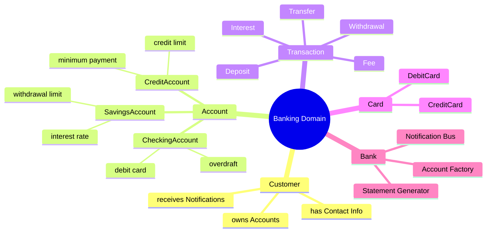
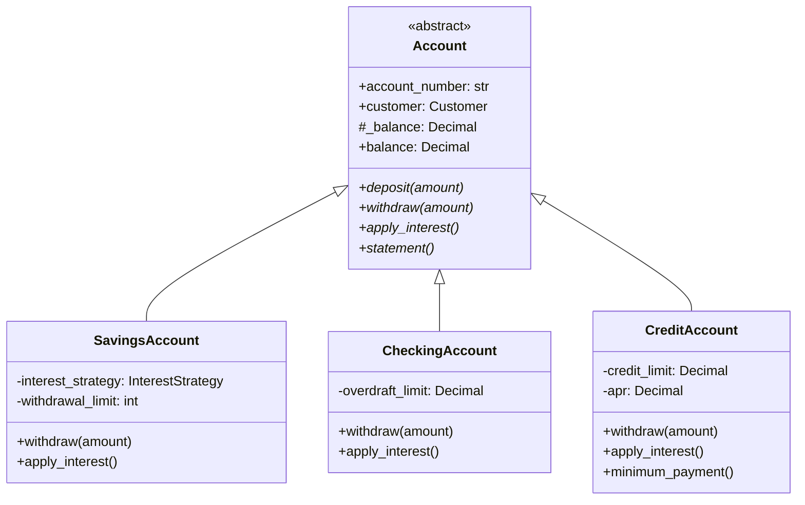
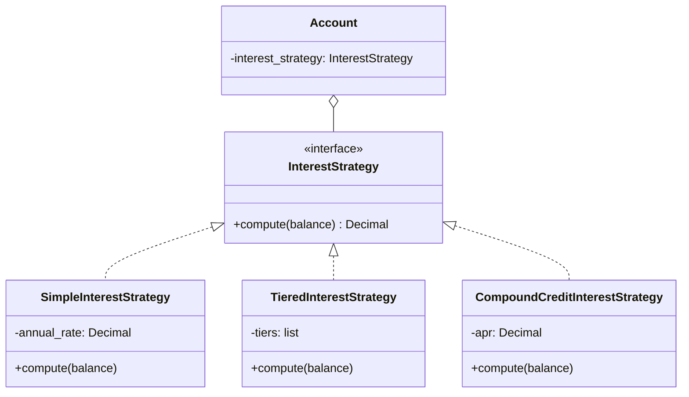
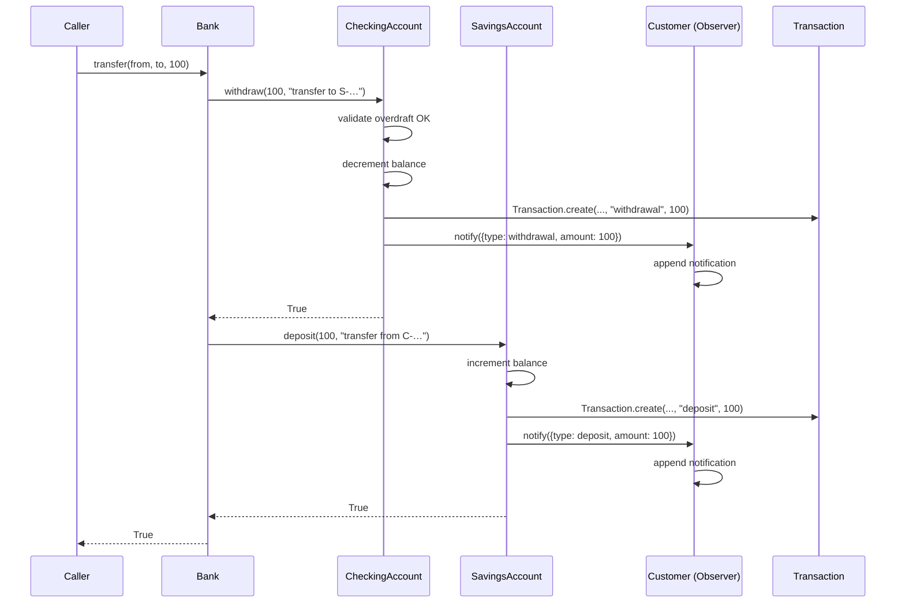
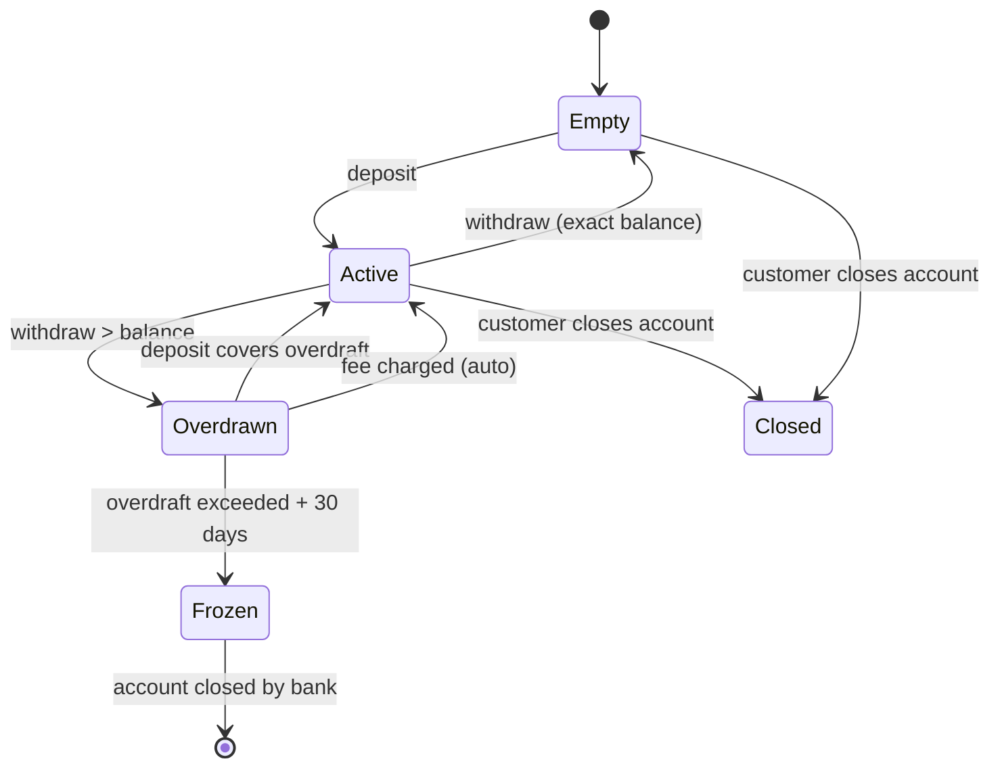

# Real-World OOP — A Banking System

> [!info] Why a banking system?
> Banking is the canonical teaching domain for OOP because it maps almost 1:1 to real-world nouns (`Customer`, `Account`, `Transaction`, `Card`) and verbs (`deposit`, `withdraw`, `transfer`) — exactly the modeling exercise at the heart of object thinking. It is also a domain where **getting encapsulation wrong has financial consequences**, which makes the lessons stick.

This file walks you through a complete, runnable Python implementation of a small but realistic retail bank. We use it to demonstrate **all four pillars of OOP**, **SOLID in practice**, and **four design patterns** (Strategy, Observer, Factory, Command) in a single coherent codebase.

---

## 1. The Domain at a Glance

A retail bank keeps track of **customers** who own one or more **accounts**. Each account belongs to one of several specialised types (`SavingsAccount`, `CheckingAccount`, `CreditAccount`). Every money movement — `deposit`, `withdraw`, `transfer`, interest accrual, fee — is recorded as a **Transaction** object. A **Card** may be linked to a checking account. A **Bank** aggregates all of these and provides the public service layer.



---

## 2. Design Decisions Up Front

Before writing any code, we list the architectural decisions and *why* we made them. This is how senior engineers actually design systems — not by jumping to code, but by articulating trade-offs.

| Decision | Choice | Why |
|---|---|---|
| Balance storage | Private attribute `_balance` with property accessor | Encapsulation — clients can't mutate balance directly, all changes go through validated methods. |
| Account hierarchy | Abstract base `Account` + concrete subclasses | Polymorphism — `withdraw()` behaves differently per type, but the call site is uniform. |
| Interest calculation | Strategy pattern injected into account | Open/Closed — add new interest algorithms without touching `Account`. |
| Transaction recording | Immutable `Transaction` dataclass + `Command` semantics | Single Responsibility — `Transaction` only records, `Account` only mutates balance, the command layer orchestrates. |
| Notifications | Observer pattern (`Subject`/`Observer`) | Decoupling — accounts don't know who listens; customers, fraud monitors, and audit loggers subscribe independently. |
| Account creation | Factory method on `Bank` | Centralises invariants (unique account numbers, default interest strategy, etc.). |
| Money representation | Integer cents via `Decimal` | Avoids float rounding errors. *Always* a teaching moment. |

> [!tip] Teaching Tip
> Walk students through this table *before* showing code. Ask: "If we stored balance as a public attribute, what could go wrong?" Let them brainstorm: negative deposits, race conditions, missing audit trail. *Then* introduce encapsulation as the answer.

---

## 3. The Inheritance Hierarchy



> [!note] Liskov Substitution in action
> Anywhere a function accepts an `Account`, it must work correctly with any subclass. The contract is: `withdraw(amount)` returns `True` if the withdrawal succeeded, `False` otherwise — it never raises a `TypeError` for a "wrong" account type. This is the L in SOLID, see [[Liskov-Substitution]].

---

## 4. Core Code — Step by Step

### 4.1 The Money Type

```python
from decimal import Decimal, ROUND_HALF_UP
from datetime import datetime
from uuid import uuid4
from abc import ABC, abstractmethod
from dataclasses import dataclass, field
from typing import Optional


def money(cents: int) -> Decimal:
    """Convert integer cents to a Decimal dollar amount."""
    return (Decimal(cents) / 100).quantize(Decimal("0.01"), rounding=ROUND_HALF_UP)
```

> [!warning] Never use `float` for money
> `0.1 + 0.2 == 0.30000000000000004` in IEEE 754. Over a million transactions, those errors accumulate. `Decimal` is exact for base-10 arithmetic. Show students this:
> ```python
> >>> sum([0.1] * 10) == 1.0
> False
> ```

### 4.2 The `Transaction` Class — Encapsulation + Command Pattern

A `Transaction` is **immutable** (frozen dataclass) and acts as a *Command object*: it encapsulates everything needed to record, replay, or audit a single money movement.

```python
@dataclass(frozen=True)
class Transaction:
    """An immutable record of a single money movement.

    Responsibilities (SRP): record *what happened*, *when*, *to which account*,
    and *why* (the transaction type). It does NOT mutate balances — that is
    the account's job.
    """
    transaction_id: str
    account_number: str
    type: str            # "deposit" | "withdrawal" | "transfer_in" | "transfer_out" | "interest" | "fee"
    amount: Decimal      # always positive; direction is implied by `type`
    timestamp: datetime
    description: str = ""
    related_account: Optional[str] = None  # for transfers

    @classmethod
    def create(cls, account_number: str, type_: str, amount: Decimal,
               description: str = "", related_account: Optional[str] = None) -> "Transaction":
        return cls(
            transaction_id=str(uuid4()),
            account_number=account_number,
            type=type_,
            amount=amount,
            timestamp=datetime.utcnow(),
            description=description,
            related_account=related_account,
        )
```

> [!tip] Why "Command"?
> Treating each transaction as a *command object* lets us add features later — undo, audit replay, fraud-detection pipelines — without changing `Account`. This is the **Open/Closed Principle** in disguise.

### 4.3 The `InterestStrategy` — Strategy Pattern

Different account types compute interest differently. Rather than burying `if account_type == "savings"` logic inside `Account`, we extract the algorithm into a **Strategy**.

```python
class InterestStrategy(ABC):
    """Strategy interface — algorithms for computing interest."""
    @abstractmethod
    def compute(self, balance: Decimal) -> Decimal:
        ...


class SimpleInterestStrategy(InterestStrategy):
    """Simple annual interest, prorated daily. Used by savings accounts."""
    def __init__(self, annual_rate: Decimal):
        self._annual_rate = annual_rate

    def compute(self, balance: Decimal) -> Decimal:
        # Daily rate = annual / 365; interest for one day.
        return (balance * self._annual_rate / Decimal(365)).quantize(
            Decimal("0.01"), rounding=ROUND_HALF_UP
        )


class TieredInterestStrategy(InterestStrategy):
    """Higher balance → higher rate. Used by premium savings."""
    def __init__(self, tiers: list[tuple[Decimal, Decimal]]):
        # tiers: [(min_balance, annual_rate), ...] sorted ascending
        self._tiers = sorted(tiers, key=lambda t: t[0])

    def compute(self, balance: Decimal) -> Decimal:
        rate = self._tiers[0][1]
        for min_balance, r in self._tiers:
            if balance >= min_balance:
                rate = r
        return (balance * rate / Decimal(365)).quantize(
            Decimal("0.01"), rounding=ROUND_HALF_UP
        )


class CompoundCreditInterestStrategy(InterestStrategy):
    """Daily compounding APR for credit accounts. Charged on owed balance."""
    def __init__(self, apr: Decimal):
        self._apr = apr

    def compute(self, balance: Decimal) -> Decimal:
        # If balance is positive (i.e. customer owes money), charge interest.
        if balance > 0:
            return (balance * self._apr / Decimal(365)).quantize(
                Decimal("0.01"), rounding=ROUND_HALF_UP
            )
        return Decimal("0.00")
```



> [!note] Why Strategy instead of inheritance?
> A `PremiumSavingsAccount` *could* be a subclass of `SavingsAccount`, but what if a customer wants to switch tiers dynamically? Inheritance is static at construction; a Strategy can be swapped at runtime. **Favour composition over inheritance** — see [[Composition-Over-Inheritance]].

### 4.4 The `Customer` and Observer Pattern

A `Customer` owns accounts and *observes* them: every time a transaction occurs, the customer is notified (this is the basis of push-notification banking apps).

```python
class Observer(ABC):
    @abstractmethod
    def update(self, event: dict) -> None:
        ...


class Subject(ABC):
    """Minimal Observer subject mixin."""
    def __init__(self):
        self._observers: list[Observer] = []

    def attach(self, observer: Observer) -> None:
        if observer not in self._observers:
            self._observers.append(observer)

    def detach(self, observer: Observer) -> None:
        self._observers.remove(observer)

    def notify(self, event: dict) -> None:
        for observer in list(self._observers):  # copy: observers may detach during notify
            observer.update(event)


class Customer(Observer):
    def __init__(self, customer_id: str, name: str, email: str):
        self.customer_id = customer_id
        self.name = name
        self.email = email
        self.notifications: list[str] = []

    def update(self, event: dict) -> None:
        # In a real system this would push to a mobile app or send an email.
        msg = f"[{event['timestamp']}] {event['type']} on {event['account']}: {event['amount']}"
        self.notifications.append(msg)
        print(f"  📧 Notify {self.name}: {msg}")

    def __repr__(self) -> str:
        return f"Customer({self.customer_id}, {self.name})"
```

### 4.5 The Abstract `Account` Class — Abstraction + Encapsulation

```python
class Account(Subject, ABC):
    """Abstract base for all account types.

    Encapsulation: balance is stored as `_balance_cents` (int) and exposed
    via the read-only `balance` property. All mutations go through `deposit`
    or `withdraw`, which validate and record a transaction.

    Abstraction: `withdraw`, `apply_interest`, and `statement` are abstract;
    each subclass implements them per its own rules.
    """

    def __init__(self, account_number: str, customer: Customer,
                 interest_strategy: Optional[InterestStrategy] = None):
        super().__init__()  # initialise Subject's observer list
        self.account_number = account_number
        self.customer = customer
        self._balance_cents: int = 0  # internal representation: integer cents
        self._transactions: list[Transaction] = []
        self._interest_strategy = interest_strategy

        # The customer automatically observes their own account.
        self.attach(customer)

    # --- Encapsulated balance access -------------------------------------
    @property
    def balance(self) -> Decimal:
        return money(self._balance_cents)

    def _set_balance(self, new_balance: Decimal) -> None:
        """Private setter — enforces non-negative invariant for assets.
        Subclasses with credit (which can be 'owed') override if needed."""
        if new_balance < 0:
            raise ValueError(f"Balance cannot be negative: {new_balance}")
        self._balance_cents = int((new_balance * 100).to_integral_value())

    # --- Public API ------------------------------------------------------
    def deposit(self, amount: Decimal, description: str = "deposit") -> bool:
        if amount <= 0:
            raise ValueError("Deposit must be positive")
        self._set_balance(self.balance + amount)
        txn = Transaction.create(self.account_number, "deposit", amount, description)
        self._record(txn)
        return True

    @abstractmethod
    def withdraw(self, amount: Decimal, description: str = "withdrawal") -> bool:
        """Subclasses implement their own rules (overdraft, credit limit, etc.)."""
        ...

    @abstractmethod
    def apply_interest(self) -> Optional[Transaction]:
        """Apply one period of interest. Returns the recorded transaction or None."""
        ...

    @abstractmethod
    def statement(self) -> str:
        """Return a human-readable statement."""
        ...

    # --- Internal helpers ------------------------------------------------
    def _record(self, txn: Transaction) -> None:
        self._transactions.append(txn)
        self.notify({
            "type": txn.type,
            "amount": str(txn.amount),
            "account": self.account_number,
            "timestamp": txn.timestamp.isoformat(),
            "description": txn.description,
        })

    @property
    def transactions(self) -> list[Transaction]:
        """Return a defensive copy — encapsulation extends to read access."""
        return list(self._transactions)

    def __repr__(self) -> str:
        return f"{type(self).__name__}({self.account_number}, balance={self.balance})"
```

> [!tip] Teaching Tip — Encapsulation is about *contracts*, not privacy
> Python's `_balance_cents` is a convention, not a wall. The real encapsulation is the **contract**: "If you want to change balance, you must call `deposit` or `withdraw`, which will validate the amount *and* record a transaction *and* notify observers." That contract — enforced by code review and tests — is what gives encapsulation its power, not the leading underscore.

### 4.6 Concrete Account Types — Polymorphism

```python
class SavingsAccount(Account):
    """High-yield savings. Cannot go negative. Daily withdrawal limit."""

    DAILY_WITHDRAWAL_LIMIT = Decimal("1000.00")

    def __init__(self, account_number: str, customer: Customer,
                 interest_strategy: InterestStrategy):
        super().__init__(account_number, customer, interest_strategy)
        self._withdrawn_today = Decimal("0.00")

    def withdraw(self, amount: Decimal, description: str = "withdrawal") -> bool:
        if amount <= 0:
            raise ValueError("Withdrawal must be positive")
        if self._withdrawn_today + amount > self.DAILY_WITHDRAWAL_LIMIT:
            print(f"  ⚠️  Withdrawal {amount} exceeds daily limit")
            return False
        if amount > self.balance:
            print(f"  ⚠️  Insufficient funds: have {self.balance}, need {amount}")
            return False
        self._set_balance(self.balance - amount)
        self._withdrawn_today += amount
        self._record(Transaction.create(self.account_number, "withdrawal", amount, description))
        return True

    def apply_interest(self) -> Optional[Transaction]:
        if self._interest_strategy is None:
            return None
        interest = self._interest_strategy.compute(self.balance)
        if interest > 0:
            self._set_balance(self.balance + interest)
            txn = Transaction.create(self.account_number, "interest", interest, "daily interest")
            self._record(txn)
            return txn
        return None

    def statement(self) -> str:
        return (f"SAVINGS ACCOUNT {self.account_number}\n"
                f"  Owner: {self.customer.name}\n"
                f"  Balance: {self.balance}\n"
                f"  Withdrawn today: {self._withdrawn_today} / {self.DAILY_WITHDRAWAL_LIMIT}\n"
                f"  Transactions: {len(self._transactions)}\n")


class CheckingAccount(Account):
    """Day-to-day checking. Allows overdraft up to a configured limit."""

    def __init__(self, account_number: str, customer: Customer,
                 overdraft_limit: Decimal = Decimal("500.00"),
                 interest_strategy: Optional[InterestStrategy] = None):
        super().__init__(account_number, customer, interest_strategy)
        self.overdraft_limit = overdraft_limit

    def withdraw(self, amount: Decimal, description: str = "withdrawal") -> bool:
        if amount <= 0:
            raise ValueError("Withdrawal must be positive")
        # Allow balance to go negative, but only down to -overdraft_limit.
        if self.balance - amount < -self.overdraft_limit:
            print(f"  ⚠️  Overdraft exceeded: limit is -{self.overdraft_limit}")
            return False
        # Bypass _set_balance's non-negative invariant — overdraft is legitimate here.
        new_balance = self.balance - amount
        self._balance_cents = int((new_balance * 100).to_integral_value())
        self._record(Transaction.create(self.account_number, "withdrawal", amount, description))
        # Charge a fee if we're now in overdraft.
        if self.balance < 0:
            fee = Decimal("25.00")
            self._balance_cents -= int((fee * 100).to_integral_value())
            self._record(Transaction.create(self.account_number, "fee", fee, "overdraft fee"))
        return True

    def apply_interest(self) -> Optional[Transaction]:
        # Checking accounts typically don't earn interest. If a strategy is
        # injected (e.g. rewards checking), apply it on positive balances only.
        if self._interest_strategy and self.balance > 0:
            interest = self._interest_strategy.compute(self.balance)
            self._set_balance(self.balance + interest)
            txn = Transaction.create(self.account_number, "interest", interest, "rewards interest")
            self._record(txn)
            return txn
        return None

    def statement(self) -> str:
        return (f"CHECKING ACCOUNT {self.account_number}\n"
                f"  Owner: {self.customer.name}\n"
                f"  Balance: {self.balance} (overdraft limit: -{self.overdraft_limit})\n"
                f"  Transactions: {len(self._transactions)}\n")


class CreditAccount(Account):
    """Credit card account. Balance represents how much the customer *owes*."""

    def __init__(self, account_number: str, customer: Customer,
                 credit_limit: Decimal, apr: Decimal):
        # Note: balance starts at 0 (customer owes nothing). It goes UP when
        # they spend and DOWN when they pay. The non-negative invariant in
        # Account._set_balance does NOT apply here — we override the setter.
        super().__init__(account_number, customer,
                         interest_strategy=CompoundCreditInterestStrategy(apr))
        self.credit_limit = credit_limit
        self.apr = apr

    # Override the inherited invariant — credit balances CAN be positive (owed).
    def _set_balance(self, new_balance: Decimal) -> None:
        if new_balance < 0:
            # A negative credit balance means the customer overpaid — allowed but flagged.
            print(f"  ℹ️  Credit balance is negative ({new_balance}); customer overpaid")
        self._balance_cents = int((new_balance * 100).to_integral_value())

    def withdraw(self, amount: Decimal, description: str = "purchase") -> bool:
        # On a credit account, "withdraw" means "make a purchase on credit".
        if amount <= 0:
            raise ValueError("Purchase must be positive")
        if self.balance + amount > self.credit_limit:
            print(f"  ⚠️  Credit limit exceeded: limit {self.credit_limit}, owed {self.balance}")
            return False
        self._set_balance(self.balance + amount)
        self._record(Transaction.create(self.account_number, "withdrawal", amount, description))
        return True

    def pay(self, amount: Decimal) -> bool:
        """A payment reduces the owed balance (i.e. 'deposit' on a credit account)."""
        if amount <= 0:
            raise ValueError("Payment must be positive")
        self._set_balance(self.balance - amount)
        self._record(Transaction.create(self.account_number, "deposit", amount, "payment received"))
        return True

    def apply_interest(self) -> Optional[Transaction]:
        interest = self._interest_strategy.compute(self.balance)
        if interest > 0:
            self._set_balance(self.balance + interest)
            txn = Transaction.create(self.account_number, "interest", interest, "finance charge")
            self._record(txn)
            return txn
        return None

    def minimum_payment(self) -> Decimal:
        """Standard rule: 1% of balance + interest, or $25, whichever is greater."""
        if self.balance <= 0:
            return Decimal("0.00")
        return max(self.balance * Decimal("0.01"), Decimal("25.00"))

    def statement(self) -> str:
        return (f"CREDIT ACCOUNT {self.account_number}\n"
                f"  Owner: {self.customer.name}\n"
                f"  Owed: {self.balance} / {self.credit_limit} limit\n"
                f"  APR: {self.apr * 100:.2f}%\n"
                f"  Minimum payment due: {self.minimum_payment()}\n"
                f"  Transactions: {len(self._transactions)}\n")
```

> [!note] Polymorphism in `withdraw`
> The three account types implement `withdraw` with completely different rules:
> - **Savings** refuses to go negative and enforces a daily limit.
> - **Checking** allows a negative balance up to the overdraft limit and charges a fee.
> - **Credit** moves the balance *up* (you owe more) up to the credit limit.
>
> Yet the call site — `account.withdraw(50)` — looks identical for all three. This is the Liskov Substitution Principle in action.

### 4.7 The `Card` Class — Composition

```python
@dataclass
class Card:
    card_number: str
    account_number: str       # composition: card references its account
    expiry: str
    cvv: str
    active: bool = True

    def authorize(self, amount: Decimal) -> bool:
        return self.active  # Real system would call into the account's balance check
```

### 4.8 The `Bank` — Factory + Service Layer

```python
class Bank:
    """The bank is a service layer + factory.

    Single Responsibility: it coordinates account lifecycle and cross-account
    operations like transfers. It does NOT contain business rules for individual
    account types — those live in the subclasses.
    """

    def __init__(self, name: str):
        self.name = name
        self._accounts: dict[str, Account] = {}
        self._customers: dict[str, Customer] = {}
        self._next_account_seq = 1000

    # --- Customer management ---------------------------------------------
    def register_customer(self, name: str, email: str) -> Customer:
        customer_id = f"C{len(self._customers) + 1:05d}"
        customer = Customer(customer_id, name, email)
        self._customers[customer_id] = customer
        return customer

    # --- FACTORY: account creation ---------------------------------------
    def open_savings_account(self, customer: Customer,
                             annual_rate: Decimal = Decimal("0.02")) -> SavingsAccount:
        acct_num = self._generate_account_number("S")
        strategy = SimpleInterestStrategy(annual_rate)
        account = SavingsAccount(acct_num, customer, strategy)
        self._accounts[acct_num] = account
        return account

    def open_checking_account(self, customer: Customer,
                              overdraft_limit: Decimal = Decimal("500.00")) -> CheckingAccount:
        acct_num = self._generate_account_number("C")
        account = CheckingAccount(acct_num, customer, overdraft_limit)
        self._accounts[acct_num] = account
        return account

    def open_credit_account(self, customer: Customer,
                            credit_limit: Decimal = Decimal("5000.00"),
                            apr: Decimal = Decimal("0.1899")) -> CreditAccount:
        acct_num = self._generate_account_number("X")
        account = CreditAccount(acct_num, customer, credit_limit, apr)
        self._accounts[acct_num] = account
        return account

    def _generate_account_number(self, prefix: str) -> str:
        self._next_account_seq += 1
        return f"{prefix}-{self._next_account_seq:07d}"

    # --- Cross-account operations ----------------------------------------
    def transfer(self, from_number: str, to_number: str, amount: Decimal,
                 description: str = "transfer") -> bool:
        """Transfer money between any two accounts.
        Uses the Command pattern: build two linked transactions, attempt both,
        and roll back if the second leg fails."""
        source = self._accounts.get(from_number)
        dest = self._accounts.get(to_number)
        if source is None or dest is None:
            raise KeyError("Unknown account number")
        if source is dest:
            raise ValueError("Cannot transfer to the same account")

        # Withdraw from source (recorded as 'transfer_out')
        if not source.withdraw(amount, description=f"transfer to {to_number}"):
            return False
        # If we got here, source withdrawal succeeded.
        # Now deposit into destination (recorded as 'transfer_in').
        # In a real system this would be wrapped in a DB transaction.
        try:
            dest.deposit(amount, description=f"transfer from {from_number}")
        except Exception:
            # Roll back the source withdrawal
            source.deposit(amount, description="rollback of failed transfer")
            return False
        return True

    # --- Batch operations ------------------------------------------------
    def accrue_daily_interest(self) -> int:
        """Run end-of-day interest accrual on every account. Returns count."""
        count = 0
        for account in self._accounts.values():
            if account.apply_interest() is not None:
                count += 1
        return count

    # --- Reporting -------------------------------------------------------
    def print_all_statements(self) -> None:
        print(f"\n=== {self.name} — Statement Run ===")
        for account in self._accounts.values():
            print(account.statement())


# Optional: a registry-based factory for dynamic account creation by type code.
ACCOUNT_FACTORIES = {
    "savings":   lambda bank, customer, **kw: bank.open_savings_account(customer, **kw),
    "checking":  lambda bank, customer, **kw: bank.open_checking_account(customer, **kw),
    "credit":    lambda bank, customer, **kw: bank.open_credit_account(customer, **kw),
}


def open_account(bank: Bank, customer: Customer, kind: str, **kwargs) -> Account:
    """Public factory function — callers don't need to know the concrete class."""
    if kind not in ACCOUNT_FACTORIES:
        raise ValueError(f"Unknown account type: {kind}")
    return ACCOUNT_FACTORIES[kind](bank, customer, **kwargs)
```

### 4.9 Putting It All Together — End-to-End Demo

```python
def demo():
    bank = Bank("Hill Valley Savings & Loan")

    # 1. Register a customer
    marty = bank.register_customer("Marty McFly", "marty@example.com")

    # 2. Open three accounts of different types
    savings   = bank.open_savings_account(marty, annual_rate=Decimal("0.035"))
    checking  = bank.open_checking_account(marty, overdraft_limit=Decimal("300.00"))
    credit    = bank.open_credit_account(marty, credit_limit=Decimal("2000.00"),
                                          apr=Decimal("0.2199"))

    # 3. Make deposits
    savings.deposit(Decimal("1000.00"), "initial deposit")
    checking.deposit(Decimal("500.00"), "paycheck")

    # 4. Withdrawals demonstrate polymorphism
    savings.withdraw(Decimal("200.00"), "ATM")
    checking.withdraw(Decimal("700.00"), "rent")  # triggers overdraft + fee
    credit.withdraw(Decimal("150.00"), "online purchase")

    # 5. Transfer money
    bank.transfer(checking.account_number, savings.account_number, Decimal("100.00"))

    # 6. Apply interest (one day)
    bank.accrue_daily_interest()

    # 7. Print statements
    bank.print_all_statements()

    # 8. Inspect Marty's notifications (Observer pattern in action)
    print(f"\nMarty received {len(marty.notifications)} notifications:")
    for n in marty.notifications[-3:]:
        print(f"  {n}")


if __name__ == "__main__":
    demo()
```

When you run this, you should see Marty's notifications stream in real time as each transaction fires the Observer pattern, and you'll see how each account type reports a different statement format — yet the call sites (`deposit`, `withdraw`, `transfer`) are uniform.

---

## 5. The Transaction Lifecycle as a Sequence

Here is what happens *under the hood* when `bank.transfer(checking.account_number, savings.account_number, 100)` is called:



> [!tip] Teaching Tip
> Pause after this sequence and ask: "Where in this flow is encapsulation enforced? Where is polymorphism? Where is the Observer?" Students who can answer all three *understand* the patterns, not just the syntax.

---

## 6. Account State Machine

A `CheckingAccount` has implicit states governed by its balance relative to the overdraft limit. Making these explicit helps reason about fees and risk.



> [!note] Implicit vs Explicit State
> Our implementation has *implicit* state — the state is encoded in `self.balance` and `self.overdraft_limit`. For a teaching example this is fine. In production, you'd often promote states to first-class objects using the [[State-Pattern]] to make transitions auditable and to prevent illegal ones (e.g. withdrawing from a frozen account).

---

## 7. SOLID Compliance Walkthrough

| Principle | Where in the code |
|---|---|
| **S**ingle Responsibility | `Transaction` only records. `Account` only mutates its own balance. `Bank` only orchestrates cross-account ops. `InterestStrategy` only computes interest. |
| **O**pen/Closed | Add a new account type (e.g. `JointAccount`) without touching `Bank.transfer` — it works on any `Account`. Add a new interest algorithm by implementing `InterestStrategy`, no need to edit `Account`. |
| **L**iskov Substitution | `bank.transfer` calls `source.withdraw(...)` and `dest.deposit(...)` polymorphically. Any `Account` subclass works — that's the whole point. |
| **I**nterface Segregation | `InterestStrategy` exposes only `compute(balance)`. `Observer` exposes only `update(event)`. Clients depend on narrow interfaces. |
| **D**ependency Inversion | `Account` depends on the `InterestStrategy` *abstraction*, not on a concrete `SimpleInterestStrategy`. Strategies are injected at construction. |

---

## 8. Design Patterns Summary

```mermaid
graph TB
    subgraph "Patterns in this codebase"
        S[Strategy<br/>InterestStrategy]
        O[Observer<br/>Customer listens to Account]
        F[Factory<br/>Bank.open_*_account]
        C[Command<br/>Transaction is an immutable command object]
    end
    subgraph "Pillars demonstrated"
        E[Encapsulation<br/>_balance_cents + property]
        I[Inheritance<br/>Account → Savings/Checking/Credit]
        P[Polymorphism<br/>withdraw() differs per type]
        A[Abstraction<br/>Account is ABC]
    end
    S --> E
    O --> E
    F --> I
    C --> P
    P --> A
```

---

## 9. Extensions and Exercises for Students

> [!example] Lab assignments
> 1. **Add a `JointAccount`** that has two `Customer` owners. Both must be notified. (Tests Observer + Inheritance.)
> 2. **Add a `FraudMonitor` observer** that flags any withdrawal over $10,000. (Tests Open/Closed — no changes to `Account`.)
> 3. **Refactor `Bank.transfer` to use an explicit `Transaction` command queue** with `execute()` and `undo()` methods. (Tests Command pattern.)
> 4. **Add a `TieredInterestStrategy`** with three tiers and benchmark how much interest a $50,000 balance earns over a year versus `SimpleInterestStrategy`. (Tests Strategy.)
> 5. **Add a `Repository` layer** that persists accounts to a JSON file. The `Bank` should depend on an `AccountRepository` abstraction. (Tests DIP + [[Repository-Pattern]].)
> 6. **Write unit tests** for each account type's `withdraw` method. Use parameterised tests to verify Liskov substitution. (Tests [[Unit-Testing-OOP]].)
> 7. **Find the race condition**: if two threads call `withdraw` simultaneously, can the balance go below the overdraft limit? Fix it with a `threading.Lock`. (Teaches concurrency + encapsulation.)

---

## 10. Common Mistakes to Discuss

> [!danger] Pitfalls students hit
> - **Public balance attribute.** If you expose `account.balance = 1000`, you skip validation and transaction recording. Encapsulation isn't about privacy; it's about *preserving invariants*.
> - **Type-checking instead of polymorphism.** If `Bank.transfer` does `if isinstance(source, SavingsAccount)`, you've broken OCP. The whole point is that the call site doesn't know.
> - **Floats for money.** Just don't. `Decimal` or integer cents, always.
> - **God-object `Bank`.** Resist putting interest calculations, statement formatting, and notification logic inside `Bank`. Each responsibility belongs to its own class.
> - **Ignoring the Observer lifecycle.** If a `Customer` is deleted but still attached to an `Account`, you have a memory leak (and a privacy issue). Use `weakref` in production systems.

---

## 11. Testing the Banking System

Good OOP code is testable code. Because we separated responsibilities and depended on abstractions, every class can be tested in isolation. Here is a sample `pytest` suite that demonstrates the testing strategies covered in [[Unit-Testing-OOP]] and [[Mocking-And-Stubs]].

```python
import pytest
from decimal import Decimal
from banking import (Bank, Customer, SavingsAccount, CheckingAccount,
                     CreditAccount, SimpleInterestStrategy,
                     CompoundCreditInterestStrategy)

@pytest.fixture
def customer():
    return Customer("C001", "Test Customer", "test@example.com")

@pytest.fixture
def bank():
    return Bank("Test Bank")


class TestSavingsAccount:
    def test_deposit_increases_balance(self, customer, bank):
        acct = bank.open_savings_account(customer)
        acct.deposit(Decimal("100.00"))
        assert acct.balance == Decimal("100.00")

    def test_withdraw_reduces_balance_and_records_transaction(self, customer, bank):
        acct = bank.open_savings_account(customer)
        acct.deposit(Decimal("500.00"))
        acct.withdraw(Decimal("200.00"))
        assert acct.balance == Decimal("300.00")
        assert len(acct.transactions) == 2  # deposit + withdrawal

    def test_cannot_overdraw_savings(self, customer, bank):
        acct = bank.open_savings_account(customer)
        acct.deposit(Decimal("100.00"))
        assert acct.withdraw(Decimal("200.00")) is False
        assert acct.balance == Decimal("100.00")  # unchanged

    def test_daily_withdrawal_limit_enforced(self, customer, bank):
        acct = bank.open_savings_account(customer)
        acct.deposit(Decimal("5000.00"))
        acct.withdraw(Decimal("900.00"))
        # Second withdrawal would push us over $1000 daily limit
        assert acct.withdraw(Decimal("200.00")) is False

    def test_negative_deposit_raises(self, customer, bank):
        acct = bank.open_savings_account(customer)
        with pytest.raises(ValueError):
            acct.deposit(Decimal("-50.00"))


class TestCheckingAccount:
    def test_overdraft_allowed_within_limit(self, customer, bank):
        acct = bank.open_checking_account(customer, overdraft_limit=Decimal("100.00"))
        # No deposit; go straight into overdraft
        assert acct.withdraw(Decimal("50.00")) is True
        assert acct.balance == Decimal("-75.00")  # -50 withdrawal + -25 fee

    def test_overdraft_beyond_limit_refused(self, customer, bank):
        acct = bank.open_checking_account(customer, overdraft_limit=Decimal("100.00"))
        assert acct.withdraw(Decimal("200.00")) is False


class TestCreditAccount:
    def test_purchase_increases_owed_balance(self, customer, bank):
        acct = bank.open_credit_account(customer, credit_limit=Decimal("1000.00"),
                                         apr=Decimal("0.1899"))
        acct.withdraw(Decimal("200.00"))
        assert acct.balance == Decimal("200.00")  # owed

    def test_payment_reduces_owed_balance(self, customer, bank):
        acct = bank.open_credit_account(customer, credit_limit=Decimal("1000.00"),
                                         apr=Decimal("0.1899"))
        acct.withdraw(Decimal("200.00"))
        acct.pay(Decimal("50.00"))
        assert acct.balance == Decimal("150.00")

    def test_credit_limit_enforced(self, customer, bank):
        acct = bank.open_credit_account(customer, credit_limit=Decimal("100.00"),
                                         apr=Decimal("0.1899"))
        assert acct.withdraw(Decimal("150.00")) is False


class TestTransfer:
    def test_transfer_moves_money(self, bank, customer):
        src = bank.open_checking_account(customer)
        dst = bank.open_savings_account(customer)
        src.deposit(Decimal("1000.00"))
        assert bank.transfer(src.account_number, dst.account_number, Decimal("250.00"))
        assert src.balance == Decimal("750.00")
        assert dst.balance == Decimal("250.00")

    def test_transfer_rolls_back_on_failure(self, bank, customer):
        src = bank.open_checking_account(customer, overdraft_limit=Decimal("0.00"))
        dst = bank.open_savings_account(customer)
        src.deposit(Decimal("100.00"))
        # Try to transfer more than source has — should fail and leave source intact
        assert bank.transfer(src.account_number, dst.account_number,
                             Decimal("5000.00")) is False
        assert src.balance == Decimal("100.00")  # unchanged
        assert dst.balance == Decimal("0.00")


class TestObserverPattern:
    def test_customer_receives_notification_on_deposit(self, customer, bank):
        acct = bank.open_savings_account(customer)
        acct.deposit(Decimal("100.00"))
        assert len(customer.notifications) == 1
        assert "deposit" in customer.notifications[0]


class TestStrategyPattern:
    def test_simple_interest_strategy(self):
        s = SimpleInterestStrategy(Decimal("0.0365"))  # 3.65% APR
        # One day of interest on $1000 should be $0.10
        assert s.compute(Decimal("1000.00")) == Decimal("0.10")

    def test_compound_credit_interest_charges_on_positive_balance(self):
        s = CompoundCreditInterestStrategy(Decimal("0.365"))  # 36.5% APR
        # Owed $1000, one day interest = $1.00
        assert s.compute(Decimal("1000.00")) == Decimal("1.00")

    def test_compound_credit_interest_zero_on_negative_balance(self):
        s = CompoundCreditInterestStrategy(Decimal("0.365"))
        # Customer overpaid; no interest
        assert s.compute(Decimal("-100.00")) == Decimal("0.00")
```

> [!tip] Teaching Tip
> Notice how each test class corresponds to a production class, and each test method follows the **Arrange / Act / Assert** structure. Because our code respects SRP, every test focuses on one behaviour in isolation. If a test needs to set up a sprawling object graph, that's a *code smell* telling you your classes are too coupled.

> [!note] Why test the *contract*, not the implementation
> Our tests check `acct.balance` after `withdraw`, not the internal `_balance_cents` attribute. This means we could later swap the storage representation (say, from integer cents to a database row) and the tests would still pass. Testing through the public interface is what makes refactoring safe — see [[Refactoring-Strategies]].

---

## 12. Adding a Second Observer — Fraud Monitoring

To demonstrate the Open/Closed Principle concretely, let's add a brand-new observer *without modifying any existing class*:

```python
class FraudMonitor(Observer):
    """Detects suspicious transactions and freezes accounts if needed."""
    LARGE_TRANSACTION_THRESHOLD = Decimal("10000.00")

    def __init__(self):
        self.alerts: list[str] = []

    def update(self, event: dict) -> None:
        amount = Decimal(event["amount"])
        if amount >= self.LARGE_TRANSACTION_THRESHOLD:
            alert = (f"🚨 FRAUD ALERT: {event['type']} of {amount} "
                     f"on account {event['account']}")
            self.alerts.append(alert)
            print(alert)


# Usage — plug in without touching Account, Bank, or Customer:
monitor = FraudMonitor()
savings.attach(monitor)  # that's it; monitor now receives every transaction event
savings.deposit(Decimal("15000.00"))  # triggers the alert
```

This is the *Open/Closed Principle in living colour*: we *extended* the system with new behaviour (fraud detection) without *modifying* any existing class. The Observer pattern is what made it possible.

---

## 13. How This Maps to Real Banking Software

Real banking systems (Mambu, Temenos, Thought Machine) follow the same shapes you see here, just at much larger scale:

- **Accounts** are aggregate roots in DDD terms (see [[Domain-Driven-Design]]).
- **Transactions** are events stored in an append-only ledger (Event Sourcing, see [[Service-Layer]]).
- **Interest calculation** is genuinely a Strategy — different products (mortgages, CDs, credit cards) plug in different formulas.
- **Notifications** flow through a message bus (Kafka, SQS) — Observer at scale.
- **Account creation** is heavily regulated, so the Factory pattern enforces KYC/AML checks before returning an `Account` reference.

If students understand this 600-line example, they understand 80% of the *architectural* ideas behind real core-banking systems.

---

## 14. Procedural vs Object-Oriented — Side-by-Side

To drive home *why* the design above matters, here is the same business logic written in a procedural style. It works — for now. As you read it, ask yourself: "What happens when I add a fourth account type? What happens when I add a fraud monitor? What happens when I add an audit log?"

```python
# Procedural bank — a single dict-of-dicts with global functions.
accounts = {}  # {acct_num: {"type": str, "balance": int, "customer": str, ...}}

def deposit(acct_num, amount):
    if acct_num not in accounts:
        raise KeyError(acct_num)
    accounts[acct_num]["balance"] += amount
    # ...but who records the transaction? Who notifies the customer?
    # ...where do we put the overdraft logic? The credit limit logic?
    # ...what if the account is a credit account and balance should go DOWN?

def withdraw(acct_num, amount):
    acct = accounts[acct_num]
    if acct["type"] == "savings":
        if amount > acct["balance"]:
            return False
        # ...and what about the daily withdrawal limit?
        acct["balance"] -= amount
    elif acct["type"] == "checking":
        if acct["balance"] - amount < -acct.get("overdraft_limit", 0):
            return False
        acct["balance"] -= amount
        if acct["balance"] < 0:
            acct["balance"] -= 2500  # $25 fee in cents
            # but who records the fee? Where does it go in the transaction log?
    elif acct["type"] == "credit":
        if acct["balance"] + amount > acct["credit_limit"]:
            return False
        acct["balance"] += amount  # owed balance goes UP
    else:
        raise ValueError(f"Unknown account type: {acct['type']}")
    return True
```

Now imagine extending this. Every new account type means a new `elif` branch in *every* function that touches accounts. Every new feature (fraud, audit, notifications) means editing *every* function that mutates state. The procedural version has *high coupling* and *low cohesion* — it's a [[God-Object]] in procedural clothing.

The OOP version instead says: "Each account type owns its own withdrawal rules. Each account notifies its own observers. The bank orchestrates but doesn't micromanage." Adding a fourth account type means writing one new class; existing code is *untouched*. That is the [[Open-Closed]] principle paying off.

> [!example] Discussion prompt for class
> Show students both versions side by side. Ask: "Which version would you rather maintain if the bank added a new `JointAccount` type and a new fraud-detection requirement *next sprint*?" The answer should crystallise *why* OOP exists.

---

## 15. A Note on Concurrency

Banking systems are inherently concurrent — many customers act on shared state simultaneously. Our example uses no locks, so under concurrent access the balance invariant can be violated:

```python
# Thread A: balance = 100, withdraws 80 → checks 80 <= 100 ✓
# Thread B: balance = 100, withdraws 80 → checks 80 <= 100 ✓
# Thread A: sets balance = 20
# Thread B: sets balance = 20   ← WRONG! We over-withdrew.
```

The fix is to wrap mutation methods in a lock, *inside* the `Account` class:

```python
import threading

class Account(Subject, ABC):
    def __init__(self, ...):
        super().__init__()
        self._lock = threading.RLock()
        ...

    def deposit(self, amount, description="deposit"):
        with self._lock:
            # ... existing logic
```

The lock belongs *inside* the account because the invariant (balance ≥ -overdraft_limit) is *the account's responsibility*, not the caller's. This is encapsulation paying off again — by centralising the invariant in one class, we centralise its concurrency protection too.

> [!warning] Real concurrency is harder
> Wrapping individual methods in a lock does *not* make `Bank.transfer` atomic. If the source withdrawal succeeds but the destination deposit fails, you've debited money into the void. The proper fix is a database transaction with two-phase commit. Our example *simulates* atomicity with a rollback — fine for teaching, insufficient for production.

---

## 16. Recap and Cross-References

In this single example we touched:

- **Four Pillars**: [[Encapsulation]] (private balance), [[Inheritance]] (Account hierarchy), [[Polymorphism]] (`withdraw`), [[Abstraction]] (ABC).
- **SOLID**: All five — see [[SOLID-Overview]].
- **Patterns**: [[Strategy-Pattern]] (interest), [[Observer-Pattern]] (notifications), [[Factory-Pattern]] (account creation), [[Command-Pattern]] (transactions).
- **Architecture**: [[Service-Layer]] (`Bank`), light [[Repository-Pattern]] (`_accounts` dict).

> [!success] Learning outcome
> After studying this file, a student should be able to (a) read a 600-line OOP codebase and identify each pillar and pattern, (b) justify *why* each design decision was made, and (c) extend the system with a new account type or observer without modifying existing classes. That is the goal of object thinking.

Next, head to [[E-Commerce-Example]] to see the same principles applied to a different domain with even more patterns at play.

#oop #real-world #banking #python #design-patterns #solid #strategy-pattern #observer-pattern #factory-pattern #command-pattern #encapsulation #inheritance #polymorphism #abstraction #teaching
