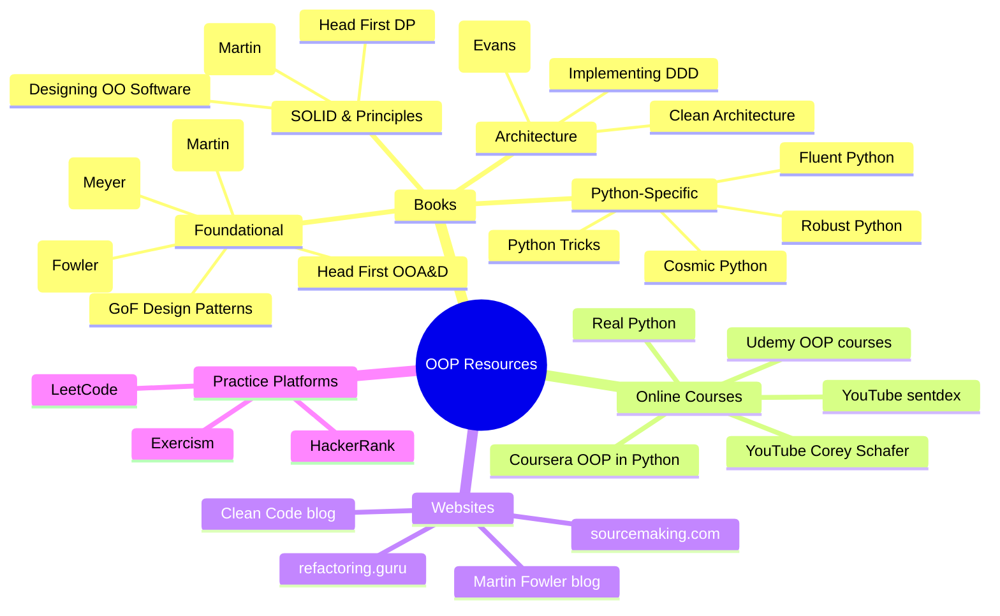
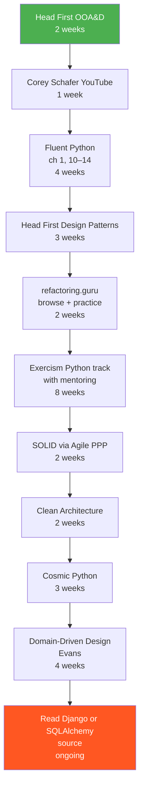

# Books and Courses — Curated OOP Learning Resources

#oop #resources #books #courses #learning-path #teaching #deep-dive

> [!quote] William Gibson
> "The future is already here — it's just not very evenly distributed."

The same is true of OOP knowledge. The classics are decades old but still unevenly distributed across the industry; the new wave (composition-first, type-driven, functional-adjacent) is here but most working developers have not noticed. This note curates the resources that — in the author's experience — pay back the time you invest in them. Every entry has a **level** (beginner / intermediate / advanced), a **why**, and a **key takeaway**.

If you only have time for three books, read:
1. **Head First Object-Oriented Analysis and Design** (beginner)
2. **Design Patterns** (GoF) or **Head First Design Patterns** (intermediate)
3. **Architecture Patterns with Python** (Cosmic Python) (advanced)

If you only have time for one course, watch the **Corey Schafer Python OOP** YouTube series.

---

## 1. Resource Recommendation Mindmap

---

## 2. Foundational Books

These are the books that built the field. Even if you never read them cover to cover, you should know what each one argues.

### 2.1 "Design Patterns: Elements of Reusable Object-Oriented Software" — Gamma, Helm, Johnson, Vlissides (GoF, 1994)

- **Level**: Intermediate → Advanced
- **Length**: ~395 pages
- **Why it's valuable**: The book that gave names to the 23 patterns that every working developer now uses. Adapter, Decorator, Observer, Singleton, Strategy — these all come from here. The "Gang of Four" catalog is the shared vocabulary of the entire industry.
- **Key takeaways**:
  - Patterns are distilled from real code; they are not invented.
  - Two main principles: *program to an interface, not an implementation*; *favor object composition over class inheritance*.
  - Every pattern has *intent*, *structure*, *consequences*, and *implementation* — read the intent first.
- **Caveat**: The code samples are in C++ and Smalltalk. Many examples feel dated (e.g. the Singleton pattern is now widely considered an anti-pattern in its naive form). Read it for the *ideas*, not the code.
- **Pair with**: [[Creational-Patterns]], [[Structural-Patterns]], [[Behavioral-Patterns]], and the much friendlier **Head First Design Patterns** (below).

> [!tip] Reading tip
> Do not read GoF linearly. Read the Introduction (1–30 pages), then the patterns that interest you. Skip the Smalltalk examples unless you care about Smalltalk.

### 2.2 "Refactoring: Improving the Design of Existing Code" — Martin Fowler (2nd ed. 2018)

- **Level**: Intermediate
- **Length**: ~448 pages
- **Why it's valuable**: The catalogue of *code smells* and the *refactorings* that fix them. If GoF taught us to *write* good OOP, Fowler taught us to *rescue* OOP from itself. The second edition is in JavaScript, not Java — which makes it more accessible.
- **Key takeaways**:
  - Behavior-preserving transformations are the only safe way to change code.
  - Code smells have names (Long Method, Large Class, Feature Envy, ...) — naming them is half the cure.
  - Refactor *before* adding features, *after* bugs, and *when you read code* — three natural triggers.
- **Pair with**: [[Code-Smells]], [[Refactoring-Strategies]], [[God-Object]], [[Shotgun-Surgery]].

### 2.3 "Clean Code: A Handbook of Agile Software Craftsmanship" — Robert C. Martin (2008)

- **Level**: Beginner → Intermediate
- **Length**: ~464 pages
- **Why it's valuable**: The book that defined the "software craftsmanship" movement. A practical, opinionated guide to writing code you will not hate in six months. Many readers disagree with Uncle Bob on specifics, but the *attitude* — that code quality matters — is contagious.
- **Key takeaways**:
  - Names matter; functions should be small; comments are usually failures of naming.
  - Single Responsibility at the function level (not just the class level).
  - "Boy Scout rule": leave the code cleaner than you found it.
- **Caveat**: Some advice (e.g. "functions should be 4 lines") has aged poorly and is overly dogmatic. Take the spirit, not the letter.
- **Pair with**: [[Single-Responsibility]], [[Code-Smells]], [[Refactoring-Strategies]].

> [!warning] Common reader reaction
> Many readers love Clean Code on first read and hate it on second read, then reach a synthesis on third read. This is normal. The book is most useful as a *prompt for argument* — read it with a colleague and disagree out loud.

### 2.4 "Object-Oriented Software Construction" — Bertrand Meyer (2nd ed. 1997)

- **Level**: Advanced
- **Length**: ~1,296 pages (yes, twelve hundred)
- **Why it's valuable**: The most rigorous book on OOP ever written. Meyer coined *Design by Contract* (preconditions, postconditions, invariants), the *Open-Closed Principle* (yes, the OCP in SOLID), and the Eiffel language. The book is long but every page rewards the reader.
- **Key takeaways**:
  - Contracts: a method's behavior is specified by what it requires (`require`) and what it guarantees (`ensure`).
  - The Open-Closed Principle is *about* contracts: modules should be open for extension by adding new subtypes without modifying the original.
  - Command-Query Separation: a method should either *do* something or *return* something, never both.
- **Caveat**: Meyer's Eiffel did not catch on; the language examples are unfamiliar to most readers. But the *ideas* translate directly to Python (use `@abstractmethod`, type hints, asserts, and `abc` to approximate contracts).
- **Pair with**: [[Open-Closed]], [[Liskov-Substitution]], [[Abstract-Base-Classes]], [[Type-Hints-And-OOP]].

### 2.5 "Head First Object-Oriented Analysis and Design" — Brett McLaughlin, Gary Pollice, David West (2006)

- **Level**: Beginner
- **Length**: ~640 pages
- **Why it's valuable**: The most pedagogically sound introduction to OOP ever written. The Head First series uses unconventional formatting (diagrams, quizzes, dialogues, marginalia) to force active reading. If you teach OOP, this book is a model for how to teach it.
- **Key takeaways**:
  - Good OO design comes from *use cases*, not from nouns-in-requirements.
  - Encapsulation is about *protecting invariants*, not about hiding data for the sake of hiding.
  - "Delegation" (composition) is the design move you will reach for most often.
- **Pair with**: [[What-Is-OOP]], [[Encapsulation]], [[Composition-Over-Inheritance]], [[Banking-System-Example]].

> [!tip] If you teach beginners
> Use the first three chapters of this book as your first three lectures. The "Rick's Guitar Shop" example is the best gentle introduction to the discovery of classes I have ever seen.

---

## 3. Python-Specific OOP Books

### 3.1 "Fluent Python" — Luciano Ramalho (2nd ed. 2022)

- **Level**: Intermediate → Advanced
- **Length**: ~1,012 pages
- **Why it's valuable**: *The* book on Pythonic OOP. Ramalho is a Python core contributor and a lucid writer. The second edition covers Python 3.10, including `match` statements, structural pattern matching, and modern typing.
- **Key chapters for OOP**:
  - **Chapter 1**: The Python Data Model — dunder methods, the protocol behind `len()`, `for`, `with`.
  - **Chapter 10**: Sequence Hacking, Hashing, and Slicing — building a vector class.
  - **Chapter 11**: Interfaces and Protocols — ABCs vs structural typing.
  - **Chapter 12**: Inheritance — good and bad; MRO; mixin design.
  - **Chapter 13**: Operator Overloading — what Python does and does not let you do.
  - **Chapter 14**: Iterables, Iterators, and Generators.
  - **Chapter 22**: Class Metaprogramming — metaclasses, `__init_subclass__`, class decorators.
  - **Chapter 23**: Attribute Access — descriptors and `@property` internals.
- **Key takeaways**:
  - "Pythonic" means using the data model, not writing Java in Python.
  - The descriptor protocol is the secret behind `@property`, `@classmethod`, `@staticmethod`, and every ORM field — knowing it unlocks everything else.
  - `__init_subclass__` is the modern alternative to 80% of metaclass use cases.
- **Pair with**: [[Magic-Methods]], [[Descriptors]], [[Metaclasses]], [[Interfaces-And-Protocols]], [[Type-Hints-And-OOP]].

> [!quote] Luciano Ramalho
> "Python's data model is the framework you use to write framework-quality code."

### 3.2 "Python Tricks: A Buffet of Awesome Python Features" — Dan Bader (2017)

- **Level**: Beginner → Intermediate
- **Length**: ~302 pages
- **Why it's valuable**: Short, punchy, single-topic chapters. Perfect for daily reading. The OOP-relevant chapters cover `@property`, `@classmethod` vs `@staticmethod`, `__repr__` vs `__str__`, `__init__` patterns, and `__slots__`.
- **Key takeaways**:
  - Small Pythonic idioms compound.
  - Always define `__repr__` — debugging is half your life.
- **Pair with**: [[Attributes-And-Properties]], [[Methods-And-Functions]], [[Magic-Methods]].

### 3.3 "Robust Python: Write Clean and Maintainable Code" — Patrick Viafore (2021)

- **Level**: Intermediate
- **Length**: ~384 pages
- **Why it's valuable**: The most comprehensive book on Python *type safety* and *contract programming*. If you have been told "Python is dynamically typed and that is fine", this book will teach you the *cost* of that stance — and how to pay less of it.
- **Key takeaways**:
  - Type hints are not optional in a codebase with more than one developer.
  - `mypy` --strict is a reasonable default for new projects.
  - `Protocol` (structural typing) is more Pythonic than `ABC` (nominal typing) in many cases.
- **Pair with**: [[Type-Hints-And-OOP]], [[Interfaces-And-Protocols]], [[Abstract-Base-Classes]].

### 3.4 "Architecture Patterns with Python" — Harry Percival & Bob Gregory (2020, "Cosmic Python")

- **Level**: Advanced
- **Length**: ~350 pages
- **Why it's valuable**: Free online at <https://www.cosmicpython.com>. The book that finally married Domain-Driven Design to Python. Reads like a long tutorial: you build a real (small) e-commerce backend, refactoring it from a Django-fat-model mess into a hexagonal, event-driven architecture.
- **Key takeaways**:
  - The Repository pattern is how you decouple domain from ORM.
  - Use cases (services) are where transactions live, not models.
  - Events are a cleaner alternative to ad-hoc callbacks.
  - Tests: unit-test the domain, integration-test the adapters, end-to-end-test the API.
- **Pair with**: [[Repository-Pattern]], [[Service-Layer]], [[Domain-Driven-Design]], [[Hexagonal-Architecture]], [[E-Commerce-Example]].

> [!success] Best modern OOP book
> If you are an intermediate developer wondering what "good OOP" looks like *today* (not in 1994), this is the book. The fact that it is free is embarrassing for the publishers.

---

## 4. SOLID and Design Principles

### 4.1 "Agile Principles, Patterns, and Practices" — Robert C. Martin (2002)

- **Level**: Intermediate
- **Length**: ~528 pages
- **Why it's valuable**: The book that introduced SOLID to the world (the acronym itself was coined by Michael Feathers around this material). A dense, code-heavy treatment of all five principles with case studies.
- **Key takeaways**:
  - SOLID is one principle (dependency direction) seen from five angles.
  - Component principles (REP, CCP, CRP, ADP, SDP, SAP) govern *module* boundaries, not just classes.
- **Pair with**: [[SOLID-Overview]], [[Dependency-Inversion]], [[Service-Layer]].

### 4.2 "Head First Design Patterns" — Eric Freeman, Elisabeth Robson, Bert Bates, Kathy Sierra (2nd ed. 2020)

- **Level**: Beginner → Intermediate
- **Length**: ~692 pages
- **Why it's valuable**: The book that made GoF readable. Uses the Head First pedagogy (dialogues, diagrams, quizzes) to teach ~14 of the most useful patterns. The 2nd edition includes functional-style alternatives in Java 8 lambdas.
- **Key takeaways**:
  - Strategy, Observer, Decorator, Factory, Singleton, Command, Adapter, Facade, Composite, Template Method, State, Proxy, Compound — covered in depth.
  - Every pattern answers a specific *problem*, not a generic preference.
- **Pair with**: [[Creational-Patterns]], [[Structural-Patterns]], [[Behavioral-Patterns]], [[Pattern-Selection-Guide]].

> [!tip] Beginner order
> If you are new to patterns, read this *before* GoF. The GoF book is the original and authoritative, but Head First is the one you will actually finish.

### 4.3 "Designing Object-Oriented Software" — Rebecca Wirfs-Brock, Brian Wilkerson, Lauren Wiener (1990)

- **Level**: Intermediate
- **Length**: ~368 pages
- **Why it's valuable**: Predates GoF by four years and is, in some ways, more useful for *design* (as opposed to *mechanics*). Introduces **Responsibility-Driven Design (RDD)** — design by assigning responsibilities to classes, the conceptual basis for SRP.
- **Key takeaways**:
  - "Responsibility" is the unit of design; classes are containers for responsibilities.
  - Stereotypes: Information Holder, Structurer, Service Provider, Interfacer, Controller.
  - CRC cards (Class–Responsibility–Collaborator) — a low-tech design tool that still works.
- **Pair with**: [[Single-Responsibility]], [[Classes-And-Objects]], [[Service-Layer]].

---

## 5. Architecture

### 5.1 "Domain-Driven Design: Tackling Complexity in the Heart of Software" — Eric Evans (2003)

- **Level**: Advanced
- **Length**: ~560 pages
- **Why it's valuable**: The book that gave us Ubiquitous Language, Bounded Contexts, Aggregates, Entities, Value Objects, Repositories, and the strategic vs tactical distinction. Evans synthesised decades of OO practice into a vocabulary that finally let teams talk about *domains* rather than *databases*.
- **Key takeaways**:
  - The model is not the diagram, the model is not the code; the model is the *shared mental model* of the domain.
  - Bounded contexts are the unit of linguistic consistency.
  - Aggregates are consistency boundaries; design them small.
- **Caveat**: Dense. Read Part I (strategic DDD) first; skim Part IV (tactical) — the tactical patterns are easier to learn from Cosmic Python.
- **Pair with**: [[Domain-Driven-Design]], [[Repository-Pattern]], [[Service-Layer]], [[Hexagonal-Architecture]].

### 5.2 "Implementing Domain-Driven Design" — Vaughn Vernon (2013)

- **Level**: Advanced
- **Length**: ~592 pages
- **Why it's valuable**: The "red book" to Evans's "blue book". Where Evans is conceptual, Vernon is concrete. Shows how to *implement* aggregates, repositories, and bounded contexts in real code (Java/C#).
- **Key takeaways**:
  - Aggregate design rules: design small, reference by identity, use eventual consistency between aggregates.
  - Sagas and process managers for long-running workflows.
- **Pair with**: [[Domain-Driven-Design]], [[Service-Layer]], [[Banking-System-Example]].

### 5.3 "Clean Architecture: A Craftsman's Guide to Software Structure and Design" — Robert C. Martin (2017)

- **Level**: Intermediate → Advanced
- **Length**: ~432 pages
- **Why it's valuable**: Synthesises MVC, EBI, DCI, Hexagonal, DDD, and the dependency rule into a single coherent picture: *source code dependencies must point only inward, toward higher-level policies*.
- **Key takeaways**:
  - The Dependency Rule — dependencies point inward.
  - Entities → Use Cases → Interface Adapters → Frameworks & Drivers (four concentric circles).
  - Screaming Architecture: a look at the folder structure should *scream* the domain, not the framework.
- **Pair with**: [[Hexagonal-Architecture]], [[Service-Layer]], [[MVC-Pattern]], [[Domain-Driven-Design]].

> [!quote] Robert C. Martin
> "The Web is a delivery mechanism, and your application architecture should not be dominated by the fact that it is delivered over the Web."

---

## 6. Online Courses

### 6.1 Coursera: "Object-Oriented Programming in Python" (University of Michigan / various)

- **Level**: Beginner
- **Length**: ~4 weeks at 4–6 hours/week
- **Why it's valuable**: A structured, graded introduction. The forum support is decent for self-learners. Comes with a certificate (which some employers value).
- **Key takeaways**: Classes, inheritance, polymorphism, basic exception handling, a small capstone project.
- **Caveat**: Slow-paced for an experienced developer. Skim if you already code in another OO language.
- **Pair with**: [[02-Fundamentals/Classes-And-Objects]], [[03-Four-Pillars/Encapsulation]].

### 6.2 Udemy: various OOP courses

- **Level**: Beginner → Intermediate
- **Length**: 10–30 hours each
- **Why it's valuable**: Cheap (always on sale), broad selection, lifetime access. The quality varies wildly; check recent reviews and watch the preview lessons before buying.
- **Recommended**:
  - **"Complete Python Bootcamp"** by Jose Portilla — has a solid OOP section.
  - **"Python Beyond the Basics - Object-Oriented Programming"** by Deepali Srivastava — focused purely on OOP.
- **Caveat**: Some Udemy courses are 80% fluff. Prefer courses with code-along exercises and a project at the end.
- **Pair with**: the entire [[02-Fundamentals]] and [[03-Four-Pillars]] sections.

### 6.3 Real Python: OOP Articles and Tutorials

- **Level**: Beginner → Advanced
- **URL**: <https://realpython.com/python3-object-oriented-programming/>
- **Why it's valuable**: Real Python's articles are consistently high quality — written by working developers, edited by professional editors, with runnable code. The OOP content ranges from introductory ("Python Classes — The Power of Object-Oriented Programming") to advanced ("Python Descriptors").
- **Recommended reading order**:
  1. Object-Oriented Programming (OOP) in Python 3
  2. Supercharge Your Classes With Python `super()`
  3. Python Property Decorator
  4. Understanding Python Class Creation with Metaclasses
  5. Python Descriptors
  6. Abstract Base Classes in Python
- **Pair with**: [[Methods-And-Functions]], [[Attributes-And-Properties]], [[Metaclasses]], [[Descriptors]], [[Abstract-Base-Classes]].

### 6.4 YouTube: Corey Schafer — Python OOP Tutorials

- **Level**: Beginner → Intermediate
- **URL**: <https://www.youtube.com/playlist?list=PL-osiE80TeTsqhIuOqKhwlXsIBIdSeYtc>
- **Why it's valuable**: The single best free video series on Python OOP. Sixteen short videos (10–20 min each) covering classes, instances, class vs instance variables, classmethods vs staticmethods, inheritance, special methods, property decorators, getters/setters, and so on. Corey's pacing is excellent and every video has a code link in the description.
- **Key takeaways**:
  - The OOP mental model in 16 small chunks.
  - Practical conventions: naming, `__repr__` vs `__str__`, when to use `@property`.
- **Pair with**: every note in [[02-Fundamentals]] and [[03-Four-Pillars]].

> [!success] Best free video series
> If you only have time for one video series, watch Corey Schafer's. Then come back and read the corresponding notes in this vault for the deeper treatment.

### 6.5 YouTube: sentdex — Python OOP

- **Level**: Beginner
- **URL**: <https://www.youtube.com/playlist?list=PLQVvvaa0QuDe8GSjG8jmTJD3riyP1J8a>
- **Why it's valuable**: Sentdex (Harrison Kinsley) has a casual, exploratory style. Good for learners who find formal lectures dry. His OOP playlist is shorter and more applied than Corey's.
- **Caveat**: Less systematic than Corey; better as a supplement than as a primary resource.

### 6.6 MIT OpenCourseWare — 6.0001 / 6.0002 (Introduction to CS and Computational Thinking)

- **Level**: Beginner
- **URL**: <https://ocw.mit.edu/courses/6-0001-introduction-to-computer-science-and-programming-in-python-fall-2016/>
- **Why it's valuable**: Free, MIT-quality lectures. The OOP lectures (around weeks 8–10 of 6.0001 and the early lectures of 6.0002) are taught by Prof. Eric Grimson and Prof. John Guttag — both master teachers. Includes problem sets with autograders.
- **Pair with**: [[What-Is-OOP]], [[Classes-And-Objects]].

---

## 7. Websites and Blogs

### 7.1 refactoring.guru

- **URL**: <https://refactoring.guru>
- **Level**: Beginner → Intermediate
- **Why it's valuable**: The single best illustrated guide to design patterns and refactoring on the web. Every pattern has a clear problem statement, a structural diagram, code in eight languages (including Python), and a real-world analogy. The site is also a book; buy it if you want offline access.
- **Use it for**: looking up patterns quickly, teaching patterns to beginners, refreshing your memory of pattern *intent*.
- **Pair with**: [[05-Design-Patterns/Creational-Patterns]], [[10-Antipatterns/Code-Smells]], [[Pattern-Selection-Guide]].

> [!tip] Teaching resource
> The illustrations on refactoring.guru are licensed for non-commercial use; you can drop them straight into a slide deck.

### 7.2 sourcemaking.com

- **URL**: <https://sourcemaking.com>
- **Level**: Intermediate
- **Why it's valuable**: Patterns *and* anti-patterns in one place. Less polished than refactoring.guru but deeper on the anti-pattern side. Useful for the design-smells section.
- **Pair with**: [[Code-Smells]], [[God-Object]], [[Spaghetti-Code]], [[Shotgun-Surgery]].

### 7.3 Martin Fowler's blog

- **URL**: <https://martinfowler.com>
- **Level**: Intermediate → Advanced
- **Why it's valuable**: Fowler's blog is a 25-year archive of the most influential writing on software architecture. Read:
  - "Inversion of Control Containers and the Dependency Injection Pattern" (2004) — the canonical DI explainer.
  - "Patterns of Enterprise Application Architecture" (the website supplements the book).
  - "Microservices" (2014, with James Lewis) — the article that named the term.
  - "Is Quality Worth the Cost?" (2019) — the answer is yes.
  - "Refactoring" updates — Fowler publishes new refactorings on the blog before they make it into book editions.
- **Pair with**: [[Dependency-Inversion]], [[Repository-Pattern]], [[Service-Layer]], [[Refactoring-Strategies]].

### 7.4 Clean Code Blog (Robert C. Martin)

- **URL**: <https://blog.cleancoder.com>
- **Level**: Intermediate → Advanced
- **Why it's valuable**: Uncle Bob's longer-form posts on professionalism, architecture, and the craft. Opinions are strong and not universally shared — read critically. Notable posts:
  - "The Liskov Substitution Principle" (2009) — the clearest explainer of LSP.
  - "Getters/Setters. Evil. Period." (2014) — a sharp take on tell-don't-ask.
  - "The Clean Architecture" (2012) — the original article that became the book.
- **Pair with**: [[Liskov-Substitution]], [[Open-Closed]], [[Hexagonal-Architecture]].

### 7.5 Brandon Rhodes — Python Patterns

- **URL**: <https://python-patterns.guide>
- **Level**: Intermediate
- **Why it's valuable**: Brandon Rhodes is one of the best Python educators alive. This site is a curated collection of "this is how experienced Python developers actually write Python" patterns. Topics include garbage collection, `__init__` patterns, `__del__` warnings, and `super()` misunderstandings.
- **Pair with**: [[Self-And-Cls]], [[Constructors-And-Destructors]], [[Object-Lifecycle]], [[Methods-And-Functions]].

### 7.6 Hynek Schlawack — "PEP 8" and related posts

- **URL**: <https://hynek.me>
- **Level**: Intermediate
- **Why it's valuable**: Practical, modern Python advice. Hynek's posts on `attrs`/`dataclasses`, `__slots__`, and exception handling are repeatedly cited.

---

## 8. Practice Platforms

### 8.1 LeetCode

- **URL**: <https://leetcode.com>
- **Level**: All
- **Why it's valuable**: Mostly used for algorithm interview prep, but LeetCode's *object-oriented* tagged problems are a good way to practice OOP under time pressure. Try problems like "Design Twitter", "LRU Cache", "Design Hit Counter", "Design a Parking Lot" — these are OOP design problems first, algorithm problems second.
- **Pair with**: [[Pattern-Selection-Guide]], [[Behavioral-Patterns]].

> [!warning] Don't over-index
> LeetCode-style OOP is not the same as production OOP. The constraints (small, isolated, time-pressured) often push you toward clever-trick designs that you would never write at work. Use LeetCode for reps; use a real codebase for taste.

### 8.2 HackerRank

- **URL**: <https://www.hackerrank.com>
- **Level**: Beginner → Intermediate
- **Why it's valuable**: Has a "Python" track with OOP-specific challenges. Less rigorous than LeetCode's design problems, but friendlier for beginners.
- **Pair with**: [[02-Fundamentals]] and [[03-Four-Pillars]].

### 8.3 Exercism (Python track)

- **URL**: <https://exercism.org/tracks/python>
- **Level**: Beginner → Advanced
- **Why it's valuable**: Exercism is unique among practice platforms because it offers **human mentoring**. You submit a solution to a concept exercise (e.g. "Classes", "Methods", "Inheritance"), and a mentor reviews it within a few days and suggests improvements. This is the closest thing to a personal tutor for free.
- **Recommended progression**:
  1. Concept exercises: Classes, Methods, Class Composition, Inheritance, Interfaces, Exception Handling.
  2. Practice exercises: Twelve Days, Bank Account, Binary Search Tree, Robot Name, Simple Linked List.
  3. Concept exercises: Mutability, Higher-Order Functions, Iterators.
- **Pair with**: every note in [[02-Fundamentals]], [[03-Four-Pillars]], and [[07-Advanced-Concepts/Composition-Over-Inheritance]].

> [!success] Best free learning resource
> If you have a few weeks, do the entire Exercism Python track *with mentoring on*. The mentoring feedback is worth more than most paid courses.

### 8.4 Codewars

- **URL**: <https://www.codewars.com>
- **Level**: Beginner → Advanced
- **Why it's valuable**: Short, gamified challenges. Less OOP-focused than Exercism but good for daily reps. The "kata" format encourages seeing many small solutions to the same problem.

### 8.5 GitHub: Read Real Codebases

- **URL**: (any large open-source Python project)
- **Level**: Advanced
- **Why it's valuable**: Reading well-designed OOP codebases is the highest-leverage learning activity most developers skip. Recommended reading, in rough order of difficulty:
  - **`requests`** (~10k lines) — the canonical "Pythonic" API. Read `models.py` first.
  - **`pathlib`** (stdlib) — small, beautiful class design.
  - **`attrs` / `cattrs`** — descriptors and metaclasses done right.
  - **`sqlalchemy`** (the ORM) — descriptors, the Unit of Work pattern, identity maps.
  - **`django`** — metaclass-based models, ORM, class-based views.
  - **`flask`** — the opposite philosophy (small, function-first).
  - **`pytest`** — fixtures as a DI container; plugins as mixins.
  - **`pydantic`** — modern descriptors and type-driven design.
- **Pair with**: [[Descriptors]], [[Metaclasses]], [[Repository-Pattern]], [[Service-Layer]].

---

## 9. A Curated Learning Path by Resource

If you want a single "read these in order" sequence, use the following:

### The path in detail

1. **Head First OOA&D** (2 weeks, beginner) — the conceptual foundation. Build the mental model first.
2. **Corey Schafer OOP playlist** (1 week) — solidify the mental model in Python specifically.
3. **Fluent Python, chapters 1, 10–14** (4 weeks) — the Python data model and Pythonic OOP. Read with a Python REPL open.
4. **Head First Design Patterns** (3 weeks) — patterns, taught pedagogically.
5. **refactoring.guru** (2 weeks) — browse patterns you did not learn in step 4; read the refactoring section.
6. **Exercism Python track with mentoring on** (8 weeks) — turn knowledge into muscle memory. This is the longest step; do not skip it.
7. **Agile Principles, Patterns, and Practices** (2 weeks) — SOLID in depth, with component principles.
8. **Clean Architecture** (2 weeks) — where dependencies should point.
9. **Architecture Patterns with Python** (3 weeks, "Cosmic Python") — DDD and hexagonal in Python, end to end.
10. **Domain-Driven Design** (Evans, 4 weeks) — the strategic DDD vocabulary. Skim Part IV.
11. **Read a real codebase** (ongoing) — `requests`, then `pathlib`, then `sqlalchemy`. Apply what you learned by patching or extending.

Total: ~30 weeks of part-time study. By the end, you will be a stronger OOP designer than 90% of working developers.

---

## 10. A Note on What Is Missing

This list is curated, not exhaustive. Notable omissions:

- **No Java-only books** (e.g. "Effective Java" by Bloch) — valuable, but our vault is Python-first. If you write Java, do read Bloch.
- **No C++ books** (e.g. "Effective C++" by Meyers, "C++ Core Guidelines" by Stroustrup) — same reason. If you write C++, both are essential.
- **No Smalltalk books** (e.g. Goldberg's "Smalltalk-80: The Language") — historically fascinating but a low-ROI read for working developers.
- **No UML books** — UML is mostly dead outside enterprise; if you need it, Fowler's "UML Distilled" is sufficient.
- **No formal-methods books** (e.g. "Object-Oriented Software Construction" beyond Chapter 11) — Meyer's contracts are interesting but Eiffel's ecosystem is too small to justify the time for most readers.

If your interest is academic, follow up with:
- **"A Theory of Object-Oriented Design"** by Bruce Holmes — formal but accessible.
- **"Object-Oriented Programming: An Evolutionary Approach"** by Brad Cox (1986) — the original "Objective-C" book and a different lineage from C++/Java.
- The original **Simula 67 papers** (Dahl & Nygaard, 1966–1968) — surprisingly readable.

---

## 11. Quick-Reference: Which Resource for Which Problem?

| Your problem | Start here |
| --- | --- |
| "I don't know what a class is" | Corey Schafer video 1 + [[Classes-And-Objects]] |
| "I know classes but inheritance confuses me" | Head First OOA&D + [[Inheritance]] |
| "I want to learn design patterns" | Head First Design Patterns + refactoring.guru + [[Pattern-Selection-Guide]] |
| "I want to learn SOLID" | Clean Code chapters 8–12 + Agile PPP + [[SOLID-Overview]] |
| "I want to understand Python's data model" | Fluent Python ch. 1 + [[Magic-Methods]] |
| "I want to write descriptors" | Fluent Python ch. 23 + [[Descriptors]] + `attrs` source |
| "I want to refactor bad OOP" | Refactoring (Fowler) + [[Code-Smells]] + [[Refactoring-Strategies]] |
| "I want to design a system" | Clean Architecture + Cosmic Python + [[Domain-Driven-Design]] |
| "I want to test OOP code" | Cosmical Python ch. 4–6 + [[Unit-Testing-OOP]] + [[Mocking-And-Stubs]] |
| "I want to prepare for an interview" | [[FAQ]] + [[Glossary]] + LeetCode design problems |
| "I want to teach OOP" | Head First OOA&D + [[FAQ]] Teaching Questions + this vault's [[00-Map-of-Content]] |

---

## 12. Final Advice

> [!quote] Mortimer Adler
> "In the case of good books, the point is not to see how many of them you can get through, but rather how many can get through to you."

Reading about OOP is not the same as writing OOP. The ratio that works is roughly 1 hour of reading to 3 hours of practice. After every chapter of every book above, write a small program that uses the ideas. Then throw it away and write a better one.

The Exercism track and the Cosmic Python book together will do more for your OOP than any other single resource on this list — because both force you to *write* and *have your writing critiqued*. Start there.

When in doubt, open the [[00-Map-of-Content]] and pick a note you have not read yet. Every note in this vault links to others; the network is the curriculum.

> [!success] Bookmark this page
> As you finish each resource, come back here and check it off. The path matters less than the consistency.

- [ ] Head First OOA&D
- [ ] Corey Schafer OOP playlist
- [ ] Fluent Python (ch. 1, 10–14)
- [ ] Head First Design Patterns
- [ ] refactoring.guru (browse)
- [ ] Exercism Python track
- [ ] Agile Principles, Patterns, and Practices
- [ ] Clean Architecture
- [ ] Architecture Patterns with Python (Cosmic Python)
- [ ] Domain-Driven Design (Evans)
- [ ] Read a real codebase

When you have checked all of these off, you are no longer a beginner at OOP. Welcome to the journey.
