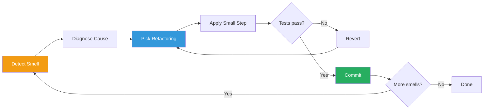
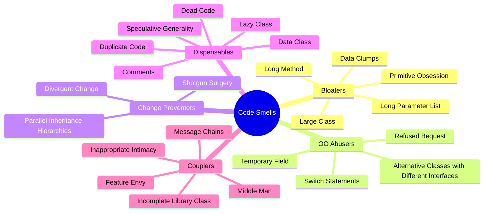
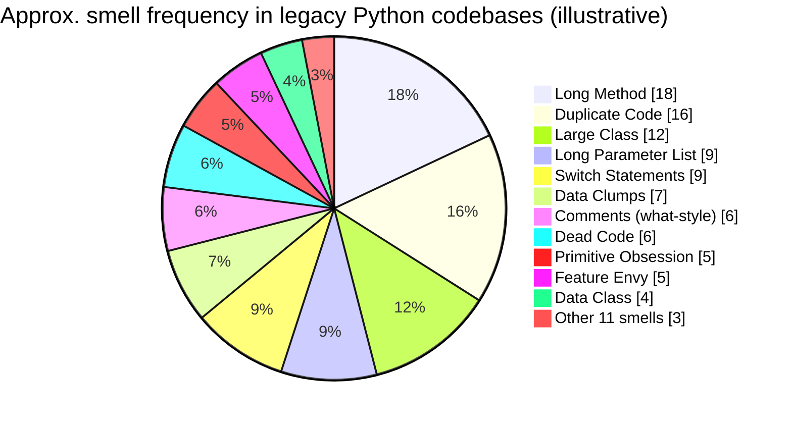
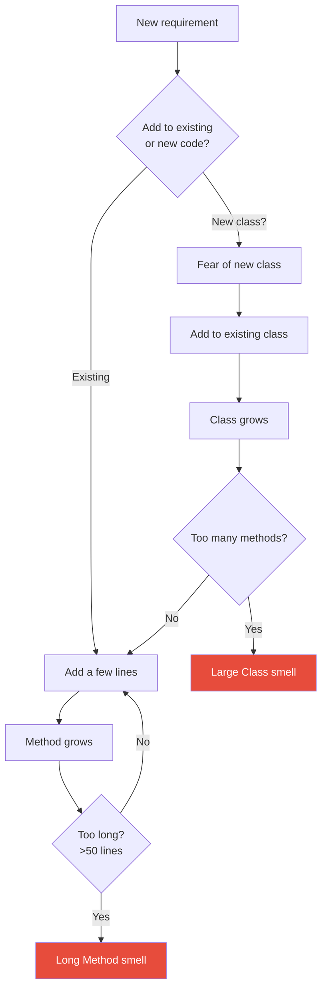
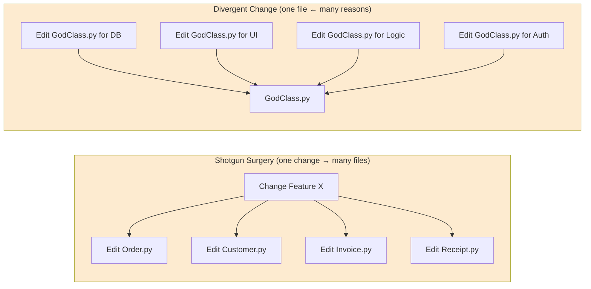
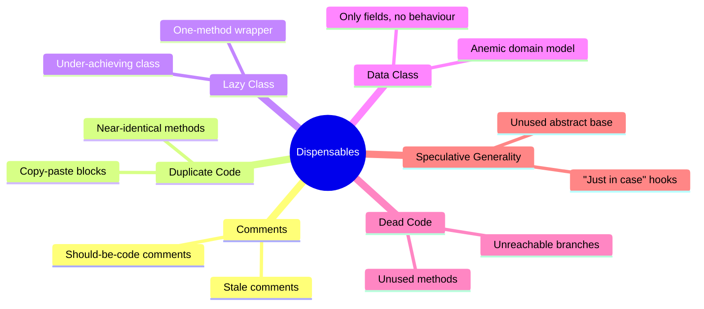
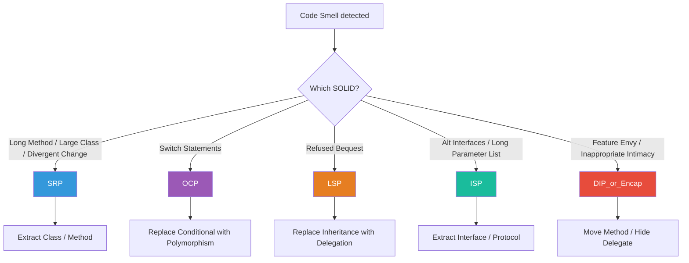
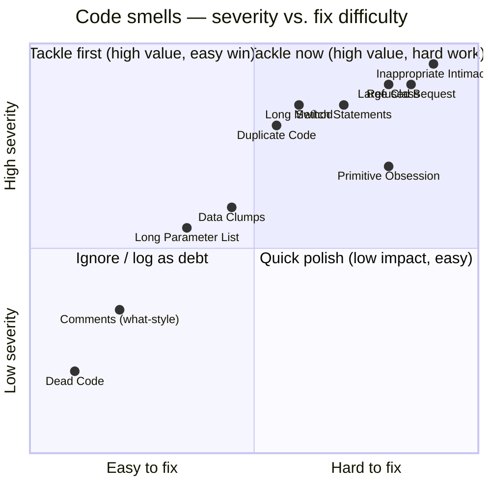
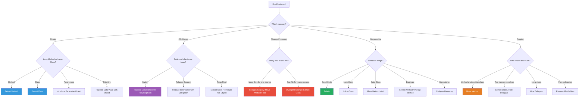
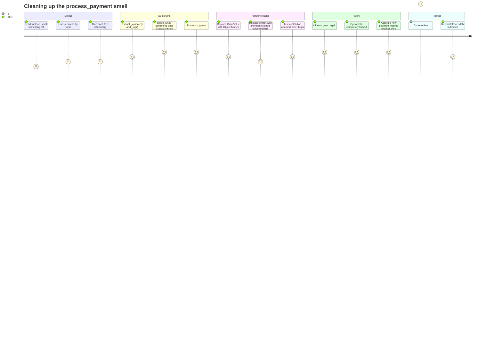

# Code Smells

#oop #antipatterns #code-smells #refactoring #technical-debt #teaching #deep-dive

> [!quote] Martin Fowler & Kent Beck
> "Smells are certain structures in the code that suggest (sometimes they scream for) the possibility of refactoring."

A **code smell** is a surface-level *symptom* in the source code that points to a deeper *problem* in the design. The metaphor comes from Kent Beck's mother, who could tell, by the smell of a child's sneakers, that something was wrong — long before she saw the mud. A smell is not necessarily a bug; the code may compile, pass tests, and run correctly. But the smell indicates that the structure of the code is unhealthy, and that future changes are likely to be harder, riskier, and more expensive than they should be.

This note is the foundation of the [[10-Antipatterns]] folder. It catalogues the **22 classic code smells** from Martin Fowler's *Refactoring* (1999, 2nd ed. 2018), organised by category — **Bloaters**, **Object-Orientation Abusers**, **Change Preventers**, **Dispensables**, and **Couplers**. For each smell you will find: a definition, why it is bad, how to detect it (manually and with tools), the standard refactoring that cures it, and a small Python example showing before/after. The note also covers the relationship between smells and [[SOLID-Overview|SOLID]] violations, the question of when smells are acceptable (intentional technical debt), and the most common student misconceptions.

Prerequisites: [[Classes-And-Objects]], [[Methods-And-Functions]], [[Single-Responsibility]]. Read this note before reading [[God-Object]], [[Spaghetti-Code]], [[Shotgun-Surgery]], or [[Refactoring-Strategies]].

---

## 1. What Is a Code Smell?

> [!important] Definition
> A **code smell** is a *symptom* in the source code that *suggests* a deeper structural problem. Smells are heuristics: they signal "something may be wrong here," not "this is definitely wrong."

The term was introduced by Kent Beck and popularised in Martin Fowler's *Refactoring: Improving the Design of Existing Code* (1999). The Fowler/Beck list contains **22 named smells**, grouped into five categories. The grouping itself is instructive: it tells you *what kind* of disease the code is suffering from — is it growing without bound? Is it abusing OOP features? Is it resisting change? Does it contain things that should not be there? Is it glued to the wrong neighbours?

### 1.1 Smell vs Bug vs Anti-Pattern

These three terms are often confused:

| Term | Definition | Severity |
|------|------------|----------|
| **Bug** | Code that does the wrong thing. | Causes incorrect behaviour now. |
| **Code smell** | Surface symptom suggesting deeper design problems. | Code works now; future changes will be painful. |
| **Anti-pattern** | A recurring bad design that has a known, named, better alternative. | A *pattern* of bad design (a structural mistake). |

A smell is to a codebase what a fever is to a patient: a sign that something deeper may be wrong, but not a diagnosis. The diagnosis comes when you trace the smell to its root cause, which is often a SOLID violation or a missing abstraction. The treatment is a **refactoring** — see [[Refactoring-Strategies]].

### 1.2 The Smell → Refactoring Loop

Refactoring is motivated by smells. The workflow is:

1. **Smell** — detect a surface symptom (e.g., a 200-line method).
2. **Diagnose** — understand the deeper problem (e.g., five responsibilities in one method).
3. **Refactor** — apply a named transformation (e.g., *Extract Method* five times).
4. **Verify** — run the tests; the behaviour must not change.



> [!tip] Teaching Tip
> When teaching code smells, do not list all 22 at once. Pick three or four common ones (Long Method, Large Class, Duplicate Code, Long Parameter List) and have students find them in a real codebase. The *aha* moment is when they realise the smell has a name and a cure — that there is order in the chaos.

---

## 2. The Five Categories at a Glance

Fowler and Beck organise the 22 smells into five categories. The category tells you what *kind* of disease the code has.



- **Bloaters** — code that has grown so large it is hard to work with. They accumulate slowly.
- **Object-Orientation Abusers** — code that uses OOP features (switches, inheritance, fields) in ways that miss the point of OOP.
- **Change Preventers** — code where one logical change forces edits in many places, or one place is edited for many reasons.
- **Dispensables** — code that is unnecessary and should be removed.
- **Couplers** — code that is too tightly connected to other code.

The rest of this note walks through each category with definitions, examples, and the standard refactoring for each smell.



---

## 3. Bloaters

Bloaters are smells where code grows out of hand. They are the most common smells in legacy code, and they accumulate gradually — a method here, a parameter there — until you wake up and find a 4000-line `utils.py`.



### 3.1 Long Method

> **Symptom**: A method that is too long (typically more than ~10 lines, but the smell is about *complexity*, not line count).

**Why it's bad**: long methods are hard to read, hard to test, hard to reuse, and prone to bugs. The human brain holds ~7±2 chunks in working memory; a 200-line method demands far more.

**How to detect**: any method that does not fit on one screen; any method with deeply nested loops; any method with more than one level of abstraction (mixing high-level orchestration with low-level detail).

**Refactoring**: **Extract Method**. Pull out chunks of code into well-named helper methods. If you cannot find a good name for the chunk, the method is mixing concerns — split it first by concern.

```python
# === SMELL: Long Method ===
def process_order(order):
    # validate
    if not order.items:
        raise ValueError("Empty order")
    if order.total < 0:
        raise ValueError("Negative total")
    # apply discount
    if order.customer.is_vip:
        order.total *= 0.9
    elif order.coupon_code == "SUMMER10":
        order.total *= 0.9
    # calculate tax
    if order.country == "US":
        tax = order.total * 0.07
    else:
        tax = order.total * 0.20
    order.total += tax
    # save to db
    db = connect_to_db()
    cursor = db.cursor()
    cursor.execute("INSERT INTO orders ...", (order.total,))
    db.commit()
    # email customer
    send_email(order.customer.email, f"Your order total is {order.total}")
    # log
    with open("orders.log", "a") as f:
        f.write(f"{order.id}: {order.total}\n")

# === FIX: Extract Method ===
def process_order(order):
    validate_order(order)
    apply_discount(order)
    apply_tax(order)
    persist_order(order)
    notify_customer(order)
    log_order(order)

def validate_order(order):
    if not order.items:
        raise ValueError("Empty order")
    if order.total < 0:
        raise ValueError("Negative total")

def apply_discount(order):
    if order.customer.is_vip or order.coupon_code == "SUMMER10":
        order.total *= 0.9

def apply_tax(order):
    rate = 0.07 if order.country == "US" else 0.20
    order.total += order.total * rate

# ... and so on
```

### 3.2 Large Class

> **Symptom**: A class that tries to do too much — too many fields, too many methods, too many imports. The [[God-Object]] anti-pattern is the extreme form.

**Why it's bad**: violates [[Single-Responsibility|SRP]]. Hard to understand, hard to test (you have to set up many unrelated dependencies), frequent merge conflicts because many developers edit it.

**How to detect**: LOC > 500, method count > 20, unrelated import clusters, fields that are only used by a subset of methods.

**Refactoring**: **Extract Class** (split responsibilities), **Extract Subclass** (if subclasses are differentiated by some methods only), **Extract Interface** (to hide the surface area from clients that don't need it).

```python
# === SMELL: Large Class ===
class GodUserManager:
    def __init__(self):
        self.users = []
        self.sessions = {}
        self.email_queue = []
        self.audit_log = []

    def register(self, email, password): ...
    def authenticate(self, email, password): ...
    def reset_password(self, email): ...
    def update_profile(self, user, **fields): ...
    def send_welcome_email(self, user): ...
    def send_password_reset_email(self, user): ...
    def send_billing_alert(self, user, amount): ...
    def calculate_monthly_bill(self, user): ...
    def generate_usage_report(self, user): ...
    def archive_old_users(self): ...
    # ... 30 more methods

# === FIX: Extract Class by responsibility ===
class AuthService:           # authentication
    def register(self, email, password): ...
    def authenticate(self, email, password): ...
    def reset_password(self, email): ...

class UserProfileService:    # profile management
    def update_profile(self, user, **fields): ...

class NotificationService:   # email & messaging
    def send_welcome_email(self, user): ...
    def send_password_reset_email(self, user): ...

class BillingService:        # money
    def calculate_monthly_bill(self, user): ...
    def send_billing_alert(self, user, amount): ...

class ReportingService:      # reports
    def generate_usage_report(self, user): ...
```

See [[God-Object]] for the deep dive.

### 3.3 Long Parameter List

> **Symptom**: A method that takes more than ~3 parameters.

**Why it's bad**: hard to read, hard to call (callers must remember argument order), prone to argument-swap bugs (`update_user(name, email)` vs `update_user(email, name)`), and a sign that the method is doing too much.

**How to detect**: methods with 4+ parameters; boolean flag parameters (a sign the method has two responsibilities).

**Refactoring**: **Introduce Parameter Object** (group related parameters into a class), **Preserve Whole Object** (pass the object instead of its fields), **Replace Parameter with Method Call** (if the parameter can be obtained another way).

```python
# === SMELL: Long Parameter List ===
def create_order(customer_id, customer_name, customer_email,
                 product_id, product_name, unit_price, quantity,
                 shipping_address_line1, shipping_address_line2,
                 shipping_city, shipping_postcode, shipping_country,
                 coupon_code, is_gift, gift_message):
    ...

# === FIX: Introduce Parameter Object ===
@dataclass
class CustomerInfo:
    id: int
    name: str
    email: str

@dataclass
class OrderLine:
    product_id: int
    product_name: str
    unit_price: Decimal
    quantity: int

@dataclass
class ShippingAddress:
    line1: str
    line2: str
    city: str
    postcode: str
    country: str

@dataclass
class OrderOptions:
    coupon_code: str | None = None
    is_gift: bool = False
    gift_message: str | None = None

def create_order(customer: CustomerInfo, line: OrderLine,
                 address: ShippingAddress,
                 options: OrderOptions | None = None) -> Order:
    ...
```

### 3.4 Data Clumps

> **Symptom**: The same group of data items (e.g., `street, city, postcode, country`) appear together in many method signatures and class fields.

**Why it's bad**: duplication (each occurrence must be updated together), missing abstraction (the clump *is* a concept — `Address` — but the code refuses to name it).

**How to detect**: grep for parameter pairs that always appear together (`x, y`, `start, end`, `host, port`).

**Refactoring**: **Extract Class** (turn the clump into a named object), then **Preserve Whole Object** at each call site.

```python
# === SMELL: Data Clump ===
def print_invoice(name, street, city, postcode, country):
    ...
def ship_order(order, street, city, postcode, country):
    ...
def validate_address(street, city, postcode, country):
    ...

# === FIX: Extract Class ===
@dataclass
class Address:
    street: str
    city: str
    postcode: str
    country: str

def print_invoice(name: str, address: Address): ...
def ship_order(order: Order, address: Address): ...
def validate_address(address: Address): ...
```

> [!warning] Common Student Misconception
> Students often think Data Clumps are *just* about reducing parameter counts. They are not. The deeper problem is that a real-world concept (Address, DateRange, Money) is hiding in the code without a name. Naming the clump surfaces the concept and lets it grow behaviour later (e.g., `Address.format_postal()`, `DateRange.overlaps(other)`).

### 3.5 Primitive Obsession

> **Symptom**: Using primitives (strings, ints, floats) to represent domain concepts that deserve their own type.

**Why it's bad**: no type safety (you can pass a customer_id where a product_id is expected — both are ints), no validation at the boundary, no behaviour attached to the value.

**How to detect**: fields typed as `str` or `int` whose names contain "id", "code", "amount", "currency"; methods that take many primitives that conceptually form one value.

**Refactoring**: **Replace Data Value with Object**, **Replace Type Code with Class**, **Replace Type Code with Subclasses** (if the type code drives conditional behaviour), **Replace Type Code with Strategy** (if the behaviour varies).

```python
# === SMELL: Primitive Obsession ===
def transfer(from_account_id: int, to_account_id: int,
             amount: float, currency: str):
    # What if from_account_id is actually a customer_id?
    # What if amount is negative? Or NaN?
    # What if currency is "USD" vs "usd" vs "Usd"?
    ...

# === FIX: Replace Data Value with Object ===
class AccountId:
    def __init__(self, value: int):
        if value <= 0:
            raise ValueError("AccountId must be positive")
        self._value = value

class Money:
    def __init__(self, amount: Decimal, currency: Currency):
        if amount < 0:
            raise ValueError("Money cannot be negative")
        self.amount = amount
        self.currency = currency

    def add(self, other: "Money") -> "Money":
        if self.currency != other.currency:
            raise ValueError("Cannot add different currencies")
        return Money(self.amount + other.amount, self.currency)

def transfer(source: AccountId, target: AccountId, amount: Money):
    ...
```

---

## 4. Object-Orientation Abusers

These smells are cases where the code *uses* OOP features but in a way that defeats the point of OOP — typically because the code is procedural in disguise.

### 4.1 Switch Statements

> **Symptom**: The same `switch` or `if/elif` chain appears in multiple places, branching on a "type code".

**Why it's bad**: violates [[Open-Closed|OCP]] — every new type requires editing every switch. Polymorphism exists precisely to replace this.

**How to detect**: search for `if type ==` / `match` on a string or enum; switch statements repeated across methods.

**Refactoring**: **Replace Conditional with Polymorphism** (extract subclasses or strategies), **Replace Type Code with Subclasses**, **Replace Type Code with Strategy/State**.

```python
# === SMELL: Switch Statements ===
class Employee:
    def __init__(self, type_code: str):
        self.type_code = type_code

    def monthly_pay(self):
        if self.type_code == "engineer":
            return self.salary
        elif self.type_code == "manager":
            return self.salary + self.bonus
        elif self.type_code == "salesman":
            return self.salary + self.commission
        else:
            raise ValueError(self.type_code)

    def monthly_vacation_days(self):
        if self.type_code == "engineer":
            return 15
        elif self.type_code == "manager":
            return 25
        elif self.type_code == "salesman":
            return 18
        else:
            raise ValueError(self.type_code)

# === FIX: Replace Conditional with Polymorphism ===
from abc import ABC, abstractmethod

class Employee(ABC):
    @abstractmethod
    def monthly_pay(self) -> Decimal: ...
    @abstractmethod
    def monthly_vacation_days(self) -> int: ...

class Engineer(Employee):
    def monthly_pay(self): return self.salary
    def monthly_vacation_days(self): return 15

class Manager(Employee):
    def monthly_pay(self): return self.salary + self.bonus
    def monthly_vacation_days(self): return 25

class Salesman(Employee):
    def monthly_pay(self): return self.salary + self.commission
    def monthly_vacation_days(self): return 18
```

### 4.2 Temporary Field

> **Symptom**: An instance field that is set only in certain states — null or meaningless otherwise.

**Why it's bad**: the reader must understand which methods need the field set; null checks proliferate; the class has multiple implicit states.

**Refactoring**: **Extract Class** (move the temporary field and the methods that use it into a new class), **Introduce Null Object** (provide a default safe value), **Replace Conditional with Polymorphism** (one subclass per state).

```python
# === SMELL: Temporary Field ===
class OrderProcessor:
    def __init__(self):
        self.discount_rate = None  # only set in some flows
        self.coupon = None         # only set in some flows

    def process(self, order, coupon=None):
        if coupon:
            self.coupon = coupon
            self.discount_rate = coupon.rate  # set only here
        # ... many lines ...
        if self.coupon:                       # used here
            order.apply_discount(self.discount_rate)

# === FIX: Extract Class ===
class DiscountCalculator:
    def __init__(self, coupon=None):
        self.coupon = coupon

    def apply(self, order):
        if self.coupon:
            order.apply_discount(self.coupon.rate)

class OrderProcessor:
    def __init__(self, discount: DiscountCalculator):
        self.discount = discount

    def process(self, order):
        # ... many lines ...
        self.discount.apply(order)
```

### 4.3 Refused Bequest

> **Symptom**: A subclass inherits from a parent but does not use (or actively overrides to suppress) most of the parent's methods.

**Why it's bad**: violates [[Liskov-Substitution|LSP]]. The hierarchy is wrong — the subclass is not really a subtype; it is a different concept forced into the parent's shape.

**Refactoring**: **Replace Inheritance with Delegation** — make the former subclass a *client* of the former parent (has-a instead of is-a), or push shared behaviour up to a common abstract base.

```python
# === SMELL: Refused Bequest ===
class Stack(list):
    # Inherits push/pop/iter/append/etc. from list
    # But we don't want append/extend/insert — those violate stack semantics
    def push(self, x): self.append(x)
    def pop(self): return super().pop()

# A Stack IS-A list, but refuses list's full interface. LSP violation.

# === FIX: Replace Inheritance with Delegation ===
class Stack:
    def __init__(self):
        self._items = []      # has-a, not is-a

    def push(self, x): self._items.append(x)
    def pop(self): return self._items.pop()
    def peek(self): return self._items[-1]
    def __len__(self): return len(self._items)
```

### 4.4 Alternative Classes with Different Interfaces

> **Symptom**: Two classes do the same job (e.g., send email) but with differently named methods.

**Why it's bad**: clients must remember two APIs for one concept; swapping implementations requires editing call sites; breaks the [[Interface-Segregation|ISP]] spirit.

**Refactoring**: **Rename Methods** to a shared vocabulary, **Extract Superclass** or **Extract Interface** (define a common protocol), **Move Method** to align behaviour.

```python
# === SMELL: Alternative Classes with Different Interfaces ===
class SmtpMailer:
    def send_message(self, to, subject, body): ...

class SendGridClient:
    def dispatch_email(self, recipient, title, content): ...

# Both do the same thing; different method names.

# === FIX: Extract a common Protocol ===
from typing import Protocol

class Mailer(Protocol):
    def send(self, to: str, subject: str, body: str) -> None: ...

class SmtpMailer:
    def send(self, to, subject, body): ...   # renamed

class SendGridClient:
    def send(self, to, subject, body): ...   # renamed

# Clients now depend on Mailer, not on a specific implementation.
```

---

## 5. Change Preventers

Change preventers are smells where making one logical change requires editing many places, or one place is edited for many reasons. They are the productivity killers of legacy codebases.

### 5.1 Divergent Change

> **Symptom**: One class is changed for many *different* reasons. (Database refactor, UI tweak, business rule change — all touch the same class.)

**Why it's bad**: violates [[Single-Responsibility|SRP]]. Each reason to change is a responsibility; mixing them causes merge conflicts and brittle code.

**Refactoring**: **Extract Class** — split the class along the responsibility boundaries. See [[Single-Responsibility]] for the deep dive.

### 5.2 Shotgun Surgery

> **Symptom**: One logical change requires editing *many* classes. (Adding a "discount" feature touches Order, Customer, Invoice, Receipt, Report...)

**Why it's bad**: easy to miss a spot; hard to review; changes are scattered and hard to track.

**Refactoring**: **Move Method**, **Move Field**, **Inline Class** — consolidate the scattered logic into one place. See [[Shotgun-Surgery]] for the deep dive.



### 5.3 Parallel Inheritance Hierarchies

> **Symptom**: Whenever you add a subclass to one hierarchy, you must add a parallel subclass to another.

**Why it's bad**: a special form of Shotgun Surgery across two hierarchies; duplication of structural choices.

**Refactoring**: **Move Method** and **Move Field** until one hierarchy can be deleted, or **Replace Inheritance with Delegation** to break the parallel structure.

```python
# === SMELL: Parallel Inheritance Hierarchies ===
class Shape: ...
class Circle(Shape): ...
class Square(Shape): ...

class ShapeRenderer:
    def render(self, shape): raise NotImplementedError
class CircleRenderer(ShapeRenderer): ...
class SquareRenderer(ShapeRenderer): ...
# Every new Shape requires a matching new ShapeRenderer.

# === FIX: Combine hierarchies or use a Strategy ===
class Shape:
    def __init__(self, renderer: "ShapeRenderer"):
        self._renderer = renderer
    def render(self): self._renderer.render(self)

# Now you can mix-and-match shapes and renderers without parallel hierarchies.
```

---

## 6. Dispensables

Dispensables are smells where something in the code is unnecessary and should be removed. Code that is dead, duplicated, or speculative is a liability — it must be read, maintained, and tested, but produces no value.



### 6.1 Comments

> **Symptom**: A comment that explains *what* the code does — usually because the code itself is unclear. (Comments that explain *why* are not a smell.)

**Why it's bad**: comments rot faster than code; the code says one thing, the comment says another, and the reader doesn't know which to trust.

**Refactoring**: **Extract Method** (the method name becomes the comment), **Rename Method**, **Introduce Assertion**. If the comment explains *why* (a non-obvious business rule), keep it.

```python
# === SMELL: Comment explains what ===
def price(order):
    # apply 10% discount for VIP customers
    if order.customer.tier == "VIP":
        order.total *= 0.9
    # add 7% tax for US
    if order.country == "US":
        order.total *= 1.07

# === FIX: Extract Method (the name is the comment) ===
def price(order):
    apply_vip_discount(order)
    apply_us_tax(order)

def apply_vip_discount(order):
    if order.customer.tier == "VIP":
        order.total *= 0.9

def apply_us_tax(order):
    if order.country == "US":
        order.total *= 1.07
```

### 6.2 Duplicate Code

> **Symptom**: The same code structure appears in more than one place.

**Why it's bad**: a bug fix in one copy must be repeated in every copy; if you forget one, you have an inconsistent system. The most common smell in real codebases.

**Refactoring**: **Extract Method** (then call it from both places), **Pull Up Method** (for sibling subclasses), **Extract Superclass**, **Replace Algorithm with a Library Call**.

```python
# === SMELL: Duplicate Code ===
def find_engineer_salary(employees):
    for e in employees:
        if e.type == "engineer":
            return e.salary
    return None

def find_manager_salary(employees):
    for e in employees:
        if e.type == "manager":
            return e.salary
    return None

# === FIX: Extract Method ===
def find_salary(employees, employee_type):
    for e in employees:
        if e.type == employee_type:
            return e.salary
    return None
```

### 6.3 Lazy Class

> **Symptom**: A class that does not do enough to justify its existence.

**Why it's bad**: each class adds cognitive overhead; if the class adds no value over inlining it, it is pure overhead.

**Refactoring**: **Inline Class** (fold its responsibilities into another), **Collapse Hierarchy** (if it is an unnecessary subclass).

```python
# === SMELL: Lazy Class ===
class CustomerName:
    def __init__(self, value: str): self.value = value
    # No methods. No validation. Just a wrapper.

# === FIX: Inline Class ===
# Use `customer_name: str` directly.
```

### 6.4 Data Class

> **Symptom**: A class that has only fields and getters/setters — no behaviour.

**Why it's bad**: the "anemic domain model" — the data and the behaviour that operates on it live in different places, breaking encapsulation ([[Encapsulation]]). Behaviour drifts into service classes that become God classes.

**Refactoring**: **Move Method** — move behaviour that operates on the data *into* the class. The class grows real responsibilities.

```python
# === SMELL: Data Class ===
@dataclass
class Money:
    amount: Decimal
    currency: str

# All behaviour is in MoneyService elsewhere.
class MoneyService:
    def add(self, a: Money, b: Money): ...
    def convert(self, m: Money, target: str): ...

# === FIX: Move Method into the class ===
class Money:
    def __init__(self, amount: Decimal, currency: str):
        self.amount = amount
        self.currency = currency

    def add(self, other: "Money") -> "Money":
        if self.currency != other.currency:
            raise ValueError("Currency mismatch")
        return Money(self.amount + other.amount, self.currency)

    def convert(self, target_currency: str, rate: Decimal) -> "Money":
        return Money(self.amount * rate, target_currency)
```

### 6.5 Dead Code

> **Symptom**: Variables, parameters, fields, methods, or classes that are never used; code paths that are never executed.

**Why it's bad**: pure liability — must be read, must be kept compiling, but serves no purpose. Often the result of half-finished feature work.

**Refactoring**: **Delete It**. (Yes, really.) Use VCS history if you ever need it back. Coverage tools find it.

### 6.6 Speculative Generality

> **Symptom**: Code that exists "just in case" — unused abstract base classes, hooks with no implementations, parameters with one caller.

**Why it's bad**: YAGNI violation. Each unused abstraction must be understood, navigated, and maintained. It adds friction today for flexibility that may never be needed.

**Refactoring**: **Collapse Hierarchy**, **Inline Class**, **Remove Parameter**, **Rename Method** to drop the abstract naming.

```python
# === SMELL: Speculative Generality ===
class AbstractPaymentProcessor(ABC):
    """Maybe we'll add Bitcoin, Alipay, etc. someday."""
    @abstractmethod
    def process(self, amount): ...

class CreditCardProcessor(AbstractPaymentProcessor):
    def process(self, amount): ...

# We only ever use CreditCardProcessor. The ABC adds nothing.

# === FIX: Collapse Hierarchy ===
class CreditCardProcessor:
    def process(self, amount): ...
```

> [!warning] Common Student Misconception
> Students often think "more abstraction is always better" and create abstract base classes, interfaces, and hooks everywhere "for flexibility". This is *speculative generality*. YAGNI says: build the simplest thing that solves today's problem. Add abstraction when (and only when) a second concrete case demands it.

---

## 7. Couplers

Couplers are smells about *who talks to whom*. They indicate that one piece of code is too tightly attached to another.

### 7.1 Feature Envy

> **Symptom**: A method that is more interested in the data of another class than its own.

**Why it's bad**: the behaviour and the data are in the wrong places; coupling flows in the wrong direction.

**Refactoring**: **Move Method** — move the envious method into the class it envies. (Sometimes only part of the method should move: **Extract Method** first, then move the extracted piece.)

```python
# === SMELL: Feature Envy ===
class Invoice:
    def __init__(self, customer, items):
        self.customer = customer
        self.items = items

class InvoiceReport:
    def generate(self, invoice: Invoice):
        # The method reaches deep into invoice.customer and invoice.items.
        # It envies Invoice — it should be there.
        name = invoice.customer.name
        total = sum(item.price * item.qty for item in invoice.items)
        return f"Invoice for {name}: {total}"

# === FIX: Move Method ===
class Invoice:
    def __init__(self, customer, items):
        self.customer = customer
        self.items = items

    def generate_report(self) -> str:
        total = sum(item.price * item.qty for item in self.items)
        return f"Invoice for {self.customer.name}: {total}"

class InvoiceReport:
    def render(self, invoice: Invoice) -> str:
        return invoice.generate_report()
```

### 7.2 Inappropriate Intimacy

> **Symptom**: Two classes that know too much about each other's internals — calling each other's private methods, reaching into private fields.

**Why it's bad**: a coupling loop. Changing one requires changing the other.

**Refactoring**: **Move Method** (consolidate the operation in one place), **Extract Class** (split the shared concern into a third class), **Change Bidirectional to Unidirectional** (one class stops knowing about the other), **Hide Delegate** (introduce an indirection).

```python
# === SMELL: Inappropriate Intimacy ===
class Order:
    def __init__(self):
        self._customer = Customer()

    def print_label(self):
        # Order reaches into Customer's internals
        print(f"{self._customer._first_name} {self._customer._last_name}")
        print(self._customer._address._postcode)

# === FIX: Move behaviour to Customer; expose only public API ===
class Customer:
    def full_name(self) -> str:
        return f"{self._first_name} {self._last_name}"
    def postal_code(self) -> str:
        return self._address.postcode

class Order:
    def print_label(self):
        print(self._customer.full_name())
        print(self._customer.postal_code())
```

### 7.3 Message Chains

> **Symptom**: A client asks one object for another, then asks that for another, then asks that for another — `a.get_b().get_c().get_d().do_something()`.

**Why it's bad**: the client is coupled to the entire chain structure. If B's interface to C changes, the client breaks.

**Refactoring**: **Hide Delegate** — give the first object a method that performs the operation directly.

```python
# === SMELL: Message Chain ===
price = order.get_customer().get_account().get_discount_rate()

# === FIX: Hide Delegate ===
price = order.discount_rate()
# Where Order.discount_rate() delegates internally.
```

### 7.4 Middle Man

> **Symptom**: A class whose methods only delegate to another class — no logic of its own.

**Why it's bad**: pure indirection; the class adds nothing.

**Refactoring**: **Remove Middle Man** — let clients talk to the delegate directly. Or **Inline Method** if the delegation is trivial.

```python
# === SMELL: Middle Man ===
class Department:
    def __init__(self, manager):
        self._manager = manager
    def get_manager(self): return self._manager
    def get_manager_name(self): return self._manager.get_name()   # pure delegation
    def get_manager_id(self): return self._manager.get_id()       # pure delegation

# === FIX: Remove Middle Man ===
class Department:
    def __init__(self, manager):
        self._manager = manager
    def get_manager(self): return self._manager
    # Clients call department.get_manager().get_name() themselves.
```

### 7.5 Incomplete Library Class

> **Symptom**: You need to add a method to a library class but you cannot modify the library.

**Why it's bad**: library authors cannot predict every use; the gap forces awkward workarounds.

**Refactoring**: **Introduce Local Extension** — subclass or wrap the library class and add your methods there.

```python
# === SMELL: Incomplete Library Class ===
# We need a date library's date to support "next business day".
# We can't modify datetime.

# === FIX: Introduce Local Extension ===
from datetime import date, timedelta

class BusinessDate(date):
    def next_business_day(self) -> "BusinessDate":
        candidate = self + timedelta(days=1)
        while candidate.weekday() >= 5:  # Sat=5, Sun=6
            candidate += timedelta(days=1)
        return BusinessDate(candidate.year, candidate.month, candidate.day)
```

---

## 8. Detection Tools

Code smells are partly subjective, but many can be detected automatically. For Python:

| Tool | Smells detected |
|------|-----------------|
| **`pylint`** | Long methods, many arguments, too many instance attributes, similar code, missing-docstring, bare-except, and many more. Configurable thresholds. |
| **`flake8`** | Complexity (via `mccabe` plugin), unused imports (Dead Code), unused variables, line length. |
| **`radon`** | Cyclomatic complexity, Halstead metrics, maintainability index, raw LOC. Great for spotting Long Method and Large Class. |
| **`vulture`** | Dead Code — finds unused classes, functions, variables. |
| **`pylama`** | Wraps pylint, flake8, mccabe, pycodestyle in one tool. |
| **`SonarQube`** | Enterprise-grade; detects all 22 smells, tracks technical debt over time. |
| **`duplicated-code` tools (`jscpd`, `PMD CPD`)** | Duplicate Code, across many languages. |

Example configuration for `pylint`:

```ini
# .pylintrc
[MESSAGES CONTROL]
enable=all
disable=missing-docstring,too-few-public-methods

[DESIGN]
max-args=5                  # Long Parameter List
max-locals=15               # Long Method heuristic
max-returns=6
max-branches=12             # Switch Statements heuristic
max-statements=50           # Long Method heuristic
max-parents=7
max-attributes=7            # Large Class heuristic
min-public-methods=2
max-public-methods=20       # Large Class heuristic
max-bool-expr=5
```

> [!tip] Teaching Tip
> Set up `pylint` with strict DESIGN limits on a teaching project. Run it on the students' code. Each warning is a teachable moment — "Long Method here; what would Extract Method look like?" — and it gives students concrete, named feedback instead of vague "your code is messy" comments.

---

## 9. Smells and SOLID

Most code smells are symptoms of a SOLID violation. The mapping is not one-to-one (one smell may indicate several violations), but the table below is the usual alignment.

| Code Smell | SOLID violation |
|------------|-----------------|
| Long Method, Large Class | SRP (and often OCP) |
| Long Parameter List, Data Clumps | Often SRP / ISP |
| Primitive Obsession | SRP (missing domain type) |
| Switch Statements | OCP (every new type forces a code edit) |
| Refused Bequest | LSP |
| Alternative Classes with Different Interfaces | ISP |
| Divergent Change | SRP |
| Shotgun Surgery | SRP (the wrong one) — logic scattered across classes that should be one |
| Parallel Inheritance Hierarchies | SRP / OCP |
| Data Class | Encapsulation violation (related to SRP) |
| Feature Envy | SRP (behaviour is in the wrong class) |
| Inappropriate Intimacy | Encapsulation / DIP |
| Message Chains | DIP (Law of Demeter violation) |
| Middle Man | Often a DIP smell — the indirection is mechanical, not abstract |



---

## 10. When Smells Are Acceptable

Not every smell must be eliminated immediately. Smells are heuristics, not laws. There are legitimate reasons to leave a smell in place:

### 10.1 Intentional Technical Debt

You are shipping a demo tomorrow. You wrote a 200-line method that you would normally extract. You *know* it's a Long Method smell. You also know that fixing it now would risk the demo. This is **intentional technical debt** — you owe the codebase a refactoring, and you should record the debt (a TODO, a tracker ticket) so it does not become *unintentional* debt.

### 10.2 The Code Is About to Be Deleted

If the whole module is being deprecated in three weeks, refactoring it is wasted work. Document the smell with a comment `# TODO: this module is being replaced by X; do not refactor here` and move on.

### 10.3 The Performance Argument

Some smells (Long Method, Inline Method) are sometimes intentionally kept for performance — inlining a hot loop can matter in HFT, game engines, or numerical kernels. This is rare. Measure first.

### 10.4 The Domain Boundary

Smells on the *edge* of a system (a thin controller that orchestrates many services) may look like God Objects, but they are not — they are *coordinators*. The smell heuristic flags them; the diagnosis (it is a coordinator with a single responsibility — orchestration) clears them.

> [!important] The Rule
> A smell is acceptable **only if**: (1) you can name the smell, (2) you understand the deeper problem it indicates, (3) you have a deliberate reason to defer the fix, and (4) you record the debt so it does not become invisible. Smells that you *don't know are smells* are never acceptable.

---

## 11. Common Student Misconceptions

> [!warning] Misconception 1: "Smells are bugs."
> No. A code smell does not mean the code is wrong; it means the code is *hard to change*. The program may be perfectly correct.

> [!warning] Misconception 2: "I should refactor every smell I find."
> No. Refactoring is a *judgement call*. Some smells are in code you do not own, in code that is about to be deleted, or in code where the cost of refactoring exceeds the benefit. Detect, diagnose, then *decide*.

> [!warning] Misconception 3: "Tools will catch all the smells."
> No. Tools catch the *measurable* smells (long methods, many parameters, duplicate code). They miss the *semantic* smells (Feature Envy, Inappropriate Intimacy, Primitive Obsession). Reading code is still essential.

> [!warning] Misconception 4: "If the code is short, it has no smells."
> No. A 20-line method can have Primitive Obsession, a 10-line class can have Feature Envy. Smells are about structure, not size.

> [!warning] Misconception 5: "Refactoring will fix all smells at once."
> No. Refactorings are *small steps*. Each step fixes one smell in one place. Patience is part of the discipline.

> [!warning] Misconception 6: "Comments are always good."
> No. Comments that explain *what* the code does are a smell — they indicate the code is unclear. Comments that explain *why* (a non-obvious business rule, a workaround for an upstream bug) are valuable.

> [!warning] Misconception 7: "More abstractions fix all smells."
> No. Speculative Generality is itself a smell. Adding abstraction without a concrete second use case is YAGNI violation.

---

## 12. The Smell → Refactoring Decision Tree

When you find a smell, you do not have to memorise the cure. Use a decision tree.





---

## 13. A Worked Example: Smell Hunting

Let us hunt smells in a single method. Read the code, then check the analysis.

```python
def process_payment(payment):
    # validate payment
    if payment.amount <= 0:
        raise ValueError("Invalid amount")
    if payment.currency not in ["USD", "EUR", "GBP"]:
        raise ValueError("Unsupported currency")
    # determine processor
    if payment.method == "card":
        processor = StripeProcessor()
        result = processor.charge(payment.card_number, payment.amount, payment.currency)
    elif payment.method == "paypal":
        processor = PayPalClient()
        result = processor.charge(payment.email, payment.amount, payment.currency)
    elif payment.method == "bank":
        processor = BankTransfer()
        result = processor.transfer(payment.iban, payment.amount, payment.currency)
    else:
        raise ValueError(payment.method)
    # log
    with open("payments.log", "a") as f:
        f.write(f"{payment.method},{payment.amount},{payment.currency}\n")
    # notify
    if payment.method == "card":
        send_email(payment.cardholder_email, f"Card charged {payment.amount}")
    elif payment.method == "paypal":
        send_email(payment.email, f"PayPal charged {payment.amount}")
    elif payment.method == "bank":
        send_sms(payment.phone, f"Bank transfer {payment.amount}")
    return result
```

Smells detected:

1. **Long Method** — too many responsibilities: validate, dispatch, log, notify.
2. **Switch Statements** — the `if payment.method == "card"` chain appears twice.
3. **Primitive Obsession** — `payment.method` is a string type code; `currency` is a string.
4. **Feature Envy** — the method envies `payment`'s fields (`amount`, `currency`, `cardholder_email`, etc.).
5. **Comments** — `# validate payment`, `# determine processor` are what-comments that signal Extract Method.
6. **Data Clump** — `(amount, currency)` always travels together.

Refactored:

```python
class PaymentMethod(ABC):
    @abstractmethod
    def charge(self, payment: "Payment") -> "PaymentResult": ...
    @abstractmethod
    def notify(self, payment: "Payment") -> None: ...

class CardPayment(PaymentMethod):
    def charge(self, p): return StripeProcessor().charge(p.card_number, p.money)
    def notify(self, p): send_email(p.cardholder_email, f"Card charged {p.money}")

class PayPalPayment(PaymentMethod):
    def charge(self, p): return PayPalClient().charge(p.email, p.money)
    def notify(self, p): send_email(p.email, f"PayPal charged {p.money}")

class BankTransfer(PaymentMethod):
    def charge(self, p): return BankTransfer().transfer(p.iban, p.money)
    def notify(self, p): send_sms(p.phone, f"Bank transfer {p.money}")

@dataclass
class Money:
    amount: Decimal
    currency: Currency    # enum, not str

@dataclass
class Payment:
    money: Money
    method: PaymentMethod

class PaymentProcessor:
    def process(self, payment: Payment) -> PaymentResult:
        self._validate(payment)
        result = payment.method.charge(payment)
        self._log(payment)
        payment.method.notify(payment)
        return result

    def _validate(self, payment):
        if payment.money.amount <= 0:
            raise ValueError("Invalid amount")

    def _log(self, payment):
        with open("payments.log", "a") as f:
            f.write(f"{payment.method.__class__.__name__},{payment.money}\n")
```

Six smells, six refactorings: Extract Method (×3), Replace Conditional with Polymorphism, Replace Data Value with Object, Move Method. The new code is longer but each method does one thing.



---

## 14. Exercises

> [!exercise] Exercise 1: Smell Inventory
> Take a 500-line file from your own project (or from an open-source one). List every smell you find, name it, and note the line range. Compare with a classmate — did you find the same smells?

> [!exercise] Exercise 2: Refactoring Mapping
> For each smell you found in Exercise 1, write down the Fowler refactoring that would cure it. (Use the decision tree in Section 12.)

> [!exercise] Exercise 3: SOLID Diagnosis
> For each smell you found in Exercise 1, identify the SOLID violation it indicates.

> [!exercise] Exercise 4: Tool Hunt
> Install `pylint`, `radon`, and `vulture`. Run all three on the file from Exercise 1. How many of the smells you found manually did the tools catch? Which smells did the tools miss?

> [!exercise] Exercise 5: Intentional Debt
> Find a smell in code you own that you would *not* fix today. Write a `# DEBT:` comment naming the smell and the reason for deferring. What would have to be true before you would fix it?

---

## 15. Summary

- A **code smell** is a surface symptom of a deeper design problem. Smells are heuristics, not bugs.
- Fowler & Beck catalogued **22 smells** in five categories: Bloaters, OO Abusers, Change Preventers, Dispensables, Couplers.
- Each smell has a **named refactoring** cure. The map from smell to refactoring is one of the most useful tools a developer can internalise.
- Most smells indicate a **SOLID violation**: SRP (bloaters, change preventers), OCP (switches), LSP (refused bequest), ISP (alt interfaces), DIP/Encapsulation (couplers).
- Tools (`pylint`, `radon`, `vulture`, `SonarQube`) catch measurable smells; humans must catch semantic ones.
- Smells are sometimes **intentional technical debt** — acceptable only if deliberately recorded.

Read [[God-Object]] next for a deep dive into the most famous bloater, then [[Shotgun-Surgery]] for the change preventer that kills productivity, then [[Refactoring-Strategies]] for the systematic cure.

---

## 16. Further Reading

- Martin Fowler, *Refactoring: Improving the Design of Existing Code* (2nd ed., 2018) — the canonical source.
- William C. Wake, *Refactoring Workbook* (2004) — exercises on every smell.
- Joshua Kerievsky, *Refactoring to Patterns* (2004) — refactorings that end in design patterns.
- Robert C. Martin, *Clean Code* (2008) — Chapter 17 lists smells and heuristics.
- SonarQube documentation on Code Smells.
- [[Single-Responsibility]], [[Open-Closed]], [[Liskov-Substitution]], [[Interface-Segregation]], [[Dependency-Inversion]] — the SOLID principles violated by most smells.
- [[God-Object]], [[Spaghetti-Code]], [[Shotgun-Surgery]] — the most consequential anti-patterns that originate in unaddressed smells.
- [[Refactoring-Strategies]] — the systematic cure.

---

**Previous**: [[09-Testing/Test-Patterns|Test Patterns]]
**Next**: [[God-Object]]
