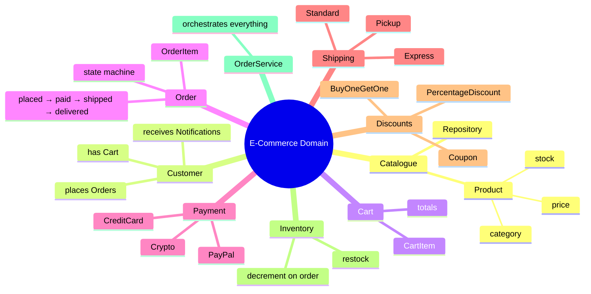
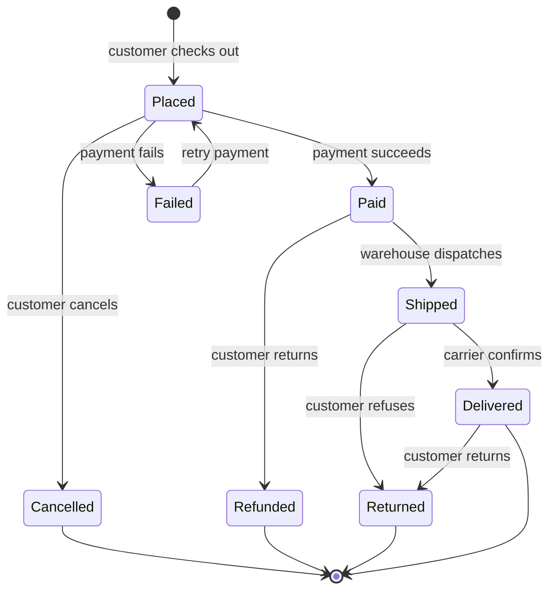
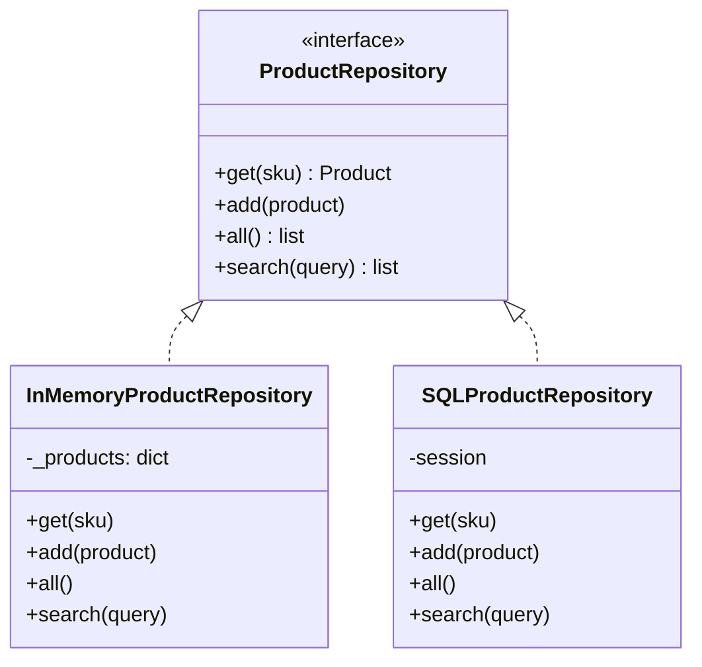
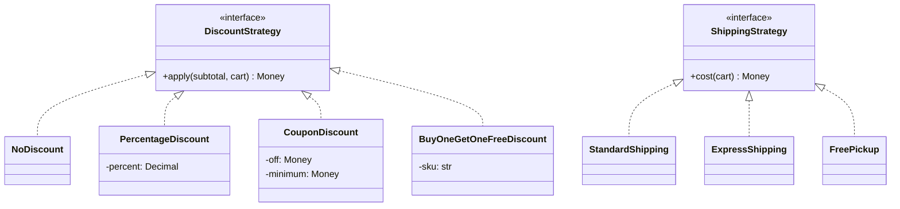
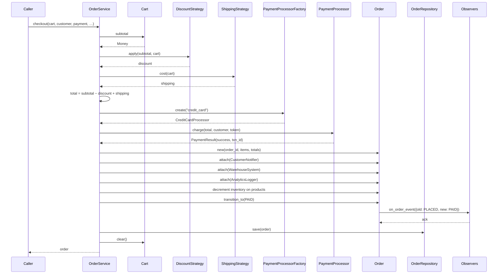
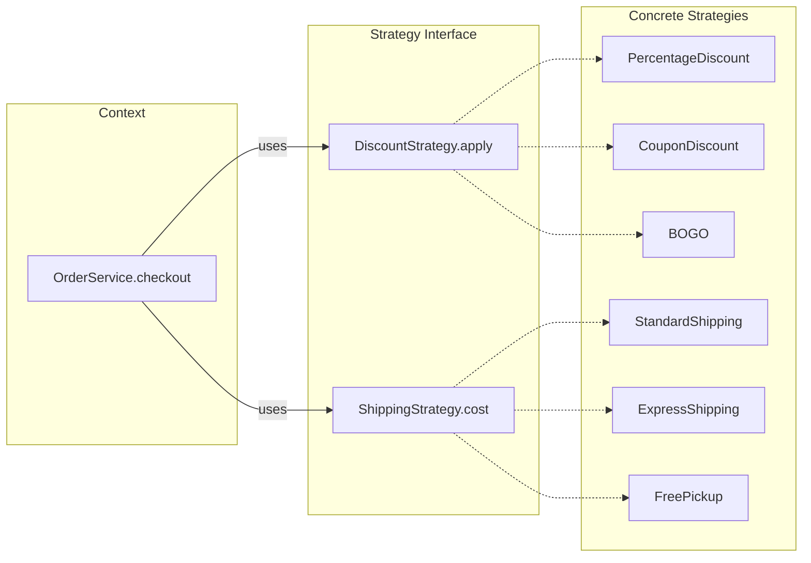
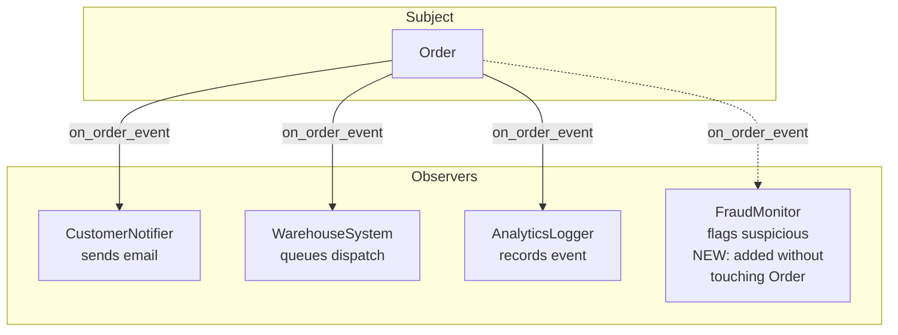
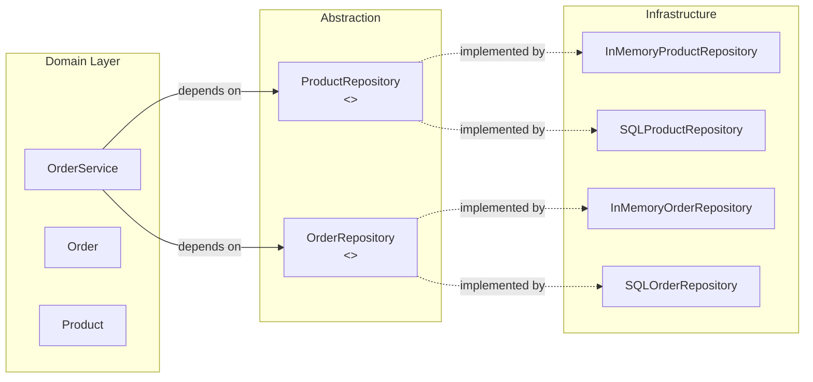

# Real-World OOP — An E-Commerce System

> [!info] Why an e-commerce example?
> E-commerce is a perfect OOP teaching domain because it forces you to confront *every* major OOP idea at once: complex state machines (an order moves through `placed → paid → shipped → delivered`), multiple algorithms that vary by context (shipping cost, tax, discounts), and lots of cross-cutting concerns (notifications, inventory, payments). Build this once and you'll recognise the same shapes in Shopify, Amazon, and your local coffee-shop ordering app.

This file walks through a complete, runnable Python implementation of an online store. We demonstrate **all four OOP pillars**, **SOLID in practice**, and **six design patterns** (Strategy, Observer, Factory, Repository, State, Service Layer) in a single coherent codebase.

---

## 1. The Domain at a Glance

An online store has a **catalogue** of `Product`s, each with a price and stock level. A `Customer` browses, adds items to a `Cart`, and checks out. Checkout creates an `Order`, which is processed by an `OrderService` that orchestrates: applying **discount strategies**, calculating **shipping** via a strategy, charging via a **payment processor**, decrementing **inventory**, and notifying observers (the customer, the warehouse, analytics) as the order moves through its state machine.



---

## 2. Design Decisions Up Front

| Decision | Choice | Why |
|---|---|---|
| Cart internals | Private list of items; access via `add`/`remove`/`items` property | Encapsulation — cart is more than a list; it owns pricing, totals, and quantity merging. |
| Payment processors | Polymorphic `PaymentProcessor` hierarchy + Factory | Open/Closed — adding a new processor (Apple Pay) doesn't touch checkout logic. |
| Shipping cost | Strategy pattern injected into `OrderService` | Different markets/carriers need different algorithms; runtime swappable. |
| Discounts | Strategy pattern, composable | Multiple discounts can stack — percentage + free shipping + coupon. |
| Order state | Explicit `OrderState` enum + State pattern transitions | Prevents illegal transitions (e.g. `delivered → paid`) and centralises side-effects. |
| Persistence | Repository pattern (`ProductRepository`, `OrderRepository`) | Decouples domain from storage; lets us swap in-memory for SQL/NoSQL later. |
| Orchestration | `OrderService` as a thin service layer | Single entry point for checkout; keeps `Order` itself free of orchestration logic. |
| Notifications | Observer pattern on `Order` | Customer, warehouse, analytics subscribe independently. |

> [!tip] Teaching Tip
> Show students this table *before* code. Ask: "If the cart were just a `list[tuple[Product, int]]`, what would be hard?" Brainstorm: deduplicating identical products, applying item-level discounts, serialising to JSON. Then introduce encapsulation as the answer.

---

## 3. The Order State Machine

An order is not a static data structure; it's a *state machine* with strict transition rules. Modelling this explicitly prevents whole classes of bugs (double-charging, shipping unpaid orders, etc.).



> [!note] Why explicit states?
> Without explicit states, the order is just a bag of booleans (`is_paid`, `is_shipped`, `is_cancelled`). It's easy to produce impossible combinations — `is_paid=True, is_cancelled=True`. An explicit state machine makes impossible states unrepresentable, the gold standard for domain modelling (see [[Domain-Driven-Design]]).

---

## 4. Core Code — Step by Step

### 4.1 Money and Value Objects

```python
from __future__ import annotations
from abc import ABC, abstractmethod
from dataclasses import dataclass, field
from datetime import datetime
from decimal import Decimal, ROUND_HALF_UP
from enum import Enum, auto
from typing import Optional
from uuid import uuid4


def money(cents: int) -> Decimal:
    """Convert integer cents to a Decimal dollar amount."""
    return (Decimal(cents) / 100).quantize(Decimal("0.01"), rounding=ROUND_HALF_UP)


def to_cents(d: Decimal) -> int:
    return int((d * 100).to_integral_value())


@dataclass(frozen=True)
class Money:
    """A value object: immutable, compared by value, no identity."""
    cents: int

    @classmethod
    def from_dollars(cls, amount: str | float | Decimal) -> "Money":
        return cls(to_cents(Decimal(str(amount))))

    @property
    def as_decimal(self) -> Decimal:
        return money(self.cents)

    def __add__(self, other: "Money") -> "Money":
        return Money(self.cents + other.cents)

    def __sub__(self, other: "Money") -> "Money":
        return Money(self.cents - other.cents)

    def __mul__(self, factor: int | Decimal) -> "Money":
        if isinstance(factor, Decimal):
            return Money(int((Decimal(self.cents) * factor).to_integral_value()))
        return Money(self.cents * factor)

    def __ge__(self, other: "Money") -> bool:
        return self.cents >= other.cents
```

> [!note] Value objects vs entities
> A `Money` is a *value object* — two $10 amounts are interchangeable. An `Order` is an *entity* — two orders with the same items are still different orders because they have different identities (`order_id`). This distinction is the heart of [[Domain-Driven-Design]]. Python's `@dataclass(frozen=True)` is the perfect vehicle for value objects.

### 4.2 The `Product` Entity and `ProductRepository`

```python
@dataclass
class Product:
    sku: str
    name: str
    price: Money
    weight_grams: int = 0
    category: str = "general"
    stock: int = 0

    def __post_init__(self):
        if self.stock < 0:
            raise ValueError("Stock cannot be negative")

    def decrement_stock(self, qty: int) -> None:
        if qty > self.stock:
            raise ValueError(f"Insufficient stock for {self.sku}: have {self.stock}, need {qty}")
        self.stock -= qty

    def increment_stock(self, qty: int) -> None:
        self.stock += qty


class ProductRepository(ABC):
    """Repository abstraction — domain code depends on this, not on SQL/JSON."""
    @abstractmethod
    def get(self, sku: str) -> Optional[Product]:
        ...

    @abstractmethod
    def add(self, product: Product) -> None:
        ...

    @abstractmethod
    def all(self) -> list[Product]:
        ...

    @abstractmethod
    def search(self, query: str) -> list[Product]:
        ...


class InMemoryProductRepository(ProductRepository):
    """A simple in-memory implementation. Swap for SQLRepository in production."""
    def __init__(self):
        self._products: dict[str, Product] = {}

    def get(self, sku: str) -> Optional[Product]:
        return self._products.get(sku)

    def add(self, product: Product) -> None:
        self._products[product.sku] = product

    def all(self) -> list[Product]:
        return list(self._products.values())

    def search(self, query: str) -> list[Product]:
        q = query.lower()
        return [p for p in self._products.values()
                if q in p.name.lower() or q in p.category.lower()]
```



> [!tip] Teaching Tip — DIP in action
> `OrderService` (which we'll write shortly) depends on `ProductRepository` — the *abstraction* — never on `InMemoryProductRepository`. In tests we inject the in-memory version; in production, the SQL version. This is the [[Dependency-Inversion]] principle making our code both testable and production-ready.

### 4.3 The `Cart` — Encapsulation

```python
@dataclass
class CartItem:
    product: Product
    quantity: int

    @property
    def line_total(self) -> Money:
        return self.product.price * self.quantity


class Cart:
    """A customer's shopping cart.

    Encapsulation: the items list is private. Clients add/remove via methods,
    which enforce quantity merging, stock validation, and non-negativity.
    """

    def __init__(self, customer_id: str):
        self.customer_id = customer_id
        self._items: list[CartItem] = []

    def add(self, product: Product, quantity: int = 1) -> None:
        if quantity <= 0:
            raise ValueError("Quantity must be positive")
        if product.stock < quantity:
            raise ValueError(f"Insufficient stock for {product.sku}")
        existing = self._find(product.sku)
        if existing:
            existing.quantity += quantity
        else:
            self._items.append(CartItem(product, quantity))

    def remove(self, sku: str) -> None:
        self._items = [item for item in self._items if item.product.sku != sku]

    def update_quantity(self, sku: str, qty: int) -> None:
        if qty <= 0:
            self.remove(sku)
            return
        item = self._find(sku)
        if item is None:
            raise KeyError(sku)
        if item.product.stock < qty:
            raise ValueError(f"Insufficient stock for {sku}")
        item.quantity = qty

    def _find(self, sku: str) -> Optional[CartItem]:
        return next((i for i in self._items if i.product.sku == sku), None)

    @property
    def items(self) -> list[CartItem]:
        return list(self._items)  # defensive copy

    @property
    def subtotal(self) -> Money:
        total = Money(0)
        for item in self._items:
            total = total + item.line_total
        return total

    @property
    def is_empty(self) -> bool:
        return len(self._items) == 0

    @property
    def total_weight(self) -> int:
        return sum(i.product.weight_grams * i.quantity for i in self._items)

    def clear(self) -> None:
        self._items.clear()
```

> [!note] Why `_items` and not `items`?
> If we exposed `items` as a public attribute, a caller could do `cart.items.append(random_thing)` and bypass all validation. By making the attribute private and exposing a *defensive copy* via the `items` property, we keep the cart's invariants intact. The list returned is a *snapshot* — mutating it doesn't affect the cart.

### 4.4 Discount and Shipping Strategies

```python
class DiscountStrategy(ABC):
    """Strategy interface — algorithms that reduce the order total."""
    @abstractmethod
    def apply(self, subtotal: Money, cart: Cart) -> Money:
        """Return the discount amount (>= 0)."""
        ...


class NoDiscount(DiscountStrategy):
    def apply(self, subtotal: Money, cart: Cart) -> Money:
        return Money(0)


class PercentageDiscount(DiscountStrategy):
    def __init__(self, percent: Decimal):
        if not 0 <= percent <= 100:
            raise ValueError("percent must be 0..100")
        self._percent = percent

    def apply(self, subtotal: Money, cart: Cart) -> Money:
        factor = self._percent / Decimal(100)
        return Money(int((Decimal(subtotal.cents) * factor).to_integral_value()))


class CouponDiscount(DiscountStrategy):
    """Fixed-amount off, only if subtotal meets a minimum."""
    def __init__(self, code: str, off: Money, minimum_subtotal: Money = Money(0)):
        self.code = code
        self._off = off
        self._minimum = minimum_subtotal

    def apply(self, subtotal: Money, cart: Cart) -> Money:
        if subtotal >= self._minimum:
            return self._off
        return Money(0)


class BuyOneGetOneFreeDiscount(DiscountStrategy):
    """BOGO on a specific SKU."""
    def __init__(self, sku: str):
        self._sku = sku

    def apply(self, subtotal: Money, cart: Cart) -> Money:
        item = cart._find(self._sku)  # access via internal API
        if item is None:
            return Money(0)
        free_items = item.quantity // 2
        return item.product.price * free_items


class ShippingStrategy(ABC):
    """Strategy interface — algorithms for computing shipping cost."""
    @abstractmethod
    def cost(self, cart: Cart) -> Money:
        ...


class StandardShipping(ShippingStrategy):
    """Flat rate + per-kg surcharge."""
    BASE = Money.from_dollars("5.99")
    PER_KG = Money.from_dollars("0.50")

    def cost(self, cart: Cart) -> Money:
        kg = cart.total_weight / 1000
        return self.BASE + (self.PER_KG * int(kg))


class ExpressShipping(ShippingStrategy):
    BASE = Money.from_dollars("14.99")
    PER_KG = Money.from_dollars("1.50")

    def cost(self, cart: Cart) -> Money:
        kg = cart.total_weight / 1000
        return self.BASE + (self.PER_KG * int(kg))


class FreePickup(ShippingStrategy):
    def cost(self, cart: Cart) -> Money:
        return Money(0)
```



> [!tip] Why strategies instead of methods?
> A common beginner mistake is to put `cart.compute_discount()` on the `Cart` class. But discounts and shipping rules *change constantly* — Black Friday, seasonal promos, A/B tests. If they're baked into `Cart`, every change means editing `Cart`. By extracting them as strategies, we can swap them per-checkout, per-customer, per-market — without touching any domain class. This is the [[Open-Closed]] principle in action.

### 4.5 Payment Processors — Polymorphism + Factory

```python
@dataclass
class PaymentResult:
    success: bool
    transaction_id: Optional[str] = None
    error_message: Optional[str] = None


class PaymentProcessor(ABC):
    """Abstract payment processor. Subclasses implement the actual gateway call."""
    @abstractmethod
    def charge(self, amount: Money, customer_id: str, token: str) -> PaymentResult:
        ...


class CreditCardProcessor(PaymentProcessor):
    def __init__(self, api_key: str):
        self._api_key = api_key

    def charge(self, amount: Money, customer_id: str, token: str) -> PaymentResult:
        # In production: call Stripe/Braintree here.
        print(f"  💳 Charging {amount.as_decimal} to card token {token[:8]}…")
        return PaymentResult(success=True, transaction_id=f"CC-{uuid4().hex[:12]}")


class PayPalProcessor(PaymentProcessor):
    def __init__(self, client_id: str, secret: str):
        self._client_id = client_id
        self._secret = secret

    def charge(self, amount: Money, customer_id: str, token: str) -> PaymentResult:
        print(f"  🅿️  Charging {amount.as_decimal} via PayPal account {token}")
        return PaymentResult(success=True, transaction_id=f"PP-{uuid4().hex[:12]}")


class CryptoProcessor(PaymentProcessor):
    def __init__(self, wallet_address: str):
        self._wallet = wallet_address

    def charge(self, amount: Money, customer_id: str, token: str) -> PaymentResult:
        print(f"  ₿ Charging {amount.as_decimal} via crypto (wallet {self._wallet[:8]}…)")
        # Crypto payments can fail more often — simulate.
        if amount.cents > 1_000_000:  # > $10,000
            return PaymentResult(success=False, error_message="Amount exceeds gas limit")
        return PaymentResult(success=True, transaction_id=f"CR-{uuid4().hex[:12]}")


# ---- Factory ------------------------------------------------------------
class PaymentProcessorFactory:
    """Factory: returns the right processor for a payment method string."""
    _registry: dict[str, type[PaymentProcessor]] = {}
    _configs: dict[str, dict] = {}

    @classmethod
    def register(cls, method: str, processor_class: type[PaymentProcessor],
                 config: dict | None = None) -> None:
        cls._registry[method] = processor_class
        if config:
            cls._configs[method] = config

    @classmethod
    def create(cls, method: str) -> PaymentProcessor:
        if method not in cls._registry:
            raise ValueError(f"Unknown payment method: {method}")
        return cls._registry[method](**cls._configs.get(method, {}))


# Register processors at startup
PaymentProcessorFactory.register("credit_card", CreditCardProcessor,
                                  {"api_key": "sk_test_xxx"})
PaymentProcessorFactory.register("paypal", PayPalProcessor,
                                  {"client_id": "client", "secret": "secret"})
PaymentProcessorFactory.register("crypto", CryptoProcessor,
                                  {"wallet_address": "0xabc123..."})
```

### 4.6 The `Order` Entity and State Pattern

```python
class OrderState(Enum):
    PLACED = auto()
    PAID = auto()
    FAILED = auto()
    SHIPPED = auto()
    DELIVERED = auto()
    CANCELLED = auto()
    REFUNDED = auto()
    RETURNED = auto()


# Legal transitions
_TRANSITIONS = {
    (OrderState.PLACED, OrderState.PAID),
    (OrderState.PLACED, OrderState.FAILED),
    (OrderState.PLACED, OrderState.CANCELLED),
    (OrderState.FAILED, OrderState.PLACED),    # retry
    (OrderState.PAID, OrderState.SHIPPED),
    (OrderState.PAID, OrderState.REFUNDED),
    (OrderState.SHIPPED, OrderState.DELIVERED),
    (OrderState.SHIPPED, OrderState.RETURNED),
    (OrderState.DELIVERED, OrderState.RETURNED),
}


@dataclass
class OrderItem:
    sku: str
    name: str
    unit_price: Money
    quantity: int

    @property
    def line_total(self) -> Money:
        return self.unit_price * self.quantity


class Order:
    """An order is an entity: it has identity (order_id) and a state machine."""

    def __init__(self, order_id: str, customer_id: str, items: list[OrderItem],
                 subtotal: Money, discount: Money, shipping: Money):
        self.order_id = order_id
        self.customer_id = customer_id
        self.items = list(items)
        self.subtotal = subtotal
        self.discount = discount
        self.shipping = shipping
        self._state = OrderState.PLACED
        self.created_at = datetime.utcnow()
        self.payment_transaction_id: Optional[str] = None
        self._observers: list["OrderObserver"] = []

    @property
    def total(self) -> Money:
        return self.subtotal - self.discount + self.shipping

    @property
    def state(self) -> OrderState:
        return self._state

    # --- State machine ---------------------------------------------------
    def transition_to(self, new_state: OrderState) -> None:
        key = (self._state, new_state)
        if key not in _TRANSITIONS:
            raise ValueError(f"Illegal transition: {self._state.name} → {new_state.name}")
        old_state = self._state
        self._state = new_state
        self._notify_observers(old_state, new_state)

    # --- Observer pattern ------------------------------------------------
    def attach(self, observer: "OrderObserver") -> None:
        if observer not in self._observers:
            self._observers.append(observer)

    def detach(self, observer: "OrderObserver") -> None:
        self._observers.remove(observer)

    def _notify_observers(self, old: OrderState, new: OrderState) -> None:
        event = {"order_id": self.order_id, "customer_id": self.customer_id,
                 "old_state": old.name, "new_state": new.name,
                 "total": self.total.as_decimal, "timestamp": datetime.utcnow().isoformat()}
        for observer in list(self._observers):
            observer.on_order_event(event)

    def __repr__(self) -> str:
        return (f"Order({self.order_id}, state={self._state.name}, "
                f"total={self.total.as_decimal})")
```

### 4.7 Observers — Notifications

```python
class OrderObserver(ABC):
    @abstractmethod
    def on_order_event(self, event: dict) -> None:
        ...


class CustomerNotifier(OrderObserver):
    """Sends an email/push notification to the customer."""
    def __init__(self, customer_email: str):
        self.email = customer_email
        self.sent: list[str] = []

    def on_order_event(self, event: dict) -> None:
        msg = (f"📧 Email to {self.email}: Your order {event['order_id']} "
               f"is now {event['new_state'].lower()} (was {event['old_state'].lower()})")
        self.sent.append(msg)
        print(f"  {msg}")


class WarehouseSystem(OrderObserver):
    """Tells the warehouse to dispatch when an order becomes PAID."""
    def __init__(self):
        self.dispatch_queue: list[str] = []

    def on_order_event(self, event: dict) -> None:
        if event["new_state"] == "PAID":
            self.dispatch_queue.append(event["order_id"])
            print(f"  📦 Warehouse: queued order {event['order_id']} for dispatch")


class AnalyticsLogger(OrderObserver):
    """Records every transition for analytics."""
    def __init__(self):
        self.events: list[dict] = []

    def on_order_event(self, event: dict) -> None:
        self.events.append(event)
        print(f"  📊 Analytics: {event['old_state']} → {event['new_state']} "
              f"on order {event['order_id']}")
```

### 4.8 The `OrderRepository` and `OrderService` — Service Layer

```python
class OrderRepository(ABC):
    @abstractmethod
    def save(self, order: Order) -> None: ...
    @abstractmethod
    def get(self, order_id: str) -> Optional[Order]: ...
    @abstractmethod
    def for_customer(self, customer_id: str) -> list[Order]: ...


class InMemoryOrderRepository(OrderRepository):
    def __init__(self):
        self._orders: dict[str, Order] = {}

    def save(self, order: Order) -> None:
        self._orders[order.order_id] = order

    def get(self, order_id: str) -> Optional[Order]:
        return self._orders.get(order_id)

    def for_customer(self, customer_id: str) -> list[Order]:
        return [o for o in self._orders.values() if o.customer_id == customer_id]


class OrderService:
    """Service layer — orchestrates checkout.

    Single Responsibility: it coordinates ProductRepository, Cart,
    DiscountStrategy, ShippingStrategy, PaymentProcessor, OrderRepository,
    and Order observers. It does NOT contain business rules itself; it wires
    collaborators together.
    """

    def __init__(self, products: ProductRepository, orders: OrderRepository):
        self._products = products
        self._orders = orders

    def checkout(
        self,
        cart: Cart,
        customer_id: str,
        customer_email: str,
        payment_method: str,
        payment_token: str,
        discount_strategy: DiscountStrategy = None,
        shipping_strategy: ShippingStrategy = None,
    ) -> Order:
        if cart.is_empty:
            raise ValueError("Cannot check out an empty cart")

        discount_strategy = discount_strategy or NoDiscount()
        shipping_strategy = shipping_strategy or StandardShipping()

        # 1. Compute totals
        subtotal = cart.subtotal
        discount = discount_strategy.apply(subtotal, cart)
        shipping = shipping_strategy.cost(cart)
        total = subtotal - discount + shipping

        # 2. Charge payment
        processor = PaymentProcessorFactory.create(payment_method)
        result = processor.charge(total, customer_id, payment_token)
        if not result.success:
            # Create a FAILED order for audit trail, then raise.
            order = self._build_order(cart, customer_id, subtotal, discount, shipping)
            order.attach(CustomerNotifier(customer_email))
            order.transition_to(OrderState.FAILED)
            self._orders.save(order)
            raise RuntimeError(f"Payment failed: {result.error_message}")

        # 3. Build the order
        order = self._build_order(cart, customer_id, subtotal, discount, shipping)
        order.payment_transaction_id = result.transaction_id

        # 4. Attach observers
        order.attach(CustomerNotifier(customer_email))
        order.attach(WarehouseSystem())
        order.attach(AnalyticsLogger())

        # 5. Decrement inventory
        for item in cart.items:
            item.product.decrement_stock(item.quantity)

        # 6. Transition PLACED → PAID (notifies observers)
        order.transition_to(OrderState.PAID)

        # 7. Persist and clear cart
        self._orders.save(order)
        cart.clear()

        return order

    def mark_shipped(self, order_id: str) -> Order:
        order = self._orders.get(order_id)
        if order is None:
            raise KeyError(order_id)
        order.transition_to(OrderState.SHIPPED)
        return order

    def mark_delivered(self, order_id: str) -> Order:
        order = self._orders.get(order_id)
        if order is None:
            raise KeyError(order_id)
        order.transition_to(OrderState.DELIVERED)
        return order

    def cancel(self, order_id: str) -> Order:
        order = self._orders.get(order_id)
        if order is None:
            raise KeyError(order_id)
        order.transition_to(OrderState.CANCELLED)
        # Restock
        for item in order.items:
            product = self._products.get(item.sku)
            if product:
                product.increment_stock(item.quantity)
        return order

    def _build_order(self, cart: Cart, customer_id: str,
                     subtotal: Money, discount: Money, shipping: Money) -> Order:
        order_items = [
            OrderItem(sku=item.product.sku, name=item.product.name,
                      unit_price=item.product.price, quantity=item.quantity)
            for item in cart.items
        ]
        return Order(
            order_id=f"ORD-{uuid4().hex[:8].upper()}",
            customer_id=customer_id,
            items=order_items,
            subtotal=subtotal,
            discount=discount,
            shipping=shipping,
        )
```

### 4.9 Putting It All Together — End-to-End Demo

```python
def demo():
    # Set up repositories
    products = InMemoryProductRepository()
    products.add(Product("WIDGET-1", "Widget", Money.from_dollars("9.99"),
                          weight_grams=200, category="gadgets", stock=100))
    products.add(Product("GIZMO-2", "Gizmo", Money.from_dollars("29.99"),
                          weight_grams=500, category="gadgets", stock=50))
    products.add(Product("BOOK-3", "OOP Book", Money.from_dollars("49.99"),
                          weight_grams=800, category="books", stock=25))

    orders = InMemoryOrderRepository()
    service = OrderService(products, orders)

    # Customer browses and adds to cart
    cart = Cart(customer_id="C001")
    cart.add(products.get("WIDGET-1"), quantity=2)
    cart.add(products.get("BOOK-3"), quantity=1)

    print(f"Subtotal: {cart.subtotal.as_decimal}")

    # Checkout with a 10% discount and express shipping
    order = service.checkout(
        cart=cart,
        customer_id="C001",
        customer_email="shopper@example.com",
        payment_method="credit_card",
        payment_token="tok_visa_4242",
        discount_strategy=PercentageDiscount(Decimal("10")),
        shipping_strategy=ExpressShipping(),
    )
    print(f"\nOrder created: {order}")
    print(f"  Subtotal: {order.subtotal.as_decimal}")
    print(f"  Discount: {order.discount.as_decimal}")
    print(f"  Shipping: {order.shipping.as_decimal}")
    print(f"  Total:    {order.total.as_decimal}")

    # Warehouse dispatches
    service.mark_shipped(order.order_id)

    # Carrier delivers
    service.mark_delivered(order.order_id)

    print(f"\nFinal state: {order.state.name}")


if __name__ == "__main__":
    demo()
```

---

## 5. The Checkout Sequence

Here is the full sequence of interactions during a single `checkout()` call. This diagram is the single most important one for students to internalise — it shows how the Service Layer orchestrates many collaborators without any of them knowing about each other.



> [!tip] Teaching Tip
> Walk through this diagram line by line with students. At each arrow, ask: "Which SOLID principle is being applied here?" Examples: the `Factory.create` call is Open/Closed (new processors don't change `OrderService`); the `Repo.save` call is Dependency Inversion (the service depends on the abstraction); the `Order.attach` calls are Open/Closed again (new observers don't change `Order`).

---

## 6. Strategy Pattern in Depth

Discounts and shipping are the canonical Strategy pattern examples because:

1. **Multiple algorithms exist** for the same problem (compute discount / shipping).
2. **The algorithm must vary at runtime** (different customers get different discounts).
3. **The algorithm is independent of the data it operates on** (the cart doesn't care which discount runs).



> [!note] Strategy vs inheritance
> A naive OOP design might have `DiscountedCart` and `FullPriceCart` subclasses. But discounts *compose* — a customer might use a 10% off *and* a $5 coupon *and* free shipping. Inheritance can't model this composition cleanly; Strategy can, because strategies are *objects you inject*, not *classes you inherit from*. See [[Composition-Over-Inheritance]].

### 6.1 Composing Multiple Discounts

For a real store, you'd want a composite discount strategy:

```python
class CompositeDiscount(DiscountStrategy):
    """Applies multiple discounts in sequence."""
    def __init__(self, strategies: list[DiscountStrategy]):
        self._strategies = strategies

    def apply(self, subtotal: Money, cart: Cart) -> Money:
        running = subtotal
        total_discount = Money(0)
        for strategy in self._strategies:
            discount = strategy.apply(running, cart)
            total_discount = total_discount + discount
            running = running - discount
        return total_discount


# Usage: 10% off + $5 coupon, applied in sequence
bundle = CompositeDiscount([
    PercentageDiscount(Decimal("10")),
    CouponDiscount("SAVE5", Money.from_dollars("5.00")),
])
```

This is the [[Decorator-Pattern]] shape applied to Strategy — another example of how patterns compose.

---

## 7. Observer Pattern in Depth



The Observer pattern is what lets us add a new concern — say, fraud detection — *without modifying `Order`*:

```python
class FraudMonitor(OrderObserver):
    def on_order_event(self, event: dict) -> None:
        if event["new_state"] == "PAID":
            total = Decimal(str(event["total"]))
            if total > Decimal("10000"):
                print(f"  🚨 FRAUD: order {event['order_id']} total ${total}")

# Plug it in — no changes to Order, OrderService, or any other class:
order.attach(FraudMonitor())
```

This is the [[Open-Closed]] principle: open for extension (we added a new observer), closed for modification (no existing class changed).

> [!warning] Observer pitfalls
> - **Memory leaks**: observers hold references to subjects. Use `weakref` in production.
> - **Order of notification**: observers fire in attachment order. Don't depend on this in production code.
> - **Re-entrancy**: an observer that mutates the subject mid-notification can cause infinite loops. Use a snapshot of observers (we do: `list(self._observers)`) and queue state changes.

---

## 8. SOLID Compliance Walkthrough

| Principle | Where in the code |
|---|---|
| **S**ingle Responsibility | `Cart` only manages items/totals. `Order` only holds state. `OrderService` only orchestrates. `ProductRepository` only persists. `DiscountStrategy` only computes discounts. No class wears two hats. |
| **O**pen/Closed | Adding a new payment processor: register with the factory, done — `OrderService` untouched. Adding a new discount: subclass `DiscountStrategy`, done. Adding a new observer: subclass `OrderObserver`, attach at runtime, done. |
| **L**iskov Substitution | Anywhere `PaymentProcessor` is used, any subclass works. Anywhere `DiscountStrategy` is used, any subclass works. The contract is the abstract method signature. |
| **I**nterface Segregation | `ProductRepository` exposes only persistence methods. `OrderRepository` exposes only order persistence. They don't share a bloated `Repository` interface. |
| **D**ependency Inversion | `OrderService` depends on `ProductRepository` and `OrderRepository` *abstractions*, not on `InMemory*` concrete classes. In tests we inject in-memory; in prod we inject SQL. Same service, different dependencies. |

---

## 9. Repository Pattern in Depth



The Repository pattern abstracts persistence. Domain code (the service, the entities) never sees SQL, JSON, or HTTP — it only sees the repository interface. Benefits:

- **Testability**: tests inject in-memory repositories; no database needed.
- **Swappability**: switch from Postgres to MongoDB by writing a new repository, no domain code changes.
- **Centralised queries**: all `Product` access goes through `ProductRepository`, so caching, logging, and access control live in one place.

See [[Repository-Pattern]] for the full pattern write-up.

---

## 10. Testing the E-Commerce System

Because we used DI, Strategy, and Repository throughout, every class is unit-testable in isolation:

```python
import pytest
from decimal import Decimal
from ecommerce import (Cart, Product, Money, PercentageDiscount, ExpressShipping,
                       OrderService, InMemoryProductRepository, InMemoryOrderRepository,
                       OrderState, PaymentProcessorFactory, PaymentProcessor, PaymentResult)


class FakeProcessor(PaymentProcessor):
    """Test double: always succeeds (or always fails, configurable)."""
    def __init__(self, succeed=True):
        self.succeed = succeed
        self.charges = []
    def charge(self, amount, customer_id, token):
        self.charges.append((amount, customer_id, token))
        if self.succeed:
            return PaymentResult(True, "fake-txn")
        return PaymentResult(False, error_message="forced failure")


class TestCart:
    def test_add_merges_quantities(self):
        cart = Cart("C1")
        p = Product("A", "A", Money.from_dollars("1.00"), stock=10)
        cart.add(p, 2)
        cart.add(p, 3)
        assert cart.items[0].quantity == 5

    def test_remove(self):
        cart = Cart("C1")
        p = Product("A", "A", Money.from_dollars("1.00"), stock=10)
        cart.add(p, 1)
        cart.remove("A")
        assert cart.is_empty

    def test_subtotal(self):
        cart = Cart("C1")
        p1 = Product("A", "A", Money.from_dollars("2.00"), stock=10)
        p2 = Product("B", "B", Money.from_dollars("3.00"), stock=10)
        cart.add(p1, 2)
        cart.add(p2, 1)
        assert cart.subtotal.as_decimal == Decimal("7.00")


class TestCheckout:
    def test_successful_checkout_transitions_to_paid(self):
        products = InMemoryProductRepository()
        products.add(Product("A", "A", Money.from_dollars("10.00"), stock=5))
        orders = InMemoryOrderRepository()
        service = OrderService(products, orders)

        # Swap in a fake processor
        PaymentProcessorFactory._registry["credit_card"] = FakeProcessor
        PaymentProcessorFactory._configs["credit_card"] = {"succeed": True}

        cart = Cart("C1")
        cart.add(products.get("A"), 1)
        order = service.checkout(cart, "C1", "c@x.com", "credit_card", "tok")
        assert order.state == OrderState.PAID
        assert products.get("A").stock == 4  # decremented

    def test_failed_payment_raises_and_records_failed_order(self):
        products = InMemoryProductRepository()
        products.add(Product("A", "A", Money.from_dollars("10.00"), stock=5))
        orders = InMemoryOrderRepository()
        service = OrderService(products, orders)

        PaymentProcessorFactory._registry["credit_card"] = FakeProcessor
        PaymentProcessorFactory._configs["credit_card"] = {"succeed": False}

        cart = Cart("C1")
        cart.add(products.get("A"), 1)
        with pytest.raises(RuntimeError):
            service.checkout(cart, "C1", "c@x.com", "credit_card", "tok")

    def test_cannot_transition_delivered_to_placed(self):
        # Illegal transition should raise.
        # (Setup abbreviated — uses order's transition_to directly)
        pass
```

> [!note] Testing through abstractions
> Notice how the test injects a `FakeProcessor` by mutating the factory's registry. In a real codebase you'd pass the processor as a constructor argument to `OrderService` for even cleaner DI. Either way, the principle holds: **because the service depends on an abstraction, we can substitute any double in tests**. See [[Mocking-And-Stubs]].

---

## 11. Common Mistakes to Discuss

> [!danger] Pitfalls students hit
> - **Cart as a public list.** If clients do `cart.items.append(...)`, you've lost control of invariants. Always return defensive copies.
> - **Discount logic in `Cart`.** Carts shouldn't know about discounts; that's the strategy's job. Mixing them makes carts impossible to reuse across markets with different discount rules.
> - **State as booleans.** `is_paid`, `is_shipped`, `is_cancelled` quickly produce impossible combinations. Use an explicit state enum + transition table.
> - **Service layer doing too much.** If `OrderService.checkout` is 200 lines, it's becoming a [[God-Object]]. Extract collaborators.
> - **Ignoring idempotency.** Real payment processors can retry callbacks. Your `Order` must handle "I already transitioned to PAID" gracefully — `transition_to` should be idempotent or raise a clear error.
> - **Anemic domain models.** If `Order` is just a bag of getters and `OrderService` does all the work, you've built a transaction script, not an OOP domain. Push behaviour into the entity that owns the data.

---

## 12. Extensions and Exercises for Students

> [!example] Lab assignments
> 1. **Add `ApplePayProcessor`** and register it with the factory. Demonstrate that `OrderService` doesn't change.
> 2. **Add a `FreeShippingThreshold` shipping strategy** that returns `Money(0)` if the subtotal exceeds $50. Test it.
> 3. **Add a `LoyaltyDiscount`** that gives 15% off to customers with > 10 past orders. Hint: inject an `OrderRepository` into the strategy.
> 4. **Add a `TaxStrategy`** for state/country-specific tax calculation. Now checkout has three strategies: discount, shipping, tax.
> 5. **Implement `OrderService.refund(order_id)`** that transitions PAID → REFUNDED and restocks items.
> 6. **Add a `ConcurrentOrderService`** that uses `threading.Lock` to prevent double-charging if the customer clicks "checkout" twice.
> 7. **Refactor `OrderService` to accept the `PaymentProcessor` as a constructor argument** instead of using the global factory. Discuss the trade-off (more DI vs. less boilerplate).
> 8. **Write an integration test** that uses an in-memory repository, a fake processor, and exercises the full state machine PLACED → PAID → SHIPPED → DELIVERED.

---

## 13. How This Maps to Real E-Commerce Software

Real e-commerce platforms (Shopify, Magento, Spree, Saleor) follow the same shapes you see here:

- **Products and inventory** are managed via repositories (often CQRS-read models for fast catalogue search).
- **Carts** are persisted per-session; some platforms use Redis exclusively.
- **Discounts and promotions** are implemented as Strategy or Rule Engine — Shopify's "discount codes" map exactly to our `CouponDiscount`.
- **Payments** are abstracted behind a processor interface — Stripe, Braintree, Adyen, PayPal all plug in.
- **Order state machines** are first-class — most platforms visualise them in admin dashboards.
- **Notifications** flow through message buses (Kafka, RabbitMQ) — Observer at scale.
- **Service layers** orchestrate checkout, but each step (reserve inventory, charge, dispatch email, dispatch webhook) is a separate, idempotent handler.

If students understand this 800-line example, they understand the architecture of every major e-commerce platform.

---

## 14. Procedural vs Object-Oriented — A Quick Contrast

Imagine writing checkout procedurally:

```python
def checkout(cart_dict, customer_id, payment_method, discount_pct):
    subtotal = sum(p["price"] * q for p, q in cart_dict.items())
    discount = subtotal * discount_pct / 100
    shipping = 5.99 if subtotal < 50 else 0
    total = subtotal - discount + shipping
    if payment_method == "credit_card":
        result = charge_credit_card(total, customer_id)
    elif payment_method == "paypal":
        result = charge_paypal(total, customer_id)
    elif payment_method == "crypto":
        result = charge_crypto(total, customer_id)
    else:
        raise ValueError("unknown method")
    if not result.success:
        return None
    order = {"id": gen_id(), "items": cart_dict, "total": total, "state": "paid"}
    save_order(order)
    send_email(customer_id, "Your order is paid")
    notify_warehouse(order["id"])
    return order
```

It's shorter. But what's wrong?

- Adding a 4th payment method means editing this function (violates OCP).
- Adding a fraud check means editing this function.
- The state `paid` is just a string — typos are silent bugs.
- Decrementing inventory isn't visible — easy to forget.
- "Restock on cancel" requires a *separate* function that knows the same internals.
- Testing this requires charging a real credit card.

The OOP version pays a small upfront cost (more classes, more files) for enormous long-term payoff: extension without modification, testability, and a domain model that *prevents* illegal states.

---

## 15. Recap and Cross-References

In this single example we touched:

- **Four Pillars**: [[Encapsulation]] (cart internals), [[Inheritance]] (PaymentProcessor), [[Polymorphism]] (charge() per processor), [[Abstraction]] (Strategy/Repository interfaces).
- **SOLID**: All five — see [[SOLID-Overview]].
- **Patterns**: [[Strategy-Pattern]] (discounts, shipping), [[Observer-Pattern]] (notifications), [[Factory-Pattern]] (payment processors), [[Repository-Pattern]] (products, orders), [[State-Pattern]] (order state machine), Service Layer (`OrderService`).
- **Architecture**: [[Service-Layer]] orchestrates; [[Repository-Pattern]] abstracts persistence; domain entities (`Order`, `Product`, `Cart`) hold behaviour, not just data.

> [!success] Learning outcome
> After studying this file, a student should be able to (a) design a service layer that orchestrates multiple collaborators via abstractions, (b) justify why Strategy and Observer appear together in nearly every e-commerce codebase, (c) extend the system with a new payment method, discount, or observer *without modifying existing code*, and (d) write unit tests that swap real collaborators for fakes via dependency injection.

Next, head to [[Game-Development-Example]] to see OOP applied to a domain where performance and entity modelling dominate, or to [[Library-Management-Example]] for a gentler state-machine-focused example.

#oop #real-world #ecommerce #python #design-patterns #solid #strategy-pattern #observer-pattern #factory-pattern #repository-pattern #state-pattern #service-layer #encapsulation #polymorphism #abstraction #teaching
