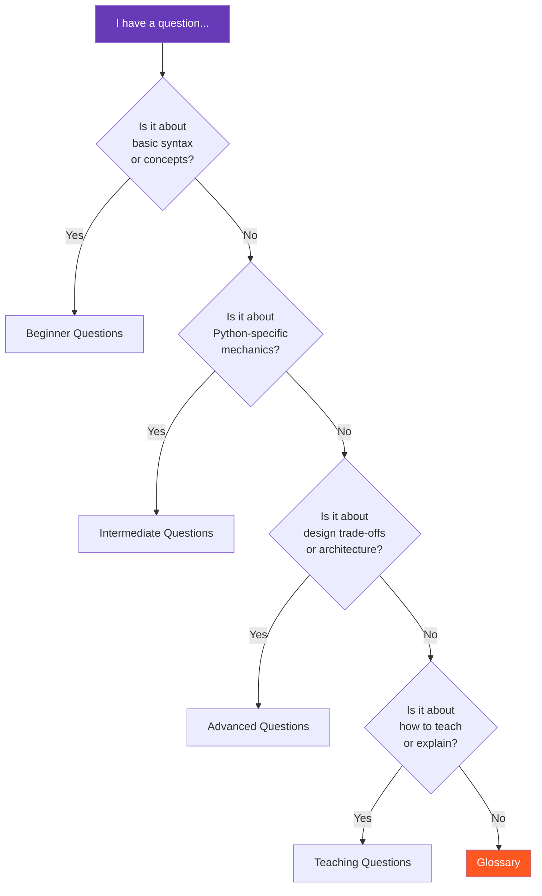
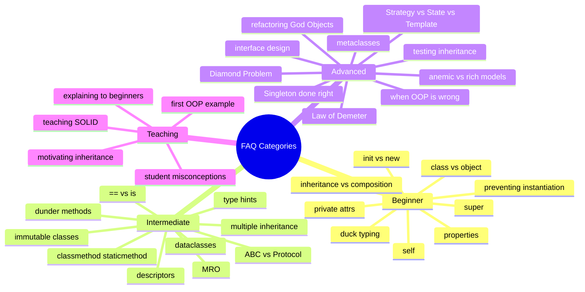

# FAQ — Frequently Asked Questions about OOP

#oop #resources #faq #teaching #reference #deep-dive

> [!info] How to use this FAQ
> Forty-plus questions, organised into four categories: **Beginner**, **Intermediate**, **Advanced**, and **Teaching**. Each answer is 100–300 words and links to the deeper note where the concept is fully unpacked. Use `Ctrl+F` to search; use the question-routing flowchart below if you do not know which category your question is in.

---

## 0. Question-Routing Flowchart





---

## 1. Beginner Questions

### Q1.1 — What's the difference between a class and an object?

A **class** is a blueprint; an **object** is something built from that blueprint. The class defines what attributes and methods *every* instance will have; the object is one specific instance with its own particular values for those attributes.

```python
class Dog:           # the class (blueprint)
    def __init__(self, name):
        self.name = name

rex = Dog("Rex")     # an object (instance) of class Dog
fido = Dog("Fido")   # a different object, same class
```

`rex` and `fido` are both objects of the `Dog` class. They share the same `bark()` method, but their `name` attributes differ.

In Python, classes are themselves objects — instances of `type` (or another metaclass). This is unusual and powerful: it means you can assign a class to a variable, pass it to a function, or modify it at runtime. See [[Classes-And-Objects]] for the deep dive, including the "a class is an object" demonstrations that flip on lightbulbs for intermediate developers.

### Q1.2 — Do I need OOP for every Python program?

No. OOP is a *tool* for *certain kinds of problems*, not a religion. Use OOP when you have:

- Multiple pieces of related state that must stay consistent (an object's invariants).
- Behavior that varies by type and is best dispatched dynamically (polymorphism).
- A long-lived program where modularity matters more than line count.
- A team that benefits from shared mental models of the domain.

Do *not* use OOP when:

- The program is a 50-line script.
- The work is a pure data pipeline (`map` / `filter` / `reduce`).
- You are doing math or numerical computation.
- The code is exploratory (Jupyter notebooks).

When in doubt, write the simpler version first and let OOP emerge from the third or fourth copy-paste. This is Sandi Metz's Rule of Three. See [[When-To-Use-OOP]] and [[When-Not-To-Use-OOP]].

### Q1.3 — Why do I need `self`?

`self` is the explicit name for *the instance the method is operating on*. In Python, when you write `rex.bark()`, Python translates that into `Dog.bark(rex)` — passing `rex` as the first argument. The first parameter of every instance method is *that argument*, and by convention it is called `self`.

```python
class Dog:
    def bark(self):           # self receives the instance
        print(f"{self.name} says woof")

rex = Dog(); rex.name = "Rex"
rex.bark()                    # equivalent to Dog.bark(rex)
```

Python could have made `self` implicit (as Java and JavaScript do with `this`), but the language's designer chose explicitness. The benefit: there is no ambiguity about what a method operates on, and you can write `Dog.bark(rex)` directly when you need to (e.g. for testing or for calling a parent's method). The cost: a tiny bit of typing. See [[Self-And-Cls]].

### Q1.4 — What's the difference between `__init__` and `__new__`?

`__new__` *creates* the object; `__init__` *initialises* it. They are called in sequence when you do `MyClass(args)`:

1. `type.__call__(MyClass, args)` is invoked.
2. `__new__(cls, args)` allocates and returns a new instance.
3. `__init__(self, args)` configures that instance.

99% of the time, you only override `__init__`. You override `__new__` when:

- You are subclassing an immutable type (str, tuple, int) — the object's value is fixed at construction, so you must intervene in `__new__`.
- You are implementing the Singleton pattern (returning an existing instance instead of a new one).
- You want to refuse construction (return `None` or raise).

The most common student mistake: thinking `__init__` *creates* the object. It does not — by the time `__init__` runs, the object already exists. See [[Constructors-And-Destructors]].

### Q1.5 — How do I make a private attribute in Python?

You cannot — Python has no real `private` keyword. But you have *two* conventions:

- **`_single_leading_underscore`**: "this is internal, please do not touch." Purely a convention; nothing stops you from accessing it. Python respects this convention across its stdlib.
- **`__double_leading_underscore`**: triggers *name mangling*. `self.__secret` inside `class Foo` is rewritten to `self._Foo__secret`. This is not privacy; it is namespace protection against accidental name collisions in subclasses.

The Pythonic philosophy is: *we are all consenting adults here*. If a class marks an attribute with `_`, you *can* access it from outside, but you should not be surprised if a future version breaks you. Use `@property` to expose read access to "private" state without giving away write access. See [[Encapsulation]] and [[Attributes-And-Properties]].

### Q1.6 — What's the difference between inheritance and composition?

Both express "has-a" or "is-a kind of" relationships, but the *mechanism* differs:

- **Inheritance**: `class Dog(Animal)` — `Dog` *is* an `Animal`. The subclass reuses the parent's behavior automatically. Tightly coupled; hierarchy can become rigid.
- **Composition**: `class Car` has an `Engine` attribute — `Car` *has an* `Engine`. The composed object delegates work to its components. Loosely coupled; easy to swap parts.

The modern OOP consensus is **favor composition over inheritance** (GoF, 1994). Inheritance is right when there is a true *is-a* relationship that is *stable* over the lifetime of the codebase; composition is right when you need flexibility. See [[Composition-Over-Inheritance]] for the full argument, and [[Inheritance]] for when inheritance is still the right call.

### Q1.7 — Why use properties instead of plain attributes?

Three reasons:

1. **Validation**: a property's setter can reject invalid values (`age = -5` raises).
2. **Computed attributes**: a property can return a derived value (`full_name` from `first` + `last`) without storing it.
3. **Future-proofing**: if you start with a plain attribute and later need validation, you can swap in a property *without changing the call syntax* — `obj.name` still works.

```python
class Person:
    def __init__(self, name):
        self._name = name

    @property
    def name(self):
        return self._name.title()

    @name.setter
    def name(self, value):
        if not value:
            raise ValueError("name cannot be empty")
        self._name = value
```

The downside of using properties *everywhere* is noise. Use plain attributes until you have a reason to use a property. See [[Attributes-And-Properties]].

### Q1.8 — What is duck typing?

"If it walks like a duck and quacks like a duck, it's a duck." Duck typing is Python's *structural* approach to type compatibility: an object's suitability is determined by its methods and attributes, not by its class.

```python
def make_it_quack(thing):
    thing.quack()    # works on any object with a quack() method

class Duck:
    def quack(self): print("quack")

class Person:
    def quack(self): print("I'm pretending to be a duck")

make_it_quack(Duck())    # works
make_it_quack(Person())  # also works
```

The function `make_it_quack` does not care about the class of `thing` — only that it has a `quack` method. This is enormously flexible and is how most of the Python standard library is written. The cost: type errors are caught at runtime, not at compile time. Modern Python lets you combine duck typing with `typing.Protocol` for static checking. See [[Polymorphism]] and [[Interfaces-And-Protocols]].

### Q1.9 — What's `super()` and when do I use it?

`super()` returns a proxy object that delegates method calls to the *next class in the MRO* (Method Resolution Order) — not necessarily the direct parent. The two most common uses:

```python
class Animal:
    def __init__(self, name):
        self.name = name

class Dog(Animal):
    def __init__(self, name, breed):
        super().__init__(name)     # call Animal.__init__
        self.breed = breed

    def speak(self):
        return super().speak() + " (and wags tail)"
```

1. In `__init__`, to ensure the parent's initialisation runs.
2. To extend (not replace) an overridden method — call `super()` first, then add behavior.

The "next class in the MRO" phrasing matters in multiple inheritance: `super()` may dispatch to a sibling class, not a parent. This is *cooperative multiple inheritance*. See [[Inheritance]], [[How-OOP-Works]], [[Mixins-And-Multiple-Inheritance]].

### Q1.10 — How do I prevent a class from being instantiated?

Several ways, depending on your goal:

**Make it an ABC** — if the class is meant to be a base only:
```python
from abc import ABC, abstractmethod

class Shape(ABC):
    @abstractmethod
    def area(self): ...
```
Now `Shape()` raises `TypeError`. Subclasses must implement `area` to be instantiable. See [[Abstract-Base-Classes]].

**Override `__new__`** — for full control:
```python
class Config:
    def __new__(cls):
        raise TypeError("Config is not instantiable; use Config.load()")
```

**Use a module instead** — often the Pythonic answer:
```python
# config.py
URL = "..."
TIMEOUT = 10
```
A module is effectively a singleton with no `class` boilerplate.

See [[Constructors-And-Destructors]] for the mechanics of `__new__`.

---

## 2. Intermediate Questions

### Q2.1 — What's the difference between @classmethod, @staticmethod, and instance methods?

Three kinds of methods, three different first arguments:

| Decorator | First arg | Use case |
| --- | --- | --- |
| (none) | `self` (instance) | Operate on instance state |
| `@classmethod` | `cls` (class) | Alternative constructors, factory methods, class-level operations |
| `@staticmethod` | (nothing) | Utility functions that happen to live on a class |

```python
class Date:
    def __init__(self, year, month, day):
        self.year, self.month, self.day = year, month, day

    @classmethod
    def from_iso(cls, iso):       # alternative constructor
        y, m, d = iso.split("-")
        return cls(int(y), int(m), int(d))    # cls, not Date — supports subclassing

    @staticmethod
    def is_leap(year):            # utility, no instance/class access needed
        return year % 4 == 0 and (year % 100 != 0 or year % 400 == 0)
```

When in doubt: prefer instance methods; use `@classmethod` for factories; *avoid* `@staticmethod` (a free function at module level is usually cleaner). See [[Methods-And-Functions]] and [[Self-And-Cls]].

### Q2.2 — How does multiple inheritance work in Python?

Python uses the **C3 linearisation** algorithm to compute a single, consistent order in which base classes are searched for a method. This is the **MRO** (Method Resolution Order). You can inspect it with `ClassName.__mro__` or `ClassName.mro()`.

```python
class A:    def f(self): print("A")
class B(A): def f(self): print("B"); super().f()
class C(A): def f(self): print("C"); super().f()
class D(B, C): def f(self): print("D"); super().f()

D().f()    # D, B, C, A
print(D.__mro__)
# (<class 'D'>, <class 'B'>, <class 'C'>, <class 'A'>, <class 'object'>)
```

The C3 algorithm guarantees that:
- A class always appears before its parents.
- The order of base classes in the `class X(A, B)` declaration is preserved.
- The result is *monotonic* — no class appears more than once.

The practical consequence: when you call `super()` in a multiply-inherited class, you are *not* necessarily calling your parent — you might be calling a sibling. This is the basis of *cooperative multiple inheritance* and the mixin pattern. See [[Mixins-And-Multiple-Inheritance]] and [[How-OOP-Works]].

### Q2.3 — What is MRO and why does it matter?

MRO (Method Resolution Order) is the *linear* order in which Python searches a class's bases when looking up an attribute or method. It is computed by the C3 linearisation algorithm. It matters because:

- It determines which `super()` call goes where.
- It prevents the **diamond problem** (where a class inherits the same grandparent via two paths) by ensuring each class appears once.
- It makes multiple inheritance *predictable* — you can always inspect `__mro__` and know exactly what will happen.

When `super()` is called, it dispatches to the *next class in the MRO*, not to the lexical parent. This is why cooperative multiple inheritance works: each class calls `super()` and the call walks down the MRO chain. Breaking that chain (e.g. forgetting `super().__init__()` in a mixin) silently breaks every class that uses your mixin. See [[Mixins-And-Multiple-Inheritance]] and [[How-OOP-Works]].

### Q2.4 — When should I use ABCs vs Protocols?

Both define interfaces, but with different typing philosophies:

- **ABC (Abstract Base Class)**: *nominal* typing. A class explicitly inherits from the ABC to declare "I implement this interface". The check happens at runtime (`isinstance`) and at static-analysis time (`mypy`).
- **Protocol** (PEP 544): *structural* typing. A class implements the protocol *by having the right methods*, without inheriting. The check happens only at static-analysis time.

```python
from abc import ABC, abstractmethod
from typing import Protocol

# ABC — nominal
class Greeter(ABC):
    @abstractmethod
    def greet(self) -> str: ...

class EnglishGreeter(Greeter):        # must inherit
    def greet(self) -> str: return "hi"

# Protocol — structural
class GreeterProtocol(Protocol):
    def greet(self) -> str: ...

class SpanishGreeter:                  # no inheritance needed
    def greet(self) -> str: return "hola"

def hello(g: GreeterProtocol) -> str:  # accepts SpanishGreeter too
    return g.greet()
```

Rule of thumb: use **Protocol** for new code (it's more Pythonic, plays well with duck typing); use **ABC** when you want runtime `isinstance` checks or you want to share implementation. See [[Abstract-Base-Classes]] and [[Interfaces-And-Protocols]].

### Q2.5 — What are dunder methods and which ones should I implement?

Dunder ("double underscore") methods — also called *magic* or *special* methods — are how you hook into Python's data model. The most useful to implement:

- `__repr__` — always. The "developer" string. Default `<Foo object at 0x...>` is useless.
- `__eq__` and `__hash__` — together, if your class is value-like and hashable.
- `__lt__` (and friends) — if you want to sort instances.
- `__len__`, `__getitem__`, `__iter__` — if your class is collection-like.
- `__enter__` / `__exit__` — if your class manages a resource (context manager).
- `__call__` — if your class is callable.
- `__str__` — if your users want a "pretty" string different from `__repr__`.

```python
class Money:
    def __init__(self, amount, currency):
        self.amount = amount
        self.currency = currency

    def __repr__(self):
        return f"Money({self.amount!r}, {self.currency!r})"

    def __eq__(self, other):
        return (self.amount, self.currency) == (other.amount, other.currency)

    def __hash__(self):
        return hash((self.amount, self.currency))
```

Avoid implementing dunder methods "just in case" — each one is a maintenance burden. See [[Magic-Methods]] for the full catalogue.

### Q2.6 — How do dataclasses differ from regular classes?

`@dataclass` (Python 3.7+) auto-generates `__init__`, `__repr__`, and `__eq__` from annotated class attributes. It saves boilerplate and gives you sensible defaults:

```python
from dataclasses import dataclass

@dataclass
class Point:
    x: int
    y: int

# Equivalent regular class would need __init__, __repr__, __eq__ by hand
p = Point(3, 4)
print(p)        # Point(x=3, y=4)
p == Point(3, 4)   # True
```

Useful options:
- `frozen=True` — makes instances immutable (and hashable).
- `slots=True` — generates `__slots__`, saves memory.
- `kw_only=True` — keyword-only `__init__` (3.10+).
- `field(default_factory=list)` — for mutable defaults (avoids the mutable-default trap).

Dataclasses are not for everything. They are best for *value-like* classes — DTOs, value objects, configuration. For behavior-heavy domain objects, write a regular class. See [[Dataclasses]].

### Q2.7 — What's the difference between `==` and `is`?

- `==` checks **equality**: do these two objects have the same *value*?
- `is` checks **identity**: are these two references to the *same object*?

```python
a = [1, 2, 3]
b = [1, 2, 3]
a == b        # True — same value
a is b        # False — different objects

c = a
a is c        # True — same object
```

`is` is what `__eq__` would do if there were no `__eq__` to override. Use `is` for:
- Comparing to singletons (`x is None`, `x is True`).
- Sentinel checks (`if x is MISSING`).

Use `==` for everything else. A common bug: `if x == None` instead of `if x is None` — it appears to work, but breaks if `x`'s class overrides `__eq__` weirdly. See [[Object-Lifecycle]] and [[Classes-And-Objects]].

### Q2.8 — How do I make an immutable class?

Three layers of defense:

1. Use `@dataclass(frozen=True)`. This raises `FrozenInstanceError` on any attribute assignment.
2. Override `__setattr__` to raise. Useful for non-dataclass classes.
3. Use `__slots__` to prevent adding new attributes.

```python
from dataclasses import dataclass

@dataclass(frozen=True)
class Money:
    amount: int
    currency: str

m = Money(100, "USD")
m.amount = 200      # FrozenInstanceError
```

For deeper immutability (e.g. nested mutable fields), use `frozendict` or `tuple` instead of `dict` or `list`. For full structural sharing, use `pyrsistent`. Note that "frozen" only prevents *rebinding*; if your class holds a `list`, callers can still mutate that list in place. See [[Dataclasses]] and [[Object-Lifecycle]].

### Q2.9 — What are descriptors and when would I use them?

A descriptor is any object that implements `__get__`, `__set__`, or `__delete__`. When a descriptor instance is a *class attribute*, attribute access on instances is intercepted and delegated to the descriptor.

Descriptors are the mechanism behind `@property`, `@classmethod`, `@staticmethod`, and every ORM field (`django.db.models.CharField`, `sqlalchemy.Column`, `pydantic.Field`). You would write a custom descriptor when you need:

- The same validation / transformation logic applied to many attributes of many classes.
- A field-like API that hides complex getter/setter logic.

```python
class Validated:
    def __set_name__(self, owner, name):
        self.name = name

    def __get__(self, instance, owner):
        return instance.__dict__.get(self.name)

    def __set__(self, instance, value):
        if value < 0:
            raise ValueError(f"{self.name} must be >= 0")
        instance.__dict__[self.name] = value

class Account:
    balance = Validated()

a = Account()
a.balance = 100    # OK
a.balance = -1     # ValueError
```

Most developers never need to write a descriptor — but every Python developer benefits from understanding them, because they explain how the rest of the language works. See [[Descriptors]].

### Q2.10 — Should I use type hints in my OOP code?

For any code that will be read by more than one person — **yes**. Type hints:

- Document intent at the call site.
- Let `mypy` / `pyright` catch bugs before runtime.
- Make refactoring safer — change a type and the checker tells you every call site that breaks.
- Help IDEs with autocomplete and inline documentation.

```python
class Account:
    def __init__(self, owner: str, balance: float = 0.0) -> None:
        self.owner: str = owner
        self.balance: float = balance

    def deposit(self, amount: float) -> None:
        if amount < 0:
            raise ValueError("amount must be >= 0")
        self.balance += amount

    def transfer(self, other: "Account", amount: float) -> None:
        self.deposit(-amount)
        other.deposit(amount)
```

For scripts and notebooks, type hints are optional. For libraries and production codebases, they are increasingly mandatory. Pair with `mypy --strict` for new projects. See [[Type-Hints-And-OOP]] and [[Robust Python]] (book recommendation).

---

## 3. Advanced Questions

### Q3.1 — When should I use metaclasses?

Almost never. The official Python documentation itself says: "Now we have a use case for a metaclass — but in practice, we do not need to define a new metaclass. ... 99% of metaclass use cases are better handled by `__init_subclass__` or a class decorator."

Metaclasses are appropriate when:

- You are building a framework that intercepts class creation (e.g. Django models, SQLAlchemy ORM, Pydantic).
- You need to enforce an invariant on *every* class in a hierarchy, automatically.

For almost everything else, prefer:
- `__init_subclass__` — hook that runs when a class is subclassed.
- Class decorators — `@register` style.
- `@dataclass` and descriptors — for declarative field definitions.

```python
# __init_subclass__ — modern alternative to most metaclasses
class Plugin:
    registry = []
    def __init_subclass__(cls, **kwargs):
        super().__init_subclass__(**kwargs)
        Plugin.registry.append(cls)

class MyPlugin(Plugin): ...   # automatically registered
```

See [[Metaclasses]] for the full deep dive, including when metaclasses are *actually* the right tool.

### Q3.2 — How do I implement the Singleton pattern correctly?

The cleanest Singleton in Python is a **module-level global**:

```python
# config.py
class _Config:
    def __init__(self):
        self.settings = {}

CONFIG = _Config()
```

Importing `CONFIG` from `config` always returns the same object. No class machinery, no thread-safety concerns, no `__new__` overrides.

If you *must* have a class-based Singleton:

```python
class Singleton:
    _instance = None

    def __new__(cls, *args, **kwargs):
        if cls._instance is None:
            cls._instance = super().__new__(cls)
        return cls._instance
```

But beware:
- The `__init__` will run *every time* `Singleton()` is called, even on the existing instance. Add a guard.
- Subclassing breaks the pattern (each subclass gets its own `_instance`, or shares the parent's, depending on implementation).
- Singleton is widely considered an anti-pattern because it makes testing harder (global state, hidden dependencies). Use dependency injection instead. See [[Creational-Patterns]] and [[Dependency-Inversion]].

### Q3.3 — What's the Diamond Problem and how does Python solve it?

The Diamond Problem: class `D` inherits from `B` and `C`, both of which inherit from `A`. If `A` has a method `foo()` that `B` and `C` both override, which version does `D` get? And if `B` and `C` both call `super().foo()`, does `A.foo()` get called twice?

```
    A
   / \
  B   C
   \ /
    D
```

Python solves this with the **C3 linearisation** algorithm, which computes a single, consistent MRO. For `class D(B, C)`, the MRO is `D → B → C → A → object`. So:

- `D().foo()` calls `D.foo` if defined, else `B.foo`, else `C.foo`, else `A.foo`.
- If `B.foo` calls `super().foo()`, it goes to `C.foo` (not `A.foo`!) — because `C` is next in the MRO.
- `A.foo` is called *exactly once*, at the end of the chain, *if every class along the way cooperates by calling `super()`*.

This requires *cooperative multiple inheritance*: every method in the chain must call `super()`, even if it is not "obviously" a parent. Mixins are the design pattern that makes this work. See [[Mixins-And-Multiple-Inheritance]] and [[How-OOP-Works]].

### Q3.4 — How do I design a good interface?

A good interface is:

- **Small**. The Interface Segregation Principle: clients should not depend on methods they do not use. Split fat interfaces into focused ones.
- **Cohesive**. All methods on the interface relate to one responsibility.
- **Stable**. Once published, the interface changes rarely. Adding methods is okay; changing or removing them is breaking.
- **Named for the role, not the implementer**. `Iterable`, `Comparable`, `Hashable` — these describe *what* a class can do, not *what* it is.
- **Documented with intent**. Not just "what does this method do" but "when should a class implement this interface".

```python
from typing import Protocol

class SupportsClose(Protocol):
    """A resource that can be closed, releasing underlying handles."""
    def close(self) -> None:
        """Release the resource. Safe to call multiple times."""
        ...
```

In Python, prefer `Protocol` (structural) for new interfaces. Use `ABC` only when you want to share implementation or enforce runtime `isinstance`. See [[Interfaces-And-Protocols]], [[Interface-Segregation]], and [[Abstract-Base-Classes]].

### Q3.5 — What's the difference between anemic and rich domain models?

- **Anemic domain model**: classes are bags of getters and setters; all logic lives in services. Classic of "DDD done wrong" — it looks like OOP but is procedural code in a class costume.
- **Rich domain model**: classes encapsulate both state *and* the rules that govern that state. Services orchestrate; entities and value objects *do* the work.

```python
# Anemic
class Order:
    def __init__(self): self.items = []; self.status = "new"

class OrderService:
    def ship(self, order):
        if not order.items:
            raise ValueError("empty order")
        order.status = "shipped"

# Rich
class Order:
    def __init__(self): self._items = []; self._status = "new"

    def ship(self):
        if not self._items:
            raise ValueError("cannot ship empty order")
        self._status = "shipped"
```

The rich version keeps the invariant ("orders cannot be shipped empty") *inside* the class where it belongs. The anemic version scatters the invariant across every service that touches an order. Rich models are harder to write but easier to maintain. See [[Domain-Driven-Design]] and [[Service-Layer]].

### Q3.6 — How do I test code that uses inheritance heavily?

Three strategies, in order of preference:

1. **Test each class through its public interface.** Tests should not care about inheritance. If `Dog` inherits `bark()` from `Animal`, test `Dog().bark()` — not `Animal.bark(Dog())`.
2. **Test the abstract base through a representative subclass.** Don't instantiate the ABC (you can't), but write parameterised tests that run against a simple subclass.
3. **Test the contract, not the implementation.** If every subclass must obey "return value is non-negative", write one test that takes a list of instances and asserts the contract for each.

```python
import pytest

@pytest.mark.parametrize("shape", [Circle(1), Square(2), Triangle(3, 4, 5)])
def test_area_is_non_negative(shape):
    assert shape.area() >= 0
```

Avoid mocking `super()` — it almost always means your hierarchy is too deep. If you cannot test a subclass without instantiating its parents, that's a code smell. See [[Unit-Testing-OOP]] and [[Mocking-And-Stubs]].

### Q3.7 — When is OOP the wrong choice?

OOP is wrong when:

- The work is a **pure data pipeline**: `input → transform → output`. Use functions.
- The program is a **short script**. Procedural is faster to write and easier to read.
- You are doing **numerical computation**. Use NumPy arrays and functional patterns.
- The code is **exploratory** (Jupyter). Objects add ceremony without payoff.
- Performance is **critical** and dispatch overhead matters. Use procedural or data-oriented design.
- The domain is naturally **functional** (parsers, compilers, type systems). Use algebraic data types and pattern matching.
- You are writing **system software** (kernels, embedded). C-style procedural is more predictable.

The most common failure mode is *using OOP when it does not fit*. A 50-line script wrapped in 5 classes is not "better OOP" — it is procedural code wearing a costume. See [[When-Not-To-Use-OOP]] and [[Functional-Vs-OOP]].

### Q3.8 — How do I refactor a God Object?

A God Object is a class that knows or does too much. Refactoring it is a multi-step process; do not try it in one commit.

1. **Characterise the object's responsibilities.** List every method and every attribute. Group them by theme. You will usually find 3–7 distinct responsibilities hiding in one class.
2. **Write characterisation tests.** Before changing behavior, capture it. These tests will be ugly; that's fine.
3. **Extract one responsibility at a time.** Pick the most cohesive cluster. Use *Extract Class* (Fowler). Move its methods and attributes to a new class. Have the God Object delegate.
4. **Run the tests after each extraction.** If they pass, commit. If they fail, revert.
5. **Repeat.** After 3–5 extractions, the God Object will be a coordinator — much smaller.
6. **Rename.** The original name (`Manager`, `Helper`, `Util`) was probably a sign of the disease. Rename to reflect the *narrower* responsibility.

```python
# Before: God Object
class OrderManager:
    def create_order(self): ...
    def calculate_tax(self): ...
    def send_email(self): ...
    def generate_pdf(self): ...
    def connect_to_db(self): ...

# After: extracted
class OrderRepository: ...      # persistence
class TaxCalculator: ...        # tax logic
class EmailSender: ...          # notifications
class InvoicePdfGenerator: ...  # document generation
class OrderService:             # orchestrates the above
    def __init__(self, repo, tax, email, pdf): ...
```

See [[God-Object]] and [[Refactoring-Strategies]].

### Q3.9 — What's the Law of Demeter and should I follow it?

The Law of Demeter (LoD): a method should only call methods on:
- itself
- its parameters
- objects it creates
- its direct components

In practice, this means avoiding chains like `customer.get_account().get_balance().add(amount)`. The chain violates LoD because the calling code reaches *through* the customer into the account into the balance.

Should you follow it? **Mostly yes, with judgement.** Following LoD strictly leads to a lot of *delegation* methods (`Customer.balance()`, `Account.deposit()`) that expose internal structure anyway. Following it loosely (only chains you *intend* clients to make) is the sweet spot.

```python
# Violates LoD
def process(order):
    order.get_customer().get_account().charge(order.total())

# Respects LoD
def process(order):
    order.charge_customer()    # order knows about its customer; customer knows about its account
```

LoD is a heuristic for *low coupling*, not a hard rule. Use it to spot code smells; do not turn it into dogma. See [[Encapsulation]] and [[Code-Smells]].

### Q3.10 — How do I choose between Strategy, State, and Template Method patterns?

All three let an algorithm vary — but the *mechanism* differs:

| Pattern | What varies | How it varies | When to use |
| --- | --- | --- | --- |
| **Strategy** | The whole algorithm | Swap an object at runtime | Multiple interchangeable algorithms for the same job |
| **State** | Behavior based on internal state | State object swaps itself out | An object whose behavior depends on its state (e.g. order lifecycle) |
| **Template Method** | Individual steps of a fixed algorithm | Subclasses override steps | The skeleton of an algorithm is fixed; details vary |

```python
# Strategy
class Sorter:
    def __init__(self, strategy): self.strategy = strategy
    def sort(self, items): return self.strategy(items)

# State
class Order:
    def __init__(self): self.state = NewOrder()
    def cancel(self): self.state = self.state.cancel(self)

# Template Method
class Report:
    def generate(self):       # the skeleton
        data = self.fetch()
        formatted = self.format(data)
        self.send(formatted)
    def fetch(self): ...      # subclass overrides
    def format(self, data): ...
    def send(self, formatted): ...
```

Rule of thumb: *Strategy* for runtime swaps, *State* for state machines, *Template Method* when the algorithm structure is invariant and only steps vary. See [[Behavioral-Patterns]] and [[Pattern-Selection-Guide]].

---

## 4. Teaching Questions

### Q4.1 — How do I explain OOP to complete beginners?

Start with **objects students already understand** — not with classes. A dog has a name (state) and can bark (behavior). A bank account has a balance (state) and can be deposited into (behavior). A playlist has songs (state) and can be shuffled (behavior). These are all *objects*.

Once students can spot objects in the world, introduce the *class* as the *blueprint* for objects of the same kind. Then — and only then — introduce syntax:

```python
class Dog:
    def __init__(self, name):
        self.name = name
    def bark(self):
        print(f"{self.name} says woof")

rex = Dog("Rex")
rex.bark()
```

Resist the temptation to teach encapsulation, inheritance, or polymorphism in the first lesson. The first lesson is: *objects are bundles of state and behavior; classes are their blueprints*. Everything else builds on that. See [[What-Is-OOP]] for the deeper conceptual framing, and [[Banking-System-Example]] for a complete first example.

### Q4.2 — What's the best first example to teach OOP?

The **bank account** example, used carefully. It has:

- **State** that matters: balance.
- **Invariants** that motivate encapsulation: balance cannot go negative (without an overdraft).
- **Behavior** that mutates state: deposit, withdraw.
- **A natural progression**: V1 plain class → V2 with validation → V3 with `@property` → V4 with transactions.

```python
class BankAccount:
    def __init__(self, owner, balance=0):
        self.owner = owner
        self._balance = balance

    @property
    def balance(self):
        return self._balance

    def deposit(self, amount):
        if amount <= 0:
            raise ValueError("deposit must be positive")
        self._balance += amount

    def withdraw(self, amount):
        if amount > self._balance:
            raise ValueError("insufficient funds")
        self._balance -= amount
```

Avoid Animal / Vehicle / Shape hierarchies as the *first* example — they motivate inheritance before students have seen why inheritance is needed. See [[Banking-System-Example]].

### Q4.3 — How do I motivate inheritance before students see the need?

You don't. *Wait* until students have written 4–5 classes and noticed the duplication. Then — and only then — introduce inheritance as *one way* to remove the duplication.

A good progression:

1. Students write `Dog`, `Cat`, `Horse` — three classes with overlapping `name`, `age`, `eat()`.
2. They copy-paste. They grumble. *This is the moment.*
3. Introduce `Animal` as the parent. Move `name`, `age`, `eat()` up. Subclasses keep only what's different (`bark`, `meow`, `neigh`).
4. *Then* show them composition — and let them see that composition would also have worked, with different trade-offs.

The pedagogical point: students must *feel* the pain of duplication before they can appreciate the cure. If you start with "today we'll learn inheritance", it feels like a solution in search of a problem. See [[Inheritance]] and [[Composition-Over-Inheritance]].

### Q4.4 — What are common student misconceptions about OOP?

The recurring ones (collected across this vault):

1. **"OOP is just classes."** No — classes are a mechanism; OOP is a paradigm of organizing programs around objects and messages.
2. **"Classes must always have inheritance."** No — many useful classes have no parent beyond `object`.
3. **"`__init__` creates the object."** No — `__new__` creates; `__init__` initialises.
4. **"`self` is a keyword."** No — it is a parameter name. You can rename it (but shouldn't).
5. **"Private attributes are private."** No — Python has only conventions; `_` and `__` are not access modifiers.
6. **"Inheritance is for code reuse."** Partially true, but inheritance is really about *subtyping* — code reuse is a side effect. If you only want reuse, prefer composition.
7. **"Methods must use `self`."** No — `@staticmethod` exists. (Though you should usually use a free function instead.)
8. **"Singleton is the best pattern to teach first."** No — Singleton is a code-smell magnet. Start with Strategy.
9. **"Properties are always better than attributes."** No — properties add ceremony. Use them when you have a reason.
10. **"If my code is in a class, it is OOP."** No — you can write procedural code inside a class. OOP requires thinking in objects and messages.

See [[What-Is-OOP]] (the misconceptions section) and [[Encapsulation]] for more.

### Q4.5 — How do I teach SOLID without overwhelming students?

SOLID is a lot. Teach it in stages:

1. **Stage 1: SRP only.** Single Responsibility is the easiest and most impactful principle. Teach it as "a class should have one job" and use [[Code-Smells]] (Large Class, Long Method) as the diagnostic. Spend a week.
2. **Stage 2: OCP.** Open-Closed is the next easiest if students know inheritance and Strategy. Show how adding a new `PaymentMethod` subclass does not require editing `Checkout`. Spend a week.
3. **Stage 3: LSP.** Liskov Substitution is where it gets harder. Use the Square/Rectangle problem and have students experience the broken invariant. Spend a week.
4. **Stage 4: ISP + DIP together.** Interface Segregation and Dependency Inversion are best taught *together* because DIP is what makes ISP work — fat interfaces exist because concretions are depended on. Show a hexagonal-architecture example. Spend two weeks.

At every stage, *resist teaching the acronym*. Teach the *principles*; the acronym is a memory aid, not a syllabus. If a student finishes the course remembering only SRP, you have still won. See [[SOLID-Overview]] and [[FAQ]] for more.

### Q4.6 — Bonus: How do I get students to *prefer* composition over inheritance?

Make them suffer the alternative first. Have them build a 5-deep inheritance hierarchy (`Vehicle → LandVehicle → Car → SportsCar → RaceCar`), then ask them to add a `Boat` that needs some — but not all — of `LandVehicle`'s behavior. They will discover that inheritance does not let them *cherry-pick*; composition does.

Then have them refactor the hierarchy into components: `Engine`, `Wheels`, `Hull`, `Propulsion`. Show them that a `RaceCar` is a `Car` with a `RaceEngine` and `SlickTyres` — composed, not inherited. The lesson lands when students experience it, not when you assert it. See [[Composition-Over-Inheritance]].

---

## 5. Quick-Reference: Question → Note

| Question | See also |
| --- | --- |
| Class vs object | [[Classes-And-Objects]] |
| Do I need OOP everywhere | [[When-To-Use-OOP]], [[When-Not-To-Use-OOP]] |
| Why `self` | [[Self-And-Cls]] |
| `__init__` vs `__new__` | [[Constructors-And-Destructors]] |
| Private attributes | [[Encapsulation]], [[Attributes-And-Properties]] |
| Inheritance vs composition | [[Inheritance]], [[Composition-Over-Inheritance]] |
| Properties vs attributes | [[Attributes-And-Properties]], [[Descriptors]] |
| Duck typing | [[Polymorphism]], [[Interfaces-And-Protocols]] |
| `super()` | [[Inheritance]], [[How-OOP-Works]] |
| Preventing instantiation | [[Abstract-Base-Classes]], [[Constructors-And-Destructors]] |
| classmethod / staticmethod | [[Methods-And-Functions]], [[Self-And-Cls]] |
| Multiple inheritance | [[Mixins-And-Multiple-Inheritance]], [[Inheritance]] |
| MRO | [[How-OOP-Works]], [[Mixins-And-Multiple-Inheritance]] |
| ABC vs Protocol | [[Abstract-Base-Classes]], [[Interfaces-And-Protocols]] |
| Dunder methods | [[Magic-Methods]] |
| Dataclasses | [[Dataclasses]] |
| `==` vs `is` | [[Classes-And-Objects]], [[Object-Lifecycle]] |
| Immutable classes | [[Dataclasses]], [[Object-Lifecycle]] |
| Descriptors | [[Descriptors]] |
| Type hints | [[Type-Hints-And-OOP]] |
| Metaclasses | [[Metaclasses]] |
| Singleton | [[Creational-Patterns]] |
| Diamond Problem | [[How-OOP-Works]], [[Mixins-And-Multiple-Inheritance]] |
| Interface design | [[Interfaces-And-Protocols]], [[Interface-Segregation]] |
| Anemic vs rich models | [[Domain-Driven-Design]], [[Service-Layer]] |
| Testing inheritance | [[Unit-Testing-OOP]] |
| When OOP is wrong | [[When-Not-To-Use-OOP]], [[Functional-Vs-OOP]] |
| God Object | [[God-Object]], [[Refactoring-Strategies]] |
| Law of Demeter | [[Encapsulation]], [[Code-Smells]] |
| Strategy / State / Template | [[Behavioral-Patterns]], [[Pattern-Selection-Guide]] |
| Teaching OOP | [[What-Is-OOP]], [[FAQ]] |
| First OOP example | [[Banking-System-Example]] |
| Motivating inheritance | [[Inheritance]] |
| Student misconceptions | [[What-Is-OOP]], [[Encapsulation]] |
| Teaching SOLID | [[SOLID-Overview]] |

---

## 6. Still Have a Question?

If your question is not in this FAQ:

1. **Search the vault** (`Ctrl+Shift+F`). One of the 50 notes probably covers it.
2. **Check the [[Glossary]]** for the term.
3. **Open the [[00-Map-of-Content]]** and follow the decision tree.
4. **Read the relevant note** — every note has a misconceptions section and a teaching-tips section.
5. **Add the question to this FAQ** if it keeps coming up. The FAQ should grow with the vault.

> [!success] The only stupid question
> is the one you do not ask. Every question in this FAQ was once asked by a real student, and the answer was once not obvious. Keep asking.

> [!quote] Richard Feynman
> "I learned very early the difference between knowing the name of something and knowing something. ... You can know the name of that bird in all the languages of the world, but when you're finished, you'll know absolutely nothing whatever about the bird. ... So let's look at the bird and see what it's doing — that's what counts. I learned very early the difference between knowing the name of something and knowing something."
