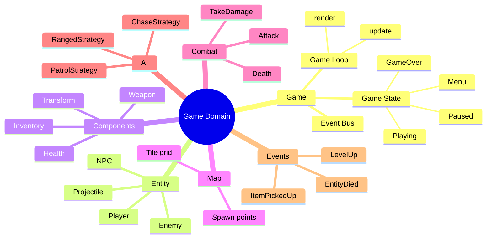
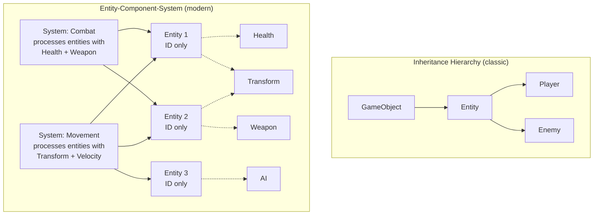
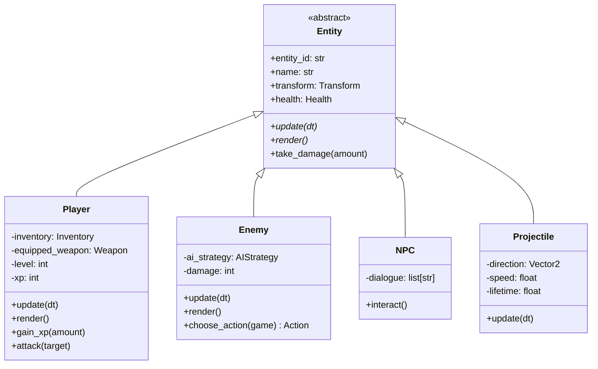
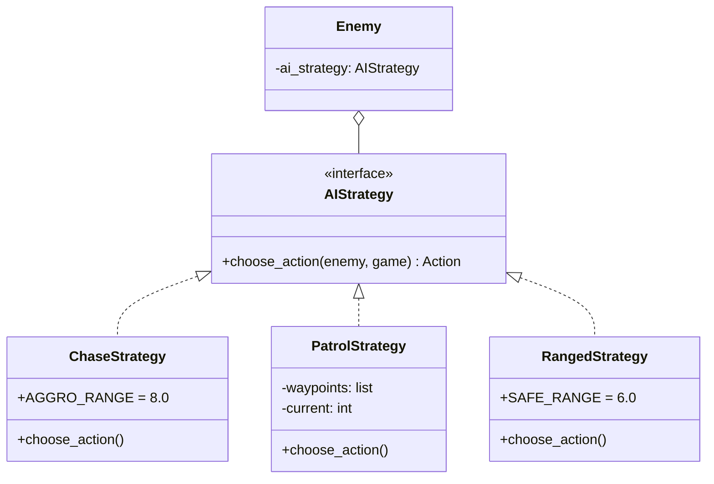
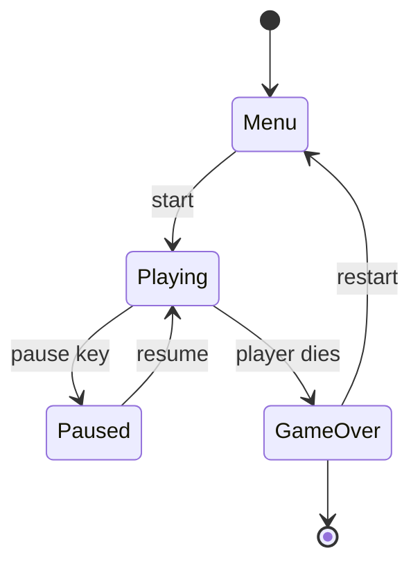
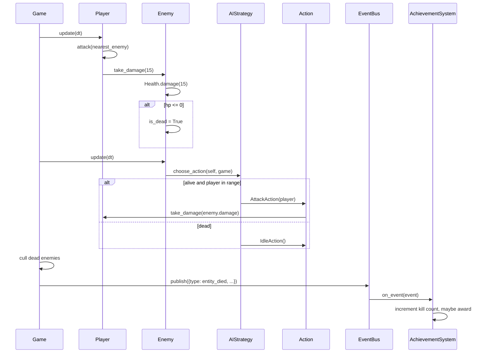
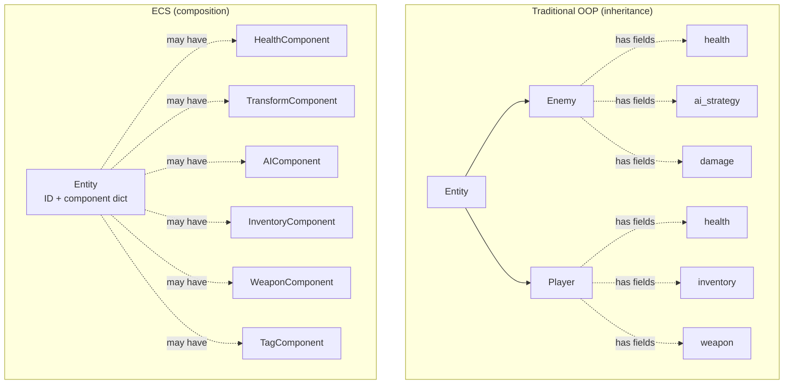

# Real-World OOP — Game Development

> [!info] Why games?
> Game development is where OOP *grew up*. Simula — the first OO language — was built to simulate systems, and the simulation heritage runs straight through every modern game engine. Games force you to confront two of the hardest problems in OOP simultaneously: **many entities with shared and varying behaviour** (the inheritance problem), and **dynamic composition of capabilities** (the composition problem). The history of game OOP *is* the history of patterns: State, Strategy, Observer, Factory, and ultimately the Entity-Component-System (ECS) refactor.

This file walks through a complete, runnable Python implementation of a small top-down action game. We demonstrate **all four OOP pillars**, **five design patterns** (Strategy, State, Observer, Factory, plus the ECS architectural pattern), and the critical **inheritance vs composition** decision that every game developer faces.

---

## 1. The Domain at a Glance

A simple game has a **Game** engine that runs a loop, processing **Entity** objects (`Player`, `Enemy`, `NPC`, `Projectile`). Each entity has components: **Health**, **Inventory**, **Weapon**. Entities exist in a **GameMap** with positions. Combat is resolved by a **CombatSystem** that uses **Strategy** for AI behaviour. The game itself moves through **State** (`Menu`, `Playing`, `Paused`, `GameOver`). Events (entity died, item picked up, level up) propagate via **Observer**.



---

## 2. The Big Question: Inheritance vs Composition

Before any code, we need to talk about the central architectural decision in game OOP: **how do entities get their behaviour?**

### 2.1 The Classic Inheritance Approach

In the 1990s, games used deep inheritance hierarchies:

```
GameObject
  └─ Entity
       └─ Character
            └─ Playable
                 └─ Player
            └─ Hostile
                 └─ Enemy
                      └─ FlyingEnemy
                      └─ GroundEnemy
```

This works — until you want a *flying player* (PowerUp?), a *drivable vehicle* (is it a Player? a Vehicle?), or a *trap that damages* (is it an Enemy? an Item?). You end up with the **diamond problem**, repeated code, and a hierarchy so deep that adding any feature requires touching half the tree.

### 2.2 The Composition Approach: ECS

Modern game engines (Unity, Unreal's newer systems, Bevy, Phaser) use **Entity-Component-System**:

- **Entity**: just an ID (often an integer). Has *no behaviour*.
- **Component**: a pure data bag (`Health`, `Transform`, `Weapon`). Has *no behaviour*.
- **System**: a function/object that operates on all entities having a specific set of components. Has *the behaviour*.



> [!tip] Teaching Tip
> This is *the* most important conversation in game OOP. Show students the inheritance tree first, ask them to add a "flying player mount", watch them tie themselves in knots. Then introduce ECS. The relief is visceral.

### 2.3 Our Example Uses Both

For pedagogical clarity, we'll use **inheritance for the entity hierarchy** (it's what students learn first and most existing code uses) and **composition for capabilities** (Health, Inventory, Weapon as components). At the end we'll refactor a single entity into ECS form to show the difference.

---

## 3. Design Decisions Up Front

| Decision | Choice | Why |
|---|---|---|
| Entity hierarchy | Abstract `Entity` + concrete subclasses | Pedagogical clarity; matches classic OOP teaching. |
| Capabilities | Composition (`has-a` not `is-a`) | Avoids deep hierarchies; lets us mix-and-match capabilities. |
| AI behaviour | Strategy pattern on `Enemy` | Different enemies use different AI; swappable at runtime (e.g. fear state). |
| Game phases | State pattern on `Game` | Each state owns its update/render logic; transitions are explicit. |
| Events | Observer pattern via `EventBus` | Decouples "thing happened" from "react to thing"; many subscribers. |
| Entity creation | Factory pattern (`EntityFactory.from_config`) | Read entity definitions from JSON; no giant if/elif chains. |
| Combat resolution | `CombatSystem` service, not methods on entities | Keeps combat rules in one testable place. |

---

## 4. The Entity Hierarchy



> [!note] Liskov in games
> Anywhere a function takes an `Entity`, it must work for any subclass. `take_damage(amount)` should *never* raise `TypeError("Player can't take damage")`. If you find yourself type-checking inside a polymorphic call, your hierarchy is wrong.

---

## 5. Core Code — Step by Step

### 5.1 Components (Composition Roots)

```python
from __future__ import annotations
from abc import ABC, abstractmethod
from dataclasses import dataclass, field
from enum import Enum, auto
from typing import Optional, Callable
from uuid import uuid4


@dataclass
class Vector2:
    x: float = 0.0
    y: float = 0.0

    def __add__(self, other: "Vector2") -> "Vector2":
        return Vector2(self.x + other.x, self.y + other.y)

    def __sub__(self, other: "Vector2") -> "Vector2":
        return Vector2(self.x - other.x, self.y - other.y)

    def distance_to(self, other: "Vector2") -> float:
        return ((self.x - other.x) ** 2 + (self.y - other.y) ** 2) ** 0.5


@dataclass
class Transform:
    """Component: position + rotation. Pure data."""
    position: Vector2 = field(default_factory=Vector2)
    rotation: float = 0.0
    velocity: Vector2 = field(default_factory=Vector2)


@dataclass
class Health:
    """Component: hit points + death flag."""
    max_hp: int = 100
    hp: int = 100
    invulnerable: bool = False
    is_dead: bool = False

    def damage(self, amount: int) -> None:
        if self.invulnerable or self.is_dead:
            return
        self.hp = max(0, self.hp - amount)
        if self.hp == 0:
            self.is_dead = True

    def heal(self, amount: int) -> None:
        if self.is_dead:
            return
        self.hp = min(self.max_hp, self.hp + amount)


@dataclass
class Weapon:
    """Component: attack stats."""
    name: str = "fists"
    damage: int = 5
    range_: float = 1.5
    cooldown: float = 0.5
    last_used: float = 0.0


@dataclass
class Item:
    """An item that can be picked up."""
    item_id: str
    name: str
    description: str = ""
    stackable: bool = False
    quantity: int = 1


@dataclass
class Inventory:
    """Component: holds items."""
    items: list[Item] = field(default_factory=list)
    capacity: int = 20

    def add(self, item: Item) -> bool:
        if len(self.items) >= self.capacity:
            return False
        if item.stackable:
            existing = next((i for i in self.items if i.item_id == item.item_id), None)
            if existing:
                existing.quantity += item.quantity
                return True
        self.items.append(item)
        return True

    def remove(self, item_id: str) -> Optional[Item]:
        for i, item in enumerate(self.items):
            if item.item_id == item_id:
                return self.items.pop(i)
        return None
```

### 5.2 The Abstract `Entity` Class

```python
class Entity(ABC):
    """Abstract base for all game entities.

    Encapsulation: id, name, transform, health are exposed but components
    themselves own their invariants (Health won't go negative, etc.).

    Abstraction: `update`, `render`, and `on_collide` are abstract; each
    subclass implements them per its behaviour.
    """

    def __init__(self, name: str, position: Vector2):
        self.entity_id: str = str(uuid4())
        self.name: str = name
        self.transform: Transform = Transform(position=position)
        self.health: Health = Health()
        self.tags: set[str] = set()

    @abstractmethod
    def update(self, dt: float, game: "Game") -> None:
        """Per-frame update. dt is delta time in seconds."""
        ...

    @abstractmethod
    def render(self) -> str:
        """Return a string representation of this entity for the renderer."""
        ...

    def take_damage(self, amount: int, source: Optional["Entity"] = None) -> None:
        if self.health.is_dead:
            return
        self.health.damage(amount)
        if self.health.is_dead:
            game_event = {
                "type": "entity_died",
                "entity_id": self.entity_id,
                "entity_name": self.name,
                "killer": source.name if source else "unknown",
            }
            # The game's event bus will pick this up via the entity registry.
            # (Wired up in Game._collect_events().)

    def distance_to(self, other: "Entity") -> float:
        return self.transform.position.distance_to(other.transform.position)

    def __repr__(self) -> str:
        return f"{type(self).__name__}({self.name}, hp={self.health.hp}/{self.health.max_hp})"
```

### 5.3 Concrete Entities — Polymorphism

```python
class Player(Entity):
    """Player character. Has inventory, weapon, XP/level."""

    def __init__(self, name: str, position: Vector2):
        super().__init__(name, position)
        self.inventory: Inventory = Inventory()
        self.equipped_weapon: Weapon = Weapon(name="rusty_sword", damage=15, range_=2.0)
        self.level: int = 1
        self.xp: int = 0
        self.xp_to_next: int = 100
        self.tags.add("player")
        self.tags.add("friendly")

    def update(self, dt: float, game: "Game") -> None:
        # Movement handled by input system; here we just tick cooldowns.
        self.equipped_weapon.last_used += dt

    def render(self) -> str:
        return f"🧙 {self.name} (Lv {self.level}, HP {self.health.hp}/{self.health.max_hp})"

    def attack(self, target: Entity, game: "Game") -> None:
        if self.distance_to(target) > self.equipped_weapon.range_:
            print(f"  {self.name} swings at {target.name} — out of range!")
            return
        if self.equipped_weapon.last_used < self.equipped_weapon.cooldown:
            print(f"  {self.name}'s {self.equipped_weapon.name} is on cooldown")
            return
        self.equipped_weapon.last_used = 0.0
        print(f"  ⚔️  {self.name} hits {target.name} for {self.equipped_weapon.damage}")
        target.take_damage(self.equipped_weapon.damage, source=self)

    def gain_xp(self, amount: int, game: "Game") -> None:
        self.xp += amount
        while self.xp >= self.xp_to_next:
            self.xp -= self.xp_to_next
            self.level += 1
            self.xp_to_next = int(self.xp_to_next * 1.5)
            self.health.max_hp += 20
            self.health.hp = self.health.max_hp  # full heal on level up
            game.fire_event({
                "type": "level_up",
                "entity_id": self.entity_id,
                "new_level": self.level,
            })


class Enemy(Entity):
    """Enemy. AI behaviour is delegated to a Strategy object."""

    def __init__(self, name: str, position: Vector2, ai_strategy: "AIStrategy",
                 damage: int = 10, hp: int = 50):
        super().__init__(name, position)
        self.ai_strategy: AIStrategy = ai_strategy
        self.damage: int = damage
        self.health: Health = Health(max_hp=hp, hp=hp)
        self.tags.add("enemy")
        self.tags.add("hostile")

    def update(self, dt: float, game: "Game") -> None:
        action = self.ai_strategy.choose_action(self, game)
        action.execute(self, game)

    def render(self) -> str:
        return f"👹 {self.name} (HP {self.health.hp}/{self.health.max_hp})"


class NPC(Entity):
    """Non-combatant. Can be talked to."""

    def __init__(self, name: str, position: Vector2, dialogue: list[str]):
        super().__init__(name, position)
        self.dialogue = dialogue
        self.health.invulnerable = True  # NPCs can't be killed
        self.tags.add("npc")
        self.tags.add("friendly")

    def update(self, dt: float, game: "Game") -> None:
        pass  # NPCs idle

    def render(self) -> str:
        return f"🧑 {self.name}"

    def interact(self) -> str:
        return self.dialogue[0] if self.dialogue else "..."


class Projectile(Entity):
    """A flying arrow/fireball. Lifetime-limited."""

    def __init__(self, name: str, position: Vector2, direction: Vector2,
                 speed: float, damage: int, lifetime: float = 2.0):
        super().__init__(name, position)
        self.transform.velocity = Vector2(direction.x * speed, direction.y * speed)
        self.damage = damage
        self.lifetime = lifetime
        self.health.invulnerable = True
        self.tags.add("projectile")

    def update(self, dt: float, game: "Game") -> None:
        self.lifetime -= dt
        if self.lifetime <= 0:
            game.despawn(self)
            return
        self.transform.position = self.transform.position + Vector2(
            self.transform.velocity.x * dt, self.transform.velocity.y * dt
        )
        # Collision check: hit any hostile entity in range.
        for entity in game.entities:
            if "hostile" in entity.tags and self.distance_to(entity) < 1.0:
                entity.take_damage(self.damage, source=self)
                game.despawn(self)
                return

    def render(self) -> str:
        return "➶"
```

### 5.4 AI Strategies

```python
class Action(ABC):
    """Command pattern: an action chosen by AI, executed against the game."""
    @abstractmethod
    def execute(self, actor: Enemy, game: "Game") -> None:
        ...


class MoveAction(Action):
    def __init__(self, direction: Vector2):
        self.direction = direction
    def execute(self, actor: Enemy, game: "Game") -> None:
        actor.transform.position = actor.transform.position + self.direction
        print(f"  {actor.name} moves to {actor.transform.position}")


class AttackAction(Action):
    def __init__(self, target: Entity):
        self.target = target
    def execute(self, actor: Enemy, game: "Game") -> None:
        if actor.distance_to(self.target) > 1.5:
            return
        print(f"  ⚔️  {actor.name} attacks {self.target.name} for {actor.damage}")
        self.target.take_damage(actor.damage, source=actor)


class IdleAction(Action):
    def execute(self, actor: Enemy, game: "Game") -> None:
        pass  # do nothing


class AIStrategy(ABC):
    """Strategy interface: algorithms that choose what an enemy does."""
    @abstractmethod
    def choose_action(self, enemy: Enemy, game: "Game") -> Action:
        ...


class ChaseStrategy(AIStrategy):
    """Aggressive: move toward player if within aggro range, else idle."""
    AGGRO_RANGE = 8.0

    def choose_action(self, enemy: Enemy, game: "Game") -> Action:
        player = game.player
        if player is None or player.health.is_dead:
            return IdleAction()
        dist = enemy.distance_to(player)
        if dist > self.AGGRO_RANGE:
            return IdleAction()
        if dist <= 1.5:
            return AttackAction(player)
        # Move toward player one step.
        delta = player.transform.position - enemy.transform.position
        # Normalise to a unit step.
        magnitude = (delta.x ** 2 + delta.y ** 2) ** 0.5
        if magnitude == 0:
            return IdleAction()
        step = Vector2(delta.x / magnitude, delta.y / magnitude)
        return MoveAction(step)


class PatrolStrategy(AIStrategy):
    """Patrols between waypoints. Attacks player if very close."""
    def __init__(self, waypoints: list[Vector2]):
        self.waypoints = waypoints
        self.current = 0

    def choose_action(self, enemy: Enemy, game: "Game") -> Action:
        player = game.player
        if player and enemy.distance_to(player) < 2.0:
            return AttackAction(player)
        target = self.waypoints[self.current]
        if enemy.transform.position.distance_to(target) < 0.5:
            self.current = (self.current + 1) % len(self.waypoints)
            target = self.waypoints[self.current]
        delta = target - enemy.transform.position
        magnitude = (delta.x ** 2 + delta.y ** 2) ** 0.5 or 1.0
        return MoveAction(Vector2(delta.x / magnitude, delta.y / magnitude))


class RangedStrategy(AIStrategy):
    """Keeps distance, fires projectiles."""
    SAFE_RANGE = 6.0
    def choose_action(self, enemy: Enemy, game: "Game") -> Action:
        player = game.player
        if player is None or player.health.is_dead:
            return IdleAction()
        dist = enemy.distance_to(player)
        if dist < self.SAFE_RANGE - 1:
            # Back away
            delta = enemy.transform.position - player.transform.position
            magnitude = (delta.x ** 2 + delta.y ** 2) ** 0.5 or 1.0
            return MoveAction(Vector2(delta.x / magnitude, delta.y / magnitude))
        if dist > self.SAFE_RANGE + 1:
            # Move closer
            delta = player.transform.position - enemy.transform.position
            magnitude = (delta.x ** 2 + delta.y ** 2) ** 0.5 or 1.0
            return MoveAction(Vector2(delta.x / magnitude, delta.y / magnitude))
        # In sweet spot — fire projectile.
        direction = player.transform.position - enemy.transform.position
        magnitude = (direction.x ** 2 + direction.y ** 2) ** 0.5 or 1.0
        unit = Vector2(direction.x / magnitude, direction.y / magnitude)
        proj = Projectile(f"{enemy.name}_arrow", enemy.transform.position,
                          unit, speed=5.0, damage=enemy.damage, lifetime=2.0)
        game.spawn(proj)
        print(f"  🏹 {enemy.name} fires at {player.name}")
        return IdleAction()
```



> [!tip] Teaching Tip
> Walk students through adding a `FleeStrategy` (run away when low HP). It's a 10-line class — and it doesn't touch `Enemy`, `Player`, `Game`, or any other strategy. That's the Strategy pattern paying for itself.

### 5.5 Game States — State Pattern

```python
class GameState(ABC):
    """State pattern: each state owns its update/render logic."""
    @abstractmethod
    def update(self, game: "Game", dt: float) -> None:
        ...
    @abstractmethod
    def render(self, game: "Game") -> None:
        ...


class MenuState(GameState):
    def update(self, game: "Game", dt: float) -> None:
        # In a real game, listen for "start" key press.
        pass
    def render(self, game: "Game") -> None:
        print("=" * 40)
        print("     WELCOME TO DUNGEON OF OOP")
        print("=" * 40)
        print("  Press ENTER to begin")
        print("  Press Q to quit")


class PlayingState(GameState):
    def update(self, game: "Game", dt: float) -> None:
        for entity in list(game.entities):
            entity.update(dt, game)
        # Cull dead entities and award XP.
        for entity in list(game.entities):
            if entity.health.is_dead and "enemy" in entity.tags:
                game.player.gain_xp(50, game)
                game.fire_event({
                    "type": "entity_died",
                    "entity_id": entity.entity_id,
                    "entity_name": entity.name,
                    "killer": "player",
                })
                game.despawn(entity)
            elif entity.health.is_dead and "player" in entity.tags:
                game.transition_to(GameOverState())
                return
    def render(self, game: "Game") -> None:
        print(f"\n--- Playing (entities: {len(game.entities)}) ---")
        for entity in game.entities:
            print(f"  {entity.render()} at {entity.transform.position}")


class PausedState(GameState):
    def update(self, game: "Game", dt: float) -> None:
        pass  # Frozen
    def render(self, game: "Game") -> None:
        print("\n--- PAUSED ---")
        print("  Press P to resume")


class GameOverState(GameState):
    def update(self, game: "Game", dt: float) -> None:
        pass
    def render(self, game: "Game") -> None:
        print("\n" + "=" * 40)
        print("       GAME OVER")
        print("=" * 40)
        if game.player:
            print(f"  Final level: {game.player.level}")
            print(f"  Final XP: {game.player.xp}")
```



### 5.6 The EventBus — Observer Pattern

```python
class EventListener(ABC):
    @abstractmethod
    def on_event(self, event: dict) -> None:
        ...


class EventBus:
    """Observer pattern: decouples 'thing happened' from 'react to thing'."""
    def __init__(self):
        self._listeners: dict[str, list[EventListener]] = {}

    def subscribe(self, event_type: str, listener: EventListener) -> None:
        self._listeners.setdefault(event_type, []).append(listener)

    def publish(self, event: dict) -> None:
        for listener in self._listeners.get(event["type"], []):
            listener.on_event(event)


class AchievementSystem(EventListener):
    """Listens for kills, awards achievements."""
    def __init__(self):
        self.kill_count = 0
    def on_event(self, event: dict) -> None:
        if event["type"] == "entity_died":
            self.kill_count += 1
            if self.kill_count == 1:
                print("  🏆 Achievement: First Blood!")
            elif self.kill_count == 10:
                print("  🏆 Achievement: Slayer!")


class CombatLog(EventListener):
    """Logs every combat event to a file-like buffer."""
    def __init__(self):
        self.entries: list[str] = []
    def on_event(self, event: dict) -> None:
        if event["type"] == "entity_died":
            self.entries.append(
                f"{event['entity_name']} was killed by {event['killer']}")
```

### 5.7 The `Game` Class — Orchestrator + Factory

```python
class Game:
    """The game engine: holds entities, runs the loop, manages state.

    Responsibilities (SRP):
    - Own the entity registry.
    - Run the update/render loop.
    - Dispatch events.
    - Hold the current state.
    """

    def __init__(self):
        self.entities: list[Entity] = []
        self.player: Optional[Player] = None
        self.event_bus: EventBus = EventBus()
        self._state: GameState = MenuState()
        self._pending_despawns: list[str] = []
        self._pending_spawns: list[Entity] = []
        self.achievements = AchievementSystem()
        self.combat_log = CombatLog()
        self.event_bus.subscribe("entity_died", self.achievements)
        self.event_bus.subscribe("entity_died", self.combat_log)
        self.event_bus.subscribe("level_up", self.combat_log)

    # --- State management ------------------------------------------------
    def transition_to(self, state: GameState) -> None:
        print(f"  [state] {type(self._state).__name__} → {type(state).__name__}")
        self._state = state

    @property
    def state(self) -> GameState:
        return self._state

    # --- Entity management ----------------------------------------------
    def spawn(self, entity: Entity) -> None:
        self._pending_spawns.append(entity)

    def despawn(self, entity: Entity) -> None:
        self._pending_despawns.append(entity.entity_id)

    def _flush_pending(self) -> None:
        for entity in self._pending_spawns:
            self.entities.append(entity)
            if isinstance(entity, Player):
                self.player = entity
        self._pending_spawns.clear()
        self.entities = [e for e in self.entities
                         if e.entity_id not in self._pending_despawns]
        if self.player and self.player.entity_id in self._pending_despawns:
            self.player = None
        self._pending_despawns.clear()

    # --- Events ----------------------------------------------------------
    def fire_event(self, event: dict) -> None:
        self.event_bus.publish(event)

    # --- Main loop -------------------------------------------------------
    def update(self, dt: float) -> None:
        self._state.update(self, dt)
        self._flush_pending()

    def render(self) -> None:
        self._state.render(self)

    # --- FACTORY: build entities from config ----------------------------
    @staticmethod
    def entity_from_config(config: dict) -> Entity:
        """Factory: build an entity from a JSON-like config dict."""
        kind = config["kind"]
        name = config["name"]
        pos = Vector2(config.get("x", 0), config.get("y", 0))
        if kind == "player":
            return Player(name, pos)
        if kind == "npc":
            return NPC(name, pos, dialogue=config.get("dialogue", []))
        if kind == "enemy":
            ai_kind = config.get("ai", "chase")
            if ai_kind == "chase":
                ai = ChaseStrategy()
            elif ai_kind == "patrol":
                ai = PatrolStrategy([Vector2(*w) for w in config["waypoints"]])
            elif ai_kind == "ranged":
                ai = RangedStrategy()
            else:
                raise ValueError(f"Unknown AI: {ai_kind}")
            return Enemy(name, pos, ai,
                         damage=config.get("damage", 10),
                         hp=config.get("hp", 50))
        if kind == "projectile":
            return Projectile(name, pos,
                              Vector2(*config["direction"]),
                              config["speed"], config["damage"])
        raise ValueError(f"Unknown entity kind: {kind}")
```

> [!note] Why a factory?
> Without the factory, loading a level from JSON would be one giant `if/elif` chain on `config["kind"]`. Every new entity type means editing that chain. The factory centralises creation and lets us add types by extending, not modifying — see [[Open-Closed]].

### 5.8 Putting It All Together — End-to-End Demo

```python
def demo():
    game = Game()

    # Spawn player and a few enemies from config (Factory in action).
    game.spawn(Game.entity_from_config({
        "kind": "player", "name": "Hero", "x": 0, "y": 0,
    }))
    game.spawn(Game.entity_from_config({
        "kind": "enemy", "name": "Goblin", "x": 5, "y": 5, "ai": "chase",
        "damage": 8, "hp": 30,
    }))
    game.spawn(Game.entity_from_config({
        "kind": "enemy", "name": "Archer", "x": 7, "y": 1, "ai": "ranged",
        "damage": 12, "hp": 20,
    }))
    game.spawn(Game.entity_from_config({
        "kind": "enemy", "name": "Guard", "x": 3, "y": 8, "ai": "patrol",
        "waypoints": [(3, 8), (8, 8), (8, 3)], "damage": 10, "hp": 40,
    }))
    game.spawn(Game.entity_from_config({
        "kind": "npc", "name": "Villager", "x": 2, "y": 2,
        "dialogue": ["Hello, hero!", "Beware the dungeon."],
    }))

    # Transition from Menu to Playing.
    game.transition_to(PlayingState())

    # Simulate 5 frames.
    for frame in range(1, 6):
        print(f"\n=== Frame {frame} ===")
        if game.player:
            # Player attacks the nearest enemy each frame.
            targets = [e for e in game.entities if "hostile" in e.tags]
            if targets:
                nearest = min(targets, key=game.player.distance_to)
                game.player.attack(nearest, game)
        game.update(dt=0.1)
        game.render()

    print("\n--- Combat Log ---")
    for entry in game.combat_log.entries:
        print(f"  {entry}")
    print(f"\nAchievements: {game.achievements.kill_count} kills")


if __name__ == "__main__":
    demo()
```

When you run this, you'll see the player and enemies trading blows each frame, the Archer firing arrows (Projectiles), and the EventBus firing `entity_died` events that award achievements and log combat — all without any entity knowing about achievements or combat logs.

---

## 6. The Combat Sequence



> [!tip] Teaching Tip
> Pause at the `publish` step. Ask students: "Does `Enemy` know about `AchievementSystem`? Does `Player` know about `CombatLog`?" The answer is no — that's the entire point of Observer. The decoupling is what makes the code extensible.

---

## 7. ECS Refactor — A Side-by-Side Comparison

Let's refactor one entity into ECS form to show the difference. In ECS, an entity is *just an ID*, components are *data bags*, and systems are *functions*.

```python
# === ECS version ===
class ECSEntity:
    """An entity is just an ID + a bag of components."""
    def __init__(self, entity_id: int):
        self.id = entity_id
        self.components: dict[str, object] = {}

    def add(self, component_type: str, component: object) -> "ECSEntity":
        self.components[component_type] = component
        return self

    def get(self, component_type: str) -> Optional[object]:
        return self.components.get(component_type)

    def has(self, component_type: str) -> bool:
        return component_type in self.components


# Components are pure data:
@dataclass
class HealthComponent:
    hp: int = 100
    max_hp: int = 100

@dataclass
class TransformComponent:
    position: Vector2 = field(default_factory=Vector2)
    velocity: Vector2 = field(default_factory=Vector2)

@dataclass
class AIComponent:
    strategy: AIStrategy
    damage: int = 10

@dataclass
class TagComponent:
    tags: set[str] = field(default_factory=set)


# Systems are functions:
class CombatSystem:
    """Processes all entities that have Health."""
    @staticmethod
    def update(entities: list[ECSEntity]) -> None:
        for entity in entities:
            health = entity.get("health")
            if health and health.hp <= 0:
                # Mark for death
                entity.components["dead"] = True


class AISystem:
    """Processes all entities that have AI + Transform."""
    @staticmethod
    def update(entities: list[ECSEntity], game: "Game") -> None:
        for entity in entities:
            ai = entity.get("ai")
            transform = entity.get("transform")
            if ai and transform:
                action = ai.strategy.choose_action_ecs(entity, game)
                action.execute_ecs(entity, game)


# Build an enemy via composition (no subclassing!):
enemy = ECSEntity(entity_id=1) \
    .add("health", HealthComponent(hp=30, max_hp=30)) \
    .add("transform", TransformComponent(position=Vector2(5, 5))) \
    .add("ai", AIComponent(strategy=ChaseStrategy(), damage=8)) \
    .add("tags", TagComponent(tags={"enemy", "hostile"}))

# Build a player the same way — no Player subclass needed:
player = ECSEntity(entity_id=0) \
    .add("health", HealthComponent(hp=120, max_hp=120)) \
    .add("transform", TransformComponent(position=Vector2(0, 0))) \
    .add("inventory", Inventory()) \
    .add("weapon", Weapon(name="sword", damage=15, range_=2.0)) \
    .add("tags", TagComponent(tags={"player", "friendly"}))
```



### 7.1 Trade-offs

| Aspect | Inheritance | ECS |
|---|---|---|
| **Add new entity type** | New subclass | New combination of components |
| **Add new capability** | Modify base class or all subclasses | Add a new component type, opt-in per entity |
| **Memory layout** | One object per entity, fields interleaved | Component arrays; cache-friendly |
| **Code locality** | Behaviour co-located with data | Systems iterate homogeneous arrays |
| **Polymorphism** | Method override | System dispatches on component presence |
| **Tooling/serialization** | Reflection or per-class code | Components are data; trivially serializable |
| **Learning curve** | Lower (familiar OOP) | Higher (functional flavor) |

> [!success] Why ECS wins at scale
> In a game with 10,000 entities, ECS iterates 10,000 `HealthComponent` instances in a tight array loop — cache-friendly and SIMD-able. Inheritance iterates 10,000 *different* objects (players, enemies, projectiles) via virtual dispatch — cache-unfriendly. This is why every major game engine moved to ECS or a hybrid.

> [!warning] ECS is not a silver bullet
> For small games, teaching examples, and turn-based logic, traditional OOP is simpler and more readable. Don't reach for ECS unless you have a real performance or composition-flexibility need. See [[Composition-Over-Inheritance]].

---

## 8. SOLID Compliance Walkthrough

| Principle | Where in the code |
|---|---|
| **S**ingle Responsibility | `Entity` only holds state/identity. `AIStrategy` only chooses actions. `Action` only executes a step. `EventBus` only dispatches. `GameState` only owns phase logic. No class wears two hats. |
| **O**pen/Closed | Add a new AI strategy by subclassing `AIStrategy`. Add a new game state by subclassing `GameState`. Add a new event listener by subclassing `EventListener`. None of these require editing existing classes. |
| **L**iskov Substitution | `Game.update` calls `entity.update(dt, game)` for every entity — works for `Player`, `Enemy`, `NPC`, `Projectile` uniformly. |
| **I**nterface Segregation | `AIStrategy` exposes only `choose_action`. `GameState` exposes only `update` and `render`. `EventListener` exposes only `on_event`. Narrow, focused interfaces. |
| **D**ependency Inversion | `Enemy` depends on `AIStrategy` abstraction, not on `ChaseStrategy`. `Game` depends on `GameState` abstraction. Strategies and states are injected. |

---

## 9. Common Mistakes to Discuss

> [!danger] Pitfalls students hit
> - **Deep inheritance trees.** `GameObject → Entity → Character → Combatant → Enemy → FlyingEnemy → Dragon`. Adding a "flying player mount" forces multiple inheritance or duplication. Favour composition.
> - **Type-checking in polymorphic code.** `if isinstance(entity, Player): ...` inside `Game.update` breaks OCP. Use tags (`"player" in entity.tags`) or polymorphic methods.
> - **Hardcoding AI.** If `Enemy.update` does `if dist < 8: move_toward(player)`, you can't swap AI per enemy. Use Strategy.
> - **God-object `Game`.** If `Game` owns input, rendering, audio, save/load, and combat, it's a [God-Object]. Split into systems.
> - **Tight event coupling.** If `Enemy` directly calls `game.achievements.award(...)`, every new feature requires editing `Enemy`. Use the EventBus.
> - **Mutating entity list during iteration.** `for e in game.entities: game.entities.remove(e)` causes skipped elements. Always iterate over a copy or queue mutations (our `_pending_despawns` pattern).
> - **Frame-rate-dependent movement.** `position.x += speed` runs at different speeds on different hardware. Always multiply by `dt`: `position.x += speed * dt`.

---

## 10. Extensions and Exercises for Students

> [!example] Lab assignments
> 1. **Add a `FleeStrategy`** that runs enemies away when their HP is below 30%. (Tests Strategy + Observer — listen for `entity_died` to disable flee when no threat remains.)
> 2. **Add an `InventoryState`** game state that pauses the game and shows the player's inventory. (Tests State pattern.)
> 3. **Add a `LootSystem`** that spawns an `Item` entity when an enemy dies; player picks it up by walking over it. (Tests Factory + Observer + new component.)
> 4. **Refactor `Player` into ECS form** with `PlayerControlComponent`, `InventoryComponent`, `LevelComponent`. Compare readability.
> 5. **Add a `SaveSystem`** that serialises all entities to JSON. Hint: entities must expose a `to_dict()` method.
> 6. **Add a `DialogueSystem`** that triggers `NPC.interact()` when the player is within range and presses E. (Tests spatial queries.)
> 7. **Add a `DifficultyManager`** event listener that scales enemy HP up every 60 seconds. (Tests Observer + spawning.)
> 8. **Write a benchmark** that creates 10,000 entities and updates them 1,000 times. Compare inheritance vs ECS performance. (Tests the performance claim above.)

---

## 11. How This Maps to Real Game Engines

Real game engines follow the same shapes:

- **Unity** uses a component-based model (MonoBehaviour) that's *close* to ECS but with inheritance for the `MonoBehaviour` base. The newer DOTS/ECS stack is a true ECS.
- **Unreal Engine** uses a deep inheritance hierarchy (UObject → Actor → Pawn → Character) for gameplay, but composes capabilities via Components. The newer Mass Entity system is a true ECS.
- **Godot** uses a Node tree (composition) with optional OOP inheritance for custom node types.
- **Bevy** (Rust) is a pure ECS — entities are integer IDs, components are types, systems are functions.
- **Phaser** (JavaScript) uses a traditional class hierarchy with mixins for capabilities.

If students understand this 700-line example, they understand the architectural trade-offs every game engine makes.

---

## 12. Procedural vs Object-Oriented — A Quick Contrast

In a procedural game loop, you'd have:

```python
def update_game(state, dt):
    for obj in state["objects"]:
        if obj["type"] == "player":
            obj["x"] += obj["vx"] * dt
            obj["y"] += obj["vy"] * dt
            if obj["attack_cooldown"] > 0:
                obj["attack_cooldown"] -= dt
        elif obj["type"] == "enemy":
            player = find_player(state)
            dist = distance(obj, player)
            if dist < 8 and dist > 1.5:
                dx = (player["x"] - obj["x"]) / dist
                dy = (player["y"] - obj["y"]) / dist
                obj["x"] += dx
                obj["y"] += dy
            elif dist <= 1.5:
                player["hp"] -= obj["damage"]
        elif obj["type"] == "projectile":
            obj["x"] += obj["vx"] * dt
            obj["y"] += obj["vy"] * dt
            obj["lifetime"] -= dt
            if obj["lifetime"] <= 0:
                state["objects"].remove(obj)  # 💥 mutating during iteration
        # ... 20 more elif branches
```

This is unmaintainable. Adding a new entity type means editing this function. Adding a new feature (e.g. *levitation*) means editing every branch. The OOP version says: "Each entity owns its `update`; the loop just calls `entity.update(dt, game)` polymorphically." Adding a new entity type means writing one new class.

> [!example] Discussion prompt
> Show students both versions. Ask: "What happens if I want to add a `Trap` entity that damages the player on contact?" In procedural code, you edit the giant `update_game` function. In OOP, you write `class Trap(Entity): ...` with one method. That's the value of polymorphism.

---

## 13. Testing the Game

Because entities expose a polymorphic `update(dt, game)` and AI is a Strategy, every behaviour is unit-testable. Here is a small sample test suite:

```python
import pytest
from game import (Game, Player, Enemy, ChaseStrategy, PatrolStrategy,
                  RangedStrategy, Vector2, PlayingState, Projectile)


@pytest.fixture
def game():
    g = Game()
    g.spawn(Player("Hero", Vector2(0, 0)))
    g.transition_to(PlayingState())
    g._flush_pending()
    return g


class TestPlayerCombat:
    def test_player_attack_reduces_enemy_hp(self, game):
        enemy = Enemy("Goblin", Vector2(1, 0), ChaseStrategy(), hp=30)
        game.spawn(enemy)
        game._flush_pending()
        game.player.attack(enemy, game)
        assert enemy.health.hp == 15  # 30 - 15 (player weapon damage)

    def test_player_attack_out_of_range_does_nothing(self, game):
        enemy = Enemy("Goblin", Vector2(10, 10), ChaseStrategy(), hp=30)
        game.spawn(enemy)
        game._flush_pending()
        game.player.attack(enemy, game)
        assert enemy.health.hp == 30

    def test_killing_enemy_awards_xp(self, game):
        weak_enemy = Enemy("Goblin", Vector2(1, 0), ChaseStrategy(), hp=15)
        game.spawn(weak_enemy)
        game._flush_pending()
        game.player.attack(weak_enemy, game)  # kills
        game.update(0.1)
        assert game.player.xp == 50


class TestAIStrategies:
    def test_chase_strategy_returns_attack_when_close(self, game):
        enemy = Enemy("Goblin", Vector2(1, 0), ChaseStrategy())
        game.spawn(enemy)
        game._flush_pending()
        from game import AttackAction
        action = enemy.ai_strategy.choose_action(enemy, game)
        assert isinstance(action, AttackAction)

    def test_chase_strategy_returns_move_when_far(self, game):
        enemy = Enemy("Goblin", Vector2(5, 5), ChaseStrategy())
        game.spawn(enemy)
        game._flush_pending()
        from game import MoveAction
        action = enemy.ai_strategy.choose_action(enemy, game)
        assert isinstance(action, MoveAction)

    def test_patrol_strategy_cycles_waypoints(self, game):
        enemy = Enemy("Guard", Vector2(0, 0),
                      PatrolStrategy([Vector2(1, 0), Vector2(0, 0)]))
        game.spawn(enemy)
        game._flush_pending()
        # First action: move toward (1, 0)
        action = enemy.ai_strategy.choose_action(enemy, game)
        assert action.direction.x > 0


class TestEventBus:
    def test_entity_died_event_triggers_achievement(self, game):
        enemy = Enemy("Goblin", Vector2(1, 0), ChaseStrategy(), hp=15)
        game.spawn(enemy)
        game._flush_pending()
        game.player.attack(enemy, game)
        game.update(0.1)  # processes death, publishes event
        assert game.achievements.kill_count == 1


class TestGameState:
    def test_player_death_transitions_to_game_over(self, game):
        # Mortally wound the player
        game.player.health.hp = 1
        enemy = Enemy("Killer", Vector2(0.5, 0), ChaseStrategy(), damage=999)
        game.spawn(enemy)
        game._flush_pending()
        game.update(0.1)
        from game import GameOverState
        assert isinstance(game.state, GameOverState)
```

> [!tip] Teaching Tip
> Notice that `TestAIStrategies` doesn't need to render anything or run the full game loop — it just calls `choose_action` and inspects the returned `Action`. This is the value of the Strategy pattern: each piece is testable in isolation. Compare this to the procedural version, where testing AI would require running the entire `update_game` function.

> [!note] Test doubles for systems
> In real game testing, you'd inject a `FakeRenderer` (which captures strings instead of drawing pixels) and a `FakeInput` (which scripts keypresses). Our `render()` returning a string is already a fake-renderer-friendly design. See [[Mocking-And-Stubs]] for the general technique.

---

## 14. Recap and Cross-References

In this single example we touched:

- **Four Pillars**: [[Inheritance]] (Entity hierarchy), [[Polymorphism]] (`update`, `render`), [[Encapsulation]] (component invariants), [[Abstraction]] (ABCs for Entity, AIStrategy, GameState).
- **SOLID**: All five — see [[SOLID-Overview]].
- **Patterns**: [[Strategy-Pattern]] (AI), [[State-Pattern]] (game phases), [[Observer-Pattern]] (events), [[Factory-Pattern]] (entity creation), [[Command-Pattern]] (Action objects).
- **Architecture**: ECS as a composition-first alternative to deep inheritance — see [[Composition-Over-Inheritance]].

> [!success] Learning outcome
> After studying this file, a student should be able to (a) design a game entity system using either inheritance or composition and justify the choice, (b) explain why nearly every modern game engine moved to ECS, (c) extend the game with a new entity type, AI strategy, or event listener without modifying existing code, and (d) identify when ECS's performance benefits matter and when simpler OOP suffices.

Next, head to [[Library-Management-Example]] for a calmer domain where state machines and repository patterns are the stars.

#oop #real-world #gamedev #python #design-patterns #ecs #state-pattern #strategy-pattern #observer-pattern #factory-pattern #composition-over-inheritance #polymorphism #inheritance #teaching
