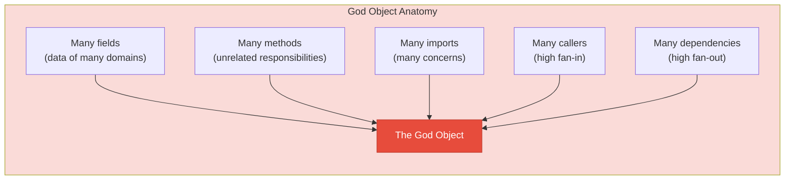
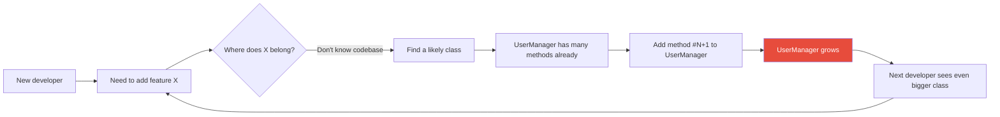
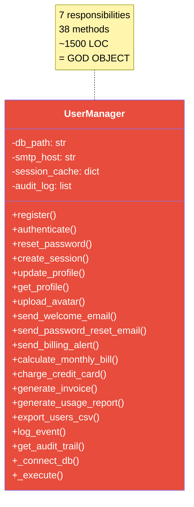
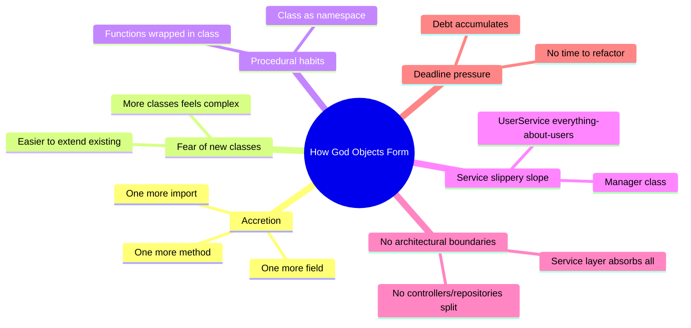
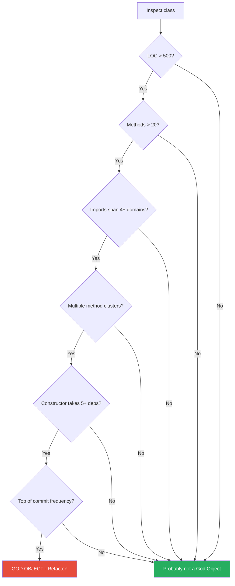
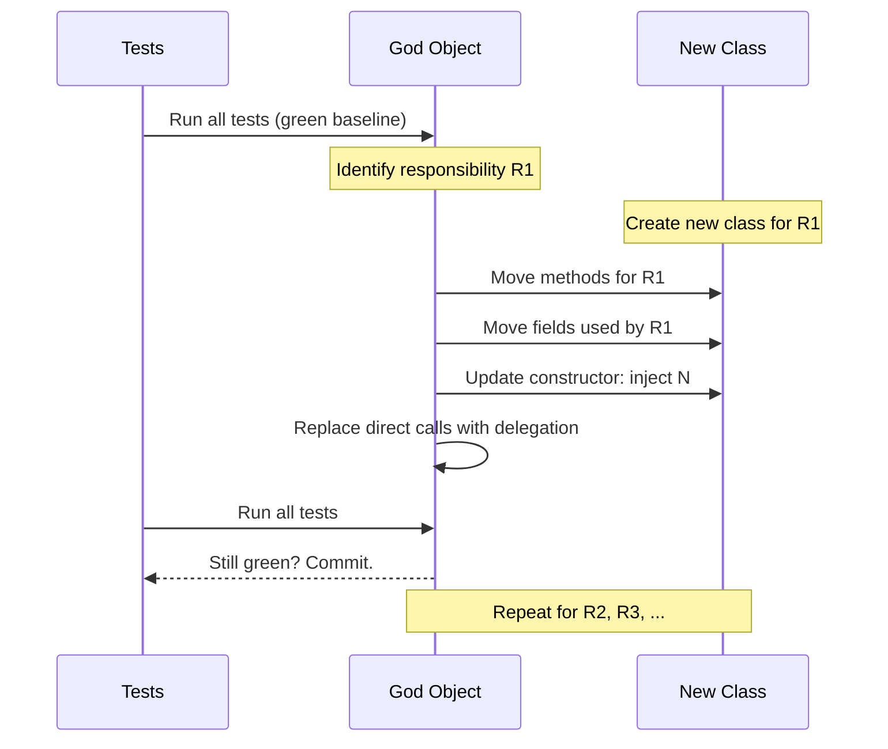
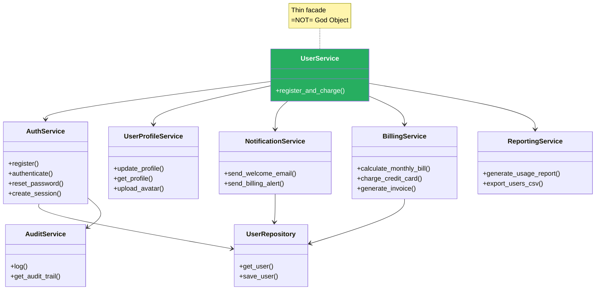
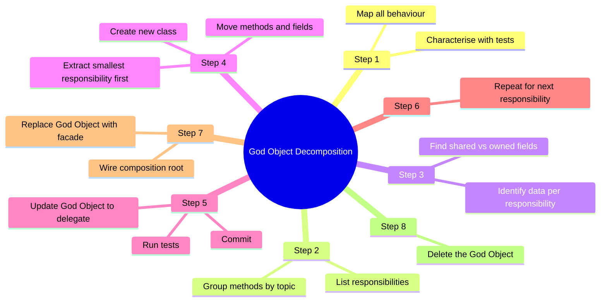

# God Object

#oop #antipatterns #god-object #god-class #blob #srp-violation #refactoring #teaching #deep-dive

> [!quote] Martin Fowler
> "One of the most useful things you can do is to take a class that is too big and split it up. … Big classes are one of the most common problems in object-oriented software."

The **God Object** (also called **God Class**, **Blob**, **Monster Object**, **Know-It-All**, or — affectionately — **the kitchen sink**) is the most famous anti-pattern in object-oriented programming. It is a class that *knows too much* or *does too much*. It accumulates responsibility after responsibility, method after method, import after import, until it becomes the gravitational centre of the entire codebase: every feature passes through it, every developer edits it, and every change risks breaking everything.

The God Object is the extreme form of the **Large Class** code smell (see [[Code-Smells]]) and the textbook violation of the [[Single-Responsibility|Single Responsibility Principle]]. It is also the most common shape of legacy code in business software. This note explains what a God Object is, how it forms, why it is so damaging, how to detect it with metrics and heuristics, and how to dismantle it step by step — with a complete refactoring of a `UserManager` God Object into focused collaborators.

Prerequisites: [[Code-Smells]], [[Single-Responsibility]], [[Classes-And-Objects]], [[Encapsulation]].

---

## 1. What Is a God Object?

> [!important] Definition
> A **God Object** is a class that concentrates an excessive amount of the system's responsibilities, data, and behaviour — typically many unrelated responsibilities — into a single class.

A God Object has one or more of these properties:

- **Hundreds or thousands of lines of code.** Anything over ~500 LOC is suspicious; over ~1500 is almost certainly a God Object.
- **Dozens of methods**, often with little in common — `register_user`, `send_email`, `calculate_tax`, `format_pdf`, `archive_log` all in one class.
- **Many unrelated imports** — `hashlib`, `smtplib`, `sqlite3`, `matplotlib`, `requests`, `openpyxl` all imported into the same file.
- **High fan-in** (many other classes call it) and **high fan-out** (it calls many other classes).
- **Frequent commits** — every feature touches this file. Look at the git history.
- **The class is named `Manager`, `Helper`, `Util`, `Service`, `Processor`, `Handler`, or `Controller`** — these names are red flags because they communicate nothing about *what* the class does.

The canonical "smell test": open the file and try to write a one-sentence description of what the class does, without using the word "and". If you cannot, you are looking at a God Object.



### 1.1 Synonyms and Their Flavours

Different communities use different names for the same anti-pattern, with slight nuances:

- **God Object / God Class** — the general term; emphasises omniscience (knows everything) and omnipotence (does everything).
- **Blob** — used in Brown et al.'s *AntiPatterns* (1998); emphasises the swelling, amoeba-like quality of the class.
- **Monster Object** — emphasises size and ugliness.
- **Know-It-All** — emphasises the data hoarding.
- **Kitchen Sink** — colloquial; "everything but the kitchen sink" except it has the kitchen sink too.
- **The Manager Class** — a common symptomatic name (`UserManager`, `OrderManager`).

### 1.2 The "Just Put It in Manager" Pattern

God Objects form by accretion. A new developer joins. They need to add a feature. They don't know the codebase well. They find `UserManager`, see that it already has 40 methods, and think "this is where user stuff goes". They add method 41. The next developer does the same. Within a year, `UserManager` has 80 methods and touches auth, billing, email, reporting, persistence, and notifications.



---

## 2. The God Object in Action

Consider this `UserManager` — a textbook God Object. We will refactor it later in the note.

```python
# === THE GOD OBJECT ===
import hashlib
import smtplib
import sqlite3
import json
import csv
import logging
from datetime import datetime
from typing import Optional

class UserManager:
    """Manages everything about users."""

    def __init__(self, db_path: str, smtp_host: str, smtp_port: int):
        self.db_path = db_path
        self.smtp_host = smtp_host
        self.smtp_port = smtp_port
        self._conn: Optional[sqlite3.Connection] = None
        self._smtp: Optional[smtplib.SMTP] = None
        self._audit_log = []
        self._session_cache = {}

    # ---------- AUTHENTICATION (8 methods) ----------
    def register(self, email: str, password: str) -> int: ...
    def authenticate(self, email: str, password: str) -> bool: ...
    def logout(self, session_token: str) -> None: ...
    def reset_password(self, email: str) -> None: ...
    def change_password(self, user_id: int, new_password: str) -> None: ...
    def verify_email(self, token: str) -> bool: ...
    def create_session(self, user_id: int) -> str: ...
    def validate_session(self, token: str) -> Optional[dict]: ...

    # ---------- PROFILE MANAGEMENT (5 methods) ----------
    def update_profile(self, user_id: int, **fields) -> None: ...
    def get_profile(self, user_id: int) -> dict: ...
    def upload_avatar(self, user_id: int, image_bytes: bytes) -> str: ...
    def delete_account(self, user_id: int) -> None: ...
    def list_users(self, page: int = 1) -> list: ...

    # ---------- EMAIL / NOTIFICATIONS (6 methods) ----------
    def send_welcome_email(self, user_id: int) -> None: ...
    def send_password_reset_email(self, user_id: int) -> None: ...
    def send_billing_alert(self, user_id: int, amount: float) -> None: ...
    def send_deactivation_notice(self, user_id: int) -> None: ...
    def send_marketing_campaign(self, segment: str) -> None: ...
    def notify_admins(self, message: str) -> None: ...

    # ---------- BILLING (7 methods) ----------
    def calculate_monthly_bill(self, user_id: int) -> float: ...
    def charge_credit_card(self, user_id: int, amount: float) -> bool: ...
    def generate_invoice(self, user_id: int, month: str) -> dict: ...
    def apply_refund(self, user_id: int, invoice_id: int) -> bool: ...
    def list_invoices(self, user_id: int) -> list: ...
    def update_subscription(self, user_id: int, plan: str) -> None: ...
    def cancel_subscription(self, user_id: int) -> None: ...

    # ---------- REPORTING (5 methods) ----------
    def generate_usage_report(self, user_id: int) -> dict: ...
    def generate_revenue_report(self, start: str, end: str) -> dict: ...
    def export_users_csv(self) -> bytes: ...
    def export_users_json(self) -> bytes: ...
    def generate_churn_report(self, quarter: str) -> dict: ...

    # ---------- PERSISTENCE (4 methods) ----------
    def _connect_db(self) -> sqlite3.Connection: ...
    def _execute(self, query: str, params: tuple) -> list: ...
    def _commit(self) -> None: ...
    def _close(self) -> None: ...

    # ---------- AUDIT (3 methods) ----------
    def log_event(self, event: str, user_id: Optional[int]) -> None: ...
    def get_audit_trail(self, user_id: int) -> list: ...
    def archive_audit_logs(self, older_than_days: int) -> None: ...

    # 38 methods total. ~1500 LOC.
```

This `UserManager` does authentication, profile management, notifications, billing, reporting, persistence, and auditing. It has seven distinct responsibilities — and thus seven actors who could independently request changes to it. It is, by any measure, a God Object.



---

## 3. Why God Objects Are Bad

The God Object is not just an aesthetic problem. It has concrete, measurable negative effects:

### 3.1 Hard to Understand

A 1500-line class with 38 methods cannot be held in working memory. Developers skim, miss details, and misunderstand. Code review quality collapses — reviewers cannot read 1500 lines carefully under deadline pressure, so they approve based on vibes.

### 3.2 Hard to Test

To unit-test `calculate_monthly_bill`, you need to construct a `UserManager`. That requires a real SQLite database (because the constructor opens a connection), an SMTP server (same reason), and a writable filesystem. The test setup becomes a multi-screen fixture of mocks. As a result, the tests are either skipped or are slow and brittle. **Test pain is the most reliable diagnostic for a God Object.**

### 3.3 Hard to Change

Every feature touches the same file. Merge conflicts multiply. Two developers cannot work on billing and notifications simultaneously without stepping on each other. Code review queues back up because the diff for "one feature" is huge.

### 3.4 Violates Every SOLID Principle

- **SRP** — by definition, the class has many reasons to change.
- **OCP** — adding a new feature usually means editing the God Object (e.g., adding `send_sms_notifications`), violating "open for extension, closed for modification".
- **LSP** — God Objects are often subclassed, but subclassing a class with 38 methods is hopeless; subclasses typically refuse most of the bequest.
- **ISP** — clients that need only authentication are forced to depend on the entire fat interface.
- **DIP** — a God Object typically instantiates its dependencies directly (`sqlite3.connect(...)`, `smtplib.SMTP(...)`) instead of receiving them through abstraction, making dependency injection impossible.

### 3.5 High Coupling, Low Cohesion

A God Object is the worst of both worlds: low cohesion (unrelated methods in one class) AND high coupling (every other class depends on it). The two metrics are usually inversely correlated — refactoring improves both at once.

---

## 4. How God Objects Form

God Objects are rarely designed. They emerge. Here are the typical formation paths:

### 4.1 Accretion: "Just Add It Here"

The most common path. Each new feature is "just one more method". Individually, each addition is defensible. The sum is a monster. This is a coordination failure: no one has the global view to say "this method belongs in a new class".

### 4.2 Fear of New Classes

Junior developers are sometimes afraid to create new classes — they think "more classes = more complexity". The opposite is true beyond a certain size: one 1500-line class is far more complex than ten 150-line classes. But the fear is real, and it leads to dumping new behaviour into existing classes.

### 4.3 Procedural Habits

Developers coming from procedural languages (C, classic PHP, Bash) tend to think in *functions*, not *objects*. They wrap their functions in a single class because the language requires it (`class Main:` in Java, `class App:` in Python), and then proceed to write procedural code inside. The class becomes a namespace for functions. This is **OOP spaghetti** — see [[Spaghetti-Code]].

### 4.4 The "Service" Slippery Slope

You start with a `UserService` that has 5 methods for user CRUD. Then someone says "users need to be emailed when registered" — and the team adds `send_welcome_email` to `UserService` because it's *about users*. Then someone says "users need to be billed monthly" — and `calculate_monthly_bill` joins because it's *about users*. The name "UserService" hides the rot because everything really is, in some sense, *about users*.

### 4.5 Lack of Architectural Boundaries

If the codebase has no clear layers (e.g., controllers / services / repositories), the "service" layer absorbs everything: HTTP handling, business logic, persistence, email. The service class becomes a God Object by default.



---

## 5. Famous Examples

The God Object pattern appears in many real-world codebases. Some famous cases:

### 5.1 `ActiveRecord::Base` (in some uses)

Rails' `ActiveRecord::Base` mixes persistence, validation, callbacks, associations, serialization, querying, and business logic into one class. In well-disciplined Rails apps, business logic is extracted into "service objects" and "form objects", keeping models focused on persistence. In poorly disciplined apps, `User` models accumulate hundreds of lines of business logic.

### 5.2 `utils.py` / `helpers.py` / `common.py`

The "utils" file is the God Object of people who don't think they write OOP. It is a namespace (or a class) that absorbs every function nobody knew where to put. The smell test: `utils.py` with 50+ functions in 8 unrelated domains.

### 5.3 The `Manager` Class

`UserManager`, `OrderManager`, `SessionManager`, `ResourceManager` — the name "Manager" almost always signals a God Object. Why? Because "manager" is content-free. It says nothing about *what* is managed or *how*. If the class had one responsibility, you could name that responsibility.

### 5.4 IDE-Generated `Form1` / `MainWindow`

GUI code in older Visual Basic / Delphi / WinForms often produced God Objects because the IDE generated the form class and developers pasted every event handler into it. A `MainWindow` with 50 event handlers and 2000 lines is classic.

### 5.5 The Django "Fat Model"

Django's documentation encourages "fat models, thin views". This is good advice taken too far: a `User` model that has `send_welcome_email`, `calculate_monthly_bill`, `generate_usage_report`, and `update_subscription` becomes a God Object. The fix is a `services.py` layer — see [[Service-Layer]].

---

## 6. How to Detect a God Object

### 6.1 Manual Heuristics

- **The "and" test**: try to describe the class in one sentence without "and". If you cannot, it's a God Object.
- **Method clusters**: group methods by topic. If you find 3+ clusters with no overlap, you have multiple responsibilities.
- **Import inspection**: list the imports. If they span 4+ unrelated domains (DB, email, HTTP, charts, filesystem), it's a God Object.
- **Constructor inspection**: how many dependencies does `__init__` take? More than 5 is a strong signal.

### 6.2 Quantitative Metrics

| Metric | Threshold | Tool |
|--------|-----------|------|
| Lines of code (LOC) | > 500 suspicious; > 1500 God Object | `wc -l`, `radon raw` |
| Number of methods | > 20 suspicious; > 40 God Object | `pylint` (`max-public-methods`) |
| Number of public methods | > 15 | `pylint` |
| Number of instance attributes | > 7 | `pylint` (`max-attributes`) |
| Number of imports | > 10 | manual / `flake8` |
| Cyclomatic complexity (class total) | > 50 | `radon cc` |
| Lack of Cohesion in Methods (LCOM) | > 0.8 (high = bad) | `radon`, `mypy` plugins |
| Fan-in (callers) | > 10 | `pydeps`, `snakefood` |
| Fan-out (called) | > 20 | `pydeps` |
| Commit frequency | > 1 commit/day average over a year | `git log --follow` |
| Number of distinct actors editing | > 3 teams | `git shortlog -sne` |

### 6.3 Change-Frequency Analysis

The single most reliable signal: **which files change most often?**

```bash
# Files changed most often in the last year
git log --since="1 year ago" --name-only --pretty=format: | \
  sort | uniq -c | sort -rn | head -20
```

If one file is in the top of every "most changed" list, it is almost certainly a God Object. The *reasons* it changes are its responsibilities — and if those reasons are unrelated (a billing change, an auth change, a UI change), each is a responsibility that should be a separate class.



---

## 7. The Refactoring: Decomposing a God Object

The cure for a God Object is to **decompose it into a constellation of smaller, focused classes**, each with one responsibility. The transformation is *Extract Class* applied repeatedly — see [[Refactoring-Strategies]].

### 7.1 The Step-by-Step Process

1. **Characterise the God Object with tests.** Before touching anything, write characterization tests (or end-to-end tests) that exercise every public method. You cannot refactor what you cannot verify.
2. **List the responsibilities.** Read the class. Group methods by topic. Each group is a candidate responsibility.
3. **For each responsibility, identify the data it uses.** Some fields belong only to one responsibility; some are shared. The shared ones usually become arguments to the new classes' methods.
4. **Pick the smallest responsibility to extract first.** (Smallest = least data, fewest callers.) Extracting the smallest first reduces risk.
5. **Extract Class.** Create a new class for that responsibility. Move the methods and the fields they use. Update the original God Object to delegate to the new class.
6. **Run tests.** Behaviour must not change.
7. **Commit.** Small steps, frequent commits.
8. **Repeat.** Move to the next responsibility.



### 7.2 The Refactoring of `UserManager`

Let us refactor our `UserManager`. The seven responsibilities, and the classes they become:

| Responsibility | New class | Methods moved |
|----------------|-----------|---------------|
| Authentication | `AuthService` | `register`, `authenticate`, `logout`, `reset_password`, `change_password`, `verify_email`, `create_session`, `validate_session` |
| Profile management | `UserProfileService` | `update_profile`, `get_profile`, `upload_avatar`, `delete_account`, `list_users` |
| Notifications | `NotificationService` | `send_welcome_email`, `send_password_reset_email`, `send_billing_alert`, `send_deactivation_notice`, `send_marketing_campaign`, `notify_admins` |
| Billing | `BillingService` | `calculate_monthly_bill`, `charge_credit_card`, `generate_invoice`, `apply_refund`, `list_invoices`, `update_subscription`, `cancel_subscription` |
| Reporting | `ReportingService` | `generate_usage_report`, `generate_revenue_report`, `export_users_csv`, `export_users_json`, `generate_churn_report` |
| Persistence | `UserRepository` | `_connect_db`, `_execute`, `_commit`, `_close`, plus the SQL inside other methods |
| Auditing | `AuditService` | `log_event`, `get_audit_trail`, `archive_audit_logs` |

#### Step 1: Identify the data each responsibility needs

- **Auth** needs: `db_path`, `_session_cache`. Uses `UserRepository` to read/write users.
- **Profile** needs: `UserRepository`, a filesystem path for avatars.
- **Notifications** needs: `smtp_host`, `smtp_port`. Uses `UserRepository` to fetch email addresses.
- **Billing** needs: a payment gateway client, an invoice repository. Uses `UserRepository` to fetch subscription plans.
- **Reporting** needs: read access to all repositories.
- **Persistence** needs: `db_path`. This becomes the `UserRepository`.
- **Auditing** needs: its own log store (or a dedicated audit repository).

#### Step 2: Define the abstractions (interfaces / protocols)

```python
from typing import Protocol

class UserRepository(Protocol):
    def get_user(self, user_id: int) -> User: ...
    def get_user_by_email(self, email: str) -> User: ...
    def save_user(self, user: User) -> None: ...
    def delete_user(self, user_id: int) -> None: ...
    def list_users(self, page: int = 1) -> list[User]: ...

class Mailer(Protocol):
    def send(self, to: str, subject: str, body: str) -> None: ...

class PaymentGateway(Protocol):
    def charge(self, card_token: str, amount: Decimal) -> str: ...
    def refund(self, charge_id: str) -> bool: ...

class AuditLogger(Protocol):
    def log(self, event: str, user_id: int | None = None) -> None: ...
```

#### Step 3: Implement each focused class

```python
class AuthService:
    """Authentication: register, login, sessions, password resets."""

    def __init__(self, users: UserRepository, sessions: SessionStore,
                 mailer: Mailer, audit: AuditLogger):
        self._users = users
        self._sessions = sessions
        self._mailer = mailer
        self._audit = audit

    def register(self, email: str, password: str) -> User:
        if self._users.get_user_by_email(email):
            raise ValueError("Email already registered")
        user = User(email=email, password_hash=self._hash(password))
        self._users.save_user(user)
        self._mailer.send(email, "Welcome", "Welcome to our service")
        self._audit.log("user.registered", user.id)
        return user

    def authenticate(self, email: str, password: str) -> str:
        user = self._users.get_user_by_email(email)
        if not user or not self._verify(password, user.password_hash):
            self._audit.log("auth.failed", user.id if user else None)
            raise AuthError("Invalid credentials")
        token = self._sessions.create(user.id)
        self._audit.log("auth.success", user.id)
        return token

    # ... other auth methods, all using only _users, _sessions, _mailer, _audit

    @staticmethod
    def _hash(password: str) -> str:
        return hashlib.scrypt(password.encode(), salt=b"x", n=2**14).hex()
```

```python
class NotificationService:
    """Sends transactional and marketing emails."""

    def __init__(self, mailer: Mailer, users: UserRepository):
        self._mailer = mailer
        self._users = users

    def send_welcome_email(self, user_id: int) -> None:
        user = self._users.get_user(user_id)
        self._mailer.send(user.email, "Welcome", self._welcome_body(user))

    def send_password_reset_email(self, user_id: int, token: str) -> None:
        user = self._users.get_user(user_id)
        body = self._reset_body(user, token)
        self._mailer.send(user.email, "Reset your password", body)

    def send_billing_alert(self, user_id: int, amount: Decimal) -> None:
        user = self._users.get_user(user_id)
        self._mailer.send(user.email, "Billing alert",
                          f"You were charged {amount}")

    # ... other notification methods

    @staticmethod
    def _welcome_body(user: User) -> str: ...
    @staticmethod
    def _reset_body(user: User, token: str) -> str: ...
```

```python
class BillingService:
    """Calculates charges, generates invoices, processes refunds."""

    def __init__(self, payments: PaymentGateway,
                 invoices: InvoiceRepository,
                 users: UserRepository,
                 plans: PlanCatalog):
        self._payments = payments
        self._invoices = invoices
        self._users = users
        self._plans = plans

    def calculate_monthly_bill(self, user_id: int) -> Decimal:
        user = self._users.get_user(user_id)
        plan = self._plans.get(user.plan_id)
        return plan.monthly_price

    def charge_credit_card(self, user_id: int, amount: Decimal) -> str:
        user = self._users.get_user(user_id)
        charge_id = self._payments.charge(user.card_token, amount)
        self._invoices.record_charge(user_id, amount, charge_id)
        return charge_id

    # ... other billing methods
```

```python
class ReportingService:
    """Generates reports in various formats."""

    def __init__(self, users: UserRepository, invoices: InvoiceRepository):
        self._users = users
        self._invoices = invoices

    def generate_usage_report(self, user_id: int) -> dict: ...
    def generate_revenue_report(self, start: date, end: date) -> dict: ...
    def export_users_csv(self) -> bytes: ...
    def export_users_json(self) -> bytes: ...
    def generate_churn_report(self, quarter: str) -> dict: ...
```

```python
class AuditService:
    def __init__(self, store: AuditStore):
        self._store = store

    def log(self, event: str, user_id: int | None = None) -> None:
        self._store.append(AuditEntry(event, user_id, datetime.utcnow()))

    def get_audit_trail(self, user_id: int) -> list[AuditEntry]:
        return self._store.for_user(user_id)
```

#### Step 4: The new orchestration

The original God Object is replaced by a **composition root** that wires the focused services together. Often a thin `UserService` (a *facade*, not a God Object) provides a unified API for callers that need cross-cutting operations.

```python
class UserService:
    """Thin facade. Delegates to focused services."""

    def __init__(self, auth: AuthService, profiles: UserProfileService,
                 notifications: NotificationService,
                 billing: BillingService,
                 reports: ReportingService):
        self._auth = auth
        self._profiles = profiles
        self._notifications = notifications
        self._billing = billing
        self._reports = reports

    # Only the operations that genuinely cross services live here.
    def register_and_charge(self, email: str, password: str, plan_id: str):
        user = self._auth.register(email, password)
        self._billing.update_subscription(user.id, plan_id)
        amount = self._billing.calculate_monthly_bill(user.id)
        self._billing.charge_credit_card(user.id, amount)
        self._notifications.send_welcome_email(user.id)
        return user

    # The rest are direct delegations — usually avoided if possible.
```

### 7.3 The Result



Each class is small (~100 LOC), focused, independently testable, and owned by a single actor. The billing team can change `BillingService` without coordinating with the auth team. The test for `AuthService.register` needs four mocks (`UserRepository`, `SessionStore`, `Mailer`, `AuditLogger`) — compared to the God Object's "real SQLite database, real SMTP server, real filesystem" setup.



---

## 8. The Aftermath: Measuring the Improvement

| Metric | Before (God Object) | After (7 classes) |
|--------|---------------------|-------------------|
| LOC per class | ~1500 | 80–200 |
| Methods per class | 38 | 4–8 |
| Imports per file | 9 (8 domains) | 2–3 (1 domain each) |
| Constructor args | 3 (but coupled to all infra) | 3–4 (all abstractions) |
| Test setup | DB + SMTP + FS | 3–4 mocks |
| LCOM | ~0.9 (very low cohesion) | ~0.1 (high cohesion) |
| Files touched for "add SMS notification" | 1 (the God Object, 1500 LOC diff) | 1 (NotificationService, ~50 LOC diff) |
| Files touched for "change billing plan logic" | 1 (God Object) | 1 (BillingService) |
| Independent teams that can work concurrently | 1 | 7 |

The win is not just "smaller files". The win is **decoupling the rate of change**. Each responsibility can now evolve at its own pace.

---

## 9. Related Anti-Patterns and Smells

- **[[Shotgun-Surgery]]** — sometimes the *fix* for a God Object is to extract classes, but extracting too aggressively can produce Shotgun Surgery if every caller must now touch 5 classes instead of 1. The remedy is the thin facade (`UserService` above) — it preserves a single entry point while delegating to focused collaborators.
- **[[Code-Smells#Large Class|Large Class]]** — the God Object is the extreme form.
- **Feature Envy** — God Objects often *are envied*: callers reach into the God Object's data because the God Object doesn't expose the right operations. Splitting it surfaces the right behaviour on the right class.
- **[[Spaghetti-Code]]** — the procedural God Object (a class used as a namespace for functions) is OOP spaghetti.
- **[[Single-Responsibility|SRP violation]]** — the underlying SOLID violation.

---

## 10. Common Student Misconceptions

> [!warning] Misconception 1: "A class with many methods is a God Object."
> Not necessarily. The Python standard library's `Decimal` class has dozens of methods, all serving the same responsibility ("do arithmetic on decimals"). Method count is a hint, not a verdict. The question is *how many unrelated responsibilities* the class has.

> [!warning] Misconception 2: "Splitting a class into many classes always makes the code better."
> No. Splitting along arbitrary lines (alphabetical, by accident) produces fragmented code that is just as hard to navigate. The split must be *by responsibility* — by actor. See [[Single-Responsibility]].

> [!warning] Misconception 3: "We can't refactor this — it's too risky."
> The risk of *not* refactoring grows over time as the God Object accretes. The risk of refactoring is mitigated by characterization tests and small steps. The "too risky to refactor" argument usually means "we have no tests" — in which case the first step is to write tests, not to defer refactoring indefinitely.

> [!warning] Misconception 4: "We need a God Object for performance."
> Almost never. A God Object adds no performance benefit over the same code split into multiple classes — the calls between the classes are in-process and effectively free. The only performance-relevant case is hot-loop inlining, which is a separate optimization not related to class structure.

> [!warning] Misconception 5: "God Objects are a Java problem; Python is too dynamic to have them."
> False. Python's flexibility makes God Objects *easier* to write (you can add any method, any attribute, at any time). Many Python codebases have `utils.py` and `models.py` God Objects that rival the worst Java God Classes.

> [!warning] Misconception 6: "The fix is to extract one giant base class."
> No — that just moves the God Object up the inheritance tree. The fix is to *decompose*, not to *relocate*.

> [!warning] Misconception 7: "If I add a `services/` directory, I'm safe."
> No. A `services/` directory with a `UserService` God Object inside is still a God Object. The directory is a structural improvement; the class is still the problem.

---

## 11. When a God Object Is (Almost) Acceptable

- **The Facade Pattern** — a thin class that *delegates* to focused collaborators is not a God Object. The test: it has no logic of its own, only delegation.
- **Coordinator classes** in event-driven systems — sometimes a single class wires together many event handlers. As long as it does *not* implement the handlers, it is a coordinator, not a God.
- **Throwaway scripts** — a 200-line script that does one thing end-to-end is not a God Object; it is a script. The smell applies to *long-lived* code.

> [!tip] Teaching Tip
> When teaching God Objects, the most powerful demonstration is to attempt a unit test of the God Object in front of the class. Within 5 minutes you will be deep in mock setup, real-database fixtures, and SMTP server stubs. The students see the pain viscerally. Then show the same test for the decomposed `AuthService` — three mocks, three lines. The contrast is the entire argument.

---

## 12. Exercises

> [!exercise] Exercise 1: The "And" Test
> Take a class from your own codebase. Try to describe it in one sentence without "and". If you cannot, list the responsibilities. How many actors can request changes to it?

> [!exercise] Exercise 2: Metric Audit
> Pick the largest class in your project. Measure: LOC, method count, import count, constructor arg count, commit frequency over the last year. How many thresholds from Section 6.2 does it cross?

> [!exercise] Exercise 3: Smell Decomposition
> Take the `UserManager` from Section 2 and add two more responsibilities: "audit reporting" and "data export to S3". Then propose the decomposition — what new classes would you create? Which existing classes absorb which methods?

> [!exercise] Exercise 4: Refactoring Simulation
> Pick a real God Object from an open-source Python project (look at large `views.py` or `models.py` files). Write a 500-word refactoring plan: which responsibilities, which new classes, what data moves where, what stays as a facade.

> [!exercise] Exercise 5: Test Comparison
> Find a method on a God Object that has a unit test. Count the lines of test setup. Then write the equivalent test for the same method after a hypothetical decomposition. Compare the setup lines.

---

## 13. Summary

- A **God Object** is a class that concentrates many unrelated responsibilities. It is the extreme of the Large Class smell and the textbook violation of [[Single-Responsibility|SRP]].
- God Objects form by **accretion** — "just one more method" — and by **fear of new classes**, **procedural habits**, and **missing architectural boundaries**.
- They are **hard to understand, hard to test, and hard to change**, and they violate every SOLID principle.
- **Detection** combines manual heuristics (the "and" test, method clusters, import inspection) with metrics (LOC, method count, LCOM, commit frequency).
- The cure is **decomposition**: extract focused classes, each with one responsibility, connected by abstractions. Replace the God Object with a thin facade.
- The process is **iterative**: extract the smallest responsibility first, run tests after each step, commit frequently.

Read [[Shotgun-Surgery]] next for the anti-pattern that often *results from* a botched God Object decomposition, and [[Refactoring-Strategies]] for the systematic techniques behind Extract Class.

---

## 14. Further Reading

- Martin Fowler, *Refactoring* (2nd ed., 2018) — "Extract Class", "Move Method", "Move Field".
- William H. Brown et al., *AntiPatterns: Refactoring Software, Architectures, and Projects in Crisis* (1998) — the "Blob" pattern.
- Robert C. Martin, *Clean Architecture* (2017), Chapter 7 (SRP) and Chapter 22 (the Facade pattern).
- Joshua Kerievsky, *Refactoring to Patterns* (2004).
- [[Code-Smells]] — the parent catalogue.
- [[Single-Responsibility]] — the underlying principle.
- [[Composition-Over-Inheritance]] — the preferred decomposition strategy.
- [[Service-Layer]] — the architectural layer that often replaces a God Object.
- [[Refactoring-Strategies]] — the systematic techniques.

---

**Previous**: [[Code-Smells]]
**Next**: [[Spaghetti-Code]]
