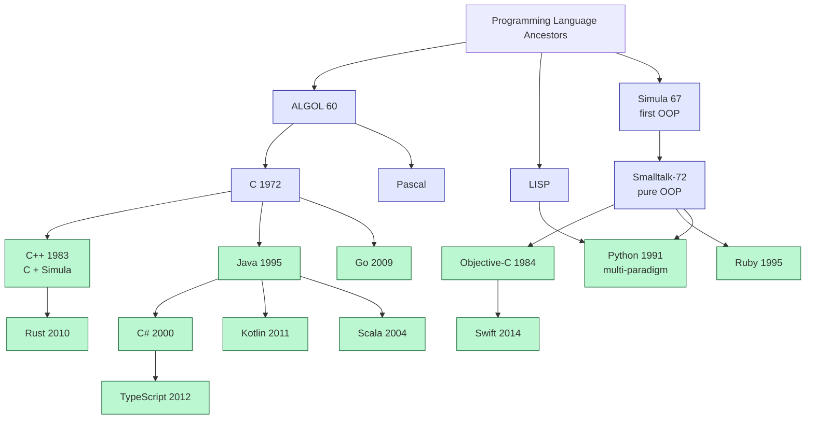
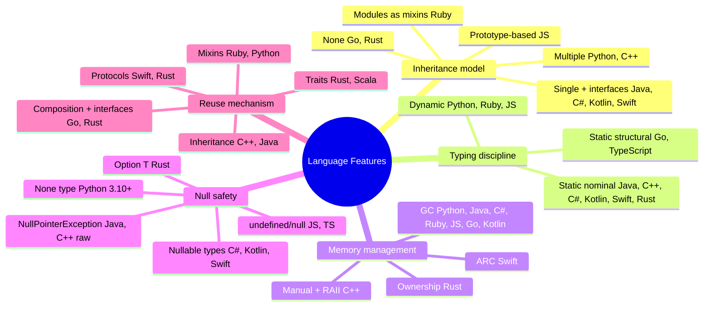
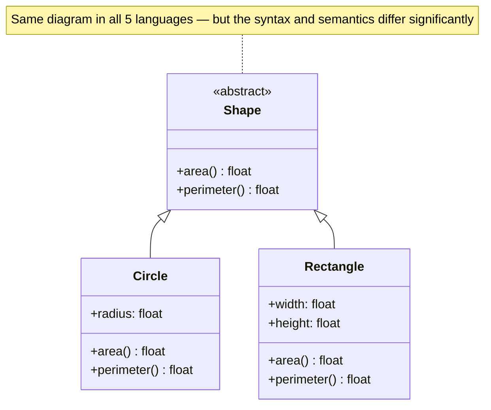
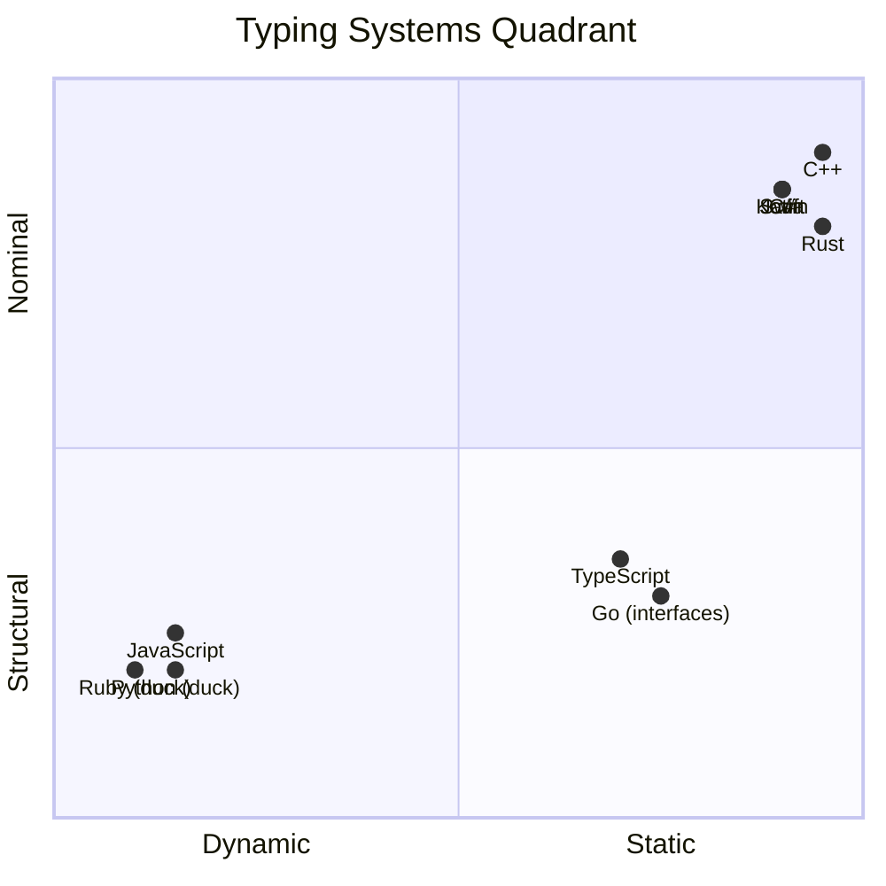
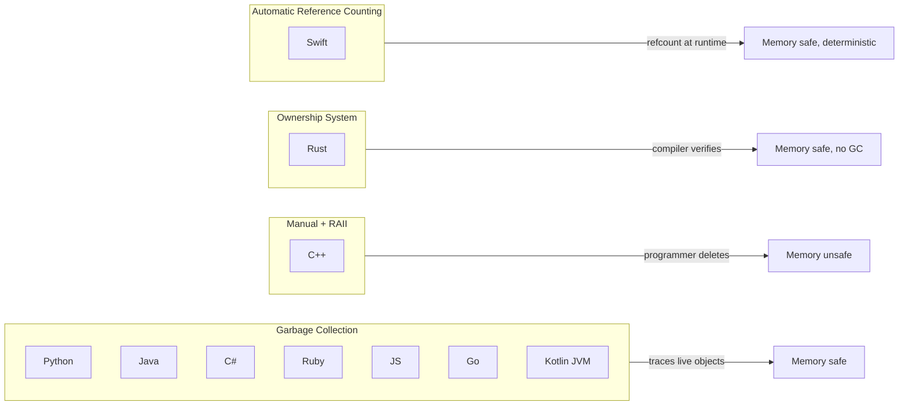
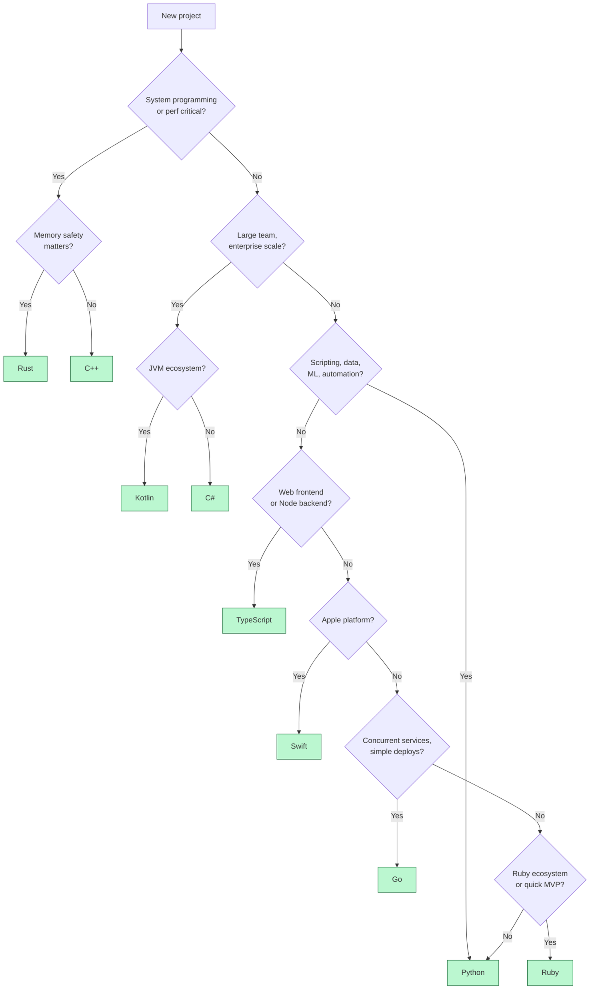
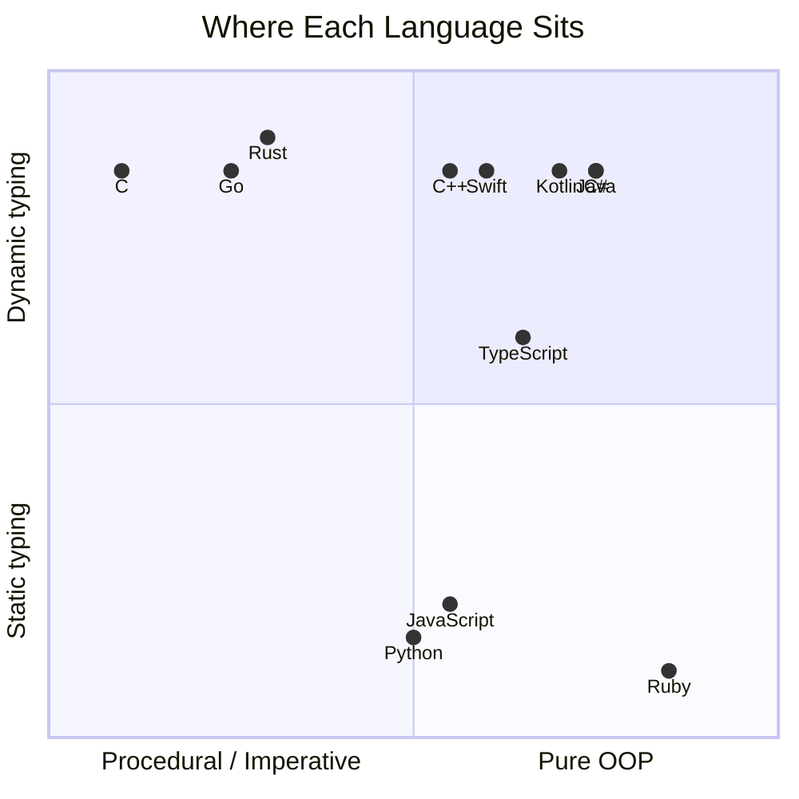

# Languages Comparison — How OOP Differs Across Major Languages

#oop #languages #comparison #teaching #deep-dive

> [!quote] Bjarne Stroustrup
> "There are only two kinds of languages: the ones people complain about and the ones nobody uses."

> [!quote] Guido van Rossum
> "Don't ever bother with 'more object-oriented than thou'. If somebody wants to use a procedural style, fine. If somebody wants to write a completely object-oriented program, fine."

Object-Oriented Programming is not one thing. Each language implements it differently — sometimes radically so. Python's "we're all consenting adults" is worlds apart from Java's strict nominal typing, which is worlds apart from Go's "we removed classes on purpose", which is worlds apart from Rust's "we removed inheritance on purpose".

This note tours OOP across **eleven major languages**: Python, Java, C++, C#, Ruby, JavaScript, Go, Rust, Kotlin, Swift, and TypeScript. We'll write the same `Shape` hierarchy in five of them to make differences concrete, build a feature comparison table, and give pragmatic guidance on when to choose which.

Prerequisites: [[What-Is-OOP]], [[Inheritance]], [[Polymorphism]], [[OOP-Paradigms]].

---

## 1. Language Family Tree



Each branch inherited different ideas:

- **Simula → Smalltalk → Ruby/Python** — pure-object, dynamic, message-passing
- **C → C++ → Java/C#** — class-based, statically typed, inheritance-centric
- **C → Go** — deliberately rejected classes and inheritance
- **C++ → Rust** — kept performance, replaced inheritance with traits
- **Objective-C → Swift** — replaced message-passing with protocols + value types

---

## 2. The Eleven Languages — One-Paragraph Profiles

### 2.1 Python — Multi-paradigm, duck typing, "consenting adults"

Python is dynamically typed, multi-paradigm, and unapologetically pragmatic. Everything is an object (including classes, functions, modules). Multiple inheritance is allowed (with C3 linearization for MRO). Metaclasses let you customize class creation. Privacy is **by convention** (`_name` = "private", `__name` = "name-mangled") — there is no enforcement. The culture is "we're all consenting adults": don't forbid misuse, just document the contract.

### 2.2 Java — Nominal typing, single inheritance, "everything is an object (almost)"

Java is statically typed with **nominal** typing (types match by name, not structure). Single inheritance for classes, multiple inheritance for interfaces. Generics use **type erasure** (generic types are not available at runtime). primitives (`int`, `boolean`) are not objects — a wart corrected by Kotlin and Scala. Memory is GC-managed. Verbose but predictable, with massive tooling (IntelliJ, Maven, Gradle, Spring).

### 2.3 C++ — Multiple inheritance, templates, RAII, manual memory

C++ is the original performant OOP language. **Multiple inheritance** is allowed (including the dreaded diamond). **Templates** provide compile-time generic programming far more powerful than Java generics. **RAII** ties resource management to object lifetime. **Operator overloading** is extensive. Manual memory management (`new`/`delete`) is the source of countless bugs — hence Rust.

### 2.4 C# — Java-like, but with properties, LINQ, value types, async

C# started as Microsoft's Java competitor but evolved far beyond it. **Properties** (getters/setters with clean syntax) replace Java's verbose `getX()`/`setX()`. **LINQ** brings functional-style queries to objects. **Structs** are value types (stack-allocated, copied on assignment) — distinct from classes (heap-allocated, reference types). **`async`/`await`** was pioneered here. Recent additions (records, pattern matching, top-level statements) keep pushing toward functional hybrid.

### 2.5 Ruby — Pure OOP, dynamic, blocks/procs, mixins

Ruby inherits Smalltalk's "everything is an object" — even `1` is an instance of `Integer`, and `+` is a method call. Dynamic, reflective, with **blocks/procs/lambdas** as first-class. **Modules** serve as mixins (multiple inheritance of behavior without state). Famously: Rails made it the dominant web language in the late 2000s.

### 2.6 JavaScript — Prototype-based (originally), now has `class` syntax

JavaScript's original OOP model is **prototype-based**, not class-based. Objects inherit directly from other objects via prototype chains. ES6 (2015) added `class` syntax, but it's syntactic sugar over prototypes — there are no real classes underneath. `this` binding is famously quirky (lexical in arrow functions, dynamic in regular functions). TypeScript adds static types on top.

### 2.7 Go — No classes, no inheritance, structs + interfaces

Go deliberately **rejects** classes and inheritance. You define structs, attach methods to them, and use **interfaces** — which are *implicitly* satisfied (structural typing, no `implements` keyword). Composition is the only reuse mechanism. The philosophy: less is more. Vastly simpler than Java, with fast compilation and great concurrency primitives (goroutines, channels).

### 2.8 Rust — No classes, traits (similar to interfaces), ownership, no null

Rust also rejects classes and inheritance. Behavior reuse comes from **traits** (similar to interfaces/typeclasses). The headline feature is **ownership** — compile-time memory safety without GC. There is **no null** — `Option<T>` replaces it. Pattern matching is exhaustive. Rust blends OOP-ish encapsulation with FP-ish traits and immutability. Steep learning curve, but it's the future of systems programming.

### 2.9 Kotlin — Null safety, data classes, sealed classes, extension functions

Kotlin is a "better Java" — 100% interoperable with Java but with modern features. **Null safety** is built in (`String?` vs `String`). **Data classes** generate `equals`/`hashCode`/`toString`/`copy` automatically. **Sealed classes** are restricted hierarchies (like Scala's case classes). **Extension functions** let you add methods to existing classes without inheritance. Now the official language for Android.

### 2.10 Swift — Protocols, value types, optionals, extensions

Swift is Apple's successor to Objective-C. **Protocols** are like interfaces (with default implementations). **Structs are value types** and the default choice for data — copied on assignment, no shared mutable state. **Optionals** replace null (`String?` may be nil, `String` cannot). **Extensions** add methods to existing types. Heavy emphasis on value types + protocol-oriented programming distinguishes Swift from classic OOP.

### 2.11 TypeScript — Structural typing, interfaces, generics, union types

TypeScript adds static types to JavaScript. Typing is **structural** (if it has the right shape, it's assignable — like Go but more powerful). **Interfaces** are zero-runtime-cost (compile-time only). **Union types** (`string | number`) and **discriminated unions** bring FP-style modeling. **Generics** are reified at compile time. The type system is Turing-complete — sometimes a curse.

---

## 3. Feature Comparison Table — The Big Picture

| Feature | Python | Java | C++ | C# | Ruby | JS | Go | Rust | Kotlin | Swift | TS |
|---|---|---|---|---|---|---|---|---|---|---|---|
| **Inheritance** | Multiple | Single + interfaces | Multiple | Single + interfaces | Single + mixins | Prototype chain | None | None | Single + interfaces | Single + protocols | Single + interfaces |
| **Typing** | Dynamic, duck | Static, nominal | Static, nominal | Static, nominal | Dynamic, duck | Dynamic, structural | Static, structural | Static, nominal+infer | Static, nominal | Static, nominal+infer | Static, structural |
| **Memory** | GC | GC | Manual/RAII | GC | GC | GC | GC | Ownership | GC (JVM) | ARC | GC (JS runtime) |
| **Generics** | Duck typing | Erased | Templates (reified) | Reified | None (dynamic) | None (dynamic) | Yes (reified) | Yes (monomorphized) | Erased (JVM) | Reified | Erased |
| **Operator overloading** | Yes (dunder) | No | Yes | Yes (limited) | Yes | No | No | Yes (traits) | Yes (conventions) | Yes | No |
| **Properties** | @property | No (getters) | No (convention) | Yes (native) | Yes | No (convention) | No (convention) | No (convention) | Yes | Yes | Yes (TS 4.x) |
| **Null handling** | None type | NullPointerException | Raw pointers | Nullable types | nil | undefined/null | Zero values | Option\<T\> | Nullable types | Optionals | undefined/null |
| **Abstract classes** | ABC | Yes | Yes | Yes | No (modules) | No | No (interfaces) | No (traits) | Yes (abstract/sealed) | No (protocols) | No (interfaces) |
| **Interfaces** | Protocols (PEP 544) | Yes | Abstract classes | Yes | Modules | No (convention) | Yes (implicit) | Traits | Yes | Protocols | Yes |
| **Value types** | No (all refs) | No (primitives only) | Yes | Yes (structs) | No | No (objects) | Yes (structs) | Yes (Copy types) | No (JVM) | Yes (structs) | No |
| **Multiple dispatch** | singledispatch | No | No | No | No | No | No | No | No | No | No |
| **Metaprogramming** | Metaclasses, decorators | Annotations | Templates | Attributes | Heavy (define_method) | Proxy/Reflect | Code gen | Macros | Light | Light | Decorators |



---

## 4. Same Shape Hierarchy — Five Languages

The spec: a `Shape` interface/abstract class with `area()` and `perimeter()` methods, two concrete implementations (`Circle`, `Rectangle`), and a function that prints the area of any list of shapes.

### 4.1 Python — Duck-Typed ABC

```python
# python_shapes.py
import math
from abc import ABC, abstractmethod
from dataclasses import dataclass

class Shape(ABC):
    @abstractmethod
    def area(self) -> float: ...
    @abstractmethod
    def perimeter(self) -> float: ...

@dataclass
class Circle(Shape):
    radius: float
    def area(self) -> float:
        return math.pi * self.radius ** 2
    def perimeter(self) -> float:
        return 2 * math.pi * self.radius

@dataclass
class Rectangle(Shape):
    width: float
    height: float
    def area(self) -> float:
        return self.width * self.height
    def perimeter(self) -> float:
        return 2 * (self.width + self.height)

def print_areas(shapes: list[Shape]) -> None:
    for s in shapes:
        print(f"  area = {s.area():.2f}")

print_areas([Circle(3), Rectangle(4, 5)])
```

**Python notes**: `@dataclass` auto-generates `__init__`, `__repr__`, `__eq__`. The `ABC` is optional — duck typing means `print_areas` would work on any object with `area()` and `perimeter()` methods, even without inheriting `Shape`.

### 4.2 Java — Verbose, Nominal, Generics-Erased

```java
// Shape.java
public abstract class Shape {
    public abstract double area();
    public abstract double perimeter();
}

// Circle.java
public class Circle extends Shape {
    private final double radius;
    public Circle(double radius) { this.radius = radius; }
    @Override public double area()      { return Math.PI * radius * radius; }
    @Override public double perimeter() { return 2 * Math.PI * radius; }
}

// Rectangle.java
public class Rectangle extends Shape {
    private final double width, height;
    public Rectangle(double w, double h) { this.width = w; this.height = h; }
    @Override public double area()      { return width * height; }
    @Override public double perimeter() { return 2 * (width + height); }
}

// Main.java
public class Main {
    public static void printAreas(Shape[] shapes) {
        for (Shape s : shapes)
            System.out.printf("  area = %.2f%n", s.area());
    }
    public static void main(String[] args) {
        printAreas(new Shape[]{ new Circle(3), new Rectangle(4, 5) });
    }
}
```

**Java notes**: every class in its own file (convention). `final` fields for immutability. `@Override` annotation (optional but recommended). All fields/methods need explicit `public`/`private`. The `Shape` could also be an `interface` with default methods (Java 8+).

### 4.3 Go — No Classes, Implicit Interfaces

```go
// shapes.go
package main

import (
    "fmt"
    "math"
)

// Interface — implicitly satisfied
type Shape interface {
    Area() float64
    Perimeter() float64
}

// Circle — struct with methods
type Circle struct {
    Radius float64
}

func (c Circle) Area() float64      { return math.Pi * c.Radius * c.Radius }
func (c Circle) Perimeter() float64 { return 2 * math.Pi * c.Radius }

// Rectangle
type Rectangle struct {
    Width, Height float64
}

func (r Rectangle) Area() float64      { return r.Width * r.Height }
func (r Rectangle) Perimeter() float64 { return 2 * (r.Width + r.Height) }

// Function accepts any Shape
func printAreas(shapes []Shape) {
    for _, s := range shapes {
        fmt.Printf("  area = %.2f\n", s.Area())
    }
}

func main() {
    shapes := []Shape{Circle{Radius: 3}, Rectangle{Width: 4, Height: 5}}
    printAreas(shapes)
}
```

**Go notes**: no `class` keyword, no inheritance, no `implements`. `Circle` satisfies `Shape` *automatically* because it has the right methods. This is **structural typing** (a.k.a. "duck typing at compile time"). Methods are declared outside the struct, with a *receiver* (`(c Circle)`). Constructor `Circle{Radius: 3}` uses field names.

### 4.4 Rust — Traits, Ownership, No Null

```rust
// shapes.rs
use std::f64::consts::PI;

// Trait — like an interface, but more powerful
trait Shape {
    fn area(&self) -> f64;
    fn perimeter(&self) -> f64;
}

struct Circle { radius: f64 }
struct Rectangle { width: f64, height: f64 }

impl Circle {
    fn new(radius: f64) -> Self { Circle { radius } }
}
impl Rectangle {
    fn new(width: f64, height: f64) -> Self { Rectangle { width, height } }
}

// Implement the trait for each type
impl Shape for Circle {
    fn area(&self) -> f64 { PI * self.radius * self.radius }
    fn perimeter(&self) -> f64 { 2.0 * PI * self.radius }
}
impl Shape for Rectangle {
    fn area(&self) -> f64 { self.width * self.height }
    fn perimeter(&self) -> f64 { 2.0 * (self.width + self.height) }
}

// Generic function — accepts anything implementing Shape
fn print_areas(shapes: &[Box<dyn Shape>]) {
    for s in shapes {
        println!("  area = {:.2}", s.area());
    }
}

fn main() {
    let shapes: Vec<Box<dyn Shape>> = vec![
        Box::new(Circle::new(3.0)),
        Box::new(Rectangle::new(4.0, 5.0)),
    ];
    print_areas(&shapes);
}
```

**Rust notes**: no `class` keyword, no inheritance. `trait` is like an interface but with more power (default methods, associated types, blanket impls). `impl Shape for Circle` says "Circle implements Shape". `Box<dyn Shape>` is a trait object (heap-allocated, dynamic dispatch) — needed because the vector holds different concrete types. `&self` borrows the receiver immutably. No null — `Option<T>` would be used if shapes could be missing.

### 4.5 JavaScript — Prototypes Underneath, `class` Syntax on Top

```javascript
// shapes.js
class Shape {
  area() { throw new Error("abstract"); }
  perimeter() { throw new Error("abstract"); }
}

class Circle extends Shape {
  constructor(radius) { super(); this.radius = radius; }
  area() { return Math.PI * this.radius ** 2; }
  perimeter() { return 2 * Math.PI * this.radius; }
}

class Rectangle extends Shape {
  constructor(width, height) { super(); this.width = width; this.height = height; }
  area() { return this.width * this.height; }
  perimeter() { return 2 * (this.width + this.height); }
}

function printAreas(shapes) {
  for (const s of shapes) {
    console.log(`  area = ${s.area().toFixed(2)}`);
  }
}

printAreas([new Circle(3), new Rectangle(4, 5)]);
```

**JavaScript notes**: `class` syntax (ES6+) is syntactic sugar over prototypes. `extends` sets up prototype chain. `super()` must be called before `this` in constructor. No type annotations (use TypeScript for those). Methods are not truly abstract — they throw at runtime. Fields are dynamically assignable (you can do `circle.foo = 42` and JS allows it).



---

## 5. Typing Systems — A Deeper Look

The single biggest axis of language variation is the **typing discipline**.



### 5.1 Static vs Dynamic

- **Static typing** (Java, C++, C#, Go, Rust, Kotlin, Swift, TS): types are checked at compile time. Catches bugs early, enables better tooling, slightly more verbose.
- **Dynamic typing** (Python, Ruby, JS): types are checked at runtime. Faster to write, more flexible, more runtime errors.

### 5.2 Nominal vs Structural

- **Nominal typing** (Java, C++, C#, Kotlin, Swift, Rust): types match by *name*. `class Foo` and `class Bar` with identical fields are still *different types*.
- **Structural typing** (Go, TypeScript): types match by *shape*. If `Foo` and `Bar` have the same fields/methods, they're interchangeable. "If it walks like a duck and quacks like a duck, it's a duck."

> [!teaching-tip] Teaching Tip
> Have students try this experiment: in Python, define two classes with identical methods but no shared base class. Pass an instance of one to a function expecting the other — it works! That's duck typing. Now try the same in Java: it won't compile. That's nominal typing. The conceptual difference is huge: in Python, *interfaces are emergent from behavior*; in Java, *interfaces must be declared explicitly*.

### 5.3 The Pragmatic Trade-off

| Want... | Choose... |
|---|---|
| Fast feedback, refactoring safety, big team | Static nominal (Java, C#, Kotlin, Swift, Rust) |
| Flexibility, fast prototyping, scripts | Dynamic (Python, Ruby, JS) |
| Loose coupling, plugin systems | Structural (Go, TypeScript) |
| Maximum safety, no nulls, no GC | Rust |
| Maximum brevity, "consenting adults" | Python |

---

## 6. Memory Management — Four Models



### 6.1 Garbage Collection (Python, Java, C#, Go, Ruby, JS, Kotlin/JVM)

A runtime periodically traces which objects are reachable and frees unreachable ones. Pros: simple, safe. Cons: pauses (especially stop-the-world GCs), higher memory overhead.

### 6.2 Manual + RAII (C++)

The programmer allocates and frees memory. RAII ties resource lifetime to object scope: destructors run when objects go out of scope. Pros: zero runtime cost, deterministic, fine control. Cons: use-after-free, double-free, memory leaks — entire bug classes.

### 6.3 Ownership (Rust)

The compiler tracks every allocation. Each value has exactly one owner; when the owner goes out of scope, the value is freed. References are borrowed with strict rules (one writer XOR many readers). Pros: zero-cost memory safety, no GC pauses. Cons: steep learning curve, "fighting the borrow checker".

### 6.4 Automatic Reference Counting (Swift, Objective-C)

Every reference counts; when count hits zero, object is freed immediately. Pros: deterministic, no GC pauses. Cons: overhead on every assignment, cannot handle cycles (need `weak` references).

---

## 7. Generics — Reified, Erased, Templates

Generics let you write code that works for any type: `List<T>`, `Map<K, V>`, `Stack[T]`.

| Style | Languages | Behavior |
|---|---|---|
| **Type erasure** | Java, Kotlin/JVM | Generic types exist only at compile time; `List<String>` and `List<Integer>` are both `List` at runtime |
| **Reified** | C#, Go | Generic types exist at runtime; `List<String>` knows it holds strings |
| **Templates** | C++ | The compiler generates a separate copy of the code for each type used (monomorphization); zero runtime cost, slow compilation |
| **Monomorphization** | Rust | Like C++ templates but with constraints (traits) |
| **Duck typing** | Python, Ruby, JS | No generics needed — code works on any type that supports the operations |

```python
# Python: no generics needed — duck typing
def first(items):
    return items[0]
first([1, 2, 3])           # int
first(["a", "b"])          # str
first((1.0, 2.0))          # float
```

```java
// Java: generics with erasure
List<String> strings = new ArrayList<>();
strings.add("hi");
// strings.add(42); // compile error
// At runtime: strings is just an ArrayList<Object>
```

```cpp
// C++: templates — monomorphized
template<typename T>
T first(std::vector<T>& v) { return v[0]; }
// Compiler generates first<int>, first<std::string>, first<double>, etc.
```

> [!warning] Common Student Misconception
> "Generics are the same in all languages." — *Wrong.* Java's type erasure means you can't do `new T()` or `instanceof List<String>` at runtime. C#'s reified generics let you. C++ templates are Turing-complete metaprogramming. Python doesn't need them. The differences are deep and affect what code you can write.

---

## 8. Null Handling — A Cross-Language Tour

The "billion-dollar mistake" (Tony Hoare's null reference) is handled very differently across languages:

```python
# Python: None is the null, but type hints can express Optional
from typing import Optional
def find_user(user_id: int) -> Optional[User]:
    ...
# Python 3.10+: User | None

user = find_user(42)
if user is not None:
    print(user.name)   # safe
```

```java
// Java: null is universal, NullPointerException is the result
User user = findUser(42);
System.out.println(user.getName());   // throws NPE if user is null
// Optional<User> exists but is not enforced
```

```kotlin
// Kotlin: null safety in the type system
fun findUser(id: Int): User? = ...    // ? means nullable
val user: User = findUser(42)         // COMPILE ERROR — type mismatch
val user: User? = findUser(42)        // OK
println(user?.name)                   // safe call — returns null if user is null
println(user!!.name)                  // assert non-null — throws if null
```

```rust
// Rust: no null at all — Option<T> replaces it
fn find_user(id: i32) -> Option<User> { ... }
match find_user(42) {
    Some(user) => println!("{}", user.name),
    None       => println!("not found"),
}
// Compiler forces you to handle both cases
```

```swift
// Swift: Optionals
func findUser(id: Int) -> User? { ... }
if let user = findUser(42) {
    print(user.name)              // unwrapped
}
// Or: optional chaining
print(findUser(42)?.name)
```

Null safety is one of the clearest language-quality differentiators. Kotlin, Swift, and Rust *eliminated* null as a runtime concept — you cannot get a `NullPointerException` in well-typed code. Java and Python still struggle with it.

---

## 9. When to Choose Which Language



### 9.1 Pragmatic Recommendations

- **Python** — ML/data science, scripting, automation, rapid prototyping, education. Defaults for: data science, ML, scientific computing, scripts.
- **Java** — large enterprise backends, Android (legacy), banking. Massive ecosystem, conservative evolution.
- **Kotlin** — modern Android, new JVM backends. Use over Java when you have the choice.
- **C#** — Windows ecosystem, game dev (Unity), enterprise backends on .NET.
- **C++** — game engines, high-performance computing, embedded, systems where Rust isn't yet viable.
- **Go** — microservices, networked services, CLIs, anywhere you want simple deployment and great concurrency.
- **Rust** — systems programming, WebAssembly, anywhere memory safety matters without GC.
- **Ruby** — Rails web apps, devops scripts (Chef, Puppet heritage).
- **JavaScript/TypeScript** — browsers, Node.js backends. Use TypeScript for any non-trivial project.
- **Swift** — Apple platforms (iOS, macOS, watchOS).
- **TypeScript** — any JS project that grows beyond 1000 lines.

---

## 10. The Same Thing, Five Ways — Observations

Look back at the five `Shape` examples (Python, Java, Go, Rust, JS). The same design produced:

- **Python** — 25 lines, duck-typed, `@dataclass` saves boilerplate
- **Java** — 35+ lines, every class in its own file, `@Override` annotations
- **Go** — 30 lines, no `class` keyword, no `implements` keyword
- **Rust** — 35 lines, `Box<dyn Shape>` for the heterogeneous list
- **JavaScript** — 25 lines, prototype-based despite `class` syntax

> [!teaching-tip] Teaching Tip
> Have students implement the same `Shape` example in 3+ languages. They'll viscerally feel:
> - Java's verbosity and ceremony
> - Go's deliberate minimalism
> - Rust's safety-first friction
> - Python's "consenting adults" brevity
> - JavaScript's prototype weirdness underneath `class` syntax
>
> This single exercise teaches more about language design than a semester of theory.

---

## 11. The Paradigm Positioning of Each Language



- **C** is the most procedural — no objects at all.
- **Ruby** is the most pure-OOP — even `1` is an object.
- **Go, Rust** are deliberately *less* OOP than Java — they removed inheritance.
- **Python** sits in the middle — multi-paradigm, dynamic.
- **Kotlin, Swift** are modern post-OOP — keep encapsulation and polymorphism, drop inheritance in favor of composition + protocols/traits.

---

## 12. Trends — Where OOP Is Going

1. **Less inheritance** — Go, Rust, Swift all favor composition + interfaces/traits over inheritance hierarchies. See [[Composition-Over-Inheritance]].
2. **More value types** — Swift structs, C# records, Kotlin data classes, Python frozen dataclasses. Immutable-by-default.
3. **Null safety** — Kotlin, Swift, Rust, C# 8+ all have nullable types in the type system. Java and Python lag.
4. **Functional fusion** — every modern OOP language now has lambdas, `map`/`filter`/`reduce`, pattern matching. See [[OOP-Vs-Functional]].
5. **Async/await everywhere** — C# pioneered it; now JS, Python, Rust, Kotlin, Swift all have it.
6. **Traits/protocols over classes** — Rust traits, Swift protocols, Go interfaces, Kotlin interfaces with default impls all converge on this model.

The next decade of OOP will likely look more like Swift and Rust than like Java 8 — composition-heavy, value-type-centric, null-safe, with traits as the primary abstraction.

---

## 13. Summary

OOP is a *family* of related ideas, not a single doctrine. Each language picks different ones:

- **Encapsulation** — universal, but enforced differently (Python conventions vs Java `private`).
- **Inheritance** — central in Java/C++, optional in Python, rejected in Go/Rust.
- **Polymorphism** — universal, but via vtables (Java, C++), duck typing (Python), structural interfaces (Go, TS), or traits (Rust, Swift).
- **Abstraction** — universal, but expressed via abstract classes (Java, C++), protocols (Swift, Python), traits (Rust), or interfaces (Go, C#, Kotlin).

The mature engineer doesn't ask "which language is best?" but "which language fits *this* problem, *this* team, *this* ecosystem?" Python for ML, Rust for systems, Go for microservices, TypeScript for web, Swift for iOS, Kotlin for Android — these are not ideological choices but pragmatic ones.

> [!teaching-tip] Final Teaching Tip
> Teach at least 3 languages' OOP systems side by side. Students who see only one language believe its choices are universal — that classes are *required*, that inheritance is *necessary*, that null *must exist*. Seeing Java, Go, and Rust together shatters these assumptions and creates real understanding.

> [!warning] Common Student Misconceptions
> - **"OOP requires classes."** — No. Go and Rust have no `class` keyword and are clearly OOP-ish.
> - **"Inheritance is essential to OOP."** — No. Modern OOP (Go, Rust, Swift) actively rejects it.
> - **"Static typing means more verbose."** — Kotlin and Swift prove otherwise with type inference.
> - **"Dynamic typing means unsafe."** — Python and Ruby power massive production systems. Tests catch what the compiler would.
> - **"Java is the canonical OOP language."** — Java is one specific implementation. Smalltalk, Ruby, and Python represent different (and often cleaner) traditions.

---

## 14. Further Reading

- [[What-Is-OOP]] — what OOP is, foundational
- [[Inheritance]] — the mechanism Java/C++ emphasize
- [[Polymorphism]] — how dispatch works across languages
- [[Composition-Over-Inheritance]] — the modern alternative
- [[OOP-Paradigms]] — broader paradigm survey
- [[OOP-Vs-Functional]] — paradigm comparison
- [[OOP-Vs-Procedural]] — paradigm comparison
- [[When-Not-To-Use-OOP]] — when even the best OOP language isn't the right tool

> [!book] Recommended Reading
> - *Concepts of Programming Languages* — Robert Sebesta (the canonical textbook)
> - *Programming Language Pragmatics* — Michael Scott
> - *Types and Programming Languages* — Benjamin Pierce (deep, theoretical)
> - *The Go Programming Language* — Donovan & Kernighan
> - *The Rust Programming Language* — Klabnik & Nichols (free online, "the book")
> - *Effective Java* — Joshua Bloch (Java idioms)
> - *Programming Ruby* — Dave Thomas (the "Pickaxe" book)

#oop #languages #comparison #teaching #multi-language
