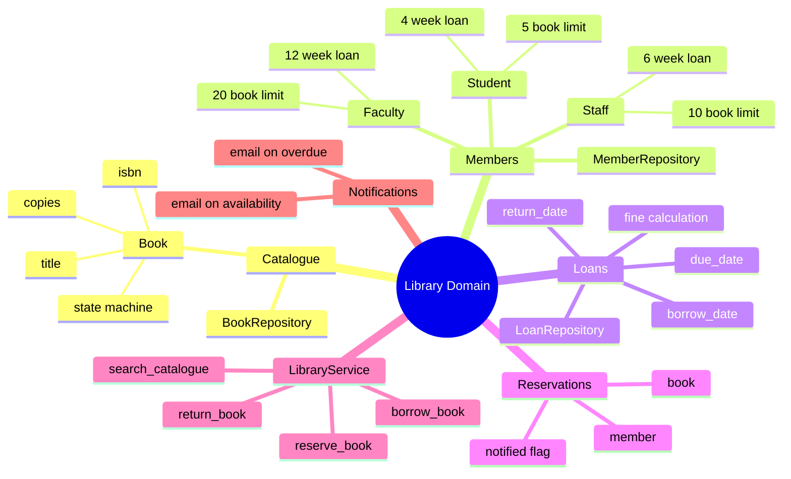
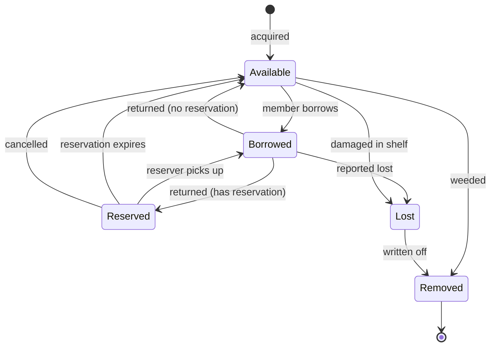
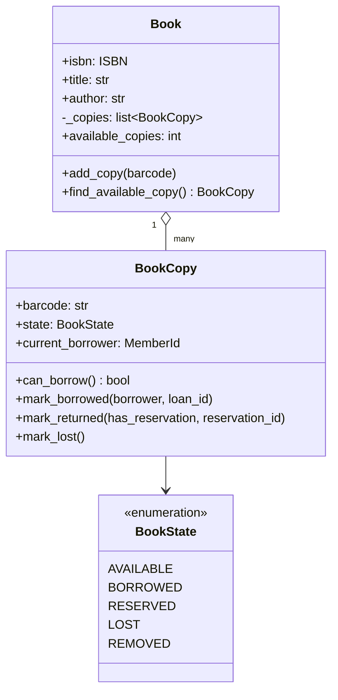
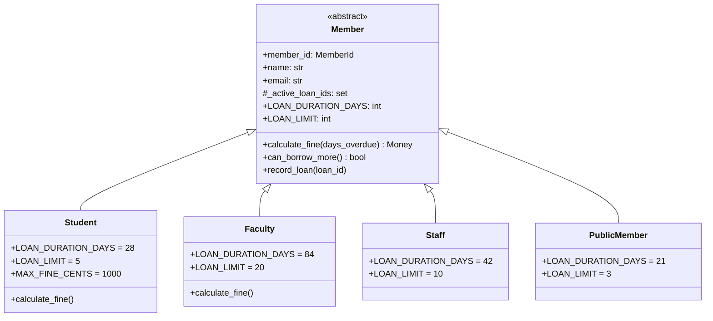
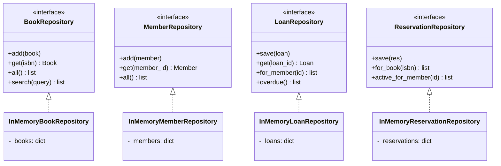
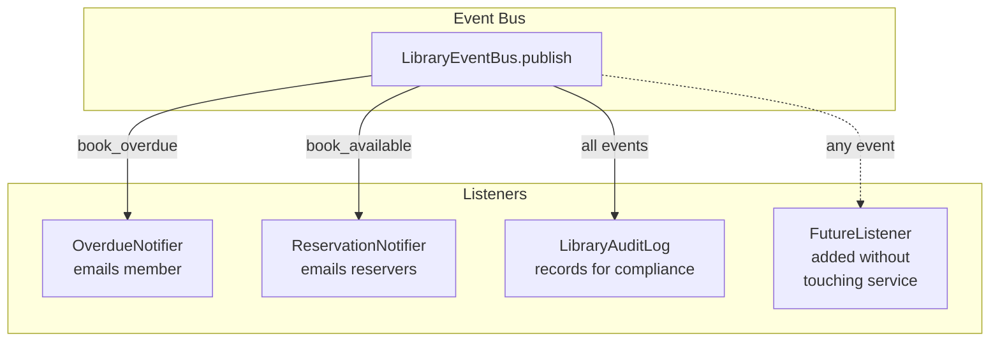
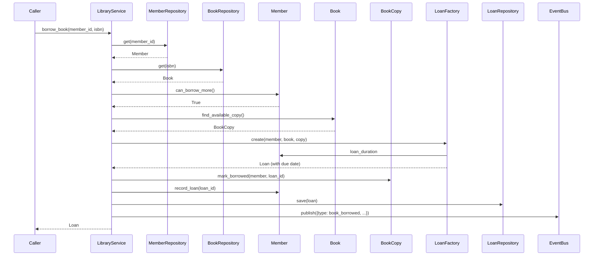
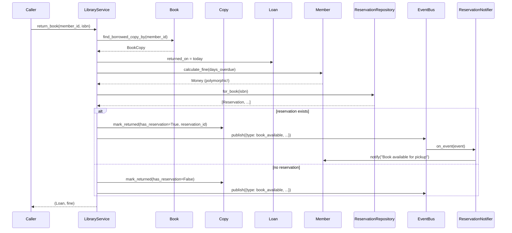

# Real-World OOP — A Library Management System

> [!info] Why a library?
> The library domain is a *teacher's dream*. It has clear inheritance (member types with different privileges), an obvious state machine (a book goes from `available` to `borrowed` to `reserved` to `lost`), real cross-cutting concerns (notifications, reservations, fines), and — crucially — it's small enough that students can hold the whole model in their heads while sophisticated enough to need every OOP pattern. Many OOP textbooks (and university courses) use libraries for exactly these reasons.

This file walks through a complete, runnable Python implementation of a library management system. We demonstrate **all four OOP pillars**, **SOLID in practice**, and **five design patterns** (Repository, Service Layer, State, Observer, Factory) in a single coherent codebase.

---

## 1. The Domain at a Glance

A `Library` owns a `Catalogue` of `Book`s. Each book has a state: `available`, `borrowed`, `reserved`, `lost`. `Member`s (of different types — `Student`, `Faculty`, `Staff`) borrow books, creating `Loan`s. Loans accrue fines if overdue. Members can reserve books that are currently borrowed; when such a book is returned, the system notifies the reserver (Observer pattern). A `LibraryService` orchestrates all operations; repositories handle persistence.



---

## 2. Design Decisions Up Front

| Decision | Choice | Why |
|---|---|---|
| Book copies | Internal list of `BookCopy` objects, accessed via methods | Encapsulation — the catalogue hides how copies are stored; clients ask "is this available?" not "give me copy #3". |
| Member hierarchy | Abstract `Member` + concrete subclasses with different limits | Polymorphism — `calculate_fine()` and `loan_limit` differ per type but the call site is uniform. |
| Book state | Explicit `BookState` enum + State pattern | Prevents illegal transitions (`borrowed → lost` without a return? No.). |
| Persistence | Repository pattern (`BookRepository`, `MemberRepository`, `LoanRepository`) | Decouples domain from storage; lets us swap in-memory for SQL later. |
| Orchestration | `LibraryService` as a thin service layer | Single entry point for all use cases; keeps `Book`, `Loan`, `Member` free of cross-class coordination. |
| Notifications | Observer pattern on `LibraryService` | Members, librarians, and analytics subscribe independently. |
| Loan & reservation creation | Factory methods | Centralise invariant enforcement (unique IDs, default due dates per member type). |
| Fines | Strategy-free per member type, but extensible | `calculate_fine` is polymorphic — each member type owns its fine rule. |

> [!tip] Teaching Tip
> Walk students through this table *before* code. Ask: "If a `Book` were just a dict with `title`, `isbn`, and `borrower`, what could go wrong?" Brainstorm: two members borrowing the same copy, returning a book that wasn't borrowed, lost books still showing as available. *Then* introduce encapsulation + state machine as the answer.

---

## 3. The Book State Machine

A book copy moves through a strict state machine. Illegal transitions (e.g. `available → lost` while a member still has it) are prevented by the State pattern.



> [!note] Why explicit states?
> Without explicit states, a book is a dict with `is_borrowed`, `is_reserved`, `is_lost`, `is_removed` flags. It's easy to produce impossible combinations — `is_borrowed=True, is_lost=True`. Explicit states make impossible states unrepresentable. See [[Domain-Driven-Design]].

---

## 4. Core Code — Step by Step

### 4.1 Value Objects and Enums

```python
from __future__ import annotations
from abc import ABC, abstractmethod
from dataclasses import dataclass, field
from datetime import datetime, timedelta, date
from decimal import Decimal, ROUND_HALF_UP
from enum import Enum, auto
from typing import Optional
from uuid import uuid4


class BookState(Enum):
    AVAILABLE = auto()
    BORROWED = auto()
    RESERVED = auto()
    LOST = auto()
    REMOVED = auto()


@dataclass(frozen=True)
class ISBN:
    """Value object: validated ISBN-13."""
    value: str

    def __post_init__(self):
        cleaned = self.value.replace("-", "").replace(" ", "")
        if not (len(cleaned) == 13 and cleaned.isdigit()):
            raise ValueError(f"Invalid ISBN-13: {self.value}")
        object.__setattr__(self, "value", cleaned)

    def __str__(self) -> str:
        v = self.value
        return f"{v[:3]}-{v[3:4]}-{v[4:8]}-{v[8:12]}-{v[12]}"


@dataclass(frozen=True)
class MemberId:
    value: str

    def __str__(self) -> str:
        return self.value


def money(cents: int) -> Decimal:
    return (Decimal(cents) / 100).quantize(Decimal("0.01"), rounding=ROUND_HALF_UP)


def to_cents(d: Decimal) -> int:
    return int((d * 100).to_integral_value())


@dataclass(frozen=True)
class Money:
    cents: int

    @classmethod
    def from_dollars(cls, amount: str) -> "Money":
        return cls(to_cents(Decimal(amount)))

    @property
    def as_decimal(self) -> Decimal:
        return money(self.cents)

    def __add__(self, other: "Money") -> "Money":
        return Money(self.cents + other.cents)

    def __mul__(self, factor: int) -> "Money":
        return Money(self.cents * factor)
```

### 4.2 `BookCopy` and `Book` — Encapsulation + State Pattern

```python
@dataclass
class BookCopy:
    """A physical copy of a book. Has a barcode and a state."""
    barcode: str
    state: BookState = BookState.AVAILABLE
    current_borrower: Optional[MemberId] = None
    current_loan_id: Optional[str] = None
    reservation_id: Optional[str] = None  # if reserved, who has the reservation

    def can_borrow(self) -> bool:
        return self.state == BookState.AVAILABLE

    def can_reserve(self) -> bool:
        return self.state == BookState.BORROWED and self.reservation_id is None

    def can_return(self) -> bool:
        return self.state == BookState.BORROWED

    def mark_borrowed(self, borrower: MemberId, loan_id: str) -> None:
        if not self.can_borrow():
            raise ValueError(f"Cannot borrow copy in state {self.state.name}")
        self.state = BookState.BORROWED
        self.current_borrower = borrower
        self.current_loan_id = loan_id

    def mark_returned(self, has_reservation: bool, reservation_id: Optional[str] = None) -> None:
        if not self.can_return():
            raise ValueError(f"Cannot return copy in state {self.state.name}")
        self.current_borrower = None
        self.current_loan_id = None
        if has_reservation and reservation_id:
            self.state = BookState.RESERVED
            self.reservation_id = reservation_id
        else:
            self.state = BookState.AVAILABLE

    def mark_lost(self) -> None:
        if self.state == BookState.REMOVED:
            raise ValueError("Cannot lose a removed copy")
        self.state = BookState.LOST
        self.current_borrower = None
        self.current_loan_id = None

    def mark_removed(self) -> None:
        if self.state == BookState.BORROWED:
            raise ValueError("Cannot remove a borrowed copy")
        self.state = BookState.REMOVED

    def fulfill_reservation(self, borrower: MemberId, loan_id: str) -> None:
        if self.state != BookState.RESERVED:
            raise ValueError("No reservation to fulfil")
        self.state = BookState.BORROWED
        self.current_borrower = borrower
        self.current_loan_id = loan_id
        self.reservation_id = None

    def cancel_reservation(self) -> None:
        if self.state != BookState.RESERVED:
            raise ValueError("No reservation to cancel")
        self.state = BookState.AVAILABLE
        self.reservation_id = None


class Book:
    """A bibliographic record, owning one or more BookCopies.

    Encapsulation: copies are accessed via methods, not directly. Clients ask
    'find_available_copy()' rather than rummaging through a list.
    """

    def __init__(self, isbn: ISBN, title: str, author: str, category: str = "general"):
        self.isbn = isbn
        self.title = title
        self.author = author
        self.category = category
        self._copies: list[BookCopy] = []

    # --- Copy management (encapsulated) ---------------------------------
    def add_copy(self, barcode: str) -> BookCopy:
        if any(c.barcode == barcode for c in self._copies):
            raise ValueError(f"Duplicate barcode: {barcode}")
        copy = BookCopy(barcode=barcode)
        self._copies.append(copy)
        return copy

    @property
    def copies(self) -> list[BookCopy]:
        return list(self._copies)  # defensive copy

    @property
    def total_copies(self) -> int:
        return len(self._copies)

    @property
    def available_copies(self) -> int:
        return sum(1 for c in self._copies if c.state == BookState.AVAILABLE)

    def find_available_copy(self) -> Optional[BookCopy]:
        return next((c for c in self._copies if c.can_borrow()), None)

    def find_borrowed_copy_by(self, member: MemberId) -> Optional[BookCopy]:
        return next((c for c in self._copies
                     if c.state == BookState.BORROWED and c.current_borrower == member),
                    None)

    def find_copy(self, barcode: str) -> Optional[BookCopy]:
        return next((c for c in self._copies if c.barcode == barcode), None)

    def __repr__(self) -> str:
        return (f"Book({self.isbn}, '{self.title}' by {self.author}, "
                f"{self.available_copies}/{self.total_copies} available)")
```



> [!note] Why BookCopy is separate from Book
> A library has *one* bibliographic record per title but potentially *many* physical copies. Conflating them is the classic beginner mistake: you end up with `Book.borrower` and no way to track multiple copies. Splitting `Book` (the title) from `BookCopy` (a physical instance) is the **aggregation** pattern from [[Domain-Driven-Design]].

### 4.3 The `Member` Hierarchy — Inheritance + Polymorphism

```python
class Member(ABC):
    """Abstract base for all library members.

    Inheritance: Student, Faculty, Staff inherit common fields (id, name, loans)
    but override loan_duration_days, loan_limit, and calculate_fine().

    Polymorphism: LibraryService.borrow_book works for any Member subclass;
    each computes its own due date and fine.
    """

    # Subclasses override these
    LOAN_DURATION_DAYS: int = 28
    LOAN_LIMIT: int = 5
    FINE_PER_DAY_CENTS: int = 25  # $0.25/day default

    def __init__(self, member_id: MemberId, name: str, email: str):
        self.member_id = member_id
        self.name = name
        self.email = email
        self._active_loan_ids: set[str] = set()
        self._reservation_ids: set[str] = set()
        self.notifications: list[str] = []

    # --- Behaviour hooks (overridable) ---------------------------------
    @property
    def loan_duration(self) -> timedelta:
        return timedelta(days=self.LOAN_DURATION_DAYS)

    @property
    def loan_limit(self) -> int:
        return self.LOAN_LIMIT

    def calculate_fine(self, days_overdue: int) -> Money:
        """Each member type may compute fines differently."""
        if days_overdue <= 0:
            return Money(0)
        return Money(self.FINE_PER_DAY_CENTS * days_overdue)

    # --- State mutations ------------------------------------------------
    @property
    def active_loans(self) -> int:
        return len(self._active_loan_ids)

    def can_borrow_more(self) -> bool:
        return self.active_loans < self.loan_limit

    def record_loan(self, loan_id: str) -> None:
        if not self.can_borrow_more():
            raise ValueError(f"{self.name} has reached loan limit ({self.loan_limit})")
        self._active_loan_ids.add(loan_id)

    def release_loan(self, loan_id: str) -> None:
        self._active_loan_ids.discard(loan_id)

    def add_reservation(self, reservation_id: str) -> None:
        self._reservation_ids.add(reservation_id)

    def remove_reservation(self, reservation_id: str) -> None:
        self._reservation_ids.discard(reservation_id)

    def notify(self, message: str) -> None:
        self.notifications.append(message)
        print(f"  📧 To {self.email}: {message}")

    def __repr__(self) -> str:
        return f"{type(self).__name__}({self.member_id}, {self.name}, loans={self.active_loans})"


class Student(Member):
    """4-week loans, 5 book limit, $0.25/day fine, max $10 fine."""
    LOAN_DURATION_DAYS = 28
    LOAN_LIMIT = 5
    FINE_PER_DAY_CENTS = 25
    MAX_FINE_CENTS = 1000

    def calculate_fine(self, days_overdue: int) -> Money:
        fine = super().calculate_fine(days_overdue)
        return Money(min(fine.cents, self.MAX_FINE_CENTS))


class Faculty(Member):
    """12-week loans, 20 book limit, no fines (academic privilege)."""
    LOAN_DURATION_DAYS = 84
    LOAN_LIMIT = 20
    FINE_PER_DAY_CENTS = 0

    def calculate_fine(self, days_overdue: int) -> Money:
        return Money(0)  # faculty never pay fines


class Staff(Member):
    """6-week loans, 10 book limit, $0.10/day fine (reduced rate)."""
    LOAN_DURATION_DAYS = 42
    LOAN_LIMIT = 10
    FINE_PER_DAY_CENTS = 10


class PublicMember(Member):
    """3-week loans, 3 book limit, $0.50/day fine."""
    LOAN_DURATION_DAYS = 21
    LOAN_LIMIT = 3
    FINE_PER_DAY_CENTS = 50
```



> [!note] Liskov Substitution in `calculate_fine`
> Anywhere a `Member` is used, any subclass works. The contract is: `calculate_fine(days_overdue)` returns a non-negative `Money`. Note that `Student` *caps* the fine, `Faculty` *zeros* it, and `Staff` *reduces* the rate — each behaviour is a legitimate override of the base. The base class doesn't break when these overrides are used. See [[Liskov-Substitution]].

> [!warning] Don't overuse inheritance
> If your library added a `PremiumMember` that has *all* faculty privileges plus *all* student privileges, you'd be stuck (multiple inheritance is messy). The right move is composition: a `Member` *has-a* `BorrowingPolicy` (a Strategy). We use inheritance here for clarity, but in production we'd refactor to Strategy — see [[Composition-Over-Inheritance]].

### 4.4 `Loan` and `Reservation` — Factory Pattern

```python
@dataclass
class Loan:
    """A loan is an entity: it has identity (loan_id) and lifecycle."""
    loan_id: str
    member_id: MemberId
    book_isbn: ISBN
    copy_barcode: str
    borrowed_on: date
    due_on: date
    returned_on: Optional[date] = None
    fine_paid_cents: int = 0

    @property
    def is_returned(self) -> bool:
        return self.returned_on is not None

    @property
    def is_overdue(self) -> bool:
        if self.is_returned:
            return self.returned_on > self.due_on
        return date.today() > self.due_on

    def days_overdue(self) -> int:
        if not self.is_overdue:
            return 0
        end = self.returned_on or date.today()
        return (end - self.due_on).days


@dataclass
class Reservation:
    """A reservation holds a returned book for a member until pickup."""
    reservation_id: str
    member_id: MemberId
    book_isbn: ISBN
    copy_barcode: str
    created_on: date
    expires_on: date  # usually 7 days after the book is returned
    notified: bool = False
    fulfilled: bool = False
    cancelled: bool = False

    @property
    def is_active(self) -> bool:
        return not (self.fulfilled or self.cancelled) and date.today() <= self.expires_on


class LoanFactory:
    """Factory: creates loans with correct due dates per member type."""
    @staticmethod
    def create(member: Member, book: Book, copy: BookCopy) -> Loan:
        if not copy.can_borrow():
            raise ValueError(f"Copy {copy.barcode} cannot be borrowed")
        borrowed_on = date.today()
        due_on = borrowed_on + member.loan_duration
        return Loan(
            loan_id=f"L-{uuid4().hex[:8].upper()}",
            member_id=member.member_id,
            book_isbn=book.isbn,
            copy_barcode=copy.barcode,
            borrowed_on=borrowed_on,
            due_on=due_on,
        )


class ReservationFactory:
    """Factory: creates reservations with standard 7-day pickup window."""
    PICKUP_WINDOW_DAYS = 7

    @staticmethod
    def create(member: Member, book: Book, copy: BookCopy) -> Reservation:
        if not copy.can_reserve():
            raise ValueError(f"Copy {copy.barcode} cannot be reserved")
        today = date.today()
        return Reservation(
            reservation_id=f"R-{uuid4().hex[:8].upper()}",
            member_id=member.member_id,
            book_isbn=book.isbn,
            copy_barcode=copy.barcode,
            created_on=today,
            expires_on=today + timedelta(days=ReservationFactory.PICKUP_WINDOW_DAYS),
        )
```

> [!note] Why factories?
> Without factories, every place that needs to create a loan would have to know: how to generate an ID, what the loan duration is for this member type, what date format to use. The factory centralises this — and when the rules change (say, IDs become database-assigned), only the factory changes. See [[Factory-Pattern]].

### 4.5 Repositories

```python
class BookRepository(ABC):
    @abstractmethod
    def add(self, book: Book) -> None: ...
    @abstractmethod
    def get(self, isbn: ISBN) -> Optional[Book]: ...
    @abstractmethod
    def all(self) -> list[Book]: ...
    @abstractmethod
    def search(self, query: str) -> list[Book]: ...


class InMemoryBookRepository(BookRepository):
    def __init__(self):
        self._books: dict[str, Book] = {}  # keyed by ISBN string

    def add(self, book: Book) -> None:
        self._books[str(book.isbn)] = book

    def get(self, isbn: ISBN) -> Optional[Book]:
        return self._books.get(str(isbn))

    def all(self) -> list[Book]:
        return list(self._books.values())

    def search(self, query: str) -> list[Book]:
        q = query.lower()
        return [b for b in self._books.values()
                if q in b.title.lower() or q in b.author.lower() or q in b.category.lower()]


class MemberRepository(ABC):
    @abstractmethod
    def add(self, member: Member) -> None: ...
    @abstractmethod
    def get(self, member_id: MemberId) -> Optional[Member]: ...
    @abstractmethod
    def all(self) -> list[Member]: ...


class InMemoryMemberRepository(MemberRepository):
    def __init__(self):
        self._members: dict[str, Member] = {}

    def add(self, member: Member) -> None:
        self._members[str(member.member_id)] = member

    def get(self, member_id: MemberId) -> Optional[Member]:
        return self._members.get(str(member_id))

    def all(self) -> list[Member]:
        return list(self._members.values())


class LoanRepository(ABC):
    @abstractmethod
    def save(self, loan: Loan) -> None: ...
    @abstractmethod
    def get(self, loan_id: str) -> Optional[Loan]: ...
    @abstractmethod
    def for_member(self, member_id: MemberId) -> list[Loan]: ...
    @abstractmethod
    def for_copy(self, barcode: str) -> Optional[Loan]: ...
    @abstractmethod
    def overdue(self) -> list[Loan]: ...


class InMemoryLoanRepository(LoanRepository):
    def __init__(self):
        self._loans: dict[str, Loan] = {}

    def save(self, loan: Loan) -> None:
        self._loans[loan.loan_id] = loan

    def get(self, loan_id: str) -> Optional[Loan]:
        return self._loans.get(loan_id)

    def for_member(self, member_id: MemberId) -> list[Loan]:
        return [l for l in self._loans.values() if l.member_id == member_id]

    def for_copy(self, barcode: str) -> Optional[Loan]:
        return next((l for l in self._loans.values()
                     if l.copy_barcode == barcode and not l.is_returned), None)

    def overdue(self) -> list[Loan]:
        return [l for l in self._loans.values() if l.is_overdue]


class ReservationRepository(ABC):
    @abstractmethod
    def save(self, reservation: Reservation) -> None: ...
    @abstractmethod
    def get(self, reservation_id: str) -> Optional[Reservation]: ...
    @abstractmethod
    def for_book(self, isbn: ISBN) -> list[Reservation]: ...
    @abstractmethod
    def active_for_member(self, member_id: MemberId) -> list[Reservation]: ...


class InMemoryReservationRepository(ReservationRepository):
    def __init__(self):
        self._reservations: dict[str, Reservation] = {}

    def save(self, reservation: Reservation) -> None:
        self._reservations[reservation.reservation_id] = reservation

    def get(self, reservation_id: str) -> Optional[Reservation]:
        return self._reservations.get(reservation_id)

    def for_book(self, isbn: ISBN) -> list[Reservation]:
        return [r for r in self._reservations.values()
                if r.book_isbn == isbn and r.is_active]

    def active_for_member(self, member_id: MemberId) -> list[Reservation]:
        return [r for r in self._reservations.values()
                if r.member_id == member_id and r.is_active]
```



> [!note] Four repositories, four interfaces
> Note that we have *four* repository interfaces, not one. This is [[Interface-Segregation]] in action: a class that only needs books shouldn't be forced to depend on a `Repository` interface that also exposes loans, members, and reservations. Narrow interfaces keep coupling low.

### 4.6 The Observer Pattern — Notifications

```python
class LibraryEventListener(ABC):
    @abstractmethod
    def on_event(self, event: dict) -> None:
        ...


class LibraryEventBus:
    """Observer pattern: members and librarians subscribe to events."""
    def __init__(self):
        self._listeners: dict[str, list[LibraryEventListener]] = {}

    def subscribe(self, event_type: str, listener: LibraryEventListener) -> None:
        self._listeners.setdefault(event_type, []).append(listener)

    def publish(self, event: dict) -> None:
        for listener in self._listeners.get(event["type"], []):
            listener.on_event(event)


class OverdueNotifier(LibraryEventListener):
    """Listens for 'book_overdue' events and emails the member."""
    def __init__(self, member_repo: MemberRepository):
        self.member_repo = member_repo
        self.sent: list[str] = []

    def on_event(self, event: dict) -> None:
        member = self.member_repo.get(MemberId(event["member_id"]))
        if member:
            msg = (f"Your book '{event['book_title']}' is overdue. "
                   f"Please return it ASAP to avoid further fines.")
            member.notify(msg)
            self.sent.append(msg)


class ReservationNotifier(LibraryEventListener):
    """Listens for 'book_available' events and notifies reservers."""
    def __init__(self, member_repo: MemberRepository,
                 reservation_repo: ReservationRepository):
        self.member_repo = member_repo
        self.reservation_repo = reservation_repo

    def on_event(self, event: dict) -> None:
        # Find active reservations for this book
        reservations = self.reservation_repo.for_book(ISBN(event["isbn"]))
        for reservation in reservations:
            member = self.member_repo.get(reservation.member_id)
            if member and not reservation.notified:
                msg = (f"Good news! '{event['book_title']}' is available for pickup. "
                       f"Please collect within 7 days (reservation {reservation.reservation_id}).")
                member.notify(msg)
                reservation.notified = True
                self.reservation_repo.save(reservation)


class LibraryAuditLog(LibraryEventListener):
    """Logs every event for compliance."""
    def __init__(self):
        self.entries: list[dict] = []
    def on_event(self, event: dict) -> None:
        self.entries.append(event)
        print(f"  📋 Audit: {event['type']} on {event.get('isbn', '')}")
```



> [!tip] Teaching Tip — Observer in production
> Show students this diagram and ask: "What if we wanted to add a `RecommendationEngine` that emails members when a book *similar to one they've borrowed* becomes available?" With the EventBus, this is a new listener class — `LibraryService` is untouched. That's OCP.

### 4.7 The `LibraryService` — Service Layer

```python
class LibraryService:
    """Service layer — single entry point for all library use cases.

    Single Responsibility: it coordinates Book, Member, Loan, Reservation,
    and the EventBus. It does NOT contain domain rules; those live in
    entities. It does NOT contain persistence logic; that lives in repos.
    """

    def __init__(self, book_repo: BookRepository, member_repo: MemberRepository,
                 loan_repo: LoanRepository, reservation_repo: ReservationRepository):
        self.books = book_repo
        self.members = member_repo
        self.loans = loan_repo
        self.reservations = reservation_repo
        self.events = LibraryEventBus()
        # Wire up listeners
        self.events.subscribe("book_overdue", OverdueNotifier(member_repo))
        self.events.subscribe("book_available", ReservationNotifier(member_repo, reservation_repo))
        self.events.subscribe("book_borrowed", LibraryAuditLog())
        self.events.subscribe("book_returned", LibraryAuditLog())
        self.events.subscribe("book_reserved", LibraryAuditLog())

    # --- Use case: borrow a book -----------------------------------------
    def borrow_book(self, member_id: MemberId, isbn: ISBN) -> Loan:
        member = self.members.get(member_id)
        if member is None:
            raise KeyError(f"Unknown member: {member_id}")
        book = self.books.get(isbn)
        if book is None:
            raise KeyError(f"Unknown book: {isbn}")
        if not member.can_borrow_more():
            raise ValueError(f"{member.name} has reached the loan limit ({member.loan_limit})")
        copy = book.find_available_copy()
        if copy is None:
            raise ValueError(f"No available copies of '{book.title}'")

        loan = LoanFactory.create(member, book, copy)
        copy.mark_borrowed(member.member_id, loan.loan_id)
        member.record_loan(loan.loan_id)
        self.loans.save(loan)

        self.events.publish({
            "type": "book_borrowed",
            "isbn": str(isbn),
            "book_title": book.title,
            "member_id": str(member_id),
            "loan_id": loan.loan_id,
            "due_on": loan.due_on.isoformat(),
        })
        return loan

    # --- Use case: return a book -----------------------------------------
    def return_book(self, member_id: MemberId, isbn: ISBN) -> tuple[Loan, Money]:
        member = self.members.get(member_id)
        if member is None:
            raise KeyError(f"Unknown member: {member_id}")
        book = self.books.get(isbn)
        if book is None:
            raise KeyError(f"Unknown book: {isbn}")
        copy = book.find_borrowed_copy_by(member.member_id)
        if copy is None:
            raise ValueError(f"{member.name} has not borrowed '{book.title}'")

        loan = self.loans.for_copy(copy.barcode)
        if loan is None:
            raise RuntimeError(f"No active loan for copy {copy.barcode}")

        loan.returned_on = date.today()
        fine = member.calculate_fine(loan.days_overdue())

        # Check if there's a reservation waiting
        reservations = self.reservations.for_book(isbn)
        if reservations:
            res = reservations[0]  # first in queue
            copy.mark_returned(has_reservation=True, reservation_id=res.reservation_id)
            self.events.publish({
                "type": "book_available",
                "isbn": str(isbn),
                "book_title": book.title,
                "reservation_id": res.reservation_id,
            })
        else:
            copy.mark_returned(has_reservation=False)
            self.events.publish({
                "type": "book_available",
                "isbn": str(isbn),
                "book_title": book.title,
            })

        member.release_loan(loan.loan_id)
        self.loans.save(loan)

        self.events.publish({
            "type": "book_returned",
            "isbn": str(isbn),
            "book_title": book.title,
            "member_id": str(member_id),
            "loan_id": loan.loan_id,
            "fine_cents": fine.cents,
        })
        return loan, fine

    # --- Use case: reserve a book ----------------------------------------
    def reserve_book(self, member_id: MemberId, isbn: ISBN) -> Reservation:
        member = self.members.get(member_id)
        if member is None:
            raise KeyError(f"Unknown member: {member_id}")
        book = self.books.get(isbn)
        if book is None:
            raise KeyError(f"Unknown book: {isbn}")
        # Find any borrowable copy (one currently out on loan)
        copy = next((c for c in book.copies if c.can_reserve()), None)
        if copy is None:
            raise ValueError(f"'{book.title}' cannot be reserved (no borrowed copies)")

        reservation = ReservationFactory.create(member, book, copy)
        copy.reservation_id = reservation.reservation_id
        member.add_reservation(reservation.reservation_id)
        self.reservations.save(reservation)

        self.events.publish({
            "type": "book_reserved",
            "isbn": str(isbn),
            "book_title": book.title,
            "member_id": str(member_id),
            "reservation_id": reservation.reservation_id,
            "expires_on": reservation.expires_on.isoformat(),
        })
        return reservation

    # --- Use case: pick up a reserved book -------------------------------
    def pickup_reserved(self, member_id: MemberId, isbn: ISBN) -> Loan:
        member = self.members.get(member_id)
        if member is None:
            raise KeyError(f"Unknown member: {member_id}")
        book = self.books.get(isbn)
        if book is None:
            raise KeyError(f"Unknown book: {isbn}")
        # Find the member's active reservation for this book
        reservation = next(
            (r for r in self.reservations.for_book(isbn) if r.member_id == member_id),
            None
        )
        if reservation is None:
            raise ValueError(f"No active reservation for {member.name} on '{book.title}'")
        copy = book.find_copy(reservation.copy_barcode)
        if copy is None or copy.state != BookState.RESERVED:
            raise RuntimeError("Reserved copy is not in RESERVED state")

        if not member.can_borrow_more():
            raise ValueError(f"{member.name} has reached the loan limit")

        # Fulfil reservation: transition copy to BORROWED, create loan
        loan = LoanFactory.create(member, book, copy)
        copy.fulfill_reservation(member.member_id, loan.loan_id)
        member.record_loan(loan.loan_id)
        member.remove_reservation(reservation.reservation_id)
        reservation.fulfilled = True
        self.reservations.save(reservation)
        self.loans.save(loan)

        self.events.publish({
            "type": "book_borrowed",
            "isbn": str(isbn),
            "book_title": book.title,
            "member_id": str(member_id),
            "loan_id": loan.loan_id,
            "due_on": loan.due_on.isoformat(),
        })
        return loan

    # --- Use case: search the catalogue ---------------------------------
    def search(self, query: str) -> list[Book]:
        return self.books.search(query)

    # --- Use case: report a lost book -----------------------------------
    def report_lost(self, member_id: MemberId, isbn: ISBN) -> Money:
        member = self.members.get(member_id)
        book = self.books.get(isbn)
        if member is None or book is None:
            raise KeyError("Unknown member or book")
        copy = book.find_borrowed_copy_by(member.member_id)
        if copy is None:
            raise ValueError(f"{member.name} has not borrowed '{book.title}'")
        loan = self.loans.for_copy(copy.barcode)
        if loan:
            loan.returned_on = date.today()
            self.loans.save(loan)
        copy.mark_lost()
        member.release_loan(loan.loan_id if loan else "")
        # Charge a replacement fee — flat $50 for simplicity.
        replacement_fee = Money.from_dollars("50.00")
        member.notify(f"You have been charged a ${replacement_fee.as_decimal} "
                      f"replacement fee for lost book '{book.title}'.")
        return replacement_fee

    # --- Use case: list overdue loans (cron job) ------------------------
    def check_overdue(self) -> list[Loan]:
        overdue_loans = self.loans.overdue()
        for loan in overdue_loans:
            book = self.books.get(loan.book_isbn)
            if book:
                self.events.publish({
                    "type": "book_overdue",
                    "isbn": str(loan.book_isbn),
                    "book_title": book.title,
                    "member_id": str(loan.member_id),
                    "loan_id": loan.loan_id,
                    "days_overdue": loan.days_overdue(),
                })
        return overdue_loans
```

### 4.8 Putting It All Together — End-to-End Demo

```python
def demo():
    # Wire up repositories
    books = InMemoryBookRepository()
    members = InMemoryMemberRepository()
    loans = InMemoryLoanRepository()
    reservations = InMemoryReservationRepository()
    service = LibraryService(books, members, loans, reservations)

    # Add some books
    book1 = Book(ISBN("9780132350884"), "Clean Code", "Robert C. Martin", "software")
    book1.add_copy("BC-001")
    book1.add_copy("BC-002")
    books.add(book1)

    book2 = Book(ISBN("9780201633610"), "Design Patterns", "Gamma et al.", "software")
    book2.add_copy("DP-001")
    books.add(book2)

    # Register members of different types
    alice = Student(MemberId("S001"), "Alice", "alice@uni.edu")
    bob = Faculty(MemberId("F001"), "Dr. Bob", "bob@uni.edu")
    carol = Staff(MemberId("ST001"), "Carol", "carol@library.edu")
    members.add(alice)
    members.add(bob)
    members.add(carol)

    # Alice borrows Clean Code
    print("\n--- Alice borrows Clean Code ---")
    loan1 = service.borrow_book(alice.member_id, book1.isbn)
    print(f"Loan: {loan1.loan_id}, due {loan1.due_on}")

    # Bob tries to borrow Clean Code (only 1 copy left after Alice)
    print("\n--- Bob borrows Clean Code (second copy) ---")
    loan2 = service.borrow_book(bob.member_id, book1.isbn)
    print(f"Loan: {loan2.loan_id}, due {loan2.due_on}")

    # Carol tries to borrow Clean Code — no copies left. Reserve instead.
    print("\n--- Carol reserves Clean Code ---")
    res = service.reserve_book(carol.member_id, book1.isbn)
    print(f"Reservation: {res.reservation_id}, expires {res.expires_on}")

    # Alice returns Clean Code → Carol should be notified
    print("\n--- Alice returns Clean Code ---")
    returned_loan, fine = service.return_book(alice.member_id, book1.isbn)
    print(f"Returned. Fine: ${fine.as_decimal}")

    # Carol picks up her reservation
    print("\n--- Carol picks up reserved book ---")
    loan3 = service.pickup_reserved(carol.member_id, book1.isbn)
    print(f"Loan: {loan3.loan_id}, due {loan3.due_on}")

    # Search the catalogue
    print("\n--- Search 'design' ---")
    results = service.search("design")
    for r in results:
        print(f"  {r}")

    print(f"\nAlice's notifications: {len(alice.notifications)}")
    print(f"Carol's notifications: {len(carol.notifications)}")
    for n in carol.notifications:
        print(f"  {n}")


if __name__ == "__main__":
    demo()
```

When you run this, you'll see Carol automatically notified when Alice returns the reserved book — all thanks to the Observer pattern wired between `LibraryService.return_book` and `ReservationNotifier`.

---

## 5. The Borrow Sequence



> [!tip] Teaching Tip
> Walk through this diagram with students. At each arrow ask: "Which SOLID principle is being applied?" Examples: `LF: create(...)` is Single Responsibility (factory only creates). `Member: can_borrow_more()` is Encapsulation (member owns its loan count). `Bus: publish(...)` is Open/Closed (new listeners don't change the service).

---

## 6. The Return-with-Reservation Sequence

The interesting case is returning a book that has a reservation. The service must:
1. Mark the loan as returned.
2. Compute any fine (via polymorphic `calculate_fine`).
3. Check for reservations on this book.
4. If a reservation exists, transition the copy to RESERVED (not AVAILABLE).
5. Publish `book_available`, which triggers `ReservationNotifier` to email the reserver.



---

## 7. SOLID Compliance Walkthrough

| Principle | Where in the code |
|---|---|
| **S**ingle Responsibility | `Book` only manages its copies. `Member` only manages its loans. `Loan` only records a single borrow. `LibraryService` only orchestrates. Each repository only persists one type. Each event listener only reacts to one event type. No class wears two hats. |
| **O**pen/Closed | Add a new member type (e.g. `VisitingScholar`) by subclassing `Member`. Add a new event listener (e.g. `RecommendationEngine`) by subclassing `LibraryEventListener`. Add a new repository backend (SQL) by implementing `BookRepository`. None of these require editing existing classes. |
| **L**iskov Substitution | `LibraryService.borrow_book` works for any `Member` subclass. `calculate_fine` returns sensible values for every member type — students cap, faculty zero, staff reduce. The base `Member` contract holds. |
| **I**nterface Segregation | Four narrow repository interfaces instead of one fat `Repository`. A class that only needs books depends only on `BookRepository`. |
| **D**ependency Inversion | `LibraryService` depends on repository *abstractions*, not on `InMemory*` concrete classes. In tests we inject in-memory; in prod we inject SQL. Same service, different dependencies. |

---

## 8. State Pattern in Depth

The `BookCopy` class uses an *implicit* state machine (the `state` field plus `can_*` and `mark_*` methods). For teaching, this is clearer than a full State pattern implementation. But the moment rules get complex (e.g. "a reserved book that's been on the shelf > 7 days auto-transitions to AVAILABLE and the reserver is charged a $1 fee"), promoting states to first-class objects pays off:

```python
class BookCopyState(ABC):
    """State pattern: each state encapsulates the rules for that state."""
    @abstractmethod
    def borrow(self, copy: BookCopy, member: MemberId, loan_id: str) -> None: ...
    @abstractmethod
    def return_(self, copy: BookCopy, has_reservation: bool) -> None: ...
    @abstractmethod
    def reserve(self, copy: BookCopy, reservation_id: str) -> None: ...
    @abstractmethod
    def report_lost(self, copy: BookCopy) -> None: ...


class AvailableState(BookCopyState):
    def borrow(self, copy, member, loan_id):
        copy.state = BookState.BORROWED
        copy.current_borrower = member
        copy.current_loan_id = loan_id
    def return_(self, copy, has_reservation):
        raise ValueError("Cannot return an available copy")
    def reserve(self, copy, reservation_id):
        raise ValueError("Cannot reserve an available copy — just borrow it")
    def report_lost(self, copy):
        copy.state = BookState.LOST


class BorrowedState(BookCopyState):
    def borrow(self, copy, member, loan_id):
        raise ValueError("Already borrowed")
    def return_(self, copy, has_reservation):
        if has_reservation:
            copy.state = BookState.RESERVED
        else:
            copy.state = BookState.AVAILABLE
        copy.current_borrower = None
        copy.current_loan_id = None
    def reserve(self, copy, reservation_id):
        copy.reservation_id = reservation_id
        # NB: state stays BORROWED until return — reservation is "pending"
    def report_lost(self, copy):
        copy.state = BookState.LOST
        copy.current_borrower = None
        copy.current_loan_id = None
```

This is more verbose, but each state's rules are co-located. See [[State-Pattern]] for the full pattern.

---

## 9. Testing the Library System

Because we used DI and repository abstractions, every class is unit-testable:

```python
import pytest
from datetime import date, timedelta
from library import (LibraryService, InMemoryBookRepository,
                     InMemoryMemberRepository, InMemoryLoanRepository,
                     InMemoryReservationRepository, Book, BookCopy, ISBN,
                     MemberId, Student, Faculty, Staff, BookState, Money)


@pytest.fixture
def service():
    s = LibraryService(
        InMemoryBookRepository(),
        InMemoryMemberRepository(),
        InMemoryLoanRepository(),
        InMemoryReservationRepository(),
    )
    return s


@pytest.fixture
def populated_service(service):
    book = Book(ISBN("9780132350884"), "Clean Code", "Martin", "software")
    book.add_copy("BC-001")
    book.add_copy("BC-002")
    service.books.add(book)
    service.members.add(Student(MemberId("S001"), "Alice", "a@x"))
    service.members.add(Faculty(MemberId("F001"), "Bob", "b@x"))
    service.members.add(Staff(MemberId("ST001"), "Carol", "c@x"))
    return service


class TestBorrow:
    def test_student_can_borrow(self, populated_service):
        loan = populated_service.borrow_book(
            MemberId("S001"), ISBN("9780132350884"))
        assert loan.due_on == date.today() + timedelta(days=28)

    def test_faculty_has_longer_loan(self, populated_service):
        loan = populated_service.borrow_book(
            MemberId("F001"), ISBN("9780132350884"))
        assert loan.due_on == date.today() + timedelta(days=84)

    def test_cannot_borrow_when_no_copies(self, populated_service):
        populated_service.borrow_book(MemberId("S001"), ISBN("9780132350884"))
        populated_service.borrow_book(MemberId("F001"), ISBN("9780132350884"))
        with pytest.raises(ValueError):
            populated_service.borrow_book(MemberId("ST001"), ISBN("9780132350884"))


class TestMemberHierarchy:
    def test_student_fine_capped_at_max(self):
        s = Student(MemberId("S1"), "x", "x@x")
        # 100 days overdue: 100 * $0.25 = $25, but capped at $10
        assert s.calculate_fine(100) == Money(1000)

    def test_faculty_no_fine(self):
        f = Faculty(MemberId("F1"), "x", "x@x")
        assert f.calculate_fine(365) == Money(0)

    def test_staff_reduced_rate(self):
        st = Staff(MemberId("ST1"), "x", "x@x")
        # 10 days overdue: 10 * $0.10 = $1.00
        assert st.calculate_fine(10) == Money(100)


class TestReservation:
    def test_returning_reserved_book_notifies_reserver(self, populated_service):
        populated_service.borrow_book(MemberId("S001"), ISBN("9780132350884"))
        # Faculty borrows the second copy
        populated_service.borrow_book(MemberId("F001"), ISBN("9780132350884"))
        # Staff reserves (no copies available)
        populated_service.reserve_book(MemberId("ST001"), ISBN("9780132350884"))
        # Alice returns → Carol should be notified
        populated_service.return_book(MemberId("S001"), ISBN("9780132350884"))
        carol = populated_service.members.get(MemberId("ST001"))
        assert len(carol.notifications) > 0
        assert "available for pickup" in carol.notifications[0]


class TestLoanLimits:
    def test_student_cannot_exceed_loan_limit(self, populated_service):
        # Add more books so we can hit the 5-book limit
        for i in range(10):
            b = Book(ISBN(f"97800000000{i:02d}"), f"Book{i}", "Author", "x")
            b.add_copy(f"C-{i}")
            populated_service.books.add(b)
        # Borrow 5 (limit)
        for i in range(5):
            populated_service.borrow_book(MemberId("S001"),
                                          ISBN(f"97800000000{i:02d}"))
        # 6th should fail
        with pytest.raises(ValueError, match="loan limit"):
            populated_service.borrow_book(MemberId("S001"),
                                          ISBN("9780000000005"))
```

> [!note] Testing through abstractions
> Tests inject in-memory repositories. No database, no network, no real email. Each test runs in milliseconds. When we later swap `InMemoryBookRepository` for `SQLBookRepository`, the *tests don't change* — only the production wiring changes. This is the [[Dependency-Inversion]] principle paying off in testability.

---

## 10. Common Mistakes to Discuss

> [!danger] Pitfalls students hit
> - **One class per book.** A `Book` with `borrower` field can't model multiple copies. Always split `Book` (bibliographic) from `BookCopy` (physical).
> - **Boolean state flags.** `is_borrowed`, `is_reserved`, `is_lost` quickly produce impossible combinations. Use an explicit `BookState` enum.
> - **Business logic in the service.** If `LibraryService.return_book` has 100 lines of fine calculation, that logic belongs on `Member` (or a `FinePolicy` Strategy). The service *orchestrates*, it doesn't *compute*.
> - **Type-checking members.** `if isinstance(member, Faculty): due_date = ...` breaks polymorphism. Override `loan_duration` on each subclass.
> - **Cross-entity direct references.** If `Loan` holds a direct reference to `Member`, you can't serialise the loan without dragging the member along. Use IDs (`member_id`) as references between aggregates — this is a DDD rule (see [[Domain-Driven-Design]]).
> - **God-object `Library`.** If `Library` owns books, members, loans, reservations, *and* sends emails, *and* computes fines, *and* validates rules — it's a [God-Object]. Split into a service + repositories + listeners.
> - **Forgetting to publish events.** Every state change that another component might care about should fire an event. If you add a feature later and realise "I wish I knew when X happened", you forgot to publish.

---

## 11. Extensions and Exercises for Students

> [!example] Lab assignments
> 1. **Add a `VisitingScholar` member type** with 6-week loans, 8-book limit, and a $0.30/day fine. (Tests inheritance + polymorphism.)
> 2. **Add a `RecommendationEngine` listener** that emails members when a book in a category they've borrowed before becomes available. (Tests Observer + OCP — no changes to `LibraryService`.)
> 3. **Refactor `BookCopy` to use the full State pattern** (from §8). Move all state-transition rules into state classes. (Tests [[State-Pattern]].)
> 4. **Add a `RenewLoan` use case** that extends the due date — but only if the book isn't reserved by someone else. (Tests cross-entity rules.)
> 5. **Add a `FinePolicy` Strategy** so different libraries can plug in different fine rules per member type. (Tests [[Strategy-Pattern]] + DIP.)
> 6. **Implement an `SQLBookRepository`** using `sqlite3`. Verify that all existing tests still pass. (Tests DIP — only the wiring changes.)
> 7. **Add a `LateReturnNotifier` cron-style listener** that runs daily and emails every member with an overdue loan. (Tests Observer + service orchestration.)
> 8. **Write integration tests** that exercise the full borrow → return → reserve → pickup lifecycle.
> 9. **Refactor member types to use Strategy** (`BorrowingPolicy`) instead of inheritance. Discuss the trade-off.

---

## 12. How This Maps to Real Library Software

Real library management systems (Koha, Evergreen, Symphony, Alma) follow the same architectural shapes:

- **Bibliographic records vs items**: every ILS separates `Bib` (the title) from `Item` (a physical copy). This is our `Book` vs `BookCopy` split.
- **Patron categories**: every ILS supports configurable patron types with different loan rules — implemented as either inheritance or, more commonly, **data-driven policies** (Strategy).
- **State machines**: item status (`available`, `checked_out`, `on_hold`, `lost`, `in_repair`) is a first-class concept.
- **Reservations / holds**: a hold queue per title, with notifications when items become available — our Observer pattern.
- **Service layers**: the ILS exposes circulation APIs (checkout, checkin, renew, place_hold) that orchestrate multiple repositories — our `LibraryService`.
- **Audit logs**: every circulation event is logged for compliance — our `LibraryAuditLog` listener.

If students understand this 800-line example, they understand the architecture of every major ILS.

---

## 13. Procedural vs Object-Oriented — A Quick Contrast

In a procedural library, you'd have:

```python
books = {}    # {isbn: {"title": ..., "copies": [{"barcode": ..., "borrower": None, ...}]}}
members = {}  # {id: {"name": ..., "type": "student", "loans": [...]}}
loans = []    # list of dicts

def borrow_book(member_id, isbn):
    member = members[member_id]
    book = books[isbn]
    if member["type"] == "student" and len(member["loans"]) >= 5:
        raise ValueError("loan limit")
    elif member["type"] == "faculty" and len(member["loans"]) >= 20:
        raise ValueError("loan limit")
    # ... 4 more elif branches for every member type
    # Find an available copy
    copy = next((c for c in book["copies"] if c["borrower"] is None), None)
    if copy is None:
        raise ValueError("no copies")
    copy["borrower"] = member_id
    # Compute due date based on type
    if member["type"] == "student":
        due = date.today() + timedelta(days=28)
    elif member["type"] == "faculty":
        due = date.today() + timedelta(days=84)
    # ... more branches
    loan = {"id": gen_id(), "member_id": member_id, "isbn": isbn,
            "barcode": copy["barcode"], "due_on": due}
    loans.append(loan)
    member["loans"].append(loan["id"])
    # Notify? Audit? Reserve check? ...all mixed in here.
```

Every `elif` chain is a place where the code breaks OCP. Every new member type means editing `borrow_book`, `return_book`, `calculate_fine`, `renew_loan`, and `check_overdue`. The OOP version replaces each chain with a single polymorphic call: `member.loan_limit`, `member.loan_duration`, `member.calculate_fine(...)`. Adding a new member type means writing one new class — existing code is untouched.

> [!example] Discussion prompt
> Show students both versions. Ask: "The library just created a `TeenMember` type with 3-week loans, 3-book limit, and $0.15/day fine. What changes in the procedural version? What changes in the OOP version?" The answer: procedural = edit every function; OOP = one new class.

---

## 14. Recap and Cross-References

In this single example we touched:

- **Four Pillars**: [[Encapsulation]] (book copies private), [[Inheritance]] (Member hierarchy), [[Polymorphism]] (`calculate_fine`, `loan_duration`), [[Abstraction]] (ABCs for Member, repositories, listeners).
- **SOLID**: All five — see [[SOLID-Overview]].
- **Patterns**: [[Repository-Pattern]] (four repositories), Service Layer (`LibraryService`), [[State-Pattern]] (book state machine), [[Observer-Pattern]] (event bus + listeners), [[Factory-Pattern]] (loan and reservation factories).
- **Architecture**: [[Service-Layer]] orchestrates; [[Repository-Pattern]] abstracts persistence; [[Domain-Driven-Design]] aggregates (`Book` + `BookCopy`).

> [!success] Learning outcome
> After studying this file, a student should be able to (a) model a domain with explicit state machines, (b) design a service layer that orchestrates multiple repositories without owning business logic, (c) use the Observer pattern to add cross-cutting concerns (notifications, audit, recommendations) without modifying domain classes, and (d) extend the system with a new member type, repository backend, or event listener *without modifying existing code*.

This is the last of the four real-world examples. Head back to [[00-Map-of-Content]] for the full vault index, or to [[Banking-System-Example]], [[E-Commerce-Example]], or [[Game-Development-Example]] to compare domains.

#oop #real-world #library #python #design-patterns #solid #state-pattern #observer-pattern #repository-pattern #factory-pattern #service-layer #encapsulation #inheritance #polymorphism #abstraction #teaching
