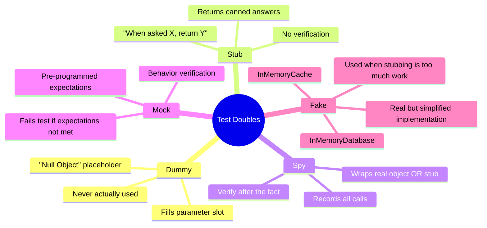
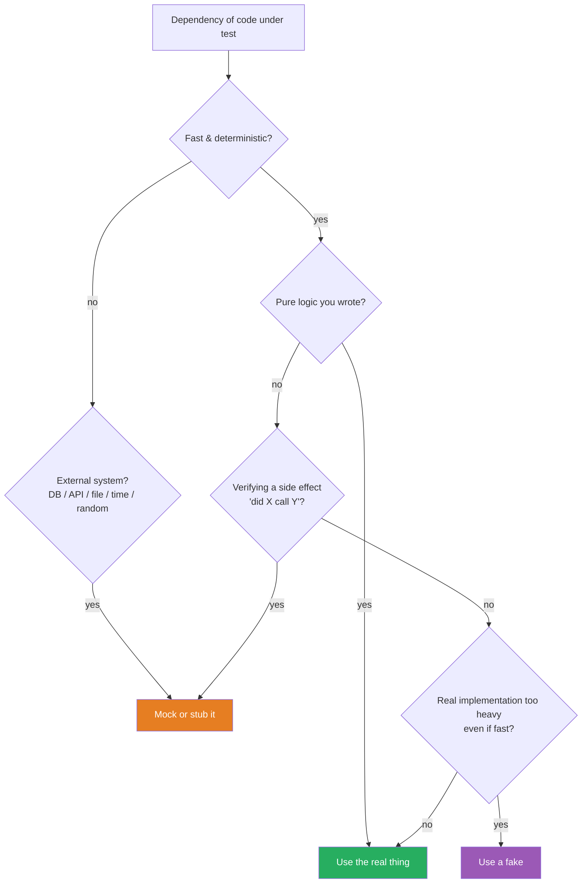
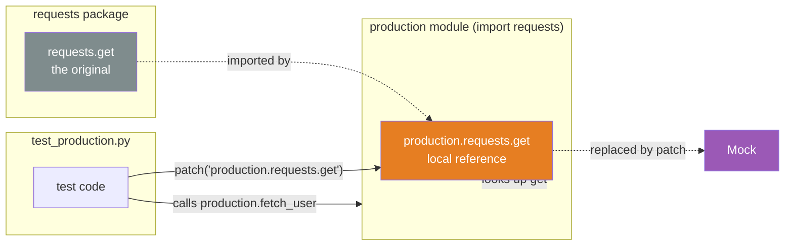
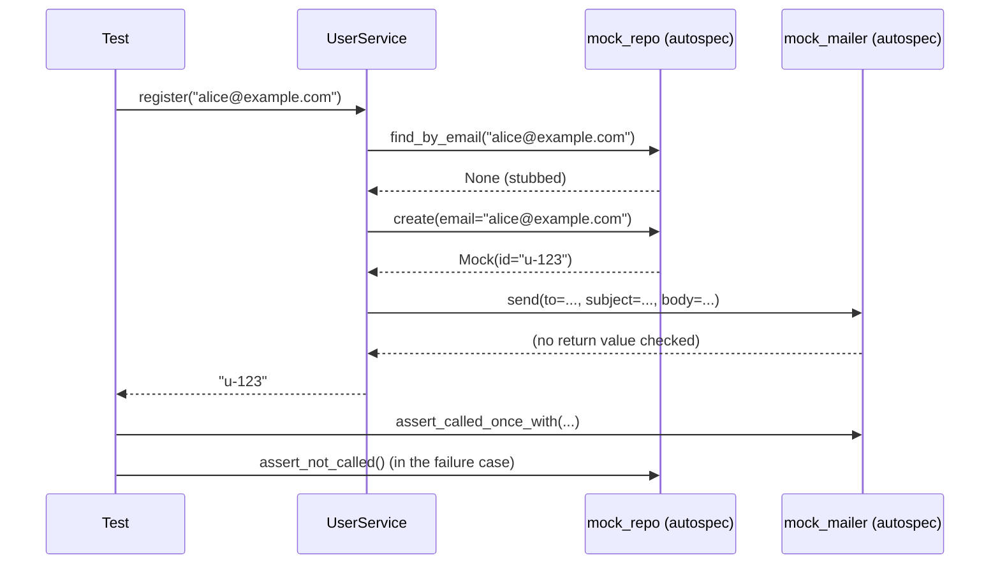
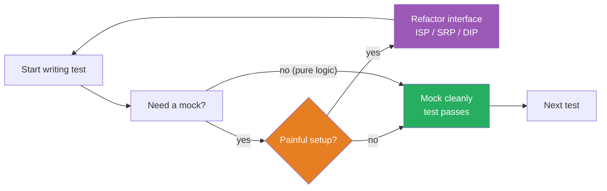

# Mocking and Stubs — Test Doubles in Python OOP

#oop #testing #mocking #test-doubles #unittest-mock #teaching #deep-dive

> [!quote] Martin Fowler — "TestDouble"
> "The term 'mock' is often used confusingly — sometimes to mean any kind of test double, sometimes to mean a specific kind. Gerard Meszaros's taxonomy of test doubles sorts this out."

A **test double** is any object that stands in for a real object during a test, the way a stunt double stands in for an actor. The umbrella term covers five specific roles — **dummy**, **stub**, **spy**, **mock**, and **fake** — and learning the difference matters: each solves a different testing problem.

This note covers the full taxonomy, when to (and when not to) use doubles, Python's `unittest.mock` toolkit (`Mock`, `MagicMock`, `patch`, `create_autospec`), the `pytest-mock` `mocker` fixture, mocking `datetime.now()` with `freezegun`, mocking `requests.get()`, and the king of mocking anti-patterns: **over-mocking**.

Prerequisites: [[Unit-Testing-OOP]], [[Dependency-Inversion]] (you cannot mock what you cannot inject), [[Composition-Over-Inheritance]].

---

## 1. The Test Double Taxonomy

Gerard Meszaros (in *xUnit Test Patterns*) and Martin Fowler use a shared vocabulary. Memorize these five:

| Double | Returns canned data? | Records calls? | Auto-fails on wrong calls? | Typical use |
|---|---|---|---|---|
| **Dummy** | No | No | No | Fills a parameter list, never used |
| **Stub** | Yes | No | No | "When asked X, return Y" |
| **Spy** | Real (or stub) | Yes | No | Record what was called, assert later |
| **Mock** | Maybe | Yes | Yes | "I expect `send` to be called with X; fail if not" |
| **Fake** | Real (simplified) | No | No | In-memory DB, in-memory cache |



> [!tip] Teaching Tip
> Tell students: a **stub** is the casino dealer — it just gives you the cards you asked for. A **spy** is the security camera — it watches what you do and tells the boss later. A **mock** is the bouncer — it knows exactly who should be on the list and kicks you out if you're not. The analogy sticks.

### 1.1 Dummy

```python
class OrderProcessor:
    def process(self, order, logger):     # logger required by signature
        # ... but this code path never calls logger
        return order.total

def test_process_returns_total():
    processor = OrderProcessor()
    fake_logger = None                    # dummy — never used by this path
    order = Order(total=100)
    assert processor.process(order, fake_logger) == 100
```

The `None` here is a dummy: the parameter is required by the signature, but the code under test doesn't use it on this path.

### 1.2 Stub

```python
def get_weather(city, weather_api):
    data = weather_api.fetch(city)
    return data["temperature"]

class FakeWeatherApi:
    def fetch(self, city):
        return {"temperature": 22}        # canned answer

def test_get_weather_returns_temperature():
    api = FakeWeatherApi()
    assert get_weather("Berlin", api) == 22
```

`FakeWeatherApi` is a stub: it returns a canned answer to `fetch`. It doesn't record what was asked.

### 1.3 Spy

```python
class SpyLogger:
    def __init__(self):
        self.calls = []
    def info(self, msg):
        self.calls.append(msg)

def test_processor_logs_correctly():
    spy = SpyLogger()
    process_order(order, spy)
    assert "Order 42 completed" in spy.calls
```

The spy records every call. The test inspects the recording after the fact — **state verification of the spy's history**.

### 1.4 Mock

A mock is pre-programmed with expectations. After the code runs, you call `.verify()` (or in Python's `unittest.mock`, you call `assert_called_with(...)`) and the mock fails the test if expectations weren't met.

```python
from unittest.mock import Mock

def test_processor_calls_send():
    mailer = Mock()
    mailer.send.return_value = True           # stub-like behavior
    process_signup(user="alice", mailer=mailer)
    mailer.send.assert_called_once_with("alice@example.com", "Welcome!")
```

`assert_called_once_with(...)` is the mock's expectation check. If `process_signup` didn't call `send` exactly once with those arguments, the mock fails the test.

### 1.5 Fake

```python
class InMemoryUserRepository:
    """A real repository interface, but stores users in a dict."""
    def __init__(self):
        self._data = {}
    def save(self, user):
        self._data[user.id] = user
    def get(self, user_id):
        return self._data.get(user_id)

def test_signup_persists_user():
    repo = InMemoryUserRepository()
    signup = SignupService(repo)
    signup.register("alice", "alice@example.com")
    assert repo.get("alice").email == "alice@example.com"
```

A fake has real behavior (you can `save` and then `get`), just simplified. Fakes are useful when stubbing every individual call would be more work than writing a small working implementation. They're also the closest to the real thing — your test exercises more realistic code paths.

---

## 2. When to Mock (and When Not To)

### 2.1 When to Mock

- **External services** — databases, HTTP APIs, message queues, file systems.
- **Non-determinism** — `datetime.now()`, `random.random()`, `time.sleep`.
- **Slow dependencies** — anything that would push a 1ms test past 100ms.
- **Hard-to-trigger errors** — `requests.get` raising `ConnectionError`, division by zero in the dependency.
- **Verifying a side effect** — "did the service call `mailer.send`?"

### 2.2 When NOT to Mock

- **Simple value objects** — `Money`, `Address`, `Coordinates`. They're already pure; just construct them.
- **Domain logic with no dependencies** — testing the real `Order.total` is more valuable than mocking it.
- **The class under test itself** — never mock `BankAccount` to test `BankAccount`. You'd be testing the mock.
- **Stable, fast utilities** — `str.upper`, `Decimal` arithmetic.

> [!warning] Common Student Misconception
> "Mock everything for unit tests." **No.** Each mock removes real behavior from your test. Mock only what is *non-deterministic, slow, or external*. Mocking a pure function doesn't make your test faster or more isolated — it makes it meaningless, because you've replaced the thing you actually want to verify.

The classic decision flow:



---

## 3. Python's Mocking Toolkit

### 3.1 `Mock` vs `MagicMock`

```python
from unittest.mock import Mock, MagicMock

m = Mock()
m.anything                  # returns a new child Mock
m.anything()                # returns another new Mock
m.foo("bar")
m.foo.assert_called_with("bar")

# Mock does NOT support magic methods:
# m + 1   # TypeError

mm = MagicMock()
mm + 1                      # returns a Mock — magic methods supported
len(mm)                     # returns a Mock
mm.__iter__.return_value = [1, 2, 3]
list(mm)                    # [1, 2, 3]
```

Use `MagicMock` whenever the code under test uses magic methods (`len`, iteration, `+`, comparison, context-manager protocol, etc.). Use plain `Mock` otherwise — it's stricter about not pretending to support operators.

### 3.2 `return_value` vs `side_effect`

```python
m = Mock()

# return_value: always returns this
m.fetch.return_value = {"temperature": 22}
m.fetch("Berlin")     # {"temperature": 22}
m.fetch("Paris")      # {"temperature": 22}

# side_effect: function called with the same args
m.fetch.side_effect = lambda city: {"temperature": 22 if city == "Berlin" else 18}
m.fetch("Berlin")     # {"temperature": 22}
m.fetch("Paris")      # {"temperature": 18}

# side_effect can also be a list/iterable (each call pops the next)
m.fetch.side_effect = [22, 18, 30]
m.fetch()             # 22
m.fetch()             # 18
m.fetch()             # 30

# side_effect as an exception raises it
m.fetch.side_effect = ConnectionError("timeout")
m.fetch()             # raises ConnectionError
```

| Feature | `return_value` | `side_effect` |
|---|---|---|
| What it does | Returns the same value every call | Calls the function / iterates the list / raises the exception |
| When to use | Canned answer | Input-dependent answer, sequence, exception |
| Stops on raise? | No | Yes if it raises |

### 3.3 `patch` — Replacing Objects in Place

`unittest.mock.patch` replaces an attribute of a module (or class) for the duration of a test, then restores it. This is how you mock things your code accesses via imports — without changing the production code.

```python
# production.py
import requests

def fetch_user(user_id):
    r = requests.get(f"https://api.example.com/users/{user_id}")
    r.raise_for_status()
    return r.json()
```

```python
# test_production.py
from unittest.mock import patch
import production

def test_fetch_user_returns_json():
    fake_response = Mock()
    fake_response.json.return_value = {"id": 1, "name": "Alice"}
    fake_response.raise_for_status.return_value = None

    with patch("production.requests.get", return_value=fake_response) as mock_get:
        result = production.fetch_user(1)

    assert result == {"id": 1, "name": "Alice"}
    mock_get.assert_called_once_with("https://api.example.com/users/1")
```

> [!warning] Common Student Misconception — Patching at the Wrong Site
> Students often write `patch("requests.get")` instead of `patch("production.requests.get")`. **This rarely does what you want.** The production module has already done `import requests` and bound `requests.get` into *its own* namespace. Patching the global `requests.get` does not change what `production` sees. Always patch **where the name is looked up**, not where it's defined.
>
> Mnemonic: **patch at the import site, not at the definition site.**



### 3.4 Patching a Class and Patching an Instance Method

```python
from unittest.mock import patch, Mock
import production

# Patch an entire class — every method on it becomes a Mock
with patch("production.requests.Session") as MockSession:
    instance = MockSession.return_value   # what calling Session() returns
    instance.get.return_value.json.return_value = {"ok": True}
    production.use_session()

# Patch a specific method on a specific instance
acc = BankAccount("Alice", Decimal("100"))
with patch.object(acc, "_ensure_open") as m:
    acc.withdraw(Decimal("50"))
    m.assert_called_once()
```

### 3.5 Decorator Form vs Context Manager Form

```python
# Decorator form — patches are passed as args in reverse order
@patch("production.requests.get")
@patch("production.time.sleep")
def test_decorated(mock_sleep, mock_get):    # bottom-up: get was on top, sleep below
    mock_get.return_value.json.return_value = {"id": 1}
    production.fetch_user(1)
    mock_sleep.assert_called()

# Context manager form — order is explicit, no arg-passing trickery
def test_context():
    with patch("production.time.sleep") as mock_sleep, \
         patch("production.requests.get") as mock_get:
        mock_get.return_value.json.return_value = {"id": 1}
        production.fetch_user(1)
        mock_sleep.assert_called()
```

Most teams prefer the context-manager form: it's easier to read and avoids the reverse-order gotcha.

### 3.6 `create_autospec` — Type-Safe Mocks

A plain `Mock()` will happily accept *any* method call, even ones that don't exist on the real class. `create_autospec` builds a mock from the spec of a real class, so calling a non-existent method raises `AttributeError` at test time — catching typos and refactoring drift.

```python
from unittest.mock import create_autospec
from mailer import Mailer

mock_mailer = create_autospec(Mailer, instance=True)
mock_mailer.send.return_value = True

# OK
mock_mailer.send("alice@example.com", "Welcome!")

# TypeError — wrong signature
mock_mailer.send("alice@example.com")         # missing required arg

# AttributeError — method doesn't exist on Mailer
mock_mailer.nonexistent_method()              # raises
```

Use `create_autospec` for any non-trivial dependency; the safety net pays for itself the first time someone renames a method.

### 3.7 `pytest-mock` — The `mocker` Fixture

The `pytest-mock` plugin provides a `mocker` fixture that wraps `unittest.mock` with a friendlier API and automatic cleanup:

```python
def test_fetch_user(mocker):
    fake_response = mocker.Mock()
    fake_response.json.return_value = {"id": 1, "name": "Alice"}
    fake_response.raise_for_status.return_value = None

    mock_get = mocker.patch("production.requests.get", return_value=fake_response)

    result = production.fetch_user(1)

    assert result == {"id": 1, "name": "Alice"}
    mock_get.assert_called_once_with("https://api.example.com/users/1")
```

`mocker.patch` cleans itself up automatically at the end of the test, even if the test raised. It also exposes `mocker.spy`, `mocker.stub`, and `mocker.patch.object` for one-liners.

---

## 4. Worked Example — UserService and Mailer

The canonical DIP example from [[Dependency-Inversion]] needs tests. Here is the full setup with mocks.

```python
# user_service.py
class UserService:
    def __init__(self, repository, mailer):
        self._repository = repository
        self._mailer = mailer

    def register(self, email: str) -> str:
        if self._repository.find_by_email(email) is not None:
            raise ValueError(f"user {email} already exists")
        user = self._repository.create(email=email)
        self._mailer.send(
            to=email,
            subject="Welcome",
            body=f"Hi {email}, welcome aboard!",
        )
        return user.id
```

```python
# test_user_service.py
import pytest
from unittest.mock import Mock, create_autospec
from user_service import UserService
from mailer import Mailer
from repository import UserRepository

class TestUserServiceRegister:
    @pytest.fixture
    def mock_repo(self):
        return create_autospec(UserRepository, instance=True)

    @pytest.fixture
    def mock_mailer(self):
        return create_autospec(Mailer, instance=True)

    @pytest.fixture
    def service(self, mock_repo, mock_mailer):
        return UserService(mock_repo, mock_mailer)

    def test_register_returns_new_user_id(self, service, mock_repo):
        mock_repo.find_by_email.return_value = None
        new_user = Mock(id="u-123")
        mock_repo.create.return_value = new_user

        result = service.register("alice@example.com")

        assert result == "u-123"

    def test_register_creates_user_with_email(self, service, mock_repo):
        mock_repo.find_by_email.return_value = None
        mock_repo.create.return_value = Mock(id="u-123")

        service.register("alice@example.com")

        mock_repo.create.assert_called_once_with(email="alice@example.com")

    def test_register_sends_welcome_email(self, service, mock_repo, mock_mailer):
        mock_repo.find_by_email.return_value = None
        mock_repo.create.return_value = Mock(id="u-123")

        service.register("alice@example.com")

        mock_mailer.send.assert_called_once_with(
            to="alice@example.com",
            subject="Welcome",
            body="Hi alice@example.com, welcome aboard!",
        )

    def test_register_raises_if_user_already_exists(self, service, mock_repo):
        mock_repo.find_by_email.return_value = Mock(id="u-existing")

        with pytest.raises(ValueError, match="already exists"):
            service.register("alice@example.com")

        # Important: nothing else should have happened
        mock_repo.create.assert_not_called()
        mock_mailer.send.assert_not_called()

    def test_register_does_not_send_email_if_create_fails(self, service, mock_repo, mock_mailer):
        mock_repo.find_by_email.return_value = None
        mock_repo.create.side_effect = RuntimeError("DB down")

        with pytest.raises(RuntimeError, match="DB down"):
            service.register("alice@example.com")

        mock_mailer.send.assert_not_called()
```



Notice the third test, `test_register_sends_welcome_email`, is **behavior verification**: we're not checking the return value of `register`, we're checking *what `register` did to the mailer*. This is the legitimate use of mocks — checking side effects on a dependency you don't want to actually run (no real emails during tests!).

---

## 5. Mocking Time with `freezegun`

`datetime.now()` is non-deterministic — every test run gets a different answer. That breaks the "repeatable" rule of unit testing. The `freezegun` library lets you freeze the clock:

```python
# coupon.py
from datetime import datetime, timedelta

class Coupon:
    def __init__(self, code: str, expires_at: datetime):
        self.code = code
        self.expires_at = expires_at

    def is_valid(self) -> bool:
        return datetime.now() < self.expires_at

    def days_remaining(self) -> int:
        delta = self.expires_at - datetime.now()
        return max(delta.days, 0)
```

```python
# test_coupon.py
from datetime import datetime, timedelta
from freezegun import freeze_time
from coupon import Coupon

@freeze_time("2025-01-15 12:00:00")
def test_coupon_valid_before_expiry():
    coupon = Coupon("WELCOME", datetime(2025, 1, 20))
    assert coupon.is_valid() is True

@freeze_time("2025-01-25 12:00:00")
def test_coupon_invalid_after_expiry():
    coupon = Coupon("WELCOME", datetime(2025, 1, 20))
    assert coupon.is_valid() is False

@freeze_time("2025-01-15 12:00:00")
def test_days_remaining_is_five():
    coupon = Coupon("WELCOME", datetime(2025, 1, 20))
    assert coupon.days_remaining() == 5

def test_days_remaining_decreases_over_time():
    coupon = Coupon("WELCOME", datetime(2025, 1, 20))
    with freeze_time("2025-01-15"):
        assert coupon.days_remaining() == 5
    with freeze_time("2025-01-18"):
        assert coupon.days_remaining() == 2
```

Why `freezegun` instead of `patch("coupon.datetime.now")`? Because `datetime.now` is a C-level built-in method that doesn't patch cleanly, and because `freezegun` patches *every* `datetime` access site (including code inside third-party libraries you call). It's the right tool.

The same pattern applies to `random`:

```python
def test_shuffle_with_seeded_random():
    with patch("random.random", return_value=0.5):
        # code that uses random.random() is now deterministic
        ...
```

For `random`, prefer injecting a `random.Random(seed)` instance (DIP) over patching the global module — but patching is acceptable for one-off tests.

---

## 6. Mocking `requests.get`

HTTP calls are slow, need a network, and are non-deterministic (the server might be down). Three common mocking approaches:

### 6.1 Patch `requests.get` directly

```python
# weather.py
import requests

def get_temperature(city: str) -> float:
    r = requests.get(f"https://api.weather.com/{city}")
    r.raise_for_status()
    return r.json()["temperature"]

# test_weather.py
from unittest.mock import patch, Mock
import weather

def test_get_temperature_returns_value():
    fake_response = Mock()
    fake_response.json.return_value = {"temperature": 22.5}
    fake_response.raise_for_status.return_value = None

    with patch("weather.requests.get", return_value=fake_response) as mock_get:
        result = weather.get_temperature("Berlin")

    assert result == 22.5
    mock_get.assert_called_once_with("https://api.weather.com/Berlin")

def test_get_temperature_raises_on_http_error():
    fake_response = Mock()
    fake_response.raise_for_status.side_effect = Exception("500 Server Error")

    with patch("weather.requests.get", return_value=fake_response):
        with pytest.raises(Exception, match="500"):
            weather.get_temperature("Berlin")
```

### 6.2 Use `responses` library for richer HTTP mocking

```python
import responses
import weather

@responses.activate
def test_get_temperature_uses_responses():
    responses.add(
        responses.GET,
        "https://api.weather.com/Berlin",
        json={"temperature": 22.5},
        status=200,
    )
    assert weather.get_temperature("Berlin") == 22.5
```

`responses` intercepts the actual `requests` call and matches URLs/methods — closer to integration testing but still offline. Use it when patching `get` becomes brittle (multiple URLs, query strings, headers).

### 6.3 Use `httpx` + `respx` for modern async HTTP

If you've moved to `httpx`, `respx` is the analog of `responses` and supports async.

---

## 7. Over-Mocking — the Anti-Pattern

> [!danger] Over-mocking smell
> If your test file imports `unittest.mock` more times than the production module, you're testing mocks, not code.

Symptoms of over-mocking:

1. **Tests pass but production fails.** You mocked so much that the real wiring was never exercised.
2. **Every refactor breaks 30 tests.** Mocks are coupled to call sites, so a renamed method or reordered argument causes cascading test failures.
3. **Test setup is longer than the production code.** You're spending more time maintaining mocks than the feature.
4. **Mocks return mocks that return mocks.** `m.return_value.json.return_value.items.return_value = ...` is a code smell.

```python
# ❌ Over-mocked — testing the mock framework, not the logic
def test_discount_calculation():
    mock_user = Mock()
    mock_user.profile.tier.discount_multiplier.return_value = 0.9
    mock_user.cart.total.return_value = 100
    mock_user.cart.items.__iter__.return_value = [Mock(price=100, quantity=1)]
    # ... three more lines of setup ...

    result = calculate_discount(mock_user)

    assert result == 90   # this only passed because we told it to
```

```python
# ✅ Use real value objects
def test_discount_calculation():
    user = User(profile=Profile(tier=Tier.GOLD), cart=Cart(items=[Item(price=100, qty=1)]))

    result = calculate_discount(user)

    assert result == 90   # now the test means something
```

### 7.1 The Fix

1. **Prefer fakes over mocks** for your own abstractions — an `InMemoryRepository` is more stable than `mock_repo.save.assert_called_with(...)`.
2. **Inject dependencies via constructor** (DIP) so tests can substitute without `patch`.
3. **Use `create_autospec`** so mock signatures stay in sync with the real interface.
4. **Mock at the boundary** (HTTP, DB, file, time), not inside your domain.
5. **Reserve mocks for behavior verification** (did the right side effect happen?). Use stubs for return values.

```mermaid
flowchart TB
    subgraph Bad["❌ Over-mocked test"]
        B1[mock User] --> B2[mock profile]
        B2 --> B3[mock tier]
        B3 --> B4[mock discount_multiplier]
        B4 --> B5[stub return 0.9]
        B5 --> B6[assert result == 90<br/>passes by construction]
    end
    subgraph Good["✅ Boundary-only mocking"]
        G1[real User object] --> G2[real Profile]
        G2 --> G3[real Tier]
        G3 --> G4[real calculate_discount]
        G4 --> G5[real DB? mock it]
        G5 --> G6[mock only the DB]
        G6 --> G7[assert result == 90<br/>tests the actual logic]
    end
    style Bad fill:#2d1b1b,stroke:#e74c3c,color:#fff
    style Good fill:#1b2d1b,stroke:#2ecc71,color:#fff
```



---

## 8. Mock Verification Patterns — Cheat Sheet

| Assertion | Meaning |
|---|---|
| `m.assert_called()` | Called at least once |
| `m.assert_called_once()` | Called exactly once |
| `m.assert_called_with(a, b)` | The most recent call was with `(a, b)` |
| `m.assert_called_once_with(a, b)` | Called exactly once, with `(a, b)` |
| `m.assert_any_call(a, b)` | `(a, b)` is among the recorded calls |
| `m.assert_not_called()` | Never called |
| `m.call_count` | Integer number of calls |
| `m.call_args` | The most recent call's args (a `call` object) |
| `m.call_args_list` | All calls, in order |
| `m.reset_mock()` | Clear recorded calls (useful between phases of one test) |

```python
m = Mock()
m("first")
m("second", kw="v")

assert m.call_count == 2
assert m.call_args == m.call("second", kw="v")
assert m.call_args_list == [m.call("first"), m.call("second", kw="v")]
m.assert_any_call("first")
m.assert_called_with("second", kw="v")   # most recent
```

---

## 9. Summary Table — When to Reach for Which Double

| Need | Reach for |
|---|---|
| Fill an unused parameter | Dummy (`None` or a placeholder) |
| Return canned data | Stub (`Mock` with `return_value`) |
| Verify a side effect happened | Mock (`assert_called_*`) |
| Verify a sequence of calls | Mock (`call_args_list`) |
| Record calls but keep real behavior | Spy (wrap real object, `mocker.spy`) |
| Replace a real DB for many tests | Fake (`InMemoryRepository`) |
| Mock a class's methods safely | `create_autospec` |
| Mock an import | `patch("module.attr")` at the import site |
| Freeze time | `freezegun.freeze_time` |
| Mock HTTP | `responses` / `respx` (or `patch`) |
| Mock random | Inject `random.Random(seed)` (DIP) |

---

## 10. Common Gotchas

### 10.1 The `spec` Trap

`Mock(spec=SomeClass)` is similar to `create_autospec(SomeClass, instance=True)`, but with a subtle difference: `spec` only validates *attribute access* — it does not enforce the call signature. `create_autospec` validates both. Always prefer `create_autospec` when you want signature safety.

```python
from unittest.mock import Mock, create_autospec

class Mailer:
    def send(self, to: str, subject: str, body: str) -> bool: ...

m1 = Mock(spec=Mailer)
m1.send("alice")              # passes — spec doesn't check signature

m2 = create_autospec(Mailer, instance=True)
m2.send("alice")             # TypeError — missing subject and body
```

### 10.2 Patches Leak Without `with`

```python
def test_bad_patch():
    patch("production.requests.get", return_value=Mock()).start()
    # ... test ...
    # patch is still active! Affects later tests.
```

Always use the context manager form (`with patch(...) as m:`) or the decorator form. `mocker.patch` (from `pytest-mock`) handles cleanup automatically. The bare `.start()` form requires you to call `.stop()`, and forgetting it produces flaky tests that pass alone and fail in the suite.

### 10.3 Mocking Built-in Methods

```python
# ❌ Won't work — datetime.now is a built-in method
with patch("datetime.datetime.now", return_value=...):
    ...

# ✅ Use freezegun instead
@freeze_time("2025-01-15"):
def test_with_frozen_time():
    ...
```

Some built-ins can't be patched cleanly because they're implemented in C. Reach for the dedicated tool (`freezegun` for time, `responses` for HTTP) instead of fighting `unittest.mock`.

### 10.4 The "Setup in a Loop" Smell

```python
def test_many_inputs():
    for amount in [Decimal("10"), Decimal("50"), Decimal("100")]:
        acc = BankAccount("Alice", Decimal("100"))
        acc.withdraw(amount)
        assert acc.balance == Decimal("100") - amount
```

If one input fails, the test stops and the other inputs never run. You get one failure instead of three. Replace with `@pytest.mark.parametrize` so each input is its own case.

### 10.5 Mocking What You Don't Own

Mocking third-party classes is fragile — their internal API can change between versions, and your mocks won't notice. Prefer:

1. Wrap the third-party call in your own thin adapter (e.g., `EmailGateway` wrapping `smtplib`).
2. Mock *your* adapter in tests.
3. Have one integration test that exercises the real adapter against a sandbox.

This is the [[Hexagonal-Architecture|Hexagonal]] / Ports-and-Adapters idea: mock at the *port* (your interface), not at the *adapter* (their code).

### 10.6 The `call_args` vs `call_args_list` Confusion

`m.call_args` returns the **most recent** call as a `call` object. `m.call_args_list` returns *all* calls. Students often check `call_args` after several calls and conclude the mock was called only once — when in fact it was called many times and they're seeing the last one.

```python
m = Mock()
m("first")
m("second")
m("third")

m.call_args                  # call("third")         ← most recent only
m.call_args_list             # [call("first"), call("second"), call("third")]
m.call_count                 # 3
```

If you care about the *sequence* of calls, use `call_args_list` (or `assert_has_calls` with `any_order=False`). If you care about *one specific* call, `assert_any_call` is safer than inspecting `call_args`.

### 10.7 Mocks Are Not Stubs — Don't Mix Roles

A common confusion: using a stub where you want a mock, or vice versa. If you only need canned return values, use a stub (don't bother with `assert_called_*`). If you need to verify interactions, use a mock. Don't slap `assert_called_once_with` on every test "just in case" — each unnecessary assertion is a coupling that breaks on the next refactor.

---

## 11. Mocking and TDD — A Virtuous Cycle

Used well, mocks create a virtuous cycle with [[TDD-With-OOP]]:

1. You start a test for `UserService.register`.
2. The test needs a `Mailer`. You reach for `create_autospec(Mailer, instance=True)`.
3. The mock setup is annoying — `Mailer` has 12 methods, your test cares about 1.
4. That pain is *information*: maybe `Mailer` violates [[Interface-Segregation|ISP]] and should be split into `WelcomeMailer` and `NotificationMailer`.
5. You split the interface. The test becomes simpler. Production code becomes more cohesive.

The mock didn't just enable the test — it improved the design. This is Kent Beck's "Test-Driven Design" in action: **the friction of mocking is a design signal**.

Conversely, when mocking is *easy*, that's a signal that the design is good — small interfaces, injected dependencies, single responsibility.



> [!tip] Teaching Tip
> When students complain "mocking is hard", ask: *which part* is hard? If it's "I have to mock too many things", they've found an SRP violation. If it's "the mock setup is verbose", they've found an ISP violation. If it's "I can't substitute the dependency at all", they've found a DIP violation. Each complaint maps to a SOLID principle. That's the whole point.

---

## 12. See Also

- [[Unit-Testing-OOP]] — what mocks enable: isolated unit tests
- [[TDD-With-OOP]] — mocks as a design pressure: "if I can't mock this, my design is wrong"
- [[Test-Patterns]] — fixture organization that supports mocking
- [[Dependency-Inversion]] — the design principle that makes mocking unnecessary for *good* code
- [[Interface-Segregation]] — why small interfaces are easier to mock
- [[Composition-Over-Inheritance]] — why composition + DI is the most mockable design
- [[Service-Layer]] — the architectural layer where mocks live most often
- [[Repository-Pattern]] — the canonical boundary for swapping a real DB for a fake
- [[Hexagonal-Architecture]] — "mock at the port, not the adapter"
