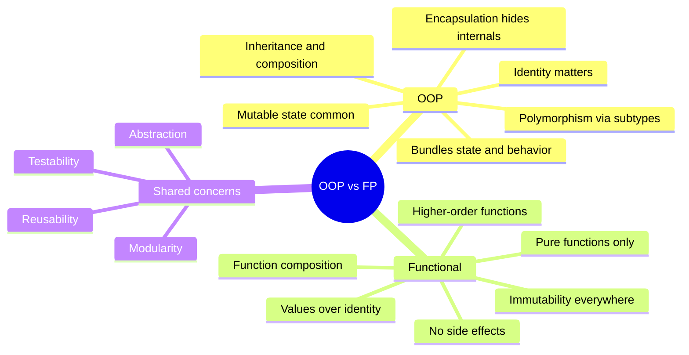
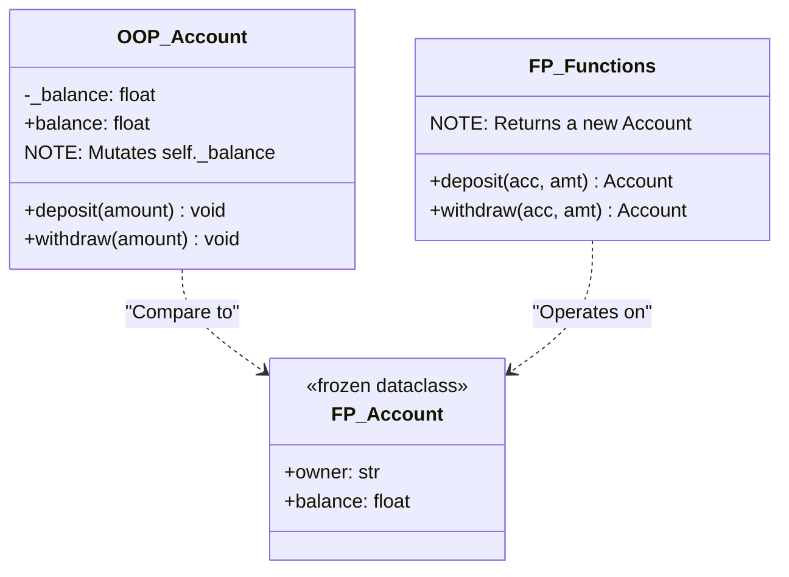
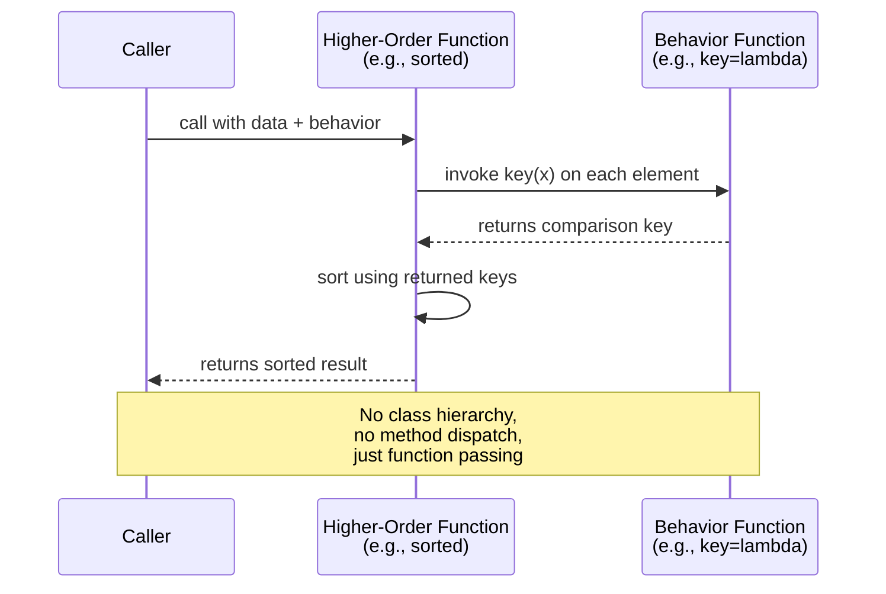
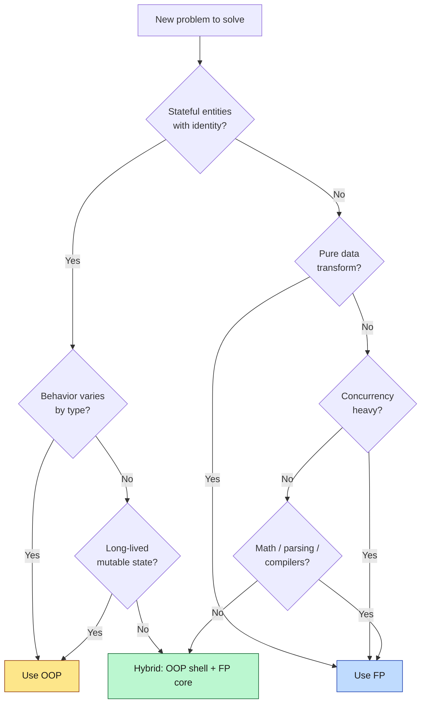
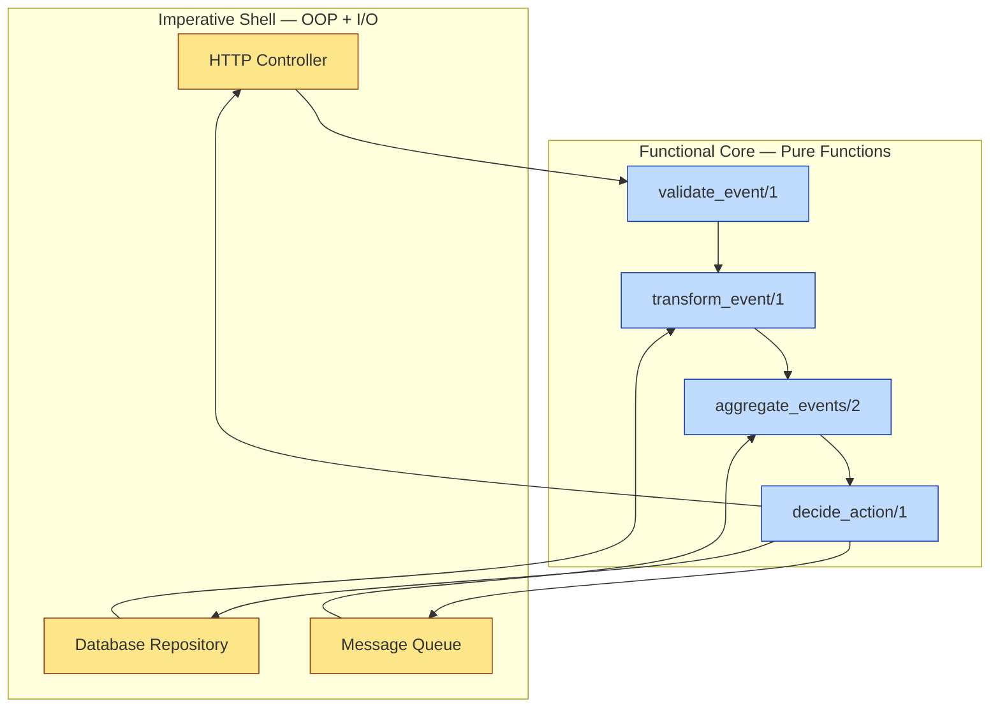
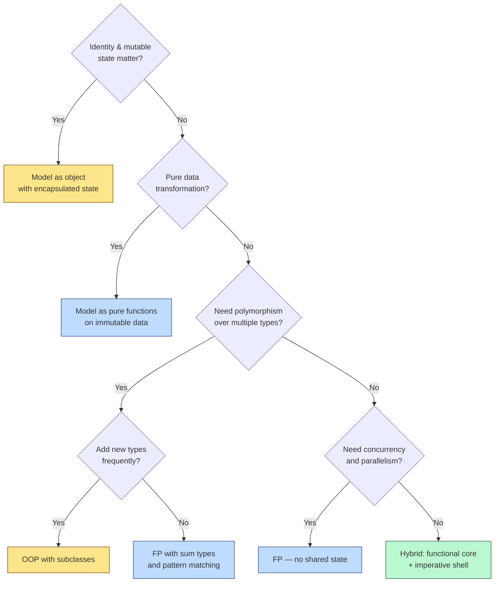

# OOP vs Functional Programming — Two Paradigms Head-to-Head

#oop #functional #paradigms #comparison #teaching #deep-dive

> [!quote] John Hughes — *Why Functional Programming Matters*
> "Functional programming is so called because a program consists entirely of functions… A program works through the controlled application of functions to arguments."

> [!quote] Alan Kay — *The Early History of Smalltalk*
> "OOP to me means only messaging, local retention and protection and hiding of state-process, and extreme late-binding of all things."

Two paradigms dominate modern software: **Object-Oriented Programming (OOP)** and **Functional Programming (FP)**. They are not enemies — they are *complementary lenses* for thinking about code. OOP models the world as **objects with state and behavior**. FP models the world as **pure transformations of immutable data**.

Python is firmly multi-paradigm: you can write idiomatic OOP, idiomatic FP, or (most often) a blend. This note compares the two paradigms head-to-head, solves the same problem both ways, explains where each paradigm wins, and outlines the modern **"functional core, imperative shell"** architecture that combines the best of both.

Prerequisites: [[What-Is-OOP]], [[Encapsulation]], [[OOP-Paradigms]], [[Composition-Over-Inheritance]].

---

## 1. The Two Paradigms Head-to-Head

### 1.1 OOP in One Sentence

> OOP bundles **state** and **behavior** together inside **objects**, and uses **message passing** (method calls) to coordinate them.

State lives inside objects. Methods mutate that state. Identity matters: two `Account` objects with the same balance are still *different* accounts. Reuse comes from **inheritance** (is-a) and **composition** (has-a). Polymorphism dispatches behavior based on the runtime type of the receiver.

### 1.2 Functional Programming in One Sentence

> FP treats computation as the evaluation of **pure functions** over **immutable data**, and builds programs by **composing** small functions into larger ones.

Data is immutable; functions return *new* data rather than mutating existing data. The same input *always* produces the same output. Reuse comes from **function composition** (`f(g(h(x)))`) and **higher-order functions** (functions that take or return functions).

### 1.3 Side-by-Side Comparison Table

| Aspect | OOP | Functional |
|---|---|---|
| Core unit | Object (state + behavior) | Pure function (input → output) |
| State | Mutable, encapsulated in objects | Avoided; immutability preferred |
| Side effects | Common (methods mutate object) | Forbidden in pure code |
| Data | Bundled with behavior | Separate from behavior |
| Reuse | Inheritance, composition, polymorphism | Function composition, higher-order functions |
| Identity | Two objects can be `==` but not `is` | Values are interchangeable if `==` |
| Control flow | Method dispatch, conditionals | Recursion, function application |
| Concurrency | Hard (shared mutable state) | Easy (no shared state to corrupt) |
| Testing | Mock object state, set up fixtures | Just call the function with inputs |
| Mental model | "Who does what to whom?" | "What transforms into what?" |
| Best fit | GUIs, games, business domains, simulations | Data pipelines, compilers, financial calc, parallel systems |



---

## 2. Same Problem, Two Paradigms — A Bank Account

The classic teaching example is a **bank account** that supports deposits and withdrawals. The behavioral spec is identical:

- Starts with an opening balance
- `deposit(amount)` adds to balance, refuses negatives
- `withdraw(amount)` removes from balance, refuses overdraft
- `balance` is queryable

### 2.1 OOP Version — Mutable State Inside an Object

```python
# oop_account.py
from dataclasses import dataclass

class InsufficientFunds(Exception):
    pass

class Account:
    def __init__(self, owner: str, balance: float = 0.0) -> None:
        self.owner = owner
        self._balance = balance          # mutable, encapsulated

    @property
    def balance(self) -> float:
        return self._balance

    def deposit(self, amount: float) -> None:
        if amount < 0:
            raise ValueError("Cannot deposit negative amount")
        self._balance += amount           # MUTATION — side effect

    def withdraw(self, amount: float) -> None:
        if amount < 0:
            raise ValueError("Cannot withdraw negative amount")
        if amount > self._balance:
            raise InsufficientFunds(f"{self.owner} cannot withdraw {amount}")
        self._balance -= amount           # MUTATION — side effect

    def __repr__(self) -> str:
        return f"Account(owner={self.owner!r}, balance={self._balance:.2f})"


# Usage — note that we MUTATE the same object
acc = Account("Ada", 100.0)
acc.deposit(50.0)
acc.withdraw(30.0)
print(acc)              # Account(owner='Ada', balance=120.00)
print(acc.balance)      # 120.0
```

### 2.2 Functional Version — Immutable Data + Pure Functions

```python
# fp_account.py
from dataclasses import dataclass, replace

class InsufficientFunds(Exception):
    pass

@dataclass(frozen=True)                   # IMMUTABLE
class Account:
    owner: str
    balance: float = 0.0

# Pure functions: take an Account, return a NEW Account
def deposit(account: Account, amount: float) -> Account:
    if amount < 0:
        raise ValueError("Cannot deposit negative amount")
    return replace(account, balance=account.balance + amount)

def withdraw(account: Account, amount: float) -> Account:
    if amount < 0:
        raise ValueError("Cannot withdraw negative amount")
    if amount > account.balance:
        raise InsufficientFunds(f"{account.owner} cannot withdraw {amount}")
    return replace(account, balance=account.balance - amount)


# Usage — note that we rebind the variable, never mutate
acc = Account("Ada", 100.0)
acc = deposit(acc, 50.0)                   # returns a new Account
acc = withdraw(acc, 30.0)                  # returns a new Account
print(acc)                                 # Account(owner='Ada', balance=120.0)

# The original is still intact — useful for audit trails!
original = Account("Ada", 100.0)
after_deposit = deposit(original, 50.0)
print(original)        # Account(owner='Ada', balance=100.0)  ← unchanged
print(after_deposit)   # Account(owner='Ada', balance=150.0)
```

### 2.3 What Just Happened?



> [!teaching-tip] Teaching Tip
> Have students trace what happens to `acc` in the OOP version vs the FP version. In OOP, there is *one* object whose state changes over time. In FP, there are *three* objects (`original`, `after_deposit`, `final`), each representing a point-in-time snapshot. The FP version is essentially **event sourcing** for free.

> [!warning] Common Student Misconception
> "The FP version is just more verbose and pointless." — *Wrong.* The verbosity buys you **referential transparency**: any `Account` value is interchangeable with any other `Account` value with the same fields. This makes concurrency trivial (no shared state to corrupt), testing trivial (just call the function), and reasoning trivial (no hidden mutations to track).

---

## 3. Key Differences in Depth

### 3.1 State — Mutable vs Immutable

In OOP, **state is mutable and central**. Objects *are* their state. Mutations happen in-place via methods, and reasoning about the program requires tracking *when* each mutation occurs.

In FP, **state is replaced, not mutated**. Instead of changing `acc.balance`, you produce a *new* `Account` with the updated balance. The old value still exists; you simply stop referring to it.

The consequences are profound:

```python
# OOP: shared mutable state — classic bug source
class Cart:
    def __init__(self):
        self.items = []
    def add(self, item):
        self.items.append(item)

cart = Cart()
discounted_items = cart.items           # alias, not copy!
discounted_items.append("FREE_GIFT")    # mutates cart.items too!
print(cart.items)                       # ['FREE_GIFT']  ← surprise bug

# FP: no mutation, no aliasing bug
from dataclasses import dataclass

@dataclass(frozen=True)
class Cart:
    items: tuple = ()                   # immutable

    def add(self, item):
        return Cart(self.items + (item,))

cart = Cart()
cart2 = cart.add("book")
print(cart)                             # Cart(items=())       ← unchanged
print(cart2)                            # Cart(items=('book',))
```

### 3.2 Side Effects — Common vs Forbidden

A **side effect** is any observable interaction with the outside world: writing to disk, printing, mutating a global, throwing exceptions, calling a network API.

OOP methods routinely have side effects (mutating `self`, calling other objects). FP rigorously separates **pure functions** (no side effects, deterministic) from **impure functions** (side-effectful, non-deterministic). Pure functions are trivially testable, cacheable, and parallelizable.

### 3.3 Reuse — Inheritance/Composition vs Function Composition

```python
# OOP reuse: inheritance
class Animal:
    def eat(self): ...
class Dog(Animal):
    def bark(self): ...

# FP reuse: function composition
def feed(animal): return {"fed": animal}
def groom(animal): return {"groomed": animal}
def vet_visit(animal): return {"vet_checked": animal}

def full_service(animal):
    return vet_visit(groom(feed(animal)))    # compose
```

### 3.4 Concurrency — Hard vs Easy

> [!info] The Fundamental Problem of Concurrency
> Concurrent access to **shared mutable state** requires locks, mutexes, semaphores — and is the source of countless race conditions, deadlocks, and Heisenbugs.

OOP's model assumes objects hold mutable state, which means concurrent OOP programs need careful synchronization. FP's model — no mutation, no shared state — is **concurrency-safe by construction**. Two threads can both call `deposit(acc, 50)` and the result is well-defined: each call produces its own new `Account`; they never interfere.

### 3.5 Testing — Mock State vs Just Call the Function

```python
# OOP testing: need to set up object state, sometimes mock dependencies
def test_account_withdraw():
    acc = Account("Ada", 100.0)
    acc.withdraw(30.0)
    assert acc.balance == 70.0

# FP testing: just call the function with inputs
def test_account_withdraw():
    acc = Account("Ada", 100.0)
    result = withdraw(acc, 30.0)
    assert result.balance == 70.0
    assert acc.balance == 100.0          # original untouched — extra guarantee
```

The FP test gives you an extra assertion for free: the input is untouched. No mocks, no fixtures, no `setUp`/`tearDown`.

### 3.6 Referential Transparency and Memoization

A function is **referentially transparent** if you can replace any call to it with its return value without changing the program's behavior. This is true of pure functions and false of impure ones.

Referential transparency unlocks several superpowers:

- **Memoization** — cache the result of expensive pure function calls. Same input → same cached output.
- **Equational reasoning** — substitute equals for equals, like in algebra. Refactoring is provably safe.
- **Lazy evaluation** — only compute what's actually used. Haskell is lazily evaluated by default.
- **Parallelism** — pure calls can run in any order (or in parallel) without affecting the result.

```python
# Memoization — only works because the function is pure
from functools import lru_cache

@lru_cache(maxsize=None)
def fib(n: int) -> int:
    if n < 2:
        return n
    return fib(n - 1) + fib(n - 2)

# First call: O(2^n)
print(fib(40))   # fast — cached after first call
# Subsequent calls: O(1)
print(fib(40))   # instant

# This would be WRONG if fib printed or wrote to disk — those side effects
# would happen only once, breaking the program.
```

In OOP, methods that mutate `self` are **not referentially transparent**. `acc.withdraw(50)` cannot be replaced with `None` (its return value) — the call had a side effect on `acc`. This is why memoizing OOP methods is dangerous and rarely done.

### 3.7 Persistent Data Structures

A naive concern: "If FP creates a new data structure on every change, isn't it O(n) slow?" Answer: **persistent data structures** share structure between old and new versions, achieving O(log n) or even O(1) updates.

```python
# Naive FP copy — O(n) per update
def add_item(items: tuple, item) -> tuple:
    return items + (item,)   # O(n) copy

# Persistent dict (using `pyrsistent` library)
from pyrsistent import pvector, pmap

v1 = pvector([1, 2, 3])
v2 = v1.append(4)            # O(log n) — shares structure with v1
print(v1)                    # pvector([1, 2, 3])  ← unchanged
print(v2)                    # pvector([1, 2, 3, 4])

m1 = pmap({"a": 1, "b": 2})
m2 = m1.set("c", 3)          # O(log n) — shares structure
print(m1)                    # pmap({'a': 1, 'b': 2})
print(m2)                    # pmap({'a': 1, 'b': 2, 'c': 3})
```

Languages like Clojure and Scala make persistent data structures the default. In Python, `tuple` is persistent for sequences; `frozen dataclass` + `replace` is persistent for records; the `pyrsistent` library adds persistent vectors, maps, and sets.

### 3.8 Higher-Order Functions — The FP Equivalent of Polymorphism

In OOP, polymorphism dispatches on the receiver's type. In FP, **higher-order functions** abstract over behavior — you pass the behavior as an argument.

```python
# OOP: polymorphism via subtype
class Sorter(ABC):
    @abstractmethod
    def less_than(self, a, b) -> bool: ...
    def sort(self, items):
        # ... uses self.less_than internally ...
        pass

class ByAge(Sorter):
    def less_than(self, a, b): return a.age < b.age

class ByName(Sorter):
    def less_than(self, a, b): return a.name < b.name

ByAge().sort(people)
ByName().sort(people)

# FP: higher-order function — pass the comparison directly
def sort_by(items, key):
    return sorted(items, key=key)

sort_by(people, key=lambda p: p.age)
sort_by(people, key=lambda p: p.name)

# Or compose keys
sort_by(people, key=lambda p: (p.age, p.name))   # age, then name
```

The FP version is dramatically shorter — no class hierarchy, no method dispatch, just function passing. This is why `sorted`, `map`, `filter`, and `reduce` are so powerful: they're polymorphic over *behavior*, not just over *type*.



---

## 4. Where Each Paradigm Wins

### 4.1 Where OOP Wins

- **GUIs** — buttons, windows, widgets are *objects* with state and event handlers
- **Games** — entities (player, enemy, item) have identity, state, and behavior
- **Business domains** — `Customer`, `Order`, `Invoice` map cleanly to objects
- **Stateful systems** — device drivers, database connections, network sessions
- **Simulations** — particles, agents, vehicles with evolving state
- **CRUD apps** — repository + service + entity layer

### 4.2 Where FP Wins

- **Data pipelines** — ETL, log processing, analytics (map/filter/reduce)
- **Transformations** — JSON manipulation, list processing, tree rewriting
- **Concurrent/parallel systems** — no shared state means no locks
- **Compilers & parsers** — recursive descent, tree transforms, pattern matching
- **Financial calculations** — purity means reproducibility and auditability
- **Reactive streams** — Rx, Akka Streams, Kafka consumers
- **Batch processing** — Spark, Flink, Beam are functional at the API level



---

## 5. Word Frequency Counter — Both Styles

Problem: given a text, return a `{word: count}` dictionary of the top-N words.

### 5.1 OOP Version

```python
from collections import Counter
import re

class WordFrequencyAnalyzer:
    def __init__(self, text: str, top_n: int = 10):
        self._text = text
        self._top_n = top_n
        self._counter: Counter = Counter()

    def _tokenize(self) -> list[str]:
        return re.findall(r"\b[a-z]+\b", self._text.lower())

    def analyze(self) -> dict[str, int]:
        self._counter = Counter(self._tokenize())
        return dict(self._counter.most_common(self._top_n))

    def total_words(self) -> int:
        return sum(self._counter.values())

    def unique_words(self) -> int:
        return len(self._counter)


analyzer = WordFrequencyAnalyzer("the cat sat on the mat the cat ran", top_n=3)
print(analyzer.analyze())        # {'the': 3, 'cat': 2, 'sat': 1}
```

### 5.2 Functional Version

```python
from collections import Counter
from functools import pipe
import re
from operator import methodcaller

def tokenize(text: str) -> list[str]:
    return re.findall(r"\b[a-z]+\b", text.lower())

def count_words(words: list[str]) -> Counter:
    return Counter(words)

def top_n(counter: Counter, n: int) -> dict[str, int]:
    return dict(counter.most_common(n))

def compose(*funcs):
    """Right-to-left function composition."""
    def composed(x):
        for f in reversed(funcs):
            x = f(x)
        return x
    return composed

# Build a pipeline by composition
analyze = compose(
    lambda c: top_n(c, 3),
    count_words,
    tokenize,
)

result = analyze("the cat sat on the mat the cat ran")
print(result)                    # {'the': 3, 'cat': 2, 'sat': 1}

# Each step is independently testable
assert tokenize("Hello, World!") == ["hello", "world"]
assert count_words(["a", "b", "a"]) == Counter({"a": 2, "b": 1})
```

> [!teaching-tip] Teaching Tip
> Point out that the OOP version *bundles* tokenization + counting + ranking into a single class, which is convenient but couples them. The FP version *separates* them into pure functions, which is more reusable — `tokenize` works for any text-processing pipeline, not just word-frequency. This is the heart of the **"functions are the ultimate reusable unit"** argument.

---

## 6. Event Processing Pipeline — Both Styles

Problem: process a stream of events (`click`, `view`, `purchase`) and produce per-user summaries.

### 6.1 OOP Version — Observer + Visitor

```python
from collections import defaultdict
from dataclasses import dataclass, field
from typing import Protocol

@dataclass
class Event:
    user_id: str
    event_type: str
    value: float = 0.0

class EventHandler(Protocol):
    def handle(self, event: Event) -> None: ...

@dataclass
class UserSummaryHandler:
    summaries: dict = field(default_factory=lambda: defaultdict(lambda: {"clicks": 0, "views": 0, "revenue": 0.0}))

    def handle(self, event: Event) -> None:
        s = self.summaries[event.user_id]
        if event.event_type == "click":
            s["clicks"] += 1
        elif event.event_type == "view":
            s["views"] += 1
        elif event.event_type == "purchase":
            s["revenue"] += event.value

class EventProcessor:
    def __init__(self, handlers: list[EventHandler]):
        self._handlers = handlers

    def process(self, events: list[Event]) -> None:
        for event in events:
            for h in self._handlers:
                h.handle(event)


handler = UserSummaryHandler()
processor = EventProcessor([handler])
processor.process([
    Event("u1", "click"), Event("u1", "view"),
    Event("u2", "purchase", 99.0), Event("u1", "purchase", 49.0),
])
print(dict(handler.summaries))
# {'u1': {'clicks': 1, 'views': 1, 'revenue': 49.0}, 'u2': {'clicks': 0, 'views': 0, 'revenue': 99.0}}
```

### 6.2 Functional Version — Pure Transducers

```python
from collections import defaultdict
from dataclasses import dataclass
from functools import reduce

@dataclass(frozen=True)
class Event:
    user_id: str
    event_type: str
    value: float = 0.0

def update_summary(summary: dict, event: Event) -> dict:
    """Pure: returns a new summary dict, never mutates input."""
    new = {**summary}                            # shallow copy
    user = dict(new.get(event.user_id, {"clicks": 0, "views": 0, "revenue": 0.0}))
    if event.event_type == "click":
        user["clicks"] += 1
    elif event.event_type == "view":
        user["views"] += 1
    elif event.event_type == "purchase":
        user["revenue"] += event.value
    new[event.user_id] = user
    return new

def process_events(events: list[Event]) -> dict:
    return reduce(update_summary, events, {})    # fold

result = process_events([
    Event("u1", "click"), Event("u1", "view"),
    Event("u2", "purchase", 99.0), Event("u1", "purchase", 49.0),
])
print(result)
# {'u1': {'clicks': 1, 'views': 1, 'revenue': 49.0}, 'u2': {'clicks': 0, 'views': 0, 'revenue': 99.0}}
```

The FP version parallelizes trivially: partition events into chunks, `process_events` each chunk on a different core, then `reduce` the partial results with a `merge` function. The OOP version requires careful locking because `summaries` is shared mutable state.

---

## 7. Hybrid Approaches — Python Supports Both

Python is unapologetically multi-paradigm. You can — and should — mix styles pragmatically.

### 7.1 The "Functional Core, Imperative Shell" Pattern

Coined by Gary Bernhardt, this architecture says:

- **Functional core**: all business logic lives in pure functions operating on immutable data. Trivially testable. Trivially parallelizable.
- **Imperative shell**: a thin layer of OOP / procedural code that handles I/O, databases, HTTP, and threads — and *calls* into the pure core.



### 7.2 Python Example

```python
# --- Functional core: pure, no I/O, no mutation ---
from dataclasses import dataclass, replace
from typing import Iterable

@dataclass(frozen=True)
class Order:
    id: str
    items: tuple
    status: str = "pending"

def validate(order: Order) -> Order:
    if not order.items:
        raise ValueError("Order has no items")
    return order

def price(order: Order, catalog: dict) -> Order:
    total = sum(catalog[i] for i in order.items)
    return replace(order, status=f"priced:{total}")

def ship(order: Order) -> Order:
    if not order.status.startswith("priced"):
        raise ValueError("Cannot ship unpriced order")
    return replace(order, status="shipped")

# --- Imperative shell: OOP + I/O ---
class OrderService:
    def __init__(self, db, catalog):
        self._db = db
        self._catalog = catalog

    def checkout(self, order_id: str) -> None:
        raw = self._db.load(order_id)                # I/O
        order = Order(id=raw["id"], items=tuple(raw["items"]))
        # Functional core
        result = ship(price(validate(order), self._catalog))
        # Imperative shell
        self._db.save(result.id, {"status": result.status})  # I/O
        self._notify_customer(result)                         # I/O

    def _notify_customer(self, order: Order) -> None:
        # send email...
        ...
```

The pure core (`validate`, `price`, `ship`) is testable without a database, without mocks, without fixtures:

```python
def test_price():
    o = Order("o1", ("book", "pen"))
    priced = price(o, {"book": 10.0, "pen": 2.0})
    assert priced.status == "priced:12.0"
    assert o.status == "pending"  # original untouched
```

---

## 8. Modern Languages That Blend Both

Most modern languages are **multi-paradigm** — they don't force a choice. Here's how several blend OOP and FP:

| Language | OOP features | FP features |
|---|---|---|
| **Scala** | Classes, traits, inheritance | First-class functions, immutability, pattern matching, `Option`, `Either` |
| **F#** | Object expressions, interfaces | Discriminated unions, type inference, computation expressions |
| **Rust** | Structs, impl blocks, traits | Closures, iterators, pattern matching, no null, ownership = safety |
| **Kotlin** | Classes, interfaces, sealed classes | Lambda expressions, `data class`, `let`/`apply`/`run` |
| **Swift** | Classes, structs, protocols | Value types (structs are default), `map`/`filter`/`reduce`, optionals |
| **C#** | Classes, inheritance, LINQ | LINQ, `record` types (immutable), pattern matching |

### 8.1 Scala Example — True Hybrid

```scala
// OOP + FP seamlessly blended
case class Account(owner: String, balance: Double = 0.0)  // immutable data class

object AccountOps {
  def deposit(a: Account, amount: Double): Account =
    a.copy(balance = a.balance + amount)                  // FP-style transform

  def withdraw(a: Account, amount: Double): Either[String, Account] =
    if (amount > a.balance) Left("Insufficient funds")
    else Right(a.copy(balance = a.balance - amount))
}

// Usage
val a1 = Account("Ada", 100.0)
val a2 = AccountOps.deposit(a1, 50.0)
val a3 = AccountOps.withdraw(a2, 30.0) match {
  case Right(acc) => acc
  case Left(err)  => throw new RuntimeException(err)
}
```

Scala's `case class` is simultaneously an immutable FP value *and* an OOP class with methods, equality, and pattern matching. There's no separation — it just *is* both.

---

## 9. The Decision Tree

When should you choose OOP, FP, or hybrid? Use this mental model:



---

## 10. Summary: When You Reach for Each

- Reach for **OOP** when the problem is naturally modeled as **interacting entities with identity and state** — GUIs, games, business domains, simulations, CRUD apps.
- Reach for **FP** when the problem is naturally modeled as **data flowing through transformations** — pipelines, compilers, financial calc, concurrent systems.
- Reach for **hybrid** when the system has both: an imperative shell that handles the messy real world (HTTP, DB, queues) wrapping a functional core that does the actual business logic.

Python lets you choose. Use that freedom wisely.

---

## 11. Further Reading

- [[Functional-Vs-OOP]] — the earlier, more introductory comparison
- [[OOP-Paradigms]] — broader paradigm survey
- [[Composition-Over-Inheritance]] — how to reuse code without deep hierarchies
- [[Encapsulation]] — when hiding state matters
- [[When-Not-To-Use-OOP]] — cases where OOP is overkill
- [[OOP-Vs-Procedural]] — the older procedural alternative
- [[Languages-Comparison]] — how languages differ on the OOP/FP axis

> [!book] Recommended Reading
> - *Structure and Interpretation of Computer Programs* — Abelson & Sussman (FP foundations)
> - *Why Functional Programming Matters* — John Hughes (the classic essay)
> - *Functional Programming in Scala* — Chiusano & Bjarnason (hybrid design)
> - *Grokking Simplicity* — Eric Normand (functional core, imperative shell, in practice)
> - *Domain Modeling Made Functional* — Scott Wlaschin (DDD + FP)

> [!warning] Common Student Misconceptions
> - **"FP has no state."** — *Wrong.* FP has state; it just represents state as a *series of immutable values* rather than mutating one variable.
> - **"OOP can't be pure."** — *Wrong.* You can write pure OOP (immutable objects, methods return new instances). Scala case classes, Python frozen dataclasses, and Java records all support this.
> - **"You must pick one."** — *Wrong.* Most production code is hybrid. The question is never "OOP or FP?" but "where does each fit in *this* codebase?"
> - **"FP is always more verbose."** — Often the opposite: `map`/`filter`/`reduce` is shorter than equivalent for-loops with mutable accumulators.

---

> [!teaching-tip] Final Teaching Tip
> The deepest difference is **how you think about change**. OOP says: "Change the world by mutating objects." FP says: "Compute a new world from the old one." Neither is universally right — but understanding both makes you a dramatically better programmer.

#oop #functional #comparison #paradigms #immutability #concurrency #teaching
