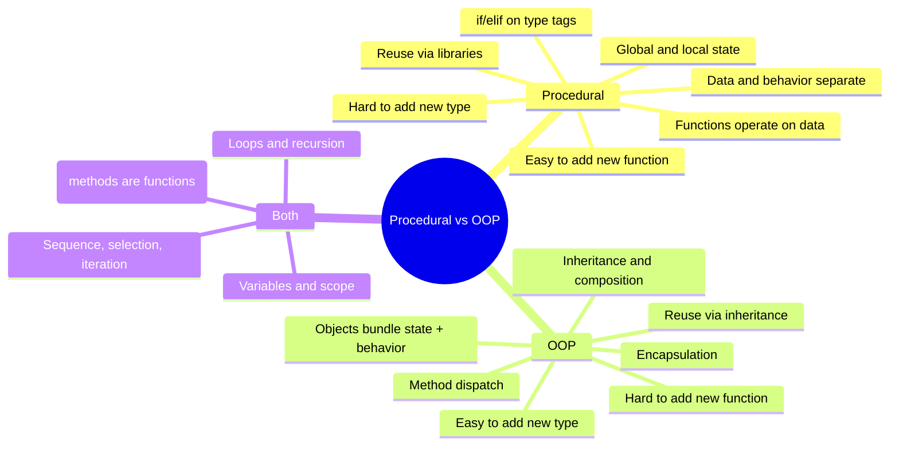
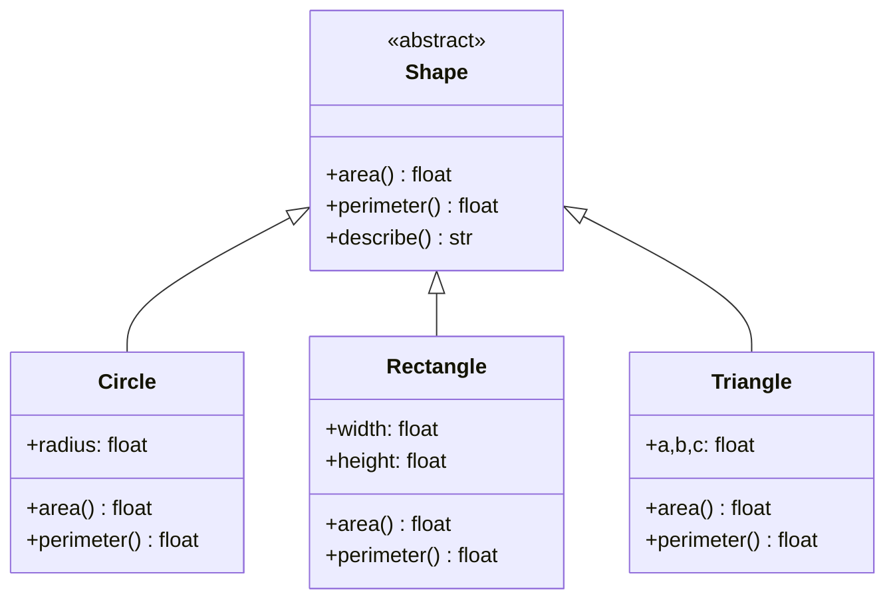
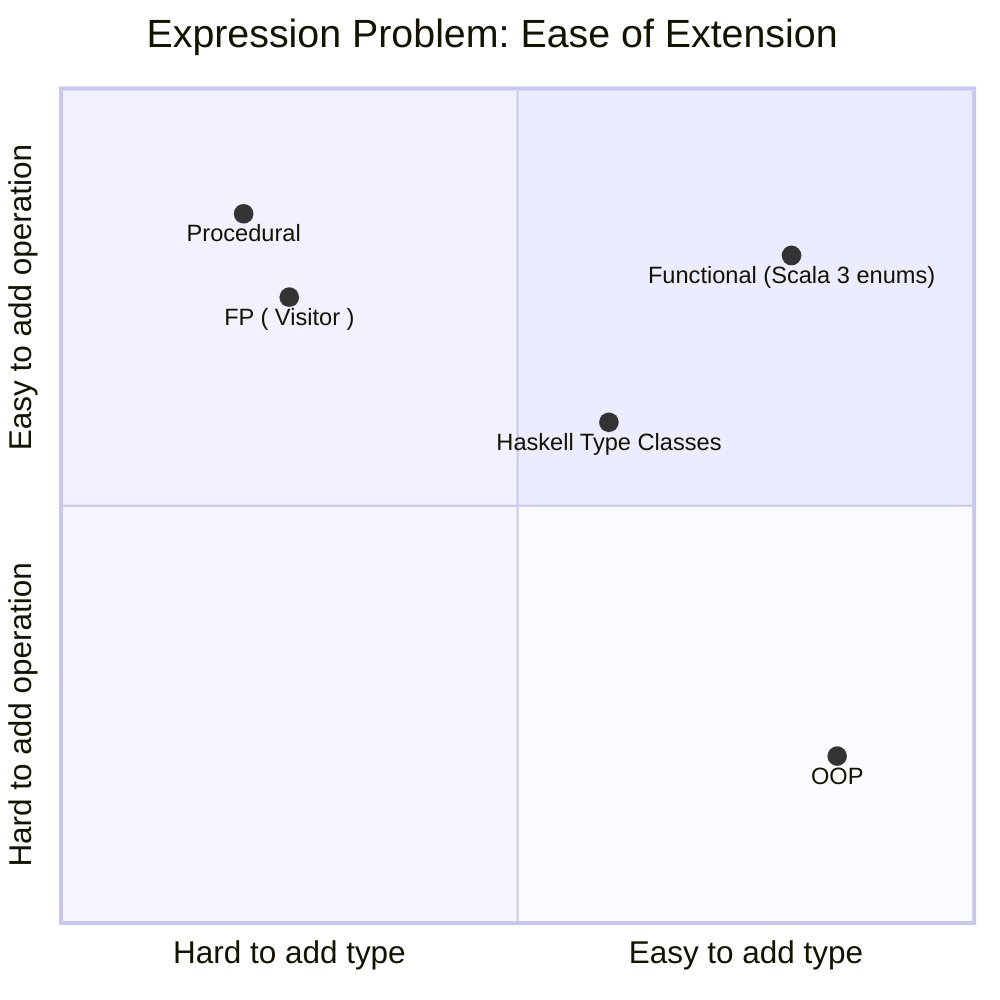
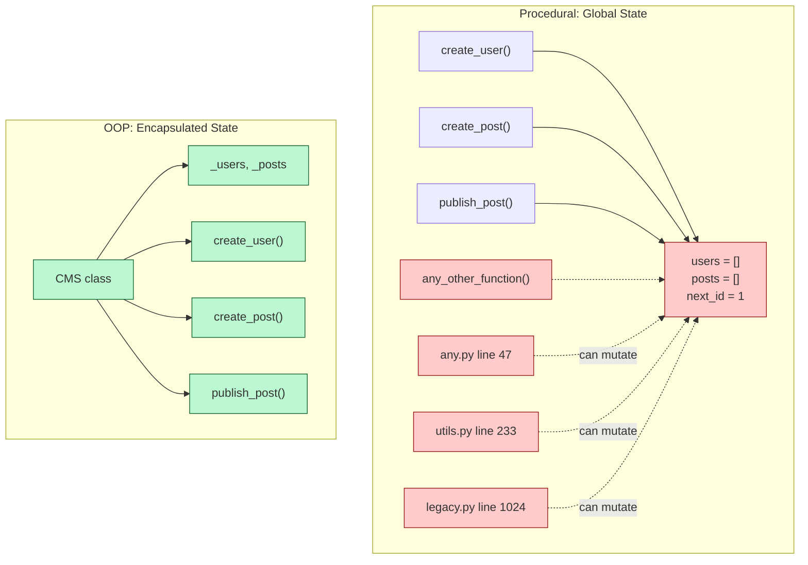
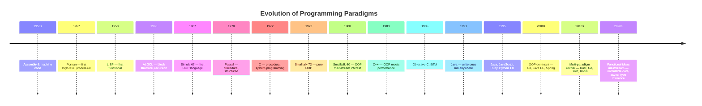
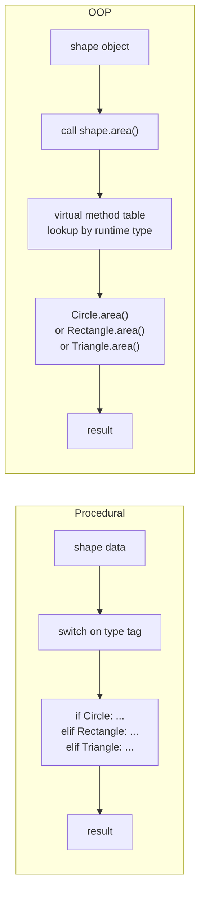
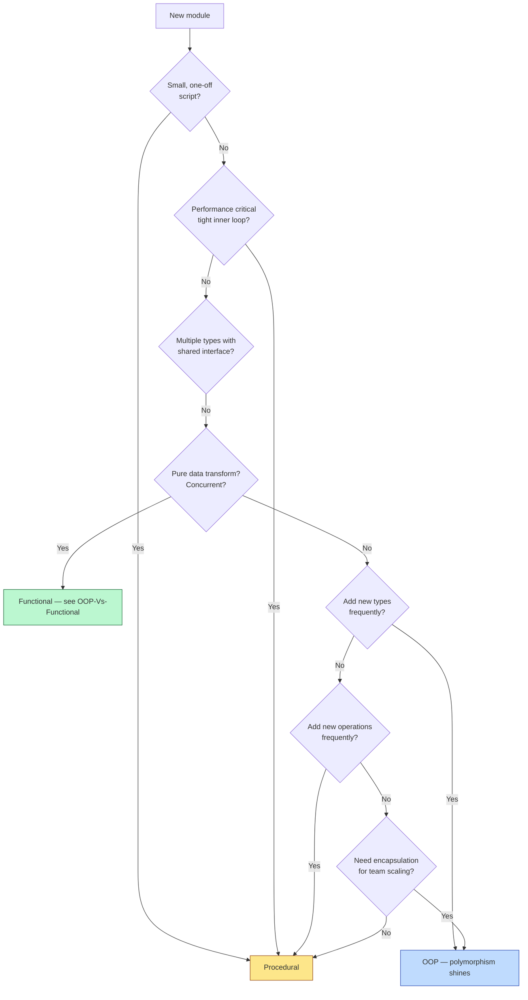

# OOP vs Procedural — The Older Paradigm vs the Newer

#oop #procedural #paradigms #comparison #teaching #deep-dive

> [!quote] Edsger Dijkstra — *Go To Statement Considered Harmful*
> "The intellectual level of programming might be raised by paying more attention to the *structure* of programs."

> [!quote] Bjarne Stroustrup — *The C++ Programming Language*
> "I invented C++ because I wanted to write simulations… Simula had the right ideas about objects, but its performance was unacceptable. C had the performance, but its procedural style was too low-level for the kind of systems I wanted to build."

Before OOP, there was **procedural programming**. From the 1960s through the 1980s — in Fortran, COBOL, ALGOL, Pascal, C — procedural code powered the world's software. OOP arrived in the 1980s (Smalltalk, C++) and became dominant in the 1990s (Java, C#). But procedural code did not die. It still runs banking mainframes, the Linux kernel, system utilities, scientific computing, and the vast majority of shell scripts.

This note compares procedural and OOP head-to-head, solves the same problem both ways, introduces the **Expression Problem** that illuminates their deepest difference, and explains when — even today — procedural is the right choice.

Prerequisites: [[What-Is-OOP]], [[Polymorphism]], [[OOP-Paradigms]].

---

## 1. The Two Paradigms in One Paragraph Each

### 1.1 Procedural Programming

> Procedural code is a sequence of **procedures** (functions) operating on **data structures**. Data and behavior are **separate**: you pass data into functions, which transform it and return results.

State is typically held in **global variables** or **locals** passed between functions. Control flow uses **sequence, selection (`if`/`switch`), and iteration (`for`/`while`)**. The mental model is *"do this, then do that."*

### 1.2 Object-Oriented Programming

> OOP bundles **data and behavior** together inside **objects**. Behavior is invoked by sending messages (calling methods) to objects.

State is **encapsulated** — hidden inside objects, accessible only through methods. Reuse comes from **inheritance** and **composition**. Polymorphism dispatches behavior based on the runtime type of the receiver. The mental model is *"ask this object to do that."*

### 1.3 Side-by-Side Comparison Table

| Aspect | Procedural | OOP |
|---|---|---|
| Organization | By function — files of functions | By object — files of classes |
| Data & behavior | Separate (data structures + functions) | Bundled (objects with methods) |
| State | Global or local variables | Encapsulated in objects |
| Reuse | Copy-paste, function libraries | Inheritance, composition, polymorphism |
| Polymorphism | `switch`/`if-elif` on type tags | Method dispatch on receiver |
| Extensibility | Adding a new function: easy. New type: hard. | Adding a new type: easy. New function: hard. |
| Encapsulation | Weak (convention-based) | Strong (language-enforced) |
| Memory model | Manual (C, Pascal) or GC (modern) | Mostly GC, some manual (C++) |
| Typical languages | C, Pascal, Fortran, Go (partial) | Java, C#, Smalltalk, Ruby |
| Best fit | Scripts, system programming, performance code | Large systems, GUIs, business logic |



---

## 2. Same Problem, Two Paradigms — Shape Area

The classic teaching example: compute the area of various shapes.

### 2.1 Procedural Version — Functions + Type Tags

```python
# procedural_shapes.py
import math
from dataclasses import dataclass

# Data structures — tagged unions
@dataclass
class Circle:
    radius: float

@dataclass
class Rectangle:
    width: float
    height: float

@dataclass
class Triangle:
    a: float
    b: float
    c: float

# Functions — one per operation, switch on type
def area(shape) -> float:
    if isinstance(shape, Circle):
        return math.pi * shape.radius ** 2
    elif isinstance(shape, Rectangle):
        return shape.width * shape.height
    elif isinstance(shape, Triangle):
        s = (shape.a + shape.b + shape.c) / 2
        return math.sqrt(s * (s - shape.a) * (s - shape.b) * (s - shape.c))
    else:
        raise TypeError(f"Unknown shape: {type(shape).__name__}")

def perimeter(shape) -> float:
    if isinstance(shape, Circle):
        return 2 * math.pi * shape.radius
    elif isinstance(shape, Rectangle):
        return 2 * (shape.width + shape.height)
    elif isinstance(shape, Triangle):
        return shape.a + shape.b + shape.c
    else:
        raise TypeError(f"Unknown shape: {type(shape).__name__}")

def describe(shape) -> str:
    if isinstance(shape, Circle):
        return f"Circle(radius={shape.radius})"
    elif isinstance(shape, Rectangle):
        return f"Rectangle({shape.width}x{shape.height})"
    elif isinstance(shape, Triangle):
        return f"Triangle({shape.a},{shape.b},{shape.c})"
    else:
        raise TypeError(f"Unknown shape: {type(shape).__name__}")


shapes = [Circle(3), Rectangle(4, 5), Triangle(3, 4, 5)]
for s in shapes:
    print(f"{describe(s)}: area={area(s):.2f}, perimeter={perimeter(s):.2f}")
```

### 2.2 OOP Version — Polymorphism Dispatches

```python
# oop_shapes.py
import math
from abc import ABC, abstractmethod
from dataclasses import dataclass

class Shape(ABC):
    @abstractmethod
    def area(self) -> float: ...
    @abstractmethod
    def perimeter(self) -> float: ...
    @abstractmethod
    def describe(self) -> str: ...

@dataclass
class Circle(Shape):
    radius: float
    def area(self) -> float:
        return math.pi * self.radius ** 2
    def perimeter(self) -> float:
        return 2 * math.pi * self.radius
    def describe(self) -> str:
        return f"Circle(radius={self.radius})"

@dataclass
class Rectangle(Shape):
    width: float
    height: float
    def area(self) -> float:
        return self.width * self.height
    def perimeter(self) -> float:
        return 2 * (self.width + self.height)
    def describe(self) -> str:
        return f"Rectangle({self.width}x{self.height})"

@dataclass
class Triangle(Shape):
    a: float
    b: float
    c: float
    def area(self) -> float:
        s = (self.a + self.b + self.c) / 2
        return math.sqrt(s * (s - self.a) * (s - self.b) * (s - self.c))
    def perimeter(self) -> float:
        return self.a + self.b + self.c
    def describe(self) -> str:
        return f"Triangle({self.a},{self.b},{self.c})"


shapes = [Circle(3), Rectangle(4, 5), Triangle(3, 4, 5)]
for s in shapes:
    print(f"{s.describe()}: area={s.area():.2f}, perimeter={s.perimeter():.2f}")
```

> [!teaching-tip] Teaching Tip
> Show students both versions side by side and ask: *"Which is shorter?"* (Answer: similar.) Then ask: *"Which is easier to **add a new shape** to?"* The OOP version wins decisively — you just write a new `Square(Shape)` class, no existing code changes. Then ask: *"Which is easier to **add a new operation** to (say, `is_convex`)?"* The procedural version wins — you write one new function with a switch. The OOP version requires editing *every* existing class. This is the **Expression Problem** in the wild.



---

## 3. The Expression Problem — The Heart of the Difference

> [!quote] Philip Wadler — *The Expression Problem* (1998)
> "The Expression Problem is a new name for an old problem. The goal is to define a data type by cases, where one can add new cases to the data type and new functions over the data type, **without recompiling existing code**, and **while retaining static type safety**."

The Expression Problem asks: **which is easier — adding a new type, or adding a new operation?**

- **Procedural** makes adding new *operations* easy: write a new function with a switch. Adding a new *type* is hard: you must edit every existing function's switch.
- **OOP** makes adding new *types* easy: write a new subclass. Adding a new *operation* is hard: you must edit every existing class to add the new method.



### 3.1 Concretely — Adding a New Type

Add `Square` to both versions.

**Procedural** — you must edit `area`, `perimeter`, AND `describe`:

```python
# Must touch EVERY existing function
def area(shape):
    if isinstance(shape, Circle): ...
    elif isinstance(shape, Rectangle): ...
    elif isinstance(shape, Triangle): ...
    elif isinstance(shape, Square):       # ← new branch
        return shape.side ** 2
    ...

def perimeter(shape):
    # ... again, add a new branch ...
    elif isinstance(shape, Square):
        return 4 * shape.side

def describe(shape):
    # ... again, add a new branch ...
    elif isinstance(shape, Square):
        return f"Square(side={shape.side})"
```

**OOP** — you just add one new class:

```python
@dataclass
class Square(Shape):
    side: float
    def area(self) -> float:
        return self.side ** 2
    def perimeter(self) -> float:
        return 4 * self.side
    def describe(self) -> str:
        return f"Square(side={self.side})"

# Existing code unchanged!
shapes = [Circle(3), Rectangle(4, 5), Triangle(3, 4, 5), Square(6)]
```

### 3.2 Concretely — Adding a New Operation

Add `is_convex(shape) -> bool` to both versions.

**Procedural** — just write a new function:

```python
def is_convex(shape) -> bool:
    if isinstance(shape, Circle): return True
    elif isinstance(shape, Rectangle): return True
    elif isinstance(shape, Triangle): return True
    elif isinstance(shape, Square): return True
    else: raise TypeError(f"Unknown shape: {type(shape).__name__}")
# Done. Existing functions untouched.
```

**OOP** — you must edit the abstract base class AND every subclass:

```python
class Shape(ABC):
    @abstractmethod
    def area(self) -> float: ...
    @abstractmethod
    def perimeter(self) -> float: ...
    @abstractmethod
    def describe(self) -> str: ...
    @abstractmethod
    def is_convex(self) -> bool: ...      # ← new abstract method

class Circle(Shape):
    # ... existing methods ...
    def is_convex(self) -> bool:          # ← must implement
        return True

class Rectangle(Shape):
    def is_convex(self) -> bool:          # ← must implement
        return True

class Triangle(Shape):
    def is_convex(self) -> bool:          # ← must implement
        return True

class Square(Shape):
    def is_convex(self) -> bool:          # ← must implement
        return True
```

> [!warning] Common Student Misconception
> "OOP is just better than procedural." — *Wrong.* They have **complementary** strengths. If your system adds types often (UI widgets, game entities, document nodes), OOP is superior. If your system adds operations often (compilers, data analytics, math libraries), procedural or functional is superior. The right choice depends on which axis of extension dominates your domain.

---

## 4. State, Encapsulation, and the Global Variable Problem

### 4.1 Procedural State — Often Global

```python
# procedural_cms.py — classic procedural state management

# Globals — visible to every function
users = []
posts = []
next_user_id = 1
next_post_id = 1

def create_user(name, email):
    global next_user_id
    user = {"id": next_user_id, "name": name, "email": email}
    next_user_id += 1
    users.append(user)
    return user

def create_post(user_id, title, body):
    global next_post_id
    post = {
        "id": next_post_id,
        "user_id": user_id,
        "title": title,
        "body": body,
        "published": False,
    }
    next_post_id += 1
    posts.append(post)
    return post

def publish_post(post_id):
    for p in posts:
        if p["id"] == post_id:
            p["published"] = True
            return p
    raise KeyError(f"No post {post_id}")

def list_published_posts():
    return [p for p in posts if p["published"]]
```

### 4.2 OOP State — Encapsulated

```python
# oop_cms.py — same CMS, OOP style
from dataclasses import dataclass, field

@dataclass
class User:
    id: int
    name: str
    email: str

@dataclass
class Post:
    id: int
    author: User
    title: str
    body: str
    published: bool = False

    def publish(self) -> None:
        self.published = True

class CMS:
    def __init__(self) -> None:
        self._users: list[User] = []
        self._posts: list[Post] = []
        self._next_user_id = 1
        self._next_post_id = 1

    def create_user(self, name: str, email: str) -> User:
        user = User(self._next_user_id, name, email)
        self._next_user_id += 1
        self._users.append(user)
        return user

    def create_post(self, author: User, title: str, body: str) -> Post:
        post = Post(self._next_post_id, author, title, body)
        self._next_post_id += 1
        self._posts.append(post)
        return post

    def publish_post(self, post_id: int) -> Post:
        for p in self._posts:
            if p.id == post_id:
                p.publish()
                return p
        raise KeyError(f"No post {post_id}")

    def list_published_posts(self) -> list[Post]:
        return [p for p in self._posts if p.published]
```

### 4.3 The Key Win: Encapsulation

In the procedural version, *any* function anywhere in the codebase can `posts.append(...)` or `posts[0]["published"] = True` and corrupt the data. There is no enforcement.

In the OOP version, the `CMS` class owns `_users` and `_posts` (underscore-prefixed in Python = "private by convention"). The only way to mutate them is through `create_user`, `create_post`, `publish_post`. The state is contained. When debugging, you have a far smaller surface area to inspect.



---

## 5. Where Procedural Still Wins

OOP is not always the right answer. Procedural code is preferable when:

### 5.1 Small Scripts

```python
#!/usr/bin/env python3
"""A 20-line script to rename files in a directory."""
import os, sys, re
from pathlib import Path

def main():
    if len(sys.argv) != 2:
        print("usage: rename.py <dir>", file=sys.stderr); sys.exit(1)
    d = Path(sys.argv[1])
    for p in d.iterdir():
        if p.is_file() and re.match(r"^IMG_\d+\.JPG$", p.name):
            new = p.name.lower().replace("img_", "vacation_")
            p.rename(d / new)
            print(f"  {p.name} -> {new}")

if __name__ == "__main__":
    main()
```

Wrapping this in a `FileRenamer` class with `__init__`, `_validate_directory`, `_compute_new_name`, `_rename_file` methods would add ceremony with zero benefit. **YAGNI** — *You Aren't Gonna Need It*.

### 5.2 System Programming

The Linux kernel is C (procedural). Why? Predictable performance, manual memory control, no GC pauses, transparent control flow. Objects add indirection that hurts cache locality and reasoning about low-level behavior.

### 5.3 Performance-Critical Code

Tight numerical loops in NumPy, BLAS, scientific simulations — procedural `for` loops over flat arrays often outperform object-based code by 10–100× because of cache locality and zero indirection.

```python
# Procedural, fast — flat array, tight loop
def sum_squares(arr: list[float]) -> float:
    total = 0.0
    for x in arr:
        total += x * x
    return total

# OOP, slower — method calls, indirection
class NumberWrapper:
    def __init__(self, value: float):
        self.value = value
    def squared(self) -> float:
        return self.value * self.value

def sum_squares_oop(wrappers: list[NumberWrapper]) -> float:
    total = 0.0
    for w in wrappers:
        total += w.squared()       # method call overhead, pointer indirection
    return total
```

### 5.4 Configuration & Setup

Procedural code is fine for one-shot configuration scripts where there's no state to encapsulate.

---

## 6. The History — From Procedures to Objects



### 6.1 Why OOP "Won" for Large Systems

In the 1990s and 2000s, OOP became the default for large enterprise systems. Why?

1. **Managing complexity** — encapsulation lets teams work on different objects without stepping on each other.
2. **Domain modeling** — `Customer`, `Order`, `Invoice` map naturally to business language (this is the heart of [[Domain-Driven-Design]]).
3. **Reuse** — inheritance and frameworks (Spring, Rails, Django) promised — and sometimes delivered — massive reuse.
4. **Tooling** — IDEs, UML, design patterns, refactoring tools all matured around OOP.
5. **Hiring** — by 2000, most CS graduates had been trained in Java/C++.

### 6.2 Why Procedural Didn't Die

1. **C is everywhere** — every OS kernel, every embedded system, every Python interpreter.
2. **Performance** — procedural code is easier to optimize and reason about at the metal level.
3. **Simplicity** — for small problems, procedural is *less* ceremony.
4. **Legacy** — billions of lines of COBOL, Fortran, and C are still in production.
5. **Pushback** — Go (2009) is deliberately procedural-with-interfaces, and it's wildly popular.

---

## 7. Reuse: Copy-Paste vs Inheritance

### 7.1 Procedural Reuse — Libraries

Procedural reuse is mostly: *put useful functions in a library, import them*. It's flat and simple, but limited — you can't easily specialize behavior.

```python
# procedural reuse — call library functions
from my_math_lib import sort, filter, map

result = sort(filter(lambda x: x > 0, data))
```

### 7.2 OOP Reuse — Inheritance & Composition

OOP reuse offers *specialization*: a subclass inherits behavior and overrides specific methods.

```python
class Animal:
    def speak(self) -> str: return "..."
    def move(self) -> str: return "moving"

class Dog(Animal):
    def speak(self) -> str: return "Woof!"    # override

class Puppy(Dog):
    def speak(self) -> str: return "Yip!"     # override again
```

This is more powerful but also more dangerous — see [[Composition-Over-Inheritance]] for why deep inheritance trees become brittle.

---

## 8. Polymorphism: Switch Dispatch vs Method Dispatch

The deepest mechanical difference is **how behavior varies by type**.



In procedural code, the **caller** decides which branch to take (via `switch`). In OOP, the **object** decides (via its vtable). This shift — from caller-side dispatch to receiver-side dispatch — is the technical heart of polymorphism.

> [!teaching-tip] Teaching Tip
> Have students write a 5-shape, 4-operation system in both styles. Then have them **add a 6th shape** in both, and **add a 5th operation** in both. They will viscerally feel the Expression Problem: in one direction, OOP is easy and procedural is painful; in the other direction, it's reversed. This is the single best way to internalize the trade-off.

---

## 9. Modern Procedural Languages

The procedural tradition is alive and well:

- **Go** (2009) — structs + functions + interfaces. No inheritance. No classes. Google's bet that procedural + interfaces beats deep OOP hierarchies.
- **Rust** (2010) — structs + traits. Ownership model. No inheritance.
- **C** (1972) — still everywhere.
- **Lua, Bash, AWK** — scripting procedural languages.

These languages often *borrow* OOP ideas (encapsulation, interfaces, polymorphism) without the full OOP apparatus of classes and inheritance. The lesson: **the useful parts of OOP (encapsulation, polymorphism) do not require classes**.

---

## 10. A Decision Heuristic

Use this flowchart when starting a new project or module:



---

## 11. Summary

| Question | Procedural answer | OOP answer |
|---|---|---|
| How is code organized? | By function (libraries of functions) | By class (classes of objects) |
| Where does state live? | Global/local variables | Encapsulated in objects |
| How does behavior vary by type? | `switch` on type tags | Method dispatch (vtable) |
| How is code reused? | Function libraries | Inheritance + composition + frameworks |
| Easy to add new operation? | ✅ Yes — write a new function | ❌ Hard — edit every class |
| Easy to add new type? | ❌ Hard — edit every switch | ✅ Yes — add a new class |
| Best for small scripts? | ✅ Yes | ❌ Overkill |
| Best for large team systems? | ❌ Encapsulation weak | ✅ Strong encapsulation |
| Best for system programming? | ✅ Yes — C, Go | ❌ Too much indirection |

OOP is not "better" than procedural. It is **better for a specific class of problems** — large, evolving systems where types proliferate and teams need encapsulation to coordinate. Procedural is **better for other problems** — small scripts, system code, performance-critical loops, and domains where operations dominate over types.

The mature engineer knows both, chooses the right tool for the job, and resists the urge to force one paradigm onto every problem.

---

## 12. Further Reading

- [[What-Is-OOP]] — what OOP is, foundational
- [[OOP-Paradigms]] — broader survey including procedural
- [[Polymorphism]] — the mechanism that distinguishes OOP dispatch from procedural switches
- [[Composition-Over-Inheritance]] — when OOP reuse goes wrong
- [[OOP-Vs-Functional]] — the other major paradigm comparison
- [[When-Not-To-Use-OOP]] — more cases where procedural or functional fits better
- [[Languages-Comparison]] — how Go, Rust, and others blend procedural ideas with OOP features

> [!book] Recommended Reading
> - *The C Programming Language* — Kernighan & Ritchie (procedural, distilled)
> - *Code Complete* — Steve McConnell (covers both paradigms pragmatically)
> - *Structure and Interpretation of Computer Programs* — Abelson & Sussman
> - *The Expression Problem* — Philip Wadler, 1998 email (the canonical statement)
> - *Object-Oriented Software Construction* — Bertrand Meyer (OOP justification from first principles)

> [!warning] Common Student Misconceptions
> - **"Procedural is outdated."** — No. The Linux kernel, NumPy internals, every Python interpreter, and most game engine cores are procedural. It is alive and dominant in performance-critical code.
> - **"OOP always wins for big systems."** — Not always. Linux is procedural and one of the largest software systems ever built. The Go ecosystem is large and deliberately procedural.
> - **"You can't do polymorphism in procedural code."** — You can, via function pointers (C), interfaces (Go), or type tags (any language). It's just less syntactically convenient than method dispatch.
> - **"Inheritance is the whole point of OOP."** — No. Encapsulation and polymorphism are. Inheritance is just one (often overused) reuse mechanism.

> [!teaching-tip] Final Teaching Tip
> The deepest insight from comparing procedural and OOP is the **Expression Problem**. Once students see it, they stop asking "which is better?" and start asking "which axis of extension dominates my domain?" That's the moment they become a real software designer.

#oop #procedural #comparison #paradigms #expression-problem #teaching
