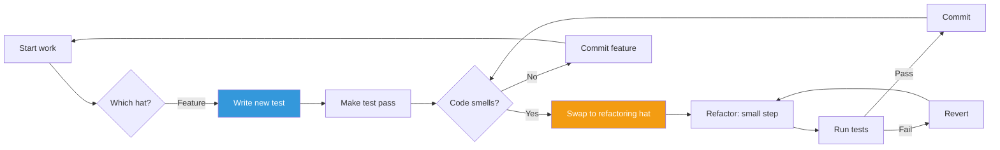
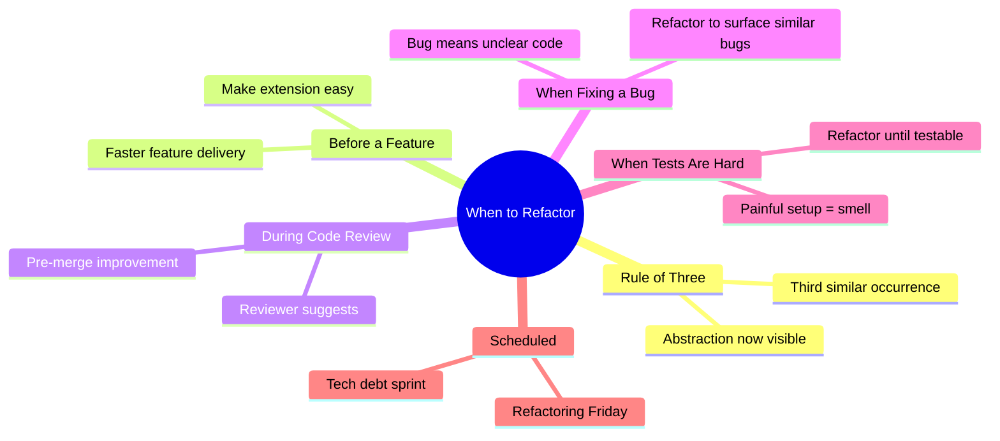
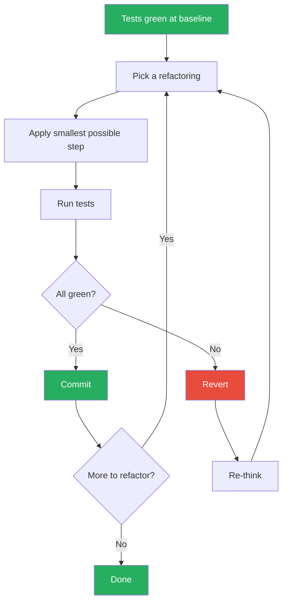
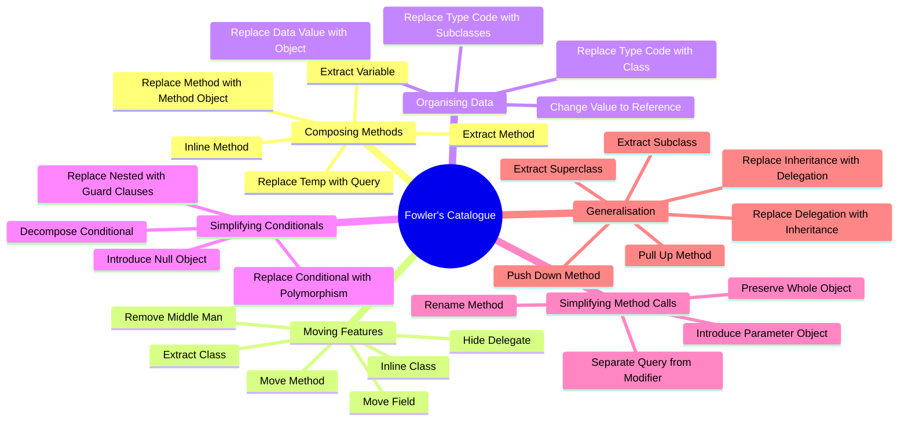
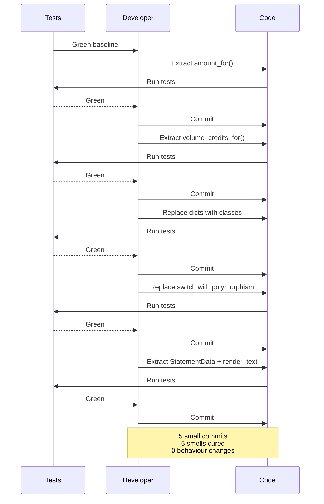
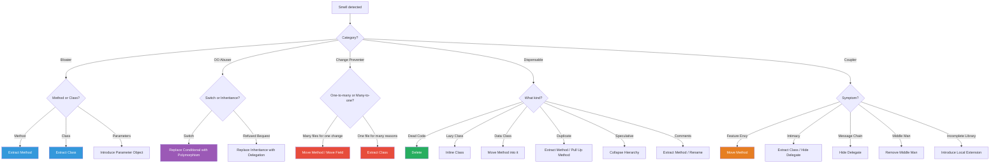
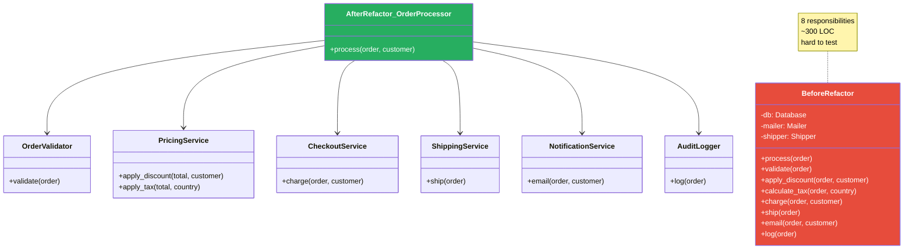
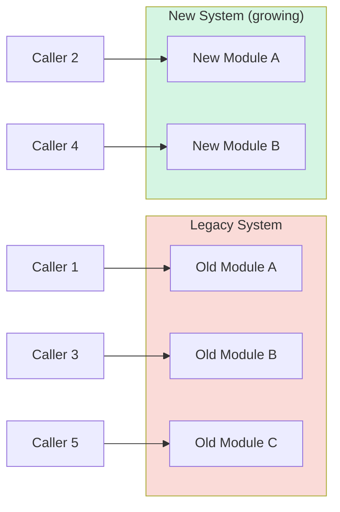
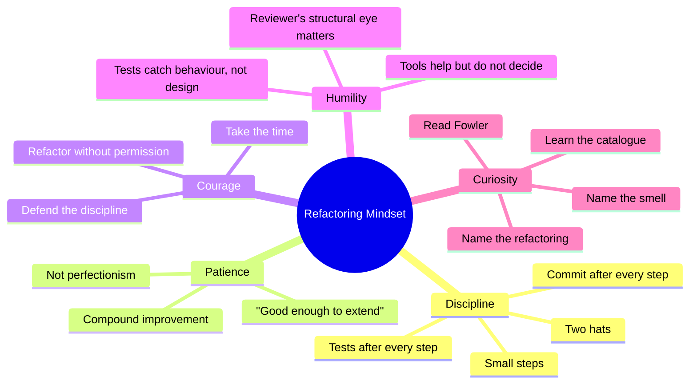

# Refactoring Strategies

#oop #antipatterns #refactoring #fowler #technical-debt #boy-scout-rule #teaching #deep-dive

> [!quote] Martin Fowler
> "Refactoring is the process of changing a software system in such a way that it does not alter the external behavior of the code yet improves its internal structure. It is a disciplined way to clean up code that minimizes the chances of introducing bugs."

**Refactoring** is the disciplined practice of improving the internal structure of code without changing its external behaviour. It is the cure for every anti-pattern in this folder — for [[Code-Smells]], for [[God-Object]], for [[Spaghetti-Code]], for [[Shotgun-Surgery]]. Without refactoring, codebases decay; with it, codebases *improve* with age, the way a well-tended garden does.

This note is the capstone of the [[10-Antipatterns]] folder. It covers what refactoring is (and is not), when to do it and when not to, the canonical process (small steps, tests at every step, commit frequently), Fowler's catalogue of named refactorings, a complete worked refactoring session, the smell-to-refactoring mapping, refactoring tools for Python, the Boy Scout Rule, and the most common student misconceptions.

Prerequisites: [[Code-Smells]], [[God-Object]], [[Spaghetti-Code]], [[Shotgun-Surgery]], [[Single-Responsibility]], a working knowledge of [[Unit-Testing-OOP|unit testing]].

---

## 1. What Is Refactoring?

> [!important] Definition
> **Refactoring** is the disciplined practice of changing the *internal structure* of code in order to improve its readability, maintainability, or extensibility, *without changing its observable behaviour*.

Two parts of this definition matter:

1. **Internal structure changes.** You move methods, extract classes, rename variables, replace conditionals with polymorphism. The code looks different afterwards.
2. **Observable behaviour is preserved.** The tests still pass. The user sees no difference. The API still returns the same results for the same inputs.

Refactoring is *not*:

- **Rewriting** — rewriting discards the old code and starts over. Refactoring transforms the existing code.
- **Bug fixing** — bug fixes *change* behaviour. Refactoring preserves it.
- **Adding features** — features add new behaviour. Refactoring does not.
- **Optimisation** — optimisation improves performance, often at the cost of readability. Refactoring improves readability, often with no performance change.

The distinction matters because it tells you what *kind* of commit you are making. A refactoring commit should be reviewable on its own — the reviewer should be able to verify "behaviour unchanged, structure improved" without thinking about features or bugs.

### 1.1 The Two Hats

Kent Beck's metaphor: a developer wears two hats — the **refactoring hat** (improve structure, no behaviour change) and the **feature hat** (add behaviour). You swap hats frequently, but you never wear both at once. When you wear the refactoring hat, you do not add features. When you wear the feature hat, you do not refactor.



### 1.2 Why Refactor?

The benefits compound over the lifetime of the code:

- **Readability** — refactored code is easier to read, which speeds up every future task.
- **Maintainability** — bugs are easier to find and fix in clean code.
- **Extensibility** — adding a feature to clean code is faster than adding it to messy code.
- **Testability** — refactored code is easier to test, which catches future bugs earlier.
- **Onboarding** — new developers become productive faster in a clean codebase.
- **Paying technical debt** — every refactoring pays down some debt, preventing the debt from accumulating to the point where the codebase becomes unmaintainable.

### 1.3 The Economic Argument

Refactoring is not free — it costs time today. But *not* refactoring is more expensive: each future change in messy code takes longer, and the cost grows super-linearly with the mess. The economic question is not "should we refactor" but "when does the cumulative cost of *not* refactoring exceed the cost of refactoring". The answer is almost always: earlier than you think.

---

## 2. When to Refactor

Fowler's *Refactoring* gives three triggers — together known as the **Rule of Three**.

### 2.1 The Rule of Three

> 1. **The first time you do something, you just do it.**
> 2. **The second time you do a similar thing, you wince but proceed.**
> 3. **The third time you do something similar, refactor it.**

Three strikes and you refactor. The third occurrence is the signal that an abstraction is missing. By the third time, you have enough information to extract the right abstraction (not the speculative one you might have guessed after the first).

### 2.2 Refactor Before You Add a Feature

Before adding a feature, ask: *is the code easy to extend?* If not, refactor first. Adding a feature on top of messy code multiplies the mess. Adding a feature on top of clean code is fast and safe.

> [!tip] Teaching Tip
> The most powerful teaching moment is the "refactor before feature" workflow. Have a student try to add a feature to messy code (it takes them two hours, introduces a bug, requires a 200-line diff). Then have them refactor first (one hour) and add the feature (15 minutes, clean diff). The economics are obvious.

### 2.3 Refactor During Code Review

Code review is a natural moment for refactoring. The reviewer says "this method is too long; can you extract a helper?" The author refactors and re-submits. The code improves before merge.

### 2.4 Refactor When You Fix a Bug

If you found a bug, the code is unclear enough that the bug existed unnoticed. Refactor so that the same class of bug becomes obvious next time. The bug fix itself is one hat; the refactoring is the other.

### 2.5 Refactor When the Code Is Hard to Test

If you cannot write a unit test for a method because the setup is too painful, that is a smell — see [[God-Object]]. Refactor until the method is testable, then write the test.

### 2.6 Refactor on a Schedule

Many teams schedule a "refactoring Friday" or a "tech debt sprint" — a fixed time for refactoring without feature pressure. This works if the team has the discipline to use the time for refactoring rather than catching up on features.



---

## 3. When NOT to Refactor

Refactoring is not always the right move. Three classic "don't":

### 3.1 Don't Refactor When You Cannot Test

If there are no tests and you cannot write characterization tests, refactoring is dangerous — you have no way to verify that behaviour was preserved. *First* write tests (even ugly end-to-end ones), *then* refactor.

### 3.2 Don't Refactor Near a Deadline

A refactoring gone wrong can destabilise the code right before a release. If the deadline is two days away and the refactoring is not strictly necessary, defer it. Record the debt and pick it up after the release.

### 3.3 Don't Refactor Code That Should Be Rewritten

Sometimes the code is so tangled, so wrong, or so tied to outdated assumptions that refactoring is more expensive than rewriting. The signal: the refactoring would touch more than 70% of the file's lines and the team cannot describe what the code currently does. In that case, write the new version alongside the old, migrate callers gradually, and delete the old when no one is left using it.

> [!warning] Common Student Misconception
> Students often think "rewrite from scratch" is the answer to messy code. It almost never is. Joel Spolsky's classic essay *Things You Should Never Do* documents how Netscape's rewrite-from-scratch of Navigator cost them the browser war. Rewrites throw away the bug fixes and edge-case knowledge encoded in the old code. Refactoring preserves that knowledge.

### 3.4 Don't Refactor and Add Features in the Same Commit

Two hats, two commits. A commit that says "refactor `OrderProcessor` and add coupon support" is unreviewable. Split into "refactor `OrderProcessor`" (behaviour unchanged, tests pass) and "add coupon support" (new behaviour, new tests).

---

## 4. The Refactoring Process

Refactoring is a *discipline*. The steps are simple; the discipline is in following them every time.

### 4.1 The Canonical Loop

1. **Ensure tests pass.** You start from a green baseline. If tests are red, fix them first or skip the refactoring.
2. **Take a small step.** One refactoring at a time. Extract one method. Move one field. Rename one variable. Small enough that if something breaks, you know exactly where.
3. **Run tests.** Immediately. Not after five refactorings — after one.
4. **If tests fail, revert.** Use `git checkout` to restore the previous state. Re-think the step. Try again, smaller.
5. **Commit.** A small, well-named commit: `refactor: extract validate() from process_order`. Each commit is independently revertable.
6. **Repeat.** Move to the next step.



### 4.2 Why Small Steps?

Small steps are the safety net. If you make 20 changes and a test fails, you must debug which of the 20 broke it. If you make one change and a test fails, you know exactly which change is at fault — and you revert in one keystroke. Large refactorings are sequences of small ones; the discipline is *not* doing them all at once.

### 4.3 Why Commit After Each Step?

Because each commit is a checkpoint. If you discover, three refactorings later, that you went down a wrong path, you can `git reset --hard` to the last good commit. Without commits, you have to manually undo — error-prone and slow.

### 4.4 The Tests Are the Specification

In refactoring, the tests *are* the specification of behaviour. If a behaviour is not covered by a test, you do not know whether your refactoring preserves it. *Before* refactoring an untested method, write a characterization test — a test that captures the *current* behaviour, even if that behaviour is buggy. (The bug fix comes later, under the feature hat.)

---

## 5. The Catalogue of Refactorings

Fowler's catalogue contains ~60 named refactorings. The most important ones for OOP code are listed below, grouped by intent. Each is summarised; the full treatment is in Fowler's book.

### 5.1 Composing Methods

| Refactoring | When | What you do |
|-------------|------|-------------|
| **Extract Method** | Long method; mixed concerns | Pull a chunk into a new named method |
| **Inline Method** | A method's body is as clear as its name | Replace the call with the body |
| **Extract Variable** | A complex expression | Introduce a named variable for part of it |
| **Inline Variable** | A variable's name adds no info | Replace the variable with its value |
| **Replace Temp with Query** | A temp holds a computation used once | Replace with a method call |
| **Split Variable** | A variable is reassigned for different purposes | Use separate variables |
| **Replace Method with Method Object** | A long method has many locals | Turn the method into a class |

### 5.2 Moving Features Between Objects

| Refactoring | When | What you do |
|-------------|------|-------------|
| **Move Method** | A method is more interested in another class | Move it there |
| **Move Field** | A field is used more by another class | Move it there |
| **Extract Class** | A class has two responsibilities | Split into two classes |
| **Inline Class** | A class has become trivial | Fold into its caller |
| **Hide Delegate** | A client chains `a.b().c()` | Give `a` a method `c()` that delegates |
| **Remove Middle Man** | A class is pure delegation | Let clients call the delegate directly |
| **Introduce Foreign Method** | You can't modify a library class | Add an extension function |
| **Introduce Local Extension** | You need many methods on a library class | Subclass or wrap |

### 5.3 Organising Data

| Refactoring | When | What you do |
|-------------|------|-------------|
| **Replace Data Value with Object** | A primitive represents a concept | Wrap it in a class |
| **Replace Type Code with Class** | A type code is a string or int | Replace with a class |
| **Replace Type Code with Subclasses** | Type code drives conditional behaviour | One subclass per type |
| **Replace Type Code with Strategy** | Type code drives behaviour, types change at runtime | Strategy pattern |
| **Change Value to Reference** | Multiple copies of the same entity | Share one instance |
| **Change Reference to Value** | An object is treated as a value | Make it immutable |
| **Replace Array with Object** | An array has named "fields" by index | Use a class with named fields |

### 5.4 Simplifying Conditional Expressions

| Refactoring | When | What you do |
|-------------|------|-------------|
| **Decompose Conditional** | A conditional has complex logic | Extract methods for the if and else branches |
| **Consolidate Conditional Expression** | Multiple conditionals lead to the same result | Combine them |
| **Consolidate Duplicate Conditional Fragments** | Same code in all branches | Move outside the conditional |
| **Remove Control Flag** | A flag drives a loop's exit | Use `return` or `break` |
| **Replace Nested Conditional with Guard Clauses** | Arrow code | Early returns |
| **Replace Conditional with Polymorphism** | Type-code switch | Subclasses per type |
| **Introduce Null Object** | Null checks everywhere | A "do nothing" default object |
| **Introduce Assertion** | An assumption is implicit | Make it explicit with `assert` |

### 5.5 Simplifying Method Calls

| Refactoring | When | What you do |
|-------------|------|-------------|
| **Rename Method** | The name is unclear | Rename (and update callers) |
| **Add Parameter** | A method needs more data | Add the parameter |
| **Remove Parameter** | A parameter is unused | Remove it |
| **Separate Query from Modifier** | A method both reads and mutates | Split into two |
| **Parameterize Method** | Several methods do similar work with different values | One method with a parameter |
| **Introduce Parameter Object** | Long parameter list | Group into a data class |
| **Preserve Whole Object** | Many fields of one object passed individually | Pass the object |
| **Replace Parameter with Method Call** | A parameter can be obtained by the callee | Remove the parameter |
| **Hide Method** | A method should not be public | Make it private |

### 5.6 Dealing with Generalisation

| Refactoring | When | What you do |
|-------------|------|-------------|
| **Pull Up Field** | Same field in siblings | Move to parent |
| **Pull Up Method** | Same method in siblings | Move to parent |
| **Pull Up Constructor Body** | Same constructor logic in siblings | Move to parent |
| **Push Down Method** | A method is only relevant to some subclasses | Move to subclass |
| **Push Down Field** | A field is only relevant to some subclasses | Move to subclass |
| **Extract Subclass** | A class has features used only by some instances | Split into subclasses |
| **Extract Superclass** | Two classes share features | Create a common parent |
| **Extract Interface** | Several classes share a behavioural contract | Define a Protocol/ABC |
| **Collapse Hierarchy** | A subclass is no longer needed | Merge with parent |
| **Replace Inheritance with Delegation** | A subclass refuses bequest | Use composition |
| **Replace Delegation with Inheritance** | A class delegates everything to another | Make it a subclass |



---

## 6. A Complete Refactoring Session

Let us walk through a refactoring session step by step. The starting code:

```python
# === STARTING POINT: a smelly function ===
def statement(invoice, plays):
    total_amount = 0
    volume_credits = 0
    result = f"Statement for {invoice['customer']}\n"

    for perf in invoice['performances']:
        play = plays[perf['playID']]
        if play['type'] == "tragedy":
            this_amount = 40000
            if perf['audience'] > 30:
                this_amount += 1000 * (perf['audience'] - 30)
        elif play['type'] == "comedy":
            this_amount = 30000
            if perf['audience'] > 20:
                this_amount += 10000 + 500 * (perf['audience'] - 20)
            this_amount += 300 * perf['audience']
        else:
            raise ValueError(f"unknown type: {play['type']}")

        # add volume credits
        volume_credits += max(perf['audience'] - 30, 0)
        # extra credit for every ten comedy attendees
        if "comedy" == play['type']:
            volume_credits += perf['audience'] // 10

        # print line for this order
        result += f"  {play['name']}: {this_amount/100:.2f} "
        result += f"({perf['audience']} seats)\n"
        total_amount += this_amount

    result += f"Amount owed is {total_amount/100:.2f}\n"
    result += f"You earned {volume_credits} credits\n"
    return result
```

This is a textbook example from Fowler's book. Smells: Long Method, Switch Statements, Primitive Obsession (dicts everywhere), Magic Numbers.

### Step 1: Write characterization tests

Before touching anything, write tests that capture the current output for several inputs. These tests are your safety net.

```python
def test_statement_tragedy():
    invoice = {"customer": "BigCo", "performances": [
        {"playID": "hamlet", "audience": 55}]}
    plays = {"hamlet": {"name": "Hamlet", "type": "tragedy"}}
    result = statement(invoice, plays)
    assert "Statement for BigCo" in result
    assert "Hamlet" in result
    assert "650.00" in result  # 40000 + 1000*(55-30) = 65000 cents
```

Run. Green. Now refactor.

### Step 2: Decompose Conditional — extract amount calculation

```python
def statement(invoice, plays):
    total_amount = 0
    volume_credits = 0
    result = f"Statement for {invoice['customer']}\n"

    for perf in invoice['performances']:
        play = plays[perf['playID']]
        this_amount = amount_for(perf, play)   # <-- extracted

        volume_credits += max(perf['audience'] - 30, 0)
        if "comedy" == play['type']:
            volume_credits += perf['audience'] // 10

        result += f"  {play['name']}: {this_amount/100:.2f} "
        result += f"({perf['audience']} seats)\n"
        total_amount += this_amount

    result += f"Amount owed is {total_amount/100:.2f}\n"
    result += f"You earned {volume_credits} credits\n"
    return result

def amount_for(perf, play):
    if play['type'] == "tragedy":
        result = 40000
        if perf['audience'] > 30:
            result += 1000 * (perf['audience'] - 30)
    elif play['type'] == "comedy":
        result = 30000
        if perf['audience'] > 20:
            result += 10000 + 500 * (perf['audience'] - 20)
        result += 300 * perf['audience']
    else:
        raise ValueError(f"unknown type: {play['type']}")
    return result
```

Run tests. Green. Commit: `refactor: extract amount_for()`.

### Step 3: Extract volume credits

```python
def statement(invoice, plays):
    total_amount = 0
    volume_credits = 0
    result = f"Statement for {invoice['customer']}\n"

    for perf in invoice['performances']:
        play = plays[perf['playID']]
        this_amount = amount_for(perf, play)
        volume_credits += volume_credits_for(perf, play)   # <-- extracted

        result += f"  {play['name']}: {this_amount/100:.2f} "
        result += f"({perf['audience']} seats)\n"
        total_amount += this_amount

    result += f"Amount owed is {total_amount/100:.2f}\n"
    result += f"You earned {volume_credits} credits\n"
    return result

def volume_credits_for(perf, play):
    result = max(perf['audience'] - 30, 0)
    if "comedy" == play['type']:
        result += perf['audience'] // 10
    return result
```

Run tests. Green. Commit.

### Step 4: Replace Data Value with Object — introduce a `Performance` and `Play` class

The dict access is Primitive Obsession. Replace with classes.

```python
@dataclass
class Performance:
    play_id: str
    audience: int

@dataclass
class Play:
    name: str
    type: str

def statement(invoice, plays):
    performances = [Performance(p['playID'], p['audience'])
                    for p in invoice['performances']]
    play_objs = {pid: Play(p['name'], p['type']) for pid, p in plays.items()}
    # ... rest unchanged, using the objects
```

Run tests. Green. Commit.

### Step 5: Replace Conditional with Polymorphism — eliminate the switch

The `if play['type'] == "tragedy"` switch appears in `amount_for` and `volume_credits_for`. Replace with subclasses.

```python
class Play:
    def __init__(self, name: str):
        self.name = name

    def amount(self, audience: int) -> int:
        raise NotImplementedError

    def volume_credits(self, audience: int) -> int:
        return max(audience - 30, 0)


class Tragedy(Play):
    def amount(self, audience):
        result = 40000
        if audience > 30:
            result += 1000 * (audience - 30)
        return result


class Comedy(Play):
    def amount(self, audience):
        result = 30000
        if audience > 20:
            result += 10000 + 500 * (audience - 20)
        result += 300 * audience
        return result

    def volume_credits(self, audience):
        return super().volume_credits(audience) + audience // 10


def play_from(data: dict) -> Play:
    if data['type'] == "tragedy": return Tragedy(data['name'])
    if data['type'] == "comedy":  return Comedy(data['name'])
    raise ValueError(f"unknown type: {data['type']}")
```

Now `amount_for` and `volume_credits_for` are gone — the play itself knows:

```python
def statement(invoice, plays):
    total_amount = 0
    volume_credits = 0
    result = f"Statement for {invoice['customer']}\n"

    for perf in invoice['performances']:
        play = play_from(plays[perf['playID']])
        this_amount = play.amount(perf['audience'])
        volume_credits += play.volume_credits(perf['audience'])
        result += f"  {play.name}: {this_amount/100:.2f} "
        result += f"({perf['audience']} seats)\n"
        total_amount += this_amount

    result += f"Amount owed is {total_amount/100:.2f}\n"
    result += f"You earned {volume_credits} credits\n"
    return result
```

Run tests. Green. Commit. The switch is gone. Adding a new play type is now one new class — OCP satisfied.

### Step 6: Extract Class — separate the statement text generation

The function still does two things: compute totals and format text. Extract a `StatementPrinter`:

```python
@dataclass
class StatementData:
    customer: str
    performances: list  # list of (Play, audience, amount)
    total_amount: int
    volume_credits: int


def statement(invoice, plays):
    data = build_statement_data(invoice, plays)
    return render_text(data)


def build_statement_data(invoice, plays):
    performances = []
    total = 0
    credits = 0
    for perf in invoice['performances']:
        play = play_from(plays[perf['playID']])
        amount = play.amount(perf['audience'])
        performances.append((play, perf['audience'], amount))
        total += amount
        credits += play.volume_credits(perf['audience'])
    return StatementData(invoice['customer'], performances, total, credits)


def render_text(data: StatementData) -> str:
    result = f"Statement for {data.customer}\n"
    for play, audience, amount in data.performances:
        result += f"  {play.name}: {amount/100:.2f} ({audience} seats)\n"
    result += f"Amount owed is {data.total_amount/100:.2f}\n"
    result += f"You earned {data.volume_credits} credits\n"
    return result
```

Run tests. Green. Commit. Now adding an HTML statement is one new `render_html(data)` function — no logic duplication.

### The Result

We went from a 30-line function with five smells to a set of small, focused, polymorphic classes. Each step was a small commit. Tests ran after every step. Behaviour was preserved throughout.



---

## 7. The Smell-to-Refactoring Map

This is the most useful table in this entire folder. Memorise it.

| Smell | Primary Refactoring |
|-------|---------------------|
| Long Method | Extract Method |
| Large Class | Extract Class |
| Long Parameter List | Introduce Parameter Object / Preserve Whole Object |
| Data Clumps | Extract Class (for the clump) |
| Primitive Obsession | Replace Data Value with Object |
| Switch Statements | Replace Conditional with Polymorphism |
| Temporary Field | Extract Class / Introduce Null Object |
| Refused Bequest | Replace Inheritance with Delegation |
| Alternative Classes with Different Interfaces | Extract Interface / Rename Method |
| Divergent Change | Extract Class (by responsibility) |
| Shotgun Surgery | Move Method / Move Field / Inline Class |
| Parallel Inheritance Hierarchies | Move Method (until one hierarchy can be deleted) |
| Comments (what-comments) | Extract Method / Rename Method |
| Duplicate Code | Extract Method / Pull Up Method |
| Lazy Class | Inline Class / Collapse Hierarchy |
| Data Class | Move Method (into the data class) |
| Dead Code | Delete |
| Speculative Generality | Collapse Hierarchy / Inline Class / Remove Parameter |
| Feature Envy | Move Method |
| Inappropriate Intimacy | Move Method / Extract Class / Change Bidirectional to Unidirectional |
| Message Chains | Hide Delegate |
| Middle Man | Remove Middle Man / Inline Method |
| Incomplete Library Class | Introduce Local Extension |



---

## 8. Before-and-After: Class Structure

A picture of what a refactoring typically does to a class diagram:



The God Object on the left becomes a thin orchestrator plus focused collaborators on the right. The orchestrator's `process` method is now 10 lines of delegation; each collaborator is independently testable.

---

## 9. Refactoring Tools for Python

Refactoring by hand is error-prone. Tools help.

| Tool | What it does |
|------|--------------|
| **`rope`** | A Python refactoring library. Supports Rename, Extract Method, Extract Variable, Inline, Move, Change Signature. The most powerful Python refactoring tool. |
| **`pyupgrade`** | Modernises Python syntax (e.g., `Optional[X]` → `X \| None`). A safe, mechanical refactor. |
| **`autoflake`** | Removes unused imports and variables. A safe cleanup. |
| **`isort`** | Sorts imports. Mechanical, safe. |
| **`black`** | Formats code. Not strictly a refactoring tool, but its consistent formatting makes refactorings more readable. |
| **JetBrains PyCharm / IntelliJ** | Commercial IDE with built-in refactorings: Rename, Extract Method, Extract Class, Move, Inline, Change Signature, Pull Up/Push Down. The most complete refactoring UI for Python. |
| **VS Code (with Pylance)** | Rename, Extract Method, Extract Variable. Less complete than PyCharm but improving. |
| **`lib2to3` / `fissix`** | Generic Python AST transformation. Used for large-scale mechanical refactorings. |
| **`libcst`** | A concrete syntax tree library from Instagram; preserves formatting and comments during refactorings. Used for codemods at scale. |

> [!tip] Teaching Tip
> Have students do an Extract Method *by hand* (no IDE help) first. They will make mistakes — wrong indentation, missed references. Then have them do the same refactor with PyCharm. The contrast builds respect for tooling and an intuition for what the tool is doing under the hood.

### 9.1 Example: `rope` Rename

```python
# In a script:
from rope.base import Project
from rope.refactor.rename import Rename

project = Project(".")
resource = project.get_file("my_module.py")
rename = Rename(project, resource, "old_name")
rename.get_changes("new_name").do()
```

### 9.2 Example: PyCharm Extract Method

Select lines 20–35 of a 60-line method. Press `Ctrl+Alt+M` (or `Cmd+Alt+M` on macOS). Type the new method name. PyCharm figures out the parameters and return value, generates the new method, and replaces the original lines with a call.

---

## 10. The Boy Scout Rule

> [!quote] Robert C. Martin
> "Leave the campground cleaner than you found it."

The **Boy Scout Rule** is the cultural counterpart to refactoring. It says: every time you touch a file — to fix a bug, add a feature, refactor for review — *improve something* in that file. Rename an unclear variable. Extract one method. Remove a dead import. The improvement need not be related to your task; it just needs to make the file better.

The rule works because:

- **Compound improvement.** A file touched 50 times in a year, each time slightly improved, is significantly better at year's end. The improvement cost is invisible — a few minutes per PR.
- **Cultural ownership.** When every developer improves every file they touch, the codebase becomes a shared responsibility. The "not my code" mentality dissolves.
- **Counteracts accretion.** Code naturally accretes mess. The Boy Scout Rule is the constant force that pushes back.

The rule fails when:

- The PR review process rejects "unrelated" improvements. (Solution: allow small improvements in PRs; large ones in dedicated refactoring PRs.)
- The team has no test coverage, so improvements risk breaking things. (Solution: write characterization tests alongside the improvements.)
- The team is under deadline pressure and treats cleanup as a luxury. (Solution: budget 10–20% of every sprint for cleanup; protect that budget.)

> [!important] The Anti-Pattern of "I'll Fix It Later"
> The most common failure of refactoring discipline is the TODO that never happens. `# TODO: refactor this` written today is technical debt with no repayment plan. If you cannot fix it now, file a ticket. If you cannot file a ticket, do not write the TODO.

---

## 11. Refactoring in Legacy Code

Refactoring a legacy codebase is harder than refactoring a new one. The legacy code has no tests, no clear abstractions, and years of accreted mess. Michael Feathers' *Working Effectively with Legacy Code* (2004) is the canonical guide. Key techniques:

### 11.1 Characterization Tests

Before refactoring an untested method, write tests that capture the *current* behaviour — including the bugs. (Fixing the bugs is a separate step, under the feature hat.) These tests become the safety net for the refactoring.

### 11.2 Sprout Method

When you need to add a feature to a messy method, do not modify the method in place. Instead, *sprout* a new method: write the new behaviour in a new, well-tested method, and call it from the messy method. The messy method grows by one line; the new code is clean.

```python
def process(order):
    # ... 200 lines of spaghetti ...
    sprout_new_validation(order)   # <-- new, clean, tested
    # ... 50 more lines of spaghetti ...
```

### 11.3 Sprout Class

When the new behaviour is too large for a method, sprout a new class. The messy method calls into the new class. The new class is independently testable.

### 11.4 Seam

A *seam* is a place in the code where you can alter behaviour without editing the code itself — typically by substituting a dependency. Identifying seams lets you write tests around legacy code: substitute a fake dependency at the seam, run the test, verify behaviour.

### 11.5 The Strangler Fig Pattern

For very large legacy systems, refactor *gradually* by strangling the old code: build the new system alongside the old, route new features to the new system, migrate callers one at a time. Eventually, the old system has no callers and can be deleted. (See Martin Fowler's *Strangler Fig Application* pattern.)



---

## 12. Common Student Misconceptions

> [!warning] Misconception 1: "Refactoring is just cleaning up code."
> No. Cleaning up code is informal; refactoring is a *discipline* with named transformations, a strict process (small steps, tests, commits), and a clear contract (behaviour preserved). Calling informal cleanup "refactoring" dilutes the term and loses the safety guarantees.

> [!warning] Misconception 2: "We can refactor later."
> "Later" never comes. Refactor now, in small steps, as part of every feature. The Boy Scout Rule exists precisely because "later" is unreliable.

> [!warning] Misconception 3: "Refactoring is dangerous because it might break things."
> Refactoring *without tests* is dangerous. Refactoring *with tests* is safe — the tests catch any behaviour change immediately. The danger is the absence of tests, not the act of refactoring.

> [!warning] Misconception 4: "Refactoring slows feature delivery."
> In the short term, yes — you spend 20% longer on the feature because you refactored first. In the long term, you ship the *next* feature 50% faster because the code is clean. The economics favour refactoring over any horizon longer than one sprint.

> [!warning] Misconception 5: "I should refactor until the code is perfect."
> No. Refactoring has diminishing returns. The goal is "good enough to extend safely", not "perfect". Perfectionism leads to over-engineering (Speculative Generality).

> [!warning] Misconception 6: "Tools can refactor for me."
> Tools do mechanical refactorings (Rename, Extract Method) safely. They cannot do semantic refactorings (Extract Class by responsibility, Replace Conditional with Polymorphism) — those require design judgement. Use tools for the mechanical work; reserve judgement for the semantic work.

> [!warning] Misconception 7: "If the tests pass after refactoring, I'm done."
> Tests catch behaviour changes. They do not catch *structural* problems — a refactoring that "works" but produces a worse design. Always review the diff for structural quality, not just test passage.

> [!warning] Misconception 8: "Big refactors are fine if I'm careful."
> No. Big refactors are dangerous regardless of care. Decompose them into sequences of small refactors, each independently tested and committed. The discipline is the safety net.

---

## 13. The Refactoring Mindset



---

## 14. Exercises

> [!exercise] Exercise 1: Smell-to-Refactoring Drill
> Take the smell list from [[Code-Smells]]. For each smell, write the primary refactoring and one secondary refactoring that also helps.

> [!exercise] Exercise 2: Refactoring Session
> Pick a 50-line method from your codebase. Apply the canonical loop: characterization test, extract one method, run tests, commit. Repeat until the method is under 15 lines.

> [!exercise] Exercise 3: Two Hats
> Find a recent PR of yours that mixed refactoring and feature work. Split it conceptually: which commits were refactoring, which were features? Could you have split the PR in two?

> [!exercise] Exercise 4: Boy Scout
> Pick a file you have not touched in the last month. Spend 20 minutes applying the Boy Scout Rule: rename one unclear variable, extract one method, remove one dead import. Open a PR.

> [!exercise] Exercise 5: Tool Comparison
> Do an Extract Method by hand. Then do the same extract with `rope` (or PyCharm). Compare the time, the errors, and the result. What does the tool catch that you missed?

> [!exercise] Exercise 6: Strangler Fig
> Identify a legacy module in your codebase that you would not refactor in place. Sketch a strangler-fig migration: which callers would you migrate first? Which last? What is the seam?

---

## 15. Summary

- **Refactoring** is the disciplined practice of changing internal structure without changing observable behaviour. It is the cure for every anti-pattern in this folder.
- The **canonical loop**: tests green at baseline → one small step → run tests → commit → repeat.
- **When to refactor**: Rule of Three, before adding a feature, during code review, when fixing a bug, when tests are hard. **When not to**: no tests, near a deadline, when a rewrite is genuinely warranted.
- **Fowler's catalogue** contains ~60 named refactorings, grouped into Composing Methods, Moving Features, Organising Data, Simplifying Conditionals, Simplifying Method Calls, and Dealing with Generalisation.
- The **smell-to-refactoring map** is the single most useful tool in this folder. Memorise it.
- **Tools** (`rope`, PyCharm, `libcst`) help with mechanical refactorings; **human judgement** is required for semantic ones.
- The **Boy Scout Rule** — leave code better than you found it — is the cultural counterpart. Small, constant improvements compound.
- **Legacy code** requires special techniques: characterization tests, Sprout Method/Class, seams, the Strangler Fig pattern.

Refactoring is not a one-time event. It is a *habit*. The codebases that stay healthy are the ones whose developers refactor a little, every day, with discipline and patience.

---

## 16. Further Reading

- Martin Fowler, *Refactoring: Improving the Design of Existing Code* (2nd ed., 2018) — the bible.
- Martin Fowler & Kent Beck, *Refactoring* (1st ed., 1999) — the original catalogue.
- Michael Feathers, *Working Effectively with Legacy Code* (2004) — refactoring without tests.
- Joshua Kerievsky, *Refactoring to Patterns* (2004) — refactorings that end in design patterns.
- William C. Wake, *Refactoring Workbook* (2004) — exercises for every refactoring.
- Robert C. Martin, *Clean Code* (2008), Chapter 14 (Refactoring) and Chapter 17 (Smells and Heuristics).
- Joel Spolsky, *Things You Should Never Do* (2000) — the case against rewrites.
- The `rope` documentation: https://github.com/python-rope/rope
- [[Code-Smells]] — the symptoms this note cures.
- [[God-Object]], [[Spaghetti-Code]], [[Shotgun-Surgery]] — the specific anti-patterns.
- [[Single-Responsibility]], [[Open-Closed]], [[Composition-Over-Inheritance]] — the SOLID principles that refactoring aims toward.
- [[Unit-Testing-OOP]], [[TDD-With-OOP]] — the test discipline that makes refactoring safe.

---

**Previous**: [[Shotgun-Surgery]]
**Next**: [[11-Real-World/Banking-System|Banking System]]
