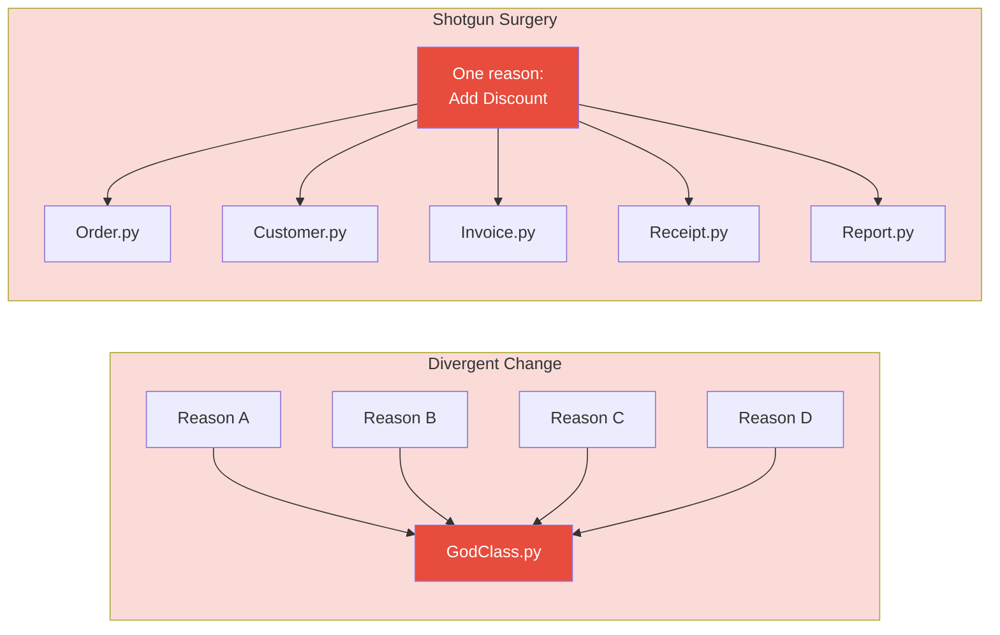
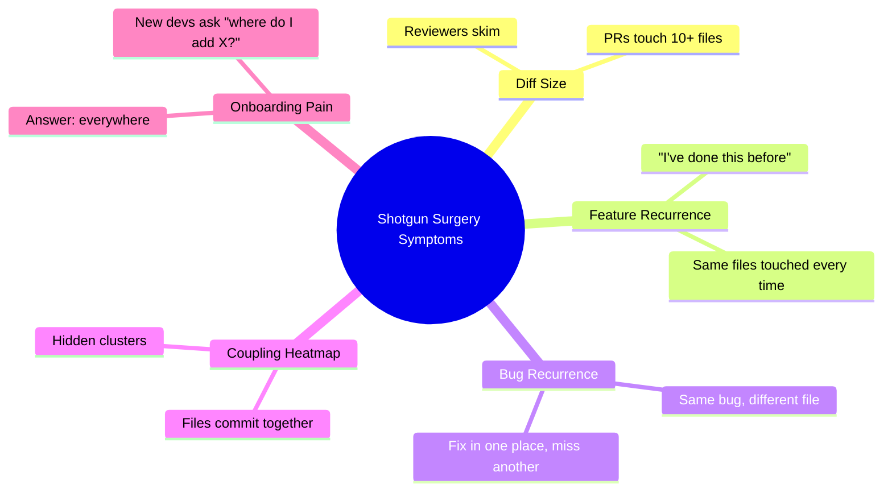
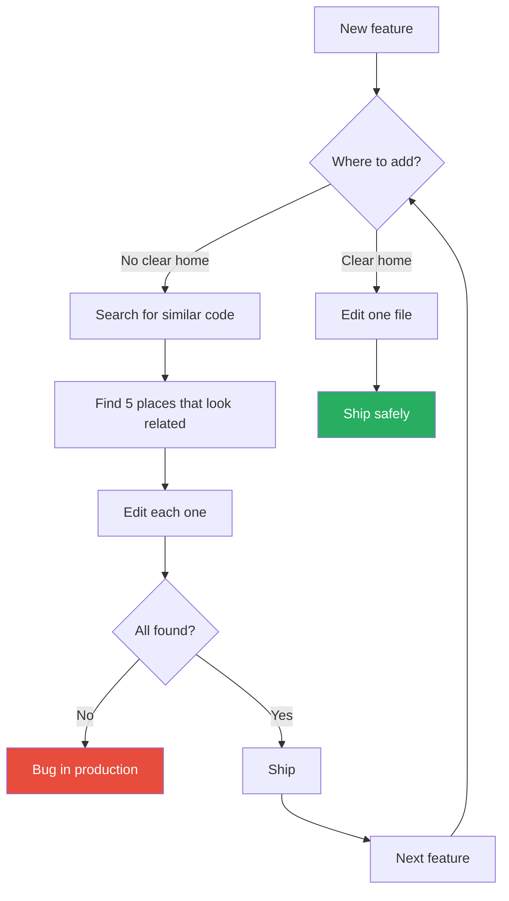
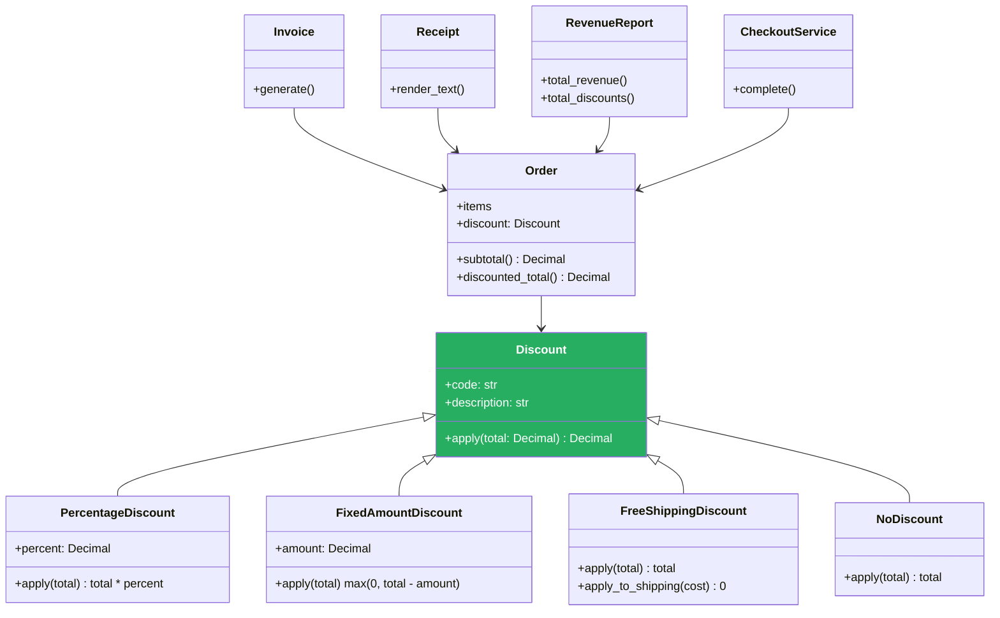
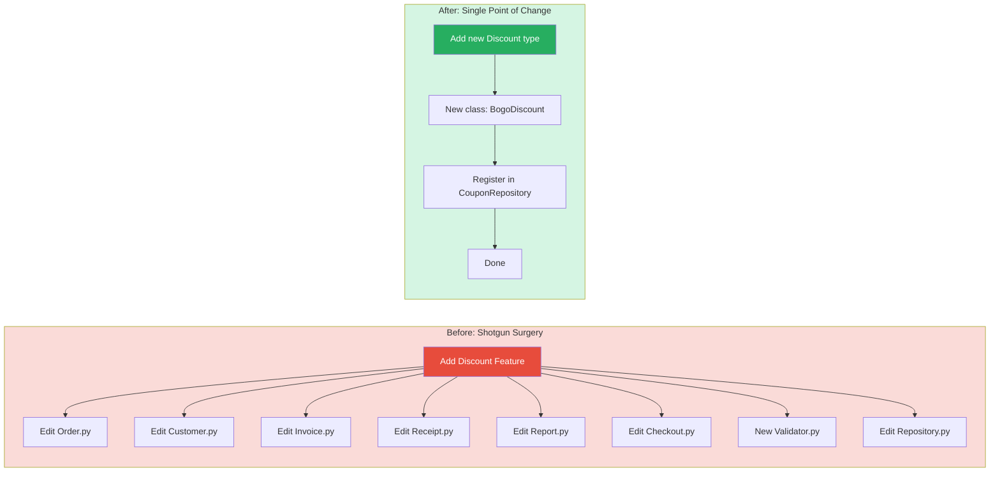
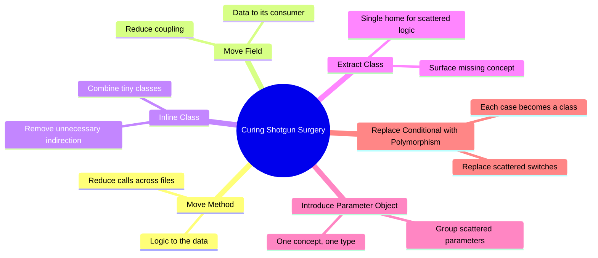
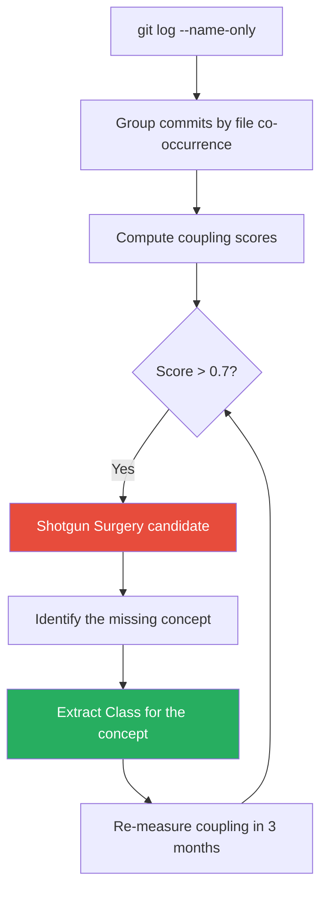
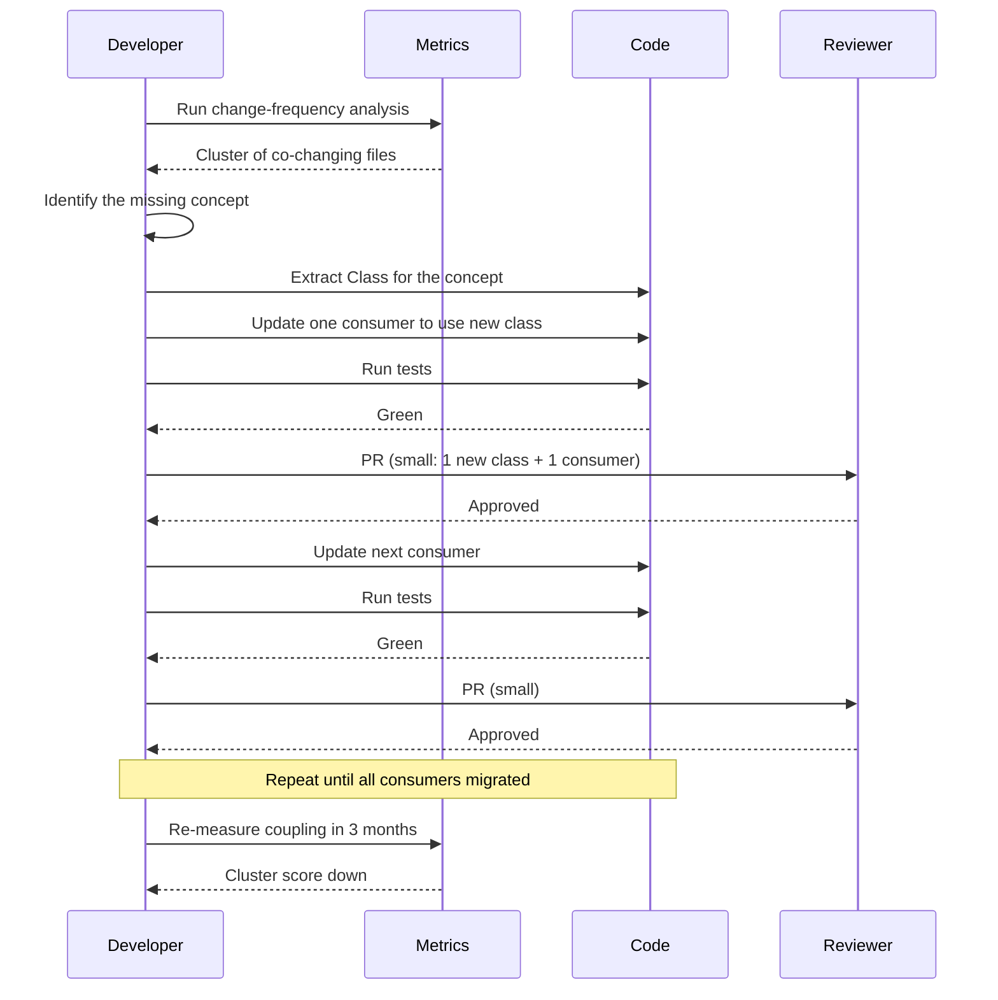

# Shotgun Surgery

#oop #antipatterns #shotgun-surgery #coupling #refactoring #teaching #deep-dive

> [!quote] Martin Fowler
> "Shotgun Surgery is similar to Divergent Change, but it is the other way around. You whiffle along, and when you make a change you have to make a lot of little changes to a lot of different classes."

**Shotgun Surgery** is the anti-pattern where a single logical change to the software requires editing *many* classes, modules, or files. The change is "shotgun" in the sense that the developer must spray edits across the codebase — one tweak here, one there, another over there — hoping to hit every spot that needs updating. Inevitably, some spot is missed, and the system breaks in subtle, late-discovered ways.

Shotgun Surgery is the change-preventer counterpart to [[God-Object]] (where one class is touched for many reasons). In a God Object, *many* reasons to change collide in *one* file. In Shotgun Surgery, *one* reason to change is scattered across *many* files. Both are SRP failures, but with opposite geometry.

This note covers what Shotgun Surgery is, its symptoms and causes, how it differs from Divergent Change, the refactorings that consolidate scattered logic, a complete worked example (adding a "discount" feature that touches five classes), and the change-frequency analysis that detects it empirically.

Prerequisites: [[Code-Smells]], [[Single-Responsibility]], [[Classes-And-Objects]].

---

## 1. What Is Shotgun Surgery?

> [!important] Definition
> **Shotgun Surgery** is the situation in which a single logical change to the system — adding a new feature, changing a business rule, modifying a data format — requires edits to many different classes or files.

The name comes from the shotgun metaphor: instead of a precise sniper shot (one change in one place), the developer fires a scatter of pellets (many small changes scattered across the codebase). Each pellet by itself is small; the problem is that you must hit every pellet, and missing one is silent.

### 1.1 The Geometric Contrast

| Anti-pattern | Geometry | Example |
|--------------|----------|---------|
| **Divergent Change** | One file ← many reasons to change | `GodManager` is edited for the DB refactor, then for the UI tweak, then for the billing rule. |
| **Shotgun Surgery** | One reason to change → many files | Adding "discount" touches `Order`, `Customer`, `Invoice`, `Receipt`, `Report`. |

These are the two sides of SRP violation: in Divergent Change, the class has too many responsibilities; in Shotgun Surgery, one responsibility is scattered across too many classes.



---

## 2. Symptoms of Shotgun Surgery

The symptoms are operational — you feel them while trying to ship a feature.

### 2.1 The "I Just Need to Touch a Few More Files" Pattern

You start a feature thinking it will take a day. By the end of the day you have edited 8 files. By day three you have edited 14. Each file change feels small and necessary. The aggregate is a sprawling diff that no reviewer can hold in their head.

### 2.2 The PR That Nobody Wants to Review

The pull request touches 23 files. The reviewer skims, asks two questions, approves. The subtle bug in `Receipt.py` line 47 — a discount that should have been applied but wasn't — slips through.

### 2.3 The Feature That Recurs

Every time the team adds a "similar" feature, the same set of files gets touched. After the third instance, a senior developer says "we really should refactor this", but the next deadline postpones the refactor. By the fifth instance, the pattern is institutionalised.

### 2.4 The Bug That Repeats

A bug is reported: "discounts are sometimes not applied to digital receipts". The team fixes it in `Receipt.py`. Two weeks later: "discounts are sometimes not applied to printed invoices". The team fixes it in `Invoice.py`. The same bug, in two places, because the same logic lives in two places.

### 2.5 The Coupling Heatmap

When you visualise which files change together (a **coupling heatmap**), clusters appear: files that always commit together. Those clusters are Shotgun Surgery candidates — they should probably be one file.



---

## 3. Why Shotgun Surgery Is Bad

### 3.1 Error-Prone

Each file change is a chance to miss something. The developer must remember to update every spot — and human memory is fragile. The classic failure: "I forgot to update the audit log".

### 3.2 Hard to Track

Code review tools show diffs file-by-file. A logically unified change, scattered across 15 files, looks like 15 unrelated edits. Reviewers lose the thread.

### 3.3 Slow

Even when the developer remembers every spot, *finding* every spot takes time. Code search helps but is unreliable: the discount logic might be called "discount", "promo", "coupon", "reduction", "markdown", "voucher" — depending on who wrote each file.

### 3.4 Demoralising

Developers hate Shotgun Surgery. Each file feels like "didn't I just do this somewhere else?". The work is repetitive and uncreative. Morale drops. Turnover follows.

### 3.5 Resists Parallel Work

Two developers cannot add two related features simultaneously, because both touch the same scattered set of files. Merge conflicts explode.

### 3.6 Encourages God Objects (the Wrong Cure)

Frustrated by Shotgun Surgery, a developer says "let's put all this in one class so we don't have to touch many files". They create a God Object. Now they have the opposite problem. Both are SRP violations.

---

## 4. How Shotgun Surgery Forms

### 4.1 Missing Abstraction

The deepest cause. The codebase has a concept (Discount, PricingRule, ShippingMethod, TaxBracket) that should be a single class, but no one ever extracted it. The concept's logic lives inline in many places — each place computing it slightly differently.

### 4.2 Tight Coupling Through Shared Mutables

Two classes share a mutable data structure (e.g., a global `pricing_rules` dict). Changing the structure requires updating every reader.

### 4.3 Premature Decomposition

The team over-applied SRP and split a single concept into many tiny classes (see [[Spaghetti-Code#Ravioli-Code|Ravioli Code]]). Now changing the concept means touching every class.

### 4.4 Copy-Paste Inheritance

The same code block was pasted into multiple files. The block encodes a rule; the rule changes; every block must be updated.

### 4.5 Leaky Abstractions

An abstraction that should hide its implementation detail actually exposes it. Callers depend on the detail. When the detail changes, every caller must be updated.

### 4.6 The "Add a Field" Cascade

A new field is added to a domain object. Every layer that touches the object — controller, service, repository, serializer, validator — must be updated to handle the field. This is a *normal* amount of cascade in a layered architecture, but if the field touches 10+ unrelated places, the architecture is wrong.



---

## 5. The Canonical Example: Adding "Discount"

Let us walk through a textbook Shotgun Surgery. The codebase is a small e-commerce system. The feature to add: **a discount system** — customers can apply a coupon code that reduces the order total.

### 5.1 The Codebase Before

```python
# order.py
@dataclass
class Order:
    id: int
    customer_id: int
    items: list[OrderItem]
    total: Decimal
    status: str  # "pending", "paid", "shipped"

# customer.py
@dataclass
class Customer:
    id: int
    name: str
    email: str
    is_vip: bool

# invoice.py
class Invoice:
    def __init__(self, order: Order, customer: Customer):
        self.order = order
        self.customer = customer

    def generate(self) -> dict:
        return {
            "customer": self.customer.name,
            "total": self.order.total,
            "items": [item.to_dict() for item in self.order.items],
        }

# receipt.py
class Receipt:
    def __init__(self, order: Order, customer: Customer):
        self.order = order
        self.customer = customer

    def render_text(self) -> str:
        lines = [f"Receipt for {self.customer.name}"]
        for item in self.order.items:
            lines.append(f"  {item.name}: {item.price}")
        lines.append(f"Total: {self.order.total}")
        return "\n".join(lines)

# report.py
class RevenueReport:
    def __init__(self, orders: list[Order]):
        self.orders = orders

    def total_revenue(self) -> Decimal:
        return sum(o.total for o in self.orders)

# checkout.py
class CheckoutService:
    def complete(self, order: Order, customer: Customer) -> None:
        # apply VIP discount
        if customer.is_vip:
            order.total *= Decimal("0.9")
        # charge
        charge_card(customer, order.total)
        order.status = "paid"
```

### 5.2 The Feature: "Add coupon-code discounts"

The product team wants customers to enter a coupon code at checkout. Different coupons give different discounts (10% off, $5 off, free shipping, etc.).

The developer starts. They need to:

1. **`order.py`** — add `coupon_code: str | None` field.
2. **`customer.py`** — add `applied_coupons: list[str]` field (so we know what they've used).
3. **`checkout.py`** — apply coupon-based discount (in addition to the existing VIP logic).
4. **`invoice.py`** — show the coupon code and the discounted amount on the invoice.
5. **`receipt.py`** — show the coupon code and the discount on the receipt.
6. **`report.py`** — the revenue report must subtract discounts (or it will overstate revenue).
7. **`validator.py`** (new file) — validate that the coupon code is real, not expired, not already used.
8. **`repository.py`** — add a `CouponRepository` to fetch coupon definitions.

Eight files, one feature. That is Shotgun Surgery.

### 5.3 Why It Happened

The system has *no `Discount` concept*. Discount logic is implicit — inline in `CheckoutService`, missing from `Invoice` and `Receipt`, partially present in `Customer.is_vip`. Adding a new *kind* of discount forces the developer to touch every place that *should have* known about discounts but doesn't.

### 5.4 The Wrong Fix: God Object

The developer, frustrated, says "let's put all discount logic in one place" and creates a `DiscountService` that *also* owns invoice rendering, receipt rendering, and revenue reporting. Now `DiscountService` is a God Object. The Shotgun Surgery is cured but the God Object is born.

### 5.5 The Right Fix: Extract a Discount Concept

The cure is to introduce a **`Discount` abstraction** that owns the discount logic, and have every other class *delegate* to it. Then "adding a discount" is one change in one place (the Discount class), and every consumer automatically benefits.



### 5.6 The Refactored Code

```python
# discount.py — the new abstraction
from abc import ABC, abstractmethod
from decimal import Decimal

class Discount(ABC):
    """A discount applied to an order total."""

    @property
    @abstractmethod
    def code(self) -> str: ...

    @property
    @abstractmethod
    def description(self) -> str: ...

    @abstractmethod
    def apply(self, subtotal: Decimal) -> Decimal:
        """Return the total after this discount."""
        ...

    @property
    def amount_saved(self) -> Decimal:
        """Filled by subclasses after apply() is called."""
        return getattr(self, "_saved", Decimal("0"))


class NoDiscount(Discount):
    @property
    def code(self): return "NONE"
    @property
    def description(self): return "No discount applied"
    def apply(self, subtotal):
        self._saved = Decimal("0")
        return subtotal


class PercentageDiscount(Discount):
    def __init__(self, code: str, percent: Decimal):
        self._code = code
        self._percent = percent

    @property
    def code(self): return self._code
    @property
    def description(self): return f"{self._percent * 100}% off"

    def apply(self, subtotal):
        self._saved = subtotal * self._percent
        return subtotal - self._saved


class FixedAmountDiscount(Discount):
    def __init__(self, code: str, amount: Decimal):
        self._code = code
        self._amount = amount

    @property
    def code(self): return self._code
    @property
    def description(self): return f"${self._amount} off"

    def apply(self, subtotal):
        self._saved = min(self._amount, subtotal)
        return subtotal - self._saved


class VipDiscount(PercentageDiscount):
    """The existing VIP 10% off, now a Discount subclass."""
    def __init__(self):
        super().__init__(code="VIP", percent=Decimal("0.10"))
```

```python
# order.py — Order now owns its discount
@dataclass
class Order:
    id: int
    customer_id: int
    items: list[OrderItem]
    discount: Discount = field(default_factory=NoDiscount)
    status: str = "pending"

    def subtotal(self) -> Decimal:
        return sum(item.line_total for item in self.items)

    def discounted_total(self) -> Decimal:
        return self.discount.apply(self.subtotal())

    @property
    def amount_saved(self) -> Decimal:
        return self.discount.amount_saved
```

```python
# checkout.py — applies whichever discount is appropriate
class CheckoutService:
    def __init__(self, coupons: CouponRepository, payments: PaymentGateway):
        self._coupons = coupons
        self._payments = payments

    def complete(self, order: Order, customer: Customer,
                 coupon_code: str | None = None) -> None:
        order.discount = self._resolve_discount(customer, coupon_code)
        total = order.discounted_total()
        self._payments.charge(customer, total)
        order.status = "paid"

    def _resolve_discount(self, customer: Customer,
                          coupon_code: str | None) -> Discount:
        if coupon_code:
            return self._coupons.get(coupon_code)
        if customer.is_vip:
            return VipDiscount()
        return NoDiscount()
```

```python
# invoice.py — shows discount automatically
class Invoice:
    def __init__(self, order: Order, customer: Customer):
        self.order = order
        self.customer = customer

    def generate(self) -> dict:
        return {
            "customer": self.customer.name,
            "subtotal": self.order.subtotal(),
            "discount_code": self.order.discount.code,
            "discount_description": self.order.discount.description,
            "amount_saved": self.order.amount_saved,
            "total": self.order.discounted_total(),
            "items": [item.to_dict() for item in self.order.items],
        }
```

```python
# receipt.py — shows discount automatically
class Receipt:
    def __init__(self, order: Order, customer: Customer):
        self.order = order
        self.customer = customer

    def render_text(self) -> str:
        lines = [f"Receipt for {self.customer.name}"]
        for item in self.order.items:
            lines.append(f"  {item.name}: {item.price}")
        lines.append(f"Subtotal: {self.order.subtotal()}")
        if not isinstance(self.order.discount, NoDiscount):
            lines.append(f"Discount ({self.order.discount.code}): "
                         f"-{self.order.amount_saved}")
        lines.append(f"Total: {self.order.discounted_total()}")
        return "\n".join(lines)
```

```python
# report.py — revenue and discounts separately
class RevenueReport:
    def __init__(self, orders: list[Order]):
        self.orders = orders

    def gross_revenue(self) -> Decimal:
        return sum(o.subtotal() for o in self.orders)

    def total_discounts(self) -> Decimal:
        return sum(o.amount_saved for o in self.orders)

    def net_revenue(self) -> Decimal:
        return self.gross_revenue() - self.total_discounts()
```

### 5.7 The Result

Now adding a new discount type — say, "Buy One Get One" — is one new class (`BogoDiscount`) and one line in `CouponRepository`. The order, invoice, receipt, and report code do not change. The Shotgun Surgery is gone.

Adding a *new feature that depends on discount* — say, "show discount on the customer's dashboard" — is one method on the dashboard class that reads `order.discount`. No other files change.



---

## 6. The Refactorings That Cure Shotgun Surgery

Fowler's catalog includes four refactorings that directly attack Shotgun Surgery:

### 6.1 Move Method

A method lives in class A but operates mostly on class B's data. Move it to B. Now callers of B don't need to call A, and the logic is colocated with its data.

```python
# Before: discount logic in CheckoutService, operating on Order data
class CheckoutService:
    def apply_discount(self, order, customer):
        if customer.is_vip:
            order.total *= 0.9

# After: moved to Order (which knows its own data)
class Order:
    def apply_discount(self, discount: Discount):
        self.total = discount.apply(self.subtotal())
```

### 6.2 Move Field

A field lives in class A but is used only by code that should be in class B. Move the field. The data and its consumers are colocated.

```python
# Before: coupon_code lives on Customer but is used only by Order logic
@dataclass
class Customer:
    coupon_code: str | None

# After: moved to Order
@dataclass
class Order:
    coupon_code: str | None
```

### 6.3 Inline Class

A class has become so small (because its methods have been moved elsewhere) that it no longer justifies its existence. Fold its remaining behaviour into its caller. (See [[Code-Smells#Lazy Class|Lazy Class]].)

### 6.4 Extract Class

When a concept is missing — as in our discount example — extract it into a new class. The new class becomes the single home for the concept; every other class delegates to it.

### 6.5 The Consolidation Mindmap



---

## 7. Detection: Change-Frequency Analysis

The most reliable detector of Shotgun Surgery is **change-frequency analysis**: which files tend to be committed together?

### 7.1 The Git Log Approach

```bash
# Files most frequently co-modified with order.py
git log --name-only --pretty=format: | \
  grep -A1 "order.py" | grep -v "order.py" | \
  sort | uniq -c | sort -rn | head -20

# Files most frequently changed (the "hot" files)
git log --since="2 years ago" --name-only --pretty=format: | \
  sort | uniq -c | sort -rn | head -30
```

If `order.py`, `invoice.py`, `receipt.py`, and `report.py` are *always* in the same commit, they are Shotgun Surgery candidates. The pattern says: "these files change together because they encode the same concept in different forms".

### 7.2 The Heatmap

Tools like `code-maat`, `git-of-theseus`, or `SonarQube`'s cross-component coupling analysis produce a **coupling heatmap**: a matrix of "files that change together". Diagonal cells (file changes with itself) are uninteresting. Off-diagonal hot cells are the signal.

|        | order.py | invoice.py | receipt.py | report.py | checkout.py |
|--------|----------|------------|------------|-----------|-------------|
| order.py     | — | **0.95** | **0.92** | **0.88** | 0.45 |
| invoice.py   | **0.95** | — | **0.85** | 0.30 | 0.25 |
| receipt.py   | **0.92** | **0.85** | — | 0.28 | 0.22 |
| report.py    | **0.88** | 0.30 | 0.28 | — | 0.10 |
| checkout.py  | 0.45 | 0.25 | 0.22 | 0.10 | — |

The 0.85+ cells in the top-left corner scream "these four files are one concept in disguise".



### 7.3 The PR-Size Heuristic

A practical heuristic: **if a single logical feature typically requires a PR of more than 5 files, you have Shotgun Surgery**. Track this metric over time. A healthy codebase has most features touch 1–3 files.

---

## 8. Related Anti-Patterns and Smells

- **[[Code-Smells#Divergent Change|Divergent Change]]** — the dual anti-pattern. One file changed for many reasons. The cure is the same family: Extract Class by responsibility.
- **[[Code-Smells#Parallel Inheritance Hierarchies|Parallel Inheritance Hierarchies]]** — a special case where Shotgun Surgery happens across two inheritance trees.
- **[[Code-Smells#Feature Envy|Feature Envy]]** — a method envying another class's data is often the *cause* of Shotgun Surgery: the envied logic is duplicated in many places. Move Method cures both.
- **[[Code-Smells#Data Clumps|Data Clumps]]** — when the same parameters travel together, they are a missing concept. Extract Class for the clump.
- **[[God-Object]]** — the over-correction. Curing Shotgun Surgery by piling everything into one class produces a God Object. The correct cure is the *right* abstraction, not the absence of abstraction.
- **[[Spaghetti-Code]]** — spaghetti is control-flow tangled; Shotgun Surgery is responsibility scattered. They co-occur in legacy code.

---

## 9. When Shotgun Surgery Is (Barely) Acceptable

- **Cross-cutting concerns** that genuinely belong everywhere — logging, error handling, telemetry. The cure is not consolidation but a consistent mechanism (decorators, middleware, aspects) so that the change is *one* mechanism, applied uniformly.
- **Adding a new field to a domain object** in a layered architecture. The field naturally appears in the entity, the DTO, the serializer, the validator, and the database schema. This is *expected* cascade, not Shotgun Surgery — as long as each layer's update is mechanical and the rule does not require new business logic in 10 places.
- **Refactoring itself**. A big refactoring may touch many files. That is not Shotgun Surgery; it is the cure for Shotgun Surgery. The difference: after the refactoring, future changes touch fewer files.

> [!warning] Common Student Misconception
> Students often confuse "I had to edit many files" with "I have Shotgun Surgery". Editing many files once is not the anti-pattern. The anti-pattern is *recurring* multi-file edits for the *same kind* of change. Track the pattern over months, not over a single PR.

---

## 10. Common Student Misconceptions

> [!warning] Misconception 1: "Shotgun Surgery means I edited many files."
> Not quite. It means *the same kind* of change recurs across many files. A one-time migration that touches 30 files is not Shotgun Surgery; a feature pattern that touches 8 files *every time* is.

> [!warning] Misconception 2: "The cure is to put everything in one class."
> No. That produces a God Object. The cure is to find the *missing concept* and extract a class for it. Other classes delegate.

> [!warning] Misconception 3: "If I add a field to a data class, I expect to touch every layer — that's normal."
> Yes, *adding a field* is normal cross-layer cascade. The smell is when *changing the rule* (not the data) requires touching every layer.

> [!warning] Misconception 4: "We can fix Shotgun Surgery with better search."
> No. Search helps you *find* the scattered spots, but you still have to update them all and remember every spot. The fix is structural: consolidate the concept.

> [!warning] Misconception 5: "Microservices fix Shotgun Surgery."
> No. Shotgun Surgery at the service boundary is worse: a single change now requires deploying multiple services, often in a careful order. The cure is the same: find the right service boundary (the right concept) and put the logic there.

> [!warning] Misconception 6: "Shotgun Surgery is unavoidable in large systems."
> False. Large systems with good abstractions have *less* Shotgun Surgery than small systems with bad ones. Size does not cause the pattern; missing abstractions do.

> [!warning] Misconception 7: "Refactoring will fix Shotgun Surgery in one big PR."
> No. The consolidation is iterative: identify one missing concept, extract it, update callers over several PRs, measure, repeat. Forcing a big-bang refactor risks introducing bugs and overwhelms reviewers.

---

## 11. The Process: Curing Shotgun Surgery Step by Step



The key is **small, frequent PRs** that each move *one* consumer to the new abstraction. Each PR is reviewable in 15 minutes. The total migration may take a quarter, but at no point is the codebase in a broken state.

---

## 12. Exercises

> [!exercise] Exercise 1: Find the Shotgun
> In your codebase, run `git log --name-only --pretty=format: | sort | uniq -c | sort -rn | head -30` over the last year. Which files appear together most often? Identify the missing concept.

> [!exercise] Exercise 2: PR Audit
> Review your last 10 feature PRs. For each, count the files touched. Plot the distribution. Is the median above 5? If so, you have Shotgun Surgery.

> [!exercise] Exercise 3: Discount Refactor
> Take the "Add Discount" example from Section 5. Implement it both ways (with and without the `Discount` abstraction). Compare the diff size for "add a new discount type: spend-$100-get-$20-off".

> [!exercise] Exercise 4: Cross-Cutting Concerns
> Identify a cross-cutting concern in your codebase (logging, auth, tracing). Is it implemented consistently across all files, or duplicated? If duplicated, propose the consolidation.

> [!exercise] Exercise 5: Avoiding the God-Object Trap
> A colleague proposes: "Let's fix our Shotgun Surgery by putting all order-related logic in one `OrderService` class." Write a 200-word response explaining why this trades one anti-pattern for another, and what the right cure looks like.

---

## 13. Summary

- **Shotgun Surgery** is when one logical change requires edits across many files. It is the dual of Divergent Change (one file, many reasons).
- Symptoms: large PRs, recurring multi-file changes, repeated bugs across files, low reviewer engagement, slow feature delivery.
- Causes: **missing abstraction**, tight coupling through shared mutables, premature decomposition, copy-paste, leaky abstractions.
- The cure is **consolidation through the right abstraction**: extract a class for the missing concept, then have every consumer delegate to it.
- The four Fowler refactorings that directly attack Shotgun Surgery: **Move Method**, **Move Field**, **Inline Class**, **Extract Class**.
- **Detection** is empirical: change-frequency analysis (git log), coupling heatmaps, PR-size distributions.
- Avoid the **over-correction trap**: do not consolidate into a God Object. Find the right concept and put it in one place; let consumers delegate.
- The cure is **iterative**: small PRs, one consumer at a time, re-measure coupling after a quarter.

Read [[Refactoring-Strategies]] next for the systematic techniques behind Extract Class, Move Method, and the rest of the cure.

---

## 14. Further Reading

- Martin Fowler, *Refactoring* (2nd ed., 2018) — "Move Method", "Move Field", "Inline Class", "Extract Class".
- Adam Tornhill, *Your Code as a Crime Scene* (2015) — change-frequency analysis, coupling heatmaps, code-maat.
- Robert C. Martin, *Clean Architecture* (2017) — Chapters 7 (SRP) and 22 (the Facade).
- SonarQube documentation on "Cross-Component Coupling".
- [[Code-Smells]] — the parent catalogue.
- [[Single-Responsibility]] — the underlying SOLID violation.
- [[God-Object]] — the over-correction trap.
- [[Refactoring-Strategies]] — the systematic cure.

---

**Previous**: [[Spaghetti-Code]]
**Next**: [[Refactoring-Strategies]]
