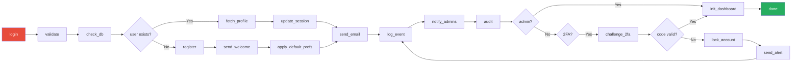
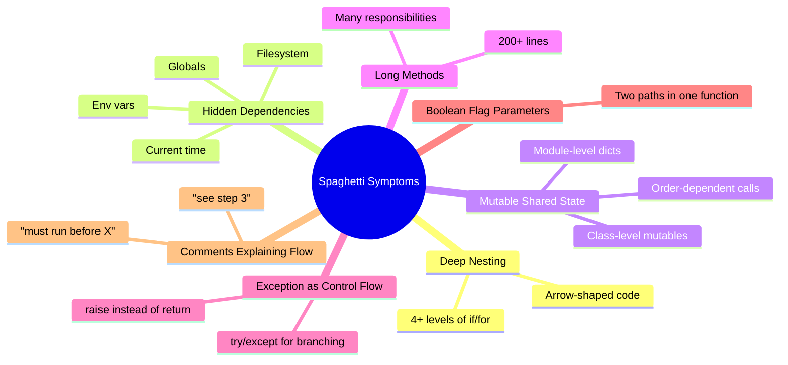
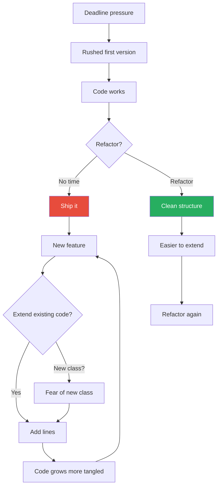
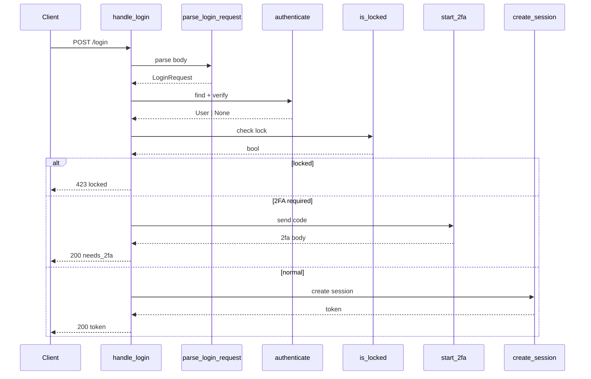
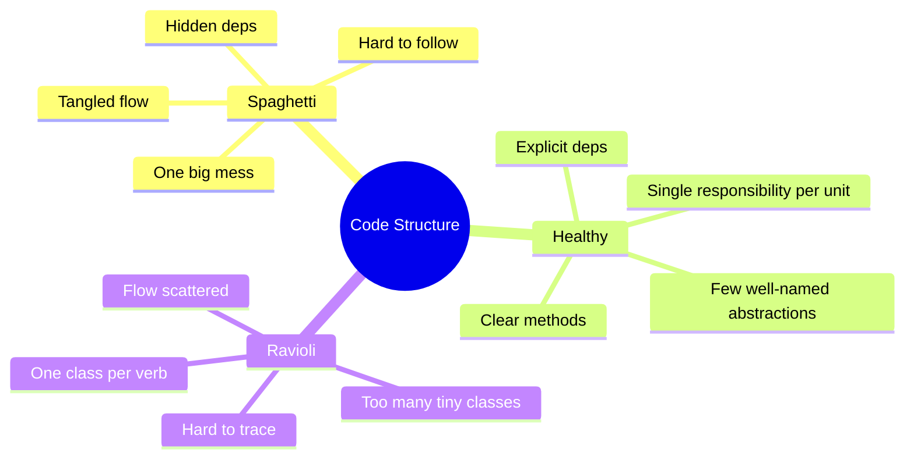
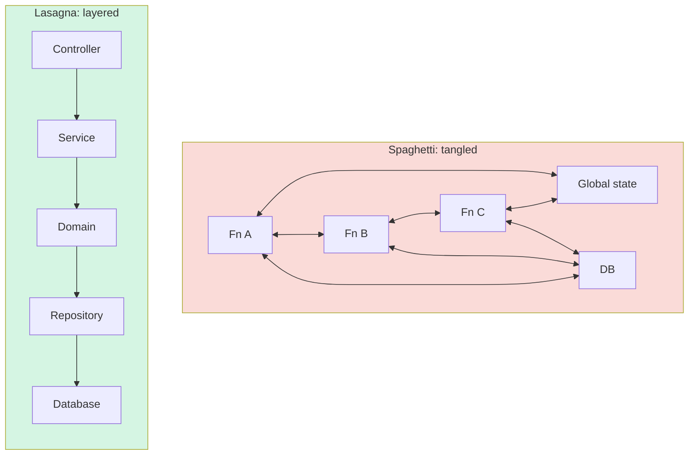

# Spaghetti Code

#oop #antipatterns #spaghetti-code #control-flow #refactoring #teaching #deep-dive

> [!quote] Martin Fowler
> "Any fool can write code that a computer can understand. Good programmers write code that humans can understand."

**Spaghetti Code** is the anti-pattern of tangled, unstructured control flow. Functions call functions that mutate state that affects later decisions in distant modules; nested conditionals burrow seven levels deep; the same variable is reused for five different purposes; the reader's eye bounces between files, classes, and globals trying to reconstruct the actual sequence of operations. The code looks like a plate of spaghetti — long, tangled, and impossible to follow from one end to the other.

Spaghetti is one of the oldest named anti-patterns (the term dates to the 1970s, originally about `goto`-laden BASIC and FORTRAN). It is also the anti-pattern most laypeople recognise, because the symptoms — "I changed one line and broke something unrelated" — are universally felt. This note covers what Spaghetti Code is, its symptoms and causes, its OOP-specific variant (procedural code wrapped in classes), the opposite extreme of **Ravioli Code**, the healthier **Lasagna** alternative, and the refactorings that untangle the plate.

Prerequisites: [[Code-Smells]], [[Methods-And-Functions]], [[Encapsulation]], [[Classes-And-Objects]].

---

## 1. What Is Spaghetti Code?

> [!important] Definition
> **Spaghetti Code** is code whose control flow is tangled and unstructured: long, deeply nested functions, hidden dependencies, mutable shared state, and no clear separation between concerns. The reader cannot predict, from one piece of code, what other pieces will be touched when it runs.

The defining property is **unpredictable control flow**: the reader cannot trace, top-to-bottom, what happens next. Code "jumps" via hidden function calls, exception-based flow, mutable globals, and event-driven side effects. The opposite of spaghetti is not "short code" — it is **code whose structure makes its behaviour legible**.

### 1.1 The Plate of Spaghetti



That flowchart looks like a plate of spaghetti — and so does the code that implements it. The reader must follow every line, mentally, to know what happens. There is no high-level summary, no clear separation of "validating", "authenticating", "notifying".

### 1.2 Spaghetti vs God Object

Spaghetti and [[God-Object]] are related but distinct anti-patterns:

| Property | Spaghetti | God Object |
|----------|-----------|------------|
| **Primary axis** | Control flow | Class structure |
| **Symptom** | Hard to follow what happens | Hard to understand what the class is for |
| **Cause** | No design, no extraction, `goto`-style jumps | Accretion of responsibilities |
| **Cure** | Extract Method, guard clauses, polymorphism | Extract Class |
| **Overlap** | A God Object is often spaghetti internally | Spaghetti often lives inside one giant class |

A codebase can have one without the other, but in legacy systems they usually co-occur.

---

## 2. Symptoms of Spaghetti Code

The symptoms are concrete and learnable. Train yourself to spot them.

### 2.1 Deep Nesting

Conditionals nested inside loops inside try/except inside conditionals. Each level adds cognitive load. The classic rule: **more than two levels of nesting is suspicious; more than three is spaghetti.**

```python
# === SMELL: Deep Nesting ===
def process_orders(orders):
    for order in orders:
        if order.status == "pending":
            if order.payment_method == "card":
                try:
                    result = charge_card(order)
                    if result.success:
                        if result.amount >= order.total:
                            order.status = "paid"
                            if order.shipping_address:
                                try:
                                    shipment = create_shipment(order)
                                    if shipment.tracking_number:
                                        order.tracking = shipment.tracking_number
                                        send_email(order.customer.email, "Shipped!")
                                        # ... and so on, 8 levels deep
```

### 2.2 Hidden Dependencies

The function depends on something the signature does not reveal: a global variable, a module-level singleton, a mutable argument that should be read-only, the current time, an environment variable, the filesystem.

```python
# === SMELL: Hidden Dependencies ===
import os
from datetime import datetime

def calculate_price(product):
    base = product.base_price
    # Hidden dependency on os.environ
    if os.environ.get("DISCOUNT_CAMPAIGN") == "active":
        base *= 0.8
    # Hidden dependency on current time
    if datetime.now().hour < 12:
        base *= 0.95  # morning discount
    return base
```

### 2.3 Mutable Shared State

Multiple functions mutate the same global or module-level object. The order of calls matters; calling `init()` after `process()` crashes; calling `process()` twice produces different results.

```python
# === SMELL: Mutable Shared State ===
_cache = {}
_current_user = None

def login(email):
    global _current_user
    _current_user = fetch_user(email)
    _cache[_current_user.id] = []

def add_to_cache(key, value):
    _cache[_current_user.id].append((key, value))   # crashes if login() not called

def logout():
    global _current_user
    _current_user = None   # _cache still holds the data — leak
```

### 2.4 Long Methods That Do Everything

A 200-line method that validates input, calls the database, sends an email, writes to a log, and returns a result. (See Long Method in [[Code-Smells]].)

### 2.5 Exception-Based Flow Control

Using `try`/`except` to handle ordinary control flow ("try to find the user; if NotFound, register them") instead of using an explicit check. This hides the happy path behind exception machinery.

```python
# === SMELL: Exception as control flow ===
def get_or_create_user(email):
    try:
        user = db.find_user(email)
    except UserNotFoundError:
        user = User(email=email)
        db.save(user)
    return user

# === FIX: Explicit check ===
def get_or_create_user(email):
    user = db.find_user_by_email(email)
    if user is None:
        user = User(email=email)
        db.save(user)
    return user
```

### 2.6 Boolean Flag Parameters

A function takes a `flag: bool` and has two completely different code paths inside. The caller cannot tell from the call site which path runs.

```python
# === SMELL: Boolean flag ===
def process(order, is_vip=False):
    if is_vip:
        # 50 lines of VIP processing
        ...
    else:
        # 50 lines of normal processing
        ...

# === FIX: Two methods ===
def process_normal(order): ...
def process_vip(order): ...
```

### 2.7 Comments That Explain the Flow

If a method needs comments like `# now we go back to step 3` or `# important: this must run before the next block`, the control flow is implicit. The reader needs the comments because the code structure does not communicate the order.



---

## 3. Why Spaghetti Code Is Bad

The symptoms compound into systemic problems:

### 3.1 Unreadable

You cannot hold the entire flow in your head. You read line 200, forget what line 50 did, scroll up, lose your place, scroll back. Code review becomes superficial — reviewers skim and approve.

### 3.2 Unmaintainable

A change in one place breaks something far away, because the connection is implicit. The fix is not "be more careful" — it is "make the structure explicit so the connection is visible".

### 3.3 Untestable

To test a single function, you must set up the global state, the database, the cache, the current time, the environment variables. The test setup dwarfs the test logic. And because state is shared, tests interfere with each other unless carefully isolated.

### 3.4 Error-Prone

Hidden dependencies mean a refactor that "should be safe" isn't. Mutable shared state means a function called twice can produce different results. Boolean flags mean a caller can pass the wrong value. Each symptom is a bug vector.

### 3.5 Hostile to Onboarding

New developers take weeks to become productive in a spaghetti codebase. They cannot trace a feature from the entry point to the database. They give up trying to understand and instead cargo-cult: copy the nearest similar code, change one variable, pray.

---

## 4. How Spaghetti Code Forms

Spaghetti is rarely intentional. It forms through:

### 4.1 Rushed Development

A deadline forces the developer to "just make it work". Structure is deferred. Once shipped, the working code is never refactored — new features are added in the same rushed style, on top of the existing tangle.

### 4.2 No Design Phase

The developer starts typing before understanding the data flow. Each function is written to handle the immediate need; no thought is given to how functions compose. The result is functions that overlap, call each other in surprising orders, and mutate shared state.

### 4.3 No Refactoring Discipline

Code that starts clean becomes spaghetti through accretion. Without the rule of "leave code better than you found it" (the Boy Scout Rule — see [[Refactoring-Strategies]]), small messes accumulate.

### 4.4 Fear of New Abstractions

The developer is reluctant to introduce a new class or a new function because "it's just one more line". So they add the line to the existing 200-line function. The function grows; the tangle grows with it.

### 4.5 Copy-Paste Programming

The developer copies a block of code, modifies two lines, and pastes it elsewhere. The two copies diverge; bugs fixed in one are not fixed in the other. Eventually the codebase is full of half-identical tangled blocks.

### 4.6 Procedural Thinking in an OOP Language

The developer writes functions (in a class, because the language requires it) that mutate shared state. The class is just a namespace. This is **OOP spaghetti** — see Section 5.



---

## 5. OOP Spaghetti: Procedural Code in a Class Wrapper

A specific and very common flavour: the developer uses an OOP language but writes procedural code. The class is a namespace; the methods are functions that share mutable instance state. The symptoms are the same as classic spaghetti, but with `self.` prefixes.

```python
# === SMELL: OOP Spaghetti ===
class OrderProcessor:
    def __init__(self):
        self.order = None
        self.customer = None
        self.result = None
        self.errors = []

    def process(self, order_id):
        self.order = db.get_order(order_id)
        if self.order:
            self.customer = db.get_customer(self.order.customer_id)
            if self.customer:
                self._validate()
                if not self.errors:
                    self._apply_discount()
                    self._calculate_tax()
                    self._charge()
                    if self.result:
                        self._ship()
                        self._email()
                        self._log()
                else:
                    self._report_errors()
            else:
                self.errors.append("Customer not found")
        else:
            self.errors.append("Order not found")
        return self.result

    def _validate(self):
        if not self.order.items:
            self.errors.append("Empty order")
        if self.order.total < 0:
            self.errors.append("Negative total")

    def _apply_discount(self):
        if self.customer.is_vip:
            self.order.total *= 0.9

    def _calculate_tax(self):
        rate = 0.07 if self.customer.country == "US" else 0.20
        self.order.total *= (1 + rate)

    def _charge(self):
        self.result = charge_card(self.customer.card_token, self.order.total)

    # ... etc
```

This is procedural code in OOP clothing. The class has *instance state that is shared between methods and reset on every call to `process`*. The methods are not operations on an object — they are steps in a procedure, and `self.order`, `self.customer`, `self.result` are procedure-local variables that happen to live on `self`.

### 5.1 The Smell Test for OOP Spaghetti

Ask: *if I call `process(5)` and then immediately call `process(6)`, does anything carry over from the first call?*

- If "yes" — there is genuine object state. The class might still be a God Object, but it is at least stateful in a meaningful way.
- If "no, but the code uses `self.` everywhere" — OOP spaghetti. The instance state is just a way to avoid passing parameters.

The fix is to **stop using `self` as a parameter bag**. Pass the data explicitly:

```python
# === FIX: Procedural, explicit, readable ===
class OrderProcessor:
    def __init__(self, payment_gateway, shipping_service, mailer):
        self._payments = payment_gateway
        self._shipping = shipping_service
        self._mailer = mailer

    def process(self, order: Order, customer: Customer) -> OrderResult:
        errors = validate(order, customer)
        if errors:
            return OrderResult.failure(errors)

        total = apply_discount(order.total, customer)
        total = apply_tax(total, customer.country)
        charge = self._payments.charge(customer.card_token, total)
        shipment = self._shipping.create(order)
        self._mailer.send(customer.email, f"Shipped: {shipment.tracking}")
        return OrderResult.success(charge, shipment)


def validate(order: Order, customer: Customer) -> list[str]:
    errors = []
    if not order.items:
        errors.append("Empty order")
    if order.total < 0:
        errors.append("Negative total")
    if customer is None:
        errors.append("Customer not found")
    return errors


def apply_discount(total: Decimal, customer: Customer) -> Decimal:
    return total * 0.9 if customer.is_vip else total


def apply_tax(total: Decimal, country: str) -> Decimal:
    rate = 0.07 if country == "US" else 0.20
    return total * (1 + rate)
```

Each function is pure. Each function takes its inputs explicitly. There is no hidden state. The order of operations is visible top-to-bottom in `process`.

---

## 6. The Refactorings That Untangle Spaghetti

### 6.1 Extract Method

The most-used weapon. Pull a chunk of code out of a long method, give it a name, and call it. Repeat until each method is short and does one thing.

```python
# Before (Long Method, deeply nested)
def handle_login(email, password):
    user = db.find_user(email)
    if user and user.check_password(password):
        if user.is_locked:
            return {"error": "locked"}
        if user.needs_2fa:
            code = generate_2fa_code()
            send_email(email, f"Your code: {code}")
            return {"needs_2fa": True, "user_id": user.id}
        token = create_session(user)
        log_event("login", user.id)
        return {"token": token}
    return {"error": "invalid"}

# After (Extract Method × 3 + guard clauses)
def handle_login(email, password):
    user = db.find_user(email)
    if not user or not user.check_password(password):
        return {"error": "invalid"}
    if user.is_locked:
        return {"error": "locked"}
    if user.needs_2fa:
        return start_2fa_challenge(user)
    return complete_login(user)

def start_2fa_challenge(user):
    code = generate_2fa_code()
    send_email(user.email, f"Your code: {code}")
    return {"needs_2fa": True, "user_id": user.id}

def complete_login(user):
    token = create_session(user)
    log_event("login", user.id)
    return {"token": token}
```

### 6.2 Replace Nested Conditional with Guard Clauses

The arrow-shaped code from Section 2.1 becomes flat. Each "if not, return early" is a guard clause.

```python
# === SMELL: Arrow code ===
def get_payment(order):
    if order is not None:
        if order.is_paid:
            if order.payment is not None:
                if order.payment.method == "card":
                    return order.payment.card
                else:
                    return None
            else:
                return None
        else:
            return None
    return None

# === FIX: Guard clauses ===
def get_payment(order):
    if order is None:           return None
    if not order.is_paid:       return None
    if order.payment is None:   return None
    if order.payment.method != "card": return None
    return order.payment.card
```

### 6.3 Replace Conditional with Polymorphism

When the conditional branches on a "type code", replace each branch with a subclass (or strategy). The branching disappears; each subclass handles its own case. (See [[Code-Smells]] Section 4.1.)

```python
# === SMELL: type-code conditional ===
class Shipping:
    def calculate(self, method, weight):
        if method == "standard":
            return weight * 1.0
        elif method == "express":
            return weight * 2.5
        elif method == "overnight":
            return weight * 5.0 + 10

# === FIX: Polymorphism ===
class Shipping(ABC):
    @abstractmethod
    def calculate(self, weight: Decimal) -> Decimal: ...

class StandardShipping(Shipping):
    def calculate(self, w): return w * 1.0

class ExpressShipping(Shipping):
    def calculate(self, w): return w * 2.5

class OvernightShipping(Shipping):
    def calculate(self, w): return w * 5.0 + 10
```

### 6.4 Introduce Parameter Object

A long parameter list — which forces functions to know too many details — becomes a small data class.

```python
# === SMELL: 7 parameters ===
def book_flight(passenger_name, passenger_email, from_airport, to_airport,
                depart_date, return_date, cabin_class, payment_token):
    ...

# === FIX: Parameter object ===
@dataclass
class Passenger: name: str; email: str
@dataclass
class FlightQuery:
    from_airport: str
    to_airport: str
    depart_date: date
    return_date: date
    cabin_class: CabinClass

def book_flight(passenger: Passenger, query: FlightQuery,
                payment_token: str) -> Booking:
    ...
```

### 6.5 Replace Mutable Global with Injected Dependency

Globals become constructor arguments. The function's hidden dependency becomes a visible parameter.

```python
# === SMELL: hidden env-var dependency ===
def calculate_price(product):
    if os.environ.get("DISCOUNT_CAMPAIGN") == "active":
        return product.base_price * 0.8
    return product.base_price

# === FIX: injected config ===
class PriceCalculator:
    def __init__(self, config: Config):
        self._config = config

    def calculate(self, product: Product) -> Decimal:
        if self._config.discount_campaign_active:
            return product.base_price * 0.8
        return product.base_price
```

### 6.6 Replace Temp with Query

A local variable that holds the result of a computation and is used in many places becomes a method call.

```python
# === SMELL: Temp variable, repeated ===
def report(order):
    total = order.items * order.price
    if total > 1000:
        apply_vip_discount(total)
    log(f"Total was {total}")
    return total

# === FIX: Method call ===
def report(order):
    if self.total(order) > 1000:
        apply_vip_discount(self.total(order))
    log(f"Total was {self.total(order)}")
    return self.total(order)

def total(self, order):
    return order.items * order.price
```

(Or, more pragmatically, just compute it once into a well-named local. Both are improvements over scattered logic.)

---

## 7. A Complete Refactoring: The Spaghetti Login Handler

Let us refactor a single tangled method step by step.

```python
# === BEFORE: Spaghetti ===
def handle_login(request, db, cache, mailer):
    if request.method == "POST":
        body = json.loads(request.body)
        email = body.get("email")
        password = body.get("password")
        if email and password:
            user = db.query("SELECT * FROM users WHERE email = ?", (email,)).fetchone()
            if user:
                if user["failed_attempts"] >= 5:
                    cache.set(f"lock:{email}", "1", ex=3600)
                    mailer.send(email, "Account locked", "Too many attempts")
                    return {"status": 423, "body": "locked"}
                if check_password(password, user["password_hash"]):
                    cache.delete(f"attempts:{email}")
                    if user["requires_2fa"]:
                        code = "".join(str(randint(0,9)) for _ in range(6))
                        cache.set(f"2fa:{user['id']}", code, ex=300)
                        mailer.send(email, "2FA code", code)
                        return {"status": 200, "body": {"needs_2fa": True, "user_id": user["id"]}}
                    token = secrets.token_urlsafe(32)
                    cache.set(f"session:{token}", user["id"], ex=86400)
                    db.execute("INSERT INTO audit_log ...", (user["id"], "login"))
                    return {"status": 200, "body": {"token": token}}
                else:
                    attempts = cache.incr(f"attempts:{email}") or 1
                    db.execute("UPDATE users SET failed_attempts = ? WHERE id = ?", (attempts, user["id"]))
                    return {"status": 401, "body": "invalid"}
            else:
                return {"status": 401, "body": "invalid"}
        else:
            return {"status": 400, "body": "missing fields"}
    return {"status": 405, "body": "method not allowed"}
```

Problems: 7 levels of nesting, hidden dependencies on `cache`/`db`/`mailer`, mixed HTTP concerns with business logic, no clear separation of validation / authentication / 2FA / session creation.

### Step 1: Extract validation

```python
def parse_login_request(request) -> LoginRequest | None:
    if request.method != "POST":
        return None
    body = json.loads(request.body)
    return LoginRequest(
        email=body.get("email"),
        password=body.get("password"),
    )
```

### Step 2: Extract authentication

```python
def authenticate(creds: LoginRequest, users: UserRepository) -> User | None:
    user = users.find_by_email(creds.email)
    if user and check_password(creds.password, user.password_hash):
        return user
    return None
```

### Step 3: Extract the lock check

```python
def is_locked(user: User, cache: Cache) -> bool:
    return user.failed_attempts >= 5 or cache.exists(f"lock:{user.email}")
```

### Step 4: Extract 2FA challenge

```python
def start_2fa(user: User, cache: Cache, mailer: Mailer) -> dict:
    code = "".join(str(randint(0,9)) for _ in range(6))
    cache.set(f"2fa:{user.id}", code, ex=300)
    mailer.send(user.email, "2FA code", code)
    return {"needs_2fa": True, "user_id": user.id}
```

### Step 5: Extract session creation

```python
def create_session(user: User, cache: Cache, audit: AuditLogger) -> str:
    token = secrets.token_urlsafe(32)
    cache.set(f"session:{token}", user.id, ex=86400)
    audit.log("login", user.id)
    return token
```

### Step 6: Extract failed-attempt recording

```python
def record_failed_attempt(user: User, cache: Cache, users: UserRepository) -> None:
    attempts = cache.incr(f"attempts:{user.email}") or 1
    users.increment_failed_attempts(user.id, attempts)
```

### Step 7: The new top-level handler

```python
def handle_login(request, users, cache, mailer, audit):
    creds = parse_login_request(request)
    if creds is None or not creds.email or not creds.password:
        return HttpResponse(400, "missing fields")

    user = authenticate(creds, users)
    if user is None:
        return HttpResponse(401, "invalid")

    if is_locked(user, cache):
        mailer.send(user.email, "Account locked", "Too many attempts")
        return HttpResponse(423, "locked")

    if user.requires_2fa:
        body = start_2fa(user, cache, mailer)
        return HttpResponse(200, body)

    token = create_session(user, cache, audit)
    return HttpResponse(200, {"token": token})
```

The new handler is 15 lines. Each helper is 3–7 lines. The control flow is visible at a glance. Each helper is independently testable. The hidden dependencies are now explicit arguments.



---

## 8. The Opposite Extreme: Ravioli Code

Spaghetti is over-coupled control flow. The opposite extreme is **Ravioli Code**: so many tiny classes, each with one or two methods, that the control flow is scattered across dozens of files. The reader must jump between 10 files to follow one operation.

```python
# === ANTI-PATTERN: Ravioli ===
class EmailValidator:
    def validate(self, email): ...

class PasswordValidator:
    def validate(self, password): ...

class UserLookupService:
    def find(self, email): ...

class PasswordHasher:
    def verify(self, password, hash): ...

class AttemptCounter:
    def increment(self, email): ...

class LockChecker:
    def is_locked(self, email): ...

class TwoFactorCodeGenerator:
    def generate(self): ...

class TwoFactorCodeSender:
    def send(self, email, code): ...

class SessionTokenGenerator:
    def generate(self): ...

class SessionStore:
    def store(self, token, user_id): ...

class AuditLogger:
    def log(self, event, user_id): ...

class LoginOrchestrator:    # 12 dependencies to do one login
    def __init__(self, ev, pv, uls, ph, ac, lc, tfcg, tfcs, stg, ss, al, ...):
        ...
```

Each class is small and SRP-compliant. The composition is the problem: the *flow* is invisible. The reader follows `LoginOrchestrator.login` → `EmailValidator.validate` → `UserLookupService.find` → `PasswordHasher.verify` → ... and loses the thread.

The fix is **not** to merge everything back into a God Object. The fix is to **group by responsibility** at a coarser grain: a `LoginService` that internally uses helper functions (not 12 classes), and that exposes a single `login(email, password) -> LoginResult` method. The helpers can be private functions or a small number of focused classes — not one class per verb.



---

## 9. The Healthier Alternative: Lasagna

The **Lasagna Pattern** is the structural alternative: code organised into clear horizontal layers, each with a single concern. Each layer talks only to the layer directly below it; the control flow is vertical and visible.

A typical lasagna for a web application:

```
┌────────────────────────────┐
│ HTTP Layer (controllers)   │   ← parse request, format response
├────────────────────────────┤
│ Service Layer (use cases)  │   ← business logic, orchestration
├────────────────────────────┤
│ Domain Layer (entities)    │   ← pure business rules
├────────────────────────────┤
│ Repository Layer           │   ← persistence abstraction
├────────────────────────────┤
│ Infrastructure (DB, SMTP)  │   ← concrete adapters
└────────────────────────────┘
```

Each layer is a thin, well-named boundary. The dependencies flow downward (see [[Dependency-Inversion]]). Each layer can be replaced independently. Each layer can be tested in isolation with mocks for the layer below.

```python
# Lasagna: clear layers
class LoginController:           # HTTP layer
    def post(self, request):
        creds = LoginRequest.from_http(request)
        try:
            result = self.service.login(creds)
        except AuthError as e:
            return HttpResponse(401, str(e))
        return HttpResponse(200, result.to_dict())

class LoginService:              # Service layer
    def __init__(self, users, sessions, mailer, audit):
        self._users = users
        self._sessions = sessions
        self._mailer = mailer
        self._audit = audit

    def login(self, creds: LoginRequest) -> LoginResult:
        user = self._users.find_by_email(creds.email)
        if not user or not user.verify_password(creds.password):
            raise AuthError("invalid")
        if user.is_locked:
            raise AuthError("locked")
        if user.requires_2fa:
            return self._start_2fa(user)
        return self._create_session(user)

class User:                      # Domain layer
    def verify_password(self, password): ...
    @property
    def is_locked(self): ...

class UserRepository:            # Repository layer
    def find_by_email(self, email): ...
```

The contrast with spaghetti is stark: in lasagna, every layer's responsibilities are explicit, the control flow is linear (request → controller → service → domain → repository → DB), and each layer is independently testable. See [[Service-Layer]] and [[Hexagonal-Architecture]] for the deep dives.



---

## 10. Detection Tools

| Tool | What it finds |
|------|---------------|
| `radon cc` | Cyclomatic complexity — flags Long Method and deep nesting. |
| `radon mi` | Maintainability Index — low scores indicate spaghetti. |
| `pylint` | Too-many-branches, too-many-nested-blocks, too-many-locals. |
| `mypy --strict` | Catches hidden state via type checking; surfaces implicit dependencies. |
| `vulture` | Dead code (often the residue of half-finished spaghetti refactors). |
| `pydeps` | Visualises module dependencies — tangled graphs indicate spaghetti at the module level. |
| Manual "follow the flow" | Pick an entry point; trace every function call by hand. If you give up after 5 hops, it's spaghetti. |

---

## 11. Common Student Misconceptions

> [!warning] Misconception 1: "Short functions are always better."
> Not necessarily. A 5-line function with hidden dependencies and a global mutation is worse than a 50-line function that is purely local and clearly structured. Length is a symptom, not a verdict.

> [!warning] Misconception 2: "Spaghetti is caused by OOP."
> No. Spaghetti predates OOP (it was named for `goto`-laden procedural code). OOP *can* produce spaghetti (Section 5), but so can functional code with too many closures and too much implicit state.

> [!warning] Misconception 3: "More classes fix spaghetti."
> Not always. Too many tiny classes produces Ravioli (Section 8). The fix is the *right* abstractions — clear methods, explicit data flow, single responsibilities.

> [!warning] Misconception 4: "If the code has tests, it's not spaghetti."
> No. Tests can pass on spaghetti code. The test setup itself is usually a sign: if the test requires extensive mocks, fixtures, and sequencing, the underlying code is likely spaghetti.

> [!warning] Misconception 5: "Refactoring will fix spaghetti in one pass."
> No. Untangling is iterative. Extract one method, run tests, commit. Extract another, run tests, commit. Each step is small and safe. Forcing a "big bang" refactor usually produces more spaghetti.

> [!warning] Misconception 6: "We can't afford to refactor the spaghetti."
> The cost of *not* refactoring grows over time. Every new feature takes longer to add; every bug takes longer to fix. The question is not "can we afford to refactor" but "can we afford not to".

> [!warning] Misconception 7: "Spaghetti is just stylistic."
> No. Spaghetti code has measurable costs: longer onboarding, more bugs, slower feature delivery, higher turnover. It is a business problem, not just an aesthetic one.

---

## 12. When Spaghetti Is (Barely) Acceptable

- **Throwaway scripts.** A 100-line script that runs once and is then deleted can be spaghetti. No one will read it twice.
- **Proofs of concept.** A demo built to validate an idea can be spaghetti — as long as it is *not* shipped to production.
- **Code marked for replacement.** If the module is being deprecated, refactoring it is wasted effort. Mark it clearly and don't extend it.

> [!tip] Teaching Tip
> The most effective teaching technique for spaghetti is to print a real spaghetti method on paper, hand it to the student, and ask them to draw the control flow on the back. Within 10 minutes they will have drawn something that looks like a plate of spaghetti — and they will *feel* why it is bad. Then hand them the refactored version and ask them to draw the same diagram. The contrast is the entire lesson.

---

## 13. Exercises

> [!exercise] Exercise 1: Symptom Hunt
> Find a function in your codebase with more than 50 lines. Identify every symptom of spaghetti from Section 2. List the refactorings you would apply.

> [!exercise] Exercise 2: Arrow Code
> Take the deeply nested example from Section 2.1 and rewrite it with guard clauses. Measure the maximum nesting depth before and after.

> [!exercise] Exercise 3: Hidden Dependency Audit
> Pick a function. List every dependency the signature does not reveal: globals, env vars, current time, filesystem, network. Refactor to make them explicit.

> [!exercise] Exercise 4: OOP Spaghetti Detection
> Apply the smell test from Section 5.1 to a class in your codebase. Does it use `self` as a parameter bag? Refactor one method to pass data explicitly.

> [!exercise] Exercise 5: Layer Drawing
> Draw the layer diagram (Section 9) for your project. If you cannot draw clean horizontal layers, where are the leaks? Which layer reaches through to the wrong layer?

---

## 14. Summary

- **Spaghetti Code** is tangled, unstructured control flow. Its symptoms are deep nesting, hidden dependencies, mutable shared state, long methods, exception-based flow, and comments explaining the order.
- It is **unreadable, unmaintainable, untestable, and error-prone**.
- It forms through **rushed development, no design, no refactoring discipline, fear of new abstractions, copy-paste, and procedural thinking in OOP languages**.
- The OOP-specific variant — **procedural code wrapped in a class**, using `self` as a parameter bag — is extremely common in Python.
- The **opposite extreme** is Ravioli Code: too many tiny classes, no visible flow.
- The **healthy alternative** is the Lasagna Pattern: clear horizontal layers, each with one concern, dependencies flowing downward.
- The cure is a sequence of small refactorings: **Extract Method**, **Replace Nested Conditional with Guard Clauses**, **Replace Conditional with Polymorphism**, **Introduce Parameter Object**, **Replace Mutable Global with Injected Dependency**.

Read [[Shotgun-Surgery]] next for the anti-pattern that often coexists with spaghetti (one change touching many scattered files), and [[Refactoring-Strategies]] for the systematic techniques.

---

## 15. Further Reading

- Martin Fowler, *Refactoring* (2nd ed., 2018) — "Extract Method", "Replace Nested Conditional with Guard Clauses", "Replace Conditional with Polymorphism".
- Brian Foote & Joseph Yoder, *Big Ball of Mud* (1999) — the essay on spaghetti-at-architecture-scale.
- Andrew Hunt & David Thomas, *The Pragmatic Programmer* (1999) — "The Law of Demeter" and "Decoupling and the Law of Demeter".
- Robert C. Martin, *Clean Code* (2008), Chapter 3 (Functions) and Chapter 17 (Smells and Heuristics).
- [[Code-Smells]] — the smell catalogue.
- [[God-Object]] — the structural cousin.
- [[Service-Layer]], [[Hexagonal-Architecture]] — the lasagna in practice.
- [[Refactoring-Strategies]] — the systematic cure.

---

**Previous**: [[God-Object]]
**Next**: [[Shotgun-Surgery]]
