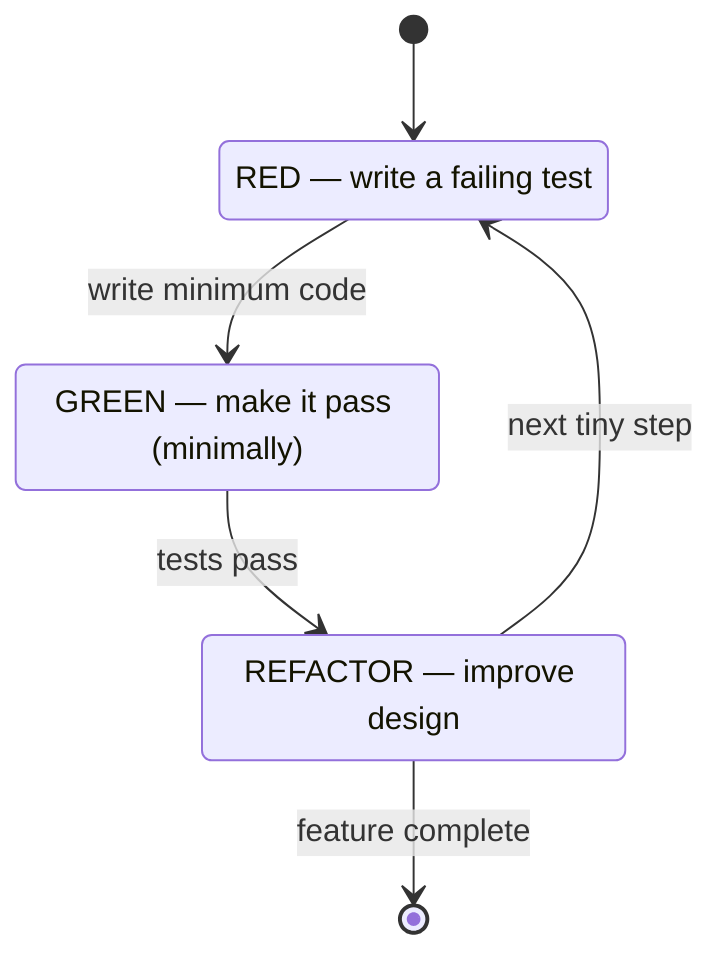
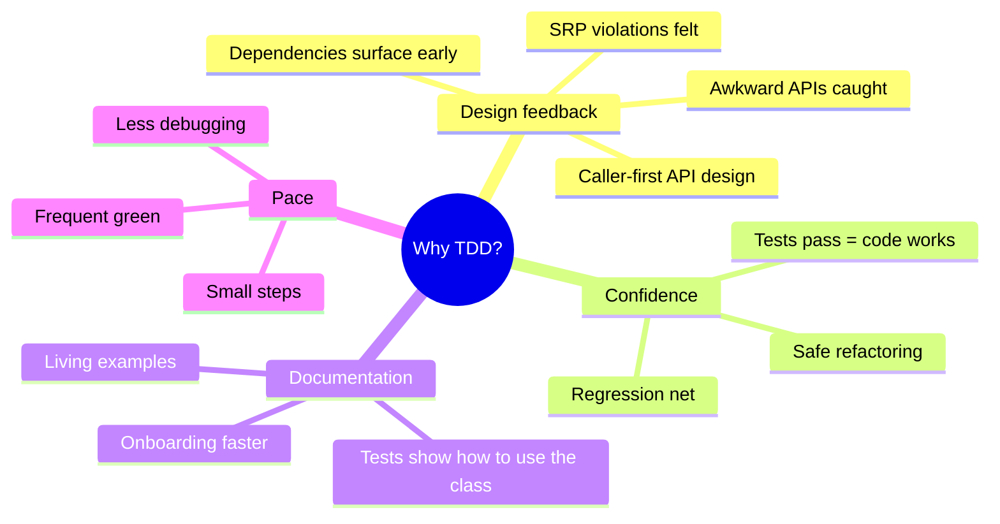
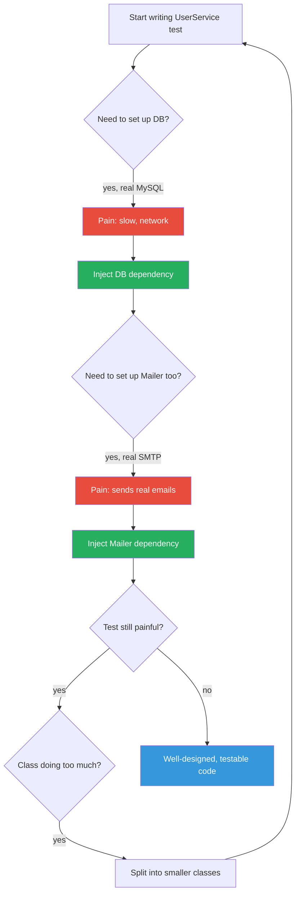
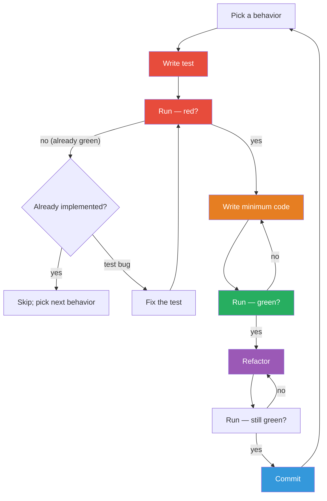

# Test-Driven Development with OOP — Red, Green, Refactor

#oop #testing #tdd #red-green-refactor #teaching #deep-dive

> [!quote] Kent Beck — *Test-Driven Development: By Example* (2002)
> "I was surprised that the code I wrote using test-driven development was different from the code I wrote without tests. The TDD code was more decoupled, more cohesive, and easier to extend."

**Test-Driven Development (TDD)** is a programming discipline where you write the test *before* the production code, in tiny cycles. It is not primarily about testing — it's about **design**: the act of writing a test for code that doesn't exist yet forces you to think about its interface, its dependencies, and its behavior from the caller's perspective.

This note covers the Red-Green-Refactor cycle, Robert C. Martin's three laws of TDD, how TDD drives good OOP design (especially dependency injection), a complete TDD walk-through building a `Stack` class, the benefits and the legitimate criticisms, when TDD shines, and how [[https://en.wikipedia.org/wiki/Behavior-driven_development|BDD]] extends it.

Prerequisites: [[Unit-Testing-OOP]], [[Mocking-And-Stubs]], [[Classes-And-Objects]], [[Dependency-Inversion]].

---

## 1. What Is TDD?

TDD is a tight feedback loop:

1. **Write a failing test** that describes behavior you wish existed.
2. **Write the simplest code** that makes the test pass.
3. **Refactor** the code (and the tests) while keeping all tests green.

Repeat. Dozens of times per hour. The cycle is small on purpose: a few minutes at most from red to green. If the cycle takes longer, you've taken too big a step.



The state diagram looks like a loop, but it's *small*. A skilled TDD practitioner makes 10–30 cycles per hour. Each cycle is a micro-decision: "what's the next behavior I want?"

> [!tip] Teaching Tip
> Demo TDD live, narrating every step. "I want a `Stack`. What's the simplest behavior? `stack.is_empty()` returns `True` on a new stack. Write the test. Run it — red, because `Stack` doesn't exist. Create the class. Run it — red, because `is_empty` doesn't exist. Add the method, return `True`. Run it — green! That's the first cycle. Now refactor: nothing to do. Next cycle: after `push(1)`, `is_empty()` should return `False`." Watching the rhythm is more convincing than reading about it.

---

## 2. The Three Laws of TDD

Robert C. Martin (Uncle Bob) condensed TDD into three strict rules:

1. **You are not allowed to write any production code unless it is to make a failing unit test pass.**
2. **You are not allowed to write more of a unit test than is sufficient to fail — and compilation failures count as failures.**
3. **You are not allowed to write more production code than is sufficient to pass the currently failing test.**

Rule 2 says: stop writing the test as soon as it fails. If you've written one line and the test already fails (because the class doesn't exist), stop. Run it. See it fail. Then write the minimum production code to make it pass.

Rule 3 says: don't write ahead. If the failing test only checks `is_empty()` returns `True`, the production code should be `return True` — not `return len(self._items) == 0`. The latter is "refactoring"; that comes in step 3.

> [!warning] Common Student Misconception
> "But `return True` is stupid! It'll break the next test!" **Yes — that's the point.** Returning a constant is the simplest possible code that passes *this* test. The next test (`push` then `is_empty` should be `False`) forces you to generalize. This discipline is called **triangulation** (see §5): only generalize when you have *two or more* examples that the simpler code can't satisfy.

---

## 3. Why TDD — Design Feedback

The headline benefit of TDD isn't bug reduction. It's **design feedback**.

When you write the test first, you write the *caller* of the code first. That means:

- You discover the API **from the caller's perspective**, not the implementer's. Awkward APIs are felt before they're built.
- You discover **dependencies** before you build the class — because the test has to set them up. If the setup is painful, the dependencies are wrong (see §6 on DIP).
- You discover **single responsibility violations** early — a test that needs to set up 5 things to test 1 thing is a signal that the class does too much.
- You get **executable documentation**: the test file shows, line by line, how the class is meant to be used.



---

## 4. TDD and OOP — How Tests Drive Good Design

TDD and OOP reinforce each other. The most testable code is also the most decoupled, most cohesive, most DI-friendly code. Specifically:

### 4.1 TDD Drives Dependency Injection

If `UserService.__init__` constructs its own `MySQLDatabase`, the test for `UserService` needs a real MySQL. That's painful. The pain is information: the test is telling you to inject the dependency instead.

```python
# ❌ Painful to test — TDD will push you away from this
class UserService:
    def __init__(self):
        self.db = MySQLDatabase(...)        # can't substitute

# ✅ Injected — TDD will push you toward this
class UserService:
    def __init__(self, db):
        self.db = db                         # substitute freely
```

This is [[Dependency-Inversion|DIP]] discovered *through test pressure*. Kent Beck called this "**Test-Driven Design**" — writing tests first shapes the code.

### 4.2 TDD Drives Single Responsibility

If a class has three responsibilities, its test file has three unrelated test classes squeezed together. The pain of writing the test reveals the SRP violation. Split the class; the tests split naturally.

### 4.3 TDD Drives Small Methods

Big methods need big setup. Each test that exercises a branch of a 50-line method has to construct inputs for *all* of it. The pain pushes you to extract small, focused methods that are easy to test in isolation.

### 4.4 TDD Drives Composition Over Inheritance

Inheritance hierarchies are notoriously hard to test (see [[Unit-Testing-OOP]] §6 — you must test inherited behavior on every subclass). TDD pressure tends to push toward composition, where each collaborator is testable in isolation.



The flowchart shows the loop: pain → fix → pain → fix, until the code is testable. That end state is *exactly* the well-designed code that [[SOLID-Overview|SOLID]] describes. SOLID and TDD converge.

---

## 5. Build a Stack via TDD — Full Walk-Through

Let's build a `Stack` class entirely through TDD, narrating each cycle. We'll see triangulation, the "fake it till you make it" technique, and the rhythm of small steps.

### Cycle 1: `is_empty()` returns `True` on a new stack

```python
# test_stack.py
from stack import Stack

def test_new_stack_is_empty():
    stack = Stack()
    assert stack.is_empty()
```

Run → red (`ModuleNotFoundError: No module named 'stack'`).

Create `stack.py`:

```python
class Stack:
    pass
```

Run → red (`AttributeError: 'Stack' object has no attribute 'is_empty'`).

Add the method:

```python
class Stack:
    def is_empty(self):
        return True
```

Run → green. Refactor: nothing yet.

### Cycle 2: After `push`, `is_empty()` returns `False`

```python
def test_stack_not_empty_after_push():
    stack = Stack()
    stack.push(1)
    assert not stack.is_empty()
```

Run → red (the constant `True` is now wrong).

Make it pass *minimally* — change the implementation to track items:

```python
class Stack:
    def __init__(self):
        self._items = []

    def is_empty(self):
        return len(self._items) == 0

    def push(self, value):
        self._items.append(value)
```

Run → green. Refactor: code is clean. Note that we *generalized* — replaced the constant with a real implementation — because we now had two test cases (empty and non-empty). This is **triangulation**.

### Cycle 3: `pop` returns the last pushed value

```python
def test_pop_returns_last_pushed_value():
    stack = Stack()
    stack.push(42)
    assert stack.pop() == 42
```

Run → red (`AttributeError: 'Stack' object has no attribute 'pop'`).

Implement:

```python
def pop(self):
    return self._items.pop()
```

Run → green.

### Cycle 4: `pop` on empty stack raises

```python
import pytest

def test_pop_empty_raises():
    stack = Stack()
    with pytest.raises(IndexError):
        stack.pop()
```

Run → green immediately — `list.pop()` on `[]` already raises `IndexError`. We didn't have to write any code.

> [!tip] Teaching Tip
> When a test passes immediately (no production code needed), celebrate — and decide whether to keep the test. Often you do: it locks in behavior (here, that `pop` on empty raises `IndexError`). If you ever change the implementation to raise something else, the test catches it.

### Cycle 5: `peek` returns top without removing

```python
def test_peek_returns_top_without_removing():
    stack = Stack()
    stack.push(1)
    stack.push(2)
    assert stack.peek() == 2
    assert stack.peek() == 2          # still there
    assert stack.pop() == 2           # peek didn't remove
```

Run → red. Implement:

```python
def peek(self):
    return self._items[-1]
```

Run → green.

### Cycle 6: `peek` on empty raises

```python
def test_peek_empty_raises():
    stack = Stack()
    with pytest.raises(IndexError):
        stack.peek()
```

Already green (`_items[-1]` on `[]` raises `IndexError`). Keep the test.

### Cycle 7: `size` returns the number of items

```python
def test_size_returns_count():
    stack = Stack()
    assert stack.size() == 0
    stack.push(1)
    assert stack.size() == 1
    stack.push(2)
    assert stack.size() == 2
    stack.pop()
    assert stack.size() == 1
```

Run → red. Implement:

```python
def size(self):
    return len(self._items)
```

Run → green.

### Cycle 8: LIFO ordering — push 1, 2, 3; pop yields 3, 2, 1

```python
def test_lifo_order():
    stack = Stack()
    for x in (1, 2, 3):
        stack.push(x)
    result = []
    while not stack.is_empty():
        result.append(stack.pop())
    assert result == [3, 2, 1]
```

Already green. Good — this is the *defining* property of a stack, and we now have a test that locks it in.

### Refactor: extract a custom exception

Currently `pop` raises `IndexError`. Maybe we want a domain-specific `EmptyStackError` so callers can catch it precisely. Refactor (tests must stay green):

```python
class EmptyStackError(Exception):
    pass

class Stack:
    def __init__(self):
        self._items = []

    def is_empty(self):
        return len(self._items) == 0

    def push(self, value):
        self._items.append(value)

    def pop(self):
        if self.is_empty():
            raise EmptyStackError("cannot pop from empty stack")
        return self._items.pop()

    def peek(self):
        if self.is_empty():
            raise EmptyStackError("cannot peek at empty stack")
        return self._items[-1]

    def size(self):
        return len(self._items)
```

Update tests `test_pop_empty_raises` and `test_peek_empty_raises` to expect `EmptyStackError`. Run → green. The refactor improved the design without breaking any caller — the test suite made that safe.

### Final test suite (10 tests, all green)

```python
import pytest
from stack import Stack, EmptyStackError

def test_new_stack_is_empty(): ...
def test_stack_not_empty_after_push(): ...
def test_pop_returns_last_pushed_value(): ...
def test_pop_empty_raises():
    with pytest.raises(EmptyStackError):
        Stack().pop()
def test_peek_returns_top_without_removing(): ...
def test_peek_empty_raises():
    with pytest.raises(EmptyStackError):
        Stack().peek()
def test_size_returns_count(): ...
def test_lifo_order(): ...
def test_push_many_preserves_order(): ...
def test_clear_empties_stack():
    stack = Stack()
    stack.push(1)
    stack.clear()
    assert stack.is_empty()
```

Notice the rhythm: every test is small, every cycle is short, every refactor was safe. That's TDD.

```mermaid
flowchart LR
    C1[Cycle 1<br/>is_empty → True] --> C2[Cycle 2<br/>is_empty after push → False]
    C2 --> C3[Cycle 3<br/>pop returns last]
    C3 --> C4[Cycle 4<br/>pop empty raises]
    C4 --> C5[Cycle 5<br/>peek doesn't remove]
    C5 --> C6[Cycle 6<br/>peek empty raises]
    C6 --> C7[Cycle 7<br/>size]
    C7 --> C8[Cycle 8<br/>LIFO order]
    C8 --> R[Refactor<br/>extract EmptyStackError]
    R --> Done[10 tests green]

    style C1 fill:#e74c3c,color:#fff
    style C2 fill:#e67e22,color:#fff
    style C3 fill:#f1c40f,color:#000
    style C4 fill:#27ae60,color:#fff
    style C5 fill:#27ae60,color:#fff
    style C6 fill:#27ae60,color:#fff
    style C7 fill:#27ae60,color:#fff
    style C8 fill:#27ae60,color:#fff
    style R fill:#9b59b6,color:#fff
    style Done fill:#3498db,color:#fff
```



---

## 6. TDD Benefits

| Benefit | Mechanism |
|---|---|
| **Better design** | Tests-first exposes awkward APIs and tight coupling before they're built |
| **Executable documentation** | The test file shows how to use the class, in runnable code |
| **Confidence** | Tests pass = code works; refactoring is safe |
| **Regression safety** | Future changes that break old behavior are caught |
| **Small steps** | Less debugging; you always know the last thing that worked |
| **Forces decisions** | You can't write code "to be decided later" — the test forces you to commit to an interface |
| **Psychology** | Frequent green tests give dopamine; long red phases feel bad and motivate smaller steps |

## 7. TDD Criticisms (Legitimate)

TDD is not a religion. Honest criticisms:

1. **Slower at first.** Writing tests before code feels slower. Empirically, TDD is about the same speed over the life of a project (debugging time drops sharply), but the *perception* of slowness is real and demotivating.
2. **Tests for trivial code are noise.** `def test_getter_returns_field` adds nothing. Pragmatic TDD skips tests for trivial accessors.
3. **False confidence.** Green tests do not mean the code is correct *for cases you didn't think to test*. TDD helps with the cases you thought of; it doesn't help with the ones you didn't.
4. **Doesn't catch integration bugs.** Each unit test passes; the wiring is still wrong. You need integration tests too (see the test pyramid in [[Test-Patterns]]).
5. **Can produce over-mocked code.** Especially in early TDD, practitioners reach for mocks to make code "testable" instead of asking whether the code is *over-coupled*. (See [[Mocking-And-Stubs]] §7.)
6. **Bad fit for exploratory code.** When you don't yet know what the API should be, writing tests first is premature. Spike the design in a notebook or a REPL, then TDD the polished version.

> [!warning] Common Student Misconception
> "TDD means 100% test coverage." **No.** TDD produces high coverage as a *side effect*, but chasing 100% coverage is a different goal — and a counterproductive one (see [[Unit-Testing-OOP]] §11). TDD is about design rhythm, not coverage metrics.

---

## 8. When TDD Shines vs. When It Doesn't

| Context | TDD fit | Why |
|---|---|---|
| Domain logic (pricing, rules, calculations) | ⭐⭐⭐⭐⭐ | Pure logic, easy to enumerate cases, big payoff for regression safety |
| Public API design | ⭐⭐⭐⭐⭐ | Caller-first thinking surfaces awkward APIs |
| Bug fix | ⭐⭐⭐⭐⭐ | Write a test that reproduces the bug; fix; the test guards against regression |
| Refactoring | ⭐⭐⭐⭐ | Characterization tests first, then refactor under green |
| Library code with many call sites | ⭐⭐⭐⭐ | Tests lock the contract |
| CRUD endpoints with no logic | ⭐⭐ | Tests are mostly framework plumbing |
| UI / visual code | ⭐⭐ | Hard to test; use sparingly |
| ML model training | ⭐ | The "behavior" is statistical; tests are slow and brittle |
| Exploratory spike | ⭐ | Throwaway code; TDD wastes the investment |
| Performance tuning | ⭐ | Tests don't capture the property being optimized |

> [!tip] Teaching Tip
> Tell students: "TDD is a tool, not a creed." Use it where it pays off — pure logic, public APIs, bug fixes. Skip it where it doesn't. The skill is *recognizing* which context you're in.

---

## 9. TDD Rhythm — Worked Discipline

A healthy TDD hour looks like:

1. Pick the next behavior (one sentence: "Stack.pop on an empty stack raises EmptyStackError").
2. Write the test (1–10 lines).
3. Run it; watch it fail *for the right reason* (e.g., `AttributeError`, not a typo in the test).
4. Write the minimum production code to make it pass.
5. Run it; watch it green.
6. Refactor — extract a method, rename, tidy — while tests stay green.
7. Commit.
8. Repeat.

If a cycle takes longer than ~5 minutes, you've taken too big a step. Back out, write a smaller test.



---

## 10. BDD — Behavior-Driven Development

**Behavior-Driven Development** (Dan North, 2006) extends TDD with a shared vocabulary for stakeholders. Where TDD says "write a failing test for `withdraw`", BDD says:

```
Feature: Withdrawal
  Scenario: Insufficient funds
    Given an account with balance 50
    When  I withdraw 100
    Then  I should see an InsufficientFunds error
    And   the balance should still be 50
```

The Given-When-Then format (see [[Unit-Testing-OOP]] §5) is BDD's signature. Tools: `behave`, `pytest-bdd` in Python; `Cucumber` in Java/Ruby.

BDD is *TDD with a domain language*. The technical rhythm is the same — write a failing spec, make it pass, refactor — but the specs are written in a domain vocabulary that product owners can read.

```python
# pytest-bdd example
from pytest_bdd import scenario, given, when, then

@scenario("withdrawal.feature", "Insufficient funds")
def test_insufficient_funds(): ...

@given("an account with balance 50")
def account():
    return BankAccount("Alice", Decimal("50"))

@when("I withdraw 100")
def withdraw(account):
    try:
        account.withdraw(Decimal("100"))
    except InsufficientFunds:
        pass

@then("the balance should still be 50")
def check_balance(account):
    assert account.balance == Decimal("50")
```

Use BDD when the *behavior* is the spec (and you have stakeholders who'll read it). Use TDD when the *unit* is the spec (and the audience is other engineers).

---

## 11. TDD at the Class Level — A Closing Note

In OOP, the unit of TDD is usually **one behavior of one method of one class**. Don't try to test a whole class in one cycle. Don't try to test a whole method in one cycle. Pick the *smallest behavior* you can articulate, write a test for it, watch it fail, make it pass.

The result is a class where:

- Every public method has tests for happy paths, edge cases, and exceptions.
- Private state is tested *through* the public API (see [[Unit-Testing-OOP]] §4).
- Dependencies are injected (because the tests needed them to be).
- The test file reads as a manual for using the class.

That class is, almost by accident, [[SOLID-Overview|SOLID]].

---

## 12. Summary Table

| Aspect | Practice |
|---|---|
| Cycle | Red → Green → Refactor |
| Step size | 1–5 minutes per cycle |
| Law 1 | No production code without a failing test |
| Law 2 | Write only enough test to fail |
| Law 3 | Write only enough code to pass |
| Triangulation | Generalize only when 2+ tests force it |
| Refactor | Always under green tests |
| Bug fix | Reproduce with a test first |
| Skip TDD when | Exploratory spike, UI, ML training, performance tuning |

---

## 12. TDD with Mocks — The London School

There are two main "schools" of TDD, and they differ on the role of mocks:

| School | Origin | Style | Mocks |
|---|---|---|---|
| **Chicago / Classical** | Kent Beck, *TDD by Example* | Test state; use real objects where possible | Mocks at external boundaries only |
| **London / Mockist** | Steve Freeman, Nat Pryce (*Growing Object-Oriented Software*) | Test interactions; mock collaborators | Mock all collaborators, even your own |

The Chicago school would test `UserService.register` by giving it a real `InMemoryUserRepository` and a `FakeMailer`, then asserting the user appears in the repo and the fake received the right call. The London school would mock both, asserting the right calls were made and never exercising the real `InMemoryUserRepository` in this test.

Both schools are legitimate. They produce slightly different designs:

- **Chicago** tends toward fakes and integration tests; designs emphasize state and value objects.
- **London** tends toward mocks and behavior tests; designs emphasize interfaces, roles, and responsibilities.

Most teams end up somewhere in between — mock external boundaries (HTTP, DB, time), use real domain objects, and use fakes for repositories. This pragmatic middle is what [[Mocking-And-Stubs]] §2 advocates.

> [!warning] Common Student Misconception
> "TDD requires mocks." **No.** Classical TDD uses mocks sparingly. The mock-heavy style is *one variant*, not the whole discipline. Don't let "I hate mocks" become "I won't do TDD".

---

## 13. TDD Discipline — Practical Habits

The cycle is simple; *practicing* it is hard. These habits make the difference:

### 13.1 Run the Test Before It Can Pass

After writing a test, run it. You should see it fail. If it passes immediately, one of these is true:

- The behavior is already implemented (you're duplicating a test — skip it).
- The test is broken (asserting the wrong thing — fix it).
- You're testing the wrong code path.

If you don't see it fail, you don't know it would have failed. You're not doing TDD; you're doing test-after.

### 13.2 Make It Fail for the Right Reason

A test that fails with `ImportError: No module named 'stack'` is failing for the wrong reason if you intended to test that `pop` raises on empty. Watch the *assertion* fail, not the import. Only then do you know the test is wired correctly.

### 13.3 Commit at Every Green

Each green test is a safe stopping point. Commit. Now if the next cycle goes wrong, you can `git reset --hard` to the last green state without losing work. Frequent commits also make `git bisect` powerful when something breaks weeks later.

### 13.4 Refactor Without Fear — But With Tests

The third step of the cycle is where design improvements happen: extract a method, rename a variable, replace a conditional with polymorphism (see [[Refactoring]]). The tests are your safety net. If a refactor breaks behavior, the test goes red *immediately*, before the bug propagates. Without that net, refactoring becomes terrifying; with it, refactoring becomes routine.

### 13.5 Know When to Stop

Stop TDD-ing when:

- The next test you can think of is testing the language (`assert 1 + 1 == 2`).
- The next test is redundant with an existing one.
- You're "improving" coverage for its own sake.

The signal that you're done: you can't think of a test that would meaningfully change the design or guard against a real regression.

```mermaid
flowchart TB
    Q1[Can you think of a next test?] -- yes --> Q2[Would it test YOUR code?]
    Q2 -- no --> Stop1[Stop — testing the framework]
    Q2 -- yes --> Q3[Would it duplicate an existing test?]
    Q3 -- yes --> Stop2[Stop — redundant]
    Q3 -- no --> Q4[Does it test a real edge case<br/>or guard a real regression?]
    Q4 -- no --> Stop3[Stop — trivia]
    Q4 -- yes --> Cycle[Write the test<br/>Red → Green → Refactor]
    Q1 -- no --> Done[Feature complete]
    style Stop1 fill:#7f8c8d,color:#fff
    style Stop2 fill:#7f8c8d,color:#fff
    style Stop3 fill:#7f8c8d,color:#fff
    style Cycle fill:#27ae60,color:#fff
    style Done fill:#3498db,color:#fff
```



---

## 14. See Also

- [[Unit-Testing-OOP]] — the testing vocabulary TDD uses
- [[Mocking-And-Stubs]] — what TDD drives you to design *away* from
- [[Test-Patterns]] — how to organize the tests TDD produces
- [[Dependency-Inversion]] — the principle TDD pressure "discovers"
- [[Single-Responsibility]] — the SRP violations TDD pressure surfaces
- [[Interface-Segregation]] — the friction in mocking that TDD exposes
- [[Composition-Over-Inheritance]] — the design TDD pressure favors
- [[Service-Layer]] — where TDD shines most in architecture
- [[Refactoring]] — what step 3 of the cycle *is*
