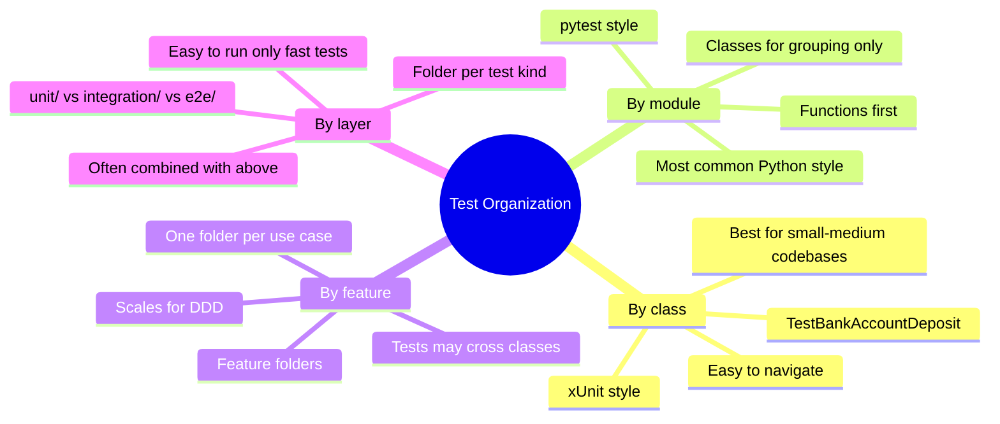
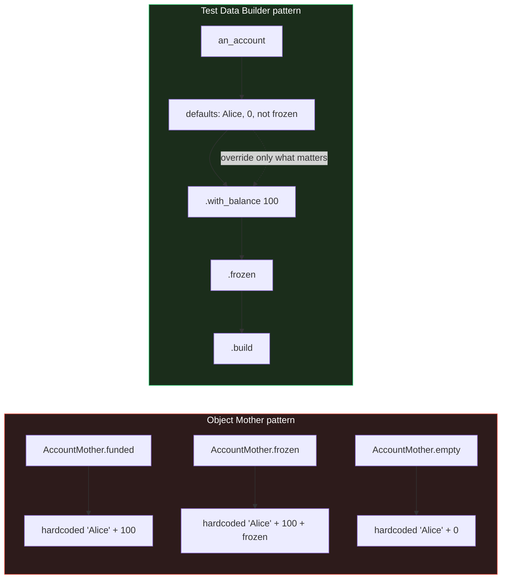
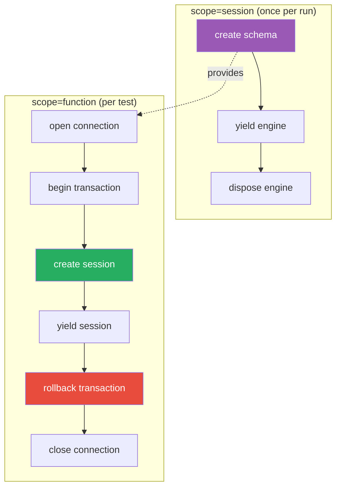
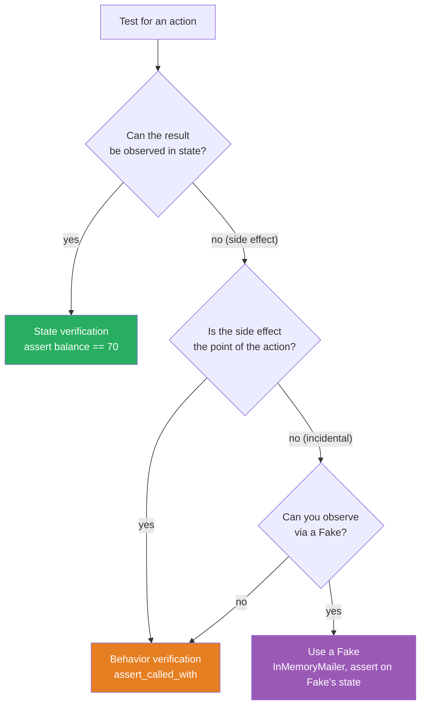
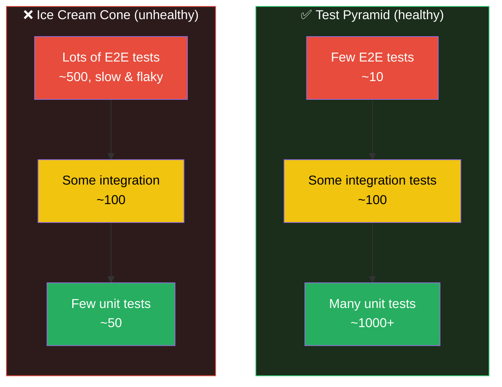

# Test Patterns — Organization, Naming, Fixtures, and Data Builders

#oop #testing #patterns #test-organization #teaching #deep-dive

> [!quote] Gerard Meszaros — *xUnit Test Patterns*
> "Good tests are readable, maintainable, reliable, and fast. Test patterns are the recurring solutions that produce those properties."

As a test suite grows past a few dozen tests, **how you organize the tests matters as much as the assertions themselves**. Naming conventions decide whether a failing test reports clearly. Fixture design decides whether tests stay independent. Test-data patterns decide whether adding a new test is a 30-second job or a 30-minute refactor. And the shape of the test suite — the ratio of unit to integration to end-to-end tests — decides whether the suite is fast and reliable or slow and flaky.

This note covers organization patterns, naming conventions, the Object Mother and Test Data Builder patterns, `factory_boy`, fixture scopes, state vs. behavior verification, snapshot testing, and the anti-patterns that undo all of the above (ice cream cone, test interdependency, testing implementation instead of behavior).

Prerequisites: [[Unit-Testing-OOP]], [[Mocking-And-Stubs]], [[TDD-With-OOP]].

---

## 1. Test Organization Patterns

Three schools of thought on where tests live.

### 1.1 One Test Class per Production Class (xUnit style)

```
src/
  bank.py
tests/
  test_bank.py        ← one test module
    class TestBankAccountConstruction: ...
    class TestBankAccountDeposit:      ...
    class TestBankAccountWithdraw:     ...
```

Every public class gets a `TestXxx` group, often split into multiple test classes per concern (`TestBankAccountConstruction`, `TestBankAccountDeposit`). This is the classic JUnit / pytest layout. Easy to navigate, easy to run a single class.

### 1.2 One Test File per Module (pytest style)

```
src/
  bank.py
tests/
  test_bank.py        ← module-level tests, classes optional
```

pytest doesn't require classes — functions are first-class. Many teams keep classes only as **grouping** (e.g., `class TestEdgeCases:`), and let most tests be module-level functions. This is the most common Python style today.

### 1.3 Feature-Based Organization

```
tests/
  features/
    withdrawals/
      test_happy_path.py
      test_insufficient_funds.py
      test_frozen_account.py
    deposits/
      ...
    transfers/
      ...
```

For larger systems (especially with [[Domain-Driven-Design|DDD]]), tests are organized by *feature* or *use case*, not by class. One feature may touch multiple classes; the test pulls them together. This style scales better for big applications.



> [!tip] Teaching Tip
> Don't over-organize early. Start with one file per production module. Split when a file exceeds ~500 lines or when tests for one class start drowning out tests for another. Premature organization is just as wasteful as premature abstraction.

A common hybrid: organize by **layer** (unit/integration/e2e) at the top, then by class or feature within.

```
tests/
  unit/                ← fast, isolated
    test_bank.py
  integration/         ← real DB, real filesystem
    test_bank_with_postgres.py
  e2e/                 ← full system, real HTTP
    test_withdrawal_flow.py
```

Run only the fast layer during development (`pytest tests/unit/`); run everything in CI.

---

## 2. Test Naming Conventions

A test name is documentation. When it fails in CI, the name is the first thing you read. Make it a sentence.

### 2.1 The `test_<method>_<scenario>_<expected>` Pattern

```python
def test_withdraw_insufficient_funds_raises_InsufficientFunds(): ...
def test_deposit_negative_amount_raises_ValueError(): ...
def test_withdraw_exact_balance_leaves_zero_balance(): ...
def test_register_existing_email_raises_ValueError(): ...
def test_register_new_user_sends_welcome_email(): ...
```

The three-part pattern `method_scenario_expected` reads as a sentence: "withdraw, on insufficient funds, raises InsufficientFunds."

### 2.2 The `should_<expected>_when_<scenario>` Pattern (BDD-ish)

```python
def test_should_raise_InsufficientFunds_when_balance_is_low(): ...
def test_should_return_zero_when_stack_is_empty(): ...
def test_should_send_welcome_email_when_user_registers(): ...
```

Some teams prefer this BDD-style ordering. Both patterns are fine; **pick one and stick to it**.

### 2.3 What NOT to Do

| Anti-pattern | Why bad |
|---|---|
| `test_withdraw_1` | No information about what's being tested |
| `test_withdraw_ok` | "ok" is vague — what scenario? |
| `test_withdraw_edge_case` | Which edge case? |
| `test_stuff` | Useless |
| `testBank` | CamelCase + no behavior — Java style leaking into Python |

> [!warning] Common Student Misconception
> "The test name should be short." **No.** Test names should be *descriptive*, even if long. A 60-character name that reads as a sentence is better than a 10-character name that needs you to open the file to understand. CI logs list test names — make them tell the story.

### 2.4 Class Naming

When you group tests in classes, name the class after the production class and the concern:

```python
class TestBankAccountDeposit:
    def test_positive_amount_increases_balance(self): ...
    def test_zero_amount_raises_ValueError(self): ...
    def test_negative_amount_raises_ValueError(self): ...
    def test_frozen_account_raises_RuntimeError(self): ...
```

The class adds context that the test name doesn't need to repeat: every test in `TestBankAccountDeposit` is about `deposit`, so the test names can drop the `deposit_` prefix.

---

## 3. Test Data Patterns

Constructing test objects is the bulk of test setup. Two patterns dominate.

### 3.1 Object Mother

The **Object Mother** pattern (introduced by Martin Fowler) provides a small set of *canonical* test objects, accessed via named factory functions:

```python
# object_mother.py
from decimal import Decimal
from bank import BankAccount

class AccountMother:
    @staticmethod
    def empty() -> BankAccount:
        return BankAccount("Alice")

    @staticmethod
    def with_balance(amount: Decimal) -> BankAccount:
        return BankAccount("Alice", amount)

    @staticmethod
    def funded() -> BankAccount:
        return BankAccount("Alice", Decimal("100"))

    @staticmethod
    def frozen() -> BankAccount:
        acc = BankAccount("Alice", Decimal("100"))
        acc.freeze()
        return acc

    @staticmethod
    def overdrawn() -> BankAccount:
        # ... however you construct one in your domain
        ...
```

```python
# tests
from object_mother import AccountMother

def test_withdraw_funded_account_reduces_balance():
    acc = AccountMother.funded()
    acc.withdraw(Decimal("30"))
    assert acc.balance == Decimal("70")

def test_withdraw_frozen_account_raises():
    acc = AccountMother.frozen()
    with pytest.raises(RuntimeError, match="frozen"):
        acc.withdraw(Decimal("1"))
```

**Pros**: one place to change when the constructor changes; tests read like English ("a funded account", "a frozen account").

**Cons**: a "mother" tends to grow over time (`funded`, `funded_with_two_transactions`, `funded_but_locked`, …) and become a god object. Hard to compose variations.

### 3.2 Test Data Builder

The **Test Data Builder** pattern replaces the mother with a fluent builder that defaults everything and lets you override only what matters for *this* test:

```python
# builders.py
from decimal import Decimal
from bank import BankAccount

class BankAccountBuilder:
    def __init__(self):
        self._owner = "Alice"
        self._balance = Decimal("0")
        self._frozen = False

    def with_owner(self, owner: str) -> "BankAccountBuilder":
        self._owner = owner
        return self

    def with_balance(self, amount: Decimal) -> "BankAccountBuilder":
        self._balance = amount
        return self

    def frozen(self) -> "BankAccountBuilder":
        self._frozen = True
        return self

    def build(self) -> BankAccount:
        acc = BankAccount(self._owner, self._balance)
        if self._frozen:
            acc.freeze()
        return acc

# Convenience default
def an_account() -> BankAccountBuilder:
    return BankAccountBuilder()
```

```python
# tests
from builders import an_account

def test_withdraw_funded_account_reduces_balance():
    acc = an_account().with_balance(Decimal("100")).build()
    acc.withdraw(Decimal("30"))
    assert acc.balance == Decimal("70")

def test_withdraw_frozen_account_raises():
    acc = an_account().with_balance(Decimal("100")).frozen().build()
    with pytest.raises(RuntimeError, match="frozen"):
        acc.withdraw(Decimal("1"))

def test_owner_is_stored():
    acc = an_account().with_owner("Bob").build()
    assert acc.owner == "Bob"
```

The test reads: "an account with balance 100, frozen". The defaults are sensible; only the *relevant variation* is stated.



| Aspect | Object Mother | Test Data Builder |
|---|---|---|
| Variation | New method per variant | Chain `.with_xxx()` calls |
| Defaults | Hardcoded in each method | One set of sensible defaults |
| Composability | Poor — exponential explosion | Good — orthogonal overrides |
| Test readability | "funded_account" | "an_account().with_balance(100)" |
| Best for | Few canonical cases | Many combinations |
| Pitfall | Mother becomes a god object | Builder API can sprawl |

> [!tip] Teaching Tip
> Start with Object Mother. When you find yourself adding `funded_with_two_transactions_and_a_pending_transfer` for the seventh time, switch to a builder. The pain *is the signal*.

### 3.3 `factory_boy`

The [`factory_boy`](https://factoryboy.readthedocs.io/) library automates the builder pattern, with special support for ORM models (Django, SQLAlchemy):

```python
import factory
from datetime import date
from users import User

class UserFactory(factory.Factory):
    class Meta:
        model = User

    email = factory.Sequence(lambda n: f"user{n}@example.com")
    name = "Alice"
    signup_date = date(2025, 1, 15)
    active = True

# Usage
u = UserFactory()                                   # all defaults
u = UserFactory(name="Bob", active=False)            # override
u = UserFactory(email="custom@example.com")          # override one field
users = UserFactory.create_batch(10)                 # many at once
```

`factory_boy` shines when:

- You're testing ORM models and want each test to have its own row, with sequences avoiding unique-constraint collisions.
- You have many tests creating similar objects with small variations.
- You want a single source of truth for "what does a valid User look like?"

For Django specifically, `factory_boy` integrates with `Factory.django` to handle transactions.

---

## 4. Test Fixtures and Setup

### 4.1 xUnit `setUp`/`tearDown`

```python
import unittest
from decimal import Decimal
from bank import BankAccount

class TestBankAccount(unittest.TestCase):
    def setUp(self):
        self.acc = BankAccount("Alice", Decimal("100"))

    def tearDown(self):
        # cleanup if needed
        pass

    def test_withdraw_reduces_balance(self):
        self.acc.withdraw(Decimal("30"))
        self.assertEqual(self.acc.balance, Decimal("70"))

    def test_deposit_increases_balance(self):
        self.acc.deposit(Decimal("30"))
        self.assertEqual(self.acc.balance, Decimal("130"))
```

`setUp` runs before each test method; `tearDown` runs after. The class-level versions are `setUpClass` / `tearDownClass`. This is the classic xUnit style — works fine, but most Python teams have moved to pytest fixtures.

### 4.2 pytest Fixtures

```python
import pytest
from decimal import Decimal
from bank import BankAccount

@pytest.fixture
def account():
    """A fresh, funded BankAccount for each test."""
    return BankAccount("Alice", Decimal("100"))

def test_withdraw_reduces_balance(account):
    account.withdraw(Decimal("30"))
    assert account.balance == Decimal("70")

def test_deposit_increases_balance(account):
    account.deposit(Decimal("30"))
    assert account.balance == Decimal("130")
```

Fixtures are **injected by name** — the parameter `account` matches the fixture name. They compose:

```python
@pytest.fixture
def empty_account():
    return BankAccount("Alice")

@pytest.fixture
def funded_account(empty_account):
    empty_account.deposit(Decimal("100"))
    return empty_account

@pytest.fixture
def frozen_account(funded_account):
    funded_account.freeze()
    return funded_account
```

### 4.3 Fixture Scopes

| Scope | When setup runs | When teardown runs | Use when |
|---|---|---|---|
| `function` (default) | Once per test | After each test | Fresh state per test |
| `class` | Once per test class | After all tests in class | Expensive setup shared across a class |
| `module` | Once per test file | After all tests in file | Module-wide resources |
| `session` | Once per pytest run | At end of run | DB schema, expensive external setup |

```python
@pytest.fixture(scope="session")
def db_schema():
    engine = create_engine("sqlite://")
    Base.metadata.create_all(engine)
    yield engine
    engine.dispose()

@pytest.fixture(scope="function")
def db_session(db_schema):
    connection = db_schema.connect()
    transaction = connection.begin()
    session = Session(bind=connection)
    yield session
    session.close()
    transaction.rollback()      # ← critical: undo anything the test did
    connection.close()
```

The pattern above — **session-scoped schema, function-scoped transaction that rolls back** — is the canonical pattern for testing code that uses a database. Each test sees a clean database; setup is fast because the schema is created once.



> [!warning] Common Student Misconception
> "I'll just use `scope='session'` for everything to make tests fast." **No.** Session scope means *state leaks between tests*. If test A deposits 100 and test B reads the balance, B sees A's deposit. Tests become order-dependent — flaky, hard to debug. Default to `function` scope; widen only for genuinely expensive, *stateless* setup (like creating a schema — not populating rows).

### 4.4 Fixture Parametrization

A fixture can be parametrized, so every test that uses it runs once per parameter:

```python
@pytest.fixture(params=[Decimal("0"), Decimal("1"), Decimal("100"), Decimal("1_000_000")])
def initial_balance(request):
    return request.param

def test_balance_starts_at_initial(initial_balance):
    acc = BankAccount("Alice", initial_balance)
    assert acc.balance == initial_balance
```

This single test runs four times, once per parametrized value. Combine with the shared-test-suite trick from [[Unit-Testing-OOP]] §6.

---

## 5. Testing Patterns — State vs Behavior

### 5.1 State Verification

Check the result of the action — what the system *is* after.

```python
def test_withdraw_reduces_balance(account):
    account.withdraw(Decimal("30"))
    assert account.balance == Decimal("70")        # state verification
```

State verification is the default. Use it whenever the behavior is observable in the object's state.

### 5.2 Behavior Verification

Check what the system *did* — which methods it called on its dependencies.

```python
def test_register_sends_welcome_email(service, mock_mailer):
    service.register("alice@example.com")
    mock_mailer.send.assert_called_once_with(
        to="alice@example.com",
        subject="Welcome",
        body="Hi alice@example.com, welcome aboard!",
    )
```

Behavior verification is necessary when the side effect is the *point* (sending an email, calling an API) and you can't observe it in the system under test's state. It's also the **most over-used pattern** — see [[Mocking-And-Stubs]] §7.



> [!tip] Teaching Tip
> Default to state verification. Reach for behavior verification only when the side effect is the contract. Fakes are usually a better choice than mocks for ongoing relationships (your repo, your mailer) — they're more stable under refactoring.

### 5.3 Parameterized Tests

See [[Unit-Testing-OOP]] §9. Briefly:

```python
@pytest.mark.parametrize("amount,expected_balance", [
    (Decimal("10"),  Decimal("90")),
    (Decimal("50"),  Decimal("50")),
    (Decimal("100"), Decimal("0")),
])
def test_withdraw_various_amounts(account, amount, expected_balance):
    account.withdraw(amount)
    assert account.balance == expected_balance
```

### 5.4 Snapshot Testing

For outputs that are large, nested, and stable (HTML, JSON, complex dataclasses), snapshot tests capture the output once and compare future runs against it:

```python
# using pytest-syrupy
def test_user_to_dict(snapshot, user):
    assert user.to_dict() == snapshot
```

The first run *writes* the snapshot; subsequent runs *compare*. If you intentionally change the output, you run `pytest --snapshot-update` to refresh. Snapshot testing is great for:

- Serialization (`to_dict`, `to_json`)
- Generated HTML / SQL
- Anything where the *whole* output is the contract

**Caveat**: snapshots can rot — a developer runs `--snapshot-update` to make the test pass, and the test stops checking anything meaningful. Pair snapshot tests with at least one *explicit* assertion that names the key property being verified.

---

## 6. Anti-Patterns

### 6.1 The Ice Cream Cone (Inverted Pyramid)

The **test pyramid** (Mike Cohn) says: many fast unit tests at the base, fewer integration tests in the middle, very few slow end-to-end tests at the top. The pyramid is wide at the bottom because unit tests are fast, isolated, and reliable.

The **ice cream cone** is the inversion: a few slow unit tests, more integration tests, and a *huge* end-to-end suite. Teams fall into this when they don't trust their unit tests (because the code is hard to test — see [[Dependency-Inversion|DIP]] violations) and "fix" it by adding E2E tests. The E2E suite becomes slow (an hour to run) and flaky (one in twenty fails for no reason).



**Fix**: push tests *down* the pyramid. Replace each E2E test with an integration test, and each integration test with a unit test, until the suite is fast and reliable. The blockers are usually DIP violations — once you fix them, you can unit-test what used to need an E2E test.

### 6.2 Test Interdependency

Tests must be **independent**. Running test B alone must give the same result as running the whole suite. Violations:

```python
# ❌ Bad — tests share state
shared_account = BankAccount("Alice", Decimal("100"))

def test_withdraw_reduces_balance():
    shared_account.withdraw(Decimal("30"))
    assert shared_account.balance == Decimal("70")

def test_balance_starts_at_100():
    assert shared_account.balance == Decimal("100")  # fails if test_above ran first
```

```python
# ✅ Good — each test gets its own fixture
def test_withdraw_reduces_balance(account):
    account.withdraw(Decimal("30"))
    assert account.balance == Decimal("70")

def test_balance_starts_at_100(account):
    assert account.balance == Decimal("100")  # always fresh
```

The fix is always the same: **each test sets up its own world**. Use function-scoped fixtures. Avoid module-level mutable state. Never depend on test order.

> [!warning] Common Student Misconception
> "It works on my machine." **That's because your pytest runs in a particular order.** Run `pytest --pdb -p no:randomly` then `pytest --pdb -p pytest-randomly` (with the plugin installed) — if anything breaks under random order, you have hidden interdependency. Run tests in random order in CI to catch this.

### 6.3 Testing Implementation Instead of Behavior

```python
# ❌ Tests the implementation
def test_withdraw_uses_list_pop():
    acc = BankAccount("Alice", Decimal("100"))
    with patch.object(acc, "_items") as mock_items:
        acc.withdraw(Decimal("30"))
    mock_items.pop.assert_called_once()
```

If you refactor from a `list` to a `deque`, this test breaks — even though the *behavior* (balance decreases by 30) is unchanged. The test was never about behavior; it was about *how* you implemented it.

```python
# ✅ Tests the behavior
def test_withdraw_reduces_balance():
    acc = BankAccount("Alice", Decimal("100"))
    acc.withdraw(Decimal("30"))
    assert acc.balance == Decimal("70")
```

Behavior tests survive refactoring. Implementation tests don't. Every mock that asserts "called with internal structure X" is an implementation test.

### 6.4 Other Anti-Patterns

| Anti-pattern | Symptom | Fix |
|---|---|---|
| **Test insurance** | "I'll add tests later" | You won't. TDD or none. |
| **Giant tests** | One test does 7 assertions across 5 methods | Split into many small tests |
| **Conditional test logic** | `if`/`for` inside a test | Parameterize instead |
| **Sleep-based waiting** | `time.sleep(0.5)` for async | Use `pytest-asyncio` and proper await |
| **Mocking the SUT** | `mock = Mock(spec=ClassUnderTest)` | You're testing the mock. Use real objects. |
| **Commented-out tests** | `# def test_this(): ...` | Delete. Git remembers. |
| **`assert True`** | Placeholder "I'll write this later" | Mark `@pytest.mark.skip(reason="...")` so it's visible in the report |

---

## 7. Complete Example — Fixture-Based Test Suite with Builders

Tying it all together: a `TransferService` that moves money between two `BankAccount`s, tested with fixtures, builders, state verification, and parameterization.

```python
# transfer.py
from decimal import Decimal
from bank import BankAccount, InsufficientFunds

class TransferService:
    def __init__(self, source: BankAccount, destination: BankAccount):
        self._source = source
        self._destination = destination

    def transfer(self, amount: Decimal) -> None:
        if amount <= 0:
            raise ValueError("amount must be positive")
        if amount > self._source.balance:
            raise InsufficientFunds(
                f"cannot transfer {amount}, source balance is {self._source.balance}"
            )
        self._source.withdraw(amount)
        self._destination.deposit(amount)
```

```python
# test_transfer.py
import pytest
from decimal import Decimal
from transfer import TransferService
from builders import an_account

@pytest.fixture
def funded_source():
    return an_account().with_owner("Alice").with_balance(Decimal("100")).build()

@pytest.fixture
def empty_destination():
    return an_account().with_owner("Bob").with_balance(Decimal("0")).build()

@pytest.fixture
def transfer(funded_source, empty_destination):
    return TransferService(funded_source, empty_destination)

class TestTransferHappyPath:
    def test_transfer_moves_money_between_accounts(self, transfer, funded_source, empty_destination):
        transfer.transfer(Decimal("30"))
        assert funded_source.balance == Decimal("70")
        assert empty_destination.balance == Decimal("30")

    def test_transfer_full_balance_leaves_source_empty(self, transfer, funded_source, empty_destination):
        transfer.transfer(Decimal("100"))
        assert funded_source.balance == Decimal("0")
        assert empty_destination.balance == Decimal("100")

class TestTransferErrors:
    def test_transfer_zero_raises(self, transfer):
        with pytest.raises(ValueError, match="positive"):
            transfer.transfer(Decimal("0"))

    def test_transfer_negative_raises(self, transfer):
        with pytest.raises(ValueError, match="positive"):
            transfer.transfer(Decimal("-5"))

    def test_transfer_more_than_balance_raises(self, transfer):
        with pytest.raises(InsufficientFunds):
            transfer.transfer(Decimal("101"))

    def test_failed_transfer_leaves_balances_unchanged(self, transfer, funded_source, empty_destination):
        with pytest.raises(InsufficientFunds):
            transfer.transfer(Decimal("101"))
        assert funded_source.balance == Decimal("100")
        assert empty_destination.balance == Decimal("0")

@pytest.mark.parametrize("amount,source_left,dest_gained", [
    (Decimal("1"),   Decimal("99"),  Decimal("1")),
    (Decimal("50"),  Decimal("50"),  Decimal("50")),
    (Decimal("100"), Decimal("0"),   Decimal("100")),
])
def test_transfer_various_amounts(funded_source, empty_destination, amount, source_left, dest_gained):
    transfer = TransferService(funded_source, empty_destination)
    transfer.transfer(amount)
    assert funded_source.balance == source_left
    assert empty_destination.balance == dest_gained
```

Notice the structure:

- **Fixtures** provide the wiring; tests stay short.
- **Builders** (`an_account().with_owner(...)`) keep setup declarative.
- **Test classes** group by concern (happy path vs errors).
- **State verification** is used throughout — no mocks needed, because `TransferService` depends only on `BankAccount`, which is a pure domain object.
- **Parametrization** covers multiple amounts in one declaration.

---

## 8. Test Pyramid — Recap

| Layer | Count | Speed | What it tests |
|---|---|---|---|
| Unit | Many (thousands) | <10ms each | One method, one class, in isolation |
| Integration | Some (hundreds) | <1s each | Several classes together, real DB or filesystem |
| E2E | Few (tens) | Seconds each | The whole system, real HTTP, real browser |

Healthy ratio: roughly **100 : 10 : 1** (unit : integration : E2E). If your ratio is inverted, see §6.1.

---

## 9. Summary Table

| Concern | Pattern |
|---|---|
| Organization | One file per module; classes for grouping; folders per layer (unit/integration/e2e) |
| Naming | `test_<method>_<scenario>_<expected>` or `should_X_when_Y` |
| Test data (few cases) | Object Mother |
| Test data (many combinations) | Test Data Builder |
| Test data (ORM models) | `factory_boy` |
| Setup | `@pytest.fixture`, prefer `function` scope |
| DB setup | Session-scoped schema, function-scoped transaction with rollback |
| Verification | State by default; behavior only for side-effect contracts |
| Many similar cases | `@pytest.mark.parametrize` |
| Large stable outputs | Snapshot testing (with explicit anchors) |
| Suite shape | Test pyramid, not ice cream cone |
| Independence | Each test sets up its own world; random order in CI |

---

## 10. See Also

- [[Unit-Testing-OOP]] — the vocabulary these patterns organize
- [[Mocking-And-Stubs]] — the tool that powers behavior verification
- [[TDD-With-OOP]] — the workflow that produces the tests these patterns organize
- [[Service-Layer]] — the architectural layer where most of these tests live
- [[Repository-Pattern]] — the seam where the function-scoped-transaction fixture pattern is most useful
- [[Domain-Driven-Design]] — the context where feature-based test organization pays off
- [[Refactoring]] — what makes test patterns *worth* investing in (they make refactoring safe)
