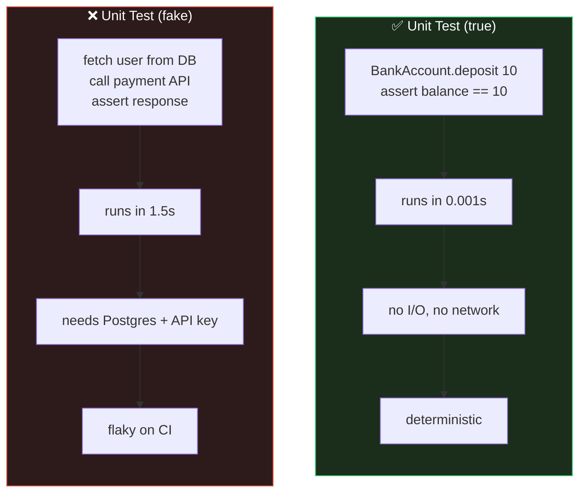
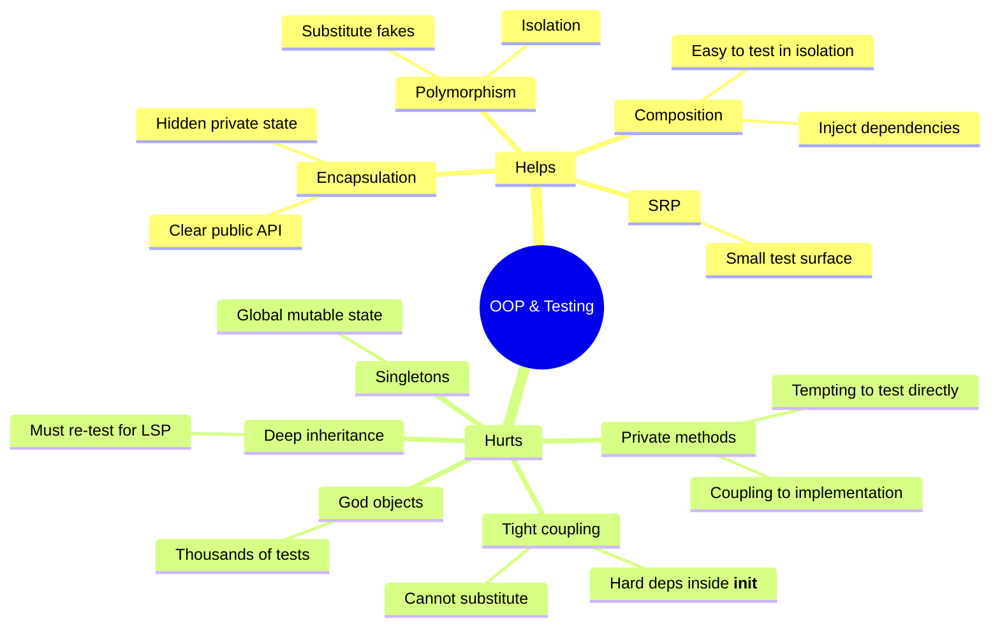
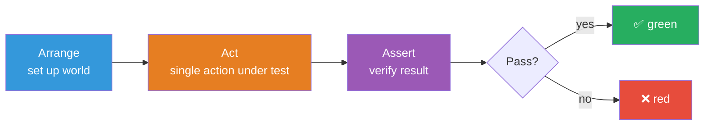
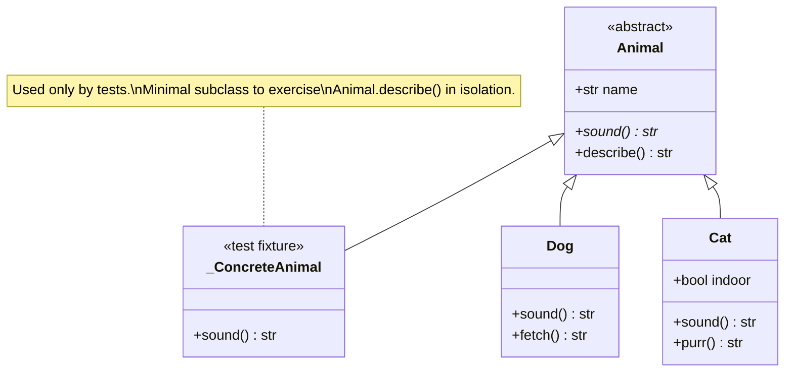
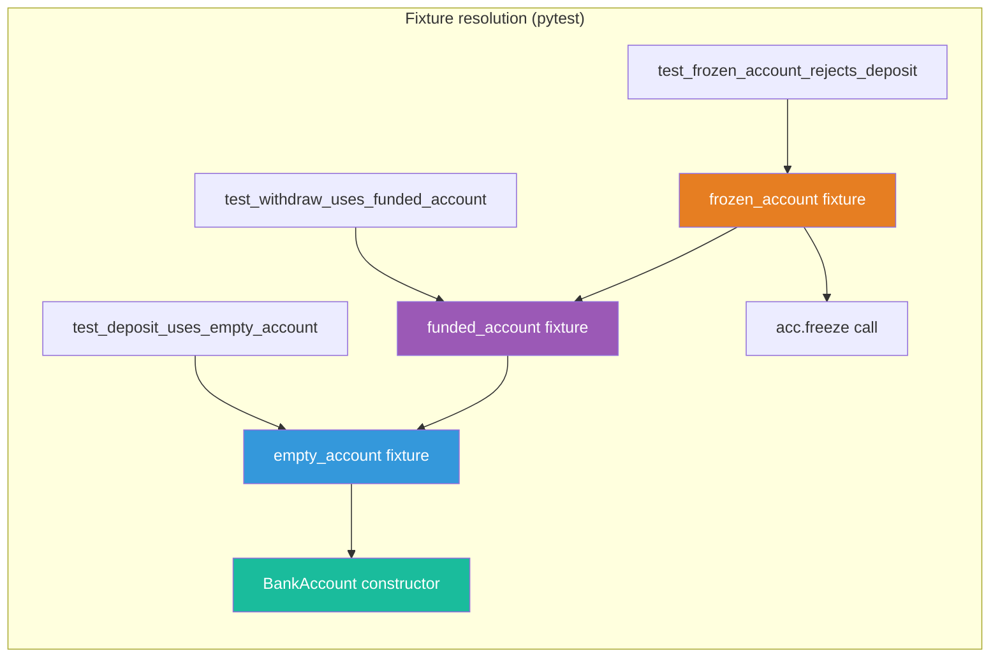
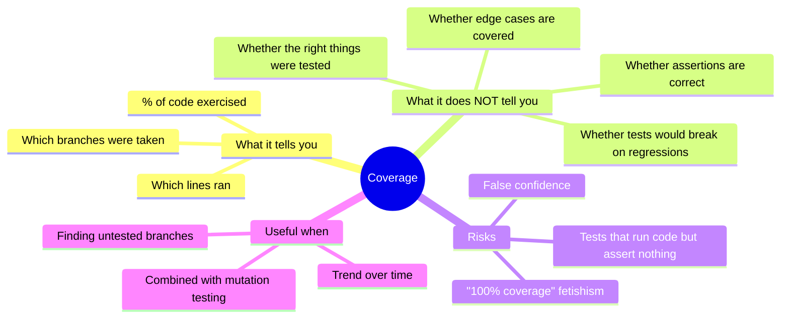

# Unit Testing OOP Code — Verifying Classes, Hierarchies, and Behavior

#oop #testing #unit-testing #pytest #aaa #teaching #deep-dive

> [!quote] Martin Fowler
> "Unit testing is a method by which individual units of source code are tested to determine whether they are fit for use. A unit is the smallest testable part of an application."

A **unit test** exercises a single "unit" of code — usually a method on a class — in isolation from its collaborators, and asserts that the unit behaves correctly. In OOP, the unit is almost always a single method on a single class. This note covers what to test, what *not* to test, the Arrange-Act-Assert structure, testing class hierarchies, testing [[Abstract-Base-Classes|ABCs]], exceptions, parameterization, fixtures, and the often misunderstood topic of coverage.

Prerequisites: [[Classes-And-Objects]], [[Methods-And-Functions]], [[Encapsulation]], [[Inheritance]], [[Abstract-Base-Classes]]. Pair this with [[Mocking-And-Stubs]] (for breaking dependencies) and [[TDD-With-OOP]] (for the workflow that uses these tests).

---

## 1. What Is a Unit Test?

A **unit test** has five non-negotiable properties, codified by Michael Feathers in *Working Effectively with Legacy Code*:

1. **Fast** — runs in milliseconds (not seconds).
2. **Isolated** — does not depend on the filesystem, network, database, or other tests.
3. **Repeatable** — gives the same result every time you run it.
4. **Self-verifying** — pass/fail is determined automatically, no human inspection.
5. **Timely** — written close to (or before, see [[TDD-With-OOP]]) the production code.

If a test reads from a real database, hits the network, sleeps for two seconds, or needs another test to set up global state first, it is **not** a unit test — it's an integration test in disguise.



> [!warning] Common Student Misconception
> "It uses pytest, so it's a unit test." **No.** The framework does not determine the test *kind*. A pytest test that talks to a real Postgres is an integration test. The label depends on what the test *does*, not what runs it.

---

## 2. Why OOP Makes Testing Easier (and Harder)

OOP and unit testing are friends, but the friendship has friction points.

### 2.1 How OOP Helps

| OOP feature | Testing benefit |
|---|---|
| **Encapsulation** | Clear public API = clear "what to test" surface. Private state is hidden from outside interference, so tests focus on behavior. |
| **Polymorphism** | Substitute a fake dependency for a real one (see [[Mocking-And-Stubs]]). This is the *mechanism* that makes isolation possible. |
| **Composition** | Classes composed of injected dependencies are trivial to test in isolation. |
| **Single Responsibility** | A class that does one thing has a small test surface. |
| **Inheritance** | Common behavior in a base class can be tested once via a shared test suite (see §6). |

### 2.2 How OOP Hurts

| OOP feature | Testing pain |
|---|---|
| **Private methods** | Hidden logic that students *want* to test, but shouldn't (see §4). |
| **Tight coupling** | `OrderService.__init__` does `self.db = MySQLDatabase()` — you cannot substitute a fake. |
| **Static methods / singletons** | Global state that's hard to reset between tests. |
| **God objects** | Hundreds of methods on one class → thousands of tests. |
| **Deep inheritance** | A subclass inherits behavior that you must re-test for LSP (see [[Liskov-Substitution]]). |



The takeaway is that **good OOP design and testable code are the same thing** — see [[Dependency-Inversion|DIP]]. If your class is hard to unit-test, the design is probably wrong, not the test.

---

## 3. What to Test

Test the **public API** of a class. For each public method, test:

1. **Happy path** — normal input, expected output.
2. **State changes** — calling `deposit(10)` changes `balance` from 0 to 10.
3. **Edge cases** — zero, negative, empty, very large, off-by-one.
4. **Exceptions** — invalid input raises the right error.
5. **Invariants** — properties that must always hold (e.g., "balance can never go below zero on a savings account").
6. **Interactions with collaborators** — did the method call `mailer.send(...)`? (See [[Mocking-And-Stubs]].)

> [!tip] Teaching Tip
> Have students write a list of test cases *before* writing the test code. The conversation "what could go wrong with `withdraw(amount)`?" surfaces: negative amount, zero, non-numeric, more than balance, NaN, `None`, `Decimal('Infinity')`… Each is a test case. This is the bridge to [[TDD-With-OOP|TDD]].

### 3.1 The BankAccount Class — a Complete Example

```python
# bank.py
from decimal import Decimal

class InsufficientFunds(Exception):
    pass

class BankAccount:
    def __init__(self, owner: str, initial_balance: Decimal | None = None) -> None:
        if not owner:
            raise ValueError("owner must be non-empty")
        self._owner = owner
        self._balance = initial_balance or Decimal("0")
        if self._balance < 0:
            raise ValueError("initial balance cannot be negative")
        self._frozen = False

    @property
    def owner(self) -> str:
        return self._owner

    @property
    def balance(self) -> Decimal:
        return self._balance

    def deposit(self, amount: Decimal) -> None:
        self._ensure_open()
        if amount <= 0:
            raise ValueError("deposit must be positive")
        self._balance += amount

    def withdraw(self, amount: Decimal) -> None:
        self._ensure_open()
        if amount <= 0:
            raise ValueError("withdraw must be positive")
        if amount > self._balance:
            raise InsufficientFunds(f"cannot withdraw {amount}, balance is {self._balance}")
        self._balance -= amount

    def freeze(self) -> None:
        self._frozen = True

    def _ensure_open(self) -> None:
        if self._frozen:
            raise RuntimeError("account is frozen")
```

And its full test suite:

```python
# test_bank.py
import pytest
from decimal import Decimal
from bank import BankAccount, InsufficientFunds

class TestBankAccountConstruction:
    def test_new_account_has_zero_balance(self):
        acc = BankAccount("Alice")
        assert acc.balance == Decimal("0")

    def test_new_account_stores_owner(self):
        acc = BankAccount("Alice")
        assert acc.owner == "Alice"

    def test_empty_owner_raises(self):
        with pytest.raises(ValueError, match="owner must be non-empty"):
            BankAccount("")

    def test_negative_initial_balance_raises(self):
        with pytest.raises(ValueError, match="cannot be negative"):
            BankAccount("Alice", Decimal("-10"))

class TestDeposit:
    def test_deposit_increases_balance(self):
        acc = BankAccount("Alice")
        acc.deposit(Decimal("100"))
        assert acc.balance == Decimal("100")

    def test_deposit_accumulates(self):
        acc = BankAccount("Alice", Decimal("50"))
        acc.deposit(Decimal("25"))
        acc.deposit(Decimal("25"))
        assert acc.balance == Decimal("100")

    def test_deposit_zero_raises(self):
        acc = BankAccount("Alice")
        with pytest.raises(ValueError, match="positive"):
            acc.deposit(Decimal("0"))

    def test_deposit_negative_raises(self):
        acc = BankAccount("Alice")
        with pytest.raises(ValueError, match="positive"):
            acc.deposit(Decimal("-5"))

    def test_deposit_on_frozen_account_raises(self):
        acc = BankAccount("Alice")
        acc.freeze()
        with pytest.raises(RuntimeError, match="frozen"):
            acc.deposit(Decimal("100"))

class TestWithdraw:
    def test_withdraw_decreases_balance(self):
        acc = BankAccount("Alice", Decimal("100"))
        acc.withdraw(Decimal("30"))
        assert acc.balance == Decimal("70")

    def test_withdraw_exact_balance_leaves_zero(self):
        acc = BankAccount("Alice", Decimal("100"))
        acc.withdraw(Decimal("100"))
        assert acc.balance == Decimal("0")

    def test_withdraw_more_than_balance_raises(self):
        acc = BankAccount("Alice", Decimal("50"))
        with pytest.raises(InsufficientFunds):
            acc.withdraw(Decimal("51"))

    def test_withdraw_negative_raises(self):
        acc = BankAccount("Alice", Decimal("100"))
        with pytest.raises(ValueError, match="positive"):
            acc.withdraw(Decimal("-5"))
```

Notice the test class names mirror the production class: `TestBankAccountConstruction`, `TestDeposit`, `TestWithdraw`. This is the "one test class per production class" pattern from [[Test-Patterns]].

> [!warning] Common Student Misconception
> "I tested `deposit` once, that's enough." **No.** One happy-path test misses every edge case. A good rule of thumb: **every `if`, `raise`, and branch needs at least one test.** Look at `deposit` — it has two early-return raises plus the success path. That's *at minimum* three tests.

---

## 4. What NOT to Test

### 4.1 Don't Test Private Methods Directly

A method prefixed with `_` (or name-mangled with `__`) is an **implementation detail**. Tests that call `account._ensure_open()` directly couple to the implementation. When you refactor — say, rename `_ensure_open` to `_assert_not_frozen` — the test breaks even though *behavior* is unchanged.

Test private logic **through the public API**. The frozen-account behavior above is tested via `test_deposit_on_frozen_account_raises`, which calls the public `deposit()` method.

```python
# ❌ Don't do this
def test_ensure_open_raises_when_frozen():
    acc = BankAccount("Alice")
    acc.freeze()
    with pytest.raises(RuntimeError):
        acc._ensure_open()        # testing a private method

# ✅ Do this
def test_deposit_on_frozen_account_raises():
    acc = BankAccount("Alice")
    acc.freeze()
    with pytest.raises(RuntimeError, match="frozen"):
        acc.deposit(Decimal("100"))   # testing the public behavior
```

If a private method is so complex that you feel you *must* test it directly, that's a **design smell**: the method probably wants to be a separate class (see [[Single-Responsibility|SRP]]).

### 4.2 Don't Test Trivial Getters and Setters

```python
@property
def balance(self) -> Decimal:
    return self._balance
```

A test like `assert acc.balance == acc._balance` proves nothing — it asserts that the property returns the field, which is the implementation. If you change the implementation (say, compute balance from a list of transactions), the test breaks but the behavior is fine.

Test getters indirectly through the operations that *change* state: `test_deposit_increases_balance` already exercises `balance`.

### 4.3 Don't Test the Language or the Framework

```python
# ❌ Useless
def test_python_can_add():
    assert 1 + 1 == 2

def test_decimal_str():
    assert str(Decimal("1.5")) == "1.5"
```

You don't test that `+` works on integers, or that `Decimal.__str__` returns a string. You can trust the language. Test *your* code.

### 4.4 Don't Test Third-Party Code

If you call `requests.get`, don't write a test that asserts `requests` works correctly. Test that *your* code calls `requests.get` with the right arguments (via [[Mocking-And-Stubs|mocking]]). The maintainers of `requests` test their own library.

---

## 5. Test Structure: Arrange-Act-Assert (AAA)

Every unit test should have three sections, visually separated:

```python
def test_withdraw_decreases_balance():
    # Arrange — set up the world
    acc = BankAccount("Alice", Decimal("100"))

    # Act — the single thing under test
    acc.withdraw(Decimal("30"))

    # Assert — what should be true now
    assert acc.balance == Decimal("70")
```

The same idea expressed in [[https://martinfowler.com/bliki/GivenWhenThen.html|BDD]] language is **Given-When-Then**:

```
Given an account with balance 100
When  I withdraw 30
Then  the balance should be 70
```

AAA is the Python community's preferred spelling; Given-When-Then is more common in BDD frameworks like `behave` or `pytest-bdd`. Both are the same idea: *one action per test, one assertion focus per test*.



> [!tip] Teaching Tip
> Make students physically insert a blank line between Arrange, Act, and Assert. The whitespace is the readability rule. If a test has no clear "Act" — if it does five things — it's testing too much; split it.

> [!warning] Common Student Misconception
> "One test, one assert." The rule is *one logical assertion*, not literally one `assert` statement. Checking `acc.balance == 70` and `acc.owner == "Alice"` in the same test is fine — they're both consequences of the same action. Checking five unrelated outcomes is not.

---

## 6. Testing Class Hierarchies

Each subclass is a separate class — test it independently. Don't assume that because `Animal` is tested, `Dog` doesn't need tests.

```python
# animals.py
from abc import ABC, abstractmethod

class Animal(ABC):
    def __init__(self, name: str):
        self.name = name

    @abstractmethod
    def sound(self) -> str: ...

    def describe(self) -> str:
        return f"{self.name} says {self.sound()}"

class Dog(Animal):
    def sound(self) -> str:
        return "Woof"

    def fetch(self) -> str:
        return f"{self.name} fetches the ball"

class Cat(Animal):
    def __init__(self, name: str, indoor: bool = True):
        super().__init__(name)
        self.indoor = indoor

    def sound(self) -> str:
        return "Meow"

    def purr(self) -> str:
        return f"{self.name} purrs"
```

Tests:

```python
# test_animals.py
import pytest
from animals import Animal, Dog, Cat

class TestDog:
    def test_sound_is_woof(self):
        assert Dog("Rex").sound() == "Woof"

    def test_describe_includes_name_and_sound(self):
        assert Dog("Rex").describe() == "Rex says Woof"

    def test_fetch_returns_action(self):
        assert Dog("Rex").fetch() == "Rex fetches the ball"

class TestCat:
    def test_sound_is_meow(self):
        assert Cat("Tom").sound() == "Meow"

    def test_describe_includes_name_and_sound(self):
        assert Cat("Tom").describe() == "Tom says Meow"

    def test_default_indoor_is_true(self):
        assert Cat("Tom").indoor is True

    def test_purr_returns_action(self):
        assert Cat("Tom").purr() == "Tom purrs"

class TestAnimalInvariants:
    """Tests that must pass for every Animal subclass (LSP)."""

    @pytest.fixture(params=[Dog("Rex"), Cat("Tom"), Cat("Bella", indoor=False)])
    def animal(self, request):
        return request.param

    def test_describe_contains_name(self, animal):
        assert animal.name in animal.describe()

    def test_describe_contains_sound(self, animal):
        assert animal.sound() in animal.describe()

    def test_sound_is_non_empty_string(self, animal):
        assert isinstance(animal.sound(), str) and animal.sound()
```

The last test class is a **shared test suite**: parametrized over every `Animal` subclass, it enforces the Liskov Substitution Property ([[Liskov-Substitution|LSP]]). If you add `class Horse(Animal)` later, one line in the fixture gives you the full invariant check for free.

> [!warning] Common Student Misconception
> "Dog inherits `describe`, so I don't need to test it on Dog." **Wrong.** `describe` calls `self.sound()`, which is overridden in `Dog`. The inherited method's *behavior* depends on the overridden abstract method. If `Dog.sound` were buggy (returned `None`), `describe` would silently break on Dogs. Test inherited behavior on every subclass — that's LSP in practice.

---

## 7. Testing Abstract Base Classes

You can't instantiate an ABC. So how do you test the behavior the ABC provides?

### 7.1 Use a Concrete Test Subclass

```python
# test_animal_abc.py
import pytest
from abc import ABC
from animals import Animal

class _ConcreteAnimal(Animal):
    """Minimal concrete subclass for testing the ABC's behavior."""
    def sound(self) -> str:
        return "test-sound"

class TestAnimalABC:
    def test_animal_is_abstract(self):
        assert issubclass(Animal, ABC)

    def test_cannot_instantiate_animal_directly(self):
        with pytest.raises(TypeError):
            Animal("Ghost")        # ABCs raise TypeError on direct instantiation

    def test_describe_uses_sound_from_subclass(self):
        a = _ConcreteAnimal("Ghost")
        assert a.describe() == "Ghost says test-sound"

    def test_subclass_must_implement_sound(self):
        # If a subclass forgets to implement sound, it stays abstract.
        class _BrokenAnimal(Animal):
            pass
        with pytest.raises(TypeError):
            _BrokenAnimal("X")
```

The `_ConcreteAnimal` class is the standard trick: a *test-only* minimal subclass that supplies whatever the abstract methods need. You're now free to test the **concrete behavior of the ABC** (like `describe`) through it.



> [!tip] Teaching Tip
> Make the *name* of the test subclass say what it is. `_ConcreteAnimal` is clear; `_A` is not. The leading underscore signals "test-internal" to other readers. Some teams put these in a `conftest.py`.

---

## 8. Testing Exceptions with `pytest.raises`

Exceptions are part of the contract. A method that "raises `ValueError` on bad input" is making a promise; the test verifies that promise is kept.

```python
def test_withdraw_more_than_balance_raises_insufficient_funds():
    acc = BankAccount("Alice", Decimal("50"))
    with pytest.raises(InsufficientFunds) as exc_info:
        acc.withdraw(Decimal("100"))
    assert "100" in str(exc_info.value)
    assert "50" in str(exc_info.value)     # message mentions the actual balance
```

The `match` argument is a regex checked against `str(exc_info.value)`:

```python
with pytest.raises(ValueError, match="cannot be negative"):
    BankAccount("Alice", Decimal("-10"))
```

Use `match` for *one* stable substring — don't match the entire message verbatim, or your test breaks every time you tweak the wording.

> [!warning] Common Student Misconception
> ```python
> # ❌ Wrong — assertion is unreachable
> acc.withdraw(Decimal("100"))   # raises here
> with pytest.raises(InsufficientFunds):
>     acc.withdraw(Decimal("100"))  # never reached
> ```
> The `with pytest.raises(...)` block must *surround* the line that raises. If the raise happens *outside*, the test fails before the `with` block is entered.

---

## 9. Parameterized Testing

When the same test logic applies to many inputs, `@pytest.mark.parametrize` replaces dozens of near-identical tests with one declaration:

```python
@pytest.mark.parametrize("initial,deposit,expected", [
    (Decimal("0"),   Decimal("100"), Decimal("100")),
    (Decimal("50"),  Decimal("50"),  Decimal("100")),
    (Decimal("99"),  Decimal("1"),   Decimal("100")),
    (Decimal("0.01"),Decimal("0.01"),Decimal("0.02")),
])
def test_deposit_results_in_expected_balance(initial, deposit, expected):
    acc = BankAccount("Alice", initial)
    acc.deposit(deposit)
    assert acc.balance == expected

@pytest.mark.parametrize("bad_amount", [
    Decimal("0"),
    Decimal("-1"),
    Decimal("-0.01"),
])
def test_deposit_non_positive_raises(bad_amount):
    acc = BankAccount("Alice")
    with pytest.raises(ValueError, match="positive"):
        acc.deposit(bad_amount)
```

Each row is a separate test case — if the third row fails, pytest reports `test_deposit_results_in_expected_balance[99-1-100]` and the other rows still pass. That's far better than one giant `for` loop with a single `assert`, which fails opaquely on the first broken case.

Naming convention: parametrize IDs follow `test_<name>[<param1>-<param2>-...]`. You can also pass `ids=[...]` explicitly:

```python
@pytest.mark.parametrize("amount", [Decimal("0"), Decimal("-1")], ids=["zero", "negative"])
def test_deposit_bad(amount): ...
```

---

## 10. Test Fixtures

A **fixture** is reusable test setup, injected into tests by name. Fixtures replace the `setUp`/`tearDown` of xUnit with composable, scope-aware functions.

```python
import pytest
from decimal import Decimal
from bank import BankAccount

@pytest.fixture
def empty_account():
    """A fresh BankAccount with zero balance."""
    return BankAccount("Alice")

@pytest.fixture
def funded_account():
    """A BankAccount with 100 in it."""
    return BankAccount("Alice", Decimal("100"))

@pytest.fixture
def frozen_account():
    """A BankAccount that has been frozen."""
    acc = BankAccount("Alice", Decimal("100"))
    acc.freeze()
    return acc

class TestBankAccountUsingFixtures:
    def test_new_account_balance_is_zero(self, empty_account):
        assert empty_account.balance == Decimal("0")

    def test_funded_account_can_withdraw(self, funded_account):
        funded_account.withdraw(Decimal("30"))
        assert funded_account.balance == Decimal("70")

    def test_frozen_account_rejects_deposit(self, frozen_account):
        with pytest.raises(RuntimeError, match="frozen"):
            frozen_account.deposit(Decimal("1"))
```

Fixtures compose — a fixture can depend on another fixture:

```python
@pytest.fixture
def funded_account(empty_account):
    empty_account.deposit(Decimal("100"))
    return empty_account
```



Fixture **scopes** control how often the setup runs:

| Scope | When setup runs | Typical use |
|---|---|---|
| `function` (default) | Once per test function | Per-test fresh state |
| `class` | Once per test class | Expensive setup shared by class |
| `module` | Once per test file | Module-wide resources |
| `session` | Once per pytest run | Very expensive setup (DB schema) |

```python
@pytest.fixture(scope="session")
def test_database():
    db = create_test_db()
    yield db
    db.drop()
```

The `yield` form replaces `addFinalizer` — code *after* `yield` is teardown, run even if the test failed.

> [!tip] Teaching Tip
> Show students the pyramid: prefer `function` scope by default. Each test gets fresh state → tests stay independent (no spooky action-at-a-distance). Only widen the scope when setup is genuinely expensive AND stateless (e.g., creating DB tables — but **not** populating rows).

---

## 11. Coverage — and Why It Lies

**Code coverage** measures which lines (and branches) of production code were executed during the test run. Use `pytest-cov`:

```bash
pytest --cov=bank --cov-report=term-missing
```

```
Name      Stmts   Miss  Cover   Missing
---------------------------------------
bank.py      22      2    91%   45, 67
```

A 91% coverage looks great. But coverage is **necessary, not sufficient**. It tells you *that* a line ran; it does not tell you *what assertions were made* about its result.

### 11.1 The Coverage Mindmap



### 11.2 100% Coverage Can Be Zero Tests

```python
# production.py
def is_positive(x):
    return x > 0

# test_production.py
def test_is_positive_runs():
    is_positive(5)        # 100% line coverage, ZERO assertions
    is_positive(-5)       # both branches covered
```

This file now has 100% coverage with **no assertions at all**. Coverage is green; quality is zero. This is why coverage should be tracked as a *lower bound* (a drop warns you a feature lost its tests) — never as a *target* (chasing 100% produces junk tests).

### 11.3 Mutation Testing — the Better Metric

**Mutation testing** (with `mutmut` or `cosmic-ray`) makes tiny changes to your production code — flip a `>` to `>=`, replace `+` with `-`, delete a line — and checks whether your tests catch the mutation. If a mutant survives, your tests are weak *even though coverage is high*. Mutation testing is the most honest measure of test quality available today.

---

## 12. Putting It Together — The Testing Workflow

1. Read the public API of the class under test.
2. For each public method, brainstorm cases (happy, edge, exception).
3. Pick a single case; write the test (one AAA).
4. Run it; watch it fail for the right reason (see [[TDD-With-OOP]]).
5. Implement or fix the code; watch it pass.
6. Repeat until no interesting case is missing.
7. Run `pytest --cov` to find untested branches; check whether they need tests.
8. Refactor the test code as aggressively as production code — fixtures, helpers, parameterization.

## 13. Summary Table

| Topic | Rule of thumb |
|---|---|
| What to test | Public methods, all branches, edge cases, exceptions |
| What not to test | Private methods (test via public API), trivial getters, framework features |
| Test structure | Arrange → Act → Assert, with blank lines between |
| One test, one … | … logical assertion (not literally one `assert`) |
| Inheritance | Test every subclass; shared LSP invariants via parametrized fixtures |
| ABCs | Use a concrete test-only subclass |
| Exceptions | `with pytest.raises(...)` surrounding the call |
| Many inputs | `@pytest.mark.parametrize` |
| Setup | `@pytest.fixture`, prefer `function` scope |
| Coverage | Necessary, not sufficient. Mutation testing is better. |

## 14. Common Pitfalls and How to Spot Them

Even experienced developers fall into the same traps. Recognizing them early is half the battle.

### 14.1 The "Assert-Nothing" Test

```python
def test_withdraw():
    acc = BankAccount("Alice", Decimal("100"))
    acc.withdraw(Decimal("30"))      # no assertion!
```

The test runs without error, so it's "green". But it asserts nothing — if `withdraw` silently did the wrong thing (or did nothing at all), the test would still pass. The fix: every test needs at least one assertion that names the property being checked.

### 14.2 The Tautological Test

```python
def test_balance_getter():
    acc = BankAccount("Alice")
    acc._balance = Decimal("100")    # poke private state
    assert acc.balance == Decimal("100")
```

This test asserts that the getter returns the field it returns. It cannot fail unless the language is broken. The fix: drive state changes through the public API (`acc.deposit(Decimal("100"))`), then assert.

### 14.3 The Test-Depends-on-Test Anti-Pattern

```python
def test_deposit():
    global_acc.deposit(Decimal("100"))
    assert global_acc.balance == Decimal("100")

def test_withdraw_after_deposit():       # depends on test_deposit having run!
    global_acc.withdraw(Decimal("30"))
    assert global_acc.balance == Decimal("70")
```

If `test_deposit` is skipped or fails, `test_withdraw_after_deposit` breaks for the wrong reason. The fix: each test creates its own fixture; no shared mutable state.

### 14.4 Testing the Wrong Layer

```python
def test_decimal_addition():           # testing the language
    assert Decimal("1") + Decimal("1") == Decimal("2")

def test_pytest_works():               # testing the framework
    assert True
```

These tests pass and add nothing. Delete them. Test *your* code, not Python.

### 14.5 The Mystery Guest

```python
def test_withdraw():
    acc = make_account_from_file("fixtures/account.yaml")   # where does this come from?
    acc.withdraw(load_amount("config/withdrawals.json"))    # what amount?
    assert acc.balance == 70                                 # why 70?
```

When setup is hidden behind a function that reads from disk, the reader has no idea what's being tested. The fix: inline the setup. Tests should be readable top-to-bottom without opening other files.

> [!tip] Teaching Tip
> Have students trade test files for 60 seconds and ask each other "what does this test verify, and why?" If the partner can't answer without opening another file, the test has a readability problem. This peer review catches mystery guests, tautologies, and assert-nothing tests faster than any linter.

---

## 15. A Checklist for a Good Unit Test

Before you commit a unit test, run it through this checklist:

- [ ] **Names a behavior** — `test_withdraw_insufficient_funds_raises`, not `test_1`
- [ ] **One logical assertion** — one focus, even if multiple `assert` lines
- [ ] **AAA structure visible** — blank lines between Arrange, Act, Assert
- [ ] **Independent** — passes alone, in any order
- [ ] **Fast** — under 100ms; ideally under 10ms
- [ ] **No real I/O** — no DB, no network, no filesystem, no `time.sleep`
- [ ] **Tests behavior, not implementation** — would survive a refactor
- [ ] **Tests through the public API** — no poking private state
- [ ] **Asserts something meaningful** — not just "it didn't crash"
- [ ] **Readable top-to-bottom** — no hidden setup, no mystery values

If a test fails any of these, fix it before moving on. The compounding value of disciplined unit testing is huge; the compounding cost of sloppy tests is larger.

---

## 16. See Also

- [[Mocking-And-Stubs]] — breaking dependencies so units can be tested in isolation
- [[TDD-With-OOP]] — the workflow that *uses* these tests to drive design
- [[Test-Patterns]] — organization, naming, Object Mother, Test Data Builder
- [[Encapsulation]] — why private state is a test concern
- [[Abstract-Base-Classes]] — the ABCs we test in §7
- [[Liskov-Substitution]] — the principle behind shared-subclass test suites
- [[Dependency-Inversion]] — why well-designed classes are easier to test
