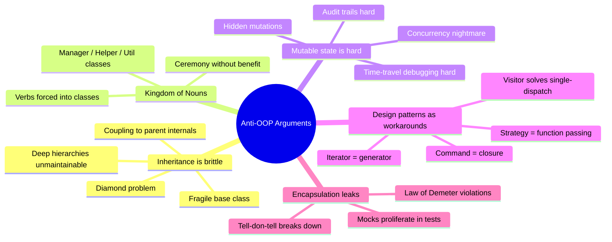
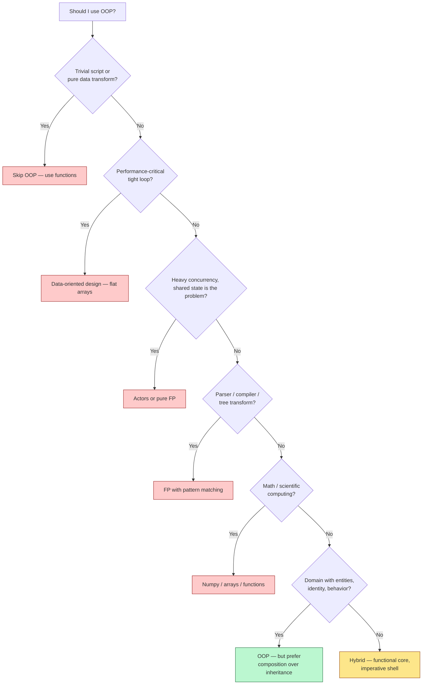
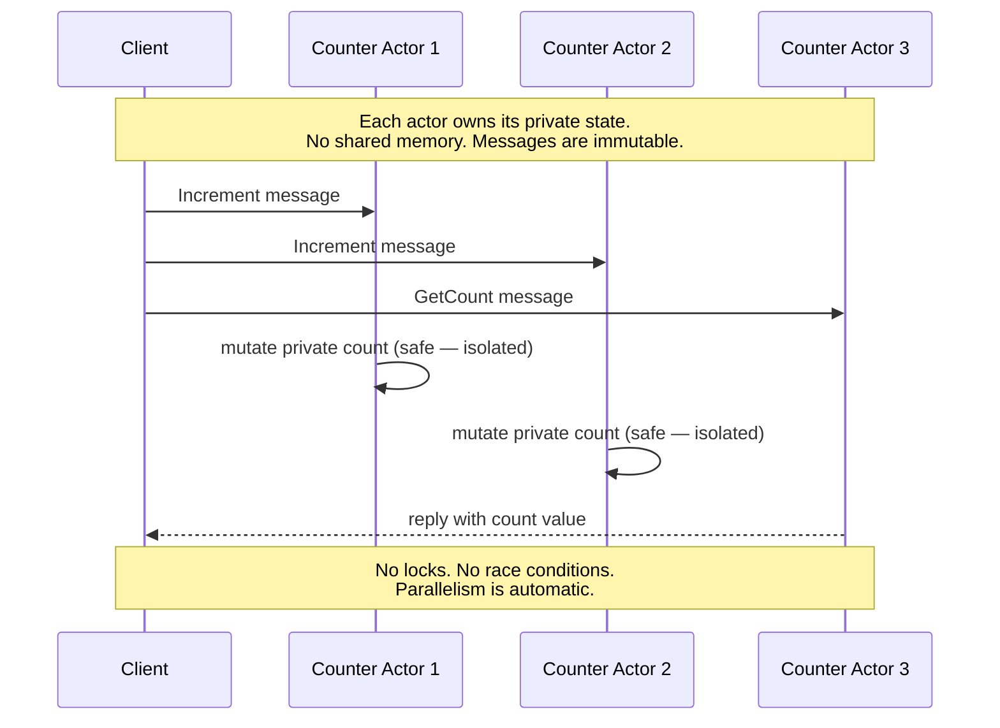
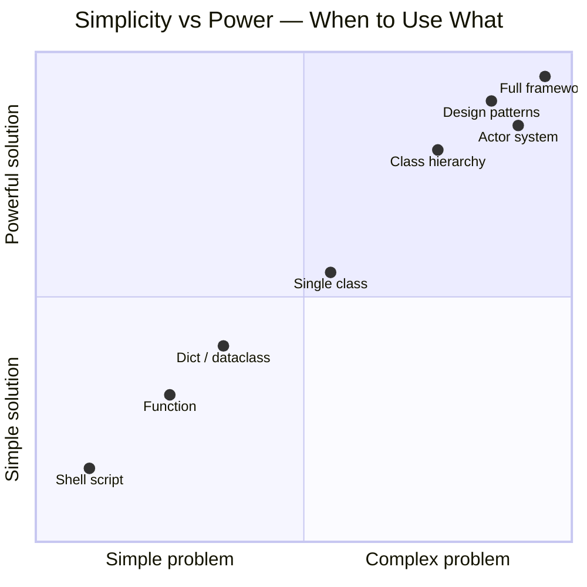
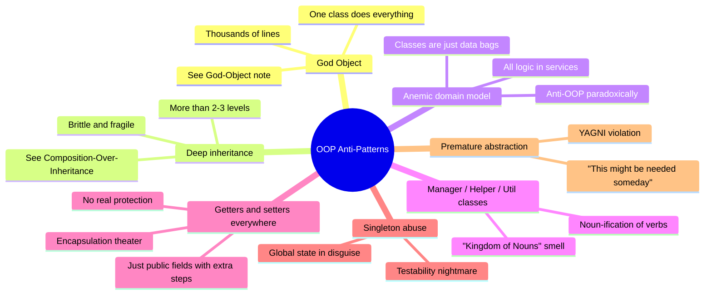

# When Not To Use OOP — The Honest Counterpoint

#oop #anti-oop #pragmatism #comparison #teaching #deep-dive

> [!quote] Steve Yegge — *Execution in the Kingdom of Nouns*
> "Java is the most distressing thing to happen to computing since MS-DOS. It is, quite literally, a Kingdom of Nouns where the Verbs are second-class citizens."

> [!quote] Linus Torvalds — on C++ in the Linux kernel
> "C++ is a horrible language. It's made more horrible by the fact that a lot of substandard programmers use it, to the point where it's much much easier to generate total and utter crap with it."

OOP is not a religion. It is a tool — and like every tool, it has domains where it shines and domains where it's actively harmful. After learning OOP thoroughly, the next step in maturing as an engineer is learning **when not to reach for it**.

This note collects the legitimate anti-OOP arguments, surveys modern alternatives, offers concrete code examples where OOP is overkill, and ends with pragmatic advice for picking the right tool.

Prerequisites: [[What-Is-OOP]], [[When-To-Use-OOP]], [[OOP-Vs-Functional]], [[OOP-Vs-Procedural]].

---

## 1. The Honest Case Against OOP

OOP has real, documented weaknesses. Pretending they don't exist makes you a worse engineer. Let's look at each honestly.

### 1.1 Inheritance Hierarchies Become Brittle

The promise of inheritance was: write code once, reuse forever. The reality, after 30+ years of OOP in production, is:

- Deep hierarchies (`Animal → Mammal → Dog → WorkingDog → Sheepdog → BorderCollie`) become **impossible to modify safely**. Changing a method in `Mammal` breaks everything below.
- Multiple inheritance creates the **diamond problem** — which `speak()` method does `Bat` (inherits from `Mammal` and `FlyingThing`) get?
- The **fragile base class problem**: a "safe" change to a base class breaks subclasses in ways the base author cannot predict.
- Subclasses become **coupled to parent implementation details**, not just interface.

```python
# The fragile base class problem in action
class List:
    def __init__(self):
        self._items = []

    def add(self, item):
        self._items.append(item)

    def add_all(self, items):
        for item in items:
            self.add(item)              # calls self.add — relies on its behavior

    def size(self):
        return len(self._items)


class CountingList(List):
    """Subclass that counts total additions."""
    def __init__(self):
        super().__init__()
        self.add_count = 0

    def add(self, item):
        self.add_count += 1
        super().add(item)


cl = CountingList()
cl.add_all([1, 2, 3])
print(cl.add_count)   # 3 — but only because List.add_all calls self.add
# If List.add_all is refactored to use self._items.extend(items),
# CountingList silently breaks: add_count becomes 0 instead of 3.
```

> [!warning] Common Student Misconception
> "Inheritance is for code reuse." — *Mostly wrong.* Inheritance is for **substitutability** (the L in SOLID — see [[Liskov-Substitution]]). Code reuse via inheritance is a fragile side-effect. See [[Composition-Over-Inheritance]] for the modern alternative.

### 1.2 The "Kingdom of Nouns" Problem

Steve Yegge's famous essay critiques Java-style OOP for forcing everything to be a noun (class) when many things are naturally verbs (functions). Consider:

```java
// Java "Kingdom of Nouns" style
public class StringReverser {
    private final String input;
    public StringReverser(String input) { this.input = input; }
    public String reverse() {
        return new StringBuilder(input).reverse().toString();
    }
}
// Usage: new StringReverser("hello").reverse()  ← wtf, just reverse the string!
```

```python
# Python — just a function
def reverse(s: str) -> str:
    return s[::-1]
# Usage: reverse("hello")  ← obviously correct
```

Some operations are *verbs*. Forcing them into classes adds ceremony, indirection, and cognitive load without benefit. Languages like Java (pre-lambdas) made this worse by lacking first-class functions; modern Java, Kotlin, Swift, and even Python (with lambdas and `functools`) are better.

### 1.3 Mutable State Is Hard to Reason About

The defining feature of OOP — encapsulated mutable state — is also its biggest liability:

- A method call `account.withdraw(50)` mutates `account`. To know what `account.balance` will be after the call, you need to know *every previous mutation* in the object's lifetime.
- In concurrent code, multiple threads mutating the same object require locks — and locks introduce deadlocks, race conditions, and priority inversion.
- Time-travel debugging, undo/redo, and audit trails are all harder when state is mutable.

Functional programming's radical answer — **no mutation, ever** — eliminates entire classes of bugs. See [[OOP-Vs-Functional]] for the full comparison.

### 1.4 Design Patterns Are Workarounds for Language Limitations

Peter Norvig famously observed that 16 of the 23 Gang of Four design patterns are *invisible or simpler* in dynamic languages like Lisp. The classic GoF patterns:

- **Visitor pattern** — a workaround for the Expression Problem in single-dispatch OOP languages. In multi-method languages (CLOS) or functional languages with pattern matching, it's unnecessary.
- **Strategy pattern** — passing a function. In Python/JS, you just pass a function. No class hierarchy needed.
- **Command pattern** — a function object. In Python, a closure or `lambda` does the job.
- **Iterator pattern** — Python generators, Java iterators, JS iterables all make this trivial.

```python
# "Strategy pattern" in classical OOP
class SortStrategy(ABC):
    @abstractmethod
    def sort(self, items): ...

class QuickSort(SortStrategy):
    def sort(self, items): ...

class MergeSort(SortStrategy):
    def sort(self, items): ...

class Sorter:
    def __init__(self, strategy: SortStrategy):
        self.strategy = strategy
    def sort(self, items):
        return self.strategy.sort(items)

# In Python — just pass a function
def sort_with(items, strategy):
    return strategy(items)

sort_with([3, 1, 2], sorted)           # built-in
sort_with([3, 1, 2], lambda xs: sorted(xs, reverse=True))   # custom
```

The point isn't that patterns are *bad* — they're useful communication tools. The point is that many patterns exist to work around *limitations of specific OOP languages*, not because they're inherently good design.



---

## 2. Domains Where OOP Is Overkill

### 2.1 Simple Scripts — YAGNI

```python
#!/usr/bin/env python3
"""Convert all .csv files in a directory to .parquet."""
import pandas as pd
from pathlib import Path

def main():
    for csv_path in Path(".").glob("*.csv"):
        df = pd.read_csv(csv_path)
        df.to_parquet(csv_path.with_suffix(".parquet"))

if __name__ == "__main__":
    main()
```

Should this be wrapped in a `CSVToParquetConverter` class with `__init__(self, directory)`, `_validate_directory()`, `_list_csvs()`, `_convert_one()`, and `convert_all()` methods? **No.** It's 10 lines that do one thing. Wrapping it in a class adds 40 lines of boilerplate and zero value. The script will be run, succeed (or fail), and never be extended. See [[YAGNI]] — *You Aren't Gonna Need It*.

### 2.2 Data Transformation Pipelines

```python
# OOP overkill for a data pipeline
class Pipeline:
    def __init__(self, source):
        self.source = source
        self._stages = []
    def add_stage(self, stage):
        self._stages.append(stage)
        return self
    def run(self):
        data = self.source
        for stage in self._stages:
            data = stage.process(data)
        return data

class FilterStage:
    def __init__(self, predicate): self.predicate = predicate
    def process(self, data): return [x for x in data if self.predicate(x)]

class MapStage:
    def __init__(self, fn): self.fn = fn
    def process(self, data): return [self.fn(x) for x in data]

# 30+ lines of class definitions to express...
pipeline = (Pipeline([1, 2, 3, 4, 5])
            .add_stage(FilterStage(lambda x: x > 2))
            .add_stage(MapStage(lambda x: x * 10)))
print(pipeline.run())   # [30, 40, 50]
```

```python
# The same thing, functional style — 3 lines
data = [1, 2, 3, 4, 5]
result = [x * 10 for x in data if x > 2]
print(result)   # [30, 40, 50]

# Or with composition
def pipeline(*fns):
    def composed(x):
        for f in fns: x = f(x)
        return x
    return composed

transform = pipeline(
    lambda xs: [x for x in xs if x > 2],   # filter
    lambda xs: [x * 10 for x in xs],        # map
)
print(transform([1, 2, 3, 4, 5]))   # [30, 40, 50]
```

The functional version is shorter, clearer, and more reusable. See [[OOP-Vs-Functional]] for the full argument.

### 2.3 Mathematical Computations

```python
# OOP overkill for math
class Vector3:
    def __init__(self, x, y, z):
        self.x, self.y, self.z = x, y, z
    def add(self, other):
        return Vector3(self.x + other.x, self.y + other.y, self.z + other.z)
    def dot(self, other):
        return self.x*other.x + self.y*other.y + self.z*other.z
    def scale(self, k):
        return Vector3(self.x*k, self.y*k, self.z*k)

v1 = Vector3(1, 2, 3)
v2 = Vector3(4, 5, 6)
result = v1.add(v2).scale(2)
print(result.x, result.y, result.z)   # 10 14 18
```

```python
# The same thing, using NumPy — fast, idiomatic, no class needed
import numpy as np

v1 = np.array([1, 2, 3])
v2 = np.array([4, 5, 6])
result = (v1 + v2) * 2
print(result)   # [10 14 18]

# Or just tuples + functions
def add(v1, v2): return tuple(a + b for a, b in zip(v1, v2))
def scale(v, k): return tuple(a * k for a in v)

result = scale(add((1, 2, 3), (4, 5, 6)), 2)
print(result)   # (10, 14, 18)
```

Math is naturally functional — *pure functions over immutable values*. Wrapping every vector in a class adds ceremony without benefit.

### 2.4 Performance-Critical Code

```python
# OOP version — every access is a method call, every object is heap-allocated
class Particle:
    __slots__ = ("x", "y", "vx", "vy")
    def __init__(self, x, y, vx, vy):
        self.x, self.y, self.vx, self.vy = x, y, vx, vy
    def step(self, dt):
        self.x += self.vx * dt
        self.y += self.vy * dt

particles = [Particle(0, 0, 1, 1) for _ in range(1_000_000)]
for p in particles:
    p.step(0.01)
# ~500ms — pointer chasing, no cache locality
```

```python
# Data-oriented version — flat arrays, cache-friendly, 50x faster
import numpy as np

N = 1_000_000
x  = np.zeros(N); y  = np.zeros(N)
vx = np.ones(N);  vy = np.ones(N)

dt = 0.01
x += vx * dt
y += vy * dt
# ~10ms — vectorized SIMD operations on flat arrays
```

Game engines, scientific computing, ML — all use **data-oriented design**, not OOP, when performance matters. See section 4.3 below.

### 2.5 Parsers and Compilers

Compilers are trees of expressions being transformed. Functional programming with algebraic data types and pattern matching is *vastly* cleaner than the OOP Visitor pattern:

```python
# OOP Visitor pattern — verbose
class Expr(ABC):
    @abstractmethod
    def accept(self, visitor): ...

class Num(Expr):
    def __init__(self, value): self.value = value
    def accept(self, visitor): return visitor.visit_num(self)

class Add(Expr):
    def __init__(self, left, right): self.left, self.right = left, right
    def accept(self, visitor): return visitor.visit_add(self)

class Evaluator:
    def visit_num(self, n): return n.value
    def visit_add(self, a): return a.left.accept(self) + a.right.accept(self)

result = Add(Num(1), Add(Num(2), Num(3))).accept(Evaluator())  # 6
```

```python
# Functional — pattern matching (Python 3.10+)
from dataclasses import dataclass
from typing import Union

@dataclass(frozen=True)
class Num: value: int

@dataclass(frozen=True)
class Add: left: "Expr"; right: "Expr"

Expr = Union[Num, Add]

def evaluate(e: Expr) -> int:
    match e:
        case Num(v): return v
        case Add(l, r): return evaluate(l) + evaluate(r)

result = evaluate(Add(Num(1), Add(Num(2), Num(3))))   # 6
```

The functional version is half the code, easier to read, and trivially extensible with new operations. See [[OOP-Vs-Functional]] for the Expression Problem discussion.

### 2.6 Configuration

```python
# OOP configuration — overkill
class DatabaseConfig:
    def __init__(self, host, port, name):
        self.host, self.port, self.name = host, port, name

class AppConfig:
    def __init__(self, db: DatabaseConfig, debug: bool):
        self.db = db
        self.debug = debug

config = AppConfig(DatabaseConfig("localhost", 5432, "app"), debug=True)
```

```python
# Dataclass — same thing, less ceremony
from dataclasses import dataclass

@dataclass(frozen=True)
class DatabaseConfig:
    host: str
    port: int
    name: str

@dataclass(frozen=True)
class AppConfig:
    db: DatabaseConfig
    debug: bool = False

config = AppConfig(DatabaseConfig("localhost", 5432, "app"), debug=True)

# Or just a nested dict / YAML file — even simpler
config = {
    "db": {"host": "localhost", "port": 5432, "name": "app"},
    "debug": True,
}
```

Configuration doesn't need *behavior* — it's pure data. A frozen dataclass or even a plain dict is the right tool.

### 2.7 Concurrency-Heavy Systems

```python
# OOP shared mutable state — race conditions waiting to happen
class Counter:
    def __init__(self):
        self.count = 0
    def increment(self):
        self.count += 1       # NOT atomic!

# Two threads incrementing 1000x each → final count < 2000
```

```python
# Functional — no shared state, no race
from dataclasses import dataclass

@dataclass(frozen=True)
class Counter:
    count: int = 0
    def increment(self) -> "Counter":
        return Counter(self.count + 1)

# Or actor model — each actor owns its state, messages are immutable
# (see section 4.2 below)
```

When concurrency is the *primary* concern, shared mutable state is the enemy — and shared mutable state is OOP's defining feature.

---

## 3. The "OOP Is Dead" Debate

Every few years, an essay circulates arguing "OOP is dead" or "OOP was a mistake". Let's examine the actual claim.

### 3.1 What critics are actually saying

When sophisticated critics attack OOP, they're usually attacking **one specific tradition** of OOP:

- **Java-style enterprise OOP** — deep inheritance, AbstractFactoryFactoryFactory beans, annotation soup, getters/setters on everything.
- **1990s GoF-pattern OOP** — design patterns applied indiscriminately, every change requires a Factory.
- **C++ multiple-inheritance OOP** — diamond problems, virtual base classes, fragile class hierarchies.

They are *not* attacking:

- **Ruby's pure OOP** — message-passing, mixins, less inheritance
- **Python's pragmatic OOP** — duck typing, dataclasses, "consenting adults"
- **Swift's protocol-oriented programming** — value types + protocols, minimal inheritance
- **Rust's trait-based design** — encapsulation + polymorphism without inheritance

### 3.2 Why the critics are partly right

- The 1990s vision of OOP (deep inheritance, UML diagrams, "everything is an object") *did* fail. Modern OOP looks very different — composition-heavy, trait-based, immutable-by-default.
- Java's enterprise excesses (the AbstractFactoryFactory pattern) are real and harmful.
- C++'s multiple-inheritance complexity is real and harmful.
- Many "design patterns" are indeed workarounds for language limitations.

### 3.3 Why the critics are partly wrong

- OOP's *core* ideas — encapsulation, polymorphism, abstraction — are still essential in every large codebase.
- Game engines (Unity, Unreal), GUIs (everywhere), business domains (everywhere) are still best modeled with objects.
- The "post-OOP" languages (Go, Rust, Swift, Kotlin) didn't *reject* OOP — they *evolved* it, dropping inheritance but keeping encapsulation and polymorphism.
- Functional programming, the supposed OOP-killer, has *fused with* OOP in every mainstream language. Scala, F#, Swift, Rust, Kotlin, even Java (lambdas, records, sealed classes) are all hybrid.

> [!teaching-tip] Teaching Tip
> Tell students: OOP is not dead. **1990s-style OOP is dead.** Modern OOP looks like Swift's value types + protocols, Rust's structs + traits, Go's structs + interfaces, Kotlin's data classes + sealed classes. The future is composition-heavy, trait-based, null-safe, hybrid — and it's *still recognizably OOP*. The critics won the argument against inheritance; they did not win the argument against objects.



---

## 4. Modern Alternatives

### 4.1 Functional Programming

See [[OOP-Vs-Functional]] for the full treatment. The headline: pure functions + immutable data + function composition. Languages: Haskell (pure), Clojure (Lisp on JVM), Elixir (Erlang VM), F# (ML on .NET), Scala (hybrid).

### 4.2 The Actor Model

Invented in 1973 by Carl Hewitt, the actor model treats each actor as an isolated entity with:

- Its own private state (no sharing)
- A mailbox for incoming messages
- The ability to send messages to other actors
- The ability to spawn new actors

There is **no shared mutable state**. Concurrency is achieved by message-passing, not locks.

```python
# Pseudocode using the `asyncio` + actor library style
import asyncio
from dataclasses import dataclass

@dataclass(frozen=True)
class Increment: ...
@dataclass(frozen=True)
class GetCount:
    reply_to: asyncio.Queue

class CounterActor:
    def __init__(self):
        self.count = 0
        self.inbox = asyncio.Queue()

    async def run(self):
        while True:
            msg = await self.inbox.get()
            if isinstance(msg, Increment):
                self.count += 1                 # safe — only this actor touches it
            elif isinstance(msg, GetCount):
                await msg.reply_to.put(self.count)
```

Languages: **Erlang** (and **Elixir**) are pure actor languages — they power WhatsApp, RabbitMQ, and other massively concurrent systems. **Akka** brings actors to the JVM (Scala and Java).



### 4.3 Data-Oriented Design (DOD)

Pioneered by game developers (notably Tony van der Graaf and the Bitsquid/Strix engine team), DOD is the *opposite* of OOP. Where OOP groups state + behavior by entity, DOD groups state by **field** for cache locality.

```python
# OOP — Array of Structures (AoS) — bad cache locality
class Entity:
    __slots__ = ("position", "velocity", "health")
    # ...

entities = [Entity() for _ in range(N)]
for e in entities:
    e.position += e.velocity   # jumps around in memory per access

# DOD — Structure of Arrays (SoA) — excellent cache locality
import numpy as np
positions = np.zeros((N, 3))
velocities = np.zeros((N, 3))
healths = np.zeros(N)

positions += velocities   # vectorized, SIMD, cache-friendly
```

This is the foundation of **Entity-Component-System (ECS)** architecture, used by Unity (DOTS), Unreal (Mass), Bevy (Rust), and many other game engines. ECS is fundamentally incompatible with classical OOP — entities have no behavior, just data; systems operate on all entities with a given component.

### 4.4 Reactive Programming

Reactive programming models programs as **streams of events** transformed by operators (`map`, `filter`, `merge`, `debounce`). It's the natural paradigm for UIs, real-time data, and async I/O.

```python
# ReactiveX-style (Python: `reactivex` library, JS: `rxjs`)
import reactivex as rx
import reactivex.operators as ops

source = rx.from_iterable([1, 2, 3, 4, 5])
pipeline = source.pipe(
    ops.filter(lambda x: x > 2),
    ops.map(lambda x: x * 10),
)
pipeline.subscribe(print)   # 30, 40, 50
```

Libraries: **RxJS** (JavaScript), **RxJava** (Java), **ReactiveX** (every language), **Combine** (Swift), **Flow** (Kotlin). Reactive is heavily functional — streams are immutable, operators are pure functions.

---

## 5. Simplicity — The Real Principle

The deepest critique of OOP isn't "use FP instead" — it's **use the simplest tool that works**. Sometimes that's OOP. Sometimes it's a function. Sometimes it's a dict. Sometimes it's a shell script.



> [!info] The Law of Conservation of Complexity
> Every system has irreducible complexity. You can move it around (between code, configuration, infrastructure) but you cannot eliminate it. The right tool is the one that lets you express *exactly* the irreducible complexity — no more, no less. OOP often adds accidental complexity; so does premature FP abstraction. The art is matching tool to problem.

---

## 6. Pragmatic Advice

### 6.1 The 80/20 Rule of Modern OOP

Most production code should follow this distribution:

- **80%** simple functions and small classes doing one thing well
- **15%** OOP for domain entities (Customer, Order, Account) and infrastructure (Repository, Service, Controller)
- **5%** sophisticated patterns (when they're truly warranted)

If your codebase is 80% patterns and 20% logic, you have an OOP abuse problem.

### 6.2 When OOP Is the Right Call

Use OOP when **all of these are true**:

- The domain has **entities with identity** (a Customer is more than its data — it has continuity)
- The system has **state that evolves over time** (order status changes, account balance changes)
- **Multiple implementations** of an interface are needed (multiple payment methods, multiple shipping strategies)
- **Encapsulation** would prevent bugs (the entity has invariants that must be enforced)
- The team is **large enough** that boundaries between components matter

### 6.3 When OOP Is the Wrong Call

Skip OOP when **any of these are true**:

- The problem is a **pure data transformation** (CSV to Parquet, JSON to YAML)
- The code is a **script** that runs once and exits
- The code is **performance-critical** with millions of items (use DOD)
- The system is **concurrency-heavy** and shared state is the bottleneck
- The problem is **math or tree transformation** (use FP)
- The data is **configuration** (use dataclasses or dicts)
- The behavior is a **single verb** that doesn't need state (use a function)

### 6.4 The Hybrid Recommendation

For most modern applications, the right architecture is:

- **Functional core** — pure functions, immutable data, the actual business logic
- **Imperative shell** — OOP classes for HTTP controllers, DB repositories, message queue handlers
- **Domain objects** — small immutable dataclasses for entities
- **Pattern matching** — for branching over types (Python 3.10+, modern Java, Kotlin, Swift, Rust)
- **Composition over inheritance** — see [[Composition-Over-Inheritance]]

This is what Swift, Rust, Kotlin, and modern Python all naturally encourage.

---

## 7. Anti-Patterns to Avoid

Even when OOP is appropriate, these anti-patterns ruin it:



> [!warning] Common Student Misconception
> - **"OOP means writing lots of classes."** — *No.* OOP means modeling the domain with objects. A good OOP codebase has *fewer* classes than a bad one, because each class is doing meaningful work, not boilerplate.
> - **"If I'm not using inheritance, I'm not doing OOP."** — *No.* Modern OOP (Go, Rust, Swift) doesn't use inheritance at all. Encapsulation + polymorphism + abstraction are the real pillars.
> - **"Functional and OOP are opposites."** — *No.* They're complementary. The best modern code is hybrid.
> - **"Design patterns make code better."** — *Sometimes.* Often they make code worse, by adding abstraction where none is needed. Reach for a pattern only when the pain of *not* having it is real, not theoretical.

---

## 8. Code Smells That Say "Maybe Not OOP"

When you see these in your code, consider pulling back from OOP:

1. **Classes with only static methods** — those are namespaces for functions. Just use functions.
2. **Classes with one method called `run()` or `execute()`** — that's a function in a costume.
3. **Deep inheritance hierarchies** (3+ levels) — refactor to composition.
4. **Classes named `*Manager`, `*Helper`, `*Util`** — Kingdom of Nouns. Use functions.
5. **Builder patterns for objects with 2-3 fields** — overkill. Use a constructor or dataclass.
6. **Abstract base class with one implementation** — premature abstraction. Wait until you have two.
7. **Getters and setters for every field** — encapsulation theater. Either encapsulate (logic in methods) or expose (public fields / dataclass).
8. **Singletons everywhere** — global state in disguise. See [[God-Object]].

---

## 9. The Mature Engineer's Stance

> [!quote] Rich Hickey — *Simple Made Easy*
> "Simple is not easy. Simple is the opposite of complex. Easy is the opposite of hard. We need to seek simplicity, not just ease."

The mature engineer:

1. **Knows OOP deeply** — the patterns, the trade-offs, the history
2. **Knows the alternatives** — FP, procedural, DOD, actors, reactive
3. **Picks per problem** — not per ideology
4. **Defaults to simplicity** — a function beats a class when a function works
5. **Refactors ruthlessly** — when an OOP abstraction starts hurting, replace it
6. **Resists cargo-cult patterns** — AbstractFactoryFactory is not design, it's damage
7. **Embraces hybrid** — functional core, imperative shell, value types, traits

The goal is **software that works, that you can change, that you can understand**. OOP is one way to get there. It is not the only way. It is not always the best way. It is, however, often a *good* way — and that's enough.

---

## 10. Summary

- OOP has real, documented weaknesses: brittle inheritance, the Kingdom of Nouns, mutable state, design patterns as language workarounds.
- OOP is overkill for scripts, data pipelines, math, performance-critical code, parsers, configuration, and concurrency-heavy systems.
- Modern alternatives — functional programming, the actor model, data-oriented design, reactive programming — solve problems OOP handles poorly.
- The "OOP is dead" debate is really about *1990s-style* OOP. Modern OOP (Swift, Rust, Go, Kotlin) has evolved.
- The mature engineer uses OOP where it fits, mixes with functional where it doesn't, and always defaults to the simplest tool that works.

---

## 11. Further Reading

- [[What-Is-OOP]] — what OOP is
- [[When-To-Use-OOP]] — the positive case
- [[OOP-Vs-Functional]] — paradigm comparison
- [[OOP-Vs-Procedural]] — paradigm comparison
- [[Composition-Over-Inheritance]] — modern OOP alternative to inheritance
- [[Languages-Comparison]] — how modern languages evolved OOP
- [[God-Object]] — the canonical OOP anti-pattern
- [[Code-Smells]] — broader catalogue
- [[Refactoring-Strategies]] — how to fix OOP gone wrong

> [!book] Recommended Reading
> - *Execution in the Kingdom of Nouns* — Steve Yegge (the classic rant)
> - *Goodbye, Object-Oriented Programming* — Charles Scalfani (popular critique)
> - *Object-Oriented Programming is Bad for Computational Thinking* — Laurence Tratt
> - *Design Patterns* — Gamma, Helm, Johnson, Vlissides (the GoF book, but read critically)
> - *Simple Made Easy* — Rich Hickey (talk, transcribed everywhere)
> - *Data-Oriented Design* — Richard Fabian (the DOD bible)
> - *Akka in Action* — Roestenburg, Bakker, Williams (actor model in practice)
> - *Structure and Interpretation of Computer Programs* — Abelson & Sussman (FP foundations)

> [!teaching-tip] Final Teaching Tip
> The single most valuable skill you can teach advanced students is **the ability to recognize when OOP is the wrong tool**. Students who only know OOP reach for classes everywhere — and produce AbstractFactoryFactories. Students who know the alternatives reach for the right tool — and produce simple, maintainable code. The aim is not "OOP is bad"; the aim is *maturity*. OOP is a hammer. Not every problem is a nail.

#oop #anti-oop #pragmatism #comparison #teaching #yagni #simplicity
