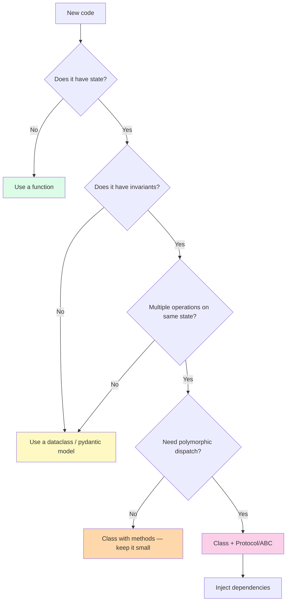

# Pythonic OOP Best Practices — A Consolidated Guide

> [!quote] "Pythonic" isn't about clever syntax. It's about writing code that fits Python's grain — code that reads like the language was designed for it.

This is the **positive catalog** to [[common-pitfalls-and-anti-patterns]]. Each practice includes:

- **Rationale** — why this is good
- **Bad example** — what to avoid
- **Good example** — the Pythonic version
- **When to deviate** — honest exceptions

End with a **Pythonic OOP checklist** for code review.

See also: [[learning-path]], [[solid-principles]], [[best-practices]], [[dunder-methods]], [[dataclasses]].

---

## 1. Favor Composition Over Inheritance

**Rationale.** Inheritance creates the tightest coupling in OOP: the child depends on the parent's *implementation*, not just its interface. Composition (holding a reference to another object) is more flexible: swap collaborators at runtime, test with doubles, combine orthogonal capabilities without deep hierarchies. See [[composition-over-inheritance]].

**Bad example**
```python
class CsvReport(FileReport):       # inherits file-handling AND report formatting
    def render(self): ...

class PdfReport(FileReport):
    def render(self): ...

class NetworkReport(FileReport):   # but this doesn't need file I/O...
    def render(self): ...
    def save(self): pass           # refused bequest — see [[common-pitfalls-and-anti-patterns]]
```

**Good example**
```python
class Report:
    def __init__(self, data, sink: ReportSink):   # compose the sink
        self.data = data
        self.sink = sink

    def render(self) -> str:
        return format(self.data)

    def save(self) -> None:
        self.sink.write(self.render())

class FileSink:
    def __init__(self, path: str): self.path = path
    def write(self, content: str): ...

class NetworkSink:
    def __init__(self, url: str): self.url = url
    def write(self, content: str): ...

# Swap sinks at runtime; test with a fake sink:
report = Report(data, sink=FakeSink())
```

**When to deviate.** Use inheritance when (a) the child is genuinely substitutable for the parent (LSP), (b) the hierarchy is shallow (≤ 2 levels), and (c) you want polymorphic dispatch and the type system to enforce it. Even then, ask: would composition work just as well?

---

## 2. Small, Focused Classes (SRP)

**Rationale.** A class with one responsibility is testable, reusable, and readable. The Single Responsibility Principle [[solid-principles]] isn't about purism — it's about **change isolation**: when a new requirement arrives, only one class should need editing.

**Bad example**
```python
class User:
    def __init__(self, name, email): self.name, self.email = name, email

    def validate_email(self): ...                  # validation
    def save_to_db(self): ...                      # persistence
    def send_welcome_email(self): ...              # notification
    def to_csv_row(self): ...                      # serialization
    def from_csv_row(cls, row): ...                # deserialization
    def hash_password(self, password): ...         # crypto
    def verify_password(self, attempt): ...        # crypto
    def render_profile_html(self): ...             # presentation
```

**Good example**
```python
@dataclass(frozen=True)
class User:                          # data + identity only
    name: str
    email: Email                     # value object, not str — see #3

class EmailValidator:
    def validate(self, email: str) -> Email: ...

class UserRepository:
    def save(self, user: User) -> None: ...
    def get(self, user_id: UserId) -> User: ...

class WelcomeMailer:
    def send(self, user: User) -> None: ...

class UserCsvSerializer:
    def to_row(self, user: User) -> str: ...
    def from_row(self, row: str) -> User: ...

class PasswordHasher:
    def hash(self, password: str) -> str: ...
    def verify(self, password: str, hashed: str) -> bool: ...
```

Each class can be tested, replaced, and understood independently.

**When to deviate.** Don't split prematurely. If two responsibilities always change together, keeping them together is correct. The Rule of Three applies: split when you've changed them separately at least three times.

---

## 3. Program to Interfaces (ABCs and Protocols)

**Rationale.** Depend on **abstractions**, not concretions (Dependency Inversion). Python gives you two tools:
- `abc.ABC` + `@abstractmethod` — inheritance-based, can include implementation.
- `typing.Protocol` — structural, no inheritance required, mypy-checked.

Protocols are more Pythonic: they let you accept "anything shaped like X" without forcing callers to inherit. ABCs are better when you have shared implementation or want to enforce a contract at instantiation.

**Bad example**
```python
class OrderProcessor:
    def __init__(self):
        self.repo = PostgresOrderRepo()    # concrete dependency — hard to test, hard to swap

    def process(self, order):
        self.repo.save(order)
```

**Good example (Protocol — structural)**
```python
from typing import Protocol

class OrderRepo(Protocol):
    def save(self, order: Order) -> None: ...
    def get(self, id: OrderId) -> Order: ...

class OrderProcessor:
    def __init__(self, repo: OrderRepo):   # accepts ANY matching shape
        self.repo = repo

# Test with a simple fake — no inheritance required:
class FakeOrderRepo:
    def __init__(self): self.saved = []
    def save(self, order): self.saved.append(order)
    def get(self, id): return next(o for o in self.saved if o.id == id)

processor = OrderProcessor(FakeOrderRepo())
```

**Good example (ABC — when you want shared implementation)**
```python
from abc import ABC, abstractmethod

class OrderRepo(ABC):
    @abstractmethod
    def save(self, order: Order) -> None: ...

    def save_all(self, orders: list[Order]) -> None:    # shared implementation
        for o in orders:
            self.save(o)

class PostgresOrderRepo(OrderRepo):
    def save(self, order: Order) -> None: ...           # provides only what's abstract
```

**When to deviate.** For internal, single-use classes, an explicit interface is overkill. Use a Protocol the moment a second implementation appears or tests need a fake.

---

## 4. Immutability Where Possible (Frozen Dataclasses)

**Rationale.** Immutable objects are:
- **Thread-safe** by construction.
- **Hashable** — usable as dict keys, set members.
- **Easier to reason about** — no spooky action at a distance.
- **Safer for caching** — value can't change under you.

Python's `@dataclass(frozen=True)` makes this trivial. Reach for it as the **default** for value objects.

**Bad example**
```python
@dataclass
class Point:
    x: float
    y: float

p = Point(1, 2)
p.x = 999   # silent mutation — anyone holding p sees the change
# Also: Point is unhashable, can't use in a set.
```

**Good example**
```python
@dataclass(frozen=True)
class Point:
    x: float
    y: float

    def translate(self, dx: float, dy: float) -> "Point":   # return NEW
        return Point(self.x + dx, self.y + dy)

p = Point(1, 2)
p2 = p.translate(3, 4)   # p unchanged, p2 is fresh
print({p, p2})           # ✅ hashable — works
```

> [!tip] Frozen + `__post_init__`
> In a frozen dataclass, you can't assign in `__post_init__` directly. Use `object.__setattr__(self, "field", value)` to "mutate" during init for normalization (e.g., rounding).

```python
@dataclass(frozen=True)
class Money:
    amount: float
    currency: str = "USD"

    def __post_init__(self) -> None:
        if self.amount < 0:
            raise ValueError("Money cannot be negative")
        object.__setattr__(self, "amount", round(self.amount, 2))
```

**When to deviate.** Mutable when the object genuinely has lifecycle (e.g., `ShoppingCart` you add items to). Even then, consider modeling mutations as new instances (`cart.add(item) -> Cart`) for hot paths where it matters.

---

## 5. Use Properties for Public API Evolution

**Rationale.** Properties let you start with a plain public attribute and later add validation, derivation, or logging **without breaking callers**. They preserve the `obj.x` access syntax while letting you intercept reads/writes.

**Bad example (over-engineered)**
```python
class Customer:
    def __init__(self, name):
        self._name = name
    @property
    def name(self): return self._name
    @name.setter
    def name(self, v): self._name = v
```
This is ceremony for no benefit.

**Bad example (under-protected)**
```python
class Customer:
    def __init__(self, name):
        self.name = name        # plain attribute
# Later: we want to validate names. We must convert to property,
# but we can do that WITHOUT changing any caller:
```

**Good example (start simple, evolve with property)**
```python
class Customer:
    def __init__(self, name: str) -> None:
        self.name = name        # plain attribute — start simple

# Three months later, we need validation. Convert to property:
class Customer:
    def __init__(self, name: str) -> None:
        self.name = name        # same call site

    @property
    def name(self) -> str:
        return self._name

    @name.setter
    def name(self, value: str) -> None:
        if not value.strip():
            raise ValueError("name cannot be empty")
        self._name = value.strip()
```

Existing `c.name = "Ada"` calls work. The API never broke.

> [!warning] Don't add expensive work in properties
> Properties look like attribute access. If yours does I/O or a heavy computation, callers will be surprised by slowness. Use an explicit method (`compute_x()`) instead.

---

## 6. Use Dunder Methods to Integrate with Python Idioms

**Rationale.** Python's syntax (`len(x)`, `x in y`, `for item in x`, `with x as y`, `x == y`, `str(x)`, `x[0]`) dispatches to dunder methods. Implementing them makes your objects feel native and idiomatic — and saves callers from learning a custom API.

**Bad example**
```python
class Playlist:
    def __init__(self): self._songs = []
    def get_song_at(self, i): return self._songs[i]
    def count(self): return len(self._songs)
    def contains(self, song): return song in self._songs
    def as_string(self): return ", ".join(s.title for s in self._songs)
```
Callers must memorize `count()`, `get_song_at()`, `contains()`, `as_string()` — none of which compose with the rest of Python.

**Good example**
```python
class Playlist:
    def __init__(self) -> None:
        self._songs: list[Song] = []

    def __len__(self) -> int:                      # len(playlist)
        return len(self._songs)

    def __getitem__(self, i: int) -> Song:         # playlist[i], playlist[1:3]
        return self._songs[i]

    def __contains__(self, song: Song) -> bool:    # song in playlist
        return song in self._songs

    def __iter__(self):                            # for song in playlist
        return iter(self._songs)

    def __repr__(self) -> str:                     # repr(playlist) — debugging
        return f"Playlist({len(self)} songs)"

    def __str__(self) -> str:                      # str(playlist) — human
        return ", ".join(s.title for s in self._songs)

    def add(self, song: Song) -> None:             # explicit mutation
        self._songs.append(song)
```

Now `len(p)`, `p[0]`, `song in p`, `for s in p: ...`, `str(p)`, `repr(p)` all work. Callers don't need to learn your API; they already know Python.

> [!tip] The dunder cheat sheet
> | Operation | Dunder |
> |---|---|
> | `len(x)` | `__len__` |
> | `x[i]`, `x[i] = v`, `del x[i]` | `__getitem__`, `__setitem__`, `__delitem__` |
> | `for i in x` | `__iter__` (or `__getitem__` with index) |
> | `x in y` | `__contains__` (or `__iter__`) |
> | `str(x)` / `repr(x)` | `__str__` / `__repr__` |
> | `x == y`, `hash(x)` | `__eq__`, `__hash__` |
> | `x < y` | `__lt__` (or `@functools.total_ordering`) |
> | `with x as y` | `__enter__` / `__exit__` |
> | `x + y` | `__add__` |
> | `x(args)` | `__call__` |
> | `del x` | `__del__` (rarely useful — prefer context managers) |

See [[dunder-methods]].

---

## 7. Type Hints + mypy

**Rationale.** Type hints are part of the design. They:
- Catch bugs at write-time, not run-time.
- Document intent for readers and IDEs.
- Enable safe refactoring at scale.
- Are required by modern Python tools (`pydantic`, `dataclasses`, FastAPI, `attrs`).

**Bad example**
```python
def process(data, options=None):
    if options and options.get("strict"):
        return [d for d in data if d.valid]
    return list(data)
```
What's `data`? What's `options`? What does it return?

**Good example**
```python
from typing import Protocol, TypedDict

class Item(Protocol):
    valid: bool

class Options(TypedDict, total=False):
    strict: bool

def process(data: Iterable[Item], options: Options | None = None) -> list[Item]:
    if options and options.get("strict"):
        return [d for d in data if d.valid]
    return list(data)
```

Run `mypy --strict` in CI. Add `from __future__ import annotations` to delay evaluation and enable forward references.

> [!tip] Modern Python typing
> - Use `X | Y` (Python 3.10+) instead of `Union[X, Y]`.
> - Use `list[int]` instead of `List[int]` (builtins are generic since 3.9).
> - Use `Protocol` for structural typing, `ABC` for nominal.
> - Use `NewType` to distinguish domain primitives (`UserId = NewType("UserId", str)`).
> - Use `TypedDict` for dict shapes you can't (yet) turn into classes.
> - Use `@overload` for functions with multiple distinct signatures.

**When to deviate.** In scripts, Jupyter notebooks, or quick prototypes, you may skip hints. But anything that goes into production should be typed.

---

## 8. Document with Docstrings (Google, NumPy, or Sphinx style)

**Rationale.** Docstrings are available at runtime via `help()` and `__doc__`. They're picked up by IDEs, Sphinx, and `pydoc`. Pick a style per project and stick to it.

**Bad example**
```python
def divide(a, b):
    # divides a by b
    return a / b
```

**Good example — Google style**
```python
def divide(a: float, b: float) -> float:
    """Divide ``a`` by ``b``.

    Args:
        a: The numerator.
        b: The denominator. Must be non-zero.

    Returns:
        The quotient ``a / b``.

    Raises:
        ZeroDivisionError: If ``b`` is zero.

    Example:
        >>> divide(10, 2)
        5.0
    """
    if b == 0:
        raise ZeroDivisionError("denominator is zero")
    return a / b
```

**Good example — NumPy style**
```python
def divide(a, b):
    """
    Divide two numbers.

    Parameters
    ----------
    a : float
        Numerator.
    b : float
        Denominator, must be non-zero.

    Returns
    -------
    float
        The quotient.

    Raises
    ------
    ZeroDivisionError
        If ``b`` is zero.
    """
```

**For classes**, document the class's role and invariant, then each public method:
```python
class BankAccount:
    """A bank account with deposit/withdraw operations.

    Invariant: ``balance >= 0`` (enforced by ``withdraw``).

    Attributes:
        owner: Name of the account holder.
    """

    def withdraw(self, amount: Money) -> None:
        """Withdraw ``amount`` from the account.

        Args:
            amount: Must be positive and <= current balance.

        Raises:
            ValueError: If ``amount`` is non-positive or exceeds balance.
        """
```

> [!tip] Sphinx + autodoc
> If you use Sphinx, docstrings are auto-extracted into HTML docs. `pytest --doctest-modules` runs examples in your docstrings as tests — free coverage!

---

## 9. Testing OOP Code (pytest, Fixtures, Mocking, DI)

**Rationale.** OOP code is testable when classes are small, dependencies are injected, and side effects are isolated. `pytest` fixtures + dependency injection are the gold combination.

**Bad example — untestable**
```python
class OrderProcessor:
    def __init__(self):
        self.db = PostgresConnection()        # concrete — can't replace
        self.mailer = SmtpMailer()             # concrete — sends real email

    def process(self, order):
        self.db.save(order)
        self.mailer.send(order.user.email, "Order confirmed")
```
Testing this requires a real Postgres and a real SMTP server. Both are slow and flaky.

**Good example — dependency-injected**
```python
# Define protocols (interfaces)
class OrderRepo(Protocol):
    def save(self, order: Order) -> None: ...

class Mailer(Protocol):
    def send(self, to: str, body: str) -> None: ...

class OrderProcessor:
    def __init__(self, repo: OrderRepo, mailer: Mailer) -> None:
        self.repo = repo
        self.mailer = mailer

    def process(self, order: Order) -> None:
        self.repo.save(order)
        self.mailer.send(order.user.email, "Order confirmed")
```

**Test with fakes (preferred over mocks):**
```python
class FakeRepo:
    def __init__(self): self.saved = []
    def save(self, order): self.saved.append(order)

class FakeMailer:
    def __init__(self): self.sent = []
    def send(self, to, body): self.sent.append((to, body))

def test_process_saves_and_emails():
    repo = FakeRepo()
    mailer = FakeMailer()
    processor = OrderProcessor(repo, mailer)

    order = Order(user=User(email="ada@example.com"), items=[...])
    processor.process(order)

    assert order in repo.saved
    assert ("ada@example.com", "Order confirmed") in mailer.sent
```

**pytest fixtures** for shared setup:
```python
import pytest

@pytest.fixture
def repo():
    return FakeRepo()

@pytest.fixture
def mailer():
    return FakeMailer()

@pytest.fixture
def processor(repo, mailer):
    return OrderProcessor(repo, mailer)

def test_process_persists(processor, repo):
    order = make_order()
    processor.process(order)
    assert order in repo.saved

def test_process_notifies(processor, mailer):
    order = make_order()
    processor.process(order)
    assert mailer.sent
```

**When to mock (vs fake).** Use `unittest.mock` when:
- You can't write a fake (third-party class, complex protocol).
- You need to assert *how many times* something was called or with what args.
- You need to simulate errors.

Prefer **fakes** for your own protocols — they're simpler, more readable, and survive refactors better than mocks.

> [!warning] Don't mock what you don't own
> Mocking `requests.get` directly couples your tests to its API. Wrap it in your own `HttpClient` Protocol, then fake *that*. Stable across library upgrades.

---

## 10. Naming Conventions (PEP 8)

**Rationale.** Consistent naming is the cheapest readability win in any codebase. PEP 8 conventions for OOP:

| Element | Convention | Example |
|---|---|---|
| Class | `PascalCase` | `BankAccount`, `OrderProcessor` |
| Method | `snake_case` | `apply_discount`, `from_dict` |
| Instance attribute | `snake_case` | `self.balance`, `self.user_id` |
| Private (by convention) | `_leading_underscore` | `self._cache`, `self._validate()` |
| Name-mangled | `__double_leading` | `self.__internal_counter` |
| Constant | `UPPER_SNAKE` | `MAX_RETRIES`, `DEFAULT_RATE` |
| Type variable | `T` or `TCo`/`TContra` | `T = TypeVar("T")` |
| Protocol / ABC | `PascalCase`, often noun-y | `SupportsClose`, `Iterable` |
| Module | `snake_case` | `order_processor.py` |
| Package | `short_lowercase` | `banking`, `utils` |

**Bad example**
```python
class bankAccount:                  # ❌ not PascalCase
    def Deposit(self, amt):         # ❌ method is PascalCase
        self.Balance += amt         # ❌ attribute is PascalCase
```

**Good example**
```python
class BankAccount:
    MAX_OVERDRAFT: ClassVar[float] = 100.0   # constant

    def __init__(self, owner: str) -> None:
        self.owner = owner
        self._balance: float = 0.0           # private by convention

    def deposit(self, amount: Money) -> None:   # snake_case method
        ...
```

> [!tip] `_` single underscore
> - As a name: "I'm ignoring this" — `for _ in range(10)`.
> - As a prefix: "internal — don't depend on this."
> - In REPL: holds the last result.
> - In `from x import *`: names starting with `_` are not imported.

---

## 11. When NOT to Use OOP (Functions + Data Classes Suffice)

**Rationale.** OOP is a tool, not a religion. Many problems are better solved with **functions over data** — especially data pipelines, ETL, pure transformations, and small scripts.

> [!quote] "I thought of objects being like biological cells... only able to communicate with messages." — Alan Kay, on what he actually meant by "OOP"
> Note that Alan Kay's vision emphasized *messaging*, not class hierarchies. Modern Python OOP often over-indexes on the latter.

**When functions are better**

| Problem | Better tool |
|---|---|
| ETL pipeline | Functions over dataclasses / pydantic models |
| Pure data transformation | Functions |
| One-off script < 100 lines | Functions |
| Numerical / scientific code | NumPy arrays + functions (vectorized) |
| HTTP handlers | Functions (FastAPI) — sometimes class-based (Django) |
| Configuration parsing | `pydantic.BaseModel` or `dataclass` (data, no behavior) |
| ML model inference | Often a function wrapping a model object |

**Bad example — OOP overuse**
```python
class DataFilter:
    def __init__(self, predicate): self.predicate = predicate
    def apply(self, data): return [x for x in data if self.predicate(x)]

class DataMapper:
    def __init__(self, fn): self.fn = fn
    def apply(self, data): return [self.fn(x) for x in data]

class Pipeline:
    def __init__(self): self.steps = []
    def add(self, step): self.steps.append(step)
    def run(self, data):
        for step in self.steps:
            data = step.apply(data)
        return data
```

**Good example — functions are clearer**
```python
def filter_data(data, predicate):
    return [x for x in data if predicate(x)]

def map_data(data, fn):
    return [fn(x) for x in data]

# Or just use built-ins / itertools:
from itertools import filterfalse, starmap
result = map(fn, filter(predicate, data))
```

**When OOP *is* better**
- The data has **invariants** that must be enforced at every mutation.
- Multiple operations share state and need consistent identity.
- You're modeling a **domain** with rich behavior (banking, games, editors).
- The object's API needs to evolve independently of its callers.

> [!tip] Functional Core, Imperative Shell
> A powerful pattern: pure functions for the business logic (no side effects, easy to test), thin OOP wrappers for I/O, state, and integration. See [[oop-in-production]].

---

## Pythonic OOP Checklist (for Code Review)

Copy this into your PR template.

```markdown
### Design
- [ ] Each class has one responsibility (SRP).
- [ ] Composition preferred over inheritance.
- [ ] Inheritance hierarchies are ≤ 2 levels deep.
- [ ] No `isinstance` dispatch (use polymorphism or `match`/`type`).
- [ ] No LSP violations (subtypes are substitutable).
- [ ] No God class (file < ~300 lines, class < ~10 public methods).

### API
- [ ] Public attributes are stable; internals use `_` prefix.
- [ ] `@property` used to evolve APIs, not as decoration.
- [ ] Dunder methods implemented where Pythonic (`__len__`, `__iter__`, `__eq__`).
- [ ] No silent no-ops or `pass`-only overrides.
- [ ] Type hints on all public APIs.
- [ ] `mypy --strict` passes.

### State
- [ ] No mutable default class attributes (`items: list = []` is a bug).
- [ ] Mutable state minimized; frozen dataclasses where possible.
- [ ] No global mutable singletons (use dependency injection).
- [ ] `__setattr__`/`__getattr__` overridden only with strong justification.

### Dependencies
- [ ] Dependencies injected via constructor (no `import` of concretions inside methods).
- [ ] Protocols or ABCs for collaborators.
- [ ] No "import from inside a function to break a cycle" — fix the cycle.

### Testing
- [ ] Each public method has at least one test.
- [ ] Tests use fakes, not mocks, for your own protocols.
- [ ] Tests don't touch real I/O (network, DB, filesystem).
- [ ] Each test name describes behavior (`test_withdraw_more_than_balance_raises`).

### Documentation
- [ ] Class docstring describes role and invariant.
- [ ] Public methods have docstrings (Google/NumPy/Sphinx — pick one).
- [ ] Complex logic has a comment explaining *why*, not *what*.
- [ ] README lists the public API and one example.

### Style
- [ ] PEP 8 naming (PascalCase classes, snake_case methods, UPPER constants).
- [ ] `ruff` / `flake8` clean.
- [ ] No dead code, no commented-out code.
- [ ] Imports sorted (`isort` / `ruff --select I`).
```

---

## Mermaid: Decision Flow for "Should This Be a Class?"



---

## A Worked Example — Putting It All Together

**Problem:** Model a user's address book.

**Apply practices 1–10:**
```python
from __future__ import annotations
from dataclasses import dataclass, field
from typing import Iterable, Protocol

# 3. Program to interfaces
class ContactStore(Protocol):
    def add(self, contact: Contact) -> None: ...
    def all(self) -> Iterable[Contact]: ...
    def find(self, name: str) -> Contact | None: ...

# 4. Immutability for value objects
@dataclass(frozen=True, order=True)
class Contact:
    name: str
    email: str
    phone: str = ""

    def __post_init__(self) -> None:
        if not self.name.strip():
            raise ValueError("name required")
        if "@" not in self.email:
            raise ValueError("invalid email")
        object.__setattr__(self, "name", self.name.strip())

# 2. Small, focused class
class AddressBook:
    """A user's address book.

    Invariant: contact names are unique (case-insensitive).
    """

    def __init__(self, store: ContactStore) -> None:   # 1. compose + 3. inject
        self._store = store

    def add(self, contact: Contact) -> None:
        if self._store.find(contact.name):
            raise ValueError(f"{contact.name} already exists")
        self._store.add(contact)

    def search(self, prefix: str) -> list[Contact]:
        return sorted(c for c in self._store.all() if c.name.lower().startswith(prefix.lower()))

    # 6. Dunder methods
    def __len__(self) -> int:
        return sum(1 for _ in self._store.all())

    def __contains__(self, name: str) -> bool:
        return self._store.find(name) is not None

    def __iter__(self):
        return iter(self._store.all())

    def __repr__(self) -> str:
        return f"AddressBook({len(self)} contacts)"

# In-memory store for tests
class InMemoryStore:
    def __init__(self) -> None:
        self._data: dict[str, Contact] = {}
    def add(self, c: Contact) -> None:
        self._data[c.name.lower()] = c
    def all(self) -> Iterable[Contact]:
        return list(self._data.values())
    def find(self, name: str) -> Contact | None:
        return self._data.get(name.lower())

# Usage
book = AddressBook(InMemoryStore())
book.add(Contact("Ada Lovelace", "ada@example.com"))
book.add(Contact("Alan Turing", "alan@example.com"))
print(len(book))                  # 2
print("Ada Lovelace" in book)     # True
for c in book: print(c)           # iterates
print(book.search("a"))           # [Ada, Alan]
```

Everything: composition, immutability, dependency injection, dunder methods, type hints, docstring, small focused class. In 50 lines.

---

## Key Takeaways

1. **Composition is the default; inheritance is the exception.** Reach for inheritance only when subtyping is genuine and the hierarchy is shallow.
2. **Small classes are easier to test, change, and reason about.** SRP is a maintenance practice, not purism.
3. **Program to interfaces** (Protocols preferred over ABCs for structural typing).
4. **Immutability is a superpower.** Use frozen dataclasses as the default for value objects.
5. **Properties evolve public APIs without breaking callers.** Don't use them as decoration.
6. **Dunder methods make your objects feel native.** Implement them where Pythonic.
7. **Type hints are part of the design.** Use `mypy --strict` in CI.
8. **Docstrings document intent.** Pick a style; apply it consistently; let Sphinx extract docs.
9. **Test with fakes, not mocks.** Dependency injection makes this easy.
10. **PEP 8 naming is free readability.** PascalCase classes, snake_case methods, `_private`, `__mangled`, `UPPER_CONSTANTS`.
11. **Don't use OOP when functions suffice.** The best OOP codebase knows when *not* to use OOP.
12. **Use the code-review checklist.** Cheap, repeatable, prevents regressions.

---

**Next:** [[real-world-examples]] — five complete mini-projects that put these practices to work.
