# Class Diagrams — The Heart of OOP Visual Modeling

> [!quote] Martin Fowler
> "If you draw only one UML diagram, draw a class diagram." It captures the static structure of your object-oriented system — the classes, their insides, and how they connect.

---

## 1. What Is a Class Diagram?

A **class diagram** is a static structural diagram that shows:

- The **classes** in a system
- Their **attributes** (data) and **operations** (methods)
- The **relationships** between them (inheritance, association, etc.)
- The **multiplicities** of those relationships (1, many, optional)

It is the **blueprint** of an OOP system — what you draw *before* you write code, and what you consult *while* debugging it.

> [!tip] Class diagram = nouns + verbs of your domain
> Walk through your problem: every noun is a candidate class; every attribute of a noun is a candidate field; every action a noun can perform is a candidate method; every "X has a Y" or "X is a Y" is a relationship.

---

## 2. Anatomy of a Class Box

A UML class is drawn as a rectangle split into **three compartments**:

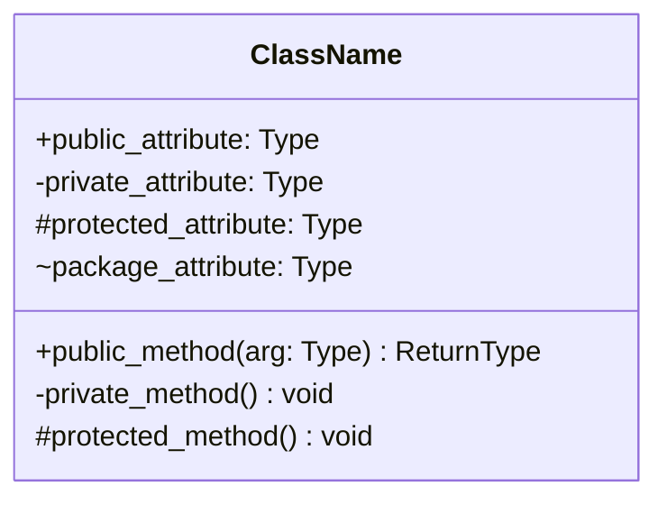

| Compartment | Contents                            | Example                              |
| ----------- | ----------------------------------- | ------------------------------------ |
| **Top**     | Class name (bold, centered)         | `BankAccount`                         |
| **Middle**  | Attributes (`name: Type`)            | `balance: Decimal`                    |
| **Bottom**  | Operations (`method(args): Return`) | `deposit(amount: Decimal): void`      |

### 2.1 Visibility Markers

The character before each member tells you who can see it:

| Marker | Meaning        | Python equivalent                       |
| ------ | -------------- | --------------------------------------- |
| `+`    | Public         | Normal attribute / method               |
| `-`    | Private        | `_name` (convention) or `__name` (mangled) |
| `#`    | Protected      | `_name` (convention only in Python)     |
| `~`    | Package        | No direct equivalent (closest: `_name`) |

> [!note] Python's honest truth
> Python has **no real private/protected**. By convention, a leading underscore means "please don't touch." A double underscore triggers name-mangling but is *not* true access control. In UML diagrams for Python code, use `-` for things you intend to be private even if the language doesn't enforce it.

### 2.2 Other Modifiers

| Notation        | Meaning                       |
| --------------- | ----------------------------- |
| `attribute: Type = value` | Default value          |
| `+ method(): Type` (italic) | Abstract method      |
| `<<interface>>`  | Stereotype: this is an interface |
| `<<abstract>>`   | Stereotype: abstract class      |
| `static` underline | Class-level member          |

### 2.3 Mermaid `classDiagram` Syntax — The Basics

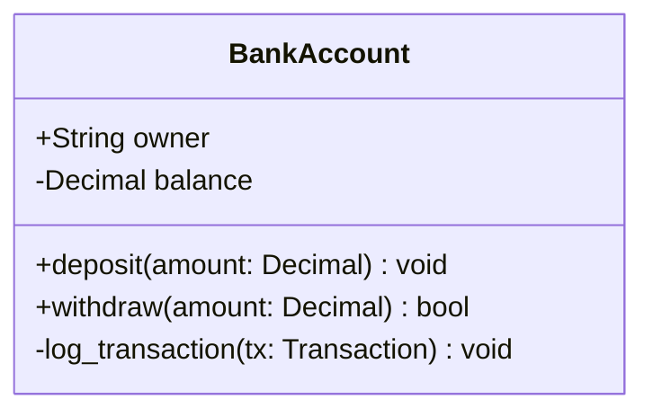

And here's the same class in Python:

```python
from decimal import Decimal

class BankAccount:
    def __init__(self, owner: str) -> None:
        self.owner: str = owner            # public
        self._balance: Decimal = Decimal(0)  # "private" by convention

    def deposit(self, amount: Decimal) -> None:
        if amount <= 0:
            raise ValueError("amount must be positive")
        self._balance += amount
        self._log_transaction(("deposit", amount))

    def withdraw(self, amount: Decimal) -> bool:
        if amount > self._balance:
            return False
        self._balance -= amount
        self._log_transaction(("withdraw", amount))
        return True

    def _log_transaction(self, tx) -> None:
        # private helper
        print(f"[{self.owner}] {tx}")
```

---

## 3. Relationships — The Critical Part

> [!warning] This is where students get confused.
> The six relationship types below are the **#1 source of UML confusion** in OOP courses. Memorize the symbol *and* the meaning. We'll give you a real-world analogy, a Mermaid diagram, and Python code for each.

### 3.1 The Six Relationships at a Glance

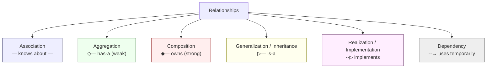

### 3.2 Association

> **Definition:** A "uses / knows about" relationship between two independent classes. One class holds a reference to the other, but neither owns the other.

> 🏠 **Analogy:** A **Teacher** *knows* their **Students**. Both exist independently; the relationship can change over time.

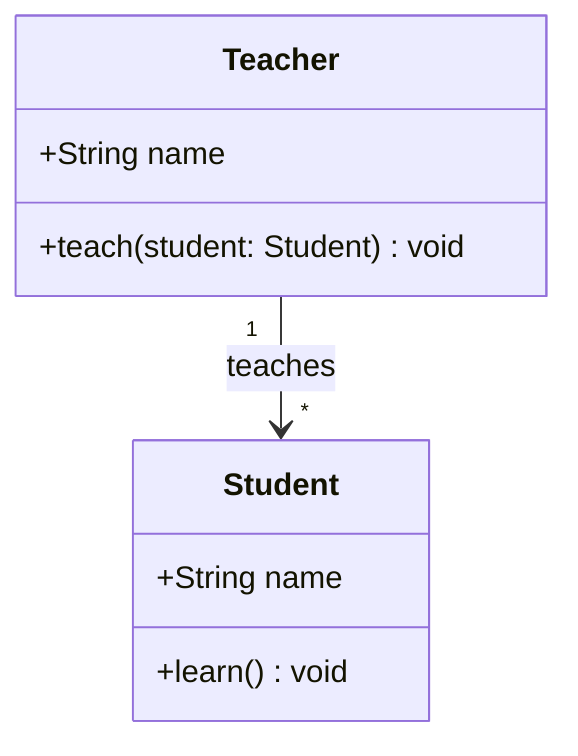

```python
class Student:
    def __init__(self, name: str) -> None:
        self.name = name

    def learn(self) -> None:
        print(f"{self.name} is learning")

class Teacher:
    def __init__(self, name: str) -> None:
        self.name = name
        self.students: list[Student] = []  # association

    def teach(self) -> None:
        for s in self.students:
            s.learn()
```

### 3.3 Aggregation (Weak "has-a")

> **Definition:** A specialized association where the **container** has the parts, but the **parts can exist independently** of the container. Drawn as a **hollow diamond** on the container side.

> 🏠 **Analogy:** A **Department** *has* **Employees**. If you dissolve the department, the employees still exist and can join another department.

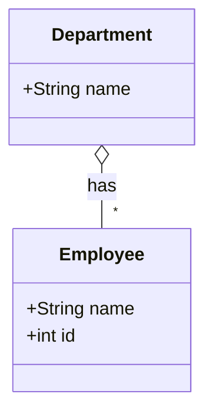

> [!note] Mermaid notation
> `o--` = hollow diamond. The diamond is on the **whole** side, the arrow (or plain line) goes to the **part**.

```python
class Employee:
    def __init__(self, name: str, emp_id: int) -> None:
        self.name = name
        self.id = emp_id

class Department:
    def __init__(self, name: str, employees: list[Employee]) -> None:
        self.name = name
        self.employees = employees  # aggregation: employees passed in, not created

# Employees created OUTSIDE the department → independent lifecycle
alice = Employee("Alice", 1)
bob = Employee("Bob", 2)
eng = Department("Engineering", [alice, bob])

# If we delete the department, alice and bob still exist
del eng
print(alice.name)  # still works
```

### 3.4 Composition (Strong "owns")

> **Definition:** A stronger form of aggregation where the **parts are created and destroyed with the whole**. The whole *owns* the parts; parts don't exist without the whole. Drawn as a **filled diamond**.

> 🏠 **Analogy:** A **House** *is composed of* **Rooms**. Demolish the house and the rooms cease to exist. You don't take a room out and put it in another house.

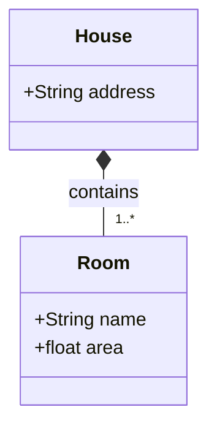

> [!note] Mermaid notation
> `*--` = filled diamond. Strong ownership.

```python
class Room:
    def __init__(self, name: str, area: float) -> None:
        self.name = name
        self.area = area

class House:
    def __init__(self, address: str) -> None:
        self.address = address
        # Rooms created INSIDE the house → composition
        self.rooms: list[Room] = [
            Room("kitchen", 12.0),
            Room("bedroom", 18.5),
        ]

    def add_room(self, room: Room) -> None:
        self.rooms.append(room)

my_house = House("123 Elm St")
# my_house owns its rooms. If my_house is destroyed,
# those Room instances are unreachable → effectively destroyed.
```

> [!tip] Aggregation vs. Composition — the test
> Ask: **"If I delete the container, do the parts still make sense?"**
> - **Yes** → Aggregation (employees without a department)
> - **No** → Composition (rooms without a house)

See [[composition-over-inheritance]] for a deeper treatment of composition.

### 3.5 Generalization / Inheritance ("is-a")

> **Definition:** A subclass **extends** a superclass — it inherits attributes and methods, and may override or add to them. Drawn as a solid line with a **hollow triangle** pointing at the superclass.

> 🏠 **Analogy:** A **Dog** *is an* **Animal**. A **Car** *is a* **Vehicle**.

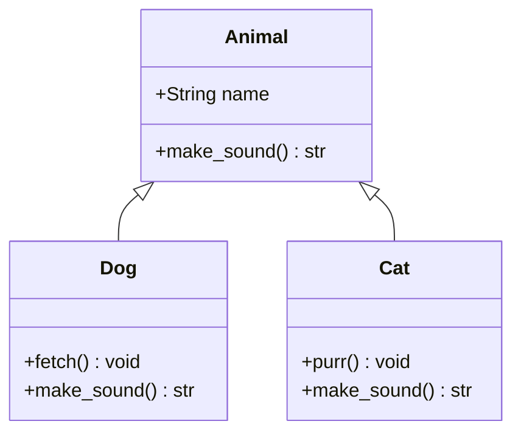

> [!note] Mermaid notation
> `<|--` = hollow triangle pointing **toward the parent**.

```python
from abc import ABC, abstractmethod

class Animal(ABC):
    def __init__(self, name: str) -> None:
        self.name = name

    @abstractmethod
    def make_sound(self) -> str: ...

class Dog(Animal):
    def make_sound(self) -> str:
        return "Woof!"

    def fetch(self) -> None:
        print(f"{self.name} fetches the ball")

class Cat(Animal):
    def make_sound(self) -> str:
        return "Meow!"

    def purr(self) -> None:
        print(f"{self.name} purrs")
```

See [[inheritance]] for the four pillars.

### 3.6 Realization / Implementation

> **Definition:** A class **implements** an interface (a contract of methods with no implementation). Drawn as a **dashed line** with a **hollow triangle** pointing at the interface.

> 🏠 **Analogy:** A **CashPayment**, **CardPayment**, and **CryptoPayment** class all **implement** the `PaymentMethod` interface. The interface defines the contract; the classes fulfill it.

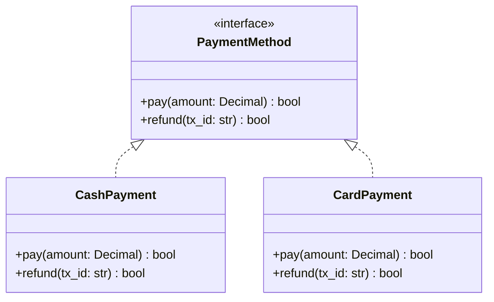

> [!note] Mermaid notation
> `<|..` = dashed line + hollow triangle = realization.

```python
from abc import ABC, abstractmethod
from decimal import Decimal

class PaymentMethod(ABC):  # the "interface"
    @abstractmethod
    def pay(self, amount: Decimal) -> bool: ...

    @abstractmethod
    def refund(self, tx_id: str) -> bool: ...

class CashPayment(PaymentMethod):
    def pay(self, amount: Decimal) -> bool:
        print(f"Collected ${amount} in cash")
        return True

    def refund(self, tx_id: str) -> bool:
        print(f"Handed back cash for {tx_id}")
        return True

class CardPayment(PaymentMethod):
    def pay(self, amount: Decimal) -> bool:
        print(f"Charged ${amount} to card")
        return True

    def refund(self, tx_id: str) -> bool:
        print(f"Refunded {tx_id} to card")
        return True
```

### 3.7 Dependency ("uses temporarily")

> **Definition:** A class **uses** another class as a parameter, return type, or local variable — but doesn't keep a reference to it. Drawn as a **dashed arrow**.

> 🏠 **Analogy:** A **Chef** *uses* a **Knife** while cooking, then puts it down. The Chef doesn't *own* the Knife — they just need it for one task.

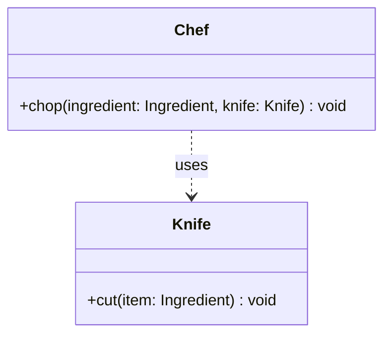

> [!note] Mermaid notation
> `..>` = dashed arrow = dependency.

```python
class Knife:
    def cut(self, item: str) -> None:
        print(f"Cutting {item}")

class Chef:
    def chop(self, ingredient: str, knife: Knife) -> None:
        # Knife is passed in as a parameter — Chef doesn't keep it
        knife.cut(ingredient)

k = Knife()
c = Chef()
c.chop("onion", k)
```

> [!tip] Dependency vs Association
> - **Dependency** (`..>`): temporary usage — parameter, return type, local var.
> - **Association** (`-->`): the reference is **stored** in a field.
> Both are "knows about"; the difference is **lifetime of the reference**.

---

## 4. Multiplicity

Multiplicity tells you **how many** objects participate in the relationship. It goes on **both ends** of the line.

| Notation | Meaning                          | Example                       |
| -------- | -------------------------------- | ----------------------------- |
| `1`      | Exactly one                      | Each `Order` has 1 `Customer` |
| `0..1`   | Zero or one (optional)           | A `Person` may have 1 `Spouse`|
| `*`      | Zero or more                     | A `Library` has `*` `Book`s   |
| `1..*`   | One or more                      | A `Course` has `1..*` `Student`s |
| `0..*`   | Same as `*`                       | A `Team` has `0..*` `Player`s |
| `2..4`   | Between 2 and 4                  | A `Car` has `2..4` `Door`s    |
| `n`      | Specific number                  | A `Triangle` has exactly 3 `Vertex` |

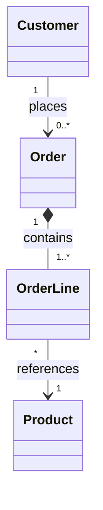

Reading: *A Customer places 0 or more Orders. Each Order is composed of 1 or more OrderLines. Each OrderLine references exactly 1 Product.*

---

## 5. Putting It All Together — A Library System

Let's design a small library system that uses **every relationship** we've covered.

### 5.1 The Diagram

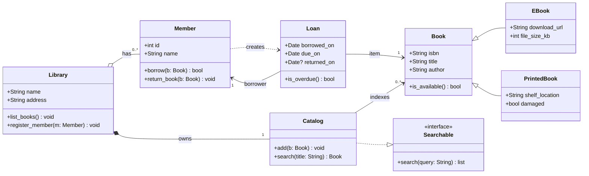

### 5.2 The Matching Python Code

```python
from __future__ import annotations
from dataclasses import dataclass, field
from datetime import date, timedelta
from typing import Optional, Protocol


# ---------- Protocol (interface) ----------
class Searchable(Protocol):
    def search(self, query: str) -> list["Book"]: ...


# ---------- Book hierarchy (inheritance) ----------
@dataclass
class Book:
    isbn: str
    title: str
    author: str
    available: bool = True

    def is_available(self) -> bool:
        return self.available


@dataclass
class EBook(Book):
    download_url: str = ""
    file_size_kb: int = 0


@dataclass
class PrintedBook(Book):
    shelf_location: str = ""
    damaged: bool = False


# ---------- Loan (composition part — created with a borrow action) ----------
@dataclass
class Loan:
    book: Book
    member: "Member"
    borrowed_on: date = field(default_factory=date.today)
    due_on: date = field(default_factory=lambda: date.today() + timedelta(days=14))
    returned_on: Optional[date] = None

    def is_overdue(self) -> bool:
        return self.returned_on is None and date.today() > self.due_on


# ---------- Member ----------
@dataclass
class Member:
    id: int
    name: str
    active_loans: list[Loan] = field(default_factory=list)

    def borrow(self, book: Book) -> bool:
        if not book.is_available():
            return False
        book.available = False
        # Member CREATES a Loan → dependency
        loan = Loan(book=book, member=self)
        self.active_loans.append(loan)
        return True

    def return_book(self, book: Book) -> None:
        for loan in self.active_loans:
            if loan.book is book:
                loan.returned_on = date.today()
                book.available = True
                self.active_loans.remove(loan)
                return


# ---------- Catalog (implements Searchable) ----------
class Catalog:
    def __init__(self) -> None:
        self._books: list[Book] = []

    def add(self, book: Book) -> None:
        self._books.append(book)

    def search(self, query: str) -> list[Book]:
        # implements the Searchable interface
        q = query.lower()
        return [b for b in self._books if q in b.title.lower() or q in b.author.lower()]


# ---------- Library ----------
class Library:
    def __init__(self, name: str, address: str) -> None:
        self.name = name
        self.address = address
        # Composition: Library OWNS its Catalog (created inside)
        self.catalog: Catalog = Catalog()
        # Aggregation: Members EXIST outside, Library just registers them
        self.members: list[Member] = []

    def register_member(self, member: Member) -> None:
        self.members.append(member)

    def add_book(self, book: Book) -> None:
        self.catalog.add(book)


# ---------- Demo ----------
if __name__ == "__main__":
    lib = Library("Central Library", "1 Library Way")

    alice = Member(1, "Alice")
    lib.register_member(alice)  # aggregation — alice exists independently

    b1 = PrintedBook(isbn="001", title="Clean Code", author="Robert Martin",
                     shelf_location="A-12")
    b2 = EBook(isbn="002", title="Design Patterns", author="Gamma et al.",
               download_url="https://lib.example.com/dp.pdf", file_size_kb=5_000)
    lib.add_book(b1)
    lib.add_book(b2)

    found = lib.catalog.search("clean")
    print("Found:", [b.title for b in found])

    alice.borrow(b1)
    print("Alice's loans:", [l.book.title for l in alice.active_loans])
    print("Overdue?", any(l.is_overdue() for l in alice.active_loans))
```

### 5.3 Mapping Diagram → Code

| Relationship in diagram        | Where to see it in the code             |
| ------------------------------ | --------------------------------------- |
| `Library o-- Member` (aggregation) | `Library.__init__` accepts members from outside via `register_member` |
| `Library *-- Catalog` (composition) | `Catalog()` is **created inside** `Library.__init__` |
| `Catalog --> Book` (association)   | `Catalog._books` is a list of references |
| `Member ..> Loan` (dependency)     | `Loan(...)` is created **inside** `Member.borrow()` |
| `Catalog ..|> Searchable` (realization) | `Catalog` matches the `Searchable` Protocol |
| `Book <|-- EBook` (inheritance)    | `class EBook(Book):` |
| `Book <|-- PrintedBook` (inheritance) | `class PrintedBook(Book):` |

---

## 6. Cheat-Sheet Reference Table

| Relationship     | Mermaid notation     | Symbol            | Strength           | Lifecycle       | Python equivalent                          |
| ---------------- | -------------------- | ----------------- | ------------------ | --------------- | ------------------------------------------ |
| Association      | `A --> B`            | Solid arrow       | "knows about"      | Independent     | Field of type `B` in `A`                   |
| Aggregation      | `A o-- B`            | Hollow diamond    | "has-a" weak       | Independent     | Field; parts passed in from outside        |
| Composition      | `A *-- B`            | Filled diamond    | "owns" strong      | Shared          | Field; parts created **inside** the whole  |
| Generalization   | `Parent <\|-- Child`| Hollow triangle   | "is-a"             | Independent     | `class Child(Parent):`                     |
| Realization      | `I <|.. C`           | Dashed hollow ▷   | "implements"       | Independent     | `class C(InterfaceABC):` / Protocol        |
| Dependency       | `A ..> B`            | Dashed arrow      | "uses"             | Independent     | `B` as parameter / local / return type     |

> [!tip] Mnemonic for the diamonds
> - **Hollow** diamond (`o--`) = "**O**pen" relationship, parts can leave → Aggregation
> - **Filled** diamond (`*--`) = "**S**olid" relationship, parts are stuck → Composition

---

## 7. Common Mistakes Students Make

> [!danger] Top 5 traps
> 1. **Drawing inheritance arrows backward.** The triangle points at the **parent**, not the child.
> 2. **Confusing aggregation with composition.** Ask the "delete the container" question.
> 3. **Forgetting multiplicities.** A relationship without multiplicity is ambiguous.
> 4. **Putting implementation details in the diagram.** UML is design, not code — show the contract, not the loop body.
> 5. **Drawing every class.** Show the relevant slice. Diagrams should fit on a screen.

---

## 8. Tips for Drawing Class Diagrams in Mermaid

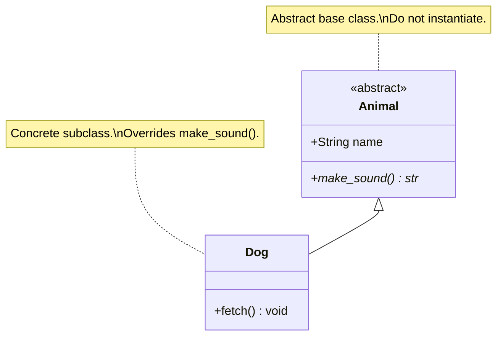

- Use `direction TB` or `direction LR` to control layout.
- Use `note for ClassName "..."` to add comments on a class.
- Use `<<interface>>`, `<<abstract>>` stereotypes for clarity.
- Use `*` after a method name to mark it abstract.
- Group related classes inside `package Name { ... }` blocks.

---

## 9. Key Takeaways

> [!summary] Six things to internalize
> 1. A class box has **three compartments**: name, attributes, operations.
> 2. Visibility: `+` public, `-` private, `#` protected, `~` package.
> 3. **Six relationships**: Association, Aggregation, Composition, Inheritance, Realization, Dependency.
> 4. **Diamond on the whole, triangle on the parent.** Hollow = weak/aggregation/inheritance; filled = strong/composition.
> 5. **Multiplicities on both ends**: `1`, `0..1`, `*`, `1..*`, `n..m`.
> 6. The class diagram is the **skeleton** of your system. Pair it with a sequence diagram for the muscles.

---

## 10. Practice Exercises

> [!exercise] Exercise 1 — Bank
> Design a class diagram for a small bank: `Bank`, `Account`, `Customer`, `Transaction`, `SavingsAccount`, `CheckingAccount`, and an interface `InterestBearing`. Include at least one example of each: inheritance, composition, aggregation, association, dependency, realization. Add multiplicities.

> [!exercise] Exercise 2 — Pets Clinic
> A veterinary clinic has `Owner`s and `Pet`s. Pets can be `Dog`, `Cat`, or `Bird`. Each pet has a `MedicalRecord` that is created with the pet and dies with it. The clinic schedules `Appointment`s between a `Vet` and a `Pet`. Draw the class diagram. Identify which relationships you used and why.

> [!exercise] Exercise 3 — Reverse-engineer
> Given the Python code below, draw the corresponding class diagram.
> ```python
> class Engine: ...
> class Wheel: ...
> class Car:
>     def __init__(self):
>         self.engine = Engine()
>         self.wheels = [Wheel() for _ in range(4)]
>     def drive(self, driver): ...
> class Driver: ...
> ```

> [!exercise] Exercise 4 — Spot the bug
> A student draws:
> ```
> House *-- Room
> Room o-- House
> ```
> What's wrong? How would you fix it?

> [!exercise] Exercise 5 — Refactor to composition
> Take the classic `Animal → Dog, Cat` hierarchy and refactor it to use composition (a `BarkBehaviour` and `MeowBehaviour` strategy). Draw the before-and-after class diagrams. See [[composition-over-inheritance]].

---

## 11. What's Next?

- 📸 [[object-diagrams]] — see how instances of these classes look at runtime.
- 💌 [[sequence-diagrams]] — how the methods on these classes get called.
- 🔄 [[state-and-activity-diagrams]] — when an `Order` or `Loan` changes state.
- 📋 [[mermaid-cheatsheet]] — copy-paste syntax for everything above.
- 🏛 [[inheritance]] · [[composition-over-inheritance]] · [[abstraction]] · [[encapsulation]] — the four pillars these diagrams visualize.
