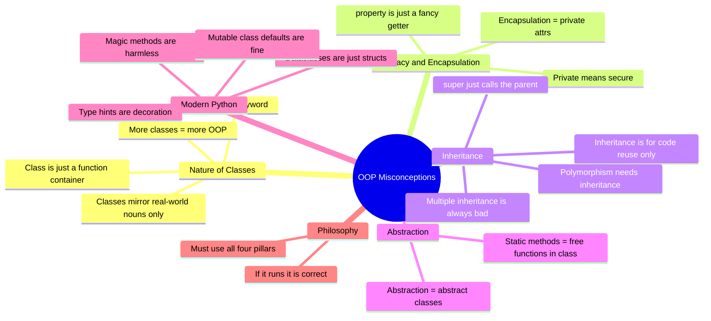

# Common OOP Misconceptions — A Catalog for Teachers and Students

> [!quote] "The first principle is that you must not fool yourself — and you are the easiest person to fool." — Richard Feynman

Every OOP misconception below is something **real students genuinely believe** — sometimes for years. Each entry follows the same structure:

- **The misconception** — what students think
- **Why it's wrong** — the truth
- **Python example showing the confusion** — code that *reveals* the bug
- **Corrected understanding** — the mental model to install
- **Teaching tip** — how to prevent or repair it

Misconceptions are grouped by topic. End with a Mermaid mind-map.

> [!tip] How to use this note
> Read one misconception per day. Find it in your own code (or your students'). *Unlearning* is harder than learning — be patient.

See also: [[learning-path]], [[common-pitfalls-and-anti-patterns]], [[four-pillars-summary]].

---

## Topic A — The Nature of Classes and Objects

### A1. "A class is just a container for functions"

**The misconception.** "A `class` is like a folder — it groups related functions so they're easier to find. I'll put `validate_email`, `send_email`, `parse_email` in an `Email` class because they're all about email."

**Why it's wrong.** A class binds **state** and **behavior** to a single instance. Functions in a class with no shared state are *just* functions — and worse, students now need to instantiate the class to call them, or worse still, use `@staticmethod` to undo the class.

**Python example showing the confusion**
```python
class EmailUtils:
    @staticmethod
    def validate_email(addr: str) -> bool: ...
    @staticmethod
    def send_email(to: str, body: str) -> None: ...
    @staticmethod
    def parse_email(raw: str) -> dict: ...

# To use this, students write:
EmailUtils.validate_email("a@b.com")   # Why am I instantiating a namespace?
```

**Corrected understanding.** Ask: does the function *need* shared state? Does it *belong* to an instance that has identity? If both are "no," write a **module**. A `email_utils.py` with three functions is cleaner, simpler, and more Pythonic than a class of `@staticmethod`s.

```python
# email_utils.py — a module, not a class
def validate_email(addr: str) -> bool: ...
def send_email(to: str, body: str) -> None: ...
def parse_email(raw: str) -> dict: ...
```

**Teaching tip.** Show the rule of three: a class earns its keep when it has **state + behavior + identity**. If you can't articulate the *identity* ("which specific `EmailUtils` is this?"), it's a module.

---

### A2. "self is a keyword / self is like `this` in Java"

**The misconception.** "`self` is a magic keyword the interpreter recognizes, just like `this` in Java. It's automatically available."

**Why it's wrong.** `self` is **not** a keyword in Python. It's a **parameter name** — a convention so strong it's effectively law, but the interpreter does not care what you call it. `this`, `me`, `potato` all work.

**Python example showing the confusion**
```python
class Counter:
    def __init__(potato, start: int) -> None:
        potato.value = start    # ✅ This runs!

    def increment(banana) -> None:
        banana.value += 1       # ✅ Also runs!

c = Counter(0)
c.increment()
print(c.value)  # 1
```

And the keyword confusion:
```python
class Broken:
    def __init__() -> None:   # ❌ forgot the first param
        pass

Broken()   # TypeError: __init__() takes 0 positional arguments but 1 was given
```

**Corrected understanding.** `obj.method(x)` is **syntactic sugar** for `Class.method(obj, x)`. The first parameter — *whatever you call it* — receives the instance. We call it `self` *by convention* so other Python programmers can read our code.

**Teaching tip.** Write `Counter.increment(c)` on the board. Then write `c.increment()`. Ask: "what's the difference?" Answer: none, except the latter is sugar. This single demo dissolves 80% of `self` confusion. See [[classes-and-objects]].

> [!warning] Java comparison
> "Like `this`" is a *useful* lie that becomes a trap. `this` is implicit and hidden in Java; `self` is explicit and visible in Python. They serve the same *role* but are mechanically different. Tell Java students: "Python makes the receiver explicit. You'll thank us later."

---

### A3. "Classes must mirror real-world nouns exactly"

**The misconception.** "If I'm building a school system, I need `Student`, `Teacher`, `Classroom`, `Course`, `Grade` — and only those. Anything else isn't 'real.'"

**Why it's wrong.** OOP models **responsibilities**, not ontology. Many of the most valuable classes are *concepts*, *roles*, *policies*, *events*, or *interactions* — `TaxCalculator`, `DiscountPolicy`, `CheckoutFlow`, `AuditLogger`, `ShippingStrategy`. These have no physical referent but earn their place by **doing one job well**.

**Python example showing the confusion**
```python
# Student models a real student. But where does tuition calculation live?
class Student:
    def __init__(self, name: str, gpa: float, credits: int, is_international: bool, ...):
        self.name = name
        self.gpa = gpa
        self.credits = credits
        self.is_international = is_international

    def compute_tuition(self) -> float:
        if self.is_international:
            return self.credits * 1200 * 1.5
        else:
            return self.credits * 800
    # ... 30 more methods, none of which a "student" should know
```

**Corrected understanding.** Extract the policy:
```python
class TuitionPolicy:
    def compute(self, student: Student) -> float: ...

class DomesticTuition(TuitionPolicy):
    def compute(self, student: Student) -> float:
        return student.credits * 800

class InternationalTuition(TuitionPolicy):
    def compute(self, student: Student) -> float:
        return student.credits * 1200 * 1.5
```

Now `Student` models a *person*; `TuitionPolicy` models a *rule*. Both are objects. Only one is a noun.

**Teaching tip.** Ask students to brainstorm "things that aren't nouns but should be classes": a `RetryStrategy`, a `SortOrder`, an `EventLogger`, a `Permission`, a `ShoppingCart`. Then ask: "What do they have in common?" Answer: **behavior and identity, even without physical form.**

---

### A4. "More classes = more OOP"

**The misconception.** "OOP means lots of classes. If my file has 30 classes, I'm doing great OOP."

**Why it's wrong.** Quality of design is independent of *quantity* of classes. A 30-class codebase can be a God-class-quilt where each class is anemic; a 5-class codebase can be pristine. The metric is **cohesion and coupling**, not class count.

**Python example showing the confusion**
```python
# Anemic: 4 classes, zero behavior, zero OOP value
class UserDTO: ...
class UserRepository: ...
class UserService: ...
class UserController: ...
# Every method just delegates to the next layer. Where's the OOP?
```

**Corrected understanding.** A single well-designed `User` class with encapsulated state, validation, and meaningful methods is worth more than four "layer" classes that pass data through.

**Teaching tip.** Show students that the Python stdlib `pathlib` has ~6 public classes and is one of the most praised OO APIs ever shipped. Count *responsibilities per class*, not classes per file.

---

## Topic B — `self`, Privacy, and Encapsulation

### B1. "Private means secure"

**The misconception.** "`_balance` is private, so users can't read or change it. It's a security feature."

**Why it's wrong.** Python has **no enforced privacy**. `_balance` is a *social contract*: "we agree not to touch this." `__balance` (double underscore) is *name-mangled* — Python rewrites it to `_ClassName__balance` to avoid accidental collisions in subclasses, **not** to prevent access. Anyone who knows the mangled name can still read it.

**Python example showing the confusion**
```python
class Account:
    def __init__(self) -> None:
        self.__balance = 0.0

a = Account()
print(a.__balance)            # ❌ AttributeError — students think this proves privacy
print(a._Account__balance)    # ✅ 0.0 — the "private" is fully accessible
a._Account__balance = 1_000_000  # ✅ mutates it freely
```

**Corrected understanding.** Python privacy is about **communication**, not access control. `_x` says "internal — don't depend on this." `__x` says "this might collide with a subclass attribute, so I'm mangling." Neither says "this is secure."

> [!danger] Real security
> Security comes from **input validation at trust boundaries** (API endpoints, parsers), not from attribute visibility. Never conflate `_` with "safe from attackers."

**Teaching tip.** Demo the `_Account__balance` access live. The look on students' faces is the whole lesson. Then: "Use `_` to *signal intent* to your fellow developers. That's its job."

---

### B2. "Encapsulation = private attributes"

**The misconception.** "Encapsulation means slapping `__` on every attribute. If I see `self.name`, that's not encapsulated."

**Why it's wrong.** Encapsulation is about **bundling state with the behavior that operates on it**, and **controlling access through a stable interface**. Privacy is one *technique*; it is not the goal. A class with public attributes but no invariants to protect doesn't need privacy at all — and forcing it adds ceremony for no benefit.

**Python example showing the confusion**
```python
# Over-encapsulated: no invariant, but everything is "private"
class Point:
    def __init__(self, x: float, y: float) -> None:
        self.__x = x
        self.__y = y

    @property
    def x(self) -> float: return self.__x
    @property
    def y(self) -> float: return self.__y

    # No setters — students think this is "more OOP" but it's just a frozen tuple
```

**Corrected understanding.** Use the lightest mechanism that fits:
- **Public attribute** — no invariants, no future behavior. `point.x = 5` is fine.
- **`@property`** — when you need validation, derivation, or a stable API while internals evolve.
- **`_private`** — internal helpers, may change without notice.
- **`__mangled`** — only when subclass name collisions are a real risk (rare).

A `Point` with no invariants is *correctly* modeled as a frozen dataclass with public attributes:
```python
from dataclasses import dataclass

@dataclass(frozen=True)
class Point:
    x: float
    y: float
```

**Teaching tip.** Show three versions of the same class — over-encapsulated, under-encapsulated, just-right — and have students debate which is best. The answer is "it depends on the invariants." See [[encapsulation]].

---

### B3. "@property is just a fancy getter"

**The misconception.** "`@property` is sugar for writing `get_x()` methods. I should use it on every attribute to look Pythonic."

**Why it's wrong.** `@property` exists to **evolve a public API without breaking callers**. If you start with `p.x`, you can later add a `@property` named `x` that computes, validates, or logs — and no caller breaks. That's its *superpower*. Using it preemptively on every attribute adds noise and locks you into a method call for no reason.

**Python example showing the confusion**
```python
# Noise: every attribute has a property for no reason
class Customer:
    def __init__(self, name: str) -> None:
        self._name = name

    @property
    def name(self) -> str:
        return self._name

    @name.setter
    def name(self, value: str) -> None:
        self._name = value
```

**Corrected understanding.** Start simple:
```python
class Customer:
    def __init__(self, name: str) -> None:
        self.name = name   # plain public attribute
```
When you *need* to intercept (validation, derived value, lazy init), *then* introduce a property. Existing `c.name` access still works.

**Teaching tip.** Demo the refactor live: start with public attribute, write tests using `c.name`, then convert to property and *show tests still pass*. This proves the property's value as an API-stability tool.

---

## Topic C — Inheritance and Composition

### C1. "Inheritance is for code reuse (only)"

**The misconception.** "I have 50 lines of shared code between `Dog` and `Cat`. I'll make an `Animal` base class with those lines and inherit. Code reuse!"

**Why it's wrong.** Inheritance's primary job is to express an **is-a substitutable** relationship: code that expects an `Animal` must work correctly with a `Dog`. Code reuse is a *side effect*, not the goal. Inheriting only for reuse creates fragile hierarchies, LSP violations, and the famous "banana-gorilla-jungle" problem.

**Python example showing the confusion**
```python
class Animal:
    def breathe(self) -> None: ...
    def reproduce(self) -> None: ...

class Dog(Animal):
    def bark(self) -> None: ...

class Fish(Animal):    # Fish can't bark — fine. But does Fish reproduce the same way?
    def swim(self) -> None: ...
```
Now someone asks: "What about a `Whale`? It breathes but reproduces differently. What about a `WorkerBee` — it can't reproduce at all? Is `WorkerBee` an `Animal`?" The hierarchy cracks.

**Corrected understanding.** Reach for inheritance when:
1. **Subtype is genuinely substitutable** — every `Dog` is acceptable wherever an `Animal` is expected.
2. **The hierarchy is shallow and stable** — depth ≤ 2, unlikely to grow.
3. **You want polymorphic dispatch** — though Python's duck typing often gives you this for free.

For pure code reuse, prefer **composition** or **mixins** (small, focused, single-purpose).

```python
class Breather:
    def breathe(self) -> None: ...

class Reproducer:
    def reproduce(self) -> None: ...

class Dog(Breather, Reproducer):  # or compose them as attributes
    def bark(self) -> None: ...
```

**Teaching tip.** Give students a 4-deep inheritance hierarchy from a real legacy codebase and ask them to add a feature. They'll feel the pain directly. Then refactor to composition. See [[composition-over-inheritance]].

---

### C2. "Multiple inheritance is always bad"

**The misconception.** "Python has multiple inheritance, but real engineers never use it. It's a footgun."

**Why it's wrong.** Multiple inheritance is a **tool**. It's bad when used for *implementation reuse across deep trees* (the diamond problem). It's *excellent* when used for **small, focused mixins** that each contribute orthogonal behavior — Python's stdlib is full of these.

**Python example showing the confusion**
```python
# Bad: deep diamond, ambiguous method resolution
class A:
    def greet(self) -> str: return "A"
class B(A):
    def greet(self) -> str: return "B"
class C(A):
    def greet(self) -> str: return "C"
class D(B, C):  # which greet() wins?
    pass
print(D().greet())  # "B" — by MRO. Students find this baffling.

# Good: focused mixins with orthogonal responsibilities
class JsonSerializable:
    def to_json(self) -> str: ...

class Loggable:
    def log(self, msg: str) -> None: ...

class User(JsonSerializable, Loggable):
    def __init__(self, name: str) -> None:
        self.name = name
```

**Corrected understanding.** Use multiple inheritance for **mixins**: small classes that add one capability, designed to be combined, with no shared base to create diamonds. Avoid multiple inheritance for *large* base classes with overlapping state.

**Teaching tip.** Show the C3 linearization (`D.__mro__`). Demystify MRO: it's deterministic, not magic. See [[inheritance]] and [[python-mechanics-index]].

---

### C3. "super() just calls the parent"

**The misconception.** "`super().__init__()` calls my parent class's `__init__`. That's all I need to know."

**Why it's wrong.** `super()` calls the **next class in the MRO**, which is *not always* the parent. In cooperative multiple inheritance, `super()` may dispatch to a sibling mixin, not the parent you're thinking of. `super()` is for **cooperative method chains**, not "call mom."

**Python example showing the confusion**
```python
class Base:
    def __init__(self) -> None:
        print("Base.__init__")

class Mixin:
    def __init__(self) -> None:
        print("Mixin.__init__")
        super().__init__()    # who does this call?

class Derived(Mixin, Base):
    def __init__(self) -> None:
        print("Derived.__init__")
        super().__init__()

Derived()
# Derived.__init__
# Mixin.__init__
# Base.__init__    <- super() in Mixin called Base, not "the parent of Mixin" (which is object)
```

**Corrected understanding.** `super()` follows the **MRO of the *instance's* class**, not the class the method is defined in. In cooperative multiple inheritance, every method in the chain must call `super()` for the chain to complete. Designing for this means:
- All methods in the chain accept the same arguments (often `**kwargs`).
- All methods call `super()` — even if they're the "leaf" — so the chain reaches `object`.

**Teaching tip.** Draw the MRO as a list on the board. Mark `super()` calls with arrows showing the next hop. Students who see the chain work mechanically stop fearing it.

---

### C4. "Polymorphism requires inheritance"

**The misconception.** "If I want `process(payment)`, every payment type must inherit from `Payment`. Otherwise it's not polymorphism."

**Why it's wrong.** Python's polymorphism is **structural** (duck typing). Any object with the right methods works — no inheritance required. `typing.Protocol` formalizes this. Inheritance is one *way* to ensure structural conformance; it is not a prerequisite.

**Python example showing the confusion**
```python
# Unnecessary inheritance
class Payment: ...
class Card(Payment):
    def charge(self, amount: float) -> bool: ...
class Cash(Payment):
    def charge(self, amount: float) -> bool: ...

# Functional duck typing — both work
def process(p: Payment, amount: float) -> None:
    p.charge(amount)

# But so does this:
class CryptoWallet:    # no inheritance
    def charge(self, amount: float) -> bool: ...

process(CryptoWallet(), 50.0)   # ✅ works in Python
```

**Corrected understanding.** Use `Protocol` for explicit structural contracts:
```python
from typing import Protocol

class Chargeable(Protocol):
    def charge(self, amount: float) -> bool: ...

def process(p: Chargeable, amount: float) -> None:
    p.charge(amount)   # mypy verifies structural conformance
```

**Teaching tip.** Show that `len("abc")`, `len([1,2,3])`, `len({"a":1})` all work — strings, lists, and dicts share no inheritance, but all implement `__len__`. That's polymorphism without inheritance, right in the stdlib. See [[polymorphism]] and [[python-protocols]].

---

## Topic D — Abstraction and Interfaces

### D1. "Abstraction = abstract classes"

**The misconception.** "Abstraction is the act of writing `from abc import ABC`. If my class is `class Foo(ABC)`, I'm doing abstraction."

**Why it's wrong.** Abstraction is a **mental act**: choosing which details to expose and which to hide. `ABC` and `@abstractmethod` are *tools* that *enforce* a contract. You can — and often do — abstract without any abstract classes at all: a `Protocol`, a function signature, a well-chosen public API.

**Python example showing the confusion**
```python
# Student thinks this is "abstraction" because of ABC
from abc import ABC, abstractmethod

class Database(ABC):
    @abstractmethod
    def connect(self) -> None: ...
    @abstractmethod
    def query(self, sql: str) -> list: ...
    @abstractmethod
    def close(self) -> None: ...

# But then provides 200 lines of concrete methods in the same class,
# mixing abstraction levels and breaking SRP
```

**Corrected understanding.** Abstraction is the discipline of **separating "what" from "how"**. You can do it with:
- A `Protocol` (no inheritance, structural)
- An `ABC` (inheritance-based, can include implementation)
- A simple function with a clear signature (the most underused abstraction)
- A well-named public method that hides a complex private implementation

```python
# Pure abstraction via protocol — no ABC needed
class SupportsClose(Protocol):
    def close(self) -> None: ...

def with_resource[R: SupportsClose](r: R, fn: Callable[[R], None]) -> None:
    try:
        fn(r)
    finally:
        r.close()
```

**Teaching tip.** Ask: "Is `print()` abstract?" Yes — you don't know *how* it writes to stdout, only *that* it does. Abstraction without a single `ABC`. See [[abstraction]].

---

### D2. "Static methods are the same as regular functions in a class"

**The misconception.** "If a function doesn't use `self`, I just slap `@staticmethod` on it. It's the same as a free function — Python provides the decorator, so I should use it."

**Why it's wrong.** Mechanically, `@staticmethod` *is* a free function with a class-namespaced address. But namespace placement matters: a `@staticmethod` belongs in a class only when it's **conceptually part of the class's domain** and benefits from being discovered through the class. Random helper functions in a class add indirection without value.

**Python example showing the confusion**
```python
class Order:
    @staticmethod
    def _validate_email(email: str) -> bool: ...   # what does this have to do with Order?
    @staticmethod
    def _format_currency(amount: float) -> str: ...  # formatting currency = Order's job?
    @staticmethod
    def _read_config(path: str) -> dict: ...        # IO in the Order namespace?
```

**Corrected understanding.** Use `@staticmethod` when:
- The function is **genuinely part of the class's responsibility** (e.g., `datetime.fromisoformat`).
- You want **discoverability** through the class namespace.
- The function is **polymorphic over the class's type system** (rare).

Otherwise, prefer a **module-level function** or a `@classmethod` that returns an instance.

```python
# Module-level is often cleaner
def validate_email(email: str) -> bool: ...
def format_currency(amount: float) -> str: ...

class Order:
    @classmethod
    def from_dict(cls, data: dict) -> "Order": ...   # genuine classmethod — returns an Order
```

**Teaching tip.** When reviewing student code, count `@staticmethod`s. If most of them are unrelated utilities, the student is using the class as a namespace — refactor to a module.

---

## Topic E — Modern Python OOP

### E1. "Dataclasses are just structs"

**The misconception.** "`@dataclass` is for C-style structs — bags of fields. If I want behavior, I need a real class."

**Why it's wrong.** A `@dataclass` is a full class. It can have methods, properties, inheritance, and dunder methods. `@dataclass` just **auto-generates** `__init__`, `__repr__`, `__eq__`, `__hash__`, and `__lt__` so you don't have to write boilerplate. It is the **default starting point** for most Python classes today.

**Python example showing the confusion**
```python
# Student thinks this is "just a struct"
@dataclass
class Money:
    amount: float
    currency: str

# But it can have full behavior
@dataclass(frozen=True, order=True)
class Money:
    amount: float
    currency: str = "USD"

    def __post_init__(self) -> None:
        if self.amount < 0:
            raise ValueError("Money cannot be negative")
        # frozen=True means we must use object.__setattr__ to "mutate"
        object.__setattr__(self, 'amount', round(self.amount, 2))

    def add(self, other: "Money") -> "Money":
        if self.currency != other.currency:
            raise ValueError("Currency mismatch")
        return Money(self.amount + other.amount, self.currency)

    def convert_to(self, rate: float, target: str) -> "Money":
        return Money(self.amount * rate, target)
```

**Corrected understanding.** Reach for `@dataclass` first; fall back to manual `__init__` only when you need logic the decorator can't express. Frozen dataclasses are **immutable value objects** — one of the most underused techniques in Python.

**Teaching tip.** Show the same class written four ways: plain class, `@dataclass`, `@dataclass(frozen=True)`, and `NamedTuple`. Discuss when each shines. See [[dataclasses]].

---

### E2. "Type hints are optional decoration"

**The misconception.** "Type hints are documentation — they don't affect runtime, so they're optional. I'll add them when I have time."

**Why it's wrong.** Type hints **do** affect runtime via `dataclasses`, `pydantic`, FastAPI, and `attrs`. More importantly, they're the **contract** that lets `mypy` catch bugs at write-time, lets IDEs refactor safely, and lets teams scale. Treating them as decoration forfeits all of this.

**Python example showing the confusion**
```python
# Untyped — bug hiding in plain sight
def transfer(from_account, to_account, amount):
    from_account.balance -= amount
    to_account.balance += amount

# Bug: caller swaps arguments
transfer(b_account, a_account, 100)   # transfers the wrong way; no error

# Typed — mypy catches the misuse (with stricter settings) and humans read intent
def transfer(from_account: Account, to_account: Account, amount: Money) -> None:
    ...
```

Even better, use `NewType` to make accidental swaps impossible:
```python
from typing import NewType
AccountId = NewType("AccountId", str)

def transfer(src: AccountId, dst: AccountId, amount: Money) -> None: ...
```

**Corrected understanding.** Type hints are part of the design. Add them as you write, not after. Run `mypy --strict` in CI. The cost is small; the safety is large.

**Teaching tip.** Show a real bug that `mypy` would have caught. Students who see a bug prevented become converts instantly. See [[best-practices]].

---

### E3. "Abstraction = abstract classes" (restated for clarity)

> [!note] Cross-reference
> Already covered as [[#D1. "Abstraction = abstract classes"]]. The misconception persists across students of all levels; revisit it whenever you see `ABC` used as a synonym for "interface."

---

## Topic F — Method Resolution and Magic

### F1. "`__getattr__` and `__setattr__` are harmless magic"

**The misconception.** "I'll override `__getattr__` to dynamically create attributes — that's powerful and convenient."

**Why it's wrong.** Overriding `__setattr__` or `__getattr__` without deep understanding breaks:
- **Pickling** (and thus multiprocessing, caching)
- **`copy.deepcopy`**
- **ORM integration** (Django, SQLAlchemy)
- **Debugger introspection**
- **Default `__eq__`/`__hash__`**

Worse, infinite recursion is one typo away:
```python
class Bad:
    def __setattr__(self, name: str, value: Any) -> None:
        self.name = value   # ❌ infinite recursion — calls __setattr__ again
```

**Python example showing the confusion**
```python
class DictBacked:
    def __init__(self) -> None:
        object.__setattr__(self, '_data', {})   # must use object.__setattr__!

    def __getattr__(self, name: str) -> Any:
        return self._data[name]   # works

    def __setattr__(self, name: str, value: Any) -> None:
        self._data[name] = value  # also works because we used object.__setattr__ above
```

**Corrected understanding.** Reach for `__getattr__`/`__setattr__` only when you genuinely need dynamic attribute resolution — proxies, lazy loading, ORM internals. For 99% of classes, use plain attributes or `@property`. If you must override, use `object.__setattr__(self, ...)` to bypass your own hook.

**Teaching tip.** Show a class with `__setattr__` overridden that crashes `pickle.dumps()`. The blast radius is the lesson.

---

### F2. "Mutable default class attributes are fine because they're shared"

**The misconception.** "If I write `items: list = []` at class level, every instance starts with an empty list. Convenient!"

**Why it's wrong.** The default value is evaluated **once**, at class definition time. Every instance shares the **same list object**. Mutations in one instance leak to all others.

**Python example showing the confusion**
```python
class ShoppingCart:
    items: list = []   # ❌ CLASS-level mutable default

c1 = ShoppingCart()
c2 = ShoppingCart()
c1.items.append("apple")
print(c2.items)   # ['apple'] — every cart now has an apple!
```

**Corrected understanding.** Initialize mutable defaults in `__init__`:
```python
class ShoppingCart:
    def __init__(self) -> None:
        self.items: list = []   # fresh list per instance
```

Or with dataclasses:
```python
from dataclasses import dataclass, field

@dataclass
class ShoppingCart:
    items: list = field(default_factory=list)   # ✅ correct
```

> [!danger] This is one of the most common Python bugs
> Show this to students *early and often*. Linters (`ruff`, `flake8-bugbear`) catch it; so should code review.

**Teaching tip.** This bug is memorable when seen live. Add to a cart in front of the class, instantiate another, and show the leak. See [[common-pitfalls-and-anti-patterns]].

---

## Topic G — Design Philosophy Misconceptions

### G1. "OOP means using all four pillars everywhere"

**The misconception.** "If my code doesn't use inheritance, encapsulation, polymorphism, and abstraction in equal measure, it's not really OOP."

**Why it's wrong.** The four pillars are **vocabulary**, not a checklist. Excellent OOP code uses each pillar **when the problem demands it**. A frozen dataclass with no inheritance is still OOP. A function with type hints and no classes is also legitimate Python. The goal is **good design**, not pillar-quota-filling.

**Teaching tip.** Show students code that's "pure OOP" and terrible (deep hierarchies, abstraction everywhere, no behavior), and code that's mostly functions and excellent (the `requests` library). Discuss what makes each good or bad.

---

### G2. "If it compiles (or runs), it's correct"

**The misconception.** "My code runs and produces the right output. The design must be fine."

**Why it's wrong.** Code that runs is the **minimum** bar. Maintainable code is the actual bar. Tests pass today; what about six months from now when requirements change? See [[common-pitfalls-and-anti-patterns]] for the catalog of "runs but is wrong" anti-patterns.

**Teaching tip.** Give students a "working" God class and a new requirement. They'll spend an hour adding the feature. Then give them the same requirement against a well-factored version. The time difference *is* the cost of bad design — made tangible.

---

## Mermaid Mind-Map of Misconceptions



---

## Detection Heuristics for Instructors

How to spot these misconceptions in student code reviews:

| Signal | Likely misconception |
|---|---|
| Class with only `@staticmethod`s | [[#A1]] (class as container) |
| `__` on every attribute | [[#B1]], [[#B2]] (privacy = security) |
| `@property` on every attribute | [[#B3]] (property as decoration) |
| Inheritance depth > 2 | [[#C1]] (inheritance for reuse) |
| `if isinstance(x, T):` chains | [[#C4]] (polymorphism needs inheritance) |
| `@staticmethod` on helpers | [[#D2]] (static methods = free functions) |
| Manual `__init__` for plain data | [[#E1]] (dataclasses are just structs) |
| No type hints | [[#E2]] (type hints as decoration) |
| `items: list = []` at class level | [[#F2]] (mutable default bug) |
| Overridden `__setattr__` | [[#F1]] (magic methods harmless) |

---

## Key Takeaways

1. **Misconceptions are predictions about code that don't survive contact with the code.** Surface them by *running* the buggy version.
2. **Privacy in Python is communication, not enforcement.** Teach `_` and `__` as *signals to other developers*, not as security.
3. **Inheritance expresses *subtyping*, not just *code reuse*.** Substitutability is the test.
4. **Polymorphism in Python is structural (duck typing).** Inheritance is one way to achieve it; `Protocol` is often better.
5. **`@dataclass` is the modern default** for classes that primarily hold data. Frozen dataclasses are value objects.
6. **Type hints are part of the design**, not decoration. Use `mypy` from day one.
7. **Magic methods have a blast radius.** Override `__getattr__`/`__setattr__` only when you understand the trade-offs.
8. **Mutable default class attributes are the #1 Python footgun.** Linters catch them; so should your eye.
9. **Quality of OOP ≠ quantity of classes.** Cohesion and coupling are the metrics.
10. **The four pillars are vocabulary, not a checklist.** Use each when the problem demands it.

---

**Next:** [[common-pitfalls-and-anti-patterns]] — the catalog of bad code that *runs* but is wrong.
