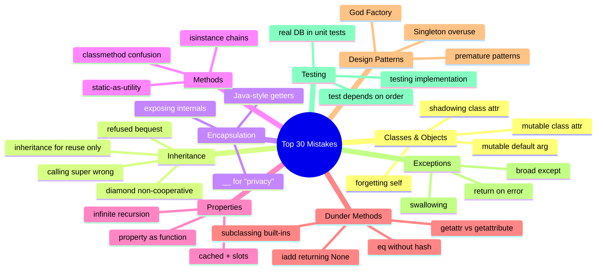

# ❌ Common Mistakes Cheat Sheet

> [!tip] How to use this card
> Open it during code review. Each row is ❌ bad → ✅ good → one-line why. Scan by topic. Click wikilinks for the deep dive.

Deep dives: [[common-pitfalls-and-anti-patterns]] · [[common-misconceptions]] · [[best-practices]] · [[magic-methods]] · [[properties]] · [[methods]] · [[classes-and-objects]].

---

## 🗺️ Topic Map



---

## 🏗️ Classes & Objects

### 1. Mutable class attribute shared across instances

❌ **Bad**

```python
class ShoppingCart:
    items: list = []                      # shared across ALL carts
    def add(self, x): self.items.append(x)
c1, c2 = ShoppingCart(), ShoppingCart()
c1.add("apple"); print(c2.items)          # ['apple']  ← bug!
```

✅ **Good**

```python
class ShoppingCart:
    def __init__(self) -> None:
        self.items: list = []             # fresh per instance
    def add(self, x): self.items.append(x)
```

**Why:** Class attributes live on the class; instances see the same object. Always init mutables in `__init__`. See [[classes-and-objects]].

---

### 2. Mutable default argument in `__init__`

❌ **Bad**

```python
class Basket:
    def __init__(self, items: list = []): # shared default!
        self.items = items
```

✅ **Good**

```python
from dataclasses import field
class Basket:
    def __init__(self, items: list | None = None):
        self.items = items if items is not None else []
# Or use @dataclass:
@dataclass
class Basket:
    items: list = field(default_factory=list)
```

**Why:** Default arguments are evaluated **once** at function definition. Same trap as #1. See [[common-mistakes-cheatsheet]] · [[dataclasses-and-attrs]].

---

### 3. Forgetting `self` in a method

❌ **Bad**

```python
class Counter:
    count = 0
    def increment():                      # no self!
        Counter.count += 1
Counter().increment()                     # TypeError: takes 0 args
```

✅ **Good**

```python
class Counter:
    count = 0
    def increment(self) -> None:
        Counter.count += 1                # or: type(self).count += 1
```

**Why:** Instance methods must take `self` as the first parameter; Python passes the instance implicitly at call time. See [[methods]].

---

### 4. Setting a class attribute via `self.x =` (shadowing)

❌ **Bad**

```python
class Config:
    debug = False                         # class attr
    def enable(self): self.debug = True   # creates instance attr, doesn't update class
Config().enable()
print(Config.debug)                       # False — class attr unchanged
```

✅ **Good**

```python
class Config:
    debug = False
    def enable(self) -> None:
        type(self).debug = True           # update the class attr
        # or use cls in classmethods
```

**Why:** `self.x = v` always sets an instance attribute, shadowing any class attribute of the same name. See [[classes-and-objects]].

---

## 🧬 Inheritance

### 5. Calling `super()` wrong in `__new__`

❌ **Bad**

```python
class Traced(tuple):
    def __new__(cls, items):
        return super().__new__(items)     # missing cls!
```

✅ **Good**

```python
class Traced(tuple):
    def __new__(cls, items):
        return super().__new__(cls, items)
```

**Why:** `tuple.__new__` requires the `cls` argument. `super().__new__()` still needs the class. See [[classes-and-objects]] · [[magic-methods]].

---

### 6. Non-cooperative `super()` in diamond

❌ **Bad**

```python
class A:
    def __init__(self): print("A")
class B(A):
    def __init__(self): print("B"); A.__init__(self)        # bypasses MRO
class C(A):
    def __init__(self): print("C"); A.__init__(self)
class D(B, C):
    def __init__(self): print("D"); B.__init__(self); C.__init__(self)
# A's __init__ runs TWICE — wrong!
```

✅ **Good**

```python
class A:
    def __init__(self): print("A")
class B(A):
    def __init__(self): print("B"); super().__init__()      # cooperative
class C(A):
    def __init__(self): print("C"); super().__init__()      # cooperative
class D(B, C):
    def __init__(self): print("D"); super().__init__()      # follows MRO
# Order: D, B, C, A — once each
```

**Why:** `super()` follows the C3-linearized MRO; explicit `Parent.__init__` breaks cooperation. See [[inheritance]] · [[methods]].

---

### 7. Inheritance for code reuse only (LSP violation)

❌ **Bad**

```python
class Stack(list):                        # inherit list for free push/pop
    def push(self, x): self.append(x)
s = Stack()
s.insert(0, "x")                          # not a stack operation — exposes list internals
```

✅ **Good**

```python
class Stack:
    def __init__(self): self._items: list = []
    def push(self, x): self._items.append(x)
    def pop(self): return self._items.pop()
    # only expose stack operations
```

**Why:** A `Stack` is *not* a `list` (LSP fails — list allows index insertion). Use composition. See [[composition-over-inheritance]].

---

### 8. Refused bequest (subclass ignores parent's contract)

❌ **Bad**

```python
class Bird:
    def fly(self): ...
class Penguin(Bird):
    def fly(self): raise NotImplementedError("penguins can't fly")
```

✅ **Good**

```python
class Bird: ...
class FlyingBird(Bird):
    def fly(self): ...
class Penguin(Bird): ...                  # no fly() at all
# Or use composition with a FlightBehavior
```

**Why:** A `Penguin` *is* a `Bird`, but should not be a `FlyingBird`. Refactoring the hierarchy fixes LSP. See [[solid-principles]] · [[common-pitfalls-and-anti-patterns]].

---

## 🔒 Encapsulation

### 9. Exposing internal collections directly

❌ **Bad**

```python
class Library:
    def __init__(self): self._books: list = []
    def books(self) -> list: return self._books     # caller can mutate
lib = Library(); lib.books().append("stolen")       # oops — bypassed any checks
```

✅ **Good**

```python
class Library:
    def __init__(self): self._books: list = []
    def books(self) -> tuple: return tuple(self._books)     # immutable snapshot
    def add_book(self, b): self._books.append(b)             # controlled mutation
```

**Why:** Returning the live list breaks encapsulation. Return a copy or an immutable view. See [[encapsulation]].

---

### 10. Java-style `getX()`/`setX()` instead of `@property`

❌ **Bad**

```python
class Temperature:
    def __init__(self): self._c = 0
    def getCelsius(self) -> float: return self._c
    def setCelsius(self, v: float) -> None:
        if v < -273.15: raise ValueError
        self._c = v
```

✅ **Good**

```python
class Temperature:
    def __init__(self): self._celsius = 0
    @property
    def celsius(self) -> float: return self._celsius
    @celsius.setter
    def celsius(self, v: float) -> None:
        if v < -273.15: raise ValueError("below absolute zero")
        self._celsius = v
```

**Why:** Pythonic — attribute syntax, validation logic, easy migration from public attr. See [[properties]].

---

### 11. Using `__` for "privacy" (when you really mean `_`)

❌ **Bad**

```python
class Account:
    def __init__(self, balance):
        self.__balance = balance          # mangled to _Account__balance
class SavingsAccount(Account):
    def show(self): print(self.__balance) # AttributeError! not inherited
```

✅ **Good**

```python
class Account:
    def __init__(self, balance): self._balance = balance  # convention-only
class SavingsAccount(Account):
    def show(self): print(self._balance)  # works
```

**Why:** `__` name-mangling breaks inheritance and is **not** security. Use `_` for "by convention, don't touch". See [[encapsulation]].

---

## 📞 Methods

### 12. `isinstance` chains instead of polymorphism

❌ **Bad**

```python
def area(shape):
    if isinstance(shape, Circle):  return 3.14 * shape.r ** 2
    elif isinstance(shape, Square): return shape.s ** 2
    elif isinstance(shape, Triangle): return 0.5 * shape.b * shape.h
    raise ValueError("unknown shape")
```

✅ **Good**

```python
class Shape(ABC):
    @abstractmethod
    def area(self) -> float: ...
class Circle(Shape):
    def area(self) -> float: return 3.14 * self.r ** 2
class Square(Shape):
    def area(self) -> float: return self.s ** 2
def area(shape: Shape) -> float: return shape.area()   # polymorphic dispatch
```

**Why:** `isinstance` chains violate OCP and GRASP-Polymorphism. See [[polymorphism]] · [[solid-principles]].

---

### 13. Static method that should be a top-level function

❌ **Bad**

```python
class MathUtils:
    @staticmethod
    def add(a, b): return a + b           # no relation to the class
    @staticmethod
    def multiply(a, b): return a * b
```

✅ **Good**

```python
# Top-level module functions:
def add(a, b): return a + b
def multiply(a, b): return a * b
# Reserve @staticmethod for functions that conceptually belong WITH the class
# (e.g., a helper used by classmethods or instance methods of the same class).
```

**Why:** Don't use classes as namespaces; modules already are. See [[methods]] · [[best-practices]].

---

### 14. Confusing `@classmethod` and `@staticmethod`

❌ **Bad**

```python
class User:
    @staticmethod
    def from_email(email):                # wants to construct — needs cls!
        return User(email)                # hard-codes User; breaks subclasses
```

✅ **Good**

```python
class User:
    def __init__(self, email: str): self.email = email
    @classmethod
    def from_email(cls, email: str):      # alt constructor
        return cls(email)                 # subclass-friendly
```

**Why:** Alternate constructors must use `@classmethod` so subclasses construct their own type. See [[methods]].

---

## 🪟 Properties

### 15. Infinite recursion in property setter

❌ **Bad**

```python
class Temperature:
    @property
    def celsius(self): return self.celsius          # infinite recursion!
    @celsius.setter
    def celsius(self, v): self.celsius = v          # infinite recursion!
```

✅ **Good**

```python
class Temperature:
    @property
    def celsius(self): return self._celsius         # private backing field
    @celsius.setter
    def celsius(self, v): self._celsius = v
```

**Why:** The property name shadows the attribute; you need a separate backing field (convention: `_name`). See [[properties]].

---

### 16. `@cached_property` + `__slots__` (no `__dict__`)

❌ **Bad**

```python
from functools import cached_property
class Point:
    __slots__ = ("x", "y")                # no __dict__!
    def __init__(self, x, y): self.x, self.y = x, y
    @cached_property
    def magnitude(self): return (self.x**2 + self.y**2) ** 0.5
# AttributeError on access — cached_property can't store the result
```

✅ **Good**

```python
from functools import cached_property
class Point:
    __slots__ = ("x", "y", "_magnitude")  # explicit slot for the cache
    def __init__(self, x, y):
        self.x, self.y, self._magnitude = x, y, None
    @property
    def magnitude(self):
        if self._magnitude is None:
            self._magnitude = (self.x**2 + self.y**2) ** 0.5
        return self._magnitude
# Or add "__dict__" to __slots__ if you want cached_property to work
```

**Why:** `cached_property` writes to `__dict__`; pure `__slots__` prevents that. See [[properties]].

---

### 17. Using a `@property` for an expensive operation

❌ **Bad**

```python
class Document:
    @property
    def word_count(self):
        # expensive O(n) scan, called every access
        return len(self.text.split())
d = Document(text)
print(d.word_count + d.word_count + d.word_count)   # scans 3×
```

✅ **Good**

```python
class Document:
    def word_count(self) -> int:           # method signals "work"
        return len(self.text.split())
# Or cache it:
from functools import cached_property
class Document:
    @cached_property
    def word_count(self) -> int:
        return len(self.text.split())
```

**Why:** Properties *look* free to the caller. If work is non-trivial, make it a method (or cache). See [[best-practices]].

---

## 🪄 Dunder Methods

### 18. `__eq__` without `__hash__` (object becomes unhashable)

❌ **Bad**

```python
class Money:
    def __init__(self, amt): self.amt = amt
    def __eq__(self, other): return self.amt == other.amt
    # no __hash__ → unhashable → can't use as dict key / in set
m = Money(5); {m: "x"}   # TypeError: unhashable type: 'Money'
```

✅ **Good**

```python
class Money:
    def __init__(self, amt): self.amt = amt
    def __eq__(self, other): return isinstance(other, Money) and self.amt == other.amt
    def __hash__(self): return hash(self.amt)
# Or use @dataclass(frozen=True) which generates both
```

**Why:** Defining `__eq__` sets `__hash__ = None` automatically. Pair them. See [[magic-methods]].

---

### 19. `__iadd__` returning `None` (breaks `+=`)

❌ **Bad**

```python
class Vector:
    def __init__(self, *coords): self.coords = list(coords)
    def __iadd__(self, other):
        for i, v in enumerate(other.coords): self.coords[i] += v
        # no return → returns None → v += w sets v to None!
```

✅ **Good**

```python
class Vector:
    def __init__(self, *coords): self.coords = list(coords)
    def __iadd__(self, other):
        for i, v in enumerate(other.coords): self.coords[i] += v
        return self                       # ALWAYS return self from __i*__
```

**Why:** In-place operators must return the (mutated) instance; Python assigns the return value back. See [[magic-methods]].

---

### 20. `__getattr__` vs `__getattribute__` (infinite recursion)

❌ **Bad**

```python
class LogAttr:
    def __getattribute__(self, name):
        print(f"access {name}")
        return self.name                  # infinite recursion!
```

✅ **Good**

```python
class LogAttr:
    def __getattribute__(self, name):
        print(f"access {name}")
        return super().__getattribute__(name)   # delegate to default
# Or use __getattr__ which only fires when normal lookup FAILS:
class Safe:
    def __getattr__(self, name):
        if name == "fallback": return "default"
        raise AttributeError(name)
```

**Why:** `__getattribute__` is called on *every* attribute access — `self.anything` recurses. Use `super().__getattribute__` or prefer `__getattr__`. See [[magic-methods]].

---

### 21. Subclassing `list`/`dict` without overriding the right methods

❌ **Bad**

```python
class CountingList(list):
    def append(self, x):                  # only overrides append
        print("append called")
        super().append(x)
cl = CountingList([1, 2, 3])              # bypasses append! C-level init
cl.extend([4, 5])                         # bypasses append! C-level extend
```

✅ **Good**

```python
from collections import UserList
class CountingList(UserList):             # pure-Python base
    def append(self, x):
        print("append called"); super().append(x)
    def extend(self, items):
        print("extend called"); super().extend(items)
# Now every entry point goes through your overrides
```

**Why:** Built-in `list`/`dict` have C-level shortcuts that bypass Python overrides. Use `collections.UserList`/`UserDict` for full hookability. See [[magic-methods]] · [[best-practices]].

---

## 🧩 Design Patterns

### 22. Singleton overuse (hidden global mutable state)

❌ **Bad**

```python
class Config:
    _instance = None
    def __new__(cls):
        if cls._instance is None: cls._instance = super().__new__(cls)
        return cls._instance
# Used everywhere as Config()._data["key"] — global mutable, untestable
```

✅ **Good**

```python
# Module-level instance is enough for "one shared thing":
@dataclass(frozen=True)
class Config:
    db_url: str
    api_key: str
# Build it once in main() / composition root; inject as a dependency.
config = Config(db_url="...", api_key="...")
def processor(cfg: Config): ...           # injected, mockable
```

**Why:** Singletons are global mutable state in disguise; they break DI and testability. See [[dependency-injection]] · [[common-pitfalls-and-anti-patterns]].

---

### 23. God Factory (one Factory that creates everything)

❌ **Bad**

```python
class Factory:
    def make(self, kind: str):
        if kind == "user": return User()
        elif kind == "order": return Order()
        elif kind == "product": return Product()
        elif kind == "invoice": return Invoice()
        # ... grows forever
```

✅ **Good**

```python
# One factory per family:
class UserFactory: ...
class OrderFactory: ...
class ProductFactory: ...
# Or use a typed registry:
REGISTRY: dict[str, Callable[[], Any]] = {"user": User, "order": Order, "product": Product}
def make(kind: str): return REGISTRY[kind]()
```

**Why:** God Factories violate SRP. See [[solid-principles]] · [[design-patterns-creational]].

---

### 24. Premature pattern application (YAGNI violation)

❌ **Bad**

```python
class HelloWorldStrategy(ABC):            # over-engineered for 1 variation
    @abstractmethod
    def execute(self): ...
class PrintHelloStrategy(HelloWorldStrategy):
    def execute(self): print("hello, world")
class Context:
    def __init__(self, strategy: HelloWorldStrategy): self._s = strategy
    def run(self): self._s.execute()
Context(PrintHelloStrategy()).run()
```

✅ **Good**

```python
def hello_world(): print("hello, world")
hello_world()
# Refactor to a Strategy the third time you actually add a variant
```

**Why:** Patterns add indirection. Don't pay the cost until the problem asks for it. See [[grasp-and-extra-principles]] · [[best-practices]].

---

## ⚠️ Exceptions

### 25. Bare `except:` swallowing everything

❌ **Bad**

```python
try:
    do_thing()
except:                                   # swallows KeyboardInterrupt, SystemExit too
    pass
```

✅ **Good**

```python
try:
    do_thing()
except (ValueError, KeyError) as e:
    logger.warning("recoverable: %s", e)
# Let truly unexpected exceptions propagate
```

**Why:** Bare `except` catches `KeyboardInterrupt` and `SystemExit` — makes Ctrl-C not work. Always specify. See [[best-practices]].

---

### 26. Returning a sentinel on error instead of raising

❌ **Bad**

```python
def divide(a, b):
    if b == 0: return None                # silent failure
    return a / b
result = divide(10, 0)
if result is None: ...                    # easy to forget
```

✅ **Good**

```python
def divide(a: float, b: float) -> float:
    if b == 0: raise ValueError("division by zero")
    return a / b
try:
    result = divide(10, 0)
except ValueError as e:
    handle(e)
```

**Why:** "Fail fast" — explicit exceptions are easier to debug than None-propagation. See [[best-practices]].

---

### 27. Catching exception but losing the traceback

❌ **Bad**

```python
try:
    risky()
except Exception as e:
    raise RuntimeError("failed")          # original traceback lost
```

✅ **Good**

```python
try:
    risky()
except Exception as e:
    raise RuntimeError("failed") from e   # preserves cause chain
```

**Why:** `raise ... from e` chains the cause, preserving the original traceback for debugging. See [[best-practices]].

---

## 🧪 Testing

### 28. Tests depend on execution order

❌ **Bad**

```python
class TestCart:
    def setup_method(self): self.cart = Cart()    # fresh — fine
    def test_add(self): self.cart.add("x")
    def test_total(self): assert self.cart.total() == 1   # depends on test_add!
```

✅ **Good**

```python
class TestCart:
    def test_add_increments_total(self):
        cart = Cart()                      # local, isolated
        cart.add("x")
        assert cart.total() == 1
    def test_empty_cart_has_zero_total(self):
        cart = Cart()
        assert cart.total() == 0
```

**Why:** Tests must be independent and order-agnostic. Each test sets up its own world. See [[best-practices]] · [[exercises-and-projects]].

---

### 29. Real database / network in unit tests

❌ **Bad**

```python
def test_save_user():
    repo = SqlUserRepository()            # connects to real DB!
    repo.save(User("alice"))
    assert repo.find("alice") is not None
```

✅ **Good**

```python
def test_save_user():
    repo = InMemoryUserRepository()       # fake, instant
    repo.save(User("alice"))
    assert repo.find("alice") is not None
# Real DB tested in a separate integration test suite
```

**Why:** Unit tests must be fast and isolated. Inject a fake. See [[dependency-injection]] · [[best-practices]].

---

### 30. Testing implementation instead of behavior

❌ **Bad**

```python
def test_stack():
    s = Stack()
    s.push(1)
    assert s._items == [1]                # tests the internal list!
    # if you switch to deque, the test breaks even though behavior is correct
```

✅ **Good**

```python
def test_stack():
    s = Stack()
    s.push(1); s.push(2)
    assert s.pop() == 2                   # tests the public behavior
    assert s.pop() == 1
    assert s.is_empty()
```

**Why:** Tests should validate *observable behavior*, not internal representation. Refactors shouldn't break tests. See [[best-practices]] · [[exercises-and-projects]].

---

## 🎁 Bonus Quick-Hits (5 More)

### 31. `__init__` doing too much work

❌ Constructor calls DB, parses config, sends startup email.
✅ Constructor only assigns fields. Use a separate `start()` method or factory. See [[best-practices]].

### 32. Comparing with `type(x) == Y` instead of `isinstance`

❌ Misses subclasses.
✅ `isinstance(x, Y)`. See [[polymorphism]].

### 33. Returning `self` from `__init__`

❌ `__init__` returning anything other than `None` is a `TypeError` at runtime.
✅ Constructors return `None`. Use `__new__` or a `@classmethod` factory if you need control. See [[classes-and-objects]].

### 34. `@classmethod` returning base instead of `cls`

❌ `return User(...)` in a classmethod — breaks subclasses.
✅ `return cls(...)` — preserves the subclass. See [[methods]].

### 35. Reimplementing what the stdlib already does

❌ Hand-rolled `Singleton`, `OrderedDict`, `LRU cache`, abstract base.
✅ Use `functools.lru_cache`, `collections.OrderedDict` (now built-in), `abc.ABC`, module-level singletons. See [[oop-in-production]].

---

## 🔍 Code-Review Quick Scan

When reviewing code, ask yourself:

- [ ] Any mutable class attributes or default args? (#1, #2)
- [ ] Any `isinstance` chains? (#12)
- [ ] Any `getX`/`setX` Java-style? (#10)
- [ ] Any `__eq__` without `__hash__`? (#18)
- [ ] Any `__iadd__`-style dunders without `return self`? (#19)
- [ ] Any bare `except:`? (#25)
- [ ] Any "sentinel return on error"? (#26)
- [ ] Any test depending on order or external state? (#28, #29)
- [ ] Any tests touching `obj._private`? (#30)
- [ ] Any inheritance that doesn't satisfy LSP? (#7, #8)
- [ ] Any Singleton acting as global mutable? (#22)
- [ ] Any Factory creating things outside its responsibility? (#23)
- [ ] Any property doing non-trivial work without caching? (#17)
- [ ] Any `super()` called explicitly with parent name (non-cooperative)? (#6)
- [ ] Any `__` used as "real privacy"? (#11)

> [!success] Print this checklist
> Tape it to your monitor. Walk through it on every PR. Watch your codebase get cleaner.

---

## 🔑 Key Takeaways

- **Mutables are foot-guns** in class attributes, default arguments, and `__init__` — always use `default_factory` or per-instance init.
- **Inheritance must satisfy LSP** — if it doesn't, switch to composition.
- **Use `@property`** for validated attributes; don't write Java-style getters.
- **Pair `__eq__` and `__hash__`** — always.
- **In-place operators (`__iadd__`, etc.) must `return self`.**
- **Prefer `__getattr__`** over `__getattribute__` to avoid infinite recursion.
- **Don't subclass `list`/`dict`** for hookability — use `collections.UserList`/`UserDict`.
- **`@classmethod` for alt constructors** (use `cls`), not `@staticmethod` hard-coding the class name.
- **`super()` is cooperative** — make every class in your hierarchy play along.
- **Singletons are global mutable state** in disguise — prefer DI.
- **Patterns are not free** — apply the Rule of Three before introducing one.
- **Fail fast** — raise instead of returning sentinel None.
- **Always `raise ... from e`** to preserve cause chain.
- **Unit tests must be fast, isolated, order-independent, and behavior-focused.**
- Every mistake in this card has a full treatment in [[common-pitfalls-and-anti-patterns]], [[common-misconceptions]], or [[best-practices]] — click through for the deep dive.

---

*See also: [[oop-quick-reference]] · [[python-oop-syntax-cheatsheet]] · [[solid-and-principles-cheatsheet]] · [[common-pitfalls-and-anti-patterns]] · [[common-misconceptions]] · [[best-practices]] · [[magic-methods]] · [[properties]] · [[methods]] · [[classes-and-objects]]*
