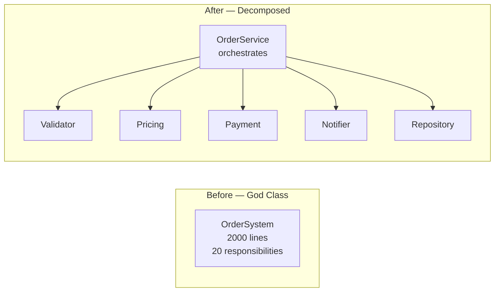
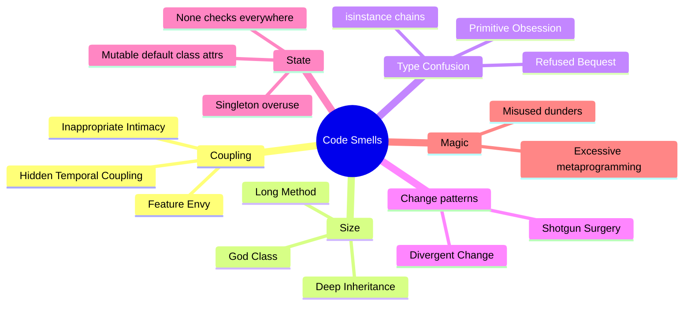

# Common Pitfalls & Anti-Patterns in Python OOP

> [!quote] "Any fool can write code that a computer can understand. Good programmers write code that humans can understand." — Martin Fowler

Code that **runs** is not code that **works** in any meaningful sense. This catalog collects the OOP anti-patterns that *run* but slowly poison a codebase: hard to test, hard to change, hard to reason about. Each entry follows the same structure:

- **Name** and aliases
- **Description** — what it looks like
- **Bad example** — Python code demonstrating the smell
- **Why it's bad** — concrete consequences
- **Refactored good example** — the fix
- **Mermaid before/after** — where a diagram clarifies

> [!tip] How to use this note
> Treat each entry as a **refactoring kata**. Find it in your code. Fix it once. The pattern will stick.

See also: [[common-misconceptions]], [[best-practices]], [[solid-principles]], [[refactoring-moves]].

---

## 1. God Class / Blob

**Aliases:** Blob, Monster Object, Kitchen-Sink Class.

**Description.** A single class that does **everything**: holds state, validates input, computes business logic, talks to the database, sends emails, formats output. Often the largest file in the codebase.

**Bad example**
```python
class OrderSystem:
    def __init__(self):
        self.orders: list = []
        self.users: dict = {}
        self.db_conn = ...
        self.email_client = ...

    def create_user(self, name, email): ...
    def validate_user(self, user): ...
    def create_order(self, user_id, items): ...
    def calculate_tax(self, order): ...
    def apply_discount(self, order, code): ...
    def charge_customer(self, order): ...
    def save_order(self, order): ...
    def send_confirmation_email(self, order): ...
    def export_orders_csv(self, date_range): ...
    def generate_invoice_pdf(self, order): ...
    def refund_order(self, order_id): ...
    # ... 400 more lines
```

**Why it's bad.**
- **Untestable** — to test `calculate_tax`, you instantiate everything.
- **Change magnet** — every feature touches this class; merge conflicts multiply.
- **Cognitive load** — no single engineer understands all 2000 lines.
- Violates the Single Responsibility Principle [[solid-principles]].

**Refactored good example**
```python
class OrderService:
    """Orchestrates order flow. Delegates to focused collaborators."""
    def __init__(self, validator, pricing, payment, notifier, repo):
        self._validator = validator
        self._pricing = pricing
        self._payment = payment
        self._notifier = notifier
        self._repo = repo

    def place_order(self, user, items) -> Order:
        self._validator.validate(user, items)
        order = Order(user, items)
        order.total = self._pricing.compute(order)
        self._payment.charge(order)
        self._repo.save(order)
        self._notifier.notify(order)
        return order

class OrderValidator:
    def validate(self, user, items) -> None: ...

class PricingService:
    def compute(self, order) -> Money: ...

class PaymentService:
    def charge(self, order) -> None: ...

class NotificationService:
    def notify(self, order) -> None: ...

class OrderRepository:
    def save(self, order) -> None: ...
```

**Mermaid before/after**



> [!tip] Refactoring move
> **Extract Class.** Identify a cohesive set of methods + their data; move them to a new class; inject the new class as a collaborator. See [[refactoring-moves]].

---

## 2. Feature Envy

**Aliases:** Envy.

**Description.** A method that's more interested in the *internals* of another class than its own. It reaches across boundaries, querying getters and computing on data that "wants" to live in the other class.

**Bad example**
```python
class PhoneBook:
    def __init__(self):
        self._entries: list[Contact] = []

    def find_in_area_code(self, area_code: str) -> list[Contact]:
        result = []
        for contact in self._entries:
            if contact.phone.startswith(area_code):   # envies Contact
                if contact.is_active():                # envies Contact
                    if contact.last_called_within(days=30):  # envies Contact
                        result.append(contact)
        return result
```

**Why it's bad.** Logic about `Contact` lives in `PhoneBook`. When `Contact` changes, this method breaks — but you won't know to look here. Behavior drifts from the data it operates on.

**Refactored good example**
```python
class Contact:
    def __init__(self, name: str, phone: str) -> None:
        self.name = name
        self.phone = phone

    def is_recently_active(self) -> bool:
        return self.is_active() and self.last_called_within(days=30)

    def has_area_code(self, code: str) -> bool:
        return self.phone.startswith(code)

class PhoneBook:
    def __init__(self) -> None:
        self._entries: list[Contact] = []

    def find_in_area_code(self, area_code: str) -> list[Contact]:
        return [c for c in self._entries
                if c.has_area_code(area_code) and c.is_recently_active()]
```

> [!tip] Heuristic
> If a method calls more than three getters on another object, the method probably belongs there.

---

## 3. Primitive Obsession

**Aliases:** Primitive Passion.

**Description.** Using built-in primitives (`str`, `int`, `float`, `dict`) for domain concepts that deserve their own type. Email addresses, money, IDs, dates, currencies all get stuffed into `str` or `float`.

**Bad example**
```python
def transfer(from_id: str, to_id: str, amount: float, currency: str) -> None:
    if amount <= 0:
        raise ValueError("amount must be positive")
    if currency not in {"USD", "EUR", "GBP"}:
        raise ValueError("bad currency")
    # ... and 10 more validations scattered across every function that handles money

# Bug waiting to happen:
transfer("acct_123", "acct_456", 100.0, "USD")   # ✅ correct order
transfer(100.0, "acct_456", "acct_123", "USD")   # ❌ silent type confusion
```

**Why it's bad.**
- Validation logic is **duplicated** everywhere.
- Type confusion (swapping `amount` and `from_id`) is **undetectable**.
- The domain language disappears: readers see `str` where they should see `AccountId`.

**Refactored good example**
```python
from dataclasses import dataclass
from typing import NewType

AccountId = NewType("AccountId", str)

@dataclass(frozen=True, order=True)
class Money:
    amount: float
    currency: str

    def __post_init__(self) -> None:
        if self.amount < 0:
            raise ValueError("Money cannot be negative")
        if self.currency not in {"USD", "EUR", "GBP"}:
            raise ValueError(f"Unsupported currency: {self.currency}")

    def add(self, other: "Money") -> "Money":
        if self.currency != other.currency:
            raise ValueError("Currency mismatch")
        return Money(self.amount + other.amount, self.currency)

def transfer(src: AccountId, dst: AccountId, amount: Money) -> None:
    ...   # no validation needed here — Money's invariants are enforced at construction
```

Now `mypy --strict` catches argument swaps at type-check time. See [[best-practices]].

---

## 4. Shotgun Surgery

**Aliases:** Scattered Change.

**Description.** A single conceptual change requires edits across **many files**. Each edit is small; the danger is in missing one.

**Bad example**
```python
# Adding a new payment method touches 5 files:
# - payment_routes.py        (handler)
# - payment_service.py       (dispatch)
# - payment_validator.py     (validation rules)
# - payment_repository.py    (persistence)
# - notification_service.py  (confirmation email)
```

**Why it's bad.** Adding a feature becomes a **treasure hunt**. The risk of forgetting one location grows linearly with the number of locations.

**Refactored good example**
```python
class PaymentMethod(Protocol):
    def validate(self, request: dict) -> None: ...
    def charge(self, amount: Money) -> str: ...
    def persist(self, repo: "PaymentRepository") -> None: ...
    def confirm(self, notifier: "NotificationService") -> None: ...

class CardPayment:
    def validate(self, request): ...
    def charge(self, amount): ...
    def persist(self, repo): ...
    def confirm(self, notifier): ...

# Registering a new payment now requires ONE new class + ONE registration line:
PAYMENT_REGISTRY: dict[str, type[PaymentMethod]] = {
    "card": CardPayment,
    "wallet": WalletPayment,
    "crypto": CryptoPayment,
}

# All callers route through one place:
def handle_payment(method: str, request: dict, amount: Money) -> None:
    payment = PAYMENT_REGISTRY[method]()
    payment.validate(request)
    payment.charge(amount)
    payment.persist(repo)
    payment.confirm(notifier)
```

Now adding a payment method = adding a class + a dict entry. Single responsibility, single place to look.

---

## 5. Divergent Change

**Aliases:** Opposite of Shotgun Surgery.

**Description.** One class changes for **different reasons** — every new feature, every new regulation, every new client request lands in the same file. The class is a magnet for unrelated change.

**Bad example**
```python
class Report:
    def generate_pdf(self, data): ...    # changes when PDF library updates
    def generate_html(self, data): ...   # changes when HTML template changes
    def generate_csv(self, data): ...    # changes when CSV format changes
    def email_to(self, recipient): ...   # changes when email provider changes
    def save_to_s3(self): ...            # changes when S3 SDK changes
    def sign_with_pgp(self): ...         # changes when PGP library changes
```

**Why it's bad.** Unrelated changes collide in version control. Tests for `generate_pdf` fail because someone changed the S3 logic. SRP is violated.

**Refactored good example**
```python
class Report:                 # holds the data
    def __init__(self, data): self.data = data

class PdfRenderer:            # changes only with PDF library
    def render(self, report): ...

class HtmlRenderer:           # changes only with HTML template
    def render(self, report): ...

class ReportMailer:           # changes only with email provider
    def send(self, report, to): ...

class ReportStorage:          # changes only with S3 SDK
    def save(self, report): ...
```

> [!note] Shotgun vs Divergent
> **Shotgun surgery** = one change → many files (scatter). **Divergent change** = many reasons → one file (gather). Both smell; the fixes are opposite (gather behavior vs split it).

---

## 6. Data Class / Anemic Domain Model

**Aliases:** Anemic Domain Model, DTO With No Behavior.

**Description.** A class that only holds data — no validation, no behavior, no invariants. All logic lives in external "service" classes that operate on the data class.

**Bad example**
```python
@dataclass
class Order:
    id: str
    items: list
    status: str
    total: float

class OrderService:
    def add_item(self, order: Order, item: Item) -> None:
        order.items.append(item)
        order.total = sum(i.price for i in order.items)   # logic lives HERE

    def mark_paid(self, order: Order) -> None:
        if order.status == "paid":
            raise ValueError("already paid")
        order.status = "paid"

    def cancel(self, order: Order) -> None:
        if order.status == "shipped":
            raise ValueError("cannot cancel shipped order")
        order.status = "cancelled"
```

**Why it's bad.** `Order`'s invariants are scattered across services. Any code that holds an `Order` reference can violate them. This is **procedural programming with class syntax** — see [[common-misconceptions]] A1.

**Refactored good example**
```python
@dataclass
class Order:
    id: str
    items: list[Item] = field(default_factory=list)
    status: str = "draft"

    def add_item(self, item: Item) -> None:
        if self.status != "draft":
            raise ValueError(f"Cannot add to {self.status} order")
        self.items.append(item)

    @property
    def total(self) -> float:
        return sum(i.price for i in self.items)

    def mark_paid(self) -> None:
        if self.status == "paid":
            raise ValueError("already paid")
        if not self.items:
            raise ValueError("cannot pay empty order")
        self.status = "paid"

    def cancel(self) -> None:
        if self.status == "shipped":
            raise ValueError("cannot cancel shipped order")
        self.status = "cancelled"

# Services now orchestrate, not compute:
class CheckoutService:
    def checkout(self, order: Order, payment: PaymentProcessor) -> None:
        order.mark_paid()              # invariant enforced inside
        payment.charge(order.total)
```

> [!tip] Tell, Don't Ask
> Don't extract an object's data, decide, then mutate it. **Tell** the object what to do: `order.mark_paid()` not `order.status = "paid"`.

---

## 7. Refused Bequest (LSP Violation)

**Aliases:** LSP Violation, Fake Subtype.

**Description.** A subclass inherits but **refuses** part of the parent's contract — throwing `NotImplementedError`, silently no-op-ing, or behaving inconsistently. Liskov Substitution is broken: code expecting the parent breaks when given the child.

**Bad example**
```python
class Bird:
    def fly(self) -> str: return "flying"

class Penguin(Bird):
    def fly(self) -> str:
        raise NotImplementedError("Penguins can't fly!")

def migrate(bird: Bird) -> None:
    bird.fly()   # 💥 if bird is a Penguin

migrate(Penguin())   # crashes
```

The classic Ostrich/Penguin problem.

**Why it's bad.** Subtyping is a **promise**. Code that works on the parent *must* work on the child. Refusing bequest silently breaks that promise at runtime.

**Refactored good example**
```python
class Bird:
    pass

class FlyingBird(Bird):
    def fly(self) -> str: return "flying"

class FlightlessBird(Bird):
    def walk(self) -> str: return "walking"

class Penguin(FlightlessBird):
    def swim(self) -> str: return "swimming"

def migrate(bird: FlyingBird) -> None:
    bird.fly()   # type system prevents passing a Penguin
```

Or, even better, model the **behavior** as a capability:
```python
class Bird:
    def __init__(self, name: str, locomotion: Locomotion) -> None:
        self.name = name
        self.locomotion = locomotion

class Locomotion(Protocol):
    def move(self) -> str: ...

class Flight(Locomotion):
    def move(self) -> str: return "flying"

class Swimming(Locomotion):
    def move(self) -> str: return "swimming"

penguin = Bird("Pingu", Swimming())
swallow = Bird("Steve", Flight())
```

> [!warning] Square-Rectangle problem
> The same anti-pattern: `Square(Rectangle)` because "a square is a rectangle." But `Rectangle.set_width(5).set_height(3)` should give a 5x3 rectangle — and a Square can't honor that contract without breaking its own invariant. **Inheritance requires substitutability, not taxonomy.** See [[solid-principles]] (LSP).

---

## 8. Inappropriate Intimacy

**Aliases:** Tight Coupling, Indiscreet Intimacy.

**Description.** Two classes reach into each other's internals so much that they're effectively one class split in two. They know each other's private fields, call each other's private methods, finish each other's sentences.

**Bad example**
```python
class Engine:
    def __init__(self):
        self._cylinders: list[Cylinder] = []
        self._fuel_pump: FuelPump = FuelPump()
        self._temperature: float = 0.0

class Mechanic:
    def tune_up(self, engine: Engine) -> None:
        for cyl in engine._cylinders:           # reaching into private state
            cyl._gap = 0.04                      # double-private!
        engine._fuel_pump._pressure = 45.0       # triple-private!!
        engine._temperature = 0.0                # bypassing any setter
```

**Why it's bad.** The `Mechanic` and `Engine` are welded together. Any change to `Engine`'s internals breaks `Mechanic`. There's no encapsulation boundary; there's a fiction of one.

**Refactored good example**
```python
class Engine:
    def __init__(self) -> None:
        self._cylinders: list[Cylinder] = []
        self._fuel_pump: FuelPump = FuelPump()
        self._temperature: float = 0.0

    def tune_up(self) -> None:        # behavior lives with the data
        for cyl in self._cylinders:
            cyl.adjust_gap(0.04)
        self._fuel_pump.set_pressure(45.0)
        self._temperature = 0.0

class Mechanic:
    def service(self, engine: Engine) -> None:
        engine.tune_up()              # delegate, don't reach in
```

> [!tip] Law of Demeter
> A method `m` of object `a` may only call methods of: `a` itself, `m`'s parameters, objects created within `m`, `a`'s direct components. Don't write `a.b.c.d()` — that's a chain of intimacy.

---

## 9. Hidden Temporal Coupling

**Aliases:** Initialization Order Trap.

**Description.** Methods must be called in a particular order, but the API doesn't enforce it. Callers discover the order only when their program crashes — or worse, silently misbehaves.

**Bad example**
```python
class ReportGenerator:
    def __init__(self):
        self.data = None
        self.template = None

    def load_data(self, source): self.data = source.read()
    def load_template(self, path): self.template = read_file(path)
    def render(self): return self.template.format(self.data)   # 💥 if data/template None

# Bug:
gen = ReportGenerator()
gen.load_data(db)
gen.render()   # AttributeError: NoneType has no format
```

**Why it's bad.** The order is documented (maybe), but nothing prevents violations. The class has many "partially initialized" states — none of which are useful.

**Refactored good example**
```python
class ReportGenerator:
    def __init__(self, data, template) -> None:
        # Force everything needed at construction time
        self.data = data
        self.template = template

    @classmethod
    def from_files(cls, data_path: str, template_path: str) -> "ReportGenerator":
        return cls(read_file(data_path), read_file(template_path))

    def render(self) -> str:
        return self.template.format(self.data)   # always safe
```

Or, when sequential phases are unavoidable, use the **Builder** pattern or a **state machine** so each transition is the only valid call.

```python
class ReportBuilder:
    def with_data(self, data) -> "ReportBuilder": ...
    def with_template(self, template) -> "ReportBuilder": ...
    def build(self) -> ReportGenerator:
        # validate everything is set, then construct
        ...
```

---

## 10. Circle-Ellipse / Square-Rectangle Problem

**Aliases:** Subtyping by Taxonomy.

**Description.** Modeling `Circle(Ellipse)` or `Square(Rectangle)` because "mathematically, a circle is an ellipse." But mutators break: `Ellipse.set_width(5).set_height(3)` should yield a 5×3 ellipse; the same calls on a `Square` must either break its own invariant or violate the parent's contract.

**Bad example**
```python
class Rectangle:
    def __init__(self, w: float, h: float):
        self.w, self.h = w, h
    def set_width(self, w: float):
        self.w = w
    def set_height(self, h: float):
        self.h = h
    def area(self) -> float:
        return self.w * self.h

class Square(Rectangle):
    def set_width(self, w: float):
        self.w = w
        self.h = w   # maintain square invariant
    def set_height(self, h: float):
        self.w = h
        self.h = h

def resize(rect: Rectangle, w: float, h: float) -> None:
    rect.set_width(w)
    rect.set_height(h)

# Test passes for Rectangle, fails for Square:
r = Rectangle(2, 2)
resize(r, 5, 3)
assert r.area() == 15   # ✅

s = Square(2, 2)
resize(s, 5, 3)
assert s.area() == 15   # ❌ actually 9 — Square is broken
```

**Why it's bad.** Liskov Substitution Principle is violated. Code that works correctly on the parent breaks on the child.

**Refactored good example**
Don't inherit. Use a **common immutable interface**:
```python
class Shape(Protocol):
    def area(self) -> float: ...

@dataclass(frozen=True)
class Rectangle:
    w: float
    h: float
    def area(self) -> float: return self.w * self.h

@dataclass(frozen=True)
class Square:
    side: float
    def area(self) -> float: return self.side * self.side
```

Immutability eliminates the mutator trap. If you need to "resize," return a new instance.

> [!warning] Mathematical subtyping ≠ programming subtyping
> "A circle is an ellipse" in *mathematics*. In *programming*, a subtype must honor the parent's *behavioral contract*, including mutators. They are different relationships.

---

## 11. Null Object Missing (None Checks Everywhere)

**Aliases:** None-Pocalypse, Billion-Dollar Mistake Echo.

**Description.** Code is littered with `if x is None:` guards. The same null-check appears at every layer because no one trusts the value not to be `None`.

**Bad example**
```python
def process(user):
    if user is None:
        return
    if user.address is None:
        return
    if user.address.country is None:
        return
    print(user.address.country.name)

def another_path(user):
    if user is None:
        return
    if user.address is None:
        return
    # ... duplicate checks everywhere
```

**Why it's bad.** Defensive duplication, easy to forget one site, real bugs slip through. Code is harder to read because half the lines are guards.

**Refactored good example**
```python
class NullUser:
    address = None
    def process(self) -> None: pass   # no-op safely

class NullAddress:
    country = None

class NullCountry:
    name = "Unknown"

class User:
    def __init__(self, name, address=None):
        self.name = name
        self.address = address or NullAddress()

# Even cleaner with frozen dataclass default:
@dataclass(frozen=True)
class Country:
    name: str
    UNKNOWN: ClassVar = None  # set below

Country.UNKNOWN = Country("Unknown")
```

Now callers can write `print(user.address.country.name)` without any guard — null objects provide sensible defaults.

> [!tip] Use `Optional` deliberately
> If a value can be `None`, mark it `Optional[T]` in the type hint. Then handle `None` at the **boundary**, not everywhere downstream. Inside the boundary, hand off a real object or a Null Object.

---

## 12. Excessive Use of `isinstance` (Broken Polymorphism)

**Aliases:** Type Switching, Runtime Type Checking.

**Description.** Code branches on `isinstance(x, T)` instead of dispatching polymorphically. Adding a new type requires editing every `isinstance` chain.

**Bad example**
```python
def area(shape) -> float:
    if isinstance(shape, Circle):
        return 3.14159 * shape.r ** 2
    elif isinstance(shape, Rectangle):
        return shape.w * shape.h
    elif isinstance(shape, Triangle):
        return 0.5 * shape.base * shape.height
    else:
        raise TypeError(f"Unknown shape: {type(shape)}")

def perimeter(shape) -> float:
    if isinstance(shape, Circle):
        return 2 * 3.14159 * shape.r
    elif isinstance(shape, Rectangle):
        return 2 * (shape.w + shape.h)
    elif isinstance(shape, Triangle):
        return shape.a + shape.b + shape.c
    else:
        raise TypeError(...)
```

**Why it's bad.** Adding `Hexagon` requires editing *every* function. Forgetting one site = silent bug. This is the **Open/Closed Principle** violated.

**Refactored good example**
```python
from abc import ABC, abstractmethod

class Shape(ABC):
    @abstractmethod
    def area(self) -> float: ...
    @abstractmethod
    def perimeter(self) -> float: ...

class Circle(Shape):
    def __init__(self, r: float): self.r = r
    def area(self) -> float: return 3.14159 * self.r ** 2
    def perimeter(self) -> float: return 2 * 3.14159 * self.r

class Rectangle(Shape):
    def __init__(self, w: float, h: float): self.w, self.h = w, h
    def area(self) -> float: return self.w * self.h
    def perimeter(self) -> float: return 2 * (self.w + self.h)

# Adding Hexagon = adding one class, no edits elsewhere:
class Hexagon(Shape):
    def __init__(self, side: float): self.side = side
    def area(self) -> float: return 2.59808 * self.side ** 2
    def perimeter(self) -> float: return 6 * self.side

def total_area(shapes: list[Shape]) -> float:
    return sum(s.area() for s in shapes)   # polymorphic dispatch
```

> [!warning] When isinstance is OK
> `isinstance` is legitimate for **boundary checks** (e.g., parsing external input) or when integrating with libraries whose types you can't change. It's a smell when used to *dispatch behavior* that should live inside the type.

---

## 13. Misuse of `__getattr__` / `__setattr__` Magic

**Aliases:** Dynamic Attribute Madness.

**Description.** Overriding `__getattr__` or `__setattr__` for "convenience" — dynamic attribute creation, magic proxies, ORM-like behavior — without understanding the blast radius.

**Bad example**
```python
class Config:
    def __init__(self, **kwargs):
        object.__setattr__(self, '_data', kwargs)

    def __getattr__(self, name):
        return self._data[name]   # KeyError if missing — surprising

    def __setattr__(self, name, value):
        self._data[name] = value   # also intercepts internal attributes!

# Surprises:
c = Config(host="localhost", port=8080)
print(c.host)         # "localhost" ✅
print(c.missing)      # KeyError, not AttributeError — breaks hasattr()
import pickle
pickle.dumps(c)       # 💥 may fail or do weird things
```

**Why it's bad.**
- Breaks `hasattr`, `getattr` with defaults, `dir()`, debugger introspection.
- Breaks `pickle`, `copy.deepcopy`, ORM integration.
- Infinite recursion is one typo away (`self.x = y` inside `__setattr__`).
- Linters and IDEs can't see dynamic attributes.

**Refactored good example**
Use a `@dataclass` or `pydantic.BaseModel` for configuration:
```python
from pydantic import BaseModel

class Config(BaseModel):
    host: str = "localhost"
    port: int = 8080

c = Config()
print(c.host)   # "localhost"
print(c.missing)   # AttributeError, as expected
pickle.dumps(c)    # works
```

If you genuinely need dynamic attributes (rare: proxies, lazy-loading ORM rows), use `__getattr__` (not `__setattr__`) and document the contract clearly.

---

## 14. Mutable Default Class Attributes (Classic Python Bug)

**Aliases:** The Shared List Bug.

**Description.** Using a mutable object (list, dict, set) as a **class-level** attribute or default parameter. Every instance shares the same object.

**Bad example**
```python
class ShoppingCart:
    items: list = []   # ❌ mutable class attribute — shared!

c1 = ShoppingCart()
c2 = ShoppingCart()
c1.items.append("apple")
print(c2.items)   # ['apple'] — every cart got the apple!

# Same bug in function defaults:
def add_item(cart: list = []):   # ❌ shared default
    cart.append("item")
    return cart

print(add_item())   # ['item']
print(add_item())   # ['item', 'item']   ← surprise
```

**Why it's bad.** Silent cross-instance contamination. Tests pass in isolation, fail in suites. Production-only heisenbugs.

**Refactored good example**
```python
class ShoppingCart:
    def __init__(self) -> None:
        self.items: list = []   # ✅ fresh per instance

# Or with dataclass + field:
from dataclasses import dataclass, field

@dataclass
class ShoppingCart:
    items: list = field(default_factory=list)   # ✅ correct

# Function default — use None sentinel:
def add_item(cart: list | None = None):
    if cart is None:
        cart = []
    cart.append("item")
    return cart
```

> [!danger] Lint this
> `ruff` and `flake8-bugbear` (B006, B008) catch this. Turn them on in CI. See [[best-practices]].

---

## 15. Using Inheritance for Code Reuse Only

**Aliases:** Implementation Inheritance Abuse.

**Description.** Inheriting because the parent has useful code, not because the child is genuinely a subtype. Often manifests as deep, narrow hierarchies where each layer adds a tiny tweak.

**Bad example**
```python
class BaseHandler:
    def handle(self, request):
        self.authenticate(request)
        self.validate(request)
        result = self.process(request)
        self.log(request, result)
        return result

    def authenticate(self, request): ...
    def validate(self, request): ...
    def process(self, request): raise NotImplementedError
    def log(self, request, result): ...

class CreateUserHandler(BaseHandler):
    def process(self, request): ...   # only overrides one method

class DeleteUserHandler(BaseHandler):
    def process(self, request): ...

class UpdateProfileHandler(BaseHandler):
    def process(self, request): ...
    def validate(self, request): ...   # override one more

# Now someone wants a handler with NO authentication...
class PublicHandler(BaseHandler):
    def authenticate(self, request): pass   # override to no-op — refused bequest!
```

**Why it's bad.**
- Subclasses depend on the parent's *implementation*, not its interface.
- The parent becomes a "template" that's hard to evolve without breaking descendants.
- The "no-auth" case requires overriding `authenticate` to no-op — Refused Bequest ([[#7]]).

**Refactored good example**
```python
class Handler(Protocol):
    def handle(self, request: Request) -> Response: ...

class RequestPipeline:
    """Composes middleware-style. Each component is optional."""
    def __init__(self, *, authenticator=None, validator=None,
                 processor: Handler, logger=None):
        self.authenticator = authenticator
        self.validator = validator
        self.processor = processor
        self.logger = logger

    def handle(self, request: Request) -> Response:
        if self.authenticator:
            self.authenticator.authenticate(request)
        if self.validator:
            self.validator.validate(request)
        result = self.processor.handle(request)
        if self.logger:
            self.logger.log(request, result)
        return result

# Each handler is a leaf, composed at runtime:
create_user = RequestPipeline(
    authenticator=Auth(),
    validator=CreateUserValidator(),
    processor=CreateUserProcessor(),
    logger=Logger(),
)

public_endpoint = RequestPipeline(
    processor=PublicProcessor(),   # no auth, no validator, no logger
)
```

Composition + Protocol. Each capability is a leaf object, assembled per use case.

---

## 16. Singleton Overuse

**Aliases:** Global State in Disguise.

**Description.** Every "manager," "registry," or "service" is a Singleton. State is shared globally, hidden behind `MyClass.instance()`.

**Bad example**
```python
class DBConnection:
    _instance = None

    def __new__(cls):
        if cls._instance is None:
            cls._instance = super().__new__(cls)
        return cls._instance

    def query(self, sql): ...

# Now any code anywhere can:
DBConnection().query("...")

# But:
# - Tests must reset the singleton between tests — fragile.
# - You can't have two databases in one process.
# - Hidden coupling: every caller depends on a global.
# - Multithreading: race condition on initialization.
```

**Why it's bad.** Singletons are **global mutable state** with extra steps. They make code untestable, hide dependencies, and prevent parallelism.

**Refactored good example**
Inject dependencies; have **one** instance per application, not enforced by the class:
```python
class DBConnection:
    def __init__(self, dsn: str):
        self.dsn = dsn
    def query(self, sql): ...

# Application root — compose once, inject everywhere:
class App:
    def __init__(self):
        self.db = DBConnection(settings.DSN)
        self.users = UserService(self.db)
        self.orders = OrderService(self.db)

# Tests: instantiate a fresh DBConnection per test, no global state.
```

> [!tip] When is Singleton OK?
> - Truly stateless objects (rare)
> - Read-only configuration loaded once (a frozen dataclass)
> - Caches where you *want* global visibility (and accept the trade-offs)
> Even then, prefer **dependency injection** — it costs nothing and gives you testability for free.

See [[real-world-examples]] for the configuration system that demonstrates singleton alternatives.

---

## Bonus: Smells Quick Reference



---

## Practice Exercises — Refactor Challenges

> [!example] Challenge 1 — Refactor the God Class
> Take this `OrderSystem` (40-line version below) and split it into 4–6 focused classes. Write a paragraph justifying each split.
> ```python
> class OrderSystem:
>     def __init__(self): self.orders = []
>     def create(self, user, items): ...
>     def tax(self, order): return sum(i.price for i in order.items) * 0.08
>     def discount(self, order, code): ...
>     def charge(self, order): ...
>     def email(self, order): ...
>     def save(self, order): ...
> ```
> **Self-check:** Did each class gain a single responsibility? Can you test each in isolation? Did you introduce any inappropriate intimacy?

> [!example] Challenge 2 — Replace isinstance with polymorphism
> Refactor the `area(shape)` function with `isinstance` checks into a polymorphic `Shape` hierarchy. Add a `Hexagon` class without touching existing code.
> **Self-check:** Adding a new shape required *zero* edits to existing functions? If not, OCP is still violated.

> [!example] Challenge 3 — Find the mutable default bug
> The following code has at least one mutable-default bug. Find and fix it.
> ```python
> def append_log(entry: str, log: list = []):
>     log.append(entry)
>     return log
>
> class Cache:
>     _entries: dict = {}
>     def set(self, k, v): self._entries[k] = v
> ```
> **Self-check:** Run the code twice; verify the second invocation does not see the first's data.

> [!example] Challenge 4 — Eliminate temporal coupling
> Refactor this so callers cannot misuse the API:
> ```python
> class PdfBuilder:
>     def __init__(self): self.content = None
>     def set_content(self, c): self.content = c
>     def render(self): return f"<pdf>{self.content}</pdf>"
> ```
> **Self-check:** Is it impossible to construct a `PdfBuilder` in an unusable state? If yes, you've fixed it.

> [!example] Challenge 5 — Fix the LSP violation
> ```python
> class Stack:
>     def push(self, x): ...
>     def pop(self): ...
>     def size(self): ...
>
> class BoundedStack(Stack):
>     def __init__(self, limit): self.limit = limit
>     def push(self, x):
>         if self.size() >= self.limit:
>             raise OverflowError   # ← Stack's contract was "push always succeeds"
> ```
> Refactor so callers can use either safely.
> **Self-check:** Does any existing `Stack` caller break if handed a `BoundedStack`? If yes, LSP is still violated; redesign.

---

## Key Takeaways

1. **Most anti-patterns run fine.** The damage is to *maintainability*, not functionality. Code review is your defense.
2. **God class is the parent of many smells.** Decompose early; inject collaborators.
3. **Feature envy and inappropriate intimacy** are symptoms of misplaced behavior. Move the method to the data it envies.
4. **Primitive obsession** is the most common smell in Python codebases. Reach for value objects (`Money`, `AccountId`, `Email`).
5. **Shotgun surgery and divergent change** are opposites; both signal misaligned responsibilities.
6. **Anemic domain models** are procedural code in class clothing. Move behavior back to the data.
7. **Refused bequest** = LSP violation = bad inheritance. Prefer composition or capability-based modeling.
8. **`isinstance` chains** are broken polymorphism. Use ABCs or Protocols.
9. **Mutable default class attributes** are the #1 Python-specific bug. Lint aggressively.
10. **Singletons** are global state. Prefer dependency injection.
11. **Magic methods have a blast radius.** Override them rarely, deliberately, with tests for pickle/copy/debug.
12. **Inheritance is for subtyping, not reuse.** Composition is the default; inheritance is the exception.

---

**Next:** [[best-practices]] — the *positive* catalog: what good Python OOP looks like.
