# 🧩 Design Patterns Cheat Sheet — 23 GoF + Extras

> [!tip] How to use this card
> Print both pages. When facing a design problem, scan the **Problem → Pattern** lookup table first. Each pattern has a one-line intent, a tiny class diagram, a 5-line skeleton, when to use, when NOT to use.

Deep dives: [[design-patterns-creational]] · [[design-patterns-structural]] · [[design-patterns-behavioral]].

---

## 🗺️ The 23 Patterns at a Glance

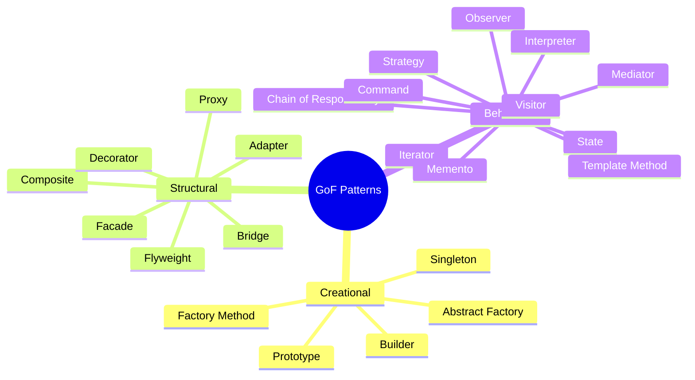
```mermaid
mindmap
  root((GoF Patterns))
    Creational
      Singleton
      Factory Method
      Abstract Factory
      Builder
      Prototype
    Structural
      Adapter
      Bridge
      Composite
      Decorator
      Facade
      Flyweight
      Proxy
    Behavioral
      Chain of Responsibility
      Command
      Iterator
      Mediator
      Memento
      Observer
      State
      Strategy
      Template Method
      Visitor
      Interpreter
```

---

## 🧭 Problem → Pattern Lookup

> Scan this table when you have a problem. Click the pattern name for full treatment.

| If you need to… | Use |
|---|---|
| Have one shared instance of a class | [[#Singleton]] |
| Create objects without specifying the exact class | [[#Factory Method]] |
| Create families of related objects (themes, kits) | [[#Abstract Factory]] |
| Construct a complex object step by step | [[#Builder]] |
| Clone an existing object instead of constructing fresh | [[#Prototype]] |
| Make two incompatible interfaces work together | [[#Adapter]] |
| Decouple abstraction from implementation so they vary independently | [[#Bridge]] |
| Treat individual objects and compositions uniformly | [[#Composite]] |
| Add behavior to an object without subclassing | [[#Decorator]] |
| Provide a simplified front to a complex subsystem | [[#Facade]] |
| Share many fine-grained objects efficiently | [[#Flyweight]] |
| Control access to an object (lazy, protected, remote) | [[#Proxy]] |
| Pass a request along a chain of handlers | [[#Chain of Responsibility]] |
| Encapsulate a request as an object (undo, queueing) | [[#Command]] |
| Access a collection's elements without exposing internals | [[#Iterator]] |
| Centralize complex communication between objects | [[#Mediator]] |
| Save and restore an object's state without breaking encapsulation | [[#Memento]] |
| Notify many dependents when one object changes | [[#Observer]] |
| Change an object's behavior when its state changes | [[#State]] |
| Swap algorithms behind one interface | [[#Strategy]] |
| Define an algorithm skeleton; let subclasses fill in steps | [[#Template Method]] |
| Add operations to a class hierarchy without changing it | [[#Visitor]] |
| Interpret sentences in a language | [[#Interpreter]] |

---

## 🏭 Creational Patterns (5)

### 1. Singleton

> **Intent:** Ensure a class has exactly one instance and provide a global access point.

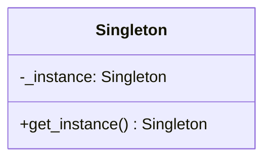
```mermaid
classDiagram
    class Singleton {
        -_instance: Singleton
        +get_instance() Singleton
    }
```

```python
class Singleton:
    _instance: "Singleton | None" = None
    def __new__(cls):
        if cls._instance is None:
            cls._instance = super().__new__(cls)
        return cls._instance
```

- **Use:** Logger, configuration cache, hardware driver.
- **Not:** When you might ever need 2 instances. Often an anti-pattern — prefer DI.
- **Pythonic shortcut:** module-level instance. `config = _Config()`.
- See [[design-patterns-creational]].

---

### 2. Factory Method

> **Intent:** Define an interface for creating an object, but let subclasses decide which class to instantiate.

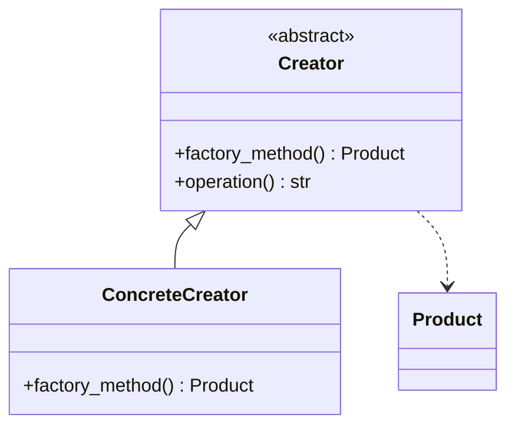
```mermaid
classDiagram
    class Creator {
        <<abstract>>
        +factory_method() Product
        +operation() str
    }
    class ConcreteCreator {
        +factory_method() Product
    }
    class Product
    Creator <|-- ConcreteCreator
    Creator ..> Product
```

```python
class Logger(Protocol):
    def log(self, msg: str) -> None: ...
class ConsoleLogger:
    def log(self, msg: str) -> None: print(msg)
class FileLogger:
    def log(self, msg: str) -> None: open("app.log", "a").write(msg + "\n")
def make_logger(kind: str) -> Logger:
    return {"console": ConsoleLogger, "file": FileLogger}[kind]()
```

- **Use:** When a class can't anticipate the type of objects it must create.
- **Not:** When the choice is trivial and unlikely to evolve.
- See [[design-patterns-creational]].

---

### 3. Abstract Factory

> **Intent:** Create families of related objects without specifying their concrete classes.

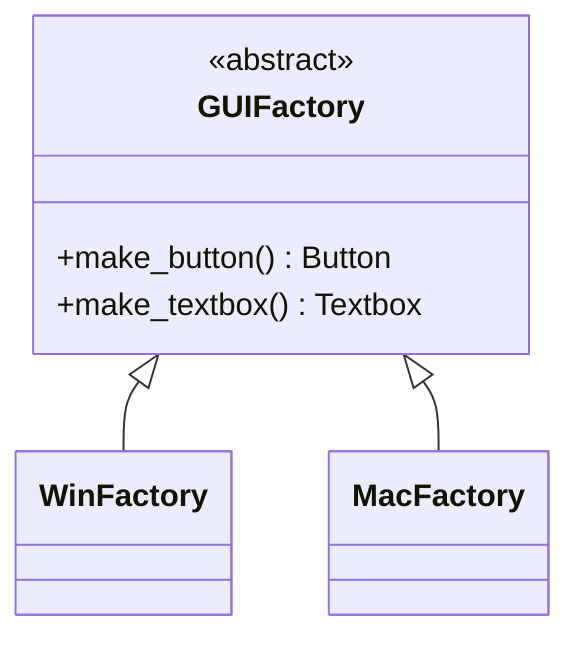
```mermaid
classDiagram
    class GUIFactory {
        <<abstract>>
        +make_button() Button
        +make_textbox() Textbox
    }
    class WinFactory
    class MacFactory
    GUIFactory <|-- WinFactory
    GUIFactory <|-- MacFactory
```

```python
class GUIFactory(ABC):
    @abstractmethod
    def make_button(self) -> "Button": ...
    @abstractmethod
    def make_textbox(self) -> "Textbox": ...
class WinFactory(GUIFactory):
    def make_button(self) -> "Button": return WinButton()
    def make_textbox(self) -> "Textbox": return WinTextbox()
class MacFactory(GUIFactory):
    def make_button(self) -> "Button": return MacButton()
    def make_textbox(self) -> "Textbox": return MacTextbox()
```

- **Use:** Cross-platform UIs, theme systems, multi-database support.
- **Not:** When you only have one family of products.
- See [[design-patterns-creational]].

---

### 4. Builder

> **Intent:** Separate construction of a complex object from its representation.

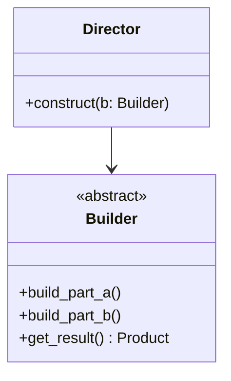
```mermaid
classDiagram
    class Director {
        +construct(b: Builder)
    }
    class Builder {
        <<abstract>>
        +build_part_a()
        +build_part_b()
        +get_result() Product
    }
    Director --> Builder
```

```python
@dataclass
class Pizza:
    size: str; cheese: bool = False; pepperoni: bool = False
class PizzaBuilder:
    def __init__(self, size: str): self._p = Pizza(size)
    def add_cheese(self): self._p.cheese = True; return self
    def add_pepperoni(self): self._p.pepperoni = True; return self
    def build(self) -> Pizza: return self._p
# Fluent:
p = PizzaBuilder("L").add_cheese().add_pepperoni().build()
```

- **Use:** Multi-step construction with many optional parts; immutable target.
- **Not:** For simple objects with a few params — use `@dataclass` directly.
- See [[design-patterns-creational]].

---

### 5. Prototype

> **Intent:** Specify kinds of objects to create using a prototypical instance, then clone.

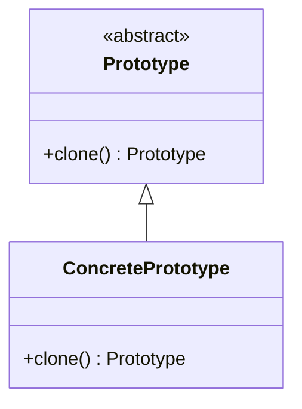
```mermaid
classDiagram
    class Prototype {
        <<abstract>>
        +clone() Prototype
    }
    class ConcretePrototype {
        +clone() Prototype
    }
    Prototype <|-- ConcretePrototype
```

```python
import copy
class Config:
    def __init__(self, env: str): self.env = env
    def clone(self) -> "Config":
        return copy.deepcopy(self)
proto = Config("dev")
prod = proto.clone(); prod.env = "prod"
```

- **Use:** When construction is expensive (DB load, parsing); when subclasses differ only in state.
- **Not:** For shallow, cheap objects.
- See [[design-patterns-creational]].

---

## 🏗️ Structural Patterns (7)

### 6. Adapter

> **Intent:** Convert the interface of a class into another interface clients expect.

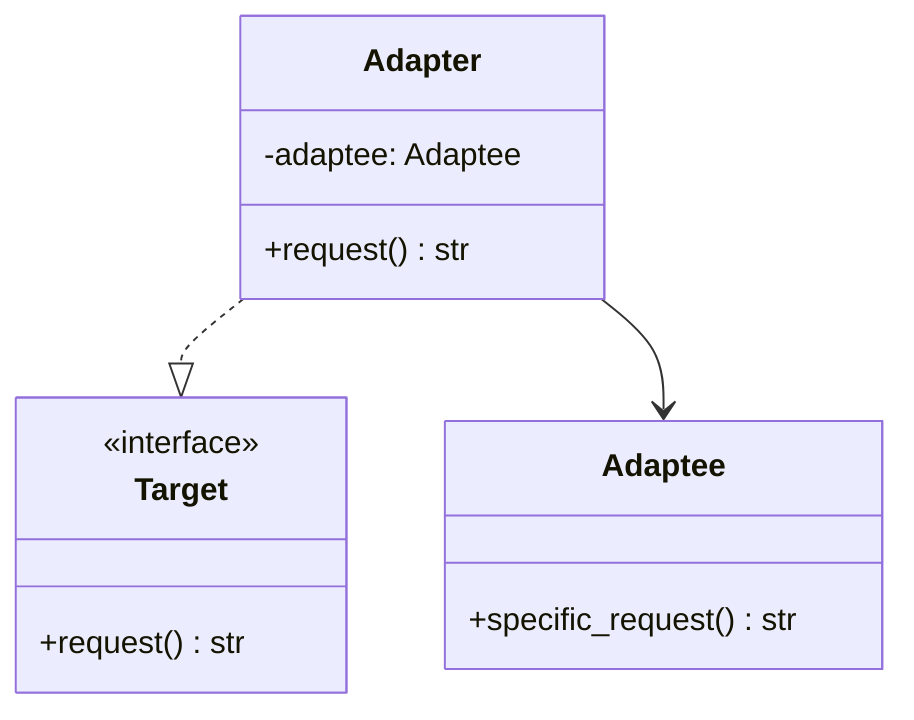
```mermaid
classDiagram
    class Target {
        <<interface>>
        +request() str
    }
    class Adapter {
        -adaptee: Adaptee
        +request() str
    }
    class Adaptee {
        +specific_request() str
    }
    Adapter ..|> Target
    Adapter --> Adaptee
```

```python
class OldPrinter:
    def print_slowly(self, text: str) -> None: print(text)
class Printer(Protocol):
    def print(self, text: str) -> None: ...
class PrinterAdapter:
    def __init__(self, old: OldPrinter) -> None: self._old = old
    def print(self, text: str) -> None: self._old.print_slowly(text)
```

- **Use:** Wrapping legacy code, 3rd-party libs, or incompatible interfaces.
- **Not:** When you control both sides — just make them match.
- See [[design-patterns-structural]].

---

### 7. Bridge

> **Intent:** Decouple abstraction from implementation so they can vary independently.

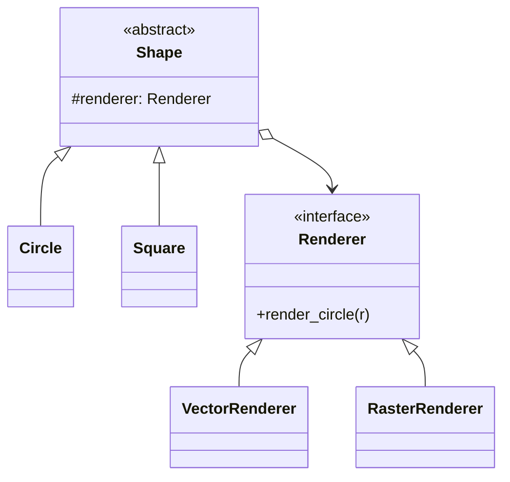
```mermaid
classDiagram
    class Shape {
        <<abstract>>
        #renderer: Renderer
    }
    class Circle
    class Square
    class Renderer {
        <<interface>>
        +render_circle(r)
    }
    class VectorRenderer
    class RasterRenderer
    Shape <|-- Circle
    Shape <|-- Square
    Renderer <|-- VectorRenderer
    Renderer <|-- RasterRenderer
    Shape o--> Renderer
```

```python
class Renderer(Protocol):
    def render_circle(self, r: float) -> str: ...
class VectorRenderer:
    def render_circle(self, r: float) -> str: return f"Drew circle of radius {r} as vector"
class Shape(ABC):
    def __init__(self, renderer: Renderer) -> None: self.renderer = renderer
    @abstractmethod
    def draw(self) -> str: ...
class Circle(Shape):
    def __init__(self, r: float, renderer: Renderer) -> None: super().__init__(renderer); self.r = r
    def draw(self) -> str: return self.renderer.render_circle(self.r)
```

- **Use:** Cross-cutting variations (shape × renderer; remote × protocol).
- **Not:** When there's only one dimension of variation.
- See [[design-patterns-structural]].

---

### 8. Composite

> **Intent:** Compose objects into tree structures; treat individual and composite uniformly.

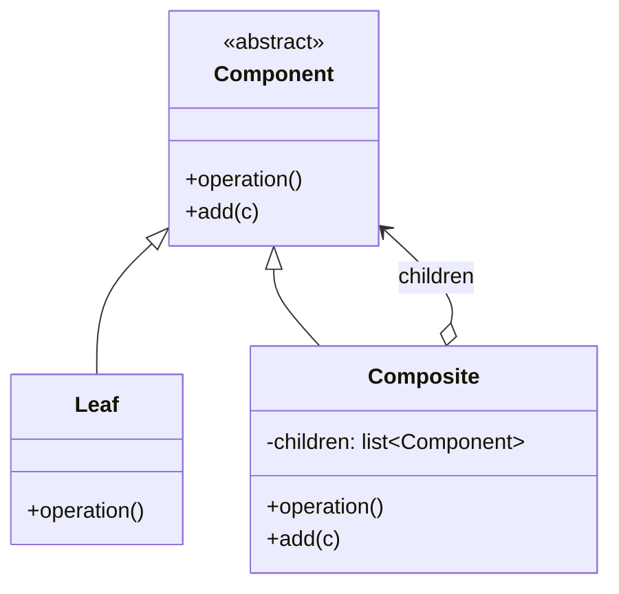
```mermaid
classDiagram
    class Component {
        <<abstract>>
        +operation()
        +add(c)
    }
    class Leaf {
        +operation()
    }
    class Composite {
        -children: list~Component~
        +operation()
        +add(c)
    }
    Component <|-- Leaf
    Component <|-- Composite
    Composite o--> Component : children
```

```python
class File:
    def __init__(self, name: str, size: int): self.name, self.size = name, size
    def total_size(self) -> int: return self.size
class Folder:
    def __init__(self, name: str): self.name, self.children = name, []
    def add(self, c): self.children.append(c); return self
    def total_size(self) -> int: return sum(c.total_size() for c in self.children)
```

- **Use:** File systems, UI widget trees, organization charts, ASTs.
- **Not:** When leaf and composite behaviors diverge sharply.
- See [[design-patterns-structural]].

---

### 9. Decorator (GoF)

> **Intent:** Attach additional responsibilities to an object dynamically.

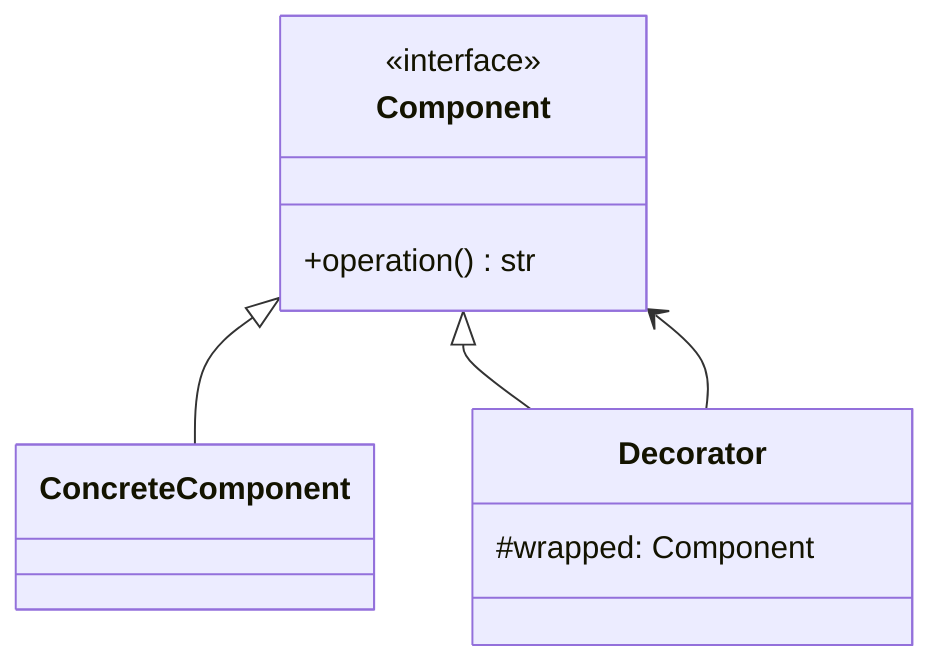
```mermaid
classDiagram
    class Component {
        <<interface>>
        +operation() str
    }
    class ConcreteComponent
    class Decorator {
        #wrapped: Component
    }
    Component <|-- ConcreteComponent
    Component <|-- Decorator
    Decorator --> Component
```

```python
class Coffee:
    def cost(self) -> float: return 2.0
    def describe(self) -> str: return "coffee"
class MilkDecorator:
    def __init__(self, inner: Coffee) -> None: self._inner = inner
    def cost(self) -> float: return self._inner.cost() + 0.5
    def describe(self) -> str: return self._inner.describe() + " + milk"
c = MilkDecorator(Coffee())
print(c.cost(), c.describe())   # 2.5 coffee + milk
```

- **Use:** Layered behaviors that can be mixed at runtime.
- **Not:** When one `if` would do.
- Note: This is **different** from Python's `@decorator` syntax for functions. See [[design-patterns-structural]].
- See [[design-patterns-structural]].

---

### 10. Facade

> **Intent:** Provide a unified interface to a set of interfaces in a subsystem.

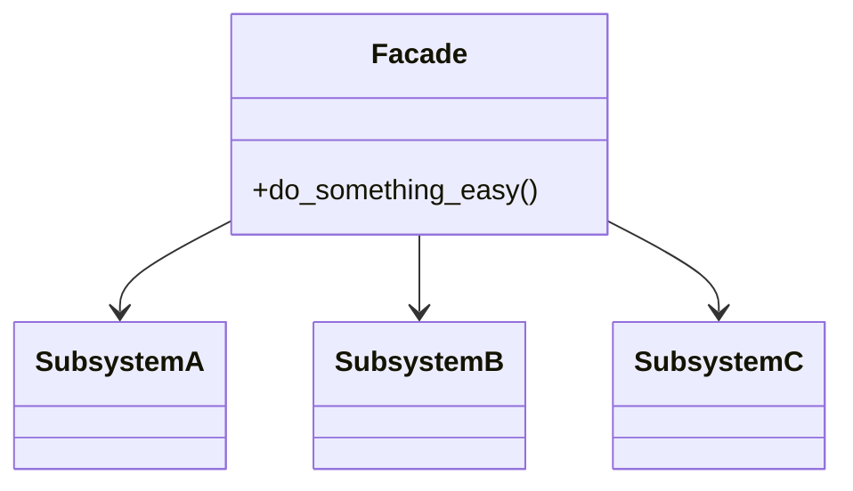
```mermaid
classDiagram
    class Facade {
        +do_something_easy()
    }
    class SubsystemA
    class SubsystemB
    class SubsystemC
    Facade --> SubsystemA
    Facade --> SubsystemB
    Facade --> SubsystemC
```

```python
class CPU: def freeze(self): ...; def jump(self, addr): ...
class Memory: def load(self, addr, data): ...
class HardDrive: def read(self, lba, size): ...
class Computer:
    def __init__(self): self.cpu, self.mem, self.hd = CPU(), Memory(), HardDrive()
    def start(self):
        self.cpu.freeze(); self.cpu.jump(0); self.mem.load(0, self.hd.read(0, 1024))
```

- **Use:** Simplifying complex subsystems (3rd-party APIs, layered architectures).
- **Not:** When the subsystem isn't actually complex.
- See [[design-patterns-structural]].

---

### 11. Flyweight

> **Intent:** Use sharing to support large numbers of fine-grained objects efficiently.

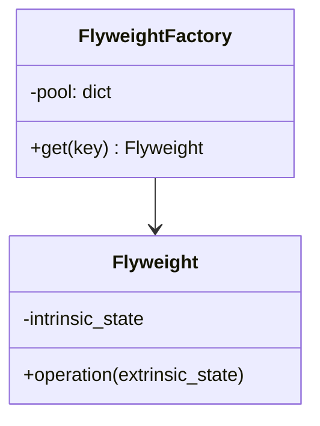
```mermaid
classDiagram
    class FlyweightFactory {
        -pool: dict
        +get(key) Flyweight
    }
    class Flyweight {
        -intrinsic_state
        +operation(extrinsic_state)
    }
    FlyweightFactory --> Flyweight
```

```python
class TreeType:           # intrinsic state (shared)
    def __init__(self, name: str, color: str): self.name, self.color = name, color
class TreeFactory:
    _pool: dict[tuple, TreeType] = {}
    @classmethod
    def get(cls, name: str, color: str) -> TreeType:
        key = (name, color)
        if key not in cls._pool: cls._pool[key] = TreeType(name, color)
        return cls._pool[key]
class Tree:               # extrinsic state (per instance)
    def __init__(self, x, y, t: TreeType): self.x, self.y, self.type = x, y, t
```

- **Use:** Millions of similar objects (particles, tiles, characters in a game).
- **Not:** For one-off objects — overhead outweighs benefit.
- See [[design-patterns-structural]].

---

### 12. Proxy

> **Intent:** Provide a surrogate or placeholder for another object to control access.

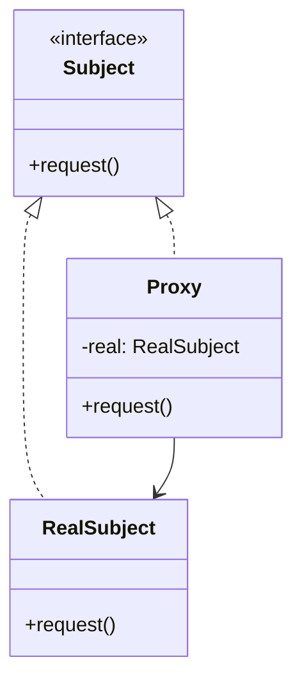
```mermaid
classDiagram
    class Subject {
        <<interface>>
        +request()
    }
    class RealSubject {
        +request()
    }
    class Proxy {
        -real: RealSubject
        +request()
    }
    Subject <|.. RealSubject
    Subject <|.. Proxy
    Proxy --> RealSubject
```

```python
class Image:
    def display(self) -> None: ...
class RealImage(Image):
    def __init__(self, path: str):
        self._path = path; self._load_from_disk()
    def _load_from_disk(self) -> None: print(f"loading {self._path}")
    def display(self) -> None: print(f"showing {self._path}")
class ProxyImage(Image):
    def __init__(self, path: str): self._path, self._real = path, None
    def display(self) -> None:
        if self._real is None: self._real = RealImage(self._path)
        self._real.display()
```

- **Use:** Lazy loading, access control, remote objects, logging, caching.
- **Not:** When the indirection adds nothing.
- See [[design-patterns-structural]].

---

## 🔄 Behavioral Patterns (11)

### 13. Chain of Responsibility

> **Intent:** Pass a request along a chain of handlers; each decides to handle or pass on.

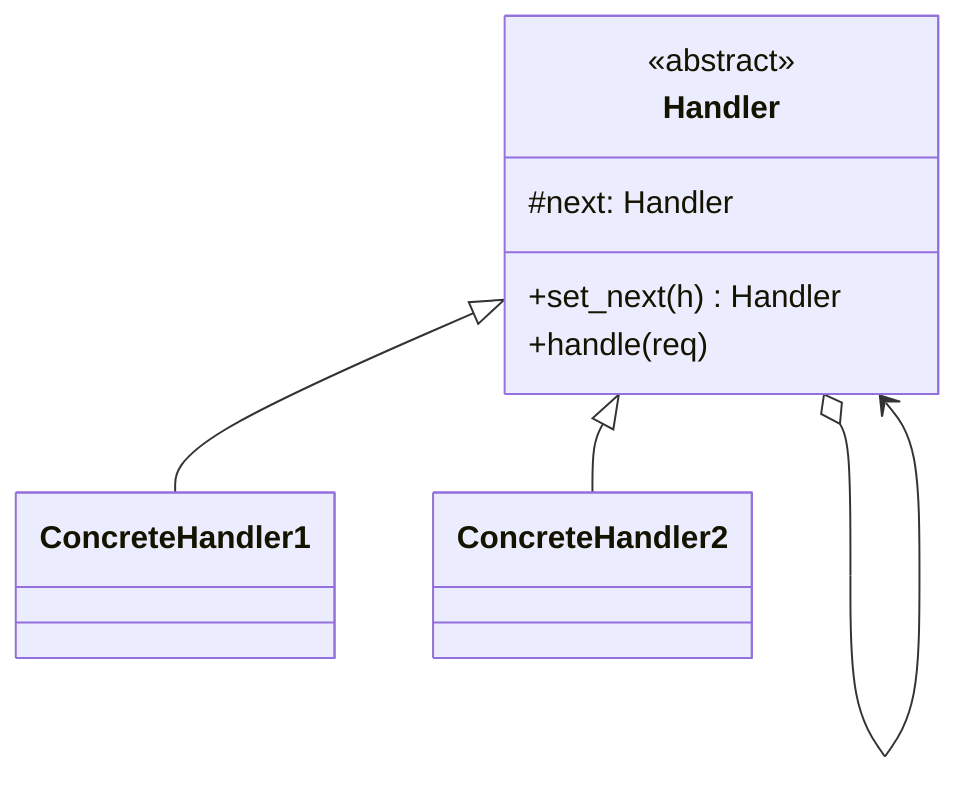
```mermaid
classDiagram
    class Handler {
        <<abstract>>
        #next: Handler
        +set_next(h) Handler
        +handle(req)
    }
    class ConcreteHandler1
    class ConcreteHandler2
    Handler <|-- ConcreteHandler1
    Handler <|-- ConcreteHandler2
    Handler o--> Handler
```

```python
class Handler:
    def __init__(self): self._next: "Handler | None" = None
    def set_next(self, h: "Handler") -> "Handler":
        self._next = h; return h
    def handle(self, req: str) -> str | None:
        if self._next: return self._next.handle(req)
        return None
class AuthHandler(Handler):
    def handle(self, req: str) -> str | None:
        if req == "auth": return "auth ok"
        return super().handle(req)
```

- **Use:** HTTP middleware, support ticket escalation, logging pipelines.
- **Not:** When you always know exactly which handler should run.
- See [[design-patterns-behavioral]].

---

### 14. Command

> **Intent:** Encapsulate a request as an object; parameterize clients with queues, logs, undo.

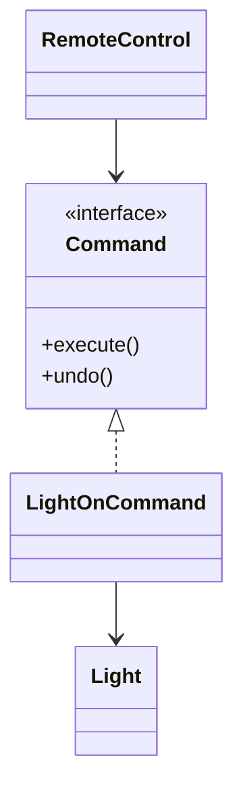
```mermaid
classDiagram
    class Command {
        <<interface>>
        +execute()
        +undo()
    }
    class LightOnCommand
    class Light
    class RemoteControl
    Command <|.. LightOnCommand
    LightOnCommand --> Light
    RemoteControl --> Command
```

```python
class Light:
    def on(self) -> None: print("light on")
    def off(self) -> None: print("light off")
class Command(ABC):
    @abstractmethod
    def execute(self) -> None: ...
    @abstractmethod
    def undo(self) -> None: ...
class LightOnCmd(Command):
    def __init__(self, light: Light) -> None: self._l = light
    def execute(self) -> None: self._l.on()
    def undo(self) -> None: self._l.off()
```

- **Use:** Undo/redo, macro recording, job queues, GUI actions.
- **Not:** For trivial one-liners — use a function.
- See [[design-patterns-behavioral]].

---

### 15. Iterator

> **Intent:** Sequentially access elements of an aggregate without exposing its representation.

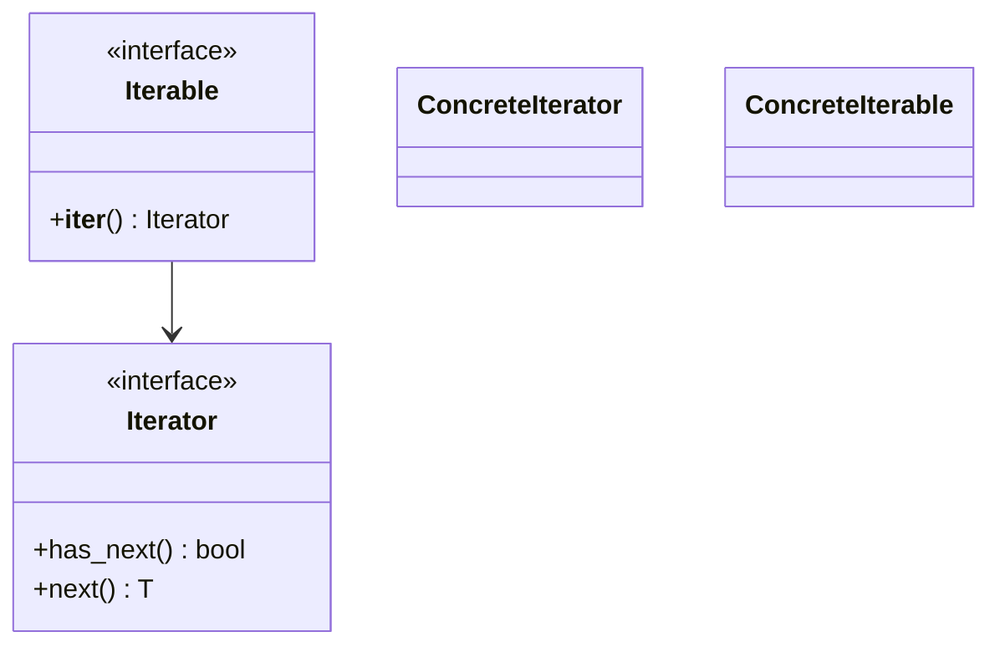
```mermaid
classDiagram
    class Iterator {
        <<interface>>
        +has_next() bool
        +next() T
    }
    class Iterable {
        <<interface>>
        +__iter__() Iterator
    }
    class ConcreteIterator
    class ConcreteIterable
    Iterable --> Iterator
```

```python
class Countdown:
    def __init__(self, start: int): self._n = start
    def __iter__(self) -> "Countdown": return self
    def __next__(self) -> int:
        if self._n <= 0: raise StopIteration
        self._n -= 1; return self._n + 1
for x in Countdown(3): print(x)   # 3, 2, 1
```

- **Use:** Custom collections, lazy streams, tree traversal.
- **Not:** Just to wrap a list — Python's `for` does that.
- See [[design-patterns-behavioral]].

---

### 16. Mediator

> **Intent:** Define an object that encapsulates how a set of objects interact.

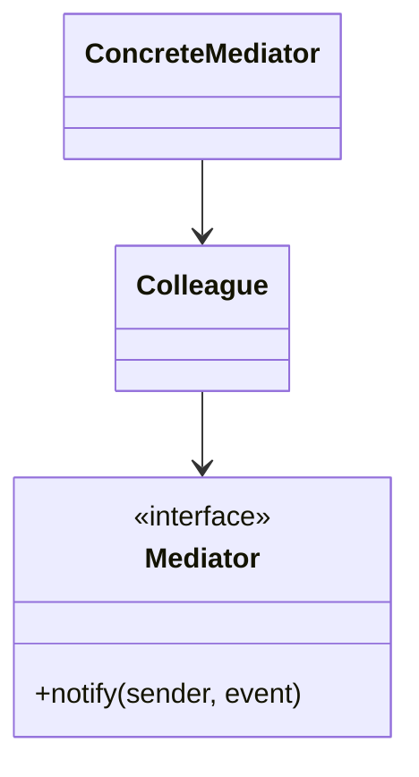
```mermaid
classDiagram
    class Mediator {
        <<interface>>
        +notify(sender, event)
    }
    class ConcreteMediator
    class Colleague
    Colleague --> Mediator
    ConcreteMediator --> Colleague
```

```python
class ChatMediator:
    def __init__(self): self._users: list["User"] = []
    def add(self, u: "User") -> None: self._users.append(u)
    def broadcast(self, sender: "User", msg: str) -> None:
        for u in self._users:
            if u is not sender: u.receive(msg)
class User:
    def __init__(self, name: str, chat: ChatMediator) -> None:
        self.name, self.chat = name, chat; chat.add(self)
    def send(self, msg: str) -> None: self.chat.broadcast(self, msg)
    def receive(self, msg: str) -> None: print(f"{self.name}: {msg}")
```

- **Use:** Dialog boxes, chat rooms, event buses, air-traffic control.
- **Not:** When N objects genuinely need to talk to all N-1 — direct wiring is clearer.
- See [[design-patterns-behavioral]].

---

### 17. Memento

> **Intent:** Capture and externalize an object's internal state without violating encapsulation.

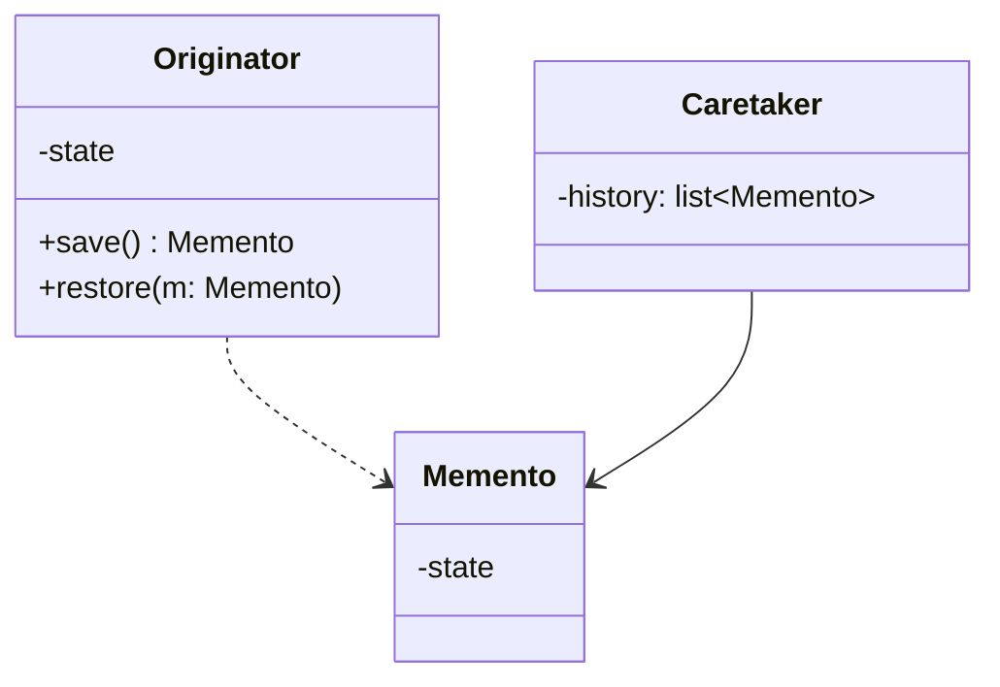
```mermaid
classDiagram
    class Originator {
        -state
        +save() Memento
        +restore(m: Memento)
    }
    class Memento {
        -state
    }
    class Caretaker {
        -history: list~Memento~
    }
    Originator ..> Memento
    Caretaker --> Memento
```

```python
from dataclasses import dataclass
@dataclass(frozen=True)
class EditorState:
    text: str
class Editor:
    def __init__(self): self.text = ""
    def type(self, word: str) -> None: self.text += word
    def save(self) -> EditorState: return EditorState(self.text)
    def restore(self, m: EditorState) -> None: self.text = m.text
class History:
    def __init__(self): self._stack: list[EditorState] = []
    def push(self, m: EditorState) -> None: self._stack.append(m)
    def pop(self) -> EditorState: return self._stack.pop()
```

- **Use:** Undo systems, transactional state, snapshot/restore.
- **Not:** For long-running state — memory grows fast.
- See [[design-patterns-behavioral]].

---

### 18. Observer

> **Intent:** Define a one-to-many dependency; when one object changes, all dependents are notified.

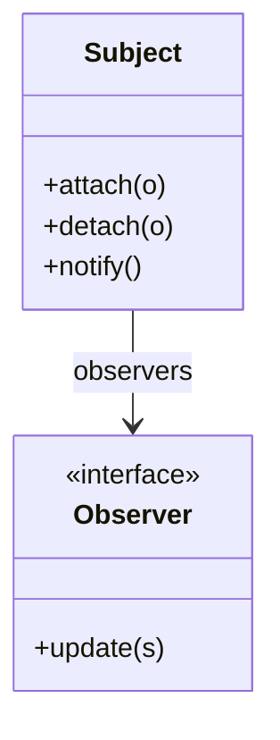
```mermaid
classDiagram
    class Subject {
        +attach(o)
        +detach(o)
        +notify()
    }
    class Observer {
        <<interface>>
        +update(s)
    }
    Subject --> Observer : observers
```

```python
class Subject:
    def __init__(self): self._observers: list["Observer"] = []
    def attach(self, o: "Observer") -> None: self._observers.append(o)
    def detach(self, o: "Observer") -> None: self._observers.remove(o)
    def notify(self, *a, **kw) -> None:
        for o in self._observers: o.update(self, *a, **kw)
class Observer(ABC):
    @abstractmethod
    def update(self, subject: Subject, *a, **kw) -> None: ...
```

- **Use:** Event systems, data binding, MVC models, pub-sub.
- **Not:** For 1:1 dependencies — direct call is simpler.
- **Pythonic shortcut:** `collections.deque` of callbacks, or `Signal` class with `__iadd__`.
- See [[design-patterns-behavioral]].

---

### 19. State

> **Intent:** Allow an object to alter its behavior when its internal state changes.

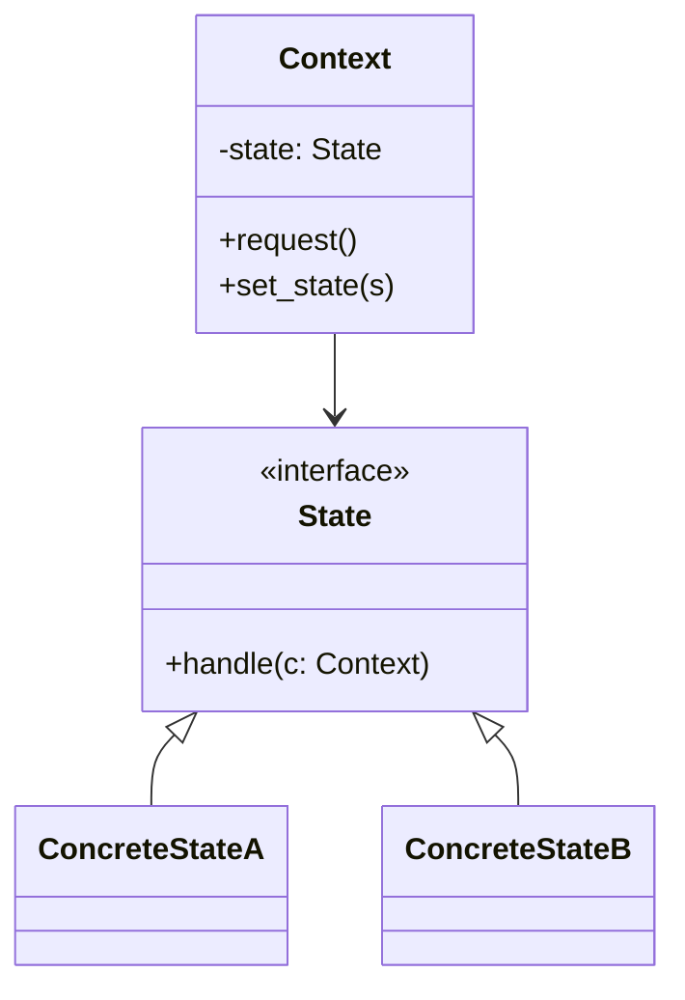
```mermaid
classDiagram
    class Context {
        -state: State
        +request()
        +set_state(s)
    }
    class State {
        <<interface>>
        +handle(c: Context)
    }
    class ConcreteStateA
    class ConcreteStateB
    Context --> State
    State <|-- ConcreteStateA
    State <|-- ConcreteStateB
```

```python
class State(ABC):
    @abstractmethod
    def handle(self, ctx: "VendingMachine") -> None: ...
class IdleState(State):
    def handle(self, ctx: "VendingMachine") -> None:
        print("Insert coin"); ctx.set_state(HasCoinState())
class HasCoinState(State):
    def handle(self, ctx: "VendingMachine") -> None:
        print("Dispensing..."); ctx.set_state(IdleState())
class VendingMachine:
    def __init__(self): self._state: State = IdleState()
    def set_state(self, s: State) -> None: self._state = s
    def press_button(self) -> None: self._state.handle(self)
```

- **Use:** Vending machines, network protocols, document workflows, game AI.
- **Not:** For 2 states with no transitions — an `if` is clearer.
- See [[design-patterns-behavioral]].

---

### 20. Strategy

> **Intent:** Define a family of algorithms, encapsulate each, make them interchangeable.

```mermaid
classDiagram
    class Context {
        -strategy: Strategy
        +set_strategy(s)
        +do_work()
    }
    class Strategy {
        <<interface>>
        +execute()
    }
    class ConcreteStrategyA
    class ConcreteStrategyB
    Context --> Strategy
    Strategy <|-- ConcreteStrategyA
    Strategy <|-- ConcreteStrategyB
```

```python
class SortStrategy(ABC):
    @abstractmethod
    def sort(self, xs: list[int]) -> list[int]: ...
class BubbleSort(SortStrategy):
    def sort(self, xs: list[int]) -> list[int]: return sorted(xs)   # pretend
class QuickSort(SortStrategy):
    def sort(self, xs: list[int]) -> list[int]: return sorted(xs)
class Sorter:
    def __init__(self, strategy: SortStrategy): self._s = strategy
    def sort(self, xs: list[int]) -> list[int]: return self._s.sort(xs)
```

- **Use:** Multiple algorithms for the same job; runtime-swappable.
- **Not:** When the algorithm never changes — direct call is simpler.
- **Pythonic shortcut:** first-class functions; `functools.partial`.
- See [[design-patterns-behavioral]].

---

### 21. Template Method

> **Intent:** Define a skeleton algorithm in a base class; let subclasses redefine steps.

```mermaid
classDiagram
    class AbstractClass {
        <<abstract>>
        +template_method()
        #primitive_op_1()
        #primitive_op_2()
    }
    class ConcreteClass {
        #primitive_op_1()
        #primitive_op_2()
    }
    AbstractClass <|-- ConcreteClass
```

```python
class DataMiner(ABC):
    def mine(self, path: str) -> str:        # template method
        raw = self.open(path)
        data = self.parse(raw)
        return self.analyze(data)
    @abstractmethod
    def open(self, path: str) -> str: ...
    @abstractmethod
    def parse(self, raw: str) -> dict: ...
    def analyze(self, data: dict) -> str:    # hook with default
        return f"analyzed {len(data)} items"
class CsvMiner(DataMiner):
    def open(self, p: str) -> str: return open(p).read()
    def parse(self, raw: str) -> dict: return {"rows": raw.count("\n")}
```

- **Use:** Frameworks (let users override steps); invariant algorithm with variant parts.
- **Not:** When steps don't actually share order — Strategy is better.
- See [[design-patterns-behavioral]].

---

### 22. Visitor

> **Intent:** Represent an operation to perform on elements of an object structure without changing their classes.

```mermaid
classDiagram
    class Visitor {
        <<interface>>
        +visitA(a)
        +visitB(b)
    }
    class Element {
        <<interface>>
        +accept(v: Visitor)
    }
    class ConcreteElementA
    class ConcreteElementB
    Element <|-- ConcreteElementA
    Element <|-- ConcreteElementB
    Visitor <|.. ConcreteVisitor
    Element --> Visitor
```

```python
class Shape(ABC):
    @abstractmethod
    def accept(self, v: "Visitor") -> None: ...
class Circle(Shape):
    def accept(self, v: "Visitor") -> None: v.visit_circle(self)
class Square(Shape):
    def accept(self, v: "Visitor") -> None: v.visit_square(self)
class Visitor(ABC):
    @abstractmethod
    def visit_circle(self, c: Circle) -> None: ...
    @abstractmethod
    def visit_square(self, s: Square) -> None: ...
class AreaVisitor(Visitor):
    def visit_circle(self, c: Circle) -> None: print("πr²")
    def visit_square(self, s: Square) -> None: print("s²")
```

- **Use:** Compilers (AST visitors), reporting/exporting across a hierarchy.
- **Not:** When the hierarchy changes often — you'd have to update every visitor.
- **Pythonic shortcut:** `functools.singledispatch`.
- See [[design-patterns-behavioral]].

---

### 23. Interpreter

> **Intent:** Given a language, define a representation for its grammar plus an interpreter.

```mermaid
classDiagram
    class Expression {
        <<abstract>>
        +interpret(ctx) int
    }
    class Number
    class AddExpression {
        -left: Expression
        -right: Expression
    }
    Expression <|-- Number
    Expression <|-- AddExpression
    AddExpression --> Expression
```

```python
class Expr(ABC):
    @abstractmethod
    def eval(self) -> int: ...
class Num(Expr):
    def __init__(self, v: int): self.v = v
    def eval(self) -> int: return self.v
class Add(Expr):
    def __init__(self, l: Expr, r: Expr): self.l, self.r = l, r
    def eval(self) -> int: return self.l.eval() + self.r.eval()
# (1 + 2) + 3 = 6
ast = Add(Add(Num(1), Num(2)), Num(3))
print(ast.eval())
```

- **Use:** DSLs, rule engines, expression evaluators, SQL parsers.
- **Not:** For one-off parsing — use a parser library.
- See [[design-patterns-behavioral]].

---

## ➕ Extras (Beyond GoF)

| Pattern | Intent | See |
|---|---|---|
| **Dependency Injection** | Receive collaborators; don't construct them | [[dependency-injection]] |
| **Repository** | Mediate between domain and data layer | [[real-world-examples]] |
| **Unit of Work** | Maintain a list of objects affected by a transaction | [[oop-in-production]] |
| **Plugin / Registry** | Decouple extension authors from core | [[metaclasses-and-class-creation]] |
| **Active Record** | Object wraps a row, knows how to save itself | [[oop-in-production]] |
| **Specification** | Composable business rules | [[design-patterns-behavioral]] |

---

## 🔗 Pattern → Related Patterns Cross-Reference

| Pattern | Often combined with | Don't confuse with |
|---|---|---|
| Singleton | Facade, Factory | Module-level instance (alternative) |
| Factory Method | Template Method, Abstract Factory | Simple factory (not GoF) |
| Abstract Factory | Factory Method, Prototype | Builder (families vs steps) |
| Builder | Composite, Prototype | Fluent interface (idiom, not pattern) |
| Prototype | Composite, Factory Method | `copy.deepcopy` (mechanism) |
| Adapter | Facade, Bridge | Facade (simplify vs convert) |
| Bridge | Abstract Factory, Adapter | Strategy (varies impl vs algorithm) |
| Composite | Visitor, Iterator, Decorator | Decorator (add behavior vs treat uniformly) |
| Decorator (GoF) | Composite, Strategy | Python `@decorator` (different thing!) |
| Facade | Singleton, Adapter | API gateway |
| Flyweight | Composite, State | Caching (general) |
| Proxy | Adapter, Decorator | Decorator (control vs add behavior) |
| Chain of Responsibility | Decorator, Command | Decorator (forward vs handle-or-pass) |
| Command | Memento, Composite (macros) | Strategy (action vs algorithm) |
| Iterator | Composite, Visitor | Generator (Pythonic shortcut) |
| Mediator | Observer, Command | Observer (central vs direct) |
| Memento | Command, State | Snapshot (general) |
| Observer | Mediator, MVC | Pub-Sub (architectural) |
| State | Strategy, Flyweight | Strategy (state machine vs algorithm) |
| Strategy | Context, State | Template Method (composition vs inheritance) |
| Template Method | Factory Method, Strategy | Hook (idiom) |
| Visitor | Iterator, Composite | `singledispatch` (Pythonic) |
| Interpreter | Visitor, Composite | Parser (mechanism) |

---

## 🚫 When NOT to Use a Pattern

| Anti-signal | Do this instead |
|---|---|
| You're reaching for a pattern in your first cut of a design | Write the simple code first; refactor to pattern when pain emerges |
| The pattern adds more classes than the problem warrants | Use a function, a dict, or just an `if` |
| You're adding the pattern "for future flexibility" | YAGNI — see [[grasp-and-extra-principles]] |
| Every team member has to look up the pattern to understand the code | Don't — use the simpler idiom |
| The pattern is at the top of a class hierarchy with one subclass | Delete the hierarchy |

> [!quote] "Patterns are a language for communicating design — not a checklist for writing code."
> — paraphrased from the GoF book.

---

## 🔑 Key Takeaways

- **23 GoF patterns** split into Creational (5), Structural (7), Behavioral (11).
- **Use the Problem → Pattern lookup table** to find candidates fast — then verify with the "when NOT to use" check.
- **Most patterns have a Pythonic shortcut**: functions for Strategy, `singledispatch` for Visitor, generators for Iterator, module-level instance for Singleton.
- **Patterns combine** — Composite + Visitor + Iterator is a common trio; Command + Memento enables undo.
- **Decorator (GoF) ≠ `@decorator` (Python syntax)** — same word, two different things.
- **YAGNI beats pattern-fetishism**: don't add a pattern until the code begs for it.
- Every pattern in this card has a full treatment in [[design-patterns-creational]], [[design-patterns-structural]], or [[design-patterns-behavioral]] — click through for worked examples and pitfalls.

---

*See also: [[oop-quick-reference]] · [[solid-and-principles-cheatsheet]] · [[composition-over-inheritance]] · [[dependency-injection]] · [[real-world-examples]]*
