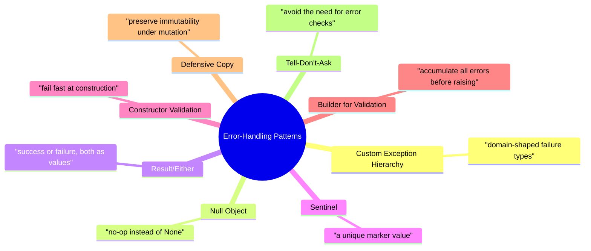
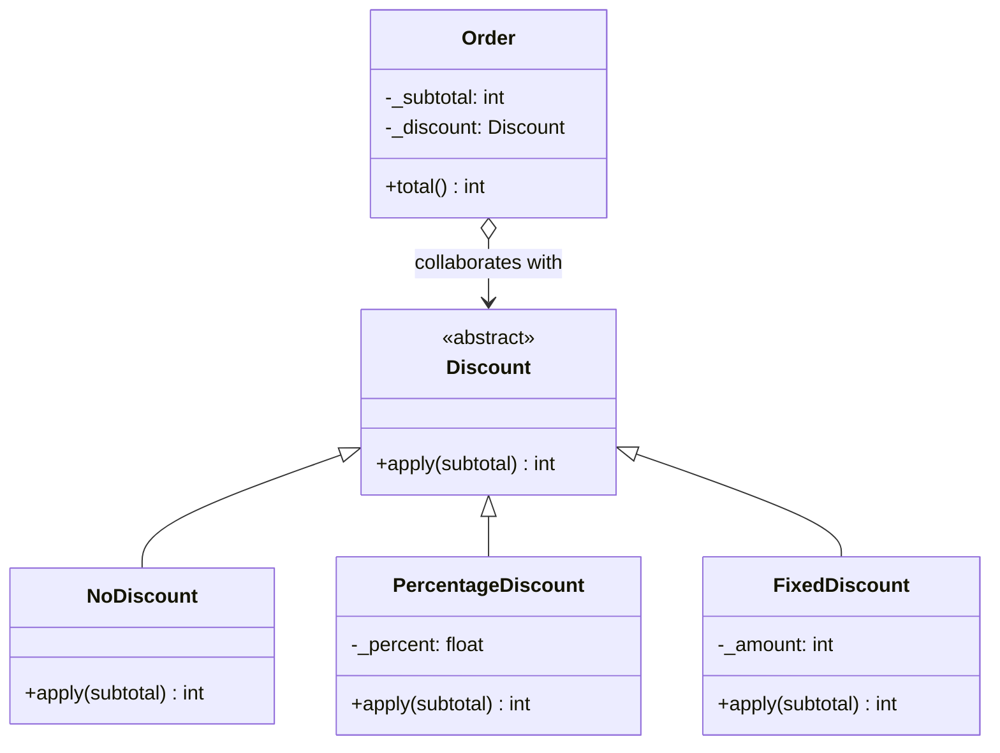
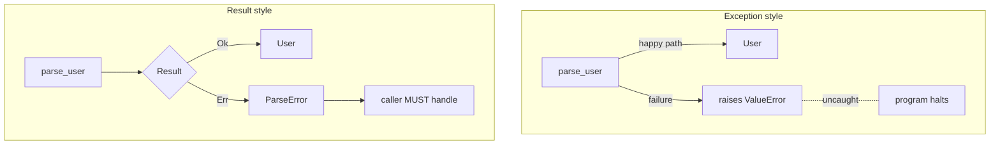
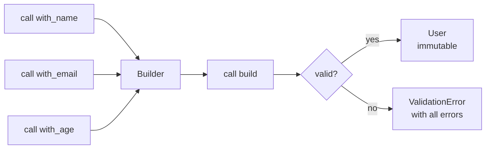
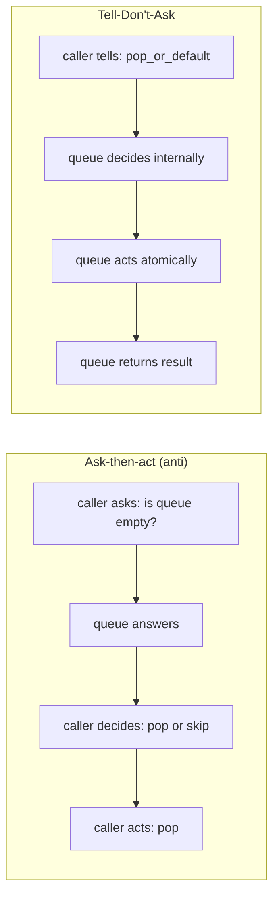
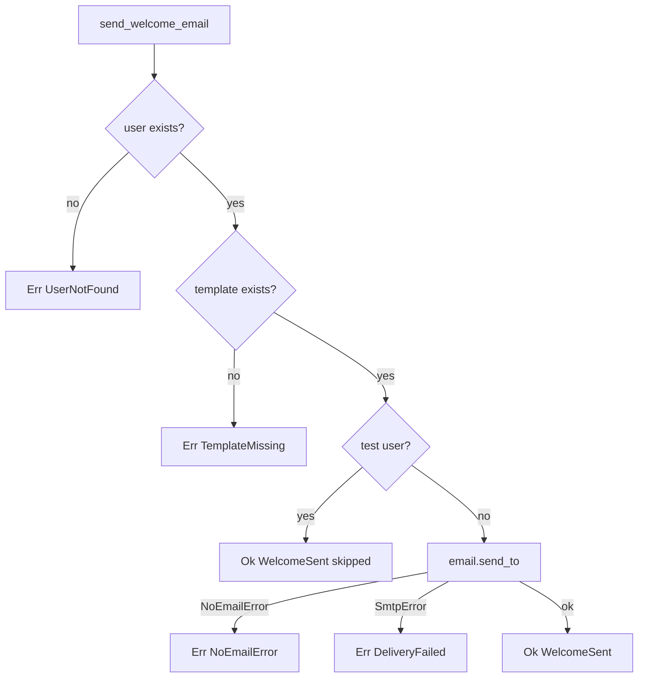
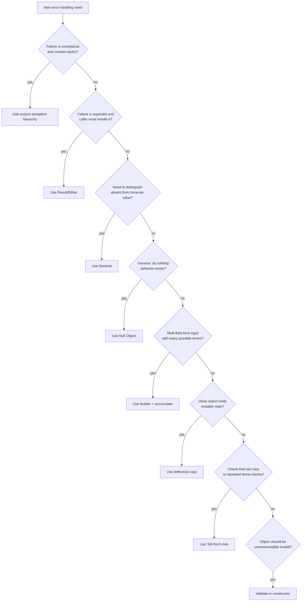

> [!note] Why this note exists
> [[exception-handling-in-oop]] taught you *how* to use exceptions well. This note catalogs the *design patterns* that prevent, replace, or accumulate errors — patterns that decide **whether** to raise in the first place. Each pattern is an OOP design choice that changes the shape of your error surface.

Related: [[exception-handling-in-oop]], [[testing-oop-code]], [[solid-principles]], [[composition-over-inheritance]], [[magic-methods]], [[best-practices]], [[common-pitfalls-and-anti-patterns]], [[what-is-oop]].

---

## 1. The catalog at a glance



### Comparison table

| Pattern | Intent | When to use | Cost |
|---|---|---|---|
| **Custom exception hierarchy** | Encode domain failures as typed objects | Cross-layer failures, recoverable | A class per failure mode |
| **Null Object** | Replace `None` checks with a no-op collaborator | A genuine "do nothing" behavior exists | One extra class |
| **Result/Either** | Make expected failures values, not exceptions | Failure is common, caller must handle | Verbose call sites |
| **Sentinel** | A unique "not set" marker distinct from `None` | `None` is a valid value | Easy to misuse |
| **Constructor validation** | Refuse invalid state at construction | Invariants expressible in the constructor | Slightly harder to construct |
| **Builder (validation-accumulating)** | Collect *all* validation errors before raising | Form input, multi-field DTOs | A Builder class |
| **Defensive copy** | Protect immutability from external mutation | Value objects holding mutable state | A copy on input and on output |
| **Tell-Don't-Ask** | Avoid the question that triggers the error | Behavior can be delegated cleanly | Refactoring to delegation |

---

## 2. Custom exception hierarchy (recap with a fresh domain)

See [[exception-handling-in-oop#3. Custom exception hierarchies]] for the full treatment. Recap with a *notification* domain:

```python
# src/notify/exceptions.py
class NotificationError(Exception):
    def __init__(self, message: str, *, recipient: str) -> None:
        super().__init__(message)
        self.recipient = recipient

class InvalidAddressError(NotificationError):
    def __init__(self, recipient: str, *, reason: str) -> None:
        super().__init__(f"invalid address {recipient!r}: {reason}", recipient=recipient)
        self.reason = reason

class DeliveryFailedError(NotificationError):
    def __init__(self, recipient: str, *, provider_error: str, retryable: bool) -> None:
        super().__init__(f"delivery to {recipient!r} failed: {provider_error}", recipient=recipient)
        self.provider_error = provider_error
        self.retryable = retryable
```

> [!tip] Always think "caller's catch site" first
> Before writing the class, sketch how a caller would catch and react. That sketch tells you which subclasses you need and which attributes each should carry. If you can't picture the catch site, you don't need the subclass yet.

---

## 3. The Null Object pattern

### Intent

Replace `None` (and the `if x is None:` checks that follow) with a **no-op object** that implements the same interface but does nothing.

### Problem it solves

```python
# ❌ None-checking spreads through the codebase
class Order:
    def __init__(self, discount: Discount | None = None) -> None:
        self._discount = discount

    def total(self) -> int:
        if self._discount is None:
            return self._subtotal
        return self._discount.apply(self._subtotal)
```

Every method that touches `discount` repeats the `None` check. New developers forget. Tests have to cover both branches. The class is *aware* of the absence of a discount — that awareness leaks everywhere.

### Null Object solution

```python
# src/pricing/discounts.py
from abc import ABC, abstractmethod


class Discount(ABC):
    @abstractmethod
    def apply(self, subtotal: int) -> int: ...


class NoDiscount(Discount):
    """Null Object: a discount that does nothing."""
    def apply(self, subtotal: int) -> int:
        return subtotal


class PercentageDiscount(Discount):
    def __init__(self, percent: float) -> None:
        if not 0 <= percent <= 100:
            raise ValueError("percent must be in [0, 100]")
        self._percent = percent
    def apply(self, subtotal: int) -> int:
        return int(subtotal * (100 - self._percent) / 100)


class FixedDiscount(Discount):
    def __init__(self, amount_cents: int) -> None:
        if amount_cents < 0:
            raise ValueError("amount must be non-negative")
        self._amount = amount_cents
    def apply(self, subtotal: int) -> int:
        return max(0, subtotal - self._amount)


# src/orders/order.py
class Order:
    def __init__(self, subtotal: int, discount: Discount | None = None) -> None:
        self._subtotal = subtotal
        # Default to the Null Object; never store None.
        self._discount: Discount = discount or NoDiscount()

    def total(self) -> int:
        return self._discount.apply(self._subtotal)
```

```python
Order(subtotal=1000).total()                                  # → 1000 (NoDiscount)
Order(subtotal=1000, discount=PercentageDiscount(10)).total() # → 900
Order(subtotal=1000, discount=FixedDiscount(200)).total()     # → 800
```

### When to use

- The "do nothing" behavior is **well-defined and stable**. ("No discount" is obvious; "no user" is not — what does `no_user.send_email()` mean?)
- The interface is small. Implementing every method as no-op for a 30-method interface is painful.
- `None` checks are spreading through your codebase.

### Pitfalls

> [!danger] Null Object can hide bugs
> If a method silently does nothing when you *expected* something, the bug surfaces far from the cause. Reserve Null Object for cases where "do nothing" is genuinely correct behavior. If "no discount" is an unusual situation that should alert someone, use a real `None` and check it.

> [!warning] Don't make Null Object mutable by accident
> If your Null Object holds state (e.g. an in-memory counter), sharing one instance across callers creates mutation bugs. Keep Null Objects immutable, or create a fresh one each time.



---

## 4. The Result/Either pattern

### Intent

Represent "success or failure" as a **value**, not an exception. The caller is forced to handle both cases explicitly.

### Why?

Exceptions are great for unexpected failures, but they have a problem: **the type signature doesn't tell you they're coming**. A function `parse(s: str) -> User` *might* raise — but you have to read the docstring (or the implementation) to know. `Result[User, ParseError]` makes the failure mode part of the type.

### Python implementation

Python doesn't ship `Result` in the stdlib. A minimal version:

```python
# src/result.py
from __future__ import annotations
from dataclasses import dataclass
from typing import Callable, Generic, TypeVar, Union

T = TypeVar("T")
E = TypeVar("E")


class Result(Generic[T, E]):
    """Abstract base — use Ok() or Err() to construct."""

    def is_ok(self) -> bool: ...
    def is_err(self) -> bool: ...
    def unwrap(self) -> T: ...           # raises if Err
    def unwrap_or(self, default: T) -> T: ...
    def map(self, fn: Callable[[T], "Result[U, E]"]) -> "Result": ...
    def map_err(self, fn: Callable[[E], "Result[T, F]"]) -> "Result": ...


@dataclass(frozen=True)
class Ok(Result[T, E]):
    value: T

    def is_ok(self) -> bool: return True
    def is_err(self) -> bool: return False
    def unwrap(self) -> T: return self.value
    def unwrap_or(self, default: T) -> T: return self.value
    def map(self, fn): return fn(self.value)
    def map_err(self, fn): return self


@dataclass(frozen=True)
class Err(Result[T, E]):
    error: E

    def is_ok(self) -> bool: return False
    def is_err(self) -> bool: return True
    def unwrap(self) -> T:
        raise ValueError(f"called unwrap on Err: {self.error!r}")
    def unwrap_or(self, default: T) -> T: return default
    def map(self, fn): return self
    def map_err(self, fn): return fn(self.error)
```

### Usage: parsing user input

```python
# src/users/parsing.py
from dataclasses import dataclass
from src.result import Result, Ok, Err


@dataclass(frozen=True)
class User:
    name: str
    age: int


class ParseError:
    """Base for parse errors. Subclass for specific failures."""
    pass

@dataclass(frozen=True)
class EmptyName(ParseError):
    pass

@dataclass(frozen=True)
class InvalidAge(ParseError):
    raw: str


def parse_user(raw_name: str, raw_age: str) -> Result[User, ParseError]:
    name = raw_name.strip()
    if not name:
        return Err(EmptyName())
    try:
        age = int(raw_age)
    except ValueError:
        return Err(InvalidAge(raw_age))
    if age < 0 or age > 150:
        return Err(InvalidAge(raw_age))
    return Ok(User(name=name, age=age))
```

### The caller *must* handle both cases

```python
def greet(raw_name: str, raw_age: str) -> str:
    result = parse_user(raw_name, raw_age)
    if isinstance(result, Ok):
        return f"Hello, {result.value.name}!"
    elif isinstance(result, Err):
        if isinstance(result.error, EmptyName):
            return "Name cannot be empty."
        elif isinstance(result.error, InvalidAge):
            return f"{result.error.raw!r} is not a valid age."
    # mypy can prove we've exhausted the cases here.
```

### When to use

- Failure is **expected and common** (parsing, validation, lookups in user-supplied data).
- The caller **must** handle the failure — `Result` makes ignoring it impossible.
- You want compositional error handling (`map`, `map_err`, `and_then`).

### Pitfalls

> [!warning] `Result` is verbose
> Every call site must branch on `is_ok`. In Python, where exceptions are cheap and idiomatic, `Result` is sometimes over-engineering. Use it when the failure is *expected* and *recoverable*; use exceptions when failure is *exceptional*.

> [!danger] Don't mix Result and exceptions for the same operation
> If `parse_user` returns `Result` *and* raises on some inputs, callers have to handle both — defeating the purpose. Pick one model per operation.

### Comparison with exceptions



---

## 5. The Sentinel pattern

### Intent

Use a **unique marker value** to mean "no value here" in cases where `None` is itself a valid value.

### Problem

```python
def get(key: str, default=None):
    """Return mapping[key] if present, else default."""
    ...

# But what if I want to distinguish "key absent" from "key present with value None"?
# Both fall through to the default — information is lost.
```

### Sentinel solution

```python
# src/sentinel.py
from typing import Any

class _Missing:
    """A unique sentinel. Only one instance ever exists."""
    _instance = None
    def __new__(cls):
        if cls._instance is None:
            cls._instance = super().__new__(cls)
        return cls._instance
    def __repr__(self) -> str: return "<MISSING>"
    def __bool__(self) -> bool: return False

MISSING: Any = _Missing()


def get(mapping: dict, key: str, default: Any = MISSING) -> Any:
    if key in mapping:
        return mapping[key]
    if default is not MISSING:
        return default
    raise KeyError(key)
```

Python's stdlib uses this pattern extensively: `dataclasses.field(default=MISSING)`, `inspect.Parameter.empty`, `functools.partial`'s placeholder.

> [!tip] Prefer module-level singletons
> `MISSING = object()` works and is even simpler — the only thing that matters is identity (`is`). Don't use strings or numbers as sentinels; callers can typo them.

### When to use

- `None` is a legitimate value, and you need to distinguish it from "not provided."
- You're writing library code where users need a way to say "use your default."

### Pitfalls

> [!warning] Sentinels don't compose
> A sentinel doesn't survive serialization (pickling, JSON). Don't use one as a value that might be persisted. Use a `Optional[T]` or a tagged dataclass instead.

---

## 6. Validation: constructor (fail fast) vs methods

Two places to validate, with different trade-offs.

### Constructor validation (fail fast)

```python
class Money:
    def __init__(self, amount: int, currency: str) -> None:
        if amount < 0:
            raise ValueError("amount must be non-negative")
        if not currency or len(currency) != 3:
            raise ValueError("currency must be a 3-letter ISO code")
        self._amount = amount
        self._currency = currency.upper()
```

**Pros:** an instance is *always valid*. No method needs to re-check invariants.
**Cons:** construction can fail; builders and deserializers must handle exceptions.

### Method validation (lazy)

```python
class Money:
    def __init__(self, amount: int, currency: str) -> None:
        self._amount = amount
        self._currency = currency

    def convert_to(self, target: str) -> "Money":
        if not self._currency:
            raise ValueError("source currency not set")
        ...
```

**Pros:** allows incremental construction (set fields later).
**Cons:** every method that uses the field must re-validate; bugs hide until the method runs.

> [!tip] Strong preference: fail fast at construction
> In OOP, an object that exists should be a valid object. Constructor validation gives you the invariant *"every `Money` is well-formed"* for free, and every method can rely on it. This is the same principle as [[exception-handling-in-oop#5.1 Fail fast]].

### When lazy validation is right

- Construction is incremental (Builder pattern — see [[#7. Builder for accumulating validation errors]]).
- The invalid state is genuinely useful transiently (e.g. an ORM model before `save()`).
- Validation is expensive and might be deferred (e.g. cross-field rules requiring a database lookup).

---

## 7. Builder pattern for accumulating validation errors

### Intent

When a form or DTO has many fields, raising on the *first* error forces the user to fix-and-resubmit N times. A **validation-accumulating Builder** collects *all* errors and reports them at once.

### Problem

```python
# ❌ Bad: only the first error is reported
def make_user(name, email, age):
    if not name: raise ValueError("name required")
    if "@" not in email: raise ValueError("email invalid")
    if age < 0: raise ValueError("age must be non-negative")
    return User(name, email, age)

# User submits "" / "alice" / "-5" → only hears about name.
# Submits "Alice" / "alice" / "-5" → only hears about email.
# Three round-trips instead of one.
```

### Solution: collect, then raise

```python
# src/users/builder.py
from __future__ import annotations
from dataclasses import dataclass, field


@dataclass(frozen=True)
class User:
    name: str
    email: str
    age: int


@dataclass
class ValidationError(Exception):
    errors: list[str]


class UserBuilder:
    def __init__(self) -> None:
        self._name: str | None = None
        self._email: str | None = None
        self._age: int | None = None

    def with_name(self, name: str) -> "UserBuilder":
        self._name = name
        return self

    def with_email(self, email: str) -> "UserBuilder":
        self._email = email
        return self

    def with_age(self, age: int) -> "UserBuilder":
        self._age = age
        return self

    def build(self) -> User:
        errors: list[str] = []

        if not self._name or not self._name.strip():
            errors.append("name is required")
        if not self._email or "@" not in self._email:
            errors.append("email is invalid")
        if self._age is None:
            errors.append("age is required")
        elif self._age < 0 or self._age > 150:
            errors.append(f"age must be in [0, 150], got {self._age}")

        if errors:
            raise ValidationError(errors=errors)

        # After this point, the type system knows nothing is None.
        return User(name=self._name.strip(), email=self._email, age=self._age)
```

### Usage

```python
try:
    user = (UserBuilder()
            .with_name("")
            .with_email("alice")
            .with_age(-5)
            .build())
except ValidationError as e:
    print(e.errors)
    # ['name is required', 'email is invalid', 'age must be in [0, 150], got -5']
```

### Why this is OOP

- The Builder is a *class* with *state* (the partially-built user).
- `build()` is a *method* that enforces invariants before construction.
- `ValidationError` is a *custom exception* (see [[#2. Custom exception hierarchy (recap with a fresh domain)]]) carrying a *typed attribute* (`errors: list[str]`).
- The resulting `User` is **always valid** — no invalid object can exist.



### When to use

- Forms with multiple fields.
- Config objects loaded from external sources.
- Anywhere the user benefits from seeing *all* problems at once.

### Pitfalls

> [!warning] Builders are mutable; don't share them
> A `UserBuilder` is mutable by design. If you share one across threads, you'll get races. Builders should be **single-use**: create, configure, `build()`, discard.

> [!danger] Don't ship a "validatable but invalid" object
> If `User` has a separate `.validate()` method, callers will forget to call it. Use the Builder to make `User` *unconstructable* in an invalid state.

---

## 8. Defensive copying for immutability safety

### Intent

When a "value object" holds mutable state (list, dict, set, another class), returning or accepting a reference breaks immutability. Defensive copying closes the hole.

### The problem

```python
# ❌ Bad: the "frozen" dataclass is mutable via the list
from dataclasses import dataclass

@dataclass(frozen=True)
class Order:
    items: list[str]   # ← frozen=True only forbids reassigning items;

order = Order(items=["a", "b"])
order.items.append("c")  # ← but the list itself is still mutable!
print(order)  # Order(items=['a', 'b', 'c']) — the "immutable" order changed.
```

`frozen=True` makes the *attribute binding* immutable; the *contents* of mutable containers are still wide open.

### Defensive copy on input and on output

```python
from __future__ import annotations
from dataclasses import dataclass
from typing import Iterable


@dataclass(frozen=True)
class Order:
    items: tuple[str, ...]  # ← use an immutable type instead

    @classmethod
    def from_iterable(cls, items: Iterable[str]) -> "Order":
        # Defensive copy on the way in.
        return cls(items=tuple(items))

    def get_items(self) -> list[str]:
        # Defensive copy on the way out (if you must return a list).
        return list(self.items)


order = Order.from_iterable(["a", "b"])
# order.items is a tuple — immutable.
# order.get_items() returns a fresh list each time.
```

> [!tip] The deeper lesson
> **Immutability is a *type* property, not a *decorator* property.** `@dataclass(frozen=True)` is necessary but not sufficient. To actually be immutable, your fields must *also* be of immutable types. Prefer `tuple` over `list`, `frozenset` over `set`, `MappingProxyType` over `dict`, and frozen dataclasses over mutable ones.

### When to use defensive copying

- A value object holds mutable state and you can't change the type (e.g. interop with a library).
- You're returning an internal collection to a caller and don't want them to mutate it.
- You're receiving a collection from an untrusted caller and don't want their later mutations to affect you.

### Pitfalls

> [!warning] Performance: copying is O(n)
> For large collections, defensive copies add cost. Measure. For hot paths, switch to immutable types (one-time conversion cost) instead of copying at every call.

> [!danger] Shallow copy is not enough
> `list(self.items)` is a *shallow* copy. If the items themselves are mutable objects, callers can still mutate them via the copy. Deep-copy (or — better — use immutable item types) when item-level immutability matters.

---

## 9. Tell-Don't-Ask for error avoidance

### Intent

> **Tell-Don't-Ask:** instead of asking an object for its state, making a decision, and then telling it what to do — just *tell* it what to do and let it decide.

This pattern *avoids* errors by removing the need for the caller to inspect state. If you never ask "are you empty?" before calling "pop," you never have a check-vs-action race.

### Problem

```python
# ❌ Ask-then-act: races and bugs
def process(queue: list[str]) -> None:
    if len(queue) > 0:               # ask
        item = queue.pop(0)          # act
        handle(item)
    else:
        log("empty")
```

Between the `len` check and the `pop`, another thread could empty the queue. The "ask" was a lie by the time "act" ran.

### Tell-Don't-Ask

```python
# ✅ Tell: let the queue handle its own emptiness.
class Queue:
    def pop_or_default(self, default=None):
        """Either pop, or return default. The queue decides."""
        if not self._items:
            return default
        return self._items.pop(0)


def process(queue: Queue) -> None:
    item = queue.pop_or_default(default=None)
    if item is None:
        log("empty")
        return
    handle(item)
```

Now the *queue* makes the decision, atomically. There's no "ask" lying around in the caller. The race is gone.

### Another example: logging level

```python
# ❌ Ask
if logger.isEnabledFor(logging.DEBUG):
    msg = expensive_format(...)  # only computed if needed
    logger.debug(msg)

# ✅ Tell (logger decides whether to call the lambda)
logger.debug(lambda: expensive_format(...))
```

(Stdlib `logging` supports this with `logger.debug("%s", lazy_arg)` via `%`-formatting. Same idea: pass a recipe, let the logger decide.)

### Why this avoids errors

- **No check-then-act races.** The decision is made *inside* the object, atomically.
- **No missed checks.** Callers can't forget to ask — they just tell.
- **State stays encapsulated.** The caller doesn't need to know the object's internals.

> [!tip] Tell-Don't-Ask is the *behavioral* version of [[encapsulation]]
> Encapsulation says "don't touch my fields." Tell-Don't-Ask says "don't even *read* my fields to make decisions — just tell me what you want done." Both reduce coupling.

### When Tell-Don't-Ask is wrong

- The decision is *inherently the caller's* (e.g. a controller choosing between two strategies).
- The object is a *value object* with no behavior (don't add `process` to `Money`).



---

## 10. Worked refactoring: `None`-checks → Null Object + Result

### 10.1 The "before" code

```python
# ❌ None-check soup
def send_welcome_email(user_id: str) -> dict:
    user = user_repo.get(user_id)
    if user is None:
        return {"ok": False, "error": "user not found"}

    if user.email is None:
        return {"ok": False, "error": "user has no email"}

    template = template_repo.get("welcome")
    if template is None:
        return {"ok": False, "error": "template missing"}

    if user.email.endswith("@example.test"):
        # Don't send to test users, but treat as success.
        return {"ok": True, "skipped": True}

    try:
        mailer.send(user.email, template.render(user))
    except SmtpError as e:
        return {"ok": False, "error": f"smtp: {e}"}
    except Exception:
        return {"ok": False, "error": "unknown"}

    return {"ok": True, "skipped": False}
```

Problems:
- Six branches, all `None`-shaped.
- The "no email" case is conflated with "test user" and "template missing" via `None`.
- `{"ok": False, "error": "unknown"}` swallows the exception type.
- Callers can't programmatically distinguish failure modes.

### 10.2 Refactor step 1 — Null Object for missing email

```python
class Email:
    """A real email address."""
    def __init__(self, address: str) -> None:
        if "@" not in address:
            raise ValueError(f"invalid email: {address!r}")
        self._address = address

    def send_to(self, mailer, body: str) -> None:
        mailer.send(self._address, body)


class NoEmail(Email):
    """Null Object: a user with no email can't be emailed."""
    def __init__(self) -> None:
        pass  # skip validation
    def send_to(self, mailer, body: str) -> None:
        raise NoEmailError("user has no email address")


class NoEmailError(Exception):
    pass
```

Now `User.email` is *always* an `Email` — either real or `NoEmail`. No `None` checks.

### 10.3 Refactor step 2 — Result for the operation outcome

```python
from dataclasses import dataclass
from src.result import Result, Ok, Err


@dataclass(frozen=True)
class WelcomeSent:
    user_id: str
    skipped: bool


@dataclass(frozen=True)
class UserNotFound:
    user_id: str

@dataclass(frozen=True)
class TemplateMissing:
    name: str

@dataclass(frozen=True)
class DeliveryFailed:
    reason: str


WelcomeOutcome = Result[WelcomeSent, UserNotFound | TemplateMissing | NoEmailError | DeliveryFailed]
```

### 10.4 Refactor step 3 — clean implementation

```python
def send_welcome_email(user_id: str) -> WelcomeOutcome:
    user = user_repo.get(user_id)
    if user is None:
        return Err(UserNotFound(user_id))

    template = template_repo.get("welcome")
    if template is None:
        return Err(TemplateMissing("welcome"))

    if user.email.address.endswith("@example.test"):
        return Ok(WelcomeSent(user_id=user_id, skipped=True))

    try:
        user.email.send_to(mailer, template.render(user))
    except NoEmailError:
        return Err(NoEmailError())
    except SmtpError as e:
        return Err(DeliveryFailed(reason=f"smtp: {e}"))

    return Ok(WelcomeSent(user_id=user_id, skipped=False))
```

### 10.5 The caller is now type-safe

```python
outcome = send_welcome_email("alice")
if isinstance(outcome, Ok):
    if outcome.value.skipped:
        print("skipped test user")
    else:
        print("sent!")
elif isinstance(outcome, Err):
    e = outcome.error
    match e:
        case UserNotFound(uid):    print(f"no user {uid}")
        case TemplateMissing(name):print(f"template {name!r} missing")
        case NoEmailError():       print("user has no email")
        case DeliveryFailed(r):    print(f"delivery failed: {r}")
```

- `None` checks are gone — replaced by `NoEmail` Null Object.
- Failure is a value, not an exception — `Result` forces the caller to handle it.
- `match` on the error subtype gives exhaustive dispatch (mypy can warn if a case is missing).



### 10.6 What we gained

| Metric | Before | After |
|---|---|---|
| `None` checks in the function | 3 | 0 |
| Exception types in function | 2 caught + 1 swallowed | 0 caught (caller pattern-matches) |
| Caller can distinguish failure modes | No (string error) | Yes (typed `Result`) |
| `User.email` type | `str \| None` | `Email` (always) |
| New failure mode added | Edit dict shape everywhere | Add a `dataclass` + `match` case |

---

## 11. Pattern selection cheat sheet



---

## Key Takeaways

1. **Error handling is OOP design.** Every pattern here is a *class design* decision: which classes exist, what they hold, what they hide.
2. **Null Object replaces `None` checks with behavior** — but only when "do nothing" is genuinely correct.
3. **Result makes expected failure a value**, forcing callers to handle it. Reserve for *expected, recoverable* failures; use exceptions for *exceptional* ones.
4. **Sentinels distinguish "not set" from "set to `None`"** — but they don't serialize; use sparingly.
5. **Validate in the constructor.** An object that exists should be a valid object. Every method can then rely on its invariants.
6. **Builders accumulate validation errors** so users see all problems at once, not one per submit.
7. **Immutability requires immutable *types***, not just `frozen=True`. Defensive copy when you can't change the type.
8. **Tell-Don't-Ask removes errors by removing the question.** Push the decision into the object that owns the state.
9. **Combine patterns.** Real refactorings often need Null Object + Result + Builder together, as the worked example showed.
10. **Pattern selection is a flowchart, not a dogma.** Use the decision diagram in §11 to choose, and revisit when the failure model evolves.

---

## Practice Exercises

> [!example] Exercise 1 — Apply Null Object
> The following code has four `None` checks. Refactor using a Null Object:
> ```python
> class Logger:
>     def info(self, msg): print(msg)
> class Service:
>     def __init__(self, logger: Logger | None = None):
>         self._logger = logger
>     def do(self):
>         if self._logger is not None:
>             self._logger.info("starting")
>         result = compute()
>         if self._logger is not None:
>             self._logger.info("done")
>         return result
> ```

> [!example] Exercise 2 — Implement `Result.and_then`
> Add `and_then(self, fn: Callable[[T], Result[U, E]]) -> Result[U, E]` to the `Result` class. It should chain operations: `Ok(x).and_then(f)` calls `f(x)`; `Err(e).and_then(f)` returns `Err(e)` without calling `f`. Demonstrate chaining three parse steps.

> [!example] Exercise 3 — Sentinel vs `Optional`
> Write a function `find_first(predicate, items)` that returns the first item matching `predicate`, distinguishing "no match" from "matched value was `None`". Implement it twice: once with a sentinel, once with `Optional`. Discuss when each is preferable.

> [!example] Exercise 4 — Builder with cross-field validation
> Extend `UserBuilder` to support a `password` and `password_confirm` field. Add a validation rule: "password and password_confirm must match, and password must be at least 8 chars." Ensure all errors (including the cross-field one) are collected.

> [!example] Exercise 5 — Defensive copy
> Write a `TransactionLog` class with an immutable `entries: tuple[Entry, ...]`. Provide `from_list(entries: list[Entry])` (defensive copy on input) and `entries_view()` returning a `list` (defensive copy on output). Write a test that mutates the input list after construction and the returned list after read, asserting the `TransactionLog` is unchanged.

> [!example] Exercise 6 — Tell-Don't-Ask refactor
> Refactor this ask-then-act code into Tell-Don't-Ask:
> ```python
> def withdraw(account, amount):
>     if account.balance >= amount:
>         account.balance -= amount
>         return True
>     return False
> ```
> Decide: should `withdraw` return `bool`, return a `Result`, or raise? Justify in one paragraph.

> [!example] Exercise 7 — End-to-end refactor
> Find a `None`-check-heavy function in your own code (or in a public gist). Apply the four-step refactor from §10 (Null Object, Result, clean implementation, typed caller) and write a short reflection on what changed in maintainability.

Next: [[testing-anti-patterns]] for the catalog of OOP testing smells and a code-review checklist.
