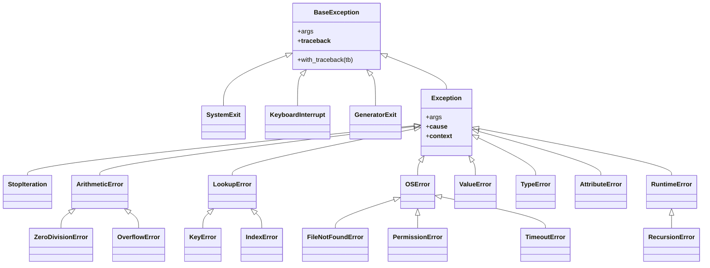
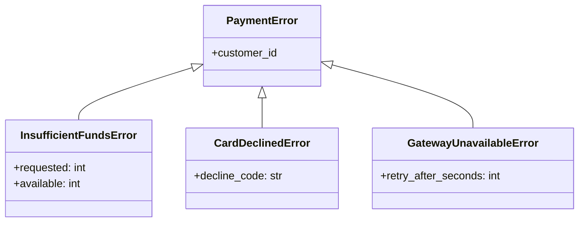
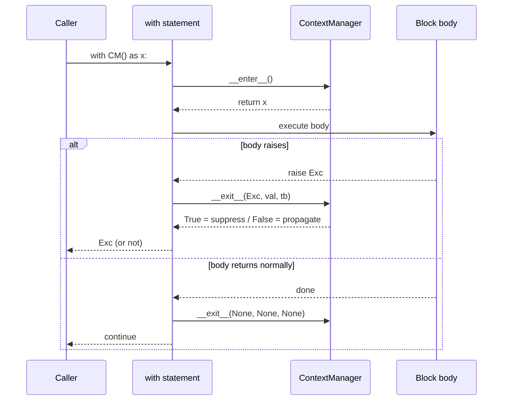
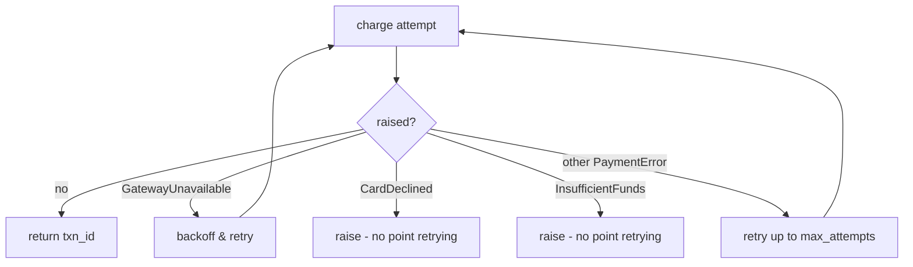
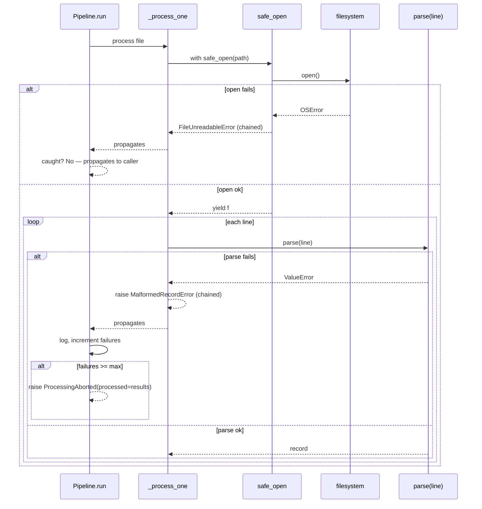

> [!note] Why this note exists
> Exceptions in Python are not bolted on — they are objects, organized by inheritance, and they participate fully in polymorphism. This note treats error handling as an OOP design problem: how to model failure, how to catch it polymorphically, and how to use the language's resource-safety tools (`__enter__`/`__exit__`, `contextlib`) to keep object invariants intact when things go wrong.

Related: [[error-handling-patterns]], [[testing-oop-code]], [[solid-principles]], [[magic-methods]], [[composition-over-inheritance]], [[best-practices]], [[common-pitfalls-and-anti-patterns]], [[what-is-oop]].

---

## 1. Exceptions ARE objects

The single most important thing to internalize: **an exception is an instance of a class**. When you write `raise ValueError("bad")`, Python instantiates `ValueError` with a message, packages a traceback into it, and unwinds the call stack looking for a matching `except`. The exception object then *is the failure*, with all the OOP machinery that implies — attributes, methods, inheritance, polymorphism.

```python
e = ValueError("bad input")
print(type(e).__mro__)
# (<class 'ValueError'>, <class 'Exception'>, <class 'BaseException'>, <class 'object'>)
print(isinstance(e, Exception))  # True
print(isinstance(e, object))     # True — it is an object
```

> [!tip] The mental shift
> Stop thinking "an exception is a control-flow trick." Start thinking "an exception is a *value* representing failure, with a class hierarchy that lets me dispatch on the *kind* of failure." Every OOP instinct you have about inheritance and polymorphism applies.

### What every exception object carries

- `args` — the constructor arguments (often a single message string).
- `__traceback__` — the call stack at the point of the raise (mutable; can be `None`).
- `__cause__` — the original exception if this one was raised via `raise X from Y` (explicit chaining).
- `__context__` — the original exception if this one was raised inside an `except` block (implicit chaining).
- `__suppress_context__` — set `True` by `raise X from None` to hide implicit context.

Custom subclasses can carry **arbitrary domain attributes** — see [[#3. Custom exception hierarchies]].

---

## 2. The Python exception hierarchy

All exceptions inherit from `BaseException`. You should almost never subclass `BaseException` directly — subclass `Exception` instead. (`KeyboardInterrupt` and `SystemExit` inherit from `BaseException` precisely so that bare `except:` blocks *don't* catch them; if they did, `Ctrl-C` and `sys.exit()` could be silently swallowed.)



> [!tip] Why the hierarchy matters
> Because exceptions are polymorphic, `except OSError:` catches `FileNotFoundError`, `PermissionError`, *and* `TimeoutError`. That means **you can choose your level of granularity** at the catch site — broad for "any I/O issue," narrow for "the file was missing, retry." This is exactly the kind of polymorphic dispatch you use elsewhere in OOP.

---

## 3. Custom exception hierarchies for your domain

A good domain model publishes a hierarchy of exceptions that mirrors the domain's failure modes. Callers can catch broadly (the base class) or narrowly (a specific subclass), depending on what they can recover from.

### 3.1 A payments example

```python
# src/payments/exceptions.py
from __future__ import annotations


class PaymentError(Exception):
    """Base for everything that can go wrong during a payment."""

    def __init__(self, message: str, *, customer_id: str | None = None) -> None:
        super().__init__(message)
        self.customer_id = customer_id


class InsufficientFundsError(PaymentError):
    def __init__(self, message: str, *, customer_id: str, requested: int, available: int) -> None:
        super().__init__(message, customer_id=customer_id)
        self.requested = requested
        self.available = available


class CardDeclinedError(PaymentError):
    def __init__(self, message: str, *, customer_id: str, decline_code: str) -> None:
        super().__init__(message, customer_id=customer_id)
        self.decline_code = decline_code


class GatewayUnavailableError(PaymentError):
    """Transient: the payment processor itself is unreachable."""
    def __init__(self, message: str, *, customer_id: str | None = None, retry_after_seconds: int = 30) -> None:
        super().__init__(message, customer_id=customer_id)
        self.retry_after_seconds = retry_after_seconds
```

### 3.2 The class diagram



### 3.3 Why this is good OOP

1. **Polymorphism at the catch site.** A billing dashboard can `except PaymentError as e:` to record every payment failure, while a retry loop can narrow to `except GatewayUnavailableError as e: time.sleep(e.retry_after_seconds)`.
2. **Domain meaning is encoded in types**, not in magic strings. `e.decline_code` is impossible to typo; an `if "declined" in str(e)` is a typo waiting to happen.
3. **Subclasses carry their own attributes.** `InsufficientFundsError` exposes `requested` and `available`, which a UI can render as "You need $5 more."
4. **Open/Closed Principle.** Add `FraudDetectedError` later without touching any existing class.

> [!warning] Don't make a flat list of exceptions inheriting from `Exception`
> A flat list forces every caller to enumerate every exception type explicitly. The whole point of a hierarchy is that *broad catches work* — give callers a base to catch.

### 3.4 Naming convention

- End the base class name in `Error` (PEP 8): `PaymentError`, not `PaymentException`. (Both are legal; the stdlib uses `Error`.)
- Names should describe the *failure*, not the *operation*: `CardDeclinedError`, not `ChargeFailedError`. The latter conflates "what we tried" with "what went wrong."

---

## 4. When to use exceptions vs return codes vs `Result`/`Optional`

| Approach | When to use | When to avoid |
|---|---|---|
| **Exception** | The failure is *exceptional* (rare) and the caller usually can't recover locally. Crosses module/layer boundaries. Carries domain meaning. | Performance-critical inner loops where failures are common (allocation per raise is expensive). |
| **`Optional` / `None`** | The "missing" case is *expected* and the caller has a sensible default. "Not found" is normal. | Distinguishing *why* something is missing (use `Result` or a custom exception). |
| **`Result[T, E]`** | The failure is *expected* and the caller must handle it. Forces explicit handling at every call site (no silent ignore). | Python's stdlib doesn't have `Result`; see [[error-handling-patterns#The Result Either pattern]] for a homegrown version. |
| **Sentinel value** | A unique "no value" marker distinct from `None`. | Easily confused with real values; prefer `Optional` or `Result`. |

> [!example] Heuristic
> - *Expected absence* → `Optional` (a key not in a cache).
> - *Expected failure with multiple reasons* → `Result` (parsing user input).
> - *Unexpected failure, or failure crossing a layer* → exception (DB connection lost, payment declined).
> - *Truly catastrophic, can't continue* → re-raise; let it crash. See [[best-practices]].

### A simple `Optional` example

```python
from typing import Optional

def find_user(user_id: str) -> Optional[User]:
    return _store.get(user_id)  # None if absent

user = find_user("alice")
if user is None:
    show_signup_prompt()
else:
    greet(user)
```

### An exception example (the *kind* of failure matters)

```python
def charge(customer_id: str, amount_cents: int) -> str:
    if amount_cents <= 0:
        raise ValueError("amount must be positive")
    customer = find_user(customer_id) or _raise(InsufficientFundsError(...))
    if customer.balance_cents < amount_cents:
        raise InsufficientFundsError("not enough", customer_id=customer_id,
                                     requested=amount_cents, available=customer.balance_cents)
    ...
```

(Exceptions let the caller dispatch on type; `Optional` forces the caller to invent a default behavior. For "the customer didn't have enough money," there is no good default — an exception is right.)

---

## 5. Exception best practices

### 5.1 Fail fast

Raise as soon as you detect an invalid state. Don't propagate bad data and hope a downstream check catches it — by then, the traceback is far from the root cause.

```python
# ❌ Bad: defer the check
class Order:
    def __init__(self, items: list[Item]) -> None:
        self._items = items  # accept anything, even an empty list

    def total(self) -> int:
        if not self._items:
            raise ValueError("empty order")  # too late — caller stack is gone
        ...

# ✅ Good: validate in the constructor
class Order:
    def __init__(self, items: list[Item]) -> None:
        if not items:
            raise ValueError("an Order must contain at least one item")
        self._items = list(items)  # also: defensive copy (see [[error-handling-patterns]])
```

### 5.2 Specific beats generic

Catch the *narrowest* exception you can recover from. Never `except Exception:` unless you re-raise or log-and-reraise — and especially never bare `except:`.

```python
# ❌ Bad: swallows KeyboardInterrupt too, hides bugs
try:
    do_thing()
except:
    pass

# ❌ Still bad: too broad, hides programming errors
try:
    do_thing()
except Exception:
    pass

# ✅ Good: catch exactly the expected failure
try:
    do_thing()
except FileNotFoundError as e:
    log.warning("input missing, skipping: %s", e)
    return None
```

### 5.3 Never swallow without intent

A bare `except: pass` is the single most common bug source in production Python. It hides bugs, makes debugging impossible, and silently corrupts state.

```python
# ❌ Bad
try:
    process(record)
except Exception:
    pass  # nobody will ever know

# ✅ Good: log at boundaries, re-raise from inner code
try:
    process(record)
except Exception:
    logger.exception("failed to process record %s", record.id)  # includes traceback
    raise  # let the caller decide
```

> [!danger] `except Exception: pass` is technical debt with interest
> Every silent swallow becomes a debugging nightmare six months later. If you must catch broadly, *always* at least log. The cost of one `logger.exception(...)` line is zero; the cost of a swallowed bug is days.

### 5.4 Log at boundaries, raise from inner code

Inside a library: raise. At the edge of your application (HTTP handler, queue consumer, CLI entry point): catch broadly, log with the traceback, and return a friendly error to the user. This pattern keeps your inner code clean while ensuring no exception is lost.

```python
# src/web/handlers.py
def handle_charge(request) -> Response:
    try:
        txn = charge_service.charge(request.user_id, request.amount_cents)
    except InsufficientFundsError as e:
        logger.info("insufficient funds user=%s requested=%d available=%d",
                    e.customer_id, e.requested, e.available)
        return Response(402, {"error": "insufficient_funds", "shortfall": e.requested - e.available})
    except CardDeclinedError as e:
        logger.info("card declined user=%s code=%s", e.customer_id, e.decline_code)
        return Response(402, {"error": "card_declined", "code": e.decline_code})
    except PaymentError as e:
        logger.exception("unexpected payment failure")
        return Response(500, {"error": "internal"})
    return Response(200, {"txn": txn})
```

### 5.5 Don't catch what you can't handle

If you can't actually recover, let it propagate. Catching just to re-raise the same exception adds noise and breaks chained tracebacks.

```python
# ❌ Useless
try:
    do_thing()
except SomeError:
    raise

# ✅ If you add context, fine; otherwise let it propagate
try:
    do_thing()
except SomeError as e:
    raise RuntimeError("while doing thing for user " + user_id) from e
```

---

## 6. The "ex inform" anti-pattern

A common mistake: encoding exception information as a string and forcing callers to parse the string back out.

```python
# ❌ Bad
class PaymentError(Exception): pass

def charge(...) -> None:
    if balance < amount:
        raise PaymentError(f"INSUFFICIENT_FUNDS:{customer_id}:{amount}:{balance}")

# Caller has to do this horror:
try:
    charge(...)
except PaymentError as e:
    parts = str(e).split(":")
    if parts[0] == "INSUFFICIENT_FUNDS":
        customer_id, amount, balance = parts[1], int(parts[2]), int(parts[3])
        ...
```

This **destroys the type system**. Callers can't autocomplete, can't refactor, can't catch a specific subtype, and any change to the string format silently breaks every caller.

> [!tip] The fix is OOP 101
> Use a subclass with typed attributes.
> ```python
> class InsufficientFundsError(PaymentError):
>     def __init__(self, *, customer_id, requested, available):
>         super().__init__("insufficient funds")
>         self.customer_id = customer_id
>         self.requested = requested
>         self.available = available
> ```
> The caller:
> ```python
> except InsufficientFundsError as e:
>     shortfall = e.requested - e.available  # typed, autocompleted, refactorable
> ```

This is the same lesson as [[composition-over-inheritance]] and [[best-practices]]: *let types carry meaning*.

---

## 7. Context managers: the OOP way to handle cleanup

A context manager is any object implementing `__enter__` and `__exit__`. The `with` statement guarantees `__exit__` runs even if the body raises. This is the **idiomatic Python way** to keep resource lifetimes and object invariants aligned — the OOP analog of RAII in C++.

```python
class File:
    def __init__(self, path: str, mode: str) -> None:
        self._path = path
        self._mode = mode
        self._fd: int | None = None

    def __enter__(self) -> "File":
        self._fd = open(self._path, self._mode).fileno()  # simplified
        return self

    def __exit__(self, exc_type, exc_val, exc_tb) -> None:
        if self._fd is not None:
            import os
            os.close(self._fd)
            self._fd = None
        # Returning None (or False) means "do not suppress the exception"
```

### The lifecycle



### 7.1 The three arguments to `__exit__`

- `exc_type` — the exception class, or `None`.
- `exc_val` — the exception instance, or `None`.
- `exc_tb` — the traceback, or `None`.

If the body raised and you `return True` from `__exit__`, the exception is **suppressed**. Almost always you want to `return None`/`False` (propagate). Suppression is rare — typically only for "swallow the not-found when iterating" patterns.

### 7.2 When to write a context manager class vs a function

- **Class** — when the manager carries state that callers want to use (`File`, `Connection`, `Timer`).
- **Function** (via `contextlib.contextmanager`) — when the manager is a one-off with simple setup/teardown.

---

## 8. `contextlib.contextmanager` for simpler context managers

`@contextmanager` turns a generator function into a context manager. The code before `yield` is `__enter__`; the code after `yield` is `__exit__`. If the body raises, the exception is *re-raised inside the generator* at the `yield` point — so you can `try/finally` it.

```python
from contextlib import contextmanager
import time
from typing import Iterator


@contextmanager
def timer(label: str) -> Iterator[None]:
    start = time.perf_counter()
    try:
        yield
    finally:
        elapsed = time.perf_counter() - start
        print(f"{label}: {elapsed:.3f}s")


with timer("sort 1M items"):
    sorted(range(1_000_000), reverse=True)
# → sort 1M items: 0.142s
```

### 8.1 A resource-allocation context manager

```python
@contextmanager
def db_transaction(session):
    session.begin()
    try:
        yield session
        session.commit()
    except Exception:
        session.rollback()
        raise  # propagate the original
    finally:
        session.close()


with db_transaction(session) as s:
    s.add(user)
    s.add(order)
    # commit only if both succeed; rollback on any exception
```

### 8.2 `contextlib.suppress` and `contextlib.redirect_stdout`

The stdlib ships several reusable context managers:

```python
from contextlib import suppress, redirect_stdout
import io

# Suppress a specific exception (better than try/except/pass because it's narrow)
with suppress(FileNotFoundError):
    os.remove("maybe_exists.tmp")

# Capture stdout (great for testing CLI tools)
buf = io.StringIO()
with redirect_stdout(buf):
    print("hello")
assert buf.getvalue() == "hello\n"
```

> [!tip] `suppress` vs `try/except/pass`
> `with suppress(FileNotFoundError):` is *narrowly scoped* — it can only ever swallow `FileNotFoundError`. `try: ... except: pass` is unbounded; it will also swallow `KeyboardInterrupt` and any future bug. `suppress` makes the intent loud and safe.

---

## 9. `try / except / else / finally` semantics

```python
try:
    result = risky()
except SpecificError as e:
    handle(e)
except OtherError:
    fallback()
else:
    # Runs only if no exception was raised in try.
    # Useful to keep the try block small (only the risky call).
    use(result)
finally:
    # Always runs, regardless of exceptions.
    # Even runs if you return from try/except/else.
    cleanup()
```

> [!warning] `return` inside `finally` swallows exceptions
> If `finally` does `return X`, any exception in flight is *discarded*. This is almost always a bug — silently losing an exception makes debugging impossible. Reserve `return` in `finally` for the rare case where you genuinely want to override.

### Order matters in `except`

`except` blocks are tried **top to bottom**. If you put a base class before a subclass, the subclass block is unreachable.

```python
try:
    ...
except Exception:        # ❌ catches everything; never reaches below
    ...
except ValueError:       # unreachable!
    ...
```

Linters (ruff, pylint) will flag this. Always order from **most specific to most general**.

---

## 10. Exception chaining: `raise X from Y`

When you catch one exception and raise a different one, **chain** them so the original traceback is preserved.

```python
try:
    raw = fetch_config()
except httpx.HTTPError as e:
    raise ConfigLoadError("could not fetch config") from e
```

Two flavors:

- **Explicit** — `raise X from original`. Sets `X.__cause__ = original` and `__suppress_context__ = True`. Use when the new exception *replaces* the old conceptually.
- **Implicit** — `raise X` *inside* an `except` block. Sets `X.__context__ = original`. Use when the new exception is incidental to handling the old.

The traceback then shows both:

```
Traceback (most recent call last):
  File "...", line ..., in fetch_config
    ...
httpx.HTTPError: connection refused

The above exception was the direct cause of the following exception:

Traceback (most recent call last):
  File "...", line ..., in main
    raw = fetch_config()
ConfigLoadError: could not fetch config
```

### `raise X from None` — suppress context

If you're *certain* the original is irrelevant (e.g. you've transformed the failure into a domain-meaningful one and don't want users to see internal noise), suppress:

```python
try:
    int(user_input)
except ValueError:
    raise ValidationError("invalid integer") from None
```

> [!danger] Don't suppress just to clean up the traceback
> Tracebacks are *evidence*. Suppressing them removes clues that future you will desperately need. Use `from None` only when you're confident the original exception adds no information the new one doesn't already carry.

---

## 11. EAFP vs LBYL

Two philosophical styles of error handling in Python:

- **LBYL** — *Look Before You Leap*: check the precondition, then act.
- **EAFP** — *Easier to Ask Forgiveness than Permission*: try, then handle failure.

```python
# LBYL
if key in mapping:
    value = mapping[key]
else:
    value = default

# EAFP
try:
    value = mapping[key]
except KeyError:
    value = default
```

> [!tip] Python strongly prefers EAFP
> The EAFP version is:
> - **Race-free** — between `key in mapping` and `mapping[key]`, another thread could delete `key`. EAFP is atomic.
> - **Faster on the happy path** — one dict lookup vs two.
> - **Cleaner** — no duplicated key expression.
>
> Use LBYL only when:
> - The check is *much* cheaper than the operation.
> - The failure case is *common* (exceptions are slow when raised).
> - The check is genuinely a precondition, not a race.

### EAFP with custom exceptions

```python
def transfer(from_account: Account, to_account: Account, amount: int) -> None:
    # EAFP: just try it; the Account itself enforces its invariants.
    from_account.withdraw(amount)        # may raise InsufficientFundsError
    try:
        to_account.deposit(amount)
    except Exception:
        # Compensating action: put the money back if deposit fails.
        from_account.deposit(amount)
        raise
```

The "compensating action on failure" pattern is the canonical EAFP shape for distributed/transactional code — try the happy path, undo on failure.

---

## 12. Designing exceptions for polymorphism

Because exceptions are classes, you can use **catch-base, act-on-subtype**. This is the same polymorphism you use for normal objects.

```python
def retry_charge(charge_fn, customer_id: str, amount: int, max_attempts: int = 3) -> str:
    for attempt in range(1, max_attempts + 1):
        try:
            return charge_fn(customer_id, amount)
        except GatewayUnavailableError as e:
            if attempt == max_attempts:
                raise
            time.sleep(e.retry_after_seconds * attempt)  # exponential-ish backoff
        except CardDeclinedError:
            raise  # don't retry; the card won't un-decline
        except InsufficientFundsError:
            raise  # don't retry; balance won't change
        except PaymentError:
            if attempt == max_attempts:
                raise
            # unknown payment error — retry once
```



This is **the same shape** as dispatching on subtype in normal code — except Python's `except` clause does the dispatch for you. (You could also write it as `if isinstance(e, GatewayUnavailableError): ...`, but the `except` form is idiomatic.)

### Why this beats a `code` field

Imagine if `PaymentError` had a `.code` attribute instead:

```python
# ❌ Anti-pattern
try:
    charge(...)
except PaymentError as e:
    if e.code == "GATEWAY_UNAVAILABLE":
        ...
    elif e.code == "CARD_DECLINED":
        ...
```

You've thrown away the type system. The compiler/mypy can't warn you about a typo in `"CARD_DECLNED"`. New failure modes have no place to declare their attributes. Always prefer subclasses.

---

## 13. Worked example: a robust file-processing pipeline

We'll combine custom exceptions, context managers, exception chaining, and EAFP into one realistic pipeline.

### 13.1 The domain exceptions

```python
# src/pipeline/exceptions.py
class PipelineError(Exception):
    """Base for pipeline failures."""

class FileUnreadableError(PipelineError):
    def __init__(self, path: str, *, cause: Exception | None = None) -> None:
        super().__init__(f"could not read {path}")
        self.path = path
        if cause is not None:
            self.__cause__ = cause

class MalformedRecordError(PipelineError):
    def __init__(self, path: str, line_no: int, raw: str) -> None:
        super().__init__(f"malformed record at {path}:{line_no}")
        self.path = path
        self.line_no = line_no
        self.raw = raw

class ProcessingAborted(PipelineError):
    """Raised when too many records fail; partial results are kept in `.processed`."""
    def __init__(self, message: str, *, processed: list[str]) -> None:
        super().__init__(message)
        self.processed = processed
```

### 13.2 A context manager for safe file reading

```python
# src/pipeline/io.py
from contextlib import contextmanager
from typing import Iterator, TextIO
from src.pipeline.exceptions import FileUnreadableError


@contextmanager
def safe_open(path: str) -> Iterator[TextIO]:
    """Open a file for reading; translate OSError into FileUnreadableError."""
    try:
        f = open(path, "r", encoding="utf-8")
    except OSError as e:
        raise FileUnreadableError(path, cause=e) from e
    try:
        yield f
    finally:
        f.close()
```

### 13.3 The processor

```python
# src/pipeline/processor.py
from __future__ import annotations
from typing import Callable, Iterable
from src.pipeline.exceptions import MalformedRecordError, ProcessingAborted
from src.pipeline.io import safe_open


class Pipeline:
    def __init__(self, parse: Callable[[str], dict[str, str]], max_failures: int = 5) -> None:
        self._parse = parse
        self._max_failures = max_failures

    def run(self, paths: Iterable[str]) -> list[dict[str, str]]:
        results: list[dict[str, str]] = []
        failures = 0
        for path in paths:
            try:
                results.extend(self._process_one(path))
            except MalformedRecordError as e:
                failures += 1
                # Log and skip; keep going.
                print(f"skipping bad record in {e.path}:{e.line_no}: {e.raw!r}")
                if failures >= self._max_failures:
                    raise ProcessingAborted(
                        f"too many failures ({failures})", processed=results
                    )
        return results

    def _process_one(self, path: str) -> list[dict[str, str]]:
        out: list[dict[str, str]] = []
        with safe_open(path) as f:
            for line_no, line in enumerate(f, start=1):
                line = line.strip()
                if not line:
                    continue
                try:
                    out.append(self._parse(line))
                except ValueError as e:
                    raise MalformedRecordError(path, line_no, line) from e
        return out
```

### 13.4 The propagation path



### 13.5 Using it from a CLI boundary

```python
# src/pipeline/cli.py
import sys
from src.pipeline.processor import Pipeline
from src.pipeline.exceptions import PipelineError, ProcessingAborted


def parse_kv(line: str) -> dict[str, str]:
    if "=" not in line:
        raise ValueError("missing '='")
    k, v = line.split("=", 1)
    return {k.strip(): v.strip()}


def main(argv: list[str]) -> int:
    pipeline = Pipeline(parse=parse_kv, max_failures=3)
    try:
        results = pipeline.run(argv[1:])
    except ProcessingAborted as e:
        print(f"aborted after {len(e.processed)} records: {e}", file=sys.stderr)
        return 2
    except PipelineError as e:
        print(f"pipeline failed: {e}", file=sys.stderr)
        if e.__cause__:
            print(f"  caused by {type(e.__cause__).__name__}: {e.__cause__}", file=sys.stderr)
        return 1
    print(f"processed {len(results)} records")
    return 0
```

> [!example] What this example demonstrates
> - **Custom hierarchy** (`PipelineError` and three subclasses) gives callers choice of granularity.
> - **Context manager** (`safe_open`) keeps file handles closed even on error.
> - **Exception chaining** (`raise X from Y`) preserves the original `OSError` traceback so debugging is easy.
> - **EAFP** — we *try* to parse, then handle `ValueError`. We don't pre-validate the line with a regex.
> - **Boundary logging** — the CLI catches `PipelineError`, prints a friendly message with the cause, and returns a meaningful exit code. The inner pipeline knows nothing about CLIs.

---

## Key Takeaways

1. **Exceptions are objects.** They inherit, carry attributes, and participate in polymorphism. Treat exception design as OOP design.
2. **Build a hierarchy with a domain base.** Subclass `Exception`, give your domain a `DomainError` base, then specific subclasses. Catchers can choose their granularity.
3. **Specific beats generic.** Never `except:` bare. Catch the narrowest exception you can actually recover from.
4. **Fail fast, never swallow silently.** Validate at construction; if you must catch broadly, log and re-raise.
5. **Log at boundaries, raise from inner code.** Inner libraries raise; outer entrypoints log + translate.
6. **Don't "ex inform."** Use subclasses with typed attributes, not encoded strings.
7. **Context managers (`__enter__`/`__exit__`) are the OOP way to manage cleanup.** Use `@contextmanager` for one-off cases.
8. **Chain exceptions** with `raise X from Y` to preserve cause. Use `from None` sparingly.
9. **Prefer EAFP.** It's race-free, idiomatic, and often faster on the happy path.
10. **Design exceptions for polymorphism.** Catching base, acting on subtype — `except` *is* dispatch.

---

## Practice Exercises

> [!example] Exercise 1 — Build a hierarchy
> Design a custom exception hierarchy for a file-upload service. Failures include: file too large, wrong MIME type, virus detected, storage backend unreachable, quota exceeded. Draw the class diagram and write the classes with typed attributes.

> [!example] Exercise 2 — Refactor ex inform
> Take this anti-pattern and refactor it into subclasses with typed attributes:
> ```python
> class UploadError(Exception): pass
> def upload(path):
>     if too_big(path):
>         raise UploadError(f"TOO_BIG:{size}:{max_size}")
>     if wrong_mime(path):
>         raise UploadError(f"BAD_MIME:{detected}")
> ```
> Write a caller that catches each subclass and uses its typed attributes.

> [!example] Exercise 3 — Context manager class
> Write a `ConnectionPool` class with `__enter__`/`__exit__` that acquires a connection from the pool on enter and returns it on exit. Demonstrate that the connection is returned even if the body raises.

> [!example] Exercise 4 — `@contextmanager` with rollback
> Write a `@contextmanager` named `atomic_batch` that buffers items and only commits them to a list if the body completes without exception. On exception, the partial buffer is discarded and the exception propagates.

> [!example] Exercise 5 — Chaining and translation
> Write a function `load_yaml_config(path)` that catches `yaml.YAMLError` and `OSError` and translates each to a `ConfigError` subclass, preserving the original via `from`. Write two tests asserting that the chained `__cause__` is the original exception.

> [!example] Exercise 6 — EAFP vs LBYL benchmark
> Write two functions: one using LBYL (`if k in d`) and one using EAFP (`try: d[k] except KeyError`) to look up a key that is present 99% of the time. Benchmark with `timeit`. Repeat with a key present 50% of the time. Discuss when each wins.

> [!example] Exercise 7 — Polymorphic dispatch via except
> Extend the `retry_charge` example to also handle a new `FraudDetectedError` that must immediately terminate all retries (not just current). Add a test that verifies the retry loop stops on `FraudDetectedError` but continues on `GatewayUnavailableError`.

Next: [[error-handling-patterns]] for a catalog of design patterns (Null Object, Result, Sentinel, Builder-for-validation) for handling errors structurally.
