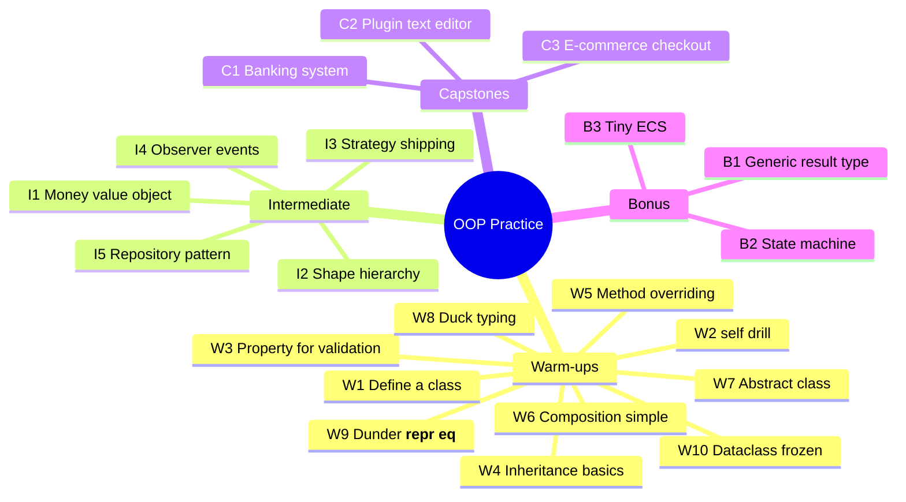

# Exercises & Capstone Projects — A Graded OOP Practice Track

> [!quote] "Practice isn't the thing you do once you're good. It's the thing you do that makes you good." — Malcolm Gladwell

This note provides a **graded practice track** for OOP mastery:

- **10 warm-up exercises** — single concept each, ~10–30 minutes.
- **5 intermediate exercises** — combine 2–3 concepts, ~1–2 hours.
- **3 capstone projects** — full systems, ~1–2 days each.
- **Bonus challenge problems** — for the daring.

Each exercise includes: **problem statement, learning objective, difficulty, hints (in callouts), and a self-assessment checklist**.

> [!tip] How to use this note
> Don't peek at hints until you've struggled for at least 15 minutes. The struggle *is* the learning. After completing, run through the self-assessment checklist honestly — false "✅" marks hurt only you.

See also: [[learning-path]], [[best-practices]], [[common-pitfalls-and-anti-patterns]], [[real-world-examples]].

---

## Roadmap Mind-Map



---

## Part 1 — Warm-Up Exercises (10)

> [!note] Format
> Each warm-up isolates **one** concept. Aim for 15–30 minutes each. Don't worry about elegance — worry about *getting it to work*.

---

### W1 — Define Your First Class

**Problem.** Create a `Book` class with `title`, `author`, and `year` attributes. Instantiate three books and print each.

**Learning objective.** Class declaration, `__init__`, instance attributes.

**Difficulty.** 🟢 Easy (5 min)

> [!example]- Hint
> ```python
> class Book:
>     def __init__(self, title: str, author: str, year: int) -> None:
>         self.title = title
>         self.author = author
>         self.year = year
>
> for b in [Book("1984", "Orwell", 1949),
>           Book("Dune", "Herbert", 1965),
>           Book("Hyperion", "Simmons", 1989)]:
>     print(b.title, b.author, b.year)
> ```

**Self-assessment checklist.**
- [ ] `__init__` takes `self` plus three parameters.
- [ ] I instantiated three distinct objects (different identities).
- [ ] I can change one book's title without affecting the others.

---

### W2 — The `self` Drill

**Problem.** Without using the word `self`, write a class `Counter` with `increment()` and `value()` methods. Use `me` (or `potato`) as the first parameter. Confirm it works. Then explain in one sentence why this is a bad idea.

**Learning objective.** Internalize that `self` is a parameter name, not a keyword. See [[common-misconceptions]] A2.

**Difficulty.** 🟢 Easy (10 min)

> [!example]- Hint
> ```python
> class Counter:
>     def __init__(me):
>         me._count = 0
>     def increment(me):
>         me._count += 1
>     def value(me):
>         return me._count
>
> c = Counter()
> c.increment()
> print(c.value())   # 1
> ```
> Why bad? Other Python developers won't recognize `me` as the receiver; conventions exist for readability.

**Self-assessment checklist.**
- [ ] The class works with a non-`self` name.
- [ ] I can explain *why* `self` is a convention, not a keyword.
- [ ] I promise never to do this in production code.

---

### W3 — A Property for Validation

**Problem.** Write a `Temperature` class that stores Celsius. The `celsius` attribute must reject values below `-273.15` (absolute zero). Add a derived `fahrenheit` property.

**Learning objective.** `@property` for validation and derivation. See [[best-practices]] §5.

**Difficulty.** 🟢 Easy (15 min)

> [!example]- Hint
> ```python
> class Temperature:
>     ABSOLUTE_ZERO_C = -273.15
>
>     def __init__(self, celsius: float) -> None:
>         self.celsius = celsius    # goes through the setter
>
>     @property
>     def celsius(self) -> float:
>         return self._celsius
>
>     @celsius.setter
>     def celsius(self, value: float) -> None:
>         if value < self.ABSOLUTE_ZERO_C:
>             raise ValueError(f"Below absolute zero: {value}")
>         self._celsius = value
>
>     @property
>     def fahrenheit(self) -> float:
>         return self._celsius * 9 / 5 + 32
> ```

**Self-assessment checklist.**
- [ ] `Temperature(-300)` raises `ValueError`.
- [ ] `t.celsius = 25` works (and `t.fahrenheit` updates).
- [ ] `t.fahrenheit = 100` fails (no setter — read-only derived).

---

### W4 — Basic Inheritance

**Problem.** Create `Animal` with a `speak()` method that returns `"..."`. Subclass `Dog` and `Cat` to override `speak()`. Write a function `chorus(animals)` that calls `speak()` on each and collects the results.

**Learning objective.** Single inheritance, method overriding, polymorphism via inheritance.

**Difficulty.** 🟢 Easy (15 min)

> [!example]- Hint
> ```python
> class Animal:
>     def speak(self) -> str: return "..."
>
> class Dog(Animal):
>     def speak(self) -> str: return "Woof"
>
> class Cat(Animal):
>     def speak(self) -> str: return "Meow"
>
> def chorus(animals: list[Animal]) -> list[str]:
>     return [a.speak() for a in animals]
> ```

**Self-assessment checklist.**
- [ ] `chorus([Dog(), Cat(), Animal()])` returns `["Woof", "Meow", "..."]`.
- [ ] `isinstance(Dog(), Animal)` is `True`.
- [ ] I did **not** use `isinstance` *inside* `chorus` — polymorphism handles it.

---

### W5 — Cooperative `super()`

**Problem.** Create a `Vehicle` base with `__init__(self, wheels)`. Subclass `Car(Vehicle)` that adds `doors`. Use `super().__init__(...)` to set `wheels`. Verify both attributes are set on a `Car` instance.

**Learning objective.** `super()` for cooperative construction.

**Difficulty.** 🟢 Easy (15 min)

> [!example]- Hint
> ```python
> class Vehicle:
>     def __init__(self, wheels: int) -> None:
>         self.wheels = wheels
>
> class Car(Vehicle):
>     def __init__(self, wheels: int, doors: int) -> None:
>         super().__init__(wheels)
>         self.doors = doors
>
> c = Car(4, 5)
> print(c.wheels, c.doors)   # 4 5
> ```

**Self-assessment checklist.**
- [ ] `Car` calls `super().__init__(...)` with the right args.
- [ ] `c.wheels` is set, even though `Car.__init__` doesn't directly assign it.
- [ ] I can extend to `Motorcycle(Vehicle)` similarly.

---

### W6 — Composition Over Inheritance

**Problem.** Model a `Car` that *has-a* `Engine`. The `Car.start()` method calls `engine.ignite()`. Don't use inheritance. Add two engine types (`V8`, `Electric`) — `Car` shouldn't care which it has.

**Learning objective.** Composition; polymorphism without inheritance. See [[best-practices]] §1.

**Difficulty.** 🟢 Easy (20 min)

> [!example]- Hint
> ```python
> from typing import Protocol
>
> class Engine(Protocol):
>     def ignite(self) -> str: ...
>
> class V8:
>     def ignite(self) -> str: return "VROOM"
>
> class Electric:
>     def ignite(self) -> str: return "(silence)"
>
> class Car:
>     def __init__(self, engine: Engine) -> None:
>         self.engine = engine
>     def start(self) -> str:
>         return self.engine.ignite()
>
> print(Car(V8()).start())        # VROOM
> print(Car(Electric()).start())  # (silence)
> ```

**Self-assessment checklist.**
- [ ] `Car` does not inherit from `Engine` or any engine type.
- [ ] Adding a new engine type requires no `Car` edits.
- [ ] I used a `Protocol` (or duck typing) — no `isinstance` checks.

---

### W7 — Abstract Base Class

**Problem.** Define an ABC `Shape` with abstract methods `area()` and `perimeter()`. Implement `Circle` and `Rectangle`. Verify that instantiating `Shape()` raises `TypeError`.

**Learning objective.** `abc.ABC`, `@abstractmethod`, enforcing contracts.

**Difficulty.** 🟢 Easy (20 min)

> [!example]- Hint
> ```python
> from abc import ABC, abstractmethod
> import math
>
> class Shape(ABC):
>     @abstractmethod
>     def area(self) -> float: ...
>     @abstractmethod
>     def perimeter(self) -> float: ...
>
> class Circle(Shape):
>     def __init__(self, r: float): self.r = r
>     def area(self) -> float: return math.pi * self.r ** 2
>     def perimeter(self) -> float: return 2 * math.pi * self.r
>
> class Rectangle(Shape):
>     def __init__(self, w: float, h: float): self.w, self.h = w, h
>     def area(self) -> float: return self.w * self.h
>     def perimeter(self) -> float: return 2 * (self.w + self.h)
> ```

**Self-assessment checklist.**
- [ ] `Shape()` raises `TypeError`.
- [ ] `Circle(2).area()` returns a positive float.
- [ ] A subclass missing one method also raises `TypeError` on instantiation.

---

### W8 — Duck Typing & Protocol

**Problem.** Define a `Protocol` named `Readable` with a `read(n: int) -> bytes` method. Write a function `consume(r: Readable)` that reads 100 bytes. Pass it a `BytesIO`, a custom file-like class, and verify both work — without inheritance.

**Learning objective.** Structural typing; `Protocol`; duck typing in practice.

**Difficulty.** 🟢 Easy (20 min)

> [!example]- Hint
> ```python
> from typing import Protocol
> from io import BytesIO
>
> class Readable(Protocol):
>     def read(self, n: int) -> bytes: ...
>
> def consume(r: Readable) -> bytes:
>     return r.read(100)
>
> class MyReader:
>     def __init__(self, data: bytes): self._data = data
>     def read(self, n: int) -> bytes: return self._data[:n]
>
> print(consume(BytesIO(b"x" * 200)))    # 100 bytes
> print(consume(MyReader(b"y" * 200)))   # 100 bytes
> ```

**Self-assessment checklist.**
- [ ] Neither `BytesIO` nor `MyReader` inherits from `Readable`.
- [ ] `mypy --strict` accepts both calls (structural conformance).
- [ ] I can swap implementations freely.

---

### W9 — Dunder Methods: `__repr__` and `__eq__`

**Problem.** Make a `Point` class where `repr(p)` shows `Point(x=1, y=2)`, `p1 == p2` compares by coordinates, and `Point` is usable in a `set` (hashable).

**Learning objective.** `__repr__`, `__eq__`, `__hash__`. See [[best-practices]] §6, [[dunder-methods]].

**Difficulty.** 🟡 Medium (20 min)

> [!example]- Hint
> ```python
> from dataclasses import dataclass
>
> @dataclass(frozen=True)
> class Point:
>     x: float
>     y: float
>
> # @dataclass auto-generates __repr__, __eq__, __hash__ (when frozen)
> p1 = Point(1, 2)
> p2 = Point(1, 2)
> print(repr(p1))      # Point(x=1, y=2)
> print(p1 == p2)      # True
> print({p1, p2})      # {Point(x=1, y=2)} — only one entry, hashable
> ```
> Try it without `@dataclass` first — write `__repr__`, `__eq__`, `__hash__` by hand. Then compare.

**Self-assessment checklist.**
- [ ] `repr` shows the constructor call form.
- [ ] Equality is by value, not identity.
- [ ] Hashability means usable in sets and dict keys.
- [ ] I understand *why* `__hash__` requires immutability.

---

### W10 — Frozen Dataclass as Value Object

**Problem.** Create a `Money` value object using `@dataclass(frozen=True)`. Validate that `amount >= 0` in `__post_init__`. Implement `add(Money) -> Money` returning a new instance. Confirm you can't mutate.

**Learning objective.** Frozen dataclasses, `__post_init__`, immutable value objects. See [[best-practices]] §4.

**Difficulty.** 🟡 Medium (20 min)

> [!example]- Hint
> ```python
> from dataclasses import dataclass
>
> @dataclass(frozen=True)
> class Money:
>     amount: float
>     currency: str = "USD"
>
>     def __post_init__(self) -> None:
>         if self.amount < 0:
>             raise ValueError("Money cannot be negative")
>         object.__setattr__(self, "amount", round(self.amount, 2))
>
>     def add(self, other: "Money") -> "Money":
>         if self.currency != other.currency:
>             raise ValueError("currency mismatch")
>         return Money(self.amount + other.amount, self.currency)
>
> m = Money(10.0)
> m2 = m.add(Money(5.0))
> print(m, m2)         # Money(amount=10.0) Money(amount=15.0)
> # m.amount = 999     # FrozenInstanceError
> ```

**Self-assessment checklist.**
- [ ] `Money(-1)` raises `ValueError`.
- [ ] `m.add(Money(5))` returns a *new* `Money`; `m` is unchanged.
- [ ] Mutating `m.amount` raises `FrozenInstanceError`.
- [ ] I understand why `object.__setattr__` is needed in `__post_init__`.

---

## Part 2 — Intermediate Exercises (5)

> [!note] Format
> Each combines 2–3 concepts. Expect 1–2 hours. Write tests with `pytest`.

---

### I1 — A Robust Money Type

**Problem.** Extend W10's `Money`:
- Use `Decimal` (not `float`) to avoid floating-point errors.
- Support `add`, `subtract`, `multiply(factor)`, `divide(factor)`.
- Currency mismatch raises `CurrencyMismatchError` (custom exception).
- Implement `__eq__`, `__hash__`, `__lt__`, `__repr__`, `__str__` (string should format like `"$10.00"`).
- Add classmethods `usd(amount)`, `eur(amount)` for ergonomics.

**Learning objective.** Value objects, `Decimal`, classmethods, dunder methods, custom exceptions.

**Difficulty.** 🟡 Medium (90 min)

> [!example]- Hint sketch
> ```python
> from decimal import Decimal
> from dataclasses import dataclass
>
> class CurrencyMismatchError(ValueError): pass
>
> @dataclass(frozen=True, order=True)
> class Money:
>     amount: Decimal
>     currency: str = "USD"
>
>     def __post_init__(self) -> None:
>         object.__setattr__(self, "amount", Decimal(self.amount).quantize(Decimal("0.01")))
>
>     @classmethod
>     def usd(cls, amount) -> "Money":
>         return cls(Decimal(amount), "USD")
>
>     @classmethod
>     def eur(cls, amount) -> "Money":
>         return cls(Decimal(amount), "EUR")
>
>     def _check(self, other: "Money") -> None:
>         if self.currency != other.currency:
>             raise CurrencyMismatchError(f"{self.currency} vs {other.currency}")
>
>     def add(self, other: "Money") -> "Money":
>         self._check(other)
>         return Money(self.amount + other.amount, self.currency)
>
>     def __str__(self) -> str:
>         symbol = {"USD": "$", "EUR": "€"}.get(self.currency, "")
>         return f"{symbol}{self.amount}"
> ```

**Self-assessment checklist.**
- [ ] `Money.usd("0.1").add(Money.usd("0.2"))` equals `Money.usd("0.3")` exactly (no float drift).
- [ ] `Money.usd(10) < Money.usd(20)` is `True`.
- [ ] `Money.usd(10) == Money.eur(10)` is `False` (different currency).
- [ ] `str(Money.usd(10))` prints `$10.00`.
- [ ] pytest tests cover: validation, arithmetic, currency mismatch, ordering, formatting.

---

### I2 — Shape Hierarchy with Strategy

**Problem.** Build a `Shape` hierarchy (`Circle`, `Rectangle`, `Triangle`). Add a `AreaCalculator` that takes a `Strategy` (e.g., `NaiveStrategy`, `CachedStrategy`). The calculator computes total area using the strategy. Strategies are objects, not methods.

**Learning objective.** Inheritance + Strategy pattern + polymorphism.

**Difficulty.** 🟡 Medium (90 min)

> [!example]- Hint sketch
> ```python
> from abc import ABC, abstractmethod
> from typing import Protocol
>
> class Shape(ABC):
>     @abstractmethod
>     def area(self) -> float: ...
>
> class Circle(Shape):
>     def __init__(self, r: float): self.r = r
>     def area(self) -> float: return 3.14159 * self.r ** 2
>
> # ... Rectangle, Triangle
>
> class AreaStrategy(Protocol):
>     def compute(self, shapes: list[Shape]) -> float: ...
>
> class NaiveStrategy:
>     def compute(self, shapes: list[Shape]) -> float:
>         return sum(s.area() for s in shapes)
>
> class CachedStrategy:
>     def __init__(self): self._cache: dict[int, float] = {}
>     def compute(self, shapes: list[Shape]) -> float:
>         total = 0.0
>         for s in shapes:
>             key = id(s)
>             if key not in self._cache:
>                 self._cache[key] = s.area()
>             total += self._cache[key]
>         return total
>
> class AreaCalculator:
>     def __init__(self, strategy: AreaStrategy): self._strategy = strategy
>     def total(self, shapes: list[Shape]) -> float:
>         return self._strategy.compute(shapes)
> ```

**Self-assessment checklist.**
- [ ] Adding `Hexagon(Shape)` doesn't require editing `AreaCalculator`.
- [ ] Adding `ParallelStrategy` doesn't require editing `Shape` subclasses.
- [ ] Both strategies conform to the same `Protocol`.
- [ ] I can swap strategies at runtime.

---

### I3 — Shipping Cost Calculator (Strategy)

**Problem.** Build a `Cart` (list of items with weights). Implement three `ShippingStrategy` implementations: `Standard`, `Express`, `FreeOver(Money threshold)`. The cart's `shipping_cost()` accepts a strategy. Add a factory `make_strategy(name: str)` that returns the right one.

**Learning objective.** Strategy, Factory, dependency injection.

**Difficulty.** 🟡 Medium (60 min)

> [!example]- Hint
> See [[real-world-examples]] Project 2's `PricingRule` for the structure. Mirror it for shipping.

**Self-assessment checklist.**
- [ ] `Cart` has no `if/elif` on strategy name — strategy objects do the work.
- [ ] `make_strategy("express")` returns an `Express` instance.
- [ ] Unknown strategy name raises a clear error.
- [ ] I can add a `DroneStrategy` without touching `Cart`.

---

### I4 — Event System (Observer)

**Problem.** Build an `EventBus` with `subscribe(event_type, handler)` and `publish(event, payload)`. Use it in a small app: a `UserCreated` event triggers both an `EmailNotifier` and an `AnalyticsSink`. Subscribers are decoupled — they don't know about each other.

**Learning objective.** Observer pattern, decoupling, callback registration.

**Difficulty.** 🟡 Medium (60 min)

> [!example]- Hint
> ```python
> from collections import defaultdict
> from typing import Callable
>
> class EventBus:
>     def __init__(self):
>         self._handlers: dict[str, list[Callable]] = defaultdict(list)
>
>     def subscribe(self, event_type: str, handler: Callable) -> None:
>         self._handlers[event_type].append(handler)
>
>     def publish(self, event_type: str, payload) -> None:
>         for h in self._handlers.get(event_type, []):
>             h(payload)
>
> bus = EventBus()
> bus.subscribe("user_created", lambda u: print(f"emailing {u}"))
> bus.subscribe("user_created", lambda u: print(f"analytics: {u}"))
> bus.publish("user_created", "ada@example.com")
> ```

**Self-assessment checklist.**
- [ ] Adding a third subscriber requires no code changes to existing ones.
- [ ] Handlers can raise exceptions without crashing the bus (consider try/except).
- [ ] I can unsubscribe (bonus).
- [ ] The `EventBus` has no knowledge of `EmailNotifier` or `AnalyticsSink`.

---

### I5 — Repository Pattern with In-Memory and File Backends

**Problem.** Define a `UserRepository` Protocol with `get`, `save`, `delete`. Implement `InMemoryUserRepository` and `JsonFileUserRepository`. A `UserService` takes any `UserRepository` and provides `register`, `find_by_email`. Write tests with the in-memory repo; run the same tests against the JSON repo.

**Learning objective.** Repository pattern, Protocol-based dependency injection, testability.

**Difficulty.** 🟡 Medium (90 min)

> [!example]- Hint sketch
> ```python
> from typing import Protocol
> from pathlib import Path
> import json
>
> @dataclass(frozen=True)
> class User:
>     id: str
>     name: str
>     email: str
>
> class UserRepository(Protocol):
>     def get(self, id: str) -> User | None: ...
>     def save(self, user: User) -> None: ...
>     def delete(self, id: str) -> None: ...
>
> class InMemoryUserRepository:
>     def __init__(self): self._data: dict[str, User] = {}
>     def get(self, id): return self._data.get(id)
>     def save(self, u): self._data[u.id] = u
>     def delete(self, id): self._data.pop(id, None)
>
> class JsonFileUserRepository:
>     def __init__(self, path: Path): self.path = path
>     def _load(self) -> dict: ...
>     def _save(self, data: dict) -> None: ...
>     # implements get/save/delete via JSON
>
> class UserService:
>     def __init__(self, repo: UserRepository): self._repo = repo
>     def register(self, name: str, email: str) -> User:
>         u = User(id=str(uuid4()), name=name, email=email)
>         self._repo.save(u)
>         return u
>     def find_by_email(self, email: str) -> User | None:
>         # iterate or extend the protocol
>         ...
> ```

**Self-assessment checklist.**
- [ ] `UserService` has no `import` of any specific repo class.
- [ ] Same test suite passes for both repos.
- [ ] Adding a `SqliteUserRepository` requires no `UserService` edits.
- [ ] I can mock/fake the repo in tests trivially.

---

## Part 3 — Capstone Projects (3)

> [!note] Format
> Each capstone is a complete system. Expect 1–2 days. Write a `README.md`, type hints, docstrings, and a `pytest` suite. Push to a Git repo.

---

### C1 — Mini Banking System

**Problem statement.** Build a banking core supporting:
- Multiple account types: `CheckingAccount` (overdraft + per-transaction fee), `SavingsAccount` (no overdraft, earns interest), `MoneyMarketAccount` (tiered interest, minimum balance).
- Transactions: deposit, withdraw, transfer between accounts.
- Interest accrual with **pluggable policies** (`FlatRate`, `TieredRate`, `ZeroRate`).
- An **audit log** of every transaction.
- A **statement generator** that prints a human-readable statement for any account.
- An in-memory repository; design so a SQL repo could be added later.
- A simple CLI: `bank create alice savings`, `bank deposit <id> 100`, `bank statement <id>`.

**Learning objective.** Encapsulation, Strategy, Observer, Repository, Factory, value objects, immutability.

**Difficulty.** 🔴 Hard (1–2 days)

**Hints.**

> [!example]- Hint: design skeleton
> Re-read [[real-world-examples]] Project 1 — it provides ~70% of the design. Extend with:
> - `MoneyMarketAccount` (new subtype + new interest policy).
> - `StatementGenerator` (new service that reads from `AuditLog`).
> - `BankCli` (entry point; uses `argparse`).
> - `AccountRepository` Protocol with `InMemoryAccountRepository`.

**Rubric (100 pts).**
| Criterion | Points |
|---|---|
| All three account types work correctly | 15 |
| Invariants enforced (no negative savings, overdraft limit respected) | 15 |
| Strategy pattern for interest (swappable, tested) | 10 |
| Audit log records every transaction | 10 |
| Statement generator produces correct output | 10 |
| Repository pattern — in-memory + Protocol for future SQL | 10 |
| Tests (unit + integration, ≥ 20 tests) | 10 |
| Type hints + `mypy --strict` passes | 5 |
| Docstrings on all public classes/methods | 5 |
| CLI works end-to-end | 5 |
| README with usage examples | 5 |

**Self-assessment checklist.**
- [ ] I can add a `CreditLineAccount` without modifying `Account`, `AuditLog`, or `TransferService`.
- [ ] All account invariants are enforced *inside* the class — no external validation.
- [ ] `Money` is a frozen value object; no `float` arithmetic for amounts.
- [ ] The CLI works end-to-end; the same `BankService` is reused by tests.
- [ ] Tests run in < 1 second; no real I/O.

---

### C2 — Plugin-Based Text Editor

**Problem statement.** Build a tiny terminal text editor with:
- A `Document` model (text + cursor).
- `Command` pattern: every action is an object with `execute` and `undo`.
- Built-in commands: `InsertCommand`, `DeleteCommand`, `ReplaceCommand`.
- A `PluginRegistry` that lets third-party code register new commands.
- At least two plugins: `MarkdownPlugin` (insert bold/italic/headings), `StatsPlugin` (word count, char count).
- **Macros**: record a sequence of commands, replay by name.
- **Keyboard shortcuts**: bind shortcuts to commands.
- An undo stack and a redo stack.
- A simple REPL: `> insert Hello`, `> delete 2`, `> undo`, `> show`.

**Learning objective.** Command pattern, Composite (macros), Registry, Plugin architecture, Abstract Factory (EditorContext), undo/redo.

**Difficulty.** 🔴 Hard (1–2 days)

**Hints.**

> [!example]- Hint: design skeleton
> Re-read [[real-world-examples]] Project 3. It provides the full skeleton. Extend with:
> - `RedoStack` (mirror of undo).
> - `StatsPlugin` (registers `count_words`, `count_chars` commands).
> - `MacroManager` (records, plays, lists macros).
> - A REPL using `cmd.Cmd` from stdlib.

**Rubric (100 pts).**
| Criterion | Points |
|---|---|
| All built-in commands work; undo/redo correct | 20 |
| Plugin registry: at least 2 plugins, both functional | 15 |
| Macros record and replay correctly | 15 |
| Keyboard shortcut binding works | 10 |
| EditorContext isolates plugins from Editor internals | 10 |
| Tests (≥ 15 tests, covering commands, undo/redo, macros) | 10 |
| Type hints + `mypy --strict` passes | 5 |
| Docstrings on all public classes/methods | 5 |
| REPL works end-to-end | 5 |
| README with usage | 5 |

**Self-assessment checklist.**
- [ ] Adding a new plugin requires **zero** edits to `Editor`.
- [ ] Undoing a macro undoes all its commands in reverse order.
- [ ] Redo replays commands correctly after an undo.
- [ ] Plugins receive only an `EditorContext`, never the `Editor` itself.
- [ ] Tests don't require interactive input.

---

### C3 — E-Commerce Checkout

**Problem statement.** Build a checkout system with:
- A `Cart` (products + quantities).
- At least 5 `PricingRule` strategies: `PercentageDiscount`, `FixedAmountOff`, `BuyNGetOneFree`, `BundleDiscount`, `FreeShippingThreshold`.
- A `CompositeDiscount` to combine rules.
- At least 3 `PaymentProcessor` implementations: `CardProcessor`, `WalletProcessor`, `CryptoProcessor` (mocked; no real network).
- A `PaymentProcessorFactory` that builds processors from config dicts.
- An `Order` entity with status (`pending`, `paid`, `shipped`, `cancelled`).
- An observer system: at least 3 observers (`EmailNotifier`, `SmsNotifier`, `AnalyticsSink`).
- A `Checkout` service that orchestrates everything.
- A CLI: `cart add <product> <qty>`, `cart apply <rule>`, `cart checkout --method card --email a@b.com`.

**Learning objective.** Strategy, Composite, Factory, Observer, Repository, value objects, Open/Closed.

**Difficulty.** 🔴 Hard (1–2 days)

**Hints.**

> [!example]- Hint: design skeleton
> Re-read [[real-world-examples]] Project 2. Extend with:
> - More pricing rules (5+).
> - An `OrderRepository` Protocol.
> - Order state transitions with validation (`Order.mark_shipped()` etc.).
> - A `CouponCode` value object — rules can be tied to codes.

**Rubric (100 pts).**
| Criterion | Points |
|---|---|
| All 5+ pricing rules work; combinations correct | 20 |
| `CompositeDiscount` composes rules correctly | 10 |
| 3+ payment processors via factory | 10 |
| Observer system: 3+ observers, decoupled | 10 |
| Order state machine with validated transitions | 15 |
| CLI works end-to-end | 10 |
| Tests (≥ 25 tests) | 10 |
| Type hints + `mypy --strict` passes | 5 |
| Docstrings | 5 |
| README with usage and architecture overview | 5 |

**Self-assessment checklist.**
- [ ] Adding a 6th pricing rule = adding a class, nothing else changes.
- [ ] Adding a 4th payment processor = adding a class + factory entry.
- [ ] Adding a 4th observer = adding a class.
- [ ] `Order` invariants are enforced (e.g., can't ship an unpaid order).
- [ ] Tests cover: each rule, combinations, state transitions, observer firing, factory errors.

---

## Part 4 — Bonus Challenge Problems

For students who finish early and want to stretch.

### B1 — A Generic `Result[T, E]` Type

**Problem.** Implement a `Result[T, E]` type (Rust-style) with `Ok(value)` and `Err(error)` variants. Implement `is_ok()`, `is_err()`, `unwrap()`, `unwrap_or(default)`, `map(fn)`, `and_then(fn)` (flatmap). Use it in a small parser: `parse_int("42")` returns `Ok(42)`, `parse_int("abc")` returns `Err(ParseError)`.

**Learning objective.** Sum types in Python, generics, functional error handling.

**Difficulty.** 🔴 Hard (2–3 hours)

> [!example]- Hint
> Use `@dataclass(frozen=True)` + `Generic[T, E]`. Two subclasses: `Ok` and `Err`. `map` and `and_then` return new `Result` instances. The "Rust-style" alternative to exceptions for predictable errors.

---

### B2 — A State Machine Framework

**Problem.** Build a tiny state machine framework: `StateMachine` with states, transitions, and guards. Define a state machine for an order lifecycle (`draft → paid → shipped → delivered`, with `cancelled` reachable from any state). Transitions can have guards (`lambda order: order.total > 0`) and actions (`lambda order: send_email(order)`).

**Learning objective.** State pattern, decorators/descriptors, metaprogramming-lite.

**Difficulty.** 🔴 Hard (2–3 hours)

> [!example]- Hint sketch
> ```python
> class StateMachine:
>     def __init__(self, initial: str):
>         self._state = initial
>         self._transitions: dict[tuple[str, str], list[Callable]] = {}
>         self._guards: dict[tuple[str, str], list[Callable]] = {}
>
>     def transition(self, from_: str, to: str, guard=None, action=None):
>         # decorator or registration method
>         ...
>
>     def fire(self, event: str, ctx) -> None:
>         key = (self._state, event)
>         if key not in self._transitions:
>             raise InvalidTransition(...)
>         for g in self._guards.get(key, []):
>             if not g(ctx):
>                 raise GuardFailed(...)
>         for a in self._transitions[key]:
>             a(ctx)
>         # update state
> ```

---

### B3 — A Tiny Entity-Component-System

**Problem.** Build a minimal ECS (Entity-Component-System) framework:
- `Entity` is an ID + a dict of components.
- `Component` is a dataclass.
- `System` is a class with `update(entities, dt)`.
- A `World` holds entities and systems; `world.tick(dt)` runs all systems.
- Implement a small demo: 100 entities with `Position` and `Velocity`; a `MovementSystem` updates positions; a `RenderSystem` prints.

**Learning objective.** ECS architecture, composition extreme, data-oriented design.

**Difficulty.** 🔴 Hard (3–4 hours)

> [!example]- Hint
> Re-read [[real-world-examples]] Project 4. Then generalize: instead of hardcoded systems, allow registering systems via `world.add_system(MovementSystem())`. Components are auto-discovered via `dataclass` fields.

---

## Grading & Self-Evaluation Tips

> [!tip] Be honest with self-assessment
> The checklists above are *for you*. Checking boxes you didn't actually meet is the worst form of self-sabotage. If you can't tick a box, that's information — go back and learn the gap.

**A simple leveling rubric:**

| Level | What you can do |
|---|---|
| 🟢 **Apprentice** (after warm-ups) | Define a class, use `__init__`, `@property`, basic inheritance, basic composition. |
| 🟡 **Journeyman** (after intermediates) | Strategy, Observer, Repository, Protocol-based DI, frozen dataclasses, pytest with fakes. |
| 🔴 **Craftsman** (after a capstone) | Compose multiple patterns in a real system, write tests first, type-annotate rigorously, refactor smells on sight. |
| ⭐ **Master** (after bonus problems) | Build frameworks (ECS, state machines, result types), reason about metaprogramming trade-offs, teach OOP to others. |

> [!quote] "To know what you know and what you do not know, that is true knowledge." — Confucius

---

## How to Get the Most Out of These Exercises

1. **Time-box yourself.** Set a timer. Stop when it goes off, even mid-thought. Review what blocked you.
2. **Write tests first** (TDD lite). For each exercise, write one test before the implementation. It clarifies the API.
3. **Use Git.** Commit after each exercise. The commit history is a record of your learning.
4. **Read others' solutions.** After finishing, find a friend or a forum. Compare approaches. You'll learn as much from the comparison as from the exercise.
5. **Refactor after finishing.** Once it works, ask: what's the worst smell? Fix it. Then ask again. Stop when you can't find a smell — that's a sign of mastery.
6. **Revisit exercises after a month.** You'll write the same problem differently. The delta is your growth.

---

## Key Takeaways

1. **Practice is the curriculum.** Reading about OOP is necessary; *writing* OOP is sufficient. Do all 18 exercises.
2. **Isolate one concept per warm-up.** Mastery is built one brick at a time.
3. **Intermediates force integration.** Strategy + Observer + DI in one exercise reveals how patterns compose.
4. **Capstones reveal what you don't know.** A full system surfaces gaps single-concept exercises can hide.
5. **Bonus problems build taste.** Building a framework (state machine, ECS, Result type) teaches design at a level exercises cannot.
6. **Self-assessment honesty matters.** The checklists are for you. Use them truthfully.
7. **TDD + Git + Refactor.** These three habits, applied to every exercise, will make you a better Python OOP practitioner than any course.
8. **Teach what you learn.** The final step of mastery is explaining it. Pair with a junior; write a blog post; contribute to [[learning-path]].

---

**Back to:** [[learning-path]] | [[best-practices]] | [[real-world-examples]] | [[common-pitfalls-and-anti-patterns]]
