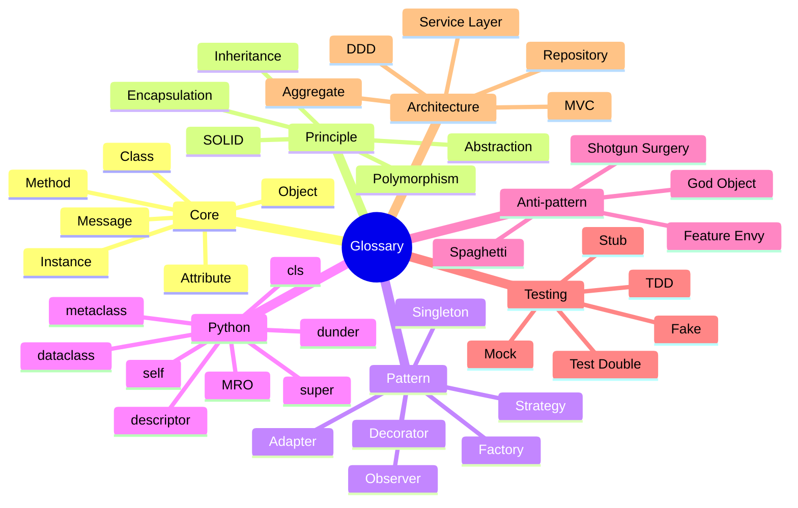

# Glossary — OOP Terms, A to Z

#oop #resources #glossary #vocabulary #reference #teaching #deep-dive

> [!info] How to use this glossary
> Terms are listed **alphabetically**. Each entry has a one-paragraph definition, a category tag, and a wikilink to the deeper note where the term is explained in context. Use `Ctrl+F` to jump to a term. Categories are: **[core]**, **[principle]**, **[pattern]**, **[python]**, **[anti-pattern]**, **[testing]**, **[architecture]**.

---

## 0. Category Mindmap

---

## 1. A

### Abstract Base Class (ABC) `[python]` `[core]`
A class that cannot be instantiated and that may declare one or more `@abstractmethod`s. Subclasses must implement every abstract method before they can be instantiated. Python's `abc` module provides the `ABC` base and the `@abstractmethod` decorator. See [[Abstract-Base-Classes]].

### Abstract Method `[core]`
A method declared in a base class with no implementation, intended to be overridden by subclasses. In Python, decorated with `@abstractmethod`. Abstract methods define a *contract*, not a *behavior*. See [[Abstraction]], [[Abstract-Base-Classes]].

### Abstraction `[principle]`
The fourth pillar of OOP. Abstraction is the act of exposing *what* an object does while hiding *how* it does it. Achieved through abstract classes, interfaces, and well-designed APIs. Distinct from but symbiotic with [[Encapsulation]]. See [[Abstraction]].

### Access Modifier `[core]`
A language feature (or convention, in Python) controlling what code can read or write an attribute or call a method. Python uses `_single_underscore` (convention: "internal") and `__double_underscore` (name mangling) but has no real `private`/`protected`/`public` keywords. See [[Encapsulation]], [[Attributes-And-Properties]].

### Adapter Pattern `[pattern]`
A structural pattern that converts one interface into another, expected by client code. Lets classes work together that otherwise could not because of incompatible interfaces. See [[Structural-Patterns]].

### Aggregation `[core]`
A "has-a" relationship where the parts can outlive the whole. A `Library` aggregates `Books`, but a book can exist without the library. Weaker than [[Composition]]. See [[Composition-Over-Inheritance]].

### Association `[core]`
A general relationship between two classes — one uses, knows about, or interacts with the other. Aggregation and composition are specific kinds of association. See [[Composition-Over-Inheritance]].

### Attribute `[core]`
A named piece of data stored on an object (instance attribute) or class (class attribute). Also called a *field* in some languages. Python exposes attribute access via `obj.name`; `@property` turns an attribute access into a method call. See [[Attributes-And-Properties]].

---

## 2. B

### Base Class `[core]`
A class that another class inherits from. Also called a *superclass* or *parent*. The inheriting class is the *subclass* or *child*. See [[Inheritance]].

### Behavior `[core]`
What an object *does* — its methods. Paired with *state* (what an object *knows*). The state+behavior bundle is the core of the classical OOP definition. See [[What-Is-OOP]], [[Methods-And-Functions]].

### Behavioral Pattern `[pattern]`
A GoF category of patterns concerned with *how objects communicate and assign responsibility*. Examples: Strategy, Observer, Command, State, Template Method, Iterator. See [[Behavioral-Patterns]].

### Bridge Pattern `[pattern]`
A structural pattern that decouples an abstraction from its implementation so the two can vary independently. Useful for cross-cutting concerns (e.g. shape × color). See [[Structural-Patterns]].

### Builder Pattern `[pattern]`
A creational pattern that separates the construction of a complex object from its representation. Lets you build an object step by step with optional parameters, instead of a constructor with 12 arguments. See [[Creational-Patterns]].

---

## 3. C

### Class `[core]`
A blueprint or template for creating objects. Defines the attributes and methods that all instances of the class share. In Python, classes are themselves objects (instances of `type` or another metaclass). See [[Classes-And-Objects]].

### Class Diagram `[architecture]`
A UML diagram showing classes, their attributes and methods, and their relationships (inheritance, association, aggregation, composition). The most-used UML diagram. Used throughout this vault.

### Class Method `[python]` `[core]`
A method that receives the *class* as its first argument (conventionally `cls`) rather than an instance. Decorated with `@classmethod`. Common uses: alternative constructors, factory methods. See [[Methods-And-Functions]], [[Self-And-Cls]].

### Class Variable `[core]`
An attribute defined on the class itself, shared by all instances. Changes via `ClassName.attr` affect all instances; changes via `instance.attr` shadow the class variable for that instance only. See [[Classes-And-Objects]], [[Attributes-And-Properties]].

### Cohesion `[principle]`
A measure of how closely the responsibilities of a single class or module are related. High cohesion = a class does one thing well. The driving force behind [[Single-Responsibility]]. See [[Single-Responsibility]].

### Command Pattern `[pattern]`
A behavioral pattern that wraps a request as an object, letting you parameterize clients with different requests, queue them, log them, or support undoable operations. See [[Behavioral-Patterns]].

### Composition `[core]`
A "has-a" relationship where the parts cannot exist without the whole. A `House` is composed of `Rooms`; destroy the house and the rooms are gone. Stronger than [[Aggregation]]. Favored by modern OOP over [[Inheritance]]. See [[Composition-Over-Inheritance]].

### Composition Over Inheritance `[principle]`
The GoF's second principle: *favor object composition over class inheritance*. Composition is more flexible, easier to test, and avoids the rigidity of deep class hierarchies. See [[Composition-Over-Inheritance]].

### Constructor `[core]`
The special method that initialises a newly-created instance. In Python this is `__init__`; the underlying object *creation* is `__new__`. The two-step model is subtle — see [[Constructors-And-Destructors]].

### Coupling `[principle]`
A measure of how much one class knows about another. Tight coupling means changes to one class force changes to the other. Low coupling is a design goal; achieved via abstractions (see [[Dependency-Inversion]]). See [[Dependency-Inversion]], [[Hexagonal-Architecture]].

### Creational Pattern `[pattern]`
A GoF category of patterns concerned with *object creation*. Examples: Singleton, Factory Method, Abstract Factory, Builder, Prototype. See [[Creational-Patterns]].

---

## 4. D

### Data Class `[python]`
A class primarily meant to hold data, with auto-generated `__init__`, `__repr__`, `__eq__`, etc. Python's `@dataclass` decorator (3.7+) is the canonical implementation. See [[Dataclasses]].

### Data Hiding `[core]`
See [[Encapsulation]] and [[Access Modifier]]. The principle that an object's internal state should not be directly accessible from outside. Python achieves this by convention (`_`) and by name mangling (`__`).

### Decorator (Pattern) `[pattern]`
A structural pattern that attaches additional responsibilities to an object dynamically, without subclassing. Decorators wrap their target and forward calls, adding behavior before or after. Distinct from Python's `@decorator` syntax. See [[Structural-Patterns]].

### Decorator (Python) `[python]`
A syntax (`@name`) for wrapping a function or class with another callable. Function decorators: `@property`, `@classmethod`, `@staticmethod`, `@functools.wraps`. Class decorators: `@dataclass`. See [[Magic-Methods]], [[Dataclasses]].

### Dependency Injection `[architecture]` `[principle]`
A technique where an object receives its dependencies from the outside rather than creating them itself. The basis of [[Dependency-Inversion]] and of frameworks like Spring. See [[Dependency-Inversion]], [[Service-Layer]].

### Dependency Inversion `[principle]`
The D in SOLID. *Depend on abstractions, not concretions.* High-level modules should not import low-level modules; both should depend on abstractions. See [[Dependency-Inversion]].

### Descriptor `[python]`
An object that implements `__get__`, `__set__`, or `__delete__`. When a descriptor is a class attribute, attribute access on instances is intercepted by the descriptor. The mechanism behind `@property`, `@classmethod`, `@staticmethod`, and ORM fields. See [[Descriptors]].

### Design Pattern `[pattern]`
A named, reusable solution to a recurring design problem. The GoF catalogue (1994) is the canonical source. Patterns are *vocabulary*, not recipes. See [[Creational-Patterns]], [[Structural-Patterns]], [[Behavioral-Patterns]].

### Destructor `[core]`
A method called when an object is about to be destroyed. In Python this is `__del__`, which is *unreliable* (cycles, shutdown, exceptions, resurrection). Use context managers (`__enter__`/`__exit__`) instead for cleanup. See [[Constructors-And-Destructors]].

### Diamond Problem `[python]` `[core]`
A multiple-inheritance ambiguity: class `D` inherits from `B` and `C`, both of which inherit from `A`. Which `A` is `D`'s "real" grandparent? Python solves this with the C3 linearisation (MRO). See [[Mixins-And-Multiple-Inheritance]], [[Inheritance]].

### Dispatch `[core]`
The mechanism by which a method call is resolved to a specific implementation. *Dynamic dispatch* (runtime) is what makes polymorphism work. *Static dispatch* (compile-time) is what method overloading uses in C++/Java. See [[Polymorphism]], [[How-OOP-Works]].

### Duck Typing `[python]` `[core]`
"If it walks like a duck and quacks like a duck, it's a duck." Python's structural approach to type compatibility: an object's suitability is determined by its methods and properties, not by its class. See [[Polymorphism]], [[Interfaces-And-Protocols]].

### Dunder Method `[python]`
A "double underscore" method like `__init__`, `__repr__`, `__len__`. Also called *magic methods* or *special methods*. They implement the Python data model. See [[Magic-Methods]].

### Dynamic Binding `[core]`
See [[Dispatch]] and [[Polymorphism]]. The runtime decision of which method implementation to call, based on the actual type of the receiver.

---

## 5. E

### Encapsulation `[principle]`
The first pillar of OOP. The bundling of state and behavior into a single unit (the object), with controlled access to the state. Often conflated with *information hiding*, but distinct: encapsulation is the *bundling*, information hiding is the *access control*. See [[Encapsulation]].

### Entity `[architecture]`
In DDD, an object defined primarily by its identity (not its attributes). Two `Customer` entities with the same name but different IDs are different customers. Contrasted with [[Value Object]]. See [[Domain-Driven-Design]].

### Event-Driven Architecture `[architecture]`
A system design in which components communicate by emitting and consuming events. Often implemented with the [[Observer Pattern]] or message queues. See [[Hexagonal-Architecture]], [[Service-Layer]].

### Exemplar `[core]`
In prototype-based OOP (JavaScript, Self), the *exemplar* is the object that new objects inherit from. Roughly analogous to a class in class-based OOP. See [[OOP-Paradigms]].

---

## 6. F

### Facade Pattern `[pattern]`
A structural pattern that provides a simplified interface to a complex subsystem. Lets you hide internal complexity behind a clean API. See [[Structural-Patterns]].

### Factory Method `[pattern]`
A creational pattern that defines an interface for creating an object but lets subclasses decide which class to instantiate. See [[Creational-Patterns]].

### Fake `[testing]`
A test double that has a working implementation, but simplified (e.g. an in-memory database instead of a real one). See [[Mocking-And-Stubs]].

### Feature Envy `[anti-pattern]`
A code smell: a method that seems more interested in another class than its own. Often a sign the method belongs on the other class. See [[Code-Smells]], [[Refactoring-Strategies]].

### Flyweight Pattern `[pattern]`
A structural pattern that shares fine-grained objects efficiently. Used when many similar objects would otherwise consume too much memory. Python's string interning is a built-in flyweight. See [[Structural-Patterns]], [[Object-Lifecycle]].

---

## 7. G

### Generics `[python]` `[core]`
Parametric types: code that operates on values of any type, with the type captured as a parameter. Python supports generics via `TypeVar` and `Generic` (PEP 484). See [[Generics-In-OOP]], [[Type-Hints-And-OOP]].

### God Object `[anti-pattern]`
A class that knows too much or does too much. Violates [[Single-Responsibility]] dramatically. The most common OOP anti-pattern. See [[God-Object]], [[Refactoring-Strategies]].

### GoF `[pattern]`
The "Gang of Four" — Gamma, Helm, Johnson, Vlissides, authors of *Design Patterns* (1994). The book catalogued 23 patterns and gave the industry its shared vocabulary. See [[Creational-Patterns]], [[Books-And-Courses]].

---

## 8. H

### Has-a `[core]`
A relationship where one class contains another as a component. Implemented via composition or aggregation. Contrast with *is-a* (inheritance). See [[Composition-Over-Inheritance]].

### Hexagonal Architecture `[architecture]`
a.k.a. *Ports and Adapters*. An architectural pattern where the application core communicates with the outside world only through well-defined *ports*, and external systems are *adapters*. The application knows nothing about delivery or infrastructure. See [[Hexagonal-Architecture]].

---

## 9. I

### Identity `[core]`
The property of being *this* object, distinct from any other, even if all attributes are equal. Python exposes identity via `id()` and the `is` operator. See [[Classes-And-Objects]], [[Object-Lifecycle]].

### Information Hiding `[principle]`
The practice of hiding implementation details behind an interface. Coined by David Parnas (1972). Closely related to [[Encapsulation]] but technically distinct. See [[Encapsulation]].

### Inheritance `[principle]`
The second pillar of OOP. A mechanism by which a class (the subclass) reuses, extends, or modifies the behavior of another class (the superclass). Powerful and overused — see [[Composition-Over-Inheritance]]. See [[Inheritance]].

### Initialiser `[python]` `[core]`
Python's `__init__` method. Strictly speaking, not a *constructor* — `__new__` constructs the object; `__init__` initialises it. See [[Constructors-And-Destructors]].

### Instance `[core]`
A specific object created from a class. Each instance has its own state but shares the class's behavior. See [[Classes-And-Objects]].

### Instance Method `[core]`
A method that operates on an instance and receives the instance as its first argument (conventionally `self`). The most common kind of method. See [[Methods-And-Functions]], [[Self-And-Cls]].

### Instance Variable `[core]`
An attribute stored on a specific instance, distinct from class variables which are shared. See [[Attributes-And-Properties]], [[Classes-And-Objects]].

### Instantiation `[core]`
The act of creating an instance from a class. In Python, this is the call `ClassName(args)`, which triggers `type.__call__` → `__new__` → `__init__`. See [[Constructors-And-Destructors]].

### Interface `[core]`
A contract that a class can promise to fulfil, listing method signatures without implementations. Python has no `interface` keyword; uses `abc.ABC`, `typing.Protocol`, or duck typing. See [[Interfaces-And-Protocols]], [[Abstract-Base-Classes]].

### Interface Segregation `[principle]`
The I in SOLID. *No client should be forced to depend on methods it does not use.* Fat interfaces should be split into smaller, focused ones. See [[Interface-Segregation]].

### Inversion of Control `[architecture]` `[principle]`
A design principle in which custom code calls reusable code, rather than the other way around. Frameworks invert control; libraries do not. The mechanism behind [[Dependency Injection]] and the Hollywood Principle. See [[Dependency-Inversion]].

### Is-a `[core]`
A relationship where one class is a specialisation of another. Implemented via inheritance. *Square is-a Rectangle* is the classical (broken) example — see [[Liskov-Substitution]]. See [[Inheritance]].

### Iterator Pattern `[pattern]`
A behavioral pattern that sequentially accesses the elements of a collection without exposing its underlying representation. Python bakes this in via `__iter__` and `__next__`. See [[Behavioral-Patterns]], [[Magic-Methods]].

---

## 10. J–K

### Journey `[architecture]`
A user-experience narrative through a system. Sometimes drawn as a Mermaid `journey` diagram (see any real-world example note).

### KISS `[principle]`
"Keep It Simple, Stupid." A principle older than OOP itself, often invoked to push back against premature abstraction. See [[When-Not-To-Use-OOP]].

---

## 11. L

### Law of Demeter `[principle]`
"Don't talk to strangers." A method should only call methods on: itself, its parameters, its own attributes, and objects it creates. Long chains like `a.b().c().d()` violate it. See [[Encapsulation]], [[Code-Smells]].

### Liskov Substitution `[principle]`
The L in SOLID. *Subtypes must be substitutable for their base types without breaking the program.* The strongest of the SOLID principles; if you violate LSP, polymorphism breaks. See [[Liskov-Substitution]], [[Polymorphism]].

### Liskov Substitution Principle `[principle]`
See [[Liskov Substitution]].

---

## 12. M

### Mediator Pattern `[pattern]`
A behavioral pattern that defines an object that encapsulates how a set of objects interact. Promotes loose coupling by keeping objects from referring to each other explicitly. See [[Behavioral-Patterns]].

### Message Passing `[core]`
Alan Kay's term for what objects do: they send messages to each other. In Python, this is implemented as method calls, but the *conceptual* model of messaging is more powerful (see [[How-OOP-Works]]). See [[What-Is-OOP]], [[How-OOP-Works]].

### Metaclass `[python]`
A class whose instances are classes. `type` is the default metaclass. Custom metaclasses let you intercept class creation. Most use cases are now covered by `__init_subclass__` and class decorators. See [[Metaclasses]].

### Method `[core]`
A function defined on a class. Methods operate on instances (instance methods), the class itself (class methods), or neither (static methods). See [[Methods-And-Functions]].

### Method Overloading `[core]`
Defining multiple methods with the same name but different parameter lists. *Python does not support method overloading* — use `functools.singledispatch`, default arguments, or `@overload` type hints instead. See [[Methods-And-Functions]].

### Method Overriding `[core]`
Defining a method in a subclass that has the same name and signature as a method in a superclass, replacing its behavior. Use `super()` to call the parent's version. See [[Inheritance]], [[Methods-And-Functions]].

### Method Resolution Order (MRO) `[python]` `[core]`
The order in which Python searches base classes for a method or attribute. Computed by the C3 linearisation algorithm. Inspect with `ClassName.__mro__` or `ClassName.mro()`. See [[Mixins-And-Multiple-Inheritance]], [[How-OOP-Works]].

### Memento Pattern `[pattern]`
A behavioral pattern that captures and externalises an object's internal state, so the object can be restored later. The basis of undo functionality. See [[Behavioral-Patterns]].

### Mixin `[core]`
A class designed to be multiply-inherited to add a specific behavior. Mixins should not be instantiable on their own and should follow cooperative multiple-inheritance conventions. See [[Mixins-And-Multiple-Inheritance]].

### Mock `[testing]`
A test double that records the calls made on it, so the test can assert that the right calls were made. Distinct from a [[Stub]] (which only provides canned answers). See [[Mocking-And-Stubs]].

### Model `[architecture]`
In MVC and DDD, the part of the system that holds the domain state and rules. The M in MVC. See [[MVC-Pattern]], [[Domain-Driven-Design]].

### Model-View-Controller (MVC) `[architecture]`
An architectural pattern that separates an application into Model (state + rules), View (presentation), and Controller (input handling). Originated in Smalltalk; the ancestor of MVP, MVVM, and most UI architectures. See [[MVC-Pattern]].

### Multiple Inheritance `[core]`
A class with more than one direct superclass. Supported in Python and C++; not in Java (interfaces only). Powerful but requires careful MRO reasoning. See [[Mixins-And-Multiple-Inheritance]], [[Inheritance]].

### Mutable Default Argument `[python]` `[anti-pattern]`
A famous Python trap: `def f(items=[])` shares the same list across all calls. Use `None` as a sentinel and create the list inside the function. See [[Classes-And-Objects]], [[Attributes-And-Properties]].

---

## 13. N

### Name Mangling `[python]`
The mechanism by which `__attr` (two leading underscores, no trailing) in a class body is rewritten to `_ClassName__attr`. A weak form of access control, not a security feature. See [[Encapsulation]], [[Attributes-And-Properties]].

### Namespace `[core]`
A mapping from names to objects. Python classes, modules, and functions each have their own namespace (`__dict__`). See [[Classes-And-Objects]].

### New-Style Class `[python]`
Historical (Python 2) term for classes that inherit from `object`, as opposed to *old-style classes*. In Python 3, all classes are new-style; the distinction is moot but the term lingers in tutorials. See [[Classes-And-Objects]].

---

## 14. O

### Object `[core]`
An entity that combines state (attributes) and behavior (methods). An instance of a class. In Python, *everything* is an object, including classes, functions, and modules. See [[Classes-And-Objects]], [[What-Is-OOP]].

### Object Lifecycle `[core]`
The phases an object goes through: creation (`__new__`), initialisation (`__init__`), use, becoming unreferenced, and destruction (GC or `__del__`). See [[Object-Lifecycle]].

### Observer Pattern `[pattern]`
A behavioral pattern where one object (the subject) maintains a list of dependents (observers) and notifies them automatically of state changes. The basis of event systems, signals, and reactive programming. See [[Behavioral-Patterns]].

### Open-Closed Principle `[principle]`
The O in SOLID. *Software entities should be open for extension but closed for modification.* Achieved through abstraction and polymorphism. See [[Open-Closed]].

### Overloading `[core]`
See [[Method Overloading]].

### Overriding `[core]`
See [[Method Overriding]].

---

## 15. P

### Parametric Polymorphism `[core]`
Polymorphism via type parameters (generics). The same code works for any type that meets the parameter's bounds. See [[Polymorphism]], [[Generics-In-OOP]].

### Pattern `[pattern]`
See [[Design Pattern]].

### Polymorphism `[principle]`
The third pillar of OOP. The ability of different objects to respond to the same message in their own way. Comes in several flavours: ad-hoc (overloading), parametric (generics), subtype (inheritance), structural (duck typing). See [[Polymorphism]].

### Port `[architecture]`
In hexagonal architecture, an interface through which the application core communicates with the outside world. See [[Hexagonal-Architecture]].

### Primitive Obsession `[anti-pattern]`
A code smell: using primitive types (strings, ints) where small objects would be clearer. E.g. passing `phone_number: str` everywhere instead of a `PhoneNumber` value object. See [[Code-Smells]], [[Domain-Driven-Design]].

### Private `[core]`
See [[Access Modifier]]. In Python, enforced only by convention (`_name`) or by name mangling (`__name`). No real privacy — see [[Encapsulation]].

### Property `[python]`
A way to expose attribute access through getter/setter methods without changing the call syntax. Implemented via the `@property` decorator, which is itself a descriptor. See [[Attributes-And-Properties]], [[Descriptors]].

### Protected `[core]`
See [[Access Modifier]]. By convention in Python, a single leading underscore: `_name`. Not enforced by the language.

### Prototype `[core]`
In prototype-based OOP (JavaScript, Self, Lua), new objects are created by *cloning* an existing object (the prototype) rather than instantiating a class. See [[OOP-Paradigms]].

### Prototype Pattern `[pattern]`
A creational pattern that creates new objects by copying an existing object (the prototype). Useful when construction is expensive. See [[Creational-Patterns]].

### Proxy Pattern `[pattern]`
A structural pattern that provides a surrogate or placeholder for another object to control access to it. Examples: lazy loading, access control, remote proxies. See [[Structural-Patterns]].

### Public `[core]`
See [[Access Modifier]]. In Python, the default — any attribute without a leading underscore is public.

---

## 16. Q–R

### Refactoring `[core]`
A behavior-preserving transformation of code, intended to improve design without changing externally-observable behavior. Catalogued in Fowler's *Refactoring*. See [[Refactoring-Strategies]].

### Repository Pattern `[architecture]`
An architectural pattern that mediates between the domain and persistence layers, providing a collection-like interface for retrieving domain objects. See [[Repository-Pattern]].

---

## 17. S

### Self `[python]`
The conventional name for the first parameter of an instance method, which receives the instance. Python does not make it a keyword; you can rename it, but you should not. See [[Self-And-Cls]].

### Service Layer `[architecture]`
An architectural pattern that defines an application's business operations as methods on a service object, orchestrating domain objects and transactions. See [[Service-Layer]].

### Shotgun Surgery `[anti-pattern]`
A code smell where one change forces edits scattered across many files. The dual of *divergent change*. See [[Shotgun-Surgery]], [[Refactoring-Strategies]].

### Signal `[architecture]`
A notification mechanism in some frameworks (Qt, Django). A specialised form of the [[Observer Pattern]].

### Singleton `[pattern]`
A creational pattern that ensures a class has only one instance and provides a global access point. Often an anti-pattern in modern code; in Python, modules are usually better. See [[Creational-Patterns]], [[FAQ]].

### Single Responsibility Principle `[principle]`
The S in SOLID. *A class should have one, and only one, reason to change.* The cohesion principle. See [[Single-Responsibility]].

### SOLID `[principle]`
An acronym for five design principles: [[Single-Responsibility|SRP]], [[Open-Closed|OCP]], [[Liskov-Substitution|LSP]], [[Interface-Segregation|ISP]], [[Dependency-Inversion|DIP]]. Coined by Michael Feathers around Robert Martin's work. See [[SOLID-Overview]].

### Spaghetti Code `[anti-pattern]`
Code with tangled, unstructured control flow and hidden coupling. The classic procedural failure mode, but OOP code can be spaghetti too. See [[Spaghetti-Code]].

### Special Method `[python]`
See [[Dunder Method]].

### Spying `[testing]`
A test technique where a real object is wrapped so that calls can be recorded. See [[Mocking-And-Stubs]].

### State `[core]`
What an object *knows* — its attributes. Paired with *behavior* (what the object does). See [[What-Is-OOP]], [[Classes-And-Objects]].

### State Pattern `[pattern]`
A behavioral pattern that lets an object alter its behavior when its internal state changes. The object appears to change class. See [[Behavioral-Patterns]].

### Static Method `[python]` `[core]`
A method that does not receive the instance or the class as its first argument. Decorated with `@staticmethod`. Often a sign that the method should be a free function. See [[Methods-And-Functions]], [[Self-And-Cls]].

### Strategy Pattern `[pattern]`
A behavioral pattern that defines a family of algorithms, encapsulates each one, and makes them interchangeable. Lets the algorithm vary independently of the clients that use it. See [[Behavioral-Patterns]], [[E-Commerce-Example]].

### Structural Pattern `[pattern]`
A GoF category of patterns concerned with *how classes and objects are composed into larger structures*. Examples: Adapter, Decorator, Facade, Composite, Proxy, Bridge, Flyweight. See [[Structural-Patterns]].

### Structural Typing `[python]`
A type system in which compatibility is based on the *structure* of types (what methods/attributes they have) rather than their *names*. Python's `typing.Protocol` enables structural typing. Contrast with nominal typing. See [[Interfaces-And-Protocols]].

### Stub `[testing]`
A test double that provides canned answers to calls made during the test. Distinct from a [[Mock]] (which is also asserted on). See [[Mocking-And-Stubs]].

### Subclass `[core]`
A class that inherits from another class (its *superclass*). See [[Inheritance]].

### `super()` `[python]`
A built-in function that returns a proxy object that delegates method calls to the next class in the MRO. Not "the parent" — that's a common misconception. See [[Self-And-Cls]], [[Inheritance]], [[How-OOP-Works]].

### Superclass `[core]`
A class that is inherited from. See [[Inheritance]].

---

## 18. T

### Tell, Don't Ask `[principle]`
A design guideline: tell objects what to do, rather than asking them for state and acting on it. Encourages encapsulation. See [[Encapsulation]], [[Code-Smells]].

### Template Method Pattern `[pattern]`
A behavioral pattern that defines the skeleton of an algorithm in a base class, letting subclasses override individual steps without changing the algorithm's structure. See [[Behavioral-Patterns]].

### Test Double `[testing]`
A generic term (coined by Gerard Meszaros) for any test-time stand-in for a real object. Includes dummies, stubs, spies, mocks, and fakes. See [[Mocking-And-Stubs]].

### Test-Driven Development (TDD) `[testing]`
A development practice: write a failing test, write the minimum code to pass it, then refactor. Red → Green → Refactor. See [[TDD-With-OOP]].

### This `[core]`
In Java/C++/JavaScript, the keyword equivalent of Python's `self`. Python does not have a `this` keyword. See [[Self-And-Cls]].

### Type Hint `[python]`
Optional annotations indicating the expected types of parameters, return values, and variables. PEP 484. Not enforced at runtime; check with `mypy`, `pyright`, or `pytype`. See [[Type-Hints-And-OOP]].

---

## 19. U–V

### Ubiquitous Language `[architecture]`
In DDD, a shared language between developers and domain experts, used consistently in code, conversation, and documentation. See [[Domain-Driven-Design]].

### Unit Test `[testing]`
A test that exercises a single "unit" of code (usually a class or function) in isolation. See [[Unit-Testing-OOP]].

### Value Object `[architecture]`
In DDD, an object defined by its attributes, not by identity. Two `Money(10, "USD")` objects are interchangeable. Immutable by convention. Contrast with [[Entity]]. See [[Domain-Driven-Design]].

### Visitor Pattern `[pattern]`
A behavioral pattern that separates an algorithm from the object structure it operates on, by putting the algorithm in a separate "visitor" object. Useful for stable structures with varying operations. See [[Behavioral-Patterns]].

### Virtual Method `[core]`
A method whose implementation is determined at runtime by the actual type of the receiving object. In Python, *all* methods are virtual (this is the default). In C++, methods are non-virtual unless declared `virtual`. See [[Polymorphism]], [[How-OOP-Works]].

---

## 20. W–Z

### Weak Reference `[python]`
A reference to an object that does not increase its reference count. Used for caches, observer lists, and finalisation. See [[Object-Lifecycle]].

### Wrapper `[pattern]`
An informal name for a [[Decorator Pattern]] or [[Adapter Pattern]] implementation — a class that wraps another to add or translate behavior.

### YAGNI `[principle]`
"You Aren't Gonna Need It." A principle warning against building for speculative future requirements. Often invoked against premature abstraction. See [[When-Not-To-Use-OOP]].

---

## 21. Cross-Reference: By Category

If you want to study one category at a time, use these cross-references.

### Core concepts `[core]`

[[Class]] · [[Object]] · [[Instance]] · [[Attribute]] · [[Method]] · [[Behavior]] · [[State]] · [[Identity]] · [[Message Passing]] · [[Constructor]] · [[Destructor]] · [[Inheritance]] · [[Composition]] · [[Aggregation]] · [[Association]] · [[Polymorphism]] · [[Dispatch]] · [[Object Lifecycle]] · [[Namespace]] · [[Mixin]] · [[Multiple Inheritance]] · [[Prototype]] · [[Overloading]] · [[Overriding]]

### Principles `[principle]`

[[Encapsulation]] · [[Abstraction]] · [[Inheritance]] · [[Polymorphism]] · [[Cohesion]] · [[Coupling]] · [[Information Hiding]] · [[Composition Over Inheritance]] · [[Law of Demeter]] · [[Liskov Substitution]] · [[Open-Closed Principle]] · [[Interface Segregation]] · [[Single Responsibility Principle]] · [[Dependency Inversion]] · [[SOLID]] · [[Tell, Don't Ask]] · [[KISS]] · [[YAGNI]] · [[Inversion of Control]]

### Patterns `[pattern]`

[[Adapter Pattern]] · [[Bridge Pattern]] · [[Builder Pattern]] · [[Command Pattern]] · [[Decorator Pattern]] · [[Facade Pattern]] · [[Factory Method]] · [[Flyweight Pattern]] · [[Iterator Pattern]] · [[Mediator Pattern]] · [[Memento Pattern]] · [[Observer Pattern]] · [[Prototype Pattern]] · [[Proxy Pattern]] · [[Singleton]] · [[State Pattern]] · [[Strategy Pattern]] · [[Template Method Pattern]] · [[Visitor Pattern]] · [[Behavioral Pattern]] · [[Creational Pattern]] · [[Structural Pattern]] · [[Design Pattern]] · [[GoF]]

### Python-specific `[python]`

[[Abstract Base Class]] · [[Class Method]] · [[Data Class]] · [[Decorator (Python)]] · [[Descriptor]] · [[Dunder Method]] · [[Generics]] · [[Initialiser]] · [[Metaclass]] · [[Method Resolution Order]] · [[Mutable Default Argument]] · [[Name Mangling]] · [[New-Style Class]] · [[Property]] · [[Self]] · [[Static Method]] · [[`super()`]] · [[Type Hint]] · [[Duck Typing]] · [[Structural Typing]] · [[Weak Reference]]

### Anti-patterns `[anti-pattern]`

[[God Object]] · [[Spaghetti Code]] · [[Shotgun Surgery]] · [[Feature Envy]] · [[Primitive Obsession]] · [[Mutable Default Argument]] · [[Code Smells]] · [[Refactoring]]

### Testing `[testing]`

[[Mock]] · [[Stub]] · [[Fake]] · [[Spying]] · [[Test Double]] · [[Unit Test]] · [[Test-Driven Development]]

### Architecture `[architecture]`

[[Entity]] · [[Value Object]] · [[Repository Pattern]] · [[Service Layer]] · [[Domain-Driven Design]] · [[Hexagonal Architecture]] · [[Model-View-Controller]] · [[Port]] · [[Adapter Pattern]] · [[Event-Driven Architecture]] · [[Dependency Injection]] · [[Ubiquitous Language]] · [[Class Diagram]] · [[Signal]] · [[Model]] · [[Journey]]

---

## 22. Pronunciation and Etymology Notes

A few OOP terms are easy to misread or misuse. These notes are for non-native English speakers and for anyone who has only ever seen the term in print.

- **Polymorphism** — *pol-ee-MOR-fizm*, from Greek *polys* (many) + *morphē* (form). Not "poly-MORPH-ism".
- **Encapsulation** — *en-cap-su-LA-shun*, from Latin *capsula* (little box).
- **Metaclass** — *META-class*, not *meta-CLASS*.
- **Descriptor** — *de-SCRIP-tor*, not *DE-scrip-tor*.
- **`__dunder__`** — *DUN-der*, from "double underscore". Coined by Mark Jackson in 2009.
- **GoF** — pronounced "Gee-Oh-Eff" or "the Gang of Four". Never spelled out.
- **CRUD** — *krud*, an acronym for Create, Read, Update, Delete.
- **MRO** — pronounced "M-R-O" (em-ar-oh) or occasionally "mero".
- **DRY** — *dry*, "Don't Repeat Yourself".
- **YAGNI** — *yag-nee*, "You Aren't Gonna Need It".

---

## 23. Missing a Term?

This glossary is intentionally non-exhaustive — it covers the vocabulary used *in this vault*. For exhaustive coverage:

- **Wikipedia's "List of object-oriented programming terms"** — good for breadth.
- **Booch et al., *Object-Oriented Analysis and Design*** — the glossary in the back is excellent.
- **refactoring.guru** — the best illustrated glossary of patterns.

If a term in a vault note is unfamiliar and not in this glossary, that is a bug — please add it. The glossary should grow with the vault.

> [!success] Use it as a flashcard deck
> Export this glossary into Anki or Quizlet (many free tools will turn a Markdown file into a deck). Five minutes a day for a month will give you the vocabulary of a working OOP practitioner.

---

## 24. Closing

The vocabulary *is* the discipline. A developer who knows the difference between [[Aggregation]] and [[Composition]], between [[Method Overloading]] and [[Method Overriding]], between [[Mock]] and [[Stub]], is a developer who can *think* in OOP. A developer who only knows "I made a class" is one who can only *type* in OOP.

Learn the words. The ideas follow.

> [!quote] Ludwig Wittgenstein
> "The limits of my language mean the limits of my world."
