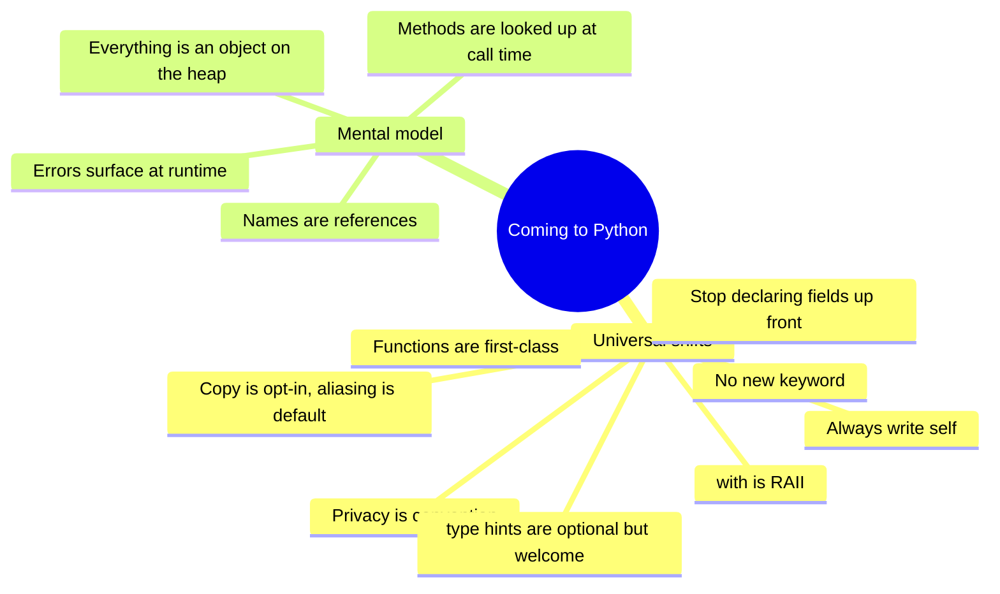
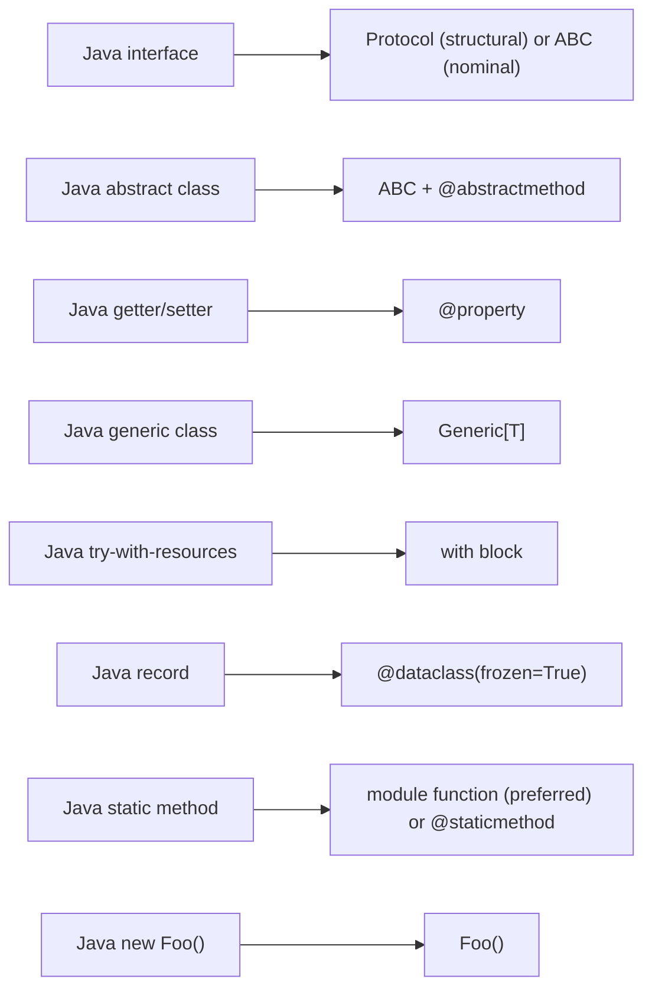
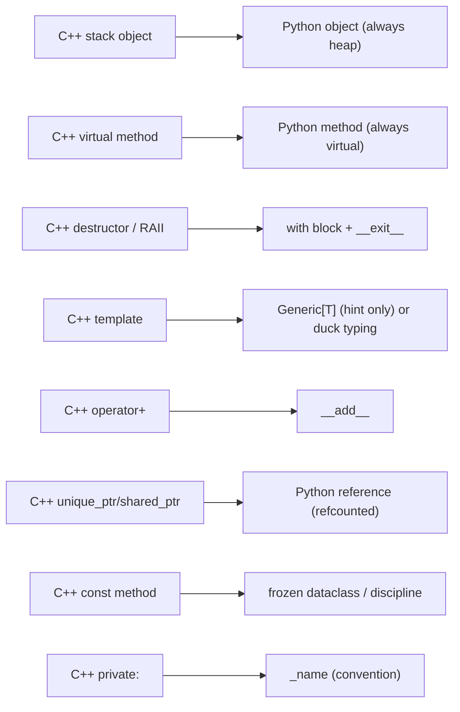
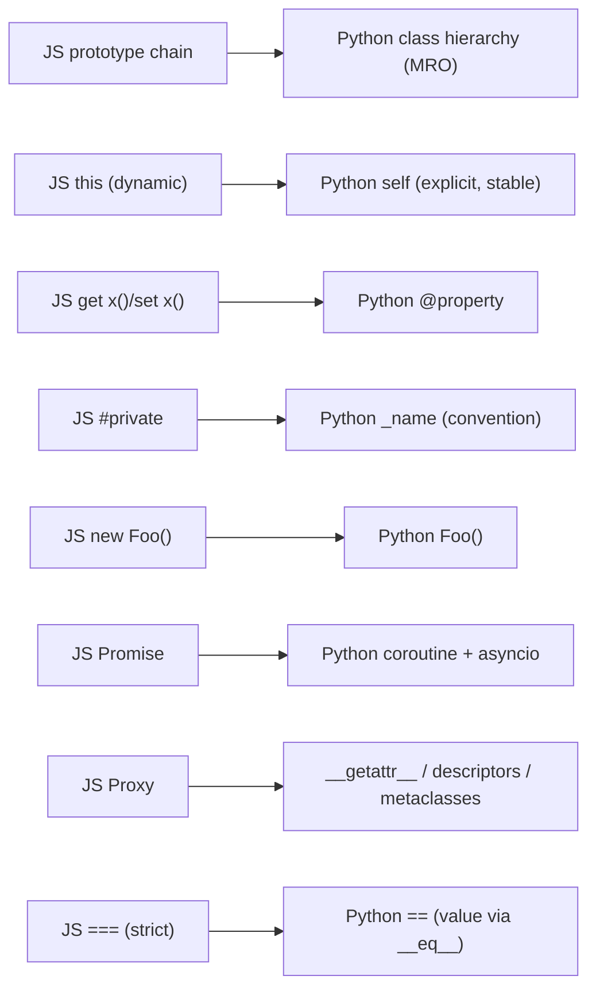
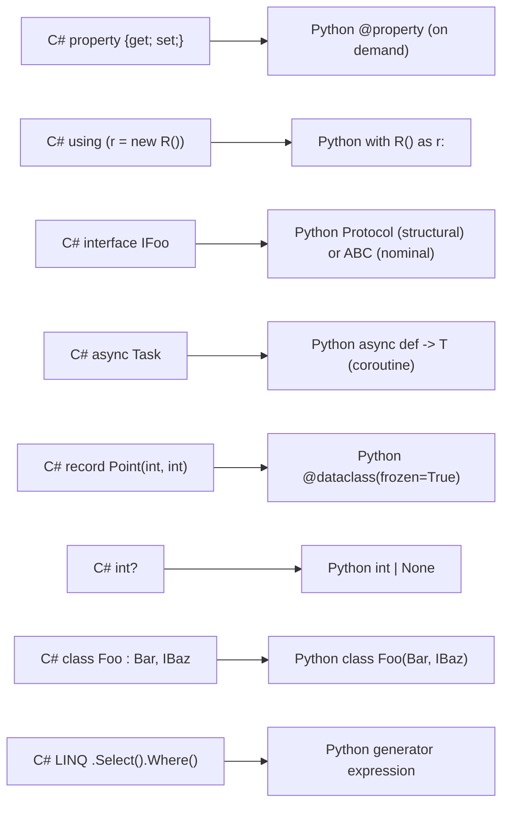
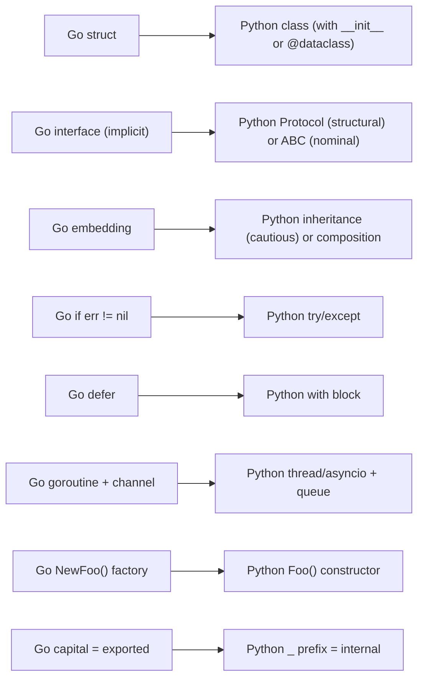
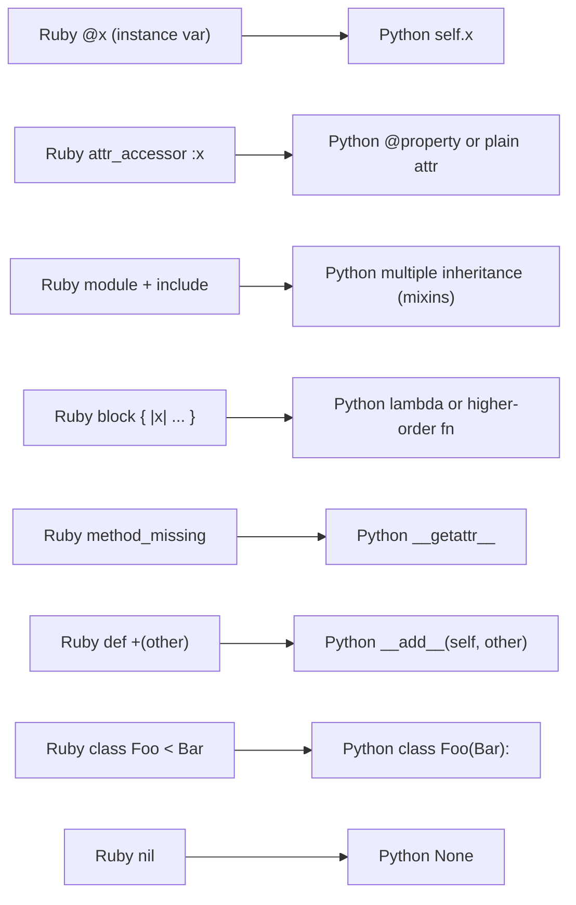
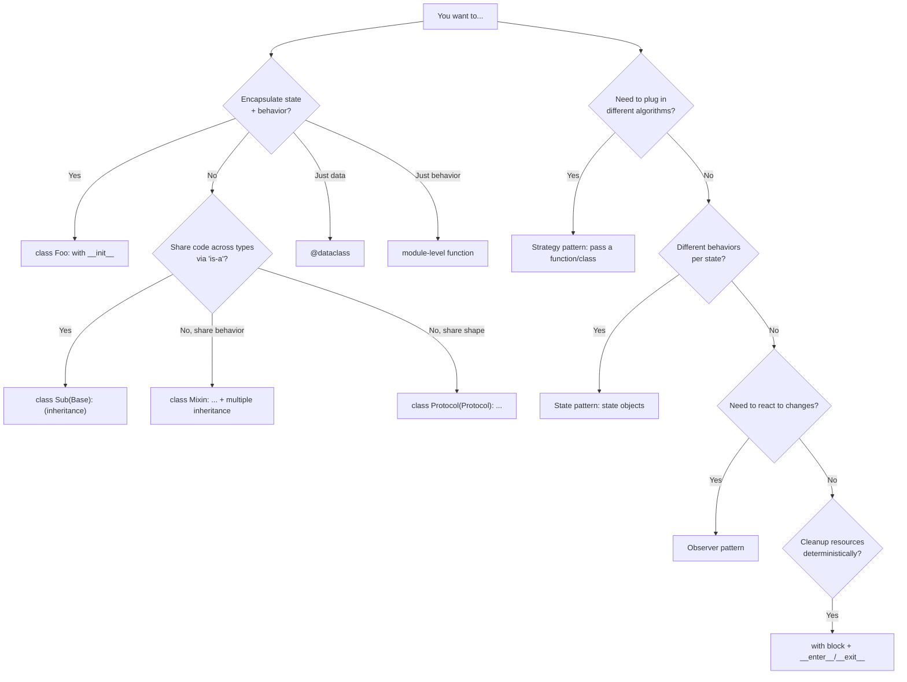

> [!info] Who This Note Is For
> You already write OOP in **another language** — Java, C++, JavaScript, C#, Go, or Ruby — and you're now learning Python. This note is structured per-source-language: for each, what will feel familiar, what will surprise you, and what will trip you up. Pick your section, skim the others.

> [!tip] Prerequisite
> Pair this note with the deep-dive comparisons: [[python-vs-java-oop]], [[python-vs-cpp-oop]], [[python-vs-javascript-oop]], [[multi-language-comparison]].

---

## 0. The Universal Transfers

Before we get language-specific, every transfer student benefits from internalizing these universal shifts:

> [!quote] The big shift
> **From:** "The compiler tells me what I'm allowed to do."
> **To:** "Tests tell me what actually works, and the type-checker hints at what should."

---

## 1. From Java

> [!tip] See also
> [[python-vs-java-oop]] for the full side-by-side.

### 1.1 What will feel familiar

- **Class syntax.** `class Foo:` is close to `class Foo {`.
- **Inheritance.** `class Dog(Animal):` looks like `class Dog extends Animal`.
- **Abstract classes.** Python's `abc.ABC` + `@abstractmethod` resembles Java's `abstract`.
- **Interfaces.** `typing.Protocol` is structurally typed (like a TypeScript interface), `abc.ABC` is nominal (like a Java `interface`).
- **Static methods** (`@staticmethod`) and class methods (`@classmethod`) are conceptually similar to `static`.
- **Generics** via `typing.Generic` look similar to Java's `<T>`.
- **Annotations** (`@dataclass`, `@property`) resemble Java's annotations.

### 1.2 What will surprise you

- **No field declarations.** You don't list fields at the top of the class. You create them in `__init__` by assignment.
- **No `new` keyword.** Just `Foo()` instead of `new Foo()`.
- **No `private`/`protected`/`public`.** It's all convention. `_field` is "internal"; `__field` is name-mangled (still accessible).
- **No method overloading.** Two methods with the same name → the second shadows the first. Use defaults, `*args`, or `@overload` for type hints.
- **No `interface` keyword.** Use `abc.ABC` or `typing.Protocol`.
- **`self` is explicit.** Every method takes `self` as the first parameter. Always.
- **Properties replace getters/setters.** `getFoo()`/`setFoo()` is Java-brain; Python uses public attributes promoted to `@property` on demand.
- **Functions don't need to live in classes.** A module of free functions is fine and idiomatic.

### 1.3 What will trip you up

> [!warning] Top 5 Java → Python pitfalls
> 1. **Writing `def f():` instead of `def f(self):`** — `TypeError: f() takes 0 positional arguments but 1 was given`.
> 2. **Generating getter/setter boilerplate** for every field — unidiomatic and noisy.
> 3. **Catching `Exception` everywhere** — Java's checked exceptions trained you to be defensive; Python uses unchecked exceptions and you should only catch what you handle.
> 4. **Treating `==` like Java's `==`** — In Python, `==` is value equality (`__eq__`); `is` is identity (Java's `==` for objects). Use `is None` for `None` checks.
> 5. **`isinstance` chains to fake overloading** — Pythonic code dispatches via methods, not type checks.

### 1.4 The unifying table

| You know (Java) | Pythonic way |
|---|---|
| `new Foo()` | `Foo()` |
| `private int x;` then `getX()`/`setX()` | `self.x = ...` (public); promote to `@property` later |
| `interface Drawable { void draw(); }` | `class Drawable(Protocol): def draw(self) -> None: ...` |
| `abstract class Shape { abstract double area(); }` | `class Shape(ABC): @abstractmethod def area(self) -> float: ...` |
| `class Dog extends Animal implements Walkable` | `class Dog(Animal, Walkable):` (multiple inheritance + MRO) |
| `class Box<T>` | `T = TypeVar("T"); class Box(Generic[T]):` |
| `static int x` | module-level `x = 0`, or `class C: x = 0` for class attribute |
| `@Override` | (no annotation needed; just redefine) |
| `try-with-resources (FileReader r = ...)` | `with open(...) as f:` |
| `Objects.equals(a, b)` | `a == b` (calls `__eq__`) |
| `Objects.hash(a, b)` | `hash((a, b))` |
| `instanceof X` | `isinstance(x, X)` |
| `String.format("%s=%d", k, v)` | `f"{k}={v}"` |
| `record Point(int x, int y) {}` | `@dataclass(frozen=True) class Point: x: int; y: int` |
| `Optional<T>` | `T | None` (PEP 604) |
| `List<String>` | `list[str]` |
| `Map<String, Integer>` | `dict[str, int]` |
| `synchronized` blocks | `threading.Lock` (or `asyncio.Lock` for async) |

### 1.5 Mermaid: Java → Python mental map

---

## 2. From C++

> [!tip] See also
> [[python-vs-cpp-oop]] for the full side-by-side.

### 2.1 What will feel familiar

- **Class concept** — both have classes, methods, inheritance.
- **Operator overloading** — Python's dunder methods (`__add__`, etc.) map to C++'s `operator+`.
- **Multiple inheritance** — both support it (though details differ).
- **Iterators** — Python's `__iter__`/`__next__` resemble C++'s `begin()`/`end()`.
- **RAII concept** — Python's `with` blocks give you deterministic resource cleanup.
- **Templates vs duck typing** — both let you write generic code, though mechanisms differ.

### 2.2 What will surprise you

- **No stack vs heap choice.** Every Python object is on the heap.
- **No value semantics by default.** `b = a` aliases, doesn't copy. `f(a)` aliases, doesn't copy.
- **Methods are always virtual.** No `virtual` keyword; no vtable opt-out.
- **No `const` methods.** Python has no `const`. Use `frozen=True` dataclasses for value types.
- **No destructors in the C++ sense.** `__del__` is unreliable; use `with` blocks.
- **No pointer arithmetic.** References only; no `*p`, no `&x`.
- **No manual memory management.** No `new`/`delete`. GC handles everything.
- **No header/source split.** One file per class (typically).
- **No `template <typename T>`.** Use `typing.Generic[T]` for static hints; otherwise just write the code and duck-type.
- **Methods can be added at runtime.** C++ classes are fixed at compile time; Python classes are mutable objects.

### 2.3 What will trip you up

> [!warning] Top 5 C++ → Python pitfalls
> 1. **Aliasing bugs.** `b = a; b.items.append(1)` mutates `a.items`. Use `copy.copy` / `copy.deepcopy` for true copies.
> 2. **Expecting deterministic destructors.** `__del__` runs unpredictably (or never). Use `with`.
> 3. **Mutable default arguments.** `def f(items=[])` shares one list across all calls. Use `items: list | None = None` and create inside.
> 4. **Forgetting `self`.** C++'s implicit `this` becomes Python's explicit `self`.
> 5. **Premature optimization.** You'll write tight loops expecting C++ performance and get 50× slowdown. Use NumPy or rewrite hot paths in Cython/C/Rust.

### 2.4 The unifying table

| You know (C++) | Pythonic way |
|---|---|
| `class Foo { public: ... };` | `class Foo: ...` |
| `Foo* f = new Foo();` | `f = Foo()` |
| `delete f;` | (just `del f` or let GC handle it) |
| `std::unique_ptr<T>` | just `T` (refcounting is the default) |
| `std::shared_ptr<T>` | just `T` (every reference is shared) |
| `std::weak_ptr<T>` | `weakref.ref(obj)` |
| `virtual void f()` | `def f(self):` (always virtual) |
| `virtual ~Foo() {}` | (no equivalent; use `with` for resources) |
| `const T&` | just `T` (no const; pass by reference always) |
| `T` (value) | `T` (reference) — use `copy.copy` for shallow, `copy.deepcopy` for deep |
| `template<typename T> T add(T a, T b)` | `def add(a, b): return a + b` (or `TypeVar` for hints) |
| `operator+` | `__add__` |
| `operator[]` | `__getitem__` / `__setitem__` |
| `operator<<` | `__str__` / `__repr__` |
| `operator==` | `__eq__` |
| RAII (destructor) | `with` block + `__enter__` / `__exit__` |
| `try { ... } catch (const std::exception& e)` | `try: ... except Exception as e:` |
| `std::vector<T>` | `list[T]` |
| `std::map<K, V>` | `dict[K, V]` |
| `std::unordered_set<T>` | `set[T]` |
| `std::optional<T>` | `T | None` |
| `std::variant<A, B>` | `A | B` (PEP 604) |
| `static_cast<T>(x)` | (just call the type: `T(x)`) |
| `dynamic_cast<T>(x)` | `isinstance(x, T)` |
| `friend class` | (no equivalent; tests can access private) |
| `#include` | `import` |
| `namespace` | module (file = module) |

### 2.5 Mermaid: C++ → Python mental map

---

## 3. From JavaScript

> [!tip] See also
> [[python-vs-javascript-oop]] for the full side-by-side.

### 3.1 What will feel familiar

- **Dynamic typing.** Both are dynamically typed (Python adds optional static hints).
- **First-class functions.** Both treat functions as values.
- **Closures.** Both have them; same semantics.
- **Generators / iteration.** Python's `yield` and JS's `function*`/`yield` are similar.
- **Async/await.** Same keyword, similar model (single-threaded event loop).
- **`class` syntax** (ES6+). Looks similar in both.
- **Lambdas / arrow functions.** JS `(x) => x + 1` ≈ Python `lambda x: x + 1` (though Python's are limited to one expression).
- **Getters/setters.** JS `get x()` ≈ Python `@property`.

### 3.2 What will surprise you

- **Real classes.** Python's `class` is not sugar over prototypes — it's the actual mechanism.
- **No prototype chain.** Python looks up methods via `__class__` and the MRO, not via `__proto__`.
- **`self` is explicit and stable.** No more `this`-binding bugs.
- **No `==`/`===` confusion.** Python's `==` is value (`__eq__`); `is` is identity. Use `is None`.
- **No `undefined` and `null`.** Just `None`.
- **No promises.** Python's `async`/`await` works on coroutines, not promises. You must `await` a coroutine; you must run the event loop explicitly (`asyncio.run(main())`).
- **`new` is gone.** `Foo()` not `new Foo()`.
- **No `#private` fields.** Convention: `_field` (internal) or `__field` (mangled).
- **`@property` instead of `get x()`.** Slightly more verbose but call-site-equivalent.
- **Modules are files.** Python's import system is file-based; JS's is more flexible (and historically confusing — CommonJS vs ESM).

### 3.3 What will trip you up

> [!warning] Top 5 JS → Python pitfalls
> 1. **Forgetting `self`.** The most common error.
> 2. **Expecting dynamic `this`.** Python's `self` is always the instance. The bug class "wrong `this`" simply doesn't exist.
> 3. **Using `==` for `None` checks.** Use `is None`.
> 4. **Reaching for `Proxy` for every dynamic trick.** Python has more focused mechanisms: `__getattr__` for attribute interception, descriptors for managed attributes, metaclasses for class-level hooks.
> 5. **Async patterns.** You must `asyncio.run(main())` to start the event loop. JS does it implicitly.

### 3.4 The unifying table

| You know (JS) | Pythonic way |
|---|---|
| `new Foo()` | `Foo()` |
| `class Foo extends Bar` | `class Foo(Bar):` |
| `constructor() {}` | `def __init__(self):` |
| `this` | `self` (explicit param) |
| `#privateField` | `self._field` (convention) |
| `get x() { ... }` / `set x(v) { ... }` | `@property def x(self):` + `@x.setter` |
| `static method()` | `@staticmethod` (or module-level function) |
| `class Foo { static x = 1; }` | module-level `x = 1`, or class attribute |
| `===` | `==` (value via `__eq__`) |
| `==` (loose) | (no equivalent — never use) |
| `typeof x` | `type(x)` |
| `instanceof X` | `isinstance(x, X)` |
| `Array.isArray(x)` | `isinstance(x, list)` |
| `obj.foo ?? bar` | `obj.foo if obj.foo is not None else bar` (or `obj.foo or bar` for falsy) |
| `obj?.foo?.bar` | `getattr(getattr(obj, "foo", None), "bar", None)` (or use a helper) |
| `[a, b] = arr` (destructure) | `a, b = arr` (tuple unpacking) |
| `const { a, b } = obj` | `a, b = obj["a"], obj["b"]` (or use a dataclass) |
| `Promise.all([...])` | `asyncio.gather([...])` |
| `setTimeout(fn, 1000)` | `asyncio.sleep(1)` |
| `Object.keys(obj)` | `list(obj.keys())` |
| `Array.from(x)` | `list(x)` |
| `Symbol.iterator` | `__iter__` / `__next__` |
| `function* () { yield 1; }` | `def gen(): yield 1` |
| `async () => { await x; }` | `async def f(): await x` |
| `Proxy` | `__getattr__` / `__setattr__` / descriptors / metaclasses |
| `class extends mixin(Base)` (mixin) | `class Foo(Base, Mixin1, Mixin2):` |

### 3.5 Mermaid: JS → Python mental map

---

## 4. From C#

> [!tip] See also
> [[python-vs-java-oop]] — most of the Java advice applies to C# too. C# is closer to Java than to Python.

### 4.1 What will feel familiar

- **Almost everything from Java's list.** Class syntax, inheritance, interfaces, abstract classes, generics (conceptually), exceptions.
- **Properties!** C# has had first-class `public int X { get; set; }` since v1.0. Python's `@property` will feel similar in spirit.
- **`async`/`await`.** Very similar syntax; different runtime (CLR thread pool vs asyncio event loop).
- **LINQ.** Python's `itertools`, generator expressions, and list comprehensions cover similar ground.
- **`using` blocks** → Python's `with` blocks. Near-identical.
- **`var`** → Python has no `var` keyword (everything is dynamic); you just don't annotate.

### 4.2 What will surprise you

- **No interfaces keyword for structural typing.** C# interfaces are nominal; for structural, use Python `Protocol`.
- **No `partial` classes.** Python classes can be re-opened (just add methods at runtime), but it's not idiomatic.
- **No `ref`/`out`.** Python has only pass-by-reference (object references). For "return multiple values," return a tuple.
- **No `struct` value types.** Everything is a heap reference. (C# structs are stack-allocated value types — Python has no equivalent.)
- **No events (`event` keyword).** Implement the Observer pattern manually or use `weakref.WeakSet`.
- **No LINQ method syntax directly.** Generator expressions and `itertools` cover most use cases; libraries like `pylinq` exist but are unidiomatic.
- **No extension methods.** Use free functions instead.
- **No `Nullable<T>` distinction.** Python has `T | None` for everything; value types and reference types are unified.
- **No operator overloading restrictions.** C# limits which operators can be overloaded; Python lets you overload almost everything via dunder methods.

### 4.3 What will trip you up

> [!warning] Top 5 C# → Python pitfalls
> 1. **Writing `public int X { get; set; }` for everything** — Python's idiom is to start with a plain attribute, promote to `@property` when needed.
> 2. **Expecting `struct` value semantics** — everything is a reference in Python.
> 3. **Using `IDisposable`-style patterns without `with`** — Python's `with` is the idiomatic resource cleanup.
> 4. **Looking for `Task<T>`** — Python's coroutines work differently; you `await` them, and `asyncio.gather` parallelizes.
> 5. **Missing `partial` classes / extension methods** — restructure into free functions or composition.

### 4.4 The unifying table

| You know (C#) | Pythonic way |
|---|---|
| `new Foo()` | `Foo()` |
| `public int X { get; set; }` | `self.x: int = ...` (plain attribute); promote to `@property` when needed |
| `public int X { get; private set; }` | `self._x` + `@property def x(self): return self._x` |
| `interface IFoo { void Bar(); }` | `class IFoo(Protocol): def bar(self) -> None: ...` |
| `abstract class Foo` | `class Foo(ABC): @abstractmethod` |
| `class Foo : Bar, IBaz` | `class Foo(Bar, IBaz):` (multiple inheritance, MRO) |
| `class Foo<T>` | `T = TypeVar("T"); class Foo(Generic[T]):` |
| `using (var r = new Resource())` | `with Resource() as r:` |
| `async Task<int> Foo()` | `async def foo() -> int:` |
| `await Task.WhenAll(...)` | `await asyncio.gather(...)` |
| `var x = ...` | `x = ...` (no keyword; just don't annotate) |
| `record Point(int X, int Y)` | `@dataclass(frozen=True) class Point: x: int; y: int` |
| `Nullable<int>` / `int?` | `int | None` |
| `dynamic` | (everything is dynamic; opt-in to static via annotations) |
| `typeof(T)` | `T` (the class itself is an object); `type(x)` for instance type |
| `x is T` / `x as T` | `isinstance(x, T)` / `cast(T, x)` (typing.cast, no runtime effect) |
| `event EventHandler<X> Foo` | Observer pattern with `WeakSet[Observer]` |
| `LINQ .Select(...).Where(...)` | generator expressions: `(f(x) for x in xs if cond(x))` |
| `IEnumerable<T>` | `Iterable[T]` |
| `IQueryable<T>` | (no equivalent; use a database driver) |
| `lock (obj) { ... }` | `with obj_lock: ...` (use `threading.Lock`) |
| `Parallel.ForEach` | `concurrent.futures.ThreadPoolExecutor` or `asyncio.gather` |

### 4.5 Mermaid: C# → Python mental map

---

## 5. From Go

> [!tip] See also
> [[multi-language-comparison]] — Go deliberately rejects classes and inheritance.

### 5.1 What will feel familiar

- **Structs.** Go's `type Foo struct { ... }` is conceptually similar to a Python class with attributes.
- **Methods on types.** Go's `func (f Foo) Bar()` is like Python's `def bar(self):` (note the receiver vs `self`).
- **Interfaces (structural).** Go interfaces are satisfied implicitly — same idea as Python's `typing.Protocol`.
- **Composition via embedding.** Go's `type Foo struct { Bar; ... }` ≈ Python's `class Foo(Bar):` (but without "is-a" semantics).
- **Garbage collection.** Both are GC'd.
- **First-class functions.** Both treat functions as values.
- **Closures.** Both have them.
- **Concurrency primitives.** Both have first-class concurrency (goroutines/channels vs asyncio).

### 5.2 What will surprise you

- **Python has classes and inheritance.** Go has neither. You can build class hierarchies in Python; this is a big shift if you've internalized Go's "composition only" mindset.
- **No capitalization-based visibility.** Python uses `_`/`__` conventions instead of uppercase = exported.
- **Multiple inheritance.** Python supports it (with MRO). Go doesn't (you embed multiple structs, but there's no method-resolution order).
- **Exceptions.** Python uses `try`/`except`. Go uses error return values. This is a *big* shift — you'll need to embrace exceptions.
- **Constructors.** Go uses factory functions (`NewFoo()`); Python uses `__init__`.
- **Duck typing is dynamic.** Go's interfaces are checked at compile time; Python's duck typing fails at runtime (unless you use `mypy`).
- **Methods are not values by default.** In Go, you write `f.Bar` carefully (method values). In Python, `f.bar` is always a bound method.
- **No `goroutines`.** Use threads, processes, or `asyncio`.
- **No channels.** Use `queue.Queue` or `asyncio.Queue`.

### 5.3 What will trip you up

> [!warning] Top 5 Go → Python pitfalls
> 1. **Avoiding inheritance reflexively.** Go trained you to never use it. Python *supports* it; just use it cautiously (favor composition).
> 2. **Ignoring exceptions.** Go's `if err != nil` style doesn't translate. Learn to use `try`/`except`.
> 3. **Trying to write everything as free functions.** Sometimes that's right, but Python's class system is more developed than Go's struct system.
> 4. **Expecting compile-time interface checks.** Python's `Protocol` is checked by `mypy`, not the runtime.
> 5. **Confused by absence of capitalization rules.** In Go, `Foo` is exported, `foo` is private. In Python, `_foo` is "private" (convention), `foo` is public. `Foo` is just a naming convention for classes.

### 5.4 The unifying table

| You know (Go) | Pythonic way |
|---|---|
| `type Foo struct { X int }` | `class Foo: x: int` (with `__init__` or `@dataclass`) |
| `func (f Foo) Bar()` | `def bar(self) -> None:` |
| `func (f *Foo) Mutate()` | `def mutate(self) -> None:` (Python is always by reference) |
| `type Reader interface { Read() }` | `class Reader(Protocol): def read(self) -> None: ...` |
| `type Foo struct { Bar; ... }` (embedding) | `class Foo(Bar):` (inheritance) **or** `class Foo: def __init__(self): self.bar = Bar()` (composition) |
| `NewFoo(...)` (factory) | `Foo(...)` (constructor) — or `@classmethod def from_x(cls, ...):` for alternative constructors |
| `if err != nil { return err }` | `try: ... except Exception as e: raise` (or just let it propagate) |
| `goroutine func() { ... }()` | `threading.Thread(target=...).start()` or `asyncio.create_task(...)` |
| `ch := make(chan int)` | `q = queue.Queue()` or `asyncio.Queue()` |
| `select { case ... }` | `asyncio.wait([...], return_when=FIRST_COMPLETED)` |
| `sync.Mutex` | `threading.Lock` |
| `defer cleanup()` | `with` block (deterministic) — or `try`/`finally` |
| `interface{}` / `any` | `Any` (typing) or just don't annotate |
| `[]Foo` | `list[Foo]` |
| `map[K]V` | `dict[K, V]` |
| `foo.Bar` (exported, capital) | `foo.bar` (just lowercase; convention `_bar` for private) |
| `reflect.TypeOf(x)` | `type(x)` |
| `x.(T)` (type assertion) | `isinstance(x, T)` then `cast(T, x)` (typing.cast, no runtime effect) |
| `switch v := x.(type)` | `match x:` (structural pattern matching, Python 3.10+) |
| `iota` constants | `enum.Enum` |
| `_` (blank identifier) | `_` (same convention) |

### 5.5 Mermaid: Go → Python mental map

---

## 6. From Ruby

> [!tip] See also
> [[multi-language-comparison]] — Ruby is the closest cousin to Python.

### 6.1 What will feel familiar

- **Dynamic typing.** Both are dynamic and duck-typed.
- **Everything is an object.** Both treat integers, strings, etc. as objects with methods.
- **Class-based OOP.** Both have `class Foo` with `def method` and inheritance.
- **Modules / mixins.** Ruby's `module M; end` and `include M` ≈ Python's multiple inheritance / mixins.
- **Blocks / closures.** Ruby's blocks ≈ Python's callables (functions, lambdas).
- **Open classes.** Both let you reopen a class and add methods.
- **Operator overloading via methods.** Ruby's `def +(other)` ≈ Python's `def __add__(self, other)`.
- **Iterators.** Ruby's `each` ≈ Python's `for x in ...`.
- **Metaprogramming.** Both support it; Ruby's `method_missing` ≈ Python's `__getattr__`.

### 6.2 What will surprise you

- **No `@` for instance variables.** Ruby uses `@x`; Python uses `self.x`.
- **No `attr_accessor`.** Python uses `@property` (or just plain public attributes).
- **`self` is explicit in Python.** Ruby's `self` is implicit; Python requires it as the first parameter.
- **No `nil` — it's `None`.**
- **No `puts` — it's `print`.**
- **No blocks** in the Ruby sense. Python uses higher-order functions (you pass a function explicitly).
- **No `module` keyword.** Python uses multiple inheritance instead of mixins-via-modules.
- **Indentation matters.** Python uses indentation for blocks; Ruby uses `end`.
- **No `do ... end`.** Python uses `def`/`class`/`with`/`try`/`for`/`while`.
- **String interpolation syntax.** Ruby `"#{x}"` ≈ Python `f"{x}"`.
- **Symbols.** Ruby has `:symbol`; Python doesn't — just use strings.
- **No `Hash` literal with `=>`.** Python uses `{"key": value}`.
- **Methods called without parens.** In Ruby, `obj.foo` and `obj.foo()` are the same. In Python, `obj.foo` is a method *reference*; `obj.foo()` is a *call*.

### 6.3 What will trip you up

> [!warning] Top 5 Ruby → Python pitfalls
> 1. **Writing `def foo; ...; end` instead of `def foo(self):`.** Different syntax and the `self` parameter is mandatory.
> 2. **Calling methods without parens.** `obj.greet` is a method reference in Python; you need `obj.greet()`.
> 3. **Using `@x` for instance variables.** Python uses `self.x`.
> 4. **Looking for blocks.** Use higher-order functions: `def each(xs, fn): for x in xs: fn(x)`.
> 5. **Expecting `method_missing` to fire on every miss.** Python's `__getattr__` only fires when normal lookup fails; `__getattribute__` fires every time (but is dangerous to override).

### 6.4 The unifying table

| You know (Ruby) | Pythonic way |
|---|---|
| `class Foo; def m; ...; end; end` | `class Foo: def m(self): ...` |
| `@x = 1` (instance var) | `self.x = 1` (instance attr) |
| `@@x = 1` (class var) | `Foo.x = 1` (class attr) — or `cls.x` inside classmethod |
| `attr_accessor :x` | `@property def x(self):` + `@x.setter` (or just public attr) |
| `module M; def m; end; end` `class Foo; include M; end` | `class M: def m(self): ...` `class Foo(M):` (multiple inheritance) |
| `class Foo < Bar` | `class Foo(Bar):` |
| `def +(other)` | `def __add__(self, other)` |
| `def ==(other)` | `def __eq__(self, other)` |
| `def <=>(other)` | `__lt__`, `__le__`, `__eq__`, ... (or `functools.total_ordering`) |
| `puts "hi"` | `print("hi")` |
| `nil` | `None` |
| `nil?` | `is None` |
| `obj.foo` (no parens, calls method) | `obj.foo()` (must call) |
| `obj.foo` (gets method as value) | `obj.foo` (bound method) |
| `[1,2,3].each { |x| puts x }` | `for x in [1,2,3]: print(x)` or `[print(x) for x in [...]]` |
| `[1,2,3].map { |x| x*2 }` | `[x*2 for x in [1,2,3]]` |
| `[1,2,3].select { |x| x.even? }` | `[x for x in [1,2,3] if x % 2 == 0]` |
| `"#{x}"` | `f"{x}"` |
| `:symbol` | (just use a string) |
| `{a: 1, b: 2}` | `{"a": 1, "b": 2}` (or `{a: 1}` if `a` is a variable — gets its value as key) |
| `begin; ...; rescue => e; end` | `try: ... except Exception as e:` |
| `ensure` | `finally` |
| `raise "msg"` | `raise ValueError("msg")` |
| `Gemfile` + `bundle` | `pyproject.toml` + `pip` / `Poetry` |
| `RSpec` | `pytest` |
| `method_missing(name, *args)` | `__getattr__(self, name)` |
| `respond_to?(:foo)` | `hasattr(obj, "foo")` or `callable(getattr(obj, "foo", None))` |
| `freeze` (immutable) | `@dataclass(frozen=True)` |
| `require "foo"` | `import foo` |

### 6.5 Mermaid: Ruby → Python mental map

---

## 7. A Universal Transfer Table

> [!example] "If you know X in your language, the Pythonic way is Y"

| Concept | Java | C++ | JS | C# | Go | Ruby | Pythonic |
|---|---|---|---|---|---|---|---|
| Construct an object | `new Foo()` | `new Foo()` or stack | `new Foo()` | `new Foo()` | `NewFoo()` or `Foo{}` | `Foo.new` | `Foo()` |
| Instance method | `void f()` (implicit `this`) | `void f()` (implicit `this`) | `f() { ... }` (dynamic `this`) | `void f()` (implicit `this`) | `func (f Foo) Bar()` | `def f; ...; end` (implicit `self`) | `def f(self):` |
| Inherit from one class | `extends A` | `: A` | `extends A` | `: A` | (no inheritance) | `< A` | `(A)` |
| Implement interface | `implements I` | (pure abstract class) | (informal) | `: I` | (implicit) | `include M` | `(I)` via multiple inheritance |
| Private field | `private int x;` | `private: int x;` | `#x` | `private int x;` | lowercase `x` | `@x` (no formal privacy) | `self._x` (convention) |
| Getter/setter | `getX()`/`setX()` | `getX()`/`setX()` | `get x()`/`set x()` | `X { get; set; }` | `GetX()`/`SetX()` | `attr_accessor :x` | `@property` (on demand) |
| Abstract class | `abstract class` | pure virtual methods | (informal) | `abstract class` | (no formal) | (raise in base) | `ABC` + `@abstractmethod` |
| Interface (structural) | (none) | (none) | (informal) | (none) | `interface { ... }` | (none) | `typing.Protocol` |
| Generic class | `class Foo<T>` | `template<typename T>` | (TS only) | `class Foo<T>` | `type Foo[T any]` | (none) | `class Foo(Generic[T])` |
| Resource cleanup | try-with-resources | RAII (destructor) | (informal) | `using` | `defer` | (ensure block) | `with` block |
| Null/nil | `null` | `nullptr` | `null`/`undefined` | `null` | `nil` (pointers only) | `nil` | `None` |
| Equality (value) | `.equals()` | `operator==` | `===` (for primitives) | `.Equals()` | (compare struct fields) | `==` | `==` (via `__eq__`) |
| Identity | `==` (objects) | pointer compare | `===` (objects) | `ReferenceEquals` | (compare pointers) | `equal?` | `is` |
| Iteration | `for (X x : xs)` | `for (auto& x : xs)` | `for (const x of xs)` | `foreach (var x in xs)` | `for _, x := range xs` | `xs.each { |x| }` | `for x in xs:` |
| Map / transform | `.stream().map(...)` | `std::transform` | `.map(...)` | `.Select(...)` | (manual loop) | `.map { }` | `[f(x) for x in xs]` |
| Filter | `.stream().filter(...)` | `std::copy_if` | `.filter(...)` | `.Where(...)` | (manual loop) | `.select { }` | `[x for x in xs if cond(x)]` |
| Async function | `CompletableFuture` | `std::future` | `async function` | `async Task<T>` | `go func()` + channels | Fibers / async gems | `async def` + `await` |
| Exception handling | `try`/`catch` (checked + unchecked) | `try`/`catch` (zero-cost) | `try`/`catch` | `try`/`catch` | `panic`/`recover` (rare) | `begin`/`rescue` | `try`/`except` |
| Entry point | `public static void main` | `int main()` | (top-level runs) | `static void Main` | `func main()` | (top-level runs) | `if __name__ == "__main__":` |
| Test framework | JUnit | GoogleTest | Jest | xUnit | testing (stdlib) | RSpec | pytest |

---

## 8. A Quick Decision Mermaid — "Which Concept Am I Looking For?"

---

## 9. Universal Pitfalls (for All Transfer Students)

> [!warning] These bite everyone
> 1. **Forgetting `self`.** Universal.
> 2. **Mutable default arguments.** `def f(x=[])` shares one list across calls. Use `x: list | None = None`.
> 3. **Aliasing bugs.** `b = a` doesn't copy. `b = copy.copy(a)` does (shallow).
> 4. **Class-level mutable state.** `class C: items = []` is shared across all instances.
> 5. **Using `==` for `None`.** Use `is None`.
> 6. **Catching `Exception` everywhere.** Catch only what you can handle.
> 7. **Premature optimization.** Python is slower than your old language. Optimize only with profiling.
> 8. **Reaching for `isinstance` chains.** Use polymorphism.
> 9. **Treating `_field` as private.** It's a convention; tests and tools can access it.
> 10. **Ignoring the standard library.** Python has "batteries included" — `collections`, `itertools`, `functools`, `pathlib`, `dataclasses`, `enum`, `typing` cover most needs.

---

## 10. Learning Path Recommendation Per Source Language

> [!tip] Pick the order that fits you

### 10.1 From Java (estimated 2–4 weeks to fluency)

1. **Week 1:** Classes, methods, `self`, `__init__`. Read [[classes-and-objects]], [[methods]].
2. **Week 2:** Properties, dunder methods, dataclasses. Read [[properties]], [[magic-methods]], [[dataclasses-and-attrs]].
3. **Week 3:** Inheritance, MRO, ABCs vs Protocols. Read [[inheritance]], [[protocols-and-type-hints]].
4. **Week 4:** SOLID, composition over inheritance, design patterns. Read [[solid-principles]], [[composition-over-inheritance]].

### 10.2 From C++ (estimated 3–5 weeks — biggest mental shift)

Add early emphasis on:
- **Week 1:** Value vs reference semantics. Aliasing. Copy. (Critical.)
- **Week 2:** GC + `with` blocks. Stop reaching for destructors.
- Then the standard path.

### 10.3 From JavaScript (estimated 2–3 weeks)

1. **Week 1:** Real classes, `self`, no prototypes. Read [[python-vs-javascript-oop]].
2. **Week 2:** Properties, dunder methods, MRO.
3. **Week 3:** Async (`asyncio`), exceptions (no more `try/catch` differences).

### 10.4 From C# (estimated 1–3 weeks — easiest)

1. **Week 1:** Properties → Python `@property`, `using` → `with`, `record` → `@dataclass`. Almost a 1:1 mapping.
2. **Week 2:** ABCs, Protocols, MRO.
3. **Week 3:** Async differences, missing LINQ (use generator expressions + `itertools`).

### 10.5 From Go (estimated 3–4 weeks — different paradigm)

1. **Week 1:** Classes and inheritance. Read [[classes-and-objects]], [[inheritance]].
2. **Week 2:** Exceptions. Read Python docs on `try`/`except`. This is the biggest shift.
3. **Week 3:** Properties, dunder methods, MRO.
4. **Week 4:** Async (your `goroutine` muscle memory will fight you).

### 10.6 From Ruby (estimated 1–2 weeks — closest cousin)

1. **Week 1:** Syntax differences (`self`, `def`, indentation), `@property` vs `attr_accessor`, modules → multiple inheritance.
2. **Week 2:** Subtle differences: `nil` → `None`, blocks → higher-order functions, symbols → strings.

---

## 11. Key Takeaways

1. **The mental shift matters more than the syntax.** Almost every transfer student can read Python syntax in a day; internalizing *idioms* takes weeks.
2. **Stop fighting Python's dynamism.** Don't write Java/C++ in Python syntax. Lean into duck typing, properties, and free functions.
3. **Embrace `self`.** It's explicit and stable; it eliminates an entire class of bugs.
4. **Forget value semantics if you're from C++.** Aliasing is the default; copy is opt-in.
5. **Forget prototypes if you're from JS.** Python has real classes.
6. **Forget capitalization rules if you're from Go.** `_` prefix is the convention.
7. **Forget blocks if you're from Ruby.** Use higher-order functions.
8. **Adopt type hints early.** `mypy` gives you back much of the safety you're leaving behind.
9. **Read Python stdlib code.** `collections`, `pathlib`, `dataclasses` are exemplary.
10. **Practice with the exercises in [[exercises-and-projects]].** Translating old code is the fastest way to learn.

## 12. Practice Exercises

> [!example] Transfer-specific exercises
> 1. **From Java:** Take a Java class with `getX()`/`setX()` and rewrite it Pythonically (plain attributes first, then `@property`).
> 2. **From C++:** Take a C++ class with manual memory management and rewrite it Pythonically — no `new`, no `delete`, no destructors, use `with`.
> 3. **From JS:** Take a JS `class` with `#private` fields and getters, rewrite in Python. Note that call sites don't change.
> 4. **From C#:** Take a C# `record` with properties and rewrite as `@dataclass(frozen=True)`.
> 5. **From Go:** Take a Go `struct` + `interface` pair and rewrite as a Python `@dataclass` + `Protocol`. Compare.
> 6. **From Ruby:** Take a Ruby class with `attr_accessor` and `module` mixins, rewrite in Python with `@property` and multiple inheritance.

## 13. Related Notes

- [[python-vs-java-oop]] · [[python-vs-cpp-oop]] · [[python-vs-javascript-oop]]
- [[multi-language-comparison]]
- [[oop-interview-questions]] — interview prep
- [[classes-and-objects]] · [[methods]] · [[properties]] · [[magic-methods]]
- [[inheritance]] · [[polymorphism]] · [[abstraction]] · [[encapsulation]]
- [[protocols-and-type-hints]] · [[dataclasses-and-attrs]] · [[metaclasses-and-class-creation]]
- [[solid-principles]] · [[composition-over-inheritance]] · [[dependency-injection]]
- [[common-misconceptions]] · [[common-pitfalls-and-anti-patterns]] · [[best-practices]]
- [[learning-path]] · [[exercises-and-projects]]
