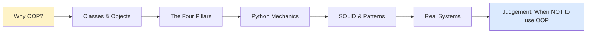
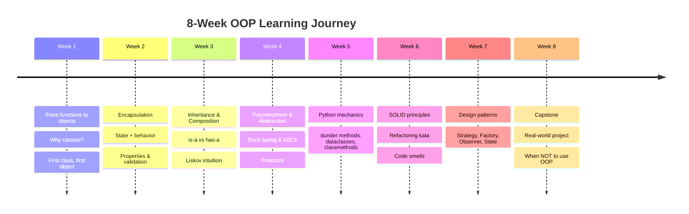
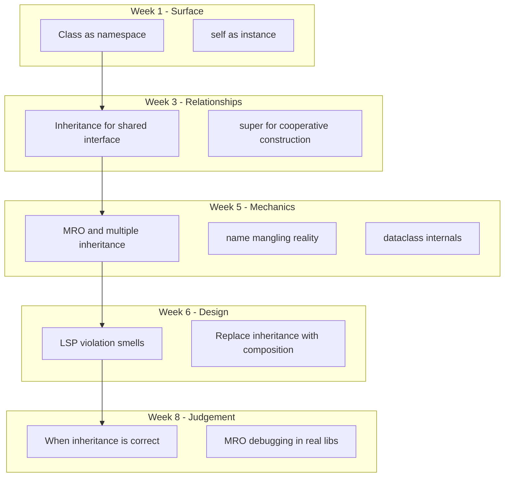

# Learning Path — Teaching OOP from Zero to Confident

> [!quote] "Tell me and I forget. Teach me and I remember. Involve me and I learn." —attributed to Xunzi / Benjamin Franklin

This note proposes a **practical, empathetic learning path** for teaching Object-Oriented Programming in Python. It is designed for an **8-week course** (≈ 3–4 hrs/week of contact + 4–6 hrs/week of practice), but the stages can be compressed, stretched, or remixed for self-learners, bootcamps, or university semesters.

The path is mapped to the rest of this knowledge base via `[[wikilinks]]` so students and teachers can drill into any topic when they need depth.

---

## 0. The Big Picture

Before diving into a single `class` keyword, give learners the **destination**. Many OOP courses lose students because they spend three weeks defining `Dog` and `Animal` without explaining *why*.



> [!tip] Pedagogical principle
> Always teach **why → how → what**. The "what" (syntax) is the easy part. The "why" (motivation) is what sticks.

### Pedagogical Principles Used Throughout

| Principle | What it means in practice |
|---|---|
| **Concrete → Abstract** | Show a working example *first*, then name the concept. ("This is a `BankAccount`. We call this pattern *encapsulation*.") |
| **Analogies first** | Use real-world analogies (recipes, blueprints, contracts) as scaffolding, then *explicitly dismantle* them when they break. |
| **Code-along, not lecture** | Students type code with you. Reading code is not enough; muscle memory matters. |
| **Deliberate practice** | Each session has *one* new concept + *one* exercise that isolates it. |
| **Make mistakes on purpose** | Show the bad version, then fix it. Students remember the *pain* of the bug. |
| **Spiral curriculum** | Revisit each concept at deeper levels. Encapsulation shows up in Week 1, Week 3, and Week 6 — each time with more nuance. |
| **Empathy with the procedural mind** | Many students come from `def` and `if`. Validate that style; show where it scales and where it cracks. |

See also: [[what-is-oop]], [[four-pillars-summary]].

---

## 1. The 8-Week Syllabus at a Glance



### Time allocation per week (≈ 6–8 hrs total)

| Activity | Hours |
|---|---|
| Live code-along / lecture | 2 |
| Guided lab exercise | 2 |
| Independent practice + reading | 2–3 |
| Code review of peer work | 0.5–1 |

> [!note] Stretch variant (university semester, 14 weeks)
> Double each week, add a mid-term refactoring project (Week 8), and a final capstone (Weeks 12–14). Insert a "design critique" week where students review open-source code.

---

## 2. Stage-by-Stage Breakdown

### 🟢 Stage 0 — Pre-OOP: Procedural Foundations (Week 1, Day 1)

**Goal:** Make sure students are fluent enough with functions and data structures that OOP's *value* becomes visible.

**What to teach**
- Functions, parameters, return values
- Dictionaries as "bags of data"
- The pain: passing the same `dict` to 5 functions and *hoping* they all agree on the keys

**Prerequisite:** Basic Python (variables, `if`, `for`, `def`).

**Concrete exercise — *The procedural crack***
```python
def deposit(account: dict, amount: float) -> None:
    account["balance"] += amount

def withdraw(account: dict, amount: float) -> None:
    if amount > account["balance"]:
        raise ValueError("Insufficient funds")
    account["balance"] -= amount

# Run it
acct = {"owner": "Ada", "balance": 100.0}
deposit(acct, 50)
withdraw(acct, 200)   # 💥 but only if you remembered to call THIS function
acct["balance"] -= 200  # 💥 silently allowed — bypasses all logic!
```

> [!warning] Gotcha to watch for
> Students who haven't felt the pain of *bypassed logic* won't understand why encapsulation is a *feature*. Don't skip this step. Make them write the buggy version.

**Link:** [[what-is-oop]]

---

### 🟢 Stage 1 — First Class, First Object (Week 1)

**Goal:** Students can declare a class, instantiate, and call methods. They understand the difference between **class** and **instance**.

**What to teach**
- `class` keyword, `__init__`, `self`
- Instance attributes vs class attributes (briefly — return to it in Week 5)
- Methods vs functions
- The mental model: **class = blueprint, instance = house**

**Prerequisite:** Stage 0.

**Concrete exercise — *Refactor the procedural account***
```python
class BankAccount:
    def __init__(self, owner: str, balance: float = 0.0) -> None:
        self.owner = owner
        self.balance = balance

    def deposit(self, amount: float) -> None:
        if amount <= 0:
            raise ValueError("Deposit must be positive")
        self.balance += amount

    def withdraw(self, amount: float) -> None:
        if amount > self.balance:
            raise ValueError("Insufficient funds")
        self.balance -= amount
```

> [!tip] Teaching tip
> Have students **draw the object in memory**: a box labeled `BankAccount`, with arrows for `owner` and `balance`. Drawing → understanding.

> [!warning] Gotcha to watch for
> `self` is not a keyword — it's a convention. Show what happens with `me` or `this_is_the_instance`. Then enforce the convention strongly. See [[common-misconceptions]].

**Links:** [[classes-and-objects]], [[what-is-oop]]

---

### 🟢 Stage 2 — Encapsulation: State + Behavior Together (Week 2)

**Goal:** Students protect internal state with private attributes and expose controlled access via properties.

**What to teach**
- Public vs `_protected` vs `__mangled` conventions
- Why "private" in Python is a *social contract*, not a security fence
- `@property` for controlled reads
- `@x.setter` for validation
- When to use properties vs plain attributes (rule of thumb: *public API evolves, so use properties when behavior might appear*)

**Prerequisite:** Stage 1.

**Concrete exercise — *Make balance read-only***
```python
class BankAccount:
    def __init__(self, owner: str, balance: float = 0.0) -> None:
        self._balance = balance           # "private" by convention

    @property
    def balance(self) -> float:
        return self._balance

    def deposit(self, amount: float) -> None:
        if amount <= 0:
            raise ValueError("Deposit must be positive")
        self._balance += amount

    def withdraw(self, amount: float) -> None:
        if amount > self._balance:
            raise ValueError("Insufficient funds")
        self._balance -= amount
```

> [!warning] Gotcha to watch for
> Students will declare `__balance` (name-mangled) and then be unable to write a subclass that touches it. Reserve `__` for *genuine* name-collision avoidance, not as a default. See [[common-misconceptions]].

**Links:** [[encapsulation]], [[properties]]

---

### 🟡 Stage 3 — Inheritance & Composition (Week 3)

**Goal:** Students can model `is-a` (inheritance) and `has-a` (composition) relationships and choose between them.

**What to teach**
- Single inheritance, `super()`, method resolution order (MRO) *intuitively*
- `is-a` vs `has-a` — the most important distinction in OOP design
- **Composition over inheritance** as the default heuristic
- Liskov Substitution Principle *intuitively*: "if it walks like a `BankAccount`, it must behave like one"

**Prerequisite:** Stage 2.

**Concrete exercise — *SavingsAccount vs AccountComponent***

Two designs for the same problem — which is better?

```python
# Design A: inheritance
class SavingsAccount(BankAccount):
    def __init__(self, owner: str, balance: float = 0.0, rate: float = 0.02) -> None:
        super().__init__(owner, balance)
        self.rate = rate

    def apply_interest(self) -> None:
        self.deposit(self.balance * self.rate)

# Design B: composition
class InterestPolicy:
    def __init__(self, rate: float) -> None:
        self.rate = rate

    def accrue(self, balance: float) -> float:
        return balance * self.rate

class BankAccount:
    def __init__(self, owner: str, balance: float = 0.0, interest: InterestPolicy | None = None) -> None:
        self.owner = owner
        self._balance = balance
        self.interest = interest or InterestPolicy(0.0)

    def apply_interest(self) -> None:
        self.deposit(self.interest.accrue(self._balance))
```

> [!danger] Gotcha to watch for
> Students over-use inheritance because "it's OOP." Push them to *justify* every `class X(Y)`. The question "could I substitute a `Y` everywhere I use an `X`?" must return True — otherwise, use composition.

**Links:** [[inheritance]], [[composition-over-inheritance]], [[solid-principles]] (LSP)

---

### 🟡 Stage 4 — Polymorphism & Abstraction (Week 4)

**Goal:** Students design with **interfaces** (ABCs, Protocols) and rely on **duck typing** rather than `isinstance` checks.

**What to teach**
- Duck typing as Python's default polymorphism
- `abc.ABC` + `@abstractmethod` for explicit contracts
- `typing.Protocol` for structural typing (no inheritance required)
- The shapes: `Shape.area()`, `PaymentProcessor.charge()`, `Repository.save()`

**Prerequisite:** Stage 3.

**Concrete exercise — *Multiple payment methods, one checkout***

```python
from abc import ABC, abstractmethod

class PaymentProcessor(ABC):
    @abstractmethod
    def charge(self, amount: float) -> str: ...

class CardProcessor(PaymentProcessor):
    def charge(self, amount: float) -> str:
        return f"Charged ${amount:.2f} to card"

class WalletProcessor(PaymentProcessor):
    def charge(self, amount: float) -> str:
        return f"Charged ${amount:.2f} to wallet"

def checkout(total: float, processor: PaymentProcessor) -> str:
    return processor.charge(total)
```

> [!warning] Gotcha to watch for
> Students will write `if isinstance(processor, CardProcessor): ... elif isinstance(...)`. Stop this immediately — it's a [[common-pitfalls-and-anti-patterns]] smell that breaks the whole point of polymorphism.

**Links:** [[polymorphism]], [[abstraction]], [[python-protocols]]

---

### 🟠 Stage 5 — Python Mechanics Deep Dive (Week 5)

**Goal:** Students speak idiomatic Python OOP: dunder methods, dataclasses, classmethods, staticmethods, `__eq__`, `__hash__`, context managers.

**What to teach**
- `__repr__`, `__str__`, `__eq__`, `__hash__`, `__lt__` — make objects feel native
- `@dataclass` and `frozen=True` for value objects
- `@classmethod` (alternative constructors) vs `@staticmethod` (rare — usually a free function)
- `__enter__` / `__exit__` for resource management
- `__iter__` / `__next__` for iteration

**Prerequisite:** Stage 4.

**Concrete exercise — *Make Money feel like a built-in***

```python
from dataclasses import dataclass
from functools import total_ordering

@dataclass(frozen=True, order=True)
class Money:
    amount: float
    currency: str = "USD"

    def __add__(self, other: "Money") -> "Money":
        if self.currency != other.currency:
            raise ValueError("Cannot add different currencies")
        return Money(self.amount + other.amount, self.currency)

m1 = Money(10, "USD")
m2 = Money(5, "USD")
print(m1 + m2)            # Money(amount=15.0, currency='USD')
print(m1 > m2)            # True
print({m1, m2, Money(10, "USD")})  # frozen → hashable → usable in a set
```

> [!tip] Teaching tip
> Have students explore `dir(m1)` to discover the methods `@dataclass` *auto-generated*. The "magic" becomes concrete.

**Links:** [[dunder-methods]], [[dataclasses]], [[classmethods-staticmethods]]

---

### 🟠 Stage 6 — SOLID & Refactoring (Week 6)

**Goal:** Students can spot code smells, name them, and apply SOLID principles to refactor.

**What to teach**
- The five SOLID principles — *each with a Python example*
- Code smells catalog: God class, feature envy, primitive obsession, shotgun surgery
- Refactoring moves: extract method, extract class, replace conditional with polymorphism

**Prerequisite:** Stage 5.

**Concrete exercise — *Refactor this God class***

```python
# BEFORE: 400-line class doing everything
class OrderProcessor:
    def validate(self, order): ...
    def calculate_tax(self, order): ...
    def apply_discount(self, order): ...
    def charge_customer(self, order): ...
    def send_email(self, order): ...
    def log_to_db(self, order): ...
    def export_to_csv(self, order): ...

# AFTER: split by responsibility
class OrderValidator: ...
class TaxCalculator: ...
class DiscountPolicy: ...
class PaymentService: ...
class NotificationService: ...
class OrderRepository: ...
class OrderExporter: ...
class OrderProcessor:  # orchestrates
    def __init__(self, validator, tax, discount, payment, notifier, repo, exporter):
        ...
```

> [!warning] Gotcha to watch for
> Students will refactor *prematurely*. Teach them the rule of three: refactor on the *third* time you copy-paste, not the first.

**Links:** [[solid-principles]], [[common-pitfalls-and-anti-patterns]], [[refactoring-moves]]

---

### 🔴 Stage 7 — Design Patterns (Week 7)

**Goal:** Students recognize and apply the most common GoF patterns in Pythonic form.

**What to teach**
- Strategy (replace `if/elif` on type with objects)
- Factory (centralize construction)
- Observer (decouple producer from consumers)
- State (object behaves differently based on state)
- Decorator (Python's built-in `@decorator` is *not* the GoF pattern — clarify!)
- Adapter / Facade

**Prerequisite:** Stage 6.

**Concrete exercise — *Strategy: shipping cost calculator***

```python
from abc import ABC, abstractmethod

class ShippingStrategy(ABC):
    @abstractmethod
    def cost(self, weight: float) -> float: ...

class StandardShipping(ShippingStrategy):
    def cost(self, weight: float) -> float: return weight * 1.5

class ExpressShipping(ShippingStrategy):
    def cost(self, weight: float) -> float: return weight * 3.0 + 5

class FreeShipping(ShippingStrategy):
    def cost(self, weight: float) -> float: return 0.0

class Cart:
    def __init__(self, strategy: ShippingStrategy) -> None:
        self._strategy = strategy
        self._items: list[float] = []  # weights

    def add(self, weight: float) -> None:
        self._items.append(weight)

    def total_weight(self) -> float:
        return sum(self._items)

    def shipping_cost(self) -> float:
        return self._strategy.cost(self.total_weight())
```

> [!tip] Teaching tip
> Show the *anti-pattern* (long `if/elif` chain on `shipping_type`) **first**, let students feel the pain, *then* introduce Strategy. Patterns are answers to specific pains.

**Links:** [[design-patterns]], [[strategy-pattern]], [[factory-pattern]], [[observer-pattern]]

---

### 🔴 Stage 8 — Capstone: Real Systems & Judgement (Week 8)

**Goal:** Students build a small but realistic system end-to-end, and learn when OOP is the **wrong** tool.

**What to teach**
- A capstone project (see [[exercises-and-projects]])
- **When NOT to use OOP**: data pipelines, ETL, pure functions over immutable data, scripts under 100 lines
- The **functional-core-imperative-shell** style
- Code review skills using the [[best-practices]] checklist

**Prerequisite:** Stage 7.

**Capstone options (pick one):**
1. Mini banking system with multiple account types and interest strategies — see [[real-world-examples]]
2. Plugin-based text editor — see [[real-world-examples]]
3. E-commerce checkout with discount rules — see [[real-world-examples]]

> [!example] Final reflection exercise
> "Find an open-source Python project. Identify three classes that exhibit good OOP and one that exhibits a code smell. Write a one-paragraph critique." This trains the *judgment* that no syllabus can teach directly.

**Links:** [[real-world-examples]], [[oop-in-production]], [[best-practices]]

---

## 3. Handling Students from Procedural Backgrounds

Many learners arrive having written hundreds of `def`s and zero `class`es. This is **not a deficit** — it's an asset. They already know what state *feels like* (global variables, mutable arguments). Your job is to give them a *better* tool for the same job.

### The bridge talk

> [!quote] Use this framing in Week 1
> "You already write OOP code — you just call it 'functions that operate on a shared dictionary.' A `class` is a way to *bind* those functions to that dictionary so they can never be separated. We're not changing how you think — we're giving you a sharper tool."

### Common procedural→OOP speed bumps

| Speed bump | What it looks like | How to unblock |
|---|---|---|
| **"Why do I need `self`?"** | Students forget `self` parameter, get `TypeError` | Show the equivalent `BankAccount.deposit(acct, 50)` form explicitly. `acct.deposit(50)` is sugar for it. |
| **"When do I make a class?"** | They make a class for everything, or nothing | Rule of thumb: a class earns its keep when it has **state + behavior + identity**. All three. |
| **"Methods vs functions?"** | Anxiety about choosing | A method is a function that lives in a class's namespace and takes the instance as its first arg. That's it. |
| **"But I can do this with a dict!"** | They refactor your class back to a dict | Yes — and you can compute π with rulers. The point is *maintainability* and *intent*. Show a 200-line procedural file and ask them to add a feature. |
| **"Why so much boilerplate?"** | Complaint, especially pre-dataclasses | Introduce `@dataclass` early (Week 2 if students are sharp). Show that Python *has* heard them. |

> [!tip] Don't shame procedural code
> Many production Python codebases (especially in data science) are 90% functions and 10% classes — and that's correct. OOP is a tool, not a religion. See [[oop-in-production]].

---

## 4. Spiral Curriculum Map

Each concept is revisited at increasing depth:



---

## 5. Assessment Strategy

A balanced assessment catches both *syntax* and *judgement*:

| Assessment type | Weight | What it measures |
|---|---|---|
| Weekly code exercises (auto-graded) | 30% | Syntax, mechanics, single concepts |
| Refactoring kata (peer-reviewed) | 20% | Reading & improving existing code |
| Design critique (write a paragraph) | 15% | Judgement, vocabulary |
| Capstone project (rubric) | 30% | Integration, design, testing |
| Participation (code review) | 5% | Communication |

> [!example] Sample rubric for capstone
> - **Correctness (25%)** — does it work? tests pass?
> - **Design (30%)** — appropriate use of classes, composition, polymorphism; no code smells from [[common-pitfalls-and-anti-patterns]]
> - **Testing (15%)** — pytest suite with meaningful coverage
> - **Documentation (15%)** — docstrings, type hints, README
> - **Readability (15%)** — naming, structure, PEP 8

---

## 6. Common Teaching Pitfalls (Instructor-side)

> [!danger] These are mistakes *instructors* make — not students
> - **The Animal/Dog trap.** If your only examples are `Animal → Dog → Cat`, students think OOP is taxonomy. Use *real* domains: banking, e-commerce, file systems, games.
> - **Skipping the "why."** Jumping straight to syntax produces students who can write a `class` but cannot defend a design.
> - **Teaching patterns before smells.** Patterns are *cures*; teach the *disease* first.
> - **Ignoring `typing`.** Modern Python OOP is typed. Teach `mypy` from Week 5.
> - **Never showing bad code.** Students must see *and smell* anti-patterns to recognize them. Use [[common-pitfalls-and-anti-patterns]] as discussion fuel.
> - **Over-emphasizing inheritance.** Spend more time on composition and interfaces than on inheritance hierarchies.

---

## 7. Mapping to the Knowledge Base

| Stage | Read these notes |
|---|---|
| 0–1 | [[what-is-oop]], [[classes-and-objects]] |
| 2 | [[encapsulation]], [[properties]] |
| 3 | [[inheritance]], [[composition-over-inheritance]] |
| 4 | [[polymorphism]], [[abstraction]], [[python-protocols]] |
| 5 | [[dunder-methods]], [[dataclasses]], [[classmethods-staticmethods]] |
| 6 | [[solid-principles]], [[common-pitfalls-and-anti-patterns]] |
| 7 | [[design-patterns]], [[strategy-pattern]], [[factory-pattern]], [[observer-pattern]] |
| 8 | [[real-world-examples]], [[oop-in-production]], [[best-practices]], [[exercises-and-projects]] |

For visual reinforcement: [[class-diagrams]], [[sequence-diagrams]], [[four-pillars-summary]].

---

## 8. A Note on Empathy

> [!quote] "Everyone is a genius at least once a year. The real geniuses simply have their bright ideas closer together." — Lichtenberg

OOP has a steep "aha!" curve. Students will stare blankly at `self` for two weeks, then suddenly write a coherent class hierarchy in one afternoon. **Normalize the plateau.** Tell them: "You will feel lost until about Week 4. That is normal. Keep typing code."

When a student writes their first *clean* class — one you'd merge without changes — celebrate it. That moment is why we teach.

---

## Key Takeaways

1. **Start with the why.** Students who feel the pain of procedural state management *ask* for OOP. Those who don't, resent it.
2. **Use a spiral curriculum.** Revisit each pillar at deeper levels across the 8 weeks.
3. **Composition before inheritance** as a design heuristic. Inheritance is a powerful, dangerous tool — introduce it carefully.
4. **Make mistakes on purpose.** Bad code is the best teaching material.
5. **Validate procedural intuition.** Many students already do OOP in spirit; you're giving them a sharper tool, not a new religion.
6. **Assess judgement, not just syntax.** Code reviews and design critiques matter as much as auto-graded labs.
7. **Teach when *not* to use OOP.** The final week should empower students to *choose* functions, dataclasses, or full classes based on the problem.

---

**Next:** [[common-misconceptions]] — the catalog of beliefs that sabotage OOP students.
