# Mermaid Cheatsheet — OOP Diagramming Reference

> [!quote] One diagram tool to rule them all — Mermaid renders natively in Obsidian, GitHub, GitLab, and Notion. This is your copy-paste reference for every diagram type relevant to OOP.

---

## 0. How to Render Mermaid in Obsidian

Mermaid is **built into Obsidian** — no plugins required (versions ≥ 1.0). To use it, write a **fenced code block** with the language `mermaid`:

````
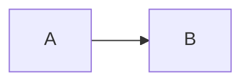
````

> [!tip] Settings check
> In Obsidian: `Settings → Editor → Enable Mermaid diagrams`. Should be on by default.
>
> If you want to test the latest features (timeline, mindmap, erDiagram upgrades), install the community plugin **"Mermaid Tools"** or **"Diagrams"** which bundle a newer Mermaid version.

> [!warning] Common gotcha
> Mermaid is **whitespace-sensitive** in some constructs (notably `classDiagram` and `mindmap`). Always use **consistent indentation** (2 or 4 spaces — pick one and stick to it).

---

## 1. `classDiagram` — For OO Class & Package Diagrams

The single most important diagram for OOP. See [[class-diagrams]].

### 1.1 Class with Members

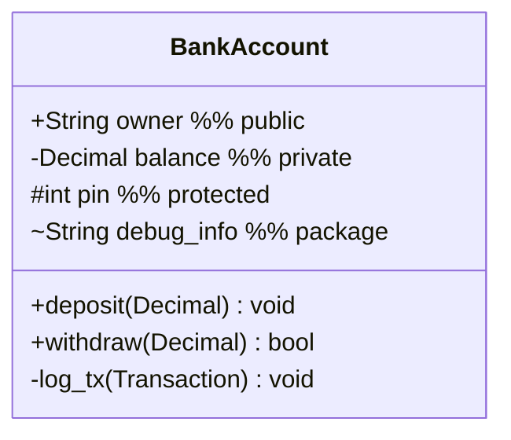

### 1.2 Stereotypes & Modifiers

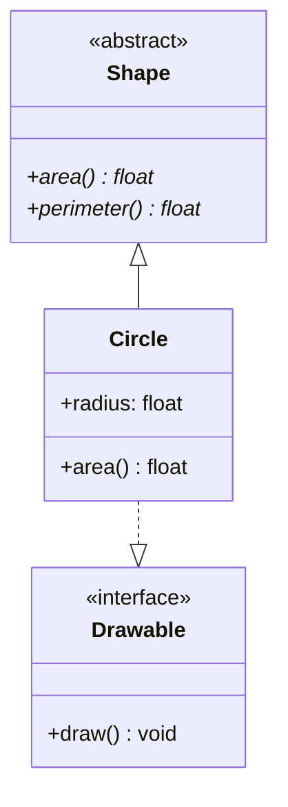

- `<<abstract>>` and `<<interface>>` go inside the class body.
- `*` after a method name marks it **abstract**.
- (There's no built-in `static` underline, but you can use a note.)

### 1.3 The Six Relationships

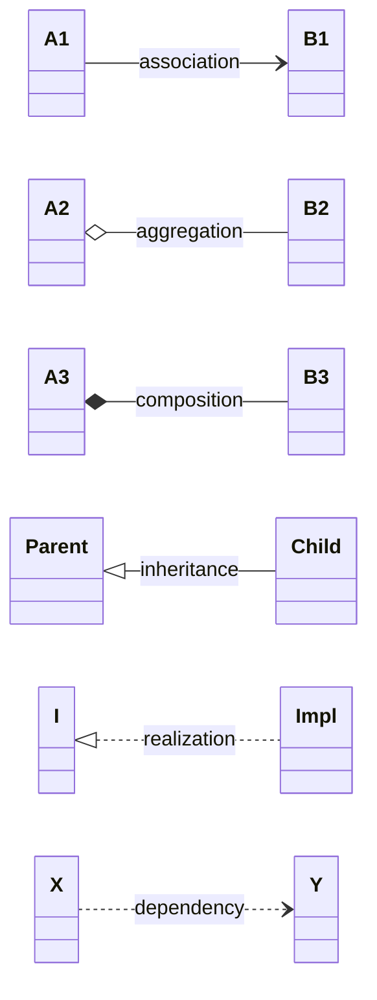

| Symbol  | Meaning              |
| ------- | -------------------- |
| `-->`   | Association          |
| `o--`   | Aggregation (hollow)|
| `*--`   | Composition (filled)|
| `<\|--` | Inheritance         |
| `<|..`  | Realization         |
| `..>`   | Dependency          |

### 1.4 Multiplicity & Labels

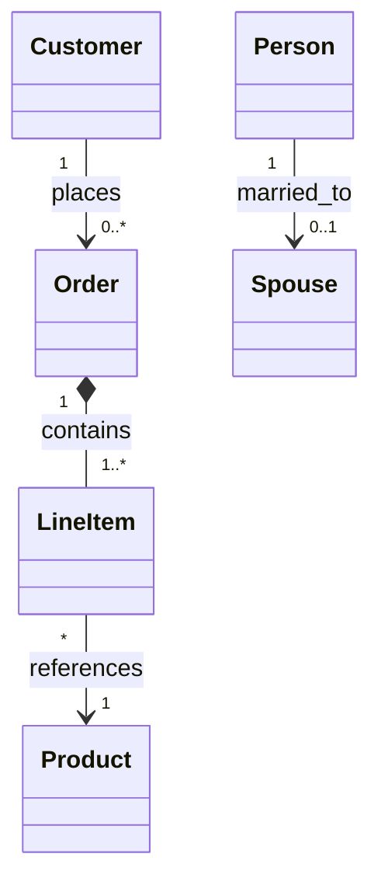

Multiplicity goes on **both ends**, in quotes.

### 1.5 Notes

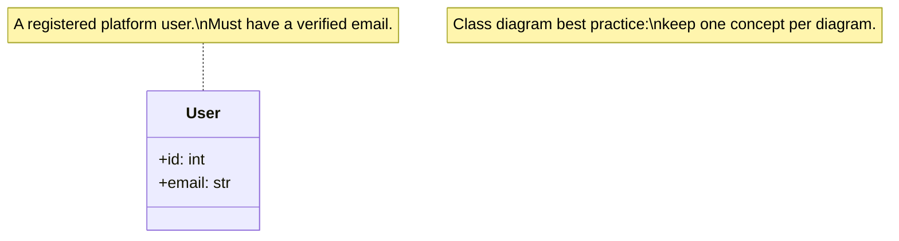

### 1.6 Generics (Type Parameters)

Mermaid supports generics via the `~` syntax:

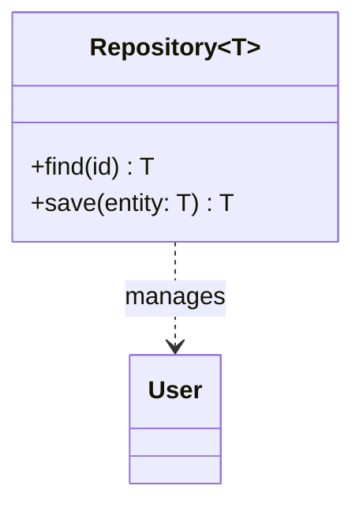

### 1.7 Packages

```mermaid
classDiagram
    package UI {
        class ViewController
    }
    package Domain {
        class User
        class Order
    }
    package Data {
        class UserRepository
    }
    UI ..> Domain
    Data ..> Domain
```

See [[use-case-and-package-diagrams]].

---

## 2. `sequenceDiagram` — For Object Interactions

See [[sequence-diagrams]].

### 2.1 Basic Skeleton

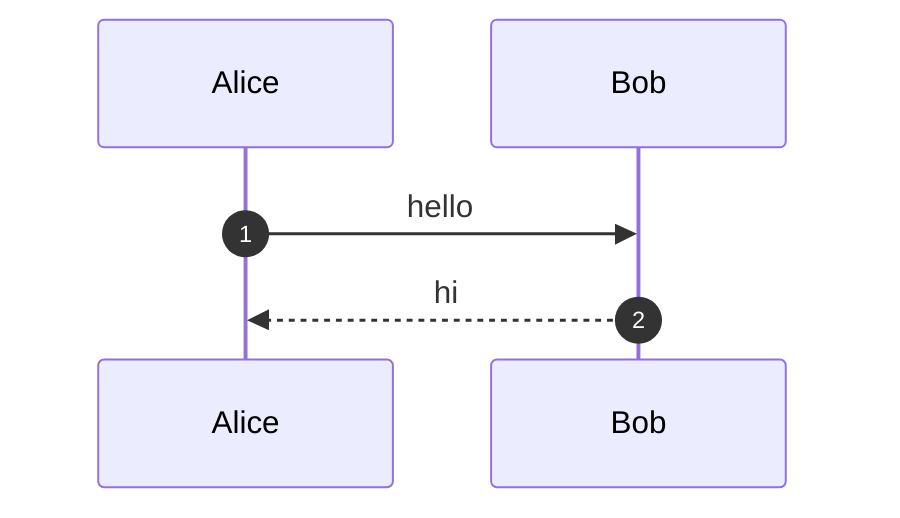

### 2.2 Message Types

| Syntax  | Meaning                  |
| ------- | ------------------------ |
| `->>`   | Synchronous call         |
| `--)`   | Asynchronous call        |
| `-->>`  | Return value             |
| `-x`    | Lost / failed message    |
| `+)` `+)` | Async variants (advanced) |

### 2.3 Activation Bars

```mermaid
sequenceDiagram
    participant A, participant B, participant C
    A->>+B: doWork()
    B->>+C: helper()
    C-->>-B: result
    B-->>-A: done
```

`+` activates, `-` deactivates. They **nest**.

### 2.4 Interaction Frames

```mermaid
sequenceDiagram
    participant U, participant S
    U->>S: login()
    alt valid
        S-->>U: ok
    else invalid
        S-->>U: error
    end

    opt remember_me
        S->>S: store_token()
    end

    loop every 60s
        U->>S: ping()
        S-->>U: pong
    end

    par
        S->>S: log_event()
    and
        S->>S: send_email()
    end
```

### 2.5 Notes & Styling

```mermaid
sequenceDiagram
    participant A, participant B
    Note over A,B: Two-way conversation
    Note right of A: A is processing
    Note left of B: B is waiting

    rect rgb(220, 240, 220)
        A->>B: green region
    end
```

---

## 3. `stateDiagram-v2` — For Object Lifecycles

See [[state-and-activity-diagrams]].

### 3.1 Basic Skeleton

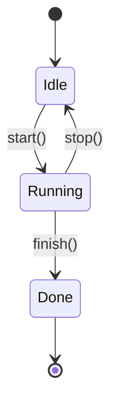

### 3.2 Guards & Actions

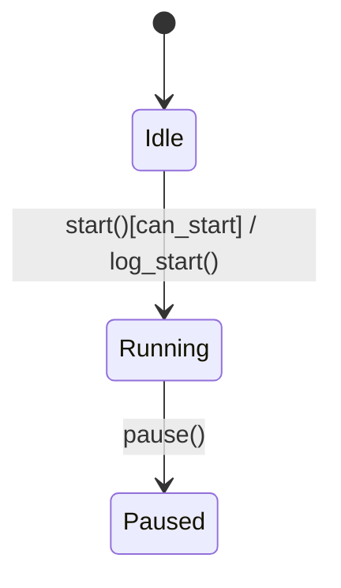

Syntax: `From --> To : event[guard] / action()`

### 3.3 Composite (Nested) States

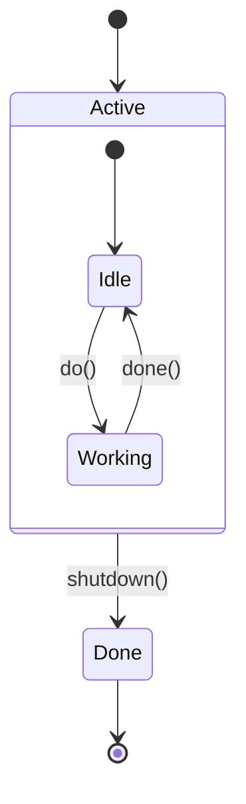

### 3.4 Choice & Fork

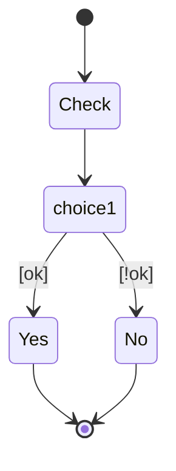

### 3.5 Notes

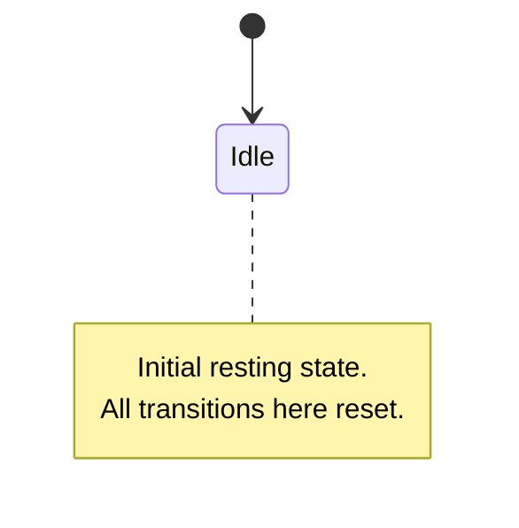

---

## 4. `flowchart` — For Activity Diagrams & Generic Flow

Mermaid's `flowchart` is the workhorse — use it for activity diagrams, decision trees, pipeline overviews, and even use-case approximations.

### 4.1 Node Shapes

| Syntax         | Shape            | Use for              |
| -------------- | ---------------- | -------------------- |
| `id[Text]`     | Rectangle        | Activity / step      |
| `id{Text}`     | Diamond          | Decision             |
| `id([Text])`   | Stadium/pill     | Start / End          |
| `id((Text))`   | Circle           | Junction / connector |
| `id>Text]`     | Banner           | Input/output signal  |
| `id{{Text}}`   | Hexagon          | Preparation          |
| `id[/Text/]`   | Parallelogram    | Data                 |
| `id[(Text)]`   | Cylinder         | Database             |
| `id((("Text")))` | Double circle  | End state            |

### 4.2 Basic Activity Diagram

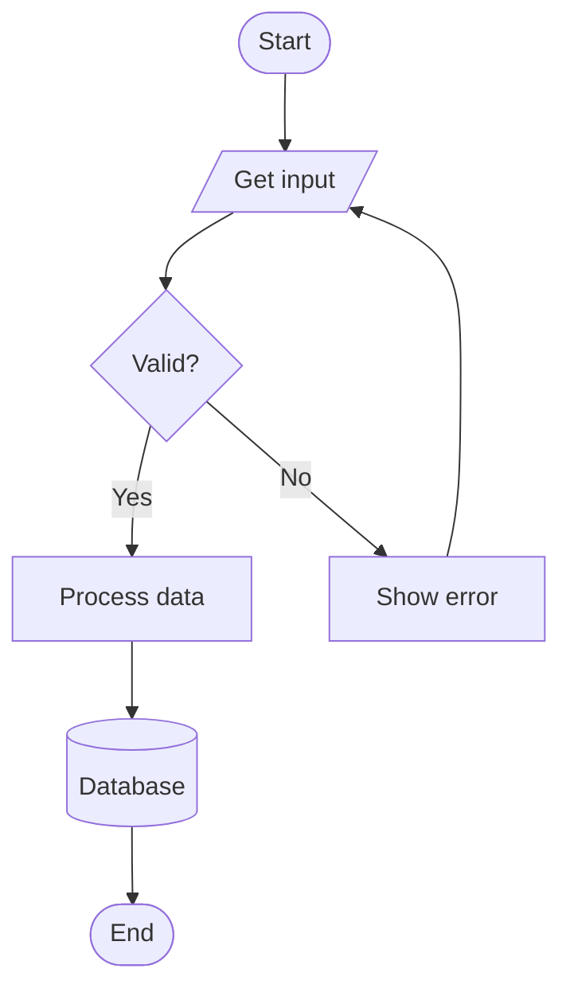

### 4.3 Fork & Join (Parallelism)

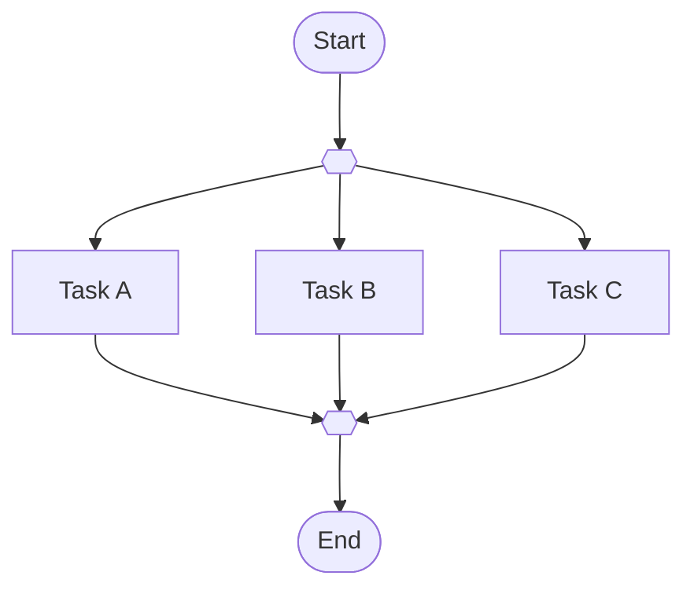

> [!note] Fork/join shape
> Use `{{ }}` for the bold horizontal bar. (You can also use a long underscore node, but `{{}}` is cleaner.)

### 4.4 Swimlanes via `subgraph`

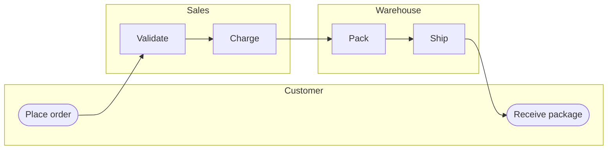

### 4.5 Styling & Classes

```mermaid
flowchart LR
    A[start] --> B[process]
    B --> C{ok?}
    C -- yes --> D[done]
    C -- no --> E[retry]

    style A fill:#efe,stroke:#363
    style D fill:#eef,stroke:#336
    style E fill:#fee,stroke:#933

    %% Apply same style to many nodes
    classDef warn fill:#fee,stroke:#933
    class B,E warn
```

### 4.6 Approximating Use Case Diagrams

```mermaid
flowchart LR
    Customer(["👤 Customer"])
    Admin(["👤 Admin"])

    subgraph System["ATM System"]
        direction TB
        UC1[/Withdraw/]
        UC2[/Balance/]
        UC3[/Refill/]
    end

    Customer --- UC1
    Customer --- UC2
    Admin --- UC2
    Admin --- UC3

    style Customer fill:#efe,stroke:#363
    style Admin fill:#efe,stroke:#363
    style System fill:#eef,stroke:#336
```

See [[use-case-and-package-diagrams]] for the full treatment.

---

## 5. `mindmap` — For Concept Overviews

Mermaid v9.4+ supports mind maps. Great for **table of contents**, **concept maps**, and **diagram overviews**.

### 5.1 Syntax

```mermaid
mindmap
    root((OOP))
        Pillars
            Encapsulation
            Inheritance
            Polymorphism
            Abstraction
        Principles
            SOLID
            DRY
            KISS
        Diagrams
            Class
            Sequence
            State
            Activity
```

### 5.2 Node Shapes & Styling

```mermaid
mindmap
    root((Diagrams))
        id1[Square]
        id2(Rounded)
        id3((Circle))
        id4)Cloud(
        id5{{Hexagon}}
```

> [!warning] Mindmap gotchas
> - Indentation **must** be consistent (use spaces, not tabs).
> - Each child must be more indented than its parent.
> - Mindmaps **don't support links** between arbitrary nodes — purely hierarchical.

### 5.3 Teaching Use Case

Use mindmaps as **chapter overviews** at the top of long notes. They give students a 5-second orientation before they dive in. See [[uml-overview]] for an example.

---

## 6. `timeline` — For Histories & Roadmaps

Mermaid v10+ supports timelines. Great for **UML history**, **project milestones**, **object lifecycles over time**.

### 6.1 Syntax

```mermaid
timeline
    title History of UML
    1980s : Booch Method
         : OMT
         : OOSE
    1995 : Unified Method
    1997 : UML 1.0 (OMG)
    2005 : UML 2.0
    2017 : UML 2.5.1
```

### 6.2 Multi-event Periods

```mermaid
timeline
    title Order lifecycle
    section Day 1
        Created : User places order
              : Confirmation email sent
    section Day 2
        Paid : Payment captured
            : Inventory reserved
    section Day 3
        Shipped : Tracking number issued
              : Carrier picked up
    section Day 5
        Delivered : Customer signs
```

> [!note] Timeline vs State diagram
> A **timeline** shows events at concrete time points (a *particular* order's journey). A **state diagram** shows the *general* state machine (any order's possible journey). Use timeline for **stories**; use state for **rules**.

---

## 7. `erDiagram` — For Data Models (Not Object Diagrams!)

Mermaid has an `erDiagram` keyword for **entity-relationship diagrams** — useful when teaching OOP next to databases.

> [!warning] Don't confuse ER diagrams with object diagrams!
> - **ER diagram** = database schema (entities, attributes, foreign keys).
> - **Object diagram** = runtime snapshot of instances.
> See [[object-diagrams]] for the difference.

### 7.1 Syntax

```mermaid
erDiagram
    CUSTOMER ||--o{ ORDER : places
    ORDER ||--|{ LINE_ITEM : contains
    LINE_ITEM }o--|| PRODUCT : references

    CUSTOMER {
        int id PK
        string name
        string email
    }
    ORDER {
        int id PK
        int customer_id FK
        date created_on
    }
    LINE_ITEM {
        int id PK
        int order_id FK
        int product_id FK
        int quantity
    }
    PRODUCT {
        int id PK
        string sku
        string name
        decimal price
    }
```

### 7.2 Cardinality Symbols

| Symbol   | Meaning               |
| -------- | --------------------- |
| `\|\|`   | Exactly one           |
| `\|o`    | Zero or one           |
| `o{`     | Zero or more          |
| `\|{`    | One or more           |
| `}o`     | Many (zero or more) on this side |
| `}\|`    | One or more on this side          |

> [!tip] Mapping ER → Class Diagram
> Each entity → class. Each `FK` → an association. `PK` becomes the class's `id` attribute. ER shows **data**, class diagrams show **behavior too**.

---

## 8. `gitGraph` — Bonus: For Version Control Histories

Useful in teaching material that touches on **collaboration**.

```mermaid
gitGraph
    commit id: "init"
    commit id: "add User class"
    branch feature/order
    checkout feature/order
    commit id: "add Order"
    commit id: "add LineItem"
    checkout main
    merge feature/order
    commit id: "release v1.0"
```

---

## 9. Common Pitfalls & Gotchas

> [!danger] Mermaid gotchas to memorize
> 1. **Indentation must be consistent** — never mix tabs and spaces.
> 2. **`classDiagram` doesn't allow newlines inside attribute declarations** — each member on its own line.
> 3. **Special characters in labels**: `:`, `;`, `&` may need quoting or escaping. Use `"label with: colon"` in `flowchart` (not always in other diagram types).
> 4. **Comments** in Mermaid: `%%` for line comments (works in `classDiagram`, `sequenceDiagram`; **not** in `mindmap`).
> 5. **`direction` keyword** inside `classDiagram` and `flowchart` controls layout (`TB`, `LR`, `BT`, `RL`).
> 6. **HTML in labels**: `flowchart` supports `<b>`, `<i>`, `<br/>`, `<font color="...">`. `classDiagram` does **not**.
> 7. **Emojis work** as node text in `flowchart` and `sequenceDiagram` — great for visual cues.
> 8. **Long labels**: use `<br/>` (in flowchart) or `\n` (in classDiagram) for line breaks.
> 9. **`participant` aliases**: `participant A as Alice` displays "Alice" but you reference it as `A` everywhere.
> 10. **Quoting multiplicity**: `Customer "1" --> "0..*" Order` — quotes are mandatory for `*`.

### 9.1 Debugging Checklist

If your diagram won't render:

1. ✅ Are you using the right fenced code block? ` ```mermaid ` not ` ```Mermaid `.
2. ✅ Are all `{`, `}`, `(`, `)` balanced?
3. ✅ Are all `:`, `;` not in unquoted labels?
4. ✅ Try replacing `:` inside labels with ` -` or quoting the label.
5. ✅ Paste into https://mermaid.live/ to see exact error messages.

---

## 10. Recipe Section — "To Show X, Use Y Diagram"

| If you want to show…                                  | Use this diagram (Mermaid keyword) |
| ----------------------------------------------------- | ---------------------------------- |
| Classes, attributes, methods, inheritance             | `classDiagram`                     |
| A snapshot of objects at runtime                      | `flowchart` with rich labels        |
| Object interactions over time                         | `sequenceDiagram`                  |
| A single object's lifecycle (states)                  | `stateDiagram-v2`                  |
| A workflow across multiple steps/actors               | `flowchart`                         |
| An algorithm with branches and loops                  | `flowchart`                         |
| Parallel branches in a workflow                       | `flowchart` with `{{ }}` fork/join |
| Actors and their goals (requirements)                 | `flowchart` (approximation)         |
| Modules/namespaces and their dependencies             | `classDiagram` with `package`      |
| A database schema                                     | `erDiagram`                         |
| A high-level overview / table of contents             | `mindmap`                          |
| A historical timeline (UML history, project roadmap)  | `timeline`                         |
| Version control branches & merges                     | `gitGraph`                         |
| Conditional flows in a sequence                       | `sequenceDiagram` with `alt`/`opt` |
| A loop in a sequence                                  | `sequenceDiagram` with `loop`      |
| Parallel async calls                                  | `sequenceDiagram` with `par`/`and` |
| Decision points in a state machine                    | `stateDiagram-v2` with `<<choice>>`|
| Nested states                                         | `stateDiagram-v2` with `state X { }` |
| Swimlanes (who does what)                             | `flowchart` with `subgraph`         |

---

## 11. A Kitchen-Sink Example — All Six Diagram Types for One System

> System: a tiny blog engine with Users, Posts, and Comments.

### 11.1 Class Diagram

```mermaid
classDiagram
    class User {
        +id: int
        +email: str
        +verify_password(pwd) bool
    }
    class Post {
        +id: int
        +title: str
        +body: str
        +author: User
        +publish() void
    }
    class Comment {
        +id: int
        +body: str
        +author: User
    }
    User "1" --> "0..*" Post : writes
    Post "1" *-- "0..*" Comment : has
    User "1" --> "0..*" Comment : writes
```

### 11.2 Object Diagram (snapshot)

```mermaid
flowchart LR
    u["<b>u : User</b>\nid=1\nemail='alice@x.com'"]
    p["<b>p : Post</b>\nid=10\ntitle='Hello'"]
    c1["<b>c1 : Comment</b>\nid=100\nbody='Nice!'"]
    c2["<b>c2 : Comment</b>\nid=101\nbody='Thanks'"]
    u --> p : writes
    p --> c1 : has
    p --> c2 : has
    u --> c1 : writes
```

### 11.3 Sequence Diagram — Publish a post

```mermaid
sequenceDiagram
    autonumber
    actor U as Author
    participant C as PostController
    participant S as PostService
    participant R as PostRepository

    U->>C: POST /posts {title, body}
    C->>S: publish(dto, user)
    S->>S: validate(dto)
    S->>R: save(post)
    R-->>S: saved_post
    S-->>C: post
    C-->>U: 201 Created
```

### 11.4 State Diagram — Post lifecycle

```mermaid
stateDiagram-v2
    [*] --> Draft
    Draft --> Published : publish()
    Published --> Archived : archive()
    Archived --> Published : republish()
    Draft --> [*] : delete()
```

### 11.5 Activity Diagram — Comment moderation

```mermaid
flowchart TD
    New([New comment]) --> Spam{Spam?}
    Spam -- Yes --> Reject[Reject & log]
    Spam -- No --> Hold[Hold for moderation]
    Hold --> Approve{Moderator approves?}
    Approve -- Yes --> Publish[Publish comment]
    Approve -- No --> Reject
    Reject --> End([End])
    Publish --> End
```

### 11.6 Package Diagram

```mermaid
classDiagram
    package Presentation {
        class PostController
        class CommentController
    }
    package Application {
        class PostService
        class CommentService
        class SpamFilter
    }
    package Domain {
        class User
        class Post
        class Comment
    }
    package Infrastructure {
        class PostRepository
        class CommentRepository
        class Database
    }
    Presentation ..> Application
    Application ..> Domain
    Application ..> Infrastructure
    Infrastructure ..> Domain
```

> [!success] You now have a complete visual vocabulary
> With these six diagram types, you can model **any** OOP system from requirements through architecture to runtime behavior.

---

## 12. Where to Practice

- **Mermaid Live Editor** — https://mermaid.live/ — paste and debug live.
- **Obsidian** — write Mermaid in any note; it renders inline.
- **GitHub/GitLab** — Mermaid renders in Markdown files and PR comments.
- **Mermaid docs** — https://mermaid.js.org/intro/ — full syntax reference.

---

## 13. Key Takeaways

> [!summary] Six things to remember
> 1. **Mermaid renders natively in Obsidian** — just use ` ```mermaid ` code fences.
> 2. **Six diagram types cover OOP**: `classDiagram`, `sequenceDiagram`, `stateDiagram-v2`, `flowchart`, `mindmap`, `timeline`. Add `erDiagram` and `gitGraph` for bonus coverage.
> 3. **For class diagrams**: `<\|--` inheritance, `<|..` realization, `o--` aggregation, `*--` composition, `..>` dependency.
> 4. **For sequence diagrams**: `->>` sync, `--)` async, `-->>` return, `+`/`-` activation, `alt`/`opt`/`loop`/`par` frames.
> 5. **For state diagrams**: `[*]` initial/final, `From --> To : event[guard] / action`, `state X { ... }` for nesting.
> 6. **For activity diagrams**: use `flowchart` with `[ ]` activities, `{ }` decisions, `([ ])` start/end, `{{ }}` fork/join, `subgraph` for swimlanes.

---

## 14. Cross-References

- 📚 [[uml-overview]] — which diagrams matter and why
- 🧱 [[class-diagrams]] — full class diagram deep-dive
- 📸 [[object-diagrams]] — runtime snapshots (via `flowchart`)
- 💌 [[sequence-diagrams]] — message-passing deep-dive
- 🔄 [[state-and-activity-diagrams]] — lifecycles and workflows
- 🎭 [[use-case-and-package-diagrams]] — requirements and modules
- 🏛 [[encapsulation]] · [[inheritance]] · [[polymorphism]] · [[abstraction]] — the pillars these diagrams visualize
- ⚙️ [[solid-principles]] · [[design-patterns-structural]] · [[design-patterns-behavioral]] — the principles these diagrams enforce
