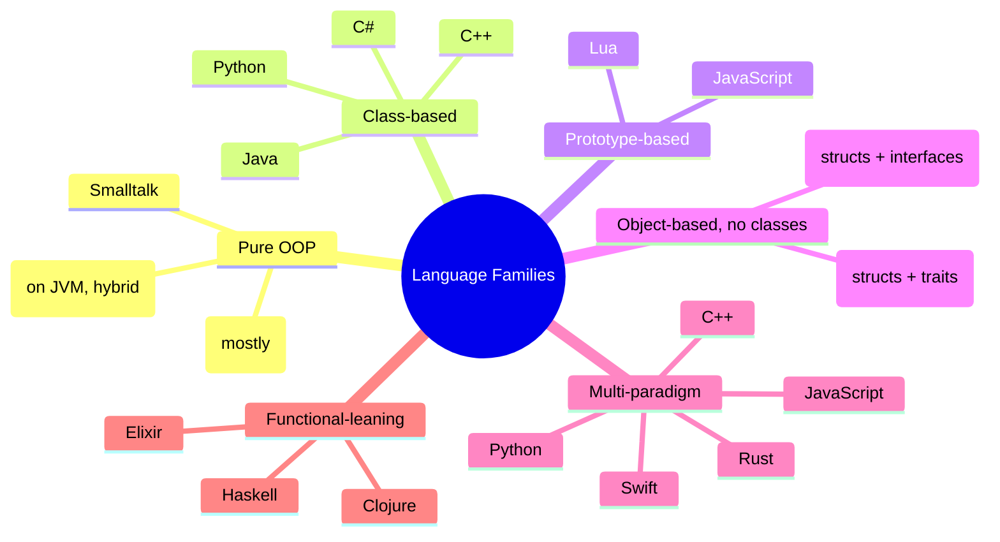
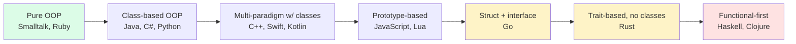
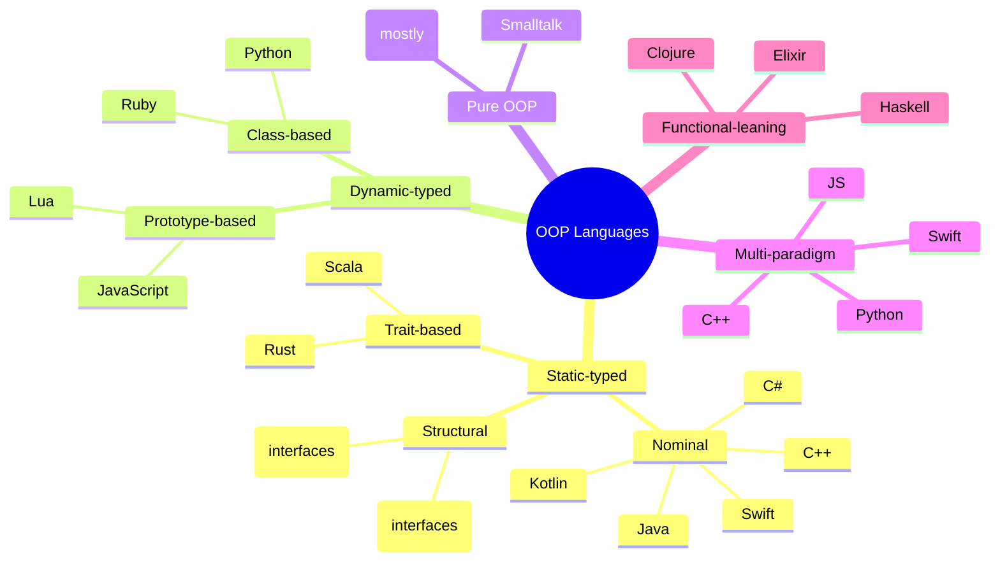

> [!info] Who This Note Is For
> You want a bird's-eye view of how OOP looks across the major languages — perhaps to pick a second language, perhaps to read code in a polyglot codebase, perhaps for an interview that asks "compare OOP in X and Y." This note maps the territory.

> [!tip] Prerequisite
> Read [[what-is-oop]] and [[paradigm-comparison]] first. The pairwise notes ([[python-vs-java-oop]], [[python-vs-cpp-oop]], [[python-vs-javascript-oop]]) go deeper than this survey.

## 1. The Big Picture

Object-Oriented Programming is a *paradigm*, not a language feature. Different languages realize it with different mechanisms — and some (Go, Rust) deliberately avoid calling it "OOP" while still letting you structure code around data and behavior.

> [!quote] Alan Kay's definition (1970s)
> OOP is about **message passing** between autonomous objects, with **state encapsulation** and **late binding**. By Kay's original definition, **Smalltalk** is OOP; Java is "ALGOL with classes"; C++ is "C with classes"; Python is "C with classes plus first-class functions."



---

## 2. The Grand Comparison Table

| Feature | **Python** | **Java** | **C++** | **C#** | **JavaScript** | **Ruby** | **Go** |
|---|---|---|---|---|---|---|---|
| Paradigm | Multi-paradigm | OOP-first | Multi-paradigm | Multi-paradigm | Multi-paradigm | Pure OOP-ish | Procedural + interfaces |
| Typing | Dynamic + optional hints | Static, nominal | Static, nominal | Static, nominal | Dynamic (TS adds static) | Dynamic | Static, structural |
| Compilation | Bytecode interp. | JVM bytecode | Native | .NET (CLR/JIT) | JIT (V8) | Bytecode interp. | Native |
| Memory | Refcount + cyclic GC | JVM GC | Manual + RAII + smart ptrs | CLR GC | V8 GC | Mark-and-sweep | GC |
| Class-based? | Yes | Yes | Yes | Yes | No (prototype-based; `class` is sugar) | Yes | No (structs) |
| Multiple inheritance | Yes (MRO/C3) | No (interfaces only) | Yes (with virtual inheritance) | No (interfaces only) | No (mixins) | No (modules) | N/A |
| Inheritance mechanism | Class bases | `extends` + `implements` | `:`, virtual | `:` | `extends` (prototype chain) | `<` | None (embedding) |
| Encapsulation | Convention (`_`, `__`) | `private`/`protected`/`public` | `public`/`protected`/`private` | `private`/`protected`/`public`/`internal` | `#private` (ES2022) | `private` (Ruby 3.0+) | Capitalized = exported |
| Interface concept | `Protocol` (structural) / `ABC` | `interface` (nominal) | Pure abstract class | `interface` (nominal) | (informal — duck typing) | Module mixins | `interface` (structural, implicit) |
| Generics | `typing.Generic` (erased) | Erased (`<T>`) | Templates (compile-time) | Reified (`<T>`) | (TypeScript only) | None | No (since 1.18: yes — type params) |
| Variance | Declaration-site via TypeVar | Use-site wildcards | Templates (no variance notion) | Declaration-site (`out`/`in`) | TS: structural | N/A | Invariant type params |
| Operator overloading | Yes (dunder methods) | No | Yes (`operator+`) | Yes (`operator+`) | No (no overloading at all) | Yes (methods named `+`) | No |
| Method dispatch | Always dynamic | Virtual by default (instance methods) | Static by default; `virtual` opts in | Virtual by default | Dynamic (prototype lookup) | Dynamic | Static; interfaces use vtable |
| `final`/`sealed` | `typing.final` (hint) | `final` | `final` | `sealed` | `Object.seal` (different) | `final` modules (Ruby 3+) | N/A |
| Constructor name | `__init__` | Same as class | Same as class (with init list) | Same as class | `constructor` | `initialize` | N/A (factory functions) |
| Destructor / cleanup | `__del__` (unreliable); `with` | `finalize()` (unreliable); try-with-resources | `~Class()` (RAII) | `~Class()` (deterministic via `IDisposable`) | `with`-like patterns rare | `finalizer` rare | `defer` |
| Properties | `@property` | `getX`/`setX` convention; `record` | No first-class (write getters/setters) | First-class (C# 1.0+) | `get`/`set` keywords | `attr_accessor` | No (idiomatic: methods) |
| Lambdas / closures | `lambda` + nested `def` | Lambdas (single-method iface) | Lambdas (C++11) | Lambdas / delegates | Arrow functions (first-class) | Blocks / Procs / lambdas | Function values / closures |
| First-class functions | Yes | Sort of (lambdas) | Yes (lambdas, function ptrs) | Yes (delegates) | Yes | Yes (blocks) | Yes |
| Pattern matching | Limited (3.10+ `match`) | No (switch only) | No | `switch` expressions (C# 8+) | No (switch only) | `case`/`when` | No (switch only) |
| Async model | `async`/`await` + asyncio | Threads + CompletableFuture | Threads + coroutines (C++20) | `async`/`await` + Task | `async`/`await` + promises | Fibers / Ractors | Goroutines + channels |
| Null handling | `None`; `typing.Optional` | `null`; `Optional<T>` | `nullptr`; `std::optional` | `null`; `Nullable<T>`; `?` | `null`/`undefined`; `?.` | `nil`; safe navigation `&.` | `nil` (pointers only); no null for values |
| Error handling | Exceptions (all unchecked) | Exceptions (checked + unchecked) | Exceptions (zero-cost) | Exceptions | Exceptions (`throw`/`try`/`catch`) | Exceptions | Panic + error return values |
| Metaprogramming | Metaclasses, decorators, `__init_subclass__` | Annotation processors | Templates, macros (limited) | Reflection, attributes, source generators | `Proxy`, `Reflect`, decorators (stage 3) | Open classes, `method_missing`, metaclasses | `reflect` package; code generation |
| Standard library size | Large | Large | Moderate (STL) | Large | Small (browser); Node OK | Large | Excellent for systems |
| Build / package tooling | pip, Poetry, uv | Maven, Gradle | CMake, vcpkg | NuGet, MSBuild | npm, yarn, pnpm | RubyGems, Bundler | go mod |
| Testing convention | pytest | JUnit | GoogleTest, Catch2 | xUnit/NUnit | Jest/Vitest | RSpec | testing (stdlib) |
| Signature OOP feature | Duck typing + dunder methods | Everything-is-an-object + interfaces | Templates + RAII + zero-cost abstractions | Properties + LINQ + async/await | Prototypes + first-class functions | Blocks + open classes + DSL-friendliness | Implicit interface satisfaction + goroutines |

---

## 3. Per-Language OOP Profile

### 3.1 Python

- **Typing discipline:** dynamic, with optional static hints (PEP 484) checked by `mypy`/`pyright`.
- **Inheritance model:** multiple inheritance, C3 MRO.
- **Encapsulation:** social convention (`_`, `__` mangling); `@property` for hooks.
- **Interface concept:** `abc.ABC` (nominal) and `typing.Protocol` (structural).
- **Generics:** `typing.Generic`/`TypeVar`, erased at runtime.
- **Memory model:** refcount + cyclic GC (CPython).
- **Signature OOP feature:** **duck typing + dunder methods**. Anything with `__len__` works with `len()`. See [[magic-methods]] and [[protocols-and-type-hints]].

### 3.2 Java

- **Typing discipline:** static, nominal, manifest.
- **Inheritance model:** single class + multiple interfaces (with `default` methods).
- **Encapsulation:** language-enforced `private`/`protected`/`public`/package-private.
- **Interface concept:** first-class `interface` (nominal), with `default` and `static` methods since Java 8.
- **Generics:** erased at compile time.
- **Memory model:** JVM generational GC; everything on heap (except primitives).
- **Signature OOP feature:** **interfaces + everything-is-an-object** (modulo primitives).

### 3.3 C++

- **Typing discipline:** static, with templates (Turing-complete code generation).
- **Inheritance model:** multiple inheritance; virtual inheritance for diamonds.
- **Encapsulation:** `public`/`protected`/`private` keywords; `friend` for escape hatches.
- **Interface concept:** pure abstract class (no language-level `interface` keyword).
- **Generics:** templates — compile-time monomorphization, no erasure.
- **Memory model:** manual (`new`/`delete`), RAII, smart pointers.
- **Signature OOP feature:** **RAII + zero-cost abstractions + value semantics**.

### 3.4 C#

- **Typing discipline:** static, nominal, with rich type inference (`var`, target-typed `new`).
- **Inheritance model:** single class + multiple interfaces.
- **Encapsulation:** `public`/`protected`/`private`/`internal`/`protected internal`.
- **Interface concept:** first-class `interface` (nominal), with default methods since C# 8.
- **Generics:** **reified** — generics exist at runtime (unlike Java/C++/Python).
- **Memory model:** CLR GC; structs are value types (stack-allocated by default).
- **Signature OOP feature:** **properties (first-class) + LINQ + async/await + reified generics**. Closest cousin to Java, but with several decades of polish.

### 3.5 JavaScript

- **Typing discipline:** dynamic (TypeScript adds structural static layer).
- **Inheritance model:** single class via `extends`; prototype chain.
- **Encapsulation:** `#private` (truly private since ES2022); convention otherwise.
- **Interface concept:** none at runtime (TypeScript has `interface`).
- **Generics:** none at runtime (TypeScript only).
- **Memory model:** V8 GC.
- **Signature OOP feature:** **prototypes + first-class functions**. See [[python-vs-javascript-oop]].

### 3.6 Ruby

- **Typing discipline:** dynamic, duck-typed (more so than Python — even fewer type hints in idiomatic code).
- **Inheritance model:** single class inheritance + module mixins.
- **Encapsulation:** `private`/`protected` keywords (Ruby 3.0+ more explicit); convention.
- **Interface concept:** no formal interfaces — modules + duck typing.
- **Generics:** none.
- **Memory model:** mark-and-sweep GC.
- **Signature OOP feature:** **blocks + open classes + `method_missing` + DSL-friendliness**. "Everything is an object" more strictly than Python (even integers are `Integer` instances with methods).

### 3.7 Go

- **Typing discipline:** static, **structural** (interfaces satisfied implicitly).
- **Inheritance model:** **no classes, no inheritance**. Structs embed other structs (composition).
- **Encapsulation:** capitalization (exported if first letter uppercase).
- **Interface concept:** **implicit, structural** — `interface { Method() }` is satisfied by any type with that method, no `implements` keyword.
- **Generics:** added in Go 1.18 (type parameters).
- **Memory model:** GC, with escape analysis putting many objects on the stack.
- **Signature OOP feature:** **implicit interface satisfaction** — the polar opposite of Java. "If it walks like a duck, the compiler figures it out."

> [!note] Go's deliberate choice
> Go's designers (Pike, Thompson, Griesemer) **rejected classes and inheritance** explicitly. They wanted composition over inheritance at the language level. Methods are defined on structs via a receiver; interfaces are satisfied implicitly. This makes Go feel procedural + interface-oriented rather than OOP.

---

## 4. Paradigm Positioning

> [!quote] Different languages occupy different points on the OOP spectrum



### 4.1 "Pure" OOP (Smalltalk, Ruby-ish)

- **Everything is an object**, including integers, booleans, classes.
- All operations are message sends (`2 + 3` is `2.send(:+, 3)`).
- Blocks/closures are core to the syntax.
- In Smalltalk: control flow (`ifTrue:`, `whileTrue:`) is also message sends.

### 4.2 Multi-paradigm (Python, JS, C++, C#, Swift, Kotlin)

- Classes exist but are not the only way to structure code.
- Functions are first-class; standalone functions are normal.
- Multiple paradigms coexist (OOP + functional + procedural).

### 4.3 "Objects without classes" (Go, Rust)

- **Go:** structs + methods + implicit interfaces. No inheritance. Composition by embedding.
- **Rust:** structs + traits (interfaces) + `impl` blocks. No inheritance. Ownership model instead of GC.

These languages let you encapsulate state and dispatch on types — the *substance* of OOP — without classical inheritance.

### 4.4 Deliberately non-OOP (Haskell, Clojure, Elixir)

- Functional languages prefer immutable data + pure functions.
- Clojure has *records* and *protocols* — a nod to OOP — but the dominant idiom is data transformation.
- Haskell's type classes are conceptually opposite to OOP interfaces (dispatch on type, not on value).

---

## 5. The Same Example in 5 Languages

> [!example] Goal
> An `Animal` base, `Dog` subclass with `speak()`, polymorphic call.

### 5.1 Python

```python
from abc import ABC, abstractmethod

class Animal(ABC):
    def __init__(self, name: str) -> None:
        self.name = name
    @abstractmethod
    def speak(self) -> str: ...

class Dog(Animal):
    def speak(self) -> str:
        return f"{self.name} says Woof"

animals: list[Animal] = [Dog("Rex")]
for a in animals:
    print(a.speak())
```

### 5.2 Java

```java
abstract class Animal {
    private final String name;
    public Animal(String name) { this.name = name; }
    public String name() { return name; }
    public abstract String speak();
}

class Dog extends Animal {
    public Dog(String name) { super(name); }
    @Override public String speak() { return name() + " says Woof"; }
}

List<Animal> animals = List.of(new Dog("Rex"));
for (Animal a : animals) System.out.println(a.speak());
```

### 5.3 C++

```cpp
#include <iostream>
#include <memory>
#include <vector>
#include <string>

struct Animal {
    std::string name;
    Animal(std::string n) : name(std::move(n)) {}
    virtual ~Animal() = default;
    virtual std::string speak() const = 0;
};

struct Dog : Animal {
    Dog(std::string n) : Animal(std::move(n)) {}
    std::string speak() const override { return name + " says Woof"; }
};

int main() {
    std::vector<std::unique_ptr<Animal>> animals;
    animals.push_back(std::make_unique<Dog>("Rex"));
    for (const auto& a : animals) std::cout << a->speak() << "\n";
}
```

### 5.4 JavaScript

```javascript
class Animal {
  constructor(name) { this.name = name; }
  speak() { throw new Error("abstract"); }
}

class Dog extends Animal {
  speak() { return `${this.name} says Woof`; }
}

const animals = [new Dog("Rex")];
for (const a of animals) console.log(a.speak());
```

### 5.5 Go (no inheritance!)

```go
package main

import "fmt"

// No base class — define an interface instead.
type Animal interface {
    Name() string
    Speak() string
}

type Dog struct{ name string }

func NewDog(name string) *Dog { return &Dog{name: name} }
func (d *Dog) Name() string   { return d.name }
func (d *Dog) Speak() string  { return d.name + " says Woof" }

func main() {
    var animals []Animal = []Animal{NewDog("Rex")}
    for _, a := range animals {
        fmt.Println(a.Speak())
    }
}
```

> [!note] Notice Go
> No inheritance, no `abstract`, no `class`. The `Animal` interface is satisfied *implicitly* by `*Dog` because `*Dog` has both methods. This is **structural typing** at compile time — same idea as Python's `Protocol`, but mandatory and statically checked.

### 5.6 (Bonus) Ruby

```ruby
class Animal
  def initialize(name)
    @name = name
  end
  attr_reader :name
  def speak
    raise NotImplementedError
  end
end

class Dog < Animal
  def speak
    "#{name} says Woof"
  end
end

animals = [Dog.new("Rex")]
animals.each { |a| puts a.speak }
```

### 5.7 Side-by-side summary

| Concept | Python | Java | C++ | JS | Go |
|---|---|---|---|---|---|
| Base type | `ABC` + `@abstractmethod` | `abstract class` | pure virtual method | runtime throw | `interface` |
| Subclass syntax | `class Dog(Animal):` | `class Dog extends Animal` | `struct Dog : Animal` | `class Dog extends Animal` | none (implicit) |
| Method override | redefine | `@Override` (optional) | `override` keyword | redefine | redefine |
| Polymorphic container | `list[Animal]` | `List<Animal>` | `vector<unique_ptr<Animal>>` | array (dynamic) | `[]Animal` |
| Memory management | GC | GC | manual / smart ptr | GC | GC |
| Lines of code | ~10 | ~10 | ~15 | ~9 | ~14 |

---

## 6. How Language Design Shapes OOP Style

### 6.1 Java — "everything is an object" (modulo primitives)

Java's philosophy: classes are the unit of code organization. Functions don't exist outside classes. This:
- Forces you to think in terms of nouns (objects) rather than verbs (functions).
- Encourages deep class hierarchies (which Java's design community has since regretted — Effective Java now recommends composition + interfaces over inheritance).
- Makes patterns like Visitor / Strategy / Command very visible because they require explicit interfaces and many small classes.

### 6.2 Python — "everything is an object, AND functions are first-class"

Python takes Java's everything-is-an-object idea and adds: functions are objects too. This means:
- A "strategy" can be a function, not a class with one method.
- Decorators are higher-order functions, not annotations.
- Many Java design patterns collapse to "just use a function."
- `functools.singledispatch` provides multimethods without classes.

> [!example] Strategy pattern, two ways
> ```python
> # Java-brain: strategy as a class hierarchy
> from abc import ABC, abstractmethod
> class Sorter(ABC):
>     @abstractmethod
>     def sort(self, xs): ...
> class QuickSorter(Sorter):
>     def sort(self, xs): return sorted(xs)  # pretend
>
> # Pythonic: strategy as a function
> def quicksort(xs): return sorted(xs)
> def process(data, sort_fn=sorted):
>     return sort_fn(data)
> ```

### 6.3 C++ — "zero-cost abstractions over the hardware"

C++ OOP is shaped by the goal of "if you don't use it, you don't pay for it":
- Methods are non-virtual by default (no vtable cost unless you ask).
- Templates generate specialized code per type (no dynamic dispatch).
- RAII makes resource management deterministic and exception-safe.
- Value semantics make objects cheap to pass around (with move semantics).
- The result: OOP that compiles to fast, predictable machine code.

### 6.4 Go — "composition over inheritance, enforced"

Go's design rejects inheritance at the language level:
- Structs embed other structs; the outer struct "promotes" the inner's methods.
- Interfaces are satisfied implicitly (structural typing).
- This forces composition. You cannot build deep type hierarchies even if you want to.
- The trade-off: code reuse is harder for "is-a" relationships; you write more delegation code.

### 6.5 Ruby — "developer happiness and DSLs"

Ruby optimizes for **expressiveness and programmer joy**:
- Open classes — you can add methods to `String` at runtime.
- `method_missing` — dynamic dispatch to undefined methods.
- Blocks — concise syntax for callbacks and iteration.
- The result: Ruby code often looks like a domain-specific language. Rails leverages this heavily.

### 6.6 JavaScript — "prototypes and functions, all the way down"

JS's design constraints (10-day implementation, embedded in browsers, must support event-driven UI):
- Prototypes (not classes) — simpler implementation in 1995.
- First-class functions (because UI callbacks need them).
- Single-threaded event loop — async is unavoidable.
- The result: OOP is one tool among many; functional-reactive patterns are equally idiomatic.

---

## 7. Mermaid Mind-Map: Language Families



---

## 8. When a Student Should Learn Which Language for OOP

> [!tip] This is a *pedagogical* recommendation, not a ranking.

| Goal | Recommended first language for OOP | Why |
|---|---|---|
| Learn OOP fundamentals with maximum rigor | **Java** | Forces classes, interfaces, types — you can't escape OOP concepts. |
| Learn OOP quickly with minimal ceremony | **Python** | Less boilerplate, immediate feedback, easy to experiment. |
| Understand OOP at the hardware level | **C++** | vtables, value vs reference, RAII — you'll see what Java/Python hide. |
| Learn modern OOP + async + LINQ | **C#** | Best-in-class language design; properties, async/await, LINQ all polished. |
| Web development | **JavaScript (then TypeScript)** | Required for browsers; TS adds static typing. |
| Understand prototype-based OOP | **JavaScript** | The only mainstream prototype-based language. |
| Learn "composition by default" | **Go** | No inheritance forces you to think composition-first. |
| Learn "purest OOP" / DSL design | **Ruby** | Open classes, blocks, message-sending ethos. |
| Learn trait-based / ownership OOP | **Rust** | No classes, no GC; traits + ownership. |
| General OOP fluency for industry | **Java or C#** | Most OOP-heavy jobs. |

> [!example] A suggested 3-language path
> 1. **Python** — to learn OOP without ceremony and build intuition.
> 2. **Java** — to learn OOP with rigor (types, interfaces, access control).
> 3. **C++ or Go** — to see what's *underneath* (memory, dispatch, or composition-only).

---

## 9. Common Confusions Across Languages

> [!warning] Cross-language gotchas
> 1. **"self" vs "this"** — Python requires explicit `self`; Java/JS/C++/C#/Ruby use implicit `this`.
> 2. **"new" or not?** — Java/JS/C#/Ruby require `new`; Python and Go don't.
> 3. **Constructors named after class?** — Yes in Java/C++/C#; `__init__` in Python; `constructor` in JS; `initialize` in Ruby; factory functions in Go.
> 4. **Static vs dynamic dispatch** — Java/Python/C#/JS are dynamic-by-default for instance methods; C++ is static-by-default.
> 5. **Equality semantics** — Java `==` is reference; `.equals()` is value. Python `==` is value (`__eq__`); `is` is identity. JS `===` is value for primitives, reference for objects. Ruby `==` is value (override-able). Go `==` is value (struct field-by-field) for comparable types.
> 6. **Strings immutable?** — Yes in Java, Python, C#, JS, Go. Mutable in C++ (`std::string`) but rarely mutated.
> 7. **Generics reified?** — Only C# (and partly Dart). Java/Python/C++/JS/Go have erased or compile-time-only generics.
> 8. **Null vs nil vs None vs undefined** — different names, different semantics. Go has no null for value types (only pointers).

---

## 10. Key Takeaways

1. **OOP is a paradigm realized many ways.** Don't conflate "OOP" with "Java-style classes."
2. **Static vs dynamic typing** is the single biggest cross-language axis. Static (Java, C#, C++, Go, Rust) vs dynamic (Python, JS, Ruby).
3. **Nominal vs structural subtyping** is the second axis. Nominal: Java, C#, C++, Python-ABC. Structural: Go interfaces, Python `Protocol`, TypeScript interfaces.
4. **Class-based vs prototype-based** distinguishes JS/Lua from the rest. ES6 `class` is sugar.
5. **Composition vs inheritance** is a *style* choice in most languages, but a *language-level* choice in Go and Rust (which reject inheritance).
6. **Memory model shapes OOP heavily:** RAII (C++), GC (Java/Python/C#/JS/Go), ownership (Rust). Python's refcounting is CPython-specific.
7. **Method dispatch models differ:** always-dynamic (Python, JS), virtual-by-default (Java, C#), static-by-default-opt-in-virtual (C++), interface-vtable (Go).
8. **Operator overloading** is supported in Python, C++, C#, Ruby; **not** in Java, JavaScript, Go.
9. **Properties** are first-class in C# and (with `@property`) in Python; require getter/setter boilerplate in Java/C++.
10. **Multi-paradigm languages (Python, JS, C++)** let you mix OOP with functional and procedural styles; **pure-OOP languages (Smalltalk, Ruby)** push you toward everything-as-message-passing.

## 11. Practice Exercises

> [!example] Try these
> 1. Pick **two** languages from this list and implement the same small system (e.g., a 3-shape hierarchy + a polymorphic area-summing function). Compare line counts, type safety, and runtime cost.
> 2. Implement a `Stack` in Go *without classes*. Notice how embedding + interfaces give you encapsulation and polymorphism differently.
> 3. Compare how each language handles a "generic `Box<T>`." Which reify generics? Which erase? Which monomorphize?
> 4. Port a Java `interface`-heavy design to Go. Notice that Go forces you to think composition-first.
> 5. Pick a design pattern (e.g., Observer). Implement it in three languages. Notice which languages collapse the pattern to "just use a function."

## 12. Related Notes

- [[python-vs-java-oop]] · [[python-vs-cpp-oop]] · [[python-vs-javascript-oop]]
- [[language-transfer-guide]] — per-source-language transfer guide
- [[oop-interview-questions]] — interview questions where this comparison matters
- [[what-is-oop]] · [[paradigm-comparison]] · [[history-of-oop]]
- [[inheritance]] · [[polymorphism]] · [[abstraction]] · [[encapsulation]] · [[four-pillars-summary]]
- [[protocols-and-type-hints]] (Python's structural typing)
- [[composition-over-inheritance]]
- [[solid-principles]]
