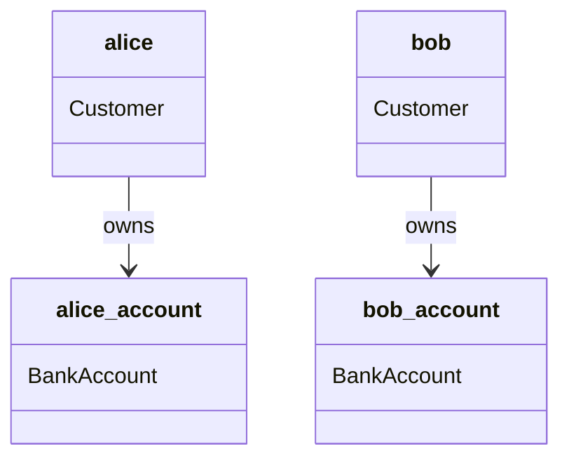
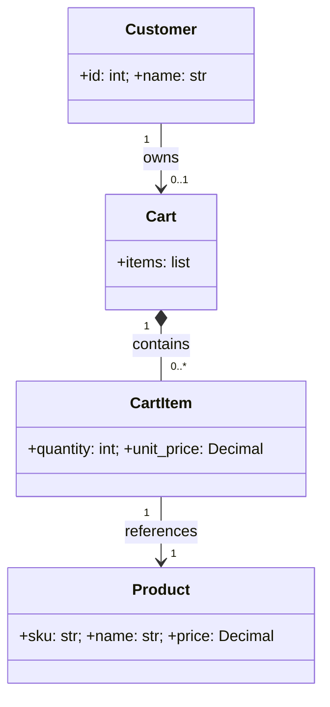
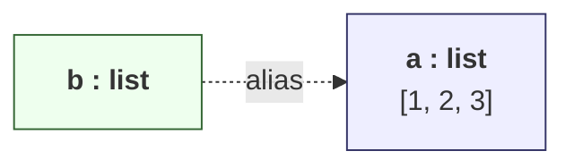
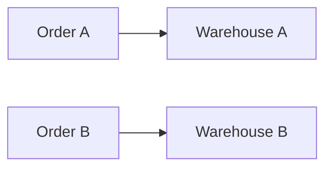
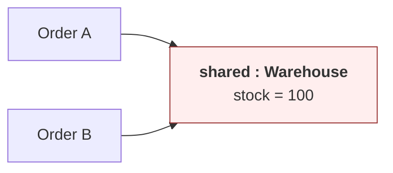

# Object Diagrams — Snapshots of Running Systems

> [!quote] A class diagram is the blueprint; an object diagram is the photograph.
> Class diagrams show what *could exist*. Object diagrams show what *does exist* at one instant.

---

## 1. What Is an Object Diagram?

An **object diagram** is a structural diagram that shows **instances** (objects) of classes, their **attribute values**, and the **links** between them **at a specific moment in time**.

Think of it as a **photograph** of your program's memory at a single instant — like hitting "pause" in the debugger and looking at every object's current state.

| Aspect                | Class Diagram                       | Object Diagram                            |
| --------------------- | ----------------------------------- | ----------------------------------------- |
| Shows                 | Types & relationships               | Instances & links                          |
| Time                  | Static (design-time)                | A specific moment (run-time snapshot)      |
| Names look like       | `BankAccount`                       | `my_account : BankAccount`                 |
| Attribute form        | `+ balance: Decimal`                | `balance = 1500.00`                        |
| Multiplicity          | `1..*`, `0..1`, etc.                | Concrete counts (`3`, `0`)                 |
| Purpose               | Design the structure                | Validate the design, debug, explain        |

> [!tip] Teaching insight
> Object diagrams are an **incredible** teaching tool for three concepts that students routinely struggle with:
> 1. **References vs values** — that two variables can point to the same object.
> 2. **Aliasing** — that mutating through one variable changes what the other sees.
> 3. **Shared state** — when multiple objects hold a reference to a third.

---

## 2. Anatomy of an Object Box

An object is drawn as a rectangle, also with compartments — but the top compartment is different:

```
┌─────────────────────────┐
│  instanceName : Class   │  ← underlined, with a colon
├─────────────────────────┤
│  attribute = value      │  ← concrete values, no types
├─────────────────────────┤
│  (operations omitted)   │  ← methods usually not shown
└─────────────────────────┘
```

Key conventions:

- The name in the top compartment is **underlined** (this is what distinguishes an object from a class).
- Format: `instanceName : ClassName` (the instance name is optional; you can write `: ClassName` for an anonymous instance).
- The middle compartment shows **values**, not types: `balance = 1500.00`.
- Methods are almost never shown — they belong to the class, not the snapshot.

---

## 3. The Problem: Mermaid Doesn't Have Native Object Diagrams

Mermaid has no dedicated `objectDiagram` keyword. We have **two workarounds**, both useful in different cases:

### 3.1 Workaround A — Use `classDiagram` with instance syntax

You can write `instanceName: ClassName` inside a `classDiagram` and underline it visually by using a `note` or by prefixing. The most reliable approach is to declare the classes, then add objects as **notes**:

```mermaid
classDiagram
    class BankAccount {
        +owner: str
        +balance: Decimal
    }
    note for BankAccount "my_account : BankAccount\nbalance = 1500.00\nowner = \"Alice\""
```

But that doesn't show *links between instances* well. The **recommended approach** is Workaround B.

### 3.2 Workaround B — Use `flowchart` with shaped nodes

A flowchart gives you full control over labels and edges, and renders cleanly in Obsidian:

```mermaid
flowchart LR
    acc1["<b>my_account : BankAccount</b>\nowner = 'Alice'\nbalance = 1500.00"]
    acc2["<b>bob_account : BankAccount</b>\nowner = 'Bob'\nbalance = 42.10"]
    cust1["<b>alice : Customer</b>\nid = 1"]
    cust2["<b>bob : Customer</b>\nid = 2"]

    cust1 --> acc1 : owns
    cust2 --> acc2 : owns

    style acc1 fill:#eef,stroke:#336,stroke-width:2px
    style acc2 fill:#eef,stroke:#336,stroke-width:2px
    style cust1 fill:#efe,stroke:#363,stroke-width:2px
    style cust2 fill:#efe,stroke:#363,stroke-width:2px
```

> [!tip] Pattern for object diagrams in Mermaid
> - Use **flowchart** (more flexible labels).
> - Use **`<b>`** for the underlined `name : Class` header.
> - Use **`\n`** for newlines inside a node label.
> - Use **colors** to distinguish classes (e.g., all `BankAccount` instances are blue, all `Customer` instances are green).

### 3.3 Workaround C — Use `classDiagram` with `instanceName:ClassName` notation

Mermaid does allow a *partial* instance notation:



This renders cleanly, but **you cannot display attribute values** in the boxes. It's best when you only care about *structure*, not values.

---

## 4. A Worked Example — An E-Commerce Cart

Let's take a snapshot of a small shopping cart at the moment the user clicks "checkout".

### 4.1 The Class Diagram (for reference)



### 4.2 The Object Diagram — Snapshot at Checkout

```mermaid
flowchart LR
    c["<b>alice : Customer</b>\nid = 42\nname = 'Alice'"]
    cart["<b>cart : Cart</b>\ncreated_at = 2025-07-30T10:15"]

    ci1["<b>item1 : CartItem</b>\nquantity = 2\nunit_price = 19.99"]
    ci2["<b>item2 : CartItem</b>\nquantity = 1\nunit_price = 9.50"]

    p1["<b>p_keyboard : Product</b>\nsku = 'KB-001'\nname = 'Mechanical Keyboard'\nprice = 19.99"]
    p2["<b>p_mouse : Product</b>\nsku = 'MS-001'\nname = 'Wireless Mouse'\nprice = 9.50"]

    c --> cart : owns
    cart --> ci1 : contains
    cart --> ci2 : contains
    ci1 --> p1 : references
    ci2 --> p2 : references

    style c fill:#efe,stroke:#363
    style cart fill:#eef,stroke:#336
    style ci1 fill:#fee,stroke:#933
    style ci2 fill:#fee,stroke:#933
    style p1 fill:#ffe,stroke:#993
    style p2 fill:#ffe,stroke:#993
```

### 4.3 The Corresponding Python Snapshot

```python
from dataclasses import dataclass, field
from decimal import Decimal
from datetime import datetime


@dataclass
class Product:
    sku: str
    name: str
    price: Decimal


@dataclass
class CartItem:
    product: Product
    quantity: int
    unit_price: Decimal  # snapshot of price at add-time

    def subtotal(self) -> Decimal:
        return self.unit_price * self.quantity


@dataclass
class Cart:
    items: list[CartItem] = field(default_factory=list)
    created_at: datetime = field(default_factory=datetime.now)

    def add(self, product: Product, qty: int = 1) -> None:
        self.items.append(CartItem(product, qty, product.price))


@dataclass
class Customer:
    id: int
    name: str
    cart: Cart | None = None


# --- THE SNAPSHOT ---
p_keyboard = Product("KB-001", "Mechanical Keyboard", Decimal("19.99"))
p_mouse    = Product("MS-001", "Wireless Mouse",     Decimal("9.50"))

alice = Customer(id=42, name="Alice")
alice.cart = Cart()
alice.cart.add(p_keyboard, qty=2)
alice.cart.add(p_mouse,    qty=1)

# At this exact instant:
#   - alice owns 1 cart
#   - cart contains 2 items
#   - item1 → p_keyboard (qty 2 @ $19.99)
#   - item2 → p_mouse    (qty 1 @ $9.50)
# Total = 2*19.99 + 1*9.50 = $49.48
print(sum(i.subtotal() for i in alice.cart.items))  # 49.48
```

### 4.4 Reading the snapshot

> At 10:15 on 2025-07-30, **Alice** (customer #42) has a **Cart** containing **2 CartItems**: 2 mechanical keyboards at $19.99 each, and 1 wireless mouse at $9.50. Each `CartItem` references the corresponding `Product`. Total = $49.48.

---

## 5. When Object Diagrams Earn Their Keep in Teaching

Object diagrams shine when you need to explain **runtime phenomena** that class diagrams can't show:

### 5.1 References vs Values



```python
a = [1, 2, 3]
b = a        # b is NOT a copy — same object
b.append(4)
print(a)     # [1, 2, 3, 4]  ← a changed!
```

The diagram makes it obvious: **`b` is an alias** for `a`. Both names point to the *same* object.

### 5.2 Aliasing Through a Shared Object

```mermaid
flowchart LR
    alice["<b>alice : Customer</b>"]
    bob["<b>bob : Customer</b>"]
    acct["<b>shared : BankAccount</b>\nbalance = 1000.00"]

    alice --> acct : account
    bob --> acct : account

    style alice fill:#efe,stroke:#363
    style bob fill:#efe,stroke:#363
    style acct fill:#fee,stroke:#933
```

```python
shared_account = BankAccount(balance=1000)
alice = Customer(name="Alice", account=shared_account)
bob   = Customer(name="Bob",   account=shared_account)

alice.account.withdraw(500)
print(bob.account.balance)  # 500 — Bob sees Alice's withdrawal!
```

> [!warning] Aliasing bugs
> This is exactly the kind of bug that object diagrams make **visible**. Two customers, one account — if Alice withdraws, Bob's view changes too. The diagram shows the single shared object with two arrows pointing at it.

### 5.3 Circular References

```mermaid
flowchart LR
    a["<b>a : Node</b>\nvalue = 1"]
    b["<b>b : Node</b>\nvalue = 2"]
    a --> b : next
    b --> a : prev
    style a fill:#eef,stroke:#336
    style b fill:#eef,stroke:#336
```

```python
@dataclass
class Node:
    value: int
    next: "Node | None" = None
    prev: "Node | None" = None

a = Node(1)
b = Node(2)
a.next = b
b.prev = a
# A doubly-linked cycle. Object diagram makes the symmetry obvious.
```

### 5.4 Null References (the empty link)

```mermaid
flowchart LR
    alice["<b>alice : Customer</b>"]
    bob["<b>bob : Customer</b>"]
    empty["<b>∅</b><br/>(no cart)"]

    alice -.-> empty : cart
    bob --> cart["<b>cart : Cart</b>"]

    style empty fill:#eee,stroke:#999,stroke-dasharray: 4 4
```

```python
alice = Customer(id=1, name="Alice", cart=None)
bob   = Customer(id=2, name="Bob",   cart=Cart())
```

> [!tip] The Optional pattern
> Show `None`/`null` explicitly as a dashed-line target. This visualizes the **multiplicity `0..1`** — the relationship may not exist at all. Maps directly to Python's `Optional[Cart]` / `Cart | None`.

---

## 6. A Debugging Story — Use an Object Diagram

> [!example] The case of the disappearing stock
> A student writes an inventory system. Two `Order` objects share a `Warehouse` reference. The student is confused why **processing Order A** also affects **Order B's** view of stock.

**The mental model they had:**


**The reality (draw the object diagram):**


Both orders point to the **same** warehouse. Reducing stock for Order A reduces it for Order B too. The object diagram *immediately* reveals the aliasing bug that a class diagram could never show.

---

## 7. Generating Object Diagrams From Running Code

A nice exercise is to have students write a Python function that **dumps an object diagram** from live objects. Here's a starter:

```python
def dump_object_diagram(root, seen=None, label="root"):
    """Print a simple text object diagram starting from `root`."""
    if seen is None:
        seen = {}
    obj_id = id(root)
    if obj_id in seen:
        print(f'{label} --> {seen[obj_id]}  # alias')
        return
    seen[obj_id] = label
    cls = type(root).__name__
    attrs = {k: v for k, v in vars(root).items()} if hasattr(root, '__dict__') else {}
    print(f'{label} : {cls}')
    for k, v in attrs.items():
        if hasattr(v, '__dict__'):
            sub_label = f'{label}_{k}'
            print(f'{label} --> {sub_label} : {k}')
            dump_object_diagram(v, seen, sub_label)
        else:
            print(f'    .{k} = {v!r}')


# Usage:
# dump_object_diagram(alice, label='alice')
```

This produces a text-based object graph that mirrors what you'd draw by hand — and is a fantastic debugging aid.

---

## 8. Object Diagram vs ER Diagram — Don't Confuse Them

| Feature            | Object Diagram                       | ER Diagram                              |
| ------------------ | ------------------------------------ | --------------------------------------- |
| Domain             | OO software design                   | Relational database design              |
| Things shown       | Objects with values                  | Entities, attributes, rows              |
| Relationships      | Links (object references)            | Foreign keys                            |
| Mermaid keyword    | (none native — use flowchart)        | `erDiagram`                              |
| Used in OOP teaching | ✅ Yes                              | Mostly no                               |

> [!note] Mermaid has `erDiagram`!
> Mermaid's `erDiagram` is great for *database* schemas. Don't confuse it with object diagrams. See [[mermaid-cheatsheet]] for the syntax.

---

## 9. Tips for Drawing Clean Object Diagrams

> [!success] Five rules of thumb
> 1. **One snapshot per diagram.** If you need to show two states, draw two diagrams side by side.
> 2. **Underline the object name.** Convention: `instance : ClassName`.
> 3. **Show concrete values.** That's the whole point — `balance = 1500.00`, not `balance: Decimal`.
> 4. **Color-code by class.** Helps readers track which instances are which type.
> 5. **Show `null` explicitly.** A dashed-line to a ∅ node makes optionality visible.

---

## 10. Key Takeaways

> [!summary] Six things to remember
> 1. Object diagrams are **snapshots** of instances at one moment in time.
> 2. The object name is **underlined**: `instance : ClassName`.
> 3. Attributes show **values**, not types.
> 4. Mermaid has no native object diagram — use **`flowchart`** with rich HTML labels, or **`classDiagram`** with `instance:Class` notation (no values).
> 5. Object diagrams are **essential for teaching references, aliasing, and shared state**.
> 6. A class diagram answers *"what could exist?"*; an object diagram answers *"what does exist right now?"*.

---

## 11. Practice Exercises

> [!exercise] Exercise 1 — Two carts, one product
> Draw an object diagram showing **two `Cart` instances** that both contain a `CartItem` referencing the **same `Product`**. Then write the Python code that produces this snapshot.

> [!exercise] Exercise 2 — The aliasing bug
> Given:
> ```python
> a = [1, 2, 3]
> b = a
> b.append(4)
> ```
> Draw the object diagram before and after the `append`. What does `a` print? Why?

> [!exercise] Exercise 3 — Family tree
> Model a family with two parents and three children. Each `Person` has a `mother` and `father` attribute (which may be `None`). Draw the object diagram. How many links are there? Where are the nulls?

> [!exercise] Exercise 4 — Linked list
> Draw the object diagram of a 3-node singly-linked list after `head = Node(1); head.next = Node(2); head.next.next = Node(3)`. Then draw it again after `head.next.next.next = head` (a cycle).

> [!exercise] Exercise 5 — Debug this
> A student says: *"I have two `Order`s, but when I add an item to one, it appears in both!"* Draw the object diagram that explains the bug. Fix the code.

> [!exercise] Exercise 6 — Snapshot to class diagram
> Reverse-engineer: given the object diagram below, what does the class diagram look like? What multiplicities?
> ```mermaid
> flowchart LR
>   d["<b>d : Department</b>\nname = 'Eng'"]
>   e1["<b>e1 : Employee</b>\nname = 'Alice'"]
>   e2["<b>e2 : Employee</b>\nname = 'Bob'"]
>   d --> e1
>   d --> e2
> ```

---

## 12. What's Next?

- 🧱 [[class-diagrams]] — the static structure these snapshots instantiate.
- 💌 [[sequence-diagrams]] — how the objects *got* into this state.
- 📋 [[mermaid-cheatsheet]] — full syntax reference for `flowchart`, `classDiagram`, and more.
- 🔗 [[encapsulation]] — how to *prevent* unwanted aliasing by hiding state.
