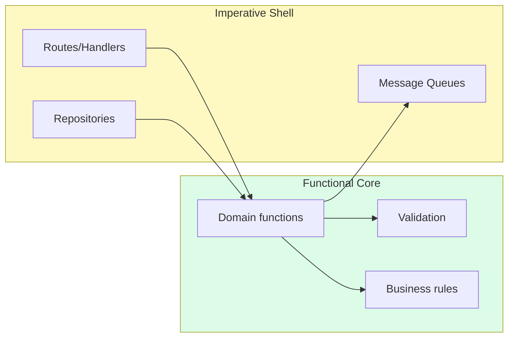
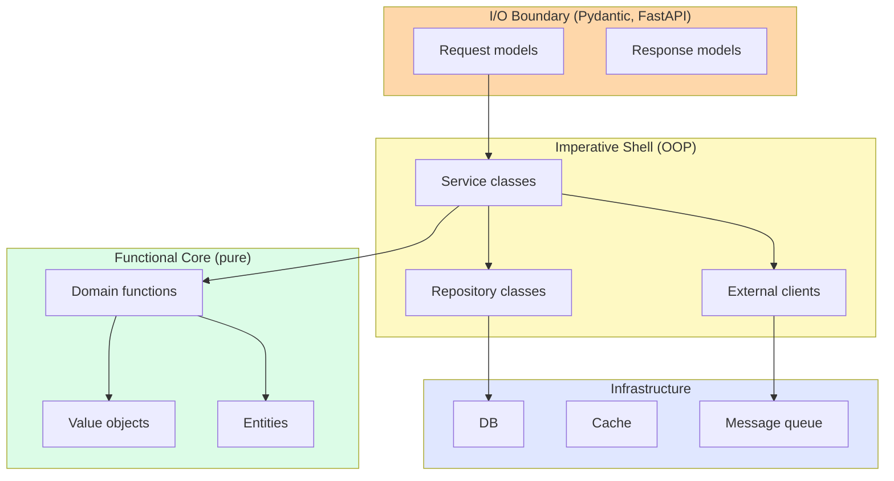

# OOP in Production — How Real Python Codebases Use Objects

> [!quote] "One of the best pieces of advice I got when I was learning to write code was: read other people's code." — Vanessa Hurst

Classroom OOP is clean. Production OOP is messy, opinionated, and shaped by constraints classroom exercises never face: performance, backwards compatibility, team conventions, library evolution, security. This note walks through **how OOP is actually used** in well-known Python codebases — what they do well, what trade-offs they made, and what students can learn from each.

See also: [[best-practices]], [[real-world-examples]], [[design-patterns]], [[solid-principles]].

---

## 1. Why Production OOP Looks Different

Classroom examples optimize for **clarity**: one class per concept, full type hints, frozen dataclasses, clean inheritance trees of depth ≤ 2. Production code optimizes for **different things simultaneously**:

| Concern | Effect on OOP design |
|---|---|
| **Performance** | Methods may be inlined, slots used, `__slots__` to save memory; immutability avoided on hot paths. |
| **Backwards compatibility** | Public APIs frozen for years; internal refactors hidden behind facades; deprecation shims. |
| **Team conventions** | One team's "Pythonic" is another's "over-engineered." Consistency beats purity. |
| **Library evolution** | ABCs may grow new abstract methods; defaults must not break subclasses; deprecation cycles. |
| **Integration with C extensions** | NumPy, pandas, attrs use metaclasses, descriptors, `__class_getitem__` in ways you'd never write yourself. |
| **Security & validation** | Pydantic models replace plain dataclasses for input boundaries. |
| **Concurrency** | Immutability becomes critical; shared mutable state is the enemy. |

> [!tip] The classroom is a special case
> In production, you'll see "violations" of every rule in [[best-practices]] — for good reasons. The skill is recognizing *when* the rules apply and *when* the trade-off justifies deviation.

---

## 2. Case Studies

### 2.1 Django — Class-Based Views & ORM Models

**What OOP patterns it illustrates:** Mixins, template method, metaclasses, active record, facade, decorator (the GoF kind, not Python's).

**Class-Based Views (CBVs).** Django's `View` class uses the **Template Method** pattern: the base class implements `dispatch()`, which inspects the HTTP method and routes to `get()`, `post()`, etc. Subclasses override the relevant methods.

```python
from django.views import View
from django.http import HttpResponse

class HelloView(View):
    def get(self, request, *args, **kwargs):
        return HttpResponse("Hello, GET")

    def post(self, request, *args, **kwargs):
        return HttpResponse("Hello, POST")
```

**Mixins everywhere.** Django composes CBV behavior via multiple inheritance with focused mixins:
```python
class MyView(LoginRequiredMixin, PermissionRequiredMixin, ListView):
    login_url = "/login/"
    permission_required = "app.view_model"
    model = Model
    template_name = "model_list.html"
```
Each mixin adds one capability (auth check, permission check, list rendering). This is **multiple inheritance done right** — small, focused, orthogonal. See [[common-misconceptions]] C2.

**ORM Models — Active Record + metaclasses.** A Django model:
```python
class Book(models.Model):
    title = models.CharField(max_length=200)
    published = models.DateField()
    author = models.ForeignKey(Author, on_delete=models.CASCADE)
```
What's happening:
- `models.Model`'s **metaclass** scans the class body, finds `Field` instances, and rewires them as descriptors.
- Each `Book` instance is a row; `Book.objects` is the table-level API.
- `book.save()` writes to the DB. `book.delete()` removes it. This is the **Active Record** pattern.

> [!note] Active Record vs Repository
> Active Record puts persistence methods on the entity (`book.save()`). Repository separates them (`repo.save(book)`). Active Record is convenient for CRUD apps; Repository shines in complex domains. Django chose Active Record; SQLAlchemy (below) lets you choose.

**Trade-offs:**
- ✅ Concise, productive, conventions clear.
- ✅ Magic (metaclass) hides boilerplate.
- ⚠️ Subclassing `Model` is the *only* way to define a table — no duck typing.
- ⚠️ Models mix persistence + domain logic — can become God classes.
- ⚠️ Metaclass magic is opaque to newcomers.

**Teaching angle.** Django is a great study in *intentional metaclass use* and *mixin composition*. Show students `Book.__mro__` to reveal the mixin chain.

---

### 2.2 SQLAlchemy — Declarative Models & Unit of Work

**What OOP patterns it illustrates:** Data Mapper, Unit of Work, Identity Map, Query Object, descriptors, facade, builder.

SQLAlchemy's "declarative" syntax looks like Django's, but the architecture is different:

```python
from sqlalchemy.orm import declarative_base, Mapped, mapped_column, relationship

Base = declarative_base()

class Book(Base):
    __tablename__ = "books"
    id: Mapped[int] = mapped_column(primary_key=True)
    title: Mapped[str] = mapped_column()
    author_id: Mapped[int] = mapped_column("author_id", ForeignKey("authors.id"))
    author: Mapped["Author"] = relationship(back_populates="books")
```

**Unit of Work pattern** via `Session`:
```python
from sqlalchemy.orm import Session

with Session(engine) as session:
    book = Book(title="New Book", author=ada)
    session.add(book)         # not yet in DB
    session.commit()          # flushes everything in one transaction
```
The `Session` tracks every change to loaded objects and **flushes them as a batch** at commit. This is the **Unit of Work** pattern: in-memory mutations accumulate; the DB write is a single atomic step.

**Identity Map**: within a session, `session.get(Book, 42)` always returns the *same* object. Two queries for the same row return the same instance.

**Query Object**:
```python
result = session.query(Book).join(Author).filter(Author.name == "Ada").order_by(Book.title)
```
Each method returns a new query object (immutable-ish builder); nothing hits the DB until you iterate or call `.all()`. This is the **Builder** pattern.

**Trade-offs:**
- ✅ Clean separation: domain objects don't know they're persisted.
- ✅ Transactions explicit and batched.
- ✅ Two styles available (Core = SQL-like, ORM = object-like).
- ⚠️ Steep learning curve; the "magic" is deep.
- ⚠️ Lazy-loading can cause N+1 queries if you don't understand it.

**Teaching angle.** Compare Django's Active Record with SQLAlchemy's Data Mapper for the same `Book` domain. Students learn the *consequences* of architectural choices.

---

### 2.3 `requests` — Session & API Design

**What OOP patterns it illustrates:** Facade, fluent API, context manager, sensible defaults.

`requests` is famously ergonomic. The top-level API is functional:
```python
import requests
r = requests.get("https://api.example.com", params={"q": "python"})
print(r.json())
```
But underneath, every call creates a `Session`:
```python
with requests.Session() as s:
    s.headers.update({"Authorization": "Bearer ..."})
    r1 = s.get("https://api.example.com/users")
    r2 = s.get("https://api.example.com/posts")  # reuses connection
```

**Why this matters:**
- The functional top-level API is a **facade** over the OOP `Session` — best of both worlds.
- `Session` is a **context manager** (`__enter__`/`__exit__`), so connections are cleaned up.
- `Response` is a rich object: `.json()`, `.text`, `.status_code`, `.headers`, `.raise_for_status()`, `.iter_content()`.
- `PreparedRequest` allows fine-grained inspection and modification before sending.

**Trade-offs:**
- ✅ Top-level API easy for beginners; `Session` available for power users.
- ✅ Discoverable: `dir(r)` shows everything.
- ⚠️ Global default session can leak state between modules in long-running apps.

**Teaching angle.** `requests` is a masterclass in **API layering**: simple things simple, complex things possible. Show students the source of `api.py` — it's tiny.

---

### 2.4 pandas — DataFrame (Facade + Many Patterns)

**What OOP patterns it illustrates:** Facade, interpreter (query strings), builder (method chaining), iterator, operator overloading, multiple dispatch.

`DataFrame` is one of the most beloved OO APIs in Python:
```python
import pandas as pd

df = pd.read_csv("data.csv")
result = (df
    .query("age > 30")
    .groupby("department")
    .agg({"salary": "mean"})
    .sort_values("salary", ascending=False)
)
```

**What's happening:**
- `DataFrame` is a **facade** over numpy arrays + indexes. Users don't see the storage; they see a tabular API.
- Each method (`query`, `groupby`, `agg`, `sort_values`) returns a *new* `DataFrame` (or `DataFrameGroupBy`); this is **fluent builder** style. Note: not actually immutable — pandas copies lazily, sometimes mutates in place. Recent versions lean more immutable.
- `df["col"]` uses `__getitem__` — operator overloading makes indexing read like math.
- `df.age > 30` uses `__gt__` to return a boolean Series — operator overloading again.
- `iter(df)` gives column names; `df.iterrows()` gives (index, row) pairs — different iteration modes via different methods.

**Trade-offs:**
- ✅ Ergonomic; reads like the math/data science it represents.
- ✅ Vectorized operations make it fast.
- ⚠️ Methods *look* immutable but aren't always; `inplace=True` mutates.
- ⚠️ Massive API surface (~250 methods on `DataFrame`) — easy to misuse without docs.
- ⚠️ Memory heavy: each operation may copy.

**Teaching angle.** Show how `DataFrame` overloads `__getitem__`, `__gt__`, `__add__` to make `df[df.age > 30]` work. Students see **operator overloading as API design**, not just syntax sugar. Compare with polars for a more modern, immutable take.

---

### 2.5 pytest — Fixtures & Plugin Architecture

**What OOP patterns it illustrates:** Inversion of control, dependency injection, plugin registry, decorator (Python's kind = function wrapper), strategy.

pytest's fixtures are textbook **dependency injection**:
```python
import pytest

@pytest.fixture
def db():
    db = TestDB()
    db.connect()
    yield db             # test runs here
    db.disconnect()      # teardown

def test_query(db):       # `db` injected by name
    assert db.query("SELECT 1") == [(1,)]
```

What's happening:
- pytest inspects the test function's **parameter names** and matches them to registered fixtures.
- Fixtures can themselves depend on other fixtures — pytest builds a DAG and resolves it.
- The `yield` form gives setup + teardown in one function — the **context manager** idiom.
- **Scopes** (`function`, `class`, `module`, `session`) control how often a fixture is created — caching strategy.

**Plugin architecture** — pytest's whole feature set is pluggable:
```python
# conftest.py
def pytest_addoption(parser):
    parser.addoption("--env", default="staging")

@pytest.fixture
def env(request):
    return request.config.getoption("--env")
```
Plugins register **hooks** (`pytest_collectstart`, `pytest_runtest_call`, …). pytest iterates over registered plugins and calls each. This is the **Observer / Plugin Registry** pattern at architectural scale.

**Trade-offs:**
- ✅ Extremely flexible; fixtures compose.
- ✅ Tests are short — boilerplate in fixtures.
- ⚠️ "Magic" — fixture resolution by name is implicit; newcomers struggle.
- ⚠️ Fixture scope bugs are subtle (a `function`-scoped fixture leaking into a `session`-scoped one).

**Teaching angle.** pytest is the **best example of dependency injection in Python**. Show how `test_query(db)` works: pytest sees `db`, looks up the fixture, runs it, passes the result. This is the same DI pattern students should use in app code.

---

### 2.6 Python stdlib — `pathlib`, `datetime`, `collections.abc`

These are the canonical "small, well-designed OO APIs" every Pythonista should study.

**`pathlib.Path`** — operator overloading + fluent API:
```python
from pathlib import Path

p = Path("/home") / "ada" / "notes.txt"   # __truediv__ for path joining
print(p.name)         # "notes.txt"
print(p.suffix)       # ".txt"
print(p.stem)         # "notes"
print(p.parent)       # "/home/ada"

for f in p.parent.glob("*.txt"):           # __iter__
    print(f)

content = p.read_text()                     # convenience method
p.write_text("new content")
```

Why it's great:
- Replaces `os.path.join(...)` with `/` — **idiomatic operator overloading**.
- Methods where they belong: `p.exists()`, `p.mkdir()`, `p.read_text()`.
- Immutable: `p.parent` returns a new `Path`.
- Cross-platform: same code works on Windows and POSIX.

**`datetime`** — value objects, immutability, factory methods:
```python
from datetime import datetime, timezone, timedelta

now = datetime.now(timezone.utc)
later = now + timedelta(hours=2)   # __add__ returns NEW datetime
print(later - now)                  # __sub__ returns timedelta

dt = datetime.fromisoformat("2025-01-15T10:00:00+00:00")   # classmethod factory
```
- Frozen value objects — arithmetic returns new instances.
- Classmethods (`fromisoformat`, `fromtimestamp`) as named constructors.
- `__add__`, `__sub__` for natural arithmetic.

**`collections.abc`** — ABCs as contracts:
```python
from collections.abc import Sequence, Mapping, Iterable

class MyList(Sequence):
    def __init__(self, data): self._data = list(data)
    def __getitem__(self, i): return self._data[i]
    def __len__(self): return len(self._data)

# Now `isinstance(MyList([]), Sequence)` is True, and `list()`, `reversed()`,
# `index()`, `count()` all work — inherited from Sequence's mixin methods.
```
- ABCs provide **mixin methods** based on a small abstract interface. Implement `__getitem__` and `__len__`, get `__contains__`, `__iter__`, `index`, `count` for free.
- This is the **Template Method** pattern at the language level.

**Teaching angle.** These three stdlib modules are the best "what good OOP looks like in Python" examples. Have students read the source of `pathlib` — it's readable, instructive, and well-commented.

---

## 3. Trade-offs in Production

### 3.1 Performance

Python method calls have overhead (~100ns each). For hot loops:
- Avoid creating thousands of tiny objects.
- Consider `__slots__` to reduce per-instance memory.
- Use `@dataclass(slots=True)` (Python 3.10+) for compact instances.
- Consider numpy / polars for vectorized numeric work — bypass Python OOP entirely.
- For I/O-bound code, async + minimal objects beats synchronous + rich object graphs.

> [!warning] Premature OOP optimization
> Don't add `__slots__` or remove immutability "for performance" without measuring. Profile first (`cProfile`, `py-spy`), optimize second.

### 3.2 Testability

The biggest testability wins from OOP:
- **Dependency injection** (see pytest above) — inject fakes.
- **Small classes** — test each in isolation.
- **Pure functions where possible** — no setup needed.
- **Avoid global singletons** — they couple every test to global state.

The biggest testability *anti-patterns*:
- `__init__` that opens DB connections.
- Class methods that read module-level globals.
- Time-dependent behavior that uses `datetime.now()` directly (inject a clock).

### 3.3 Team conventions

In production teams, *consistency* often beats *purity*. If your team:
- Uses Django models everywhere → Active Record is the right choice, even for non-CRUD logic.
- Uses SQLAlchemy → Repository pattern is more idiomatic.
- Does data science → mostly functions over DataFrames, few classes.
- Builds microservices in FastAPI → Pydantic models + functions for handlers, classes for services.

> [!tip] Don't refactor against the grain
> If your codebase uses functions for everything and you want to introduce a 4-layer OOP architecture, you'll lose. Adopt the local idiom; introduce OOP where it pays off (domain models, complex state, plugin systems).

---

## 4. OOP vs Functional in Data/AI Pipelines

A common confusion: "Should ML pipelines be OOP?"

**Mostly no.** A typical data pipeline:
```python
def load(path: Path) -> DataFrame: ...
def clean(df: DataFrame) -> DataFrame: ...
def feature_engineer(df: DataFrame) -> DataFrame: ...
def train(df: DataFrame, params: dict) -> Model: ...
def evaluate(model: Model, df: DataFrame) -> Metrics: ...

df = load("data.csv")
df = clean(df)
df = feature_engineer(df)
model = train(df, {"lr": 0.01})
print(evaluate(model, df))
```
This is **functional style over data objects**. Each function transforms data into new data. `DataFrame` and `Model` are objects, but they're *data carriers*, not behavior-rich domain objects.

**When OOP helps in data/AI:**
- **Model wrappers**: `class SklearnModel:` with `fit`, `predict`, `save`, `load` — matches the sklearn estimator protocol.
- **Pipelines as objects**: `sklearn.pipeline.Pipeline` composes transformers; each transformer implements `fit` and `transform`. This is the **Strategy + Composite** pattern.
- **Configuration**: `TrainingConfig` (frozen dataclass) for hyperparameters.
- **Experiment tracking**: `Experiment` objects with `start`, `log_metric`, `end`.

**When OOP hurts in data/AI:**
- Wrapping every transformation in a class with one method.
- Inheritance hierarchies of model variants (use composition + config instead).
- Hidden state in objects across notebook cells (notebooks are bad enough already).

> [!example] sklearn's `Pipeline`
> ```python
> from sklearn.pipeline import Pipeline
> from sklearn.preprocessing import StandardScaler
> from sklearn.decomposition import PCA
> from sklearn.linear_model import LogisticRegression
>
> pipe = Pipeline([
>     ("scale", StandardScaler()),
>     ("pca", PCA(n_components=10)),
>     ("clf", LogisticRegression()),
> ])
> pipe.fit(X_train, y_train)
> ```
> Each step is an object with `fit` and `transform` (or `predict`). The pipeline composes them. This is **excellent OOP**: small interface (`fit`/`transform`), polymorphic dispatch, composable. sklearn's API design is a master class.

---

## 5. Modern Trends in Python OOP

### 5.1 Dataclasses as the default

Pre-dataclasses, writing a class meant 30+ lines of `__init__`, `__repr__`, `__eq__`, `__hash__`. Today, `@dataclass` is the **default starting point** for any class whose primary job is holding data. Use `frozen=True` for value objects; use `slots=True` for memory efficiency.

```python
from dataclasses import dataclass

@dataclass(frozen=True, slots=True)
class Point:
    x: float
    y: float
```

### 5.2 Protocols for structural typing

`typing.Protocol` (PEP 544) brings **duck typing to the type system**. You no longer need to inherit from an ABC to satisfy a contract — just implement the right methods.

```python
from typing import Protocol

class Closeable(Protocol):
    def close(self) -> None: ...

def safe_close(c: Closeable) -> None:
    try: c.close()
    except Exception: pass

class MyResource:           # no inheritance
    def close(self) -> None: ...

safe_close(MyResource())    # mypy verifies structural conformance
```

### 5.3 Type hints + mypy as standard practice

Production Python codebases increasingly use `mypy --strict` (or `pyright`) in CI. Type hints have moved from "decoration" to "contract." See [[best-practices]] §7.

### 5.4 Pydantic for input boundaries

For data crossing trust boundaries (HTTP requests, config files, external APIs), `pydantic.BaseModel` has largely replaced hand-written validation:

```python
from pydantic import BaseModel, EmailStr, Field

class CreateUserRequest(BaseModel):
    name: str = Field(min_length=1, max_length=100)
    email: EmailStr
    age: int = Field(ge=0, le=150)

# Invalid input raises ValidationError with details:
CreateUserRequest(name="", email="not-an-email", age=200)
```

Pydantic uses `@dataclass`-like syntax but adds validation, JSON schema generation, and (de)serialization. It's the **modern OOP for I/O boundaries**.

### 5.5 Functional Core, Imperative Shell

A growing consensus pattern:
- **Core**: pure functions over immutable dataclasses. No I/O, no exceptions, no global state. Trivially testable.
- **Shell**: thin OOP wrappers that handle I/O, persistence, external services. Injected into the core as protocols.



This gets you the **testability of functional programming** with the **organization of OOP**. See [[best-practices]] §11.

### 5.6 Async-first OOP

`asyncio` changed how OOP works for I/O-bound code:
- Methods that do I/O become `async def`.
- Constructors stay synchronous (a known pain point — no `async __init__`).
- Classmethods `async def create(...)` replace constructors for async setup.
- Context managers (`__aenter__`/`__aexit__`) for async resources.

```python
class AsyncDatabase:
    @classmethod
    async def create(cls, dsn: str) -> "AsyncDatabase":
        self = cls()
        self.conn = await asyncpg.connect(dsn)
        return self

    async def query(self, sql: str) -> list:
        return await self.conn.fetch(sql)

    async def __aenter__(self) -> "AsyncDatabase":
        return self

    async def __aexit__(self, *args) -> None:
        await self.conn.close()
```

### 5.7 Type-driven design (DDD-lite)

With modern typing, more teams practice a light version of **Domain-Driven Design**:
- Value objects: `Money`, `EmailAddress`, `UserId` (frozen dataclasses, often `NewType`).
- Entities: identity-bearing objects with lifecycle.
- Aggregates: consistency boundaries around groups of entities.
- Repositories: persistence abstraction over aggregates.

```python
UserId = NewType("UserId", str)

@dataclass(frozen=True)
class Money:
    amount: Decimal
    currency: str

@dataclass
class Order:    # Entity — has identity
    id: OrderId
    items: list[LineItem]
    status: OrderStatus

    def add_item(self, item: LineItem) -> None: ...   # behavior with invariants

class OrderRepository(Protocol):
    async def get(self, id: OrderId) -> Order: ...
    async def save(self, order: Order) -> None: ...
```

---

## 6. What Students Should Take from Production Code

> [!tip] Reading list for production OOP
> Pick **one** of these codebases and skim it for an hour. Note three things you'd steal and one thing you'd do differently.

| Codebase | What to study | Difficulty |
|---|---|---|
| `requests` | API layering, facade, context managers | 🟢 Easy |
| `pathlib` (stdlib) | Operator overloading, immutability, ergonomics | 🟢 Easy |
| `pytest` | Fixtures (DI), plugin architecture | 🟡 Medium |
| `attrs` / `pydantic` | Descriptors, metaclasses, validation | 🟡 Medium |
| Django ORM | Metaclasses, active record, descriptors | 🔴 Hard |
| SQLAlchemy | Unit of Work, Identity Map, descriptors | 🔴 Hard |
| `pandas` `DataFrame` | Facade, operator overloading, fluent API | 🔴 Hard |
| `asyncio` | Async protocols, context managers, mixins | 🔴 Hard |

---

## 7. Common Production Smells (and What to Do)

| Smell | What it looks like | Fix |
|---|---|---|
| **God service** | `UserService` with 50 methods | Split by use case; inject collaborators. |
| **Active Record domain model** | `Order` with `order.save()` + 30 business methods | Extract domain logic to a service; keep model for state. |
| **Manager manager** | `UserManager` manages `UserService` manages `UserRepository` | Collapse layers; inject repo directly. |
| **Singleton config** | `Config.instance()` called from 50 places | Inject `Config` at app startup; pass via constructor. |
| **Magic metaclass** | Custom metaclass that "simplifies" model definition | Prefer `@dataclass`, descriptors, or `__init_subclass__`. |
| **Deep inheritance in library** | User code must inherit `BaseHandler` → `BaseAuthHandler` → `BaseOAuthHandler` → `OAuth2Handler` | Provide a Protocol + functions instead. |
| **Untyped public API** | No type hints on library exports | Add hints, run `mypy --strict`, publish `.pyi` if needed. |

---

## 8. Mermaid — Production OOP Layers



---

## 9. A Production-Style Snippet — Putting It Together

A small FastAPI endpoint that creates an order, using every modern technique:

```python
from __future__ import annotations
from dataclasses import dataclass
from decimal import Decimal
from typing import Protocol
from uuid import UUID, uuid4

from pydantic import BaseModel, Field
from fastapi import FastAPI, HTTPException, Depends


# ---- Functional core (pure, no I/O) ----

@dataclass(frozen=True)
class Money:
    amount: Decimal
    currency: str = "USD"

@dataclass(frozen=True)
class LineItem:
    product_id: str
    quantity: int
    unit_price: Money

@dataclass
class Order:
    id: UUID
    customer_id: str
    items: list[LineItem]
    status: str = "pending"

    def total(self) -> Money:
        return Money(sum(i.quantity * i.unit_price.amount for i in self.items))

def place_order(items: list[LineItem], customer_id: str) -> Order:
    if not items:
        raise ValueError("empty order")
    return Order(id=uuid4(), customer_id=customer_id, items=list(items))


# ---- Imperative shell (OOP, I/O) ----

class OrderRepo(Protocol):
    async def save(self, order: Order) -> None: ...

class PostgresOrderRepo:
    def __init__(self, pool): self.pool = pool
    async def save(self, order: Order) -> None:
        async with self.pool.acquire() as conn:
            await conn.execute("INSERT INTO orders ...", ...)

class PaymentProcessor(Protocol):
    async def charge(self, amount: Money, customer_id: str) -> str: ...

class StripeProcessor:
    async def charge(self, amount: Money, customer_id: str) -> str:
        return f"stripe-{customer_id}-{amount.amount}"

class OrderService:
    def __init__(self, repo: OrderRepo, payments: PaymentProcessor):
        self.repo = repo
        self.payments = payments

    async def checkout(self, items: list[LineItem], customer_id: str) -> Order:
        order = place_order(items, customer_id)
        await self.payments.charge(order.total(), customer_id)
        await self.repo.save(order)
        return order


# ---- Boundary (Pydantic + FastAPI) ----

class LineItemIn(BaseModel):
    product_id: str = Field(min_length=1)
    quantity: int = Field(ge=1)

class CreateOrderIn(BaseModel):
    items: list[LineItemIn] = Field(min_length=1)

def get_service() -> OrderService:
    # In production: wire from app state / dependency injection container
    return OrderService(PostgresOrderRepo(pool=...), StripeProcessor())

app = FastAPI()

@app.post("/orders")
async def create_order(payload: CreateOrderIn, service: OrderService = Depends(get_service)):
    items = [LineItem(i.product_id, i.quantity, Money(Decimal("9.99"))) for i in payload.items]
    try:
        order = await service.checkout(items, "customer_42")
    except ValueError as e:
        raise HTTPException(status_code=400, detail=str(e))
    return {"order_id": str(order.id), "total": str(order.total())}
```

**What this demonstrates:**
- **Functional core**: `place_order` is pure; testable with no mocks.
- **Imperative shell**: `OrderService`, repos, processors — injected via constructor.
- **Protocols** for collaborators (`OrderRepo`, `PaymentProcessor`) — swap in tests with fakes.
- **Pydantic** for the I/O boundary — validation, JSON schema, automatic OpenAPI docs.
- **FastAPI**'s `Depends` for composition at the framework level.
- **Frozen dataclasses** for value objects (`Money`, `LineItem`).
- **Type hints** everywhere; `mypy --strict` will pass.

This is what production Python OOP looks like in 2025.

---

## Key Takeaways

1. **Production OOP makes trade-offs classroom code never faces.** Performance, backwards compatibility, and team conventions often justify deviations from "best practice."
2. **Django & SQLAlchemy** show two opposite ORM architectures (Active Record vs Data Mapper). Both are correct for their context.
3. **`requests`** is a masterclass in API layering: functional facade over an OOP core.
4. **pandas `DataFrame`** demonstrates operator overloading as API design — `df["col"]`, `df.age > 30` read like the math they represent.
5. **pytest fixtures** are the canonical Python example of dependency injection — and the most accessible.
6. **The Python stdlib** (`pathlib`, `datetime`, `collections.abc`) is the best free OOP textbook available. Read the source.
7. **Data/AI pipelines** are mostly functional over data objects. Use OOP for estimators (`fit`/`predict`), pipelines, configs — not for every transformation.
8. **Modern Python OOP** leans on: `@dataclass`, `typing.Protocol`, Pydantic at boundaries, `mypy --strict` in CI.
9. **Functional Core / Imperative Shell** is the dominant modern pattern: pure functions for domain logic, thin OOP wrappers for I/O.
10. **Read production code.** Pick one library per month and skim its source. You'll absorb more design vocabulary than from any book.

---

**Next:** [[exercises-and-projects]] — graded practice exercises and capstone projects.
