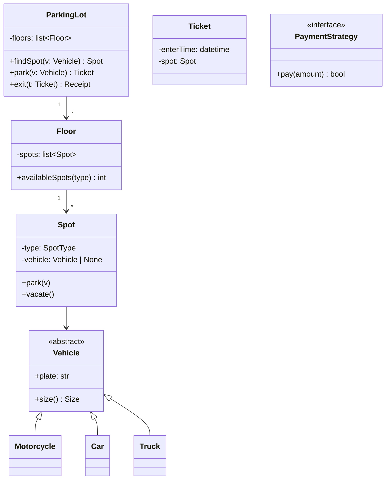
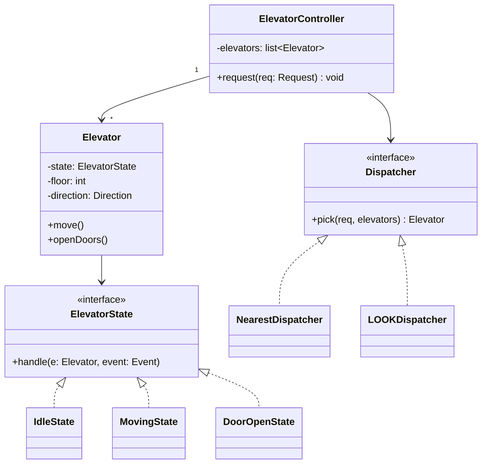
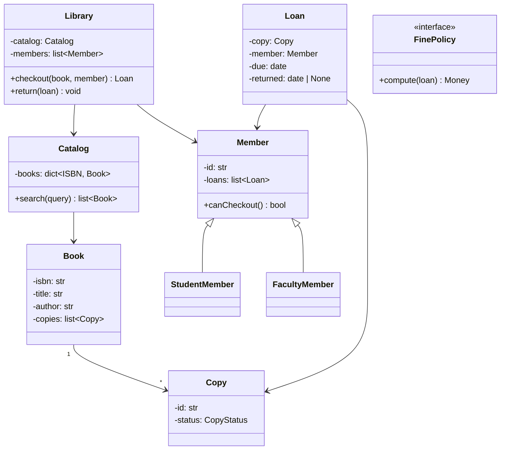
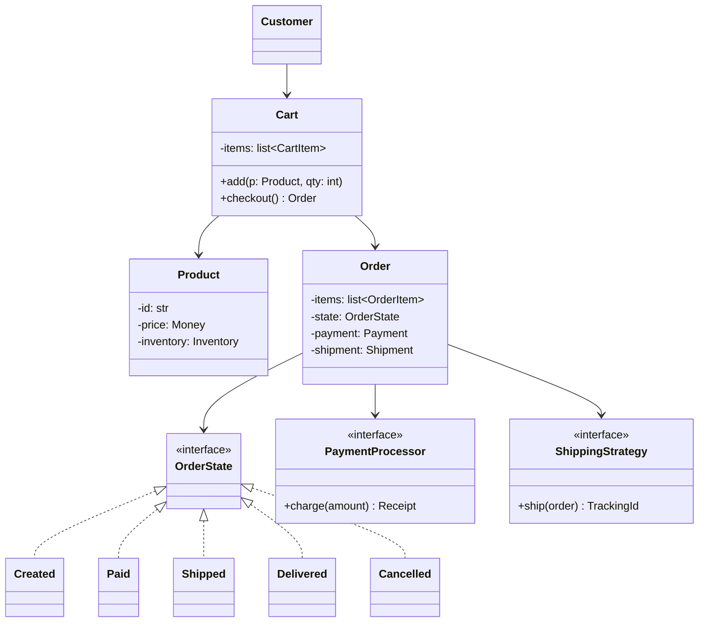
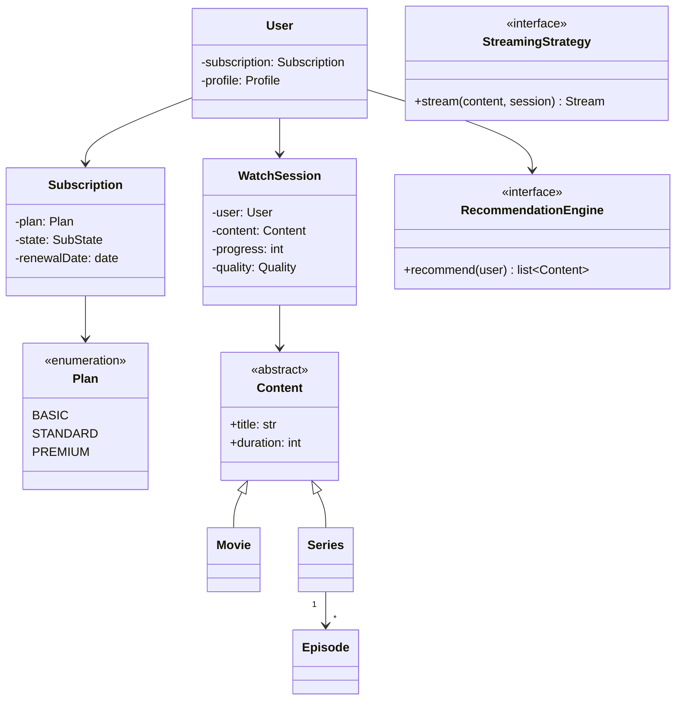
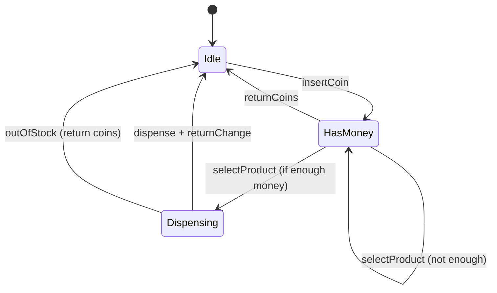
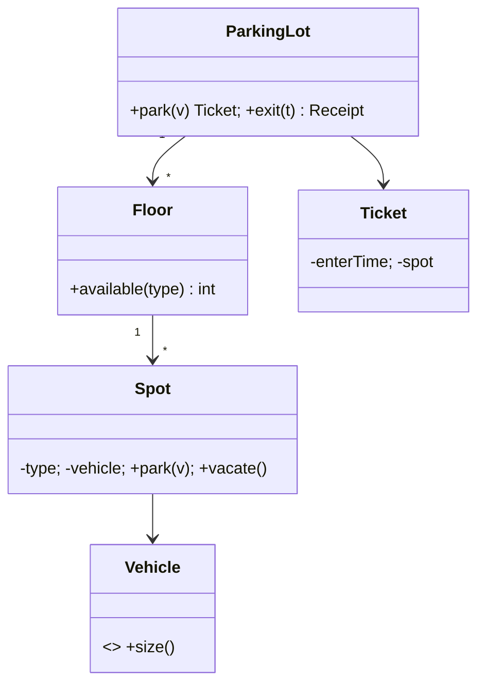
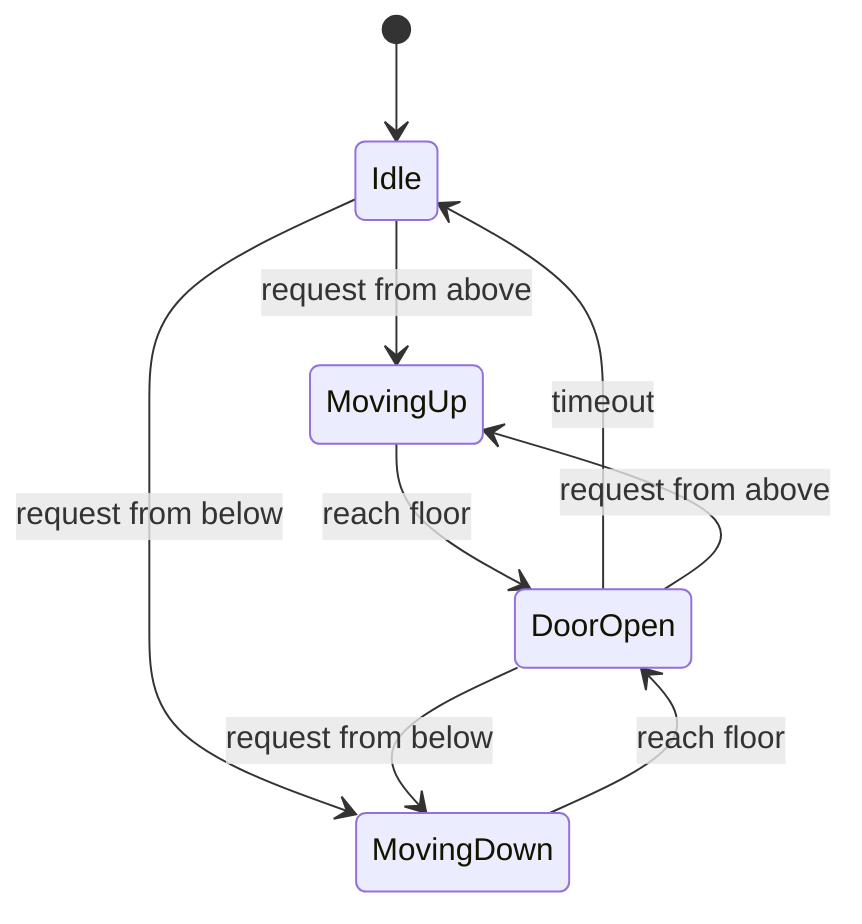
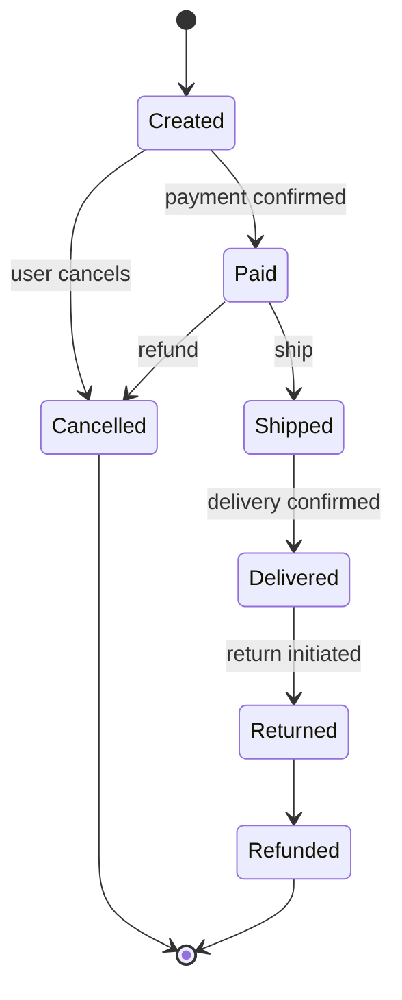

> [!info] Who This Note Is For
> You're preparing for OOP-focused interviews: entry-level "what is polymorphism?" rounds, mid-level Python-OOP deep dives, and senior-level object-oriented design (OOD) rounds ("design a parking lot"). This note collects ~70 questions with model answers, frameworks, and study plans.

> [!tip] Prerequisite
> Skim [[four-pillars-summary]], [[solid-principles]], [[composition-over-inheritance]], [[design-patterns-creational]], [[design-patterns-structural]], [[design-patterns-behavioral]], and [[magic-methods]] first.

---

## 0. How To Use This Note

- **Don't memorize answers.** Memorize *concepts* and *frameworks*. Interviewers can smell memorized answers.
- **Read the "What the interviewer is really testing" line first** — it tells you the meta-question behind the question.
- **Practice the "follow-up" questions out loud**. Most interview failures happen on follow-ups.
- **Pair this note with [[exercises-and-projects]]** for hands-on practice.

---

## 1. Conceptual Questions (~20)

### Q1. What is the difference between a class and an object?

**Testing:** basic OOP vocabulary, ability to distinguish blueprint from instance.

**Model answer:** A **class** is a blueprint — a definition of state (attributes) and behavior (methods) for a category of things. An **object** is a concrete instance of a class, allocated in memory, with its own state. One class can produce many objects, each with independent state.

```python
class Dog:                # the class — one definition
    def __init__(self, name: str) -> None:
        self.name = name

rex = Dog("Rex")          # an object — one instance
fido = Dog("Fido")        # another object — different state
```

**Common mistakes:** Saying "an object is a variable." A variable is a *name* bound to an object; multiple variables can refer to the same object.

**Follow-ups:**
- "Can two classes be identical and still be different?" → Yes — class identity is by `type`, not by structure.
- "Where does the class itself live?" → Classes are objects too (in Python), instances of `type` (their metaclass). See [[metaclasses-and-class-creation]].

---

### Q2. What are the four pillars of OOP?

**Testing:** basic recall + comprehension.

**Model answer:** [[encapsulation]], [[inheritance]], [[polymorphism]], [[abstraction]]. See [[four-pillars-summary]].

1. **Encapsulation** — bundling state + behavior and restricting direct access.
2. **Inheritance** — deriving new classes from existing ones for code reuse and "is-a" relationships.
3. **Polymorphism** — the same call site dispatching to different implementations.
4. **Abstraction** — exposing essentials and hiding implementation details.

**Common mistakes:** Conflating abstraction and encapsulation. Encapsulation is *hiding*; abstraction is *simplifying via a model*.

**Follow-ups:**
- "Give a Python example of each." (Have one ready.)
- "Which pillar does `@property` support?" → Encapsulation (it hides the storage detail behind an attribute-like API).

---

### Q3. What is the difference between method overloading and overriding?

**Testing:** precise vocabulary.

**Model answer:**
- **Overloading** — multiple methods with the *same name* but *different parameter lists* in the *same* class. Resolved at compile time (static dispatch). Java, C++, C# support it; **Python does not** (use `@overload` for type-checker hints only).
- **Overriding** — a subclass provides a new implementation of a method inherited from a parent. Resolved at runtime (dynamic dispatch). All OOP languages support it.

```python
# Overriding (works in Python)
class Animal:
    def speak(self) -> str: return "..."
class Dog(Animal):
    def speak(self) -> str: return "Woof"   # overrides
```

**Common mistakes:** Saying "Python supports overloading via `@overload`." It doesn't — `@overload` is purely for static type-checkers; at runtime only the final definition matters.

**Follow-ups:**
- "Why doesn't Python have overloading?" → Duck typing + default arguments + `*args` cover most use cases; overloading adds complexity for little gain.
- "How does C++ resolve overloaded calls?" → Name mangling + exact-match / conversion rules.

---

### Q4. What is the difference between an abstract class and an interface?

**Testing:** abstraction + interface concept.

**Model answer:** An **abstract class** can have state, concrete methods, and abstract methods. An **interface** (in Java/C#) is a pure contract — no state, only method signatures (Java 8+ allows `default` methods; C# 8+ similar).

In Python:
- `abc.ABC` + `@abstractmethod` ≈ abstract class (nominal; must inherit).
- `typing.Protocol` ≈ interface (structural; no inheritance needed).

```python
from abc import ABC, abstractmethod
from typing import Protocol

class Shape(ABC):                    # abstract class — has state, partial impl
    @abstractmethod
    def area(self) -> float: ...
    def describe(self) -> str:
        return f"area = {self.area()}"

class Drawable(Protocol):            # interface — pure shape, structural
    def draw(self) -> None: ...
```

**Common mistakes:** Saying "Python has no interfaces." It has two flavors (ABC + Protocol).

**Follow-ups:**
- "When would you use one over the other?" → ABC for shared state + partial impl; Protocol for "has-a-shape" contracts.
- "Can an abstract class have constructors?" → Yes, but only subclasses can call them.

---

### Q5. What is the difference between composition and inheritance?

**Testing:** the most important design trade-off in OOP. See [[composition-over-inheritance]].

**Model answer:**
- **Inheritance** ("is-a"): `Dog` is an `Animal`. Subclass gets parent's interface + implementation. Tight coupling; rigid hierarchy.
- **Composition** ("has-a"): `Car` has an `Engine`. The outer object delegates to inner objects. Loose coupling; flexible.

> [!quote] Effective Java, Item 18
> "Favor composition over inheritance." Inheriting from a class not designed for it breaks encapsulation — changes in the parent can break the subclass.

```python
# Inheritance (rigid)
class Stack(list):
    def push(self, x): self.append(x)

# Composition (flexible)
class Stack:
    def __init__(self) -> None:
        self._items: list = []
    def push(self, x): self._items.append(x)
```

**Common mistakes:** Reaching for inheritance for code reuse alone ("I want `Stack` to have `append`, so extend `list`"). Inheritance is for *subtyping*, not reuse.

**Follow-ups:**
- "When is inheritance appropriate?" → Genuine "is-a" with LSP compliance.
- "What's the cost of composition?" → More delegation boilerplate (mitigated by `__getattr__` or `functools`).

---

### Q6. What is the Liskov Substitution Principle?

**Testing:** SOLID principles (specifically the L). See [[solid-principles]].

**Model answer:** Subtypes must be substitutable for their base types without breaking program correctness. If `B` is a subtype of `A`, anywhere an `A` is expected, a `B` should work.

Classic violation: `Rectangle` and `Square`. A `Square` inheriting from `Rectangle` violates LSP because changing `Square.width` (which should also change `height`) breaks the parent's contract.

```python
class Rectangle:
    def __init__(self, w, h): self.w, self.h = w, h
    def set_width(self, w): self.w = w
    def set_height(self, h): self.h = h
    def area(self): return self.w * self.h

class Square(Rectangle):                 # ❌ LSP violation
    def set_width(self, w):
        self.w = self.h = w              # surprises clients expecting Rectangle semantics
    def set_height(self, h):
        self.w = self.h = h
```

**Common mistakes:** Confusing LSP with "subclass has the same methods." LSP is about *behavioral* contracts, not signatures.

**Follow-ups:**
- "How do you test for LSP?" → Think about invariants, preconditions (must not be strengthened), postconditions (must not be weakened), and history constraints.
- "Give another classic LSP violation." → `Set` extending `Bag` (sets forbid duplicates; bags allow them — `add(x)` has different semantics).

---

### Q7. What is the difference between static and dynamic dispatch?

**Testing:** runtime mechanism of polymorphism.

**Model answer:**
- **Static dispatch** (early binding): the method to call is determined at compile time based on the *static type* of the expression. Used for non-virtual methods in C++, overloaded methods in Java/C++.
- **Dynamic dispatch** (late binding): determined at runtime based on the *actual type* of the object. Used for `virtual` methods in C++, all instance methods in Java/Python/C#/JS.

In Python, *all* method calls are dynamically dispatched — there's no static type to dispatch on (type hints are advisory). See [[python-vs-cpp-oop]].

**Common mistakes:** Saying "Python uses vtables." CPython uses a dictionary (`__dict__`) lookup on the type, with optimization via "type slots" and inline caches. The conceptual model is similar to a vtable but the implementation differs.

**Follow-ups:**
- "How does C++ implement dynamic dispatch?" → vtable + vptr.
- "What's the cost of dynamic dispatch?" → One indirection + inability to inline.

---

### Q8. What is the difference between `==` and `equals()` (Java) / `is` and `==` (Python)?

**Testing:** equality vs identity.

**Model answer:**
- **Identity** ("the same object"): Java `==` for objects; Python `is`. Compares memory addresses.
- **Equality** ("the same value"): Java `.equals()`; Python `==` (calls `__eq__`). Compares by user-defined logic.

```python
a = [1, 2, 3]
b = [1, 2, 3]
a is b          # False — different objects
a == b          # True — same value (list.__eq__ compares elementwise)
a is None       # True only if a is the None singleton
```

**Common mistakes:** Using `== None` in Python (works due to `None` being a singleton, but `is None` is the idiom and faster).

**Follow-ups:**
- "Why should `equals` and `hashCode` be consistent in Java?" → So that equal objects hash to the same bucket in hash-based collections. Python has the same rule: `__eq__` and `__hash__` must be consistent — see [[magic-methods]].
- "What happens if you override `__eq__` but not `__hash__`?" → In Python, the object becomes unhashable (sets `__hash__ = None`).

---

### Q9. What is a virtual destructor and why does it matter?

**Testing:** C++-specific OOP knowledge.

**Model answer:** In C++, if you `delete` a `Derived` object through a `Base*` and `Base`'s destructor is *not* virtual, only `Base`'s destructor runs — `Derived`'s members leak and behavior is undefined. Making the destructor `virtual` ensures the most-derived destructor is called.

```cpp
struct Base { virtual ~Base() = default; };   // ✅ virtual destructor
struct Derived : Base { std::vector<int> data; };

Base* b = new Derived;
delete b;     // ✅ Derived::~Derived then Base::~Base both run
```

**Rule of thumb:** If a class has *any* virtual method, give it a virtual destructor.

**Common mistakes:** Forgetting virtual destructors on polymorphic base classes — the most common C++ memory bug.

**Follow-ups:**
- "Does Python have this problem?" → No. Python has no manual `delete`; GC handles cleanup. See [[python-vs-cpp-oop]].
- "What about `shared_ptr<Base>`?" → `shared_ptr` stores a custom deleter at construction, so even non-virtual destructors work — but only if the `shared_ptr` was constructed with the correct derived type.

---

### Q10. What is the difference between deep copy and shallow copy?

**Testing:** object semantics.

**Model answer:**
- **Shallow copy** — new outer object, but inner references point to the *same* nested objects.
- **Deep copy** — new outer object, and recursively new copies of all nested objects.

```python
import copy
a = [[1, 2], [3, 4]]
b = copy.copy(a)       # shallow
c = copy.deepcopy(a)   # deep
a[0].append(99)
print(b)               # [[1, 2, 99], [3, 4]]  — b's inner list is a's inner list
print(c)               # [[1, 2], [3, 4]]      — c is fully independent
```

**Common mistakes:** Assuming `b = a` copies. It doesn't — both names refer to the same object. See [[python-vs-cpp-oop]] §2.

**Follow-ups:**
- "How do you control copying in Python?" → Implement `__copy__` and `__deepcopy__`.
- "Why is deep copy expensive?" → Recursive traversal + allocations; cycles need a memo dict.

---

### Q11. What is the diamond problem and how does Python solve it?

**Testing:** multiple inheritance + MRO. See [[inheritance]].

**Model answer:** In multiple inheritance, when a class inherits from two classes that share a common base, the inheritance graph forms a diamond. The question is: which path does method lookup take, and is the shared base initialized once or twice?

```python
class A:
    def __init__(self) -> None:
        print("A")
class B(A):
    def __init__(self) -> None:
        print("B"); super().__init__()
class C(A):
    def __init__(self) -> None:
        print("C"); super().__init__()
class D(B, C):
    def __init__(self) -> None:
        print("D"); super().__init__()

D()   # D, B, C, A — A.__init__ runs exactly once
print(D.__mro__)   # (D, B, C, A, object)
```

Python uses **C3 linearization** to compute a single, monotonic MRO. `super()` walks the MRO, so each `__init__` runs once if everyone cooperates. C++ solves it with `virtual inheritance` (different mechanism, runtime cost).

**Common mistakes:** Calling `super().__init__()` with explicit args and getting it wrong for cooperative MI. Use keyword arguments (`**kwargs`) for cooperative multiple inheritance.

**Follow-ups:**
- "What if B and C have conflicting method signatures?" → You get the first one in the MRO. This is a design smell.
- "Why does Java disallow multiple class inheritance?" → To avoid the diamond problem entirely (interfaces don't have state).

---

### Q12. What is the difference between `@staticmethod`, `@classmethod`, and instance methods?

**Testing:** Python-specific OOP. See [[methods]].

**Model answer:**
- **Instance method** — `def m(self, ...)`: receives the instance. Can read/write instance state.
- **@classmethod** — `def m(cls, ...)`: receives the class. Often used for **alternative constructors** (`from_dict`, `from_string`).
- **@staticmethod** — `def m(...)`: receives neither. Just a function that happens to live in the class's namespace. Rarely necessary — prefer a module-level function.

```python
class Date:
    def __init__(self, year: int, month: int, day: int) -> None:
        self.year, self.month, self.day = year, month, day

    @classmethod
    def from_iso(cls, s: str) -> "Date":
        y, m, d = map(int, s.split("-"))
        return cls(y, m, d)        # cls = subclass when called on subclass

    @staticmethod
    def is_leap(year: int) -> bool:
        return year % 4 == 0 and (year % 100 != 0 or year % 400 == 0)
```

**Common mistakes:** Using `@staticmethod` for everything because "it doesn't need self." Use a module function instead.

**Follow-ups:**
- "Why use `cls` in `@classmethod` instead of hardcoding `Date`?" → Subclass-friendliness: `EuroDate.from_iso("2025-01-01")` returns a `EuroDate`, not a `Date`.
- "What's the Python equivalent of Java's `static`?" → Module-level functions/vars are the primary answer; `@staticmethod` is secondary.

---

### Q13. What is a descriptor?

**Testing:** Python deep dive. See [[properties]].

**Model answer:** A descriptor is any object that implements `__get__`, `__set__`, and/or `__delete__`. When a descriptor is a *class attribute*, attribute access on instances is delegated to the descriptor's methods. `property` is a built-in descriptor; `classmethod` and `staticmethod` are too.

```python
class TypedField:
    def __init__(self, type_: type) -> None:
        self.type_ = type_
    def __set_name__(self, owner, name):
        self.name = name
    def __get__(self, instance, owner):
        return instance.__dict__.get(self.name)
    def __set__(self, instance, value):
        if not isinstance(value, self.type_):
            raise TypeError(f"{self.name} must be {self.type_.__name__}")
        instance.__dict__[self.name] = value

class Person:
    name = TypedField(str)
    age = TypedField(int)

p = Person()
p.name = "Alice"        # OK
# p.age = "old"         # TypeError: age must be int
```

**Common mistakes:** Forgetting to store the value on the *instance* (`instance.__dict__`), not the descriptor (which would share state across all instances).

**Follow-ups:**
- "How does `@property` work under the hood?" → It's a descriptor implementing `__get__` and `__set__`.
- "What's the data descriptor vs non-data descriptor distinction?" → Data descriptors define `__set__` or `__delete__`; they take priority over instance `__dict__`. Non-data descriptors (only `__get__`) don't.

---

### Q14. What is a metaclass?

**Testing:** Python deep dive. See [[metaclasses-and-class-creation]].

**Model answer:** A metaclass is "a class whose instances are classes." `type` is the default metaclass. When you write `class Foo:`, Python calls `type("Foo", (object,), {...})` to create the class. You can customize class creation by subclassing `type` and using `metaclass=MyMeta`.

```python
class LoggedMeta(type):
    def __new__(mcs, name, bases, namespace):
        print(f"Creating class {name}")
        return super().__new__(mcs, name, bases, namespace)

class Foo(metaclass=LoggedMeta):    # prints "Creating class Foo"
    pass
```

Most use cases are better served by `__init_subclass__`, class decorators, or `dataclasses`. Reach for metaclasses only when you need to *enforce* something across a whole class hierarchy (e.g., a registry, plugin auto-discovery).

**Common mistakes:** Using metaclasses when `__init_subclass__` would suffice. Metaclass conflicts arise when multiple base classes have different metaclasses.

**Follow-ups:**
- "What's `__init_subclass__`?" → A hook called when a class is subclassed. Simpler than metaclasses for most customization needs.
- "What's `type(Foo)`?" → The metaclass (usually `type`).

---

### Q15. What is the difference between `__init__` and `__new__`?

**Testing:** Python object creation mechanism.

**Model answer:**
- `__new__` *creates* the instance (allocates and returns it). It's a classmethod implicitly.
- `__init__` *initializes* the already-created instance (mutates it).

For immutable types (tuples, strings, frozen dataclasses, `int`/`float` subclasses), you can't set state in `__init__` (you can't mutate immutable objects), so you must override `__new__`.

```python
class EvenInt(int):
    def __new__(cls, value: int) -> "EvenInt":
        if value % 2 != 0:
            raise ValueError("must be even")
        return super().__new__(cls, value)

e = EvenInt(4)
print(e + 2)        # 6 — behaves like an int
```

**Common mistakes:** Trying to override `__init__` for immutable types — won't work.

**Follow-ups:**
- "What if `__new__` returns an instance of a different class?" → `__init__` is *not* called.
- "What's the singleton pattern in Python?" → Override `__new__` to return a cached instance. (Though `__init__` will be called every time — guard against that.)

---

### Q16. What is duck typing?

**Testing:** Python philosophy. See [[protocols-and-type-hints]].

**Model answer:** "If it walks like a duck and quacks like a duck, it's a duck." Code doesn't check an object's *type*; it just tries to use the object's *methods/attributes*. If the required methods exist, the object is acceptable.

```python
def quack(thing) -> str:
    return thing.quack()      # any object with .quack() works

class Duck:
    def quack(self): return "quack"
class Toy:
    def quack(self): return "quaaak"

quack(Duck())     # "quack"
quack(Toy())      # "quaaak"
# quack(42)       # AttributeError at runtime
```

**Common mistakes:** Overusing `isinstance` checks to fake static typing. Prefer `Protocol` for static checking.

**Follow-ups:**
- "What's the downside?" → Type errors surface at runtime. Mitigate with `mypy`.
- "How does Go's interfaces relate?" → Go uses *static* structural typing (interfaces satisfied implicitly). Python's duck typing is *dynamic*.

---

### Q17. What is the open-closed principle?

**Testing:** SOLID. See [[solid-principles]].

**Model answer:** "Software entities should be open for extension but closed for modification." You should be able to add new behavior without changing existing code. Achieved via abstraction (polymorphism, Strategy pattern, etc.).

```python
# ❌ Closed-and-closed — adding a new shape requires editing this function
def area(shape):
    if isinstance(shape, Circle): ...
    elif isinstance(shape, Square): ...

# ✅ Open for extension (new shapes added without touching this)
def area(shape: Shape) -> float:
    return shape.area()
```

**Common mistakes:** Adding `if isinstance(...)` chains — a clear OCP violation.

**Follow-ups:**
- "How does the Strategy pattern support OCP?" → New strategies add behavior without modifying the context.
- "When is OCP overkill?" → When requirements are stable and the abstraction would be speculative.

---

### Q18. What is dependency injection?

**Testing:** SOLID (D) + practical OOP. See [[dependency-injection]].

**Model answer:** A class receives its dependencies from outside rather than constructing them itself. This makes the class testable (substitute fakes in tests) and loosely coupled (swap implementations).

```python
# ❌ Hard-wired dependency
class OrderProcessor:
    def __init__(self) -> None:
        from db import Database       # tight coupling
        self.db = Database()
    def process(self, order): ...

# ✅ Injected dependency
class OrderProcessor:
    def __init__(self, db: Database) -> None:   # any Database-shaped object
        self.db = db
    def process(self, order): ...
```

**Common mistakes:** Using a DI *framework* when constructor injection suffices. Most Python projects don't need a framework; just pass dependencies.

**Follow-ups:**
- "How does this relate to the D in SOLID?" → Dependency Inversion: depend on abstractions, not concretions.
- "How do you test the injected version?" → Pass a fake `Database` subclass (or a mock).

---

### Q19. What is the difference between an interface and a protocol (Python)?

**Testing:** nominal vs structural typing. See [[protocols-and-type-hints]].

**Model answer:**
- **`abc.ABC` + `@abstractmethod`** — **nominal** subtyping: a class *must* explicitly inherit from the ABC to be considered a subtype. Subclasses that don't override all abstract methods can't be instantiated.
- **`typing.Protocol`** — **structural** subtyping ("static duck typing"): any class with the right methods/attributes matches the protocol, *without inheriting*. `mypy` checks this statically.

```python
from abc import ABC, abstractmethod
from typing import Protocol

class DrawableABC(ABC):
    @abstractmethod
    def draw(self) -> None: ...

class DrawableProto(Protocol):
    def draw(self) -> None: ...

class Circle:                    # no inheritance!
    def draw(self) -> None: ...

def render_a(d: DrawableABC) -> None: ...    # Circle() is NOT a DrawableABC
def render_p(d: DrawableProto) -> None: ...  # Circle() IS a DrawableProto (structurally)
```

**Common mistakes:** Trying to `isinstance(x, DrawableProto)` — only works if the Protocol is decorated with `@runtime_checkable`, and even then it only checks method names, not signatures.

**Follow-ups:**
- "When would you choose one over the other?" → ABC for "I want to enforce that subclasses implement this"; Protocol for "I just want to declare a shape that any matching type can fill."
- "How does this compare to Go interfaces?" → Very similar to Protocol; Go interfaces are also structural but at compile time.

---

### Q20. What is the difference between `__str__` and `__repr__`?

**Testing:** Python dunder methods. See [[magic-methods]].

**Model answer:**
- `__str__` — human-readable string. Used by `str(x)`, `print(x)`, f-strings.
- `__repr__` — unambiguous, ideally eval-able representation. Used by `repr(x)`, the interactive interpreter, debugging, and as a fallback when `__str__` is not defined.

Rule of thumb: `__repr__` should produce a string that, if passed to `eval()`, would recreate an equal object (when feasible).

```python
class Point:
    def __init__(self, x, y): self.x, self.y = x, y
    def __repr__(self): return f"Point({self.x!r}, {self.y!r})"
    def __str__(self): return f"({self.x}, {self.y})"

p = Point(1, 2)
print(p)            # (1, 2)        — __str__
print(repr(p))      # Point(1, 2)   — __repr__
p                   # Point(1, 2)   — in REPL, uses __repr__
```

**Common mistakes:** Defining only `__str__` and getting useless `repr` output like `<__main__.Point object at 0x...>` in debugging.

**Follow-ups:**
- "What does `!r` do in an f-string?" → Calls `repr()` on the value.
- "If you could define only one, which?" → `__repr__` — it's the fallback for `__str__`.

---

## 2. Python-Specific OOP Questions (~15)

### Q21. Explain Python's MRO and the C3 linearization algorithm.

**Testing:** multiple inheritance mechanics. See [[inheritance]].

**Model answer:** Python computes a single linear order — the MRO — for each class. The algorithm (C3) guarantees:
1. A class appears before its parents.
2. Parent order from the `class C(A, B):` declaration is preserved.
3. The order is monotonic — if `A` precedes `B` in any local order, `A` precedes `B` everywhere.

```python
class A: ...
class B(A): ...
class C(A): ...
class D(B, C): ...
print(D.__mro__)
# (<class 'D'>, <class 'B'>, <class 'C'>, <class 'A'>, <class 'object'>)
```

If C3 can't produce a consistent order, Python raises `TypeError: Cannot create a consistent method resolution`.

**Common mistakes:** Calling `Parent.__init__()` directly instead of `super().__init__()` — bypasses the MRO and breaks cooperative MI.

**Follow-ups:**
- "Show a case where C3 fails." → `class X(A, B):` and `class Y(B, A):`, then `class Z(X, Y):` — no consistent order.
- "How does `super()` actually work?" → It returns a proxy whose method calls walk the MRO of `type(self)`, starting *after* the class where `super()` was called.

---

### Q22. How do `@property` and setters work? When should you use them?

**Testing:** encapsulation Python-style. See [[properties]].

**Model answer:** `@property` turns a method into a computed attribute (no parens at the call site). `@<name>.setter` adds a setter. Use them when:
- You want attribute access to remain stable while adding validation, derivation, or notification.
- You're exposing a computed value as if it were a field.

```python
class Temperature:
    def __init__(self, c: float) -> None:
        self.celsius = c

    @property
    def fahrenheit(self) -> float:
        return self.celsius * 9/5 + 32

    @fahrenheit.setter
    def fahrenheit(self, f: float) -> None:
        if f < -459.67: raise ValueError("below absolute zero")
        self.celsius = (f - 32) * 5/9
```

**Common mistakes:** Writing `@property` for everything up front. Start with a plain attribute; promote when needed.

**Follow-ups:**
- "What's the perf cost of a property?" → A function call per access; usually negligible.
- "Can a property be inherited?" → Yes; subclasses can override by re-declaring.

---

### Q23. What are dunder methods and which are most useful?

**Testing:** Python data model. See [[magic-methods]].

**Model answer:** Dunder ("double underscore") methods implement Python's protocols. Most useful:

| Dunder | Purpose |
|---|---|
| `__init__` | Initialize new instance |
| `__repr__`, `__str__` | String representation |
| `__eq__`, `__hash__` | Equality + hashing (keep consistent) |
| `__lt__`, `__le__`, ... | Comparison (or use `functools.total_ordering`) |
| `__len__`, `__getitem__`, `__setitem__`, `__contains__` | Container protocol |
| `__iter__`, `__next__` | Iteration |
| `__enter__`, `__exit__` | Context managers (`with`) |
| `__call__` | Make instance callable |
| `__add__`, `__mul__`, ... | Operator overloading |
| `__getattr__`, `__setattr__` | Dynamic attribute access |
| `__new__` | Object creation (for immutables / singletons) |

**Common mistakes:** Forgetting `__hash__` when defining `__eq__` — makes the object unhashable.

**Follow-ups:**
- "How does `len(x)` relate to `__len__`?" → `len(x)` calls `type(x).__len__(x)`. Same for `iter(x)`, `next(x)`, etc.
- "Why go through the type?" → So the protocol methods on the class are used, not shadowed by instance attributes.

---

### Q24. How does `super()` work with multiple inheritance?

**Testing:** cooperative MI. See [[inheritance]].

**Model answer:** `super()` returns a proxy object that dispatches method calls to the *next class in the MRO* of `type(self)`, starting after the class in which `super()` was called. The MRO is computed on the *actual instance type*, not the class where the method is defined.

```python
class Base:
    def __init__(self, **kwargs) -> None:
        print("Base")
        super().__init__(**kwargs)   # forwards to object.__init__

class Left(Base):
    def __init__(self, **kwargs) -> None:
        print("Left")
        super().__init__(**kwargs)

class Right(Base):
    def __init__(self, **kwargs) -> None:
        print("Right")
        super().__init__(**kwargs)

class Child(Left, Right):
    def __init__(self, **kwargs) -> None:
        print("Child")
        super().__init__(**kwargs)

Child()
# Child → Left → Right → Base → object (each __init__ runs once)
```

**Common mistakes:**
- Passing positional args that don't match across the chain (use `**kwargs`).
- Calling `Base.__init__()` directly — bypasses MRO, runs `Base` twice.

**Follow-ups:**
- "What's the pattern for cooperative `__init__`?" → All classes accept `**kwargs` and forward unused ones via `super().__init__(**kwargs)`.
- "How does `super(Cls, self)` differ from `super()`?" → The latter is sugar for `super(__class__, <first-arg>)`; the two-arg form lets you start the MRO walk from any class.

---

### Q25. What is the difference between `__getattr__` and `__getattribute__`?

**Testing:** attribute access deep dive.

**Model answer:**
- `__getattribute__` is called for **every** attribute access. Overriding it is dangerous — infinite recursion if you do `self.x` inside it (use `object.__getattribute__(self, "x")` instead).
- `__getattr__` is called **only when** normal lookup fails. Safe to override; useful for lazy attributes, defaults, delegation.

```python
class Lazy:
    def __getattr__(self, name: str):
        if name == "expensive":
            print("computing...")
            value = self._compute()
            object.__setattr__(self, name, value)   # cache
            return value
        raise AttributeError(name)
    def _compute(self) -> int:
        return 42
```

**Common mistakes:** Implementing `__getattr__` to silently return `None` for unknown attributes — masks bugs.

**Follow-ups:**
- "How do descriptors fit in?" → Data descriptors are checked before instance `__dict__`; non-data descriptors after.
- "What's `__slots__`?" → A class attribute that pre-declares allowed instance attributes, preventing `__dict__` creation. Saves memory at the cost of flexibility.

---

### Q26. What are `__slots__` and when should you use them?

**Testing:** memory + attribute control.

**Model answer:** `__slots__` is a class attribute listing the allowed instance attributes. With `__slots__`, instances don't have a `__dict__`, saving ~40–50 bytes per instance. Pickle and some metaclass tricks interact with `__slots__` awkwardly.

```python
class Point:
    __slots__ = ("x", "y")
    def __init__(self, x, y): self.x, self.y = x, y

p = Point(1, 2)
# p.z = 3   # AttributeError — 'Point' has no attribute 'z'
```

Use `__slots__` when:
- You have millions of instances (memory savings add up).
- You want to prevent accidental attribute creation.

Avoid when:
- You need `__dict__` for dynamic attributes.
- You need inheritance from non-`__slots__` classes (then `__dict__` reappears).
- You want simple, idiomatic code.

**Common mistakes:** Forgetting that `__slots__` breaks `@property` unless the slot name differs from the property name.

**Follow-ups:**
- "How much memory does it save?" ~40–50 bytes per instance (the `__dict__` overhead). Significant at 1M+ instances.
- "Does `@dataclass(slots=True)` exist?" → Yes, since Python 3.10.

---

### Q27. What is `__init_subclass__` and how does it differ from a metaclass?

**Testing:** class creation hooks. See [[metaclasses-and-class-creation]].

**Model answer:** `__init_subclass__` is a hook called when a class is subclassed. It's a simpler alternative to metaclasses for many customization tasks (registry, validation, plugin discovery).

```python
class Plugin:
    registry: list[type] = []
    def __init_subclass__(cls, **kwargs):
        super().__init_subclass__(**kwargs)
        Plugin.registry.append(cls)

class AuthPlugin(Plugin): ...    # AuthPlugin added to registry
class CachePlugin(Plugin): ...   # CachePlugin added to registry
```

vs metaclass:
- `__init_subclass__` is called on the *parent* when a child is created.
- A metaclass's `__new__` is called for *every* class with that metaclass.
- `__init_subclass__` is simpler; metaclasses can do more (e.g., inspect base classes before creation, customize attribute creation).

**Common mistakes:** Using a metaclass when `__init_subclass__` would do — metaclasses cause "metaclass conflict" errors with multiple inheritance.

**Follow-ups:**
- "How would you build a plugin registry?" → `__init_subclass__` + a class attribute `registry: list`.
- "Can `__init_subclass__` accept keyword args?" → Yes — `class Foo(Base, opt=True):` → `Base.__init_subclass__(cls, opt=True)`.

---

### Q28. How does Python's data model implement `for x in obj:`?

**Testing:** iteration protocol. See [[magic-methods]].

**Model answer:** `for x in obj:` calls `iter(obj)` to get an iterator, then repeatedly calls `next()` on it until `StopIteration`.

- `iter(obj)` calls `obj.__iter__()`, which must return an iterator.
- An iterator is any object with `__next__()` that returns the next value or raises `StopIteration`.

A class can be its own iterator (implementing both `__iter__` returning `self` and `__next__`), but it's cleaner to have a separate iterator class — especially for re-iterable collections.

```python
class Range3:
    def __init__(self, n): self.n = n
    def __iter__(self):
        for i in range(self.n):
            yield i        # generator — Python builds the iterator for you

for x in Range3(3): print(x)   # 0 1 2
```

**Common mistakes:** Making the collection its own iterator — `for x in r:` only works once because the iterator state lives on `r`.

**Follow-ups:**
- "What's the difference between an iterable and an iterator?" → Iterable has `__iter__`; iterator has `__iter__` + `__next__`. Iterators return themselves from `__iter__`.
- "How do generators fit in?" → A generator function (`yield`) returns a generator object that is both iterable and iterator.

---

### Q29. What is a context manager and how do you write one?

**Testing:** resource management. See [[magic-methods]].

**Model answer:** A context manager supports `with` blocks. Implement `__enter__` (returns the resource) and `__exit__` (cleans up). Or use `@contextlib.contextmanager` on a generator function.

```python
class Timer:
    def __enter__(self):
        import time
        self.start = time.perf_counter()
        return self
    def __exit__(self, exc_type, exc, tb):
        import time
        self.elapsed = time.perf_counter() - self.start
        return False     # don't suppress exceptions

# Or via contextlib
from contextlib import contextmanager
import time

@contextmanager
def timer():
    start = time.perf_counter()
    try:
        yield
    finally:
        print(f"elapsed: {time.perf_counter() - start:.3f}s")

with timer():
    sum(range(1_000_000))
```

**Common mistakes:** Not handling exceptions in `__exit__` — if `__exit__` raises, the original exception is masked.

**Follow-ups:**
- "What's the equivalent in C++?" → RAII (destructor at scope exit). See [[python-vs-cpp-oop]].
- "What's the equivalent in Java?" → try-with-resources (Java 7+).
- "How do you make `async with` work?" → Implement `__aenter__` and `__aexit__`.

---

### Q30. How do you implement a singleton in Python?

**Testing:** pattern + Python object model. See [[design-patterns-creational]].

**Model answer:** Several ways:

```python
# (1) Module-level — most Pythonic. A module is a singleton by import semantics.
# config.py
class _Config: ...
config = _Config()

# (2) __new__ override
class Singleton:
    _instance = None
    def __new__(cls, *args, **kwargs):
        if cls._instance is None:
            cls._instance = super().__new__(cls)
        return cls._instance

# (3) Metaclass
class SingletonMeta(type):
    _instances = {}
    def __call__(cls, *args, **kwargs):
        if cls not in cls._instances:
            cls._instances[cls] = super().__call__(*args, **kwargs)
        return cls._instances[cls]

class DB(metaclass=SingletonMeta): ...
```

**Common mistakes:** Using a singleton where dependency injection would be cleaner. Singletons are a code smell in most modern Python.

**Follow-ups:**
- "Why is module-level preferred?" → Python guarantees a module is imported once per process; no custom code needed.
- "Is the singleton thread-safe?" → The `__new__` version is not; use a lock or rely on the GIL for simple cases.

---

### Q31. What's the difference between `isinstance` and `type(x) is T`?

**Testing:** type checking subtlety.

**Model answer:**
- `isinstance(x, T)` returns `True` if `x` is an instance of `T` *or any subclass* of `T`. Respects inheritance.
- `type(x) is T` returns `True` only if `x`'s exact type is `T`. Doesn't respect inheritance.

```python
class A: ...
class B(A): ...
b = B()
isinstance(b, A)      # True
type(b) is A          # False
isinstance(b, (A, int))   # True — also accepts tuples
```

**Common mistakes:** Using `type(x) is T` to "be strict" — usually a sign of LSP violation (subtypes shouldn't break parent contracts).

**Follow-ups:**
- "When is `type(x) is T` appropriate?" → Rarely; sometimes for performance or when you specifically want exact-type semantics (e.g., preventing subclass surprises in `__eq__`).
- "How does `isinstance` interact with `abc.ABC`?" → Respects `__subclasshook__`, so `isinstance(x, Iterable)` can return True for classes that don't explicitly inherit.

---

### Q32. What is the `@dataclass` decorator and what problem does it solve?

**Testing:** modern Python. See [[dataclasses-and-attrs]].

**Model answer:** `@dataclass` (PEP 557) auto-generates `__init__`, `__repr__`, `__eq__` (and optionally `__hash__`, `__lt__`, etc.) for classes that are primarily data holders. Eliminates boilerplate.

```python
from dataclasses import dataclass, field

@dataclass(frozen=True, order=True)
class Point:
    x: float
    y: float
    tags: list[str] = field(default_factory=list, compare=False)

p = Point(1.0, 2.0)
print(p)              # Point(x=1.0, y=2.0, tags=[])
p == Point(1.0, 2.0)  # True (compare=True fields only)
# p.x = 5             # FrozenInstanceError
```

Options: `frozen` (immutable), `slots` (Python 3.10+), `order` (comparison methods), `eq`, `init`, `repr`.

**Common mistakes:** Using mutable default values (`tags: list = []`) — shared across instances. Use `field(default_factory=list)`.

**Follow-ups:**
- "How is it different from `attrs`?" → `attrs` is older, third-party, more feature-rich (validators, converters). `dataclass` is the stdlib subset.
- "How is it different from `NamedTuple`?" → `NamedTuple` is a tuple (immutable, indexable, unpackable). `dataclass` is a regular class.

---

### Q33. How does Python handle equality and hashing for custom objects?

**Testing:** `__eq__` + `__hash__` contract. See [[magic-methods]].

**Model answer:** If two objects are equal (`__eq__` returns `True`), their hashes (`__hash__`) must be equal. The reverse is not required (hash collisions are allowed). If you override `__eq__` without `__hash__`, Python sets `__hash__ = None`, making the object unhashable.

```python
class Person:
    def __init__(self, name: str, age: int):
        self.name, self.age = name, age
    def __eq__(self, other: object) -> bool:
        if not isinstance(other, Person): return NotImplemented
        return self.name == other.name and self.age == other.age
    def __hash__(self) -> int:
        return hash((self.name, self.age))
```

For mutable objects, you may want to make them unhashable (`__hash__ = None`) so they can't accidentally be put in sets/dicts and then mutated.

**Common mistakes:** Defining `__eq__` on a mutable class without setting `__hash__ = None` — the object remains hashable by id, which is inconsistent with `__eq__`.

**Follow-ups:**
- "Why must the hash be stable?" → Dicts and sets compute the bucket at insertion; if the hash changes, the entry is lost.
- "What does `@dataclass(frozen=True)` do for hashing?" → Auto-generates `__hash__` from the fields.

---

### Q34. How do you make an immutable class in Python?

**Testing:** encapsulation deep dive.

**Model answer:** True immutability requires:
1. No `__setattr__` (block attribute writes).
2. No mutable attributes (`list`, `dict`, `set`).
3. (Optional) Override `__delattr__`.

The easy way: `@dataclass(frozen=True)`:

```python
from dataclasses import dataclass

@dataclass(frozen=True)
class Point:
    x: float
    y: float
    # tags: list = ...        # ❌ frozen doesn't help if contents are mutable

p = Point(1.0, 2.0)
# p.x = 5.0                  # FrozenInstanceError
# p.z = 3                    # FrozenInstanceError
```

For deep immutability, use `tuple`/`frozenset`/`types.MappingProxyType` for fields:

```python
from types import MappingProxyType
@dataclass(frozen=True)
class Config:
    options: MappingProxyType   # read-only dict view
```

**Common mistakes:** Thinking `frozen=True` makes nested mutables immutable — it doesn't.

**Follow-ups:**
- "How do `dataclasses.replace` work with frozen classes?" → Creates a new instance with the specified fields changed.
- "What about `__slots__` + `__setattr__` override?" → Works, but `@dataclass(frozen=True, slots=True)` is cleaner.

---

### Q35. What are decorators on classes, and what are they good for?

**Testing:** metaprogramming. See [[metaclasses-and-class-creation]].

**Model answer:** A class decorator is a function that takes a class and returns a (possibly modified or new) class. Used for registration, modification, or replacement.

```python
def logged_methods(cls):
    for name, attr in vars(cls).items():
        if callable(attr) and not name.startswith("__"):
            setattr(cls, name, _log_wrap(attr))
    return cls

@logged_methods
class Service:
    def fetch(self): ...
    def save(self): ...
```

The `@dataclass` decorator is itself a class decorator that adds `__init__`, `__repr__`, etc.

**Common mistakes:** Returning `None` from the decorator — silently deletes the class name binding.

**Follow-ups:**
- "How do class decorators differ from metaclasses?" → Decorators run *after* class creation and modify the class; metaclasses control class creation itself. Decorators compose (stack); metaclasses can conflict.
- "Can you stack decorators?" → Yes — applied bottom-up.

---

## 3. Design Questions (~10)

### Framework: How To Approach a Design Question

```mermaid
flowchart LR
    Q["Question<br/>'Design an X'"] --> C["1. Clarify requirements<br/>(scope, scale, edge cases)"]
    C --> E["2. Identify entities<br/>(nouns → classes)"]
    E --> R["3. Sketch relationships<br/>(is-a? has-a? uses?)"]
    R --> P["4. Apply patterns<br/>(Strategy, Factory, Observer...)"]
    P --> T["5. Discuss trade-offs<br/>(coupling, perf, complexity)"]
    T --> S["6. Code skeleton<br/>(key classes, types, contracts)"]
    S --> W["7. Walk through a use case<br/>(verify the design)"]
    style C fill:#dbeafe
    style S fill:#dcfce7
```



> [!tip] The 7-step framework
> 1. **Clarify** — Don't start designing until you understand the problem. Ask about scale, users, edge cases.
> 2. **Identify entities** — List the nouns in the problem. Candidates for classes.
> 3. **Sketch relationships** — Which are "is-a" (inheritance)? Which are "has-a" (composition)?
> 4. **Apply patterns** — Where does polymorphism help? Where does a Factory? An Observer? See [[design-patterns-creational]].
> 5. **Discuss trade-offs** — Every design choice has a cost. Articulate it.
> 6. **Code skeleton** — Type-hinted class declarations with method signatures, not full bodies.
> 7. **Walk through a use case** — Trace a scenario through your design to verify it works.

### Q36. Design a parking lot.

**Testing:** classic OOD — entities, relationships, polymorphism.

**Clarifying questions to ask:** How many lots? Multiple floors? Different vehicle sizes? Payment? Handicapped spots? Real-time availability?

**Model answer (skeleton):**



**Key design choices:**
- `Vehicle` is abstract; subclasses implement `size()`.
- `Spot` has a `SpotType` (motorcycle, compact, large). Polymorphism via `Spot.can_fit(vehicle)`.
- `ParkingLot.park()` finds a spot via a `SpotFinder` strategy (Strategy pattern) — could be "nearest," "random," "cheapest."
- `PaymentStrategy` (cash, card, UPI) — Strategy pattern.
- `Ticket` is created on entry; `Receipt` on exit.

**Common mistakes:**
- Hard-coding payment types in `ParkingLot.exit()` (violates OCP).
- Forgetting time-based pricing (hourly, daily max).
- Not handling "no spot available."

**Follow-ups:**
- "How would you make this thread-safe?" → Lock per spot for reservation.
- "How would you scale to 1000 lots across cities?" → Add a `LotRegistry`, distributed lock for spot reservations.

---

### Q37. Design an elevator system.

**Testing:** state machines, dispatch strategies.

**Clarifying questions:** Number of elevators? Floors? Peak-hour optimization? Emergency/fire mode? Handicapped priority?

**Model answer (skeleton):**



**Key design choices:**
- **State pattern** for `Elevator` (`Idle`, `Moving`, `DoorOpen`, `Emergency`).
- **Strategy pattern** for `Dispatcher` — different algorithms (nearest, LOOK, SCAN, zoning).
- `Request` is a value object (source floor, destination floor, direction).
- `ElevatorController` is the facade clients interact with.

**Common mistakes:**
- Hard-coding dispatch logic in `Elevator` itself — makes strategy swaps impossible.
- Not modeling direction transitions properly — elevator ends up going the wrong way.

**Follow-ups:**
- "How do you handle peak-hour traffic?" → Zoning dispatcher; predict traffic by time.
- "What about emergencies?" → `EmergencyState` ignores new requests; goes to nearest floor and opens doors.

---

### Q38. Design a library management system.

**Testing:** entity design, status tracking.

**Clarifying questions:** Patrons? Multiple copies per book? Reservations? Fines? Different patron types (student, faculty)?

**Skeleton:**



**Key design choices:**
- Distinguish `Book` (the abstract title) from `Copy` (a physical instance).
- `Member` is abstract; subclasses differ in checkout limits and loan durations.
- `FinePolicy` is a Strategy — student and faculty may have different rules.
- `Loan` is a value object with a clear lifecycle.

**Follow-ups:**
- "How do you handle reservations when no copies are available?" → Observer pattern: notify waiting members when a copy returns.

---

### Q39. Design Amazon (high-level OOD).

**Testing:** system design + OOD; you'll only have time for the core domain.

**Clarifying questions:** Focus on checkout? Inventory? Search? Reviews? Recommendations?

**Skeleton (focusing on order/checkout):**



**Key design choices:**
- **State pattern** for `Order` lifecycle.
- **Strategy** for `PaymentProcessor` (Stripe, PayPal, COD) and `ShippingStrategy` (Prime, standard, drone).
- `Product` aggregates `Inventory` (separate concern).
- `Cart` is per-customer; transforms into `Order` on checkout.
- Reviews and recommendations are separate bounded contexts — don't try to model them in the same hierarchy.

**Follow-ups:**
- "How do you handle inventory across warehouses?" → `Warehouse` entity + `InventoryAllocator` strategy.
- "How do you handle returns?" → `ReturnOrder` with its own state machine.

---

### Q40. Design Netflix (high-level OOD).

**Testing:** streaming domain; focus on subscription + content.

**Skeleton:**



**Key design choices:**
- `Content` is abstract; `Movie` and `Series` are subclasses (`Series` has many `Episode`s).
- `Subscription` is its own aggregate with a state machine (`Trial`, `Active`, `PastDue`, `Cancelled`).
- `RecommendationEngine` is a Strategy interface — implementations can be ML models.
- `StreamingStrategy` adapts to network conditions (adaptive bitrate).
- `WatchSession` tracks progress per user × content.

**Follow-ups:**
- "How do you handle multi-profile households?" → `User` aggregates `Profile`s; `WatchSession` references a `Profile`.
- "How do you handle geo-restrictions?" → `Content` has licensing rules per region; `StreamingStrategy` checks region before serving.

---

### Q41. Design a logging framework.

**Testing:** extensibility, performance considerations.

**Skeleton:**

```python
from abc import ABC, abstractmethod
from enum import Enum
from typing import Protocol


class Level(Enum):
    DEBUG = 10; INFO = 20; WARN = 30; ERROR = 40


class LogSink(Protocol):
    def write(self, level: Level, msg: str) -> None: ...


class ConsoleSink:
    def write(self, level, msg): print(f"[{level.name}] {msg}")

class FileSink:
    def __init__(self, path): self.path = path
    def write(self, level, msg): with open(self.path, "a") as f: f.write(f"[{level.name}] {msg}\n")


class LogFormatter(Protocol):
    def format(self, level, msg) -> str: ...


class Logger:
    def __init__(self, sinks: list[LogSink], min_level: Level = Level.INFO,
                 formatter: LogFormatter | None = None):
        self._sinks = sinks
        self._min = min_level
        self._formatter = formatter
    def log(self, level: Level, msg: str) -> None:
        if level.value < self._min.value: return
        for s in self._sinks:
            s.write(level, msg)
    def info(self, msg): self.log(Level.INFO, msg)
```

**Key design choices:**
- `LogSink` is a Protocol — sinks are pluggable.
- Multiple sinks per logger (fan-out).
- `Level` is an enum with comparable values.
- `LogFormatter` is another Strategy for custom formats.

**Follow-ups:**
- "How do you make it async?" → Sinks have `async def write`; logger awaits.
- "How do you prevent log storms?" → Rate-limiting sink wrapper.

---

### Q42. Design a vending machine.

**Testing:** state machine + money handling.

**Skeleton (state pattern):**



States: `Idle`, `HasMoney`, `Dispensing`, `OutOfStock`. Each handles events differently.

```python
class VendingState(ABC):
    @abstractmethod
    def insert_coin(self, machine, amount): ...
    @abstractmethod
    def select(self, machine, product): ...
    @abstractmethod
    def refund(self, machine): ...

class Idle(VendingState): ...
class HasMoney(VendingState): ...
class Dispensing(VendingState): ...
```

**Follow-ups:**
- "How do you restock?" → `RestockingState` that bypasses the money flow.
- "How do you handle exact-change-only mode?" → A flag on the machine that the `Dispensing` state checks.

---

### Q43. Design a task scheduler (like cron).

**Testing:** scheduling, persistence, concurrency.

**Skeleton:**

```python
class Scheduler:
    def __init__(self, executor: Executor, store: TaskStore) -> None: ...
    def schedule(self, task: Task, trigger: Trigger) -> str: ...
    def cancel(self, task_id: str) -> None: ...
    def run(self) -> None: ...   # main loop

class Trigger(Protocol):
    def next_run_time(self, now: datetime) -> datetime | None: ...

class CronTrigger: ...
class IntervalTrigger: ...
class OneTimeTrigger: ...

class Task(Protocol):
    def run(self) -> None: ...

class Executor(Protocol):
    def submit(self, task: Task) -> Future: ...
```

**Key design choices:**
- `Trigger` is a Strategy (cron, interval, one-time).
- `Executor` is pluggable (in-process, thread pool, distributed).
- `TaskStore` persists state for recovery.
- Use a priority queue ordered by next-run-time; sleep until next.

**Follow-ups:**
- "How do you handle missed runs?" → Misfire policy (run once, run N times, skip).
- "How do you scale across machines?" → Distributed lock + leader election.

---

### Q44. Design a chess game.

**Testing:** polymorphism, rule engine, no state machine needed for movement.

**Skeleton:**

```python
from abc import ABC, abstractmethod

class Piece(ABC):
    def __init__(self, color: Color, pos: Pos): ...
    @abstractmethod
    def valid_moves(self, board: Board) -> list[Pos]: ...

class King(Piece): ...
class Queen(Piece): ...
class Rook(Piece): ...
class Bishop(Piece): ...
class Knight(Piece): ...
class Pawn(Piece): ...

class Board:
    def __init__(self): self._grid: list[list[Piece | None]] = ...
    def move(self, src: Pos, dst: Pos) -> None: ...
    def is_in_check(self, color: Color) -> bool: ...

class Game:
    def __init__(self): self._board = Board(); self._turn = Color.WHITE
    def move(self, src, dst) -> None: ...
    def is_checkmate(self) -> bool: ...
```

**Key design choices:**
- `Piece` is abstract with `valid_moves()` — each subclass implements its rules.
- `Board` knows nothing about specific piece rules; it asks pieces.
- `Game` orchestrates turn-taking and checkmate detection.
- Movement rules: pure polymorphism — adding a new piece variant (e.g., fairy chess) requires a new subclass.

**Follow-ups:**
- "How do you handle castling / en passant / promotion?" → Special-case moves in `Game.move()`; promotion uses a `PromotionRule` strategy.
- "How do you support undo?" → Command pattern: `Move` object with `apply` / `undo`.

---

### Q45. Design a notification system (email, SMS, push).

**Testing:** Strategy + Observer + queue.

**Skeleton:**

```python
class Channel(Protocol):
    def send(self, to: str, msg: str) -> None: ...

class EmailChannel: ...
class SMSChannel: ...
class PushChannel: ...

class Notifier:
    def __init__(self, channels: dict[str, Channel]) -> None: ...
    def notify(self, user: User, msg: str, channels: list[str]) -> None:
        for name in channels:
            self._channels[name].send(user.contact_for(name), msg)

class EventBroker:
    """Observers subscribe to events; publisher calls broker.publish."""
    def subscribe(self, event: str, handler): ...
    def publish(self, event: str, payload): ...
```

**Key design choices:**
- `Channel` is a Strategy — new channels plug in.
- `Notifier` is a façade — callers don't see individual channels.
- `EventBroker` (Observer pattern) decouples event sources from notification triggers.
- For reliability, add a `Queue` between event and notifier (retry, dead-letter).

**Follow-ups:**
- "How do you handle user preferences (no SMS at night)?" → `UserPreference` value object; `Notifier` checks before sending.
- "How do you handle rate limits?" → `RateLimiter` decorator on each channel.

---

## 4. Coding Questions (~10)

### Q46. Implement a thread-safe LRU cache.

**Testing:** data structures + OOP design + concurrency.

**Model answer:**

```python
from collections import OrderedDict
from threading import Lock
from typing import Callable, TypeVar

K, V = TypeVar("K"), TypeVar("V")

class LRUCache:
    def __init__(self, capacity: int) -> None:
        if capacity <= 0:
            raise ValueError("capacity must be positive")
        self._cap = capacity
        self._data: OrderedDict[K, V] = OrderedDict()
        self._lock = Lock()

    def get(self, key: K) -> V | None:
        with self._lock:
            if key not in self._data:
                return None
            self._data.move_to_end(key)   # mark as recently used
            return self._data[key]

    def put(self, key: K, value: V) -> None:
        with self._lock:
            if key in self._data:
                self._data.move_to_end(key)
                self._data[key] = value
                return
            if len(self._data) >= self._cap:
                self._data.popitem(last=False)   # evict oldest
            self._data[key] = value

    def get_or_compute(self, key: K, factory: Callable[[], V]) -> V:
        with self._lock:
            if key in self._data:
                self._data.move_to_end(key)
                return self._data[key]
        value = factory()              # compute outside lock
        with self._lock:
            if key in self._data:       # another thread won
                self._data.move_to_end(key)
                return self._data[key]
            if len(self._data) >= self._cap:
                self._data.popitem(last=False)
            self._data[key] = value
            return value
```

**What the interviewer is testing:** data structure choice (OrderedDict for O(1) LRU), thread-safety (double-checked locking for compute), API design (get_or_compute is a nice touch).

**Common mistakes:**
- Not moving to end on `put` of existing key.
- Holding the lock during `factory()` — kills concurrency.

**Follow-ups:**
- "Make it async." → Use `asyncio.Lock` and `async def factory()`.
- "Add TTL." → Store `(value, expiry)` tuples; lazy expiry on access.

---

### Q47. Implement a type-safe `Result` type (Success/Failure).

**Testing:** discriminated unions + generics + dunders.

```python
from __future__ import annotations
from dataclasses import dataclass
from typing import Callable, Generic, TypeVar, Union

T = TypeVar("T")
E = TypeVar("E")
U = TypeVar("U")

@dataclass(frozen=True)
class Success(Generic[T]):
    value: T
    def map(self, f: Callable[[T], U]) -> "Result[U, E]":
        return Success(f(self.value))
    def bind(self, f: "Callable[[T], Result[U, E]]") -> "Result[U, E]":
        return f(self.value)
    def is_success(self) -> bool: return True
    def is_failure(self) -> bool: return False

@dataclass(frozen=True)
class Failure(Generic[E]):
    error: E
    def map(self, f): return self
    def bind(self, f): return self
    def is_success(self) -> bool: return False
    def is_failure(self) -> bool: return True

Result = Union[Success[T], Failure[E]]

# Usage
def parse_int(s: str) -> Result[int, str]:
    try:
        return Success(int(s))
    except ValueError as e:
        return Failure(str(e))

result = parse_int("42").map(lambda x: x * 2)
match result:
    case Success(value): print(f"got {value}")
    case Failure(err): print(f"error: {err}")
```

**Follow-ups:**
- "Add `recover()`." → `Failure.recover(f) -> Result` calls `f(error)` to convert to a Success.
- "Make it a monad." → It already is — `Success` has `map` (functor) and `bind` (monad).

---

### Q48. Implement a simple Observer / Pub-Sub.

**Testing:** observer pattern + weak references.

```python
from __future__ import annotations
from weakref import WeakSet
from typing import Callable, Protocol

class Observer(Protocol):
    def update(self, event: object) -> None: ...

class Subject:
    def __init__(self) -> None:
        self._observers: WeakSet[Observer] = WeakSet()
    def subscribe(self, o: Observer) -> None:
        self._observers.add(o)
    def unsubscribe(self, o: Observer) -> None:
        self._observers.discard(o)
    def notify(self, event: object) -> None:
        for o in list(self._observers):
            o.update(event)

class TemperatureSensor(Subject):
    def __init__(self) -> None:
        super().__init__()
        self._temp = 0.0
    @property
    def temperature(self) -> float: return self._temp
    @temperature.setter
    def temperature(self, value: float) -> None:
        self._temp = value
        self.notify({"temp": value})

class Display:
    def update(self, event): print(f"Display: {event}")
class Logger:
    def update(self, event): print(f"Log: {event}")

sensor = TemperatureSensor()
sensor.subscribe(Display())
sensor.subscribe(Logger())
sensor.temperature = 22.5
```

**Follow-ups:**
- "Why WeakSet?" → Avoids keeping dead observers alive (prevents memory leaks).
- "How to make it async?" → `async def update`; collector awaits all observers.

---

### Q49. Implement a generic Stack with iteration.

**Testing:** dunder methods + encapsulation.

```python
from typing import Generic, Iterator, TypeVar, Iterable

T = TypeVar("T")

class Stack(Generic[T]):
    def __init__(self, items: Iterable[T] = ()) -> None:
        self._items: list[T] = list(items)
    def push(self, x: T) -> None: self._items.append(x)
    def pop(self) -> T:
        if not self._items: raise IndexError("pop from empty stack")
        return self._items.pop()
    def peek(self) -> T:
        if not self._items: raise IndexError("peek from empty stack")
        return self._items[-1]
    def __len__(self) -> int: return len(self._items)
    def __iter__(self) -> Iterator[T]:
        # iterate top-to-bottom without mutating
        return reversed(self._items)
    def __contains__(self, x: object) -> bool: return x in self._items
    def __repr__(self) -> str: return f"Stack({self._items!r})"

s: Stack[int] = Stack([1, 2, 3])
s.push(4)
print(list(s))        # [4, 3, 2, 1]
print(len(s))         # 4
print(s.peek())       # 4
```

**Follow-ups:**
- "Make it thread-safe." → Wrap with a `Lock`.
- "Make it bounded." → Reject `push` over capacity.

---

### Q50. Implement a `Money` value object with currency.

**Testing:** value object semantics, immutability, equality.

```python
from __future__ import annotations
from dataclasses import dataclass
from decimal import Decimal

@dataclass(frozen=True, order=True)
class Money:
    amount: Decimal
    currency: str

    def __post_init__(self) -> None:
        if not isinstance(self.amount, Decimal):
            object.__setattr__(self, "amount", Decimal(str(self.amount)))
        if self.amount < 0:
            raise ValueError("amount must be non-negative")

    def add(self, other: "Money") -> "Money":
        self._check(other)
        return Money(self.amount + other.amount, self.currency)

    def subtract(self, other: "Money") -> "Money":
        self._check(other)
        return Money(self.amount - other.amount, self.currency)

    def multiply(self, factor: Decimal) -> "Money":
        return Money(self.amount * factor, self.currency)

    def _check(self, other: "Money") -> None:
        if self.currency != other.currency:
            raise ValueError(f"currency mismatch: {self.currency} vs {other.currency}")

a = Money(Decimal("10.00"), "USD")
b = Money(Decimal("3.50"), "USD")
print(a.add(b))               # Money(amount=Decimal('13.50'), currency='USD')
print(a == Money(Decimal("10.00"), "USD"))   # True
```

**Follow-ups:**
- "Why Decimal not float?" → Float has rounding errors for money. Decimal is exact.
- "How to handle currency conversion?" → `Money.convert(rate: Decimal, target_currency: str)`.

---

### Q51. Implement a plugin registry via `__init_subclass__`.

```python
from typing import Type

class Plugin:
    registry: dict[str, Type["Plugin"]] = {}

    def __init_subclass__(cls, name: str | None = None, **kwargs):
        super().__init_subclass__(**kwargs)
        key = name or cls.__name__
        Plugin.registry[key] = cls

    @classmethod
    def create(cls, name: str, **kwargs) -> "Plugin":
        if name not in cls.registry:
            raise KeyError(f"unknown plugin: {name}")
        return cls.registry[name](**kwargs)

    def run(self) -> None:
        raise NotImplementedError

class AuthPlugin(Plugin, name="auth"):
    def run(self): print("authenticating")

class CachePlugin(Plugin, name="cache"):
    def run(self): print("caching")

p = Plugin.create("auth")
p.run()  # authenticating
print(list(Plugin.registry))   # ['auth', 'cache']
```

**Follow-ups:**
- "How to auto-discover plugins?" → Walk a directory, `importlib.import_module` each module; subclasses auto-register.
- "How to make it thread-safe?" → Lock around `registry[key] = cls`.

---

### Q52. Implement a chained comparator.

**Testing:** `functools.total_ordering` + composition.

```python
from functools import total_ordering
from typing import Callable, Iterable

@total_ordering
class MultiComparator:
    def __init__(self, obj, keys: Iterable[Callable]):
        self._obj = obj
        self._keys = list(keys)
    def __eq__(self, other):
        return all(k(self._obj) == k(other._obj) for k in self._keys)
    def __lt__(self, other):
        for k in self._keys:
            a, b = k(self._obj), k(other._obj)
            if a != b:
                return a < b
        return False

# Usage: sort people by last name then first name then age
people = [{"first": "A", "last": "Z", "age": 30}, {"first": "B", "last": "Z", "age": 25}]
sorted_people = sorted(people, key=lambda p: MultiComparator(p, [
    lambda p: p["last"], lambda p: p["first"], lambda p: p["age"]
]))
```

**Alternative (cleaner):** just return a tuple of keys.

```python
sorted(people, key=lambda p: (p["last"], p["first"], p["age"]))
```

**Follow-up:** "When would you prefer the explicit class?" → When comparison logic is non-trivial (e.g., descending on some fields, custom collation).

---

### Q53. Implement a chain of responsibility.

```python
from abc import ABC, abstractmethod
from typing import Optional

class Handler(ABC):
    def __init__(self) -> None:
        self._next: Optional["Handler"] = None
    def set_next(self, h: "Handler") -> "Handler":
        self._next = h
        return h
    def handle(self, request) -> str | None:
        if self._next:
            return self._next.handle(request)
        return None

class AuthHandler(Handler):
    def handle(self, request) -> str | None:
        if not request.get("token"):
            return "unauthorized"
        return super().handle(request)

class RateLimitHandler(Handler):
    def handle(self, request) -> str | None:
        if request.get("ip") in BANNED:
            return "rate-limited"
        return super().handle(request)

class BusinessHandler(Handler):
    def handle(self, request) -> str | None:
        return f"processed: {request.get('action')}"

chain = AuthHandler()
chain.set_next(RateLimitHandler()).set_next(BusinessHandler())
print(chain.handle({"token": "abc", "ip": "1.2.3.4", "action": "ping"}))
```

**Follow-ups:**
- "How to short-circuit?" → Returning early (as above) short-circuits.
- "How to make it async?" → `async def handle`; `await self._next.handle(...)`.

---

### Q54. Implement a finite state machine.

```python
from typing import Callable, Hashable, TypeVar

S = TypeVar("S", bound=Hashable)
E = TypeVar("E", bound=Hashable)

class FSM:
    def __init__(self, initial: S) -> None:
        self._state = initial
        self._transitions: dict[tuple[S, E], tuple[S, Callable | None]] = {}
    def add(self, src: S, event: E, dst: S, action: Callable | None = None) -> None:
        self._transitions[(src, event)] = (dst, action)
    def fire(self, event: E) -> None:
        key = (self._state, event)
        if key not in self._transitions:
            raise ValueError(f"no transition from {self._state} on {event}")
        dst, action = self._transitions[key]
        self._state = dst
        if action: action()

fsm = FSM("idle")
fsm.add("idle", "start", "running")
fsm.add("running", "pause", "paused")
fsm.add("paused", "resume", "running")
fsm.add("running", "stop", "idle")
fsm.add("paused", "stop", "idle")
fsm.fire("start"); print(fsm.state)   # running
```

**Follow-ups:**
- "How to model guards (conditional transitions)?" → `add(src, event, dst, guard=lambda: ...)`.
- "How to support hierarchical states?" → Use composite states with sub-FSMs.

---

### Q55. Implement a `Repository` abstraction with in-memory and SQLite backends.

**Testing:** repository pattern + dependency injection + protocols.

```python
from typing import Protocol, TypeVar, Generic, Sequence
from dataclasses import dataclass

T = TypeVar("T")

class Repository(Protocol[T]):
    def get(self, id_: int) -> T | None: ...
    def add(self, entity: T) -> int: ...
    def list(self) -> Sequence[T]: ...
    def delete(self, id_: int) -> bool: ...

@dataclass
class User:
    id: int | None
    name: str

class InMemoryUserRepo:
    def __init__(self) -> None:
        self._data: dict[int, User] = {}
        self._next = 1
    def get(self, id_): return self._data.get(id_)
    def add(self, entity):
        eid = self._next; self._next += 1
        self._data[eid] = User(eid, entity.name)
        return eid
    def list(self): return list(self._data.values())
    def delete(self, id_): return self._data.pop(id_, None) is not None

class SqliteUserRepo:
    def __init__(self, conn): self._conn = conn
    def get(self, id_): ...      # SQL query
    def add(self, entity): ...   # INSERT
    def list(self): ...
    def delete(self, id_): ...

# Usage — repo is injected; service doesn't know which implementation
class UserService:
    def __init__(self, repo: Repository[User]) -> None:
        self._repo = repo
    def register(self, name: str) -> int:
        return self._repo.add(User(None, name))
```

**Follow-ups:**
- "How to handle transactions?" → Add a `UnitOfWork` abstraction wrapping the connection.
- "How to add caching?" → Decorator pattern over `Repository`.

---

## 5. Pattern Recognition (~10)

> [!tip] How to use this section
> Read the scenario. Pause and predict the pattern. Then read the answer. These questions test whether you can *recognize* when a pattern applies, not just recite it.

### Q56. You have an order-processing pipeline with steps: validate → check inventory → charge → ship. New steps are added often. Which pattern?

**Answer:** **Chain of Responsibility** (or **Pipeline**). Each step is a handler; the order moves through. New steps insert without modifying existing ones (OCP). See [[design-patterns-behavioral]].

**Follow-up:** "How is this different from Strategy?" → Strategy picks *one* of many; Chain runs *all* in sequence.

---

### Q57. You're building a UI library with buttons, sliders, and containers. Containers can hold buttons, sliders, or other containers. Which pattern?

**Answer:** **Composite**. Treat individuals and compositions uniformly via a common `Component` interface. See [[design-patterns-structural]].

**Follow-up:** "How do you handle the parent reference?" → Optional `parent: Component | None` on each component.

---

### Q58. You need to create different kinds of documents (PDF, HTML, Markdown) from the same logical content. Which pattern?

**Answer:** **Builder** (or Abstract Factory if there are families). A `DocumentBuilder` interface with `add_heading`, `add_paragraph`, etc.; subclasses for each format. See [[design-patterns-creational]].

**Follow-up:** "How do you ensure the document is built in a valid order?" → A `Director` class that orchestrates the builder.

---

### Q59. Your app has a single config object that all modules read from. Tests need to swap it. Which pattern?

**Answer:** **Singleton** for production, with **Dependency Injection** as the cleaner alternative. Inject a `Config` instance into modules instead of accessing a global.

**Follow-up:** "Why is Singleton often an anti-pattern?" → Hides dependencies, makes testing hard, violates SRP.

---

### Q60. You have a class with a complex state (idle, running, paused, error), and behavior depends heavily on the state. Which pattern?

**Answer:** **State pattern**. Each state is a class implementing a common interface; the context delegates to the current state. See [[design-patterns-behavioral]].

**Follow-up:** "How is this different from a state machine?" → State pattern is OO dispatch on state; an FSM framework is more data-driven. Both can model the same problem.

---

### Q61. You need to notify multiple subsystems when an order is placed: inventory, analytics, email, loyalty points. Which pattern?

**Answer:** **Observer** (or Pub-Sub). The order service is the subject; subsystems subscribe. Decouples order placement from side effects.

**Follow-up:** "How do you handle a subscriber that throws?" → Catch in the publisher; log + continue (or dead-letter queue).

---

### Q62. You're writing a payments library supporting Stripe, PayPal, and Razorpay with different SDKs. Which pattern?

**Answer:** **Adapter** (wraps each SDK to a common `PaymentGateway` interface) + **Strategy** (caller picks which gateway to use).

**Follow-up:** "How do you handle gateway-specific features (e.g., Stripe refunds)?" → Either expose them on the adapter with `NotImplementedError` for gateways that don't support, or use capability queries.

---

### Q63. You need to add logging, caching, and timing to a service without modifying its code. Which pattern?

**Answer:** **Decorator** pattern (the OO one, not Python's syntax). Wrap the service in decorators that each add one concern.

**Follow-up:** "How is this different from Python's `@decorator` syntax?" → Python's syntax is a function-level mechanism; the OO pattern uses composition with a common interface.

---

### Q64. You have a parser that builds an AST, and you want to add operations (pretty-print, type-check, optimize) without modifying AST classes. Which pattern?

**Answer:** **Visitor**. Each operation is a visitor; AST nodes `accept(visitor)` and call back the appropriate method. Double dispatch.

**Follow-up:** "What's the downside?" → Adding a new AST node type requires modifying all visitors.

---

### Q65. You need to limit access to a heavyweight object (e.g., a remote service). Creating it eagerly is wasteful; creating it lazily on every call is slow. Which pattern?

**Answer:** **Proxy** (virtual proxy). The proxy has the same interface; it creates the real subject on first call and delegates thereafter.

**Follow-up:** "Other kinds of proxy?" → Protection (access control), Remote (RPC), Smart (caching / reference counting).

---

## 6. Behavioral / Experience Questions (~5)

> [!tip] Use the STAR method
> **S**ituation — context. **T**ask — your goal. **A**ction — what *you* did. **R**esult — measurable outcome. Keep it to ~90 seconds.

### Q66. Tell me about a time you refactored an inheritance hierarchy.

**What they're testing:** real-world OOP judgment, willingness to refactor, ability to handle trade-offs.

**Model STAR answer structure:**
- **S:** "Our codebase had a `Vehicle` base class with `Car`, `Truck`, `Motorcycle` subclasses. Over time, `Vehicle` accumulated 30+ methods to support all variants; `Boat` was being added and didn't fit half of them."
- **T:** "I needed to add `Boat` without making `Vehicle` even messier."
- **A:** "I identified that `Vehicle` was violating SRP. I extracted the engine-related behavior into an `Engine` component (composition), the wheel-related behavior into a `WheelAssembly` component, and the fuel-related behavior into a `FuelSystem`. The `Vehicle` class became a thin shell composing these. `Boat` became a `Vehicle` with no `WheelAssembly`."
- **R:** "The refactor took a week; reduced `Vehicle` from 800 lines to 200; `Boat` was added in 2 days; subsequent maintenance was much easier. Tests caught two regressions during the refactor — both in previously-untested `Vehicle` methods."

**Common mistakes:** Vague answers ("we made it cleaner"); no measurable outcome; blaming teammates.

**Follow-ups:**
- "How did you decide between composition and inheritance?"
- "What tests did you write first?"
- "How did you convince your team?"

---

### Q67. Describe a time you disagreed with a teammate about a design decision.

**Testing:** collaboration, ability to articulate trade-offs without ego.

**Model structure:**
- **S:** "We were debating whether to use a deep class hierarchy or a flat one with composition. My teammate favored inheritance; I favored composition."
- **T:** "We needed to make a decision that would let us add 3 new payment methods in the next quarter."
- **A:** "I sketched both designs on a whiteboard. We traced through adding each new payment method under each design. The composition version required changes in 1 place; the inheritance version required changes in 4. I acknowledged that inheritance was simpler to read initially but argued the maintenance cost was higher."
- **R:** "We went with composition. Six months later, we added 4 more methods with no regression. My teammate later thanked me — they had been skeptical at first."

**Common mistakes:** Presenting it as a "win" against your teammate; not acknowledging the trade-offs honestly.

---

### Q68. Tell me about a time you had to learn a new OOP concept quickly.

**Testing:** learning ability, self-awareness about gaps.

**Model structure:**
- **S:** "I joined a project that used Python descriptors heavily for a typed-config system. I'd never written a descriptor."
- **T:** "I needed to add a new `IPAddress` field type within a week."
- **A:** "I read the Python data model docs on descriptors, looked at how `property` is implemented, and wrote a tiny test descriptor that doubled every value set. Then I traced through the existing `IPAddress` field type, made a small change, and ran the test suite. I asked a senior dev to review my mental model before implementing."
- **R:** "I delivered the field type in 4 days. I added a docstring example to the descriptor base class to help the next person learn faster."

---

### Q69. Tell me about a time you had to debug a tricky object-oriented bug.

**Testing:** debugging skill, ability to reason about runtime behavior.

**Model structure:**
- **S:** "We had a `User` class with `__eq__` defined but `__hash__` not. Users were disappearing from a set."
- **T:** "Find why and fix it without breaking other code."
- **A:** "I noticed that `User` objects mutated after being put in a set, so their `__hash__` (which was the default `id`-based hash) didn't match their `__eq__` (which compared fields). The set was unable to find them. I added `__hash__ = None` to make `User` unhashable, surfacing the bug at insertion time. Then I made `User` immutable (frozen dataclass) so it could be safely hashed by its fields."
- **R:** "Fixed the bug; the team adopted the rule that mutable objects should not be hashable; we added a lint check."

---

### Q70. Tell me about an OOP design decision you regret.

**Testing:** humility, ability to learn from mistakes.

**Model structure:**
- **S:** "I built a `Notification` class hierarchy (Email, SMS, Push) that inherited from `Notification` and overrode a `send` method. As requirements grew, the base class accumulated flags (`is_email`, `is_sms`) that subclasses checked."
- **T:** "After 6 months, adding a new channel meant touching 5 places."
- **A:** "I should have used the Strategy pattern from the start: a `Notifier` interface with one implementation per channel, composed into a `Notification` value object. The mistake was modeling the *channel* as a subclass of *notification* — they're different concerns."
- **R:** "I refactored to the Strategy approach when we added a 4th channel. The lesson I take into every design now: separate *what* (the notification) from *how* (the channel)."

---

## 7. Mermaid Diagrams for Design Questions

> [!example] Quick visual reference

### Parking lot



### Elevator (state machine)



### Order lifecycle



---

## 8. Study Plans

> [!tip] Pick the plan that fits your timeline

### 8.1 One-week plan (for a quick interview)

| Day | Focus | Activities |
|---|---|---|
| 1 | Pillars + SOLID | Read [[four-pillars-summary]], [[solid-principles]]. Write 1 small example per pillar. |
| 2 | Python mechanics | Read [[classes-and-objects]], [[methods]], [[properties]], [[magic-methods]]. Practice dunder methods. |
| 3 | Inheritance + MRO | Read [[inheritance]]. Implement diamond + cooperative `super()`. |
| 4 | Design patterns | Read [[design-patterns-creational]], [[design-patterns-structural]], [[design-patterns-behavioral]]. Memorize 5 most common (Strategy, Factory, Observer, Decorator, Singleton). |
| 5 | OOD practice | Do 3 design questions (parking lot, elevator, vending machine). Speak out loud. |
| 6 | Coding practice | Do 5 coding questions (LRU cache, Result type, Observer, Stack, Repository). |
| 7 | Mock interview | Time-box: 1 design + 1 coding. Review weak spots. |

### 8.2 Two-week plan (for a thorough interview)

Add a second week:
| Day | Focus |
|---|---|
| 8 | Protocols + ABCs + type hints |
| 9 | Composition over inheritance + DI |
| 10 | Concurrency in OOP (locks, async) |
| 11 | Metaclasses + descriptors (deep dive) |
| 12 | 3 more design questions (Amazon, Netflix, library) |
| 13 | 5 more coding questions |
| 14 | Mock interview + review |

### 8.3 Four-week plan (for mastery)

| Week | Focus |
|---|---|
| 1 | Foundations: pillars, SOLID, basic Python mechanics |
| 2 | Advanced Python: MRO, descriptors, metaclasses, dunder methods |
| 3 | Design patterns + 5 OOD questions + 5 coding questions |
| 4 | System-design-level OOD, mock interviews, review weak spots, refine STAR stories |

> [!quote] Final tip
> Interviewing is a skill. Practice *out loud* — preferably with a friend. The thoughts that stay in your head during practice won't come out clearly under pressure.

---

## 9. Key Takeaways

1. **Conceptual questions** test vocabulary and precise understanding. Don't conflate related terms (overload/override, abstract/interface, equality/identity).
2. **Python-specific questions** go deep on MRO, descriptors, metaclasses, dunder methods. Be ready to explain *how* things work, not just *what* they do.
3. **Design questions** follow a framework: clarify → entities → relationships → patterns → trade-offs → skeleton → walk-through. Don't dive into code without clarifying.
4. **Coding questions** usually test data structures + OOP hygiene. Type hints, clean APIs, and tests (or test-aware design) earn points.
5. **Pattern recognition** tests whether you can spot Strategy / Observer / Factory / etc. in real scenarios. Practice by reading your old code and asking "which pattern is this?"
6. **Behavioral questions** use STAR. Have 3–5 stories ready: a refactor, a disagreement, a debugging saga, a learning experience, a regret. Practice out loud.
7. **Cross-language awareness** is increasingly valuable. Be ready to compare Python's OOP to Java's, C++'s, or JS's — see [[python-vs-java-oop]], [[python-vs-cpp-oop]], [[python-vs-javascript-oop]], [[multi-language-comparison]].
8. **Don't memorize; internalize.** Interviewers can smell canned answers. Understand *why* each pattern exists.
9. **Talk through your thinking.** The interviewer wants to see your reasoning, not just the answer.
10. **Have questions for the interviewer.** "What's the most interesting design problem your team is working on?" shows engagement.

## 10. Related Notes

- [[four-pillars-summary]] · [[inheritance]] · [[polymorphism]] · [[abstraction]] · [[encapsulation]]
- [[solid-principles]] · [[composition-over-inheritance]] · [[dependency-injection]]
- [[design-patterns-creational]] · [[design-patterns-structural]] · [[design-patterns-behavioral]]
- [[classes-and-objects]] · [[methods]] · [[properties]] · [[magic-methods]]
- [[metaclasses-and-class-creation]] · [[protocols-and-type-hints]] · [[dataclasses-and-attrs]]
- [[common-pitfalls-and-anti-patterns]] · [[best-practices]]
- [[exercises-and-projects]] — hands-on practice
- [[python-vs-java-oop]] · [[python-vs-cpp-oop]] · [[python-vs-javascript-oop]] · [[multi-language-comparison]]
- [[language-transfer-guide]]
