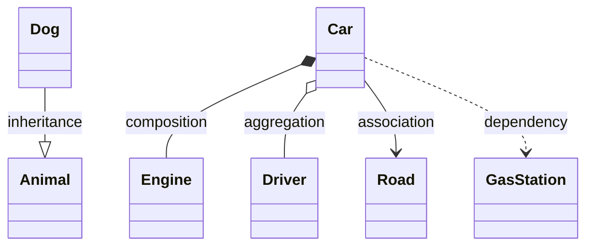
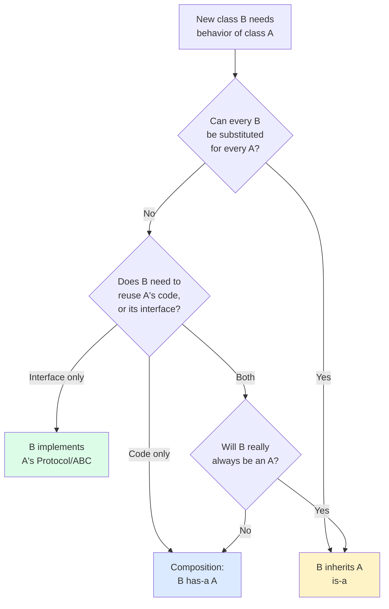
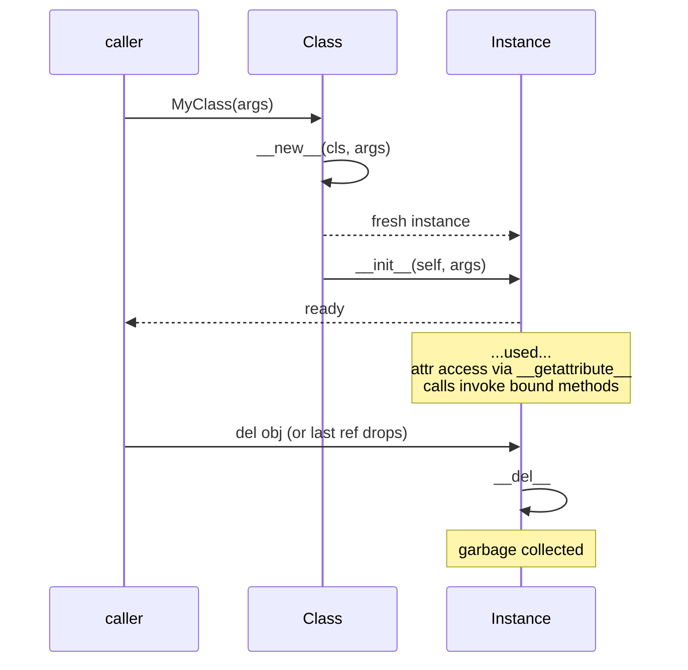

# ⚡ OOP Quick Reference — One-Page Card

> [!tip] How to use this card
> Print it. Tape it next to your monitor. Open it in a side pane while coding. Every cell is a wikilink rabbit hole waiting to happen — click anything for the deep dive.

---

## 🏛️ The 4 Pillars of OOP

| Pillar | One-liner | Tiny Python |
|---|---|---|
| **[[encapsulation]]** | Bundle state + behavior; control access | `self._balance = 0` + `@property def balance` |
| **[[abstraction]]** | Expose essentials, hide complexity | `class Shape(ABC): @abstractmethod def area()` |
| **[[inheritance]]** | Derive new classes; reuse + specialize | `class Dog(Animal): def speak()` |
| **[[polymorphism]]** | Same interface, many forms | `[a.speak() for a in [Dog(), Cat()]]` |

```mermaid
mindmap
  root((4 Pillars))
    Encapsulation
      State + behavior
      @property
      _protected __mangled
    Abstraction
      abc.ABC
      @abstractmethod
      Protocol
    Inheritance
      is-a relationship
      super()
      MRO
    Polymorphism
      Duck typing
      Operator overloading
      Method dispatch
```

---

## 🎯 The 5 SOLID Principles

| Letter | Principle | One-liner | Deep dive |
|:---:|---|---|---|
| **S** | Single Responsibility | A class has **one** reason to change | [[solid-principles]] |
| **O** | Open/Closed | Open for extension, closed for modification | [[solid-principles]] |
| **L** | Liskov Substitution | Subtypes substitutable for base types | [[solid-principles]] |
| **I** | Interface Segregation | Many specific interfaces > one fat interface | [[solid-principles]] |
| **D** | Dependency Inversion | Depend on abstractions, not concretions | [[solid-principles]] · [[dependency-injection]] |

> [!warning] Smells to watch for
> SRP violation → God class · OCP violation → `if/elif` chains on type · LSP violation → subclass throws in parent's method · ISP violation → empty method implementations · DIP violation → `new SqlDatabase()` inside business logic.

---

## 🧩 The 23 GoF Design Patterns (one line each)

| Category | Pattern | One-line intent | Deep dive |
|---|---|---|---|
| **Creational** | [[design-patterns-creational#Singleton\|Singleton]] | One instance, global access | [[design-patterns-creational]] |
| | [[design-patterns-creational#Factory Method\|Factory Method]] | Subclass decides which class to instantiate | [[design-patterns-creational]] |
| | [[design-patterns-creational#Abstract Factory\|Abstract Factory]] | Families of related objects | [[design-patterns-creational]] |
| | [[design-patterns-creational#Builder\|Builder]] | Step-by-step construction of complex objects | [[design-patterns-creational]] |
| | [[design-patterns-creational#Prototype\|Prototype]] | Clone existing objects | [[design-patterns-creational]] |
| **Structural** | [[design-patterns-structural#Adapter\|Adapter]] | Bridge incompatible interfaces | [[design-patterns-structural]] |
| | [[design-patterns-structural#Bridge\|Bridge]] | Split abstraction from implementation | [[design-patterns-structural]] |
| | [[design-patterns-structural#Composite\|Composite]] | Treat individuals & composites uniformly | [[design-patterns-structural]] |
| | [[design-patterns-structural#Decorator\|Decorator]] | Add behavior without subclassing | [[design-patterns-structural]] |
| | [[design-patterns-structural#Facade\|Facade]] | Simplified front to a complex subsystem | [[design-patterns-structural]] |
| | [[design-patterns-structural#Flyweight\|Flyweight]] | Share fine-grained objects efficiently | [[design-patterns-structural]] |
| | [[design-patterns-structural#Proxy\|Proxy]] | Stand-in controlling access | [[design-patterns-structural]] |
| **Behavioral** | [[design-patterns-behavioral#Chain of Responsibility\|Chain of Resp.]] | Pass request along a chain of handlers | [[design-patterns-behavioral]] |
| | [[design-patterns-behavioral#Command\|Command]] | Encapsulate a request as an object | [[design-patterns-behavioral]] |
| | [[design-patterns-behavioral#Iterator\|Iterator]] | Sequential access without exposing internals | [[design-patterns-behavioral]] |
| | [[design-patterns-behavioral#Mediator\|Mediator]] | Centralize complex interactions | [[design-patterns-behavioral]] |
| | [[design-patterns-behavioral#Memento\|Memento]] | Capture & restore internal state | [[design-patterns-behavioral]] |
| | [[design-patterns-behavioral#Observer\|Observer]] | Notify dependents of state changes | [[design-patterns-behavioral]] |
| | [[design-patterns-behavioral#State\|State]] | Behavior changes with internal state | [[design-patterns-behavioral]] |
| | [[design-patterns-behavioral#Strategy\|Strategy]] | Swap algorithms behind one interface | [[design-patterns-behavioral]] |
| | [[design-patterns-behavioral#Template Method\|Template Method]] | Skeleton in base, steps in subclasses | [[design-patterns-behavioral]] |
| | [[design-patterns-behavioral#Visitor\|Visitor]] | Add operations without changing classes | [[design-patterns-behavioral]] |
| | [[design-patterns-behavioral#Interpreter\|Interpreter]] | Define a grammar + interpreter | [[design-patterns-behavioral]] |

---

## 🐍 Python OOP Syntax Quick Hits

### Class declaration

```python
class Dog(Animal, Packable):           # multiple inheritance
    species: str = "Canis familiaris"  # class attribute
    def __init__(self, name: str) -> None:
        self.name = name               # instance attribute
    def bark(self) -> str:             # instance method
        return f"{self.name} says woof"
```

### Inheritance & `super()`

```python
class Puppy(Dog):
    def __init__(self, name: str, toy: str) -> None:
        super().__init__(name)         # call parent __init__
        self.toy = toy
```

### `@property` (getter + setter + deleter)

```python
class Temperature:
    def __init__(self, c: float) -> None: self._c = c
    @property
    def celsius(self) -> float: return self._c
    @celsius.setter
    def celsius(self, v: float) -> None:
        if v < -273.15: raise ValueError
        self._c = v
```

### `@classmethod`, `@staticmethod`

```python
class User:
    def __init__(self, email: str) -> None: self.email = email
    @classmethod
    def from_string(cls, s: str) -> "User":   # alt constructor
        return cls(s.strip().lower())
    @staticmethod
    def is_valid(email: str) -> bool:          # no cls/self
        return "@" in email
```

### `@abstractmethod`

```python
from abc import ABC, abstractmethod
class Shape(ABC):
    @abstractmethod
    def area(self) -> float: ...
```

### `@dataclass`

```python
from dataclasses import dataclass, field
@dataclass(frozen=True, slots=True, order=True)
class Point:
    x: float
    y: float
    label: str = "origin"
    tags: list[str] = field(default_factory=list)
```

---

## 🔒 Visibility Conventions (Python)

| Prefix | Meaning | Example | Enforced? |
|:---:|---|---|:---:|
| (none) `x` | Public — use freely | `obj.name` | No |
| `_x` | Protected — by convention, don't touch | `obj._balance` | No |
| `__x` | Private — name-mangled to `_ClassName__x` | `obj.__secret` | Yes (mangled) |
| `__x__` | Dunder — language-defined, don't invent | `__init__`, `__repr__` | N/A |

> [!danger] Name mangling is NOT security
> `obj.__secret` becomes `obj._MyClass__secret`. Anyone determined can still access it. Python's philosophy: **we're all consenting adults here.** See [[encapsulation]].

---

## 📞 Method Types — When to Use

| Method type | Decorator | First param | Receives class? | Receives instance? | When to use |
|---|:---:|:---:|:---:|:---:|---|
| Instance | (none) | `self` | ✗ (via `self.__class__`) | ✓ | Default — needs instance state |
| Class | `@classmethod` | `cls` | ✓ | ✗ | Alt constructors, class-level state |
| Static | `@staticmethod` | (none) | ✗ | ✗ | Utility function bundled with class |

```python
class Sugar:
    _grams_per_tsp = 4.2
    def sweeten(self, tsp: float) -> float:        # instance
        return tsp * self._grams_per_tsp
    @classmethod
    def from_tsp(cls, tsp: float) -> "Sugar":      # class
        return cls()
    @staticmethod
    def density() -> float:                         # static
        return 1.587
```

> [!tip] Decision rule
> Need `self`? → instance method. Need `cls` (e.g. to construct)? → `@classmethod`. Need neither but the function is conceptually part of the class? → `@staticmethod`. Otherwise → top-level function. See [[methods]].

---

## 📐 UML Relationship Cheat-Sheet

| Relationship | Symbol | Meaning | Python equivalent |
|---|:---:|---|---|
| **Inheritance** | `▷──` | is-a | `class Dog(Animal)` |
| **Realization** | `▷┄┄` | implements interface | `class Dog(ABC)` / `Protocol` |
| **Composition** | `◆──` | owns (lifecycle bound) | `self.engine = Engine()` |
| **Aggregation** | `◇──` | has-a (shared) | `self.driver = driver` (passed in) |
| **Association** | `──` | uses (long-term) | `self.account: BankAccount` |
| **Dependency** | `┄┄>` | temporarily uses | `def f(self, x: Thing)` |



> [!note] Full treatment with analogies + Mermaid + Python: [[class-diagrams]].

---

## 🤔 "is-a" vs "has-a" Decision



| Question | If YES → | If NO → |
|---|---|---|
| Is B a kind of A (linguistically)? | Inheritance | Composition |
| Does B need to *be* an A (subtype polymorphism)? | Inheritance | Composition |
| Does B just need A's *code*? | Composition | Inheritance |
| Will B's interface match A's exactly (LSP)? | Inheritance | Composition |
| Do you want to swap A out at runtime? | Composition | Inheritance |

> [!success] Default
> **Favor composition.** Reach for inheritance only when the answer to *all five* questions points that way. See [[composition-over-inheritance]].

---

## 🪄 Common Dunder Methods Quick List

| Dunder | Triggers | Typical use |
|---|---|---|
| `__init__(self, ...)` | `MyClass(...)` | Initialize instance |
| `__new__(cls, ...)` | `MyClass(...)` (before `__init__`) | Customize creation (immutables, singletons) |
| `__del__(self)` | Garbage collection | Cleanup (rarely used) |
| `__repr__(self)` | `repr(obj)` / debugging | Unambiguous string |
| `__str__(self)` | `str(obj)` / `print()` | User-facing string |
| `__format__(self, spec)` | `f"{obj:spec}"` | Custom formatting |
| `__eq__`, `__ne__`, `__lt__`, `__le__`, `__gt__`, `__ge__` | `==`, `!=`, `<`, `<=`, `>`, `>=` | Comparison |
| `__hash__(self)` | `hash(obj)` / dict keys | Hashable (must pair with `__eq__`) |
| `__bool__(self)` | `bool(obj)` / `if obj:` | Truthiness |
| `__len__(self)` | `len(obj)` | Sized |
| `__getitem__`, `__setitem__`, `__delitem__` | `obj[k]`, `obj[k]=v`, `del obj[k]` | Indexable |
| `__contains__(self, item)` | `x in obj` | Membership |
| `__iter__`, `__next__` | `for x in obj` / `iter(obj)` | Iterable / iterator |
| `__call__(self, ...)` | `obj(args)` | Callable |
| `__enter__`, `__exit__` | `with obj as x:` | Context manager |
| `__add__`, `__sub__`, `__mul__`, `__truediv__`, `__floordiv__`, `__mod__`, `__pow__` | `+`, `-`, `*`, `/`, `//`, `%`, `**` | Arithmetic |
| `__iadd__`, `__isub__`, ... | `+=`, `-=`, ... | In-place arithmetic |
| `__radd__`, ... | `obj + x` when obj doesn't support | Reflected arithmetic |
| `__getattr__`, `__getattribute__`, `__setattr__`, `__delattr__` | `obj.x`, `obj.x = y`, `del obj.x` | Attribute access |
| `__get__`, `__set__`, `__delete__` | Descriptor protocol | Custom attribute binding |
| `__class_getitem__(cls, item)` | `MyClass[int]` | Generic alias |
| `__init_subclass__(cls)` | `class Sub(Base):` | Hook on subclass creation |

> [!note] Full catalog with examples: [[magic-methods]].

---

## 🧊 Data Class Decision Table

| Need | Use | Why |
|---|---|---|
| Plain data bag, mutable | `@dataclass` | Auto `__init__`, `__repr__`, `__eq__` |
| Immutable value object | `@dataclass(frozen=True)` | Hashable, safe to share |
| Memory-tight, many instances | `@dataclass(slots=True)` | Saves ~40% memory (3.10+) |
| Tuple-like, immutable, indexed | `NamedTuple` | Subclass of `tuple`, indexable |
| Need validation/coercion | `attrs` (3rd party) | Per-field validators, converters |
| Heavy behavior, not data | Regular class | Don't force data-class shape |

See [[dataclasses-and-attrs]].

---

## 🧪 ABC vs Protocol Decision

| Question | ABC | Protocol |
|---|:---:|:---:|
| Want runtime enforcement (can't instantiate)? | ✓ | ✗ |
| Want structural typing (duck typing)? | ✗ | ✓ |
| Want to share code in base? | ✓ | ✗ |
| Want subclasses to register implicitly? | ✗ | ✓ |
| Want `isinstance` checks (shallow)? | ✓ | ✓ (with `@runtime_checkable`) |
| Static type-checker integration? | nominal | structural |

> [!tip] Rule of thumb
> **ABC** = "you must inherit from me". **Protocol** = "you just need to look like me". See [[abstraction]] and [[protocols-and-type-hints]].

---

## 🧰 The Pythonic OOP Toolkit (When to Reach for What)

| Problem | Reach for | Note |
|---|---|---|
| Validate an attribute on set | `@property` setter | [[properties]] |
| Cache a computed attribute | `@cached_property` or `@property` + manual cache | [[properties]] |
| Class-level alt constructor | `@classmethod` | [[methods]] |
| Bundle a utility fn with a class | `@staticmethod` (or top-level fn) | [[methods]] |
| Enforce a method override | `@abstractmethod` + `ABC` | [[abstraction]] |
| Define a "duck-typed interface" | `typing.Protocol` | [[protocols-and-type-hints]] |
| Boilerplate-free data class | `@dataclass` | [[dataclasses-and-attrs]] |
| Make objects behave like built-ins | dunder methods | [[magic-methods]] |
| Customize class creation | `__init_subclass__` (simple) or metaclass (rare) | [[metaclasses-and-class-creation]] |
| Many constructors | `@classmethod` alt ctors | [[methods]] |
| Object lifecycle hooks | `__enter__`/`__exit__`, `__del__`, `__post_init__` | [[magic-methods]] |
| Polymorphic behavior | Inheritance, Protocol, or first-class functions | [[polymorphism]] |
| Compose behaviors at runtime | Strategy pattern / composition | [[design-patterns-behavioral]] · [[composition-over-inheritance]] |
| Decouple caller from construction | Factory Method / DI | [[design-patterns-creational]] · [[dependency-injection]] |

---

## 🔁 Lifecycle of a Python Object (Mental Model)



> [!note] Deep dive: [[classes-and-objects]] · [[magic-methods]].

---

## 🧭 Where to Go Next (One-Click Routing)

| You want to… | Open |
|---|---|
| Understand the *why* of OOP | [[what-is-oop]] |
| Learn all 4 pillars deeply | [[four-pillars-summary]] |
| Master Python class syntax | [[classes-and-objects]] |
| Get fluent with methods | [[methods]] |
| Use properties effectively | [[properties]] |
| Implement every dunder | [[magic-methods]] |
| Pick `@dataclass` vs `NamedTuple` vs `attrs` | [[dataclasses-and-attrs]] |
| Understand metaclasses (and when to avoid them) | [[metaclasses-and-class-creation]] |
| Modern typing — Protocol, Self, ClassVar | [[protocols-and-type-hints]] |
| Internalize SOLID | [[solid-principles]] |
| Know all 23 GoF patterns | [[design-patterns-cheatsheet]] |
| Decide composition vs inheritance | [[composition-over-inheritance]] |
| Wire dependencies cleanly | [[dependency-injection]] |
| Learn GRASP + DRY/KISS/YAGNI/LoD | [[grasp-and-extra-principles]] |
| Draw class diagrams | [[class-diagrams]] |
| Draw sequence diagrams | [[sequence-diagrams]] |
| Full Mermaid syntax reference | [[mermaid-cheatsheet]] |
| Plan a course | [[learning-path]] |
| Avoid common anti-patterns | [[common-pitfalls-and-anti-patterns]] |
| See real-world OOP code | [[real-world-examples]] |
| Practice with exercises | [[exercises-and-projects]] |
| Look up a term | [[glossary]] |

---

## 🔑 Key Takeaways

- **4 pillars** (encapsulation, abstraction, inheritance, polymorphism) — one-line each, every Python dev should know all four.
- **5 SOLID principles** — read them as a checklist, not a religion.
- **23 GoF patterns** — know their intents; you'll rarely use more than ~10.
- **Visibility** in Python is by convention (`_`, `__`); we're all consenting adults.
- **Instance / class / static methods** — choose by what you need access to (`self`, `cls`, or neither).
- **6 UML relationships** — learn the difference between composition, aggregation, and association; they're not synonyms.
- **Composition over inheritance** is the modern default — but inheritance is right for *is-a* hierarchies that satisfy LSP.
- **Dunder methods** are the secret to Pythonic OOP — make your objects behave like built-ins.
- When in doubt, **link out**: every concept on this card has a deep-dive note behind it.

---

*See also: [[python-oop-syntax-cheatsheet]] · [[design-patterns-cheatsheet]] · [[solid-and-principles-cheatsheet]] · [[uml-cheatsheet]] · [[common-mistakes-cheatsheet]] · [[glossary]] · [[start-here-student-guide]]*
