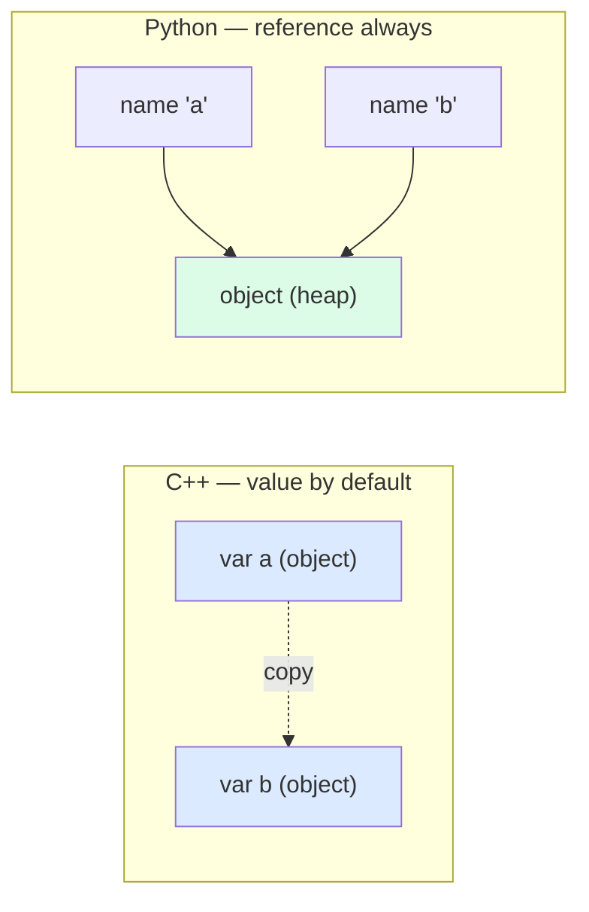
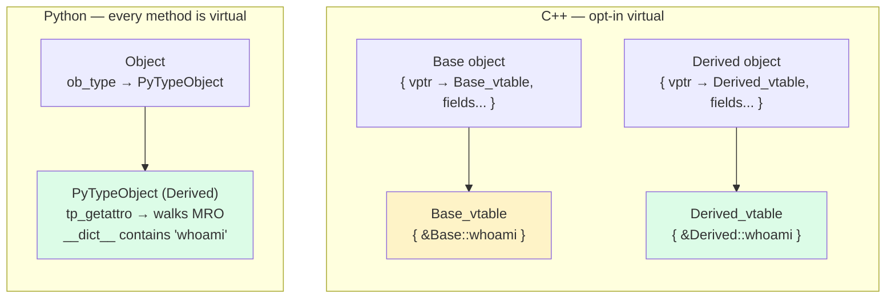
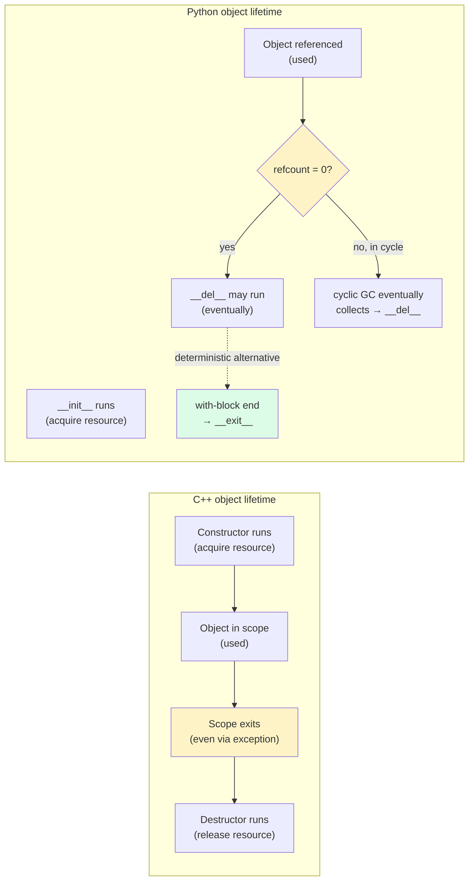
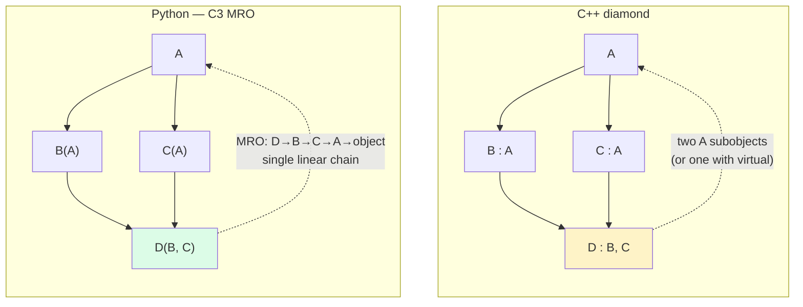
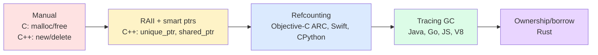
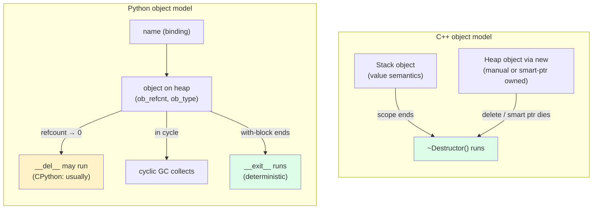
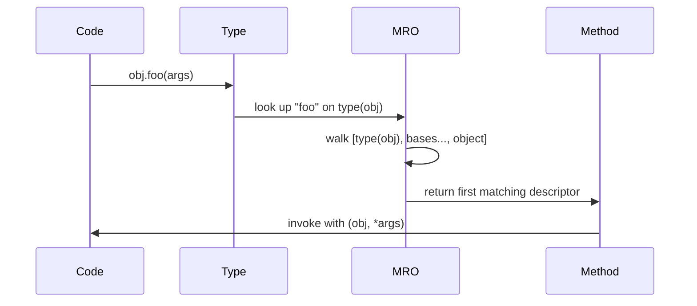
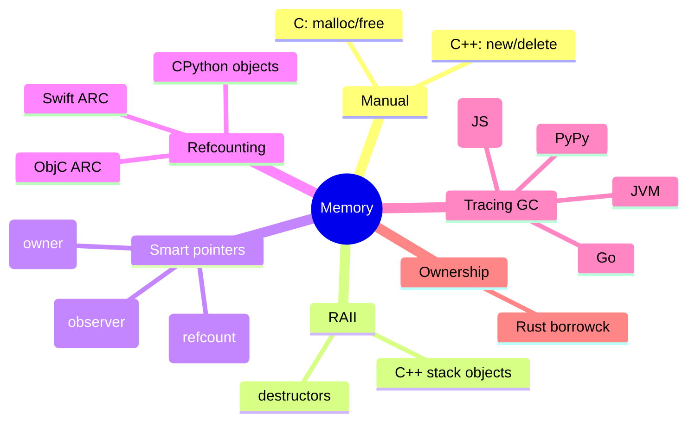

> [!info] Who This Note Is For
> You've written C++ (perhaps in a systems, games, or competitive-programming context) and you're now learning Python. Or you know Python and want to reason about what C++ actually buys you. The two languages look superficially similar (curly-brace-free Python aside) but their object models are *very* different — especially around memory and value semantics.

> [!tip] Prerequisite
> Skim [[classes-and-objects]], [[inheritance]], and [[magic-methods]] first.

## 1. Two Cultures, Both C-Family

C++ and Python share surface syntax but come from opposite ends of the language-design spectrum:

| | **C++** | **Python** |
|---|---|---|
| Design goal | Zero-cost abstractions over the hardware | Readable, dynamic, batteries-included |
| Compilation | Compiled to native code | Interpreted (bytecode on a VM) |
| Memory | Manual (`new`/`delete`) + RAII + smart pointers | Garbage-collected (refcount + cycle GC) |
| Object location | Stack **or** heap — your choice | Always on the heap (CPython) |
| Value semantics | Default — copying is everywhere | Reference semantics — copying is opt-in |
| Method dispatch | Static by default; `virtual` opts in | Always dynamic ("always virtual") |
| Typing | Static, with templates | Dynamic + optional annotations |

> [!quote] Stroustrup vs van Rossum
> **C++**: "You don't pay for what you don't use."
> **Python**: "Simple is better than complex." (But you *do* pay — in runtime cost.)

---

## 2. The Biggest Single Difference: Value vs Reference Semantics

If you read nothing else in this note, read this section.

### 2.1 C++ — value semantics by default

```cpp
struct Point { int x, y; };

void translate(Point p) {     // COPY — caller's Point unchanged
    p.x += 1;
}

int main() {
    Point a{1, 2};
    translate(a);
    std::cout << a.x << "\n"; // still 1
}
```

In C++, passing a `Point` *copies* it. Mutations inside the function don't escape. To get reference behavior you must ask for it explicitly with `&` or `*`:

```cpp
void translate(Point& p) { p.x += 1; }   // reference — caller's Point mutates
void translate(Point* p) { p->x += 1; }  // pointer — same, but nullable
```

### 2.2 Python — reference semantics always

```python
class Point:
    def __init__(self, x: int, y: int) -> None:
        self.x, self.y = x, y

def translate(p: Point) -> None:
    p.x += 1                 # mutates the SAME object the caller sees

a = Point(1, 2)
translate(a)
print(a.x)                   # 2 — the caller's object was mutated
```

Every variable in Python is a **reference** to an object. Assignment `b = a` does *not* copy; both names refer to the same object. Function arguments are passed by *object reference* (sometimes called "pass-by-sharing").

> [!warning] C++ → Python gotcha
> If you write Python expecting C++'s value-copy semantics, you will be bitten by aliasing bugs. `b = a; b.items.append(1)` mutates `a.items` too. Use `copy.copy(a)` or `copy.deepcopy(a)` when you really want a copy.

### 2.3 Where this matters most

| Operation | C++ default | Python |
|---|---|---|
| Assignment `b = a` | Copy | Alias |
| Function arg `f(a)` | Copy (unless `&`/`*`) | Alias |
| Return value `return a;` | Copy (or move) | Alias |
| Container insertion `v.push_back(a)` | Copy | Alias (just stores the reference) |
| Equality `a == b` | Member-wise by default (`==` undefined for structs unless you write it) | Calls `__eq__`; default is identity |
| Less-than `a < b` | Member-wise for structs? No — you must write `operator<` | Calls `__lt__`; default `TypeError` |

### 2.4 Mermaid: mental model



---

## 3. Class Definition Side-by-Side

### 3.1 A simple class

**C++:**
```cpp
class Person {
public:
    Person(std::string name, int age) : name_(std::move(name)), age_(age) {}
    std::string greet() const { return "Hi, I'm " + name_; }
private:
    std::string name_;
    int age_;
};
```

**Python:**
```python
class Person:
    def __init__(self, name: str, age: int) -> None:
        self.name = name
        self.age = age

    def greet(self) -> str:
        return f"Hi, I'm {self.name}"
```

> [!note] Differences
> - C++ separates **declaration** (header `.h`) from **definition** (`.cpp`). Python has no separate declaration; you write it once.
> - C++'s constructor uses a **member initializer list** (`: name_(...)`) for efficiency — direct construction rather than default-construct-then-assign. Python has no equivalent; everything is direct assignment in `__init__`.
> - C++ marks non-mutating methods `const`. Python has no `const` method concept — see §9.

### 3.2 `self` vs `this`

Same trade-off as Java, but worth restating in the C++ context:

| | C++ `this` | Python `self` |
|---|---|---|
| Nature | Pointer to the instance, implicit | Explicit first parameter |
| In a method body | `this->name_` or just `name_` | `self.name` (mandatory) |
| Type | `Person*` (or `const Person*` in const methods) | `Person` (no const distinction) |

---

## 4. `virtual` Methods and vtables

This is the second biggest mental shift.

### 4.1 C++ — static dispatch by default

```cpp
#include <iostream>
struct Base {
    void whoami() { std::cout << "Base\n"; }      // NOT virtual — statically dispatched
};
struct Derived : Base {
    void whoami() { std::cout << "Derived\n"; }    // HIDES Base::whoami
};

int main() {
    Base* b = new Derived();
    b->whoami();   // "Base" — calls Base::whoami based on static type Base*
    delete b;
}
```

Add `virtual` and dispatch becomes dynamic:

```cpp
struct Base {
    virtual void whoami() { std::cout << "Base\n"; }
    virtual ~Base() = default;                     // CRITICAL: virtual destructor!
};
struct Derived : Base {
    void whoami() override { std::cout << "Derived\n"; }
};

Base* b = new Derived();
b->whoami();   // "Derived" — now calls Derived::whoami
```

> [!warning] The #1 C++ OOP bug
> Forgetting to make the destructor `virtual` on a polymorphic base class. Deleting a `Derived` through a `Base*` with a non-virtual destructor is **undefined behavior** — typically leaks `Derived`'s members and corrupts the heap.

### 4.2 Python — always dynamic

In Python, every method is "virtual." There is no `final` keyword equivalent at runtime (you can use `typing.final` as a hint for type-checkers, but it's not enforced). Method dispatch always looks up the attribute on the instance's type at call time:

```python
class Base:
    def whoami(self) -> None:
        print("Base")

class Derived(Base):
    def whoami(self) -> None:
        print("Derived")

b: Base = Derived()
b.whoami()        # "Derived" — Python doesn't care about the annotation
```

> [!note] Why "always virtual"?
> Python objects store a reference to their type, and attribute lookup walks the MRO at *call time*. There's no compile-time type to dispatch on. The cost: every method call goes through a dictionary lookup (heavily optimized with "inline caches" in modern CPython, but still slower than a C++ non-virtual call).

### 4.3 The vtable mental model



### 4.4 When C++ lets you opt out

C++'s default non-virtual dispatch is a *performance feature*. A tight loop calling `obj.compute()` on a value-typed object compiles to a direct call (often inlined). Python's equivalent always goes through attribute lookup. If you're porting a hot C++ loop to Python, expect a 10–100× slowdown unless you vectorize with NumPy or rewrite in Cython/C.

---

## 5. Constructors, Destructors, RAII

### 5.1 C++ — RAII is the centerpiece

**RAII (Resource Acquisition Is Initialization)** binds every resource (memory, file, lock, socket) to an object's lifetime. Acquisition happens in the constructor; release happens in the destructor. When an object goes out of scope (even via exception), its destructor *always* runs.

```cpp
class FileHandle {
public:
    explicit FileHandle(const std::string& path) : f_(std::fopen(path.c_str(), "r")) {
        if (!f_) throw std::runtime_error("open failed");
    }
    ~FileHandle() { if (f_) std::fclose(f_); }
    FileHandle(const FileHandle&) = delete;             // no accidental copies
    FileHandle& operator=(const FileHandle&) = delete;
    FILE* get() const { return f_; }
private:
    FILE* f_;
};

void use() {
    FileHandle fh("data.txt");   // opens file
    // ... use fh ...
}                                // ~FileHandle runs here — file closed, even on exception
```

### 5.2 Python — GC and `__del__` (unreliable)

Python objects are reclaimed when their **reference count** hits zero, or later by the **cyclic garbage collector** if they're in a reference cycle. You *can* define `__del__`, but:

- It runs at an **unpredictable** time (or never, if a cycle isn't collected before interpreter exit).
- Exceptions inside `__del__` are printed to stderr and swallowed.
- It can resurrect the object (by storing `self` somewhere), which leads to weird state.

The Pythonic answer is **context managers** — the `with` statement — which is *deterministic*:

```python
class FileHandle:
    def __init__(self, path: str) -> None:
        self._f = open(path, "r")

    def __enter__(self) -> "FileHandle":
        return self

    def __exit__(self, exc_type, exc, tb) -> None:
        self._f.close()

    @property
    def file(self):
        return self._f

def use() -> None:
    with FileHandle("data.txt") as fh:   # __enter__
        ...                                # use fh
    # __exit__ has run — file closed, even on exception
```

> [!warning] C++ → Python gotcha
> Don't rely on `__del__` for deterministic cleanup. CPython's refcounting *usually* makes it look like RAII works — until your code runs on PyPy (no refcounting) or the object is part of a cycle, at which point cleanup is delayed arbitrarily. Use `with` and context managers (`__enter__`/`__exit__`) — see [[magic-methods]].

### 5.3 The RAII ↔ Context Manager mapping

| C++ (RAII) | Python |
|---|---|
| Constructor acquires resource | `__init__` (or `__enter__`) |
| Destructor releases resource | `__exit__` (preferred) or `__del__` (risky) |
| Stack-allocated object's scope exit | End of `with` block |
| `std::unique_ptr<T>` | Just use a Python object — refcounting handles it |
| `std::shared_ptr<T>` | Default Python behavior (every reference is a shared one) |
| `std::weak_ptr<T>` | `weakref.ref(obj)` / `weakref.WeakValueDictionary` |
| Move semantics (`std::move`) | Not really needed — passing a reference doesn't transfer ownership |
| Copy semantics | `copy.copy()` (shallow) / `copy.deepcopy()` (deep) |

### 5.4 Mermaid: lifetime models



---

## 6. Templates vs Duck Typing / Generics

### 6.1 C++ templates — compile-time code generation

```cpp
template <typename T>
T add(T a, T b) { return a + b; }

add(1, 2);            // instantiates add<int> — calls int::operator+
add(std::string("a"), std::string("b"));   // instantiates add<string>
// add(1, "x");       // compile error: no matching operator+
```

Templates are **Turing-complete at compile time**. The compiler generates a fresh specialization for each type used. Errors are notoriously verbose ("substitution failure is not an error," SFINAE, concepts in C++20).

### 6.2 Python duck typing — runtime dispatch

```python
def add(a, b):
    return a + b

add(1, 2)             # int.__add__
add("a", "b")         # str.__add__
add([1], [2])         # list.__add__
# add(1, "x")         # TypeError at runtime: unsupported operand
```

Python doesn't care about types — only whether `a.__add__(b)` exists and works.

### 6.3 With type hints — `TypeVar`

```python
from typing import TypeVar

T = TypeVar("T")

def add(a: T, b: T) -> T:
    return a + b
```

This gives `mypy` enough to flag `add(1, "x")` as a type error. But it's still optional — at runtime `add(1, "x")` will try `int.__add__(1, "x")` and fail.

### 6.4 Concepts (C++20) vs Protocols

C++20 *concepts* are the closest analog to Python's `Protocol`:

```cpp
// C++20
template <typename T>
concept Addable = requires(T a, T b) { a + b; };

template <Addable T>
T add(T a, T b) { return a + b; }
```

```python
# Python
from typing import Protocol, TypeVar

class Addable(Protocol):
    def __add__(self, other: "Addable") -> "Addable": ...

T = TypeVar("T", bound=Addable)

def add(a: T, b: T) -> T:
    return a + b
```

Both say "any type that supports `+`." The difference: C++ concepts are checked at compile time on actual instantiation; Python Protocols are checked by `mypy` against type annotations only.

---

## 7. Operator Overloading

C++: `operator+`, `operator==`, `operator<<`, etc. Python: dunder methods.

### 7.1 The same `Vector2D` in both languages

**C++:**
```cpp
#include <iostream>
#include <cmath>

class Vector2D {
public:
    Vector2D(double x = 0, double y = 0) : x_(x), y_(y) {}

    Vector2D operator+(const Vector2D& o) const {
        return Vector2D{x_ + o.x_, y_ + o.y_};
    }

    Vector2D& operator+=(const Vector2D& o) {
        x_ += o.x_; y_ += o.y_;
        return *this;
    }

    bool operator==(const Vector2D& o) const {
        return x_ == o.x_ && y_ == o.y_;
    }

    double operator[](std::size_t i) const {
        return i == 0 ? x_ : y_;
    }

    friend std::ostream& operator<<(std::ostream& os, const Vector2D& v) {
        return os << "(" << v.x_ << ", " << v.y_ << ")";
    }

    double norm() const { return std::sqrt(x_*x_ + y_*y_); }

private:
    double x_, y_;
};

int main() {
    Vector2D a{1, 2}, b{3, 4};
    Vector2D c = a + b;
    std::cout << c << " norm=" << c.norm() << "\n";
    if (a + b == c) std::cout << "equal\n";
}
```

**Python:**
```python
from __future__ import annotations
import math
from dataclasses import dataclass


@dataclass
class Vector2D:
    x: float = 0.0
    y: float = 0.0

    def __add__(self, other: Vector2D) -> Vector2D:
        return Vector2D(self.x + other.x, self.y + other.y)

    def __iadd__(self, other: Vector2D) -> Vector2D:
        self.x += other.x
        self.y += other.y
        return self

    def __eq__(self, other: object) -> bool:
        if not isinstance(other, Vector2D):
            return NotImplemented
        return self.x == other.x and self.y == other.y

    def __getitem__(self, i: int) -> float:
        return self.x if i == 0 else self.y

    def __repr__(self) -> str:           # analogous to operator<<
        return f"({self.x}, {self.y})"

    def norm(self) -> float:
        return math.sqrt(self.x ** 2 + self.y ** 2)


def main() -> None:
    a = Vector2D(1.0, 2.0)
    b = Vector2D(3.0, 4.0)
    c = a + b
    print(f"{c} norm={c.norm()}")
    if a + b == c:
        print("equal")


if __name__ == "__main__":
    main()
```

### 7.2 Operator ↔ dunder map

| Concept | C++ | Python |
|---|---|---|
| Addition | `operator+` | `__add__` / `__radd__` / `__iadd__` |
| Subscript | `operator[]` | `__getitem__` / `__setitem__` |
| Stream output | `operator<<` | `__str__` / `__repr__` |
| Equality | `operator==` | `__eq__` (return `NotImplemented` to fall back) |
| Less-than | `operator<` | `__lt__` (or `functools.total_ordering`) |
| Hashing | `std::hash<T>` specialization | `__hash__` (set to `None` to make unhashable) |
| Iteration | `begin()` / `end()` | `__iter__` / `__next__` |
| Function call | `operator()` | `__call__` |
| Cast | `operator int()`, etc. | No equivalent — define `.to_int()` etc. |
| `new`/`delete` | `operator new` / `operator delete` | `__new__` / `__del__` (different semantics!) |

> [!tip] `NotImplemented` vs `NotImplementedError`
> Returning `NotImplemented` from `__eq__` tells Python "I don't know how to compare with this type; try the reflected operation." `raise NotImplementedError` is for abstract methods. Don't confuse them.

---

## 8. Multiple Inheritance

### 8.1 C++ — multiple base classes + the diamond

```cpp
struct A { virtual void f() { std::cout << "A"; } };
struct B : A { void f() override { std::cout << "B"; } };
struct C : A { void f() override { std::cout << "C"; } };
struct D : B, C {            // diamond — D has TWO A subobjects
    void f() override { B::f(); }   // disambiguate manually
};
```

By default, `D` has *two* copies of `A`'s data — one through `B`, one through `C`. To share, use **virtual inheritance**:

```cpp
struct B : virtual A { ... };
struct C : virtual A { ... };
struct D : B, C { ... };    // single shared A subobject
```

Virtual inheritance has runtime cost (extra indirection to find the shared base) and complicates construction order. Most C++ style guides discourage deep diamond hierarchies.

### 8.2 Python — MRO (C3 linearization)

```python
class A:
    def f(self) -> None: print("A")
class B(A):
    def f(self) -> None: print("B")
class C(A):
    def f(self) -> None: print("C")
class D(B, C):
    pass

D().f()                       # "B"
print(D.__mro__)              # D, B, C, A, object
```

Python flattens the inheritance graph into a single linear order using **C3 linearization**. No diamond problem (each class appears once in the MRO), no virtual inheritance keyword, no ambiguity — `super()` just walks the MRO. The trade-off: you must design for *cooperative* multiple inheritance (every `__init__` calls `super().__init__()`).

### 8.3 Mermaid: diamond handling



---

## 9. `const`-correctness vs "We're All Consenting Adults"

C++'s `const` is a *contract* the compiler enforces:

```cpp
struct Vec {
    double x, y;
    double norm() const { return std::sqrt(x*x + y*y); }  // promises not to mutate
    void scale(double s) { x *= s; y *= s; }               // mutates
};

void f(const Vec& v) {
    v.norm();    // OK — const method on const object
    // v.scale(2);  // compile error — non-const method on const object
}
```

Python has no `const`. The closest analogues:

- Frozen dataclasses (`@dataclass(frozen=True)`) — instances are immutable *at the attribute level* (assignment raises `FrozenInstanceError`).
- `typing.Final` — tells type-checkers a name shouldn't be reassigned (not enforced at runtime).
- Tuples are immutable sequences, but their *contents* can still be mutable.

```python
from dataclasses import dataclass
from typing import Final

PI: Final[float] = 3.14159           # type-checker will flag reassignment

@dataclass(frozen=True)
class Vec:
    x: float
    y: float
    def norm(self) -> float:
        return (self.x ** 2 + self.y ** 2) ** 0.5

v = Vec(1.0, 2.0)
# v.x = 5.0    # FrozenInstanceError
```

> [!quote] The Python Zen
> "We're all consenting adults." Python trusts you not to mutate an object you've been told not to. The `const`-style enforcement would add complexity that the language has consistently rejected.

> [!warning] But the call site is unprotected
> A frozen dataclass with a `list` attribute still allows `v.items.append(1)`. `frozen` only blocks attribute *rebinding*, not mutation of mutable attribute contents. For deep immutability, use `tuple` instead of `list`, `frozenset` instead of `set`, or `types.MappingProxyType` for read-only dict views.

---

## 10. Memory Management

### 10.1 The spectrum



### 10.2 C++ — manual + RAII + smart pointers

- **Stack objects**: lifetime = scope. Destructor runs at scope exit.
- **Heap objects**: `new`/`delete` — easy to leak or double-free.
- **Smart pointers** (`<memory>`):
  - `std::unique_ptr<T>` — sole owner; move-only; frees on destruction.
  - `std::shared_ptr<T>` — refcounted; frees when last `shared_ptr` dies.
  - `std::weak_ptr<T>` — non-owning observer of a `shared_ptr`; breaks cycles.
- **Custom deleters** for non-memory resources (file handles, sockets).

### 10.3 Python — refcounting + cycle GC

- Every object has a refcount. Assigning `b = a` increments; `del b` decrements.
- When refcount hits 0, the object is reclaimed *immediately* (CPython) and `__del__` may run.
- Cycles (`a.b = b; b.a = a`) don't drop to 0 — the cyclic GC eventually detects and frees them.
- **CPython's refcounting is an implementation detail**, not part of the language spec. PyPy uses tracing GC only; objects can live much longer there.
- For deterministic cleanup of *external* resources, use context managers (`with`), not `__del__`.

### 10.4 Practical implications for OOP

| Concern | C++ | Python |
|---|---|---|
| Object creation cost | Cheap (stack) or `new` (heap, but tunable) | Always heap allocation; relatively expensive |
| Copying | Tunable (move semantics, copy elision) | Always reference; `copy.copy` is opt-in |
| Lifetime control | Precise (RAII) | Approximate (GC) |
| Deterministic teardown | Yes (scope = lifetime) | Only with `with` |
| Memory leaks | Common (raw `new`/`delete`) | Rare (GC handles most), but possible (in cycles, in C extensions, in caches) |
| Resource leaks (non-memory) | RAII handles them | `with`-blocks required |
| Pointer arithmetic | Yes — bugs galore | No — references only |
| Smart-pointer analogues | `unique_ptr`, `shared_ptr`, `weak_ptr` | Default = `shared_ptr`-like; `weakref` for weak refs |

---

## 11. Feature Comparison Table

| Feature | C++ | Python |
|---|---|---|
| Paradigm | Multi-paradigm | Multi-paradigm |
| Typing | Static, nominal, with templates | Dynamic + optional hints |
| Compilation | Compiled native | Bytecode interpreted |
| Memory | Manual + RAII + smart ptrs | GC (refcount + cyclic) |
| Object location | Stack or heap (your choice) | Always heap (CPython) |
| Default semantics | Value | Reference |
| Copy behavior | Member-wise by default; customizable | Reference; `copy.copy`/`deepcopy` opt-in |
| Method dispatch | Static by default; `virtual` opts in | Always dynamic |
| `final`/`sealed` | `final` keyword | `typing.final` (hint only) |
| Constructors | Named after class; member-init list | `__init__` (+ `__new__` for creation) |
| Destructors | `~Class()` (deterministic, RAII) | `__del__` (unreliable); use `with` |
| Multiple inheritance | Yes (+ virtual inheritance for diamonds) | Yes (C3 MRO) |
| Access control | `public`/`protected`/`private` keywords | `_` / `__` conventions |
| `const` methods | Yes | No (frozen dataclasses approximate) |
| Operator overloading | `operator+`, etc. | Dunder methods (`__add__`, etc.) |
| Templates / generics | Templates (compile-time, Turing-complete) | `typing.Generic` (erased, optional) |
| Concepts | C++20 `concept` | `typing.Protocol` |
| Function pointers | `std::function`, raw pointers | Functions are first-class objects |
| Lambdas | `[capture](args) { body }` | `lambda args: body` (single expression) |
| Exceptions | `try`/`catch` (zero-cost if unused) | `try`/`except` (always some cost) |
| RTTI | `dynamic_cast`, `typeid` (opt-in via `/GR`) | Always on (`type()`, `isinstance`) |
| Reflection | Limited (no standard reflection) | Rich (`inspect`, `__dict__`, `getattr`) |
| Standard library | STL (containers, algorithms) | Vast "batteries included" stdlib |
| Build system | CMake, Make, etc. | `pip` + venv |
| Memory safety | No (UB lurks) | Yes (no pointer arithmetic) |
| Performance | Top-tier | Slow relative to native |
| ABI stability | None guaranteed | None (CPython ABI changes per version) |

---

## 12. Migration Tips — C++ → Python

> [!tip] Mental reset
> Stop worrying about object location, copy cost, and `const`. Embrace the GC. Spend the freed-up brain cycles on tests and design.

### 12.1 DO: Forget `new`/`delete`

You just call `MyClass(args)`. Python manages memory. There's no stack-vs-heap choice; every object is on the heap.

### 12.2 DO: Use `with` for any resource

File, socket, lock, database connection — wrap it in a context manager. This is the Pythonic RAII.

### 12.3 DON'T: Worry about virtual destructors

There's no manual deletion through a base pointer in Python. The GC handles cleanup (though you still want `with` for *deterministic* cleanup of external resources).

### 12.4 DO: Let go of value semantics

Python is reference semantics. If you want a copy, say so with `copy.copy` (shallow) or `copy.deepcopy` (deep). For data holders, use `@dataclass` and let `__eq__`/`__hash__` be auto-generated.

### 12.5 DON'T: Optimize prematurely

A Python class with attribute access is ~10–100× slower than equivalent C++. That's fine for almost all code. When it isn't, vectorize with NumPy or rewrite the hot path in Cython/C/Rust.

### 12.6 DO: Embrace duck typing

Stop writing template <typename T> everywhere. Just call `a + b` and let Python dispatch. Add type hints if you want static checking.

### 12.7 DO: Use `__iter__` and `__next__` instead of `begin()`/`end()`

Python's iteration protocol is one method (`__iter__` returning an iterator) and one method (`__next__` on the iterator). Way simpler than STL iterator categories.

### 12.8 DON'T: Confuse `__del__` with destructors

`__del__` is unreliable. Use `with` blocks.

### 12.9 DO: Use `dataclasses` for value types

You get `__init__`, `__repr__`, `__eq__`, `__hash__` (if frozen), and `__lt__` (with `order=True`) for free — the things C++ generates for you only with significant boilerplate.

### 12.10 DON'T: Use multiple inheritance carelessly

C++ taught you MI is dangerous. Python's MRO makes it *safer*, not *safe*. The advice in [[composition-over-inheritance]] still applies.

---

## 13. Common Pitfalls for C++ Developers Learning Python

> [!warning] Watch out
> 1. **Aliasing bugs** — `b = a` doesn't copy. `def f(items=[]): ...` mutates a shared list across calls (use `None` default + create inside).
> 2. **Expecting deterministic destructors** — port a C++ RAII class to `__del__` and watch it fail on PyPy or under cycles.
> 3. **Overusing `__del__`** — exception swallowing, resurrection, GC ordering, all bite.
> 4. **Assuming `==` is identity** — `==` is `__eq__`; identity is `is`. `None` checks should be `is None`.
> 5. **`@dataclass` default mutables** — `tags: list = []` shares one list across all instances. Use `field(default_factory=list)`.
> 6. **Trying to "stack allocate"** for speed — every object is on the heap. If you need speed, use NumPy or a native extension.
> 7. **Writing `private:` everywhere** — Python doesn't enforce it. Use `_` for "internal" and `__` only when you need name-mangling to avoid subclass collisions.
> 8. **Operator overloading confusion** — `__eq__` returning `NotImplemented` (the singleton) vs raising `NotImplementedError` (the exception). They are completely different.

---

## 14. Mermaid Diagrams

### 14.1 Object model comparison



### 14.2 Method dispatch



### 14.3 Memory ownership spectrum



---

## 15. Key Takeaways

1. **Value vs reference semantics is the single biggest difference.** C++ copies by default; Python aliases by default. If you internalize only one thing, make it this.
2. **C++ methods are non-virtual by default; Python methods are always virtual.** This is why C++ needs the `virtual` keyword and why Python's method calls are slower.
3. **RAII has no direct equivalent in Python.** Use `with` blocks and context managers for deterministic resource cleanup. `__del__` is a trap.
4. **No `const`.** Use frozen dataclasses and `typing.Final` as approximations; rely on tests and discipline.
5. **Templates generate code at compile time; Python duck-types at runtime.** Both let you write generic code, but the failure modes differ (verbose C++ compile errors vs Python runtime `TypeError`s).
6. **Multiple inheritance is safer in Python (MRO) than in C++ (virtual inheritance), but still not free.** Prefer composition in both languages.
7. **Operator overloading maps directly: `operator+` ↔ `__add__`.** The full list of dunder methods is in [[magic-methods]].
8. **Smart pointers ≈ Python's default reference model.** Every Python reference is a `shared_ptr` with no `weak_ptr` cycle-breaking by default — except that CPython's cycle GC handles it.
9. **Performance expectations:** 10–100× slower than C++. Use NumPy / native extensions for hot loops.
10. **The same design principles apply:** SOLID, composition-over-inheritance, RAII-equivalent resource handling via `with`. See [[solid-principles]] and [[composition-over-inheritance]].

## 16. Practice Exercises

> [!example] Try these
> 1. Port a small C++ class with a virtual hierarchy to Python. Notice how much boilerplate disappears (no `virtual`, no virtual destructor, no header file).
> 2. Implement a `Vector2D` class in both languages with `+`, `+=`, `==`, `[]`, and stream/`repr` output. Compare the line counts.
> 3. Write a `FileHandle` class in Python with `__enter__`/`__exit__` that mirrors a C++ RAII wrapper. Verify that an exception inside the `with` block still closes the file.
> 4. Write a `Buffer` class that wraps a `bytearray` in Python. Notice how passing it to a function aliases the buffer (no copy). Compare with a C++ version using `Buffer&`.
> 5. Implement a small generic `Stack` in both languages. In C++, use a template; in Python, just write it once and use it with any type.

## 17. Related Notes

- [[multi-language-comparison]] — beyond C++: Java, C#, JS, Ruby, Go
- [[language-transfer-guide]] — structured transfer guide per source language
- [[classes-and-objects]] · [[methods]] · [[magic-methods]] · [[properties]]
- [[inheritance]] · [[polymorphism]] · [[abstraction]] · [[encapsulation]]
- [[protocols-and-type-hints]]
- [[solid-principles]] · [[composition-over-inheritance]]
- [[python-vs-java-oop]] · [[python-vs-javascript-oop]]
- [[what-is-oop]] · [[paradigm-comparison]]
