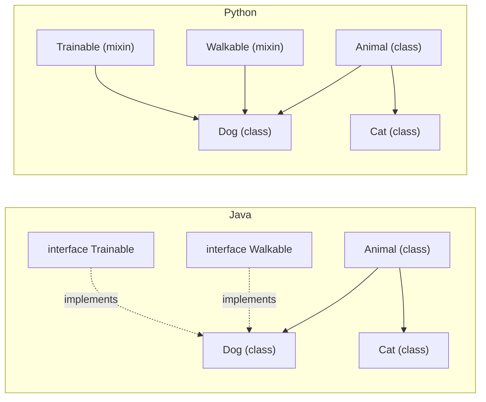
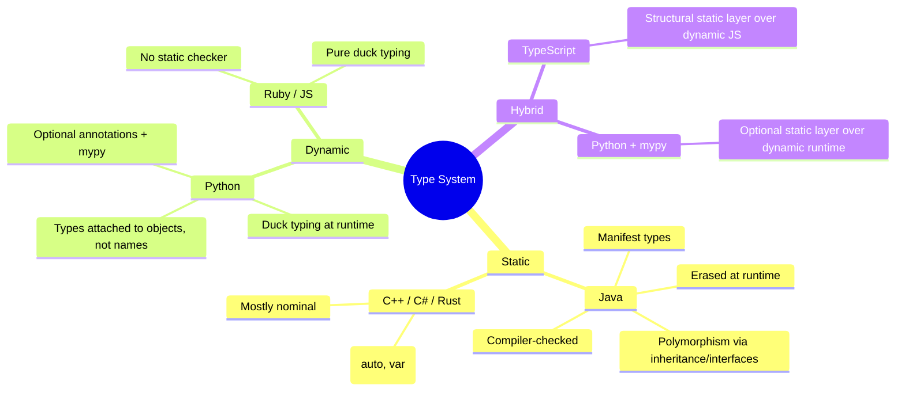
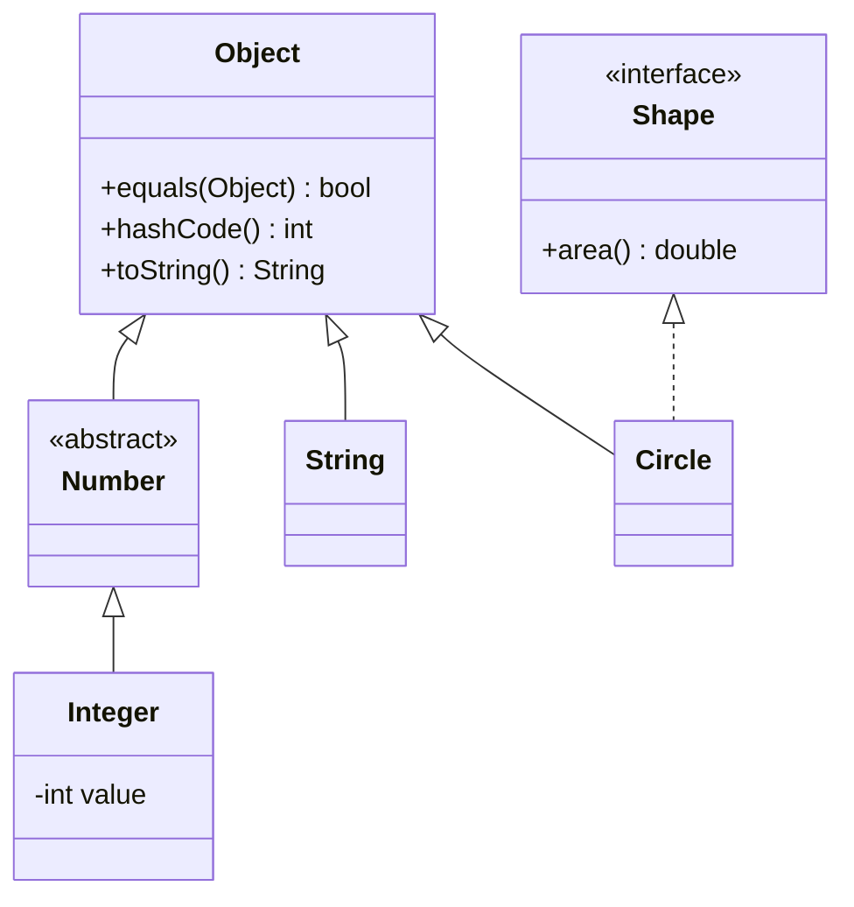
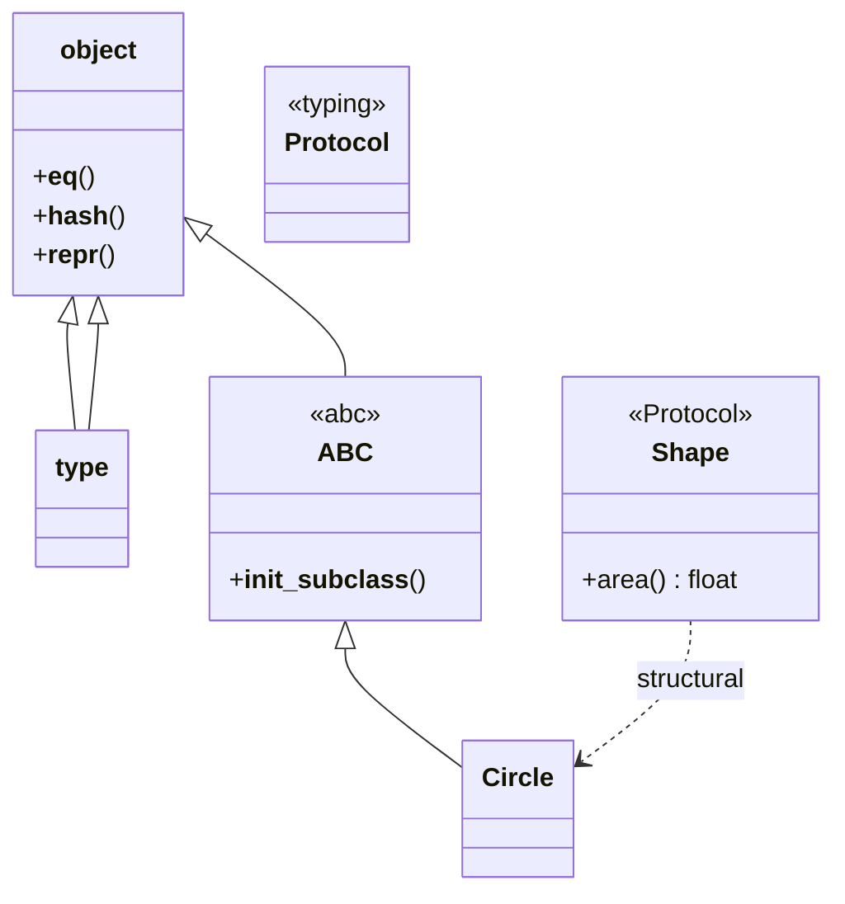
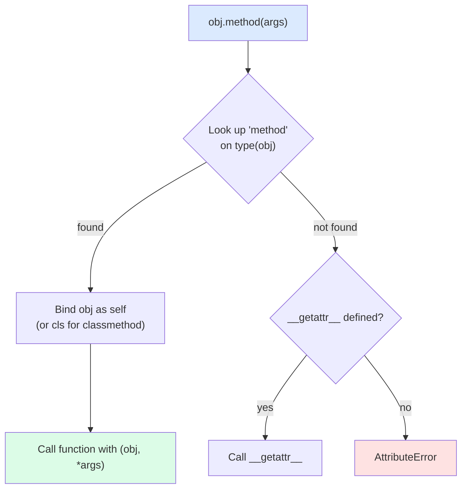

> [!info] Who This Note Is For
> You already know Java (perhaps from a CS1 course or a job) and want to understand Python's object model. Or you know Python and want to be able to read Java code and reason about the trade-offs. This note maps the two worlds onto each other so you can cross the gap without losing your bearings.

> [!tip] Prerequisite
> Skim [[classes-and-objects]] and [[inheritance]] first. This note assumes you understand Python's class basics and now want to see how Java does (and doesn't) match up.

## 1. Two Philosophies, One Paradigm

Both Java and Python are object-oriented, multi-paradigm, C-family-syntax languages. But they were designed with **opposite default positions**:

| | **Java** | **Python** |
|---|---|---|
| Default | Everything is locked down; you opt *in* to openness | Everything is open; you opt *in* to discipline |
| Typing | Static, nominal, manifest | Dynamic, with optional static hints (PEP 484) |
| Memory | JVM garbage collector; objects always on heap | CPython reference-counting + GC; objects always on heap |
| Inheritance | Single class + multiple interfaces | Multiple class inheritance (with MRO) |
| Privacy | Language-enforced `private`/`protected` | Convention (`_`, `__`) + `@property` |
| Functions | Must live inside classes | First-class, can stand alone |

> [!quote] The Tao
> **Java**: "The compiler is your friend — let it catch as many mistakes as possible before runtime."
> **Python**: "Programmers are adults — let them do what they want; catch mistakes with tests."

---

## 2. Class Declaration and Constructors

### 2.1 A minimal class

**Java:**
```java
public class Person {
    private String name;
    private int age;

    public Person(String name, int age) {
        this.name = name;
        this.age = age;
    }

    public String greet() {
        return "Hi, I'm " + this.name;
    }
}
```

**Python:**
```python
class Person:
    def __init__(self, name: str, age: int) -> None:
        self.name = name
        self.age = age

    def greet(self) -> str:
        return f"Hi, I'm {self.name}"
```

> [!note] What changed
> - `public class` becomes `class`. Python has no file-visibility keywords; module = file.
> - Field declarations are absent in Python. You *create* attributes by assignment in `__init__`. There is no separate "declare then assign" step.
> - The constructor is named `__init__` (a dunder method) and **always** takes `self` as its first parameter.
> - Type annotations are optional hints; they are not enforced at runtime.

### 2.2 `this` vs `self`

| Aspect | Java `this` | Python `self` |
|---|---|---|
| Keyword or parameter? | Implicit keyword | Explicit first parameter (name is convention; `self` is *not* a keyword) |
| When is it required? | Only when a local variable shadows a field | **Always** — must be the first parameter of every instance method |
| Can you call a method without it? | Yes — `greet()` inside a method calls `this.greet()` implicitly | **No** — `self.greet()` is mandatory; bare `greet()` looks up a global |
| At call site | `obj.greet()` — `this` is auto-injected | `obj.greet()` — Python auto-binds `obj` as `self` |

```python
# Python: self is mandatory
class C:
    def f(self) -> None:
        self.g()   # OK
        # g()      # NameError — there is no global g()

    def g(self) -> None:
        print("g")
```

> [!warning] Common Java-to-Python mistake
> Writing `class C: def f(): ...` (no `self`) and then being baffled by `TypeError: f() takes 0 positional arguments but 1 was given`. The `1 argument` is the instance Python auto-passes.

### 2.3 Overloading

Java supports **method overloading** (multiple methods with the same name, different parameter types). Python does **not** — the second definition silently shadows the first.

```java
// Java
class Adder {
    int add(int a, int b) { return a + b; }
    double add(double a, double b) { return a + b; }
}
```

```python
# Python — use defaults, *args, or @overload for type-checker hints
class Adder:
    def add(self, a: float, b: float) -> float:
        return a + b

from typing import overload

class Adder2:
    @overload
    def add(self, a: int, b: int) -> int: ...
    @overload
    def add(self, a: float, b: float) -> float: ...
    def add(self, a: float, b: float) -> float:
        return a + b
```

> [!note] `@overload`
> `typing.overload` is for **static checkers only**. At runtime only the final, real implementation matters. See [[protocols-and-type-hints]].

---

## 3. Access Control

This is one of the biggest mental shifts.

### 3.1 Java's four access levels

| Modifier | Same class | Same package | Subclass | World |
|---|---|---|---|---|
| `public` | ✅ | ✅ | ✅ | ✅ |
| `protected` | ✅ | ✅ | ✅ | ❌ |
| (package-private, no modifier) | ✅ | ✅ | ❌ | ❌ |
| `private` | ✅ | ❌ | ❌ | ❌ |

Java's access control is enforced by the compiler **and** the JVM. Reflection can bypass it (`setAccessible(true)`) but it's an explicit opt-out.

### 3.2 Python's three tiers — all by convention

| Prefix | Meaning | Enforcement |
|---|---|---|
| `name` | Public | None — anyone can use |
| `_name` | "Internal" — by convention private | None — pure social contract |
| `__name` (with trailing `__` *not* allowed) | Name-mangled to `_ClassName__name` | Compiler rewrites the name; access via mangled name still works |
| `__name__` (dunder) | Reserved for Python's protocol methods | Don't define your own dunders unless implementing a protocol |

```python
class BankAccount:
    def __init__(self, owner: str) -> None:
        self.owner = owner        # public
        self._balance = 0         # "private" by convention
        self.__pin = "1234"       # name-mangled to _BankAccount__pin

acct = BankAccount("Alice")
print(acct.owner)            # Alice
print(acct._balance)         # 0 — works, but you're being rude
# print(acct.__pin)          # AttributeError
print(acct._BankAccount__pin)  # "1234" — mangled name still accessible
```

> [!warning] Name mangling is NOT security
> It is a *namespace* mechanism, designed to avoid accidental name collisions in subclasses. Anyone determined can still reach `__pin` via the mangled name. Use it for "this is an implementation detail subclasses shouldn't accidentally override," not for security.

### 3.3 Properties replace boilerplate getters/setters

In Java, the idiom is `getX()`/`setX()` and an IDE generates them. In Python, you **start with a public attribute**, then promote it to a `@property` *only when you need a hook*. The call site doesn't change.

```python
class Temperature:
    def __init__(self, celsius: float) -> None:
        self.celsius = celsius      # starts public

    @property
    def fahrenheit(self) -> float:
        return self.celsius * 9 / 5 + 32

    @fahrenheit.setter
    def fahrenheit(self, f: float) -> None:
        self.celsius = (f - 32) * 5 / 9
```

```java
// Java — must commit to the accessor pattern up front, or break callers later
public class Temperature {
    private double celsius;
    public Temperature(double c) { this.celsius = c; }
    public double getCelsius() { return celsius; }
    public void setCelsius(double c) { this.celsius = c; }
    public double getFahrenheit() { return celsius * 9.0 / 5.0 + 32.0; }
    public void setFahrenheit(double f) { this.celsius = (f - 32.0) * 5.0 / 9.0; }
}
```

> [!tip] Java → Python idiom
> **Stop writing getters and setters.** Public attributes are fine in Python. When you truly need validation or derived values, switch to `@property` — *without breaking any caller*. This is a *huge* productivity win. See [[properties]].

---

## 4. Inheritance

### 4.1 Single vs Multiple



**Java:**
- A class extends **one** superclass.
- A class implements **many** interfaces.
- Interfaces can extend multiple interfaces.
- Default methods (since Java 8) reduce the need for abstract classes.

**Python:**
- A class inherits from **any number** of base classes.
- The **MRO** (Method Resolution Order, computed via C3 linearization) determines method lookup order.
- "Interfaces" are approximated by `abc.ABC` (abstract base class, *nominal*) and `typing.Protocol` (structural — see [[protocols-and-type-hints]]).

### 4.2 The MRO

```python
class A:
    def hi(self) -> str: return "A"

class B(A):
    def hi(self) -> str: return "B"

class C(A):
    def hi(self) -> str: return "C"

class D(B, C):
    pass

print(D().hi())           # B  — B comes first in MRO
print(D.__mro__)          # (<class 'D'>, <class 'B'>, <class 'C'>, <class 'A'>, <class 'object'>)
```

> [!note] Why C3?
> C3 linearization guarantees a **monotonic** order: if `B` precedes `C` in any local precedence order, it precedes `C` everywhere. This prevents the inconsistencies that plague naive multiple-inheritance lookups. See [[inheritance]] for the deep dive.

In Java the equivalent problem cannot arise — only one base class exists. The price is that "mixin" behavior must be expressed via interface default methods, which cannot hold state.

### 4.3 `super()` in both languages

```python
# Python — cooperative multiple inheritance
class Base:
    def __init__(self) -> None:
        print("Base.__init__")

class Left(Base):
    def __init__(self) -> None:
        print("Left.__init__")
        super().__init__()      # next in MRO, not necessarily Base

class Right(Base):
    def __init__(self) -> None:
        print("Right.__init__")
        super().__init__()

class Diamond(Left, Right):
    def __init__(self) -> None:
        print("Diamond.__init__")
        super().__init__()

Diamond()   # Diamond → Left → Right → Base (each __init__ runs exactly once)
```

```java
// Java — super refers strictly to the single parent
public class Dog extends Animal {
    public Dog(String name) {
        super(name);     // Animal's constructor MUST be the first statement
    }
}
```

> [!warning] Different semantics
> Java's `super` is a *specific parent*. Python's `super()` is *the next class in the MRO* — which is why cooperative multiple inheritance works. Java's `super` cannot be used to call sibling-interface default methods in a controllable way; Python can route through any class with `super(Cls, self)`.

---

## 5. Interfaces and Abstract Classes

### 5.1 Java

```java
public interface Drawable {
    void draw();                           // abstract
    default void drawTwice() { draw(); draw(); }   // default method (Java 8+)
}

public abstract class Shape {
    public abstract double area();         // abstract method
    public String describe() { return "Shape with area " + area(); }
}

public class Circle extends Shape implements Drawable {
    private final double r;
    public Circle(double r) { this.r = r; }
    @Override public double area() { return Math.PI * r * r; }
    @Override public void draw() { System.out.println("○"); }
}
```

### 5.2 Python

```python
from abc import ABC, abstractmethod
from typing import Protocol, runtime_checkable

# Nominal ABC — must inherit to be a Shape
class Shape(ABC):
    @abstractmethod
    def area(self) -> float: ...
    def describe(self) -> str:
        return f"Shape with area {self.area()}"

# Structural Protocol — duck-typed
class Drawable(Protocol):
    def draw(self) -> None: ...

class Circle(Shape):
    def __init__(self, r: float) -> None:
        self.r = r
    def area(self) -> float:
        return 3.14159 * self.r * self.r
    def draw(self) -> None:
        print("○")

c: Circle = Circle(2.0)
d: Drawable = c            # OK structurally — Circle has draw()
```

> [!note] Two flavors
> - `abc.ABC` + `@abstractmethod` is **nominal**: you must inherit. Trying to instantiate `Shape()` raises `TypeError`. Subclasses that don't override all abstract methods are themselves abstract.
> - `typing.Protocol` is **structural**: no inheritance needed; any class with the right shape matches. This is closer to Go interfaces or TypeScript interfaces. See [[protocols-and-type-hints]] and [[abstraction]].

### 5.3 When to use which?

| Need | Use |
|---|---|
| Stop users instantiating a half-baked base class | `ABC` + `@abstractmethod` |
| Document a shape that types can match without inheriting | `Protocol` |
| Provide shared state and helper methods to subclasses | Regular base class (or ABC with concrete methods) |
| Express "all subclasses must implement this" | `@abstractmethod` |

---

## 6. Generics

### 6.1 Java — type erasure

```java
public class Box<T> {
    private T value;
    public Box(T v) { this.value = v; }
    public T get() { return value; }
}

Box<String> b = new Box<>("hi");
String s = b.get();           // compiler inserts cast to String
// At runtime, Box<String> is just Box — generics are erased.
```

Generics in Java are a **compile-time** feature. The JVM has no notion of `Box<String>` vs `Box<Integer>` — both are `Box`. This is why `new T()` doesn't work and `instanceof Box<String>` is illegal.

### 6.2 Python — `typing.Generic` and `TypeVar`

```python
from typing import Generic, TypeVar

T = TypeVar("T")

class Box(Generic[T]):
    def __init__(self, v: T) -> None:
        self.value: T = v
    def get(self) -> T:
        return self.value

b: Box[str] = Box("hi")
s: str = b.get()
```

Python's generics are **also** erased at runtime — `Box("hi").__orig_class__` exists as a debugging aid but `isinstance(b, Box[str])` doesn't really work (you can check `isinstance(b, Box)`).

> [!tip] The big difference
> Java's type checker is mandatory and sound at the bytecode level (modulo erasure quirks). Python's type checker (`mypy`/`pyright`) is *optional* — you can run untyped code freely. This means Python's generics are **purely for documentation and tooling**, never for runtime behavior. See [[protocols-and-type-hints]].

### 6.3 Variance at a glance

| Concept | Java | Python |
|---|---|---|
| Covariance | `<? extends T>` | `list["SubT"]` doesn't auto-subtype `list["T"]`; use `Sequence[T]` (covariant) vs `list[T]` (invariant) |
| Contravariance | `<? super T>` | `Callable[[T], None]` is contravariant in argument |
| Declaration-site variance | `class Box<out T>` (Kotlin-style; Java has no decl-site) | `TypeVar("T", covariant=True)` |
| Use-site wildcards | Yes (`? extends`) | Not directly; emulate with `Sequence`/`Callable` |

---

## 7. Static vs Dynamic Typing — What It Means for OOP



### 7.1 What "static" buys you in Java

- Compile-time type errors (a `Shape` can't be assigned to a `String`).
- Better IDE support: refactor with confidence, find usages, autocomplete.
- Polymorphism is **explicit**: you must declare `implements Drawable` before you can pass a class where `Drawable` is expected.

### 7.2 What "dynamic" buys you in Python

- No boilerplate of interfaces for one-off shapes.
- **Duck typing**: any object with `draw()` can be passed to a function expecting "a drawable thing."
- Faster prototyping — fewer files, less ceremony.
- The cost: type errors surface at runtime. `mypy`/`pyright` mitigate this if you adopt them.

> [!example] Same logic, two worlds
> ```python
> # Python — duck-typed; anything with .area() works
> def total_area(shapes: list) -> float:
>     return sum(s.area() for s in shapes)
> ```
> ```java
> // Java — must declare an interface
> interface HasArea { double area(); }
> double totalArea(List<? extends HasArea> shapes) {
>     return shapes.stream().mapToDouble(HasArea::area).sum();
> }
> ```

---

## 8. The Same Program in Both Languages — `Shape` Hierarchy

> [!example] Goal
> A `Shape` base type, two concrete shapes (`Circle`, `Rectangle`), polymorphic `area()`, and a list of shapes whose areas we sum.

### 8.1 Java

```java
import java.util.*;

interface Shape {
    double area();
    default String describe() { return String.format("%s area=%.2f", name(), area()); }
    String name();
}

class Circle implements Shape {
    private final double r;
    public Circle(double r) { this.r = r; }
    @Override public double area() { return Math.PI * r * r; }
    @Override public String name() { return "Circle"; }
}

class Rectangle implements Shape {
    private final double w, h;
    public Rectangle(double w, double h) { this.w = w; this.h = h; }
    @Override public double area() { return w * h; }
    @Override public String name() { return "Rectangle"; }
}

public class Main {
    public static void main(String[] args) {
        List<Shape> shapes = List.of(new Circle(2), new Rectangle(3, 4));
        double total = 0;
        for (Shape s : shapes) { total += s.area(); System.out.println(s.describe()); }
        System.out.println("Total: " + total);
    }
}
```

### 8.2 Python

```python
from __future__ import annotations
from dataclasses import dataclass
from typing import Protocol
import math


class Shape(Protocol):
    def area(self) -> float: ...
    def name(self) -> str: ...


def describe(s: Shape) -> str:
    return f"{s.name()} area={s.area():.2f}"


@dataclass
class Circle:
    r: float
    def area(self) -> float: return math.pi * self.r * self.r
    def name(self) -> str: return "Circle"


@dataclass
class Rectangle:
    w: float
    h: float
    def area(self) -> float: return self.w * self.h
    def name(self) -> str: return "Rectangle"


def main() -> None:
    shapes: list[Shape] = [Circle(2.0), Rectangle(3.0, 4.0)]
    total = 0.0
    for s in shapes:
        total += s.area()
        print(describe(s))
    print(f"Total: {total}")


if __name__ == "__main__":
    main()
```

> [!note] Differences to notice
> - Java needed an `interface Shape` *declared* up front. Python's `Protocol` is structural — `Circle` and `Rectangle` match `Shape` purely because they have the right methods; they never "declare" the relationship.
> - Python used `@dataclass` to autogenerate `__init__` and `__repr__`. Java's `record` (Java 16+) gives similar conciseness:
>   ```java
>   record Circle(double r) implements Shape { ... }
>   ```

---

## 9. Feature Comparison Table (35 rows)

| Feature | Java | Python |
|---|---|---|
| Paradigm | Multi-paradigm, OOP-first | Multi-paradigm |
| Typing | Static, nominal, manifest | Dynamic + optional annotations |
| Type checker | Compiler (mandatory) | `mypy`/`pyright` (optional) |
| Inheritance | Single class + multiple interfaces | Multiple classes + MRO |
| Multiple inheritance | No (only interfaces) | Yes (C3 linearization) |
| Constructor name | Same as class | `__init__` |
| Instance reference | `this` (implicit keyword) | `self` (explicit param) |
| Field declaration | Required up-front | Created on assignment |
| Access modifiers | `public`/`protected`/`private`/pkg-private | Convention: `_`, `__` (name-mangling) |
| Properties | `getX()`/`setX()` idiom; `record` for compact | `@property` built-in |
| Method overloading | Yes | No (use `@overload` for hints) |
| Operator overloading | No | Yes (dunder methods) |
| Generics | Erased (`<T>`) | `typing.Generic` + `TypeVar`, erased |
| Variance | Use-site wildcards | Declaration-site via `TypeVar` flags |
| Abstract classes | `abstract class` / `interface` | `abc.ABC` + `@abstractmethod` |
| Interfaces | `interface` (can have default/static methods) | `typing.Protocol` (structural) or `ABC` (nominal) |
| Default methods | Yes (interface `default`, Java 8+) | Just write a concrete method in the base/ABC |
| Static members | `static` keyword | Module-level functions/vars; `@staticmethod`/`@classmethod` |
| Inner classes | Yes (nested, including anonymous) | Yes (rarely used; no anonymous classes) |
| Anonymous classes | Yes (`new Iface() { ... }`) | No (use lambdas or named classes) |
| Lambdas | `(a, b) -> a + b` (single-method interfaces) | `lambda a, b: a + b` (any function) |
| Enums | `enum` (full class) | `enum.Enum` (also a class) |
| Garbage collection | JVM GC (generational) | CPython refcount + cyclic GC |
| Memory model | Stack for primitives, heap for objects | Everything on heap (including small ints, cached) |
| Value types | Primitives (`int`, `double`, …) | None — everything is a heap object |
| Equality | `==` (reference) / `.equals()` (value) | `is` (identity) / `==` (value via `__eq__`) |
| Hashing | `hashCode()` paired with `equals()` | `__hash__` paired with `__eq__` |
| `toString` / `__str__` | `toString()` | `__str__` + `__repr__` |
| Exceptions | Checked + unchecked | All unchecked |
| Generics reification | Erased | Erased |
| Reflection | `java.lang.reflect` | `inspect`, `getattr`, `__dict__`, etc. |
| Annotations | `@Override`, `@Deprecated`, custom | `@dataclass`, `@property`, custom decorators |
| Decorators | Not built-in (annotations are passive) | First-class — `@decorator` syntax |
| Package system | Packages + modules; `import` is type-level | Modules + packages; `import` is runtime |
| Entry point | `public static void main(String[] args)` | `if __name__ == "__main__":` |
| Build tool | Maven, Gradle | pip + venv; Poetry/Hatch/PDM |
| Testing convention | JUnit | pytest |
| Metaprogramming | Annotation processors, codegen | Metaclasses, decorators, `__init_subclass__`, `__class_getitem__` |

---

## 10. Migration Tips — Java → Python Idioms

> [!tip] Mental reset
> You are not "writing Java in Python syntax." You are switching to a different *style* of OOP. Lean into it.

### 10.1 DO: Stop writing getters/setters

Start with a public attribute. Promote to `@property` only when you need a hook. Callers never break.

```python
# Bad (Java brain)
class User:
    def __init__(self, name: str) -> None:
        self._name = name
    def get_name(self) -> str: return self._name
    def set_name(self, v: str) -> None: self._name = v

# Pythonic
class User:
    def __init__(self, name: str) -> None:
        self.name = name
```

### 10.2 DO: Embrace duck typing and `Protocol`

Don't define an interface for every shape. Use a `Protocol` if a static checker needs the contract; otherwise just call `.area()` and let Python complain if it's missing.

### 10.3 DO: Use `dataclass` for "data holders"

Java `record` (Java 16+) is your friend; Python's `@dataclass` is the equivalent — and more flexible.

```python
from dataclasses import dataclass, field

@dataclass(frozen=True)
class Point:
    x: float
    y: float
    tags: list[str] = field(default_factory=list)
```

### 10.4 DON'T: Put everything in classes

Java forces every function into a class. Python does not. A module of free functions is often clearer than a class with one method.

```python
# Java-brain
class MathUtils:
    @staticmethod
    def square(x: float) -> float: return x * x

# Pythonic
def square(x: float) -> float: return x * x
```

### 10.5 DON'T: Use abstract base classes everywhere

`ABC`s have a real cost (indirection, cognitive load). Use them when you have *shared state + polymorphic dispatch*; otherwise prefer `Protocol`.

### 10.6 DO: Use type hints + mypy in shared/prod code

Static checking is optional but excellent. Adopt it for code that other people depend on. See [[protocols-and-type-hints]].

### 10.7 DON'T: Catch `Exception` everywhere

Java's checked exceptions trained you to declare or catch. Python has only unchecked exceptions — only catch what you can actually handle.

### 10.8 DO: Prefer composition over inheritance (in both languages)

See [[composition-over-inheritance]].

### 10.9 DON'T: Use `isinstance` checks to fake method overloading

```python
# Bad
def process(x):
    if isinstance(x, str): ...
    elif isinstance(x, int): ...

# Good — dispatch on a method, or split into two functions
```

### 10.10 DO: Learn the dunder methods

`__eq__`, `__hash__`, `__repr__`, `__lt__`, `__iter__`, `__enter__`/`__exit__` — these are Python's answer to Java's `equals`/`hashCode`/`toString`/`Comparable`/`Iterator`/`AutoCloseable`. See [[magic-methods]].

---

## 11. Mermaid Diagrams

### 11.1 Java's type system at a glance



### 11.2 Python's type system at a glance



### 11.3 How a method call resolves



---

## 12. Common Pitfalls for Java Developers Learning Python

> [!warning] Watch out
> 1. **Forgetting `self`** in method definitions — runtime `TypeError`.
> 2. **Class-level mutable defaults** — `class C: items: list = []` is *shared across all instances*. Use `field(default_factory=list)` in dataclasses or assign in `__init__`.
> 3. **Catching exceptions too broadly** — `except Exception:` swallows bugs that should propagate.
> 4. **Using `==` where you meant `is`** — `==` is `__eq__`; `is` is identity. `None` checks should use `is None`.
> 5. **Overengineering with ABCs and interfaces** for one-off scripts. YAGNI applies harder in Python because the boilerplate cost is lower but still nonzero.
> 6. **Treating `__init__` as the only constructor** — `__new__` controls object creation; `__init__` only initializes. For immutable types (e.g., tuples, frozen dataclasses) you may need `__new__` or `__post_init__`.
> 7. **Expecting `private` to be enforced** — `__name` is mangled, not hidden. Don't rely on it for security.

---

## 13. Key Takeaways

1. **Java enforces structure at compile time; Python defers most checks to runtime but rewards you with brevity.** Both philosophies are coherent; neither is "more OOP."
2. **`self` is explicit; `this` is implicit.** Python's choice makes methods first-class callables you can pass around.
3. **Access control is convention in Python, law in Java.** Use `_` and `__` to communicate intent; use `@property` for hooks.
4. **Python has *multiple inheritance with MRO*; Java has *single inheritance + interfaces*.** Different solutions to the same problem (sharing code across types).
5. **Protocols give Python structural subtyping**, closer to Go/TypeScript interfaces than to Java interfaces. Use them to express "has a shape" without forcing inheritance.
6. **Generics are erased in both languages.** Python's are also optional — adopt `mypy` for shared libraries.
7. **Stop writing getter/setter boilerplate in Python.** Public attributes + `@property` on demand is the idiomatic path.
8. **`@dataclass` is your `record`.** Use it for value-like classes.
9. **Functions are first-class in Python.** Not everything needs to be a method.
10. **The same design principles apply in both languages** — SOLID, composition-over-inheritance, programming to interfaces. Read [[solid-principles]] and [[composition-over-inheritance]].

> [!quote] Guido van Rossum
> "Don't pretend that Python is Java." Python has its own idioms; learn them, and you'll be far more productive than trying to import your old style.

## 14. Practice Exercises

> [!example] Try these to internalize the differences
> 1. Port a small Java class hierarchy (3–5 classes) to Python. Compare line counts. Where did the verbosity go?
> 2. Take a Java class with `getX()`/`setX()` methods and rewrite it in Python — first as plain public attributes, then with `@property`. Notice the call-site stability.
> 3. Implement a `Stack` in both languages using composition over inheritance. Which is shorter?
> 4. Pick a Java interface with one method (e.g., `Comparator`). Translate it to a Python `Protocol` and write a function that accepts it.
> 5. Write a generic `Box[T]` in both languages. Instantiate `Box[str]` and `Box[int]`. Verify at runtime that both generics are erased.

## 15. Related Notes

- [[multi-language-comparison]] — beyond Java: C++, C#, JS, Ruby, Go
- [[language-transfer-guide]] — structured transfer guide per source language
- [[classes-and-objects]] · [[methods]] · [[properties]] · [[magic-methods]]
- [[inheritance]] · [[polymorphism]] · [[abstraction]] · [[encapsulation]]
- [[protocols-and-type-hints]]
- [[solid-principles]] · [[composition-over-inheritance]]
- [[what-is-oop]] · [[paradigm-comparison]]
