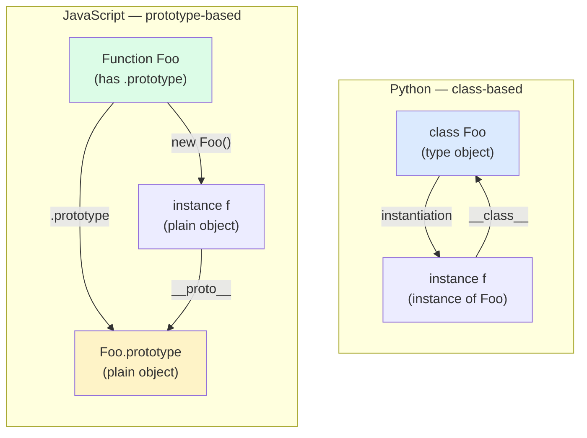
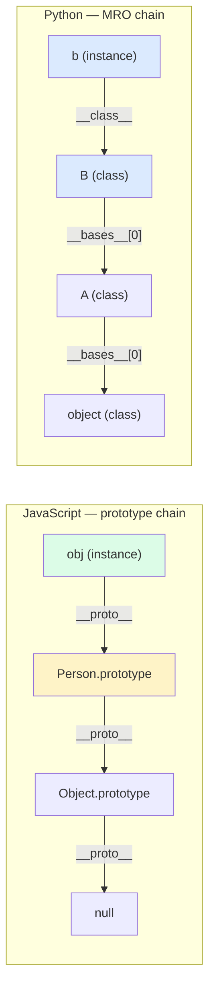
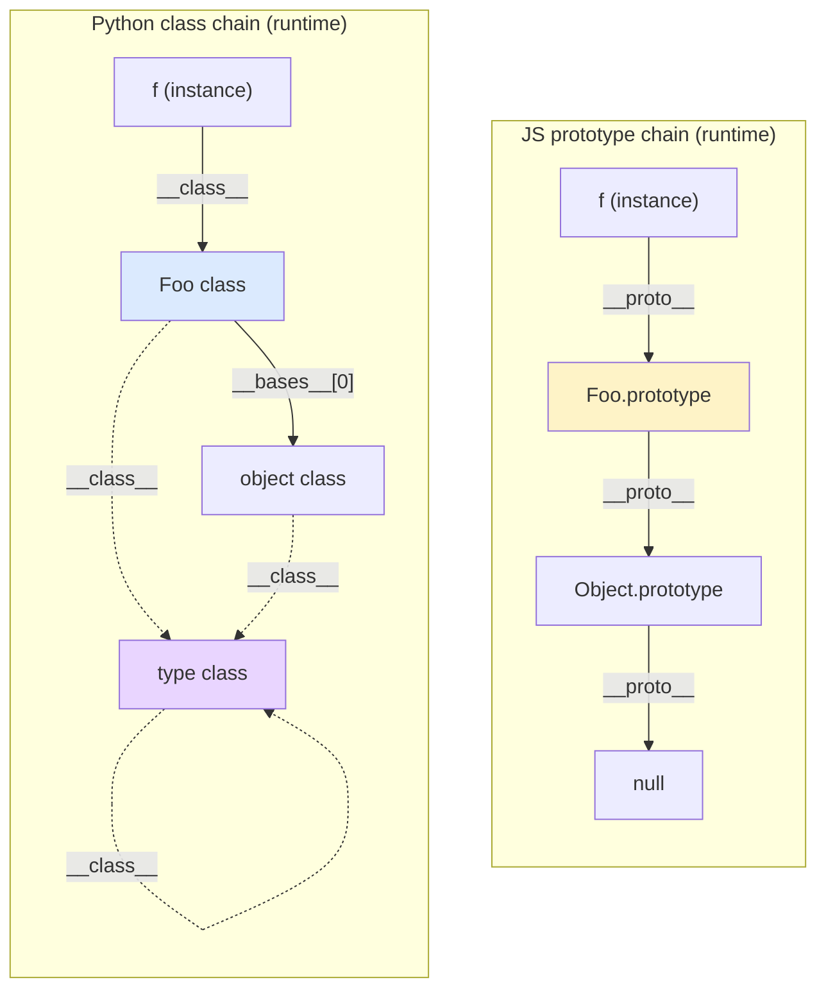
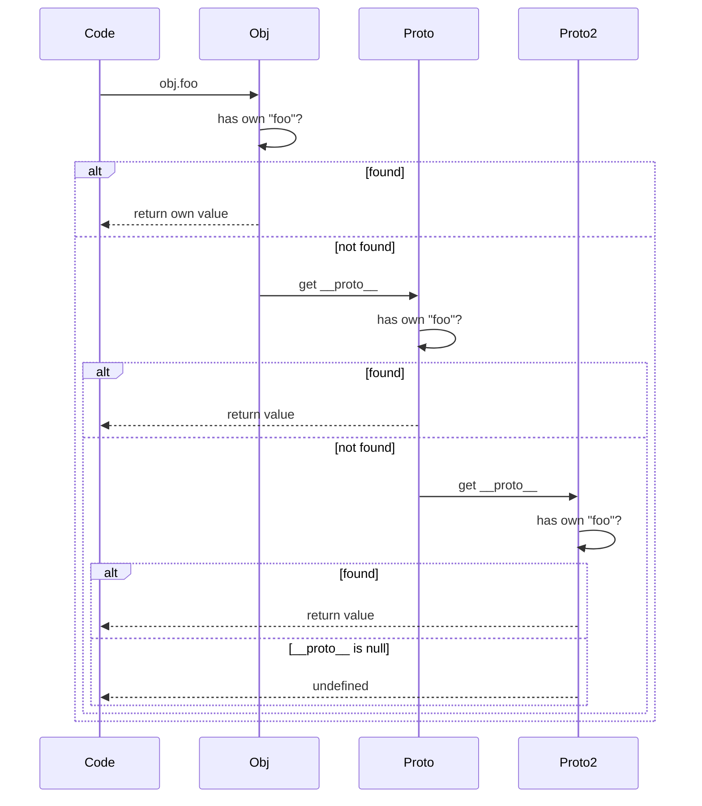
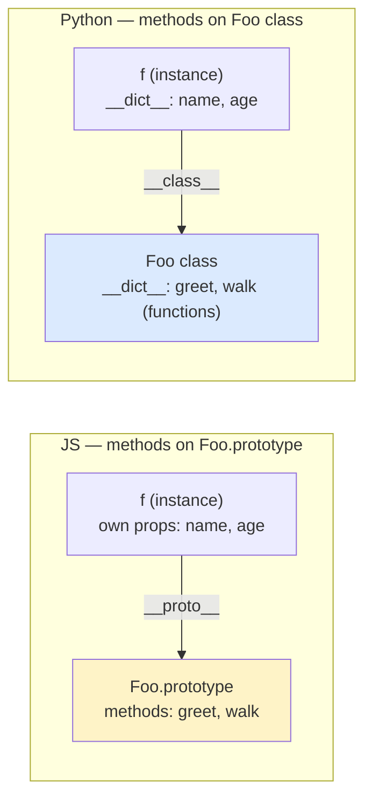

> [!info] Who This Note Is For
> You know JavaScript — perhaps from web development — and you're learning Python. Or you know Python and want to understand why JS feels so weird. The two languages are *both* dynamic and multi-paradigm, but their object models diverge on a fundamental point: **Python is class-based; JavaScript is prototype-based** (with `class` syntax bolted on as sugar).

> [!tip] Prerequisite
> Read [[classes-and-objects]] and [[inheritance]] first.

## 1. The Fundamental Divide: Classes vs Prototypes

> [!quote] The single sentence
> **In Python, a class is a blueprint; in JavaScript, an object is a blueprint.**

Python (like Java, C++, C#, Ruby) is a **class-based** language:
- Classes are first-class entities. You define `class Foo:`, then create instances with `Foo()`.
- An instance's structure is determined by its class.
- Inheritance is between classes.

JavaScript is **prototype-based**:
- There are no "classes" at the runtime level. There are only objects.
- Every object has a hidden link (`[[Prototype]]`, exposed via `__proto__` or `Object.getPrototypeOf`) to another object — its **prototype**.
- Property lookup walks the prototype chain.
- "Classes" (ES6 `class` syntax) are syntactic sugar over constructor functions and prototypes.



---

## 2. Two Ways to Make the Same Object

### 2.1 Modern JavaScript (`class` syntax — ES6+)

```javascript
class Person {
  #name;                                  // private field (ES2022)

  constructor(name, age) {
    this.#name = name;
    this.age = age;
  }

  greet() {
    return `Hi, I'm ${this.#name}`;
  }

  static create(name, age) {              // static method
    return new Person(name, age);
  }
}

const p = new Person("Alice", 30);
console.log(p.greet());
```

### 2.2 Python equivalent

```python
class Person:
    def __init__(self, name: str, age: int) -> None:
        self.__name = name    # name-mangled to _Person__name
        self.age = age

    def greet(self) -> str:
        return f"Hi, I'm {self.__name}"

    @staticmethod
    def create(name: str, age: int) -> "Person":
        return Person(name, age)


p = Person("Alice", 30)
print(p.greet())
```

They look similar — by design. The ES6 `class` keyword was added to make JS OOP look familiar to Java/C#/Python devs. But under the hood, JS is still doing prototype-based lookup.

### 2.3 What `class` desugars to in JS

```javascript
// ES6 class syntax...
class Person {
  constructor(name) { this.name = name; }
  greet() { return `Hi, I'm ${this.name}`; }
}

// ...is roughly sugar for:
function Person(name) {
  this.name = name;
}
Person.prototype.greet = function () {
  return `Hi, I'm ${this.name}`;
};
```

The `class` keyword is **not** a runtime concept; it's syntactic sugar over the constructor-function + prototype pattern that JS has had since 1995.

---

## 3. The Prototype Chain in Detail

### 3.1 Walking the chain

```javascript
const proto = { greet() { return "hi"; } };
const obj = Object.create(proto);   // obj.__proto__ === proto
obj.x = 42;

console.log(obj.x);          // 42       (own property)
console.log(obj.greet());    // "hi"     (found via prototype chain)
console.log(obj.toString()); // "[object Object]" (Object.prototype)
```

Lookup order:
1. `obj` itself — found `x`, not `greet`.
2. `obj.__proto__` (=`proto`) — found `greet`.
3. `proto.__proto__` (=`Object.prototype`) — found `toString`.
4. `Object.prototype.__proto__` = `null` — stop.

### 3.2 Python's class-based lookup

```python
class A:
    def greet(self) -> str:
        return "hi"

class B(A):
    pass

b = B()
print(b.greet())              # "hi" — found on A via MRO
print(b.__class__.__mro__)    # (B, A, object)
```

Both walk a chain. The difference is *what* the chain is:
- **JS**: chain of *objects*, linked via `__proto__`.
- **Python**: chain of *classes*, linked via `__bases__` and computed into a flat MRO.

### 3.3 Mermaid: the two chains side-by-side



### 3.4 Why this matters

In JS you can change an object's prototype *after construction* (via `Object.setPrototypeOf` or `__proto__`), and you can have one-off objects with prototypes that aren't backed by any "class". In Python, an instance's type is fixed at creation (`obj.__class__`), though you *can* reassign it (`obj.__class__ = OtherClass` — don't).

> [!warning] JS quirk
> `Object.setPrototypeOf` is slow in most engines and discouraged. Prefer creating objects with the right prototype from the start (`Object.create(proto)` or `new Class()`).

---

## 4. `this` Binding Hell vs `self`

This is the JS feature that produces the most bugs per square inch.

### 4.1 Python — `self` is explicit and stable

```python
class Counter:
    def __init__(self) -> None:
        self.count = 0
    def inc(self) -> None:
        self.count += 1
    def callback(self) -> None:
        # self is just a parameter; passing it around is normal
        import threading
        threading.Timer(1.0, self.inc).start()

c = Counter()
cb = c.inc     # bound method — self is c
cb()           # works fine
```

`self` is a parameter. `c.inc` returns a **bound method** that already has `self=c` baked in. You can pass it around freely.

### 4.2 JavaScript — `this` is dynamic, per-call-site

```javascript
class Counter {
  constructor() { this.count = 0; }
  inc() { this.count += 1; }
}

const c = new Counter();
const cb = c.inc;
cb();                 // ❌ TypeError: this is undefined (strict mode)
                     // or `this` is globalThis (sloppy mode)

c.inc();              // ✅ this is c
cb.call(c);           // ✅ explicitly bind this
const bound = c.inc.bind(c);
bound();              // ✅ permanently bound

// Arrow functions capture `this` lexically:
class Logger {
  constructor() { this.events = []; }
  listen(emitter) {
    emitter.on("event", (e) => this.events.push(e));  // ✅ this is the Logger
    // emitter.on("event", function (e) { this.events.push(e); });  // ❌
  }
}
```

**Four rules** for `this` in JS (in priority order):
1. `new` binding — `this` is the newly-constructed object.
2. Explicit binding — `fn.call(obj)`, `fn.apply(obj)`, `fn.bind(obj)`.
3. Implicit binding — `obj.fn()` → `this` is `obj`.
4. Default — `this` is `undefined` (strict) or `globalThis` (sloppy).

Arrow functions don't have their own `this`; they capture the enclosing `this`.

> [!warning] JS → Python gotcha (in reverse)
> Python has no arrow functions and no `this`. The bug class "I forgot to bind `this`" simply doesn't exist. Conversely, JS devs learning Python sometimes write `class C: def f(): print(this.x)` — both `this` and the missing `self` will fail.

### 4.3 Mermaid: `this` vs `self`

```mermaid
flowchart TB
    subgraph JS["JavaScript: this is dynamic"]
        direction TB
        J1["obj.fn()"] -->|"this = obj"| JF["fn body"]
        J2["const cb = obj.fn<br/>cb()"] -->|"this = undefined/global"| JF
        J3["fn.call(obj)"] -->|"this = obj"| JF
        J4["() => {...}"| -->|"this = enclosing"| JF
    end
    subgraph PY["Python: self is explicit"]
        direction TB
        P1["obj.fn()"] -->|"auto-bind self=obj"| PF["fn body"]
        P2["cb = obj.fn<br/>cb()"] -->|"bound method, self=obj"| PF
    end
    style J2 fill:#fee2e2
    style P2 fill:#dcfce7
```

---

## 5. Inheritance

### 5.1 JavaScript — `extends` (still prototype-based)

```javascript
class Animal {
  constructor(name) { this.name = name; }
  speak() { return `${this.name} makes a sound`; }
}

class Dog extends Animal {
  constructor(name) { super(name); }    // super() MUST be called before using this
  speak() { return `${this.name} barks`; }
  fetch() { return `${this.name} fetches`; }
}

const d = new Dog("Rex");
console.log(d.speak());   // "Rex barks"
console.log(d.fetch());   // "Rex fetches"
console.log(Object.getPrototypeOf(d) === Dog.prototype);  // true
console.log(Object.getPrototypeOf(Dog.prototype) === Animal.prototype);  // true
```

### 5.2 Python — class-based inheritance

```python
class Animal:
    def __init__(self, name: str) -> None:
        self.name = name
    def speak(self) -> str:
        return f"{self.name} makes a sound"

class Dog(Animal):
    def __init__(self, name: str) -> None:
        super().__init__(name)
    def speak(self) -> str:
        return f"{self.name} barks"
    def fetch(self) -> str:
        return f"{self.name} fetches"

d = Dog("Rex")
print(d.speak())   # "Rex barks"
print(d.fetch())   # "Rex fetches"
print(type(d) is Dog)         # True
print(Dog.__bases__)          # (Animal,)
```

Both support single inheritance cleanly. JavaScript's `extends` can extend any constructor (including built-ins like `Array`), but only one class — no multiple inheritance.

### 5.3 Multiple inheritance

| | JavaScript | Python |
|---|---|---|
| Multiple class inheritance | ❌ No | ✅ Yes (MRO) |
| Mixins | Via `Object.assign(Target.prototype, Mixin)` or class expression | Via plain class inheritance (mixin pattern) |
| `super()` in mixin | Awkward (no cooperative MRO) | Cooperative via C3 |

**JS mixin pattern:**
```javascript
const Walkable = (Base) => class extends Base {
  walk() { return `${this.name} walks`; }
};
const Swimmable = (Base) => class extends Base {
  swim() { return `${this.name} swims`; }
};

class Duck extends Swimmable(Walkable(Animal)) {
  // ...
}
```

**Python equivalent:**
```python
class Walkable:
    def walk(self) -> str:
        return f"{self.name} walks"

class Swimmable:
    def swim(self) -> str:
        return f"{self.name} swims"

class Duck(Animal, Walkable, Swimmable):
    pass
```

Python's is more direct; JS's is more flexible (each mixin can extend `Base` differently) but more verbose.

---

## 6. Private Fields

### 6.1 Python — convention + name mangling

```python
class Account:
    def __init__(self, balance: float) -> None:
        self._balance = balance    # "private" by convention — accessible
        self.__pin = "1234"        # name-mangled to _Account__pin

acct = Account(100.0)
print(acct._balance)              # works (rude)
print(acct._Account__pin)         # works (mangled)
# print(acct.__pin)               # AttributeError
```

### 6.2 JavaScript — `#private` (truly private, ES2022)

```javascript
class Account {
  #balance;          // truly private
  #pin;
  constructor(balance) {
    this.#balance = balance;
    this.#pin = "1234";
  }
  get balance() { return this.#balance; }
}

const acct = new Account(100);
console.log(acct.balance);        // 100 (via getter)
// console.log(acct.#balance);    // SyntaxError
// console.log(acct["_balance"]); // undefined — there's no such property
```

JS `#private` is **enforced at runtime** — there's genuinely no way to access the field from outside the class. (There's no `setAccessible` escape hatch like Java's reflection.)

### 6.3 Comparison

| Aspect | JS `#field` | Python `__field` |
|---|---|---|
| Truly private? | ✅ Yes | ❌ No (just mangled) |
| Convention-only? | (Yes for `_field`) | ✅ Yes for `_field` |
| Reflected/introspected? | No (private fields aren't enumerable) | Yes (mangled name visible in `__dict__`) |
| Subclass access? | No (subclass must use getters) | Yes (via mangled name) |
| Syntax | `#` prefix everywhere | `__` prefix (no trailing `__`) |
| Stable / widespread? | Yes in modern engines (2022+) | Forever (it's been there since Python 2) |

> [!tip] JS → Python idiom
> Don't reach for `__name` mangling reflexively. `_name` (single underscore) is enough to signal "internal." Use `__name` only when you need to avoid accidental subclass overrides.

---

## 7. Getters and Setters

Both languages support them, with different syntax.

**JavaScript (accessor properties):**
```javascript
class Thermostat {
  #celsius;
  constructor(c) { this.#celsius = c; }
  get fahrenheit() { return this.#celsius * 9/5 + 32; }
  set fahrenheit(f) { this.#celsius = (f - 32) * 5/9; }
}

const t = new Thermostat(0);
console.log(t.fahrenheit);   // 32 — looks like a field access
t.fahrenheit = 212;
console.log(t.fahrenheit);   // 212
```

**Python (`@property`):**
```python
class Thermostat:
    def __init__(self, c: float) -> None:
        self._celsius = c

    @property
    def fahrenheit(self) -> float:
        return self._celsius * 9 / 5 + 32

    @fahrenheit.setter
    def fahrenheit(self, f: float) -> None:
        self._celsius = (f - 32) * 5 / 9


t = Thermostat(0.0)
print(t.fahrenheit)        # 32.0
t.fahrenheit = 212.0
print(t.fahrenheit)        # 212.0
```

Both make access look like a field. Python's syntax is more verbose (`@property` + `@x.setter`), but Python's killer feature is that you can **start with a plain attribute** and promote to a property *without changing call sites* — see [[properties]].

---

## 8. Closures-as-Objects

JavaScript makes it easy and idiomatic to build "objects" out of closures:

```javascript
function makeAccount(initialBalance) {
  let balance = initialBalance;            // private via closure
  return {
    deposit(amount) { balance += amount; },
    withdraw(amount) {
      if (amount > balance) throw new Error("insufficient");
      balance -= amount;
    },
    get balance() { return balance; },
  };
}

const a = makeAccount(100);
a.deposit(50);
console.log(a.balance);   // 150
// a.balance = 9999;       // ❌ no setter — TypeError in strict mode
```

`balance` is *truly* private — it's in the closure, not on the object. This pattern is older than JS `class` syntax and is still common in functional-leaning code.

**Python equivalent (closures):**
```python
def make_account(initial_balance: float) -> dict:
    balance = initial_balance            # closure variable

    def deposit(amount: float) -> None:
        nonlocal balance
        balance += amount

    def withdraw(amount: float) -> None:
        nonlocal balance
        if amount > balance:
            raise ValueError("insufficient")
        balance -= amount

    def get_balance() -> float:
        return balance

    return {
        "deposit": deposit,
        "withdraw": withdraw,
        "balance": get_balance,
    }

a = make_account(100.0)
a["deposit"](50.0)
print(a["balance"]())   # 150.0
```

Python *can* do this, but the syntax (`nonlocal`, dict-of-functions) is uglier than the `class` version. **Idiomatic Python uses classes.** Idiomatic JavaScript *also* uses classes today, but the closure pattern is still in many libraries.

> [!note] Why this matters pedagogically
> The fact that closures and objects are interchangeable (the "object-as-closure" equivalence) is a deep idea from the lambda calculus. JS exposes this naturally; Python makes it slightly awkward, which is fine — Python wants you to use classes.

---

## 9. The Same Program in Both Languages — `BankAccount`

> [!example] Goal
> A `BankAccount` class with private balance, deposit/withdraw, overdraft protection, and a `transfer` class method (or static method).

### 9.1 JavaScript

```javascript
class BankAccount {
  #balance;
  #owner;

  constructor(owner, initial = 0) {
    this.#owner = owner;
    this.#balance = initial;
  }

  deposit(amount) {
    if (amount <= 0) throw new Error("amount must be positive");
    this.#balance += amount;
    return this.#balance;
  }

  withdraw(amount) {
    if (amount <= 0) throw new Error("amount must be positive");
    if (amount > this.#balance) throw new Error("insufficient funds");
    this.#balance -= amount;
    return this.#balance;
  }

  get balance() { return this.#balance; }
  get owner() { return this.#owner; }

  static transfer(from, to, amount) {
    from.withdraw(amount);
    try {
      to.deposit(amount);
    } catch (e) {
      from.deposit(amount);   // rollback
      throw e;
    }
  }
}

const a = new BankAccount("Alice", 100);
const b = new BankAccount("Bob", 50);
BankAccount.transfer(a, b, 30);
console.log(a.balance, b.balance);   // 70 80
```

### 9.2 Python

```python
class BankAccount:
    def __init__(self, owner: str, initial: float = 0.0) -> None:
        self._owner = owner
        self._balance = initial

    def deposit(self, amount: float) -> float:
        if amount <= 0:
            raise ValueError("amount must be positive")
        self._balance += amount
        return self._balance

    def withdraw(self, amount: float) -> float:
        if amount <= 0:
            raise ValueError("amount must be positive")
        if amount > self._balance:
            raise ValueError("insufficient funds")
        self._balance -= amount
        return self._balance

    @property
    def balance(self) -> float:
        return self._balance

    @property
    def owner(self) -> str:
        return self._owner

    @staticmethod
    def transfer(frm: "BankAccount", to: "BankAccount", amount: float) -> None:
        frm.withdraw(amount)
        try:
            to.deposit(amount)
        except Exception:
            frm.deposit(amount)   # rollback
            raise


a = BankAccount("Alice", 100.0)
b = BankAccount("Bob", 50.0)
BankAccount.transfer(a, b, 30.0)
print(a.balance, b.balance)   # 70.0 80.0
```

### 9.3 Differences to notice

- JS uses `#balance` (truly private); Python uses `_balance` (convention) or `__balance` (mangled).
- JS accessors `get balance()` are called as `a.balance` (no parens). Python `@property` is called as `a.balance` (no parens). **Same call site, different declaration.**
- `static` keyword in JS vs `@staticmethod` in Python. (Python also has `@classmethod`, which receives the class as `cls` — JS has no direct equivalent.)
- JS uses `new ClassName(...)`. Python uses `ClassName(...)` — no `new` keyword.

---

## 10. Feature Comparison Table

| Feature | JavaScript | Python |
|---|---|---|
| Paradigm | Multi-paradigm, prototype-based | Multi-paradigm, class-based |
| Typing | Dynamic (TypeScript adds static layer) | Dynamic + optional annotations |
| Object model | Prototype-based | Class-based (classes are objects too) |
| `class` keyword | ES6+, sugar over prototypes | Native since Python 1.0 |
| Constructor | `constructor(...)` (named) | `__init__` (dunder) |
| Instance reference | `this` (dynamic) | `self` (explicit parameter) |
| `this` rules | 4 rules (new/explicit/implicit/default) | Always the bound instance |
| Arrow functions | Yes — capture `this` lexically | No — `lambda` is single-expression only |
| Privacy | `#field` (ES2022, truly private) | `_field` (convention) / `__field` (mangled) |
| Getters/setters | `get x()` / `set x(v)` syntax | `@property` + `@x.setter` |
| Multiple inheritance | No (use mixin functions) | Yes (MRO/C3) |
| `super()` | `super.method()` or `super(args)` | `super().method()` (or `super(Cls, self).method()`) |
| Static methods | `static` keyword | `@staticmethod` / `@classmethod` |
| Class fields | `static field = value;` and instance fields `#x;` | Class-body assignments; instance attrs in `__init__` |
| Iteration | `Symbol.iterator` + `next()` | `__iter__` + `__next__` |
| Generators | `function*` / `yield` | `def` + `yield` |
| Async | `async`/`await`, promises | `async`/`await`, coroutines, asyncio |
| Decorators | Stage 3 proposal (limited support) | First-class since 2.4 |
| Metaprogramming | `Proxy`, `Reflect`, `Symbol` | Metaclasses, `__init_subclass__`, decorators |
| Equality | `===` (strict) / `==` (loose) | `==` (`__eq__`) / `is` (identity) |
| Truthiness | `false`, `0`, `""`, `null`, `undefined`, `NaN` | `False`, `0`, `0.0`, `""`, `[]`, `{}`, `None`, … |
| Numbers | All floats (`Number`), plus `BigInt` | `int` (arbitrary precision), `float`, `complex`, `Decimal` |
| Memory | GC (V8: generational + orphaned) | Refcount + cyclic GC (CPython) |
| Standard library | Smaller (Node `fs`, `path`, etc.; browser DOM) | Vast stdlib |
| Module system | ES modules (`import`/`export`) or CommonJS | `import` (modules = files) |
| Entry point | None — top-level code runs | `if __name__ == "__main__":` |
| Build tool | npm/yarn/pnpm + bundlers (Vite, webpack) | pip + venv |
| Tests | Jest, Vitest, Mocha | pytest, unittest |
| Metaprogramming | Proxy/Reflect (runtime) | Metaclasses + decorators (compile-ish + runtime) |

---

## 11. Migration Tips — JavaScript → Python

> [!tip] Mental reset
> Python has *real* classes — not prototype sugar. You can stop fighting `this`. And the type system is stricter (in a good way) once you adopt `mypy`.

### 11.1 DO: Embrace real classes

You don't need `Object.create`, `prototype`-assignment, or constructor functions. Use `class`. It's the canonical way.

### 11.2 DO: Breathe a sigh of relief about `this`

Python's `self` is explicit. The bug class "wrong `this`" doesn't exist. Bound methods (`obj.method`) are first-class and safe to pass around.

### 11.3 DON'T: Write callbacks everywhere

JS's event-loop + heavy callback style is idiomatic for JS. Python has async/await, but most OOP code is synchronous and direct. Don't reach for promises when a return value works.

### 11.4 DO: Use `@property` instead of `get x()`

Same call-site semantics, slightly more verbose declaration. The win: you can start with a plain attribute and promote later.

### 11.5 DON'T: Use `#private` thinking; use `_convention`

Python doesn't have runtime-enforced private fields (mangled `__name` doesn't count). Adopt the social contract: `_name` means "internal," and tests / type-checkers respect it.

### 11.6 DO: Use `@dataclass` for value objects

JS has no direct equivalent (you'd write a class with a constructor). Python's `@dataclass` autogenerates `__init__`, `__repr__`, `__eq__`, optionally `__hash__` and `__lt__`.

### 11.7 DO: Adopt type hints

JavaScript's type story is TypeScript — a separate language. Python's is built-in: write `def f(x: int) -> str:` and run `mypy`. Adopt it for shared libraries.

### 11.8 DON'T: Reach for `Proxy` reflexively

JS's `Proxy` is powerful but Python has more focused mechanisms: `__getattr__`/`__setattr__` for attribute interception, descriptors for managed attributes, metaclasses for class-level hooks. See [[metaclasses-and-class-creation]].

### 11.9 DO: Use Python's iteration protocol

JS iteration (`Symbol.iterator`) is conceptually similar. Python's `for x in obj:` calls `obj.__iter__()` to get an iterator, then `__next__()` until `StopIteration`. Implement both on custom collections. See [[magic-methods]].

### 11.10 DON'T: Confuse `==` and `===`

JS: use `===` everywhere (almost). Python: `==` is value equality (via `__eq__`), `is` is identity. Use `is None` for `None` checks; otherwise `==` is the default.

---

## 12. Common Pitfalls for JS Developers Learning Python

> [!warning] Watch out
> 1. **Forgetting `self`** in method signatures — runtime `TypeError`.
> 2. **Expecting `this`-like dynamic binding** — Python's `self` is always the instance, full stop.
> 3. **Confused by `__proto__` muscle memory** — Python has no `__proto__`. `obj.__class__` is the class; `cls.__bases__` are the parents.
> 4. **Using `==` where `is` is needed** — `if x == None` works (sort of) but `if x is None` is the idiom.
> 5. **Mutable default arguments** — `def f(items=[])` shares one list across calls. Use `items: list | None = None`.
> 6. **Arrow functions everywhere** — Python's `lambda` is single-expression; use `def` for anything more.
> 7. **Treating `_field` as private** — it's a convention. JS devs coming from `#private` may be surprised.
> 8. **Async patterns** — Python's `asyncio` is single-threaded cooperative, like JS, but you must explicitly run the event loop (`asyncio.run(main())`).

---

## 13. Mermaid Diagrams

### 13.1 Prototype chain vs class hierarchy



### 13.2 How a property lookup walks the chain



### 13.3 Mental model: where do methods live?



---

## 14. Key Takeaways

1. **JavaScript is prototype-based; Python is class-based.** ES6 `class` is sugar over prototypes — Python's `class` is the real thing.
2. **`this` is dynamic in JS; `self` is explicit in Python.** This alone eliminates a huge class of bugs.
3. **Property lookup walks a chain in both, but the chain is different.** JS: objects via `__proto__`. Python: classes via `__bases__`/MRO.
4. **JS `#private` is truly private; Python `_`/`__` is convention/mangling.** Don't expect the same level of enforcement.
5. **Both have getters/setters.** JS `get`/`set` keywords; Python `@property`. Same call site.
6. **Closures-as-objects works in both, but is idiomatic only in JS.** In Python, use a class.
7. **Python has multiple inheritance; JS does not.** Use mixins in both, but Python's MRO is more cooperative.
8. **Async models are similar** (single-threaded, cooperative, event loop), but Python requires explicit `asyncio.run` and uses `await` on coroutines rather than promises.
9. **Type hints (Python) and TypeScript (JS) play similar roles**, but Python's are optional and built into the language, while TS is a separate language.
10. **Design principles are the same**: SOLID, composition-over-inheritance, program to interfaces. See [[solid-principles]] and [[composition-over-inheritance]].

## 15. Practice Exercises

> [!example] Try these
> 1. Port a JS `class` with `#private` fields and getters to Python. Notice how the `@property` call site matches the JS `get` access syntax.
> 2. Implement a JS mixin (function returning a class) and the equivalent Python mixin class. Compare usage.
> 3. Write a small event emitter in both languages. In JS, mind your `this` binding when handlers are passed around. In Python, note how bound methods Just Work.
> 4. Implement the closure-as-object `makeAccount` pattern in both languages. Which feels more natural?
> 5. Take a TypeScript-typed class hierarchy and translate it to Python with type hints + `Protocol`. Run `mypy` and verify it type-checks.

## 16. Related Notes

- [[multi-language-comparison]] — beyond JS: Java, C++, C#, Ruby, Go
- [[language-transfer-guide]] — structured transfer guide per source language
- [[classes-and-objects]] · [[methods]] · [[properties]] · [[magic-methods]]
- [[inheritance]] · [[polymorphism]] · [[abstraction]] · [[encapsulation]]
- [[protocols-and-type-hints]]
- [[solid-principles]] · [[composition-over-inheritance]]
- [[python-vs-java-oop]] · [[python-vs-cpp-oop]]
- [[what-is-oop]] · [[paradigm-comparison]]
