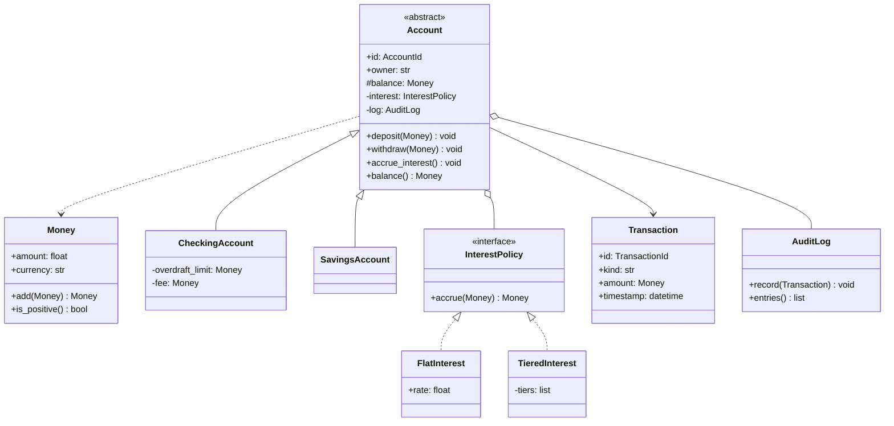
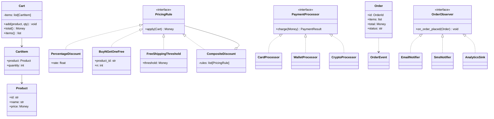
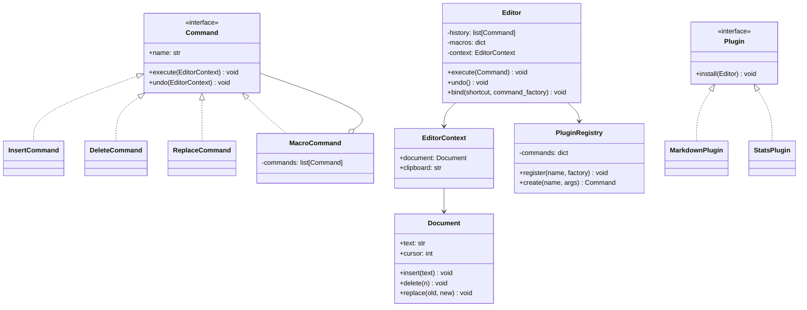
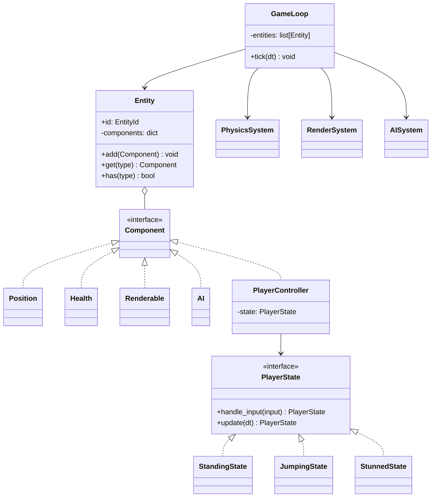
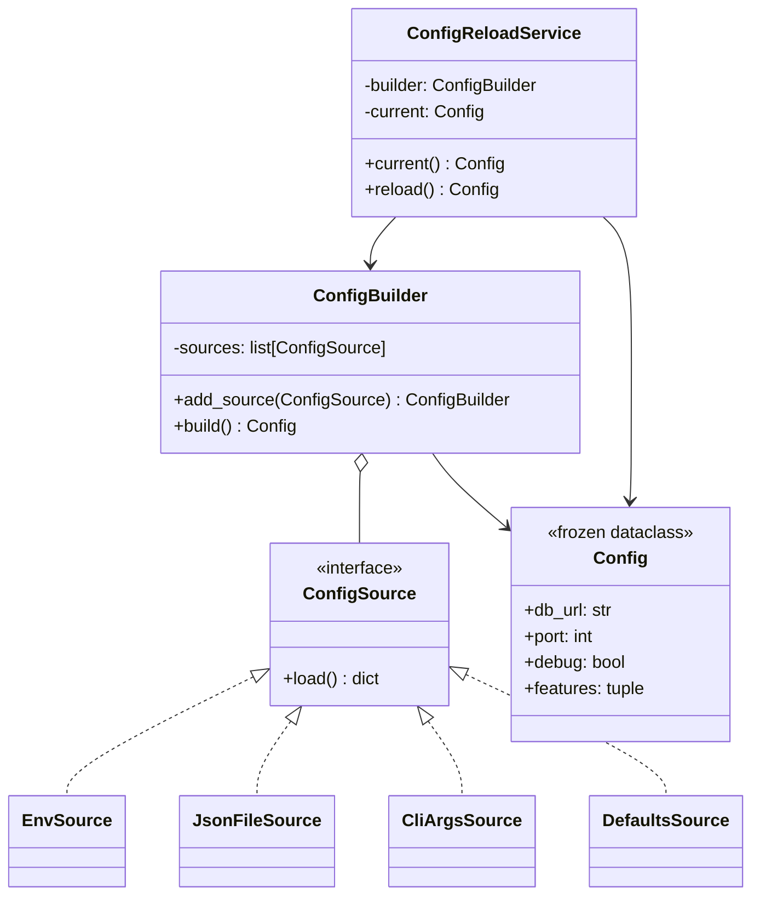

# Real-World OOP Examples — Five Mini-Projects in Python

> [!quote] "Theory is when you know everything but nothing works. Practice is when everything works but no one knows why. We combine theory and practice: nothing works and no one knows why."

This note presents five **complete, well-designed** mini-projects. Each demonstrates multiple OOP patterns in concert. Each is small enough to read in one sitting, realistic enough to inspire production design.

For each project:
- **Problem statement** — what we're building
- **Design discussion** — why these patterns, what we rejected
- **Class diagram** (Mermaid)
- **Full code** — runnable, type-hinted, with docstrings
- **Key OOP lessons highlighted**

See also: [[best-practices]], [[design-patterns]], [[solid-principles]], [[exercises-and-projects]].

---

## Project 1 — A Banking System

### Problem statement

Build a small banking core that supports:
- Multiple account types: **checking** (overdraft allowed, fee per transaction) and **savings** (no overdraft, earns interest).
- **Transactions**: deposits, withdrawals, transfers.
- **Interest accrual** with different rates per account type.
- An **audit log** of every state change.
- Future extension to new account types (e.g., `MoneyMarket`, `CreditLine`) without modifying existing code.

### Design discussion

- **Encapsulation**: balance is private; mutations go through methods that enforce invariants.
- **Inheritance (restrained)**: `Account` is the abstract base; `CheckingAccount` and `SavingsAccount` are genuine subtypes (substitutable).
- **Strategy pattern**: `InterestPolicy` is a separate object — different policies per account, swappable at runtime.
- **Observer pattern**: `AuditLog` observes transactions without coupling accounts to logging.
- **Value objects**: `Money` is immutable, validated, and arithmetic-aware.
- **Factory**: `Account.open(...)` classmethods clarify construction intent.
- **Composition**: an `Account` *has-a* `InterestPolicy` and *has-a* list of `Transaction`s — not inherits.

### Class diagram



### Full code

```python
from __future__ import annotations
from abc import ABC, abstractmethod
from dataclasses import dataclass, field
from datetime import datetime, timezone
from typing import Iterable, Protocol
from uuid import uuid4


# ---------- Value objects ----------

@dataclass(frozen=True, order=True)
class Money:
    """Immutable, validated money value."""
    amount: float
    currency: str = "USD"

    def __post_init__(self) -> None:
        if self.amount < 0:
            raise ValueError("Money cannot be negative")
        object.__setattr__(self, "amount", round(self.amount, 2))

    def add(self, other: "Money") -> "Money":
        if self.currency != other.currency:
            raise ValueError(f"Currency mismatch: {self.currency} vs {other.currency}")
        return Money(self.amount + other.amount, self.currency)

    def subtract(self, other: "Money") -> "Money":
        if self.currency != other.currency:
            raise ValueError(f"Currency mismatch")
        return Money(self.amount - other.amount, self.currency)

    def multiply(self, factor: float) -> "Money":
        return Money(self.amount * factor, self.currency)

    def is_positive(self) -> bool:
        return self.amount > 0


# Type aliases for domain primitives — see [[best-practices]] §3
AccountId = str
TransactionId = str
UserId = str


# ---------- Transactions (immutable records) ----------

@dataclass(frozen=True)
class Transaction:
    id: TransactionId
    account_id: AccountId
    kind: str            # "deposit" | "withdraw" | "transfer_in" | "transfer_out" | "interest"
    amount: Money
    timestamp: datetime = field(default_factory=lambda: datetime.now(timezone.utc))

    @classmethod
    def new(cls, account_id: AccountId, kind: str, amount: Money) -> "Transaction":
        return cls(id=str(uuid4()), account_id=account_id, kind=kind, amount=amount)


# ---------- Observer: AuditLog ----------

class AuditLog(Protocol):
    """Anything that can record transactions."""
    def record(self, txn: Transaction) -> None: ...


class InMemoryAuditLog:
    """Default audit log — keeps transactions in memory."""
    def __init__(self) -> None:
        self._entries: list[Transaction] = []

    def record(self, txn: Transaction) -> None:
        self._entries.append(txn)

    def entries(self) -> Iterable[Transaction]:
        return list(self._entries)


# ---------- Strategy: InterestPolicy ----------

class InterestPolicy(Protocol):
    """Strategy for computing interest on a balance."""
    def accrue(self, balance: Money) -> Money: ...


class FlatRate(InterestPolicy):
    """A flat percentage rate."""
    def __init__(self, rate: float) -> None:
        if rate < 0:
            raise ValueError("rate cannot be negative")
        self.rate = rate

    def accrue(self, balance: Money) -> Money:
        return balance.multiply(self.rate)


class TieredRate(InterestPolicy):
    """Tiered interest: higher balances earn higher rates."""
    def __init__(self, tiers: list[tuple[float, float]]) -> None:
        """tiers: list of (threshold, rate) sorted ascending."""
        self._tiers = sorted(tiers, key=lambda t: t[0])

    def accrue(self, balance: Money) -> Money:
        rate = 0.0
        for threshold, r in self._tiers:
            if balance.amount >= threshold:
                rate = r
            else:
                break
        return balance.multiply(rate)


# ---------- Account: the abstract base ----------

class Account(ABC):
    """Abstract bank account. Subclasses define overdraft and fee behavior.

    Invariants:
      - `balance >= -overdraft_limit` (checked at withdrawal)
      - All mutations go through `deposit` / `withdraw` (encapsulated)
      - Every mutation is recorded in the audit log.
    """

    def __init__(self, owner: UserId, audit_log: AuditLog,
                 interest: InterestPolicy | None = None) -> None:
        self.id: AccountId = str(uuid4())
        self.owner = owner
        self._balance = Money(0.0)
        self._log = audit_log
        self._interest = interest or FlatRate(0.0)

    @property
    def balance(self) -> Money:
        return self._balance

    @abstractmethod
    def _can_withdraw(self, amount: Money) -> None:
        """Hook for subclasses to enforce their own withdrawal rules."""
        ...

    def deposit(self, amount: Money) -> Transaction:
        if not amount.is_positive():
            raise ValueError("deposit must be positive")
        self._balance = self._balance.add(amount)
        txn = Transaction.new(self.id, "deposit", amount)
        self._log.record(txn)
        return txn

    def withdraw(self, amount: Money) -> Transaction:
        if not amount.is_positive():
            raise ValueError("withdrawal must be positive")
        self._can_withdraw(amount)
        self._balance = self._balance.subtract(amount)
        txn = Transaction.new(self.id, "withdraw", amount)
        self._log.record(txn)
        return txn

    def accrue_interest(self) -> Transaction | None:
        interest = self._interest.accrue(self._balance)
        if not interest.is_positive():
            return None
        self._balance = self._balance.add(interest)
        txn = Transaction.new(self.id, "interest", interest)
        self._log.record(txn)
        return txn

    @classmethod
    def open(cls, owner: UserId, audit_log: AuditLog, **kwargs) -> "Account":
        """Factory method — subclasses may override for clarity."""
        return cls(owner, audit_log, **kwargs)


# ---------- Concrete accounts (genuine subtypes) ----------

class CheckingAccount(Account):
    """Account with overdraft protection and per-transaction fee."""

    def __init__(self, owner: UserId, audit_log: AuditLog,
                 overdraft_limit: Money | None = None,
                 transaction_fee: Money | None = None,
                 interest: InterestPolicy | None = None) -> None:
        super().__init__(owner, audit_log, interest)
        self._overdraft = overdraft_limit or Money(0.0)
        self._fee = transaction_fee or Money(0.0)

    def _can_withdraw(self, amount: Money) -> None:
        available = self._balance.add(self._overdraft)
        if amount.amount > available.amount:
            raise ValueError(f"Insufficient funds (overdraft limit: {self._overdraft})")

    def withdraw(self, amount: Money) -> Transaction:
        txn = super().withdraw(amount)
        # Charge fee as a separate transaction
        if self._fee.is_positive():
            self._balance = self._balance.subtract(self._fee)
            self._log.record(Transaction.new(self.id, "fee", self._fee))
        return txn


class SavingsAccount(Account):
    """Account that cannot overdraft."""

    def _can_withdraw(self, amount: Money) -> None:
        if amount.amount > self._balance.amount:
            raise ValueError("Insufficient funds (no overdraft on savings)")


# ---------- Service: transfer (uses accounts, doesn't own them) ----------

class TransferService:
    """Orchestrates transfers between two accounts."""

    def __init__(self, audit_log: AuditLog) -> None:
        self._log = audit_log

    def transfer(self, source: Account, target: Account, amount: Money) -> tuple[Transaction, Transaction]:
        source.withdraw(amount)
        target.deposit(amount)
        out_txn = Transaction.new(source.id, "transfer_out", amount)
        in_txn = Transaction.new(target.id, "transfer_in", amount)
        self._log.record(out_txn)
        self._log.record(in_txn)
        return out_txn, in_txn


# ---------- Demo ----------

if __name__ == "__main__":
    log = InMemoryAuditLog()

    # Alice's checking with overdraft and a small fee
    alice = CheckingAccount.open(
        "alice", log,
        overdraft_limit=Money(500.0),
        transaction_fee=Money(1.0),
        interest=FlatRate(0.001),
    )
    # Bob's savings — earns 2% flat
    bob = SavingsAccount.open(
        "bob", log, interest=FlatRate(0.02),
    )

    alice.deposit(Money(1000.0))
    bob.deposit(Money(5000.0))

    transfers = TransferService(log)
    transfers.transfer(bob, alice, Money(200.0))

    alice.withdraw(Money(50.0))     # includes $1 fee
    alice.accrue_interest()
    bob.accrue_interest()

    print(f"Alice balance: {alice.balance}")   # ~ 1000 + 200 - 51 + interest
    print(f"Bob balance:   {bob.balance}")     # ~ 5000 - 200 + interest
    print(f"Total transactions logged: {len(list(log.entries()))}")
```

### Key OOP lessons

> [!example] Lesson 1 — Encapsulation is for invariants, not privacy
> `Account._balance` is "private" by convention. The real protection is that **no method bypasses the deposit/withdraw interface**, so all invariants are checked. See [[best-practices]] §5.

> [!example] Lesson 2 — Strategy beats inheritance for varying behavior
> `InterestPolicy` could have been a method overridden in subclasses (`SavingsAccount.accrue_interest`). But then mixing rates (e.g., a `CheckingAccount` with a 0.5% promo rate) would require *another* subclass. Strategy objects are composable; subclasses are not.

> [!example] Lesson 3 — Observer decouples concerns
> `Account` doesn't know about audit logs, emails, or analytics. It just calls `self._log.record(txn)`. New observers (e.g., `EmailNotifier`) can be added without touching `Account`.

> [!example] Lesson 4 — Factory clarifies intent
> `Account.open(...)` reads better than `CheckingAccount(...)` — it signals "this is a creation step in the domain language," not "this is a constructor call."

> [!example] Lesson 5 — Value objects prevent bugs
> `Money` enforces currency matching and rounding at construction. `transfer(alice, bob, Money(200, "EUR"))` would fail loudly if the accounts are in USD — instead of silently corrupting data.

---

## Project 2 — Mini E-Commerce Checkout

### Problem statement

Build a checkout flow supporting:
- A `Cart` that holds items (product + quantity).
- **Pricing rules**: percentage discounts, "buy N get 1 free," coupon codes, free-shipping thresholds.
- **Payment processors**: card, wallet, crypto — interchangeable.
- **Order confirmation**: notify customer via email or SMS, observers fire on order placed.
- Easy addition of new pricing rules and payment methods without modifying existing code.

### Design discussion

- **Strategy pattern** for both pricing rules and payment processors.
- **Composite pattern** for combining pricing rules (a `CompositeDiscount` applies multiple sequentially).
- **Factory** to construct processors from config.
- **Observer pattern** for order-placed notifications.
- **Repository pattern** for orders (so we can swap in-memory / SQL / NoSQL).
- **Open/Closed Principle**: adding a rule or processor = adding a class, not editing existing ones.

### Class diagram



### Full code

```python
from __future__ import annotations
from abc import ABC, abstractmethod
from dataclasses import dataclass, field
from typing import Callable, Protocol
from uuid import uuid4


# ---------- Value objects ----------

@dataclass(frozen=True, order=True)
class Money:
    amount: float
    currency: str = "USD"
    def __post_init__(self) -> None:
        object.__setattr__(self, "amount", round(self.amount, 2))
    def multiply(self, k: float) -> "Money": return Money(self.amount * k, self.currency)
    def add(self, o: "Money") -> "Money":
        assert self.currency == o.currency
        return Money(self.amount + o.amount, self.currency)
    def subtract(self, o: "Money") -> "Money":
        assert self.currency == o.currency
        return Money(self.amount - o.amount, self.currency)


@dataclass(frozen=True)
class Product:
    id: str
    name: str
    price: Money


@dataclass
class CartItem:
    product: Product
    quantity: int

    def line_total(self) -> Money:
        return self.product.price.multiply(self.quantity)


class Cart:
    def __init__(self) -> None:
        self._items: list[CartItem] = []

    def add(self, product: Product, qty: int = 1) -> None:
        if qty <= 0:
            raise ValueError("qty must be positive")
        for item in self._items:
            if item.product.id == product.id:
                item.quantity += qty
                return
        self._items.append(CartItem(product, qty))

    def items(self) -> list[CartItem]:
        return list(self._items)

    def subtotal(self) -> Money:
        if not self._items:
            return Money(0.0)
        total = self._items[0].line_total()
        for item in self._items[1:]:
            total = total.add(item.line_total())
        return total


# ---------- Strategy: PricingRule ----------

class PricingRule(Protocol):
    """A rule that, given a cart, returns the *adjustment* to apply (negative for discount)."""
    def apply(self, cart: Cart) -> Money: ...


class PercentageDiscount:
    def __init__(self, rate: float) -> None:
        if not 0 <= rate <= 1:
            raise ValueError("rate must be in [0, 1]")
        self.rate = rate

    def apply(self, cart: Cart) -> Money:
        return cart.subtotal().multiply(-self.rate)


class BuyNGetOneFree:
    """Buy N of `product_id`, get 1 free."""
    def __init__(self, product_id: str, n: int) -> None:
        self.product_id = product_id
        self.n = n

    def apply(self, cart: Cart) -> Money:
        for item in cart.items():
            if item.product.id == self.product_id:
                free = item.quantity // (self.n + 1)
                return item.product.price.multiply(-free)
        return Money(0.0)


class FreeShippingThreshold:
    """If subtotal >= threshold, shipping is free; otherwise, full shipping cost."""
    def __init__(self, threshold: Money, shipping_cost: Money) -> None:
        self.threshold = threshold
        self.shipping_cost = shipping_cost

    def apply(self, cart: Cart) -> Money:
        if cart.subtotal().amount >= self.threshold.amount:
            return self.shipping_cost.multiply(-1)   # negative = credit
        return Money(0.0)


@dataclass
class CompositeDiscount:
    """Apply multiple rules in order."""
    rules: list[PricingRule] = field(default_factory=list)

    def add(self, rule: PricingRule) -> "CompositeDiscount":
        self.rules.append(rule)
        return self

    def apply(self, cart: Cart) -> Money:
        adjustment = Money(0.0)
        for rule in self.rules:
            adjustment = adjustment.add(rule.apply(cart))
        return adjustment


# ---------- Strategy: PaymentProcessor ----------

@dataclass(frozen=True)
class PaymentResult:
    success: bool
    reference: str
    message: str = ""


class PaymentProcessor(Protocol):
    name: str
    def charge(self, amount: Money) -> PaymentResult: ...


class CardProcessor:
    name = "card"
    def __init__(self, token: str) -> None:
        self._token = token
    def charge(self, amount: Money) -> PaymentResult:
        # pretend we called a payment gateway
        return PaymentResult(True, f"card-{uuid4().hex[:8]}")


class WalletProcessor:
    name = "wallet"
    def __init__(self, wallet_id: str) -> None:
        self._wallet = wallet_id
    def charge(self, amount: Money) -> PaymentResult:
        return PaymentResult(True, f"wallet-{uuid4().hex[:8]}")


class CryptoProcessor:
    name = "crypto"
    def __init__(self, address: str) -> None:
        self._address = address
    def charge(self, amount: Money) -> PaymentResult:
        return PaymentResult(True, f"crypto-{uuid4().hex[:8]}")


# ---------- Factory: build processor from config ----------

PROCESSOR_FACTORIES: dict[str, Callable[[dict], PaymentProcessor]] = {
    "card": lambda cfg: CardProcessor(cfg["token"]),
    "wallet": lambda cfg: WalletProcessor(cfg["wallet_id"]),
    "crypto": lambda cfg: CryptoProcessor(cfg["address"]),
}


def build_processor(kind: str, cfg: dict) -> PaymentProcessor:
    if kind not in PROCESSOR_FACTORIES:
        raise ValueError(f"Unknown processor: {kind}")
    return PROCESSOR_FACTORIES[kind](cfg)


# ---------- Order + Observer ----------

@dataclass
class Order:
    id: str = field(default_factory=lambda: str(uuid4()))
    items: list[CartItem] = field(default_factory=list)
    subtotal: Money = field(default_factory=lambda: Money(0.0))
    adjustments: Money = field(default_factory=lambda: Money(0.0))
    total: Money = field(default_factory=lambda: Money(0.0))
    status: str = "pending"


class OrderObserver(Protocol):
    def on_order_placed(self, order: Order) -> None: ...


class EmailNotifier:
    def __init__(self, email: str) -> None:
        self._email = email
    def on_order_placed(self, order: Order) -> None:
        print(f"[email] Sent confirmation for {order.id} to {self._email}")


class SmsNotifier:
    def __init__(self, phone: str) -> None:
        self._phone = phone
    def on_order_placed(self, order: Order) -> None:
        print(f"[sms] Sent confirmation for {order.id} to {self._phone}")


class AnalyticsSink:
    def on_order_placed(self, order: Order) -> None:
        print(f"[analytics] Recorded order {order.id} total={order.total}")


# ---------- Checkout: orchestrates everything ----------

class Checkout:
    """Orchestrates the checkout flow.

    Dependencies are injected: pricing rules, processor, observers.
    """

    def __init__(self,
                 pricing: PricingRule,
                 processor: PaymentProcessor,
                 observers: list[OrderObserver] | None = None) -> None:
        self._pricing = pricing
        self._processor = processor
        self._observers = observers or []

    def add_observer(self, obs: OrderObserver) -> None:
        self._observers.append(obs)

    def place(self, cart: Cart) -> Order:
        subtotal = cart.subtotal()
        adjustments = self._pricing.apply(cart)
        total = subtotal.add(adjustments)
        if total.amount < 0:
            total = Money(0.0)

        result = self._processor.charge(total)
        if not result.success:
            raise RuntimeError(f"Payment failed: {result.message}")

        order = Order(
            items=cart.items(),
            subtotal=subtotal,
            adjustments=adjustments,
            total=total,
            status="paid",
        )

        for obs in self._observers:
            obs.on_order_placed(order)

        return order


# ---------- Demo ----------

if __name__ == "__main__":
    # Build a cart
    apple = Product("a1", "Apple", Money(1.00))
    pear = Product("p1", "Pear", Money(1.50))

    cart = Cart()
    cart.add(apple, qty=4)   # buy 4 apples → buy-3-get-1-free
    cart.add(pear, qty=2)

    # Pricing rules: 10% off + buy-3-get-1-free on apples + free shipping over $5
    pricing = CompositeDiscount()
    pricing.add(BuyNGetOneFree("a1", n=3))
    pricing.add(PercentageDiscount(0.10))
    pricing.add(FreeShippingThreshold(Money(5.0), Money(2.0)))

    # Payment processor from config
    processor = build_processor("card", {"token": "tok_visa"})

    # Observers
    observers: list[OrderObserver] = [
        EmailNotifier("ada@example.com"),
        SmsNotifier("+15550000"),
        AnalyticsSink(),
    ]

    checkout = Checkout(pricing, processor, observers)
    order = checkout.place(cart)

    print(f"Subtotal:    {order.subtotal}")
    print(f"Adjustments: {order.adjustments}")
    print(f"Total:       {order.total}")
    print(f"Status:      {order.status}")
```

### Key OOP lessons

> [!example] Lesson 1 — Strategy enables composition
> `CompositeDiscount` is itself a `PricingRule`, so you can nest composites endlessly. Adding "weekend sale" rules = adding classes; no existing code changes.

> [!example] Lesson 2 — Factory + registry replaces `if/elif` on type
> `build_processor` looks up a constructor in a dict. Adding a processor = adding an entry. No core code changes.

> [!example] Lesson 3 — Observers decouple side effects
> `Checkout` knows nothing about email, SMS, or analytics. It just fires `on_order_placed`. New observers (loyalty points, fraud detection) plug in without touching `Checkout`.

> [!example] Lesson 4 — Open/Closed in action
> Try adding a `BulkDiscount` rule. You write one class; `Checkout` doesn't change. That's OCP.

---

## Project 3 — Plugin-Based Text Editor

### Problem statement

Build a tiny text editor with:
- A **document** model (text + cursor).
- **Commands** (insert, delete, replace) that are undoable.
- A **plugin registry** — third-party code can register new commands at startup.
- **Keyboard shortcut** binding.
- **Macros**: record a sequence of commands, replay later.
- **Abstract factory**: plugins declare what they need; the editor constructs them.

### Design discussion

- **Command pattern**: every action is an object with `execute()` and `undo()`.
- **Registry pattern**: plugins register their commands via a decorator.
- **Abstract factory**: the `Editor` provides a context (`EditorContext`) to plugins; plugins don't import `Editor` internals.
- **Macro** = composite command.
- **History**: stack of executed commands for undo.

### Class diagram



### Full code

```python
from __future__ import annotations
from dataclasses import dataclass, field
from typing import Callable, Protocol


# ---------- Document (the receiver in command terms) ----------

@dataclass
class Document:
    text: str = ""
    cursor: int = 0

    def insert(self, text: str) -> None:
        self.text = self.text[:self.cursor] + text + self.text[self.cursor:]
        self.cursor += len(text)

    def delete(self, n: int) -> str:
        deleted = self.text[self.cursor:self.cursor + n]
        self.text = self.text[:self.cursor] + self.text[self.cursor + n:]
        return deleted

    def replace(self, old: str, new: str) -> int:
        count = self.text.count(old)
        self.text = self.text.replace(old, new)
        return count


# ---------- Command pattern ----------

@dataclass
class EditorContext:
    """What commands can see — explicit, narrow interface (Abstract Factory input)."""
    document: Document
    clipboard: str = ""


class Command(Protocol):
    name: str
    def execute(self, ctx: EditorContext) -> None: ...
    def undo(self, ctx: EditorContext) -> None: ...


@dataclass
class InsertCommand:
    name: str = "insert"
    text: str = ""

    def execute(self, ctx: EditorContext) -> None:
        ctx.document.insert(self.text)

    def undo(self, ctx: EditorContext) -> None:
        ctx.document.delete(len(self.text))


@dataclass
class DeleteCommand:
    name: str = "delete"
    n: int = 1
    _deleted: str = ""

    def execute(self, ctx: EditorContext) -> None:
        self._deleted = ctx.document.delete(self.n)

    def undo(self, ctx: EditorContext) -> None:
        ctx.document.insert(self._deleted)


@dataclass
class ReplaceCommand:
    name: str = "replace"
    old: str = ""
    new: str = ""
    _count: int = 0

    def execute(self, ctx: EditorContext) -> None:
        self._count = ctx.document.replace(self.old, self.new)

    def undo(self, ctx: EditorContext) -> None:
        ctx.document.replace(self.new, self.old)


@dataclass
class MacroCommand:
    """Composite command — records a sequence for replay."""
    name: str
    commands: list[Command] = field(default_factory=list)

    def add(self, cmd: Command) -> "MacroCommand":
        self.commands.append(cmd)
        return self

    def execute(self, ctx: EditorContext) -> None:
        for cmd in self.commands:
            cmd.execute(ctx)

    def undo(self, ctx: EditorContext) -> None:
        for cmd in reversed(self.commands):
            cmd.undo(ctx)


# ---------- Plugin registry ----------

CommandFactory = Callable[..., Command]


class PluginRegistry:
    """Registry of command factories, populated by plugins."""

    def __init__(self) -> None:
        self._factories: dict[str, CommandFactory] = {}
        self._plugins: list["Plugin"] = []

    def register(self, name: str, factory: CommandFactory) -> None:
        self._factories[name] = factory

    def install(self, plugin: "Plugin") -> None:
        self._plugins.append(plugin)

    def create(self, name: str, **kwargs) -> Command:
        if name not in self._factories:
            raise KeyError(f"Unknown command: {name}")
        return self._factories[name](**kwargs)

    def known_commands(self) -> list[str]:
        return list(self._factories)


class Plugin(Protocol):
    """Plugins install themselves into the registry on startup."""
    def install(self, registry: PluginRegistry) -> None: ...


# ---------- Built-in commands plugin ----------

class CoreCommandsPlugin:
    """Registers the core editing commands."""
    def install(self, registry: PluginRegistry) -> None:
        registry.register("insert", InsertCommand)
        registry.register("delete", DeleteCommand)
        registry.register("replace", ReplaceCommand)


# ---------- A third-party plugin ----------

class MarkdownPlugin:
    """Adds markdown-flavored insert commands."""
    def install(self, registry: PluginRegistry) -> None:
        registry.register("md_bold", lambda text="": InsertCommand(name="md_bold", text=f"**{text}**"))
        registry.register("md_italic", lambda text="": InsertCommand(name="md_italic", text=f"*{text}*"))
        registry.register("md_h1", lambda text="": InsertCommand(name="md_h1", text=f"# {text}\n"))


# ---------- The editor (invoker) ----------

class Editor:
    def __init__(self, registry: PluginRegistry) -> None:
        self._registry = registry
        self._ctx = EditorContext(document=Document())
        self._history: list[Command] = []
        self._macros: dict[str, MacroCommand] = {}
        self._recording: MacroCommand | None = None
        self._shortcuts: dict[str, CommandFactory] = {}

    @property
    def text(self) -> str:
        return self._ctx.document.text

    def bind_shortcut(self, shortcut: str, command_name: str) -> None:
        """Bind a keyboard shortcut to a registered command."""
        factory = lambda **kw: self._registry.create(command_name, **kw)
        self._shortcuts[shortcut] = factory

    def execute(self, command: Command) -> None:
        command.execute(self._ctx)
        self._history.append(command)
        if self._recording is not None:
            self._recording.add(command)

    def undo(self) -> None:
        if not self._history:
            return
        cmd = self._history.pop()
        cmd.undo(self._ctx)

    def start_macro(self, name: str) -> None:
        self._recording = MacroCommand(name=name)

    def stop_macro(self) -> MacroCommand:
        if self._recording is None:
            raise RuntimeError("No macro being recorded")
        macro = self._recording
        self._macros[macro.name] = macro
        self._recording = None
        return macro

    def play_macro(self, name: str) -> None:
        if name not in self._macros:
            raise KeyError(f"Unknown macro: {name}")
        self.execute(self._macros[name])


# ---------- Demo ----------

if __name__ == "__main__":
    registry = PluginRegistry()
    CoreCommandsPlugin().install(registry)
    MarkdownPlugin().install(registry)

    editor = Editor(registry)
    editor.bind_shortcut("Ctrl+B", "md_bold")

    editor.execute(registry.create("insert", text="Hello "))
    editor.execute(registry.create("insert", text="World"))
    print(editor.text)   # "Hello World"

    editor.undo()
    print(editor.text)   # "Hello "

    # Record a macro that bolds the next text and adds a heading
    editor.start_macro("header_block")
    editor.execute(registry.create("md_h1", text="Title"))
    editor.execute(registry.create("md_bold", text="subtitle"))
    macro = editor.stop_macro()

    editor.play_macro("header_block")
    print(editor.text)

    print("Known commands:", registry.known_commands())
```

### Key OOP lessons

> [!example] Lesson 1 — Command pattern enables undo, macros, replay, logging
> Every action is an object. That single design choice gives you undo (stack), macros (composite), replay (store + execute later), and audit (log every command).

> [!example] Lesson 2 — Registry replaces `if/elif` dispatch
> `editor.execute(registry.create("insert", text="..."))` works for any registered command. New commands = new registrations. No core code changes.

> [!example] Lesson 3 — Abstract Factory via EditorContext
> Plugins never import `Editor`. They receive an `EditorContext` — a narrow, explicit interface. This means we can swap `Editor` for a different invoker (e.g., a server-side batch processor) without breaking plugins.

> [!example] Lesson 4 — Composite commands are still commands
> `MacroCommand` implements the same `Command` protocol. You can put macros inside macros, record macros that play other macros, and undo them all uniformly.

---

## Project 4 — Simple Game Entity System

### Problem statement

Build a tiny game (roguelike-ish) with:
- **Entities** (player, enemies, items) composed of **components** (position, health, AI, renderable).
- **State pattern** for the player's behavior (standing, jumping, stunned).
- **Composition over inheritance** — an `Entity` is a bag of components, not a deep class tree.
- A **game loop** that ticks all entities each frame.

### Design discussion

- **Entity-Component pattern** (lightweight ECS): `Entity` holds a dict of components; systems iterate over entities that have the right components. This is **composition taken to its logical extreme** — no inheritance at all for game objects.
- **State pattern** for player behavior: `PlayerState` is an object that handles input differently (standing → jump, jumping → no double jump, stunned → no input).
- **Observer** for events (`on_damage`, `on_death`).
- **Composition root** in the game loop.

### Class diagram



### Full code

```python
from __future__ import annotations
from dataclasses import dataclass, field
from typing import Protocol
from uuid import uuid4


# ---------- Component protocol ----------

class Component(Protocol):
    """Marker protocol for components."""
    pass


@dataclass
class Position(Component):
    x: float = 0.0
    y: float = 0.0
    vx: float = 0.0
    vy: float = 0.0


@dataclass
class Health(Component):
    hp: int = 100
    max_hp: int = 100

    def damage(self, n: int) -> None:
        self.hp = max(0, self.hp - n)

    def is_dead(self) -> bool:
        return self.hp <= 0


@dataclass
class Renderable(Component):
    glyph: str = "@"


@dataclass
class AI(Component):
    """Simple AI: moves toward the player."""
    aggressive: bool = True


# ---------- State pattern for player ----------

@dataclass
class Input:
    jump_pressed: bool = False
    move_x: float = 0.0   # -1, 0, 1


class PlayerState(Protocol):
    """Each state handles input and per-frame update."""
    def handle_input(self, inp: Input) -> "PlayerState": ...
    def update(self, dt: float, pos: Position) -> "PlayerState": ...


@dataclass
class StandingState:
    """On the ground; can jump."""
    def handle_input(self, inp: Input) -> PlayerState:
        if inp.jump_pressed:
            return JumpingState(vertical_speed=10.0)
        return self

    def update(self, dt: float, pos: Position) -> PlayerState:
        pos.x += pos.vx * dt
        return self


@dataclass
class JumpingState:
    """In the air; cannot double jump."""
    vertical_speed: float = 10.0
    timer: float = 0.0
    duration: float = 0.5

    def handle_input(self, inp: Input) -> PlayerState:
        return self   # no double jump

    def update(self, dt: float, pos: Position) -> PlayerState:
        self.timer += dt
        pos.y += self.vertical_speed * dt
        if self.timer >= self.duration:
            pos.y = 0.0   # land
            return StandingState()
        return self


@dataclass
class StunnedState:
    """Cannot act for a duration."""
    timer: float = 0.0
    duration: float = 1.0

    def handle_input(self, inp: Input) -> PlayerState:
        return self

    def update(self, dt: float, pos: Position) -> PlayerState:
        self.timer += dt
        if self.timer >= self.duration:
            return StandingState()
        return self


@dataclass
class PlayerController(Component):
    state: PlayerState = field(default_factory=StandingState)

    def on_damage(self, hp: Health) -> None:
        """Called when the player takes damage — becomes stunned."""
        if hp.hp > 0:
            self.state = StunnedState()


# ---------- Entity ----------

class Entity:
    """A bag of components. Composition root of game objects."""

    def __init__(self, tag: str = "") -> None:
        self.id = str(uuid4())
        self.tag = tag
        self._components: dict[type, Component] = {}

    def add(self, comp: Component) -> "Entity":
        self._components[type(comp)] = comp
        return self

    def get(self, comp_type: type[T]) -> T:
        return self._components[comp_type]   # type: ignore

    def has(self, comp_type: type) -> bool:
        return comp_type in self._components

    def remove(self, comp_type: type) -> None:
        self._components.pop(comp_type, None)


# Type variable for Entity.get
from typing import TypeVar
T = TypeVar("T")


# ---------- Systems (each operates on entities with the right components) ----------

class PhysicsSystem:
    def update(self, entities: list[Entity], dt: float) -> None:
        for e in entities:
            if e.has(Position) and e.has(PlayerController):
                pos = e.get(Position)
                ctrl = e.get(PlayerController)
                ctrl.state = ctrl.state.update(dt, pos)
            elif e.has(Position) and e.has(AI):
                # Simple AI: drift toward x=0
                pos = e.get(Position)
                pos.x += (0 - pos.x) * 0.5 * dt


class CombatSystem:
    """Detects collisions and applies damage."""
    def update(self, entities: list[Entity]) -> None:
        positions = [e for e in entities if e.has(Position) and e.has(Health)]
        for i, a in enumerate(positions):
            for b in positions[i + 1:]:
                pa, pb = a.get(Position), b.get(Position)
                if abs(pa.x - pb.x) < 1.0 and abs(pa.y - pb.y) < 1.0:
                    # collision: damage both
                    ha, hb = a.get(Health), b.get(Health)
                    ha.damage(10)
                    hb.damage(10)
                    if a.has(PlayerController):
                        a.get(PlayerController).on_damage(ha)


class RenderSystem:
    def render(self, entities: list[Entity]) -> None:
        renderable = [e for e in entities if e.has(Position) and e.has(Renderable)]
        for e in sorted(renderable, key=lambda x: x.get(Position).y):
            pos = e.get(Position)
            print(f"  {e.get(Renderable).glyph} at ({pos.x:.1f}, {pos.y:.1f})  [{e.tag}]")


# ---------- Game loop ----------

class GameLoop:
    def __init__(self) -> None:
        self.entities: list[Entity] = []
        self.physics = PhysicsSystem()
        self.combat = CombatSystem()
        self.render = RenderSystem()

    def add(self, entity: Entity) -> None:
        self.entities.append(entity)

    def tick(self, dt: float) -> None:
        self.physics.update(self.entities, dt)
        self.combat.update(self.entities)
        # Remove dead entities
        self.entities = [e for e in self.entities
                         if not (e.has(Health) and e.get(Health).is_dead())]
        self.render.render(self.entities)


# ---------- Demo ----------

if __name__ == "__main__":
    game = GameLoop()

    # Player: position + health + renderable + controller
    player = Entity("player")
    player.add(Position(x=0, y=0))
    player.add(Health(hp=100))
    player.add(Renderable(glyph="@"))
    player.add(PlayerController())
    game.add(player)

    # Enemy: position + health + renderable + AI
    enemy = Entity("goblin")
    enemy.add(Position(x=5, y=0))
    enemy.add(Health(hp=30))
    enemy.add(Renderable(glyph="g"))
    enemy.add(AI())
    game.add(enemy)

    for frame in range(5):
        print(f"--- Frame {frame} ---")
        game.tick(dt=0.1)
```

### Key OOP lessons

> [!example] Lesson 1 — Entity-Component is composition to the extreme
> No inheritance at all for game objects. An `Entity` is a bag of components. Want a flying enemy? Add a `Fly` component — no `FlyingEnemy` subclass. This is the **composition-over-inheritance** heuristic taken to its logical conclusion.

> [!example] Lesson 2 — State pattern replaces `if player.is_jumping`
> Instead of branching on flags, the player has a *state object* that handles input. Adding a new state (`ClimbingState`) = adding a class. No existing code changes.

> [!example] Lesson 3 — Systems are functions over data
> `PhysicsSystem.update` is essentially a function: `(entities, dt) -> None`. It's OOP because it lives in a class, but it operates on data, not behavior. This is the **functional-core-imperative-shell** style. See [[oop-in-production]].

> [!example] Lesson 4 — Composition enables emergent behavior
> "A flying, intelligent, invisible goblin" is `enemy.add(Position()).add(AI()).add(Fly()).add(Invisible())`. No combination needs a dedicated subclass. This is the **real** power of composition.

---

## Project 5 — Configuration System

### Problem statement

Build a configuration system with:
- Type-safe, validated config objects (immutable after load).
- **Multiple sources**: env vars, JSON files, CLI args — merged in priority order.
- **Builder pattern** for constructing the config from multiple sources.
- **Singleton alternative**: instead of a global, a `Config` injected at app startup.
- **Hot reload** (re-read files) without breaking immutability of existing references.

### Design discussion

- **Frozen dataclasses** for immutability and hashability.
- **Builder pattern** to merge sources in priority order.
- **Adapter pattern** to normalize each source's data shape into a dict.
- **Composition root** at app entry point — `Config` is passed to constructors, never imported globally.
- **Reload** returns a *new* `Config` — old references keep their old values (immutability).

### Class diagram



### Full code

```python
from __future__ import annotations
import json
import os
from dataclasses import dataclass, field, replace
from pathlib import Path
from typing import Any, Iterable, Protocol


# ---------- Frozen config ----------

@dataclass(frozen=True)
class Config:
    """Application configuration. Immutable; rebuild to change."""
    db_url: str = "postgres://localhost/app"
    port: int = 8000
    debug: bool = False
    features: tuple[str, ...] = ()

    def with_overrides(self, **kwargs: Any) -> "Config":
        """Return a new Config with fields overridden (immutable update)."""
        return replace(self, **kwargs)


# ---------- Source protocol (Adapter pattern) ----------

class ConfigSource(Protocol):
    """A source of configuration data. Returns a flat dict."""
    def load(self) -> dict[str, Any]: ...


class DefaultsSource:
    """Built-in defaults."""
    def __init__(self, defaults: dict[str, Any]) -> None:
        self._defaults = defaults
    def load(self) -> dict[str, Any]:
        return dict(self._defaults)


class EnvSource:
    """Reads env vars with an optional prefix."""
    def __init__(self, prefix: str = "APP_") -> None:
        self._prefix = prefix
    def load(self) -> dict[str, Any]:
        result: dict[str, Any] = {}
        for key, value in os.environ.items():
            if key.startswith(self._prefix):
                name = key[len(self._prefix):].lower()
                result[name] = self._coerce(value)
        return result

    @staticmethod
    def _coerce(value: str) -> Any:
        if value.lower() in {"true", "yes", "1"}: return True
        if value.lower() in {"false", "no", "0"}: return False
        try: return int(value)
        except ValueError: pass
        try: return float(value)
        except ValueError: pass
        return value


class JsonFileSource:
    """Loads a JSON file."""
    def __init__(self, path: str | Path) -> None:
        self._path = Path(path)
    def load(self) -> dict[str, Any]:
        if not self._path.exists():
            return {}
        with self._path.open() as f:
            return json.load(f)


class CliArgsSource:
    """Parses `--key value` from argv."""
    def __init__(self, argv: list[str]) -> None:
        self._argv = argv
    def load(self) -> dict[str, Any]:
        result: dict[str, Any] = {}
        i = 0
        while i < len(self._argv):
            arg = self._argv[i]
            if arg.startswith("--"):
                key = arg[2:]
                if i + 1 < len(self._argv) and not self._argv[i + 1].startswith("--"):
                    result[key] = EnvSource._coerce(self._argv[i + 1])
                    i += 2
                    continue
                else:
                    result[key] = True   # flag
            i += 1
        return result


# ---------- Builder ----------

class ConfigBuilder:
    """Builds a Config by merging sources in priority order.

    Sources added later override earlier ones (last wins).
    """

    def __init__(self) -> None:
        self._sources: list[ConfigSource] = []
        self._overrides: dict[str, Any] = {}

    def add_source(self, source: ConfigSource) -> "ConfigBuilder":
        self._sources.append(source)
        return self

    def with_overrides(self, **kwargs: Any) -> "ConfigBuilder":
        self._overrides.update(kwargs)
        return self

    def build(self) -> Config:
        merged: dict[str, Any] = {}
        for source in self._sources:
            merged.update(source.load())
        merged.update(self._overrides)

        # Normalize: features can come as list or comma-separated string
        features = merged.get("features", ())
        if isinstance(features, str):
            features = tuple(f.strip() for f in features.split(",") if f.strip())
        elif isinstance(features, list):
            features = tuple(features)
        merged["features"] = features

        return Config(**{k: v for k, v in merged.items() if k in Config.__dataclass_fields__})


# ---------- Reload service (Singleton alternative) ----------

class ConfigReloadService:
    """Holds the current Config; supports hot reload.

    Old Config references remain valid (frozen dataclasses are immutable).
    New reloads produce new Config instances.
    """

    def __init__(self, builder: ConfigBuilder) -> None:
        self._builder = builder
        self._current: Config | None = None

    def current(self) -> Config:
        if self._current is None:
            self._current = self._builder.build()
        return self._current

    def reload(self) -> Config:
        self._current = self._builder.build()
        return self._current


# ---------- Demo ----------

if __name__ == "__main__":
    # Compose sources: defaults < env < config.json < CLI args
    builder = ConfigBuilder()
    builder.add_source(DefaultsSource({
        "db_url": "postgres://localhost/app",
        "port": 8000,
        "debug": False,
        "features": ["auth", "metrics"],
    }))
    builder.add_source(EnvSource(prefix="APP_"))
    builder.add_source(JsonFileSource("config.json"))
    builder.add_source(CliArgsSource(["--port", "9000", "--debug"]))

    service = ConfigReloadService(builder)
    cfg = service.current()

    print(f"DB URL:   {cfg.db_url}")
    print(f"Port:     {cfg.port}")
    print(f"Debug:    {cfg.debug}")
    print(f"Features: {cfg.features}")

    # Immutability + override
    cfg2 = cfg.with_overrides(port=7000)
    print(f"cfg.port={cfg.port}, cfg2.port={cfg2.port}")   # cfg unchanged

    # Reload: re-reads sources; old references still valid
    cfg3 = service.reload()
    print(f"After reload: port={cfg3.port}, debug={cfg3.debug}")
```

### Key OOP lessons

> [!example] Lesson 1 — Frozen dataclasses make configs safe
> `Config` is frozen. You can pass it anywhere without worrying about mutation. Reloads produce new instances; old code keeps its old (valid) snapshot.

> [!example] Lesson 2 — Builder for multi-source construction
> The `ConfigBuilder` collects sources in priority order. Adding a new source (e.g., `VaultSource` for secrets) = adding a class. No core logic changes.

> [!example] Lesson 3 — Adapter normalizes source shapes
> Each source (`EnvSource`, `JsonFileSource`, `CliArgsSource`) adapts its native shape into a flat dict. The builder doesn't know about env vars, JSON, or CLI — it just merges dicts.

> [!example] Lesson 4 — Singleton alternative = inject the service
> Instead of `Config.instance()` (a global), `ConfigReloadService` is constructed at app startup and **passed** to components. Testable: replace the service with a fake. Parallel: have multiple services for multiple apps in one process.

> [!example] Lesson 5 — Immutability + replace = safe updates
> `cfg.with_overrides(port=7000)` returns a new `Config`. The original is unchanged. This is the functional-core pattern: pure data, no in-place mutation. See [[oop-in-production]].

---

## Cross-Project Patterns Summary

| Pattern | Banking | E-commerce | Editor | Game | Config |
|---|---|---|---|---|---|
| Encapsulation | ✅ Account | ✅ Cart | ✅ Document | ✅ Entity | ✅ Config |
| Strategy | ✅ InterestPolicy | ✅ PricingRule, PaymentProcessor | — | — | — |
| Observer | ✅ AuditLog | ✅ OrderObserver | — | ✅ on_damage | — |
| Factory | ✅ Account.open | ✅ build_processor | ✅ PluginRegistry | — | ✅ ConfigBuilder |
| Abstract Factory | — | — | ✅ EditorContext | — | — |
| Command | — | — | ✅ Command | — | — |
| Composite | — | ✅ CompositeDiscount | ✅ MacroCommand | — | — |
| State | — | — | — | ✅ PlayerState | — |
| Adapter | — | — | — | — | ✅ ConfigSource |
| Builder | — | — | — | — | ✅ ConfigBuilder |
| Composition over inheritance | ✅ | ✅ | ✅ | ✅✅✅ | ✅ |
| Immutability (frozen dataclasses) | ✅ Money | ✅ Money, Product | ✅ Transaction | — | ✅ Config |
| Protocol (structural typing) | ✅ | ✅ | ✅ | ✅ | ✅ |
| Dependency injection | ✅ | ✅ | — | — | ✅ |

---

## Key Takeaways

1. **Patterns compose.** A real system uses many patterns in concert. Banking combines Strategy + Observer + Factory; e-commerce adds Composite + Factory + Observer.
2. **Start with value objects.** `Money`, `Product`, `Config` — frozen, validated. They prevent bugs at the boundary.
3. **Strategy replaces `if/elif` on type.** Whenever you see `if kind == "x": ... elif kind == "y": ...`, you have a Strategy waiting.
4. **Observer decouples side effects.** Notifications, logging, analytics — none should couple to the core domain.
5. **Factory + registry = open/closed.** Adding a kind = adding a class + a registration. No core edits.
6. **Command pattern pays for itself.** It's heavier than a function call, but enables undo, macros, replay, audit.
7. **Entity-Component (composition extreme) beats deep hierarchies** for systems with many orthogonal capabilities (games, simulations, editors).
8. **Immutability + replace is the functional-core way.** Pure data, pure transformations, side effects at the boundary.
9. **Builder for multi-step construction.** Especially when sources vary (config, complex domain objects, query builders).
10. **Inject dependencies.** Every project above accepts collaborators via constructor. Testable, swappable, parallelizable.

---

**Next:** [[oop-in-production]] — how these patterns play out in real Python codebases.
