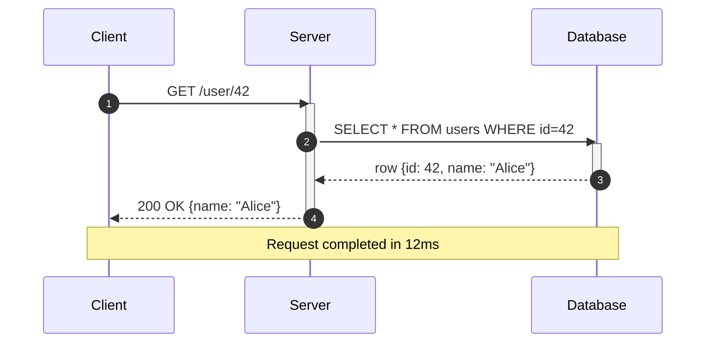
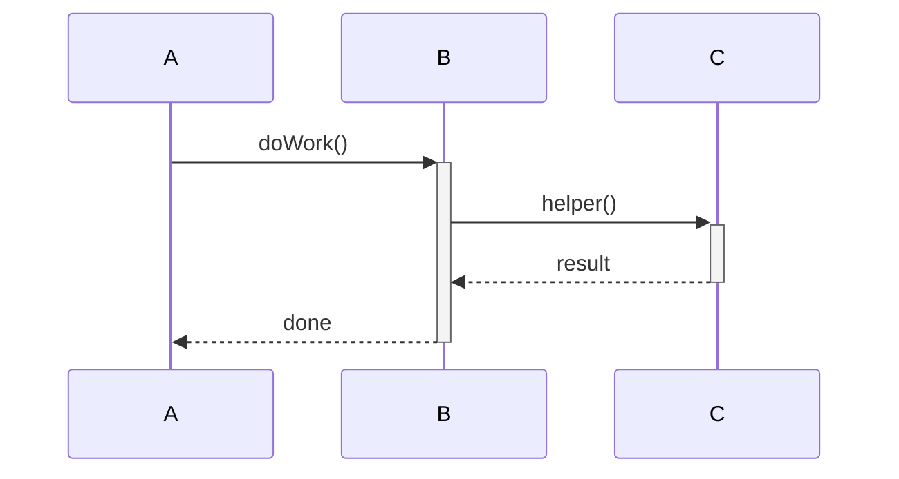
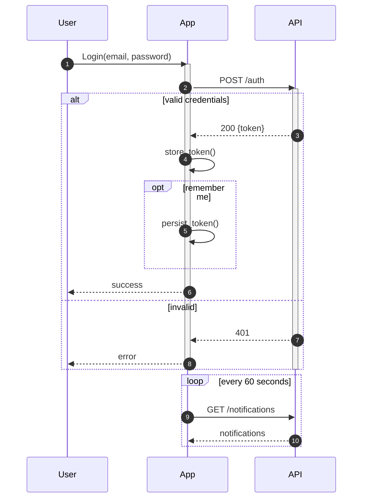
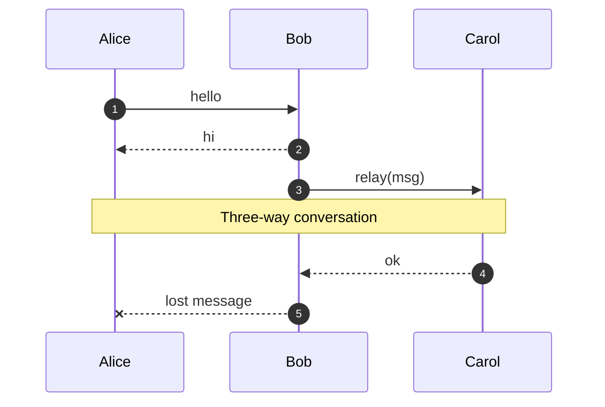
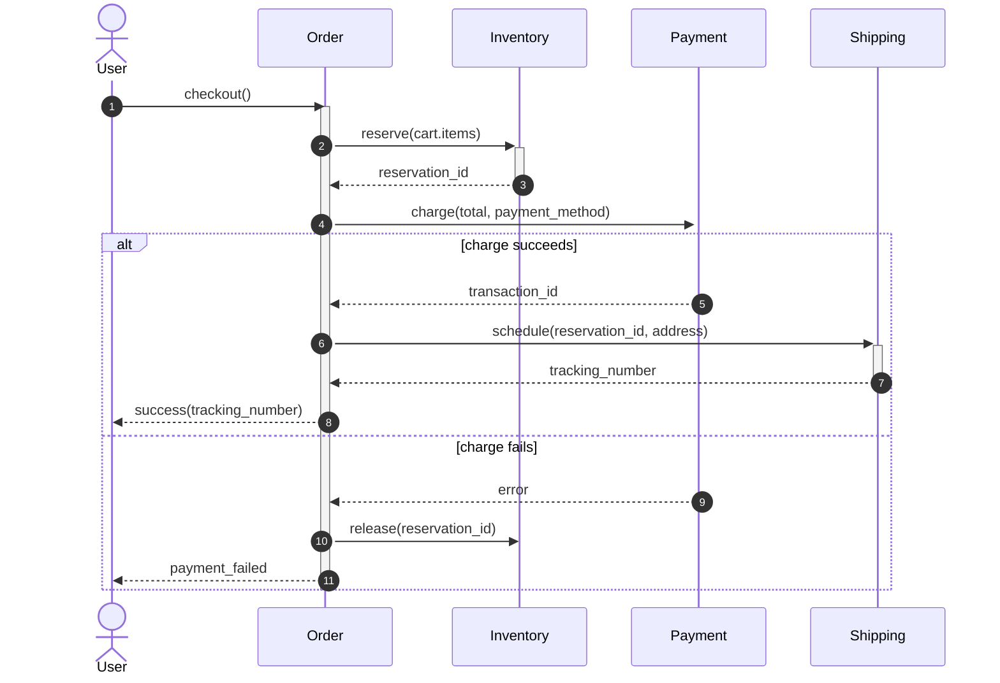
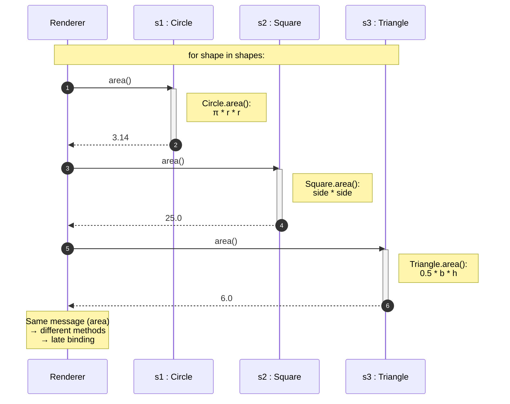
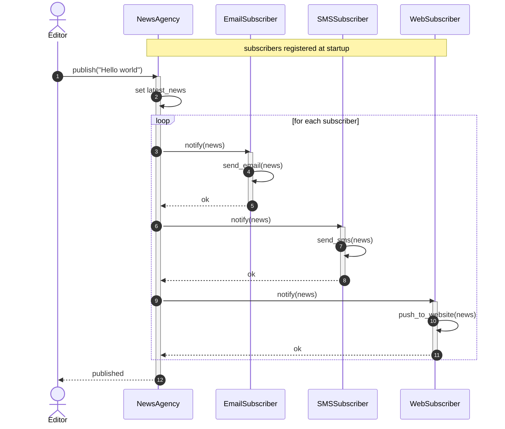
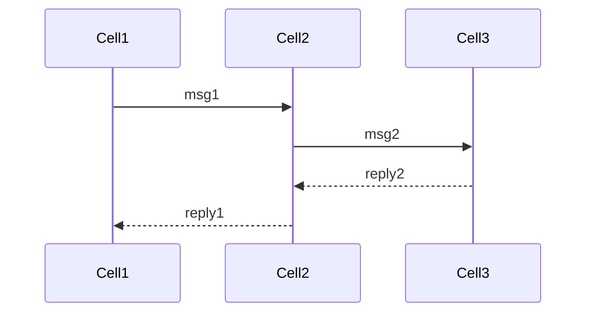
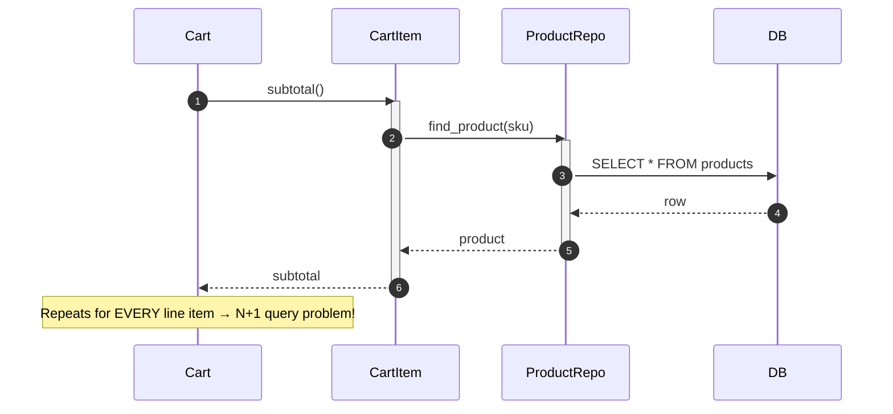

# Sequence Diagrams — How Objects Talk Over Time

> [!quote] Alan Kay
> "OOP to me means only messaging, local retention and protection and hiding of state-process, and extreme late-binding of all things." Sequence diagrams are the visual language of that messaging.

---

## 1. What Is a Sequence Diagram?

A **sequence diagram** is a behavioral diagram that shows how **objects exchange messages over time**. Time flows **top-to-bottom**; objects live on **horizontal lanes** (lifelines). It is the single best diagram for explaining *"how does this feature actually work, step by step?"*

| Aspect          | Sequence Diagram                              | Class Diagram                       |
| --------------- | --------------------------------------------- | ----------------------------------- |
| Shows           | Behavior over time                            | Static structure                    |
| Axes            | Objects (horizontal), time (vertical)         | None — graph layout                 |
| Best for        | "How does checkout work?"                     | "What classes do we have?"          |
| Read it like    | A movie script                                | A blueprint                         |

> [!tip] When to reach for a sequence diagram
> - When a class diagram leaves you wondering *"but how does the data actually flow?"*
> - When explaining a **method call chain** that crosses 3+ classes.
> - When demonstrating **polymorphism** — different objects responding to the same message.
> - When designing a **protocol** (request/response patterns, retries, async flows).

---

## 2. Anatomy of a Sequence Diagram



### 2.1 The Five Core Elements

| Element          | Symbol/Notation            | Purpose                                          |
| ---------------- | -------------------------- | ------------------------------------------------ |
| **Participant** (lifeline) | Vertical dashed line     | One object/actor; time flows down it             |
| **Message**      | Solid arrow `->>`         | A method call from one object to another         |
| **Return**       | Dashed arrow `-->>`       | A return value (often implicit; can be omitted)   |
| **Activation bar** | Solid rectangle on lifeline | The period during which an object is actively executing |
| **Note**         | Yellow box (`Note over`)  | Comment / annotation                              |

### 2.2 Message Types

| Arrow syntax in Mermaid | Meaning                       |
| ----------------------- | ----------------------------- |
| `->>`                    | Solid arrowhead = **synchronous** call |
| `--)`                    | Open arrowhead = **asynchronous** call |
| `-->>`                   | Dashed arrow = **return value** |
| `-x`                     | X-marked arrow = **lost/failed** message |
| `+)` `-)`                | Async send / receive (advanced) |

> [!note] Sync vs async in 5 seconds
> - **Synchronous (`->>`)**: caller **waits** for the callee to finish before continuing. Like a function call.
> - **Asynchronous (`--)`)**: caller **fires and forgets**. Like sending a message in a queue.

### 2.3 Activation Bars

Activation bars are the thin rectangles drawn **on top of a lifeline** to indicate that an object is currently executing. Mermaid draws them automatically when you use `activate`/`deactivate`, or you can use `+`/`-` shortcuts:



The `+` activates, the `-` deactivates. Stack them carefully — they nest.

---

## 3. Interaction Frames — `alt`, `opt`, `loop`, `par`

Real flows have conditionals, loops, and parallelism. UML models these as **interaction frames** — labelled rectangles over a region of the diagram. Mermaid supports the common ones.

| Frame  | Meaning                                  | When to use                                  |
| ------ | ---------------------------------------- | -------------------------------------------- |
| `alt`  | **Alternative** — if/else branches        | Mutually exclusive conditions                |
| `opt`  | **Optional** — single if, no else         | "If X, then..."                              |
| `loop` | **Loop** — repeat n times or while cond   | Iteration over a collection                  |
| `par`  | **Parallel** — concurrent regions         | Concurrency (rare in basic OOP)              |
| `break`| **Break** — exit the enclosing frame      | Early termination                            |
| `critical` | Atomic region                        | Concurrency control (advanced)               |

### 3.1 Example with `alt`, `loop`, `opt`



---

## 4. Mermaid `sequenceDiagram` Syntax Reference



### 4.1 Cheat Sheet

| Syntax                  | Effect                                   |
| ----------------------- | ---------------------------------------- |
| `participant N as Name`  | Declare an alias                         |
| `actor User`             | Use a stick-figure actor                 |
| `A->>B: msg`             | Sync call                                |
| `A--)B: msg`             | Async call                               |
| `A-->>B: msg`            | Return                                   |
| `A-xB: msg`              | Lost/failed message                      |
| `activate A` / `deactivate A` | Activation bar                  |
| `A->>+B: m` then `B-->>-A: r` | Shortcut: auto activate/deactivate |
| `Note over A,B: text`    | Note spanning multiple lifelines          |
| `Note right of A: text`  | Note positioned next to A                |
| `alt` / `else` / `end`   | Conditional block                         |
| `opt` / `end`            | Optional block                            |
| `loop n times` / `end`   | Loop block                                |
| `par` / `and` / `end`    | Parallel block                            |
| `autonumber`             | Auto-number messages                      |
| `rect rgb(200,220,255)` / `end` | Color a region                   |

> [!tip] Always use `autonumber`
> Numbered messages make it **trivial** to discuss diagrams verbally: *"In step 4, the server calls the database..."*

---

## 5. Worked Example 1 — A Method Call Chain

**Scenario:** A user clicks "checkout" on an e-commerce site. The `Order` calls `Inventory.reserve()`, then `Payment.charge()`, then `Shipping.schedule()`. If anything fails, we roll back.

### 5.1 The Diagram



### 5.2 The Python Code

```python
from dataclasses import dataclass


@dataclass
class ReservationId: id: str
@dataclass
class TransactionId: id: str
@dataclass
class TrackingNumber: id: str


class Inventory:
    def reserve(self, items) -> ReservationId:
        print("  Inventory: reserving items")
        return ReservationId("res-001")

    def release(self, reservation_id: ReservationId) -> None:
        print(f"  Inventory: releasing {reservation_id}")


class Payment:
    def charge(self, amount: float, method: str) -> TransactionId:
        print(f"  Payment: charging ${amount:.2f} to {method}")
        if amount > 1000:
            raise RuntimeError("card declined")
        return TransactionId("tx-007")


class Shipping:
    def schedule(self, reservation_id, address) -> TrackingNumber:
        print(f"  Shipping: scheduling for {address}")
        return TrackingNumber("trk-999")


class Order:
    def __init__(self, inventory: Inventory, payment: Payment, shipping: Shipping):
        self.inventory = inventory
        self.payment = payment
        self.shipping = shipping

    def checkout(self, cart_items, total, method, address):
        # step 2: reserve inventory
        reservation = self.inventory.reserve(cart_items)

        try:
            # step 4: charge payment
            txn = self.payment.charge(total, method)
        except RuntimeError:
            # rollback: release reservation
            self.inventory.release(reservation)
            return "payment_failed"

        # step 6: schedule shipping
        tracking = self.shipping.schedule(reservation, address)
        return f"success({tracking})"


# --- Run it ---
order = Order(Inventory(), Payment(), Shipping())
print(order.checkout(
    cart_items=["KB-001", "MS-001"],
    total=49.48,
    method="visa",
    address="123 Elm St",
))
# success(trk-999)

print(order.checkout(
    cart_items=["expensive-thing"],
    total=2000.00,
    method="visa",
    address="123 Elm St",
))
# payment_failed
```

> [!note] Reading the diagram vs the code
> The diagram makes the **happy/sad path branches** visually obvious. The code makes the **type contracts** explicit. You need both.

---

## 6. Worked Example 2 — Polymorphic Dispatch

**Scenario:** We have an abstract `Shape` class with subclasses `Circle`, `Square`, and `Triangle`. We iterate over a list of shapes and call `area()` on each. The **same message** — `area()` — is dispatched to **different methods** based on the runtime type. This is **runtime polymorphism**.

### 6.1 The Diagram



### 6.2 The Python Code

```python
from abc import ABC, abstractmethod
from math import pi


class Shape(ABC):
    @abstractmethod
    def area(self) -> float: ...


class Circle(Shape):
    def __init__(self, radius: float):
        self.radius = radius

    def area(self) -> float:
        return pi * self.radius ** 2


class Square(Shape):
    def __init__(self, side: float):
        self.side = side

    def area(self) -> float:
        return self.side ** 2


class Triangle(Shape):
    def __init__(self, base: float, height: float):
        self.base = base
        self.height = height

    def area(self) -> float:
        return 0.5 * self.base * self.height


def render(shapes: list[Shape]) -> None:
    """The renderer doesn't know which concrete shape it's dealing with."""
    for shape in shapes:
        # Same message, dispatched to DIFFERENT methods at runtime
        print(f"{type(shape).__name__}.area() = {shape.area():.2f}")


shapes: list[Shape] = [
    Circle(1.0),
    Square(5.0),
    Triangle(3.0, 4.0),
]
render(shapes)
# Circle.area() = 3.14
# Square.area() = 25.00
# Triangle.area() = 6.00
```

> [!tip] The visual lesson
> Notice how the diagram's three `area()` calls look **identical** from the renderer's perspective — same arrow, same message. Only the **notes** reveal that the *implementation* differs. That's the heart of polymorphism: **same interface, different behavior, late binding**.
>
> See [[polymorphism]] for the deeper theory.

---

## 7. Worked Example 3 — The Observer Pattern

**Scenario:** A `NewsAgency` (subject) notifies multiple `Subscriber` objects (observers) whenever news is published. This is the classic **Observer** pattern, and it's almost always drawn as a sequence diagram.

### 7.1 The Diagram



### 7.2 The Python Code

```python
from abc import ABC, abstractmethod


class Subscriber(ABC):
    @abstractmethod
    def notify(self, news: str) -> None: ...


class EmailSubscriber(Subscriber):
    def __init__(self, email: str):
        self.email = email

    def notify(self, news: str) -> None:
        print(f"  📧 Email to {self.email}: {news}")


class SMSSubscriber(Subscriber):
    def __init__(self, phone: str):
        self.phone = phone

    def notify(self, news: str) -> None:
        print(f"  📱 SMS to {self.phone}: {news}")


class WebSubscriber(Subscriber):
    def notify(self, news: str) -> None:
        print(f"  🌐 Website push: {news}")


class NewsAgency:
    def __init__(self):
        self._subscribers: list[Subscriber] = []
        self._latest_news: str = ""

    def subscribe(self, s: Subscriber) -> None:
        self._subscribers.append(s)

    def unsubscribe(self, s: Subscriber) -> None:
        self._subscribers.remove(s)

    def publish(self, news: str) -> None:
        self._latest_news = news
        # Broadcast: same message to all subscribers (polymorphic!)
        for s in self._subscribers:
            s.notify(news)


# --- Run it ---
agency = NewsAgency()
agency.subscribe(EmailSubscriber("alice@example.com"))
agency.subscribe(SMSSubscriber("+15550000"))
agency.subscribe(WebSubscriber())

agency.publish("Hello world")
# 📧 Email to alice@example.com: Hello world
# 📱 SMS to +15550000: Hello world
# 🌐 Website push: Hello world
```

> [!note] Pattern visibility
> A sequence diagram is the **clearest possible way** to teach the Observer pattern. The broadcast loop, the polymorphic `notify` call, and the decoupling between agency and subscribers are all visible at a glance. See [[design-patterns-behavioral]] for the full pattern catalog.

---

## 8. How Sequence Diagrams Teach Alan Kay's OOP

> [!quote] Alan Kay
> "I thought of objects being like biological cells... only able to communicate with messages."

The **original** vision of OOP — Kay's vision — is **all about messages**, not classes. Sequence diagrams bring that vision back:



> [!tip] Three teaching moves
> 1. **Draw before you code.** Have students draw a sequence diagram for "user logs in" before writing a line of code.
> 2. **Polymorphism made visible.** Show the same arrow going to different objects — that's polymorphism in pure form.
> 3. **Decoupling made visible.** If object A only ever talks to interface I, draw I as the participant, not the concrete class. This is the Dependency Inversion Principle in pictures. See [[solid-principles]].

---

## 9. Sequence Diagrams for Debugging

When a stack trace confuses you, **draw it as a sequence diagram**. Example — a real bug:

> "Why does `cart.total()` make a database call on every line item?"

Drawing it:



The diagram makes the **N+1 query problem** obvious: one database round-trip per item. The fix (eager-load products) is now a structural change you can *see*.

> [!success] Practice
> Whenever you fix a multi-step bug, draw the before-and-after sequence diagrams. They become artifacts you can show teammates, juniors, and your future self.

---

## 10. Common Mistakes

> [!danger] Top 5 traps
> 1. **Drawing every method call.** Only show the calls that *matter*. Skip getters, simple field reads, and framework noise.
> 2. **Forgetting the `deactivate`.** Mismatched `activate`/`deactivate` makes the diagram hard to read. Use `+`/`-` shortcuts.
> 3. **Mixing up sync vs async.** Use `->>` for sync, `--)` for async. Don't conflate them.
> 4. **Drawing the return value for every message.** Returns are often implicit. Show them only when the value matters.
> 5. **Putting internal logic on the wrong lifeline.** A note `Note over X` should describe what X is doing, not what Y will do next.

---

## 11. Key Takeaways

> [!summary] Six things to internalize
> 1. Sequence diagrams show **messages over time** — top to bottom, lifelines left to right.
> 2. Five core elements: **lifeline, message, return, activation bar, note**.
> 3. Use **`alt`/`opt`/`loop`/`par`** frames for conditionals, optionals, loops, and parallelism.
> 4. **Sync (`->>`) vs async (`--)`)** — pick the right arrow.
> 5. Sequence diagrams make **polymorphism** and **decoupling** visible.
> 6. The diagram is the **story** of how a feature works. Code is the proof.

---

## 12. Practice Exercises

> [!exercise] Exercise 1 — ATM withdrawal
> Draw a sequence diagram for an ATM withdrawal: `Customer` → `ATM` → `Bank` → `Account`. Include the `alt` for "sufficient funds" vs "insufficient funds". Write the Python code that matches.

> [!exercise] Exercise 2 — Polymorphic shapes
> Extend the Shape example with a `Rectangle` and `Polygon` class. Draw the sequence diagram showing the renderer calling `area()` on 5 different shapes. What does the diagram look *identical* regardless of which subclass is called? Why?

> [!exercise] Exercise 3 — Observer variant
> Modify the Observer example so subscribers can subscribe to **topics** ("sports", "tech"). Publishing news on "tech" should only notify tech subscribers. Draw the new sequence diagram. Implement it in Python.

> [!exercise] Exercise 4 — API call with retry
> Draw a sequence diagram where a client calls an API that may fail. On failure, the client retries up to 3 times using a `loop` frame. Implement in Python with `try/except`.

> [!exercise] Exercise 5 — Reverse-engineer
> Given this Python code, draw the sequence diagram:
> ```python
> def process(order, inventory, payment, notifier):
>     inv_id = inventory.reserve(order.items)
>     try:
>         tx = payment.charge(order.total)
>     except PaymentError:
>         inventory.release(inv_id)
>         return False
>     notifier.notify(order.user, "Shipped!")
>     return True
> ```

> [!exercise] Exercise 6 — N+1 fix
> Take the N+1 query example in section 9. Refactor the code so products are batch-loaded. Draw the before-and-after sequence diagrams. How many database calls in each?

> [!exercise] Exercise 7 — Async flow
> Draw a sequence diagram where a web server makes two **parallel async** calls to two microservices, then combines the results. Use `par`/`and`. Implement in Python with `asyncio.gather`.

---

## 13. What's Next?

- 🧱 [[class-diagrams]] — the static structure these messages flow through.
- 📸 [[object-diagrams]] — snapshots of the objects involved.
- 🔄 [[state-and-activity-diagrams]] — what each object *does* when it receives a message.
- 📋 [[mermaid-cheatsheet]] — full Mermaid syntax reference.
- 🧬 [[polymorphism]] · [[design-patterns-behavioral]] · [[solid-principles]] — theory these diagrams visualize.
