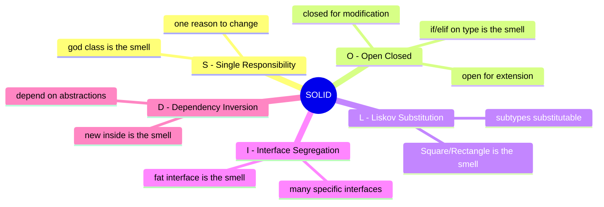
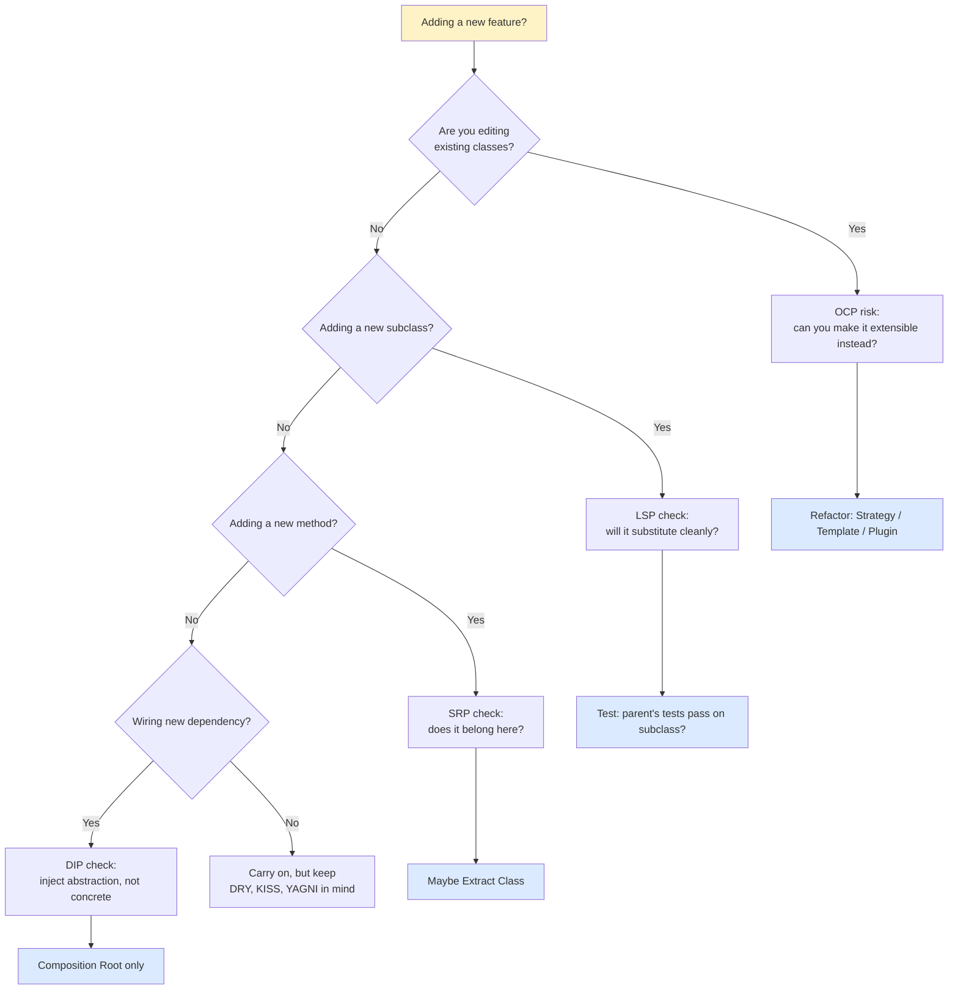
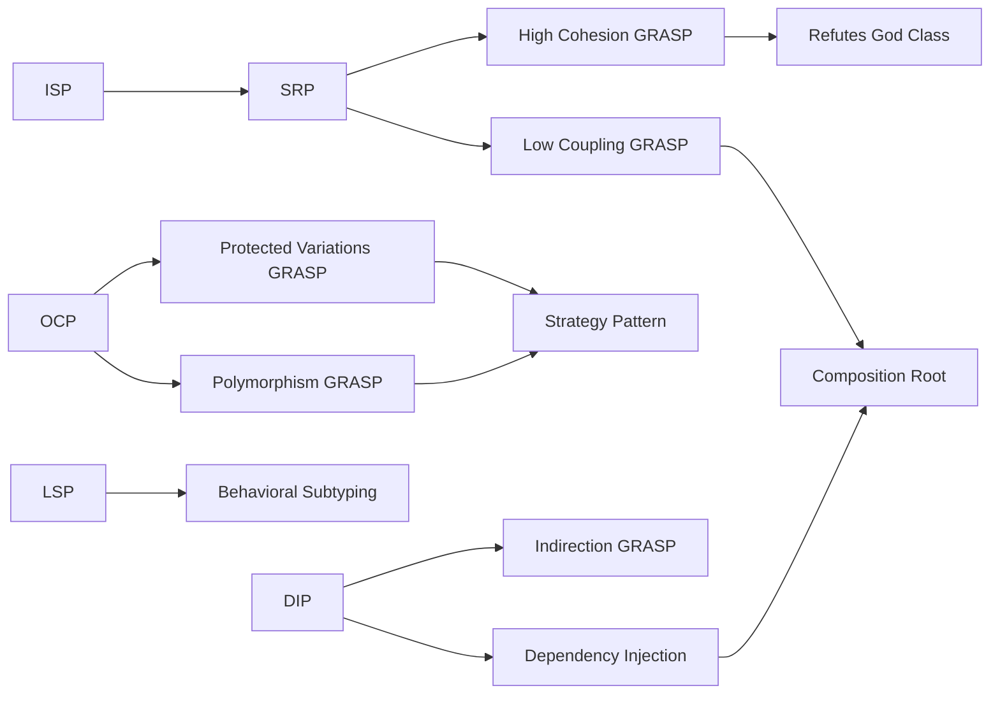

# 🧭 SOLID & Principles Cheat Sheet

> [!tip] How to use this card
> Open it during code review. Spot the smell → look up the principle → apply the refactoring. Each row is a wikilink to the deep dive.

Deep dives: [[solid-principles]] · [[grasp-and-extra-principles]] · [[composition-over-inheritance]] · [[dependency-injection]] · [[best-practices]].

---

## 🏛️ The 5 SOLID Principles



### S — Single Responsibility Principle (SRP)

| | |
|---|---|
| **Definition** | A class should have one, and only one, reason to change. |
| **Smell** | God class, "kitchen-sink" class, methods that have nothing in common. |
| **Fix** | Split along responsibility axes; one class = one actor. |

❌ **Violation:**

```python
class Employee:
    def pay(self): ...                       # finance
    def render_report(self): ...             # reporting
    def save_to_db(self): ...                # persistence
    def send_email(self): ...                # comms
```

✅ **Fix:**

```python
class Employee: ...                          # domain
class PayrollService: ...                    # finance
class ReportRenderer: ...                    # reporting
class EmployeeRepository: ...                # persistence
class EmailService: ...                      # comms
```

See [[solid-principles]] · [[common-pitfalls-and-anti-patterns]].

---

### O — Open/Closed Principle (OCP)

| | |
|---|---|
| **Definition** | Software entities should be open for extension, closed for modification. |
| **Smell** | Adding a new type requires editing existing `if/elif` chains. |
| **Fix** | Polymorphism, Strategy, Plugin registry, Template Method. |

❌ **Violation:**

```python
def area(shape):
    if shape.kind == "circle":   return 3.14 * shape.r ** 2
    elif shape.kind == "square": return shape.s ** 2
    # every new shape = edit this function
```

✅ **Fix:**

```python
class Shape(ABC):
    @abstractmethod
    def area(self) -> float: ...
class Circle(Shape):
    def area(self) -> float: return 3.14 * self.r ** 2
class Square(Shape):
    def area(self) -> float: return self.s ** 2
# new shape = new class, no edits to existing code
```

See [[solid-principles]] · [[design-patterns-behavioral]] (Strategy).

---

### L — Liskov Substitution Principle (LSP)

| | |
|---|---|
| **Definition** | Subtypes must be substitutable for their base types without breaking program correctness. |
| **Smell** | Subclass throws in a parent method; subclass tightens preconditions; subclass weakens postconditions; subclass changes state invariants. |
| **Fix** | Drop inheritance; use composition; or restructure the hierarchy. |

❌ **Violation (Square/Rectangle):**

```python
class Rectangle:
    def __init__(self): self._w, self._h = 0, 0
    @property
    def width(self):  return self._w
    @width.setter
    def width(self, v): self._w = v
    @property
    def height(self): return self._h
    @height.setter
    def height(self, v): self._h = v
    @property
    def area(self): return self._w * self._h

class Square(Rectangle):
    @Rectangle.width.setter
    def width(self, v): self._w = self._h = v   # breaks Rectangle's contract
    @Rectangle.height.setter
    def height(self, v): self._w = self._h = v

def test_area(r: Rectangle):
    r.width, r.height = 3, 4
    assert r.area == 12                          # fails for Square!

test_area(Square())   # AssertionError
```

✅ **Fix:** Don't inherit — both `Rectangle` and `Square` implement a `Shape` ABC.

See [[solid-principles]] · [[inheritance]].

---

### I — Interface Segregation Principle (ISP)

| | |
|---|---|
| **Definition** | Clients should not be forced to depend on methods they don't use. |
| **Smell** | Fat interface; classes with `raise NotImplementedError` stubs. |
| **Fix** | Split the interface into smaller, role-specific ones. |

❌ **Violation:**

```python
class Machine(ABC):
    @abstractmethod
    def print(self, doc): ...
    @abstractmethod
    def scan(self, doc): ...
    @abstractmethod
    def fax(self, doc): ...

class SimplePrinter(Machine):
    def print(self, doc): ...
    def scan(self, doc): raise NotImplementedError   # can't scan!
    def fax(self, doc):   raise NotImplementedError   # can't fax!
```

✅ **Fix:**

```python
class Printer(Protocol):  def print(self, doc): ...
class Scanner(Protocol):  def scan(self, doc): ...
class Fax(Protocol):      def fax(self, doc): ...
class SimplePrinter:      # only implements Printer
    def print(self, doc): ...
```

See [[solid-principles]] · [[protocols-and-type-hints]].

---

### D — Dependency Inversion Principle (DIP)

| | |
|---|---|
| **Definition** | High-level modules should not depend on low-level modules; both should depend on abstractions. Abstractions should not depend on details; details should depend on abstractions. |
| **Smell** | `new ConcreteDependency()` inside business logic. |
| **Fix** | Inject dependencies through constructor; depend on `Protocol`/`ABC`. |

❌ **Violation:**

```python
class OrderProcessor:
    def __init__(self):
        self.notifier = SmtpNotifier()       # ← concrete, hard-wired
        self.repo = SqlOrderRepository()     # ← concrete, hard-wired
    def process(self, order):
        self.repo.save(order); self.notifier.send(order)
```

✅ **Fix:**

```python
class OrderProcessor:
    def __init__(self, notifier: Notifier, repo: OrderRepository):
        self.notifier, self.repo = notifier, repo    # injected, abstract
    def process(self, order):
        self.repo.save(order); self.notifier.send(order)
# Wire concrete types in a composition root, never in business logic.
```

See [[solid-principles]] · [[dependency-injection]].

---

## 🌿 The 9 GRASP Patterns (one line each)

| GRASP | One-liner | Deep dive |
|---|---|---|
| **Information Expert** | Assign responsibility to the class that has the info needed to fulfill it. | [[grasp-and-extra-principles]] |
| **Creator** | Let class B create class A's instances if B contains/composes/uses A. | [[grasp-and-extra-principles]] |
| **Controller** | First object beyond UI to receive a system operation; non-UI, delegates to model. | [[grasp-and-extra-principles]] |
| **Low Coupling** | Distribute responsibility to keep classes independent; reduces ripple change. | [[grasp-and-extra-principles]] |
| **High Cohesion** | Keep responsibilities focused; classes do one thing well. | [[grasp-and-extra-principles]] |
| **Polymorphism** | When behavior varies by type, use polymorphic calls — not `if isinstance`. | [[grasp-and-extra-principles]] |
| **Pure Fabrication** | It's OK to invent a class that doesn't model the domain (e.g., `Validator`) to satisfy cohesion/coupling. | [[grasp-and-extra-principles]] |
| **Indirection** | Insert an intermediate object to decouple two others (Adapter, Facade, Mediator). | [[grasp-and-extra-principles]] |
| **Protected Variations** | Wrap varying points behind a stable interface so changes don't ripple. | [[grasp-and-extra-principles]] |

---

## 🧰 Other Key Principles / Heuristics

| Principle | One-liner | Deep dive |
|---|---|---|
| **DRY** (Don't Repeat Yourself) | Every piece of knowledge must have a single, unambiguous representation. Note: *knowledge*, not *code*. | [[grasp-and-extra-principles]] |
| **KISS** (Keep It Simple, Stupid) | Simplicity is a feature. Choose the simplest design that works. | [[grasp-and-extra-principles]] |
| **YAGNI** (You Aren't Gonna Need It) | Don't build for hypothetical future requirements. | [[grasp-and-extra-principles]] |
| **Law of Demeter** (LoD) | An object should only talk to its immediate collaborators — don't reach through them. `a.b.c().d()` is a smell. | [[grasp-and-extra-principles]] |
| **Tell-Don't-Ask** | Tell objects what to do; don't interrogate them for state and then decide for them. | [[grasp-and-extra-principles]] |
| **Composition Root** | The single place in the application (near `main()`) where dependencies are wired. Libraries should not have one. | [[dependency-injection]] |
| **Favor Composition Over Inheritance** | Default to has-a; reach for is-a only when LSP holds. | [[composition-over-inheritance]] |
| **Program to Interfaces, Not Implementations** | Depend on `Protocol`/`ABC`, not concrete classes. | [[solid-principles]] |
| **Least Knowledge** | Another name for Law of Demeter. | [[grasp-and-extra-principles]] |
| **Boy Scout Rule** | Leave the code a little better than you found it. | [[best-practices]] |
| **Command-Query Separation (CQS)** | Methods either *do* something (command) or *return* something (query), not both. | [[best-practices]] |
| **Fail Fast** | Surface errors as early as possible (validate in `__init__`, raise immediately). | [[best-practices]] |
| **Immutability by Default** | Frozen dataclasses / value objects reduce shared-state bugs. | [[dataclasses-and-attrs]] |
| **Convention over Configuration** | Sensible defaults so users only specify exceptions. | [[best-practices]] |

---

## 🧪 Principle → Smell → Refactoring Lookup

| Smell you see | Principle violated | Quick refactoring |
|---|---|---|
| Class has > 7 unrelated public methods | SRP | Extract Class |
| `if isinstance(x, T): ...` chain | OCP / Polymorphism (GRASP) | Replace conditional with polymorphism |
| Subclass overrides method to `raise NotImplementedError` | ISP / LSP | Split interface; or drop inheritance |
| Subclass method changes contract (pre/post-conditions) | LSP | Drop inheritance; use composition |
| `a.b.c().d()` (train wreck) | LoD | Hide delegation; tell, don't ask |
| `new Dependency()` inside business logic | DIP | Constructor injection |
| Same logic in 3+ places | DRY | Extract method/class; or extract `Strategy` |
| `Employee(EmployeeType.FULL_TIME)` + switch on type | OCP | Strategy pattern + factory |
| God class — 1000+ lines, 30+ methods | SRP / High Cohesion | Extract Class (multiple times) |
| Feature envy — class A uses B's data more than its own | Information Expert (GRASP) | Move method to B |
| Primitive obsession — `dict[str, Any]` everywhere | Pure Fabrication (GRASP) | Introduce value object class |
| Shotgun surgery — one change touches 6 files | Low Coupling (GRASP) | Consolidate into one class |
| Divergent change — one class changes for 3 different reasons | SRP | Extract Class along each reason |
| Anemic domain model — DTOs + service classes do all logic | Information Expert (GRASP) | Move behavior into the domain class |
| Refused bequest — subclass doesn't want parent's methods | LSP | Replace inheritance with composition |
| Inappropriate intimacy — A reaches into B's privates | LoD / Encapsulation | Move method; or merge classes |
| Hidden temporal coupling — `obj.init(); obj.use()` (must call in order) | Command-Query / Fail Fast | Combine into one method; or constructor injection |
| `None` checks everywhere | Null Object pattern | Introduce a Null-object default |
| `isinstance` checks before calling a method | Polymorphism (GRASP) | Make the method polymorphic |
| `__getattr__` infinite recursion | (Python foot-gun) | Use `object.__getattribute__` or guard |
| Mutable default class attribute | (Python foot-gun) | `default_factory` or per-instance init |
| Singleton used as global mutable | DIP / Testability | Inject the dependency |

---

## 🩺 "I'm About to Add a New Feature — Which Principle Should I Check?"



### Quick check-list before committing new code

- [ ] Does this class have **one** reason to change? (SRP)
- [ ] Did I edit existing classes when I could have added new ones? (OCP)
- [ ] Could any subclass of this type break its parent's contract? (LSP)
- [ ] Am I forcing clients to depend on methods they don't use? (ISP)
- [ ] Am I depending on a concrete class? Could I depend on an abstraction? (DIP)
- [ ] Is there duplicated *knowledge* (not just code) anywhere? (DRY)
- [ ] Could a simpler design work? (KISS)
- [ ] Am I building for a hypothetical future? (YAGNI)
- [ ] Am I reaching through objects? `a.b.c()`? (LoD)
- [ ] Am I asking for state then deciding — instead of telling? (Tell-Don't-Ask)
- [ ] Are dependencies wired in one place near `main()`? (Composition Root)

---

## 🔗 How SOLID × GRASP × Heuristics Reinforce Each Other



> [!note] Reinforcement matrix
> Each principle is a lens on the same goal: **changeable, testable, comprehensible code**. When one principle is satisfied, others often follow.

---

## 🧱 SOLID × Pattern Lookup

| Principle | Patterns that support it |
|---|---|
| **SRP** | Facade (off-load to subsystems), Service Layer |
| **OCP** | Strategy, Template Method, State, Observer, Plugin Registry, Factory Method |
| **LSP** | (no pattern — but: avoid inheritance where it doesn't fit; use composition instead) |
| **ISP** | Adapter (split fat interface), Role Interfaces |
| **DIP** | Dependency Injection, Strategy, Bridge, Abstract Factory, Plugin |

---

## ⚖️ Tension Among Principles

| Tension | Resolution |
|---|---|
| **OCP vs YAGNI** | Don't preemptively abstract for hypothetical extensions; *do* abstract the second time the same variation appears (Rule of Three). |
| **DRY vs SRP** | Sometimes the *same code* serves two unrelated actors (e.g. shared validation in two contexts). Extract to a third class both can depend on. |
| **KISS vs OCP** | Don't introduce a Strategy pattern for a 2-line `if` that has changed exactly once in 5 years. |
| **LoD vs Fluent APIs** | Fluent APIs (`a.b().c().d()`) intentionally violate LoD for readability; acceptable when each step returns a known, stable type. |
| **LSP vs Reuse** | If you're inheriting just to reuse code, you'll violate LSP. Prefer composition. |

> [!tip] Heuristic: Rule of Three
> The first time you do something, just do it. The second time, wince but do it again. The third time, refactor. *Then* introduce the pattern/principle.

---

## 📚 Recommended Reading Order

If you want a deep dive into principles, read in this order:

1. [[solid-principles]] — the canonical 5
2. [[grasp-and-extra-principles]] — the 9 GRASP + DRY/KISS/YAGNI/LoD
3. [[composition-over-inheritance]] — the most important *decision* principle
4. [[dependency-injection]] — the practical implementation of DIP
5. [[common-pitfalls-and-anti-patterns]] — anti-patterns with refactors
6. [[best-practices]] — the synthesis

---

## 🔑 Key Takeaways

- **SOLID is a checklist, not a religion** — run through it during code review, not as a doctrine to impose.
- **GRASP answers "where does this responsibility go?"** — keep Information Expert, Creator, and Low Coupling in muscle memory.
- **DRY is about *knowledge*, not lines of code** — copying 5 lines isn't always a DRY violation; two places that must change together always are.
- **KISS + YAGNI** are the antidotes to over-engineering — apply them before SOLID.
- **LoD and Tell-Don't-Ask** are the most underused — they massively improve encapsulation.
- **Composition Root** is the single most important DI concept — wire dependencies *once*, near `main()`.
- The **"Principle → Smell → Refactoring"** table is your code-review cheat code.
- When principles **tension** with each other (OCP vs YAGNI), the **Rule of Three** usually resolves it.
- Every principle in this card is fully treated in [[solid-principles]] or [[grasp-and-extra-principles]] — click through for worked examples and pitfalls.

---

*See also: [[oop-quick-reference]] · [[design-patterns-cheatsheet]] · [[common-mistakes-cheatsheet]] · [[composition-over-inheritance]] · [[dependency-injection]] · [[best-practices]] · [[common-pitfalls-and-anti-patterns]]*
