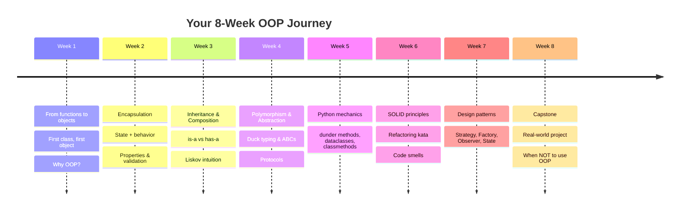
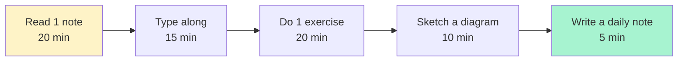
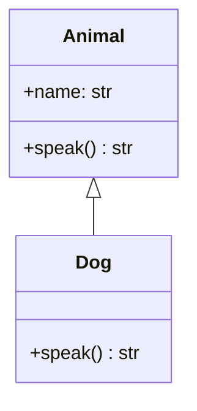
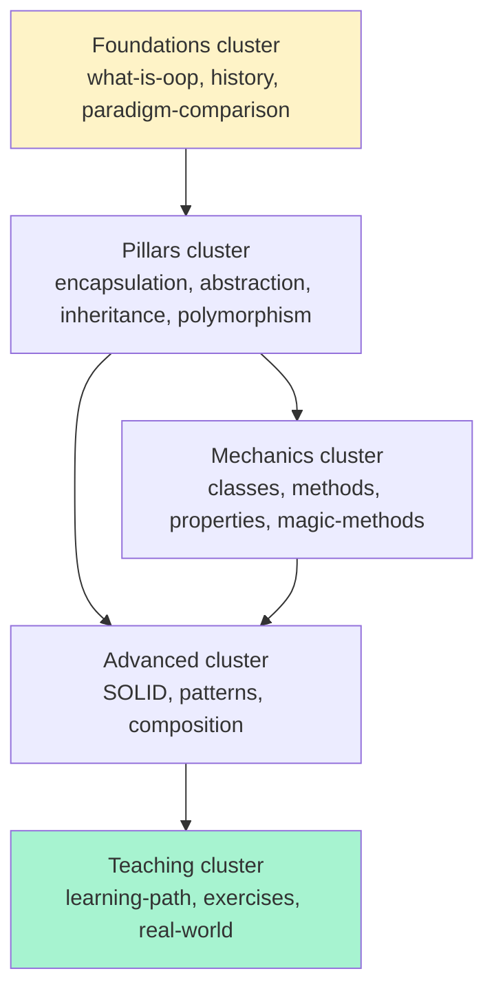
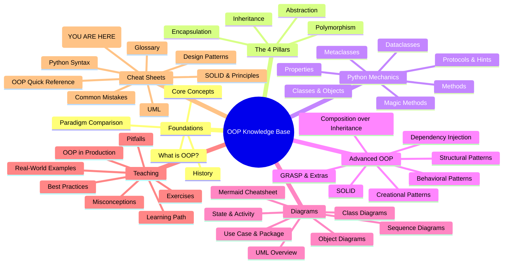

# 👋 Start Here — Your Day 1 Guide to Learning OOP

> [!quote] "Everyone starts confused. The goal isn't to avoid confusion — it's to keep going *through* it. OOP rewards the patient."

Welcome. Really — welcome. If you've made it to this note, you've decided to learn **Object-Oriented Programming**, and that's a decision your future self will thank you for. This guide is the **first thing you should read**. It will:

1. Tell you what this knowledge base **is**.
2. Show you **what you'll be able to do** by the end.
3. Give you a **day-by-day plan**.
4. Teach you **how to read** each kind of note.
5. Show you **how to use Obsidian** to study smarter, not harder.
6. Offer a few **rules of the road** for learning OOP well.
7. Point you to the **10 most important notes to read first**.
8. Give you a **pre-test** to gauge where you're starting from.

Take a breath. We've got you. 🌱

---

## 📦 What This Knowledge Base Is

This is a **teaching-grade OOP knowledge base** — a collection of interconnected notes designed to take you from *"I sort of know Python"* to *"I can design a clean, extensible, testable object-oriented system."*

It's not a textbook. It's not a video course. It's a **garden of notes** that you wander through, following links where your curiosity takes you. Each note is short enough to read in one sitting and deep enough to come back to repeatedly.

**Stats at a glance:**

| What | Count |
|---|---|
| Total notes | 37+ deep dives + 8 cheat sheets |
| Sections | 6 themed folders + this cheatsheet section |
| Mermaid diagrams | 150+ (render right inside Obsidian) |
| Runnable Python examples | 200+ (every snippet is typed and copy-pasteable) |
| Anti-patterns documented | 16+ |
| Design patterns covered | All 23 GoF patterns + extras |
| Capstone projects | 3, with rubrics |
| Practice exercises | 18+ graded warm-ups and intermediates |

> [!tip] The vault is yours
> Don't read it linearly. Wander. Open the **Graph View** (left sidebar → graph icon). See how notes link together. Click into anything that catches your eye. This is **your** knowledge base now.

---

## 🎯 What You'll Be Able to Do After Finishing This Pack

Concrete, demonstrable outcomes — not vague "you'll understand OOP" promises. After working through this pack, you will be able to:

### 🔧 Read & Write Code

- [ ] Read an unfamiliar Python class and explain its **responsibilities**, **collaborators**, and **state** in 60 seconds.
- [ ] Write a class with **proper encapsulation** — private attributes, validated setters via `@property`, no leakage.
- [ ] Implement **dunder methods** (`__repr__`, `__eq__`, `__hash__`, `__iter__`, `__enter__`, `__add__`, …) so your objects *behave* like built-ins.
- [ ] Use `@dataclass`, `NamedTuple`, and `typing.Protocol` fluently and pick the right one for the job.
- [ ] Read MRO output (`Cls.__mro__`) and predict `super()` calls in a diamond hierarchy.

### 🏛️ Design

- [ ] Look at a problem description and **sketch a UML class diagram** before writing code.
- [ ] Apply the **4 pillars** (encapsulation, abstraction, inheritance, polymorphism) deliberately — not accidentally.
- [ ] Recognize all 5 **SOLID** violations in code review and propose fixes.
- [ ] Pick a **GoF pattern** appropriately — and, just as importantly, *know when not to use one*.
- [ ] Decide between **inheritance and composition** in 30 seconds with reasoning.
- [ ] Design with **dependency injection** so your code is testable without contortions.

### 🧪 Test & Maintain

- [ ] Write unit tests for a class with mocked dependencies.
- [ ] Spot **anti-patterns** (God class, feature envy, primitive obsession, anemic domain model, …) in code review.
- [ ] Refactor a tangled hierarchy into a clean composition + Strategy design.
- [ ] Decide when to use OOP and when **not to** (yes — sometimes functions win).

### 🗣️ Communicate

- [ ] Explain **why** OOP exists to a junior dev, with a concrete example.
- [ ] Defend a design decision using SOLID / GRASP vocabulary.
- [ ] Draw a sequence diagram of a method call chain in 5 minutes.

---

## 📅 The Study Plan — 8 Weeks, Day by Day

> [!note] Adapt freely
> This is a default rhythm. If you have 4 hrs/week, this becomes 16 weeks. If you have 20 hrs/week, this becomes 3 weeks. The **order** matters more than the pace.

This plan mirrors the [[learning-path]] 8-week syllabus. Each row is one week.



### Week-by-Week Detail

| Week | Theme | Primary Notes | Exercise |
|:---:|---|---|---|
| **1** | From functions to objects | [[what-is-oop]] · [[paradigm-comparison]] · [[classes-and-objects]] · [[core-concepts-overview]] | Convert 1 procedural script → a small class |
| **2** | Encapsulation | [[encapsulation]] · [[properties]] · [[classes-and-objects]] | Build `BankAccount` with validation |
| **3** | Inheritance & Composition | [[inheritance]] · [[composition-over-inheritance]] · [[class-diagrams]] | Refactor an `Animal`/`Dog`/`Cat` hierarchy |
| **4** | Polymorphism & Abstraction | [[polymorphism]] · [[abstraction]] · [[protocols-and-type-hints]] | Build a `Shape` hierarchy with an ABC |
| **5** | Python mechanics | [[methods]] · [[magic-methods]] · [[dataclasses-and-attrs]] · [[metaclasses-and-class-creation]] | Implement a `Vector` class with 10+ dunders |
| **6** | SOLID & code smells | [[solid-principles]] · [[grasp-and-extra-principles]] · [[common-pitfalls-and-anti-patterns]] · [[best-practices]] | Refactor a God class (kata) |
| **7** | Design patterns | [[design-patterns-creational]] · [[design-patterns-structural]] · [[design-patterns-behavioral]] · [[dependency-injection]] | Pick 3 patterns, implement each in 30 min |
| **8** | Capstone & judgement | [[real-world-examples]] · [[oop-in-production]] · [[exercises-and-projects]] · [[common-misconceptions]] | Ship a 200-line mini-project |

### A Typical Day (≈ 60–90 min)



> [!tip] The single most important habit
> **Type the code.** Do not copy-paste. Muscle memory is real. The 30 seconds you save with `Ctrl+V` costs you 30 minutes of debugging later when you don't remember *why* a line was there.

---

## 📖 How to Read Each Note

Every note in this vault follows a similar anatomy. Once you can read one, you can read them all.

### 1. YAML Frontmatter (the metadata block at the top)

```yaml
---
title: "Encapsulation"
tags: [oop, pillars, encapsulation, python]
aliases: [Information Hiding, Data Hiding]
created: 2025-01-15
---
```

This is **metadata**, not content. Obsidian uses it for:
- The **title** shown in the file pane.
- The **tags** in the tag pane (click `#encapsulation` to see every note with that tag).
- The **aliases** so that `[[Information Hiding]]` resolves to this note.
- The **created** date for your daily-note review.

You don't need to memorize it. Just know it's there.

### 2. Callouts (colored boxes)

These are scattered throughout every note:

| Callout | Meaning | Action |
|---|---|---|
| `> [!note]` | General info | Read once |
| `> [!tip]` | Pro tip / shortcut | Star it — you'll want it later |
| `> [!warning]` | Common gotcha | Pay extra attention |
| `> [!danger]` | Will break your code | Screenshot this |
| `> [!example]` | Worked example | Type along |
| `> [!exercise]` | Practice prompt | Do it before reading on |
| `> [!quote]` | Memorable aphorism | Write it in your daily note |
| `> [!success]` | Encouragement milestone | Pat yourself on the back |

### 3. Wikilinks (the `[[double brackets]]`)

`[[encapsulation]]` is a link to the note named `encapsulation.md`. Click it to jump. **Hover** (in Obsidian) for a preview. The **backlinks** panel (right sidebar) shows every note that links *to* the one you're reading — invaluable for review.

> [!tip] When you see a wikilink you don't recognize
> Don't click immediately. **Finish the note you're in first.** Then come back. Otherwise you'll go down a rabbit hole and lose the thread.

### 4. Mermaid Diagrams

These render as **visual diagrams** right inside Obsidian. Example:



If a diagram doesn't render: Settings → Editor → ensure "Strict line breaks" is OFF, and confirm the community plugin **Mermaid** is enabled (it's built-in by default).

### 5. Python Code Blocks

```python
class Dog:
    def __init__(self, name: str) -> None:
        self.name = name
    def speak(self) -> str:
        return f"{self.name} says woof!"
```

Every snippet is **runnable**. Type it into a `.py` file. Run it. Tweak it. Break it. Fix it.

### 6. Key Takeaways (at the end of every note)

A 3–5 bullet summary. **Read these before reading the note** to prime your brain, and again *after* to consolidate.

### 7. Practice Exercises (at the end of every deep-dive note)

Don't skip these. The notes give you the *what* and *why*. The exercises give you the *how*. Reading about OOP is like reading about swimming — you have to get in the water.

---

## 🧭 How to Use Obsidian Features to Study

Obsidian is more than a markdown reader. Used right, it's a **learning multiplier**.

### 🗺️ Graph View — see the shape of the knowledge

Open the graph view (left sidebar icon, or `Ctrl+G` / `Cmd+G`). You'll see every note as a node, every wikilink as an edge. The clusters reveal the **structure** of OOP:



**Use it for review**: pick a node and try to recall everything in the notes linking to it. Then click through and check yourself.

### 🔗 Backlinks — the secret weapon

Open any note. Look at the right sidebar → **Backlinks**. It lists every note that wikilinks *to* the current note. This is your **"what depends on this?"** view — invaluable for understanding how a concept (like `super()`) is used across the vault.

### 📅 Daily Notes — your exercise journal

Settings → Core plugins → enable **Daily Notes**. Now `Ctrl+Alt+Left` opens today's note. Use it for:

- ✅ A 3-line summary of what you learned today
- 🐛 Bugs you hit and how you fixed them
- 🤔 Questions you couldn't answer (search for them tomorrow)
- 🏋️ The exercise(s) you completed
- 📸 Screenshots of diagrams you drew

> [!example] Daily note template
> ```markdown
> ## 2025-02-14
> **Read:** [[encapsulation]], [[properties]]
> **Learned:** Properties let you migrate from public attrs to validated setters without breaking callers. Killer feature.
> **Exercise:** BankAccount with overdraft protection — DONE ✅
> **Bug:** Forgot `@balance.setter` and got `AttributeError: can't set attribute`. Fixed.
> **Question:** When should I use `@cached_property` vs `@property`? → check [[properties]] tomorrow.
> ```

### 🏷️ Tags — filter the vault your way

Every note has tags. Use the tag pane (right sidebar) to filter:

- `#beginner` → start-here material
- `#intermediate` → weeks 3–5
- `#advanced-level` → weeks 6–8
- `#anti-pattern` → code-review prep
- `#design-patterns` → pattern lookup
- `#misconception` → review before teaching

### 🔖 Bookmarks & Stars

Star notes you keep returning to (right-click tab → Pin/Star). Good candidates:

- [[oop-quick-reference]] — keep this open while coding
- [[common-mistakes-cheatsheet]] — open during code review
- [[python-oop-syntax-cheatsheet]] — for when you forget `@classmethod` syntax
- [[glossary]] — when a term escapes you

### 📝 Canvas (for capstone planning)

Settings → Core plugins → **Canvas**. Drop notes onto an infinite whiteboard, draw arrows between them, sketch your capstone architecture *visually* before writing any code. Highly recommended for Week 8.

---

## 🚦 Rules of the Road — How to Learn OOP Well

> [!success] These seven rules will save you months.

### Rule 1 — Embrace Confusion

If you're confused, **you're learning**. OOP is genuinely difficult because it asks you to think about *time* (object lifecycles), *identity* (is this the same object?), *responsibility* (whose job is this?), and *change* (how will this design evolve?) — all at once. Confusion is the feeling of your brain building new wiring. Don't run from it.

> [!quote] "The expert has failed more times than the beginner has even tried." — Stephen McCranie

### Rule 2 — Code Along, Always

Reading OOP is like reading sheet music. **Playing** OOP is like playing the piano. They are different skills. Every example in this vault — **type it out**. Even if you "understand" it. Even if it's boring. Especially if it's boring — that's where the muscle memory lives.

### Rule 3 — Do the Exercises

The exercises in [[exercises-and-projects]] and at the bottom of each deep-dive note are not optional garnish. They are the **main course**. Aim for 1 exercise per day, minimum. Struggling on an exercise is *more valuable* than breezing through 3 notes.

### Rule 4 — Don't Skip the Diagrams

When a note has a Mermaid diagram, **stop and read it carefully**. Diagrams compress more information per pixel than prose. If you can re-draw a diagram from memory, you understand the concept. If you can't, you don't — go back.

> [!tip] The "draw it from memory" test
> After reading a note, close Obsidian. Take a piece of paper. Try to draw the main diagram from memory. Compare. The gaps are what you didn't actually understand.

### Rule 5 — Read Code, Not Just Tutorials

This vault has 5 complete mini-projects in [[real-world-examples]]. Read them like a novel. Then read the standard library — `collections.abc`, `pathlib`, `dataclasses` — the source is on GitHub. Read 10 lines a day. In 8 weeks you'll have read more good OOP than 95% of working developers.

### Rule 6 — Talk to Someone (Even a Rubber Duck)

Explaining OOP out loud forces you to confront your own fuzzy thinking. Find a study buddy. Failing that, a rubber duck. Failing *that*, write a daily note explaining today's concept as if to a 12-year-old. If you can't, you don't understand it yet.

### Rule 7 — It's Okay to Not Finish

The vault is large. You will not finish it. **That's fine.** The point is to develop **judgement** — knowing which note to open when you hit a problem. Mastery is not "I've read every note." Mastery is "I know where to look, and I understand what I find when I get there."

---

## 🔟 The 10 Most Important Notes to Read First (In Order)

If you read only 10 notes, read these, in this order:

1. **[[what-is-oop]]** — The "why". Sets the mental model.
2. **[[core-concepts-overview]]** — The big-picture mind-map. Skim for vocabulary.
3. **[[classes-and-objects]]** — The "how". The first real Python.
4. **[[encapsulation]]** — Pillar 1. The most-used pillar in practice.
5. **[[inheritance]]** — Pillar 3 (we'll come back to abstraction/polymorphism later).
6. **[[polymorphism]]** — Pillar 4. The "payoff" pillar — this is where OOP starts to feel powerful.
7. **[[methods]]** — Instance/class/static methods, `super()`, MRO. The mechanics of behavior.
8. **[[solid-principles]]** — The rules that separate hobby OOP from professional OOP.
9. **[[composition-over-inheritance]]** — The most important design decision you'll make repeatedly.
10. **[[exercises-and-projects]]** — Where you turn knowledge into skill.

> [!tip] The "First Day" shortcut
> Day 1, read **[[what-is-oop]]** and **[[classes-and-objects]]**. Type every example. Do **one** warm-up exercise. That's enough. Come back tomorrow.

---

## 🧠 You Are Here — A Mind-Map of the Whole Pack



---

## 📝 Pre-Test: Where Are You Starting From?

Take 10 minutes. Answer honestly. No grading — this is for **you** to know where you are.

> [!exercise] Self-assessment — answer Yes / Sort of / No
> Score: Yes = 2, Sort of = 1, No = 0. Max = 20.

| # | Question | Y / S / N |
|:---:|---|:---:|
| 1 | I can write a Python function with type hints and explain what each parameter is for. | |
| 2 | I've written a `class` in Python (even a small one) and called methods on instances. | |
| 3 | I know what `self` means in a method — and could explain why it's the first parameter. | |
| 4 | I can explain the difference between a class and an instance *without* using the word "blueprint". | |
| 5 | I've used `@property` (or know what it does). | |
| 6 | I can read a `classDiagram` (UML) and explain the relationships between the boxes. | |
| 7 | I've heard of "SOLID" and can name at least one of the five principles. | |
| 8 | I've used a design pattern (like Singleton, Factory, or Observer) — even if I didn't know its name. | |
| 9 | I can explain why mutable default arguments (`def f(x=[])`) are dangerous. | |
| 10 | I've written a unit test (with `pytest` or `unittest`) for code I wrote. | |

### Scoring guide

| Score | Where you are | Where to start |
|:---:|---|---|
| **0–4** | Procedural background, new to OOP | Start at [[what-is-oop]]. Don't skip Week 1. |
| **5–10** | Some OOP exposure, fragile mental model | Start at [[classes-and-objects]], then [[encapsulation]]. |
| **11–15** | Comfortable with basics, ready to level up | Start at [[methods]] and [[solid-principles]]. |
| **16–20** | Already solid — you're here for advanced material | Jump to [[design-patterns-behavioral]] and [[composition-over-inheritance]]. |

> [!success] Whatever your score
> You belong here. OOP is a vast subject. No one finishes it. Welcome to the path.

---

## 🧗 A Word About the Hard Parts

OOP has a few **notoriously difficult** spots. Knowing where they are saves you from thinking *you're* the problem when actually the material is just hard.

| Hard part | Why it's hard | Where to find help |
|---|---|---|
| `super()` in multiple inheritance | C3 linearization is genuinely subtle | [[methods]] · [[metaclasses-and-class-creation]] |
| The diamond problem | Two parents, same grandparent — who wins? | [[inheritance]] |
| LSP (Liskov Substitution) | Counter-intuitive — Square/Rectangle | [[solid-principles]] |
| When to use composition vs inheritance | No rule, only judgement | [[composition-over-inheritance]] |
| Metaclasses | "Classes are objects too" is a brain-bender | [[metaclasses-and-class-creation]] |
| Protocols vs ABCs | Two ways to do "interfaces" — when which? | [[protocols-and-type-hints]] · [[abstraction]] |
| Design pattern overload | 23 patterns is a lot — which one?! | [[design-patterns-cheatsheet]] |

> [!quote] "If you find a concept confusing, it's almost certainly because it *is* confusing — not because you're slow. Give it a week. Come back. It'll click." — Every OOP teacher, ever.

---

## 🌟 A Closing Word

You're about to learn a way of thinking that has shaped software for 50 years and will shape it for at least 10 more. OOP isn't a fad. It's not going away. Every major Python codebase — Django, SQLAlchemy, pandas, pytest, the standard library itself — uses it heavily. Learning OOP well is one of the highest-leverage investments you can make as a developer.

**But more than that** — OOP is *fun*. There's a particular pleasure in designing a clean class hierarchy, in watching a Strategy pattern collapse 200 lines of `if/elif` into 30, in refactoring a God class and feeling the codebase breathe a sigh of relief. That pleasure is on the other side of the work in front of you.

So: open [[what-is-oop]]. Type the first example. Do the first exercise. Then come back here tomorrow and tell us how it went.

We're rooting for you. 🌱

---

## 📚 What's Next — Your Cheat Sheet Pack

Once you've read your first few deep-dive notes, the **cheat sheets** in this folder become your daily-driver reference cards:

| Cheat sheet | Use it when… |
|---|---|
| [[oop-quick-reference]] | You want everything OOP on one page |
| [[python-oop-syntax-cheatsheet]] | You forgot the syntax for `@classmethod` / `@dataclass` / a dunder |
| [[design-patterns-cheatsheet]] | You're picking a pattern and need a quick scan |
| [[solid-and-principles-cheatsheet]] | You're doing code review and need a smell → fix lookup |
| [[uml-cheatsheet]] | You're drawing a diagram and forgot the Mermaid syntax |
| [[common-mistakes-cheatsheet]] | You're debugging and wondering "is this a known footgun?" |
| [[glossary]] | You forgot what a term means |

Print them. Tape them above your desk. Email them to your team. They're yours.

---

## 🔑 Key Takeaways

- **This vault is a garden, not a textbook** — wander through it, follow links, return to notes repeatedly.
- **The 8-week plan is a default** — adapt the pace to your life, but keep the **order**.
- **Type every code example. Do every exercise.** Muscle memory beats reading.
- **Use Obsidian's graph view, backlinks, daily notes, and tags** — they multiply your learning.
- **Embrace confusion.** It means you're learning. The hard parts are hard for everyone.
- **Start with the 10 essential notes** listed above. Add depth as you need it.
- **The cheat sheets are your daily-driver reference.** Print them. Keep them open.
- **OOP rewards the patient.** You're at the start of something good.

> [!success] Your first action
> Close this note. Open [[what-is-oop]]. Read it. Type the first code example into a file called `day1.py`. Run it. **Then** come back here and check off the box below.

- [ ] I read this start-here guide.
- [ ] I took the pre-test.
- [ ] I opened [[what-is-oop]].
- [ ] I typed my first OOP code today.

Welcome aboard. 🚀

---

*See also: [[learning-path]] · [[MOC]] · [[oop-quick-reference]] · [[glossary]]*
